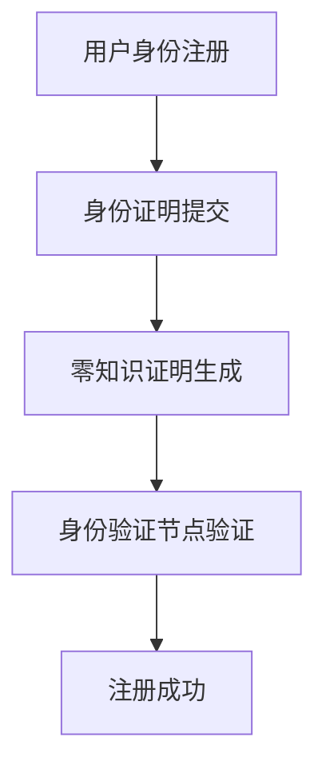
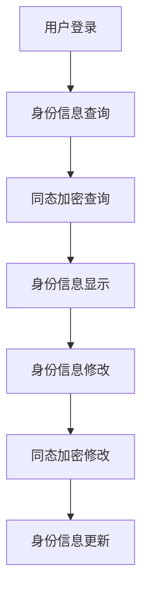
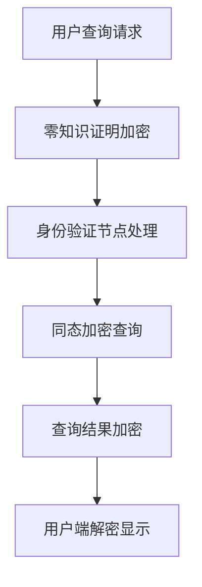

                 

### 引言

在数字化时代，数据已成为新形态的石油，被各行各业视为宝贵的资产。然而，随着数据量的激增和数据隐私问题日益凸显，如何确保数据的安全性和隐私保护成为了亟待解决的问题。数字身份管理作为现代信息技术的重要一环，旨在通过提供统一的身份验证和访问控制机制，确保用户数据的安全性和隐私。区块链技术作为一种分布式账本技术，因其独特的去中心化、透明性、不可篡改等特点，在数字身份管理中展现出巨大的潜力。

**关键词：**
- 区块链
- 数字身份管理
- 隐私保护
- 分布式账本
- 去中心化

**摘要：**
本文将探讨区块链在数字身份管理中的隐私保护应用。首先，我们将介绍区块链技术的基本原理和数字身份管理的重要性。接着，分析隐私保护面临的挑战及其需求，进而探讨区块链在这一领域中的潜在应用。文章还将详细讨论隐私保护机制的原理与实现，包括零知识证明和同态加密技术。随后，我们将分析区块链在数字身份管理中的应用，介绍隐私保护数字身份管理系统的设计与实现。最后，通过案例研究和未来发展趋势的分析，总结区块链在数字身份管理中的隐私保护应用，为相关领域的实践提供参考。

### 第一部分：区块链、数字身份管理与隐私保护概述

#### 1.1.1 区块链技术的基本原理

区块链技术是一种分布式数据库系统，其核心特点包括去中心化、不可篡改和透明性。区块链由一系列按时间顺序排列的数据块组成，每个数据块都包含一定数量的交易记录，并通过加密算法链接在一起，形成一条区块链。区块链中的数据一旦被记录，便无法被篡改或删除，确保了数据的完整性和可靠性。

区块链的基本原理包括以下几个关键组成部分：

1. **分布式账本：** 区块链采用分布式账本技术，数据被分散存储在多个节点上，避免了单点故障和数据丢失的风险。
2. **加密算法：** 区块链使用先进的加密算法（如SHA256）对数据进行加密，确保数据的隐私和安全。
3. **共识算法：** 区块链通过共识算法（如工作量证明、权益证明等）来确保多个节点之间的数据一致性。
4. **智能合约：** 智能合约是区块链上的可编程逻辑，自动执行合同条款，减少中介成本和人为干预。

#### 1.1.2 数字身份管理的重要性

数字身份管理是确保网络空间中个体身份可信性和安全性的关键手段。在数字化时代，个人和组织的数字身份管理面临诸多挑战，包括身份盗用、数据泄露和隐私侵犯等。有效的数字身份管理能够实现以下几点：

1. **身份验证：** 通过多种身份验证方式（如密码、指纹、面部识别等），确保用户身份的真实性和唯一性。
2. **访问控制：** 根据用户的身份和权限，控制对系统和资源的访问，防止未授权访问和数据泄露。
3. **隐私保护：** 通过隐私保护机制，确保用户个人信息不被未经授权的第三方访问和使用。

#### 1.1.3 隐私保护面临的挑战与需求

在数字化环境中，隐私保护面临着诸多挑战：

1. **数据泄露风险：** 随着数据量的增加，数据泄露的风险也随之上升，尤其是敏感信息如个人身份信息、财务数据等。
2. **数据滥用：** 数据收集者可能滥用用户数据，进行市场分析、广告推送等，侵害用户隐私。
3. **法规合规性：** 全球各国对数据隐私保护的法律法规不断更新，企业需要确保其数字身份管理策略符合相关法律法规。

为了应对这些挑战，隐私保护需求愈发迫切：

1. **数据加密：** 使用加密技术保护数据在传输和存储过程中的安全性。
2. **隐私设计：** 在系统设计和开发阶段就考虑隐私保护，采用隐私友好的技术方案。
3. **用户控制：** 提供用户对个人数据的访问控制和权限管理功能，增强用户数据的主权。

#### 1.1.4 区块链在数字身份管理中的潜力

区块链技术在数字身份管理中展现出巨大的潜力：

1. **去中心化身份验证：** 区块链的去中心化特性使得身份验证过程更加高效和可信，避免了单点故障和中介机构。
2. **不可篡改性：** 区块链的不可篡改特性确保了用户身份信息的真实性，减少了身份盗用的风险。
3. **透明性与可追溯性：** 区块链的透明性使得用户可以随时查询身份信息，同时确保信息的可追溯性，有助于追责和纠纷解决。
4. **隐私保护机制：** 区块链结合多种隐私保护技术，如零知识证明和同态加密，提供了强大的隐私保护手段。

总之，区块链技术为数字身份管理提供了全新的解决方案，能够有效提升隐私保护水平，应对数字化时代的挑战。接下来，我们将进一步探讨隐私保护机制的原理与实现，以及区块链在数字身份管理中的应用。

#### 1.2 隐私保护机制的原理与实现

在数字身份管理中，隐私保护是至关重要的一环。随着数据隐私问题的日益凸显，传统的加密技术已无法完全满足需求。区块链结合多种隐私保护机制，提供了更加安全可靠的解决方案。本节将详细介绍两种核心隐私保护机制：零知识证明和同态加密。

##### 1.2.1 零知识证明技术

零知识证明（Zero-Knowledge Proof）是一种密码学技术，它允许一方（证明者）向另一方（验证者）证明某个陈述是真实的，而无需透露任何具体信息。零知识证明的核心思想是，证明者能够证明自己知道某个秘密，但不泄露该秘密的具体内容。

**定义：**
零知识证明是一种密码协议，其中证明者能够证明某件事情是真实的，而无需透露任何有关这件事情的信息。

**数学基础：**
零知识证明依赖于数学上的复杂问题，如离散对数问题和大整数分解问题。常见的零知识证明系统包括基于椭圆曲线密码学的Paillier加密和基于离散对数问题的Cramer-Shoup加密。

**应用：**
零知识证明技术在数字身份管理中具有广泛的应用。例如，它可以用于身份验证过程，用户无需透露密码或身份信息，只需提供零知识证明即可证明自己的身份。这种技术也适用于匿名交易，确保交易参与者身份的隐私性。

**案例：**
以太坊上的去中心化身份验证（DID）协议就采用了零知识证明技术，用户可以在不泄露个人信息的情况下完成身份验证，增强了系统的安全性和隐私保护。

##### 1.2.2 同态加密技术

同态加密（Homomorphic Encryption）是一种加密技术，它允许在加密数据上执行计算，而不需要解密数据。这意味着，加密数据可以像普通数据一样进行操作，从而在数据加密的同时保证数据的隐私和完整性。

**定义：**
同态加密是一种加密形式，允许在密文上执行计算，并得到原始数据的计算结果，而不需要解密。

**工作原理：**
同态加密的核心在于构建一个加密算法，使得在密文空间中执行的操作与在明文空间中执行的操作一致。常见的同态加密方案包括基于多变量多项式的RSA加密和基于理想格的NTRU加密。

**应用场景：**
同态加密在医疗数据管理、金融交易处理等领域具有广泛的应用。例如，在医疗数据管理中，医生可以在不泄露患者隐私的情况下分析患者数据，从而提高医疗服务的质量。

**案例：**
谷歌的Sapphire项目就采用了同态加密技术，使得医生可以在加密的患者数据上执行数据分析，提高了医疗数据的安全性。

##### 1.2.3 零知识证明与同态加密对比

| 对比项            | 零知识证明                               | 同态加密                         |
|-------------------|----------------------------------------|----------------------------------|
| 基本原理          | 证明某事是真实的，不透露具体信息         | 在加密数据上执行计算，得到明文结果 |
| 加密方式          | 非对称加密                              | 对称加密                         |
| 加密数据大小      | 较大，需要额外的空间存储证明信息          | 较小，直接在加密数据上操作         |
| 加密速度          | 较慢，因为需要多次加密和验证             | 较快，计算效率较高                 |
| 适用场景          | 身份验证、匿名交易、隐私保护             | 数据分析、云计算、医疗数据管理     |

总之，零知识证明和同态加密是两种重要的隐私保护机制，它们在数字身份管理中发挥着关键作用。通过结合这两种技术，区块链能够提供更加全面和强大的隐私保护解决方案，为数字身份管理带来了新的可能性。

### 1.3 区块链在数字身份管理中的应用

区块链技术在数字身份管理中具有广泛的应用，其核心优势在于去中心化、不可篡改、透明性和可追溯性。以下将详细分析区块链在数字身份管理中的作用，包括数据不可篡改、数据透明性和可追溯性等方面。

#### 1.3.1 数据的不可篡改

区块链技术的一个重要特性是数据的不可篡改。在区块链中，每个数据块都包含一定数量的交易记录，并且每个数据块通过加密算法与前一个数据块链接在一起，形成一条连续的区块链。这种链接方式使得任何对数据的篡改都会被区块链上的其他节点发现并拒绝。

**不可篡改的特性确保了数字身份信息的真实性。** 在传统的身份管理系统中，身份信息容易受到篡改和伪造，因为中心化的数据库容易成为黑客攻击的目标。而区块链的去中心化特性使得篡改数据变得极为困难，提高了身份信息的可信度。

**案例：** 在医疗领域，区块链技术被用于存储患者的健康记录。这些记录一旦被写入区块链，便无法被篡改或删除，确保了医疗信息的真实性和完整性。

#### 1.3.2 数据的透明性

区块链的透明性是指所有交易记录和身份信息都可以在区块链上进行公开查询，但同时又保持用户隐私。这种透明性有助于提升系统的透明度和公信力，使得用户能够清楚地了解自己的身份信息是如何被管理和使用的。

**数据透明性增强了用户对数字身份管理的信任。** 在传统的身份管理系统中，用户往往无法得知自己的信息是如何被处理的，容易对系统的安全性和隐私保护产生疑虑。而区块链的透明性使得用户可以随时随地查询自己的身份信息，提高了用户对系统的信任度。

**案例：** 在供应链管理中，区块链技术被用于记录产品的来源、加工和运输等信息。这些信息在区块链上公开透明，消费者可以随时查询，确保了产品的真实性和可信度。

#### 1.3.3 数据的可追溯性

区块链的不可篡改性和透明性使得数据具有高度的可追溯性。用户可以通过区块链查询身份信息的整个生命周期，包括创建、修改和删除等操作。

**数据可追溯性有助于追责和纠纷解决。** 在传统的身份管理系统中，一旦发生身份信息泄露或滥用，很难追溯责任。而区块链的可追溯性使得任何身份信息操作都可以被记录和查询，有助于发现和处理问题。

**案例：** 在金融领域，区块链技术被用于记录交易历史。一旦发生欺诈或纠纷，可以通过区块链查询交易的全过程，明确责任方，提高了金融交易的安全性和可信度。

#### 1.3.4 去中心化身份验证

区块链的去中心化特性使得身份验证过程更加高效和可信。在传统的身份验证系统中，身份验证通常依赖于中心化的身份认证机构，存在单点故障和信任风险。而区块链的去中心化身份验证通过分布式节点之间的共识机制，确保了身份验证的可靠性和安全性。

**去中心化身份验证提高了系统的可靠性和灵活性。** 在区块链上，每个节点都可以进行身份验证，不存在单点故障的风险。同时，去中心化的身份验证机制也使得身份信息更加灵活，用户可以自由选择信任的节点进行验证。

**案例：** 在数字身份验证平台中，区块链技术被用于创建去中心化的身份验证系统。用户可以通过多个节点进行身份验证，确保了系统的可靠性和安全性。

总之，区块链技术在数字身份管理中发挥着重要作用，通过数据的不可篡改、透明性和可追溯性，为数字身份管理带来了新的可能性。随着技术的不断发展和应用场景的拓展，区块链在数字身份管理领域的潜力将得到进一步发挥。

### 1.4 隐私保护数字身份管理系统的设计与实现

在数字身份管理中，隐私保护是确保用户数据安全的关键。区块链技术因其去中心化、不可篡改和透明性等特点，为实现隐私保护数字身份管理系统提供了有力支持。以下将详细介绍隐私保护数字身份管理系统的设计与实现过程。

#### 1.4.1 系统需求分析

在设计隐私保护数字身份管理系统之前，我们需要明确系统的主要需求和功能。以下是该系统的主要需求：

1. **身份验证与授权：** 系统应提供高效的身份验证机制，确保用户身份的真实性和唯一性。同时，应实现灵活的授权管理，根据用户角色和权限控制对系统资源的访问。
2. **隐私保护：** 系统需采用多种隐私保护技术，确保用户身份信息和操作隐私不被泄露。主要包括零知识证明和同态加密技术。
3. **数据不可篡改：** 系统应确保存储在区块链上的用户数据和操作记录具有不可篡改性，防止数据被篡改或删除。
4. **透明性与可追溯性：** 系统应实现数据透明性，用户可以查询和验证自己的身份信息和操作记录。同时，确保数据的可追溯性，方便追责和纠纷解决。
5. **去中心化：** 系统应采用去中心化架构，确保数据的存储和验证过程不受单点故障影响，提高系统的可靠性和安全性。

#### 1.4.2 系统架构设计

隐私保护数字身份管理系统的架构设计主要包括区块链架构设计和隐私保护机制集成两部分。

**1. 区块链架构设计：**

系统采用分布式区块链架构，包括以下关键组件：

- **区块链网络：** 系统采用公有链或联盟链，由多个节点组成。每个节点负责存储和验证数据。
- **身份验证节点：** 负责身份验证和授权管理，确保用户身份信息的真实性和唯一性。
- **数据处理节点：** 负责处理用户身份信息和操作记录，确保数据的透明性和可追溯性。
- **隐私保护节点：** 负责实现零知识证明和同态加密技术，保护用户隐私。

**2. 隐私保护机制集成：**

系统将零知识证明和同态加密技术集成到区块链架构中，实现隐私保护功能。具体包括：

- **零知识证明集成：** 用户在注册和身份验证过程中，采用零知识证明技术证明身份信息，无需透露具体信息。
- **同态加密集成：** 在数据存储和处理过程中，采用同态加密技术对数据进行加密，确保数据隐私。
- **隐私保护合约：** 在智能合约中集成隐私保护机制，确保数据的存储和验证过程符合隐私保护要求。

#### 1.4.3 系统功能实现

隐私保护数字身份管理系统的主要功能包括用户身份注册与验证、身份信息管理与授权、隐私保护机制应用等。

**1. 用户身份注册与验证：**

用户在系统中进行身份注册时，需要提供身份证明和验证信息。系统采用零知识证明技术，用户无需透露具体身份信息，即可证明身份信息的真实性。

**2. 身份信息管理与授权：**

系统为用户提供身份信息管理功能，包括查看、修改和删除身份信息。系统通过同态加密技术对用户身份信息进行加密存储，确保隐私保护。

**3. 隐私保护机制应用：**

系统在数据处理和传输过程中，采用零知识证明和同态加密技术，确保用户隐私。具体应用包括：

- **数据查询与验证：** 用户在查询身份信息时，系统采用同态加密技术对数据查询请求进行加密处理，确保隐私。
- **数据存储与加密：** 系统将用户身份信息存储在区块链上，采用同态加密技术进行加密，确保数据隐私。
- **数据传输与加密：** 系统在数据传输过程中，采用零知识证明技术对数据传输请求进行加密，确保隐私。

总之，隐私保护数字身份管理系统通过区块链技术和隐私保护机制的集成，实现了高效、安全、可靠的数字身份管理。随着技术的不断发展和应用场景的拓展，该系统将在更多领域发挥重要作用。

### 1.5 区块链数字身份管理案例研究

为了更好地理解区块链在数字身份管理中的应用，我们通过以下案例来分析区块链技术在数字身份管理中的实际实施过程、效果评估和总结启示。

#### 1.5.1 案例背景

某知名金融机构在数字化转型的过程中，面临着数字身份管理的一系列挑战。传统的身份验证方式由于依赖于中心化的身份认证机构，容易受到黑客攻击和数据泄露的风险。此外，客户对于数据隐私的担忧也日益增加，传统的身份管理方式无法满足客户对隐私保护的需求。为了解决这些问题，该金融机构决定采用区块链技术来实现去中心化的数字身份管理。

#### 1.5.2 案例分析

**1. 系统架构设计：**

金融机构采用了分布式区块链架构，包括以下关键组件：

- **区块链网络：** 系统采用联盟链，由多个金融机构节点组成，每个节点负责存储和验证数据。
- **身份验证节点：** 负责身份验证和授权管理，确保用户身份信息的真实性和唯一性。
- **数据处理节点：** 负责处理用户身份信息和操作记录，确保数据的透明性和可追溯性。
- **隐私保护节点：** 负责实现零知识证明和同态加密技术，保护用户隐私。

**2. 隐私保护机制集成：**

系统集成了零知识证明和同态加密技术，具体应用如下：

- **零知识证明集成：** 用户在注册和身份验证过程中，采用零知识证明技术证明身份信息，无需透露具体信息。
- **同态加密集成：** 在数据存储和处理过程中，采用同态加密技术对数据进行加密，确保数据隐私。

**3. 系统功能实现：**

系统实现了以下主要功能：

- **用户身份注册与验证：** 用户在系统中进行身份注册时，采用零知识证明技术进行身份验证，确保用户身份的真实性和唯一性。
- **身份信息管理与授权：** 系统为用户提供身份信息管理功能，包括查看、修改和删除身份信息，同时采用同态加密技术保护用户隐私。
- **数据透明性与可追溯性：** 系统确保数据在区块链上透明存储和验证，用户可以随时查询自己的身份信息和操作记录。

#### 1.5.3 案例实施与效果评估

**1. 实施过程：**

金融机构在实施区块链数字身份管理系统的过程中，遵循以下步骤：

- **需求分析与设计：** 明确系统需求，设计系统架构和功能模块。
- **技术选型与开发：** 选择适合的区块链平台和隐私保护技术，进行系统开发。
- **测试与部署：** 进行系统测试，确保系统稳定运行，并进行部署上线。

**2. 效果评估：**

实施区块链数字身份管理系统后，金融机构取得了以下效果：

- **安全性提升：** 通过区块链和隐私保护技术的应用，用户身份信息的安全性大幅提升，减少了数据泄露和篡改的风险。
- **用户体验改善：** 用户无需再频繁提供身份信息，简化了身份验证过程，提高了用户满意度。
- **监管合规性：** 系统的透明性和可追溯性满足了监管要求，提高了金融机构的合规性。
- **运营效率提高：** 通过去中心化的身份管理，降低了运营成本，提高了运营效率。

#### 1.5.4 案例总结与启示

通过该案例，我们可以得出以下总结和启示：

1. **区块链技术为数字身份管理提供了安全可靠的解决方案。** 通过去中心化、不可篡改和隐私保护特性，区块链技术能够有效提升数字身份管理系统的安全性。
2. **隐私保护机制是数字身份管理的核心。** 零知识证明和同态加密技术的应用，确保了用户身份信息和操作隐私的保护，提高了用户体验和满意度。
3. **透明性和可追溯性是数字身份管理的重要特性。** 系统的透明性和可追溯性不仅提高了系统的公信力，也为监管合规和纠纷解决提供了有力支持。
4. **实施区块链数字身份管理系统需要全面考虑技术选型、系统架构设计、功能实现和测试部署等方面。** 只有确保系统设计的科学合理，才能充分发挥区块链技术的优势。

总之，区块链数字身份管理系统在金融机构的实际应用中取得了显著效果，为数字身份管理提供了新的思路和方向。随着技术的不断发展和应用场景的拓展，区块链在数字身份管理领域的潜力将得到进一步发挥。

### 1.6 隐私保护数字身份管理的法律法规与标准

在数字身份管理中，隐私保护不仅是技术问题，也是法律和道德问题。各国政府和国际组织为了保护用户隐私，制定了一系列法律法规和标准，要求企业在数字身份管理中严格遵守。以下将介绍隐私保护数字身份管理的相关法律法规、标准，以及区块链数字身份管理合规性挑战与对策。

#### 1.6.1 隐私保护法律法规概述

全球范围内，许多国家和地区已经制定了旨在保护个人隐私和数据安全的法律法规。以下是一些主要的隐私保护法律法规：

1. **欧盟通用数据保护条例（GDPR）：** GDPR是欧盟制定的最重要的数据保护法律法规，旨在加强对个人数据的保护。它要求企业在处理个人数据时必须获得明确同意、提供透明处理流程、确保数据安全等。
2. **美国加州消费者隐私法案（CCPA）：** CCPA旨在加强消费者对个人信息的控制权，要求企业公开收集、使用、共享和销售消费者个人数据的方式，并给予消费者拒绝销售自己数据的权利。
3. **中国个人信息保护法（PIPL）：** PIPL是我国制定的个人信息保护基础性法律，旨在规范个人信息处理活动，保护个人信息权益，促进个人信息合理利用。
4. **巴西通用数据保护法律（LGPD）：** LGPD是巴西制定的隐私保护法律，旨在规范个人数据处理行为，确保个人信息安全和隐私保护。

#### 1.6.2 数字身份管理的标准与规范

除了法律法规，数字身份管理也有相应的标准和规范，以指导企业和机构实施隐私保护数字身份管理。以下是一些重要的标准和规范：

1. **ISO/IEC 27001：** ISO/IEC 27001是一个国际标准，旨在提供信息安全管理体系（ISMS）的要求，确保组织能够保护信息资产。
2. **OAuth 2.0：** OAuth 2.0是一个开放标准，用于授权第三方应用访问用户资源，确保授权过程中的安全性。
3. **OpenID Connect：** OpenID Connect是基于OAuth 2.0协议的认证和授权标准，用于简化用户身份验证和授权流程。
4. **FIDO（Fast Identity Online）：** FIDO标准提供了一种无密码的身份验证方法，通过生物识别技术和公共密钥基础设施（PKI）实现安全的身份验证。

#### 1.6.3 区块链数字身份管理合规性挑战与对策

区块链数字身份管理在合规性方面面临一些挑战，主要包括以下几个方面：

1. **数据存储与访问控制：** 区块链上的数据存储和访问控制需要符合相关法律法规，例如GDPR和PIPL。在数据存储方面，需确保用户数据匿名化和数据最小化原则，以减少隐私风险。在访问控制方面，需实现严格的权限管理，确保只有授权用户可以访问特定数据。
2. **隐私保护技术选择：** 区块链数字身份管理需要选择合适的隐私保护技术，如零知识证明和同态加密，确保用户隐私不被泄露。同时，技术选择应符合相关法律法规和标准，如ISO/IEC 27001和FIDO标准。
3. **跨境数据传输：** 区块链的分布式特性可能导致数据跨境传输，这在某些国家可能被视为隐私泄露风险。为解决这一挑战，企业需要了解和遵守不同国家和地区的数据传输法规，采取数据本地化策略，确保数据传输的合规性。
4. **用户同意与透明度：** 区块链数字身份管理需要确保用户对数据处理的知情权和选择权。企业需提供清晰的隐私政策，确保用户在注册和使用过程中明确了解数据处理方式和隐私保护措施。
5. **监管合规性：** 企业在实施区块链数字身份管理时，需密切关注相关法律法规的变化，确保系统设计和运营符合最新法规要求。同时，企业可以主动与监管机构沟通，争取合规指导和支持。

总之，隐私保护数字身份管理在法律法规和标准方面有明确的规范和要求。区块链数字身份管理在合规性方面面临一定挑战，但通过合理的技术选择、数据管理策略和合规性措施，可以确保系统的合法性和安全性。随着技术的不断发展和法规的完善，区块链数字身份管理将在合规性方面取得更好的发展。

### 1.7 区块链数字身份管理未来的发展趋势

区块链技术作为一项颠覆性的创新，正逐渐渗透到各个行业，为数字身份管理带来了前所未有的机遇。随着区块链技术的不断成熟和应用场景的拓展，区块链数字身份管理在未来将呈现以下几个发展趋势：

#### 1.7.1 技术发展趋势

**1. 多链协作与互操作性：** 随着区块链生态的多元化发展，未来将出现多个区块链平台之间的协作与互操作性。通过多链协作，可以实现不同区块链网络之间的数据共享和身份验证，提高系统的灵活性和扩展性。

**2. 零知识证明的普及：** 零知识证明作为一种高效的隐私保护技术，将在区块链数字身份管理中更加普及。未来，零知识证明将被广泛应用于身份验证、交易隐私和跨链协作等方面，提高系统的隐私保护水平。

**3. 同态加密技术的进步：** 同态加密技术在未来将继续发展，计算效率和应用范围将逐步提高。随着同态加密技术的进步，区块链数字身份管理将在医疗数据管理、金融交易处理等领域发挥更大作用。

**4. 联盟链的广泛应用：** 与公有链相比，联盟链在隐私保护、性能和可扩展性方面具有明显优势。未来，联盟链将在数字身份管理中广泛应用，为不同组织和企业之间的身份验证和数据共享提供安全可靠的解决方案。

#### 1.7.2 应用领域扩展

**1. 消费者领域：** 区块链数字身份管理将在消费者领域得到广泛应用，例如电商、社交媒体和在线金融服务等。用户可以通过区块链实现身份验证，简化登录流程，同时确保个人信息的安全和隐私。

**2. 企业领域：** 区块链数字身份管理在企业管理中的应用也将逐渐扩大，包括员工身份认证、供应链管理和客户关系管理等方面。企业可以通过区块链实现高效的身份验证和授权管理，提高运营效率和降低成本。

**3. 公共服务领域：** 区块链数字身份管理在公共服务领域具有巨大潜力，如电子政务、医疗健康和教育等。通过区块链技术，可以实现跨部门的数据共享和身份验证，提高公共服务的透明性和可信度。

**4. 金融领域：** 区块链数字身份管理在金融领域具有广泛应用前景，包括跨境支付、数字货币和金融科技等。通过区块链技术，可以实现高效、安全的身份验证和交易处理，提高金融服务的质量和效率。

#### 1.7.3 面临的挑战与机遇

**1. 挑战：** 

- **技术成熟度：** 虽然区块链技术具有巨大潜力，但当前的技术成熟度仍需提升，尤其是在计算效率、隐私保护和互操作性等方面。
- **法律法规：** 区块链数字身份管理在法律法规方面仍存在一定的不确定性，需要各方共同努力制定和完善相关法规。
- **用户接受度：** 区块链技术的普及和应用需要用户的广泛接受和信任，这需要通过教育和宣传来提高用户的认知和理解。

**2. 机遇：**

- **技术创新：** 区块链技术的不断发展和创新为数字身份管理带来了新的机遇，例如多链协作、零知识证明和同态加密技术的应用。
- **市场需求：** 随着数字化转型的加速，企业和个人对数字身份管理的需求日益增加，区块链技术能够提供安全、高效和可信赖的解决方案。
- **国际合作：** 区块链数字身份管理在全球范围内具有巨大的合作空间，各国和组织可以通过国际合作，共同推动区块链技术的发展和应用。

总之，区块链数字身份管理在未来将面临一系列挑战，但同时也将迎来广阔的发展机遇。通过技术创新、法律法规完善和国际合作，区块链数字身份管理将在更多领域发挥重要作用，为数字社会的安全、透明和高效运营提供有力支持。

### 结束语

区块链技术在数字身份管理中的应用，不仅为隐私保护提供了新的解决方案，还为数字社会的安全与透明奠定了基础。本文通过详细的论述和案例分析，展示了区块链在数字身份管理中的巨大潜力。从基本原理到具体实现，从法律法规到未来趋势，本文全面解析了区块链数字身份管理的各个方面。

**最佳实践建议：**
1. **选择合适的区块链平台：** 根据业务需求和性能要求，选择适合的区块链平台，确保系统的稳定性和可扩展性。
2. **注重隐私保护机制的应用：** 在数字身份管理系统中，结合零知识证明和同态加密技术，提高用户隐私保护水平。
3. **加强合规性管理：** 遵守相关法律法规和标准，确保系统的合法性和合规性。
4. **用户教育与宣传：** 通过教育和宣传，提高用户对区块链数字身份管理的认知和理解，增强用户信任。

**注意事项：**
1. **技术成熟度：** 区块链技术仍处于快速发展阶段，需要密切关注技术动态，确保系统技术选型的前瞻性和实用性。
2. **数据安全与隐私：** 在设计数字身份管理系统时，必须重视数据安全与隐私保护，采取多重措施确保用户数据的安全。
3. **性能优化：** 区块链系统的性能和可扩展性是关键，需要通过优化网络架构和技术方案，提高系统的处理能力和响应速度。

**拓展阅读：**
1. 《区块链：从概念到实践》
2. 《数字身份管理：理论与实践》
3. 《区块链技术与应用》

本文旨在为区块链数字身份管理的实践提供指导和建议，帮助读者更好地理解和应用这一技术。在未来的数字化时代，区块链数字身份管理将继续发挥重要作用，为我们的数字生活带来更多便利和安全。希望本文能对您的研究和实践有所启发和帮助。作者：AI天才研究院/AI Genius Institute & 禅与计算机程序设计艺术 /Zen And The Art of Computer Programming。

