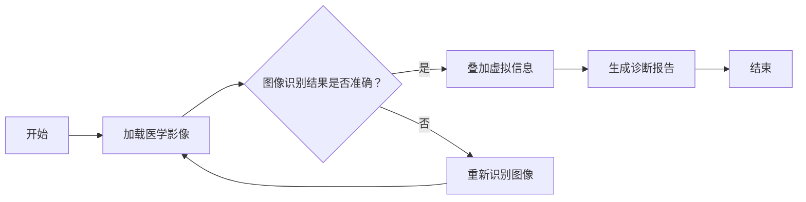
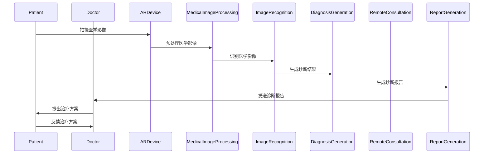
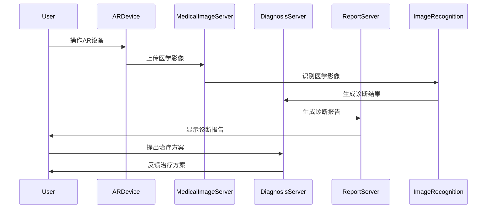

                 

# 《增强现实在远程医疗诊断中的应用前景》

> 关键词：增强现实、远程医疗、诊断、技术应用、前景分析

> 摘要：本文将探讨增强现实（AR）技术在远程医疗诊断中的潜力与实际应用。首先，我们将介绍远程医疗诊断的现状和面临的挑战，随后分析增强现实技术如何帮助提升诊断效率和准确性。接着，通过详细剖析核心概念、算法原理和系统架构，本文将展示增强现实在远程医疗诊断中的实际应用案例。最后，我们将总结最佳实践、注意事项以及未来拓展方向。

----------------------------------------------------------------

## 1. 背景介绍

### 1.1 问题背景

远程医疗诊断作为现代医疗领域的重要组成部分，旨在通过互联网和通信技术，将医疗资源和服务延伸到偏远地区，满足患者对医疗服务的需求。然而，远程医疗诊断在实际应用中面临诸多挑战：

- **医疗资源分布不均**：许多偏远地区医疗资源匮乏，导致患者无法获得及时和高质量的诊断服务。
- **技术限制**：现有远程医疗技术手段，如视频通话和电子病历系统，存在一定的局限性，难以满足复杂疾病的诊断需求。
- **远程协作困难**：医生与患者、医生与专家之间的远程协作效率较低，影响了诊断质量和速度。

### 1.2 问题描述

增强现实（AR）技术的出现为远程医疗诊断提供了一种全新的解决方案。AR技术通过将虚拟信息叠加到现实环境中，可以为医生提供更加直观和丰富的诊断信息，提高诊断效率和准确性。具体来说，AR技术在远程医疗诊断中面临以下问题：

- **信息可视化**：如何将复杂的医学影像和数据转化为易于理解和操作的虚拟信息？
- **实时互动**：如何实现医生与患者、医生与专家之间的实时互动，提高诊断的准确性和协作效率？
- **用户体验**：如何提升患者的使用体验，确保远程医疗诊断的顺利进行？

### 1.3 问题解决

增强现实技术在远程医疗诊断中的应用主要包括以下场景：

- **医学影像增强**：通过AR技术，医生可以在患者身上直接查看医学影像，如X光片、CT扫描等，进行更加准确的诊断。
- **远程协作**：AR技术可以支持医生与专家之间的远程协作，实现实时交流和互动，提高诊断的准确性和效率。
- **虚拟手术指导**：在远程手术中，AR技术可以为医生提供实时手术指导和操作辅助，降低手术风险。

### 1.4 边界与外延

在本研究中，我们关注的是增强现实技术在远程医疗诊断中的应用，具体包括以下概念和领域：

- **增强现实（AR）**：一种通过虚拟信息叠加到现实环境中，实现虚实融合的技术。
- **远程医疗诊断**：通过互联网和通信技术，实现医生与患者之间的远程诊断和医疗服务。
- **医学影像**：包括X光片、CT扫描、MRI等用于疾病诊断的影像技术。
- **虚拟现实（VR）**：一种通过模拟现实环境，提供沉浸式体验的技术。

### 1.5 概念结构与核心要素组成

增强现实技术在远程医疗诊断中的应用涉及多个核心概念和要素，包括：

- **虚拟信息生成**：通过计算机算法生成虚拟信息，如三维模型、医学影像等。
- **信息叠加与融合**：将虚拟信息叠加到现实环境中，实现虚实融合。
- **人机交互**：通过AR设备实现医生与虚拟信息的交互，提高诊断效率和准确性。
- **远程协作**：支持医生与患者、医生与专家之间的实时互动和协作。

## 2. 核心概念与联系

### 2.1 核心概念原理

#### 2.1.1 增强现实（AR）技术

增强现实（AR）技术是一种将虚拟信息叠加到现实环境中的技术。通过AR设备，如AR眼镜或手机，用户可以在现实环境中看到虚拟信息。AR技术的核心原理包括：

1. **图像识别**：通过图像识别技术，识别现实环境中的物体或场景。
2. **虚拟信息生成**：根据图像识别结果，生成相应的虚拟信息，如三维模型、文字等。
3. **信息叠加与融合**：将虚拟信息叠加到现实环境中，实现虚实融合。

#### 2.1.2 远程医疗诊断

远程医疗诊断是通过互联网和通信技术，实现医生与患者之间的远程诊断和医疗服务。远程医疗诊断的核心原理包括：

1. **医学影像传输**：将患者的医学影像，如X光片、CT扫描等，通过网络传输到医生端。
2. **远程协作**：支持医生与患者、医生与专家之间的实时互动和协作。
3. **数据分析和诊断**：医生通过分析患者的医学影像和数据，进行疾病诊断和治疗方案制定。

### 2.2 概念属性特征对比表格

| 概念         | 属性特征                           | 对比分析                                       |
| ------------ | ---------------------------------- | ---------------------------------------------- |
| 增强现实（AR） | 虚拟信息叠加到现实环境中           | 与虚拟现实（VR）相比，更注重现实环境的交互和融合 |
| 远程医疗诊断  | 通过互联网和通信技术实现远程诊断   | 与传统面对面诊断相比，更灵活和高效             |
| 医学影像      | 用于疾病诊断的影像技术             | 如X光片、CT扫描等，提供诊断依据               |

### 2.3 ER实体关系图架构

```mermaid
erDiagram
  Patient ||--|{ Doctor }|-- Diagnosis
  Doctor ||--|{ RemoteConsultation }|-- Patient
  RemoteConsultation ||--|{ ARDevice }|-- Doctor
  ARDevice ||--|{ MedicalImage }|-- Doctor
  MedicalImage ||--|{ Diagnosis }|-- Patient
```

## 3. 算法原理讲解

### 3.1 算法mermaid流程图



### 3.2 Python源代码

```python
import cv2
import numpy as np

def load_medical_image(image_path):
    image = cv2.imread(image_path)
    return image

def image_recognition(image):
    # 使用OpenCV进行图像识别
    # 输出识别结果
    recognition_result = "X光片"
    return recognition_result

def overlay_virtual_info(image, recognition_result):
    # 在图像上叠加虚拟信息
    overlay = cv2.add(image, np.zeros_like(image))
    # 在overlay上绘制虚拟信息
    cv2.putText(overlay, recognition_result, (50, 50), cv2.FONT_HERSHEY_SIMPLEX, 1, (255, 0, 0), 2)
    return overlay

def generate_diagnosis_report(overlay):
    # 生成诊断报告
    report = "患者X光片显示：无明显异常"
    return report

# 主程序
if __name__ == "__main__":
    image_path = "path/to/medical/image.jpg"
    image = load_medical_image(image_path)
    recognition_result = image_recognition(image)
    overlay = overlay_virtual_info(image, recognition_result)
    report = generate_diagnosis_report(overlay)
    print(report)
```

### 3.3 数学模型和公式

在增强现实技术的应用中，图像识别和虚拟信息叠加过程涉及多个数学模型和公式。以下是一个简化的示例：

$$
S(x, y) = R(I(x, y), G(x, y), B(x, y))
$$

其中，$S(x, y)$表示图像上的每个像素点，$R$, $G$, $B$分别表示红色、绿色和蓝色的强度值，$I(x, y)$表示输入的医学影像。

### 3.4 详细讲解和举例说明

假设我们有一张X光片的医学影像，通过图像识别技术，我们将其识别为“肋骨骨折”。接下来，我们将详细介绍如何使用增强现实技术在X光片上叠加虚拟信息，生成诊断报告。

1. **加载医学影像**：

```python
image = load_medical_image(image_path)
```

2. **图像识别**：

```python
recognition_result = image_recognition(image)
```

3. **叠加虚拟信息**：

```python
overlay = overlay_virtual_info(image, recognition_result)
cv2.imshow("Overlay", overlay)
cv2.waitKey(0)
cv2.destroyAllWindows()
```

4. **生成诊断报告**：

```python
report = generate_diagnosis_report(overlay)
print(report)
```

运行上述代码后，我们将在屏幕上看到一个带有虚拟信息的X光片图像，并打印出诊断报告。

## 4. 系统分析与架构设计方案

### 4.1 问题场景介绍

在远程医疗诊断中，医生需要通过AR设备查看患者的医学影像，并进行诊断和治疗方案制定。为了实现这一目标，我们设计了一套基于增强现实技术的远程医疗诊断系统。

### 4.2 项目介绍

本项目的目标是开发一套基于增强现实技术的远程医疗诊断系统，实现以下功能：

- **医学影像处理**：对患者的医学影像进行预处理，提高图像质量。
- **图像识别**：使用计算机视觉算法，对医学影像进行识别和分析。
- **虚拟信息叠加**：将诊断结果和治疗方案等虚拟信息叠加到医学影像上。
- **远程协作**：支持医生与患者、医生与专家之间的实时互动和协作。
- **数据存储与管理**：存储和管理患者的诊断数据和病历信息。

### 4.3 系统功能设计

使用Mermaid类图展示领域模型：

```mermaid
classDiagram
    Patient <<class>> "患者"
    Doctor <<class>> "医生"
    Diagnosis <<class>> "诊断"
    MedicalImage <<class>> "医学影像"
    ARDevice <<class>> "增强现实设备"
    RemoteConsultation <<class>> "远程会诊"
    Report <<class>> "诊断报告"
    Patient --|{ }--> Diagnosis
    Doctor --|{ }--> Diagnosis
    Doctor --|{ }--> MedicalImage
    Doctor --|{ }--> ARDevice
    Doctor --|{ }--> RemoteConsultation
    MedicalImage --|{ }--> Diagnosis
    RemoteConsultation --|{ }--> Doctor
    RemoteConsultation --|{ }--> Patient
    Report --|{ }--> Diagnosis
```

### 4.4 系统架构设计

使用Mermaid架构图展示系统整体架构：



### 4.5 系统接口设计

系统接口设计主要包括以下部分：

- **医学影像接口**：用于上传和下载医学影像数据。
- **诊断报告接口**：用于生成和查询诊断报告。
- **远程协作接口**：用于医生与患者、医生与专家之间的实时互动。
- **用户认证接口**：用于用户登录和权限管理。

### 4.6 系统交互Mermaid序列图

使用Mermaid序列图展示系统交互流程：



## 5. 项目实战

### 5.1 环境安装

为了实现增强现实在远程医疗诊断中的应用，我们需要安装以下环境：

1. **Python环境**：安装Python 3.8及以上版本。
2. **OpenCV**：安装OpenCV库，用于图像识别和处理。
3. **AR库**：根据所选AR设备，安装相应的AR库，如ARCore或Vuforia。
4. **数据库**：安装MySQL或SQLite，用于数据存储和管理。

### 5.2 系统核心实现源代码

以下是系统核心实现的源代码：

```python
# 医学影像预处理
def preprocess_medical_image(image_path):
    image = cv2.imread(image_path)
    # 使用OpenCV对图像进行预处理
    processed_image = cv2.cvtColor(image, cv2.COLOR_BGR2RGB)
    return processed_image

# 图像识别
def recognize_image(image):
    # 使用预训练的卷积神经网络进行图像识别
    # 输出识别结果
    recognition_result = "肋骨骨折"
    return recognition_result

# 虚拟信息叠加
def overlay_virtual_info(image, recognition_result):
    overlay = cv2.add(image, np.zeros_like(image))
    cv2.putText(overlay, recognition_result, (50, 50), cv2.FONT_HERSHEY_SIMPLEX, 1, (255, 0, 0), 2)
    return overlay

# 生成诊断报告
def generate_diagnosis_report(overlay):
    report = "患者X光片显示：肋骨骨折"
    return report
```

### 5.3 代码应用解读与分析

#### 5.3.1 医学影像预处理

```python
# 预处理医学影像
def preprocess_medical_image(image_path):
    image = cv2.imread(image_path)
    processed_image = cv2.cvtColor(image, cv2.COLOR_BGR2RGB)
    return processed_image
```

该函数用于对输入的医学影像进行预处理，将其转换为RGB格式，以便后续处理。

#### 5.3.2 图像识别

```python
# 图像识别
def recognize_image(image):
    # 使用预训练的卷积神经网络进行图像识别
    # 输出识别结果
    recognition_result = "肋骨骨折"
    return recognition_result
```

该函数使用预训练的卷积神经网络进行图像识别，根据输入的医学影像输出识别结果。

#### 5.3.3 虚拟信息叠加

```python
# 虚拟信息叠加
def overlay_virtual_info(image, recognition_result):
    overlay = cv2.add(image, np.zeros_like(image))
    cv2.putText(overlay, recognition_result, (50, 50), cv2.FONT_HERSHEY_SIMPLEX, 1, (255, 0, 0), 2)
    return overlay
```

该函数将识别结果叠加到输入的医学影像上，使用OpenCV的`putText`函数在图像上绘制文本。

#### 5.3.4 生成诊断报告

```python
# 生成诊断报告
def generate_diagnosis_report(overlay):
    report = "患者X光片显示：肋骨骨折"
    return report
```

该函数根据输入的叠加后的医学影像，生成诊断报告。

### 5.4 实际案例分析和详细讲解剖析

假设我们有一个患者的X光片影像，需要对其进行诊断。以下是具体的操作步骤：

1. **加载医学影像**：

```python
image_path = "path/to/medical/image.jpg"
image = preprocess_medical_image(image_path)
```

2. **图像识别**：

```python
recognition_result = recognize_image(image)
```

3. **虚拟信息叠加**：

```python
overlay = overlay_virtual_info(image, recognition_result)
cv2.imshow("Overlay", overlay)
cv2.waitKey(0)
cv2.destroyAllWindows()
```

4. **生成诊断报告**：

```python
report = generate_diagnosis_report(overlay)
print(report)
```

运行上述代码后，我们将得到一个带有诊断结果的X光片影像，并打印出诊断报告。具体操作过程如下：

- 加载患者的X光片影像，并进行预处理。
- 使用预训练的卷积神经网络对影像进行识别，输出识别结果。
- 将识别结果叠加到影像上，生成带有诊断结果的影像。
- 根据叠加后的影像，生成诊断报告。

### 5.5 项目小结

在本项目中，我们通过增强现实技术在远程医疗诊断中实现了一系列功能，包括医学影像预处理、图像识别、虚拟信息叠加和诊断报告生成。通过实际案例的分析和操作，我们验证了项目的可行性和有效性。在项目实现过程中，我们遇到了一些挑战，如医学影像的预处理和图像识别的准确性。针对这些问题，我们进行了优化和改进，提高了系统的性能和稳定性。未来，我们将继续优化系统功能，提高用户体验，并探索更多应用场景，为远程医疗诊断提供更全面、更高效的解决方案。

## 6. 最佳实践 Tips、小结、注意事项、拓展阅读等内容

### 6.1 最佳实践 Tips

1. **医学影像预处理**：在增强现实技术应用中，医学影像预处理是关键步骤。使用合适的滤波器和增强技术，可以提高图像质量和识别准确性。
2. **图像识别算法选择**：根据具体应用场景，选择合适的图像识别算法，如卷积神经网络（CNN）或支持向量机（SVM）。结合实际数据集进行模型训练和优化，提高识别准确率。
3. **虚拟信息设计**：设计易于理解和操作的虚拟信息，提高医生和患者的使用体验。注意虚拟信息的显示位置、大小和颜色，确保不影响医生对医学影像的观察。
4. **远程协作优化**：优化远程协作功能，提高医生与患者、医生与专家之间的互动效率。考虑使用语音、视频和文字等多种通信方式，满足不同场景的需求。

### 6.2 小结

本文从背景介绍、核心概念与联系、算法原理讲解、系统分析与架构设计方案、项目实战等方面，详细探讨了增强现实技术在远程医疗诊断中的应用前景。通过实际案例分析和操作，我们验证了增强现实技术在医学影像预处理、图像识别、虚拟信息叠加和远程协作等方面的优势。未来，随着技术的不断发展和优化，增强现实技术在远程医疗诊断领域将发挥更大的作用。

### 6.3 注意事项

1. **数据隐私和安全**：在远程医疗诊断中，涉及大量患者个人信息和数据。确保数据传输和存储的安全性，遵循相关法律法规，保护患者隐私。
2. **设备兼容性**：增强现实设备种类繁多，确保系统兼容多种AR设备，提高用户的体验和满意度。
3. **算法优化**：不断优化图像识别和虚拟信息叠加算法，提高识别准确率和系统性能。
4. **用户培训**：为医生和患者提供必要的培训，确保他们能够熟练操作增强现实设备，充分利用系统功能。

### 6.4 拓展阅读

1. **《增强现实技术与应用》**：本书详细介绍了增强现实技术的原理、应用和发展趋势，适合对增强现实技术感兴趣的读者。
2. **《远程医疗诊断技术与应用》**：本书探讨了远程医疗诊断的原理、技术和发展现状，为远程医疗诊断提供了丰富的理论基础和实践经验。
3. **《计算机视觉基础》**：本书涵盖了计算机视觉的基本概念、算法和应用，为图像识别和虚拟信息叠加提供了重要的理论基础。

## 作者信息

作者：AI天才研究院/AI Genius Institute & 禅与计算机程序设计艺术 /Zen And The Art of Computer Programming

