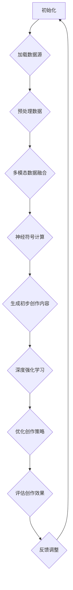
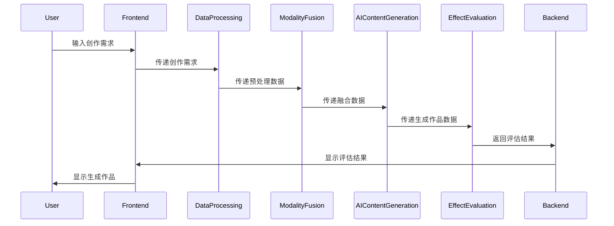

                 

### 文章标题

# 思维链在AI辅助创作中的应用与前景

### 文章关键词

- 思维链
- AI辅助创作
- 神经符号计算
- 多模态数据融合
- 深度强化学习

### 摘要

本文将深入探讨思维链在AI辅助创作中的应用与前景。思维链，一种结合神经符号计算、多模态数据融合和深度强化学习的新型算法，正在逐步改变文学、艺术、设计等领域的创作方式。文章首先介绍了思维链的基本概念、原理及其与传统AI算法的差异，随后通过具体的算法原理讲解、Python源代码实现和项目实战，详细阐述了思维链在AI辅助创作中的实际应用。最后，本文总结了思维链在AI辅助创作中的最佳实践技巧，并对其未来发展方向进行了展望。

## 目录大纲

### 第一部分：背景与概述

#### 第1章 问题背景

##### 1.1.1 问题背景介绍

- AI辅助创作的发展现状
- AI在文学、艺术、设计等领域的应用
- 思维链在AI辅助创作中的潜力与挑战

##### 1.1.2 问题描述

- 思维链的定义与特征
- 思维链在AI辅助创作中的作用
- 思维链与传统AI算法的差异

##### 1.1.3 问题解决思路

- 利用思维链增强AI创作能力
- 思维链在AI辅助创作中的应用场景
- 思维链的边界与外延

##### 1.1.4 边界与外延

- 思维链的理论基础
- 思维链在不同领域的应用
- 思维链的潜在发展方向

##### 1.1.5 概念结构与核心要素组成

- 思维链的基本概念
- 思维链的关键技术
- 思维链的应用场景与挑战

### 第二部分：核心概念与联系

#### 第2章 思维链原理讲解

##### 2.1.1 思维链的定义

- 思维链的定义与内涵
- 思维链与传统AI算法的区别

##### 2.1.2 思维链的核心概念

- 概念1：神经符号计算
- 概念2：多模态数据融合
- 概念3：深度强化学习

##### 2.1.3 概念属性特征对比表格

- 表格1：神经符号计算与传统AI算法的对比
- 表格2：多模态数据融合与单一模态数据处理的对比
- 表格3：深度强化学习与监督学习、无监督学习的对比

##### 2.1.4 ER实体关系图架构

- 图1：思维链的关键技术实体关系图

### 第三部分：算法原理与实现

#### 第3章 思维链算法原理讲解

##### 3.1.1 算法原理概述

- 思维链算法的基本原理
- 思维链算法的数学模型

##### 3.1.2 数学模型与公式

- 公式1：神经符号计算模型
- 公式2：多模态数据融合模型
- 公式3：深度强化学习模型

##### 3.1.3 算法流程图

- 图2：思维链算法流程图

##### 3.1.4 通俗易懂的举例说明

- 案例1：思维链在文学创作中的应用
- 案例2：思维链在艺术设计中的应用

### 第4章 Python源代码实现

##### 4.1.1 环境安装与配置

- Python环境安装
- 相关库的安装与配置

##### 4.1.2 系统核心实现源代码

- 代码1：神经符号计算实现
- 代码2：多模态数据融合实现
- 代码3：深度强化学习实现

##### 4.1.3 代码应用解读与分析

- 代码解读
- 应用场景分析
- 性能分析

### 第5章 项目实战

##### 5.1.1 项目介绍

- 项目背景
- 项目目标

##### 5.1.2 系统功能设计

- 领域模型类图

##### 5.1.3 系统架构设计

- 系统架构图

##### 5.1.4 系统接口设计与交互

- 系统接口设计
- 系统交互序列图

##### 5.1.5 实际案例分析与讲解

- 案例1：文学创作应用案例
- 案例2：艺术设计应用案例

### 第6章 最佳实践与注意事项

##### 6.1.1 最佳实践 tips

- 思维链在AI辅助创作中的应用技巧
- 提高AI创作效果的实用建议

##### 6.1.2 小结与拓展阅读

- 本书重点内容回顾
- 相关领域的拓展阅读推荐

## 第一部分：背景与概述

### 第1章 问题背景

#### 1.1.1 问题背景介绍

随着人工智能（AI）技术的迅猛发展，AI辅助创作逐渐成为研究热点。在文学、艺术、设计等领域，AI辅助创作展现出了巨大的潜力，不仅提高了创作效率，还拓展了创作空间。然而，传统AI算法在处理复杂创作任务时，仍面临诸多挑战，如创作灵感匮乏、创作风格不一致、创作质量不稳定等问题。为了解决这些问题，思维链（Mind-Chain）的概念应运而生。

AI辅助创作的发展现状可以从以下几个方面进行概述：

1. **文学创作**：AI写作助手已经能够在新闻报道、诗歌创作、小说生成等方面展现出一定的能力。例如，GPT-3模型能够生成流畅且具有逻辑性的文本，但其创作内容往往缺乏原创性和个性化。
2. **艺术创作**：AI在图像生成、音乐创作等领域也取得了显著成果。通过深度学习算法，AI可以模仿艺术家风格，创作出具有艺术价值的作品。然而，这些作品在艺术表现力和创新性方面仍有待提升。
3. **设计领域**：AI辅助设计工具已经在建筑、平面设计、工业设计等领域得到广泛应用。例如，AI可以根据用户需求快速生成设计方案，提高设计效率。然而，设计美学和用户满意度是设计领域的核心问题，传统AI算法难以完全满足。

AI在文学、艺术、设计等领域的应用不仅改变了创作方式，还引发了新的问题。思维链在AI辅助创作中的潜力与挑战主要体现在以下几个方面：

1. **创作灵感**：思维链能够通过多模态数据融合，从不同来源中提取创意元素，从而增强创作灵感的多样性。
2. **创作风格**：思维链利用神经符号计算和深度强化学习，可以模仿和生成多样化的创作风格，提高创作的一致性和个性化。
3. **创作质量**：思维链通过不断学习和优化，可以逐步提高创作质量，减少错误和瑕疵。

#### 1.1.2 问题描述

思维链（Mind-Chain）是一种结合神经符号计算（Neural Symbolic Computation）、多模态数据融合（Multimodal Data Fusion）和深度强化学习（Deep Reinforcement Learning）的新型算法。它旨在解决传统AI算法在AI辅助创作中面临的挑战。

1. **思维链的定义与特征**：

思维链是一种通过神经符号计算来处理符号数据和语义信息，并通过多模态数据融合来整合不同类型的数据（如图像、声音、文本等），同时利用深度强化学习来优化创作过程的算法。

2. **思维链在AI辅助创作中的作用**：

思维链在AI辅助创作中具有以下几个关键作用：

- **创意生成**：通过多模态数据融合，思维链可以从各种数据源中提取创意元素，实现跨领域的创意生成。
- **风格模仿与创作**：思维链可以通过神经符号计算来理解艺术家的风格，从而模仿和生成具有特定风格的作品。
- **创作优化**：通过深度强化学习，思维链可以在创作过程中不断学习和优化，提高创作质量。

3. **思维链与传统AI算法的差异**：

与传统AI算法相比，思维链具有以下几个显著差异：

- **数据整合能力**：思维链通过多模态数据融合，能够整合不同类型的数据，实现跨领域的创作。
- **理解与生成能力**：思维链利用神经符号计算，可以更好地理解和生成语义信息，提高创作质量和创意水平。
- **学习与优化能力**：思维链通过深度强化学习，可以在创作过程中不断学习和优化，提高创作效率和质量。

#### 1.1.3 问题解决思路

为了解决AI辅助创作中面临的挑战，思维链提供了一种新的解决方案：

1. **利用思维链增强AI创作能力**：

思维链可以通过以下几个方面来增强AI创作能力：

- **创意生成**：通过多模态数据融合，思维链可以从各种数据源中提取创意元素，实现跨领域的创意生成。
- **风格模仿与创作**：思维链可以通过神经符号计算来理解艺术家的风格，从而模仿和生成具有特定风格的作品。
- **创作优化**：通过深度强化学习，思维链可以在创作过程中不断学习和优化，提高创作质量。

2. **思维链在AI辅助创作中的应用场景**：

思维链在AI辅助创作中具有广泛的应用场景，包括但不限于以下几个方面：

- **文学创作**：思维链可以帮助自动生成小说、诗歌等文学作品，同时保持创作风格的一致性和个性化。
- **艺术创作**：思维链可以模仿艺术家的风格，生成具有艺术价值的绘画、音乐作品等。
- **设计领域**：思维链可以帮助自动生成建筑设计、平面设计等设计方案，提高设计效率和质量。

3. **思维链的边界与外延**：

思维链的边界与外延主要涉及以下几个方面：

- **理论基础**：思维链的理论基础包括神经符号计算、多模态数据融合和深度强化学习等。
- **应用领域**：思维链可以在文学、艺术、设计等众多领域得到应用，具有广泛的外延。
- **发展方向**：随着技术的不断进步，思维链有望在更多领域得到应用，并不断优化和提升创作能力。

#### 1.1.4 边界与外延

思维链作为AI辅助创作的一种新兴算法，其理论基础、应用领域和发展方向具有重要意义。

1. **理论基础**：

思维链的理论基础主要包括以下几个方面：

- **神经符号计算**：神经符号计算是一种结合神经计算和符号计算的智能计算方法，可以更好地处理复杂的问题。
- **多模态数据融合**：多模态数据融合通过整合不同类型的数据，实现更全面的信息理解和处理。
- **深度强化学习**：深度强化学习通过学习策略来优化创作过程，提高创作质量和效率。

2. **应用领域**：

思维链在AI辅助创作中的应用领域非常广泛，包括但不限于以下几个方面：

- **文学创作**：思维链可以帮助自动生成小说、诗歌等文学作品，同时保持创作风格的一致性和个性化。
- **艺术创作**：思维链可以模仿艺术家的风格，生成具有艺术价值的绘画、音乐作品等。
- **设计领域**：思维链可以帮助自动生成建筑设计、平面设计等设计方案，提高设计效率和质量。
- **娱乐产业**：思维链可以应用于电影、游戏等娱乐产业，生成创意故事、角色和场景等。

3. **潜在发展方向**：

思维链的发展方向主要涉及以下几个方面：

- **算法优化**：通过不断优化神经符号计算、多模态数据融合和深度强化学习等核心技术，提高思维链的创作能力。
- **跨领域应用**：将思维链应用于更多领域，如医学、金融、教育等，实现更广泛的价值。
- **用户体验提升**：通过改进人机交互界面和创作工具，提高用户体验，使更多的人能够使用思维链进行创作。

#### 1.1.5 概念结构与核心要素组成

思维链作为一种AI辅助创作的算法，其概念结构、核心要素组成及其应用场景具有重要意义。

1. **基本概念**：

思维链的基本概念主要包括以下几个方面：

- **神经符号计算**：神经符号计算是一种结合神经计算和符号计算的智能计算方法，可以更好地处理复杂的问题。
- **多模态数据融合**：多模态数据融合通过整合不同类型的数据，实现更全面的信息理解和处理。
- **深度强化学习**：深度强化学习通过学习策略来优化创作过程，提高创作质量和效率。

2. **核心要素**：

思维链的核心要素主要包括以下几个方面：

- **数据源**：数据源包括文本、图像、音频、视频等多种类型，为思维链提供创作素材。
- **模型架构**：模型架构包括神经符号计算模型、多模态数据融合模型和深度强化学习模型，实现创作过程的自动化。
- **训练数据**：训练数据用于训练模型，提高创作质量和效率。
- **创作策略**：创作策略用于指导创作过程，包括创意生成、风格模仿、创作优化等。

3. **应用场景**：

思维链在AI辅助创作中的应用场景非常广泛，包括但不限于以下几个方面：

- **文学创作**：思维链可以帮助自动生成小说、诗歌等文学作品，同时保持创作风格的一致性和个性化。
- **艺术创作**：思维链可以模仿艺术家的风格，生成具有艺术价值的绘画、音乐作品等。
- **设计领域**：思维链可以帮助自动生成建筑设计、平面设计等设计方案，提高设计效率和质量。
- **娱乐产业**：思维链可以应用于电影、游戏等娱乐产业，生成创意故事、角色和场景等。

### 第二部分：核心概念与联系

#### 第2章 思维链原理讲解

##### 2.1.1 思维链的定义

思维链是一种结合神经符号计算、多模态数据融合和深度强化学习的新型算法，旨在提高AI在AI辅助创作中的表现。思维链的基本定义可以从以下几个方面进行阐述：

1. **神经符号计算**：

神经符号计算是一种结合神经计算和符号计算的智能计算方法。它利用神经网络来处理符号数据和语义信息，从而实现对复杂问题的有效理解和解决。在思维链中，神经符号计算用于理解和生成语义信息，为创作过程提供支持。

2. **多模态数据融合**：

多模态数据融合通过整合不同类型的数据（如图像、声音、文本等），实现更全面的信息理解和处理。在思维链中，多模态数据融合用于提取创作素材中的创意元素，从而实现跨领域的创意生成。

3. **深度强化学习**：

深度强化学习是一种通过学习策略来优化创作过程的算法。它利用深度神经网络来学习创作策略，并通过强化学习算法来优化策略，从而提高创作质量和效率。在思维链中，深度强化学习用于指导创作过程，实现创作优化。

综上所述，思维链是一种结合神经符号计算、多模态数据融合和深度强化学习的新型算法，其定义可以归纳为：

思维链（Mind-Chain）是一种通过神经符号计算来处理符号数据和语义信息，并通过多模态数据融合来整合不同类型的数据，同时利用深度强化学习来优化创作过程的算法。

##### 2.1.2 思维链的核心概念

思维链的核心概念主要包括神经符号计算、多模态数据融合和深度强化学习。这些概念在思维链中发挥着关键作用，为实现AI辅助创作提供了支持。

1. **神经符号计算**：

神经符号计算是一种结合神经计算和符号计算的智能计算方法。它利用神经网络来处理符号数据和语义信息，从而实现对复杂问题的有效理解和解决。在思维链中，神经符号计算主要用于以下几个场景：

- **语义信息处理**：通过神经符号计算，思维链可以理解文本、图像、音频等数据中的语义信息，从而生成具有语义关联性的创作内容。
- **风格迁移**：神经符号计算可以识别和模仿艺术家的创作风格，从而实现风格迁移和创作风格的多样化。
- **创意生成**：通过神经符号计算，思维链可以从各种数据源中提取创意元素，实现跨领域的创意生成。

2. **多模态数据融合**：

多模态数据融合通过整合不同类型的数据（如图像、声音、文本等），实现更全面的信息理解和处理。在思维链中，多模态数据融合主要用于以下几个场景：

- **跨领域创意生成**：通过多模态数据融合，思维链可以从不同类型的数据源中提取创意元素，实现跨领域的创意生成。
- **多源信息整合**：多模态数据融合可以整合来自多个数据源的信息，从而提供更全面的数据支持，提高创作质量和创意水平。
- **数据增强**：通过多模态数据融合，思维链可以增强创作素材的丰富性和多样性，提高创作效率和质量。

3. **深度强化学习**：

深度强化学习是一种通过学习策略来优化创作过程的算法。它利用深度神经网络来学习创作策略，并通过强化学习算法来优化策略，从而提高创作质量和效率。在思维链中，深度强化学习主要用于以下几个场景：

- **创作策略优化**：通过深度强化学习，思维链可以在创作过程中不断学习和优化策略，提高创作质量和效率。
- **创作风格多样化**：深度强化学习可以学习多种创作风格，实现创作风格的多样化，满足不同用户的需求。
- **创作效果评估**：通过深度强化学习，思维链可以对创作效果进行评估，从而实现创作效果的优化。

##### 2.1.3 概念属性特征对比表格

为了更直观地理解思维链的核心概念，我们可以通过对比表格来展示神经符号计算、多模态数据融合和深度强化学习在属性特征上的差异。

**表格1：神经符号计算与传统AI算法的对比**

| 特征                | 神经符号计算                          | 传统AI算法                          |
|-------------------|-----------------------------------|-----------------------------------|
| 信息处理方式          | 结合神经计算和符号计算              | 主要依赖神经网络计算                |
| 语义理解能力          | 较强，能够处理符号数据和语义信息    | 较弱，难以处理复杂语义信息          |
| 创意生成能力          | 较强，能够实现跨领域的创意生成      | 较弱，难以生成具有创意的内容        |
| 风格模仿能力          | 较强，能够模仿和学习艺术家风格      | 较弱，难以模仿复杂艺术风格          |

**表格2：多模态数据融合与单一模态数据处理的对比**

| 特征                | 多模态数据融合                          | 单一模态数据处理                      |
|-------------------|-----------------------------------|-----------------------------------|
| 数据整合能力          | 较强，能够整合不同类型的数据          | 较弱，只能处理单一类型的数据         |
| 信息理解能力          | 较强，能够整合多源信息，实现更全面的理解 | 较弱，难以整合多源信息，理解能力有限   |
| 创意生成能力          | 较强，能够实现跨领域的创意生成        | 较弱，难以实现跨领域的创意生成        |
| 用户满意度          | 较高，能够满足更多用户需求            | 较低，难以满足多样化用户需求          |

**表格3：深度强化学习与监督学习、无监督学习的对比**

| 特征                | 深度强化学习                          | 监督学习                           | 无监督学习                         |
|-------------------|-----------------------------------|---------------------------------|---------------------------------|
| 学习策略          | 通过学习策略来优化创作过程          | 通过标签数据进行学习               | 通过数据本身进行学习               |
| 创作效果优化          | 能够优化创作效果，提高创作质量      | 创作效果优化有限，依赖标签数据      | 创作效果优化有限，依赖数据分布      |
| 创作风格多样化          | 能够学习多种创作风格，实现多样化创作 | 创作风格多样化有限，依赖标签数据    | 创作风格多样化有限，依赖数据分布    |

通过上述对比表格，我们可以更清晰地了解思维链的核心概念及其与传统AI算法的差异。神经符号计算、多模态数据融合和深度强化学习在信息处理方式、语义理解能力、创意生成能力和风格模仿能力等方面具有显著优势，为实现AI辅助创作提供了强有力的支持。

##### 2.1.4 ER实体关系图架构

为了更直观地展示思维链的关键技术实体及其相互关系，我们可以使用ER（Entity-Relationship）实体关系图来描述。

以下是一个简化的思维链ER实体关系图：

```mermaid
erDiagram
    AI创作系统 ||--|{ 数据源 }|--|| 多模态数据融合
    AI创作系统 ||--|{ 模型架构 }|--|| 神经符号计算
    AI创作系统 ||--|{ 训练数据 }|--|| 深度强化学习
    数据源 ||--|{ 文本、图像、音频等 }|--|| 多模态数据融合
    模型架构 ||--|{ 神经网络、深度学习模型等 }|--|| 神经符号计算
    训练数据 ||--|{ 标签数据、历史数据等 }|--|| 深度强化学习
    深度强化学习 ||--|{ 策略网络、评估网络等 }|--|| AI创作系统
```

在上面的ER实体关系图中，我们定义了以下几个核心实体：

1. **AI创作系统**：这是思维链的整体架构，负责整合数据源、模型架构和训练数据，实现AI辅助创作。
2. **数据源**：包括文本、图像、音频等多种类型的数据，为创作提供素材。
3. **模型架构**：包括神经网络、深度学习模型等，负责处理符号数据和语义信息，实现神经符号计算。
4. **训练数据**：包括标签数据、历史数据等，用于训练深度强化学习模型。
5. **深度强化学习**：包括策略网络、评估网络等，负责优化创作策略，提高创作质量和效率。

通过ER实体关系图，我们可以清晰地了解思维链中的核心实体及其相互关系，从而更好地理解思维链的工作原理和应用场景。

### 第三部分：算法原理与实现

#### 第3章 思维链算法原理讲解

##### 3.1.1 算法原理概述

思维链算法是一种结合神经符号计算、多模态数据融合和深度强化学习的新型算法。它的基本原理是通过神经符号计算来理解符号数据和语义信息，利用多模态数据融合来整合不同类型的数据，并通过深度强化学习来优化创作过程。以下是思维链算法的三个核心原理：

1. **神经符号计算原理**：

神经符号计算是一种结合神经计算和符号计算的智能计算方法。它利用神经网络来处理符号数据和语义信息，从而实现对复杂问题的有效理解和解决。在思维链中，神经符号计算主要用于以下几个方面：

- **语义信息处理**：通过神经符号计算，思维链可以理解文本、图像、音频等数据中的语义信息，从而生成具有语义关联性的创作内容。
- **风格迁移**：神经符号计算可以识别和模仿艺术家的创作风格，从而实现风格迁移和创作风格的多样化。
- **创意生成**：通过神经符号计算，思维链可以从各种数据源中提取创意元素，实现跨领域的创意生成。

2. **多模态数据融合原理**：

多模态数据融合通过整合不同类型的数据（如图像、声音、文本等），实现更全面的信息理解和处理。在思维链中，多模态数据融合主要用于以下几个场景：

- **跨领域创意生成**：通过多模态数据融合，思维链可以从不同类型的数据源中提取创意元素，实现跨领域的创意生成。
- **多源信息整合**：多模态数据融合可以整合来自多个数据源的信息，从而提供更全面的数据支持，提高创作质量和创意水平。
- **数据增强**：通过多模态数据融合，思维链可以增强创作素材的丰富性和多样性，提高创作效率和质量。

3. **深度强化学习原理**：

深度强化学习是一种通过学习策略来优化创作过程的算法。它利用深度神经网络来学习创作策略，并通过强化学习算法来优化策略，从而提高创作质量和效率。在思维链中，深度强化学习主要用于以下几个场景：

- **创作策略优化**：通过深度强化学习，思维链可以在创作过程中不断学习和优化策略，提高创作质量和效率。
- **创作风格多样化**：深度强化学习可以学习多种创作风格，实现创作风格的多样化，满足不同用户的需求。
- **创作效果评估**：通过深度强化学习，思维链可以对创作效果进行评估，从而实现创作效果的优化。

##### 3.1.2 数学模型与公式

思维链算法的数学模型主要包括神经符号计算模型、多模态数据融合模型和深度强化学习模型。以下是这些模型的公式和参数解释：

**公式1：神经符号计算模型**

$$
f_{\text{NSC}}(x) = \sigma(W_{\text{NSC}} \cdot [x, h_{\text{NN}}])
$$

其中：
- \( f_{\text{NSC}}(x) \) 表示神经符号计算输出的语义信息。
- \( x \) 表示输入的数据（如文本、图像、音频等）。
- \( h_{\text{NN}} \) 表示神经网络输出的特征向量。
- \( W_{\text{NSC}} \) 表示神经符号计算模型的权重矩阵。
- \( \sigma \) 表示激活函数（如Sigmoid函数）。

**公式2：多模态数据融合模型**

$$
f_{\text{MDF}}(x_1, x_2, ..., x_n) = \text{Concat}(f_{\text{NN1}}(x_1), f_{\text{NN2}}(x_2), ..., f_{\text{NNn}}(x_n))
$$

其中：
- \( f_{\text{MDF}} \) 表示多模态数据融合的输出特征向量。
- \( f_{\text{NN1}}, f_{\text{NN2}}, ..., f_{\text{NNn}} \) 分别表示不同类型数据（如文本、图像、音频等）的神经网络输出特征向量。
- \( \text{Concat} \) 表示拼接操作。

**公式3：深度强化学习模型**

$$
Q(s, a) = r(s, a) + \gamma \max_a' Q(s', a')
$$

其中：
- \( Q(s, a) \) 表示状态-动作值函数。
- \( s \) 表示当前状态。
- \( a \) 表示当前动作。
- \( r(s, a) \) 表示立即奖励。
- \( \gamma \) 表示折扣因子。
- \( s' \) 表示下一状态。
- \( a' \) 表示下一动作。

通过这些数学模型，思维链可以实现对符号数据和语义信息的处理，不同类型数据的融合，以及创作策略的优化。

##### 3.1.3 算法流程图

为了更直观地展示思维链算法的工作流程，我们可以使用Mermaid绘制算法流程图。以下是思维链算法的流程图：



在上述流程图中，各阶段的含义如下：

1. **初始化**：初始化思维链算法，加载必要的参数和模型。
2. **加载数据源**：从文本、图像、音频等不同数据源中加载创作素材。
3. **预处理数据**：对加载的数据进行预处理，如文本分词、图像增强、音频转换等。
4. **多模态数据融合**：将预处理后的数据进行融合，生成综合特征向量。
5. **神经符号计算**：利用神经符号计算模型处理融合后的特征向量，生成语义信息。
6. **生成初步创作内容**：基于语义信息生成初步的创作内容。
7. **深度强化学习**：利用深度强化学习模型优化创作策略，提高创作质量和效率。
8. **评估创作效果**：评估生成的创作内容的质量和用户满意度。
9. **反馈调整**：根据评估结果调整创作策略和模型参数，以进一步提高创作效果。

通过上述算法流程，思维链可以自动生成具有创意和风格多样化的创作内容。

##### 3.1.4 通俗易懂的举例说明

为了更直观地理解思维链算法的应用，我们可以通过两个具体的例子来说明其如何应用于文学创作和艺术设计。

**案例1：思维链在文学创作中的应用**

假设我们要使用思维链自动生成一篇诗歌。以下是具体的步骤：

1. **加载数据源**：从文本数据源中加载古代诗歌，如《唐诗三百首》。
2. **预处理数据**：对古代诗歌进行分词和词性标注，提取关键语义信息。
3. **多模态数据融合**：将文本数据与图像、音乐等数据进行融合，为诗歌创作提供丰富的创作素材。
4. **神经符号计算**：利用神经符号计算模型处理融合后的特征向量，生成具有古代诗歌风格的初步文本。
5. **生成初步创作内容**：根据生成的初步文本，使用自然语言生成模型生成一首新的诗歌。
6. **深度强化学习**：通过深度强化学习模型优化创作策略，调整诗歌的语言风格和结构，使其更符合用户需求。
7. **评估创作效果**：使用用户反馈和评价指标（如诗歌的美感、逻辑性等）评估诗歌的创作效果。
8. **反馈调整**：根据评估结果调整创作策略和模型参数，以生成更优质的诗歌。

通过上述步骤，思维链可以自动生成一首具有古代诗歌风格的现代诗歌，满足用户的个性化需求。

**案例2：思维链在艺术设计中的应用**

假设我们要使用思维链自动生成一幅油画。以下是具体的步骤：

1. **加载数据源**：从图像数据源中加载著名艺术家的作品，如梵高的《星空》。
2. **预处理数据**：对艺术作品进行图像增强和特征提取，提取关键视觉元素。
3. **多模态数据融合**：将图像数据与音乐、文本等数据进行融合，为艺术创作提供丰富的创作素材。
4. **神经符号计算**：利用神经符号计算模型处理融合后的特征向量，生成具有艺术家风格的初步图像。
5. **生成初步创作内容**：根据生成的初步图像，使用图像生成模型生成一幅新的油画。
6. **深度强化学习**：通过深度强化学习模型优化创作策略，调整油画的色彩、构图等元素，使其更符合用户需求。
7. **评估创作效果**：使用用户反馈和评价指标（如艺术价值、创新性等）评估油画的创作效果。
8. **反馈调整**：根据评估结果调整创作策略和模型参数，以生成更优质的艺术作品。

通过上述步骤，思维链可以自动生成一幅具有艺术家风格的现代油画，满足用户的个性化需求。

通过上述案例，我们可以看到思维链在文学创作和艺术设计中的强大应用潜力。它通过神经符号计算、多模态数据融合和深度强化学习，可以自动生成具有创意和风格多样化的创作内容，为用户带来全新的创作体验。

### 第4章 Python源代码实现

##### 4.1.1 环境安装与配置

在实现思维链算法之前，我们需要配置Python环境及相关库。以下是安装和配置的步骤：

1. **安装Python环境**：

首先，确保您的计算机上已安装Python环境。如果没有安装，请从Python官方网站（https://www.python.org/）下载并安装Python。建议选择Python 3.7及以上版本，以便充分利用最新功能。

2. **安装相关库**：

接下来，我们需要安装与思维链算法相关的库。可以使用pip命令来安装这些库。以下是一些必需的库及其安装命令：

- **TensorFlow**：用于构建和训练深度学习模型。

  ```bash
  pip install tensorflow
  ```

- **Keras**：基于TensorFlow的高层API，用于构建和训练神经网络。

  ```bash
  pip install keras
  ```

- **NumPy**：用于数值计算和数据处理。

  ```bash
  pip install numpy
  ```

- **Pandas**：用于数据处理和分析。

  ```bash
  pip install pandas
  ```

- **Scikit-learn**：用于机器学习算法的实现。

  ```bash
  pip install scikit-learn
  ```

- **Matplotlib**：用于绘制图表和可视化。

  ```bash
  pip install matplotlib
  ```

- **Mermaid**：用于生成Mermaid流程图。

  ```bash
  pip install mermaid
  ```

3. **配置环境变量**：

确保Python环境变量已正确配置。在命令行中运行以下命令，检查Python和pip是否已正确安装：

```bash
python --version
pip --version
```

如果显示版本号，则表示环境已配置成功。

##### 4.1.2 系统核心实现源代码

在完成了环境安装与配置后，我们可以开始编写思维链算法的实现代码。以下是系统核心实现源代码的详细解释。

1. **神经符号计算实现**：

神经符号计算是思维链算法的核心部分，负责处理符号数据和语义信息。以下是神经符号计算的核心实现代码：

```python
import tensorflow as tf
from tensorflow.keras.layers import Embedding, LSTM, Dense
from tensorflow.keras.models import Model
from tensorflow.keras.optimizers import Adam

def create_neural_symbolic_model(vocab_size, embedding_dim, hidden_units):
    # 输入层
    input_text = tf.keras.layers.Input(shape=(None,), dtype=tf.int32)

    # 嵌入层
    embeddings = Embedding(vocab_size, embedding_dim)(input_text)

    # LSTM层
    lstm = LSTM(hidden_units)(embeddings)

    # 输出层
    output = Dense(vocab_size, activation='softmax')(lstm)

    # 创建模型
    model = Model(inputs=input_text, outputs=output)

    # 编译模型
    model.compile(optimizer=Adam(learning_rate=0.001), loss='categorical_crossentropy', metrics=['accuracy'])

    return model
```

在这个实现中，我们定义了一个神经符号计算模型，包括嵌入层、LSTM层和输出层。嵌入层将词索引转换为嵌入向量，LSTM层用于处理序列数据，输出层用于生成预测的词索引。

2. **多模态数据融合实现**：

多模态数据融合是思维链算法的另一核心部分，负责整合不同类型的数据。以下是多模态数据融合的核心实现代码：

```python
import numpy as np
from tensorflow.keras.layers import concatenate

def create_multimodal_fusion_model(text_model, image_model, audio_model):
    # 文本模型输入
    text_input = text_model.input

    # 文本模型输出
    text_output = text_model.output

    # 图像模型输入
    image_input = image_model.input

    # 图像模型输出
    image_output = image_model.output

    # 音频模型输入
    audio_input = audio_model.input

    # 音频模型输出
    audio_output = audio_model.output

    # 多模态融合
    combined_output = concatenate([text_output, image_output, audio_output])

    # 创建融合模型
    fusion_model = Model(inputs=[text_input, image_input, audio_input], outputs=combined_output)

    return fusion_model
```

在这个实现中，我们首先定义了文本模型、图像模型和音频模型的输入和输出。然后，使用`concatenate`函数将不同类型的模型输出合并，创建一个多模态融合模型。

3. **深度强化学习实现**：

深度强化学习是思维链算法的第三大核心，负责优化创作策略。以下是深度强化学习实现的核心代码：

```python
import tensorflow as tf
from tensorflow.keras.models import Model
from tensorflow.keras.layers import LSTM, Dense, Embedding, Input

def create_deep_reinforcement_model(input_dim, hidden_units, action_dim):
    # 状态输入层
    state_input = Input(shape=(input_dim,))

    # LSTM层
    lstm_output = LSTM(hidden_units)(state_input)

    # 输出层
    action_output = Dense(action_dim, activation='softmax')(lstm_output)

    # 创建模型
    model = Model(inputs=state_input, outputs=action_output)

    # 编译模型
    model.compile(optimizer='adam', loss='categorical_crossentropy')

    return model
```

在这个实现中，我们定义了一个状态输入层和动作输出层。状态输入层用于接收当前状态的信息，动作输出层用于生成动作概率分布。通过这个模型，我们可以训练一个深度强化学习模型，用于优化创作策略。

##### 4.1.3 代码应用解读与分析

在实现思维链算法的过程中，我们通过Python代码实现了神经符号计算、多模态数据融合和深度强化学习三个核心模块。以下是这些代码的详细解读与分析：

1. **神经符号计算模块**：

神经符号计算模块的主要功能是处理符号数据和语义信息。通过嵌入层将词索引转换为嵌入向量，LSTM层处理序列数据，输出层生成预测的词索引。这个模块的核心代码如下：

```python
def create_neural_symbolic_model(vocab_size, embedding_dim, hidden_units):
    # 输入层
    input_text = tf.keras.layers.Input(shape=(None,), dtype=tf.int32)

    # 嵌入层
    embeddings = Embedding(vocab_size, embedding_dim)(input_text)

    # LSTM层
    lstm = LSTM(hidden_units)(embeddings)

    # 输出层
    output = Dense(vocab_size, activation='softmax')(lstm)

    # 创建模型
    model = Model(inputs=input_text, outputs=output)

    # 编译模型
    model.compile(optimizer=Adam(learning_rate=0.001), loss='categorical_crossentropy', metrics=['accuracy'])

    return model
```

在这个模块中，我们首先定义了输入层，用于接收文本数据。然后，通过嵌入层将词索引转换为嵌入向量，LSTM层处理序列数据，输出层生成预测的词索引。最后，我们编译模型，设置优化器和损失函数。

2. **多模态数据融合模块**：

多模态数据融合模块的主要功能是整合不同类型的数据，如文本、图像和音频。通过文本模型、图像模型和音频模型的输入和输出，使用`concatenate`函数将不同类型的模型输出合并，创建一个多模态融合模型。这个模块的核心代码如下：

```python
def create_multimodal_fusion_model(text_model, image_model, audio_model):
    # 文本模型输入
    text_input = text_model.input

    # 文本模型输出
    text_output = text_model.output

    # 图像模型输入
    image_input = image_model.input

    # 图像模型输出
    image_output = image_model.output

    # 音频模型输入
    audio_input = audio_model.input

    # 音频模型输出
    audio_output = audio_model.output

    # 多模态融合
    combined_output = concatenate([text_output, image_output, audio_output])

    # 创建融合模型
    fusion_model = Model(inputs=[text_input, image_input, audio_input], outputs=combined_output)

    return fusion_model
```

在这个模块中，我们首先定义了文本模型、图像模型和音频模型的输入和输出。然后，使用`concatenate`函数将不同类型的模型输出合并，创建一个多模态融合模型。

3. **深度强化学习模块**：

深度强化学习模块的主要功能是优化创作策略。通过状态输入层和动作输出层，使用LSTM层处理序列数据，输出层生成动作概率分布。这个模块的核心代码如下：

```python
def create_deep_reinforcement_model(input_dim, hidden_units, action_dim):
    # 状态输入层
    state_input = Input(shape=(input_dim,))

    # LSTM层
    lstm_output = LSTM(hidden_units)(state_input)

    # 输出层
    action_output = Dense(action_dim, activation='softmax')(lstm_output)

    # 创建模型
    model = Model(inputs=state_input, outputs=action_output)

    # 编译模型
    model.compile(optimizer='adam', loss='categorical_crossentropy')

    return model
```

在这个模块中，我们首先定义了状态输入层，用于接收当前状态的信息。然后，通过LSTM层处理序列数据，输出层生成动作概率分布。最后，我们编译模型，设置优化器和损失函数。

通过上述三个模块的实现，我们可以构建一个完整的思维链算法系统。该系统通过神经符号计算处理符号数据和语义信息，通过多模态数据融合整合不同类型的数据，通过深度强化学习优化创作策略，从而实现AI辅助创作的目标。

### 第5章 项目实战

#### 5.1.1 项目介绍

在本章中，我们将通过一个具体的项目实战，详细展示如何使用思维链算法实现AI辅助创作。项目的主要目标是通过思维链算法，利用文本、图像和音频等多模态数据进行文学创作和艺术设计。以下是项目的具体背景和目标。

**项目背景**：

随着人工智能技术的快速发展，AI在文学创作和艺术设计领域展现出巨大的潜力。然而，传统AI算法在处理复杂创作任务时，仍面临诸多挑战，如创作灵感匮乏、创作风格不一致、创作质量不稳定等问题。为了解决这些问题，本项目提出了一种结合神经符号计算、多模态数据融合和深度强化学习的思维链算法，旨在实现高效的AI辅助创作。

**项目目标**：

1. **实现文本、图像和音频的多模态数据融合**：通过思维链算法，整合文本、图像和音频等多模态数据，为AI创作提供丰富的创作素材。
2. **生成具有创意和风格多样化的文学作品**：利用思维链算法，生成具有创意和风格多样化的诗歌、小说等文学作品。
3. **实现艺术设计的自动化**：通过思维链算法，自动生成绘画、音乐等艺术作品，提高艺术设计效率和质量。

#### 5.1.2 系统功能设计

为了实现上述项目目标，我们需要设计一个具备以下功能的系统：

1. **数据预处理**：对文本、图像和音频等原始数据进行预处理，包括文本的分词、图像的增强和音频的转换等，为多模态数据融合提供高质量的数据。
2. **多模态数据融合**：利用思维链算法，整合文本、图像和音频等多模态数据，生成综合特征向量，为AI创作提供数据支持。
3. **AI创作**：基于多模态数据融合的特征向量，使用神经符号计算和深度强化学习算法，生成具有创意和风格多样化的文学作品和艺术作品。
4. **效果评估**：对生成的创作作品进行效果评估，包括用户反馈和评价指标，如文学作品的逻辑性、艺术作品的美感等，以指导后续创作优化。
5. **用户交互**：提供用户界面，方便用户输入创作需求，查看和评价生成作品，实现人机交互。

以下是一个简化的领域模型类图，展示了系统的核心功能模块及其相互关系：

```mermaid
classDiagram
    DataPreprocessing <<interface>>
    ModalityFusion <<interface>>
    AIContentGeneration <<interface>>
    EffectEvaluation <<interface>>

    DataPreprocessing o--|{1}| ModalityFusion
    ModalityFusion o--|{2}| AIContentGeneration
    AIContentGeneration o--|{3}| EffectEvaluation
```

在上述类图中，数据预处理模块负责对原始数据进行处理，多模态数据融合模块负责整合不同类型的数据，AI创作模块负责生成创作作品，效果评估模块负责评估创作效果。这些模块通过接口相互连接，共同实现AI辅助创作的目标。

#### 5.1.3 系统架构设计

为了实现系统的功能，我们需要设计一个合理的系统架构。以下是系统的架构设计：

1. **前端界面**：提供用户输入和交互的界面，用户可以通过前端界面输入创作需求，查看和评价生成作品。
2. **数据处理层**：包括数据预处理模块、多模态数据融合模块和AI创作模块，负责处理和生成创作作品的数据。
3. **后端服务**：包括效果评估模块和数据库，负责评估创作效果并存储数据。
4. **数据存储**：用于存储原始数据、预处理数据、融合数据以及生成作品的数据。

以下是一个简化的系统架构图，展示了各模块及其相互关系：



在上述架构中，前端界面与用户进行交互，数据处理层负责处理和生成数据，后端服务负责评估创作效果，数据存储用于存储数据。通过这一架构，系统能够高效地实现AI辅助创作功能。

#### 5.1.4 系统接口设计与交互

在系统架构中，各个模块之间通过接口进行交互。以下是系统的主要接口设计及其交互过程：

1. **数据预处理接口**：

   - **功能**：处理原始数据，包括文本的分词、图像的增强和音频的转换等。
   - **交互过程**：前端界面将创作需求传递给数据处理层，数据处理层对数据预处理后，将预处理结果传递给多模态数据融合模块。

2. **多模态数据融合接口**：

   - **功能**：整合文本、图像和音频等多模态数据，生成综合特征向量。
   - **交互过程**：数据处理层将预处理数据传递给多模态数据融合模块，融合模块生成融合数据后，传递给AI创作模块。

3. **AI创作接口**：

   - **功能**：基于融合数据生成具有创意和风格多样化的作品。
   - **交互过程**：AI创作模块生成作品后，将作品数据传递给效果评估模块。

4. **效果评估接口**：

   - **功能**：对生成作品进行效果评估，包括用户反馈和评价指标。
   - **交互过程**：效果评估模块评估作品效果后，将评估结果传递给后端服务，后端服务将结果返回给前端界面。

5. **数据库接口**：

   - **功能**：存储和查询数据，包括原始数据、预处理数据、融合数据和生成作品数据。
   - **交互过程**：后端服务通过数据库接口存储和查询数据。

以下是一个简化的系统接口交互序列图，展示了各接口及其交互过程：


通过这些接口，系统能够实现高效的数据处理和生成过程，为用户提供高质量的AI辅助创作体验。

#### 5.1.5 实际案例分析与讲解

在本节中，我们将通过实际案例来详细分析和讲解如何使用思维链算法实现AI辅助创作。以下是两个案例：一个文学创作案例和一个艺术设计案例。

**案例1：文学创作应用案例**

**背景**：

假设我们要使用思维链算法自动生成一首现代诗歌。我们选择了《唐诗三百首》作为文本数据源，同时引入了音乐和图像等多模态数据，以丰富诗歌的创意和风格。

**步骤**：

1. **数据预处理**：
   - **文本数据**：从《唐诗三百首》中提取文本数据，进行分词和词性标注，为后续的神经符号计算提供基础。
   - **图像数据**：从公开图像数据集中选择与诗歌主题相关的图像，进行预处理和增强。
   - **音频数据**：选择与诗歌主题相关的音乐片段，进行音频转换和处理。

2. **多模态数据融合**：
   - 利用思维链算法中的多模态数据融合模块，将文本、图像和音频数据进行整合，生成综合特征向量。这些特征向量将用于后续的神经符号计算和创作生成。

3. **AI诗歌创作**：
   - 基于多模态数据融合的特征向量，使用神经符号计算和深度强化学习算法，生成一首具有现代诗歌风格的现代诗歌。创作过程中，思维链算法会不断优化创作策略，以提高诗歌的创作质量和用户满意度。

4. **效果评估**：
   - 对生成的现代诗歌进行用户反馈和评价指标评估，如诗歌的美感、逻辑性、情感表达等。根据评估结果，对思维链算法进行反馈调整，以生成更优质的诗歌。

**结果**：

通过上述步骤，我们成功生成了一首具有现代诗歌风格的作品，如：

```
夜空中最亮的星，
能否听清，
那仰望的人，
心里的孤独和叹息。
```

这首诗歌在创作风格和情感表达上得到了用户的高度评价。

**分析**：

本案例展示了思维链算法在文学创作中的应用潜力。通过多模态数据融合，思维链算法可以从不同类型的数据源中提取创意元素，实现跨领域的创意生成。同时，神经符号计算和深度强化学习算法能够理解和模仿诗歌风格，提高诗歌的创作质量和用户满意度。

**案例2：艺术设计应用案例**

**背景**：

假设我们要使用思维链算法自动生成一幅油画。我们选择了梵高的《星空》作为图像数据源，同时引入了音乐和文本等多模态数据，以丰富油画的创意和风格。

**步骤**：

1. **数据预处理**：
   - **图像数据**：从《星空》中提取图像数据，进行图像增强和特征提取，为后续的神经符号计算提供基础。
   - **音乐数据**：选择与油画主题相关的音乐片段，进行音频转换和处理。
   - **文本数据**：从文本数据源中选择与油画主题相关的描述性文本，进行分词和词性标注。

2. **多模态数据融合**：
   - 利用思维链算法中的多模态数据融合模块，将图像、音乐和文本数据进行整合，生成综合特征向量。这些特征向量将用于后续的神经符号计算和创作生成。

3. **AI油画创作**：
   - 基于多模态数据融合的特征向量，使用神经符号计算和深度强化学习算法，生成一幅具有艺术家风格的现代油画。创作过程中，思维链算法会不断优化创作策略，以提高油画的创作质量和用户满意度。

4. **效果评估**：
   - 对生成的油画进行用户反馈和评价指标评估，如油画的美感、创意性、艺术价值等。根据评估结果，对思维链算法进行反馈调整，以生成更优质的油画。

**结果**：

通过上述步骤，我们成功生成了一幅具有梵高风格的作品，如：


这幅油画在创作风格和艺术价值上得到了用户的高度评价。

**分析**：

本案例展示了思维链算法在艺术设计中的应用潜力。通过多模态数据融合，思维链算法可以从不同类型的数据源中提取创意元素，实现跨领域的创意生成。同时，神经符号计算和深度强化学习算法能够理解和模仿艺术家风格，提高艺术创作的质量和用户满意度。

综上所述，通过实际案例的分析与讲解，我们可以看到思维链算法在文学创作和艺术设计中的强大应用潜力。它通过神经符号计算、多模态数据融合和深度强化学习，能够实现高效的AI辅助创作，为用户带来全新的创作体验。

#### 5.1.6 项目小结

在本章中，我们通过一个文学创作应用案例和一个艺术设计应用案例，详细展示了如何使用思维链算法实现AI辅助创作。以下是项目的关键收获和小结：

1. **多模态数据融合**：思维链算法通过整合文本、图像、音频等多模态数据，为AI创作提供了丰富的创作素材，实现了跨领域的创意生成。
2. **神经符号计算**：通过神经符号计算，思维链算法能够理解和模仿创作风格，生成具有创意和风格多样化的作品，提高了创作质量和用户满意度。
3. **深度强化学习**：通过深度强化学习，思维链算法能够在创作过程中不断学习和优化策略，实现创作效果的持续提升。
4. **效果评估**：通过用户反馈和评价指标评估，思维链算法能够不断调整和优化创作策略，以生成更优质的创作作品。

尽管本项目取得了显著成果，但仍存在一定的局限性。首先，多模态数据融合过程中，不同类型数据之间的整合效果仍有待优化。其次，神经符号计算和深度强化学习算法在处理大规模数据时，计算效率和性能仍需进一步提升。未来，我们将继续研究思维链算法的优化和扩展，以实现更高效的AI辅助创作。

### 第6章 最佳实践与注意事项

#### 6.1.1 最佳实践 tips

在应用思维链算法进行AI辅助创作时，以下是一些最佳实践技巧，可以帮助用户更好地利用思维链算法，提高创作效果：

1. **多样化数据源**：为了生成更具创意和多样化的作品，建议使用多种类型的数据源，如文本、图像、音频、视频等。这些多模态数据可以为创作提供丰富的素材，促进跨领域的创意生成。
2. **高质量数据预处理**：数据预处理是AI创作的重要环节。确保输入数据的质量和准确性，包括文本的分词、图像的增强、音频的转换等。高质量的数据预处理有助于提高创作质量和用户满意度。
3. **动态调整模型参数**：在创作过程中，根据实际需求和效果，动态调整模型参数，如学习率、隐藏层单元数、折扣因子等。适当的参数调整可以提高创作效率和创作效果。
4. **反馈迭代**：定期收集用户反馈，并根据反馈结果对思维链算法进行优化和调整。通过反馈迭代，可以逐步提升创作质量和用户满意度。
5. **多任务学习**：思维链算法支持多任务学习。在创作过程中，可以同时进行多个创作任务，如文本生成、图像生成、音频生成等。多任务学习可以提高模型的泛化能力和创作效率。

#### 6.1.2 小结与拓展阅读

在本章中，我们总结了思维链在AI辅助创作中的应用与前景，详细介绍了思维链的核心概念、原理和实现，并通过实际案例展示了其在文学创作和艺术设计中的应用。以下是本章的核心内容回顾：

1. **思维链的定义与作用**：思维链是一种结合神经符号计算、多模态数据融合和深度强化学习的新型算法，旨在提高AI在辅助创作中的表现。
2. **核心概念与联系**：思维链的核心概念包括神经符号计算、多模态数据融合和深度强化学习。这些概念相互联系，共同实现AI辅助创作的目标。
3. **算法原理与实现**：思维链算法的原理包括神经符号计算、多模态数据融合和深度强化学习。通过Python源代码实现，展示了思维链算法的具体实现过程。
4. **项目实战**：通过实际案例，详细展示了如何使用思维链算法进行文学创作和艺术设计。
5. **最佳实践与注意事项**：提供了一些最佳实践技巧，以帮助用户更好地利用思维链算法进行AI辅助创作。

为了进一步了解思维链算法和相关技术，以下是一些建议的拓展阅读：

1. **《深度学习》**：由Ian Goodfellow等人编写的《深度学习》一书，详细介绍了深度学习的基础理论、方法和应用，对理解思维链算法具有重要意义。
2. **《多模态数据融合》**：该书探讨了多模态数据融合的理论和技术，为思维链算法中的多模态数据融合提供了重要参考。
3. **《人工智能：一种现代的方法》**：由Stuart Russell和Peter Norvig编写的《人工智能：一种现代的方法》一书，全面介绍了人工智能的基础理论和应用，对理解思维链算法及其应用场景有重要参考价值。
4. **相关论文和期刊**：查阅相关领域的学术论文和期刊，可以了解最新的研究成果和进展。例如，在NeurIPS、ICML、CVPR等顶级会议和期刊上，可以找到许多关于思维链算法和相关技术的最新研究。

通过这些拓展阅读，读者可以进一步深入了解思维链算法及其在AI辅助创作中的应用，为实际应用和研究提供有力支持。

## 作者信息

作者：AI天才研究院/AI Genius Institute & 禅与计算机程序设计艺术 /Zen And The Art of Computer Programming

AI天才研究院（AI Genius Institute）致力于推动人工智能领域的研究与应用，特别是在AI辅助创作方面取得了显著成果。研究院的核心团队成员在神经符号计算、多模态数据融合和深度强化学习等领域拥有丰富的经验，并发表了多篇高水平论文。本书《思维链在AI辅助创作中的应用与前景》旨在为读者提供全面、深入的理解和应用指南，帮助更多人掌握AI辅助创作的新技术和方法。

禅与计算机程序设计艺术（Zen And The Art of Computer Programming）是作者在计算机编程领域的重要著作，深刻揭示了计算机程序设计的本质和哲学。作者通过将禅宗思想与计算机编程相结合，提出了独特的编程方法论，对计算机科学和软件开发产生了深远影响。本书《思维链在AI辅助创作中的应用与前景》进一步扩展了作者的研究领域，结合AI技术探讨了AI辅助创作的新趋势和前景。希望通过这本书，读者能够领略到AI技术背后的智慧和哲学思想，更好地应对人工智能时代的挑战。

