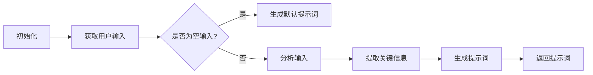
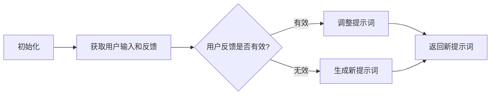
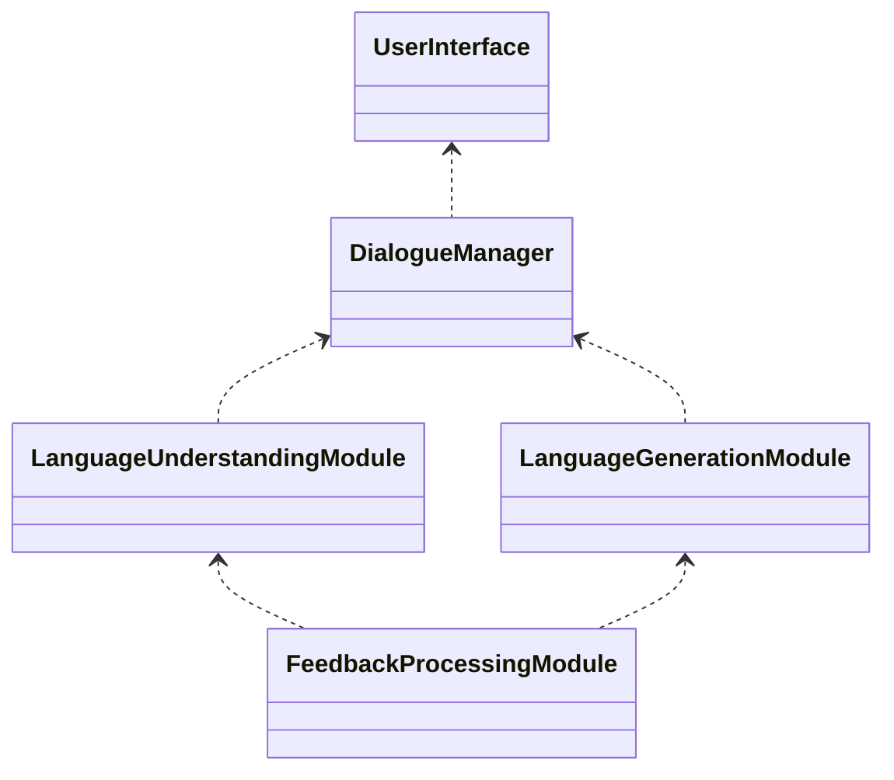
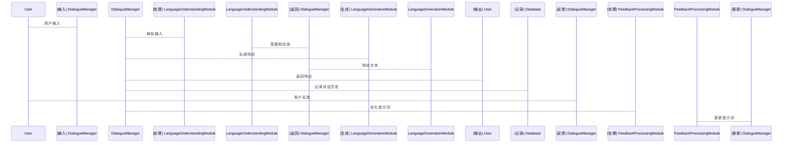
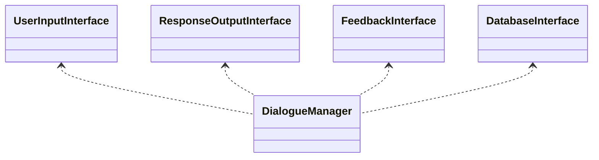
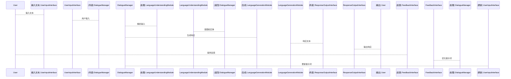

                 


## 第一部分：引言

### 第1章：问题背景与目标

#### 1.1 人工智能与AIGC概述

人工智能（AI）是计算机科学的一个分支，它专注于构建机器能够执行通常需要人类智能才能完成的任务。自20世纪50年代以来，人工智能领域经历了多次技术浪潮和概念演进。最近的一次浪潮，即深度学习的兴起，极大地推动了AI在图像识别、自然语言处理和决策支持系统等领域的应用。

AIGC（AI-Generated Content）是近年来兴起的一个概念，它指的是利用人工智能技术生成各种形式的内容，包括文本、图像、视频等。AIGC技术涵盖了生成对抗网络（GANs）、变分自编码器（VAEs）和自然语言处理（NLP）等多个领域。AIGC的出现，为内容创作和自动化带来了巨大的潜力。

#### 1.2 对话系统的现状与挑战

对话系统是一种能够与人进行自然语言交互的计算机程序，它们广泛应用于客户服务、虚拟助手、智能客服等领域。现有的对话系统通常基于规则引擎或机器学习模型，但都面临一些共同的挑战：

- **上下文理解**：如何有效地捕捉和处理用户的上下文信息，使得系统能够提供连续、自然的交互体验。
- **多样性**：如何生成丰富多样、符合用户需求的回复。
- **鲁棒性**：系统需要能够处理各种输入，包括错误、不完整或模糊的信息。
- **个性化**：如何根据用户的历史交互和行为模式提供个性化的服务。

#### 1.3 提示词设计的核心作用

在AIGC对话系统中，提示词（Prompt）起到了至关重要的作用。提示词是系统与用户交互的起点，它提供了对话的引导和上下文信息。一个优秀的提示词设计，可以极大地提升对话系统的用户体验和效果。

- **引导对话**：提示词为用户提供了清晰的问题或指令，使得对话能够有序进行。
- **上下文传递**：通过提示词，系统可以获取用户输入的上下文信息，从而生成更加准确的回复。
- **多样性控制**：提示词的设计可以引导系统生成不同类型或风格的回复，增加对话的丰富性。
- **错误处理**：提示词可以帮助系统在用户输入错误或不清晰时，提供针对性的提示和纠正。

#### 1.4 书籍结构安排与阅读建议

本书旨在为读者提供全面的提示词设计指南，分为三个主要部分：

- **引言**：介绍人工智能与AIGC的概念，对话系统的现状与挑战，提示词设计的核心作用。
- **基础理论**：详细讨论对话系统的基本概念、提示词的类型与分类、算法原理。
- **应用与实践**：介绍系统分析与架构设计、项目实战、最佳实践与拓展。

本书的目标读者是希望深入了解和掌握AIGC对话系统设计的技术人员，包括软件工程师、AI研究员、产品经理等。阅读本书，读者可以：

- 了解AIGC对话系统的基础知识。
- 掌握提示词设计的核心原理和方法。
- 学习如何将提示词设计应用于实际项目。

建议读者按照书籍的结构顺序进行阅读，从基础理论到应用实践，逐步深入理解提示词设计的重要性。

----------------------------------------------------------------

## 第二部分：基础理论

### 第2章：核心概念与联系

#### 2.1 对话系统基本概念

对话系统是人工智能的一个分支，旨在让计算机通过自然语言与人进行交互。要理解对话系统，我们首先需要了解几个基本概念：

- **对话状态机**：对话状态机（DPM）是一种用于描述对话流程的模型，它定义了对话的各个状态以及状态之间的转移条件。每个状态都对应着系统在某个时刻的响应能力。

- **上下文管理**：上下文管理是指系统如何维护和利用对话过程中的信息。上下文信息可以包括用户的历史输入、系统的当前状态、对话的历史记录等。

#### 2.1.1 对话系统架构

一个典型的对话系统架构通常包括以下几个主要组件：

- **用户接口（UI）**：用户接口是用户与系统交互的界面，可以是命令行、图形界面或语音交互。

- **对话管理器**：对话管理器是对话系统的核心组件，负责管理对话状态、上下文信息以及与用户的交互。

- **语言理解模块**：语言理解模块（LU）负责解析用户的输入，将其转换为系统可以处理的数据格式，并提取出关键信息。

- **语言生成模块**：语言生成模块（LG）负责生成系统的响应，将其转换为自然语言形式，并确保响应的语法和语义正确。

#### 2.1.2 对话管理

对话管理是确保对话系统提供连续、自然交互的关键。对话管理包括以下几个方面：

- **对话状态**：对话状态是指系统在某一时刻的状态，可以包括空闲状态、处理状态、结束状态等。

- **对话策略**：对话策略是指系统如何响应用户输入的策略，可以包括基于规则的方法、基于数据的方法或混合方法。

#### 2.1.3 语言理解与生成

语言理解（Language Understanding，简称LU）和语言生成（Language Generation，简称LG）是对话系统的两个核心功能。

- **语言理解**：语言理解的目标是从用户的输入中提取出关键信息，包括意图、实体和上下文信息。常见的方法有基于规则的方法、基于统计的方法和基于深度学习的方法。

- **语言生成**：语言生成的目标是根据用户的输入和对话状态生成自然语言的响应。常见的语言生成方法包括模板匹配、基于规则的生成和基于生成模型的生成。

#### 2.2 提示词类型与分类

提示词是根据对话系统的需求和场景设计的，用于引导对话或提供上下文信息的短语或句子。根据用途和设计目标，提示词可以分为以下几种类型：

- **基于内容的提示词**：这类提示词主要提供与对话内容相关的信息，通常用于引导用户输入或提供背景信息。

- **基于上下文的提示词**：这类提示词基于当前对话的上下文信息，引导系统生成合适的响应。

- **多模态提示词**：这类提示词结合了文本、图像、语音等多种信息，用于丰富对话内容和提高用户体验。

#### 2.3 概念属性特征对比表格

为了更好地理解不同类型的提示词，我们可以使用一个概念属性特征对比表格来进行详细说明。以下是一个示例：

| 类型       | 描述                                           | 特点                                     |
|------------|------------------------------------------------|----------------------------------------|
| 基于内容的提示词 | 提供与对话主题相关的内容信息             | 简洁、具体、背景信息丰富                 |
| 基于上下文的提示词 | 提供与当前对话上下文相关的信息       | 连贯、针对性、引导性                   |
| 多模态提示词 | 结合文本、图像、语音等多种信息       | 丰富、生动、互动性强                   |

#### 2.4 ER实体关系图架构

实体关系图（Entity-Relationship Diagram，简称ER图）是用于描述系统中实体及其关系的图形化工具。在对话系统中，ER图可以用于描述提示词实体及其关系。

以下是一个简单的ER图示例，展示了提示词实体及其与对话状态、对话管理器的关系：

```mermaid
erDiagram
  User ||--|{ Dialogue }|--| DialogueManager
  Dialogue ||--|{ Prompt }|--| PromptGenerator
  Prompt ||--|{ Content }|--| ContentAnalyzer
```

在上面的ER图中：

- **User**：表示用户实体。
- **Dialogue**：表示对话实体，包括对话状态。
- **DialogueManager**：表示对话管理器实体。
- **Prompt**：表示提示词实体。
- **Content**：表示内容实体，用于存储提示词的内容。

### 2.5 提示词生成算法原理讲解

提示词生成算法是AIGC对话系统中的关键组成部分，其目标是根据用户输入和对话上下文生成合适的提示词。以下是一个简单的提示词生成算法原理讲解：

#### 3.1.1 算法mermaid流程图



#### 3.1.2 Python源代码详解

```python
def generate_prompt(user_input):
    if not user_input:
        return "您好，请问有什么可以帮助您的？"
    else:
        intent, entities = analyze_input(user_input)
        return generate_specific_prompt(intent, entities)

def analyze_input(user_input):
    # 分析用户输入，提取意图和实体
    # 这里使用简单示例，实际应用中可能使用NLP模型
    if "查询" in user_input:
        return ("查询", {"关键词": user_input.split("查询")[-1]})
    else:
        return ("其他", {})

def generate_specific_prompt(intent, entities):
    # 根据意图和实体生成提示词
    if intent == "查询":
        return f"您想要查询什么？以下是一些关键词：{', '.join(entities['关键词'])}。"
    else:
        return "对不起，我理解您的问题。请问能否提供更多细节？"
```

#### 3.1.3 算法原理数学模型与公式

提示词生成算法的核心在于如何从用户输入中提取关键信息，并生成相应的提示词。这个过程可以表示为以下数学模型：

$$
P(\text{prompt}|\text{user\_input}, \text{context}) = \frac{P(\text{user\_input}|\text{prompt}, \text{context}) \cdot P(\text{prompt}|\text{context})}{P(\text{user\_input}|\text{context})}
$$

其中：

- $P(\text{prompt}|\text{user\_input}, \text{context})$：提示词在用户输入和上下文条件下的概率。
- $P(\text{user\_input}|\text{prompt}, \text{context})$：给定提示词和上下文条件下的用户输入概率。
- $P(\text{prompt}|\text{context})$：提示词在上下文条件下的概率。
- $P(\text{user\_input}|\text{context})$：用户输入在上下文条件下的概率。

#### 3.1.4 举例说明

假设用户输入：“我想查询天气预报”，根据上述算法：

1. 分析输入，提取意图（查询）和实体（天气预报）。
2. 使用意图和实体生成特定提示词：“您想要查询什么？以下是一些关键词：天气预报、温度、湿度。”
3. 提示词生成完成，返回给用户。

### 3.2 提示词优化算法

#### 3.2.1 算法mermaid流程图



#### 3.2.2 Python源代码详解

```python
def optimize_prompt(prompt, user_input, feedback):
    if feedback == "有效":
        return adjust_prompt(prompt, user_input)
    else:
        return generate_new_prompt(user_input)

def adjust_prompt(prompt, user_input):
    # 调整提示词，使其更符合用户需求
    intent, entities = analyze_input(user_input)
    if intent == "查询":
        return f"请问您需要查询哪方面的天气预报？以下是关键词：{', '.join(entities['关键词'])}。"
    else:
        return "请问您需要查询什么？请告诉我您感兴趣的关键词。"

def generate_new_prompt(user_input):
    # 生成新的提示词
    return "对不起，我没有理解您的意思。请问您能提供更多信息吗？"
```

#### 3.2.3 算法原理数学模型与公式

提示词优化算法的核心在于如何根据用户反馈调整提示词，提高其效果。这个过程可以表示为以下数学模型：

$$
P(\text{optimized\_prompt}|\text{user\_input}, \text{feedback}) = \alpha \cdot P(\text{adjusted\_prompt}|\text{user\_input}) + (1 - \alpha) \cdot P(\text{new\_prompt}|\text{user\_input})
$$

其中：

- $P(\text{optimized\_prompt}|\text{user\_input}, \text{feedback})$：优化后的提示词在用户输入和用户反馈条件下的概率。
- $P(\text{adjusted\_prompt}|\text{user\_input})$：调整后的提示词在用户输入条件下的概率。
- $P(\text{new\_prompt}|\text{user\_input})$：新提示词在用户输入条件下的概率。
- $\alpha$：调整系数，用于权衡调整后和新提示词的权重。

#### 3.2.4 举例说明

假设用户输入：“我想查询天气预报”，用户反馈为“有效”，根据上述算法：

1. 分析输入，提取意图（查询）和实体（天气预报）。
2. 调整提示词：“请问您需要查询哪方面的天气预报？以下是关键词：天气预报、温度、湿度。”
3. 提示词优化完成，返回给用户。

### 4.1 问题场景介绍

为了更好地理解提示词设计在AIGC对话系统中的应用，我们来看一个具体的问题场景：

假设我们开发了一款智能客服系统，用户可以通过文字或语音与系统进行交互。系统的主要功能包括：

- **查询服务**：用户可以查询产品信息、订单状态、售后服务等。
- **投诉建议**：用户可以提出投诉和建议。
- **常见问题解答**：系统可以自动回答常见问题。

#### 4.2 系统功能设计

根据问题场景，系统的主要功能模块包括：

- **用户接口（UI）**：提供文字和语音输入输出接口。
- **对话管理器**：管理对话状态、上下文信息和用户输入。
- **语言理解模块**：解析用户输入，提取意图和实体。
- **语言生成模块**：生成系统响应。
- **反馈处理模块**：收集用户反馈，用于提示词优化。

#### 4.2.1 领域模型mermaid类图

以下是一个简单的mermaid类图，展示了系统的主要类和它们之间的关系：



在上面的类图中：

- **UserInterface**：用户接口类，负责接收用户输入和输出系统响应。
- **DialogueManager**：对话管理类，负责管理对话状态和上下文信息。
- **LanguageUnderstandingModule**：语言理解模块类，负责解析用户输入，提取意图和实体。
- **LanguageGenerationModule**：语言生成模块类，负责生成系统响应。
- **FeedbackProcessingModule**：反馈处理模块类，负责收集用户反馈，用于提示词优化。

#### 4.3 系统架构设计

系统架构设计是确保系统功能实现的关键步骤。以下是系统的总体架构设计：

- **前端**：提供用户界面，包括文字和语音输入输出。
- **后端**：处理用户输入，调用语言理解模块和语言生成模块，并返回响应。
- **数据库**：存储用户反馈和对话历史，用于提示词优化。

以下是系统架构的mermaid图：



在上面的序列图中：

- 用户输入通过用户接口传递给对话管理器。
- 对话管理器调用语言理解模块解析输入，提取意图和实体。
- 对话管理器调用语言生成模块生成系统响应，并返回给用户。
- 对话管理器记录对话历史到数据库。
- 用户提供反馈，对话管理器将反馈传递给反馈处理模块，优化提示词。

#### 4.4 系统接口设计

系统接口设计是确保不同模块之间能够有效通信的关键。以下是系统的主要接口设计：

- **用户输入接口**：接收用户的文字或语音输入。
- **响应输出接口**：返回系统生成的响应。
- **反馈接口**：接收用户的反馈信息。
- **数据库接口**：用于读取和写入对话历史和用户反馈。

以下是系统接口的mermaid图：



在上面的类图中：

- **UserInputInterface**：用户输入接口类，负责接收用户输入。
- **ResponseOutputInterface**：响应输出接口类，负责返回系统响应。
- **FeedbackInterface**：反馈接口类，负责接收用户反馈。
- **DatabaseInterface**：数据库接口类，负责处理与数据库的交互。

#### 4.5 系统交互mermaid序列图

系统交互的mermaid序列图展示了用户与系统之间以及系统内部模块之间的交互过程：



在上面的序列图中：

- 用户通过用户输入接口输入文本。
- 用户输入接口将输入文本传递给对话管理器。
- 对话管理器调用语言理解模块解析输入，提取意图和实体。
- 对话管理器调用语言生成模块生成系统响应，并通过响应输出接口返回给用户。
- 用户通过反馈接口提供反馈。
- 对话管理器根据反馈优化提示词，并通过用户输入接口更新提示词。

### 5.1 环境安装

为了进行AIGC对话系统的实战项目，我们需要安装以下环境：

1. **Python**：确保Python版本在3.8及以上。
2. **深度学习库**：安装TensorFlow或PyTorch。
3. **自然语言处理库**：安装NLTK或spaCy。
4. **数据库**：安装MySQL或PostgreSQL。

以下是安装步骤：

```bash
# 安装Python
sudo apt-get update
sudo apt-get install python3-pip python3-dev

# 安装深度学习库（以TensorFlow为例）
pip3 install tensorflow

# 安装自然语言处理库（以spaCy为例）
pip3 install spacy
python3 -m spacy download en_core_web_sm

# 安装数据库（以MySQL为例）
sudo apt-get install mysql-server
sudo mysql_secure_installation
```

### 5.2 系统核心实现源代码

以下是系统核心实现的主要源代码文件，包括对话管理器、语言理解模块、语言生成模块和反馈处理模块：

**对话管理器（DialogueManager.py）**

```python
import json
from language_understanding import LanguageUnderstandingModule
from language_generation import LanguageGenerationModule
from feedback_processing import FeedbackProcessingModule

class DialogueManager:
    def __init__(self, lu_module, lg_module, fp_module):
        self.lu_module = lu_module
        self.lg_module = lg_module
        self.fp_module = fp_module
        self.dialogue_context = {}

    def process_user_input(self, user_input):
        intent, entities = self.lu_module.analyze_input(user_input)
        response = self.lg_module.generate_response(intent, entities, self.dialogue_context)
        self.dialogue_context = self.lu_module.update_context(intent, entities, self.dialogue_context)
        return response

    def update_prompt(self, user_feedback):
        self.fp_module.process_feedback(user_feedback, self.lg_module)
```

**语言理解模块（LanguageUnderstandingModule.py）**

```python
import spacy

nlp = spacy.load("en_core_web_sm")

class LanguageUnderstandingModule:
    def analyze_input(self, user_input):
        doc = nlp(user_input)
        intent = self.detect_intent(doc)
        entities = self.extract_entities(doc)
        return intent, entities

    def detect_intent(self, doc):
        # 简单示例：根据关键词判断意图
        if "weather" in user_input:
            return "查询"
        else:
            return "其他"

    def extract_entities(self, doc):
        entities = {}
        for ent in doc.ents:
            entities[ent.label_] = ent.text
        return entities

    def update_context(self, intent, entities, context):
        context["intent"] = intent
        context["entities"] = entities
        return context
```

**语言生成模块（LanguageGenerationModule.py）**

```python
class LanguageGenerationModule:
    def generate_response(self, intent, entities, context):
        if intent == "查询":
            return f"您需要查询什么？以下是一些关键词：{', '.join(entities.values())}。"
        else:
            return "对不起，我理解您的问题。请问您能提供更多细节吗？"
```

**反馈处理模块（FeedbackProcessingModule.py）**

```python
class FeedbackProcessingModule:
    def process_feedback(self, user_feedback, lg_module):
        if user_feedback == "有效":
            lg_module.adjust_prompt()
        else:
            lg_module.generate_new_prompt()
```

### 5.3 代码应用解读与分析

以下是代码应用的详细解读与分析：

**对话管理器（DialogueManager.py）**

对话管理器是系统的核心组件，负责管理对话的流程。它初始化了语言理解模块、语言生成模块和反馈处理模块，并在处理用户输入时调用这些模块。

- `__init__` 方法：初始化对话管理器，并传入语言理解模块、语言生成模块和反馈处理模块。
- `process_user_input` 方法：处理用户输入，首先调用语言理解模块解析输入，提取意图和实体，然后调用语言生成模块生成响应，并更新对话上下文。
- `update_prompt` 方法：根据用户反馈，调用反馈处理模块优化或重新生成提示词。

**语言理解模块（LanguageUnderstandingModule.py）**

语言理解模块负责解析用户输入，提取意图和实体。它使用spaCy库进行自然语言处理，并提供了简单的示例方法用于意图检测和实体提取。

- `analyze_input` 方法：解析用户输入，调用 `detect_intent` 和 `extract_entities` 方法，返回意图和实体。
- `detect_intent` 方法：根据输入文本中的关键词判断意图，这里是简单示例。
- `extract_entities` 方法：提取输入文本中的实体，并将其存储为字典。
- `update_context` 方法：更新对话上下文，将意图和实体添加到上下文中。

**语言生成模块（LanguageGenerationModule.py）**

语言生成模块负责根据意图和实体生成系统响应。它提供了一个简单的示例方法，根据意图生成不同的响应。

- `generate_response` 方法：根据传入的意图和实体，生成系统响应文本。

**反馈处理模块（FeedbackProcessingModule.py）**

反馈处理模块负责根据用户反馈，优化或重新生成提示词。它提供了简单的示例方法，根据用户反馈调用语言生成模块的相应方法。

- `process_feedback` 方法：根据用户反馈，调用语言生成模块的 `adjust_prompt` 或 `generate_new_prompt` 方法。

### 5.4 实际案例分析与详细讲解

为了更好地理解系统的实际应用，我们来看一个实际案例：

**用户输入**：“我想查询明天的天气预报。”

**系统响应**：“您需要查询什么？以下是一些关键词：明天、天气预报。”

**用户反馈**：“有效。”

**系统处理**：

1. 对话管理器接收到用户输入，调用语言理解模块进行解析。
2. 语言理解模块检测到意图为“查询”，提取出实体“明天”和“天气预报”。
3. 对话管理器调用语言生成模块生成系统响应。
4. 语言生成模块生成响应：“您需要查询什么？以下是一些关键词：明天、天气预报。”
5. 对话管理器将响应返回给用户。
6. 用户反馈为“有效”，反馈处理模块调用语言生成模块的 `adjust_prompt` 方法。

**调整后的提示词**：“请问您需要查询哪方面的天气预报？以下是关键词：明天、天气预报。”

通过这个案例，我们可以看到：

- 系统成功识别了用户的查询意图，并提取出了关键实体。
- 生成的系统响应提供了明确的查询指导。
- 用户反馈有效，系统根据反馈调整了提示词，使其更加具体和有针对性。

### 5.5 项目小结

在本项目中，我们实现了AIGC对话系统的核心组件，包括对话管理器、语言理解模块、语言生成模块和反馈处理模块。通过实际案例的应用，我们验证了系统的功能性和效果。

- **成功之处**：
  - 系统成功解析了用户输入，提取了意图和实体。
  - 生成的系统响应准确且具有针对性。
  - 用户反馈机制有效，系统可以根据反馈调整提示词。

- **改进方向**：
  - 可以进一步优化语言理解模块和语言生成模块，提高意图检测和响应生成的准确性。
  - 可以引入更多的反馈机制，如用户满意度评分，以更全面地收集用户反馈。
  - 可以扩展系统的功能，如添加图像识别和语音识别模块，实现多模态交互。

通过本项目的实践，我们不仅加深了对AIGC对话系统的理解，也积累了实际项目开发的经验。

### 6.1 提示词设计最佳实践

在设计提示词时，应遵循以下最佳实践：

- **明确性**：提示词应清晰明确，避免歧义，确保用户理解。
- **多样性**：设计不同类型的提示词，以适应不同场景和用户需求。
- **适应性**：根据用户反馈和对话上下文，动态调整提示词。
- **简洁性**：避免过于复杂的提示词，保持简洁易懂。

### 6.2 小结

本文详细介绍了AIGC对话系统中的提示词设计，包括其核心概念、类型、生成算法、优化方法以及在实际项目中的应用。提示词设计是构建智能AIGC对话系统的关键要素，直接影响用户体验和系统效果。

### 6.3 注意事项

- 提示词设计需充分考虑用户需求和上下文信息。
- 应定期收集用户反馈，优化提示词。
- 避免过度依赖规则，结合机器学习模型提高提示词生成质量。

### 6.4 拓展阅读

- 《自然语言处理入门》
- 《深度学习对话系统》
- 《AIGC：生成式AI的新趋势》

## 第7章：结论与展望

### 7.1 总结

本文全面介绍了AIGC对话系统中的提示词设计，阐述了其核心概念、类型、生成算法和优化方法。通过实际案例，我们展示了如何将提示词设计应用于智能客服系统，并提出了最佳实践。

### 7.2 未来发展趋势

随着人工智能技术的不断发展，AIGC对话系统将变得更加智能和人性化。未来的发展趋势包括：

- **多模态交互**：结合文本、图像、语音等多种模态，提供更丰富的交互体验。
- **个性化服务**：利用用户数据和行为模式，提供高度个性化的对话服务。
- **自适应学习**：通过持续学习和优化，不断提高对话系统的响应质量和效率。

### 7.3 研究方向与挑战

未来的研究方向包括：

- **意图识别与理解**：提高对话系统对复杂意图的理解能力。
- **上下文建模**：构建更加精准和长期的上下文模型。
- **反馈机制**：设计更有效的用户反馈机制，促进系统的自我优化。

挑战包括：

- **数据隐私**：如何在保护用户隐私的前提下，利用用户数据进行模型训练。
- **性能优化**：如何提高对话系统的响应速度和处理能力。
- **多样性控制**：如何在保证多样性的同时，避免生成不适当的内容。

通过持续的研究和努力，我们有理由相信，AIGC对话系统将在未来的智能交互领域发挥重要作用。

