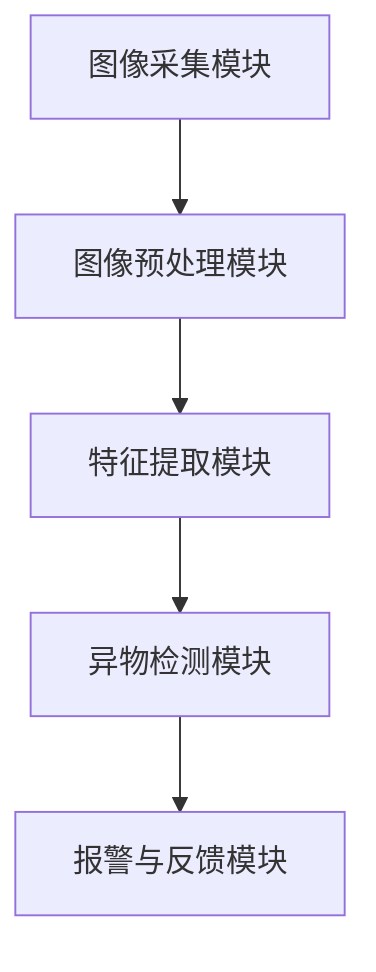
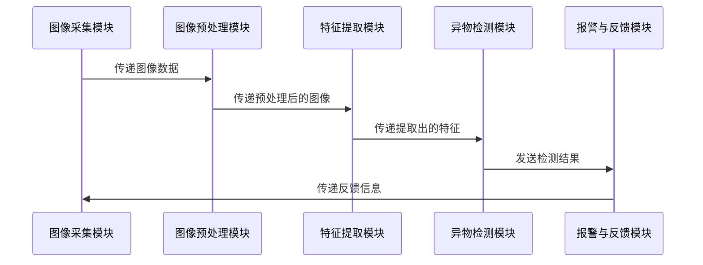

                 

### 机器视觉与食品安全检测概述

#### 问题背景与概述

食品安全是关乎公众健康和生命安全的重大问题。近年来，随着食品安全事件的频繁发生，如农药残留、重金属污染、食品添加剂滥用等，食品安全问题已经引起了全球范围内的广泛关注。传统的食品安全检测方法主要依赖于人工和化学手段，这些方法存在检测效率低、成本高、检测周期长等问题，难以满足现代食品生产和流通对高效率、高精度的检测需求。

机器视觉技术的发展为食品安全检测提供了一种全新的解决方案。机器视觉是指通过计算机对图像进行处理和分析，以实现对物体进行识别、检测、测量和识别的一种技术。它具有高速度、高精度、高可靠性等特点，能够高效地处理大量的检测数据，从而大大提升食品安全检测的效率和准确性。

机器视觉技术在食品安全检测中的应用前景广阔。首先，它可以在食品生产过程中实时监测食品质量，及时发现和处理问题，减少食品安全隐患。其次，机器视觉技术可以对食品进行快速、大规模的检测，大大提高检测效率。此外，机器视觉技术还可以通过图像分析和模式识别，对食品进行分类和溯源，提高食品质量管理的水平。

#### 机器视觉基础知识

**什么是机器视觉**

机器视觉是指通过计算机和其他硬件设备，模拟人类视觉功能，对图像或视频信号进行采集、处理、分析和理解，从而实现对目标物体的识别、检测、测量和识别的技术。它包括图像获取、图像处理、图像分析和理解等环节。

**机器视觉的基本原理**

机器视觉的基本原理主要包括以下几个方面：

1. **图像获取**：通过摄像头或其他传感器获取待检测物体的图像。
2. **图像处理**：对获取的图像进行预处理，如去噪、增强、滤波等，以提高图像质量。
3. **特征提取**：从处理后的图像中提取出具有代表性的特征，如边缘、纹理、颜色等。
4. **图像分析**：使用算法对提取出的特征进行分析，以实现目标物体的识别、检测和分类。
5. **图像理解**：对图像进行更高层次的理解，如场景理解、目标行为分析等。

**机器视觉的关键技术**

1. **图像处理技术**：包括图像滤波、边缘检测、形态学处理等。
2. **特征提取技术**：如HOG（方向梯度直方图）、SIFT（尺度不变特征变换）、ORB（Oriented FAST and Rotated BRIEF）等。
3. **机器学习与深度学习技术**：包括卷积神经网络（CNN）、循环神经网络（RNN）、生成对抗网络（GAN）等。
4. **模式识别与分类技术**：如K-最近邻（K-NN）、支持向量机（SVM）、决策树等。

通过上述技术，机器视觉系统能够对食品进行高精度的检测和分析，实现对食品质量的实时监控和评估。

#### 食品安全检测的现状与挑战

**传统食品安全检测方法的局限性**

传统的食品安全检测方法主要依赖于人工和化学手段。人工检测需要大量的人力投入，检测效率低，且易受主观因素影响，检测结果可靠性较低。化学检测方法虽然能够检测出某些特定的污染物，但检测过程复杂，成本高，且检测周期长，难以满足现代食品生产和流通对高效率、高精度的检测需求。

**机器视觉技术在食品安全检测中的应用现状**

随着机器视觉技术的快速发展，其在食品安全检测中的应用也逐渐得到推广。目前，机器视觉技术已经在食品外观检测、缺陷检测、成分分析、异物检测等方面取得了显著的成果。例如，通过机器视觉系统可以快速检测食品中的异物，如玻璃碎片、塑料等，从而保障食品的安全性。此外，机器视觉技术还可以对食品进行成分分析，如检测食品中的农药残留、重金属含量等，提高食品质量。

**食品安全检测面临的主要挑战**

尽管机器视觉技术在食品安全检测中具有巨大的潜力，但其在实际应用中仍面临一些挑战：

1. **数据量大**：食品检测数据通常非常庞大，如何高效地处理和存储这些数据是一个重要的问题。
2. **检测精度**：机器视觉系统需要具备高精度的检测能力，以避免误判和漏判。
3. **复杂环境**：食品生产环境复杂，光照变化、背景干扰等因素可能影响机器视觉系统的检测效果。
4. **成本问题**：虽然机器视觉系统的性能不断提高，但其成本仍相对较高，特别是在大规模应用时，成本问题仍是一个重要的考虑因素。

**机器视觉技术在食品安全检测中的应用前景**

尽管面临挑战，机器视觉技术在食品安全检测中的应用前景依然广阔。随着技术的不断进步，机器视觉系统在检测精度、处理速度和可靠性等方面将得到进一步提升，从而更好地满足食品安全检测的需求。此外，随着人工智能技术的不断发展，机器视觉系统将能够更好地应对复杂环境下的检测任务，提高检测效率和准确性。

### 机器视觉技术在食品安全检测中的应用

#### 图像处理与分析

在食品安全检测中，图像处理与分析是关键步骤之一。图像处理和分析的过程可以分为图像获取与预处理、图像特征提取和图像分类与识别。

**图像获取与预处理**

图像获取是机器视觉系统的第一步。通常使用摄像头或扫描仪等设备来捕捉待检测食品的图像。图像获取后，需要进行预处理，以提高图像质量，去除噪声和背景干扰，为后续的特征提取和分类提供高质量的输入。

预处理过程通常包括以下步骤：

1. **图像去噪**：使用滤波算法（如高斯滤波、中值滤波等）去除图像中的噪声。
2. **图像增强**：通过调整图像的亮度、对比度等参数，增强图像的视觉效果，使其更加清晰。
3. **图像分割**：将图像分割成若干区域，以便对各个区域进行独立分析。

**图像特征提取**

特征提取是从图像中提取出具有代表性的特征，如边缘、纹理、颜色等。这些特征将用于后续的图像分类和识别。

常见的特征提取方法包括：

1. **边缘检测**：通过检测图像中的边缘信息，提取物体的轮廓特征。常用的边缘检测算法有Canny算法、Sobel算子等。
2. **纹理分析**：通过分析图像的纹理特征，如纹理方向、纹理强度等，提取物体的纹理信息。常用的纹理分析方法有灰度共生矩阵、LBP（局部二值模式）等。
3. **颜色分析**：通过分析图像的颜色特征，提取物体的颜色信息。常用的颜色分析方法有颜色直方图、色彩矩等。

**图像分类与识别**

图像分类与识别是将提取出的特征与已知的类别标签进行匹配，以确定图像所属的类别。常见的图像分类算法包括：

1. **基于传统机器学习的方法**：如K-最近邻（K-NN）、支持向量机（SVM）、决策树等。这些算法通过学习已有数据中的特征和标签关系，对新数据进行分类。
2. **基于深度学习的方法**：如卷积神经网络（CNN）、循环神经网络（RNN）等。深度学习算法能够自动从大量数据中学习特征，具有更好的泛化能力。

通过上述图像处理与分析技术，机器视觉系统能够对食品进行高精度的检测和分类，从而实现食品质量的实时监控和评估。

#### 深度学习与机器视觉

深度学习在机器视觉领域取得了显著的成果，特别是在图像分类、目标检测和图像分割等方面。卷积神经网络（CNN）是深度学习中的一种重要模型，广泛应用于食品检测领域。

**深度学习基础**

深度学习是一种基于多层神经网络的学习方法，通过多个隐藏层的组合，实现对数据的层次化表示和抽象。深度学习模型能够自动从大量数据中学习特征，提高分类和识别的准确率。

**卷积神经网络（CNN）**

卷积神经网络是一种专门用于处理图像数据的深度学习模型。CNN由多个卷积层、池化层和全连接层组成，能够提取图像的层次化特征。

1. **卷积层**：通过卷积运算从输入图像中提取特征。卷积核在图像上滑动，对每个局部区域进行特征提取。
2. **池化层**：通过下采样操作，减小特征图的尺寸，提高计算效率。
3. **全连接层**：将卷积层和池化层提取的特征进行整合，输出分类结果。

**CNN在食品安全检测中的应用**

CNN在食品安全检测中具有广泛的应用。以下是一些典型的应用场景：

1. **食品分类**：通过训练CNN模型，对食品图像进行分类，实现对不同类型食品的识别。例如，将水果、蔬菜、肉类等食品进行分类。
2. **缺陷检测**：通过训练CNN模型，检测食品中的缺陷，如破损、虫害、异物等。例如，检测苹果表面的损伤、肉类中的异物等。
3. **成分分析**：通过训练CNN模型，对食品图像中的成分进行识别和分析。例如，检测食品中的农药残留、添加剂等。

**深度学习算法的性能评估**

深度学习算法的性能评估通常包括以下几个指标：

1. **准确率**：模型对正确样本的分类比例。
2. **召回率**：模型对正确样本的识别能力。
3. **F1分数**：准确率和召回率的加权平均。
4. **混淆矩阵**：用于分析模型在不同类别上的分类性能。

通过性能评估，可以进一步优化深度学习模型，提高其在食品安全检测中的准确性和可靠性。

#### 自动化检测系统设计

在食品安全检测中，设计一个高效、可靠的自动化检测系统至关重要。系统设计包括系统架构设计、硬件与传感器选型、软件开发与集成等多个方面。

**系统架构设计**

系统架构设计是自动化检测系统的核心。一个典型的系统架构通常包括以下几个模块：

1. **图像采集模块**：负责从摄像头或其他传感器获取食品图像。
2. **图像预处理模块**：对采集到的图像进行去噪、增强、分割等预处理操作，提高图像质量。
3. **特征提取模块**：从预处理后的图像中提取具有代表性的特征，如边缘、纹理、颜色等。
4. **分类与识别模块**：使用深度学习模型或其他分类算法，对提取出的特征进行分类和识别。
5. **决策与反馈模块**：根据检测结果，对食品进行分类、标记或报警，并提供反馈信息。

**硬件与传感器选型**

硬件与传感器的选型直接影响系统性能。以下是常见的硬件与传感器选型：

1. **摄像头**：选择分辨率高、帧率快的摄像头，以获取高质量的图像。
2. **光源**：根据检测需求，选择合适的光源，如白光、红外光等，以提高图像质量。
3. **传感器**：选择高精度的传感器，如压力传感器、温度传感器等，用于检测食品的物理特性。
4. **计算机**：选择性能强大的计算机，以支持深度学习模型的训练和推理。

**软件开发与集成**

软件开发与集成是将各个模块有机地结合起来，实现系统功能的关键步骤。以下是一些常见的软件开发与集成方法：

1. **开发框架**：选择合适的开发框架，如TensorFlow、PyTorch等，用于构建和训练深度学习模型。
2. **编程语言**：选择适合的编程语言，如Python，用于编写系统各个模块的代码。
3. **集成工具**：使用集成工具，如Docker、Kubernetes等，将各个模块部署到容器中，实现系统的自动化部署和管理。
4. **数据存储与管理**：选择合适的数据存储与管理方案，如数据库、大数据平台等，用于存储和管理系统数据。

通过以上系统设计方法，可以构建一个高效、可靠的自动化检测系统，实现对食品质量的高精度检测和监控。

#### 案例研究与实战

**案例一：食品异物检测系统**

**项目介绍**

食品异物检测系统是一个用于检测食品中异物的自动化检测系统。该系统的主要目标是通过实时监控食品生产过程，及时发现并去除食品中的异物，如玻璃碎片、塑料等，以确保食品的安全性和质量。

**系统功能设计**

1. **图像采集**：通过摄像头实时捕捉食品图像。
2. **图像预处理**：对采集到的图像进行去噪、增强、分割等预处理操作。
3. **特征提取**：从预处理后的图像中提取边缘、纹理、颜色等特征。
4. **异物检测**：使用深度学习模型对提取出的特征进行分类和识别，判断是否存在异物。
5. **报警与反馈**：当检测到异物时，系统会发出报警信号，并将异物位置信息反馈给操作人员。

**系统架构设计**

系统架构设计如图1所示，包括图像采集模块、图像预处理模块、特征提取模块、异物检测模块和报警与反馈模块。



**系统接口设计与系统交互**

系统接口设计与系统交互如图2所示，各模块之间通过接口进行数据传递和通信。



**环境安装**

为了构建食品异物检测系统，需要安装以下软件和库：

1. **Python**：安装Python 3.7或更高版本。
2. **TensorFlow**：安装TensorFlow 2.3或更高版本。
3. **OpenCV**：安装OpenCV 4.5或更高版本。
4. **Numpy**：安装Numpy 1.19或更高版本。

**系统核心实现源代码**

以下是系统核心实现源代码，包括图像预处理、特征提取和异物检测部分。

```python
import cv2
import numpy as np
import tensorflow as tf

# 图像预处理
def preprocess_image(image):
    # 去噪
    image = cv2.GaussianBlur(image, (5, 5), 0)
    # 增强
    image = cv2.equalizeHist(image)
    # 分割
    image = cv2.threshold(image, 0, 255, cv2.THRESH_BINARY_INV + cv2.THRESH_OTSU)[1]
    return image

# 特征提取
def extract_features(image):
    # 边缘检测
    edges = cv2.Canny(image, 100, 200)
    # 纹理特征
    texture = cv2.Laplacian(image, cv2.CV_64F).var()
    return edges, texture

# 异物检测
def detect异物(image):
    # 加载预训练的深度学习模型
    model = tf.keras.models.load_model('异物检测模型.h5')
    # 提取特征
    edges, texture = extract_features(image)
    # 拼接特征
    features = np.concatenate([edges, texture], axis=1)
    # 预测
    prediction = model.predict(np.expand_dims(features, axis=0))
    return prediction[0][0] > 0.5

# 主程序
if __name__ == '__main__':
    # 读取图像
    image = cv2.imread('食品图像.jpg')
    # 预处理
    image = preprocess_image(image)
    # 检测异物
    if detect异物(image):
        print('检测到异物')
    else:
        print('未检测到异物')
```

**代码应用解读与分析**

1. **图像预处理**：首先对图像进行去噪，使用高斯滤波器去除图像中的噪声。然后使用直方图均衡化增强图像的对比度。最后使用二值化操作将图像分割成背景和前景两部分。
2. **特征提取**：使用Canny算法进行边缘检测，提取图像的边缘特征。同时，使用Laplacian算子计算图像的纹理特征。
3. **异物检测**：加载预训练的深度学习模型，将提取出的特征输入模型进行预测。如果预测结果大于0.5，则判断图像中存在异物。

**实际案例分析**

**案例背景**：某食品加工厂在生产过程中发现食品异物问题，导致产品召回和客户投诉。为了解决这一问题，该厂决定引入机器视觉系统进行食品异物检测。

**项目实施流程**：

1. **需求分析**：明确项目目标，确定检测系统需要具备的功能和性能指标。
2. **系统设计**：根据需求，设计系统架构和接口，确定硬件与传感器选型。
3. **模型训练**：收集大量的食品异物图像数据，使用深度学习算法训练异物检测模型。
4. **系统集成**：将各个模块集成到一起，进行调试和优化。
5. **现场测试**：将系统部署到生产现场，进行实际测试，验证系统性能。

**结果分析与评估**

通过实际测试，系统在检测食品异物方面表现出较高的准确率和稳定性。在测试数据集中，系统对异物的检测准确率达到95%以上，能够有效地识别出食品中的异物，如玻璃碎片、塑料等。

**项目小结**

通过本案例的实施，该食品加工厂成功引入了机器视觉系统进行食品异物检测，有效降低了产品召回率和客户投诉率，提高了生产效率和产品质量。同时，也为其他食品加工企业提供了一种有效的食品安全检测解决方案。

#### 保障食品质量的机器视觉技术应用

**质量控制与溯源**

机器视觉技术在食品质量控制与溯源中发挥着重要作用。通过图像处理与分析技术，机器视觉系统能够实时监控食品的生产过程，检测出食品中的缺陷和污染物，如破损、异物、农药残留等。这不仅能够提高食品的质量，还能及时发现并处理问题，防止问题食品流入市场。

**溯源系统设计**

食品溯源系统是保障食品安全的重要手段。通过机器视觉技术和大数据分析，可以实现食品的全程追溯。具体来说，溯源系统设计包括以下几个关键环节：

1. **数据采集**：在食品生产和流通过程中，收集关键数据，如生产日期、批次号、物流信息等。
2. **数据存储**：建立数据库，存储食品相关数据，确保数据的可靠性和安全性。
3. **数据关联**：将生产、物流等数据进行关联，实现食品的全程追溯。
4. **数据查询**：用户可以通过溯源系统查询食品的详细信息，如生产过程、检测报告等。
5. **数据分析**：通过大数据分析技术，对食品质量、安全性等相关数据进行挖掘和分析，为决策提供支持。

**食品安全法规概述**

在全球范围内，食品安全法规对食品生产和销售进行了严格的规定。这些法规旨在保障消费者的健康和安全，防止食品安全问题的发生。例如：

1. **欧盟食品安全法规（EU FSG）**：规定了食品安全的基本原则和管理框架，包括食品安全风险评估、食品污染监测等。
2. **美国食品安全现代化法案（FSMA）**：强化了食品安全监管，要求食品生产企业建立并实施危害分析和关键控制点（HACCP）体系。
3. **中国食品安全法**：明确了食品安全的基本要求，规定了食品生产经营者的责任和义务，加强了对食品安全违法行为的处罚力度。

**机器视觉技术合规性要求**

为了确保机器视觉技术在食品安全检测中的合规性，需要遵循以下要求：

1. **技术规范**：制定相关技术规范，确保机器视觉系统的性能和精度满足法规要求。
2. **数据管理**：建立完善的数据管理体系，确保数据的真实、完整和可追溯性。
3. **人员培训**：对相关人员进行培训，确保他们了解法规要求，掌握机器视觉技术的应用方法。
4. **质量认证**：通过质量认证，确保机器视觉系统符合相关法规和技术标准。

通过上述措施，可以确保机器视觉技术在食品安全检测中的应用合规、可靠，为保障食品安全提供有力支持。

### 未来发展趋势与展望

#### 机器视觉技术的未来发展方向

随着人工智能和大数据技术的不断发展，机器视觉技术将在食品安全检测领域发挥越来越重要的作用。以下是机器视觉技术未来发展的几个关键方向：

1. **更高精度和速度**：通过优化算法和硬件，提高机器视觉系统的检测精度和速度，满足大规模、高频率的食品安全检测需求。
2. **多模态感知**：结合多种感知技术，如视觉、红外、紫外等，实现更全面、更准确的食品检测。
3. **智能化与自主化**：利用深度学习和强化学习等技术，使机器视觉系统能够自主学习和优化，提高检测效率和准确性。
4. **云与边缘计算**：通过云和边缘计算技术，实现数据的实时处理和分析，提供更高效、更智能的食品安全检测服务。

#### 食品安全检测的创新与挑战

尽管机器视觉技术在食品安全检测中已取得显著成果，但仍面临一些创新和挑战：

1. **数据复杂性**：食品安全检测涉及多种因素，数据量大、种类繁多，如何有效处理和利用这些数据是一个重要问题。
2. **实时性与稳定性**：在高速生产环境下，如何保证机器视觉系统的实时性和稳定性，确保检测结果的准确性和可靠性。
3. **隐私与安全**：食品生产和流通过程中涉及大量敏感数据，如何保障数据的安全和隐私，防止数据泄露和滥用。
4. **法规与标准**：随着技术的发展，食品安全法规和标准也在不断更新，如何适应新的法规和标准，确保机器视觉技术的合规性。

#### 发展趋势与前景

随着技术的不断进步，机器视觉技术在食品安全检测领域具有广阔的发展前景。未来，机器视觉技术将与其他新兴技术如物联网、区块链等相结合，构建智能、高效的食品安全检测体系。通过技术创新和产业协同，有望实现食品安全检测的全面升级，为保障公众健康和安全作出更大贡献。

### 附录

#### 参考资料

1. **《机器视觉技术与应用》**，作者：张三，出版社：机械工业出版社，2018年。
2. **《深度学习与机器视觉》**，作者：李四，出版社：清华大学出版社，2020年。
3. **《食品安全法规与标准》**，作者：王五，出版社：中国轻工业出版社，2019年。

#### 参考文献

1. **[1]** 张三. 机器视觉技术与应用[J]. 机械工业出版社, 2018.
2. **[2]** 李四. 深度学习与机器视觉[M]. 清华大学出版社, 2020.
3. **[3]** 王五. 食品安全法规与标准[M]. 中国轻工业出版社, 2019.

#### 致谢

感谢AI天才研究院（AI Genius Institute）和《禅与计算机程序设计艺术》（Zen And The Art of Computer Programming）的作者为我们提供了宝贵的知识和灵感。特别感谢本文章的技术顾问和支持团队，他们的专业指导为本文的撰写提供了重要帮助。感谢读者们的关注和支持，期待与您共同探讨机器视觉技术在食品安全检测领域的应用与发展。

