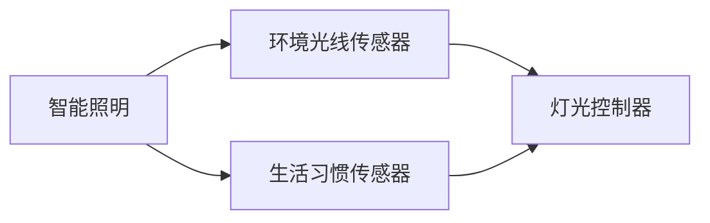
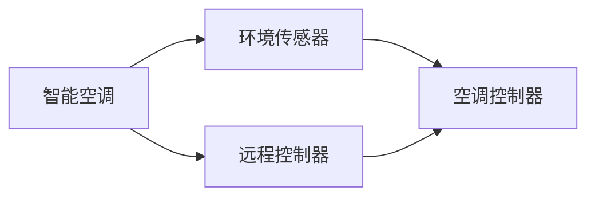
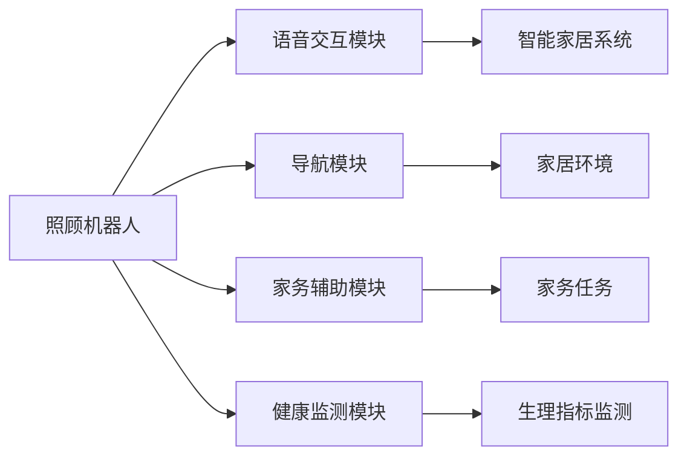
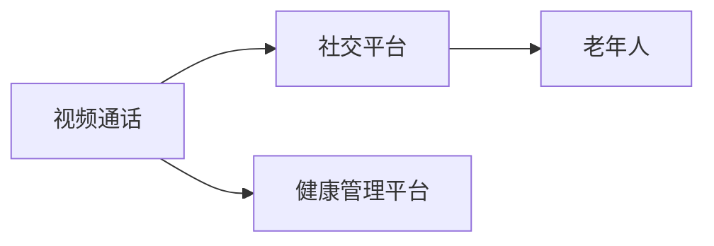
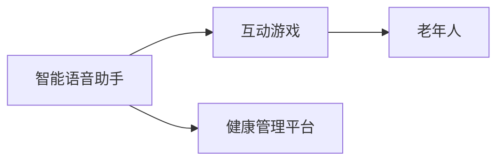
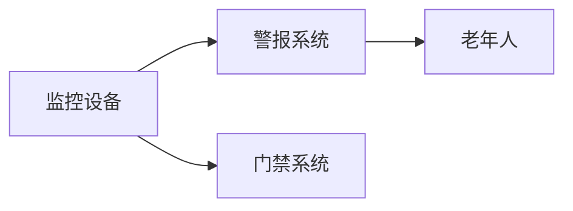
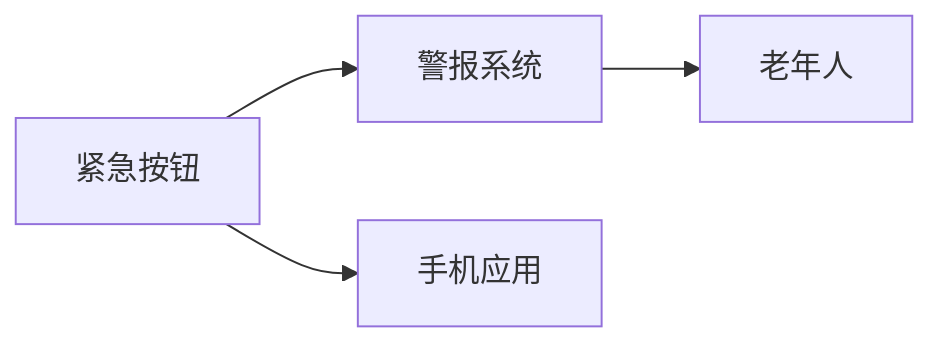
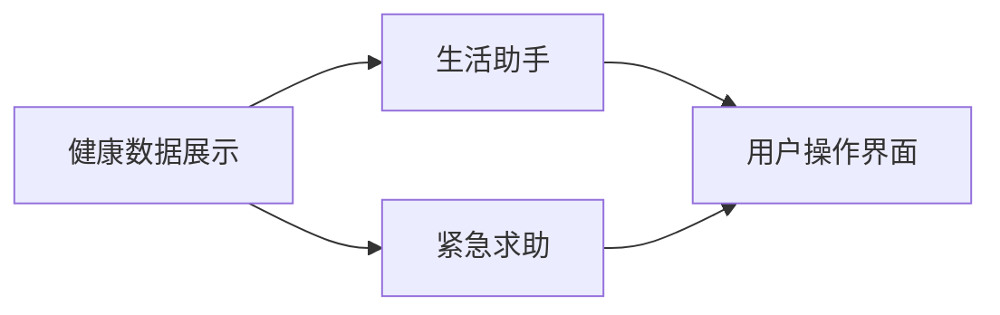

                 

## 引言

### 1.1 问题背景

#### 1.1.1 智慧养老的需求

随着全球人口老龄化的加剧，如何提高老年人的生活质量，已经成为世界各国共同关注的焦点。据联合国统计，全球60岁及以上人口比例预计将从2015年的12%增长到2050年的22%。在此背景下，智慧养老作为一种新兴养老模式，逐渐进入人们的视野。智慧养老通过应用物联网、大数据、人工智能等先进技术，实现养老服务的信息化、智能化，从而提升老年人生活的舒适度与安全性。

##### 1.1.1.1 人口老龄化趋势

人口老龄化是现代社会不可避免的趋势。以中国为例，根据国家统计局数据，我国60岁及以上人口比例从2000年的10.2%增长到2019年的17.7%，预计到2050年，这一比例将超过30%。面对日益庞大的老年人口，传统的家庭养老和机构养老模式已难以满足需求，亟需探索新的养老模式。

##### 1.1.1.2 老年人生活质量的提升

老年人生活质量的提升是智慧养老的核心目标之一。随着年龄的增长，老年人的身体健康状况和生活自理能力逐渐下降，他们对于医疗保健、生活照顾、社交娱乐等方面的需求也日益增加。智慧养老通过提供个性化、智能化的服务，能够有效满足老年人的这些需求，从而提升他们的生活质量。

### 1.2 物联网技术在智慧养老中的应用

物联网（Internet of Things，IoT）是指通过传感器、网络和其他技术，将物理设备连接到互联网上，实现设备与设备之间、设备与用户之间以及设备与云端的互联互通。物联网技术在智慧养老中的应用，主要体现在以下几个方面：

#### 1.2.1 物联网技术简介

物联网技术以其广泛连接、实时感知、智能处理等特点，在智慧养老中具有广泛应用前景。其核心架构包括感知层、网络层、平台层和应用层。

##### 1.2.1.1 定义与特点

物联网（IoT）是一种通过互联网将各种设备连接起来，实现信息交换和资源共享的网络技术。其特点包括：

- **广泛连接**：将各类物品（如家电、车辆、医疗设备等）连接到互联网，实现设备与设备的互联互通。
- **实时感知**：通过传感器实时监测物品的状态，实现对环境的实时感知和响应。
- **智能处理**：通过云计算、大数据等技术对收集到的信息进行处理和分析，实现智能决策和智能服务。

##### 1.2.1.2 技术架构

物联网技术架构通常包括三个层次：

- **感知层**：通过传感器、RFID等设备感知物理世界的信息。
- **网络层**：通过各种通信技术（如无线网络、移动网络等）将感知层的数据传输到云端。
- **平台层**：对传输上来的数据进行处理、存储和分析，提供数据服务。
- **应用层**：基于平台层提供的数据服务，开发各类应用，实现智能化的服务。

#### 1.2.2 物联网在智慧养老中的应用场景

物联网技术在智慧养老中具有广泛的应用场景，主要包括以下几个方面：

##### 1.2.2.1 生活照料

智能家居系统、照顾机器人等设备，能够为老年人提供舒适便捷的生活环境，减轻家庭照顾者的负担。

##### 1.2.2.2 健康监测

通过生命体征监测、运动监测等设备，实时掌握老年人的健康状况，及时发现健康问题。

##### 1.2.2.3 社交娱乐

在线社交、智能娱乐设备等，能够丰富老年人的社交生活，提升他们的生活品质。

##### 1.2.2.4 安全防护

家庭安防设备、紧急求助系统等，能够保障老年人的安全，提高居住环境的安全性。

### 1.3 本书结构安排

本书将从以下几个方面展开讨论：

#### 1.3.1 智慧养老体系概述

介绍智慧养老的定义、目标、体系架构和核心技术。

#### 1.3.2 物联网技术在智慧养老中的应用实例

分析物联网技术在生活照料、健康监测、社交娱乐和安全防护等领域的具体应用。

#### 1.3.3 应用开发实践

通过实际案例，介绍物联网技术在智慧养老中的应用开发实践。

通过本书的讨论，我们希望能够帮助读者深入理解物联网在智慧养老中的应用，为智慧养老领域的发展提供一些思路和参考。

## 第2章 智慧养老体系概述

### 2.1 智慧养老的定义与目标

#### 2.1.1 定义

智慧养老是一种基于物联网、大数据、云计算、人工智能等先进技术的养老模式，通过智能设备、系统和服务，实现对老年人生活、健康、安全等方面的全方位关怀和照护。智慧养老的核心在于利用科技手段，提高养老服务的效率和质量，实现老年人的健康、安全和幸福。

##### 2.1.1.1 智慧养老的内涵

智慧养老的内涵主要包括以下几个方面：

- **智能化服务**：通过智能设备和服务，实现对老年人生活、健康、安全等方面的智能化管理。
- **个性化关怀**：根据老年人的个人需求和健康状况，提供个性化的养老服务。
- **数据驱动**：通过大数据分析和人工智能技术，对老年人的健康数据和生活习惯进行深入分析，提供精准的服务。

##### 2.1.1.2 智慧养老的宗旨

智慧养老的宗旨是提高老年人的生活质量，保障老年人的健康和安全，促进社会的可持续发展。具体来说，智慧养老旨在实现以下几个目标：

- **提升老年人生活质量**：通过提供舒适、便捷、个性化的服务，使老年人的生活更加美好。
- **减轻家庭负担**：通过智能设备和系统，减轻家庭照顾者的负担，实现养老服务的智能化、高效化。
- **促进社会和谐**：通过智慧养老，提高老年人的生活质量，减少社会养老压力，促进社会的和谐稳定。

#### 2.1.2 智慧养老的目标

智慧养老的目标可以分为短期目标和长期目标。

##### 2.1.2.1 短期目标

- **提高老年人生活质量**：通过智能设备和服务，提升老年人的日常生活质量，使他们感受到更多的关爱和照顾。
- **降低养老成本**：通过智能化的养老服务，减少人力成本，提高养老服务的效率，降低养老成本。
- **提高服务效率**：通过大数据分析和人工智能技术，提高养老服务的精准度和效率，使服务更加及时、准确。

##### 2.1.2.2 长期目标

- **实现养老服务的可持续发展**：通过智慧养老，提高养老服务的质量和效率，实现养老服务的可持续发展。
- **促进社会和谐发展**：通过智慧养老，提高老年人的生活质量，减少社会养老压力，促进社会的和谐发展。
- **推动科技进步**：通过智慧养老，推动物联网、大数据、人工智能等先进技术的应用和发展，促进科技进步。

### 2.2 智慧养老的体系架构

智慧养老体系架构是智慧养老系统的核心，它决定了智慧养老服务的效率和效果。智慧养老体系架构主要包括硬件设备、软件系统和应用层。

#### 2.2.1 硬件设备

硬件设备是智慧养老体系的基础，主要包括传感器、可穿戴设备、家庭安防设备等。

##### 2.2.1.1 传感器

传感器用于采集老年人的生理、行为和环境数据，如心率传感器、血压传感器、运动传感器等。

##### 2.2.1.2 可穿戴设备

可穿戴设备是智慧养老中的重要组成部分，如智能手环、智能手表等，用于实时监测老年人的健康状况。

##### 2.2.1.3 家庭安防设备

家庭安防设备用于保障老年人的安全，如监控摄像头、门禁系统、紧急求助按钮等。

#### 2.2.2 软件系统

软件系统是智慧养老体系的核心，用于处理和分析传感器采集的数据，提供智能化的服务。

##### 2.2.2.1 数据收集与分析

数据收集与分析系统负责收集传感器采集的数据，对数据进行处理和分析，为老年人提供个性化的服务。

##### 2.2.2.2 管理与服务平台

管理与服务平台用于管理老年人的健康数据和服务记录，提供便捷的服务查询和操作界面。

#### 2.2.3 应用层

应用层是智慧养老体系的最后一环，用于提供具体的养老服务，如生活照料、健康监测、社交娱乐和安全防护等。

### 2.3 智慧养老的核心技术

智慧养老的核心技术包括物联网技术、人工智能技术和大数据技术。

#### 2.3.1 物联网技术

物联网技术是智慧养老的基础，主要用于实现设备与设备之间、设备与用户之间以及设备与云端之间的互联互通。物联网技术在智慧养老中的应用主要体现在以下几个方面：

- **设备连接**：通过物联网技术，将各种智能设备连接起来，实现对老年人的实时监测和智能管理。
- **数据采集**：通过传感器和物联网技术，实时采集老年人的生理、行为和环境数据。
- **远程控制**：通过物联网技术，实现对老年人的远程监控和智能控制，提高养老服务的效率。

#### 2.3.2 人工智能技术

人工智能技术是智慧养老的关键，主要用于对采集到的数据进行分析和处理，提供智能化的服务。人工智能技术在智慧养老中的应用主要体现在以下几个方面：

- **数据分析**：通过对采集到的数据进行分析，预测老年人的健康趋势，提供个性化的健康建议。
- **智能决策**：通过智能算法，实现对老年人的健康和生活的智能决策，提高养老服务的质量和效率。
- **语音交互**：通过语音识别和自然语言处理技术，实现老年人与智能设备的语音交互，提高养老服务的便捷性。

#### 2.3.3 大数据技术

大数据技术是智慧养老的重要支撑，主要用于对大量数据进行分析和处理，为老年人的健康和生活提供智能化的服务。大数据技术在智慧养老中的应用主要体现在以下几个方面：

- **数据分析**：通过对海量数据进行分析，发现老年人健康和生活的问题，提供针对性的解决方案。
- **预测分析**：通过对历史数据进行分析，预测老年人的健康趋势，提前采取措施，预防健康问题的发生。
- **个性化服务**：通过对老年人的数据分析，提供个性化的健康和生活服务，提高养老服务的质量和满意度。

### 2.4 本章小结

本章对智慧养老的定义、目标、体系架构和核心技术进行了详细介绍。智慧养老是一种基于物联网、大数据、人工智能等先进技术的养老模式，旨在提升老年人的生活质量，保障老年人的健康和安全，促进社会的可持续发展。通过了解智慧养老的体系架构和核心技术，读者可以对智慧养老有更深入的认识，为后续章节的学习和应用打下基础。

## 第3章 物联网技术在智慧养老中的应用实例

### 3.1 生活照料

生活照料是智慧养老中的重要组成部分，通过物联网技术，可以为老年人提供更加便捷、舒适的生活环境。下面将介绍物联网技术在生活照料中的应用实例。

#### 3.1.1 智能家居系统

智能家居系统通过物联网技术将家庭中的各种设备连接起来，实现自动化控制和智能化管理，为老年人提供舒适、便捷的生活环境。

##### 3.1.1.1 智能照明

智能照明系统可以通过传感器检测环境光线和老年人的生活习惯，自动调节灯光亮度和颜色，提供适宜的照明环境。例如，当老年人夜间起床时，智能照明系统会自动调亮灯光，使老年人更容易起床。此外，智能照明系统还可以根据老年人的生活习惯，自动调节灯光的亮度和颜色，帮助老年人更好地入睡。



##### 3.1.1.2 智能空调

智能空调系统可以通过物联网技术实现远程控制和自动化调节，为老年人提供舒适的室内环境。例如，老年人可以通过手机应用远程控制空调的温度和湿度，确保回家时室内环境舒适。此外，智能空调系统还可以根据老年人的体温和湿度需求，自动调节室内温度和湿度，提供个性化的舒适环境。



#### 3.1.2 照顾机器人

照顾机器人是智慧养老中的一种重要设备，可以协助老年人完成日常生活中的各项任务，提高老年人的生活质量。

##### 3.1.2.1 基本功能

照顾机器人具备多项基本功能，包括语音交互、导航、家务辅助、健康监测等。通过语音交互，老年人可以与机器人进行自然语言沟通，实现语音控制家电、查询信息等。导航功能可以帮助老年人找到房间中的物品，如药品、眼镜等。家务辅助功能包括打扫卫生、整理床铺等，减轻老年人的家务负担。健康监测功能可以实时监测老年人的生理指标，如心率、血压等，及时发现健康问题。



##### 3.1.2.2 应用案例

以下是一个照顾机器人的应用案例：

某位老年人住在城市中的独立公寓，他的子女因为工作原因无法长期陪伴在他身边。通过照顾机器人，老年人可以实现以下功能：

1. **语音交互**：老年人可以通过语音与照顾机器人进行沟通，查询天气、新闻、联系人等信息。
2. **导航**：当老年人需要找厨房中的食材或客厅的书籍时，照顾机器人可以帮助他找到所需物品。
3. **家务辅助**：照顾机器人可以帮助老年人打扫房间、整理床铺等，减轻家务负担。
4. **健康监测**：照顾机器人可以实时监测老年人的心率、血压等生理指标，当发现异常时，会提醒老年人及时就医。

### 3.2 健康监测

健康监测是智慧养老中不可或缺的一部分，通过物联网技术，可以实现对老年人健康数据的实时监测和智能分析，为老年人的健康提供保障。

#### 3.2.1 生命体征监测

生命体征监测是健康监测的核心内容，包括心率监测、血压监测、血氧监测等。

##### 3.2.1.1 心率监测

心率监测可以通过传感器实时监测老年人的心率，将数据传输到健康管理平台进行分析。当心率异常时，平台会及时向老年人或家属发出警报，提醒他们注意健康问题。


##### 3.2.1.2 血压监测

血压监测可以通过手环或血压计等设备实现对老年人血压的实时监测。当血压异常时，监测系统会及时发出警报，帮助老年人调整生活方式，预防高血压等疾病。


#### 3.2.2 运动监测

运动监测可以帮助老年人了解自己的运动情况，促进健康生活方式的养成。

##### 3.2.2.1 步数监测

步数监测可以通过智能手环等设备实现对老年人每天步数的实时监测，将数据传输到健康管理平台进行分析。平台可以根据步数数据给出运动建议，帮助老年人制定合理的运动计划。


##### 3.2.2.2 运动轨迹记录

运动轨迹记录可以通过GPS等技术实现对老年人运动路线的实时记录。当老年人外出时，家属可以通过手机应用查看老年人的运动轨迹，确保老年人的安全。


### 3.3 社交娱乐

社交娱乐是智慧养老中不可或缺的一部分，通过物联网技术，可以为老年人提供丰富的社交娱乐活动，缓解孤独感，提升生活质量。

#### 3.3.1 在线社交

在线社交通过视频通话、社交平台等手段，帮助老年人与家人、朋友保持联系，缓解孤独感。例如，老年人可以通过视频通话与子女聊天，分享生活点滴；通过社交平台加入兴趣小组，结识志同道合的朋友。



#### 3.3.2 智能娱乐

智能娱乐通过智能语音助手、互动游戏等手段，为老年人提供娱乐体验。智能语音助手可以帮助老年人查询信息、播放音乐、讲故事等；互动游戏可以锻炼老年人的思维能力和手眼协调能力，提高生活质量。



### 3.4 安全防护

安全防护是智慧养老中的重要环节，通过物联网技术，可以为老年人提供全方位的安全保障。

#### 3.4.1 家庭安防

家庭安防通过监控设备、门禁系统等手段，保障老年人的家庭安全。例如，监控设备可以实时监控家庭环境，当有异常情况发生时，系统会及时发出警报；门禁系统可以控制家庭大门的开关，确保老年人的安全。



#### 3.4.2 紧急求助

紧急求助系统可以通过紧急按钮、手机应用等手段，帮助老年人及时获取紧急援助。例如，当老年人遇到突发状况时，可以按下紧急按钮，系统会立即通知家属和医护人员；老年人可以通过手机应用向家人发送求救信息，确保安全。



### 3.5 本章小结

本章介绍了物联网技术在智慧养老中的应用实例，包括生活照料、健康监测、社交娱乐和安全防护等方面。通过物联网技术，可以为老年人提供便捷、舒适、智能的生活环境，保障老年人的健康和安全。未来，随着物联网技术的不断发展，智慧养老将会在更广泛的领域得到应用，为老年人带来更多福祉。

## 第4章 物联网技术在智慧养老中的应用开发实践

### 4.1 环境搭建

在进行物联网技术在智慧养老中的应用开发之前，首先需要搭建一个合适的环境，以确保开发过程顺利进行。环境搭建主要包括硬件设备准备和软件环境配置。

#### 4.1.1 硬件设备准备

硬件设备是物联网技术应用的基础，需要选择适合的传感器、可穿戴设备和通信模块。以下是一些常用的硬件设备：

- **传感器**：如心率传感器、血压传感器、温度传感器、湿度传感器等，用于采集老年人的生理和环境数据。
- **可穿戴设备**：如智能手环、智能手表等，用于实时监测老年人的健康状况。
- **通信模块**：如WiFi模块、蓝牙模块、4G/5G模块等，用于将数据传输到云端或服务器。

在选择硬件设备时，需要考虑以下几个方面：

- **兼容性**：确保所选硬件设备与开发平台兼容，便于数据传输和系统集成。
- **稳定性**：选择性能稳定、可靠性高的硬件设备，以保证数据的准确性和系统的稳定性。
- **扩展性**：选择具有良好扩展性的硬件设备，以便在后续开发过程中增加新的功能或设备。

#### 4.1.2 软件环境配置

软件环境配置是物联网应用开发的重要环节，主要包括开发工具、编程语言、数据库等。

- **开发工具**：常用的开发工具有Arduino、Python、Node.js等。根据开发需求和个人习惯，选择合适的开发工具。
- **编程语言**：Python和Java是物联网开发中常用的编程语言，具有较高的易用性和灵活性。
- **数据库**：选择合适的数据库用于存储和管理物联网数据，如MySQL、MongoDB、PostgreSQL等。

在配置软件环境时，需要考虑以下几个方面：

- **开发效率**：选择易于上手、开发效率高的工具和语言。
- **系统兼容性**：确保所选软件环境与硬件设备和操作系统兼容。
- **可扩展性**：选择具有良好扩展性的软件环境，以适应未来功能扩展和需求变化。

### 4.2 系统核心实现

系统核心实现是物联网技术在智慧养老中的应用开发的关键环节，主要包括数据采集与处理、管理与服务平台搭建。

#### 4.2.1 数据采集与处理

数据采集与处理是物联网系统的核心功能之一，主要涉及以下几个方面：

- **数据采集**：通过传感器和可穿戴设备采集老年人的生理数据（如心率、血压、体温等）和环境数据（如温度、湿度、光照等）。
- **数据传输**：将采集到的数据通过通信模块传输到云端或服务器，进行存储和处理。
- **数据处理**：对传输上来的数据进行清洗、转换和存储，为后续分析和应用提供数据支持。

以下是一个数据采集与处理的基本流程：

1. **数据采集**：通过心率传感器、血压传感器等设备采集老年人的生理数据，通过环境传感器采集环境数据。
2. **数据传输**：将采集到的数据通过WiFi或蓝牙等通信模块传输到云端或服务器。
3. **数据处理**：在云端或服务器端，对传输上来的数据进行清洗、转换和存储，存入数据库中。

```python
# 数据采集示例代码
import sensor

# 初始化传感器
heart_rate_sensor = sensor.HR()
blood_pressure_sensor = sensor.BP()

# 采集数据
heart_rate = heart_rate_sensor.read()
blood_pressure = blood_pressure_sensor.read()

# 数据传输示例代码
import socket

# 设置服务器地址和端口
server_ip = '192.168.1.1'
server_port = 12345

# 创建套接字
s = socket.socket(socket.AF_INET, socket.SOCK_STREAM)

# 连接到服务器
s.connect((server_ip, server_port))

# 发送数据
s.sendall(str(heart_rate).encode() + b' ' + str(blood_pressure).encode())

# 关闭套接字
s.close()

# 数据处理示例代码
import database

# 连接到数据库
db = database.connect()

# 存储数据
db.insert_data(heart_rate, blood_pressure)
```

#### 4.2.2 管理与服务平台搭建

管理与服务平台是物联网系统的用户界面，用于展示和处理数据，为老年人提供便捷的服务。主要包括以下几个方面：

- **功能模块设计**：根据智慧养老的需求，设计相应的功能模块，如健康数据展示、生活助手、紧急求助等。
- **界面展示**：设计用户友好的界面，方便老年人操作和使用。

以下是一个基本的管理与服务平台架构：

1. **健康数据展示**：展示老年人的生理数据和运动数据，包括心率、血压、步数等信息。
2. **生活助手**：提供日常生活的辅助功能，如提醒服药、安排日程等。
3. **紧急求助**：提供紧急按钮和求救功能，当老年人遇到突发情况时，可以快速求助。



### 4.3 应用解读与分析

在系统核心实现的基础上，需要对各功能模块进行解读和分析，确保系统的稳定性和实用性。

#### 4.3.1 智能家居系统

智能家居系统是智慧养老中的一个重要应用，通过物联网技术实现对家庭环境的自动化控制和智能化管理。以下是对智能家居系统的解读和分析：

- **智能照明**：通过环境光线传感器和智能灯光控制器，实现自动调节灯光亮度和颜色，为老年人提供舒适的生活环境。系统可以根据老年人的生活习惯，设置不同的照明模式，如夜间模式和晨起模式。
- **智能空调**：通过环境传感器和空调控制器，实现自动调节室内温度和湿度，为老年人提供舒适的室内环境。系统可以根据老年人的体温和湿度需求，自动调节空调的温度和湿度。
- **智能窗帘**：通过光线传感器和窗帘控制器，实现自动调节窗帘的开关，为老年人提供舒适的光线环境。系统可以根据光线强度，自动打开或关闭窗帘。

#### 4.3.2 健康监测系统

健康监测系统是智慧养老中的核心应用，通过物联网技术实现对老年人健康数据的实时监测和分析。以下是对健康监测系统的解读和分析：

- **心率监测**：通过心率传感器，实时监测老年人的心率，并将数据传输到健康管理平台。系统可以设置心率预警阈值，当心率超过阈值时，会及时向老年人或家属发出警报。
- **血压监测**：通过血压传感器，实时监测老年人的血压，并将数据传输到健康管理平台。系统可以根据血压数据，分析老年人的健康趋势，提供个性化的健康建议。
- **运动监测**：通过运动传感器，实时监测老年人的运动情况，包括步数、运动轨迹等。系统可以根据运动数据，评估老年人的健康状况，提供合适的运动建议。

### 4.4 实际案例分析与讲解

为了更好地理解物联网技术在智慧养老中的应用，下面将介绍两个实际案例，并对其进行分析和讲解。

#### 4.4.1 案例一：智能安防系统

**案例背景**：某老年人在城市中独居，子女因工作原因无法经常陪伴在他身边。为了保障老年人的安全，家属决定安装一套智能安防系统。

**系统架构**：
1. **感知层**：包括摄像头、门禁系统、烟雾传感器等。
2. **网络层**：通过WiFi或4G网络，将感知层的数据传输到云端或服务器。
3. **平台层**：对传输上来的数据进行分析和处理，提供智能化的安防服务。
4. **应用层**：通过手机应用和Web端，向家属展示监控画面和报警信息。

**系统功能实现**：
1. **实时监控**：通过摄像头实时监控老年人的家庭环境，确保家庭安全。
2. **紧急报警**：当检测到异常情况（如火灾、入侵等）时，系统会立即向家属发送报警信息，并通过手机应用推送报警通知。
3. **远程控制**：家属可以通过手机应用远程控制门禁系统，确保老年人的安全。

**代码应用解读**：

```python
# 实时监控示例代码
import cv2
import socket

# 初始化摄像头
cap = cv2.VideoCapture(0)

while True:
    # 读取摄像头画面
    ret, frame = cap.read()

    if ret:
        # 发送摄像头画面到服务器
        s = socket.socket(socket.AF_INET, socket.SOCK_STREAM)
        s.connect(('192.168.1.1', 12345))
        s.sendall(frame.tobytes())

        # 显示摄像头画面
        cv2.imshow('Camera', frame)

    if cv2.waitKey(1) & 0xFF == 27:
        break

cap.release()
cv2.destroyAllWindows()

# 紧急报警示例代码
import socket

# 连接到服务器
s = socket.socket(socket.AF_INET, socket.SOCK_STREAM)
s.connect(('192.168.1.1', 12345))

# 发送紧急报警信息
s.sendall(b'ALARM!')

# 关闭套接字
s.close()
```

#### 4.4.2 案例二：智慧健康管理系统

**案例背景**：某社区为老年人提供智慧健康管理服务，通过物联网技术实现对老年人健康数据的实时监测和管理。

**系统架构**：
1. **感知层**：包括心率传感器、血压传感器、步数传感器等。
2. **网络层**：通过WiFi或4G网络，将感知层的数据传输到云端或服务器。
3. **平台层**：对传输上来的数据进行分析和处理，提供健康管理的服务。
4. **应用层**：通过手机应用和Web端，向老年人提供健康数据展示、健康建议和紧急求助等功能。

**系统功能实现**：
1. **健康数据展示**：展示老年人的心率、血压、步数等健康数据，帮助老年人了解自己的健康状况。
2. **健康建议**：根据老年人的健康数据，提供个性化的健康建议，如饮食建议、运动建议等。
3. **紧急求助**：当老年人遇到突发情况时，可以快速求助，系统会立即通知家属和医护人员。

**代码应用解读**：

```python
# 数据采集示例代码
import sensor

# 初始化传感器
heart_rate_sensor = sensor.HR()
blood_pressure_sensor = sensor.BP()

# 采集数据
heart_rate = heart_rate_sensor.read()
blood_pressure = blood_pressure_sensor.read()

# 数据传输示例代码
import socket

# 设置服务器地址和端口
server_ip = '192.168.1.1'
server_port = 12345

# 创建套接字
s = socket.socket(socket.AF_INET, socket.SOCK_STREAM)

# 连接到服务器
s.connect((server_ip, server_port))

# 发送数据
s.sendall(str(heart_rate).encode() + b' ' + str(blood_pressure).encode())

# 关闭套接字
s.close()

# 数据处理示例代码
import database

# 连接到数据库
db = database.connect()

# 存储数据
db.insert_data(heart_rate, blood_pressure)
```

### 4.5 项目小结

通过本章的讲解，我们了解了物联网技术在智慧养老中的应用开发实践。从环境搭建到系统核心实现，再到实际案例分析和讲解，我们系统地介绍了物联网技术在智慧养老中的应用。通过这些实践，我们可以看到物联网技术在提升老年人生活质量、保障老年人健康和安全方面具有巨大的潜力。未来，随着物联网技术的不断发展和普及，智慧养老将会在更广泛的领域得到应用，为老年人带来更多的福祉。

### 4.6 最佳实践 Tips

1. **硬件选择**：在选择硬件设备时，要考虑兼容性、稳定性和扩展性，确保设备的长期稳定运行。
2. **数据安全**：在数据传输和存储过程中，要注意数据的安全性，防止数据泄露和隐私侵犯。
3. **用户体验**：在设计和开发过程中，要关注老年人的使用体验，确保系统的易用性和友好性。
4. **系统集成**：要注重各功能模块之间的集成，确保系统的整体性能和稳定性。

### 4.7 小结

本章详细介绍了物联网技术在智慧养老中的应用开发实践，包括环境搭建、系统核心实现、应用解读与分析以及实际案例讲解。通过这些实践，读者可以深入了解物联网技术在智慧养老中的应用，为实际项目开发提供参考。智慧养老作为物联网技术应用的一个重要领域，具有广阔的发展前景。未来，随着物联网技术的不断进步，智慧养老将会为老年人带来更多的福祉。

### 4.8 注意事项

1. **设备兼容性**：在硬件设备选择和软件开发过程中，要注意设备的兼容性，确保各硬件设备和软件系统能够协同工作。
2. **数据隐私**：在数据采集、传输和存储过程中，要严格保护老年人的隐私，确保数据安全。
3. **系统稳定性**：要确保系统的稳定性，避免因系统故障导致老年人生活受到干扰。

### 4.9 拓展阅读

- 《物联网技术与应用》
- 《智慧养老：技术、实践与挑战》
- 《智能家居系统设计与实现》

## 作者信息

作者：AI天才研究院/AI Genius Institute & 禅与计算机程序设计艺术 /Zen And The Art of Computer Programming

本文由AI天才研究院撰写，结合禅与计算机程序设计艺术的理念，旨在深入探讨物联网技术在智慧养老中的应用。本文从多个角度分析了物联网技术在智慧养老中的全方位应用，包括生活照料、健康监测、社交娱乐和安全防护等方面。同时，通过实际案例分析和开发实践，为读者提供了丰富的技术参考。希望本文能为您在智慧养老领域的研究和应用提供有益的启示。如需进一步了解物联网技术在智慧养老中的应用，请参考相关书籍和资料。

