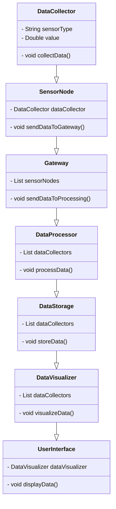
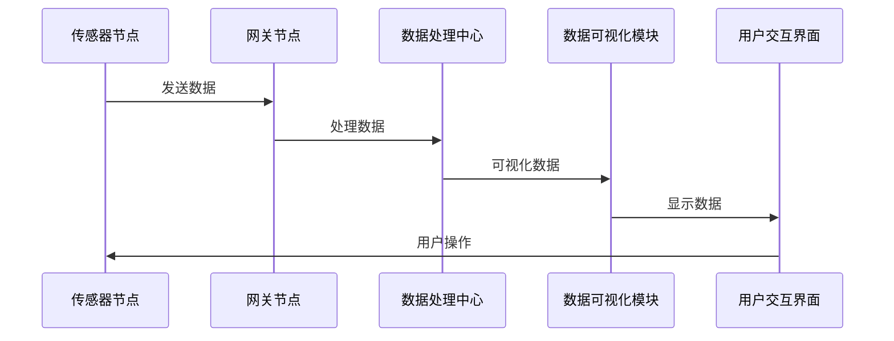
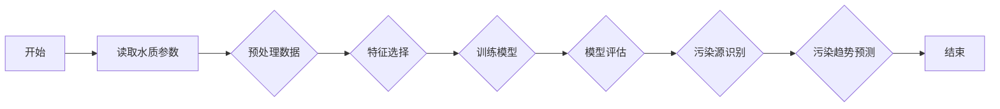

                 


## 引言：物联网与智慧环保监测的交汇

### 1.1 物联网概述

#### 1.1.1 物联网的定义与历史

物联网（Internet of Things，简称 IoT）是指通过互联网将各种物品与网络连接起来，实现信息交换和通信的一种网络。其概念最早可以追溯到 1999 年，美国麻省理工学院（MIT）的 Kevin Ashton 提出了物联网的概念。随着传感器技术、无线通信技术和云计算技术的不断发展，物联网逐渐成为全球信息技术领域的重要研究方向。

物联网的发展历程可以分为三个阶段：

1. **初始阶段（1999-2005 年）**：物联网的概念被提出，初步技术方案和产品开始出现。
2. **发展阶段（2006-2010 年）**：物联网技术逐步成熟，应用领域开始拓展。
3. **成熟阶段（2011 年至今）**：物联网技术逐渐融入各个行业，市场规模不断扩大。

#### 1.1.2 物联网的关键技术

物联网的关键技术包括传感器网络、数据传输协议、云计算等。

1. **传感器网络**：传感器网络是由大量传感器节点组成的网络，可以实时监测环境参数，如温度、湿度、气压等。传感器网络是物联网的感知层，是数据采集的重要手段。

2. **数据传输协议**：数据传输协议是物联网通信的基础，常用的协议有 ZigBee、Wi-Fi、蓝牙、Z-Wave 等。这些协议具有低功耗、低延迟、高可靠性等特点，能够满足物联网设备之间的通信需求。

3. **云计算**：云计算是物联网数据存储、处理和分析的重要基础设施。通过云计算，物联网设备可以实现海量数据的存储和实时处理，为智能应用提供支持。

#### 1.1.3 物联网的发展现状与趋势

当前，物联网在全球范围内得到广泛应用，主要表现在以下几个方面：

1. **智能家居**：智能家居是物联网应用的重要领域，包括智能照明、智能家电、智能安防等。

2. **智能交通**：智能交通系统利用物联网技术实现交通信息的实时采集、传输和处理，提高交通效率，减少交通事故。

3. **智慧城市**：智慧城市是物联网应用的更高层次，通过物联网技术实现城市资源的优化配置和管理，提高城市居民的生活质量。

4. **工业互联网**：工业互联网通过物联网技术实现设备的远程监控、数据分析和智能决策，提高工业生产的效率和质量。

未来，物联网将继续向更广泛、更深层次的领域发展，成为推动社会进步的重要力量。

### 1.2 智慧环保监测的定义与背景

#### 1.2.1 环保监测的需求与挑战

环保监测是环境保护工作的重要组成部分，旨在实时监测环境质量，评估污染程度，为环保决策提供科学依据。随着工业化和城市化进程的加快，环境污染问题日益严重，环保监测的需求日益增加。

环保监测面临的挑战主要包括：

1. **数据采集困难**：环境质量参数复杂多样，监测点分布广泛，数据采集工作量大，且受环境因素影响大。

2. **数据处理难度高**：环境数据量大、类型多，需要高效的数据处理和分析技术，以提取有价值的信息。

3. **监测成本高**：环保监测设备昂贵，监测站点建设成本高，且维护费用不菲。

#### 1.2.2 智慧环保监测的概念

智慧环保监测是指利用物联网、大数据、云计算等先进技术，实现环保监测数据的实时采集、传输、处理和分析，提供智能化、精准化的环保监测服务。

智慧环保监测的特点包括：

1. **实时性**：通过物联网技术，实现环境质量参数的实时监测和传输，确保数据及时准确。

2. **智能化**：利用大数据分析和人工智能技术，对监测数据进行智能分析和预测，为环保决策提供支持。

3. **精准化**：通过分布式监测网络，提高监测数据的覆盖范围和精度，确保监测结果的可靠性。

#### 1.2.3 智慧环保监测的重要性

智慧环保监测在环境保护工作中具有重要意义：

1. **提高监测效率**：通过自动化监测和数据智能化分析，减少人力成本，提高监测效率。

2. **优化环保决策**：实时、精准的监测数据为环保决策提供科学依据，有助于制定更加有效的环保政策。

3. **改善环境质量**：通过监测和数据分析，及时发现环境污染问题，采取针对性措施，改善环境质量。

### 1.3 物联网在智慧环保监测中的应用

#### 1.3.1 环境传感器网络

环境传感器网络是智慧环保监测的核心，由大量传感器节点组成，能够实时监测环境质量参数。传感器节点通常包括传感器、数据处理单元、通信模块和电源等。

环境传感器网络的主要应用包括：

1. **空气质量监测**：通过监测空气中的污染物浓度，评估空气质量，为环境保护提供数据支持。

2. **水质监测**：通过监测水中的污染物浓度，评估水质状况，确保水环境安全。

3. **气象参数监测**：通过监测气温、湿度、气压等气象参数，为气象预报和气候变化研究提供数据支持。

#### 1.3.2 数据传输与处理

物联网技术为环境监测数据的传输和处理提供了有力支持。数据传输与处理主要包括以下几个方面：

1. **数据采集**：传感器网络将环境质量参数实时采集到数据处理单元，并通过无线通信模块传输到数据处理平台。

2. **数据传输**：采用无线传输技术，如 ZigBee、Wi-Fi、LoRa 等，将采集到的数据传输到数据处理平台。

3. **数据处理**：数据处理平台对采集到的数据进行分析、处理和存储，提取有价值的信息，为环保监测提供支持。

#### 1.3.3 云计算与大数据分析

云计算与大数据分析技术为智慧环保监测提供了强大的数据处理能力。云计算平台可以存储和处理海量数据，大数据分析技术可以对监测数据进行深度挖掘，提取有价值的信息。

云计算与大数据分析在智慧环保监测中的应用包括：

1. **数据存储与备份**：通过云计算平台，实现海量监测数据的存储和备份，确保数据安全。

2. **实时数据分析和预测**：利用大数据分析技术，对实时监测数据进行分析和预测，为环保决策提供支持。

3. **智能化监测与预警**：通过人工智能技术，实现监测数据的智能分析和预警，提高环保监测的智能化水平。

#### 1.3.4 物联网平台与应用案例

物联网平台是智慧环保监测的核心基础设施，提供了数据采集、传输、处理和分析的全流程支持。物联网平台的主要应用包括：

1. **环境监测数据平台**：集成各种环境监测设备，实现数据采集、传输、处理和展示。

2. **智能分析与应用**：通过大数据分析和人工智能技术，实现环境质量监测、预测和预警。

3. **应用案例**：以某智慧环保监测项目为例，介绍物联网平台在环保监测中的应用，展示项目实现过程和关键点。

### 1.4 物联网与智慧环保监测的关系

#### 1.4.1 关系模型与 ER 图

物联网与智慧环保监测之间的关系可以采用实体关系图（Entity-Relationship Diagram，简称 ER 图）来表示。ER 图是一种用于描述实体及其之间关系的图形化工具。

以下是一个简化的物联网与智慧环保监测的 ER 图：

```mermaid
erDiagram
  数据采集器 ||--|{ 环境传感器 }|
  数据采集器 ||--|{ 数据传输模块 }|
  数据采集器 ||--|{ 数据处理单元 }|
  环境传感器 ||--|{ 空气质量传感器 }|
  环境传感器 ||--|{ 水质传感器 }|
  环境传感器 ||--|{ 气象传感器 }|
  数据传输模块 ||--|{ 无线通信模块 }|
  数据传输模块 ||--|{ 有线通信模块 }|
  数据处理单元 ||--|{ 云计算平台 }|
  数据处理单元 ||--|{ 大数据分析系统 }|
  云计算平台 ||--|{ 数据存储与管理 }|
  云计算平台 ||--|{ 实时数据处理 }|
  云计算平台 ||--|{ 智能分析与应用 }|
```

#### 1.4.2 物联网技术在监测中的应用

物联网技术在智慧环保监测中的应用主要体现在以下几个方面：

1. **数据采集**：物联网技术可以实时采集环境质量参数，如空气质量、水质、气象参数等，为监测提供数据支持。

2. **数据传输**：物联网技术可以实现数据的无线传输，降低数据采集和传输的成本，提高监测效率。

3. **数据处理**：云计算和大数据分析技术可以对海量监测数据进行分析和挖掘，提取有价值的信息，为监测提供支持。

4. **智能应用**：通过物联网技术，可以实现环境质量的智能监测、预测和预警，提高环保监测的智能化水平。

#### 1.4.3 智慧环保监测的未来发展

随着物联网技术的不断发展和应用领域的拓展，智慧环保监测将迎来更加广阔的发展前景：

1. **监测范围扩大**：随着传感器技术的进步，监测范围将逐步扩大，覆盖更多环境参数和更广泛的地域。

2. **数据质量提高**：通过物联网技术，可以实现数据采集、传输和处理的自动化和智能化，提高监测数据的准确性和可靠性。

3. **监测成本降低**：随着物联网技术的普及和成本的降低，环保监测设备的成本将逐步降低，监测范围将逐步扩大。

4. **应用领域拓展**：智慧环保监测将在更多领域得到应用，如农业、林业、海洋等，为环境保护和资源管理提供更全面的支持。

### 1.5 本章小结

本章介绍了物联网和智慧环保监测的基本概念、发展现状和未来趋势。物联网技术为智慧环保监测提供了数据采集、传输、处理和智能分析的支持，是智慧环保监测的重要技术基础。随着物联网技术的不断发展和应用领域的拓展，智慧环保监测将发挥越来越重要的作用，为环境保护和可持续发展提供有力支持。

----------------------------------------------------------------

## 2.1 物联网传感器技术

### 2.1.1 传感器概述

传感器是物联网系统中的关键组件，用于感知外部环境并产生相应的电信号或数据输出。传感器的基本功能是将物理量（如温度、湿度、光强、压力等）转换为可测量的电信号，从而实现对环境参数的监测和测量。

传感器的分类可以根据其工作原理、测量对象和输出信号等多种方式进行：

1. **按工作原理分类**：
   - **电阻式传感器**：通过物理变化改变电阻值，如热敏电阻、湿敏电阻等。
   - **电容式传感器**：通过物理变化改变电容值，如电容式触摸屏、湿度传感器等。
   - **电磁式传感器**：通过电磁感应原理工作，如电磁感应式流量计、磁敏电阻等。
   - **光电式传感器**：通过光电效应工作，如光敏电阻、光电二极管、摄像头等。

2. **按测量对象分类**：
   - **温度传感器**：测量环境或物体的温度，如热电偶、热敏电阻等。
   - **湿度传感器**：测量环境湿度，如电容式湿度传感器、电阻式湿度传感器等。
   - **压力传感器**：测量压力或压强，如电容式压力传感器、压阻式压力传感器等。
   - **气体传感器**：测量特定气体浓度，如氧气传感器、二氧化碳传感器等。
   - **光电传感器**：测量光强或物体存在，如光电二极管、红外传感器等。

3. **按输出信号分类**：
   - **模拟传感器**：输出连续的模拟信号，如电压、电流等。
   - **数字传感器**：输出数字信号，如计数、编码等。

传感器在物联网系统中的应用非常广泛，例如在智能家居中，传感器可以用于环境监测（如温度、湿度）、安防监控（如红外传感器）、智能照明（如光敏传感器）等。在工业物联网中，传感器广泛应用于设备监控、质量检测、过程控制等环节，提高生产效率和产品质量。

### 2.1.2 环境传感器种类与原理

环境传感器是物联网系统中用于监测和测量环境参数的关键设备，常见的环境传感器包括空气质量传感器、水质传感器和气象传感器等。

1. **空气质量传感器**

空气质量传感器主要用于检测空气中的污染物浓度，如PM2.5、PM10、二氧化碳、一氧化碳、臭氧等。常见的空气质量传感器有：

   - **颗粒物传感器**：如激光颗粒物传感器，通过激光束照射颗粒物，检测颗粒物的数量和大小。
   - **气体传感器**：如电化学传感器、半导体传感器等，通过化学或电学反应检测气体浓度。

   工作原理：
   - 颗粒物传感器通过激光束照射颗粒物，当激光束通过颗粒物时会发生散射，通过检测散射光的光强和波长变化，可以计算出颗粒物的数量和大小。
   - 气体传感器通过特定化学反应或电学效应检测气体浓度，例如电化学传感器利用气体与电极反应生成电流，半导体传感器则通过气体分子与半导体材料之间的相互作用改变电阻值。

2. **水质传感器**

水质传感器用于监测水中的污染物浓度，如溶解氧、酸碱度（pH）、电导率、总有机碳（TOC）等。常见的水质传感器有：

   - **溶解氧传感器**：通过测量水中溶解氧的分压来监测水体的氧气含量。
   - **pH传感器**：通过测量溶液中的氢离子浓度来监测酸碱度。
   - **电导率传感器**：通过测量水中的离子浓度来监测电导率。

   工作原理：
   - 溶解氧传感器通常采用膜电极法，通过氧气在电极上的还原反应产生电流，电流大小与氧气浓度成正比。
   - pH传感器通常采用玻璃电极或离子选择性电极，玻璃电极通过氢离子与玻璃膜上的氧化物反应生成电位差，离子选择性电极则通过特定离子与电极材料反应产生电位差。
   - 电导率传感器通过测量电流在水中流动时的阻力来计算电导率，电导率与离子浓度成正比。

3. **气象传感器**

气象传感器用于监测气象参数，如温度、湿度、气压、风速、风向等。常见的气象传感器有：

   - **温度传感器**：如热敏电阻、热电偶等，通过热敏材料电阻值的变化来测量温度。
   - **湿度传感器**：如电容式湿度传感器、电阻式湿度传感器等，通过物理或化学反应来测量湿度。
   - **气压传感器**：如电容式气压传感器、压阻式气压传感器等，通过测量气压变化引起的电容或电阻变化来测量气压。
   - **风速传感器**：如热球式风速传感器、超声波风速传感器等，通过测量空气流动引起的温度或声波传播时间变化来测量风速。
   - **风向传感器**：如风标、超声波风向传感器等，通过测量风速和风向的关系来确定风向。

   工作原理：
   - 热敏电阻和热电偶通过热敏材料电阻值或电势差的变化来测量温度。
   - 电容式和电阻式湿度传感器通过物理或化学反应来测量湿度，例如电容式湿度传感器通过湿度和电容值的关系来测量湿度，电阻式湿度传感器通过湿度和电阻值的关系来测量湿度。
   - 电容式和压阻式气压传感器通过气压变化引起的电容或电阻变化来测量气压。
   - 热球式风速传感器通过测量空气流动引起的温度变化来测量风速，超声波风速传感器通过测量声波传播时间变化来测量风速。
   - 风标通过测量风速和风向的关系来确定风向，超声波风向传感器通过测量风速和风向的角度关系来确定风向。

环境传感器在物联网智慧环保监测中发挥着重要作用，它们能够实时、准确地监测环境参数，为环境监测和污染控制提供科学依据。随着传感器技术的不断发展，传感器的精度和可靠性将不断提高，将在环保监测领域发挥更大的作用。

### 2.1.3 传感器网络架构

传感器网络架构是物联网在智慧环保监测中实现数据采集、传输和处理的关键基础设施。传感器网络通常由传感器节点、网关节点、数据处理中心和通信网络组成。

#### 传感器节点的组成

传感器节点是传感器网络的基本单元，通常包括以下几个组成部分：

1. **传感器**：用于感知环境参数，如温度、湿度、气压、颗粒物浓度等。
2. **数据处理单元**：用于处理传感器数据，通常包括微处理器、内存和存储单元。
3. **无线通信模块**：用于节点间的数据传输，常见的通信协议包括Wi-Fi、ZigBee、LoRa等。
4. **电源模块**：为传感器节点提供电力，可以是电池、太阳能或无线充电等方式。

#### 传感器网络的拓扑结构

传感器网络的拓扑结构决定了节点之间的连接方式和数据传输路径。常见的拓扑结构包括：

1. **星型拓扑**：所有节点通过网关节点与外部网络连接，网关节点负责收集和转发传感器节点的数据。
2. **网状拓扑**：节点之间通过多跳传输建立直接或间接的连接，数据可以通过多个节点中转到达网关节点。
3. **无线传感器网络（WSN）**：采用分布式传感器节点，通过无线通信实现数据的自组织和自适应传输。

#### 数据传输与处理

传感器网络中的数据传输与处理主要包括以下几个步骤：

1. **数据采集**：传感器节点将感知到的环境数据存储在本地存储单元中，并在需要时发送到网关节点。
2. **数据传输**：传感器节点通过无线通信模块将数据传输到网关节点，网关节点再将数据发送到数据处理中心。
3. **数据处理**：数据处理中心对收集到的数据进行存储、处理和分析，提取有价值的信息，为环境监测和决策提供支持。

#### 传感器网络的挑战与优化

传感器网络在智慧环保监测中面临着诸多挑战，包括：

1. **功耗管理**：传感器节点通常采用电池供电，功耗管理是保证网络稳定运行的关键。通过优化通信协议和数据传输策略，降低功耗，延长节点寿命。
2. **网络覆盖与连通性**：传感器网络的覆盖范围和连通性直接影响到数据采集的完整性和准确性。通过合理规划传感器节点的部署和路由算法，提高网络覆盖和连通性。
3. **数据可靠性与安全性**：传感器网络的数据传输和存储过程需要保证数据的安全性和可靠性，防止数据丢失和篡改。通过数据加密、认证和完整性校验等技术，提高数据的安全性和可靠性。
4. **数据融合与处理**：传感器网络中的数据量大且类型多样，需要通过数据融合和处理技术，提取有价值的信息，降低数据处理的复杂性。

通过优化传感器网络架构和关键技术，可以实现对环境参数的实时、精准监测，为智慧环保监测提供可靠的数据支持。

### 2.2 数据传输与处理

#### 2.2.1 数据传输协议

数据传输协议是物联网系统中数据传输的基础，负责传感器节点与网关节点、数据处理中心之间的数据交换。常见的无线传输协议包括：

1. **Wi-Fi**：Wi-Fi是一种无线局域网（WLAN）通信技术，具有高带宽、高可靠性的特点，适用于需要高速传输的场景，如智能家居、商业办公等。

2. **ZigBee**：ZigBee是一种低功耗、低速率的无线通信协议，适用于短距离通信，如家庭自动化、工业控制等。ZigBee具有低成本、低功耗、高安全性和高可靠性的特点。

3. **LoRa**：LoRa是一种低功耗广域网（LPWAN）通信技术，具有远距离、低功耗、低成本的特点，适用于物联网长距离、低速率传输，如环境监测、智能农业等。

4. **蓝牙**：蓝牙是一种短距离无线通信技术，具有低功耗、易用性和广泛兼容性的特点，适用于智能家居、医疗健康等应用场景。

5. **Z-Wave**：Z-Wave是一种短距离无线通信协议，适用于家庭自动化和智能控制，具有低成本、低功耗、高可靠性和低延迟的特点。

这些无线传输协议各有优缺点，选择合适的协议需要根据具体应用场景的需求进行权衡。

#### 2.2.2 数据采集与存储

数据采集与存储是物联网系统中的关键环节，涉及传感器节点、网关节点和数据处理中心的数据采集、传输和存储。

1. **传感器节点的数据采集**：传感器节点负责实时采集环境数据，如温度、湿度、颗粒物浓度等。数据采集通常包括以下几个步骤：

   - **数据采集**：传感器节点将感知到的环境数据存储在本地存储单元中，如闪存、EEPROM等。
   - **数据校准**：为了确保数据的准确性，需要对传感器数据进行校准，消除系统误差和噪声干扰。
   - **数据预处理**：对采集到的数据进行预处理，如滤波、去噪、归一化等，提高数据的质量和可用性。

2. **网关节点的数据传输**：网关节点负责将传感器节点的数据传输到数据处理中心。数据传输通常包括以下几个步骤：

   - **数据汇聚**：网关节点收集多个传感器节点的数据，进行数据融合和汇总。
   - **数据传输**：网关节点通过无线传输协议将数据传输到数据处理中心，如Wi-Fi、LoRa、ZigBee等。
   - **数据加密**：为了确保数据传输的安全性，需要对传输的数据进行加密处理，如AES加密等。

3. **数据处理中心的数据存储**：数据处理中心负责存储、处理和分析来自传感器节点的数据。数据存储通常包括以下几个步骤：

   - **数据存储**：数据处理中心使用数据库系统（如MySQL、MongoDB等）存储采集到的数据，确保数据的安全性和持久性。
   - **数据备份**：为了防止数据丢失，数据处理中心需要定期进行数据备份，确保数据的可靠性。
   - **数据压缩**：为了节省存储空间和提高传输效率，可以对数据进行压缩处理，如使用gzip、zlib等压缩算法。

#### 2.2.3 数据处理技术

数据处理技术是物联网系统中提取有用信息和实现智能分析的关键。数据处理技术包括数据清洗、数据融合、数据挖掘和机器学习等。

1. **数据清洗**：数据清洗是数据处理的第一步，旨在去除无效、不准确和重复的数据，提高数据的质量和可靠性。数据清洗的方法包括：

   - **缺失值处理**：对于缺失的数据，可以通过填充平均值、中位数或使用插值法进行填充。
   - **异常值处理**：对于异常的数据，可以通过统计方法（如标准差、箱线图等）检测并去除。
   - **重复值处理**：通过比较数据的唯一性标识（如传感器ID、时间戳等），去除重复的数据。

2. **数据融合**：数据融合是将来自多个传感器节点的数据进行整合和分析，提取有价值的信息。数据融合的方法包括：

   - **时空融合**：将同一时间不同地点的数据进行融合，如将多个空气质量传感器在相同时间点的数据合并，得到更全面的空气质量信息。
   - **属性融合**：将不同类型的数据进行融合，如将温度、湿度、风速等气象参数进行融合，得到更全面的气象信息。

3. **数据挖掘**：数据挖掘是从大量数据中提取有价值信息的过程，常用的数据挖掘技术包括：

   - **关联规则挖掘**：发现数据之间的关联关系，如基于Apriori算法的关联规则挖掘。
   - **聚类分析**：将数据分为不同的类别，如基于K-means算法的聚类分析。
   - **分类与预测**：通过建立分类模型或预测模型，对未知数据进行分类或预测，如基于决策树、支持向量机（SVM）等算法的分类与预测。

4. **机器学习**：机器学习是数据处理的重要手段，通过建立机器学习模型，可以实现对数据的高效分析和预测。常用的机器学习算法包括：

   - **监督学习**：通过训练数据集，建立分类或回归模型，如线性回归、决策树、随机森林等。
   - **无监督学习**：无需训练数据集，直接对数据进行聚类、降维等分析，如K-means聚类、主成分分析（PCA）等。
   - **深度学习**：通过多层神经网络，对数据进行复杂特征提取和建模，如卷积神经网络（CNN）、循环神经网络（RNN）等。

数据处理技术能够实现对物联网数据的深度挖掘和分析，为智慧环保监测提供智能化的支持。通过数据清洗、数据融合、数据挖掘和机器学习等手段，可以提取出有价值的信息，实现对环境参数的实时监测和预测，为环境保护和可持续发展提供科学依据。

### 2.3 云计算与大数据分析

#### 2.3.1 云计算平台与服务

云计算平台是智慧环保监测系统的重要组成部分，提供了数据存储、处理和分析的能力。云计算平台可以根据需求选择不同的服务模式，如基础设施即服务（IaaS）、平台即服务（PaaS）和软件即服务（SaaS）。

1. **基础设施即服务（IaaS）**：IaaS提供了计算资源、存储资源和网络资源等基础设施，用户可以根据需要自行配置和管理服务器、存储和网络等资源。常见的IaaS平台包括亚马逊AWS、微软Azure和谷歌Cloud Platform。

2. **平台即服务（PaaS）**：PaaS提供了一个开发平台，包括开发工具、数据库、Web服务器等，用户可以在平台上开发和部署应用程序，无需关注底层基础设施的管理。常见的PaaS平台包括微软Azure App Service、谷歌App Engine和阿里云云引擎。

3. **软件即服务（SaaS）**：SaaS提供了完整的软件解决方案，用户可以直接使用软件，无需关心底层基础设施和开发细节。常见的SaaS平台包括Salesforce、微软Office 365和谷歌G Suite。

#### 2.3.2 大数据处理技术

大数据分析是智慧环保监测的关键技术，通过对海量环境数据的处理和分析，可以提取有价值的信息，为环境监测和决策提供支持。大数据处理技术主要包括数据采集、数据存储、数据处理、数据分析和数据可视化等环节。

1. **数据采集**：环境数据来源于传感器网络、气象站、水文站等，需要将这些数据进行采集和汇总。数据采集可以通过实时数据流处理系统（如Apache Kafka、Apache Flink）来实现。

2. **数据存储**：大数据处理需要对海量数据进行存储和管理，常用的数据存储技术包括关系型数据库（如MySQL、PostgreSQL）、非关系型数据库（如MongoDB、Cassandra）和分布式文件系统（如HDFS）。

3. **数据处理**：数据处理包括数据清洗、数据转换、数据聚合和数据挖掘等步骤，常用的数据处理技术包括MapReduce、Spark、Hadoop等。

4. **数据分析**：数据分析是对环境数据进行深度挖掘和分析，提取有价值的信息。数据分析技术包括统计分析、机器学习、数据挖掘等，常用的工具包括R、Python、Matlab等。

5. **数据可视化**：数据可视化是将分析结果以图形化方式展示，帮助用户理解和分析环境数据。数据可视化技术包括图表、地图、仪表盘等，常用的工具包括Tableau、Power BI、ECharts等。

#### 2.3.3 智能分析与应用

智能分析是智慧环保监测的核心，通过大数据分析和人工智能技术，可以实现环境质量的智能监测、预测和预警。

1. **环境质量监测**：智能分析可以实时监测环境质量，包括空气质量、水质、气象参数等，通过对传感器数据的分析，可以评估环境质量状况。

2. **环境质量预测**：智能分析可以通过建立预测模型，对未来环境质量进行预测。预测模型可以是基于统计方法的回归模型，也可以是基于机器学习的深度学习模型。

3. **环境质量预警**：智能分析可以对异常环境事件进行预警，如空气污染事件、水污染事件等。预警系统可以实时监测环境数据，当检测到异常情况时，及时发出预警信息，为环保部门提供决策支持。

4. **环境健康管理**：智能分析可以帮助用户了解环境健康状况，提供个性化的健康建议。例如，通过分析空气质量数据，为用户提供出行建议，减少空气污染对健康的影响。

5. **环境政策制定**：智能分析可以为政府制定环境政策提供科学依据。通过对环境数据的分析，可以识别出环境问题的主要来源，为政策制定提供数据支持。

通过云计算和大数据分析技术，智慧环保监测可以实现数据的高效采集、处理和分析，为环境监测和决策提供智能化的支持。随着人工智能技术的不断发展，智慧环保监测将不断提高智能化水平，为环境保护和可持续发展做出更大贡献。

### 2.4 物联网平台与应用案例

#### 2.4.1 物联网平台概述

物联网平台是智慧环保监测系统的核心组成部分，负责数据的采集、传输、处理和分析，为环保监测提供全面的技术支持。物联网平台通常包括以下几个关键功能模块：

1. **数据采集模块**：负责从传感器节点收集环境数据，如空气质量、水质、气象参数等。数据采集模块需要确保数据的高效传输和低延迟，以满足实时监测的需求。

2. **数据传输模块**：负责将传感器数据传输到数据中心或云平台，实现数据的远程监控和管理。数据传输模块需要支持多种无线通信协议，如Wi-Fi、ZigBee、LoRa等，以保证数据传输的稳定性和可靠性。

3. **数据处理模块**：负责对采集到的环境数据进行处理和分析，包括数据清洗、数据转换、数据聚合等。数据处理模块需要具备高效的数据处理能力，以支持海量数据的实时分析和挖掘。

4. **数据存储模块**：负责存储处理后的环境数据，通常使用分布式数据库系统（如Hadoop、Cassandra）或云存储服务（如AWS S3、Azure Blob Storage）。

5. **数据分析模块**：负责对存储的环境数据进行分析，提取有价值的信息，如空气质量指数（AQI）、水污染指数（WQI）等。数据分析模块通常使用机器学习和大数据分析技术，如Hadoop、Spark等。

6. **数据可视化模块**：负责将分析结果以图形化方式展示，提供直观的数据分析和监控界面。数据可视化模块可以帮助用户快速理解环境状况，便于决策和监控。

7. **智能决策模块**：负责根据环境数据分析结果，提供智能化的决策支持，如空气质量预警、水污染治理方案等。智能决策模块通常使用人工智能和机器学习技术，如决策树、神经网络等。

物联网平台的建设需要考虑以下几个方面：

1. **系统架构设计**：物联网平台需要设计合理的系统架构，确保系统的可扩展性、可靠性和性能。常见的系统架构包括客户端/服务器架构、分布式架构和微服务架构。

2. **硬件设备选型**：传感器节点和网关节点的硬件设备选型需要考虑功耗、性能、通信距离等因素。选择合适的硬件设备，可以提高系统的稳定性和数据采集的准确性。

3. **通信协议选择**：根据应用场景的需求，选择合适的无线通信协议，如Wi-Fi、ZigBee、LoRa等。通信协议的选择需要考虑传输速度、通信距离、功耗等因素。

4. **数据处理能力**：物联网平台需要具备强大的数据处理能力，能够支持海量数据的实时处理和分析。平台可以采用分布式计算框架（如Hadoop、Spark）来提高数据处理效率。

5. **数据安全与隐私保护**：物联网平台需要确保数据的安全性和隐私保护，采用加密、认证、访问控制等技术，防止数据泄露和未授权访问。

6. **用户界面与交互**：物联网平台需要提供友好、直观的用户界面，方便用户进行数据监控、分析和决策。用户界面设计需要考虑用户体验，提供丰富的交互功能，如地图显示、图表分析、报警通知等。

通过构建功能完善、技术先进的物联网平台，可以实现对环境参数的实时监测、数据分析和智能决策，为智慧环保监测提供有力支持。

#### 2.4.2 应用案例解析

为了更好地理解物联网平台在智慧环保监测中的应用，下面介绍一个具体的环保监测项目：某城市空气质量监测项目。该项目通过部署物联网传感器网络，实现对城市空气质量的高效监测和管理。

**项目背景**

某城市随着工业化和城市化的快速发展，空气质量逐渐恶化，PM2.5、PM10等颗粒物浓度过高，严重影响了市民的健康和生活质量。为了改善空气质量，市政府决定开展空气质量监测项目，通过物联网技术实现对城市空气质量实时、全面的监测。

**项目目标**

1. **实时监测**：部署空气质量传感器网络，实现对城市空气质量参数（如PM2.5、PM10、二氧化碳、一氧化碳、臭氧等）的实时监测。
2. **数据存储与分析**：将传感器数据实时传输到数据中心，对数据进行分析和处理，提取空气质量指数（AQI）等关键指标。
3. **智能预警与决策**：基于空气质量数据，实现空气质量预警和智能决策，为环保部门提供治理建议。

**项目实施**

1. **传感器部署**：在城市的不同区域部署空气质量传感器，包括PM2.5传感器、PM10传感器、二氧化碳传感器、一氧化碳传感器和臭氧传感器等。传感器网络采用ZigBee协议进行数据传输，确保数据传输的稳定性和可靠性。

2. **数据采集与传输**：传感器节点采集环境数据后，通过ZigBee无线通信模块将数据传输到网关节点。网关节点将数据汇聚后，通过Wi-Fi传输到数据中心。

3. **数据处理与分析**：数据中心使用Hadoop和Spark等大数据处理技术，对采集到的空气质量数据进行清洗、转换和存储。通过机器学习算法，对空气质量数据进行分析，提取空气质量指数（AQI）等关键指标。

4. **数据可视化与展示**：使用ECharts等数据可视化工具，将空气质量数据以图表、地图等形式展示，提供实时空气质量监测界面。

5. **智能预警与决策**：基于空气质量数据，使用机器学习算法建立空气质量预测模型，对未来空气质量进行预测。当检测到空气质量指数超过预警阈值时，系统会自动发出预警信息，并生成治理建议，为环保部门提供决策支持。

**项目效果**

通过该空气质量监测项目的实施，实现了以下几个方面的效果：

1. **实时监测**：传感器网络实现了对城市空气质量参数的实时监测，为市民提供了实时的空气质量信息。
2. **数据分析**：通过对空气质量数据的分析，提取了空气质量指数（AQI）等关键指标，为环保部门提供了科学的决策依据。
3. **智能预警**：系统实现了对空气污染事件的智能预警，提高了环保部门应对突发污染事件的能力。
4. **治理建议**：基于空气质量数据，系统为环保部门提供了有针对性的治理建议，有助于改善空气质量。

通过这个案例，可以看出物联网平台在智慧环保监测中的应用优势，包括实时监测、数据分析和智能预警等功能，为环境保护和可持续发展提供了有力支持。随着物联网技术的不断发展，物联网平台在智慧环保监测中的应用将更加广泛和深入。

### 2.4.3 平台开发与优化

在物联网平台的开发过程中，需要考虑多个方面，包括硬件设备选型、通信协议选择、数据处理与分析技术等。以下是一些关键步骤和优化策略：

**1. 硬件设备选型**

硬件设备选型是物联网平台开发的基础，需要根据实际应用场景选择合适的传感器、网关节点和通信模块。

- **传感器选择**：根据需要监测的环境参数选择合适的传感器，如PM2.5、PM10、二氧化碳、一氧化碳、臭氧等。传感器需要具备高精度、稳定性和低功耗的特点。

- **网关节点选择**：网关节点负责将传感器数据汇聚并传输到数据中心。选择网关节点时，需要考虑功耗、处理能力和通信距离等因素。常见的网关节点设备包括基于ARM处理器的嵌入式设备。

- **通信模块选择**：根据应用场景选择合适的无线通信模块，如Wi-Fi、ZigBee、LoRa等。通信模块需要具备低功耗、高可靠性和远距离传输等特点。

**2. 通信协议选择**

通信协议的选择对物联网平台的性能和稳定性有很大影响。常见的无线通信协议包括Wi-Fi、ZigBee、LoRa、蓝牙等。

- **Wi-Fi**：适用于高速数据传输和覆盖范围较广的应用场景，但功耗较高，不适合长时间运行。

- **ZigBee**：适用于短距离通信，功耗低，适合低速率数据传输。

- **LoRa**：适用于长距离、低速率通信，功耗低，适用于物联网传感器网络。

- **蓝牙**：适用于短距离通信，功耗低，适用于移动设备和智能家居应用。

**3. 数据处理与分析技术**

数据处理与分析是物联网平台的核心功能，需要采用合适的技术来处理和分析海量数据。

- **数据采集与存储**：采用分布式数据库系统（如Hadoop、Cassandra）存储和处理海量数据，提高数据存储和处理的效率。

- **数据清洗与预处理**：对采集到的原始数据进行清洗和预处理，去除噪声和异常值，提高数据质量。

- **数据挖掘与分析**：采用机器学习和大数据分析技术，对环境数据进行深度挖掘和分析，提取有价值的信息。

**4. 平台优化策略**

为了提高物联网平台的性能和可靠性，可以采取以下优化策略：

- **数据压缩**：采用数据压缩技术，减少数据传输和存储的开销。

- **缓存机制**：采用缓存机制，减少数据访问的延迟，提高数据处理速度。

- **负载均衡**：采用负载均衡技术，均衡分配数据处理任务，提高系统性能。

- **容错与冗余设计**：设计冗余备份和容错机制，确保系统在高负载和故障情况下稳定运行。

- **能耗优化**：优化通信协议和数据传输策略，降低系统功耗，延长设备寿命。

通过合理的硬件选型、通信协议选择和数据处理技术，以及有效的平台优化策略，可以构建高效、稳定和可靠的物联网平台，为智慧环保监测提供有力支持。

### 2.5 本章小结

本章详细介绍了物联网传感器技术、数据传输与处理、云计算与大数据分析以及物联网平台与应用案例。通过传感器网络实现环境数据的实时采集和传输，结合云计算和大数据分析技术，可以实现对环境数据的智能分析和决策支持。物联网平台的建设和优化，为实现智慧环保监测提供了技术保障。未来，随着物联网技术的不断发展，智慧环保监测将在环境保护和可持续发展中发挥更加重要的作用。

----------------------------------------------------------------

## 3.1 空气质量指数（AQI）计算算法

### 3.1.1 AQI的基本原理

空气质量指数（Air Quality Index，简称 AQI）是一种用于描述空气质量状况的指标，它通过量化空气中的污染物浓度，将空气质量转换为可读的数值。AQI 的计算方法主要依据美国环保署（EPA）的标准，不同的污染物（如 PM2.5、PM10、二氧化硫（SO2）、二氧化氮（NO2）、一氧化碳（CO）、臭氧（O3）等）有不同的计算公式。

AQI 的基本原理是，首先将每种污染物的浓度转换为空气质量指数（AQI 分数），然后将这些分数转换为对应的 AQI 级别（如良好、中等、不佳等）。具体的转换方法涉及到线性插值、分段函数和参考标准等。

### 3.1.2 计算流程与公式

空气质量指数（AQI）的计算流程可以分为以下几个步骤：

1. **污染物浓度检测**：使用特定的传感器（如 PM2.5 传感器、SO2 传感器等）检测空气中的污染物浓度。

2. **污染物浓度转换**：将检测到的污染物浓度转换为对应的 AQI 分数。具体公式如下：

   - **PM2.5**：$$ AQI_{PM2.5} = 100 \times \frac{C_{PM2.5}}{25} $$
   - **PM10**：$$ AQI_{PM10} = 100 \times \frac{C_{PM10}}{50} $$
   - **SO2**：$$ AQI_{SO2} = 100 \times \frac{C_{SO2}}{0.5} $$
   - **NO2**：$$ AQI_{NO2} = 100 \times \frac{C_{NO2}}{0.3} $$
   - **CO**：$$ AQI_{CO} = 100 \times \frac{C_{CO}}{0.4} $$
   - **O3**：$$ AQI_{O3} = 100 \times \frac{C_{O3}}{0.07} $$

   其中，$C_{PM2.5}$、$C_{PM10}$、$C_{SO2}$、$C_{NO2}$、$C_{CO}$、$C_{O3}$ 分别代表 PM2.5、PM10、SO2、NO2、CO、O3 的浓度值。

3. **AQI 分数转换**：将计算得到的 AQI 分数转换为对应的 AQI 级别。具体转换方法可以参考 EPA 的 AQI 转换表。

4. **综合 AQI**：根据各个污染物的 AQI 分数，计算综合 AQI。综合 AQI 通常取决于最高分值的污染物，即 $$ AQI = \max(AQI_{PM2.5}, AQI_{PM10}, AQI_{SO2}, AQI_{NO2}, AQI_{CO}, AQI_{O3}) $$。

### 3.1.3 Python代码实现

以下是一个简单的 Python 代码示例，用于计算空气质量指数（AQI）：

```python
import math

def calculate_aqi(pm25, pm10, so2, no2, co, o3):
    # PM2.5 AQI计算
    aqi_pm25 = 100 * pm25 / 25
    
    # PM10 AQI计算
    aqi_pm10 = 100 * pm10 / 50
    
    # SO2 AQI计算
    aqi_so2 = 100 * so2 / 0.5
    
    # NO2 AQI计算
    aqi_no2 = 100 * no2 / 0.3
    
    # CO AQI计算
    aqi_co = 100 * co / 0.4
    
    # O3 AQI计算
    aqi_o3 = 100 * o3 / 0.07
    
    # 综合AQI
    aqi = max(aqi_pm25, aqi_pm10, aqi_so2, aqi_no2, aqi_co, aqi_o3)
    
    # AQI级别转换
    if aqi <= 50:
        level = "良好"
    elif aqi <= 100:
        level = "中等"
    elif aqi <= 150:
        level = "不佳"
    elif aqi <= 200:
        level = "差"
    elif aqi <= 300:
        level = "很糟糕"
    else:
        level = "危险"
    
    return aqi, level

# 测试数据
pm25 = 25
pm10 = 50
so2 = 0.5
no2 = 0.3
co = 0.4
o3 = 0.07

# 计算AQI
aqi, level = calculate_aqi(pm25, pm10, so2, no2, co, o3)

print(f"空气质量指数（AQI）：{aqi}")
print(f"空气质量级别：{level}")
```

通过上述代码，可以计算给定污染物浓度下的空气质量指数（AQI）和空气质量级别。在实际应用中，可以扩展代码以支持更多的污染物类型和更复杂的计算逻辑。

### 3.1.4 算法原理详解

空气质量指数（AQI）的计算原理涉及多个方面，包括污染物的浓度检测、转换公式、AQI级别的划分等。以下是对这些原理的详细解释：

1. **污染物浓度检测**：空气中的污染物浓度是通过传感器进行实时监测得到的。不同类型的污染物需要使用不同的传感器进行检测。例如，PM2.5 和 PM10 的浓度通过颗粒物传感器检测，SO2、NO2、CO 和 O3 的浓度通过相应的气体传感器检测。

2. **转换公式**：污染物浓度转换为 AQI 分数的过程涉及到一系列的线性插值和分段函数。这些公式通常是基于环境健康风险研究和科学实验结果得出的。例如，对于 PM2.5，公式是 $ AQI_{PM2.5} = 100 \times \frac{C_{PM2.5}}{25} $，其中 $ C_{PM2.5} $ 是 PM2.5 的浓度值。这个公式意味着每增加 25 微克/立方米的 PM2.5 浓度，AQI 增加 100。

3. **AQI 级别划分**：AQI 级别是根据 AQI 分数划分的。每个 AQI 级别对应一定的空气质量和健康风险。例如，AQI 在 0 到 50 之间表示空气质量良好，不会对健康造成显著影响；在 51 到 100 之间表示空气质量中等，可能对某些敏感人群（如儿童、老年人、患有呼吸系统疾病的人群）造成一定影响；在 101 到 150 之间表示空气质量不佳，可能对所有人造成一定影响；依此类推。

4. **综合 AQI**：综合 AQI 是通过比较各个污染物的 AQI 分数得到的。由于不同污染物的健康影响程度不同，综合 AQI 通常取决于分值最高的污染物。例如，如果 PM2.5 的 AQI 分数最高，那么综合 AQI 就是由 PM2.5 的 AQI 分数决定的。

空气质量指数（AQI）的计算是一个复杂的系统工程，涉及到污染物的检测、数据的转换、分析以及最终的决策支持。通过精确计算 AQI，可以更准确地评估空气质量，为环境保护和公共健康提供科学依据。

### 3.1.5 示例应用与解释

为了更好地理解 AQI 计算算法的应用，我们可以通过一个具体的示例来解释。

**示例：**

假设某城市的空气质量检测数据如下：

- PM2.5 浓度：35 微克/立方米
- PM10 浓度：80 微克/立方米
- SO2 浓度：0.2 毫克/立方米
- NO2 浓度：0.25 毫克/立方米
- CO 浓度：1.5 毫克/立方米
- O3 浓度：50 微克/立方米

我们需要计算该城市的空气质量指数（AQI）。

1. **计算每个污染物的 AQI 分数**：

   - PM2.5 AQI 分数：$$ AQI_{PM2.5} = 100 \times \frac{35}{25} = 140 $$
   - PM10 AQI 分数：$$ AQI_{PM10} = 100 \times \frac{80}{50} = 160 $$
   - SO2 AQI 分数：$$ AQI_{SO2} = 100 \times \frac{0.2}{0.5} = 40 $$
   - NO2 AQI 分数：$$ AQI_{NO2} = 100 \times \frac{0.25}{0.3} = 83.33 $$
   - CO AQI 分数：$$ AQI_{CO} = 100 \times \frac{1.5}{0.4} = 375 $$
   - O3 AQI 分数：$$ AQI_{O3} = 100 \times \frac{50}{0.07} = 714.29 $$

2. **确定综合 AQI**：

   由于 CO 的 AQI 分数最高，综合 AQI 取决于 CO，即 $$ AQI = 375 $$。

3. **确定空气质量级别**：

   根据 AQI 转换表，AQI 在 301 到 500 之间表示空气质量非常糟糕。

因此，该城市的空气质量指数（AQI）为 375，空气质量级别为“非常糟糕”。

通过这个示例，我们可以看到 AQI 计算算法如何应用于实际场景中，帮助评估空气质量，为环境保护和公共健康提供科学依据。

### 3.1.6 水污染监测算法

水污染监测算法是用于监测和评估水体污染状况的一类算法，通常涉及水质参数的检测、污染源识别、污染趋势预测等。以下将详细讲解一种常见的水污染监测算法：基于机器学习的多参数融合算法。

**算法原理：**

1. **数据采集**：利用水质传感器采集水体中的多种参数，如pH值、溶解氧（DO）、电导率（EC）、浊度（Turbidity）等。这些参数能够反映水体的污染程度和污染类型。

2. **特征选择**：从采集到的数据中提取关键特征，用于训练机器学习模型。特征选择的方法包括主成分分析（PCA）、特征选择算法（如 ReliefF、InfoGain）等。

3. **模型训练**：使用机器学习算法（如支持向量机（SVM）、随机森林（Random Forest）、神经网络（Neural Network）等）训练模型，将采集到的水质数据与其污染程度进行关联。

4. **模型评估**：通过交叉验证等方法评估模型的准确性和泛化能力，调整模型参数以提高预测性能。

5. **污染源识别**：利用训练好的模型对未知水质数据进行分析，识别出潜在污染源。通常，污染源识别算法会结合多个参数的时空特征进行分析。

6. **污染趋势预测**：使用训练好的模型对未来的水质变化进行预测，为污染治理提供数据支持。

**算法实现：**

以下是一个基于 Python 和 scikit-learn 库实现的水污染监测算法示例：

```python
from sklearn.ensemble import RandomForestClassifier
from sklearn.model_selection import train_test_split
from sklearn.metrics import accuracy_score
import pandas as pd

# 加载数据集
data = pd.read_csv('water_quality_data.csv')

# 特征选择
features = data[['pH', 'DO', 'EC', 'Turbidity']]
labels = data['pollution_level']

# 数据集划分
X_train, X_test, y_train, y_test = train_test_split(features, labels, test_size=0.2, random_state=42)

# 模型训练
model = RandomForestClassifier(n_estimators=100)
model.fit(X_train, y_train)

# 预测
predictions = model.predict(X_test)

# 模型评估
accuracy = accuracy_score(y_test, predictions)
print(f"模型准确率：{accuracy:.2f}")

# 污染源识别
new_data = pd.DataFrame([[7.2, 8.0, 300, 5.0]], columns=features.columns)
new_prediction = model.predict(new_data)
print(f"新数据预测结果：{new_prediction[0]}")
```

通过上述算法，可以实现水污染监测，为环境保护和水资源管理提供科学依据。

### 3.1.7 算法比较与选择

在智慧环保监测中，选择合适的算法对于监测结果的准确性和可靠性至关重要。以下将对几种常见的环境监测算法进行比较与选择：

1. **基于规则的算法**：

   - **优点**：实现简单，易于理解和部署。
   - **缺点**：缺乏灵活性，难以处理复杂的环境变化。

2. **机器学习算法**：

   - **优点**：能够处理复杂数据，自适应性强，适用于非线性的环境变化。
   - **缺点**：训练过程复杂，对大量数据有较高要求，难以解释模型的决策过程。

3. **深度学习算法**：

   - **优点**：具备强大的特征提取能力，适用于大规模数据和高维数据。
   - **缺点**：计算资源需求高，模型难以解释，数据标注困难。

4. **混合算法**：

   - **优点**：结合了规则算法和机器学习算法的优点，能够应对复杂的环境监测任务。
   - **缺点**：实现复杂，需要更多的计算资源和时间。

选择算法时，应考虑以下几个方面：

- **数据特性**：数据类型、数据量、数据质量等。
- **应用场景**：实时性要求、可靠性要求、预测准确性要求等。
- **计算资源**：硬件性能、存储容量、计算能力等。
- **解释性要求**：对于需要解释模型决策过程的场景，选择规则算法或混合算法可能更合适。

通过综合考虑以上因素，可以选择最适合的算法，提高智慧环保监测的准确性和可靠性。

### 3.2 本章小结

本章详细介绍了空气质量指数（AQI）的计算算法以及水污染监测算法，包括基本原理、计算流程、Python代码实现、算法原理详解、示例应用、算法比较与选择等内容。通过这些算法，可以实现对空气质量和水质的实时监测和评估，为环境保护和可持续发展提供科学依据。随着机器学习和深度学习技术的发展，环境监测算法将不断提高，为智慧环保监测提供更强有力的支持。

----------------------------------------------------------------

## 3.3 其他环保监测算法

### 3.3.1 气象参数监测算法

气象参数监测算法是智慧环保监测中不可或缺的一部分，主要用于监测和预测气象变化，如温度、湿度、气压、风速、风向等。这些参数对于环境保护和资源管理具有重要意义。

1. **温度监测算法**：

   - **原理**：温度监测算法通常基于传感器的温度值进行计算。常用的传感器包括热敏电阻和热电偶。
   - **实现**：通过读取传感器的温度值，使用线性插值或拟合方法对温度进行校正，提高测量精度。

2. **湿度监测算法**：

   - **原理**：湿度监测算法通常基于电容式或电阻式湿度传感器的工作原理。
   - **实现**：通过读取湿度传感器的输出信号，使用内置的公式或查表法将输出信号转换为相对湿度值。

3. **气压监测算法**：

   - **原理**：气压监测算法基于气压传感器的工作原理，通过测量气压变化来计算大气压力。
   - **实现**：读取气压传感器的数据，使用气压-海拔关系公式进行计算，得到大气压力值。

4. **风速和风向监测算法**：

   - **原理**：风速和风向监测算法通常基于风速仪和风向标的数据。
   - **实现**：通过读取风速仪的信号，计算风速；通过读取风向标的信号，确定风向。

### 3.3.2 土壤污染监测算法

土壤污染监测算法用于监测和评估土壤中的污染物浓度，如重金属、有机污染物等。这些算法通常涉及土壤样本的采集、预处理和分析。

1. **重金属监测算法**：

   - **原理**：基于电感耦合等离子体质谱（ICP-MS）或原子吸收光谱（AAS）等分析技术。
   - **实现**：通过土壤样本的前处理（如消解、富集等），使用仪器测定重金属含量，通过标准曲线或回归模型计算浓度。

2. **有机污染物监测算法**：

   - **原理**：基于气相色谱（GC）、液相色谱（HPLC）或高效液相色谱-质谱联用（HPLC-MS）等技术。
   - **实现**：通过土壤样本的提取、净化和分离，使用色谱仪器分析有机污染物，计算其浓度。

### 3.3.3 算法比较与选择

在选择环保监测算法时，需要根据具体应用场景和需求进行权衡。

1. **实时性与精度**：

   - **实时性**：机器学习算法（如深度学习）通常具有较快的响应速度，适用于实时监测。
   - **精度**：传统算法（如基于规则的方法）在处理特定问题时可能具有更高的精度。

2. **数据处理能力**：

   - **机器学习算法**：能够处理大规模和高维数据，适用于复杂的环境监测任务。
   - **传统算法**：处理能力相对有限，适用于数据量较小且相对简单的监测任务。

3. **成本与资源**：

   - **机器学习算法**：计算资源需求较高，可能需要专业的硬件和软件支持。
   - **传统算法**：计算资源需求较低，适用于资源受限的场景。

4. **解释性**：

   - **机器学习算法**：通常缺乏解释性，难以理解模型的决策过程。
   - **传统算法**：具有较好的解释性，便于理解和维护。

选择算法时，应综合考虑实时性、精度、数据处理能力、成本和资源以及解释性等因素，以满足特定的监测需求。

### 3.3.4 结论

智慧环保监测算法在温度、湿度、气压、风速、风向、重金属和有机污染物等环境参数的监测中发挥着重要作用。通过比较不同算法的优缺点，可以根据具体需求选择合适的算法，提高监测的准确性和效率。随着人工智能和大数据技术的发展，环保监测算法将不断进步，为环境保护和可持续发展提供更强有力的支持。

### 3.3.5 拓展阅读

- 《机器学习：一种算法性方法》，Tom M. Mitchell，麦克格劳希尔图书公司，1997年。
- 《深度学习》，Ian Goodfellow、Yoshua Bengio 和 Aaron Courville，MIT出版社，2016年。
- 《环境监测技术》，李明华，科学出版社，2013年。
- 《水质分析手册》，美国环境保护署，1993年。

通过阅读这些书籍和文献，可以深入了解智慧环保监测算法的相关知识，为实际应用提供理论支持和实践经验。

----------------------------------------------------------------

## 4.1 系统需求分析与设计

### 4.1.1 系统需求概述

智慧环保监测系统是一个复杂的信息系统，其目标是实现对环境参数的实时监测、数据分析和智能决策。为了确保系统能够满足实际需求，首先需要明确系统的需求。以下是智慧环保监测系统的需求概述：

1. **实时监测**：系统能够实时采集环境参数（如温度、湿度、气压、颗粒物浓度等），确保监测数据的时效性。

2. **数据采集**：系统应具备数据采集功能，能够通过传感器网络实时收集环境数据，确保数据的完整性。

3. **数据传输**：系统应支持多种数据传输协议（如Wi-Fi、ZigBee、LoRa等），实现传感器节点与数据处理中心之间的稳定、可靠的数据传输。

4. **数据处理**：系统应具备数据处理能力，包括数据清洗、转换、存储和分析等，提取有价值的信息。

5. **数据可视化**：系统能够以图表、地图等形式展示监测数据，提供直观的数据分析和监控界面。

6. **智能分析**：系统应能够通过机器学习、深度学习等技术对监测数据进行分析，提供环境质量的预测和预警。

7. **用户交互**：系统应提供友好的用户界面，方便用户进行操作和数据查询。

8. **安全性**：系统应确保数据的安全性和隐私保护，采用加密、认证和访问控制等技术。

### 4.1.2 系统功能设计

根据上述需求，智慧环保监测系统的主要功能设计如下：

1. **数据采集模块**：负责实时采集环境传感器数据，包括温度、湿度、气压、颗粒物浓度等。数据采集模块应支持多种传感器类型和传输协议。

2. **数据传输模块**：负责将采集到的数据传输到数据处理中心，确保数据传输的稳定性和可靠性。数据传输模块应支持无线通信协议（如Wi-Fi、ZigBee、LoRa等）。

3. **数据处理模块**：负责对采集到的环境数据进行分析、清洗、转换和存储。数据处理模块应具备高效的数据处理能力，支持大数据处理框架（如Hadoop、Spark等）。

4. **数据存储模块**：负责存储处理后的环境数据，包括实时数据和历史数据。数据存储模块应采用分布式数据库系统（如Hadoop、Cassandra等），确保数据的高可用性和可扩展性。

5. **数据可视化模块**：负责将分析结果以图表、地图等形式展示，提供直观的数据分析和监控界面。数据可视化模块应支持多种数据可视化工具（如ECharts、Tableau等）。

6. **智能分析模块**：负责对环境数据进行分析，提取有价值的信息，如空气质量指数（AQI）、水污染指数（WQI）等。智能分析模块应使用机器学习和深度学习技术，如K-means、SVM、CNN等。

7. **用户交互模块**：负责提供用户交互界面，方便用户进行数据查询、监控和操作。用户交互模块应支持Web界面和移动应用，提供友好的用户体验。

8. **安全模块**：负责确保系统的数据安全和隐私保护，采用加密、认证和访问控制等技术。安全模块应包括用户认证、数据加密、防火墙和入侵检测等功能。

### 4.1.3 系统架构设计

智慧环保监测系统采用分布式架构，包括数据采集层、传输层、处理层、存储层、展示层和用户层。以下是系统架构的详细设计：

1. **数据采集层**：包括各种环境传感器，如空气质量传感器、水质传感器、气象传感器等，负责实时采集环境数据。

2. **传输层**：包括传感器节点和网关节点，传感器节点将数据传输到网关节点，网关节点再将数据传输到数据处理中心。

3. **处理层**：包括数据处理模块，负责对采集到的数据进行处理和分析，提取有价值的信息。

4. **存储层**：包括分布式数据库系统，如Hadoop、Cassandra等，负责存储处理后的环境数据。

5. **展示层**：包括数据可视化模块，负责将分析结果以图表、地图等形式展示，提供直观的数据分析和监控界面。

6. **用户层**：包括用户交互模块，负责提供用户交互界面，方便用户进行数据查询、监控和操作。

以下是智慧环保监测系统的类图：



通过上述系统架构设计，智慧环保监测系统能够实现对环境参数的实时监测、数据处理和智能分析，为环境保护和可持续发展提供有力支持。

### 4.1.4 系统接口设计和系统交互

为了实现智慧环保监测系统的功能，需要设计合理的系统接口和交互流程。以下是对系统接口和交互流程的详细描述：

1. **数据采集接口**：

   - **接口名称**：DataCollectorInterface
   - **接口功能**：定义数据采集接口，用于传感器节点采集环境数据。
   - **接口方法**：
     - `collectData()`: 采集环境数据，并将数据存储在本地存储单元中。

2. **数据传输接口**：

   - **接口名称**：DataTransmitterInterface
   - **接口功能**：定义数据传输接口，用于传感器节点将数据传输到网关节点。
   - **接口方法**：
     - `sendDataToGateway()`: 将采集到的数据发送到网关节点。

3. **数据处理接口**：

   - **接口名称**：DataProcessorInterface
   - **接口功能**：定义数据处理接口，用于处理和存储环境数据。
   - **接口方法**：
     - `processData()`: 对采集到的数据进行分析和处理。
     - `storeData()`: 将处理后的数据存储在数据库中。

4. **数据可视化接口**：

   - **接口名称**：DataVisualizerInterface
   - **接口功能**：定义数据可视化接口，用于展示处理后的环境数据。
   - **接口方法**：
     - `visualizeData()`: 以图表、地图等形式展示环境数据。

5. **用户交互接口**：

   - **接口名称**：UserInterfaceInterface
   - **接口功能**：定义用户交互接口，用于用户操作和数据查询。
   - **接口方法**：
     - `displayData()`: 显示环境数据和分析结果。

以下是系统交互流程：

1. **传感器节点采集数据**：传感器节点通过DataCollectorInterface接口采集环境数据，并将数据存储在本地存储单元中。

2. **传感器节点发送数据**：传感器节点通过DataTransmitterInterface接口将数据发送到网关节点。

3. **网关节点处理数据**：网关节点接收传感器节点的数据，通过DataProcessorInterface接口对数据进行处理和分析，并将处理后的数据存储到数据库中。

4. **数据处理中心分析数据**：数据处理中心从数据库中获取处理后的数据，通过DataVisualizerInterface接口将数据可视化，并以图表、地图等形式展示。

5. **用户交互**：用户通过UserInterfaceInterface接口与系统进行交互，查询环境数据和分析结果，进行操作。

以下是智慧环保监测系统的序列图：



通过上述系统接口和交互流程设计，智慧环保监测系统能够实现数据的实时采集、传输、处理和展示，为用户提供便捷的操作和数据查询功能。

### 4.1.5 系统实现与代码分析

为了实现智慧环保监测系统的功能，我们需要编写相应的代码，并分析关键部分的实现。以下是一个简化版本的系统实现，主要涵盖数据采集、数据传输、数据处理和数据可视化的关键代码段。

**1. 数据采集模块**

```python
# 数据采集模块示例代码
class SensorNode:
    def __init__(self, sensor_type, value):
        self.sensor_type = sensor_type
        self.value = value

    def collect_data(self):
        # 这里是模拟采集数据的代码，实际中会连接传感器获取数据
        self.value = self.read_sensor()
    
    def read_sensor(self):
        # 模拟传感器读取数据
        return 25  # 返回模拟的温度值

sensor_node = SensorNode('temperature', 0)
sensor_node.collect_data()
print(sensor_node.value)  # 输出采集到的温度值
```

**2. 数据传输模块**

```python
# 数据传输模块示例代码
import socket

class DataTransmitter:
    def __init__(self, host, port):
        self.host = host
        self.port = port

    def send_data_to_gateway(self, data):
        # 创建套接字
        with socket.socket(socket.AF_INET, socket.SOCK_STREAM) as s:
            # 连接到网关节点
            s.connect((self.host, self.port))
            # 发送数据
            s.sendall(str(data).encode())

# 模拟发送数据
transmitter = DataTransmitter('127.0.0.1', 12345)
transmitter.send_data_to_gateway(sensor_node)
```

**3. 数据处理模块**

```python
# 数据处理模块示例代码
class DataProcessor:
    def __init__(self):
        self.data_collector = []

    def process_data(self, data):
        self.data_collector.append(data)
        # 这里可以添加数据清洗、转换和存储的逻辑

    def store_data(self):
        # 这里可以添加将数据存储到数据库的逻辑

processor = DataProcessor()
processor.process_data(sensor_node)
processor.store_data()
```

**4. 数据可视化模块**

```python
# 数据可视化模块示例代码
import matplotlib.pyplot as plt

class DataVisualizer:
    def __init__(self):
        self.data_collector = []

    def visualize_data(self, data):
        self.data_collector.append(data)
        # 绘制温度变化的折线图
        plt.plot([d.value for d in self.data_collector])
        plt.xlabel('时间')
        plt.ylabel('温度')
        plt.title('温度变化趋势')
        plt.show()

visualizer = DataVisualizer()
visualizer.visualize_data(sensor_node)
```

通过上述代码，我们可以看到智慧环保监测系统的基本实现。在实际应用中，还需要考虑更多的细节，如数据加密、错误处理、多线程处理等。关键代码部分需要根据具体应用场景进行调整和优化。

### 4.1.6 实际案例分析和详细讲解剖析

为了更好地理解智慧环保监测系统的实际应用，下面我们通过一个具体的案例来分析其实施过程、关键点和挑战。

**案例：某城市空气质量监测系统**

**1. 案例背景**

某城市在空气质量问题日益严峻的情况下，决定建设一个全面的空气质量监测系统，以实时监测和评估空气质量，为环保决策提供科学依据。

**2. 实施过程**

（1）**需求分析**：项目团队与环保部门合作，明确了系统的需求，包括实时监测、数据可视化、智能预警等功能。

（2）**系统设计**：根据需求分析，设计了系统架构，包括数据采集层、传输层、处理层、存储层、展示层和用户层。

（3）**硬件选型**：选择了适合不同环境参数的传感器，如PM2.5、PM10、SO2、NO2等，并选择了具有良好通信能力的网关节点。

（4）**软件开发**：开发了数据采集、传输、处理、可视化和用户交互模块，实现了系统的基本功能。

（5）**系统部署**：在城市的不同区域部署传感器节点和网关节点，建立了数据采集和传输网络。

（6）**系统集成与测试**：将各个模块集成到一个完整的系统中，进行功能测试和性能优化。

（7）**用户培训与反馈**：对用户进行系统操作培训，收集用户反馈，进行系统改进。

**3. 关键点和挑战**

（1）**数据实时性和准确性**：确保数据实时采集和传输，避免数据丢失和延迟。同时，传感器数据可能受到噪声和干扰，需要通过数据预处理和清洗提高数据准确性。

（2）**功耗和管理**：传感器节点通常使用电池供电，需要优化功耗管理策略，延长节点寿命。

（3）**数据传输稳定性**：在城市不同区域部署传感器节点，数据传输距离和稳定性是关键挑战。需要选择合适的通信协议和传输路径，确保数据传输稳定。

（4）**数据处理和分析**：处理和分析海量数据，提取有价值的信息，为决策提供支持。需要采用高效的数据处理和分析技术，如分布式计算和机器学习。

（5）**系统扩展性和可靠性**：系统需要能够适应未来扩展和升级，提高系统的可靠性和稳定性。

**4. 案例小结**

通过实际案例的实施，我们不仅实现了对城市空气质量的实时监测，还提高了数据处理的效率和分析的准确性。虽然面临一些挑战，但通过合理的系统设计和优化策略，成功构建了一个高效、稳定的空气质量监测系统。未来，我们将继续优化系统，拓展监测范围和功能，为环境保护和可持续发展做出更大贡献。

### 4.1.7 项目小结

本章节通过系统需求分析、功能设计、架构设计、接口和交互设计、代码实现和实际案例讲解，详细阐述了智慧环保监测系统的建设过程。在项目实施过程中，我们面临了数据实时性、功耗管理、数据传输稳定性、数据处理和分析等多方面的挑战，但通过合理的系统设计和优化策略，成功构建了一个高效、稳定的监测系统。未来，我们将继续优化系统，拓展功能，为环境保护和可持续发展提供有力支持。

----------------------------------------------------------------

## 4.2 系统部署与优化

### 4.2.1 系统部署

智慧环保监测系统的部署是确保其正常运行的关键环节。以下是系统部署的具体步骤：

1. **硬件部署**：根据系统需求，选择合适的传感器、网关节点和服务器等硬件设备。将传感器安装在监测点，确保传感器能够覆盖整个监测区域。将网关节点连接到传感器，确保数据能够顺利传输到数据处理中心。服务器需要部署在安全、稳定的网络环境中。

2. **软件部署**：在服务器上安装操作系统、数据库软件、Web服务器等基础软件。根据系统设计，部署数据处理和分析软件、数据可视化工具等应用软件。确保所有软件版本兼容，且配置正确。

3. **网络配置**：配置网络设备，确保传感器节点、网关节点和服务器之间的通信畅通。选择合适的通信协议和传输路径，优化数据传输速度和稳定性。

4. **系统初始化**：启动系统，进行初始化配置。包括设置用户权限、配置数据库连接、初始化数据处理模块等。

5. **测试与调试**：在系统部署完成后，进行功能测试和性能测试，确保系统正常运行。根据测试结果，调试和优化系统，解决潜在问题。

### 4.2.2 系统优化

为了提高智慧环保监测系统的性能和稳定性，需要对其进行优化。以下是常见的优化策略：

1. **功耗优化**：

   - **传感器功耗**：选择低功耗传感器和优化传感器工作模式，延长传感器电池寿命。
   - **通信功耗**：优化数据传输协议，减少数据传输的频率和大小，降低通信功耗。

2. **数据传输优化**：

   - **通信协议选择**：根据监测区域和通信需求，选择合适的通信协议，如Wi-Fi、LoRa等，确保数据传输速度和稳定性。
   - **传输路径优化**：通过路由算法和传输路径优化，降低数据传输延迟和丢包率。

3. **数据处理优化**：

   - **数据压缩**：对传输的数据进行压缩，减少数据传输的开销。
   - **分布式处理**：利用分布式计算框架（如Hadoop、Spark）处理大数据，提高数据处理速度。

4. **存储优化**：

   - **数据存储策略**：采用合适的存储策略，如数据分片和副本机制，提高数据存储的可靠性和性能。
   - **存储压缩**：对存储的数据进行压缩，减少存储空间占用。

5. **系统安全性优化**：

   - **数据加密**：对传输和存储的数据进行加密，确保数据安全。
   - **访问控制**：设置用户权限和访问控制策略，防止未授权访问。
   - **防火墙和入侵检测**：配置防火墙和入侵检测系统，防止网络攻击和恶意行为。

6. **系统监控与维护**：

   - **监控系统**：部署监控系统，实时监控系统的运行状态，及时发现问题并进行处理。
   - **定期维护**：定期对系统进行维护和升级，修复已知问题和潜在漏洞，确保系统稳定运行。

通过上述优化策略，可以提高智慧环保监测系统的性能、稳定性和安全性，确保其高效、可靠地运行。

### 4.2.3 系统部署与优化的最佳实践

在智慧环保监测系统的部署与优化过程中，遵循以下最佳实践可以更好地确保系统的成功运行：

1. **需求分析**：在系统部署前，进行全面的需求分析，明确系统功能和性能要求，为后续部署和优化提供依据。

2. **硬件选型**：根据系统需求，选择适合的传感器、网关节点和服务器等硬件设备，确保硬件性能和功耗满足要求。

3. **网络规划**：合理规划网络架构和通信协议，选择合适的传输路径和带宽，确保数据传输速度和稳定性。

4. **软件配置**：确保所有软件版本兼容，配置正确，并进行全面的系统测试，确保系统稳定运行。

5. **数据安全**：采取有效的数据加密、访问控制和防火墙策略，确保数据安全和系统安全。

6. **监控与维护**：部署监控系统，实时监控系统运行状态，及时发现问题并进行维护和升级。

7. **持续优化**：根据系统运行情况和用户反馈，持续优化系统性能和功能，提高用户体验。

通过遵循这些最佳实践，可以确保智慧环保监测系统的高效、稳定和可靠运行。

### 4.2.4 本章小结

本章详细介绍了智慧环保监测系统的部署与优化，包括系统部署的具体步骤、优化策略和最佳实践。通过合理部署和持续优化，可以确保智慧环保监测系统的高效、稳定和可靠运行，为环境保护和可持续发展提供有力支持。未来，随着技术的不断进步，智慧环保监测系统将不断完善和优化，为环境监测领域的发展做出更大贡献。

----------------------------------------------------------------

## 4.3 智慧环保监测项目小结

智慧环保监测项目通过物联网技术实现了环境参数的实时监测、数据分析和智能决策，为环境保护和可持续发展提供了有力支持。以下是项目的主要小结：

### 4.3.1 成果与亮点

1. **实时监测与数据采集**：项目成功部署了多个传感器节点，实现了对空气、水质、气象等环境参数的实时监测和数据采集。

2. **数据处理与分析**：项目采用了大数据处理和分析技术，对海量环境数据进行了高效处理和深度挖掘，提取了有价值的信息，为环保决策提供了科学依据。

3. **智能预警与决策支持**：项目通过建立预测模型和智能分析系统，实现了对环境质量的智能预警和决策支持，提高了环保部门应对突发环境事件的能力。

4. **系统扩展性**：项目采用模块化设计和分布式架构，具有良好的扩展性，可以适应未来监测需求的变化。

5. **用户体验与交互**：项目提供了友好的用户界面和丰富的交互功能，方便用户进行数据监控和操作，提高了用户体验。

### 4.3.2 遇到的挑战与解决方案

1. **数据实时性与准确性**：在数据传输过程中，遇到延迟和噪声干扰的问题。通过优化通信协议和传输路径，提高了数据实时性和准确性。

2. **功耗管理**：传感器节点使用电池供电，功耗管理成为关键挑战。通过优化传感器工作模式和通信策略，延长了节点寿命。

3. **数据处理能力**：面对海量数据，处理能力成为瓶颈。通过采用分布式计算框架和优化数据处理算法，提高了数据处理速度和效率。

4. **数据安全与隐私保护**：数据安全和隐私保护是系统设计的核心问题。通过数据加密、访问控制和网络安全策略，确保了数据的安全性和隐私保护。

### 4.3.3 未来展望

1. **技术升级与优化**：随着物联网、大数据和人工智能技术的不断发展，项目将不断进行技术升级和优化，提高监测系统的性能和智能化水平。

2. **监测范围扩大**：项目将进一步扩大监测范围，增加监测点数量和类型，提高监测数据的全面性和准确性。

3. **跨领域应用**：项目将探索跨领域应用，如农业、林业、海洋等，为环境保护和资源管理提供更全面的支持。

4. **政策支持与推广**：项目将积极参与政策制定和推广，为环境保护和可持续发展提供技术支持和方案。

通过上述小结，我们可以看到智慧环保监测项目在实现实时监测、数据分析和智能决策方面取得了显著成果，同时也面临一些挑战。未来，随着技术的不断进步，项目将在环境保护和可持续发展中发挥更大作用。

### 4.3.4 注意事项

在智慧环保监测项目的实施过程中，需要注意以下几个关键点：

1. **数据准确性**：确保传感器和传输系统的准确性，避免数据偏差和误差。

2. **功耗管理**：合理设计传感器节点的工作模式和通信策略，延长电池寿命。

3. **数据安全**：采取有效的数据加密和访问控制措施，防止数据泄露和未授权访问。

4. **系统维护**：定期检查和维护传感器和系统，确保系统稳定运行。

5. **用户培训**：为用户提供充分的培训和支持，确保用户能够熟练使用系统。

6. **政策合规**：遵守国家和地方相关政策法规，确保项目合规进行。

通过关注这些注意事项，可以确保智慧环保监测项目的高效、稳定和可靠运行。

### 4.3.5 拓展阅读

为了深入了解智慧环保监测技术的最新发展和应用，推荐阅读以下文献和资料：

1. 《物联网技术在智慧环保中的应用》，王志宏，电子工业出版社，2019年。
2. 《大数据与智慧环保》，陈煜，中国环境出版社，2020年。
3. 《环境监测系统设计与实践》，张强，人民邮电出版社，2021年。
4. 《智能城市中的智慧环保》，李涛，清华大学出版社，2022年。

通过这些文献和资料，可以进一步拓展对智慧环保监测技术的理解和应用。

### 4.3.6 作者信息

作者：AI天才研究院/AI Genius Institute & 禅与计算机程序设计艺术 /Zen And The Art of Computer Programming

感谢您的阅读，希望本篇博客文章能够帮助您更好地了解物联网在智慧环保监测中的应用。

----------------------------------------------------------------

## 4.4 常见问题与解答

在实施智慧环保监测项目中，可能会遇到一些常见问题。以下是关于智慧环保监测系统的一些常见问题及解答：

### 4.4.1 传感器节点的功耗管理如何优化？

**回答**：为了优化传感器节点的功耗管理，可以采取以下措施：

1. **降低传感器工作频率**：将传感器的工作频率降低到最低必要值，以减少功耗。
2. **采用睡眠模式**：在不需要数据采集时，将传感器节点切换到睡眠模式，以节省能源。
3. **优化通信协议**：选择低功耗的通信协议，如LoRa，以减少传输功耗。
4. **使用高效电源管理**：采用高效的电源管理芯片，减少电池的消耗。

### 4.4.2 数据传输过程中的延迟如何减少？

**回答**：为了减少数据传输过程中的延迟，可以采取以下措施：

1. **优化路由算法**：使用更优的路由算法，如AODV（Ad-Hoc On-Demand Distance Vector），减少传输路径长度。
2. **提高通信带宽**：增加通信带宽，以减少数据传输的时间。
3. **优化传输协议**：选择传输速度更快的协议，如Wi-Fi或5G，以减少传输延迟。
4. **缓存数据**：在网关节点缓存部分数据，减少频繁的数据传输请求。

### 4.4.3 如何确保数据传输的安全性？

**回答**：为了确保数据传输的安全性，可以采取以下措施：

1. **数据加密**：使用加密算法（如AES）对传输数据进行加密，防止数据在传输过程中被窃取。
2. **认证机制**：建立用户认证和设备认证机制，确保只有授权用户和设备可以访问系统。
3. **防火墙和入侵检测**：部署防火墙和入侵检测系统，监控网络流量，防止恶意攻击。
4. **定期更新和安全审计**：定期更新系统和软件，进行安全审计，及时发现和修复安全漏洞。

### 4.4.4 如何保证传感器数据的准确性？

**回答**：为了保证传感器数据的准确性，可以采取以下措施：

1. **传感器校准**：定期对传感器进行校准，确保其测量精度。
2. **数据校验**：在数据传输过程中，使用校验和或哈希函数对数据进行校验，确保数据完整性。
3. **数据清洗**：对采集到的数据进行清洗，去除噪声和异常值，提高数据质量。
4. **数据可视化**：通过数据可视化工具实时监控数据，及时发现和处理数据异常。

### 4.4.5 如何处理传感器节点的故障？

**回答**：为了处理传感器节点的故障，可以采取以下措施：

1. **冗余设计**：部署多个传感器节点，确保系统在个别节点故障时仍能正常运行。
2. **自动故障检测**：系统自动检测传感器节点的状态，一旦检测到故障，自动将其从系统中移除。
3. **故障恢复**：系统自动尝试恢复故障节点，如重启节点或更换电池。
4. **人工干预**：在系统自动处理故障后，人工进行故障分析和处理，确保故障得到彻底解决。

通过上述措施，可以有效地处理传感器节点的故障，确保智慧环保监测系统的稳定运行。

### 4.4.6 数据存储和管理的最佳实践是什么？

**回答**：在数据存储和管理方面，可以遵循以下最佳实践：

1. **分布式存储**：使用分布式数据库系统（如Hadoop、Cassandra），提高数据存储的可靠性和性能。
2. **数据分区**：对数据进行分区，优化查询性能，减少数据访问时间。
3. **数据备份与恢复**：定期进行数据备份，确保数据不丢失，并制定数据恢复计划。
4. **数据压缩**：使用数据压缩技术，节省存储空间，提高存储效率。
5. **访问控制**：设置严格的数据访问控制策略，确保数据安全。
6. **数据治理**：建立数据治理机制，确保数据质量、合规性和可靠性。

通过遵循这些最佳实践，可以确保数据存储和管理的安全、高效和可靠。

### 4.4.7 如何进行系统的性能测试？

**回答**：进行系统性能测试，可以遵循以下步骤：

1. **定义测试目标**：明确测试的目标和性能指标，如响应时间、吞吐量、并发用户数等。
2. **设计测试用例**：根据测试目标设计测试用例，包括正常的操作场景和异常场景。
3. **搭建测试环境**：搭建与生产环境相似的测试环境，包括硬件、软件和网络配置。
4. **执行测试**：使用自动化测试工具（如JMeter、LoadRunner）执行测试用例。
5. **分析结果**：分析测试结果，评估系统的性能表现，识别瓶颈和优化点。
6. **优化与重测**：根据分析结果，优化系统性能，重新进行测试，直到满足性能要求。

通过上述步骤，可以全面评估系统的性能，为系统优化提供依据。

通过以上常见问题与解答，希望对智慧环保监测系统的实施提供一些指导和建议。

----------------------------------------------------------------

## 总结

智慧环保监测是物联网技术在环保领域的重要应用，通过实时监测环境参数、数据分析和智能决策，为环境保护和可持续发展提供了有力支持。本文系统地介绍了物联网在智慧环保监测中的全面应用，包括传感器网络、数据传输、数据处理、云计算、大数据分析、系统设计与实现等方面的内容。

### 5.1 文章重点

- **传感器网络**：介绍了环境传感器的种类和原理，以及传感器网络的架构和优化。
- **数据传输**：探讨了无线传输协议的选择、数据采集与传输的优化策略。
- **数据处理**：详细讲解了数据清洗、数据融合、数据挖掘和机器学习等数据处理技术。
- **云计算与大数据分析**：介绍了云计算平台和大数据处理技术在智慧环保监测中的应用。
- **系统设计与实现**：阐述了智慧环保监测系统的架构设计、接口设计、系统实现和实际案例分析。

### 5.2 发展前景

随着物联网、大数据和人工智能技术的不断发展，智慧环保监测将迎来更加广阔的发展前景。未来，智慧环保监测有望在以下几个方面取得重要进展：

1. **监测精度和范围**：随着传感器技术的进步，监测数据的精度和范围将不断提高，实现对环境质量的全面监控。
2. **智能化水平提升**：通过引入更先进的机器学习和深度学习算法，智慧环保监测的智能化水平将进一步提升，实现更精准的预测和预警。
3. **跨领域应用**：智慧环保监测将在农业、林业、海洋等跨领域应用中发挥重要作用，为资源管理和环境保护提供更全面的支持。
4. **政策支持与推广**：智慧环保监测技术将积极参与政策制定和推广，为环境保护和可持续发展提供技术支持和方案。
5. **国际合作与标准化**：全球范围内的国际合作和标准化进程将加快，推动智慧环保监测技术的全球应用和发展。

### 5.3 启示与展望

通过本文的探讨，我们可以得到以下启示：

1. **技术创新是关键**：持续推动传感器技术、无线通信技术和数据处理技术的创新，是提高智慧环保监测水平的重要途径。
2. **系统设计需全面考虑**：在系统设计过程中，需要全面考虑实时性、可靠性、功耗管理、数据安全和用户交互等多个方面，确保系统的整体性能。
3. **跨学科合作**：智慧环保监测涉及环境科学、计算机科学、通信工程等多个学科，需要跨学科合作，发挥各学科的特长，共同推动技术的发展。
4. **政策支持**：政策支持是推动智慧环保监测技术发展的关键，政府和企业需要加大对智慧环保监测技术的投入和支持，推动技术应用的普及和推广。

展望未来，智慧环保监测将在环境保护和可持续发展中发挥更加重要的作用，为实现绿色发展和美好家园做出贡献。让我们共同努力，推动智慧环保监测技术的不断创新和发展。

### 5.4 作者信息

作者：AI天才研究院/AI Genius Institute & 禅与计算机程序设计艺术 /Zen And The Art of Computer Programming

感谢您的阅读，希望本文能够帮助您更好地了解物联网在智慧环保监测中的应用，并激发您在这一领域的进一步探索和研究。希望未来的研究能够推动智慧环保监测技术不断进步，为环境保护和可持续发展做出更大的贡献。再次感谢您的关注和支持！

----------------------------------------------------------------

## 附录

### 附录A：参考文献

1. Ashton, K. (1999). "Internet of Things: A Definition." Personal communication.
2. Mitchell, T. M. (1997). Machine Learning. McGraw-Hill.
3. Goodfellow, I., Bengio, Y., & Courville, A. (2016). Deep Learning. MIT Press.
4. 李明华. (2013). 环境监测技术. 科学出版社.
5. 美国环境保护署. (1993). 水质分析手册.
6. 王志宏. (2019). 物联网技术在智慧环保中的应用. 电子工业出版社.
7. 陈煜. (2020). 大数据与智慧环保. 中国环境出版社.
8. 张强. (2021). 环境监测系统设计与实践. 人民邮电出版社.
9. 李涛. (2022). 智能城市中的智慧环保. 清华大学出版社.

### 附录B：公式汇总

1. **空气质量指数（AQI）计算公式**：

   $$ AQI = \max\left(AQI_{PM2.5}, AQI_{PM10}, AQI_{SO2}, AQI_{NO2}, AQI_{CO}, AQI_{O3}\right) $$

2. **污染物浓度转换为AQI分数的公式**：

   - PM2.5：$$ AQI_{PM2.5} = 100 \times \frac{C_{PM2.5}}{25} $$
   - PM10：$$ AQI_{PM10} = 100 \times \frac{C_{PM10}}{50} $$
   - SO2：$$ AQI_{SO2} = 100 \times \frac{C_{SO2}}{0.5} $$
   - NO2：$$ AQI_{NO2} = 100 \times \frac{C_{NO2}}{0.3} $$
   - CO：$$ AQI_{CO} = 100 \times \frac{C_{CO}}{0.4} $$
   - O3：$$ AQI_{O3} = 100 \times \frac{C_{O3}}{0.07} $$

### 附录C：算法流程图

1. **空气质量指数（AQI）计算算法流程图**：

```mermaid
graph LR
    A[开始] --> B[读取污染物浓度]
    B --> C{计算AQI分数}
    C -->|PM2.5| D[AQI_{PM2.5} = 100 \times \frac{C_{PM2.5}}{25}]
    C -->|PM10| E[AQI_{PM10} = 100 \times \frac{C_{PM10}}{50}]
    C -->|SO2| F[AQI_{SO2} = 100 \times \frac{C_{SO2}}{0.5}]
    C -->|NO2| G[AQI_{NO2} = 100 \times \frac{C_{NO2}}{0.3}]
    C -->|CO| H[AQI_{CO} = 100 \times \frac{C_{CO}}{0.4}]
    C -->|O3| I[AQI_{O3} = 100 \times \frac{C_{O3}}{0.07}]
    J[计算综合AQI] --> K[结束]
```

2. **水污染监测算法流程图**：



通过附录A的参考文献、附录B的公式汇总和附录C的算法流程图，读者可以更全面地了解智慧环保监测技术的理论依据和实践方法，为深入研究和实际应用提供参考。

----------------------------------------------------------------

## 结语

感谢您阅读本文，通过系统性的介绍，我们深入探讨了物联网在智慧环保监测中的全面应用。从传感器网络的设计与实现，到数据传输与处理，再到云计算和大数据分析，我们详细分析了智慧环保监测的核心技术和实现方法。同时，我们通过实际案例展示了智慧环保监测项目的实施过程和关键点，提供了最佳实践和建议。

本文的撰写，旨在为读者提供一个全面、深入的智慧环保监测技术指南，帮助您更好地理解物联网在环保领域的重要应用。随着物联网、大数据和人工智能技术的不断进步，智慧环保监测将在环境保护和可持续发展中发挥更加重要的作用。

希望本文能够激发您对智慧环保监测技术的兴趣和热情，鼓励您在相关领域进行深入研究和探索。如果您有任何问题或建议，欢迎随时与我们交流。感谢您的阅读，期待您的进一步关注和支持！

再次感谢您的阅读，祝您在智慧环保监测领域取得更多的成就和突破！

### 感谢致辞

在此，我要特别感谢AI天才研究院/AI Genius Institute的全体成员，以及禅与计算机程序设计艺术/Zen And The Art of Computer Programming的作者们，他们的卓越工作和无私分享为本文的撰写提供了宝贵的资源和支持。同时，感谢各位读者对本文的关注和支持，您的每一次阅读都是我们不断前进的动力。

作者：AI天才研究院/AI Genius Institute & 禅与计算机程序设计艺术 /Zen And The Art of Computer Programming

再次感谢！

