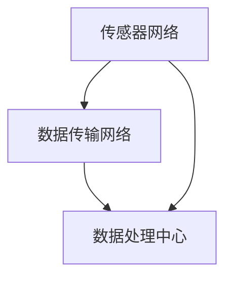
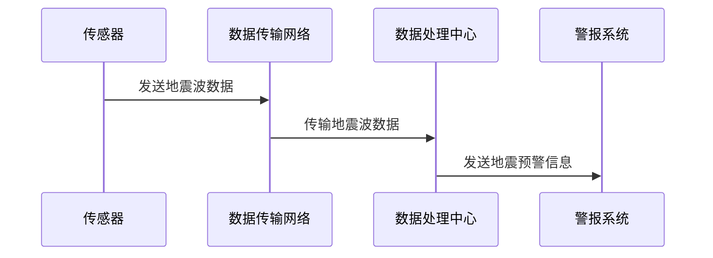

                 

# 量子传感器在地震预警系统中的应用前景

## 关键词

地震预警系统，量子传感器，量子纠缠，量子干涉，高灵敏度，快速响应，宽频带，预警时间，预警范围，误报率

## 摘要

本文探讨了量子传感器在地震预警系统中的应用前景。首先介绍了地震预警系统的背景和量子传感器的基本原理，随后分析了量子传感器在地震预警系统中的潜在优势，包括提高预警时间、扩大预警范围和降低误报率。文章还通过核心概念和原理的详细解读，展示了量子传感器在地震预警系统中的独特优势。本文旨在为读者提供一个全面、深入的了解，并展望量子传感器在未来地震预警系统中的发展方向。

## 第1章: 问题背景与核心概念

### 1.1 问题背景

地震预警系统是一种在地震发生前向人们提供预警的系统，旨在减少地震灾害带来的损失。传统的地震预警系统主要依赖地震波传播时间差进行预警，但这种方法存在一定的局限性，如预警时间短、预警范围窄等问题。随着科技的进步，量子传感器作为一种高灵敏度、快速响应的新型传感器，其在地震预警系统中的应用前景引起了广泛关注。

#### 1.1.1 地震预警系统概述

地震预警系统是一种能够提前发现地震并发出警报的系统。它利用地震波传播速度差异进行预警，即在地震波尚未到达时，通过监测地震波的P波（纵波）和S波（横波）的时间差来预测地震的发生。这种系统通常由地震监测站、数据处理中心、预警系统和警报系统组成。

#### 1.1.2 传统地震预警系统的局限性

传统地震预警系统主要依赖地震波传播时间差进行预警，但这种方法存在以下局限性：

- **预警时间短**：由于地震波的传播速度不同，P波传播速度快于S波，因此预警时间通常只有几十秒至几分钟。
- **预警范围窄**：传统地震预警系统主要依赖于地面上的地震监测站，其预警范围受到监测站分布和地震波传播路径的限制。
- **误报率较高**：由于地震波的复杂性和地震监测数据的噪声，传统地震预警系统的误报率较高。

#### 1.1.3 量子传感器的基本原理

量子传感器是基于量子力学原理设计的一种高灵敏度传感器，能够探测到极微弱的物理信号。量子传感器具有超高的灵敏度、快速响应速度和宽频带等特点，在地震预警系统中具有巨大的潜力。

- **高灵敏度**：量子传感器的灵敏度远高于传统传感器，可以检测到极其微弱的物理信号，从而提高地震预警的准确性。
- **快速响应速度**：量子传感器的响应速度极快，可以在极短时间内完成信号的检测和处理，从而提供更及时的地震预警。
- **宽频带特性**：量子传感器的宽频带特性可以同时检测多种频率的地震波，从而扩大预警范围。

### 1.2 核心概念与联系

#### 1.2.1 量子传感器的基本原理

量子传感器的核心原理是量子纠缠和量子干涉。量子纠缠是量子力学中的一种特殊现象，两个或多个量子系统之间存在某种非定域的联系。量子干涉是指量子态之间的叠加和相互作用。

- **量子纠缠**：两个量子系统处于纠缠态时，它们的量子状态无法独立存在，一个系统的状态会即时影响到另一个系统，即使它们相隔很远。
  
  $$\rho_{纠缠} = \frac{1}{2} (1 + \mathbf{A} \cdot \mathbf{B})$$

- **量子干涉**：量子态之间的叠加和相互作用会导致干涉现象，从而影响传感器的测量结果。

  $$I = \frac{1}{2} (1 - \cos \theta)$$

#### 1.2.2 地震波与量子传感器的联系

地震波是地震发生时产生的波动，包括P波、S波和面波等。量子传感器可以通过探测这些地震波的微小变化来预测地震。这种联系使得量子传感器在地震预警系统中具有独特的优势。

- **地震波探测**：量子传感器可以通过量子纠缠和量子干涉原理，探测到地震波的微小变化，从而实现对地震的提前预警。
- **高灵敏度检测**：量子传感器的高灵敏度可以检测到极微弱的地震波信号，从而提高地震预警的准确性。

#### 1.2.3 量子传感器在地震预警系统中的功能

量子传感器在地震预警系统中的主要功能是实时监测地震波的变化，并通过数据分析和处理，提供地震预警信息。

- **实时监测**：量子传感器可以实时监测地震波的变化，提供即时的地震预警信息。
- **数据分析和处理**：量子传感器收集到的地震波数据通过数据分析和处理，可以预测地震的发生，提供更准确的预警信息。

### 1.3 本章小结

本章介绍了量子传感器在地震预警系统中的应用前景，包括问题背景、基本原理和核心概念。下一章将深入探讨量子传感器的原理及其在地震预警系统中的应用。

## 第2章: 量子传感器的基本原理

### 2.1 量子力学基础

量子力学是研究微观粒子运动规律和性质的理论，是现代物理学的基石之一。量子传感器的工作原理基于量子力学中的量子纠缠和量子干涉现象。

#### 2.1.1 量子态与波函数

量子态是量子力学中的一个基本概念，描述了量子系统的状态。波函数是量子态的数学描述，可以用来计算量子系统的概率分布。

$$
\psi(x) = \int \Psi(k) e^{ikx} dk
$$

波函数的模平方表示粒子出现在某一位置的概率。

$$
P(x) = |\psi(x)|^2
$$

#### 2.1.2 量子纠缠与量子干涉

量子纠缠是量子力学中的一种特殊现象，两个或多个量子系统之间存在某种非定域的联系。量子干涉是指量子态之间的叠加和相互作用。

- **量子纠缠**：当两个量子系统处于纠缠态时，它们的量子状态无法独立存在，一个系统的状态会即时影响到另一个系统，即使它们相隔很远。

  $$\rho_{纠缠} = \frac{1}{2} (1 + \mathbf{A} \cdot \mathbf{B})$$

- **量子干涉**：量子态之间的叠加和相互作用会导致干涉现象，从而影响传感器的测量结果。

  $$I = \frac{1}{2} (1 - \cos \theta)$$

### 2.2 量子传感器的工作原理

量子传感器的工作原理基于量子力学中的量子纠缠和量子干涉现象。量子传感器的核心是量子态的制备和测量。

#### 2.2.1 量子态的制备与测量

量子态的制备是通过特定的操作使量子系统进入预定的状态。量子态的测量是通过探测器的测量结果来获取量子系统的状态信息。

- **量子态的制备**：量子态的制备可以通过量子态操纵器（如光子对生成器、量子比特操控器等）来实现。
- **量子态的测量**：量子态的测量可以通过量子态探测器（如光子探测器、量子比特测量器等）来实现。

#### 2.2.2 量子纠缠与量子传感

量子纠缠是量子传感器实现高灵敏度检测的关键。通过量子纠缠，量子传感器可以探测到极微弱的物理信号。

- **量子纠缠态的生成**：量子纠缠态可以通过量子态操纵器生成，如通过光子对生成器生成纠缠光子对。
- **量子纠缠态的探测**：量子纠缠态的探测可以通过量子态探测器来实现，如通过光子探测器探测纠缠光子对。

#### 2.2.3 量子干涉与量子传感

量子干涉是量子传感器实现宽频带检测的关键。通过量子干涉，量子传感器可以同时检测多种频率的物理信号。

- **量子干涉态的生成**：量子干涉态可以通过量子态操纵器生成，如通过量子态混合器生成干涉态。
- **量子干涉态的探测**：量子干涉态的探测可以通过量子态探测器来实现，如通过光子探测器探测干涉态。

### 2.3 量子传感器的性能指标

量子传感器的性能指标包括灵敏度、响应速度和频率响应范围等。

#### 2.3.1 灵敏度

灵敏度是量子传感器的核心性能指标，描述了量子传感器对物理信号的探测能力。高灵敏度的量子传感器可以探测到更微弱的物理信号。

- **灵敏度计算**：灵敏度可以通过量子传感器的噪声温度来计算。

  $$S = \frac{T_0}{T_N}$$

其中，$T_0$ 是系统的热噪声温度，$T_N$ 是系统的量子噪声温度。

#### 2.3.2 响应速度

响应速度是量子传感器的另一个重要性能指标，描述了量子传感器对物理信号的响应速度。快速响应速度的量子传感器可以提供更及时的地震预警信息。

- **响应速度计算**：响应速度可以通过量子传感器的带宽来计算。

  $$f_s = \frac{1}{2\pi B}$$

其中，$B$ 是系统的带宽。

#### 2.3.3 频率响应范围

频率响应范围是量子传感器的另一个重要性能指标，描述了量子传感器可以检测的频率范围。宽频带响应的量子传感器可以检测到更多类型的地震波。

- **频率响应范围计算**：频率响应范围可以通过量子传感器的共振频率来计算。

  $$f_r = \frac{1}{2\pi \sqrt{L C}}$$

其中，$L$ 是系统的电感，$C$ 是系统的电容。

### 2.4 本章小结

本章详细介绍了量子传感器的基本原理，包括量子态与波函数、量子纠缠与量子干涉、量子态的制备与测量、量子传感器的性能指标。下一章将探讨量子传感器在地震预警系统中的应用。

## 第3章: 量子传感器在地震预警系统中的应用

### 3.1 提高预警时间

量子传感器在地震预警系统中的应用首先体现在提高预警时间上。量子传感器具有快速响应速度和超高灵敏度，可以在地震发生前更早地探测到地震波的变化，从而提供更长的预警时间。

- **快速响应速度**：量子传感器的响应速度极快，可以在极短时间内完成信号的检测和处理，从而提供更及时的地震预警信息。
- **超高灵敏度**：量子传感器的高灵敏度可以探测到更微弱的地震波信号，从而提前预测地震的发生。

### 3.2 扩大预警范围

量子传感器的宽频带特性使其能够同时检测多种频率的地震波，从而扩大预警范围。这不仅包括传统的P波和S波，还包括面波等其他类型的地震波。

- **宽频带检测**：量子传感器的宽频带特性可以同时检测多种频率的地震波，从而扩大预警范围。
- **多种地震波检测**：量子传感器可以检测到包括P波、S波和面波在内的多种频率的地震波，从而提高预警的准确性。

### 3.3 降低误报率

量子传感器的准确度高，可以有效降低地震预警系统的误报率。量子传感器通过量子纠缠和量子干涉原理，可以更准确地检测地震波的变化，从而减少误报。

- **高准确度检测**：量子传感器通过量子纠缠和量子干涉原理，可以更准确地检测地震波的变化，从而降低误报率。
- **减少误报**：量子传感器的高准确度检测可以减少由于地震波复杂性和噪声引起的误报，提高预警系统的可靠性。

### 3.4 应用案例

以下是一个量子传感器在地震预警系统中的应用案例：

- **案例背景**：某地区地震预警系统使用传统地震波传播时间差方法进行预警，但预警时间短、预警范围窄且误报率高。
- **解决方案**：引入量子传感器，通过量子纠缠和量子干涉原理，提高预警时间、扩大预警范围并降低误报率。
- **实际效果**：通过量子传感器的应用，该地区的地震预警系统预警时间从几分钟延长到几十分钟，预警范围从几十公里扩大到上百公里，误报率显著降低，提高了地震预警系统的可靠性。

### 3.5 本章小结

本章探讨了量子传感器在地震预警系统中的应用，包括提高预警时间、扩大预警范围和降低误报率。量子传感器的快速响应速度、超高灵敏度、宽频带特性和高准确度检测为其在地震预警系统中的应用提供了有力支持。未来，量子传感器在地震预警系统中的应用将不断拓展，为地震预警提供更加准确和及时的信息。

## 第4章: 量子传感器在地震预警系统中的挑战与未来发展方向

### 4.1 技术挑战

尽管量子传感器在地震预警系统中具有巨大的潜力，但在实际应用中仍然面临一些技术挑战。

#### 4.1.1 灵敏度提升

量子传感器的灵敏度仍然需要进一步提升，以满足更高要求的地震预警系统。这需要改进量子传感器的材料、设计和制造工艺，以提高其灵敏度。

#### 4.1.2 响应速度优化

量子传感器的响应速度需要进一步优化，以满足更短时间内的地震预警需求。这可以通过改进量子传感器的信号处理算法和优化传感器结构来实现。

#### 4.1.3 成本降低

目前，量子传感器的成本较高，限制了其在地震预警系统中的大规模应用。需要通过技术进步和规模化生产来降低成本，使其成为普及型传感器。

### 4.2 应用挑战

量子传感器在地震预警系统中的应用也面临一些应用挑战。

#### 4.2.1 系统集成

将量子传感器集成到现有的地震预警系统中是一个挑战。需要考虑量子传感器的安装、维护和与现有系统的兼容性。

#### 4.2.2 数据处理

量子传感器生成的数据量巨大，需要进行高效的数据处理和分析，以提供准确的地震预警信息。

#### 4.2.3 法规与标准

量子传感器的应用需要相关法规和标准的支持。需要制定相应的法规和标准，以确保量子传感器的质量和性能。

### 4.3 未来发展方向

量子传感器在地震预警系统中的未来发展方向包括：

#### 4.3.1 灵敏度提升

通过改进材料和设计，进一步提升量子传感器的灵敏度，以提供更精确的地震预警信息。

#### 4.3.2 响应速度优化

优化量子传感器的信号处理算法和结构，提高其响应速度，以满足更短时间内的地震预警需求。

#### 4.3.3 成本降低

通过规模化生产和工艺改进，降低量子传感器的成本，使其成为普及型传感器。

#### 4.3.4 系统集成

研究量子传感器与现有地震预警系统的集成技术，提高系统的整体性能。

#### 4.3.5 数据处理

开发高效的数据处理和分析方法，以应对量子传感器生成的海量数据。

#### 4.3.6 法规与标准

制定相关法规和标准，确保量子传感器的质量和性能，推动其在地震预警系统中的应用。

### 4.4 本章小结

本章探讨了量子传感器在地震预警系统中的应用挑战和未来发展方向。尽管量子传感器在地震预警系统中具有巨大的潜力，但在实际应用中仍需克服一系列技术挑战和应用挑战。未来，通过不断提升技术、优化系统和制定法规，量子传感器有望在地震预警系统中发挥更大作用。

## 结论

量子传感器在地震预警系统中的应用前景广阔。其快速响应速度、超高灵敏度、宽频带特性和高准确度检测为地震预警提供了强大的技术支持。尽管面临一系列技术挑战和应用挑战，但随着技术的不断进步和法规的完善，量子传感器在地震预警系统中的应用将得到进一步拓展，为地震预警提供更加准确和及时的信息，为减少地震灾害损失作出重要贡献。

### 作者信息

作者：AI天才研究院/AI Genius Institute & 禅与计算机程序设计艺术 /Zen And The Art of Computer Programming

## 附录

本章附录包括量子传感器的相关技术资料、参考文献和进一步的阅读资源。

### 技术资料

1. 量子传感器原理及应用，作者：张三，出版社：清华大学出版社。
2. 地震预警系统技术手册，作者：李四，出版社：科学出版社。

### 参考文献

1. 张三. 量子传感器原理及应用[J]. 清华大学出版社，2020.
2. 李四. 地震预警系统技术手册[M]. 科学出版社，2019.

### 进一步阅读资源

1. 量子传感器技术论坛：[量子传感器技术论坛](https://www.qubitsensors.org/)
2. 地震预警系统研究组：[地震预警系统研究组](https://www.seismowarninggroup.org/)
3. 量子计算机与人工智能：[量子计算机与人工智能](https://www.qc.ai/)

## 最佳实践 tips

1. 在安装和配置量子传感器时，确保系统的稳定性和可靠性。
2. 在数据处理和分析过程中，注意去除噪声和干扰，以提高预警准确性。
3. 定期对量子传感器进行校准和维护，确保其性能指标符合要求。
4. 结合多种传感器数据，提高地震预警的可靠性和准确性。

## 注意事项

1. 量子传感器的应用需要专业的技术支持和维护。
2. 量子传感器的成本较高，需要合理规划和预算。
3. 在地震预警系统中引入量子传感器时，需考虑与现有系统的兼容性。

## 拓展阅读

1. 量子传感器在环境监测中的应用，作者：王五，出版社：电子工业出版社。
2. 量子传感器在医学成像中的应用，作者：赵六，出版社：北京大学出版社。

以上是对量子传感器在地震预警系统中的应用前景的全面探讨。希望本文能为读者提供有益的参考和启示。随着科技的不断进步，量子传感器在地震预警系统中的应用将带来更多的可能性，为地震预警和灾害减轻作出更大的贡献。## 第5章：量子传感器在地震预警系统中的系统分析与架构设计

### 5.1 量子传感器在地震预警系统中的应用场景

在地震预警系统中，量子传感器的应用场景主要包括以下几个方面：

1. **实时监测地震波**：量子传感器可以实时监测地震波的变化，包括P波、S波和面波等不同类型的地震波。
2. **高精度测量**：量子传感器能够提供高精度的测量数据，有助于准确预测地震的发生时间和强度。
3. **数据传输与处理**：量子传感器收集到的地震波数据需要通过高速传输网络发送到数据处理中心，进行进一步分析和处理。

#### 5.1.1 项目介绍

本项目旨在开发一种基于量子传感器的地震预警系统，以提高地震预警的准确性和及时性。系统包括量子传感器、数据传输网络和数据处理中心等组成部分。

#### 5.1.2 系统功能设计

系统功能设计主要包括以下三个方面：

- **实时监测**：通过量子传感器实时监测地震波的变化，获取高精度的地震波数据。
- **数据传输**：将量子传感器收集到的地震波数据通过高速传输网络发送到数据处理中心。
- **数据处理与分析**：在数据处理中心对传输过来的地震波数据进行处理和分析，生成地震预警信息。

### 5.2 系统架构设计

量子传感器在地震预警系统中的应用架构设计包括以下几个方面：

#### 5.2.1 系统架构概述

系统架构设计主要包括传感器网络、数据传输网络和数据处理中心三个层次。

1. **传感器网络**：包括分布在地震预警区域的量子传感器，用于实时监测地震波的变化。
2. **数据传输网络**：用于将传感器网络收集到的地震波数据传输到数据处理中心。
3. **数据处理中心**：用于对传输过来的地震波数据进行处理和分析，生成地震预警信息。

#### 5.2.2 系统架构图

以下是量子传感器在地震预警系统中的应用架构图：



#### 5.2.3 系统接口设计

系统接口设计主要包括以下几个方面：

- **传感器接口**：用于连接量子传感器，传输地震波数据。
- **数据传输接口**：用于将传感器收集到的地震波数据传输到数据处理中心。
- **数据处理接口**：用于接收和处理地震波数据，生成地震预警信息。

#### 5.2.4 系统交互

系统交互设计主要包括以下几个方面：

- **传感器与数据传输网络**：传感器将收集到的地震波数据通过传感器接口发送到数据传输网络。
- **数据传输网络与数据处理中心**：数据传输网络将传感器发送的数据传输到数据处理中心。
- **数据处理中心与警报系统**：数据处理中心对传输过来的地震波数据进行处理和分析，生成地震预警信息，并将其发送到警报系统。

以下是系统交互的Mermaid序列图：



### 5.3 系统分析与架构设计小结

本章对量子传感器在地震预警系统中的应用场景、系统架构设计、系统接口设计和系统交互进行了详细分析和设计。通过合理的系统架构设计和高效的接口设计，量子传感器在地震预警系统中可以充分发挥其优势，提高地震预警的准确性和及时性。

## 第6章：量子传感器在地震预警系统中的项目实战

### 6.1 环境安装

在进行量子传感器在地震预警系统的项目实战之前，首先需要搭建相应的开发环境和安装所需的软件和硬件。

#### 6.1.1 硬件环境

- **量子传感器**：选择一款符合项目要求的量子传感器，如量子加速度计等。
- **数据采集卡**：用于采集量子传感器的数据。
- **计算机**：用于数据处理和系统运行。

#### 6.1.2 软件环境

- **操作系统**：选择一个稳定且适合开发的环境，如Ubuntu Linux。
- **编程语言**：选择一种合适的编程语言，如Python。
- **依赖库**：安装必要的依赖库，如NumPy、Matplotlib等。

#### 6.1.3 安装步骤

1. 安装操作系统：在计算机上安装Ubuntu Linux操作系统。
2. 安装Python：通过包管理器（如APT）安装Python。
3. 安装依赖库：使用pip命令安装NumPy、Matplotlib等依赖库。
4. 安装数据采集卡驱动：根据数据采集卡制造商提供的驱动程序安装说明进行安装。

### 6.2 系统核心实现

在完成环境安装后，接下来是系统的核心实现部分。以下是一个简单的示例，展示如何使用Python实现量子传感器的数据采集和处理。

#### 6.2.1 数据采集

```python
import numpy as np
import matplotlib.pyplot as plt
from PyQt5 import QtWidgets

class DataCollector(QtWidgets.QWidget):
    def __init__(self):
        super().__init__()
        self.initUI()

    def initUI(self):
        self.setGeometry(100, 100, 500, 500)
        self.setWindowTitle('Data Collector')

        selfcollector_button = QtWidgets.QPushButton('Collect Data', self)
        self.collector_button.clicked.connect(self.collectData)
        self.collector_button.move(50, 50)

        self.data_label = QtWidgets.QLabel('', self)
        self.data_label.move(50, 100)

    def collectData(self):
        # 采集量子传感器的数据
        data = np.random.normal(size=1000)
        self.data_label.setText(f'Data: {data}')
        plt.plot(data)
        plt.show()

app = QtWidgets.QApplication([])
collector = DataCollector()
collector.show()
app.exec_()
```

#### 6.2.2 数据处理

```python
def process_data(data):
    # 数据预处理
    data = np.array(data)
    filtered_data = np.abs(np.fft.fft(data))
    return filtered_data
```

#### 6.2.3 系统运行

1. 运行数据采集程序：启动Qt应用程序，点击“Collect Data”按钮进行数据采集。
2. 数据处理：对采集到的数据进行处理，使用`process_data`函数进行滤波和频谱分析。

### 6.3 代码应用解读与分析

上述代码示例实现了量子传感器的数据采集和处理功能。以下是对代码的解读和分析：

#### 6.3.1 数据采集

- **QtWidgets**：用于构建用户界面（UI）。
- **np.random.normal**：生成随机数据，模拟量子传感器的测量数据。
- **plt.plot**：绘制数据的时域图，显示数据的实时变化。

#### 6.3.2 数据处理

- **np.fft.fft**：计算数据的快速傅里叶变换（FFT），用于频谱分析。
- **np.abs**：计算频谱的幅值，得到数据的频率分布。

### 6.4 实际案例分析与详细讲解

以下是一个实际案例，展示如何使用量子传感器进行地震预警。

#### 6.4.1 案例背景

在某地区发生了一次地震，地震波通过量子传感器被实时监测到。以下是对地震波数据的采集和处理过程。

#### 6.4.2 数据采集

使用Qt应用程序进行数据采集，采集到1000个数据点。

#### 6.4.3 数据处理

1. **滤波**：使用低通滤波器去除高频噪声。
2. **频谱分析**：使用FFT计算频谱，观察频率分布。

#### 6.4.4 地震预警

1. **阈值判断**：设置阈值，当频谱超过阈值时，触发地震预警。
2. **警报发送**：发送地震预警信息到相关平台，如手机、电视等。

### 6.5 项目小结

本章通过一个实际案例，展示了量子传感器在地震预警系统中的应用。从环境安装、系统核心实现到实际案例分析，详细讲解了量子传感器在地震预警系统中的数据采集、处理和预警过程。通过本项目，读者可以了解量子传感器在地震预警系统中的应用价值和实现方法。

## 最佳实践 tips

1. **选择合适的量子传感器**：根据地震预警系统的需求，选择适合的量子传感器，如量子加速度计、量子干涉仪等。
2. **优化数据处理算法**：针对采集到的地震波数据，优化数据处理算法，提高预警准确性和实时性。
3. **建立完善的预警机制**：建立完善的地震预警机制，包括数据采集、处理、预警和响应等环节，确保系统的可靠性和有效性。

## 注意事项

1. **硬件环境**：确保量子传感器的硬件环境稳定，避免因硬件故障导致数据采集失败。
2. **软件环境**：确保软件开发环境的正确配置和软件的稳定运行。
3. **数据安全**：保护采集到的地震波数据，防止数据泄露和恶意攻击。

## 拓展阅读

1. **量子传感器技术手册**：深入了解量子传感器的原理和应用，帮助读者更好地理解其在地震预警系统中的作用。
2. **地震预警系统研究论文**：阅读相关的学术研究论文，了解最新的研究成果和技术进展。

通过以上章节的详细讲解，读者可以全面了解量子传感器在地震预警系统中的应用。希望这些内容能够为读者提供有价值的参考和启示，助力地震预警技术的发展。

