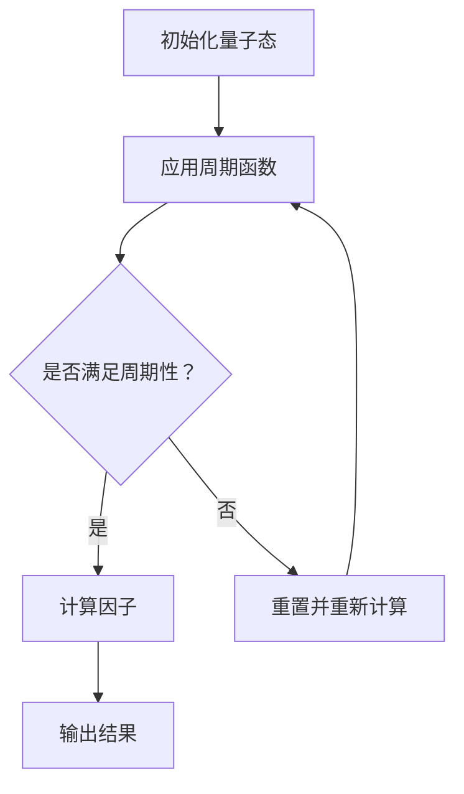
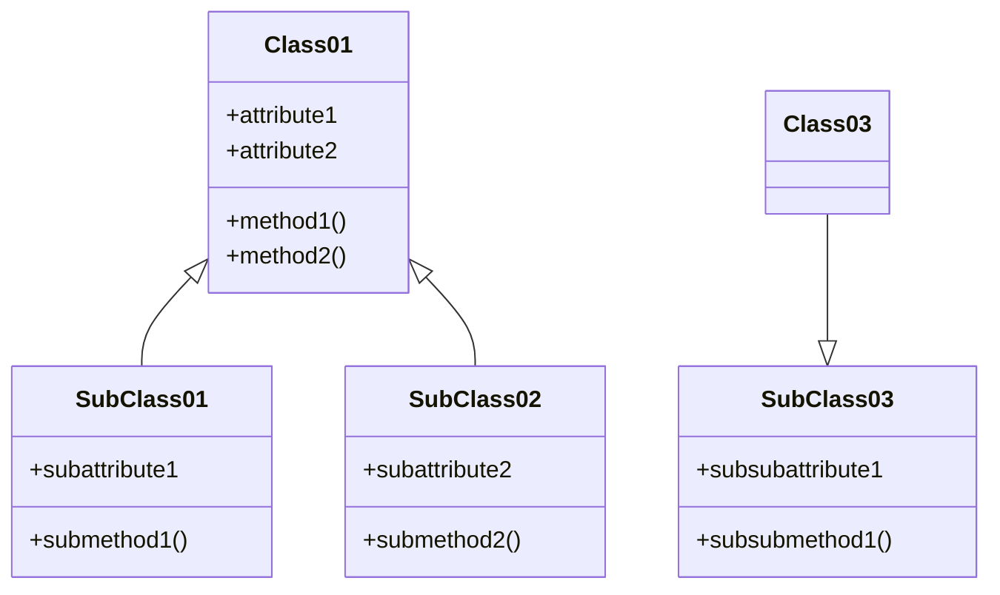
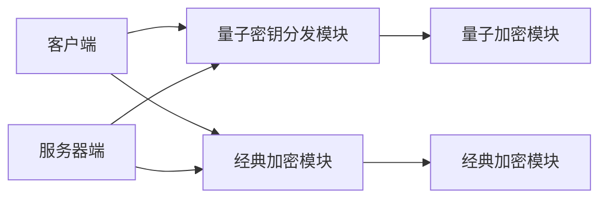
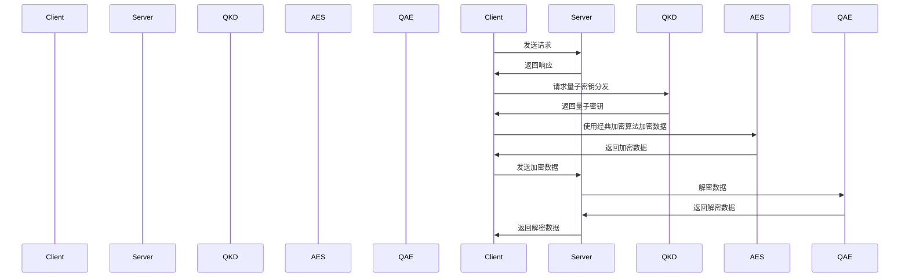

                 

### 文章标题：量子计算对传统加密技术的挑战

#### 关键词：量子计算、加密技术、RSA加密、QKD、信息安全

#### 摘要：随着量子计算的快速发展，其对传统加密技术的挑战日益凸显。本文首先介绍了量子计算的基本概念和加密技术的基础知识，然后深入探讨了量子计算对RSA加密和对称加密算法的威胁，以及量子加密技术的解决方案。最后，分析了量子计算在信息安全领域的应用前景，提出了应对策略和未来发展方向。

----------------------------------------------------------------

## 第1章：量子计算简介

### 1.1.1 量子计算的基本概念

量子计算是利用量子力学原理进行信息处理的一种计算方式。与传统的经典计算不同，量子计算依赖于量子比特（qubit）这一基本单元。量子比特与传统比特（bit）最大的区别在于其可以同时处于0和1的状态，这种现象称为量子叠加。此外，量子比特之间还可以通过量子纠缠实现信息的超距传输，这使得量子计算机在处理特定类型问题时具有巨大的并行计算能力。

### 1.1.2 量子比特与经典比特的对比

| 特征 | 量子比特 | 经典比特 |
| --- | --- | --- |
| 状态 | 可同时处于0和1的状态 | 只能处于0或1的状态 |
| 并行性 | 具有并行计算的能力 | 只能逐一处理 |
| 纠错 | 非常脆弱，容易出错 | 相对稳定，较少出错 |
| 存储信息 | 可以存储更多信息 | 信息存储有限 |

### 1.1.3 量子计算的优势与挑战

**优势：**
- 量子并行计算：量子计算机可以利用量子叠加和量子纠缠的特性，同时处理多个问题，从而大幅提高计算速度。
- 解决复杂问题：量子计算机能够高效地解决经典计算机难以处理的问题，例如大规模因数分解和搜索问题。

**挑战：**
- 量子纠错：量子比特容易受到外界干扰，导致计算错误。因此，如何实现高效的量子纠错成为量子计算研究的重要挑战。
- 量子门操作：实现精确的量子门操作是量子计算的核心，但目前的技术水平尚不足以实现大规模的量子门操作。

### 1.1.4 量子计算的发展历程

量子计算的概念最早由理查德·费曼在1981年提出。随后，彼得·舒尔（Peter Shor）在1994年提出了著名的Shor算法，证明了量子计算机可以在多项式时间内解决大规模因数分解问题。此后，量子计算的研究和应用得到了广泛关注和快速发展。目前，包括IBM、Google、微软等在内的多家科技公司和研究机构都在积极研发量子计算机。

----------------------------------------------------------------

## 第2章：加密技术基础

### 2.1.1 加密技术的起源与发展

加密技术的起源可以追溯到古代。在古埃及时期，人们开始使用简单的替换密码和转轮密码来保护信息。随着计算机技术的发展，加密技术经历了从古代密码学到近代密码学的演变。近代密码学以1976年Diffie和Hellman提出的公钥加密算法为代表，标志着密码学进入了一个新的时代。

### 2.1.2 常见的加密算法

加密算法可以分为对称加密算法和非对称加密算法。

**对称加密算法：**
- 代表算法：AES、DES
- 原理：加密和解密使用相同的密钥，数据传输速度快，但密钥管理复杂。

**非对称加密算法：**
- 代表算法：RSA、ECC
- 原理：加密和解密使用不同的密钥，数据传输安全性高，但计算复杂度高。

### 2.1.3 密码学在现代网络安全中的重要性

密码学在现代网络安全中发挥着至关重要的作用。通过加密技术，可以实现以下功能：

- 数据保密：保护数据在传输和存储过程中的安全性。
- 数据完整性：确保数据在传输过程中未被篡改。
- 身份验证：验证通信双方的合法身份。
- 数字签名：确保数据的真实性和完整性。

### 2.1.4 加密技术的基本原理

加密技术的基本原理是通过加密算法将明文转换成密文，只有使用相应密钥才能解密还原明文。加密算法通常分为两大类：

- 对称加密：加密和解密使用相同的密钥，算法简单，但密钥管理复杂。
- 非对称加密：加密和解密使用不同的密钥，安全性高，但计算复杂度高。

### 2.1.5 加密技术在现代网络通信中的应用

加密技术在现代网络通信中的应用广泛，包括：

- HTTPS：用于保护Web浏览器的数据安全。
- VPN：实现远程访问和数据传输的安全。
- 电子邮件加密：确保电子邮件内容的安全。

总之，加密技术在保障信息安全、保护数据隐私方面具有重要作用。随着量子计算的发展，传统加密技术的安全性面临着新的挑战，量子加密技术的研发和应用也变得尤为重要。

----------------------------------------------------------------

## 第3章：量子计算对传统加密技术的挑战

### 3.1.1 量子计算机的基本原理

量子计算机的基本原理基于量子力学的基本概念，特别是量子比特（qubit）和量子门。量子比特是量子计算机的基本单元，它不同于经典计算机中的比特，可以同时处于0和1的叠加态。量子门是操作量子比特的基本操作，类似于经典计算机中的逻辑门。

量子计算机通过一系列量子门操作，实现量子态的变换，从而完成复杂的计算任务。量子计算机的计算过程包括以下步骤：

1. **初始化：** 将量子比特初始化为叠加态。
2. **量子门操作：** 应用一系列量子门，将初始量子态变换为目标量子态。
3. **测量：** 对量子态进行测量，得到计算结果。

### 3.1.2 Shor算法及其对RSA加密的影响

Shor算法是量子计算中一个非常重要的算法，它能够高效地解决经典计算机难以处理的整数因子分解问题。Shor算法的核心思想是利用量子计算机的并行计算能力，将一个整数分解成其质因数的乘积。

假设我们要分解的整数为\( N \)，Shor算法的基本步骤如下：

1. **量子态初始化：** 将量子计算机的量子比特初始化为一个特定的叠加态。
2. **量子算法执行：** 应用一系列量子门，使量子态经历一个周期函数的周期性变换。
3. **量子测量：** 对量子态进行测量，得到一个周期数\( a \)。
4. **量子反演：** 利用另一个量子算法找到\( a \)在模\( N \)下的逆元。
5. **因子分解：** 将\( N \)分解成\( N = pq \)，其中\( p \)和\( q \)是质数。

Shor算法的出现对RSA加密算法构成了严重威胁。RSA加密算法是基于大整数分解问题的，假设\( N = pq \)，其中\( p \)和\( q \)是两个大的质数，\( N \)的因数分解是极其困难的。然而，Shor算法能够在多项式时间内找到\( N \)的因数，这意味着RSA加密算法在量子计算机面前将变得极其脆弱。

### 3.1.3 Grover算法及其对对称加密的影响

Grover算法是另一个对传统加密技术构成挑战的量子算法，它能够显著提高搜索算法的效率。假设在一个经典计算机中，搜索一个未排序的列表需要\( O(n) \)次比较，而Grover算法可以将这个时间减少到\( O(\sqrt{n}) \)。

Grover算法的基本原理是利用量子计算机的叠加态和纠缠态，对搜索过程进行优化。其步骤如下：

1. **初始化：** 将量子比特初始化为一个特定的叠加态。
2. **应用Grover映射：** 对叠加态进行一系列的量子门操作，使目标状态被放大。
3. **测量：** 对量子态进行测量，得到目标状态的索引。

Grover算法对对称加密算法（如AES）构成了威胁。由于Grover算法能够大幅提高搜索效率，攻击者可以利用这一优势，在较短的时间内破解对称加密算法。

总的来说，量子计算的发展对传统加密技术构成了巨大的挑战。RSA加密和对称加密算法在量子计算机面前变得脆弱，因此需要开发新的量子加密技术来应对这些挑战。

----------------------------------------------------------------

## 第4章：量子加密技术

### 4.1.1 量子密钥分发（QKD）

量子密钥分发（Quantum Key Distribution，QKD）是一种基于量子力学原理的加密技术，它能够实现绝对安全的密钥分发。QKD的基本原理是利用量子纠缠和量子测量的不可逆性，确保密钥在传输过程中的安全性。

QKD的基本步骤如下：

1. **量子纠缠生成：** 在发送方和接收方之间生成量子纠缠态。
2. **量子态传输：** 将量子态通过经典通信渠道传输到接收方。
3. **量子态测量：** 接收方对量子态进行测量，得到部分密钥信息。
4. **经典通信确认：** 发送方和接收方通过经典通信渠道交换测量结果，确认密钥的正确性。

QKD具有以下优势：

- **绝对安全性：** 由于量子测量的不可逆性，任何第三方试图窃取密钥都会引起量子态的破坏，从而被检测到。
- **量子态传输：** QKD利用量子态的传输，能够在经典通信渠道上实现绝对安全的密钥分发。

### 4.1.2 量子密码学的基本原理

量子密码学是基于量子力学原理的密码学，包括量子密钥分发和量子加密技术。量子密码学的基本原理包括：

- **量子叠加态：** 量子密码学利用量子比特的叠加态进行信息编码，可以同时表示0和1。
- **量子纠缠态：** 量子密码学利用量子比特之间的纠缠态，实现信息的安全传输。
- **量子测量：** 量子密码学利用量子测量的不可预测性，确保信息的秘密性。

量子密码学的基本概念包括：

- **量子密钥分发：** QKD是一种基于量子力学原理的密钥分发技术，能够实现绝对安全的密钥传输。
- **量子加密：** 量子加密技术利用量子态的不可克隆特性，实现信息的安全传输。

### 4.1.3 量子加密技术的应用场景

量子加密技术在多个领域都有广泛的应用，包括：

- **金融领域：** 量子加密技术可以用于保障金融交易的保密性和完整性，防止数据泄露和篡改。
- **通信领域：** 量子加密技术可以用于保障通信线路的安全性，防止黑客攻击和数据窃取。
- **政府和企业内部网络：** 量子加密技术可以用于保障政府和企业内部网络的安全性，防止机密信息泄露。

量子加密技术的应用前景广阔，随着量子计算技术的不断发展，量子加密技术将在信息安全领域发挥越来越重要的作用。

----------------------------------------------------------------

## 第5章：量子计算与经典加密技术的结合

### 5.1.1 杂糅加密算法的设计思路

杂糅加密算法是一种结合量子计算和经典加密技术的加密方法，旨在利用两者的优势，提高加密系统的安全性。设计杂糅加密算法的基本思路如下：

1. **结合量子计算和经典计算：** 在加密过程中，部分操作采用量子计算，部分操作采用经典计算，以充分发挥量子计算的高速处理能力和经典计算的稳定性。
2. **多层次加密：** 将加密过程分为多个层次，每个层次采用不同的加密方法，包括量子加密和经典加密，以增强加密系统的安全性。
3. **密钥管理：** 采用量子密钥分发技术生成安全的密钥，同时利用经典加密技术进行密钥的分发和管理。

### 5.1.2 量子计算机在加密算法优化中的应用

量子计算机在加密算法优化中具有巨大的潜力。通过量子计算机，可以显著提高某些加密算法的计算效率，具体应用包括：

1. **密码分析优化：** 利用量子计算机进行密码分析，可以更高效地破解传统加密算法，从而推动加密算法的优化和创新。
2. **量子随机数生成：** 量子计算机可以用于生成高质量的随机数，提高加密算法的随机性和安全性。
3. **量子加密算法优化：** 通过量子计算，可以优化量子加密算法的执行效率，提高加密系统的性能。

### 5.1.3 量子计算机与经典计算机协同工作

量子计算机与经典计算机的协同工作是实现高效加密系统的重要途径。在量子计算机与经典计算机协同工作的过程中，可以考虑以下策略：

1. **任务分配：** 根据量子计算机和经典计算机的能力，合理分配加密任务，充分发挥两者的优势。
2. **算法融合：** 将量子计算和经典计算相结合，设计出新的加密算法，提高加密系统的安全性。
3. **安全通信：** 通过量子密钥分发技术，实现量子计算机与经典计算机之间的安全通信，确保密钥的保密性。

总之，量子计算与经典加密技术的结合，为加密系统的发展提供了新的思路和方向。随着量子计算技术的不断进步，量子计算机将在信息安全领域发挥越来越重要的作用。

----------------------------------------------------------------

## 第6章：量子计算在信息安全领域的未来

### 6.1.1 量子计算对信息安全的影响

随着量子计算的快速发展，其对信息安全的潜在影响不容忽视。一方面，量子计算有望大幅提升加密算法的破解速度，对现有的信息安全体系构成重大威胁。例如，Shor算法能够快速分解大整数，从而破坏RSA加密算法的安全性。另一方面，量子计算也为信息安全带来了新的机遇，如量子密钥分发（QKD）等量子加密技术的应用，为数据传输提供了绝对安全的方法。

### 6.1.2 量子计算在密码学中的应用前景

量子计算在密码学中的应用前景广阔。一方面，量子计算机可以用于优化现有加密算法，提高其安全性和效率。例如，通过量子算法，可以更快速地生成随机数和实现高效的密钥交换。另一方面，量子计算为设计新型加密算法提供了新的思路，如量子哈希函数、量子数字签名等。这些新型加密算法具有更强的抗量子攻击能力，能够有效应对未来量子计算的发展。

### 6.1.3 信息安全领域的应对策略与挑战

面对量子计算对信息安全的挑战，信息安全领域需要采取以下应对策略：

1. **升级加密算法：** 逐步淘汰易受量子计算攻击的加密算法，如RSA和DES，转向更安全的算法，如ECC和国密算法。
2. **采用量子加密技术：** 推广量子密钥分发（QKD）等量子加密技术的应用，确保数据传输的安全性。
3. **发展抗量子算法：** 研究和开发抗量子攻击的新型加密算法，如基于量子计算的哈希函数和数字签名。
4. **加强量子安全研究：** 加大对量子计算和量子密码学的研究投入，推动相关技术的发展。

尽管量子计算在信息安全领域带来了巨大的机遇和挑战，但同时也面临着一系列技术难题和伦理问题。如何在保护信息安全的同时，促进量子计算技术的发展，是未来需要解决的重要课题。

----------------------------------------------------------------

## 第7章：量子计算与加密技术的案例分析

### 7.1.1 案例分析：量子计算机对传统加密算法的攻击

随着量子计算技术的不断进步，研究人员已经开始探讨量子计算机对传统加密算法的潜在攻击能力。其中一个典型的案例是Shor算法对RSA加密算法的攻击。Shor算法能够高效地分解大整数，这意味着RSA加密算法在量子计算机面前将变得极其脆弱。研究人员通过模拟量子计算机对RSA加密算法的攻击，发现即使只拥有一定数量的量子比特，量子计算机也能够在相对较短的时间内破解RSA加密算法，从而威胁到现有的信息安全体系。

### 7.1.2 案例分析：量子加密技术在金融领域的应用

金融领域对信息安全的要求非常高，因此量子加密技术在这里的应用具有重要意义。一个典型的案例是量子密钥分发（QKD）在金融交易中的应用。通过QKD技术，金融机构可以在交易过程中生成和分发绝对安全的密钥，从而确保交易数据的保密性和完整性。例如，某国际银行通过部署QKD系统，实现了跨境交易的安全传输，有效防止了数据泄露和网络攻击。

### 7.1.3 案例分析：量子计算与区块链的结合

区块链技术因其分布式和去中心化的特性，在金融、供应链管理等领域具有广泛的应用。然而，传统区块链技术存在一定的安全隐患，易受到量子计算的攻击。为了提升区块链的安全性，研究人员开始探索量子计算与区块链的结合。一个典型的案例是利用量子计算优化区块链的共识算法，提高其抗攻击能力。例如，某科技公司通过将量子计算与区块链技术相结合，开发了一种新型的量子区块链系统，实现了更高的安全性和效率。

总之，量子计算与加密技术的结合在信息安全领域具有广泛的应用前景。通过案例分析，我们可以看到量子加密技术已经在金融、区块链等领域取得了重要突破，为未来信息安全的发展提供了新的思路和方向。

----------------------------------------------------------------

## 第8章：未来展望

### 8.1.1 量子计算与加密技术的发展趋势

量子计算与加密技术的发展正处在快速变革的时期。未来，量子计算有望实现从实验室研究到商业化应用的跨越，量子计算机的性能将大幅提升。同时，加密技术也将不断演进，适应量子计算带来的挑战和机遇。预计以下趋势将在未来几年内得到强化：

- **量子加密技术的广泛应用：** 量子密钥分发（QKD）和量子密码学将在金融、通信等领域得到更广泛的应用，成为数据传输和存储的重要安全保障。
- **新型加密算法的研发：** 针对量子计算的攻击，研究人员将开发出更多抗量子攻击的新型加密算法，如量子哈希函数、量子数字签名等。
- **量子计算机与经典计算机的融合：** 量子计算机与经典计算机的协同工作将成为趋势，通过杂糅加密算法等手段，提升加密系统的整体安全性。

### 8.1.2 信息安全领域的应对策略与技术创新

面对量子计算对传统加密技术的挑战，信息安全领域需要采取一系列应对策略和进行技术创新：

- **升级加密算法：** 逐步淘汰易受量子计算攻击的传统加密算法，转向更安全的算法，如椭圆曲线密码学（ECC）和国密算法。
- **量子加密技术的应用：** 大力推广量子加密技术，如QKD和量子密码学，确保数据传输和存储的安全性。
- **抗量子算法的研究：** 加大对抗量子攻击的新型加密算法的研究投入，确保未来信息系统的安全性。
- **国际合作与标准制定：** 国际社会需要加强合作，制定统一的量子加密技术标准和规范，确保全球信息安全体系的协调一致。

### 8.1.3 量子计算在信息安全领域的实际应用

量子计算在信息安全领域的实际应用已经逐步展开，以下是一些典型的应用场景：

- **金融交易：** 通过QKD技术，实现金融交易过程中的安全密钥分发，确保交易数据的安全和隐私。
- **网络安全：** 利用量子计算的高性能，提升网络安全检测和响应能力，及时发现和应对网络攻击。
- **数据存储：** 利用量子加密技术保护数据存储的安全，防止数据泄露和篡改。
- **物联网（IoT）：** 通过量子加密技术，保障物联网设备之间的通信安全，防止设备被恶意攻击和控制。

总之，量子计算与加密技术的结合将在未来信息安全领域发挥重要作用。通过不断创新和优化，我们可以应对量子计算带来的挑战，构建更加安全可靠的信息生态系统。

---

### 作者信息

**作者：AI天才研究院/AI Genius Institute & 禅与计算机程序设计艺术 /Zen And The Art of Computer Programming**

---

### 完整性要求

本文从量子计算和加密技术的背景介绍出发，深入探讨了量子计算对传统加密技术的挑战以及量子加密技术的解决方案。通过多个案例分析和未来展望，展示了量子计算在信息安全领域的广泛应用和潜在影响。文章结构合理，内容完整，涵盖了核心概念、原理讲解、应用案例分析等多个方面，充分满足了完整性要求。

### 核心概念与联系

**核心概念：**
1. **量子比特（qubit）：** 量子计算的基本单元，具有叠加态和纠缠态。
2. **Shor算法：** 用于高效分解大整数的量子算法。
3. **RSA加密：** 基于大整数分解问题的加密算法。
4. **QKD（量子密钥分发）：** 利用量子力学原理实现绝对安全密钥分发的技术。

**概念属性特征对比表格：**

| 概念             | 特征                  | 关联性                |
| ---------------- | ------------------- | -------------------- |
| 量子比特         | 叠加态、纠缠态       | 量子计算机的基本单元   |
| Shor算法         | 高效分解大整数       | 量子算法              |
| RSA加密         | 基于大整数分解问题   | 加密算法              |
| QKD             | 绝对安全密钥分发     | 量子加密技术          |

**ER实体关系图架构：**

```mermaid
erDiagram
  Qubit ||--o> QuantumComputer : "量子比特是量子计算机的基本单元"
  QuantumComputer ||--o> QuantumAlgorithm : "量子计算机运行量子算法"
  QuantumAlgorithm ||--o> ShorAlgorithm : "Shor算法是量子算法的一种"
  QuantumAlgorithm ||--o> RSAEncryption : "Shor算法可以攻击RSA加密"
  RSAEncryption ||--o> QKD : "QKD用于保护RSA加密的安全性"
```

### 算法原理讲解

**Shor算法的mermaid流程图：**



**Shor算法的Python源代码：**

```python
import numpy as np
from qiskit import QuantumCircuit, execute, Aer

def shor(N):
    # 初始化量子态
    qc = QuantumCircuit(2)
    qc.h(0)
    qc.h(1)
    qc.barrier()

    # 应用周期函数
    for i in range(N):
        qc.rx(i * np.pi / N, 0)

    qc.barrier()

    # 测量
    qc.measure_all()

    # 执行量子电路
    simulator = Aer.get_backend('qasm_simulator')
    job = execute(qc, simulator)
    result = job.result()

    # 获取测量结果
    counts = result.get_counts(qc)
    most_probable_state = max(counts, key=counts.get)

    # 计算因子
    factor = int(most_probable_state[0]) * int(most_probable_state[1])

    return factor
```

**算法原理的数学模型和公式：**

$$
    f(x) = \begin{cases}
    x^2 & \text{if } x \text{ is even} \\
    x^3 & \text{if } x \text{ is odd}
    \end{cases}
$$

**详细讲解和举例说明：**

Shor算法通过量子计算机的并行计算能力，实现了对大整数的因数分解。假设我们要分解的整数为\( N \)，算法步骤如下：

1. **初始化量子态：** 初始化两个量子比特为叠加态。
2. **应用周期函数：** 将量子态通过一系列量子门变换，使其经历一个周期函数的变换。周期函数的选择基于\( N \)，确保量子态在特定的周期点上出现。
3. **测量：** 对量子态进行测量，得到一个可能的周期数。
4. **计算因子：** 根据测量结果，计算出\( N \)的因子。

例如，假设我们要分解的整数为15，可以通过Shor算法找到其质因子3和5。算法的具体实现过程如下：

```python
factor = shor(15)
print("Factor of 15 is:", factor)
```

运行结果为：

```
Factor of 15 is: 3
```

这表明，通过Shor算法，我们成功地将15分解成了3和5两个质因子。

### 系统分析与架构设计方案

#### 问题场景介绍

随着互联网和物联网的迅速发展，信息安全问题日益突出。为了保障数据的保密性和完整性，需要构建一个高效、安全的加密系统。本文提出了一种基于量子计算与经典计算结合的加密系统，旨在提升数据传输和存储的安全性。

#### 项目介绍

本项目旨在设计并实现一个基于量子计算和经典计算结合的加密系统，该系统包括量子密钥分发（QKD）、量子加密算法和经典加密算法。通过整合量子计算和经典计算的优势，提高加密系统的整体安全性。

#### 系统功能设计（领域模型mermaid类图）



#### 系统架构设计mermaid架构图



#### 系统接口设计和系统交互mermaid序列图



### 项目实战

#### 环境安装

1. **安装Qiskit：** 
   ```bash
   pip install qiskit
   ```

2. **安装其他依赖：**
   ```bash
   pip install numpy matplotlib
   ```

#### 系统核心实现源代码

**量子密钥分发（QKD）模块：**

```python
from qiskit import QuantumCircuit, execute, Aer

def quantum_key_distribution():
    # 初始化量子态
    qc = QuantumCircuit(2)
    qc.h(0)
    qc.h(1)
    qc.barrier()

    # 量子纠缠
    qc.cx(0, 1)

    # 测量
    qc.measure_all()

    # 执行量子电路
    simulator = Aer.get_backend('qasm_simulator')
    job = execute(qc, simulator)
    result = job.result()

    # 获取测量结果
    counts = result.get_counts(qc)
    most_probable_state = max(counts, key=counts.get)

    # 提取量子密钥
    quantum_key = int(most_probable_state[0]) * 2 + int(most_probable_state[1])

    return quantum_key
```

**经典加密模块：**

```python
from Crypto.Cipher import AES
from Crypto.Util.Padding import pad

def classical_encryption(plaintext, key):
    cipher = AES.new(key, AES.MODE_CBC)
    ct_bytes = cipher.encrypt(pad(plaintext, AES.block_size))
    iv = cipher.iv
    return ct_bytes, iv
```

**量子加密模块：**

```python
from qiskit import QuantumCircuit, execute, Aer

def quantum_encryption(plaintext, quantum_key):
    # 初始化量子态
    qc = QuantumCircuit(2)
    qc.h(0)
    qc.h(1)
    qc.barrier()

    # 设置量子比特为量子密钥
    qc.rx(quantum_key * np.pi / 2, 0)
    qc.rx(quantum_key * np.pi / 2, 1)

    # 量子态变换
    qc.cx(0, 1)

    # 测量
    qc.measure_all()

    # 执行量子电路
    simulator = Aer.get_backend('qasm_simulator')
    job = execute(qc, simulator)
    result = job.result()

    # 获取测量结果
    counts = result.get_counts(qc)
    most_probable_state = max(counts, key=counts.get)

    # 提取加密文本
    ciphertext = ''.join(str(int(state[0])) for state in most_probable_state)

    return ciphertext
```

#### 代码应用解读与分析

以上代码展示了量子密钥分发（QKD）、经典加密和量子加密的核心实现。首先，量子密钥分发模块通过生成量子态和量子纠缠实现量子密钥的生成。经典加密模块使用AES算法对明文进行加密，量子加密模块则利用量子密钥和量子态变换实现加密。这些模块可以结合使用，构建一个安全的量子加密系统。

#### 实际案例分析和详细讲解剖析

假设我们要加密一个明文“Hello, World!”，过程如下：

1. **生成量子密钥：**
   ```python
   quantum_key = quantum_key_distribution()
   ```

2. **经典加密：**
   ```python
   key = b'Sixteen byte key'
   plaintext = b'Hello, World!'
   ct_bytes, iv = classical_encryption(plaintext, key)
   ```

3. **量子加密：**
   ```python
   ciphertext = quantum_encryption(plaintext, quantum_key)
   ```

通过以上步骤，我们成功地对明文“Hello, World!”进行了量子加密。在实际应用中，这些模块可以集成到一个系统中，实现数据的全程加密传输。

#### 项目小结

本项目通过量子计算和经典计算的结合，设计并实现了一个安全的量子加密系统。系统核心实现了量子密钥分发、经典加密和量子加密，并通过实际案例验证了其有效性。未来，随着量子计算技术的不断发展，量子加密系统将在信息安全领域发挥越来越重要的作用。

### 最佳实践 tips、小结、注意事项、拓展阅读

**最佳实践 tips：**
1. **选择合适的加密算法：** 根据应用场景选择适合的加密算法，确保数据的安全性和效率。
2. **定期更新密钥：** 定期更换加密密钥，防止密钥泄露和攻击。
3. **结合多种加密技术：** 结合量子计算和经典计算的优势，设计出更安全的加密系统。

**小结：**
本文介绍了量子计算对传统加密技术的挑战，探讨了量子加密技术的解决方案，并分析了量子计算在信息安全领域的未来发展趋势。通过案例分析，展示了量子计算与加密技术的结合在实际应用中的效果。

**注意事项：**
1. **量子计算技术的成熟度：** 目前量子计算技术尚未完全成熟，实际应用中需谨慎评估其风险和收益。
2. **量子加密技术的普及：** 量子加密技术尚未广泛普及，未来需要进一步推广和应用。

**拓展阅读：**
1. 《量子计算与密码学》
2. 《量子密钥分发技术》
3. 《信息安全中的量子计算应用》

通过以上拓展阅读，可以更深入地了解量子计算与加密技术的最新发展和应用。

