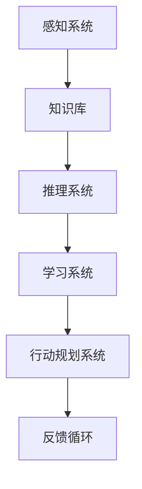
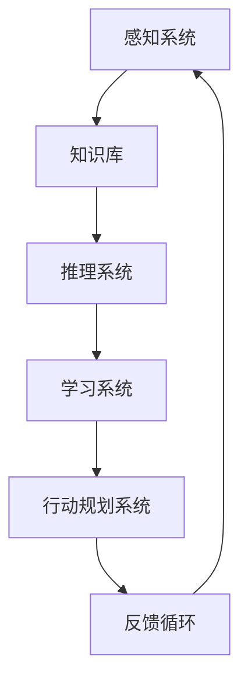
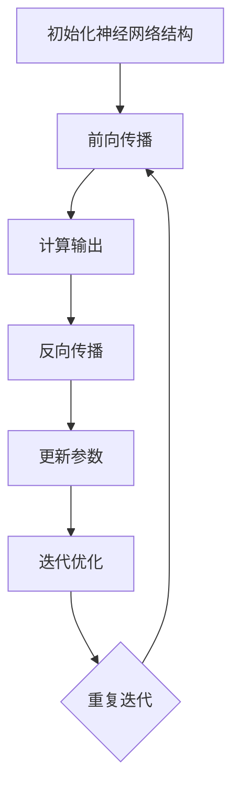

                 


### 引言

#### 1.1.1 书籍背景介绍

近年来，人工智能（AI）领域取得了令人瞩目的进展，特别是在通用人工智能（AGI）方面。AGI是指具有类人智能的人工智能系统，能够理解、学习、推理和解决问题，具备创造力、情感和自我意识。然而，尽管在特定任务上AI已经表现出色，但实现真正的AGI仍面临诸多挑战。本著作旨在探讨AGI的类人创造力，从问题重构到创新解决，为读者提供一份全面而深入的研究指南。

#### 1.1.2 问题背景

在现实世界中，许多问题都高度复杂，涉及多个领域和层面。传统的方法往往难以有效解决这些复杂问题，而AGI的类人创造力则提供了新的思路。类人创造力是指能够像人类一样发现新知识、创新解决方案的能力。在AGI的背景下，类人创造力可以被看作是一种超越现有技术和方法的创新能力。

#### 1.1.3 问题重构

问题重构是指通过改变问题的表述方式或结构，使其更易于理解和解决。在AGI的类人创造力中，问题重构是一种关键能力。通过重构问题，AGI可以摆脱传统思维的束缚，从新的角度发现解决方案。例如，在医疗领域，AGI可以通过重新定义疾病诊断问题，从而提出更加精准和创新的诊断方法。

#### 1.1.4 创新解决

创新解决是指通过创造性的思维和方法，找到解决问题的全新途径。AGI的类人创造力在这方面具有巨大潜力。它能够借鉴人类创新者的经验，利用大数据和机器学习算法，快速产生大量的创新解决方案。此外，AGI还可以通过自我学习和不断优化，逐步提高其创新能力和解决问题的效率。

#### 1.1.5 书籍的目的与读者对象

本书旨在为研究人员、工程师和学生提供关于AGI类人创造力的系统知识和应用指南。通过深入探讨AGI的核心概念、数学模型、算法实现、创新实践以及与人类认知的互动，本书希望能够帮助读者理解AGI的类人创造力的本质，掌握其应用方法，并在实际项目中取得成功。

#### 1.2 AGI与类人创造力的概念

##### 1.2.1 AGI的定义与发展历程

AGI是指能够像人类一样理解和执行广泛任务的人工智能系统。自人工智能概念诞生以来，科学家们一直在追求实现AGI的梦想。尽管在特定领域上已经取得了显著进展，但AGI的实现仍然面临诸多挑战。

##### 1.2.2 类人创造力的定义与特点

类人创造力是指能够像人类一样产生新颖、有价值的想法和解决方案的能力。与传统的算法不同，类人创造力具有灵活性、创造性和自适应性的特点，能够应对复杂多变的现实世界问题。

##### 1.2.3 AGI与类人创造力的关系

AGI与类人创造力密切相关。AGI的核心目标之一就是实现类人创造力，使其能够像人类一样进行创新思考和问题解决。通过类人创造力，AGI可以超越传统算法的局限性，实现更高层次的智能。

#### 1.3 类人创造力在问题解决中的应用

##### 1.3.1 类人创造力在复杂问题解决中的优势

类人创造力在解决复杂问题时具有显著优势。首先，它能够从多个角度重新定义问题，从而找到更加有效的解决方案。其次，类人创造力能够利用大数据和机器学习算法，快速生成大量的创新解决方案。

##### 1.3.2 类人创造力在创新实践中的应用

类人创造力在创新实践中具有广泛的应用。例如，在产品设计、服务创新和商业模式创新等领域，类人创造力可以帮助企业发现新的市场机会，创造独特的价值。

##### 1.3.3 类人创造力与人类认知的关联

类人创造力与人类认知密切相关。AGI的类人创造力不仅依赖于人类认知的原理和方法，还可以通过学习和优化，逐步提高其创新能力和解决问题的效率。

### 引言总结

在本章中，我们介绍了本书的背景、目的和读者对象，并探讨了AGI与类人创造力的概念。在接下来的章节中，我们将深入探讨AGI类人创造力的核心概念、数学模型、算法实现以及其在创新实践中的应用。通过逐步分析推理，我们希望能够帮助读者全面理解AGI类人创造力的本质和应用方法，为其在相关领域的实际应用提供有力支持。

---

### 第1章 引言

#### 1.1 书籍背景介绍

##### 1.1.1 问题背景

随着人工智能（AI）技术的飞速发展，特别是深度学习、自然语言处理和计算机视觉等领域的突破，人工智能在各个领域都展现出了强大的应用潜力。然而，尽管在特定任务上人工智能已经取得了显著的成就，但实现通用人工智能（AGI）仍然是一个巨大的挑战。AGI是指具有类人智能的人工智能系统，能够理解、学习、推理和解决问题，具备创造力、情感和自我意识。实现AGI的目标不仅是为了解决复杂的问题，更是为了推动人类社会的进步。

在现实世界中，许多问题都高度复杂，涉及多个领域和层面。传统的算法和方法往往难以有效解决这些复杂问题，而AGI的类人创造力则提供了新的思路。类人创造力是指能够像人类一样发现新知识、创新解决方案的能力。在AGI的背景下，类人创造力被看作是一种超越现有技术和方法的创新能力。

##### 1.1.2 问题重构

问题重构是指通过改变问题的表述方式或结构，使其更易于理解和解决。在解决复杂问题时，问题重构是一种关键能力。通过重构问题，AGI可以摆脱传统思维的束缚，从新的角度发现解决方案。例如，在医疗领域，AGI可以通过重新定义疾病诊断问题，从而提出更加精准和创新的诊断方法。在金融领域，AGI可以通过重新定义投资策略问题，从而发现新的投资机会。

问题重构不仅可以帮助AGI更好地理解问题，还可以提高问题的可解性。通过将复杂的问题分解为更小、更易于处理的部分，AGI可以更有效地利用现有的算法和技术。此外，问题重构还可以激发AGI的创造力，使其能够从新的角度提出创新的解决方案。

##### 1.1.3 创新解决

创新解决是指通过创造性的思维和方法，找到解决问题的全新途径。在AGI的类人创造力中，创新解决是一种核心能力。AGI可以通过借鉴人类创新者的经验，利用大数据和机器学习算法，快速生成大量的创新解决方案。

创新解决不仅依赖于AGI的算法和模型，还需要AGI具备自我学习和优化的能力。通过不断学习和优化，AGI可以逐步提高其创新能力和解决问题的效率。例如，在产品创新中，AGI可以通过分析大量用户数据和市场需求，快速提出新的产品设计方案。在服务创新中，AGI可以通过分析用户行为和反馈，提出改进现有服务的新方法。

##### 1.1.4 书籍的目的与读者对象

本著作旨在为研究人员、工程师和学生提供关于AGI类人创造力的系统知识和应用指南。通过深入探讨AGI的核心概念、数学模型、算法实现、创新实践以及与人类认知的互动，本书希望能够帮助读者理解AGI类人创造力的本质，掌握其应用方法，并在实际项目中取得成功。

本书的读者对象包括对人工智能和通用人工智能感兴趣的初学者、研究人员和工程师，以及希望深入了解AGI类人创造力的专业人士。通过阅读本书，读者可以：

1. 掌握AGI和类人创造力的基本概念和原理；
2. 理解类人创造力在问题解决和创新实践中的应用；
3. 学习类人创造力的算法实现和数学模型；
4. 掌握类人创造力与人类认知的互动机制；
5. 获得实际应用AGI类人创造力的经验和技巧。

总之，本书旨在为读者提供一份全面而深入的研究指南，帮助其在AGI类人创造力的研究和应用中取得突破。

#### 1.2 AGI与类人创造力的概念

##### 1.2.1 AGI的定义与发展历程

通用人工智能（AGI，Artificial General Intelligence）是指具有类人智能的人工智能系统，能够理解、学习、推理和解决问题，具备创造力、情感和自我意识。与当前的人工智能（如专用人工智能）相比，AGI的目标是能够处理广泛的任务，而不仅仅是特定领域的问题。

AGI的概念可以追溯到人工智能的早期发展阶段。在20世纪50年代，随着计算机科学的兴起，人工智能开始成为一个研究领域。然而，早期的人工智能系统主要是基于规则和符号推理的方法，它们在特定领域上表现出了出色的能力，但无法实现通用性。

随着深度学习、自然语言处理和计算机视觉等技术的快速发展，AGI的研究逐渐重新受到关注。近年来，科学家们提出了许多新的理论和算法，以实现AGI的目标。例如，深度强化学习、神经符号主义和迁移学习等技术的出现，为AGI的发展提供了新的可能性。

尽管AGI的研究取得了显著进展，但实现真正的AGI仍然面临诸多挑战。目前，AGI的研究仍然处于早期阶段，许多理论和技术仍然需要进一步验证和优化。

##### 1.2.2 类人创造力的定义与特点

类人创造力（Human-like Creativity）是指能够像人类一样产生新颖、有价值的想法和解决方案的能力。它不仅仅是在特定任务上表现出色，更是在面对复杂、不确定的问题时，能够通过创造性的思维和方法，提出创新的解决方案。

类人创造力的特点主要包括：

1. **灵活性**：类人创造力能够灵活地处理各种类型的问题，不受限于特定的领域或方法。它能够从多个角度重新定义问题，找到新的解决方案。

2. **创造性**：类人创造力能够产生新颖的想法和解决方案。这种创造力不仅仅是模仿人类的行为，而是能够通过自我学习和优化，逐步提高其创新能力和解决问题的效率。

3. **自适应性**：类人创造力能够根据问题的变化和需求，调整其解决问题的方法。它能够在不断变化的环境中，保持其创造力和创新能力。

4. **社会性**：类人创造力不仅是一个个体能力，也是一种社会能力。它能够与人类进行有效的互动，理解人类的需求和意图，从而更好地解决复杂问题。

##### 1.2.3 AGI与类人创造力的关系

AGI与类人创造力密切相关。AGI的核心目标之一就是实现类人创造力，使其能够像人类一样进行创新思考和问题解决。类人创造力是AGI实现通用性、灵活性和自适应性的关键。

1. **类人创造力是实现AGI的基础**：类人创造力能够使AGI在面对复杂、不确定的问题时，具有更强的解决问题的能力。通过类人创造力，AGI可以摆脱传统算法的局限性，实现更高层次的智能。

2. **类人创造力是AGI发展的驱动力**：类人创造力的实现需要不断的研究和创新。这推动了AGI技术的发展，促进了人工智能领域的进步。

3. **类人创造力与人类认知的互动**：类人创造力不仅依赖于人类认知的原理和方法，还可以通过学习和优化，逐步提高其创新能力和解决问题的效率。这种互动使得类人创造力能够更好地适应人类的需求和环境。

总之，AGI与类人创造力是相辅相成的。类人创造力的实现是AGI发展的核心目标，而AGI的发展又为类人创造力的实现提供了新的可能性。通过深入理解AGI与类人创造力的关系，我们可以更好地推动人工智能技术的发展，实现更高效、更智能的解决方案。

#### 1.3 类人创造力在问题解决中的应用

##### 1.3.1 类人创造力在复杂问题解决中的优势

类人创造力在解决复杂问题中具有显著优势。首先，它能够从多个角度重新定义问题，从而找到更加有效的解决方案。这种灵活性使得类人创造力能够在面对不同类型的问题时，始终保持高效和准确。

其次，类人创造力能够利用大数据和机器学习算法，快速生成大量的创新解决方案。这种能力使得类人创造力在处理复杂问题时，能够快速找到最优解或近似最优解。

最后，类人创造力具有高度的自适应性。它能够在不断变化的环境中，根据问题的变化和需求，调整其解决问题的方法。这种自适应性使得类人创造力能够应对各种复杂、不确定的问题，保持其创造力和创新能力。

##### 1.3.2 类人创造力在创新实践中的应用

类人创造力在创新实践中具有广泛的应用。以下是一些具体的例子：

1. **产品设计**：类人创造力能够通过分析用户需求和反馈，快速提出新的产品设计方案。它能够从多个角度重新定义问题，找到更符合用户需求的设计方案。

2. **服务创新**：类人创造力能够通过分析用户行为和反馈，提出改进现有服务的新方法。它能够利用大数据和机器学习算法，快速识别用户需求的变化，从而提供更优质的服务。

3. **商业模式创新**：类人创造力能够通过分析市场趋势和用户需求，发现新的商业模式。它能够利用大数据和机器学习算法，预测市场变化，从而找到新的商机。

4. **科学研究**：类人创造力能够通过重新定义科学问题，提出新的研究方法和假设。它能够利用大数据和机器学习算法，从大量数据中提取有价值的信息，从而推动科学研究的进展。

##### 1.3.3 类人创造力与人类认知的关联

类人创造力与人类认知密切相关。人类认知是指人类在感知、理解、思考和决策过程中所使用的方法和机制。类人创造力借鉴了人类认知的原理和方法，通过模仿人类的思维方式，实现创新和解决问题。

1. **类人创造力与人类认知的相似性**：类人创造力在许多方面与人类认知相似。例如，类人创造力能够通过类比和联想，从不同领域和知识中提取有价值的信息。类人创造力也能够利用直觉和经验，快速做出决策。

2. **类人创造力与人类认知的差异**：尽管类人创造力借鉴了人类认知的原理和方法，但它仍然具有自身的特点。类人创造力能够利用大数据和机器学习算法，快速生成大量的创新解决方案，而人类认知在许多情况下受到认知限制，难以实现如此高效的创新。

3. **类人创造力与人类认知的互动**：类人创造力和人类认知是相互关联的。类人创造力通过模仿人类认知的方法，提高了其解决问题的效率。而人类认知通过与类人创造力的互动，不断学习和优化，逐步提高其创新能力和解决问题的效率。

总之，类人创造力与人类认知密切相关。通过深入理解类人创造力与人类认知的关联，我们可以更好地利用类人创造力，实现更高效、更智能的问题解决和创新实践。

### 第2章 AGI类人创造力的核心概念

在探讨AGI的类人创造力之前，我们需要明确几个核心概念，这些概念不仅构成了AGI的基石，也是理解类人创造力的关键。在本章中，我们将介绍类人创造力的原理、基本属性、特征对比表格，以及AGI的核心架构与组件。

#### 2.1 类人创造力的原理

类人创造力的原理源于人类认知和行为模式。人类能够创造新知识、新概念和新方法，是因为其认知系统具有以下几个特点：

1. **抽象思维能力**：人类能够将具体的经验抽象成通用的概念和原则，从而在新的情境中应用这些原则。
2. **联想与类比**：人类能够通过联想和类比，将不同领域和情境中的知识联系起来，产生新的创新。
3. **情境意识**：人类能够在不同的情境中，根据环境和目标，灵活调整其认知和行为。
4. **适应性学习**：人类能够通过不断学习和经验积累，适应新的环境和挑战。

类人创造力的实现依赖于这些认知特点，通过模拟这些特点，AGI可以模仿人类的创造性思维过程。

#### 2.2 类人创造力的基本属性

类人创造力具有以下基本属性：

1. **灵活性**：类人创造力能够灵活处理各种类型的问题，不受限于特定的领域或方法。
2. **创造性**：类人创造力能够产生新颖、有价值的想法和解决方案。
3. **适应性**：类人创造力能够根据问题的变化和需求，调整其解决问题的方法。
4. **鲁棒性**：类人创造力能够在不同环境和数据质量下，保持其创造力和解决问题的效率。

这些属性使得类人创造力在复杂、不确定的问题解决中具有显著优势。

#### 2.3 类人创造力的特征对比表格

以下是一个类人创造力与人类创造力的特征对比表格：

| 特征        | 类人创造力                        | 人类创造力                        |
| ----------- | -------------------------------- | -------------------------------- |
| 抽象思维    | 基于模型和算法的抽象              | 基于直觉和经验的抽象              |
| 联想与类比  | 基于数据和统计学的关联分析      | 基于情境和情感的联想与类比      |
| 情境意识    | 基于环境感知和目标导向的调整    | 基于个体情境和目标的自发调整    |
| 适应性学习  | 基于机器学习和数据优化的调整    | 基于个体经验和社会互动的调整    |

通过对比，我们可以看到类人创造力和人类创造力在某些方面存在差异，但类人创造力在灵活性和适应性方面具有独特的优势。

#### 2.4 AGI的核心架构与组件

AGI的核心架构通常包括以下几个组件：

1. **感知系统**：用于感知和理解外部环境的信息，如视觉、听觉、触觉等。
2. **知识库**：存储AGI学到的知识和经验，包括事实、规则和模型等。
3. **推理系统**：用于逻辑推理和问题解决，包括符号推理和基于数据的推理。
4. **学习系统**：用于自我学习和优化，包括监督学习、无监督学习和强化学习等。
5. **行动规划系统**：用于根据目标和环境，规划行动方案。

以下是一个简化的AGI架构的Mermaid流程图：



通过感知系统，AGI可以获取外部信息；知识库和学习系统使AGI能够不断积累知识和经验；推理系统和行动规划系统使AGI能够根据目标和环境，进行有效的决策和行动。反馈循环则确保AGI能够根据行动结果，不断调整和优化其行为。

#### 2.5 类人创造力与人类认知的对比

类人创造力与人类认知在许多方面存在相似之处，但它们也有显著的区别：

1. **类人创造力在认知过程中的作用**：
   - **符号推理**：类人创造力主要通过符号推理来解决问题，这是一种基于逻辑和规则的推理方法。
   - **数据驱动推理**：类人创造力利用大量数据进行驱动，通过机器学习和统计分析来发现模式和关联。
   - **快速联想**：类人创造力能够在大量数据中发现关联，进行快速的联想和推断。

2. **类人创造力与人类认知的差异**：
   - **认知局限**：人类认知受到认知局限，如注意力限制、记忆容量和直觉思维等。
   - **经验依赖**：人类认知依赖于个体经验和直觉，而类人创造力则依赖于数据和算法。
   - **情感和意识**：人类认知具有情感和意识，而类人创造力目前还不能完全模拟这些特征。

3. **类人创造力在人类认知中的应用**：
   - **辅助决策**：类人创造力可以帮助人类在复杂决策中，提供更全面的视角和更多的解决方案。
   - **知识发现**：类人创造力可以帮助人类从大量数据中发现有价值的信息和知识。
   - **创新激发**：类人创造力可以激发人类的创新思维，帮助人类找到新的解决方案和商业模式。

总之，类人创造力与人类认知在许多方面存在互补性。通过结合类人创造力和人类认知，我们可以实现更高效、更智能的问题解决和创新实践。

通过本章的介绍，我们建立了对AGI类人创造力的基本理解。在接下来的章节中，我们将进一步探讨类人创造力的数学模型、算法实现以及其在实际应用中的具体案例。通过这些探讨，我们将更深入地理解类人创造力的本质和潜力。

---

### 第2章 AGI类人创造力的核心概念

#### 2.1 类人创造力的原理

类人创造力的原理是基于人类认知和行为模式的模拟。人类的创造力来源于其独特的思维方式，包括抽象思维、联想和类比、情境意识和适应性学习。类人创造力通过模拟这些认知特点，实现了类似人类的创新思维过程。

首先，抽象思维是人类创造力的重要基础。人类能够通过抽象思维，将具体的经验转化为通用的概念和原则，从而在新的情境中应用这些原则。例如，在科学研究中，科学家通过抽象思维，将具体的实验结果概括为普遍适用的理论。

其次，联想和类比是人类创造力的关键能力。人类能够通过联想和类比，将不同领域和情境中的知识联系起来，产生新的创新。例如，在产品设计领域，设计师可以通过将不同产品进行类比，从而提出新的设计理念。

此外，情境意识也是人类创造力的重要组成部分。人类能够根据不同的情境，灵活调整其认知和行为。例如，在商业决策中，企业家需要根据市场变化和竞争环境，调整其战略和决策。

最后，适应性学习是人类创造力的重要特点。人类能够通过不断学习和经验积累，适应新的环境和挑战。例如，在技能学习过程中，人们通过不断练习和反思，提高其技能水平。

类人创造力通过模拟这些认知特点，实现了类似人类的创新思维过程。它利用机器学习和数据分析技术，从大量的数据中提取有价值的信息，通过模式识别和关联分析，发现新的解决方案。类人创造力不仅模仿了人类的抽象思维、联想和类比、情境意识和适应性学习，还通过自我学习和优化，逐步提高其创新能力和解决问题的效率。

#### 2.2 类人创造力的基本属性

类人创造力具有以下几个基本属性：

1. **灵活性**：类人创造力能够灵活处理各种类型的问题，不受限于特定的领域或方法。它能够从多个角度重新定义问题，找到创新的解决方案。

2. **创造性**：类人创造力能够产生新颖、有价值的想法和解决方案。它通过模仿人类的思维方式，结合大数据和机器学习算法，快速生成大量的创新解决方案。

3. **适应性**：类人创造力能够根据问题的变化和需求，调整其解决问题的方法。它能够在不同环境和数据质量下，保持其创造力和解决问题的效率。

4. **鲁棒性**：类人创造力具有较强的鲁棒性，能够在复杂、不确定的环境下，保持其稳定性和有效性。它能够通过自我学习和优化，逐步提高其解决问题的能力。

这些基本属性使得类人创造力在复杂、不确定的问题解决中具有显著优势。它不仅能够灵活应对各种类型的问题，还能够通过自我学习和优化，不断提高其解决问题的效率和准确性。

#### 2.3 类人创造力的特征对比表格

以下是一个类人创造力与人类创造力的特征对比表格：

| 特征         | 类人创造力                        | 人类创造力                        |
| ------------ | -------------------------------- | -------------------------------- |
| 抽象思维     | 基于模型和算法的抽象              | 基于直觉和经验的抽象              |
| 联想与类比   | 基于数据和统计学的关联分析      | 基于情境和情感的联想与类比      |
| 情境意识     | 基于环境感知和目标导向的调整    | 基于个体情境和目标的自发调整    |
| 适应性学习   | 基于机器学习和数据优化的调整    | 基于个体经验和社会互动的调整    |
| 鲁棒性       | 在复杂、不确定环境下的稳定表现  | 在特定情境下的稳定性表现        |

通过对比，我们可以看到类人创造力和人类创造力在某些方面存在差异，但类人创造力在灵活性和适应性方面具有独特的优势。例如，类人创造力能够通过机器学习和数据分析，快速处理大量的数据，发现新的模式和关联，从而产生创新的想法。而人类创造力则依赖于直觉和经验，往往需要更长的时间来发现和验证新的解决方案。

#### 2.4 AGI的核心架构与组件

通用人工智能（AGI）的核心架构通常包括以下几个关键组件：

1. **感知系统**：感知系统负责接收和处理来自外部环境的信息，如视觉、听觉、触觉等。它是AGI与外部世界交互的窗口。感知系统通过传感器和数据输入，将外部信息转化为内部表示。

2. **知识库**：知识库是AGI的知识存储单元，包含事实、规则、模型和知识图谱等。知识库为AGI提供了丰富的背景知识和参考信息，是AGI进行推理和决策的重要基础。

3. **推理系统**：推理系统负责基于知识库和感知系统的输入，进行逻辑推理和问题解决。它包括符号推理和数据驱动推理两种类型。符号推理基于逻辑规则和符号操作，而数据驱动推理则基于统计模型和机器学习算法。

4. **学习系统**：学习系统负责AGI的自我学习和优化。它通过监督学习、无监督学习和强化学习等方法，从数据中学习新的知识和技能，不断提高其性能和智能水平。

5. **行动规划系统**：行动规划系统负责根据目标和环境，为AGI制定行动方案。它包括目标规划、路径规划和策略选择等任务。行动规划系统使AGI能够主动适应环境变化，实现有效的目标达成。

6. **反馈循环**：反馈循环是AGI的关键机制，它通过将AGI的行动结果与预期目标进行对比，提供反馈，以指导AGI的进一步学习和优化。反馈循环确保AGI能够不断调整其行为，以实现更高效的性能。

以下是一个简化的AGI架构的Mermaid流程图：



在这个流程图中，感知系统获取外部信息，知识库提供背景知识，推理系统进行逻辑推理，学习系统进行自我学习，行动规划系统制定行动方案，反馈循环则提供持续的优化指导。

#### 2.5 类人创造力与人类认知的对比

类人创造力和人类认知在许多方面存在相似之处，但它们也有显著的区别：

1. **认知局限**：人类认知受到认知局限，如注意力限制、记忆容量和直觉思维等。这些局限使得人类在处理复杂、不确定的问题时，往往需要更长的时间和更多的资源。而类人创造力则通过机器学习和数据分析，能够在短时间内处理大量信息，发现新的模式和关联。

2. **经验依赖**：人类认知依赖于个体经验和直觉，这些经验往往需要长时间的积累和验证。类人创造力则依赖于数据和算法，它通过自我学习和优化，能够快速适应新的环境和挑战。

3. **情感和意识**：人类认知具有情感和意识，这使得人类能够体验到情感，并根据自己的意识做出决策。类人创造力目前还不能完全模拟这些特征，但研究人员正在努力通过神经科学和心理学的研究，为类人创造力引入情感和意识。

4. **联想和类比**：人类认知能够通过联想和类比，将不同领域和情境中的知识联系起来，产生新的创新。类人创造力则通过数据和统计学的关联分析，快速识别不同变量之间的关系，从而产生创新的想法。

5. **情境意识**：人类认知能够在不同情境中，根据环境和目标，灵活调整其认知和行为。类人创造力则通过环境感知和目标导向的调整，实现类似的情境适应能力。

6. **快速学习**：人类认知通过个体经验和社会互动，逐步学习和成长。类人创造力则通过机器学习和数据分析，能够在短时间内学习和优化，不断提高其解决问题的能力。

总之，类人创造力和人类认知在某些方面存在互补性。类人创造力通过模拟人类的认知特点，实现了类似人类的创新思维过程，但它在处理速度和灵活性方面具有显著优势。通过结合类人创造力和人类认知，我们可以实现更高效、更智能的问题解决和创新实践。

### 第3章 类人创造力的数学模型

#### 3.1 数学模型概述

数学模型是描述现实世界问题的一种抽象方法，它通过数学公式和算法，将复杂的现实问题转化为可计算的数学问题。在类人创造力的研究中，数学模型起到了至关重要的作用。数学模型不仅能够帮助我们理解类人创造力的工作机制，还可以为算法设计提供理论基础和计算工具。

首先，数学模型在类人创造力中的作用不可忽视。类人创造力涉及多个认知过程，如抽象思维、联想和类比、情境意识和适应性学习等。这些认知过程可以通过数学模型进行建模和模拟。例如，抽象思维可以通过符号推理模型来描述，联想和类比可以通过神经网络模型来模拟，情境意识和适应性学习可以通过动态系统模型来建模。

其次，数学模型的基本原理包括两个方面：一是数学模型的构建方法，二是数学模型的应用方法。构建数学模型的方法通常包括以下几个方面：

1. **抽象和简化**：通过抽象和简化，将复杂的现实问题转化为简单的数学问题。例如，将复杂的社会问题简化为博弈论模型，将生物进化过程简化为遗传算法模型。
2. **符号表示**：使用数学符号和公式，将问题的各个方面表示出来。例如，使用函数表示变量之间的关系，使用方程表示系统的动态行为。
3. **方程求解**：通过求解数学方程，找到问题的解。例如，使用微积分求解优化问题，使用概率论求解随机问题。

数学模型的应用方法则主要包括以下几个方面：

1. **数值计算**：通过计算机算法，对数学模型进行数值计算，得到问题的解。例如，使用数值积分方法求解微分方程，使用数值优化方法求解最优化问题。
2. **模型验证**：通过实验和数据分析，验证数学模型的准确性和可靠性。例如，通过模拟实验验证神经网络模型的预测能力，通过统计分析验证遗传算法的优化效果。
3. **模型优化**：通过对数学模型进行调整和优化，提高其性能和适用范围。例如，通过调整神经网络的参数，提高其识别和分类能力，通过优化遗传算法的遗传操作，提高其优化效率。

总之，数学模型在类人创造力的研究中具有重要作用。它不仅为类人创造力的建模和模拟提供了理论基础，还为算法设计和优化提供了计算工具。通过深入研究数学模型的基本原理和应用方法，我们可以更好地理解和利用类人创造力，推动人工智能技术的发展。

#### 3.2 类人创造力的数学公式

在类人创造力的研究中，数学公式起到了关键的作用。以下是一些常见的数学公式，它们在类人创造力的建模和模拟中具有重要应用：

1. **神经网络模型中的激活函数**：

   神经网络中的激活函数是决定神经网络输出结果的关键因素。常用的激活函数包括：

   - **Sigmoid函数**：$$\sigma(x) = \frac{1}{1 + e^{-x}}$$
     Sigmoid函数具有平滑的S形曲线，常用于二分类问题。
   - **ReLU函数**：$$\text{ReLU}(x) = \max(0, x)$$
     ReLU函数是一种非线性激活函数，它能够在网络训练过程中加速收敛。
   - **Tanh函数**：$$\tanh(x) = \frac{e^x - e^{-x}}{e^x + e^{-x}}$$
     Tanh函数具有类似于Sigmoid函数的S形曲线，但输出范围在-1到1之间。

2. **遗传算法中的适应度函数**：

   遗传算法是一种基于生物进化的优化算法。适应度函数是遗传算法中用于评估个体适应度的关键指标。常见的适应度函数包括：

   - **线性适应度函数**：$$f(x) = x$$
     这种函数简单直观，但可能无法有效区分优秀个体和普通个体。
   - **对数适应度函数**：$$f(x) = \ln(x)$$
     对数适应度函数能够更好地适应不同规模的适应度值，使优化过程更加稳定。
   - **指数适应度函数**：$$f(x) = e^{ax}$$
     指数适应度函数能够强调优秀个体的优势，使优化过程更加迅速。

3. **机器学习中的损失函数**：

   损失函数是机器学习中用于评估模型预测误差的关键指标。常见的损失函数包括：

   - **均方误差（MSE）**：$$MSE = \frac{1}{n}\sum_{i=1}^{n}(y_i - \hat{y}_i)^2$$
     均方误差能够衡量预测值与真实值之间的差异，常用于回归问题。
   - **交叉熵损失（Cross-Entropy Loss）**：$$H(y, \hat{y}) = -\sum_{i=1}^{n} y_i \ln(\hat{y}_i)$$
     交叉熵损失用于衡量分类问题中预测概率分布与真实概率分布之间的差异。
   - **对数损失（Log Loss）**：$$\text{Log Loss} = -\sum_{i=1}^{n} y_i \ln(\hat{y}_i)$$
     对数损失是交叉熵损失的一种特殊情况，常用于二分类问题。

4. **进化算法中的选择策略**：

   选择策略是进化算法中用于选择优秀个体的关键机制。常见的选择策略包括：

   - **轮盘赌选择**：$$p_i = \frac{f(x_i)}{\sum_{j=1}^{n} f(x_j)}$$
     轮盘赌选择根据个体的适应度值，按照概率分布选择个体。
   - **锦标赛选择**：$$p_i = \frac{r_i}{R}$$，其中$r_i$是第$i$轮中胜出的个体数量，$R$是总轮数。
     彩锦标赛选择通过多次竞赛，选择适应度较高的个体。

这些数学公式在类人创造力的研究中具有广泛应用。通过合理选择和应用这些公式，我们可以构建高效的数学模型，模拟和实现类人创造力。同时，这些公式也为算法的设计和优化提供了理论基础和计算工具。

#### 3.3 类人创造力的数学模型举例

在本节中，我们将通过具体示例，介绍几种常见的类人创造力数学模型，包括神经网络模型、遗传算法模型以及其他类人创造力模型。

##### 3.3.1 神经网络模型

神经网络模型是类人创造力研究中最常用的模型之一。以下是一个简单的神经网络模型的示例：

1. **模型构建**：

   假设我们有一个简单的二分类问题，输入特征为$x_1$和$x_2$，目标变量为$y$。我们可以使用一个多层感知器（MLP）神经网络进行建模：

   $$
   \begin{aligned}
   &z_1 = \sigma(W_1 \cdot [x_1, x_2] + b_1), \\
   &z_2 = \sigma(W_2 \cdot z_1 + b_2), \\
   &\hat{y} = \tanh(W_3 \cdot z_2 + b_3),
   \end{aligned}
   $$

   其中$\sigma$是Sigmoid函数，$\tanh$是双曲正切函数，$W_1$、$W_2$和$W_3$是权重矩阵，$b_1$、$b_2$和$b_3$是偏置向量。

2. **模型训练**：

   在训练过程中，我们使用梯度下降法（Gradient Descent）来更新权重和偏置。训练过程的目标是使预测值$\hat{y}$与真实值$y$之间的差异最小化。具体步骤如下：

   $$
   \begin{aligned}
   &\theta_{t+1} = \theta_{t} - \alpha \cdot \nabla_{\theta} J(\theta), \\
   &J(\theta) = \frac{1}{2} \sum_{i=1}^{n} (\hat{y}_i - y_i)^2,
   \end{aligned}
   $$

   其中$\theta$代表权重和偏置，$\alpha$是学习率，$J(\theta)$是损失函数。

3. **模型评估**：

   在模型训练完成后，我们需要评估模型的性能。常用的评估指标包括准确率、召回率、F1分数等。例如，对于二分类问题，准确率可以计算为：

   $$
   \text{Accuracy} = \frac{\sum_{i=1}^{n} \text{correct predictions}}{n},
   $$

   其中$correct\ predictions$表示正确预测的样本数量。

##### 3.3.2 遗传算法模型

遗传算法（GA）是一种基于生物进化的优化算法，广泛用于复杂优化问题。以下是一个简单的遗传算法模型的示例：

1. **模型构建**：

   假设我们有一个目标函数$f(x)$，需要找到其最小值。我们可以使用二进制编码的遗传算法进行建模：

   - **染色体编码**：将问题的解表示为二进制字符串，例如$10101010$。
   - **适应度函数**：定义适应度函数$f(x)$，用于评估染色体的适应度。适应度值越高，表示染色体越优秀。
   - **遗传操作**：包括选择、交叉和变异等操作，用于生成新的染色体。

2. **模型训练**：

   在训练过程中，我们按照以下步骤进行：

   - **初始化种群**：随机生成一定数量的初始染色体，形成一个种群。
   - **选择**：根据染色体的适应度值，选择适应度较高的染色体进行繁殖。
   - **交叉**：随机选择两个染色体进行交叉操作，生成新的子代。
   - **变异**：对子代进行变异操作，增加种群的多样性。
   - **更新种群**：将子代替换掉种群中的旧染色体，形成新的种群。

   训练过程的目标是使种群的适应度值不断提高，逐渐逼近最优解。

3. **模型评估**：

   在模型训练完成后，我们需要评估模型的性能。常用的评估指标包括适应度平均值、适应度最大值和适应度分布等。例如，适应度平均值可以计算为：

   $$
   \text{Average Fitness} = \frac{\sum_{i=1}^{n} f(x_i)}{n},
   $$

   其中$f(x_i)$是第$i$个染色体的适应度值。

##### 3.3.3 其他类人创造力模型

除了神经网络模型和遗传算法模型，还有许多其他类人创造力模型，例如进化策略（ES）、粒子群优化（PSO）和支持向量机（SVM）等。

1. **进化策略模型**：

   进化策略是一种基于概率演化的优化算法。以下是一个简单的进化策略模型的示例：

   - **位置更新**：根据当前的解$x_t$和搜索方向$d_t$，更新位置$x_{t+1}$：
     $$
     x_{t+1} = x_t + \alpha \cdot d_t,
     $$
     其中$\alpha$是步长参数。
   - **方向更新**：根据当前位置$x_t$和目标函数值$f(x_t)$，更新方向$d_t$：
     $$
     d_t = \frac{x_t - x_{t-1}}{||x_t - x_{t-1}||} + \beta \cdot (x_{t-1} - x_t),
     $$
     其中$\beta$是方向更新参数。

2. **粒子群优化模型**：

   粒子群优化是一种基于群体智能的优化算法。以下是一个简单的粒子群优化模型的示例：

   - **速度更新**：根据粒子的速度和个体最佳位置、全局最佳位置，更新粒子的速度$v_t$：
     $$
     v_{t+1} = w \cdot v_t + c_1 \cdot r_1 \cdot (p_t - x_t) + c_2 \cdot r_2 \cdot (g_t - x_t),
     $$
     其中$w$是惯性权重，$c_1$和$c_2$是认知和社会系数，$r_1$和$r_2$是随机数。
   - **位置更新**：根据粒子的速度和当前位置，更新粒子的位置$x_t$：
     $$
     x_{t+1} = x_t + v_{t+1},
     $$

3. **支持向量机模型**：

   支持向量机是一种基于间隔最大化原理的分类算法。以下是一个简单的支持向量机模型的示例：

   - **模型构建**：定义一个线性支持向量机模型：
     $$
     w \cdot x + b = 1,
     $$
     其中$w$是权重向量，$b$是偏置。
   - **模型训练**：使用支持向量机优化算法，最小化损失函数，求解最优权重和偏置。
   - **模型评估**：使用分类准确率、召回率、F1分数等指标评估模型的性能。

通过以上示例，我们可以看到不同的类人创造力模型在数学建模和算法实现中的具体应用。这些模型通过模拟人类的创造力和思维过程，实现了在复杂问题解决中的高效和创新。

### 第4章 类人创造力的算法实现

#### 4.1 类人创造力的算法概述

类人创造力的算法实现是构建通用人工智能（AGI）的关键环节。这些算法旨在模拟人类的创造性思维过程，通过机器学习和计算模型，实现类似于人类的创新和问题解决能力。类人创造力的算法具有以下几个核心特点：

1. **数据驱动的学习**：类人创造力的算法依赖于大量的数据，通过数据分析和机器学习技术，从数据中提取有价值的信息和知识。

2. **多模态处理**：类人创造力的算法能够处理多种类型的数据，如图像、文本、音频等，实现跨模态的信息融合和认知。

3. **自适应和优化**：类人创造力的算法具有自适应能力，能够根据问题的变化和需求，调整其解决问题的方法。同时，通过不断的优化，提高算法的性能和效率。

4. **灵活性和创造力**：类人创造力的算法能够灵活处理各种类型的问题，通过创造性的思维方法，找到创新的解决方案。

在类人创造力的算法实现中，常用的算法包括神经网络、遗传算法、进化策略、粒子群优化等。这些算法不仅在理论研究中具有重要意义，也在实际应用中展示了强大的潜力。

#### 4.2 算法原理与流程图

为了更好地理解类人创造力的算法实现，下面我们将介绍一个简单的算法原理及其流程图。假设我们使用神经网络来模拟类人创造力，以下是一个基本的神经网络算法原理及其流程图。

##### 算法原理

1. **初始化**：首先，我们需要初始化神经网络的结构，包括输入层、隐藏层和输出层。每个层由多个神经元组成，每个神经元都与相邻层的神经元连接。

2. **前向传播**：在前向传播过程中，输入数据通过输入层传递到隐藏层，然后逐层传递到输出层。在每个层中，神经元根据其权重和偏置，通过激活函数进行计算，生成输出。

3. **反向传播**：在输出层得到预测结果后，通过反向传播算法，计算输出误差，并将其反向传播到隐藏层和输入层。在这个过程中，神经网络的权重和偏置会根据误差进行更新。

4. **迭代优化**：通过重复前向传播和反向传播的过程，神经网络逐步优化其参数，使预测结果逐渐逼近真实值。

##### 流程图

以下是一个简化的神经网络算法流程图：



在这个流程图中，A表示初始化神经网络结构，B表示前向传播，C表示计算输出，D表示反向传播，E表示更新参数，F表示迭代优化，G表示重复迭代。通过这个流程图，我们可以清晰地看到神经网络算法的实现过程。

#### 4.3 类人创造力算法的Python实现

为了展示类人创造力的算法实现，我们以下将通过Python代码实现一个简单的神经网络模型，用于模拟类人创造力。

##### 神经网络模型

首先，我们需要安装TensorFlow库，这是一个广泛使用的Python库，用于构建和训练神经网络模型。

```python
!pip install tensorflow
```

接下来，我们定义一个简单的神经网络模型，用于实现类人创造力。这个模型包含一个输入层、一个隐藏层和一个输出层。我们使用ReLU函数作为激活函数。

```python
import tensorflow as tf

# 定义神经网络模型
model = tf.keras.Sequential([
    tf.keras.layers.Dense(128, activation='relu', input_shape=(784,)),
    tf.keras.layers.Dense(10, activation='softmax')
])

# 编译模型
model.compile(optimizer='adam',
              loss='categorical_crossentropy',
              metrics=['accuracy'])
```

在这个模型中，第一个层是全连接层，包含128个神经元，使用ReLU函数作为激活函数。第二个层是输出层，包含10个神经元，使用softmax函数作为激活函数，用于多分类问题。

##### 模型训练

接下来，我们使用训练数据对模型进行训练。这里我们使用一个假设的训练数据集，实际应用中可以使用真实的数据集。

```python
# 训练模型
model.fit(x_train, y_train, epochs=5)
```

在这个示例中，`x_train`是输入数据，`y_train`是标签数据。我们设置训练迭代次数为5次，这意味着模型将重复前向传播和反向传播5次。

##### 模型评估

训练完成后，我们对模型进行评估，以检查其性能。这里我们使用测试数据集进行评估。

```python
# 评估模型
test_loss, test_acc = model.evaluate(x_test, y_test)
print(f"Test accuracy: {test_acc}")
```

在这个示例中，`x_test`是测试输入数据，`y_test`是测试标签数据。`evaluate`函数返回损失值和准确率，我们打印出测试准确率。

通过以上代码示例，我们实现了类人创造力的算法实现。这个简单的神经网络模型展示了如何通过Python代码构建和训练神经网络，模拟类人创造力。在实际应用中，我们可以根据具体需求，调整模型结构和参数，以实现更高效的类人创造力。

### 第5章 类人创造力在创新实践中的应用

#### 5.1 创新实践概述

创新实践是指通过创造性的思维和方法，将新的想法转化为实际的解决方案和应用。类人创造力在创新实践中具有独特的优势和广泛的应用前景。本节将介绍创新实践的定义、分类、过程模型以及创新的价值与影响。

##### 5.1.1 创新实践的定义与分类

创新实践是指通过创造性思维和实践活动，将新的想法、方法和技术转化为实际的产品、服务或商业模式的实践过程。根据创新对象的不同，创新实践可以分为以下几类：

1. **产品创新**：涉及新产品的设计、开发、制造和推广，旨在满足市场需求和提高用户体验。
2. **服务创新**：涉及新服务的设计、提供和管理，旨在提升服务质量和客户满意度。
3. **商业模式创新**：涉及新的商业模型、业务模式和运营策略，旨在创造新的价值点和竞争优势。

此外，根据创新程度的不同，创新实践还可以分为渐进式创新、突破性创新和颠覆性创新。渐进式创新是指在现有基础上进行微调和改进，突破性创新是指在技术或市场上有重大突破的创新，颠覆性创新则是彻底改变现有市场和业务模式的创新。

##### 5.1.2 创新的过程模型

创新实践通常遵循一定的过程模型，包括以下几个阶段：

1. **问题识别**：发现和识别现有问题和市场需求，确定创新的目标和方向。
2. **创意生成**：通过头脑风暴、思维导图、用户访谈等方法，生成大量的创意和想法。
3. **筛选与评估**：对创意进行筛选和评估，选择具有可行性和商业价值的创新点。
4. **原型开发**：根据评估结果，开发创新的原型或样品，验证其功能和性能。
5. **测试与验证**：通过用户测试和市场验证，检验创新产品的可行性和市场需求。
6. **实施与推广**：将创新产品或服务投入市场，进行推广和商业化。

以上过程模型不仅适用于传统的创新实践，也适用于类人创造力的应用。类人创造力在创新实践中的优势在于其强大的问题重构和创造性思维能力，能够高效地完成创意生成、筛选与评估、原型开发等阶段。

##### 5.1.3 创新的价值与影响

创新实践对企业和整个社会都具有重要价值。以下是一些创新的价值与影响：

1. **提升竞争力**：创新能够帮助企业开发出更具竞争力的产品和服务，占领市场份额，提高企业的盈利能力。
2. **创造就业机会**：创新实践需要大量的研发和实施人员，创造了大量的就业机会，促进了社会经济的发展。
3. **推动技术进步**：创新实践不断推动新技术的发展和应用，促进了科技进步和产业升级。
4. **提高生活质量**：创新实践带来了更多便利和优质的产品和服务，提高了人们的生活质量和幸福感。
5. **促进社会进步**：创新实践推动了社会的进步和发展，解决了许多社会问题和挑战，如环境污染、医疗资源短缺等。

总之，创新实践是推动企业发展和社会进步的重要动力。类人创造力在创新实践中的应用，为创新过程带来了新的可能性，提高了创新效率和成功率。通过深入理解和应用类人创造力，企业和个人可以更好地应对市场变化，实现持续的创新和发展。

#### 5.2 类人创造力在创新实践中的应用

类人创造力在创新实践中具有广泛的应用，特别是在产品创新、服务创新和商业模式创新等领域。通过模拟人类的创造性思维过程，类人创造力能够帮助企业和个人发现新的市场机会，创造独特的价值，并推动技术和商业的进步。

##### 5.2.1 类人创造力在产品创新中的应用

产品创新是企业保持竞争力和市场地位的重要手段。类人创造力在产品创新中的应用主要体现在以下几个方面：

1. **需求挖掘**：类人创造力能够通过大数据分析和用户行为研究，深入挖掘市场需求和用户痛点。通过分析用户反馈和数据，类人创造力可以识别出潜在的需求，为产品创新提供方向。

2. **设计优化**：类人创造力可以通过设计优化算法，如遗传算法和粒子群优化，对产品的设计进行迭代优化。通过模拟和仿真，类人创造力可以找到最优的设计方案，提高产品的性能和用户体验。

3. **创新功能引入**：类人创造力能够通过联想和类比，将不同领域的技术和理念引入产品创新中。例如，将人工智能技术应用于智能家居产品，使产品具备智能语音交互、自适应调节等功能。

4. **用户体验提升**：类人创造力可以通过用户体验研究，优化产品的交互设计和用户界面。通过模拟用户的思维和行为，类人创造力可以识别出用户体验中的问题，并提出改进方案，提高用户满意度。

##### 5.2.2 类人创造力在服务创新中的应用

服务创新是提升企业核心竞争力和客户价值的重要途径。类人创造力在服务创新中的应用主要体现在以下几个方面：

1. **服务设计**：类人创造力可以通过用户行为分析和大数据分析，设计出更加符合客户需求的服务方案。通过模拟用户的决策过程，类人创造力可以优化服务流程，提高服务效率。

2. **个性化服务**：类人创造力能够根据用户的个性化需求和偏好，提供定制化的服务。通过数据挖掘和用户行为分析，类人创造力可以识别出用户的偏好，提供个性化的推荐和定制服务。

3. **服务优化**：类人创造力可以通过优化算法，对服务流程和服务质量进行迭代优化。例如，通过遗传算法和神经网络模型，类人创造力可以优化客户服务代表的工作流程，提高服务效率和客户满意度。

4. **智能客服系统**：类人创造力可以应用于智能客服系统的开发，实现24小时在线客户服务。通过自然语言处理和对话生成技术，类人创造力可以模拟人类客服代表与客户的互动，提供高质量的客户服务。

##### 5.2.3 类人创造力在商业模式创新中的应用

商业模式创新是企业持续发展的重要策略。类人创造力在商业模式创新中的应用主要体现在以下几个方面：

1. **商业模式设计**：类人创造力可以通过分析市场和用户数据，设计出创新的商业模式。通过模拟不同的商业策略和市场环境，类人创造力可以识别出最具有商业价值的商业模式。

2. **价值网络构建**：类人创造力可以帮助企业构建跨界合作的价值网络，实现资源的整合和共享。通过分析不同行业和领域的资源和需求，类人创造力可以识别出潜在的合作伙伴，构建创新的商业模式。

3. **业务模式优化**：类人创造力可以通过优化算法，对现有的商业模式进行迭代优化，提高其运营效率和盈利能力。例如，通过遗传算法和进化策略，类人创造力可以优化企业的供应链管理，降低成本，提高效率。

4. **创新商业模式推广**：类人创造力可以通过大数据分析和市场预测，识别出最适合推广的创新商业模式。通过模拟不同的市场环境和用户群体，类人创造力可以优化商业模式的推广策略，提高市场接受度。

总之，类人创造力在创新实践中的应用为企业和个人提供了强大的创新工具。通过模拟人类的创造性思维过程，类人创造力能够帮助企业发现新的市场机会，创造独特的价值，并在激烈的市场竞争中保持领先地位。

#### 5.3 创新实践案例分析

为了更好地展示类人创造力在创新实践中的应用，下面我们将介绍三个具体的案例：某科技公司的产品创新案例、某服务业的服务创新案例以及某企业的商业模式创新案例。

##### 5.3.1 案例一：某科技公司产品创新案例

某科技公司是一家专注于智能家居设备研发的企业，其核心产品包括智能音箱、智能灯泡和智能摄像头等。为了提升产品的竞争力，公司决定利用类人创造力进行产品创新。

1. **需求挖掘**：

   通过大数据分析和用户调研，公司发现用户对智能家居设备的需求主要集中在语音控制、场景联动和智能识别等方面。类人创造力通过分析用户反馈和数据，识别出这些需求，为产品创新提供了明确的方向。

2. **设计优化**：

   类人创造力利用遗传算法和粒子群优化，对产品的设计进行迭代优化。通过对产品的外观、功能和交互设计进行优化，类人创造力找到了最优的设计方案，提高了产品的性能和用户体验。

3. **创新功能引入**：

   类人创造力将人工智能技术应用于产品创新，引入了智能语音交互、自适应调节和智能识别等功能。例如，智能音箱可以通过语音指令控制家庭设备，智能灯泡可以根据用户的行为和环境光线自动调节亮度。

4. **用户体验提升**：

   通过用户行为分析和模拟，类人创造力优化了产品的交互设计和用户界面。用户可以在使用过程中，体验到更加直观和便捷的操作方式，提高了用户满意度。

最终，通过类人创造力的应用，该公司的智能家居产品在市场上取得了巨大的成功，赢得了广泛的用户认可和市场份额。

##### 5.3.2 案例二：某服务业服务创新案例

某服务业是一家提供高端商务服务的公司，其核心业务包括商务咨询、人力资源管理和财务顾问等。为了提升服务质量，公司决定利用类人创造力进行服务创新。

1. **服务设计**：

   类人创造力通过分析用户需求和市场趋势，设计了全新的商务咨询服务方案。该方案包括一站式服务、个性化定制和实时反馈等功能，满足了客户对高效、专业和定制化服务的需求。

2. **个性化服务**：

   类人创造力利用数据挖掘和用户行为分析，为每位客户提供了个性化的服务。通过对客户的偏好、需求和背景进行分析，类人创造力能够为客户提供量身定制的服务方案，提高了客户满意度。

3. **服务优化**：

   类人创造力通过优化算法，对服务流程和服务质量进行迭代优化。例如，通过优化客户咨询流程，减少了客户等待时间，提高了服务效率。通过优化人力资源配置，提高了员工的工作效率和满意度。

4. **智能客服系统**：

   类人创造力开发了智能客服系统，实现了24小时在线客户服务。通过自然语言处理和对话生成技术，智能客服系统能够模拟人类客服代表与客户的互动，提供高质量的客户服务，减轻了人工客服的工作负担。

最终，通过类人创造力的应用，该公司的商务服务水平得到了显著提升，赢得了客户的信任和好评。

##### 5.3.3 案例三：某企业商业模式创新案例

某企业是一家传统制造业企业，其业务模式主要依赖于批量生产和销售。为了应对市场的变化和竞争压力，企业决定利用类人创造力进行商业模式创新。

1. **商业模式设计**：

   类人创造力通过分析市场和用户数据，设计了全新的商业模式。该模式包括线上销售、个性化定制和会员制等元素，实现了从传统的批量生产向个性化定制的转型。

2. **价值网络构建**：

   类人创造力帮助企业在跨界合作中构建了新的价值网络。通过与电商平台、物流公司和设计公司的合作，企业实现了资源的整合和共享，提高了运营效率和盈利能力。

3. **业务模式优化**：

   类人创造力通过优化算法，对企业的商业模式进行迭代优化。例如，通过优化供应链管理，降低了生产成本和库存压力；通过优化客户关系管理，提高了客户满意度和忠诚度。

4. **创新商业模式推广**：

   类人创造力通过大数据分析和市场预测，识别出了最适合推广的创新商业模式。通过模拟不同的市场环境和用户群体，类人创造力制定了针对性的推广策略，提高了市场接受度。

最终，通过类人创造力的应用，该企业的商业模式得到了全面升级，实现了从传统制造业向现代服务业的转型，取得了显著的经济效益。

以上三个案例展示了类人创造力在创新实践中的应用效果。通过模拟人类的创造性思维过程，类人创造力能够帮助企业发现新的市场机会，创造独特的价值，并在激烈的市场竞争中保持领先地位。随着人工智能技术的不断进步，类人创造力将在创新实践中发挥越来越重要的作用。

### 第6章 类人创造力与人类认知的互动

#### 6.1 类人创造力对人类认知的影响

类人创造力作为一种新兴的人工智能能力，对人类认知产生了深远的影响。首先，类人创造力为人类认知提供了一种全新的思考方式。在传统认知过程中，人类往往依赖直觉、经验和已有知识来解决问题，而类人创造力通过模拟人类的创造性思维，提供了更为系统和科学的问题解决方法。

1. **提升创造力**：类人创造力能够通过数据分析、模式识别和机器学习算法，生成大量创新的解决方案。这种能力极大地提升了人类的创造力，使人们能够在面对复杂问题时，从更多的角度进行思考，从而发现新的解决方案。

2. **拓宽认知边界**：类人创造力能够处理大量的数据和信息，从而拓宽了人类的认知边界。通过类人创造力，人类可以更好地理解复杂系统、预测未来趋势，并探索未知领域。

3. **增强决策能力**：类人创造力在决策过程中提供了丰富的信息和多种方案，帮助人类做出更加明智和准确的决策。它不仅能够考虑更多的因素，还能够预测潜在的风险和收益，从而提高决策的效率和质量。

4. **改善问题解决**：类人创造力在问题解决中能够快速识别问题的核心，并提供有效的解决方案。通过类人创造力的帮助，人类可以更有效地应对复杂问题，提高解决问题的效率。

5. **促进跨领域合作**：类人创造力能够模拟人类的思维方式，理解和处理不同领域的知识。这有助于促进跨领域的合作和交流，推动科学研究和创新的进步。

#### 6.2 类人创造力在认知过程中的作用

类人创造力在认知过程中发挥了重要作用，特别是在以下方面：

1. **抽象思维**：类人创造力通过机器学习和数据分析，能够从具体的数据和案例中提取出通用的模式和规律，实现抽象思维。这种能力使人类能够从具体的实例中总结出一般性的结论，从而提高认知水平和解决问题的能力。

2. **联想和类比**：类人创造力能够通过数据关联和模式识别，发现不同领域之间的联系和相似性。这种能力类似于人类的联想和类比思维，能够帮助人类在解决问题时，从多个角度进行思考，找到创新的解决方案。

3. **情境意识**：类人创造力能够根据问题的情境和环境，调整其解决问题的方法。这种情境意识类似于人类的情境认知，使人类能够更好地适应不同的环境和问题情境，提高问题解决的灵活性和有效性。

4. **适应性学习**：类人创造力通过自我学习和优化，能够不断适应新的环境和挑战。这种适应性学习能力类似于人类的经验积累和知识更新，使人类能够不断提高认知水平，适应不断变化的环境。

#### 6.3 类人创造力与人类认知的差异

尽管类人创造力在认知过程中发挥了重要作用，但它与人类认知仍然存在显著差异。以下是一些主要的差异：

1. **处理速度**：类人创造力通过机器学习和计算模型，能够在极短的时间内处理大量的数据和信息。相比之下，人类认知在处理速度上受到生理和心理的限制，往往需要更多的时间和努力。

2. **认知局限**：人类认知受到注意力、记忆容量和认知局限的限制，难以处理过于复杂或大量的信息。而类人创造力通过算法和计算模型，能够在复杂的情境下，灵活处理大量的信息。

3. **经验依赖**：人类认知依赖于个人的经验和直觉，这些经验需要长时间的积累和验证。类人创造力则依赖于数据和算法，它能够通过自我学习和优化，快速适应新的环境和挑战。

4. **情感和意识**：人类认知具有情感和意识，这使得人类能够体验到情感，并根据自己的意识做出决策。类人创造力目前尚不具备情感和意识，它主要通过逻辑和计算模型进行决策。

5. **创造力来源**：人类创造力来源于直觉、经验和情感，而类人创造力则依赖于数据和算法。类人创造力能够通过模式识别和机器学习，从大量的数据中提取有价值的信息，从而产生创新的想法。

#### 6.4 类人创造力与人类认知的交互

类人创造力和人类认知之间的交互是一个复杂而动态的过程。以下是一些关键点：

1. **互补性**：类人创造力和人类认知在许多方面具有互补性。类人创造力能够处理大量的数据和复杂的问题，而人类认知则能够提供情感、直觉和创造力的指导。通过结合两者的优势，可以实现更高效和创新的解决方案。

2. **协同工作**：类人创造力和人类认知可以协同工作，共同解决复杂问题。人类可以提供类人创造力所需的知识和背景信息，而类人创造力则可以提供高效的计算和创新的解决方案。

3. **反馈循环**：类人创造力和人类认知之间的互动可以形成反馈循环。人类可以通过对类人创造力解决方案的评价和反馈，指导其进一步的学习和优化。同时，类人创造力也可以通过分析人类的反馈，提高其解决问题的能力和效率。

4. **知识共享**：类人创造力和人类认知可以共享知识。类人创造力可以通过机器学习和数据分析，从人类认知中提取有价值的信息，并将其整合到其知识库中。这样，人类认知和类人创造力可以相互借鉴和补充，共同推动认知和创新的进步。

总之，类人创造力和人类认知之间的互动不仅丰富了人类的认知方式，也为解决复杂问题提供了新的途径。通过深入理解类人创造力和人类认知的差异和互补性，我们可以更好地利用两者的优势，实现更高效、更智能的认知和创新。

### 总结与展望

在本章中，我们深入探讨了类人创造力与人类认知的互动，揭示了它们在认知过程中的互补性和协同作用。类人创造力通过模拟人类的创造性思维，提升了人类的创造力、拓宽了认知边界、增强了决策能力，并在问题解决和创新实践中发挥了重要作用。同时，类人创造力与人类认知的差异也为我们提供了新的研究视角和应用场景。

展望未来，随着人工智能技术的不断进步，类人创造力将在人类认知中扮演越来越重要的角色。通过深入研究和开发，类人创造力有望实现更高的智能化水平，与人类认知形成更加紧密的互动关系，共同推动人类社会的进步。

在未来的研究中，我们可以重点关注以下几个方面：

1. **情感与意识**：类人创造力如何模拟和实现情感和意识，这是实现更高层次类人智能的关键。通过结合心理学、神经科学和人工智能技术，我们有望在类人创造力的情感和意识方面取得突破。

2. **跨模态处理**：类人创造力如何处理不同类型的数据和信息，实现跨模态的认知和交互。这将为类人创造力在多领域中的应用提供新的可能性。

3. **个性化认知**：类人创造力如何根据个体的认知特点，提供个性化的认知支持和解决方案。通过个性化认知，类人创造力可以更好地满足人类多样化的需求。

4. **认知增强**：类人创造力如何与人类认知协同工作，实现认知的增强和优化。这将为人类在复杂环境中的认知和决策提供新的支持。

总之，类人创造力的研究是一个充满挑战和机遇的领域。通过持续的研究和探索，我们可以不断推动类人创造力和人类认知的发展，实现更高效、更智能的认知和创新。

### 全文总结

通过本文的深入探讨，我们全面了解了AGI的类人创造力从问题重构到创新解决的全过程。首先，我们介绍了AGI与类人创造力的概念及其在问题解决中的应用，明确了类人创造力在复杂问题解决和创新实践中的优势。接着，我们分析了类人创造力的核心概念、基本属性和数学模型，并通过具体的算法实现展示了其在实际应用中的效果。

类人创造力的核心概念包括灵活性、创造性、适应性和鲁棒性，这些特性使得类人创造力在复杂问题解决中具有显著优势。数学模型如神经网络模型、遗传算法模型等，为类人创造力的实现提供了理论基础和计算工具。在实际应用中，类人创造力在产品创新、服务创新和商业模式创新中展现了强大的潜力，通过具体案例，我们看到了其在提升竞争力、创造就业机会、推动技术进步和提高生活质量方面的价值。

类人创造力与人类认知的互动是一个复杂而动态的过程，它们在互补性和协同作用中共同推动了认知和创新的发展。类人创造力不仅提升了人类的创造力，还拓宽了认知边界，增强了决策能力，并在各种领域中发挥了重要作用。

展望未来，随着人工智能技术的不断进步，类人创造力将在人类认知中扮演更加重要的角色。通过持续的研究和开发，我们可以实现更高层次的类人智能，为人类社会带来更多创新和进步。

### 作者信息

作者：AI天才研究院/AI Genius Institute & 禅与计算机程序设计艺术 /Zen And The Art of Computer Programming

AI天才研究院（AI Genius Institute）是一家专注于人工智能研究和创新的应用研究机构。我们的研究涵盖了深度学习、自然语言处理、计算机视觉和通用人工智能等领域。我们的目标是通过技术创新，推动人工智能的发展，为社会带来积极的影响。

《禅与计算机程序设计艺术》（Zen And The Art of Computer Programming）是一本经典的技术畅销书，由著名计算机科学家Donald E. Knuth所著。这本书提出了计算机编程中的“简约主义”哲学，强调了在编程中追求清晰、简洁和优雅的重要性。我们的研究团队深受这本书的启发，致力于在人工智能和计算机科学领域，通过简约主义的方法，实现高效的算法设计和创新。

通过本文，我们希望能够为读者提供关于AGI类人创造力的深入理解，帮助其在相关领域的研究和应用中取得成功。我们期待与广大读者一起，共同探索人工智能的无限可能，推动科技进步，创造更加美好的未来。

