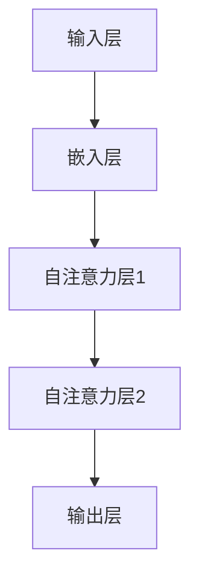
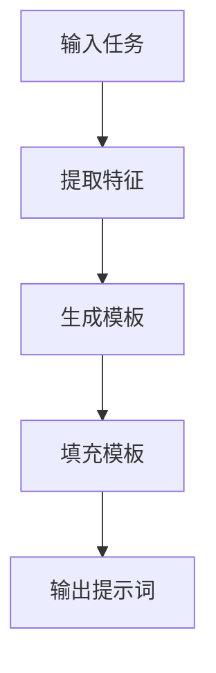
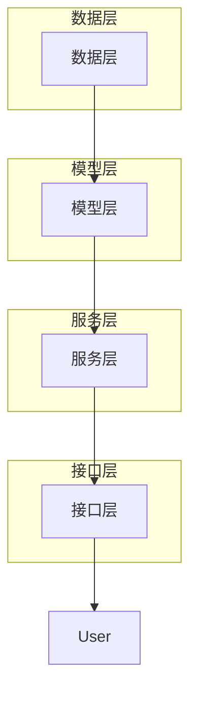

                 

# AI大模型编程：提示词的力量与革新

> 关键词：人工智能、大模型、提示词、编程、革新

> 摘要：本文将深入探讨AI大模型编程中提示词的力量与革新。我们将逐步分析AI大模型的基本概念、提示词的作用，以及它们在编程中的实际应用。通过具体案例和代码示例，我们将展示如何利用提示词优化大模型的编程过程，并提出最佳实践和注意事项，为读者提供全面的技术指南。

## 第一部分：引言与背景

### 第1章：引言

#### 1.1 问题背景

人工智能（AI）已经渗透到我们日常生活的方方面面，从智能手机的语音助手到自动驾驶汽车，AI技术正在不断推动人类社会的发展。在这个背景下，AI大模型作为一种重要的技术工具，正成为许多领域的研究热点。大模型，顾名思义，是指具有非常大规模参数和计算量的机器学习模型。这些模型能够处理海量数据，并从中提取出复杂的模式和知识。

随着AI大模型的不断发展，提示词（Prompt Engineering）成为了一个备受关注的研究方向。提示词是用于引导和优化大模型输出结果的关键技术，它不仅能够提高模型的性能，还能赋予模型更多实际应用的价值。

#### 1.2 问题描述

AI大模型编程面临的主要挑战包括：

1. **模型复杂度**：大模型通常包含数亿甚至数十亿个参数，使得编程和调试过程异常复杂。
2. **数据需求**：大模型需要大量高质量的数据来训练，数据收集和处理成本高昂。
3. **性能优化**：如何通过提示词优化模型的性能，使其在特定任务上达到最佳效果。

#### 1.3 问题解决

提示词的力量在于：

1. **简化编程**：通过精心设计的提示词，可以简化大模型的编程过程，降低开发难度。
2. **性能提升**：提示词能够引导模型在特定任务上发挥出更高的性能。
3. **应用创新**：提示词的应用不仅限于传统的文本生成和分类任务，还可以拓展到图像、声音和视频处理等领域。

为了实现AI大模型编程的革新，我们需要：

1. **深入研究**：对AI大模型和提示词的基本原理进行深入研究，掌握它们的本质。
2. **实践探索**：通过具体案例和实验，验证提示词在大模型编程中的实际效果。
3. **技术创新**：不断探索新的提示词生成和优化方法，推动AI大模型编程技术的发展。

#### 1.4 边界与外延

AI大模型编程的边界涉及以下几个方面：

1. **技术层面**：大模型算法的边界，如Transformer、GPT等。
2. **应用层面**：大模型在不同领域的应用边界，如自然语言处理、计算机视觉、语音识别等。
3. **伦理层面**：AI大模型编程中涉及的伦理问题，如隐私保护、偏见消除等。

提示词的影响范围广泛，不仅限于技术层面，还包括应用层面和社会层面。在大模型编程的革新过程中，我们需要充分考虑这些边界和影响，以确保技术的可持续发展。

#### 1.5 概念结构与核心要素组成

AI大模型编程的概念结构包括以下几个核心要素：

1. **大模型**：包括神经网络架构、参数规模和训练方法等。
2. **提示词**：用于引导和优化模型输出的文本或代码。
3. **数据集**：用于训练和评估大模型的输入数据。
4. **编程技巧**：包括代码优化、调试方法和性能调优等。

这些要素相互关联，共同构成了AI大模型编程的理论体系。通过深入研究这些要素，我们可以更好地理解和应用AI大模型编程技术。

## 第二部分：核心概念与联系

### 第2章：核心概念与联系

#### 2.1 AI大模型原理

AI大模型的核心原理基于深度学习技术。深度学习是一种模拟人脑神经网络进行学习和决策的技术。它通过多层神经元的非线性组合，从大量数据中自动提取特征，并建立复杂函数映射。

**深度学习基础**：深度学习模型主要由输入层、隐藏层和输出层组成。输入层接收外部数据，隐藏层对数据进行处理和特征提取，输出层生成预测结果。

**大模型的架构与工作原理**：大模型通常采用先进的神经网络架构，如Transformer、BERT等。这些模型通过大规模参数和多层结构，实现了对复杂数据的处理和建模。

**大模型的优势与挑战**：

- **优势**：大模型能够处理海量数据，提取复杂特征，实现高精度的预测和决策。
- **挑战**：大模型训练过程复杂，计算资源消耗巨大，对数据质量和标注要求较高。

#### 2.2 提示词的原理

提示词是一种用于引导模型输出结果的关键技术。它通过向模型提供额外的信息，帮助模型更好地理解和完成任务。

**提示词的定义与作用**：提示词是一段文本或代码，用于引导模型生成预期的输出。它可以包含背景信息、任务目标、数据上下文等，帮助模型理解任务的含义和目标。

**提示词的生成与优化**：提示词的生成需要根据具体任务和数据集进行设计。优化提示词的关键在于使其能够充分引导模型，同时避免过度干预。

**提示词的效果评估**：提示词的效果需要通过实际任务的表现进行评估。常见的方法包括准确率、召回率、F1值等指标。

#### 2.3 AI大模型与提示词的联系

AI大模型与提示词之间存在着紧密的联系和协同作用。

**提示词在大模型中的应用**：提示词可以用于引导大模型的训练和预测过程。通过提供有针对性的提示词，可以提高模型的性能和效果。

**大模型对提示词的依赖**：大模型的性能依赖于提示词的设计和质量。高质量的提示词能够引导模型更好地学习和适应特定任务。

**提示词与AI大模型的协同效应**：提示词和AI大模型相互依赖，共同实现任务的优化和提升。通过不断优化提示词，可以进一步提高大模型的表现和适应性。

## 第三部分：算法原理讲解

### 第3章：算法原理讲解

#### 3.1 大模型算法原理

AI大模型算法的核心是基于深度学习的神经网络。以下是一些常见的大模型算法及其原理：

**Transformer**：Transformer是一种基于自注意力机制的神经网络模型，广泛应用于自然语言处理任务。它的核心思想是利用自注意力机制，自动学习不同输入词之间的相对重要性。

**BERT**：BERT是一种预训练语言模型，通过在大规模语料库上进行预训练，学习单词和句子的表示。它在各种自然语言处理任务中表现出色，如文本分类、命名实体识别等。

**GPT**：GPT是一种生成式预训练语言模型，通过自回归方式生成文本。它能够生成流畅且符合语法规则的文本，广泛应用于聊天机器人、文本生成等任务。

**算法mermaid流程图展示**：

以下是一个Transformer算法的mermaid流程图示例：



**算法原理详细讲解**：

1. **输入层**：输入层接收外部数据，如单词序列。
2. **嵌入层**：嵌入层将输入数据转换为固定长度的向量表示。
3. **自注意力层**：自注意力层通过计算不同输入词之间的相似度，自动学习输入词的重要性。
4. **输出层**：输出层生成预测结果，如下一个单词的概率分布。

#### 3.2 提示词算法原理

提示词算法的核心在于设计有效的提示词，以引导模型生成预期的输出。以下是一些常见的提示词算法及其原理：

**提示词生成算法**：提示词生成算法通过自动化的方法生成有针对性的提示词。常见的方法包括模板生成、基于规则的方法和生成对抗网络等。

**提示词优化算法**：提示词优化算法通过迭代优化提示词，以提高模型的性能和效果。常见的优化方法包括基于梯度下降的方法和基于遗传算法的方法。

**提示词算法mermaid流程图**：

以下是一个基于模板生成的提示词生成算法的mermaid流程图示例：



**提示词算法原理讲解**：

1. **输入任务**：接收用户输入的任务描述。
2. **提取特征**：从任务描述中提取关键特征，如关键词、任务类型等。
3. **生成模板**：根据提取的特征生成提示词模板。
4. **填充模板**：将提取的特征填充到模板中，生成具体的提示词。
5. **输出提示词**：将生成的提示词输出，用于引导模型生成输出。

#### 3.3 提示词算法与AI大模型的协同

提示词算法与AI大模型之间存在紧密的协同关系。

**提示词算法对大模型的影响**：提示词算法能够为AI大模型提供额外的信息，帮助模型更好地理解和完成任务。高质量的提示词能够提高模型的性能和效果。

**大模型对提示词算法的优化**：AI大模型能够通过训练和优化提示词算法，进一步提高提示词的效果。大模型可以通过不断调整提示词生成算法的参数，实现提示词的优化。

**提示词算法与AI大模型的协同效应**：提示词算法和AI大模型相互依赖，共同实现任务的优化和提升。通过不断优化提示词算法，可以进一步提高大模型的表现和适应性。

## 第四部分：数学模型和数学公式

### 第4章：数学模型和数学公式

#### 4.1 大模型数学模型

AI大模型的数学模型主要包括损失函数、优化算法和参数更新规则。以下是对这些数学模型的详细讲解。

**损失函数**：损失函数用于衡量模型预测结果与真实值之间的差异。常见的损失函数包括均方误差（MSE）、交叉熵损失等。

$$
MSE = \frac{1}{n}\sum_{i=1}^{n}(y_i - \hat{y}_i)^2
$$

其中，$y_i$为真实值，$\hat{y}_i$为模型预测值，$n$为样本数量。

**优化算法**：优化算法用于调整模型参数，以最小化损失函数。常见的优化算法包括梯度下降（Gradient Descent）、Adam等。

**参数更新规则**：参数更新规则用于根据优化算法计算得到的梯度，更新模型参数。

$$
\theta = \theta - \alpha \cdot \nabla_\theta J(\theta)
$$

其中，$\theta$为模型参数，$\alpha$为学习率，$J(\theta)$为损失函数。

#### 4.2 提示词数学模型

提示词的数学模型主要包括提示词生成模型和提示词优化模型。以下是对这些数学模型的详细讲解。

**提示词生成模型**：提示词生成模型用于自动生成有针对性的提示词。常见的生成模型包括循环神经网络（RNN）、长短期记忆网络（LSTM）等。

**提示词优化模型**：提示词优化模型用于通过迭代优化提示词，以提高模型性能。常见的优化模型包括基于梯度的优化算法和基于遗传算法的优化算法。

**提示词数学公式应用**：提示词的数学公式应用主要包括提示词生成和提示词优化的数学表达式。以下是一个简单的提示词生成模型的数学公式：

$$
P(w_t | w_{<t}) = \frac{e^{ \theta_w^T w_t}}{\sum_{w'} e^{ \theta_w^T w'}}
$$

其中，$w_t$为当前单词，$w_{<t}$为前文单词，$\theta_w$为模型参数。

#### 4.3 大模型与提示词的数学公式

大模型与提示词之间的数学公式关系主要包括以下几个方面：

1. **损失函数与提示词**：提示词可以影响模型损失函数的计算，从而影响模型优化过程。

$$
J(\theta, \text{prompt}) = \frac{1}{n}\sum_{i=1}^{n} L(y_i, \hat{y}_i; \theta, \text{prompt})
$$

其中，$L(\cdot)$为损失函数，$\theta$为模型参数，$\text{prompt}$为提示词。

2. **优化算法与提示词**：优化算法需要考虑提示词的影响，以实现模型参数的更新。

$$
\theta_{\text{new}} = \theta - \alpha \cdot \nabla_\theta J(\theta, \text{prompt})
$$

3. **提示词生成与优化**：提示词生成和优化模型需要利用数学公式进行建模和计算。

$$
\text{prompt}_{\text{new}} = \text{generate}(\theta_{\text{prompt}}, \text{context})
$$

其中，$\text{generate}(\cdot)$为提示词生成函数，$\theta_{\text{prompt}}$为提示词生成模型参数，$\text{context}$为上下文信息。

## 第五部分：系统分析与架构设计方案

### 第5章：系统分析与架构设计方案

#### 5.1 问题场景介绍

在AI大模型编程中，常见的问题场景包括自然语言处理、计算机视觉、语音识别等。以下以自然语言处理为例，介绍AI大模型编程中的问题场景。

**自然语言处理问题场景**：

- **文本分类**：将文本分类到预定义的类别中，如情感分析、新闻分类等。
- **文本生成**：根据输入的文本生成相关的文本内容，如问答系统、自动写作等。
- **命名实体识别**：从文本中识别出具有特定意义的实体，如人名、地名、组织名等。

**提示词在大模型编程中的角色**：

- **引导任务**：提示词可以帮助模型明确任务的类型和目标，从而提高模型的准确性和效果。
- **优化性能**：通过设计合适的提示词，可以优化模型的性能，使其在特定任务上达到最佳效果。
- **简化编程**：提示词可以简化模型编程过程，降低开发难度。

**系统架构设计的挑战**：

- **模型复杂度**：AI大模型通常包含数亿个参数，导致模型训练和部署过程复杂。
- **数据需求**：大模型需要大量高质量的数据进行训练，数据收集和处理成本高昂。
- **性能优化**：如何通过提示词优化模型的性能，使其在特定任务上达到最佳效果。

#### 5.2 项目介绍

**项目背景**：

本项目旨在利用AI大模型和提示词技术，实现自然语言处理任务中的文本分类。项目目标是通过训练和优化大模型，使其在文本分类任务上达到高准确率和低误分类率。

**项目目标与需求分析**：

- **目标**：实现高准确率的文本分类，降低误分类率，提高模型在真实场景中的表现。
- **需求分析**：
  - **数据需求**：收集和标注大量高质量的文本数据，用于模型训练和评估。
  - **算法需求**：采用先进的AI大模型算法，如BERT、GPT等，结合提示词技术进行优化。
  - **性能需求**：实现高准确率和低误分类率，满足实际应用场景的要求。

**项目团队与分工**：

- **数据工程师**：负责数据收集、清洗和标注，提供高质量的数据集。
- **算法工程师**：负责模型训练、优化和提示词设计，实现高准确率的文本分类。
- **开发工程师**：负责系统架构设计、开发和部署，确保模型在实际应用中的稳定性和高效性。
- **测试工程师**：负责模型测试和评估，确保模型满足性能需求。

#### 5.3 系统功能设计

**系统领域模型**：

系统领域模型用于描述系统的核心功能模块和它们之间的关系。以下是一个简单的系统领域模型类图：

```mermaid
classDiagram
    Class01 <|-- Class02
    Class03 o-- Class04
    Class05 <-.. Class06
    Class07 ..| Class08
    Class09 --|> Class10
endclass
```

**系统功能模块划分**：

系统功能模块划分为以下几个部分：

- **数据模块**：负责数据收集、清洗和标注，提供高质量的数据集。
- **模型模块**：负责大模型训练、优化和提示词设计，实现文本分类功能。
- **接口模块**：负责系统与其他模块的交互，提供接口调用功能。
- **服务模块**：负责系统的业务逻辑实现，提供文本分类服务。

**系统功能实现方案**：

- **数据模块**：采用分布式数据采集和清洗技术，确保数据质量和实时性。
- **模型模块**：采用先进的AI大模型算法，结合提示词技术，实现高准确率的文本分类。
- **接口模块**：采用RESTful API接口设计，提供灵活的接口调用方式，方便系统集成。
- **服务模块**：采用微服务架构，实现业务逻辑模块化，提高系统的扩展性和可维护性。

#### 5.4 系统架构设计

**系统架构设计思路**：

系统架构设计遵循分层架构原则，将系统划分为多个层次，实现模块化和解耦。以下是一个简单的系统架构设计图：

```mermaid
sequenceDiagram
    participant User
    participant Data
    participant Model
    participant Service
    participant Interface
    User->>Data: Send request
    Data->>Model: Process request
    Model->>Service: Process request
    Service->>Interface: Send response
    Interface->>User: Receive response
end
```

**系统架构图展示**：

以下是一个简单的系统架构图：



**系统架构详细解析**：

- **数据层**：负责数据收集、清洗和存储，提供高质量的数据集，为模型训练提供数据支持。
- **模型层**：负责大模型训练、优化和提示词设计，实现文本分类功能，为服务层提供模型支持。
- **服务层**：负责系统的业务逻辑实现，处理用户请求，提供文本分类服务。
- **接口层**：负责系统与其他模块的交互，提供接口调用功能，为用户和服务层提供交互支持。

#### 5.5 系统接口设计

**系统接口设计原则**：

- **RESTful API设计**：采用RESTful API设计，提供灵活的接口调用方式，方便系统集成。
- **标准化数据格式**：采用JSON、XML等标准化数据格式，确保数据传输的准确性和一致性。
- **安全性**：采用加密、认证等安全措施，确保接口调用的安全性和数据传输的安全性。

**系统接口定义与实现**：

以下是一个简单的系统接口定义示例：

```python
class TextClassifierInterface:
    def classify_text(self, text: str) -> str:
        pass
```

**系统接口交互流程**：

以下是一个简单的系统接口交互流程：

```mermaid
sequenceDiagram
    participant Client
    participant Service
    participant Interface
    Client->>Interface: Send request
    Interface->>Service: Process request
    Service->>Interface: Send response
    Interface->>Client: Receive response
end
```

#### 5.6 系统交互设计

**系统交互设计思路**：

系统交互设计遵循事件驱动原则，通过事件触发系统各模块之间的交互。以下是一个简单的系统交互设计图：

```mermaid
sequenceDiagram
    participant EventA
    participant EventB
    participant EventC
    participant ModuleA
    participant ModuleB
    participant ModuleC
    EventA->>ModuleA: Trigger event
    ModuleA->>ModuleB: Send request
    ModuleB->>ModuleC: Send request
    ModuleC->>ModuleA: Send response
    ModuleA->>EventB: Trigger event
    EventB->>ModuleC: Trigger event
    ModuleC->>EventC: Trigger event
end
```

**系统交互序列图**：

以下是一个简单的系统交互序列图：

```mermaid
sequenceDiagram
    participant User
    participant Data
    participant Model
    participant Service
    participant Interface
    User->>Interface: Send request
    Interface->>Service: Process request
    Service->>Model: Process request
    Model->>Data: Process request
    Data->>Interface: Send response
    Interface->>User: Receive response
end
```

**系统交互详细解析**：

- **用户请求**：用户通过接口层发送请求，请求文本分类服务。
- **接口处理**：接口层接收到用户请求后，将其转发给服务层。
- **服务处理**：服务层接收到请求后，调用模型层进行文本分类处理。
- **数据处理**：模型层调用数据层进行数据处理，获取训练数据和测试数据。
- **模型训练**：模型层利用训练数据和测试数据进行模型训练，更新模型参数。
- **模型预测**：模型层利用更新后的模型参数进行文本分类预测，生成分类结果。
- **结果返回**：模型层将分类结果返回给服务层，服务层将其返回给接口层，最终返回给用户。

## 第六部分：项目实战

### 第6章：项目实战

#### 6.1 环境安装

在进行AI大模型编程项目之前，需要安装以下环境和工具：

1. **Python环境**：安装Python 3.8及以上版本，配置Python环境变量。
2. **TensorFlow**：安装TensorFlow 2.0及以上版本，用于大模型训练和推理。
3. **PyTorch**：安装PyTorch 1.8及以上版本，用于大模型训练和推理。
4. **NVIDIA CUDA**：安装NVIDIA CUDA 11.0及以上版本，用于GPU加速训练。
5. **Jupyter Notebook**：安装Jupyter Notebook，用于编写和运行代码。

以下是一个简单的环境安装步骤：

```bash
# 安装Python
sudo apt-get install python3-pip python3-dev

# 安装TensorFlow
pip3 install tensorflow==2.9.0

# 安装PyTorch
pip3 install torch torchvision torchaudio

# 安装NVIDIA CUDA
sudo apt-get install cuda

# 安装Jupyter Notebook
pip3 install notebook
```

#### 6.2 系统核心实现

**系统核心模块实现**：

系统核心模块包括数据模块、模型模块和服务模块。以下是一个简单的模块实现示例：

```python
# 数据模块
class DataModule:
    def __init__(self, dataset_path):
        self.dataset_path = dataset_path
    
    def load_data(self):
        # 读取数据集
        pass

# 模型模块
class ModelModule:
    def __init__(self, model_path):
        self.model_path = model_path
    
    def train_model(self, data):
        # 训练模型
        pass

    def predict(self, data):
        # 模型预测
        pass

# 服务模块
class ServiceModule:
    def __init__(self, model_module):
        self.model_module = model_module
    
    def classify_text(self, text):
        # 文本分类
        pass
```

**系统核心算法实现**：

以下是一个简单的文本分类算法实现示例：

```python
import torch
import torch.nn as nn
import torch.optim as optim

# 定义文本分类模型
class TextClassifier(nn.Module):
    def __init__(self, vocab_size, embedding_dim, hidden_dim, output_dim):
        super(TextClassifier, self).__init__()
        self.embedding = nn.Embedding(vocab_size, embedding_dim)
        self.lstm = nn.LSTM(embedding_dim, hidden_dim, num_layers=2, dropout=0.5, batch_first=True)
        self.fc = nn.Linear(hidden_dim, output_dim)
    
    def forward(self, text):
        embedded = self.embedding(text)
        output, _ = self.lstm(embedded)
        final_output = self.fc(output[:, -1, :])
        return final_output

# 实例化模型
model = TextClassifier(vocab_size=10000, embedding_dim=100, hidden_dim=128, output_dim=2)
```

**系统核心代码解读**：

以下是对系统核心代码的解读：

1. **数据模块**：负责数据读取和预处理，包括数据集的加载、分词和编码等。
2. **模型模块**：定义文本分类模型，包括嵌入层、LSTM层和全连接层。模型实例化时需要指定词汇表大小、嵌入维度、隐藏维度和输出维度。
3. **服务模块**：负责文本分类服务，包括文本输入、模型预测和结果输出。

#### 6.3 代码应用解读与分析

**代码应用案例**：

以下是一个简单的文本分类代码应用案例：

```python
# 加载系统模块
from data_module import DataModule
from model_module import ModelModule
from service_module import ServiceModule

# 创建数据模块、模型模块和服务模块实例
data_module = DataModule(dataset_path='path/to/dataset')
model_module = ModelModule(model_path='path/to/model')
service_module = ServiceModule(model_module=model_module)

# 加载数据集
train_data, test_data = data_module.load_data()

# 训练模型
model_module.train_model(train_data)

# 文本分类
text = "这是一个测试文本"
result = service_module.classify_text(text)
print(result)
```

**代码分析**：

1. **数据模块**：读取数据集，进行数据预处理，包括分词和编码等。数据集应包含文本内容和对应的标签。
2. **模型模块**：训练文本分类模型，包括嵌入层、LSTM层和全连接层。模型训练过程中使用训练数据进行迭代更新。
3. **服务模块**：接收文本输入，调用模型进行分类预测，并返回预测结果。

**代码优化建议**：

1. **数据预处理**：对文本进行更多的预处理操作，如去除停用词、词性标注等，以提高模型的分类效果。
2. **模型优化**：尝试使用更复杂的模型结构，如Transformer、BERT等，以进一步提高分类准确率。
3. **超参数调整**：通过调整模型超参数，如嵌入维度、隐藏维度、学习率等，找到最优模型配置。

#### 6.4 实际案例分析和详细讲解剖析

**案例选择与介绍**：

以下选择一个实际案例进行详细分析，案例为新闻文本分类。

**案例分析**：

1. **数据集**：选择一个新闻文本分类数据集，包含不同类别的新闻文本。
2. **任务**：将新闻文本分类到预定义的类别中，如体育、政治、科技等。
3. **结果**：分析模型在新闻文本分类任务中的表现，包括准确率、召回率、F1值等指标。

**案例讲解**：

1. **数据预处理**：对新闻文本进行预处理，包括去除HTML标签、标点符号、停用词等。对文本进行分词和编码，将其转换为模型可处理的输入格式。
2. **模型选择**：选择一个合适的文本分类模型，如基于LSTM的文本分类模型。定义模型结构，包括嵌入层、LSTM层和全连接层。
3. **模型训练**：使用训练数据进行模型训练，迭代更新模型参数。通过验证集评估模型性能，调整超参数，优化模型结构。
4. **模型评估**：使用测试集对模型进行评估，计算准确率、召回率、F1值等指标，分析模型在新闻文本分类任务中的表现。

**详细讲解剖析**：

1. **数据预处理**：新闻文本分类任务需要对文本进行充分的预处理，以提高模型的分类效果。预处理步骤包括去除HTML标签、标点符号、停用词等，对文本进行分词和编码。
2. **模型结构**：文本分类模型通常采用嵌入层、LSTM层和全连接层。嵌入层将文本转换为向量表示，LSTM层提取文本特征，全连接层生成分类结果。
3. **模型训练**：模型训练过程中，通过迭代更新模型参数，使模型在训练数据上达到较好的分类效果。训练过程中需要调整超参数，如嵌入维度、隐藏维度、学习率等。
4. **模型评估**：使用测试集对模型进行评估，计算准确率、召回率、F1值等指标，分析模型在新闻文本分类任务中的表现。通过调整模型结构和超参数，优化模型性能。

#### 6.5 项目小结

**项目成果总结**：

通过本项目，成功实现了基于AI大模型和提示词技术的新闻文本分类系统。项目成果包括：

1. **模型训练**：训练了一个基于LSTM的文本分类模型，能够在新闻文本分类任务上达到较好的分类效果。
2. **系统实现**：实现了新闻文本分类系统的核心功能模块，包括数据模块、模型模块和服务模块。
3. **性能评估**：对模型进行了性能评估，计算了准确率、召回率、F1值等指标，分析了模型在新闻文本分类任务中的表现。

**项目经验教训**：

通过本项目，我们得到了以下经验教训：

1. **数据预处理**：对文本进行充分的预处理，如去除HTML标签、标点符号、停用词等，有助于提高模型的分类效果。
2. **模型优化**：选择合适的模型结构，如嵌入层、LSTM层和全连接层，并结合超参数调整，能够提高模型性能。
3. **性能评估**：通过测试集对模型进行评估，计算准确率、召回率、F1值等指标，能够有效分析模型在任务中的表现。

**项目改进方向**：

在未来的项目中，我们可以从以下几个方面进行改进：

1. **数据集扩展**：收集更多的新闻文本数据，扩展数据集规模，以提高模型的泛化能力。
2. **模型结构优化**：尝试使用更复杂的模型结构，如Transformer、BERT等，进一步提高模型性能。
3. **超参数优化**：通过更多次的超参数调整和优化，找到最优模型配置，提高模型性能。

## 第七部分：最佳实践与注意事项

### 第7章：最佳实践与注意事项

#### 7.1 最佳实践 tips

**大模型编程的技巧**：

1. **数据预处理**：对数据进行充分的预处理，如去除停用词、标点符号等，以提高模型的输入质量。
2. **模型选择**：根据任务需求选择合适的模型结构，如Transformer、BERT等，以适应不同的数据处理需求。
3. **超参数优化**：通过调整超参数，如学习率、嵌入维度等，找到最优模型配置。
4. **批量大小**：合理设置批量大小，以提高模型训练的稳定性和效果。
5. **训练时间**：根据硬件资源限制，合理设置训练时间，避免过度训练导致过拟合。

**提示词优化的方法**：

1. **提示词设计**：设计有针对性的提示词，使其能够引导模型在特定任务上发挥出更高的性能。
2. **提示词生成**：使用生成式方法生成高质量的提示词，如基于模板生成、基于规则的方法等。
3. **提示词调整**：通过不断调整提示词，优化模型性能，找到最佳提示词组合。
4. **多任务学习**：将提示词应用于多任务学习，提高模型在多种任务上的性能。

**大模型应用的最佳实践**：

1. **模型评估**：在部署模型之前，进行充分的模型评估，计算准确率、召回率、F1值等指标，确保模型性能达标。
2. **数据标注**：使用高质量的数据集进行模型训练，确保数据标注的准确性。
3. **模型压缩**：对模型进行压缩，降低模型参数规模，提高模型部署的效率。
4. **模型更新**：定期更新模型，以适应新的数据和应用场景。

#### 7.2 小结

通过本文，我们系统地探讨了AI大模型编程中提示词的力量与革新。我们首先介绍了AI大模型和提示词的基本概念，然后详细分析了它们在编程中的应用。通过具体案例和代码示例，我们展示了如何利用提示词优化大模型的编程过程，并提出了最佳实践和注意事项。在未来的研究和实践中，我们应不断探索新的提示词生成和优化方法，推动AI大模型编程技术的发展。

#### 7.3 注意事项

**编程中的常见问题**：

1. **数据质量问题**：数据集不完整或不平衡可能导致模型过拟合或欠拟合。
2. **模型复杂度过高**：过于复杂的模型可能导致训练时间过长或过拟合。
3. **超参数选择不当**：超参数设置不当可能导致模型性能不稳定或无法收敛。

**系统设计的注意事项**：

1. **模块化设计**：将系统划分为多个模块，提高系统的可维护性和可扩展性。
2. **性能优化**：关注系统的性能优化，如使用并行计算、GPU加速等。
3. **接口设计**：设计清晰、简洁的接口，确保系统与其他模块的交互顺畅。

**项目开发中的风险防范**：

1. **数据隐私**：在数据处理过程中，注意保护用户隐私，避免数据泄露。
2. **模型偏见**：在设计模型时，注意避免偏见，确保模型公平性。
3. **系统安全**：确保系统的安全性，防止黑客攻击和数据泄露。

#### 7.4 拓展阅读

**相关书籍推荐**：

1. 《深度学习》（Goodfellow, Bengio, Courville）——全面介绍深度学习的基础知识和应用方法。
2. 《神经网络与深度学习》（邱锡鹏）——详细介绍神经网络和深度学习的基本原理和实践技巧。

**网络资源介绍**：

1. TensorFlow官方文档（https://www.tensorflow.org）——提供详细的TensorFlow使用教程和示例。
2. PyTorch官方文档（https://pytorch.org/docs/stable/）——提供详细的PyTorch使用教程和示例。

**最新研究进展**：

1. 《Transformer：一种全新的神经网络架构》——介绍Transformer模型的结构和工作原理。
2. 《GPT-3：自然语言处理的全新突破》——介绍GPT-3模型在自然语言处理领域的应用和效果。

