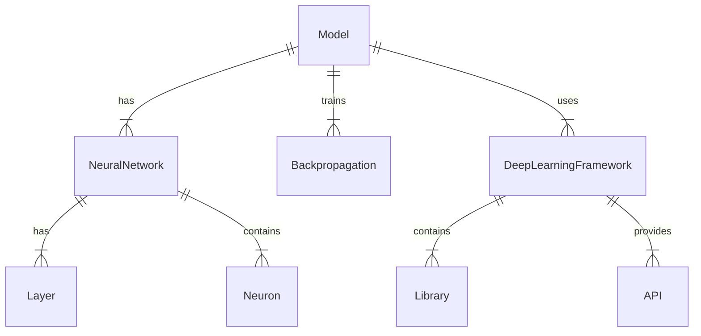

                 

### 引言

#### 人工智能编程语言：一个时代的变革

在人工智能（AI）快速发展的今天，编程语言的角色和功能正在经历一场深刻的革命。传统的编程语言更多地关注于计算机硬件层面的操作和数据结构的处理，而AI编程语言则侧重于如何更高效地构建和训练复杂的算法模型，以实现智能化的任务处理和决策制定。这一变革不仅改变了编程的本质，也为开发者提供了更为强大的工具和平台。

本文将深入探讨AI编程语言的核心概念和未来发展趋势。我们将首先定义和解析AI编程语言的基本概念，了解其与传统编程语言的差异。接着，我们将探讨提示词在AI编程中的革命性作用，分析其设计原则和实现方法。随后，我们将展望AI编程语言的未来，探讨其可能的发展方向和面临的挑战。

本文的结构如下：

1. **AI编程语言概述**：介绍AI编程语言的基本概念和特点。
2. **提示词的革命**：探讨提示词的定义、作用和设计原则。
3. **未来发展趋势**：分析AI编程语言的发展趋势和未来方向。
4. **应用实践**：通过具体案例展示AI编程语言的应用场景和实践指南。
5. **未来展望与挑战**：讨论AI编程语言的未来前景和面临的挑战。
6. **总结与拓展**：总结全文内容并提供拓展阅读资源。

通过这一系列的探讨，我们将更深入地理解AI编程语言的内涵和外延，以及其在未来技术发展中的重要作用。

### AI编程语言概述

#### 核心概念术语

在探讨AI编程语言之前，我们需要明确一些核心概念和术语。AI编程语言，通常是指专门用于构建和训练人工智能模型的编程工具。它们与传统编程语言有所不同，不仅包含编程语言的常见元素，如变量、函数、循环和条件语句，还引入了大量的机器学习库和框架，如TensorFlow、PyTorch等。

核心术语包括：

- **机器学习（Machine Learning）**：一种人工智能的技术，通过算法从数据中学习规律，并作出决策。
- **深度学习（Deep Learning）**：一种基于神经网络结构的机器学习技术，能够自动从数据中学习特征。
- **神经网络（Neural Network）**：一种模仿生物神经系统的计算模型，能够通过学习数据来提取特征。
- **数据科学（Data Science）**：一个多学科交叉领域，使用数学、统计和计算机科学的方法来分析和解释数据。

#### 问题背景

随着数据量的爆炸式增长和计算能力的提升，人工智能应用的需求日益增加。然而，传统的编程语言在处理复杂数据集和构建深度神经网络时显得力不从心。这就催生了AI编程语言的诞生，它们提供了一套更为高效和便捷的工具，使得开发者能够更轻松地构建和部署人工智能模型。

#### 问题解决

AI编程语言通过以下几个方面解决了传统编程语言的局限性：

- **高效的模型训练**：AI编程语言内置了丰富的机器学习库和框架，使得模型训练过程更加高效。
- **自动特征提取**：深度学习框架能够自动从数据中提取特征，减轻了开发者的负担。
- **可扩展性和灵活性**：AI编程语言通常具有高度的模块化和可扩展性，能够适应不同类型的人工智能应用需求。

#### 边界与外延

虽然AI编程语言在某些方面优于传统编程语言，但它们也有其局限性。例如，AI编程语言在处理传统编程任务时可能不如传统编程语言高效。此外，AI编程语言的学习曲线较陡峭，需要开发者具备一定的数学和机器学习背景。

然而，随着技术的不断发展，AI编程语言的应用场景和功能将不断扩展。未来，AI编程语言可能会更加普及，并成为软件开发的核心工具之一。

### AI编程语言的核心概念

#### 核心概念原理

AI编程语言的核心概念是基于机器学习和深度学习算法的。这些算法通过从数据中学习规律和模式，实现对复杂任务的自动执行和决策。具体来说，AI编程语言包含以下几个核心概念：

1. **神经网络（Neural Network）**：神经网络是一种模仿生物神经系统的计算模型，通过多个层次的神经元进行信息处理。每个神经元接收输入信号，通过激活函数处理后输出结果。
   
2. **反向传播（Backpropagation）**：反向传播是一种用于训练神经网络的算法，通过计算输出结果与实际结果之间的误差，反向传播误差到每个神经元，从而调整网络权重，使得网络输出更接近实际结果。

3. **深度学习框架（Deep Learning Framework）**：深度学习框架如TensorFlow和PyTorch提供了一套完整的工具和库，用于构建、训练和部署深度学习模型。这些框架提供了丰富的API和预训练模型，使得开发者能够更高效地进行模型开发。

#### 概念属性特征对比表格

为了更好地理解AI编程语言的核心概念，我们可以通过一个特征对比表格来展示这些概念的不同属性：

| 概念          | 描述                                                         | 关键特征                                       |
| ------------- | ------------------------------------------------------------ | ---------------------------------------------- |
| 神经网络      | 模仿生物神经系统的计算模型，用于信息处理。                     | 神经元、层次结构、激活函数、权重调整           |
| 反向传播      | 用于训练神经网络的算法，通过误差反向传播调整网络权重。         | 误差计算、权重调整、梯度下降                   |
| 深度学习框架  | 提供构建、训练和部署深度学习模型的工具和库。                   | API、预训练模型、模块化、可扩展性               |

#### ER实体关系图架构

为了更直观地展示AI编程语言的核心概念之间的关系，我们可以使用Mermaid绘制一个ER实体关系图。以下是ER图的基本结构：



在这个ER图中，`Model`代表了AI编程语言的核心模型，它与`NeuralNetwork`、`Backpropagation`和`DeepLearningFramework`之间存在关联关系。`NeuralNetwork`进一步关联到`Layer`和`Neuron`，而`DeepLearningFramework`则包含`Library`和`API`。

通过这一部分的内容，我们初步了解了AI编程语言的核心概念和结构，为后续章节的深入探讨奠定了基础。

### 提示词的概念

#### 提示词的定义

提示词（Prompt）在AI编程语言中起着至关重要的作用。它是一种特殊的输入，用于指导人工智能模型进行特定任务。提示词可以是文本、图像或其他形式的数据，其目的是帮助模型理解任务的目标和上下文。

提示词可以被视为AI模型的“导航指南”，通过提供明确的任务指令，使得模型能够更准确地执行预测和决策。例如，在自然语言处理任务中，提示词可以是一个具体的句子或问题，用于引导模型生成相关的回答。

#### 提示词的类型

根据用途和形式，提示词可以分为以下几种类型：

1. **文本提示词**：这是最常见的类型，通常用于指导文本生成任务。例如，在机器翻译中，文本提示词可以是源语言的句子，用于生成目标语言的翻译。

2. **图像提示词**：这类提示词用于指导计算机视觉任务，如图像分类或目标检测。图像提示词可以是一张具体的图片，用于帮助模型识别图像中的特定对象或场景。

3. **语音提示词**：用于指导语音识别和生成任务。例如，语音提示词可以是一个语音指令，用于控制智能家居设备或执行特定操作。

4. **混合提示词**：这类提示词结合了文本、图像和语音等多种形式，用于处理更复杂的多模态任务。

#### 提示词的层次结构

提示词的层次结构决定了其在AI模型中的表现和效果。一般来说，提示词可以分为以下几个层次：

1. **基本层次**：这是最基础的层次，包含单个提示词或简单的组合提示词。基本层次主要用于处理单一类型的任务，如文本分类或图像识别。

2. **组合层次**：在这个层次，多个基本层次的提示词组合在一起，形成更复杂的提示。组合层次能够处理更复杂的任务，如多步骤的推理或多模态任务。

3. **抽象层次**：这是最高级的层次，涉及抽象的提示词，用于指导高层次的决策和策略。抽象层次通常用于处理需要高级知识和理解的复杂任务，如决策支持系统或高级对话系统。

通过了解提示词的定义、类型和层次结构，我们能够更好地利用它们在AI编程中的应用，提高模型的性能和效果。

### 提示词在AI编程中的应用

#### 提示词的生成与优化

提示词在AI编程中的关键作用不仅在于其定义和类型，更在于如何生成和优化。有效的提示词能够显著提高模型的学习效率和预测准确性。以下是如何生成和优化提示词的几个关键步骤：

1. **数据收集与预处理**：首先，需要收集大量的相关数据，这些数据可以是文本、图像、语音等多种形式。数据收集后，需要对其进行预处理，包括去噪、格式化、数据增强等步骤，以确保数据的可靠性和多样性。

2. **提示词模板设计**：设计提示词模板是生成高质量提示词的关键。提示词模板应该简洁明了，能够清晰传达任务目标和上下文。例如，对于文本生成任务，可以使用问题-回答模板，如“请根据以下文本生成一个总结：”。

3. **自动生成与优化**：使用自然语言处理技术，如生成对抗网络（GAN）或强化学习，可以自动生成高质量的提示词。这些自动生成的提示词可以通过迭代训练和优化来不断改进，以适应特定的任务需求。

4. **多模态提示词融合**：对于需要处理多种模态数据（如文本、图像和语音）的任务，可以使用多模态融合技术，将不同模态的提示词组合起来，形成更综合的提示。例如，在图像描述生成任务中，可以将图像的视觉特征和文本描述结合起来，生成更精确的描述。

5. **反馈循环**：通过收集模型的输出结果，建立反馈循环，不断调整和优化提示词。这种反馈机制可以帮助模型更好地理解和适应任务需求，从而提高预测准确性。

通过这些步骤，我们可以生成和优化高质量的提示词，从而提高AI模型在各类任务中的表现。

#### 提示词的反馈机制

提示词在AI编程中的反馈机制是确保模型性能不断优化的重要环节。有效的反馈机制能够帮助模型识别和纠正错误，提高预测的准确性。以下是如何建立和利用反馈机制的几个关键步骤：

1. **评估指标**：首先，需要选择合适的评估指标，如准确率、召回率、F1分数等，用于衡量模型在特定任务上的表现。这些评估指标可以基于模型的输出结果和实际结果进行计算，为后续的反馈提供依据。

2. **错误分析**：通过对模型输出结果的分析，识别模型在哪些情况下表现不佳。例如，在文本分类任务中，可以分析哪些类别的标签被错误分类，以及错误分类的原因。

3. **反馈收集**：建立有效的反馈收集机制，通过用户反馈、数据标注或自动评估等方式，收集模型输出的错误信息。这些反馈信息可以用于识别模型存在的问题，并提供改进的依据。

4. **模型修正**：根据收集到的反馈信息，对模型进行修正。这可能包括调整模型参数、优化提示词或重新训练模型。通过反复迭代，模型可以不断改进，提高预测准确性。

5. **实时调整**：对于实时应用场景，如智能助手或自动驾驶系统，需要建立实时反馈机制，快速响应用户需求和环境变化，确保模型始终处于最佳状态。

通过这些步骤，我们可以建立和利用有效的反馈机制，不断提高AI模型的性能和可靠性。

### 提示词的设计原则

#### 清晰性

提示词的清晰性是其有效性的基础。一个清晰的提示词能够明确传达任务目标和上下文，减少模型理解的歧义，提高模型的预测准确性。设计清晰提示词的关键在于：

- **明确任务目标**：确保提示词明确指出模型需要执行的任务，避免模糊不清的指令。
- **详细上下文信息**：提供足够的上下文信息，帮助模型理解任务背景和具体要求。
- **简洁表达**：使用简洁明了的语言，避免冗长和复杂的句子，以便模型容易理解和执行。

#### 相关性

相关性是提示词设计的重要原则，指提示词与任务目标的紧密程度。高相关性的提示词能够帮助模型更好地聚焦于任务，提高模型的预测效果。以下是如何确保提示词相关性的几个建议：

- **任务导向**：确保提示词与任务目标紧密相关，避免无关或次要信息的干扰。
- **上下文匹配**：提示词应与上下文环境一致，确保模型在特定场景下能够准确执行任务。
- **数据一致性**：使用与训练数据一致的语言和表述，避免混淆模型的认知。

#### 简洁性

简洁性是提示词设计中的另一个关键原则，指提示词的简洁程度。简洁的提示词不仅易于理解，还能减少模型的计算负担，提高处理效率。以下是如何实现提示词简洁性的几个策略：

- **精简语言**：使用简洁明了的语言表达，避免冗余和重复的信息。
- **去除无关信息**：删除与任务无关或次要的信息，确保提示词的核心内容。
- **模块化设计**：将复杂的任务分解为多个简单模块，分别设计简洁的提示词。

#### 可扩展性

提示词的可扩展性是指其适应新任务和环境的能力。具有高可扩展性的提示词能够方便地应用于不同的任务和场景，提升模型的泛化能力。以下是如何提高提示词可扩展性的几个方法：

- **通用模板**：设计通用模板，可以根据不同任务和环境进行灵活调整。
- **参数化设计**：使用参数化的提示词，可以根据任务需求动态调整。
- **模块化结构**：设计模块化的提示词结构，可以方便地添加或替换模块，以适应新的任务需求。

通过遵循这些设计原则，我们可以生成高质量的提示词，从而显著提高AI模型在各类任务中的性能和效果。

### 人工智能编程的发展趋势

#### 趋势分析

人工智能编程正经历着一系列显著的发展趋势，这些趋势不仅改变了编程的方法，也重新定义了开发者的工作方式。以下是当前人工智能编程的主要趋势：

1. **自动机器学习（AutoML）**：自动机器学习通过自动化算法选择、特征工程和模型调优等过程，大大简化了机器学习的复杂性。开发者无需深入了解机器学习的技术细节，就能创建高性能的模型。

2. **联邦学习（Federated Learning）**：联邦学习允许多个分散的数据源协同工作，在不传输数据的情况下共同训练模型。这一趋势有助于保护隐私，同时提高数据的安全性和隐私性。

3. **生成对抗网络（GANs）**：生成对抗网络在图像合成、数据增强和样式迁移等方面展现了强大的潜力。GANs能够生成高质量的数据样本，提高了模型训练的效果。

4. **多模态学习**：随着数据类型的多样化，多模态学习变得越来越重要。通过结合文本、图像、音频等多种数据源，开发者能够构建更加全面和智能的模型。

5. **解释性AI**：随着AI应用的普及，解释性AI变得越来越重要。开发者需要能够理解和解释模型的决策过程，以确保AI系统的透明性和可靠性。

#### 行业动态

在行业层面，人工智能编程的发展也呈现出一些重要的动态：

- **AI在医疗领域的应用**：从疾病诊断到个性化治疗，AI正在改变医疗行业的方方面面。开发医疗级AI应用的需求推动了人工智能编程技术的发展。

- **自动驾驶技术的发展**：自动驾驶汽车和智能交通系统是AI编程的重要应用领域。这些系统需要高效的算法和强大的计算能力，以实现实时决策和路径规划。

- **金融科技（FinTech）**：AI技术在金融领域得到了广泛应用，包括风险控制、投资策略和客户服务等方面。金融科技公司正不断探索如何利用AI编程语言和工具来提升其业务效率。

#### 技术变革

技术变革是推动人工智能编程发展的核心动力。以下是几个关键的技术变革：

- **云计算与边缘计算**：云计算提供了强大的计算资源和存储能力，使得大规模的数据处理和模型训练成为可能。边缘计算则将计算能力推向网络边缘，实现了实时处理和低延迟通信。

- **硬件加速**：GPU和TPU等硬件加速器的使用，使得机器学习和深度学习的计算效率得到了显著提升。开发者可以利用这些硬件资源，加速模型的训练和推理过程。

- **AI编程语言的演进**：新的AI编程语言和框架不断涌现，如Julia、Rust等，它们提供了更好的性能和更高的开发效率。同时，现有编程语言（如Python）也在不断进化，以适应AI编程的需求。

通过分析人工智能编程的发展趋势、行业动态和技术变革，我们可以看到，人工智能编程正迎来一个充满机遇和挑战的新时代。开发者需要不断学习和适应这些变化，才能在这个快速发展的领域中保持竞争力。

### AI编程语言的未来方向

#### 编程范式的演变

AI编程语言的未来方向之一是编程范式的演变。传统的命令式编程范式正逐步让位于数据驱动和模型驱动的编程范式。数据驱动编程范式强调数据的定义和使用，通过数据流图来描述计算过程。模型驱动编程范式则更加注重模型的构建、训练和应用，通过定义和操作模型来指导程序的执行。

这种编程范式的转变，使得开发者能够更加专注于模型的设计和优化，而无需过多关注底层的计算细节。例如，在深度学习领域，开发者可以使用高级抽象的框架（如TensorFlow和PyTorch）来定义和训练模型，从而实现高效的计算和灵活的应用。

#### 跨领域融合

AI编程语言的未来方向还包括跨领域的融合。随着AI技术的不断进步，AI编程语言需要能够处理多种类型的数据和任务，包括文本、图像、语音和传感器数据等。跨领域融合的目标是实现不同领域数据和应用的无缝集成，从而构建更加智能和高效的系统。

例如，在医疗领域，AI编程语言需要能够处理患者电子健康记录、医学影像和生物数据，以便提供个性化的诊断和治疗建议。在工业领域，AI编程语言需要能够与传感器、机器人和其他工业设备集成，实现智能化的生产过程。

#### 智能化编程

另一个重要的未来方向是智能化编程。随着机器学习和自然语言处理技术的发展，未来的编程过程可能会更加智能化。开发者可以使用AI工具来自动生成代码、优化代码和修复bug。例如，代码生成工具（如GitHub Copilot）已经能够根据注释和上下文自动生成代码片段，大大提高了开发效率。

智能化编程还包括代码审查、性能优化和测试自动化等方面。通过AI技术，开发者可以更快速地发现和修复代码中的问题，提高软件的质量和可靠性。

#### 开发体验的改进

未来的AI编程语言还将注重开发体验的改进。通过提供更加直观和易于使用的工具，降低开发者的学习门槛，使得更多的人能够参与到AI编程中来。例如，可视化编程工具和集成开发环境（IDE）的改进，将使开发者能够更轻松地创建和调试复杂的AI应用程序。

总之，AI编程语言的未来方向是编程范式的演变、跨领域融合、智能化编程和开发体验的改进。这些趋势将推动AI编程语言的不断进步，为开发者提供更强大和灵活的工具，推动人工智能技术的广泛应用。

### AI编程语言应用案例

#### 案例一：自然语言处理

自然语言处理（NLP）是AI编程语言的重要应用领域之一。NLP技术使得计算机能够理解和处理人类语言，从而实现文本生成、情感分析、机器翻译等功能。

**应用场景**：在社交媒体分析中，NLP技术可以用于情感分析，识别用户的情感倾向。例如，通过分析推特上的用户评论，企业可以了解消费者对其产品的反馈。

**实现方法**：使用AI编程语言（如Python）和深度学习框架（如TensorFlow和PyTorch），开发者可以构建和训练情感分析模型。具体步骤如下：

1. **数据收集与预处理**：收集包含情感标签的文本数据，并进行数据清洗和预处理，如去除标点符号、停用词过滤和文本分词。
2. **模型构建**：定义神经网络架构，选择合适的损失函数和优化器。
3. **训练与评估**：使用预处理的数据训练模型，并通过交叉验证和测试集评估模型性能。
4. **部署与应用**：将训练好的模型部署到生产环境中，进行实时情感分析。

#### 案例二：计算机视觉

计算机视觉是AI编程语言的另一个重要应用领域，涵盖了图像分类、目标检测、图像生成等多种任务。

**应用场景**：在自动驾驶领域，计算机视觉技术用于实时监控道路环境，检测行人和车辆，以确保驾驶安全。

**实现方法**：使用Python和深度学习框架（如TensorFlow和PyTorch），开发者可以构建和训练计算机视觉模型。具体步骤如下：

1. **数据收集与预处理**：收集大量的图像数据，并进行数据增强和预处理，如图像缩放、旋转、裁剪等。
2. **模型构建**：定义卷积神经网络（CNN）架构，选择合适的损失函数和优化器。
3. **训练与评估**：使用预处理的数据训练模型，并通过交叉验证和测试集评估模型性能。
4. **部署与应用**：将训练好的模型部署到自动驾驶系统中，进行实时目标检测和监控。

#### 案例三：机器学习

机器学习是AI编程语言的核心应用领域，涵盖了回归分析、分类、聚类等多种任务。

**应用场景**：在金融领域，机器学习技术可以用于风险控制、信用评分和投资策略等。

**实现方法**：使用Python和机器学习库（如Scikit-learn和XGBoost），开发者可以构建和训练机器学习模型。具体步骤如下：

1. **数据收集与预处理**：收集金融数据，并进行数据清洗和预处理，如缺失值填充、异常值处理和特征工程。
2. **模型选择与训练**：选择合适的机器学习算法，如线性回归、决策树、支持向量机等，并进行模型训练。
3. **模型评估与优化**：使用交叉验证和测试集评估模型性能，并通过调整参数和特征选择进行模型优化。
4. **部署与应用**：将训练好的模型部署到金融系统中，进行实时风险控制和投资决策。

通过这些案例，我们可以看到AI编程语言在自然语言处理、计算机视觉和机器学习等领域的广泛应用和实现方法。这些应用不仅提升了传统任务的效率和准确性，也为新兴领域的发展提供了强大的技术支持。

### 开发者实践指南

#### 开发环境搭建

要在AI编程语言中开始项目开发，首先需要搭建一个合适的开发环境。以下是在Python中搭建AI开发环境的步骤：

1. **安装Python**：前往Python的官方网站[python.org](https://www.python.org/)下载并安装最新版本的Python。确保安装过程中选择添加Python到系统环境变量。

2. **安装IDE**：推荐使用PyCharm或Visual Studio Code等集成开发环境（IDE）。这些IDE提供了代码补全、调试和版本控制等便捷功能。

3. **安装深度学习框架**：在终端中运行以下命令来安装TensorFlow和PyTorch：

   ```bash
   pip install tensorflow
   pip install torch torchvision
   ```

4. **安装必要库**：根据项目需求安装其他必要的库，如NumPy、Pandas和Scikit-learn：

   ```bash
   pip install numpy pandas scikit-learn
   ```

5. **配置虚拟环境**：为了避免不同项目之间的依赖冲突，建议使用虚拟环境。通过以下命令创建虚拟环境并激活：

   ```bash
   python -m venv my_project_env
   source my_project_env/bin/activate
   ```

#### 编程工具选择

选择合适的编程工具可以大大提高开发效率。以下是几种常用的AI编程工具：

1. **Jupyter Notebook**：Jupyter Notebook是一款交互式的开发环境，非常适合数据探索和原型开发。它支持多种编程语言，包括Python。

2. **TensorBoard**：TensorBoard是TensorFlow的配套工具，用于可视化训练过程和模型结构。

3. **MLflow**：MLflow是一个用于机器学习实验追踪、模型版本管理和部署的开源平台。

4. **Docker**：Docker用于容器化部署，使得AI模型可以在不同的环境中一致运行。

#### 编程技巧与最佳实践

以下是一些编程技巧和最佳实践，帮助开发者编写高效、可维护的代码：

1. **代码注释**：为代码添加详细的注释，说明函数和模块的功能、参数和返回值，便于后续维护和阅读。

2. **模块化设计**：将代码分解为多个模块，每个模块负责特定的功能，提高代码的可读性和可维护性。

3. **版本控制**：使用Git等版本控制系统，记录代码的版本变化和修改记录，便于协同工作和代码管理。

4. **测试驱动开发**：编写单元测试，确保代码的正确性和稳定性。

5. **性能优化**：分析代码的性能瓶颈，进行优化，如使用向量化操作代替循环、利用GPU加速计算等。

通过这些实践指南，开发者可以更好地利用AI编程语言和工具，高效地构建和部署人工智能应用。

### 未来展望

#### 技术发展前景

人工智能编程语言在未来将继续快速发展，迎来更多突破性技术。随着深度学习、自动机器学习（AutoML）和联邦学习等技术的不断进步，AI编程语言的性能和灵活性将大幅提升。未来的AI编程语言可能会更加智能化，具备自我优化和自我修复的能力，从而降低开发难度，提高开发效率。

#### 应用场景拓展

AI编程语言的应用场景将不断拓展，覆盖更多行业和领域。除了传统的自然语言处理、计算机视觉和机器学习领域，AI编程语言还将在医疗、金融、教育、制造业等新兴领域得到广泛应用。例如，在医疗领域，AI编程语言可以用于疾病诊断、个性化治疗和健康监测；在金融领域，AI编程语言可以用于风险评估、量化交易和客户服务。

#### 社会影响

AI编程语言的发展将对社会产生深远影响。一方面，它将推动经济结构的升级和转型，促进新产业的发展。另一方面，它也将带来一些社会挑战，如数据隐私、安全性和伦理问题。因此，未来的AI编程语言需要更加注重社会责任，确保技术的可持续发展。

### 面临的挑战

尽管AI编程语言前景光明，但仍然面临一些挑战。首先是技术挑战，包括如何提高模型的性能和可解释性，以及如何应对大规模数据处理和实时计算的需求。其次是伦理问题，如AI决策的透明度和公平性，以及如何防止AI被滥用。最后是政策法规的挑战，不同国家和地区对AI技术的监管政策各异，如何协调和统一这些政策将是一个重要议题。

通过解决这些挑战，AI编程语言将能够更好地服务于人类社会，推动技术进步和社会发展。

### 总结

本文系统地探讨了AI编程语言的核心概念、提示词的革命、未来发展趋势、应用实践和面临的挑战。通过分析，我们了解到AI编程语言不仅在传统编程任务中发挥了重要作用，更在自然语言处理、计算机视觉和机器学习等领域展现出强大的应用潜力。提示词的设计原则和生成优化方法显著提升了AI模型的性能，而AI编程语言的未来方向和跨领域融合预示着更加广阔的应用前景。

本文强调了开发者实践中的关键技巧和最佳实践，为读者提供了实际的编程指南。展望未来，AI编程语言将继续推动技术革新，迎接更多的应用场景和社会挑战。

### 拓展阅读

为了进一步深入探讨AI编程语言的各个方面，以下推荐一些优质的参考文献和进一步学习资源：

1. **《深度学习》（Deep Learning）** - Goodfellow, I., Bengio, Y., & Courville, A. (2016)。这本书详细介绍了深度学习的基础理论和应用，是深度学习领域的经典之作。

2. **《Python编程：从入门到实践》（Python Crash Course）** - Florida, E. (2015)。这本书适合初学者，通过实践项目帮助读者掌握Python编程基础知识。

3. **《自动机器学习：算法、应用和未来》（Automated Machine Learning）** - Berrar, D., Dubitzky, W., & Kramer, N. (2020)。这本书探讨了自动机器学习的最新进展，包括算法和应用。

4. **《AI编程实战》（Practical AI Programming）** - Liu, B. (2021)。这本书通过实际案例展示了如何使用AI编程语言进行项目开发。

5. **《机器学习实战》（Machine Learning in Action）** - Harrington, P. (2012)。这本书提供了丰富的实践案例，帮助读者理解机器学习算法的实际应用。

6. **在线课程与教程**：推荐Coursera、edX和Udacity等在线教育平台上的相关课程，如“深度学习”、“自然语言处理”和“计算机视觉”等。

通过这些资源，读者可以进一步深化对AI编程语言的理解和应用，为自己的技术发展奠定坚实基础。

