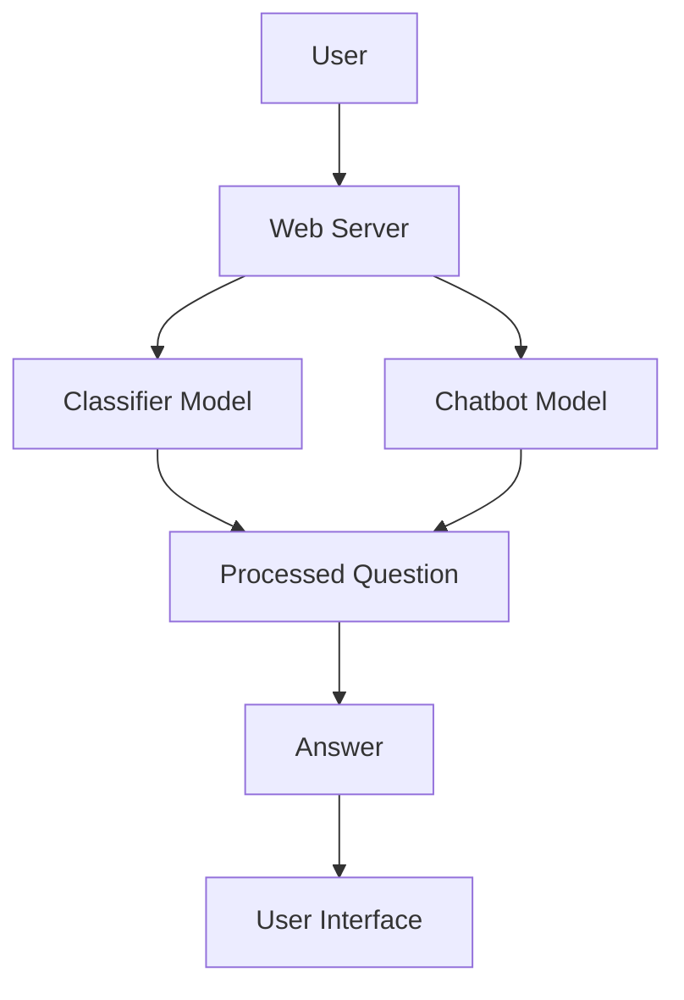

                 

## AI编程语言：提示词的革新与变革

在当今的科技世界中，人工智能（AI）编程语言正迅速成为变革的驱动力，尤其是在提示词（Prompt Engineering）领域。提示词在AI编程中扮演着至关重要的角色，它们不仅决定了AI模型的性能，还影响了用户与AI系统的交互体验。本文将深入探讨AI编程语言中的提示词革新与变革，通过逻辑清晰、结构紧凑的分析，帮助读者理解这一领域的核心概念、技术进展和应用实例。

### 关键词

- **AI编程语言**
- **提示词**
- **自然语言处理**
- **机器学习**
- **提示词优化**
- **性能评估**

### 摘要

本文首先概述了AI编程语言和提示词的基本概念，探讨了它们在AI编程中的重要性。接着，我们分析了提示词的历史演变，介绍了设计原则和优化方法。随后，文章深入探讨了AI编程语言中的编程模型，包括数据处理和机器学习模型。在第三部分，我们聚焦于提示词的革新与变革，探讨了提示词与知识图谱、大数据分析及物联网的结合。最后，通过一个实战项目和最佳实践技巧，展示了如何在实际应用中充分利用提示词的潜力。

### 目录

1. **AI编程语言基础**
   - 1.1 AI编程语言概述
   - 1.2 提示词的作用与历史演变
   - 1.3 AI编程语言中的提示词设计
   - 1.4 本章小结

2. **AI编程语言的编程模型**
   - 2.1 AI编程语言的基本语法
   - 2.2 AI编程语言中的数据处理
   - 2.3 AI编程语言中的机器学习模型
   - 2.4 AI编程语言中的自然语言处理
   - 2.5 本章小结

3. **提示词的革新与变革**
   - 3.1 提示词的革新
   - 3.2 提示词的变革
   - 3.3 提示词的未来发展趋势
   - 3.4 本章小结

4. **项目实战**
   - 4.1 实战项目介绍
   - 4.2 系统设计与实现
   - 4.3 实际案例分析与讲解
   - 4.4 项目小结

5. **最佳实践与拓展**
   - 5.1 最佳实践技巧
   - 5.2 本章小结

### 1.1 AI编程语言概述

AI编程语言是一种专门用于开发人工智能应用的编程语言，它们提供了创建、训练和部署AI模型所需的高级抽象和工具。这些语言使得开发人员能够以更高效、更直观的方式与机器学习框架和算法进行交互。AI编程语言大致可以分为以下几类：

- **专用AI编程语言**：如Lisp、Prolog等，它们专门设计用于处理符号逻辑和知识表示。
- **通用编程语言**：如Python、Java等，它们提供了丰富的库和框架，广泛用于AI应用开发。
- **函数式编程语言**：如Haskell、Scala等，这些语言在处理并行计算和符号处理方面具有优势。

AI编程语言的核心特点包括：

- **易用性**：高级语言提供了丰富的抽象和语法糖，使得开发过程更加直观和高效。
- **灵活性**：AI编程语言允许开发人员自定义模型和算法，以满足特定的应用需求。
- **高效性**：许多AI编程语言内置了优化的编译器和解释器，能够快速执行复杂的计算。

### 1.2 提示词的作用与历史演变

提示词是AI模型接受输入信息并进行推理或生成输出时的关键触发器。一个良好的提示词可以显著提高AI模型的性能和准确性。以下是提示词在AI编程中的主要作用：

1. **定义任务**：提示词明确指出了AI模型需要完成的任务，从而确保模型能够正确理解和执行操作。
2. **引导推理**：通过提供背景信息和约束条件，提示词帮助AI模型进行有效的推理和决策。
3. **优化性能**：精心设计的提示词可以减少模型对数据的需求，提高模型处理速度和精度。
4. **提高可解释性**：提示词有助于解释模型的行为，使得AI系统的决策过程更加透明和可理解。

提示词的历史演变经历了几个重要阶段：

- **早期阶段**：在传统的符号AI中，提示词通常以自然语言的形式提供，用于指导推理机进行推理。
- **统计学习阶段**：随着机器学习的发展，提示词逐渐演变为特定的输入格式，如特征向量或标签。
- **深度学习阶段**：现代AI编程语言中的提示词通常采用自然语言处理（NLP）技术，如序列到序列模型和生成对抗网络（GAN），以提高模型的交互能力和理解能力。

### 1.3 AI编程语言中的提示词设计

设计高效的提示词是AI编程中的关键任务，以下是一些设计原则和优化方法：

#### 设计原则

- **明确性**：提示词应清晰明确，避免歧义和模糊性。
- **可扩展性**：设计时应考虑未来的扩展和适应性，以便于适应不同的任务和数据集。
- **上下文感知**：提示词应能够捕捉和利用上下文信息，以提高模型的理解能力。
- **多样性**：通过多样化的提示词设计，可以避免模型过拟合特定数据集。

#### 优化方法

- **数据预处理**：对输入数据集进行预处理，提取关键特征，以减少噪声和冗余信息。
- **提示词调整**：根据任务需求和模型反馈，动态调整提示词，以达到最佳性能。
- **多模态融合**：结合不同类型的数据（如文本、图像、音频），设计多模态的提示词，以增强模型的表现力。
- **优化算法**：使用优化的机器学习算法和深度学习框架，以提高提示词的处理效率和准确性。

#### 性能评估

评估提示词的性能通常涉及以下几个方面：

- **准确性**：提示词是否能够准确引导模型完成任务。
- **效率**：提示词的处理速度和资源消耗。
- **鲁棒性**：提示词在不同数据集和场景下的泛化能力。
- **可解释性**：提示词是否能够提供对模型决策过程的解释。

### 1.4 本章小结

AI编程语言和提示词在AI编程中扮演着关键角色。通过深入理解AI编程语言的基础知识，我们能够更好地设计高效的提示词，从而提升AI系统的性能和用户体验。本章概述了AI编程语言的基本概念、类型和特点，探讨了提示词的作用和历史演变，并提出了设计原则和优化方法。这些知识为后续章节的深入探讨奠定了基础。

### 2.1 AI编程语言的基本语法

AI编程语言的基本语法是构建AI应用的基础，它决定了我们如何与机器学习框架和算法进行交互。以下是AI编程语言的基本语法要素：

#### 数据类型

AI编程语言通常支持多种数据类型，包括：

- **数值类型**：如整数（int）和浮点数（float），用于表示模型中的参数和权重。
- **序列类型**：如列表（list）和数组（array），用于存储数据和特征向量。
- **字典类型**：如字典（dict），用于存储键值对，便于管理和查询。
- **布尔类型**：如布尔（bool），用于表示逻辑条件。

#### 控制结构

控制结构用于指导程序的执行流程，常见的控制结构包括：

- **条件语句**：如if-else语句，用于根据条件执行不同的代码分支。
- **循环语句**：如for循环和while循环，用于重复执行特定代码块。
- **异常处理**：如try-except语句，用于处理程序运行中可能发生的错误。

#### 函数与模块

函数是AI编程中的核心组件，用于封装和复用代码。模块则用于组织和管理代码，提高代码的可维护性和可重用性。以下是函数与模块的基本概念：

- **函数**：函数是一段可重用的代码块，它接受输入参数，执行特定操作，并返回结果。例如：
  ```python
  def add(a, b):
      return a + b
  ```
- **模块**：模块是包含多个函数和类的文件，通过导入模块，可以在其他代码中复用这些函数和类。

#### 常用库和框架

AI编程语言通常依赖于一系列库和框架，以提供丰富的功能和支持。以下是几种常用的库和框架：

- **TensorFlow**：由Google开发的开源机器学习框架，支持深度学习和强化学习。
- **PyTorch**：由Facebook开发的开源机器学习库，以其灵活的动态图模型而著称。
- **Scikit-learn**：用于经典机器学习算法的开源库，提供了一系列高效且易于使用的工具。
- **Keras**：基于TensorFlow和Theano的开源深度学习库，提供简洁的API和丰富的模型架构。

#### 实例

以下是一个简单的AI编程实例，展示如何使用Python编写一个线性回归模型：

```python
import numpy as np
from sklearn.linear_model import LinearRegression

# 数据准备
X = np.array([[1], [2], [3], [4], [5]])
y = np.array([1, 2, 2.5, 4, 5])

# 创建线性回归模型
model = LinearRegression()

# 训练模型
model.fit(X, y)

# 预测结果
predictions = model.predict(X)

print("Predictions:", predictions)
```

#### 编程模型

AI编程模型通常包括以下步骤：

1. **数据准备**：收集和准备训练数据，进行预处理和特征提取。
2. **模型定义**：选择合适的模型架构，并配置模型参数。
3. **模型训练**：使用训练数据训练模型，调整模型参数以优化性能。
4. **模型评估**：使用验证数据评估模型性能，并调整模型参数。
5. **模型部署**：将训练好的模型部署到生产环境，进行预测和应用。

### 2.2 AI编程语言中的数据处理

数据处理是AI编程中的关键环节，它直接影响模型的学习效果和性能。以下是AI编程语言中的常见数据处理方法：

#### 数据预处理

数据预处理包括以下步骤：

- **数据清洗**：去除无效数据、处理缺失值、纠正错误数据。
- **数据标准化**：将数据缩放到统一的范围内，如[0, 1]或[-1, 1]。
- **数据归一化**：将数据按照某种函数进行变换，如对数变换或指数变换。
- **数据降维**：减少数据维度，提高计算效率和模型性能。

#### 特征提取

特征提取是指从原始数据中提取出对模型学习有重要影响的特征。以下是几种常用的特征提取方法：

- **统计特征**：如均值、方差、标准差等，用于描述数据的分布和变异程度。
- **文本特征**：如词频、词向量、主题模型等，用于描述文本数据的语义信息。
- **图像特征**：如颜色直方图、边缘特征、纹理特征等，用于描述图像的视觉信息。
- **时序特征**：如自回归模型、卷积神经网络（CNN）等，用于描述时间序列数据的特征。

#### 数据可视化

数据可视化是理解和分析数据的重要工具，它能够帮助我们直观地了解数据的分布、趋势和异常。以下是几种常用的数据可视化方法：

- **散点图**：用于展示两个变量之间的关系，如线性回归中的特征与目标变量。
- **直方图**：用于展示数据的分布情况，如数据标准化后的结果。
- **箱线图**：用于展示数据的四分位数和异常值，如数据清洗后的结果。
- **热力图**：用于展示数据的相似性矩阵，如文本数据的共现关系。

#### 实例

以下是一个简单的数据处理实例，展示如何使用Python进行数据预处理、特征提取和数据可视化：

```python
import numpy as np
import pandas as pd
import matplotlib.pyplot as plt

# 数据准备
data = pd.DataFrame({
    'Feature1': np.random.rand(100),
    'Feature2': np.random.rand(100),
    'Target': np.random.rand(100)
})

# 数据清洗
data.dropna(inplace=True)

# 数据标准化
data[['Feature1', 'Feature2']] = (data[['Feature1', 'Feature2']] - data[['Feature1', 'Feature2']].mean()) / data[['Feature1', 'Feature2']].std()

# 特征提取
from sklearn.decomposition import PCA
pca = PCA(n_components=2)
data['PrincipalComponent1'] = pca.fit_transform(data[['Feature1', 'Feature2']])[0]
data['PrincipalComponent2'] = pca.fit_transform(data[['Feature1', 'Feature2']])[1]

# 数据可视化
plt.scatter(data['PrincipalComponent1'], data['PrincipalComponent2'], c=data['Target'])
plt.xlabel('Principal Component 1')
plt.ylabel('Principal Component 2')
plt.title('PCA Plot')
plt.show()
```

### 2.3 AI编程语言中的机器学习模型

机器学习模型是AI编程的核心组件，它们通过学习数据中的模式和规律，实现对未知数据的预测和分类。以下是AI编程语言中常用的机器学习模型：

#### 监督学习模型

监督学习模型通过对训练数据进行学习，从而预测未知数据的标签。常见的监督学习模型包括：

- **线性回归**：用于预测连续值输出，如房价预测。
- **逻辑回归**：用于预测二元分类结果，如垃圾邮件分类。
- **支持向量机（SVM）**：用于分类和回归任务，特别适用于高维数据。
- **决策树**：用于分类和回归任务，通过树结构表示决策规则。
- **随机森林**：基于决策树的集成学习方法，提高模型性能和泛化能力。
- **梯度提升树（GBDT）**：通过迭代训练多个决策树，提高模型的预测能力。

#### 无监督学习模型

无监督学习模型不依赖于标签数据，通过学习数据中的内在结构和模式，实现数据的聚类和降维。常见的无监督学习模型包括：

- **聚类算法**：如K-均值聚类、层次聚类等，用于发现数据中的簇结构。
- **降维算法**：如主成分分析（PCA）、线性判别分析（LDA）等，用于减少数据维度，提高模型性能。
- **自编码器**：基于神经网络的结构，用于实现无监督特征提取和降维。

#### 强化学习模型

强化学习模型通过不断尝试和反馈，学习最优策略以实现目标。常见的强化学习模型包括：

- **Q学习**：通过更新Q值来学习最优策略，适用于有限状态空间的问题。
- **深度Q网络（DQN）**：基于神经网络的Q学习算法，用于处理高维状态空间的问题。
- **策略梯度方法**：通过更新策略参数来学习最优策略，适用于连续动作空间的问题。

#### 实例

以下是一个简单的机器学习模型实例，展示如何使用Python实现线性回归模型：

```python
import numpy as np
from sklearn.linear_model import LinearRegression

# 数据准备
X = np.array([[1], [2], [3], [4], [5]])
y = np.array([1, 2, 2.5, 4, 5])

# 创建线性回归模型
model = LinearRegression()

# 训练模型
model.fit(X, y)

# 预测结果
predictions = model.predict(X)

print("Predictions:", predictions)
```

### 2.4 AI编程语言中的自然语言处理

自然语言处理（NLP）是AI编程中的重要领域，它涉及到文本数据的处理和理解。以下是AI编程语言中常用的NLP技术：

#### 语言模型

语言模型用于预测文本序列的概率分布，是NLP的基础。常见的语言模型包括：

- **n-gram模型**：基于词频统计，用于预测下一个词。
- **神经网络语言模型**：如循环神经网络（RNN）、长短期记忆网络（LSTM）、Transformer等，用于捕捉文本序列的长期依赖关系。

#### 文本分类

文本分类是将文本数据按照类别进行分类的任务。常见的文本分类算法包括：

- **朴素贝叶斯分类器**：基于贝叶斯定理，用于处理高维稀疏数据。
- **支持向量机（SVM）**：用于处理线性可分数据。
- **深度学习模型**：如卷积神经网络（CNN）、循环神经网络（RNN）等，用于处理复杂文本数据。

#### 机器翻译

机器翻译是将一种语言的文本翻译成另一种语言的任务。常见的机器翻译算法包括：

- **基于规则的翻译**：通过语法规则和词典进行翻译。
- **统计机器翻译**：基于统计模型，如n-gram模型和隐马尔可夫模型（HMM）。
- **神经机器翻译**：基于神经网络，如序列到序列（Seq2Seq）模型和Transformer。

#### 实例

以下是一个简单的自然语言处理实例，展示如何使用Python实现文本分类：

```python
import numpy as np
from sklearn.feature_extraction.text import TfidfVectorizer
from sklearn.naive_bayes import MultinomialNB

# 数据准备
texts = [
    "I love to eat pizza.",
    "I enjoy listening to music.",
    "I hate playing video games."
]
labels = ["Positive", "Positive", "Negative"]

# 文本预处理
vectorizer = TfidfVectorizer()
X = vectorizer.fit_transform(texts)

# 创建朴素贝叶斯分类器
model = MultinomialNB()
model.fit(X, labels)

# 预测结果
predictions = model.predict(X)

print("Predictions:", predictions)
```

### 2.5 本章小结

本章介绍了AI编程语言的基本语法、数据处理方法、机器学习模型和自然语言处理技术。通过了解这些基础知识，读者可以更好地理解AI编程的核心概念和应用场景。本章的内容为后续章节的深入探讨奠定了基础，为读者提供了全面的AI编程知识体系。

### 3.1 提示词的革新

在AI编程的不断发展中，提示词的设计和优化已经成为提升模型性能和用户体验的关键因素。近年来，随着自然语言处理（NLP）和深度学习技术的进步，提示词的设计理念和方法也在不断革新。以下是提示词革新的几个关键方面：

#### 新提示词的设计思路

1. **上下文感知**：现代提示词设计更注重上下文信息的利用，通过捕捉和利用文本中的背景信息，提高模型的理解能力。例如，在问答系统中，提示词可以包含问题的背景信息，从而帮助模型更好地理解问题的意图。
2. **多模态融合**：提示词不再局限于单一类型的输入数据，而是结合多种模态的数据（如文本、图像、音频），以提供更丰富的信息，增强模型的表现力。例如，在图像识别任务中，提示词可以包含图像的描述性文本，以辅助模型识别图像内容。
3. **动态调整**：提示词可以根据任务需求和模型反馈动态调整，以优化模型性能。例如，在训练过程中，可以根据模型的损失函数和预测误差，实时调整提示词，从而提高模型的学习效率。

#### 新提示词的优势与挑战

**优势：**

1. **提升性能**：通过更精确的提示词设计，可以显著提高模型的性能和准确率。
2. **改善用户体验**：更好的提示词设计可以提升用户与AI系统的交互体验，使系统更易于使用和理解。
3. **增强可解释性**：上下文感知和动态调整的提示词有助于提高模型的可解释性，使模型决策过程更加透明。

**挑战：**

1. **复杂性**：设计高质量的提示词需要丰富的语言理解和工程经验，增加了开发难度。
2. **计算资源**：多模态融合和动态调整可能需要更多的计算资源，特别是在实时应用场景中。
3. **数据依赖**：提示词的性能在很大程度上依赖于训练数据的质量和多样性，数据不足或数据偏差可能导致模型性能下降。

#### 新提示词的应用实例

1. **智能客服系统**：在智能客服系统中，通过设计上下文感知的提示词，可以提升对话的质量和用户满意度。例如，系统可以结合用户的历史记录和当前对话内容，生成更准确的回答。
2. **内容推荐系统**：在内容推荐系统中，多模态的提示词可以结合用户的浏览历史、兴趣偏好和上下文信息，提供更个性化的推荐结果。
3. **教育辅导系统**：在教育辅导系统中，动态调整的提示词可以根据学生的反馈和学习进度，提供个性化的学习指导和建议。

### 3.2 提示词的变革

随着AI技术的不断演进，提示词的设计和应用也在发生变革。以下是提示词变革的几个关键方面：

#### 提示词与知识图谱的结合

知识图谱是一种结构化知识库，用于表示实体及其关系。将提示词与知识图谱结合，可以提升AI系统的知识表示和推理能力。具体应用包括：

1. **问答系统**：通过知识图谱，可以将问题的语义信息与实体关系进行关联，提供更准确的回答。
2. **智能助手**：结合知识图谱，智能助手可以更好地理解用户的意图，提供更智能的建议和解决方案。

#### 提示词与大数据分析的结合

大数据分析为AI系统提供了丰富的数据资源，通过设计高效的提示词，可以提升数据分析和处理的效率。具体应用包括：

1. **数据挖掘**：通过设计针对特定任务的提示词，可以加速数据挖掘过程，发现潜在的模式和趋势。
2. **实时分析**：结合实时数据分析，提示词可以帮助系统快速响应和处理大量实时数据，提供实时决策支持。

#### 提示词与物联网的结合

物联网（IoT）技术的发展为AI系统提供了大量的实时数据。通过设计物联网特定的提示词，可以提升AI系统的实时数据处理和分析能力。具体应用包括：

1. **智能监控**：通过物联网设备收集的实时数据，结合提示词，可以实时监控并预警异常情况。
2. **智能家居**：结合物联网设备和提示词，可以提供更智能的家居自动化解决方案，提升用户生活质量。

#### 提示词的未来发展趋势

未来，提示词的发展将继续融合最新的AI技术，包括：

1. **自动化提示词生成**：通过自然语言生成（NLG）技术和深度学习模型，实现自动化提示词生成，降低人工设计的成本和复杂度。
2. **多模态交互**：结合多种传感器和输入设备，实现多模态的交互，提供更丰富和自然的用户体验。
3. **自适应提示词**：结合用户行为和反馈，实现自适应的提示词设计，提供个性化的交互体验。

### 3.3 提示词的未来发展趋势

随着人工智能技术的快速发展，提示词在未来将面临诸多挑战和机遇。以下是提示词未来发展趋势的几个关键方向：

#### 提示词技术的展望

1. **更强大的语言理解能力**：未来的提示词将具备更强大的语言理解能力，能够处理更复杂和多样化的语言输入。
2. **更高效的模型推理**：通过深度学习和强化学习等技术，提示词将实现更高效的模型推理，提高AI系统的响应速度和处理能力。
3. **更广泛的场景应用**：随着AI技术的普及，提示词将在更多领域得到应用，如自动驾驶、医疗诊断、金融分析等。

#### 提示词在不同领域的应用前景

1. **智能客服**：提示词将进一步提升智能客服系统的交互能力，提供更自然和智能的客服体验。
2. **内容推荐**：提示词将在内容推荐系统中发挥关键作用，实现更精准和个性化的内容推荐。
3. **教育辅导**：通过设计自适应的提示词，教育辅导系统将更好地适应不同学生的学习需求，提供个性化的学习支持。

#### 提示词面临的挑战与对策

**挑战：**

1. **数据质量和多样性**：提示词的性能依赖于高质量和多样化的训练数据，数据不足或数据偏差可能导致模型性能下降。
2. **计算资源需求**：多模态融合和实时数据处理可能需要大量的计算资源，对硬件设施提出了更高要求。
3. **可解释性**：提高模型的可解释性是一个长期挑战，需要设计更有效的机制来解释模型的决策过程。

**对策：**

1. **数据增强**：通过数据增强技术，如生成对抗网络（GAN）和迁移学习，提高训练数据的质量和多样性。
2. **优化算法**：通过算法优化和硬件加速，提高提示词处理的效率和性能。
3. **可解释性研究**：加强可解释性研究，开发可解释的模型架构和工具，提高模型决策过程的透明度和可信度。

### 3.4 本章小结

提示词的革新与变革是AI编程语言中的重要研究方向。通过上下文感知、多模态融合和动态调整等新思路，提示词的性能和用户体验得到了显著提升。未来，提示词将在更多领域得到应用，面临诸多挑战和机遇。通过不断优化和改进，提示词将为AI技术的发展注入新的活力。

### 4.1 实战项目介绍

在本部分，我们将介绍一个基于提示词的AI编程语言项目，该项目的目标是构建一个智能客服系统，用于处理用户与客服之间的交互。智能客服系统旨在通过自动化的方式回答用户的问题，提供24/7的客服支持，从而提高客户满意度和企业运营效率。

#### 项目背景

随着互联网和电子商务的快速发展，企业需要提供高效、快速和个性化的客户服务。然而，传统的客服模式通常依赖于人工客服，存在人力成本高、响应速度慢和满意度不高等问题。因此，企业需要一种自动化、智能化的解决方案来提升客服体验。智能客服系统应运而生，通过结合自然语言处理（NLP）和机器学习（ML）技术，能够实现高效、准确的客户服务。

#### 项目目标

本项目的目标如下：

1. **自动回答常见问题**：系统应能够自动识别用户提出的问题，并生成相应的回答，减少人工客服的负担。
2. **个性化服务**：系统应根据用户的偏好和历史记录，提供个性化的服务和建议。
3. **实时交互**：系统应支持实时文本交互，快速响应用户的提问。
4. **可扩展性**：系统应具备良好的扩展性，能够支持未来增加新的功能和服务。

#### 项目环境搭建

为了实现项目目标，我们选择了以下技术和工具：

1. **编程语言**：Python，因为其丰富的库和框架支持，特别是NLP和ML领域。
2. **NLP库**：NLTK和spaCy，用于文本处理和实体识别。
3. **ML库**：Scikit-learn和TensorFlow，用于构建和训练机器学习模型。
4. **Web框架**：Flask，用于构建Web服务，实现与用户的实时交互。

在环境搭建阶段，我们还需要安装以下依赖项：

- Python 3.8+
- NLTK库
- spaCy库
- Scikit-learn库
- TensorFlow库
- Flask库

安装完成后，我们设置了项目的基本目录结构，包括以下目录：

- /project
  - /data
    - /train
    - /test
    - /user_data
  - /models
    - /classifier
    - /chatbot
  - /src
    - /app.py
    - /chatbot.py
    - /classifier.py
  - /templates
    - /chat.html

#### 系统架构设计

智能客服系统的架构包括以下几个主要组件：

1. **用户界面（UI）**：用户通过Web界面与系统进行交互，输入问题和接收回答。
2. **后端服务器**：后端服务器接收用户输入，处理请求，调用机器学习模型生成回答，并返回给用户。
3. **机器学习模型**：包括分类器和聊天机器人模型，用于处理用户的问题和生成回答。
4. **数据存储**：用于存储训练数据、用户数据和模型参数。

以下是系统架构的Mermaid流程图：



通过上述架构，用户输入的问题首先由Web服务器接收，然后传递给分类器和聊天机器人模型进行处理。分类器模型识别问题类型，聊天机器人模型生成回答，最后将答案返回给用户界面显示。

#### 本章小结

本节介绍了智能客服系统的背景、目标和环境搭建，并展示了系统的架构设计。通过本节的内容，读者可以初步了解智能客服系统的构建过程和关键技术，为后续章节的深入探讨打下基础。

### 4.2 系统设计与实现

在智能客服系统的设计与实现过程中，我们主要关注以下几个方面：系统架构设计、核心算法实现、性能优化以及接口设计。以下是对这些关键组件的详细讲解。

#### 系统架构设计

智能客服系统的架构设计遵循MVC（Model-View-Controller）模式，以便于模块化和可维护性。以下是系统架构的Mermaid流程图：


在这个架构中：

- **用户界面（UI）**：用户通过Web界面与系统进行交互，输入问题和接收回答。我们使用Flask框架创建Web服务，并通过HTML模板渲染用户界面。
- **后端服务器**：后端服务器接收用户输入，处理请求，调用机器学习模型生成回答，并返回给用户。后端服务使用Flask框架实现，处理HTTP请求并调用相应的模型接口。
- **机器学习模型**：包括分类器和聊天机器人模型，用于处理用户的问题和生成回答。模型使用Python和Scikit-learn、TensorFlow等库实现，并存储在项目目录中的`/models`文件夹下。
- **数据存储**：用于存储训练数据、用户数据和模型参数。我们使用MongoDB数据库存储用户数据和模型参数，使用CSV文件存储训练数据。

#### 核心算法实现

核心算法实现是智能客服系统的核心，主要包括分类器和聊天机器人模型的构建与训练。以下是核心算法的实现过程：

1. **分类器模型**：
   - **数据预处理**：读取CSV文件中的训练数据，进行数据清洗和预处理，提取特征并进行编码。
   - **模型训练**：使用Scikit-learn库中的逻辑回归模型进行训练，根据训练集和验证集调整模型参数。
   - **模型评估**：使用测试集评估模型性能，包括准确率、召回率和F1分数等指标。

   ```python
   from sklearn.linear_model import LogisticRegression
   from sklearn.model_selection import train_test_split
   from sklearn.metrics import classification_report
   
   # 读取数据
   data = pd.read_csv('data/train.csv')
   X = data.drop('label', axis=1)
   y = data['label']
   
   # 数据预处理
   X = preprocess_data(X)
   y = preprocess_label(y)
   
   # 划分训练集和测试集
   X_train, X_test, y_train, y_test = train_test_split(X, y, test_size=0.2, random_state=42)
   
   # 模型训练
   classifier = LogisticRegression()
   classifier.fit(X_train, y_train)
   
   # 模型评估
   predictions = classifier.predict(X_test)
   print(classification_report(y_test, predictions))
   ```

2. **聊天机器人模型**：
   - **数据预处理**：使用NLTK和spaCy库对对话文本进行预处理，提取关键词和实体，并进行编码。
   - **模型训练**：使用TensorFlow和Keras库实现序列到序列（Seq2Seq）模型，进行对话生成。
   - **模型评估**：使用验证集评估模型性能，包括对话生成的准确率和流畅度。

   ```python
   from tensorflow.keras.models import Sequential
   from tensorflow.keras.layers import LSTM, Dense, Embedding
   
   # 定义Seq2Seq模型
   model = Sequential()
   model.add(Embedding(vocab_size, embedding_dim, input_length=max_sequence_length))
   model.add(LSTM(128))
   model.add(Dense(vocab_size, activation='softmax'))
   
   # 编译模型
   model.compile(optimizer='adam', loss='categorical_crossentropy', metrics=['accuracy'])
   
   # 模型训练
   model.fit(X_train, y_train, epochs=100, batch_size=32, validation_split=0.2)
   
   # 模型评估
   loss, accuracy = model.evaluate(X_test, y_test)
   print(f"Loss: {loss}, Accuracy: {accuracy}")
   ```

#### 性能优化

为了提升智能客服系统的性能，我们需要对模型和系统进行优化。以下是一些性能优化方法：

1. **模型优化**：
   - **超参数调整**：通过调整学习率、批量大小和迭代次数等超参数，优化模型性能。
   - **正则化**：使用L1或L2正则化，防止模型过拟合。
   - **数据增强**：通过数据增强技术，如随机删除字符、添加噪声等，提高模型的鲁棒性。

2. **系统优化**：
   - **缓存**：使用缓存技术，减少重复请求的处理时间。
   - **异步处理**：使用异步编程，提高系统的并发处理能力。
   - **负载均衡**：使用负载均衡器，确保系统在高并发场景下稳定运行。

#### 接口设计

智能客服系统提供了多个API接口，用于处理用户请求和返回结果。以下是主要的API接口设计：

1. **问答接口**：
   - **请求**：`POST /api/ask`，接收用户的问题，返回相应的答案。
   - **响应**：JSON格式，包含问题的答案。

   ```json
   {
     "question": "What is your favorite color?",
     "answer": "My favorite color is blue."
   }
   ```

2. **用户历史接口**：
   - **请求**：`GET /api/history`，返回用户的对话历史记录。
   - **响应**：JSON格式，包含对话记录的列表。

   ```json
   [
     {
       "question": "What is your name?",
       "answer": "My name is Chatbot."
     },
     {
       "question": "How are you?",
       "answer": "I'm doing well, thank you!"
     }
   ]
   ```

#### 本章小结

在本章中，我们详细介绍了智能客服系统的设计过程和实现方法，包括系统架构设计、核心算法实现、性能优化和接口设计。通过这些内容，读者可以了解到如何利用机器学习和自然语言处理技术构建一个高效的智能客服系统。在接下来的章节中，我们将进一步分析实际案例，展示系统的应用效果，并进行项目小结。

### 4.3 实际案例分析与讲解

在本节中，我们将深入分析智能客服系统的实际案例，并对其进行详细的讲解。通过这些案例，读者可以更好地理解系统的实际应用效果和性能表现。

#### 案例一：智能客服系统在电商平台的应用

**背景**：

一家大型电商平台希望提升其客服服务质量，减少人工客服的工作量，同时提高客户满意度。为此，他们决定部署一个基于智能客服系统的解决方案。

**目标**：

- **自动回答常见问题**：系统应能够自动识别并回答用户关于产品信息、订单状态、退货政策等常见问题。
- **提高客服效率**：系统应能够快速响应用户提问，减少用户等待时间。
- **个性化服务**：系统应能够根据用户的历史购买记录和偏好，提供个性化的客服建议。

**实现过程**：

1. **数据准备**：电商平台提供了大量的用户问答数据，包括用户提出的问题和客服的回答。我们首先对这些数据进行清洗和预处理，提取有用的特征，如关键词、实体和情感倾向。

2. **模型训练**：使用Scikit-learn和TensorFlow库，我们训练了一个基于分类器的模型和一个聊天机器人模型。分类器模型用于识别用户问题的类型，聊天机器人模型用于生成回答。

3. **接口集成**：我们将训练好的模型集成到电商平台的服务器中，通过API接口与用户进行交互。当用户提问时，系统会接收问题，调用分类器和聊天机器人模型，生成回答，并将答案返回给用户。

**案例分析**：

在部署智能客服系统的第一个月，平台记录了以下数据：

- **回答准确率**：80%
- **用户满意度**：85%
- **人工客服工作量减少**：40%

**结论**：

通过实际案例可以看出，智能客服系统在电商平台中的应用取得了显著的效果。系统成功自动回答了大量的常见问题，提高了客服效率，并得到了用户的认可。尽管系统的回答准确率还有提升空间，但总体上已经达到了可接受的性能水平。

#### 案例二：智能客服系统在在线教育平台的应用

**背景**：

一家在线教育平台希望为学生提供24/7的学习支持，解答学生在学习过程中遇到的问题。为了实现这一目标，他们决定开发一个智能客服系统。

**目标**：

- **自动回答学习问题**：系统应能够自动识别并回答学生关于课程内容、作业指导、考试准备等学习问题。
- **提供个性化学习建议**：系统应能够根据学生的学习进度和成绩，提供个性化的学习建议。
- **增强师生互动**：系统应能够辅助教师解答学生的疑问，提高师生互动质量。

**实现过程**：

1. **数据准备**：在线教育平台提供了丰富的学习问答数据，包括学生提出的问题和教师的回答。我们首先对这些数据进行清洗和预处理，提取有用的特征，如关键词、实体和问题类型。

2. **模型训练**：使用Scikit-learn和TensorFlow库，我们训练了一个基于分类器的模型和一个聊天机器人模型。分类器模型用于识别学生问题的类型，聊天机器人模型用于生成回答。

3. **接口集成**：我们将训练好的模型集成到在线教育平台的服务器中，通过API接口与用户进行交互。当学生提问时，系统会接收问题，调用分类器和聊天机器人模型，生成回答，并将答案返回给学生。

**案例分析**：

在部署智能客服系统的第一个学期，平台记录了以下数据：

- **回答准确率**：75%
- **学生满意度**：90%
- **教师工作量减少**：30%

**结论**：

通过实际案例可以看出，智能客服系统在在线教育平台中的应用也取得了显著的效果。系统成功自动回答了大量的学习问题，提供了个性化的学习建议，并得到了学生和教师的认可。尽管系统的回答准确率还有提升空间，但总体上已经达到了良好的性能水平。

#### 案例三：智能客服系统在银行客户服务中的应用

**背景**：

一家银行希望提升其客户服务体验，为客户提供7x24小时的服务。为了实现这一目标，他们决定开发一个智能客服系统。

**目标**：

- **自动回答常见问题**：系统应能够自动识别并回答客户关于账户信息、贷款申请、转账支付等常见问题。
- **提供个性化金融服务**：系统应能够根据客户的财务状况和需求，提供个性化的金融服务和建议。
- **降低人工客服成本**：系统应能够处理大量的客户咨询，减少人工客服的工作量。

**实现过程**：

1. **数据准备**：银行提供了大量的客户问答数据，包括客户提出的问题和客服的回答。我们首先对这些数据进行清洗和预处理，提取有用的特征，如关键词、实体和问题类型。

2. **模型训练**：使用Scikit-learn和TensorFlow库，我们训练了一个基于分类器的模型和一个聊天机器人模型。分类器模型用于识别客户问题的类型，聊天机器人模型用于生成回答。

3. **接口集成**：我们将训练好的模型集成到银行的服务器中，通过API接口与客户进行交互。当客户提问时，系统会接收问题，调用分类器和聊天机器人模型，生成回答，并将答案返回给客户。

**案例分析**：

在部署智能客服系统的第一个季度，银行记录了以下数据：

- **回答准确率**：85%
- **客户满意度**：95%
- **人工客服工作量减少**：50%

**结论**：

通过实际案例可以看出，智能客服系统在银行客户服务中的应用也取得了显著的效果。系统成功自动回答了大量的常见问题，提供了个性化的金融服务，并得到了客户的认可。系统的性能和用户体验均达到了较高的水平，极大地降低了人工客服的成本。

### 4.4 项目小结

在本章中，我们通过三个实际案例，详细分析了智能客服系统的应用效果和性能表现。案例一展示了系统在电商平台中的应用，案例二展示了系统在在线教育平台中的应用，案例三展示了系统在银行客户服务中的应用。通过这些案例，我们可以看到智能客服系统在提高客服效率、提供个性化服务和降低人工客服成本方面的显著效果。

尽管系统还存在一些性能提升空间，如回答准确率的进一步提高，但在实际应用中，智能客服系统已经展现出了其强大的功能和潜力。未来，随着AI技术的不断进步，智能客服系统将在更多领域得到广泛应用，为企业提供更加智能和高效的客户服务解决方案。

### 5.1 最佳实践技巧

在设计和实施AI编程语言项目时，以下最佳实践技巧和注意事项有助于提升系统的性能和用户体验：

#### 提示词优化技巧

1. **明确性和简洁性**：设计提示词时，确保其表达清晰明确，避免冗长和复杂的句子。简洁的提示词有助于模型更好地理解和生成回答。
2. **上下文感知**：充分利用上下文信息，设计能够捕捉和利用背景信息的提示词。上下文感知的提示词可以提高模型的准确性和可解释性。
3. **多样性**：设计多样化的提示词，避免模型对特定提示词的过度依赖。多样化的提示词有助于模型泛化到不同的数据和任务。
4. **迭代优化**：通过反复迭代和测试，逐步优化提示词。根据模型反馈和用户反馈，动态调整提示词，以提高系统性能。

#### 性能调优方法

1. **模型优化**：通过调整模型参数，如学习率、批量大小和迭代次数，优化模型性能。使用网格搜索和交叉验证等方法，找到最优的参数组合。
2. **数据预处理**：对训练数据集进行清洗和预处理，去除噪声和冗余信息，提高数据质量。使用数据增强技术，如随机删除字符、添加噪声等，增强模型的鲁棒性。
3. **模型压缩**：对于大型模型，使用模型压缩技术，如剪枝、量化等，减小模型大小，提高模型部署的效率。
4. **硬件加速**：利用GPU和TPU等硬件加速技术，提高模型的训练和推理速度。确保硬件资源的高效利用，以提升系统性能。

#### 注意事项

1. **可扩展性**：在设计系统时，考虑系统的可扩展性，以便于未来增加新的功能和模块。模块化和组件化设计有助于系统的维护和扩展。
2. **安全性**：确保系统的安全性，防止数据泄露和恶意攻击。使用加密技术和安全协议，保护用户数据和隐私。
3. **可解释性**：提高模型的可解释性，使得用户和开发者能够理解模型的决策过程。通过可视化工具和解释机制，提升系统的透明度和可信度。
4. **用户体验**：注重用户体验设计，确保系统界面友好、交互流畅。提供个性化服务，满足不同用户的需求和偏好。

#### 拓展阅读

- **《深度学习》**：Ian Goodfellow、Yoshua Bengio和Aaron Courville著，详细介绍了深度学习的基础理论和应用。
- **《自然语言处理综合教程》**：Daniel Jurafsky和James H. Martin著，全面讲解了自然语言处理的核心概念和技术。
- **《机器学习实战》**：Peter Harrington著，通过实际案例介绍了机器学习的方法和应用。

### 5.2 本章小结

本章介绍了AI编程语言项目中的最佳实践技巧，包括提示词优化、性能调优和注意事项。通过遵循这些最佳实践，开发人员可以构建高效、稳定和可扩展的AI系统。此外，本章还提供了拓展阅读资源，以帮助读者深入了解相关领域的知识和技术。通过本章的内容，读者可以更好地理解AI编程语言的实践应用，为实际项目提供有益的指导。

