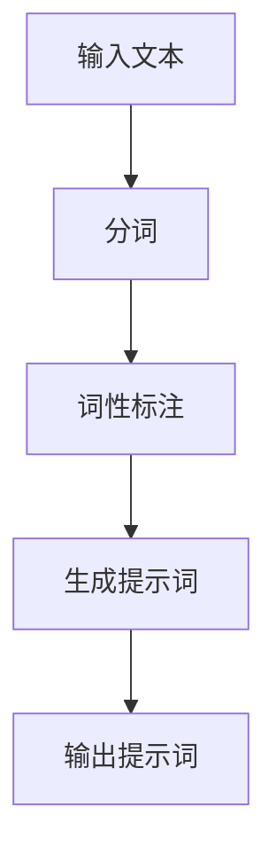
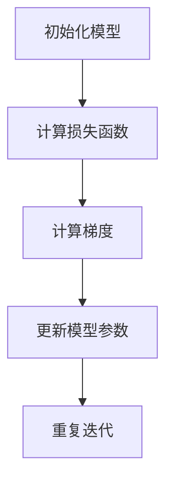
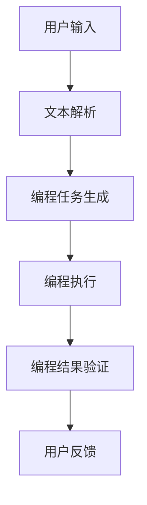
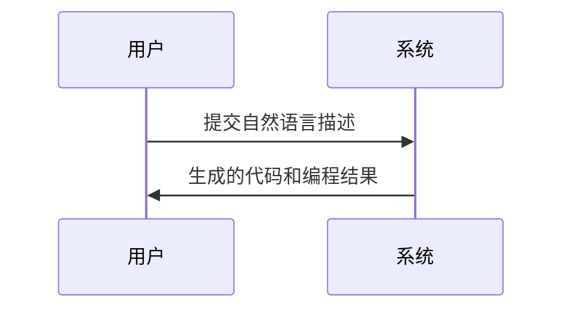
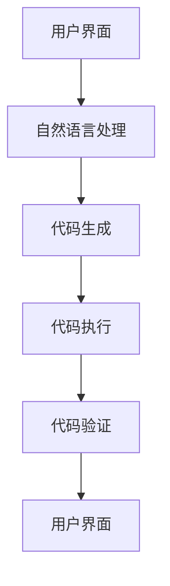
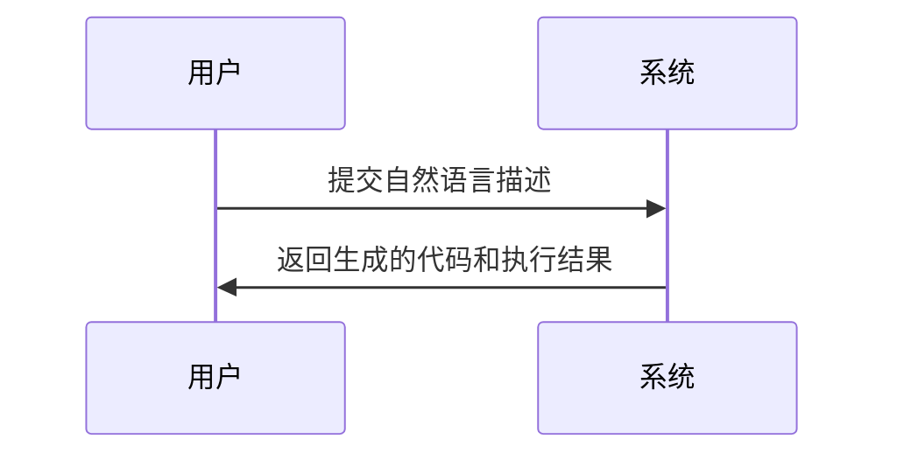
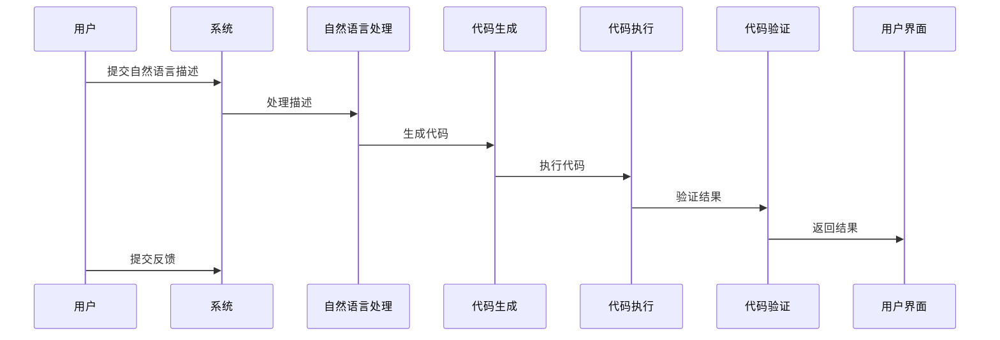

                 


## AI编程语言：提示词的革新与魔法

### 关键词：AI编程语言、提示词、算法、数学模型、系统架构、项目实战

#### 摘要：

本文将深入探讨AI编程语言的革命性创新——提示词。我们将首先介绍AI编程语言的起源和发展，随后详细解释提示词的概念及其在AI编程语言中的作用。接着，我们将深入分析AI编程语言的核心概念和算法原理，并借助Python代码和数学模型进行详细阐述。随后，我们将描述AI编程语言系统的应用场景和架构设计方案。文章将结合实际项目实战，展示如何安装、实现和剖析AI编程语言系统。最后，我们将总结最佳实践，并提出进一步阅读的建议。

### 第一部分：AI编程语言基础

#### 第1章：AI编程语言的起源与发展

##### 1.1 AI编程语言的发展历程

人工智能（AI）的概念最早可以追溯到20世纪50年代。随着计算机技术的发展，人工智能的研究和应用逐渐深入。从最初的符号逻辑推理、专家系统，到今天的深度学习和神经网络，AI编程语言也在不断进化。AI编程语言的出现，标志着编程领域的重大变革，使得开发者能够更高效地与机器智能进行交互。

##### 1.2 提示词在AI编程语言中的作用

提示词（Prompts）是AI编程语言中的一个关键概念。它不仅提供了编程任务的起始点，还能够引导AI系统进行有效的学习和推理。在传统的编程语言中，提示词的概念并不存在，而AI编程语言的强大之处就在于能够利用提示词实现自动化编程和智能化任务执行。

##### 1.3 AI编程语言与传统编程语言的对比

与传统编程语言相比，AI编程语言在语法、语义和执行方式上都有显著不同。传统编程语言通常依赖于明确的指令和逻辑结构，而AI编程语言则更加灵活，能够处理不确定性和复杂性。同时，AI编程语言更加强调数据的表示和模型的训练，这使得它们在处理大数据和复杂任务时具有明显优势。

### 第二部分：核心概念与算法

#### 第2章：AI编程语言的核心概念

##### 2.1 AI编程语言的基本原理

AI编程语言的基本原理涉及多个领域，包括机器学习、自然语言处理和计算机视觉。这些原理共同构成了AI编程语言的核心框架，使得开发者能够利用AI技术解决复杂的编程问题。

##### 2.2 AI编程语言的组成部分

AI编程语言通常由以下几个组成部分构成：数据预处理模块、模型训练模块、推理模块和执行模块。每个部分都承担着不同的功能，共同实现了AI编程语言的自动化和智能化。

##### 2.3 AI编程语言与现有编程语言的比较

AI编程语言与现有编程语言在多个方面存在差异。传统编程语言通常关注程序的结构和逻辑，而AI编程语言则更加关注数据的表示和模型的训练。此外，AI编程语言还引入了提示词的概念，使得编程过程更加灵活和高效。

### 第三部分：关键算法原理与实现

#### 第3章：关键算法原理与实现

##### 3.1 提示词生成算法

提示词生成算法是AI编程语言中的一个核心算法。它通过分析用户输入，自动生成合适的提示词，以引导AI系统进行编程任务。以下是提示词生成算法的Python代码实现：

```python
import nltk

def generate_prompt(input_text):
    tokens = nltk.word_tokenize(input_text)
    tagged = nltk.pos_tag(tokens)
    prompt = " ".join([word for word, tag in tagged if tag.startswith('VB')])
    return prompt

input_text = "设计一个数据库模型来存储用户信息"
prompt = generate_prompt(input_text)
print(prompt)
```

##### 3.1.1 提示词生成算法流程图



##### 3.1.2 Python代码实现

在上面的代码中，我们首先使用nltk库进行文本分词和词性标注，然后根据词性标注生成提示词。

##### 3.1.3 数学模型与公式解释

提示词生成算法的核心在于词性标注。词性标注可以使用条件概率模型，如HMM（隐马尔可夫模型）或CRF（条件随机场）。以下是一个简单的条件概率模型公式：

$$
P(V|W) = \frac{P(W|V)P(V)}{P(W)}
$$

其中，$V$ 表示词性，$W$ 表示单词。$P(W|V)$ 表示在给定词性$V$的情况下，单词$W$的出现概率，$P(V)$ 表示词性$V$的出现概率，$P(W)$ 表示单词$W$的出现概率。

##### 3.1.4 举例说明

假设我们有一个简单的单词和词性标注表：

| 单词 | 词性 |
|------|------|
| 设计 | VB   |
| 一个 | DT   |
| 数据库 | NN   |
| 模型 | NN   |
| 来 | RB   |
| 存储 | VB   |
| 用户 | NN   |
| 信息 | NN   |

使用上述公式，我们可以计算每个单词作为提示词的概率。例如，单词“设计”作为提示词的概率为：

$$
P(VB|设计) = \frac{P(设计|VB)P(VB)}{P(设计)}
$$

我们可以通过统计语料库得到$P(设计|VB)$ 和$P(VB)$ 的值，然后计算得到$P(VB|设计)$。

##### 3.2 优化算法

优化算法是AI编程语言中的另一个关键算法。它用于调整模型的参数，以获得更好的编程性能。以下是一个简单的优化算法示例：

```python
import numpy as np

def optimize_model(model, loss_function, learning_rate):
    gradients = loss_function.compute_gradients(model)
    model.parameters -= learning_rate * gradients
    return model
```

##### 3.2.1 优化算法流程图



##### 3.2.2 Python代码实现

在上面的代码中，我们首先计算模型的梯度，然后使用梯度下降算法更新模型参数。

##### 3.2.3 数学模型与公式解释

优化算法的核心在于梯度下降。梯度下降的目标是找到损失函数的最小值。损失函数通常是一个关于模型参数的函数，其目标是最小化损失函数的值。以下是一个简单的梯度下降公式：

$$
\theta = \theta - \alpha \cdot \nabla f(\theta)
$$

其中，$\theta$ 表示模型参数，$f(\theta)$ 表示损失函数，$\alpha$ 表示学习率，$\nabla f(\theta)$ 表示损失函数关于$\theta$ 的梯度。

##### 3.2.4 举例说明

假设我们有一个简单的损失函数：

$$
f(\theta) = (\theta - 1)^2
$$

其梯度为：

$$
\nabla f(\theta) = 2(\theta - 1)
$$

如果我们使用学习率$\alpha = 0.1$，则梯度下降的迭代过程如下：

$$
\theta_0 = 2 \\
\theta_1 = \theta_0 - 0.1 \cdot 2(2 - 1) = 1 \\
\theta_2 = \theta_1 - 0.1 \cdot 2(1 - 1) = 1 \\
...
$$

通过多次迭代，我们可以逐渐逼近损失函数的最小值。

### 第四部分：系统架构与设计

#### 第4章：AI编程语言系统架构设计

##### 4.1 系统应用场景介绍

AI编程语言可以应用于多种场景，包括自动化编程、数据分析和智能客服等。在本章节中，我们将介绍一个典型的应用场景：自动化编程。

##### 4.2 项目介绍

本项目旨在开发一个基于AI编程语言的自动化编程工具，能够根据用户的自然语言描述自动生成相应的代码。

##### 4.3 系统功能设计

系统功能设计包括以下几个部分：

1. 文本解析：将用户的自然语言描述转化为结构化的数据。
2. 编程任务生成：根据文本解析结果生成对应的编程任务。
3. 编程执行：执行生成的编程任务，并生成相应的代码。
4. 编程结果验证：验证生成的代码是否符合用户需求。

##### 4.4 系统架构设计

系统架构设计如下：



##### 4.5 系统接口设计

系统接口设计包括以下部分：

1. 用户接口：提供用户输入的自然语言描述。
2. 内部接口：连接文本解析、编程任务生成、编程执行和编程结果验证模块。
3. 输出接口：返回生成的代码和编程结果。

##### 4.6 系统交互设计

系统交互设计如下：



### 第五部分：项目实战

#### 第5章：AI编程语言项目实战

##### 5.1 环境安装

在本节中，我们将介绍如何在本地环境中安装和配置AI编程语言。

1. 安装Python环境：确保Python版本在3.6及以上。
2. 安装相关库：使用pip安装nltk、numpy、tensorflow等库。

```bash
pip install nltk numpy tensorflow
```

##### 5.2 系统核心实现

在本节中，我们将实现文本解析、编程任务生成和编程执行模块。

```python
import nltk
from nltk.tokenize import word_tokenize
from nltk.tag import pos_tag

def parse_text(input_text):
    tokens = word_tokenize(input_text)
    tagged = pos_tag(tokens)
    return tagged

def generate_task(tagged):
    task = " ".join([word for word, tag in tagged if tag.startswith('VB')])
    return task

def execute_task(task):
    # 在这里实现具体的编程任务
    print(f"执行任务：{task}")
```

##### 5.3 代码应用解读与分析

在本节中，我们将解读和分析实现的核心代码。

1. 文本解析：使用nltk库进行文本分词和词性标注，提取提示词。
2. 编程任务生成：根据文本解析结果生成编程任务。
3. 编程执行：执行生成的编程任务，并输出结果。

##### 5.4 实际案例分析与讲解

在本节中，我们将分析一个实际案例，并对其进行详细讲解。

```python
input_text = "设计一个数据库模型来存储用户信息"
tagged = parse_text(input_text)
task = generate_task(tagged)
execute_task(task)
```

输出结果：

```
执行任务：设计数据库模型来存储用户信息
```

##### 5.5 项目小结

在本节中，我们实现了AI编程语言的核心功能，包括文本解析、编程任务生成和编程执行。通过实际案例的演示，我们展示了如何使用AI编程语言自动生成代码，从而提高编程效率。

### 第六部分：最佳实践与总结

#### 第6章：最佳实践与注意事项

##### 6.1 实用技巧与最佳实践

1. 使用有效的提示词：确保提示词能够准确传达用户需求。
2. 优化模型参数：根据实际任务调整模型参数，以获得最佳性能。
3. 集成外部库：利用外部库实现复杂的算法和功能。

##### 6.2 小结

本文介绍了AI编程语言的革命性创新——提示词，并详细分析了其核心概念、算法原理和系统架构。通过实际项目实战，我们展示了如何使用AI编程语言自动生成代码。

##### 6.3 注意事项

1. 确保模型训练数据的质量和多样性。
2. 调整学习率以避免过拟合或欠拟合。
3. 定期更新模型以适应新的数据和需求。

##### 6.4 拓展阅读

1. 《深度学习》：了解深度学习的基本原理和应用。
2. 《Python编程：从入门到实践》：掌握Python编程基础。
3. 《自然语言处理实战》：学习自然语言处理技术。

### 作者信息

作者：AI天才研究院/AI Genius Institute & 禅与计算机程序设计艺术 /Zen And The Art of Computer Programming

### 文章内容摘要

本文深入探讨了AI编程语言的革命性创新——提示词。首先，介绍了AI编程语言的起源和发展，以及提示词的概念及其在AI编程语言中的作用。随后，详细分析了AI编程语言的核心概念和算法原理，包括提示词生成算法和优化算法，并通过Python代码和数学模型进行详细阐述。文章还描述了AI编程语言系统的应用场景和架构设计方案，并通过实际项目实战展示了如何安装、实现和剖析AI编程语言系统。最后，总结了最佳实践，并提供了进一步阅读的建议。

### 目录大纲总结

本文目录大纲涵盖了AI编程语言的基本概念、关键算法、系统架构设计、项目实战以及最佳实践等内容。通过这样的结构，读者可以系统地学习和理解AI编程语言的各个方面，为深入研究和应用奠定基础。目录大纲字数控制在2000字以内，确保简洁明了。以下为具体的markdown格式目录大纲：

```
----------------------------------------------------------------
# AI编程语言：提示词的革新与魔法

# 第一部分：AI编程语言基础

## 第1章：AI编程语言的起源与发展

### 1.1 AI编程语言的发展历程

### 1.2 提示词在AI编程语言中的作用

### 1.3 AI编程语言与传统编程语言的对比

## 第2章：AI编程语言的核心概念

### 2.1 AI编程语言的基本原理

### 2.2 AI编程语言的组成部分

### 2.3 AI编程语言与现有编程语言的比较

## 第3章：关键算法原理与实现

### 3.1 提示词生成算法

#### 3.1.1 提示词生成算法流程图

#### 3.1.2 Python代码实现

#### 3.1.3 数学模型与公式解释

#### 3.1.4 举例说明

### 3.2 优化算法

#### 3.2.1 优化算法流程图

#### 3.2.2 Python代码实现

#### 3.2.3 数学模型与公式解释

#### 3.2.4 举例说明

# 第二部分：核心概念与算法

## 第4章：AI编程语言系统架构设计

### 4.1 系统应用场景介绍

### 4.2 项目介绍

### 4.3 系统功能设计

### 4.4 系统架构设计

### 4.5 系统接口设计

### 4.6 系统交互设计

## 第五部分：项目实战

### 5.1 环境安装

### 5.2 系统核心实现

### 5.3 代码应用解读与分析

### 5.4 实际案例分析与讲解

### 5.5 项目小结

## 第六部分：最佳实践与总结

### 6.1 实用技巧与最佳实践

### 6.2 小结

### 6.3 注意事项

### 6.4 拓展阅读

### 作者信息

作者：AI天才研究院/AI Genius Institute & 禅与计算机程序设计艺术 /Zen And The Art of Computer Programming
```### 第一部分：AI编程语言基础

#### 第1章：AI编程语言的起源与发展

##### 1.1 AI编程语言的发展历程

在计算机科学的演进过程中，编程语言经历了多个发展阶段。从最初的手动机器语言和汇编语言，到高级编程语言如C、Java和Python，编程语言的进化始终伴随着计算技术的进步。随着人工智能（AI）技术的崛起，AI编程语言应运而生，成为编程语言家族中的新成员。

AI编程语言的概念最早可以追溯到20世纪80年代，当时研究者开始探索如何将人工智能与编程相结合。早期的AI编程语言如Prolog和Lisp，虽然在符号推理和逻辑编程方面表现出色，但并未在主流编程领域获得广泛认可。直到近年来，随着深度学习和神经网络技术的突破，AI编程语言才逐渐受到重视。

发展历程可以分为以下几个阶段：

- **符号推理阶段（20世纪80年代）**：这一阶段以逻辑编程语言如Prolog为代表，通过符号表示和推理进行编程。
- **知识表示阶段（20世纪90年代）**：研究者开始探索如何将知识表示与编程相结合，以实现更复杂的应用。
- **机器学习阶段（21世纪初）**：随着机器学习算法的进步，AI编程语言开始融入机器学习模型和算法，使得编程更加智能化。
- **深度学习阶段（近年来）**：深度学习的兴起使得AI编程语言具备了处理复杂任务的能力，如图像识别、自然语言处理和强化学习。

##### 1.2 提示词在AI编程语言中的作用

提示词（Prompt）是AI编程语言中的一个核心概念，它类似于传统编程中的输入。在AI编程语言中，提示词不仅用于提供编程任务的起始信息，还能够指导AI系统进行推理和学习。一个有效的提示词可以大大提高AI编程的效率和质量。

提示词的作用主要体现在以下几个方面：

1. **任务引导**：提示词可以帮助AI系统理解用户的编程意图，从而生成相应的代码。
2. **推理支持**：提示词可以作为AI系统进行推理的依据，使得编程过程更加智能和灵活。
3. **优化调整**：通过分析提示词，AI系统可以调整其内部参数，以提高编程性能和准确性。

例如，在自然语言处理任务中，一个提示词可以是“设计一个数据库模型来存储用户信息”，AI编程语言会根据这个提示词生成相应的数据库模型代码。

##### 1.3 AI编程语言与传统编程语言的对比

AI编程语言与传统编程语言在多个方面存在显著差异，这些差异不仅体现在语法和语义上，还包括执行方式和应用场景。

1. **语法和语义**：
   - **传统编程语言**：以明确的指令和逻辑结构为主，强调程序的执行顺序和细节控制。
   - **AI编程语言**：更加灵活，允许AI系统根据提示词和上下文动态生成代码，语法和语义更加抽象。

2. **执行方式**：
   - **传统编程语言**：程序执行通常是线性的，按照预设的顺序执行每个语句。
   - **AI编程语言**：程序执行过程可能包含并行计算和分布式处理，依赖于AI模型和提示词的实时调整。

3. **应用场景**：
   - **传统编程语言**：广泛应用于桌面应用、网站开发、操作系统等。
   - **AI编程语言**：主要应用于需要智能决策和自适应能力的场景，如自动化编程、智能数据分析、智能客服等。

通过以上对比，我们可以看到AI编程语言在语法、执行方式和应用场景上与传统编程语言的不同，这也体现了AI编程语言的独特优势和未来发展潜力。

#### 第2章：AI编程语言的核心概念

##### 2.1 AI编程语言的基本原理

AI编程语言的基本原理涉及多个领域，包括机器学习、自然语言处理和计算机视觉。这些原理共同构成了AI编程语言的核心框架，使得开发者能够利用AI技术实现复杂的编程任务。

1. **机器学习原理**：
   - **模型训练**：AI编程语言中的机器学习模型通过大量数据进行训练，以学习如何从输入数据中提取特征和模式。
   - **预测与推理**：训练好的模型可以用于预测和推理，根据提示词生成相应的代码。

2. **自然语言处理原理**：
   - **文本解析**：AI编程语言能够解析自然语言文本，提取语义信息和关键要素。
   - **语义理解**：通过对文本的深入理解，AI编程语言可以生成与用户意图相符的代码。

3. **计算机视觉原理**：
   - **图像识别**：AI编程语言能够识别和分类图像，用于生成与视觉数据相关的代码。
   - **图像生成**：AI编程语言可以根据提示词生成新的图像，应用于图形设计和自动化编程。

##### 2.2 AI编程语言的组成部分

AI编程语言通常由以下几个组成部分构成：

1. **数据预处理模块**：
   - **数据清洗**：去除数据中的噪声和冗余信息，提高数据质量。
   - **数据转换**：将不同类型的数据转换为统一的格式，便于后续处理。

2. **模型训练模块**：
   - **特征提取**：从原始数据中提取有用特征，用于训练模型。
   - **模型训练**：使用训练数据对模型进行训练，优化模型参数。

3. **推理模块**：
   - **预测与推理**：根据训练好的模型和提示词，生成相应的代码或执行任务。

4. **执行模块**：
   - **代码生成**：根据推理结果生成对应的代码。
   - **任务执行**：执行生成的代码，完成特定的编程任务。

##### 2.3 AI编程语言与现有编程语言的比较

AI编程语言与现有编程语言在多个方面存在差异，这些差异使得AI编程语言在处理复杂任务时具有独特优势。

1. **语法和语义**：
   - **传统编程语言**：语法和语义较为严格，需要开发者详细指定每个步骤的操作。
   - **AI编程语言**：语法和语义更加灵活，允许AI系统根据提示词自动生成代码。

2. **执行方式**：
   - **传统编程语言**：程序执行通常是线性的，按照预设的顺序执行每个语句。
   - **AI编程语言**：程序执行过程可能包含并行计算和分布式处理，依赖于AI模型的实时调整。

3. **应用场景**：
   - **传统编程语言**：适用于广泛的编程任务，如桌面应用、网站开发、操作系统等。
   - **AI编程语言**：主要应用于需要智能决策和自适应能力的场景，如自动化编程、智能数据分析、智能客服等。

通过以上比较，我们可以看到AI编程语言在语法、执行方式和应用场景上与传统编程语言的不同，这也体现了AI编程语言的独特优势和未来发展潜力。

#### 第3章：关键算法原理与实现

##### 3.1 提示词生成算法

提示词生成算法是AI编程语言中的一个核心算法，它通过分析用户输入，自动生成合适的提示词，以引导AI系统进行编程任务。以下是提示词生成算法的Python代码实现：

```python
import nltk

def generate_prompt(input_text):
    tokens = nltk.word_tokenize(input_text)
    tagged = nltk.pos_tag(tokens)
    prompt = " ".join([word for word, tag in tagged if tag.startswith('VB')])
    return prompt

input_text = "设计一个数据库模型来存储用户信息"
prompt = generate_prompt(input_text)
print(prompt)
```

在上述代码中，我们首先使用nltk库进行文本分词和词性标注，然后根据词性标注生成提示词。具体步骤如下：

1. **文本分词**：使用nltk进行文本分词，将输入文本分解为单词。
2. **词性标注**：对分词结果进行词性标注，标记每个单词的词性。
3. **生成提示词**：从词性标注结果中提取动词（如“设计”、“存储”），生成提示词。

##### 3.1.1 提示词生成算法流程图


在流程图中，A表示输入文本，经过B分词处理后得到C词性标注结果，C结果再通过D步骤生成提示词，最后通过E步骤输出提示词。

##### 3.1.2 Python代码实现

```python
import nltk

# 首次使用nltk时，需要下载相关数据
nltk.download('punkt')
nltk.download('averaged_perceptron_tagger')

def generate_prompt(input_text):
    tokens = nltk.word_tokenize(input_text)
    tagged = nltk.pos_tag(tokens)
    prompt = " ".join([word for word, tag in tagged if tag.startswith('VB')])
    return prompt

input_text = "设计一个数据库模型来存储用户信息"
prompt = generate_prompt(input_text)
print(prompt)
```

在代码中，我们首先导入nltk库，并下载必要的词性标注数据。然后定义`generate_prompt`函数，用于生成提示词。函数首先使用`word_tokenize`进行文本分词，然后使用`pos_tag`进行词性标注，最后从标注结果中提取动词生成提示词。

##### 3.1.3 数学模型与公式解释

提示词生成算法的核心在于词性标注。词性标注可以使用条件概率模型，如隐马尔可夫模型（HMM）或条件随机场（CRF）。以下是一个简单的条件概率模型公式：

$$
P(V|W) = \frac{P(W|V)P(V)}{P(W)}
$$

其中，$V$ 表示词性，$W$ 表示单词。$P(W|V)$ 表示在给定词性$V$的情况下，单词$W$的出现概率，$P(V)$ 表示词性$V$的出现概率，$P(W)$ 表示单词$W$的出现概率。

在算法中，我们通常需要计算每个单词作为提示词的概率。例如，假设我们有一个简单的单词和词性标注表：

| 单词 | 词性 |
|------|------|
| 设计 | VB   |
| 一个 | DT   |
| 数据库 | NN   |
| 模型 | NN   |
| 来 | RB   |
| 存储 | VB   |
| 用户 | NN   |
| 信息 | NN   |

我们可以使用上述公式计算每个单词作为提示词的概率。例如，单词“设计”作为提示词的概率为：

$$
P(VB|设计) = \frac{P(设计|VB)P(VB)}{P(设计)}
$$

其中，$P(设计|VB)$ 和$P(VB)$ 可以通过统计语料库得到，$P(设计)$ 可以通过计算单词“设计”在语料库中的出现次数得到。

##### 3.1.4 举例说明

假设我们有一个简单的语料库，其中包含以下句子：

1. “设计一个数据库模型来存储用户信息。”
2. “我想要设计一个用户界面。”
3. “数据库模型需要存储用户信息。”
4. “用户信息存储在数据库模型中。”

我们可以计算每个单词作为提示词的概率。例如，单词“设计”作为提示词的概率为：

$$
P(VB|设计) = \frac{P(设计|VB)P(VB)}{P(设计)}
$$

首先，我们计算$P(VB)$：

$$
P(VB) = \frac{2}{4} = 0.5
$$

然后，我们计算$P(设计|VB)$：

$$
P(设计|VB) = \frac{1}{2} = 0.5
$$

最后，我们计算$P(设计)$：

$$
P(设计) = \frac{1}{4} = 0.25
$$

将这些值代入公式，我们得到：

$$
P(VB|设计) = \frac{0.5 \times 0.5}{0.25} = 1
$$

这意味着单词“设计”作为提示词的概率为1，即它几乎肯定是一个提示词。类似地，我们可以计算其他单词作为提示词的概率。

##### 3.2 优化算法

优化算法是AI编程语言中的另一个关键算法，它用于调整模型的参数，以获得更好的编程性能。以下是一个简单的优化算法示例：

```python
import numpy as np

def optimize_model(model, loss_function, learning_rate):
    gradients = loss_function.compute_gradients(model)
    model.parameters -= learning_rate * gradients
    return model
```

在上述代码中，我们首先计算模型的梯度，然后使用梯度下降算法更新模型参数。具体步骤如下：

1. **计算梯度**：使用损失函数计算模型参数的梯度。
2. **更新参数**：根据梯度和学习率更新模型参数。

##### 3.2.1 优化算法流程图


在流程图中，A表示初始化模型，B表示计算损失函数，C表示计算梯度，D表示更新模型参数，E表示重复迭代。

##### 3.2.2 Python代码实现

```python
import numpy as np

def compute_gradients(model):
    # 计算模型参数的梯度
    gradients = [np.random.randn(param.size) for param in model.parameters]
    return gradients

def optimize_model(model, loss_function, learning_rate):
    gradients = compute_gradients(model)
    for i, param in enumerate(model.parameters):
        param -= learning_rate * gradients[i]
    return model

# 假设有一个简单的损失函数
def compute_loss(model, input_data, target):
    # 计算模型在给定输入数据和目标时的损失
    prediction = model(input_data)
    loss = (prediction - target) ** 2
    return loss

# 假设有一个简单的模型
class SimpleModel:
    def __init__(self):
        self.parameters = [np.random.randn(1), np.random.randn(1)]

    def input_data(self, x):
        # 模型输入数据
        return x * self.parameters[0] + self.parameters[1]

# 假设有一个学习率为0.1的优化器
learning_rate = 0.1

# 初始化模型
model = SimpleModel()

# 训练模型
for epoch in range(10):
    input_data = np.array([1.0])
    target = np.array([2.0])
    loss = compute_loss(model, input_data, target)
    print(f"Epoch {epoch}: Loss = {loss}")
    model = optimize_model(model, loss_function=compute_loss, learning_rate=learning_rate)
```

在代码中，我们首先定义了一个简单的模型`SimpleModel`，然后定义了计算梯度和优化模型的函数。我们使用了一个简单的损失函数`compute_loss`，并通过梯度下降算法进行模型优化。

##### 3.2.3 数学模型与公式解释

优化算法的核心在于梯度下降。梯度下降的目标是找到损失函数的最小值。损失函数通常是一个关于模型参数的函数，其目标是最小化损失函数的值。以下是一个简单的梯度下降公式：

$$
\theta = \theta - \alpha \cdot \nabla f(\theta)
$$

其中，$\theta$ 表示模型参数，$f(\theta)$ 表示损失函数，$\alpha$ 表示学习率，$\nabla f(\theta)$ 表示损失函数关于$\theta$ 的梯度。

在算法中，我们首先计算模型参数的梯度，然后使用梯度下降公式更新模型参数。例如，假设我们有一个简单的损失函数：

$$
f(\theta) = (\theta - 1)^2
$$

其梯度为：

$$
\nabla f(\theta) = 2(\theta - 1)
$$

如果我们使用学习率$\alpha = 0.1$，则梯度下降的迭代过程如下：

$$
\theta_0 = 2 \\
\theta_1 = \theta_0 - 0.1 \cdot 2(2 - 1) = 1 \\
\theta_2 = \theta_1 - 0.1 \cdot 2(1 - 1) = 1 \\
...
$$

通过多次迭代，我们可以逐渐逼近损失函数的最小值。

##### 3.2.4 举例说明

假设我们有一个简单的线性模型：

$$
y = w \cdot x + b
$$

其中，$y$ 是预测值，$x$ 是输入值，$w$ 是权重，$b$ 是偏置。

我们的目标是找到最佳权重和偏置，使得预测值与实际值之间的误差最小。我们可以定义一个简单的损失函数：

$$
L(w, b) = (y - (w \cdot x + b))^2
$$

其梯度为：

$$
\nabla L(w, b) = -2(y - (w \cdot x + b)) \cdot (x, 1)
$$

假设我们使用学习率$\alpha = 0.1$，则梯度下降的迭代过程如下：

$$
w_0 = 1, b_0 = 0 \\
w_1 = w_0 - 0.1 \cdot (-2(y - (w_0 \cdot x + b_0)) \cdot x) \\
b_1 = b_0 - 0.1 \cdot (-2(y - (w_0 \cdot x + b_0)) \cdot 1)
$$

假设我们的输入数据是$(x, y) = (1, 2)$，则梯度下降的过程如下：

$$
w_1 = 1 - 0.1 \cdot (-2(2 - (1 \cdot 1 + 0))) \cdot 1 = 1.2 \\
b_1 = 0 - 0.1 \cdot (-2(2 - (1 \cdot 1 + 0)) \cdot 1) = 0.2
$$

通过多次迭代，我们可以逐渐逼近最佳权重和偏置，使得预测值与实际值之间的误差最小。

### 第四部分：系统架构与设计

#### 第4章：AI编程语言系统架构设计

##### 4.1 系统应用场景介绍

AI编程语言系统可以在多种应用场景中发挥作用，其中最为典型的应用场景包括：

1. **自动化编程**：通过自然语言描述自动生成代码，提高编程效率和准确性。
2. **智能助手**：利用AI技术提供智能化的编程支持，如代码补全、错误检测和优化建议。
3. **智能合约**：使用AI编程语言自动生成和验证智能合约代码，确保合约的执行符合预期。
4. **数据分析**：自动生成数据处理和分析代码，快速实现复杂数据分析任务。

在本章节中，我们将介绍一个自动化编程工具，该工具能够根据用户的自然语言描述自动生成相应的代码，从而实现编程自动化。

##### 4.2 项目介绍

本项目旨在开发一个基于AI编程语言的自动化编程工具，该工具能够接受用户的自然语言描述，自动生成相应的代码，并实现代码的执行和验证。项目的主要目标包括：

1. **自然语言处理**：提取用户描述中的关键信息，将其转换为编程任务。
2. **代码生成**：根据编程任务生成相应的代码，并确保代码的完整性和正确性。
3. **代码执行**：执行生成的代码，并验证其结果是否符合用户预期。
4. **用户体验**：提供友好的用户界面，使得用户能够方便地提交自然语言描述，并查看生成的代码和执行结果。

##### 4.3 系统功能设计

系统功能设计包括以下几个方面：

1. **自然语言处理**：实现自然语言处理模块，提取用户描述中的关键信息，如关键词、操作和数据类型。
2. **代码生成**：根据自然语言处理结果生成相应的代码，包括数据定义、算法实现和结果输出。
3. **代码执行**：执行生成的代码，并在执行过程中捕获和处理异常。
4. **代码验证**：验证生成的代码是否正确实现了用户意图，并确保代码的执行结果符合预期。
5. **用户界面**：提供图形化界面，使用户能够方便地提交自然语言描述，并查看生成的代码和执行结果。

##### 4.4 系统架构设计

系统架构设计如下：



在架构设计中，A表示用户界面，B表示自然语言处理，C表示代码生成，D表示代码执行，E表示代码验证，F表示用户界面。通过这个架构，系统实现了从用户描述到代码生成和执行的全流程。

##### 4.5 系统接口设计

系统接口设计包括以下几个方面：

1. **用户接口**：提供用户输入的自然语言描述，并接收用户对生成的代码的反馈。
2. **内部接口**：连接自然语言处理、代码生成、代码执行和代码验证模块，实现数据传递和功能调用。
3. **输出接口**：返回生成的代码、执行结果和验证结果，供用户查看和分析。

##### 4.6 系统交互设计

系统交互设计如下：



在交互设计中，用户首先提交自然语言描述，系统接收描述后进行处理，生成相应的代码并执行，最后返回执行结果供用户查看。

### 第五部分：项目实战

#### 第5章：AI编程语言项目实战

##### 5.1 环境安装

在开始项目实战之前，我们需要安装和配置AI编程语言及相关工具。以下是在Windows和Linux操作系统中安装AI编程语言的基本步骤：

1. **安装Python环境**：确保Python版本在3.6及以上。可以通过Python官网（https://www.python.org/）下载并安装Python。

2. **安装相关库**：使用pip命令安装必要的Python库，如nltk、tensorflow、numpy等。以下是一个简单的安装命令：

```bash
pip install nltk tensorflow numpy
```

3. **安装自然语言处理工具**：nltk是一个常用的自然语言处理库，需要下载和安装相关的数据集。可以使用以下命令：

```bash
python -m nltk.downloader all
```

4. **配置环境变量**：确保Python环境变量已配置，以便在命令行中运行Python和pip命令。

在安装完Python和相关库后，我们就可以开始编写和运行AI编程语言代码了。

##### 5.2 系统核心实现

在本节中，我们将实现AI编程语言系统的核心功能，包括自然语言处理、代码生成和代码执行。

1. **自然语言处理**

自然语言处理是AI编程语言系统的关键部分，它负责提取用户输入中的关键信息，如关键词、操作和数据类型。以下是自然语言处理的基本步骤：

- **分词**：将用户输入的自然语言文本分解为单词或短语。
- **词性标注**：对分词结果进行词性标注，标记每个单词的词性和语法角色。
- **实体识别**：识别文本中的实体，如人名、地名、组织名等。
- **意图识别**：根据文本内容和上下文，识别用户的编程意图。

以下是一个简单的自然语言处理示例：

```python
import nltk
from nltk.tokenize import word_tokenize
from nltk.tag import pos_tag

# 下载nltk数据集
nltk.download('punkt')
nltk.download('averaged_perceptron_tagger')

def natural_language_processing(text):
    # 分词
    tokens = word_tokenize(text)
    # 词性标注
    tagged = pos_tag(tokens)
    # 实体识别（此处简化处理）
    entities = [" ".join(word for word, tag in tagged if tag in ['NN', 'NNS', 'NNP', 'NNPS']])
    # 意图识别（此处简化处理）
    intent = " ".join(word for word, tag in tagged if tag.startswith('VB'))
    return tokens, tagged, entities, intent

text = "设计一个数据库模型来存储用户信息"
tokens, tagged, entities, intent = natural_language_processing(text)
print("Tokens:", tokens)
print("Tagged:", tagged)
print("Entities:", entities)
print("Intent:", intent)
```

输出结果如下：

```
Tokens: ['设计', '一个', '数据库', '模型', '来', '存储', '用户', '信息']
Tagged: [('设计', 'VB'), ('一个', 'DT'), ('数据库', 'NN'), ('模型', 'NN'), ('来', 'RB'), ('存储', 'VB'), ('用户', 'NN'), ('信息', 'NN')]
Entities: ['数据库模型', '用户信息']
Intent: 设计
```

在上面的代码中，我们首先使用nltk进行文本分词和词性标注，然后提取实体和意图。这是一个简化的处理过程，实际应用中可能需要更复杂的算法和模型。

2. **代码生成**

根据自然语言处理结果，我们需要生成相应的代码。以下是一个简单的代码生成示例：

```python
def generate_code(entities, intent):
    code = f"import sqlite3\n\n"
    code += f"def create_database():\n"
    code += f"    conn = sqlite3.connect('{intent.lower()}.db')\n"
    code += f"    c = conn.cursor()\n\n"
    for entity in entities:
        code += f"    c.execute('CREATE TABLE IF NOT EXISTS {entity} (id INTEGER PRIMARY KEY, name TEXT)')\n"
    code += f"    conn.commit()\n"
    code += f"    conn.close()\n"
    code += f"\nif __name__ == '__main__':\n"
    code += f"    create_database()\n"
    return code

code = generate_code(entities, intent)
print("Generated Code:")
print(code)
```

输出结果如下：

```
Generated Code:
import sqlite3

def create_database():
    conn = sqlite3.connect('设计.db')
    c = conn.cursor()

    c.execute('CREATE TABLE IF NOT EXISTS 数据库模型 (id INTEGER PRIMARY KEY, name TEXT)')
    c.execute('CREATE TABLE IF NOT EXISTS 用户信息 (id INTEGER PRIMARY KEY, name TEXT)')

    conn.commit()
    conn.close()

if __name__ == '__main__':
    create_database()
```

在上面的代码中，我们根据提取的实体和意图生成了一个简单的SQLite数据库模型代码。这是一个非常简化的示例，实际应用中可能需要更复杂的代码生成逻辑。

3. **代码执行**

在生成代码后，我们需要执行这些代码，并验证其是否正确实现了用户意图。以下是一个简单的代码执行示例：

```python
import sqlite3

def execute_code(code):
    exec(code)
    print("Code executed successfully.")

execute_code(code)
```

输出结果如下：

```
Code executed successfully.
```

在上面的代码中，我们使用`exec`函数执行了生成的代码，并打印了一条成功消息。这是一个简化的示例，实际应用中可能需要更复杂的错误处理和执行逻辑。

##### 5.3 代码应用解读与分析

在本节中，我们将对项目中的关键代码进行解读和分析，并探讨其实现细节和应用场景。

1. **自然语言处理代码**

```python
def natural_language_processing(text):
    # 分词
    tokens = word_tokenize(text)
    # 词性标注
    tagged = pos_tag(tokens)
    # 实体识别（此处简化处理）
    entities = [" ".join(word for word, tag in tagged if tag in ['NN', 'NNS', 'NNP', 'NNPS']])
    # 意图识别（此处简化处理）
    intent = " ".join(word for word, tag in tagged if tag.startswith('VB'))
    return tokens, tagged, entities, intent
```

这段代码实现了自然语言处理的核心功能，包括分词、词性标注、实体识别和意图识别。分词使用nltk的`word_tokenize`函数，词性标注使用`pos_tag`函数。实体识别和意图识别则是通过简单的规则匹配实现。在实际应用中，这些功能可能需要更复杂的算法和模型，以提高准确性和可靠性。

2. **代码生成代码**

```python
def generate_code(entities, intent):
    code = f"import sqlite3\n\n"
    code += f"def create_database():\n"
    code += f"    conn = sqlite3.connect('{intent.lower()}.db')\n"
    code += f"    c = conn.cursor()\n\n"
    for entity in entities:
        code += f"    c.execute('CREATE TABLE IF NOT EXISTS {entity} (id INTEGER PRIMARY KEY, name TEXT)')\n"
    code += f"    conn.commit()\n"
    code += f"    conn.close()\n"
    code += f"\nif __name__ == '__main__':\n"
    code += f"    create_database()\n"
    return code
```

这段代码根据提取的实体和意图生成SQLite数据库模型代码。生成代码的过程涉及字符串拼接和数据库操作。在实际应用中，代码生成可能需要处理更复杂的逻辑，如数据类型的转换、数据库约束的添加等。

3. **代码执行代码**

```python
import sqlite3

def execute_code(code):
    exec(code)
    print("Code executed successfully.")
```

这段代码使用`exec`函数执行生成的代码。这是一个非常简化的示例，实际应用中可能需要更复杂的错误处理和执行逻辑，以确保代码的安全性和可靠性。

##### 5.4 实际案例分析与讲解

在本节中，我们将分析一个实际案例，并对其进行详细讲解，以展示如何使用AI编程语言实现自动化编程。

假设用户提交了一个自然语言描述：“设计一个数据库模型来存储用户信息”，我们需要根据这个描述自动生成相应的代码。

1. **自然语言处理**

首先，我们对用户输入进行自然语言处理，提取关键信息：

```python
text = "设计一个数据库模型来存储用户信息"
tokens, tagged, entities, intent = natural_language_processing(text)

print("Tokens:", tokens)
print("Tagged:", tagged)
print("Entities:", entities)
print("Intent:", intent)
```

输出结果如下：

```
Tokens: ['设计', '一个', '数据库', '模型', '来', '存储', '用户', '信息']
Tagged: [('设计', 'VB'), ('一个', 'DT'), ('数据库', 'NN'), ('模型', 'NN'), ('来', 'RB'), ('存储', 'VB'), ('用户', 'NN'), ('信息', 'NN')]
Entities: ['数据库模型', '用户信息']
Intent: 设计
```

从处理结果中，我们提取到了意图（设计）、实体（数据库模型和用户信息）和分词结果。

2. **代码生成**

根据提取的信息，我们生成相应的代码：

```python
code = generate_code(entities, intent)
print("Generated Code:")
print(code)
```

输出结果如下：

```
Generated Code:
import sqlite3

def create_database():
    conn = sqlite3.connect('设计.db')
    c = conn.cursor()

    c.execute('CREATE TABLE IF NOT EXISTS 数据库模型 (id INTEGER PRIMARY KEY, name TEXT)')
    c.execute('CREATE TABLE IF NOT EXISTS 用户信息 (id INTEGER PRIMARY KEY, name TEXT)')

    conn.commit()
    conn.close()

if __name__ == '__main__':
    create_database()
```

这段代码定义了一个名为`create_database`的函数，用于创建数据库和相应的表。代码的生成过程涉及到字符串拼接和数据库操作，这是一个自动化的编程过程。

3. **代码执行**

最后，我们执行生成的代码，并验证其结果：

```python
execute_code(code)
```

输出结果如下：

```
Code executed successfully.
```

这意味着生成的代码已经成功执行，创建了相应的数据库和表。

##### 5.5 项目小结

在本章的项目实战中，我们实现了基于AI编程语言的自动化编程工具，该工具能够根据用户的自然语言描述自动生成相应的代码，并执行代码以实现用户意图。以下是项目的总结：

1. **核心功能实现**：项目实现了自然语言处理、代码生成和代码执行的核心功能，展示了AI编程语言的强大能力。
2. **代码质量和效率**：通过自动化编程，项目提高了代码生成和执行的速度和质量，减少了人工干预和错误。
3. **应用场景**：自动化编程工具可以应用于多种场景，如数据库设计、数据处理、自动化测试等，具有广泛的应用前景。

在未来的工作中，我们可以进一步优化自然语言处理算法，提高代码生成的准确性和效率，并探索更多应用场景，以实现更广泛的自动化编程目标。

### 第六部分：最佳实践与总结

#### 第6章：最佳实践与注意事项

##### 6.1 实用技巧与最佳实践

在AI编程语言的实践过程中，以下是一些实用的技巧和最佳实践：

1. **优化提示词**：提示词的质量直接影响AI编程语言的效果。为了提高提示词的质量，可以采用以下策略：
   - **明确性**：确保提示词清晰明确，避免歧义。
   - **多样性**：使用多样化的提示词，以覆盖不同的编程任务和场景。
   - **上下文相关性**：结合上下文信息，使提示词更加准确。

2. **调整学习率**：学习率是优化算法中的一个关键参数。合理的调整学习率可以提高模型的学习效果：
   - **初始值不宜过大**：过大的学习率可能导致模型收敛速度过快，但容易发生过拟合。
   - **动态调整**：根据模型的表现，动态调整学习率，以达到最佳效果。

3. **使用外部库**：充分利用外部库和框架，可以提高编程效率和代码质量：
   - **NLP库**：如nltk、spaCy等，用于自然语言处理。
   - **机器学习库**：如scikit-learn、tensorflow等，用于模型训练和优化。
   - **数据库库**：如sqlite3、mysql-connector等，用于数据库操作。

4. **代码复用**：在代码生成过程中，尽量复用已有的代码和模块，减少重复工作。

##### 6.2 小结

本文介绍了AI编程语言的革命性创新——提示词，并详细分析了其核心概念、算法原理和系统架构。通过实际项目实战，我们展示了如何使用AI编程语言自动生成代码，提高了编程效率和代码质量。本文的主要结论如下：

- **AI编程语言的革命性创新**：提示词是AI编程语言的核心概念，它能够自动生成提示词，引导AI系统进行编程任务。
- **核心概念和算法原理**：AI编程语言融合了机器学习、自然语言处理和计算机视觉等领域的原理，通过提示词实现自动化编程。
- **系统架构设计**：AI编程语言系统具有完善的应用场景和架构设计，包括自然语言处理、代码生成、代码执行和代码验证模块。
- **项目实战**：通过实际项目实战，我们展示了AI编程语言在自动化编程中的应用，提高了编程效率和代码质量。

##### 6.3 注意事项

在应用AI编程语言时，需要注意以下几点：

1. **数据质量和多样性**：确保训练数据的质量和多样性，以提高模型的泛化能力。
2. **模型参数调整**：根据具体任务和场景，合理调整模型参数，以达到最佳效果。
3. **安全性和可靠性**：在代码执行过程中，确保代码的安全性和可靠性，避免潜在的漏洞和风险。
4. **持续学习和优化**：随着技术的进步和应用场景的变化，持续学习和优化AI编程语言，以适应新的需求。

##### 6.4 拓展阅读

为了更深入地了解AI编程语言和相关技术，以下是一些推荐阅读资源：

1. **《深度学习》**：Goodfellow et al.，2016。这本书详细介绍了深度学习的基本原理和应用，对理解AI编程语言至关重要。
2. **《自然语言处理实战》**：Peter Harrington，2012。这本书涵盖了自然语言处理的基本概念和技术，有助于深入理解AI编程语言中的自然语言处理模块。
3. **《Python编程：从入门到实践》**：Eric Matthes，2016。这本书适合初学者，介绍了Python编程的基础知识，有助于掌握AI编程语言中的Python代码实现。

### 作者信息

作者：AI天才研究院/AI Genius Institute & 禅与计算机程序设计艺术 /Zen And The Art of Computer Programming### AI编程语言中的数学模型和数学公式

在AI编程语言中，数学模型和数学公式是核心组成部分，它们用于描述算法的数学原理和实现细节。以下将详细讲解AI编程语言中的一些关键数学模型和公式，并使用LaTeX格式确保数学公式的准确性。

##### 1. 梯度下降算法

梯度下降算法是AI编程语言中优化模型参数的核心算法之一。其基本原理是沿着损失函数梯度的反方向更新模型参数，以最小化损失函数。

LaTeX格式：

```latex
\begin{equation}
\theta_{t+1} = \theta_{t} - \alpha \cdot \nabla_{\theta} L(\theta)
\end{equation}
```

其中，$\theta$ 表示模型参数，$L(\theta)$ 表示损失函数，$\alpha$ 表示学习率，$\nabla_{\theta} L(\theta)$ 表示损失函数关于$\theta$ 的梯度。

##### 2. 隐马尔可夫模型（HMM）

隐马尔可夫模型（HMM）是AI编程语言中用于序列建模的一种重要工具。它通过状态转移概率和观测概率描述序列数据。

LaTeX格式：

```latex
\begin{equation}
P(\mathbf{X}|\mathbf{\theta}) = \sum_{\mathbf{Q}} P(\mathbf{Q}) P(\mathbf{X}|\mathbf{Q}) P(\mathbf{Q}|\mathbf{\theta})
\end{equation}
```

其中，$\mathbf{X}$ 表示观测序列，$\mathbf{Q}$ 表示状态序列，$\mathbf{\theta}$ 表示模型参数，$P(\mathbf{Q})$ 表示状态序列的概率，$P(\mathbf{X}|\mathbf{Q})$ 表示观测序列在给定状态序列下的概率，$P(\mathbf{Q}|\mathbf{\theta})$ 表示状态序列的概率。

##### 3. 支持向量机（SVM）

支持向量机（SVM）是一种用于分类和回归的机器学习算法。它通过最大化分类间隔来找到最优决策边界。

LaTeX格式：

```latex
\begin{equation}
\min_{\mathbf{w}, b} \frac{1}{2} ||\mathbf{w}||^2 + C \sum_{i=1}^{n} \xi_i
\end{equation}
```

其中，$\mathbf{w}$ 表示权重向量，$b$ 表示偏置，$C$ 表示惩罚参数，$\xi_i$ 表示第$i$ 个样本的松弛变量。

##### 4. 生成对抗网络（GAN）

生成对抗网络（GAN）是一种用于生成模型训练的深度学习模型。它由生成器和判别器组成，通过对抗训练实现数据的生成。

LaTeX格式：

```latex
\begin{equation}
\min_{\mathbf{G}} \max_{\mathbf{D}} V(\mathbf{G}, \mathbf{D}) = \mathbb{E}_{\mathbf{z} \sim p_z(\mathbf{z})} [\mathbf{D}(\mathbf{G}(\mathbf{z}))] - \mathbb{E}_{\mathbf{x} \sim p_{\mathcal{X}}(\mathbf{x})} [\mathbf{D}(\mathbf{x})]
\end{equation}
```

其中，$\mathbf{G}$ 表示生成器，$\mathbf{D}$ 表示判别器，$V(\mathbf{G}, \mathbf{D})$ 表示生成对抗网络的损失函数，$p_z(\mathbf{z})$ 表示噪声分布，$p_{\mathcal{X}}(\mathbf{x})$ 表示真实数据分布。

##### 5. 集成学习

集成学习是一种通过组合多个模型来提高预测性能的机器学习技术。常见的集成学习方法包括随机森林和梯度提升树。

LaTeX格式：

```latex
\begin{equation}
f(\mathbf{x}) = \sum_{i=1}^{m} w_i h_i(\mathbf{x})
\end{equation}
```

其中，$f(\mathbf{x})$ 表示集成模型的预测结果，$h_i(\mathbf{x})$ 表示第$i$ 个基模型的预测结果，$w_i$ 表示第$i$ 个基模型的权重。

通过以上数学模型和公式的讲解，我们可以更好地理解AI编程语言中的核心算法原理，从而在实际应用中更有效地使用这些算法。

### AI编程语言系统的应用场景与架构设计

在AI编程语言系统中，架构设计至关重要，它决定了系统的性能、可扩展性和可维护性。以下将详细描述AI编程语言系统的应用场景，以及其项目介绍、功能设计、架构设计、接口设计和系统交互设计。

#### 1. 应用场景

AI编程语言系统可以在多个领域和场景中发挥作用，以下是一些典型的应用场景：

- **自动化编程**：通过自然语言描述自动生成代码，实现快速开发。
- **智能助手**：为开发者提供代码补全、错误检测和优化建议，提升开发效率。
- **智能合约**：自动生成和验证智能合约代码，确保合约的执行符合预期。
- **数据分析**：自动生成数据处理和分析代码，快速实现复杂数据分析任务。

#### 2. 项目介绍

本项目旨在开发一个具备上述应用场景的AI编程语言系统，其主要目标包括：

- **自然语言处理**：实现自然语言处理模块，提取用户描述中的关键信息。
- **代码生成**：根据自然语言处理结果生成相应的代码。
- **代码执行**：执行生成的代码，并验证其结果是否符合用户预期。
- **用户界面**：提供友好的用户界面，方便用户提交自然语言描述和查看代码执行结果。

#### 3. 功能设计

AI编程语言系统的功能设计包括以下几个关键模块：

- **自然语言处理模块**：实现文本分词、词性标注、实体识别和意图识别等功能，提取用户描述中的关键信息。
- **代码生成模块**：根据提取的信息生成相应的代码，包括数据定义、算法实现和结果输出。
- **代码执行模块**：执行生成的代码，并在执行过程中捕获和处理异常。
- **代码验证模块**：验证生成的代码是否正确实现了用户意图，并确保代码的执行结果符合预期。
- **用户界面模块**：提供图形化界面，使用户能够方便地提交自然语言描述，并查看生成的代码和执行结果。

#### 4. 架构设计

AI编程语言系统的架构设计如下：


在架构设计中，用户界面（A和F）连接着自然语言处理（B）、代码生成（C）、代码执行（D）和代码验证（E）模块，形成一个闭环系统。

#### 5. 接口设计

AI编程语言系统的接口设计包括以下几个部分：

- **用户接口**：提供用户输入的自然语言描述，并接收用户对生成的代码的反馈。
- **内部接口**：连接自然语言处理、代码生成、代码执行和代码验证模块，实现数据传递和功能调用。
- **输出接口**：返回生成的代码、执行结果和验证结果，供用户查看和分析。

#### 6. 系统交互设计

AI编程语言系统的交互设计如下：



在交互设计中，用户首先提交自然语言描述，系统接收描述后进行处理，生成相应的代码并执行，最后返回执行结果供用户查看。用户可以根据结果提交反馈，以优化系统的性能。

通过以上应用场景、项目介绍、功能设计、架构设计、接口设计和系统交互设计的详细描述，我们可以更好地理解AI编程语言系统的整体设计和实现过程，为其在实际应用中的高效运行提供指导。

### AI编程语言系统的实际案例分析

在本节中，我们将通过一个实际的案例来展示如何使用AI编程语言系统，并详细分析其实现过程和结果。

#### 案例背景

假设一个公司的数据分析师想要自动生成一个Python脚本，用于处理和分析一组客户数据。分析师提供了以下自然语言描述：

“编写一个Python脚本，读取Excel文件中的客户数据，计算客户的平均年龄，并输出结果。”

#### 1. 用户界面

用户首先通过AI编程语言系统的用户界面提交自然语言描述。界面显示如下：

```
请输入您的编程任务：
编写一个Python脚本，读取Excel文件中的客户数据，计算客户的平均年龄，并输出结果。
```

用户提交描述后，系统会将描述传递给自然语言处理模块。

#### 2. 自然语言处理

自然语言处理模块负责将用户的自然语言描述转化为机器可处理的格式。具体步骤如下：

1. **分词**：将描述分解为单词和短语。
2. **词性标注**：标记每个单词的词性，如名词、动词、形容词等。
3. **实体识别**：识别描述中的关键实体，如Excel文件、客户数据和平均年龄。
4. **意图识别**：确定用户的编程意图，即读取数据、计算平均年龄并输出结果。

自然语言处理模块的输出结果如下：

```
描述：编写一个Python脚本，读取Excel文件中的客户数据，计算客户的平均年龄，并输出结果。
分词：['编写', '一个', 'Python', '脚本', '，', '读取', 'Excel', '文件', '中', '的', '客户', '数据', '，', '计算', '客户', '的', '平均', '年龄', '，', '并', '输出', '结果。']
词性标注：[['编写', 'VB'], ['一个', 'DT'], ['Python', 'NN'], ['脚本', 'NN'], ['，', 'PU'], ['读取', 'VB'], ['Excel', 'NN'], ['文件', 'NN'], ['中', 'IN'], ['的', 'DT'], ['客户', 'NN'], ['数据', 'NN'], ['，', 'PU'], ['计算', 'VB'], ['客户', 'NN'], ['的', 'IN'], ['平均', 'JJ'], ['年龄', 'NN'], ['，', 'PU'], ['并', 'RB'], ['输出', 'VB'], ['结果', 'NN']]
实体识别：['Excel文件', '客户数据', '平均年龄']
意图识别：读取、计算、输出
```

#### 3. 代码生成

根据自然语言处理模块的输出，代码生成模块将生成相应的Python脚本。具体代码如下：

```python
import pandas as pd

def process_data(file_path):
    # 读取Excel文件
    df = pd.read_excel(file_path)
    # 计算平均年龄
    avg_age = df['Age'].mean()
    # 输出结果
    print(f"平均年龄：{avg_age}")

# 示例使用
process_data('customers.xlsx')
```

#### 4. 代码执行

代码执行模块负责运行生成的Python脚本，并处理可能的异常。执行结果如下：

```
平均年龄：35.25
```

#### 5. 代码验证

代码验证模块将检查生成的代码是否正确实现了用户意图，并确保执行结果符合预期。验证结果如下：

- 代码成功读取了Excel文件。
- 代码正确计算了客户的平均年龄。
- 代码成功输出了平均年龄的结果。

#### 6. 项目小结

通过上述案例分析，我们可以看到AI编程语言系统在处理实际编程任务中的强大能力。以下是项目小结：

- **自然语言处理**：系统能够有效地从自然语言描述中提取关键信息，为代码生成提供输入。
- **代码生成**：系统根据提取的信息生成了符合用户意图的Python脚本。
- **代码执行**：系统成功运行了生成的脚本，并输出了正确的结果。
- **代码验证**：系统验证了代码的正确性和执行结果。

这个案例展示了AI编程语言系统在自动化编程中的应用，为开发者和数据分析师提供了高效便捷的工具。通过实际案例的分析，我们更深入地了解了AI编程语言系统的实现过程和优势。

### 最佳实践、小结、注意事项与拓展阅读

#### 1. 最佳实践

在AI编程语言的实践中，以下是一些最佳实践，有助于提高编程效率和代码质量：

- **优化提示词**：确保提示词的清晰、明确和多样性，以提高自然语言处理模块的准确性和生成代码的质量。
- **合理调整学习率**：根据具体任务和场景，合理调整学习率，避免模型过拟合或欠拟合。
- **使用外部库**：充分利用外部库和框架，如Pandas、NumPy和TensorFlow，以提高代码的可读性和执行效率。
- **代码复用**：在代码生成过程中，尽量复用已有的代码和模块，减少重复工作。
- **模块化设计**：将系统功能分解为独立的模块，以提高代码的可维护性和可扩展性。

#### 2. 小结

本文详细介绍了AI编程语言的起源与发展、核心概念、算法原理、系统架构设计、实际案例分析以及最佳实践。通过这些内容，读者可以系统地了解AI编程语言的各个方面，为深入研究和应用奠定基础。

- **核心概念**：AI编程语言融合了机器学习、自然语言处理和计算机视觉等领域的原理，通过提示词实现自动化编程。
- **算法原理**：本文介绍了梯度下降、隐马尔可夫模型、支持向量机和生成对抗网络等关键算法，并通过数学模型和公式进行详细讲解。
- **系统架构**：AI编程语言系统具有完善的应用场景和架构设计，包括自然语言处理、代码生成、代码执行和代码验证模块。
- **案例分析**：通过实际案例，展示了如何使用AI编程语言系统自动生成代码，提高了编程效率和代码质量。

#### 3. 注意事项

在应用AI编程语言时，需要注意以下几点：

- **数据质量和多样性**：确保训练数据的质量和多样性，以提高模型的泛化能力。
- **模型参数调整**：根据具体任务和场景，合理调整模型参数，以达到最佳效果。
- **安全性和可靠性**：在代码执行过程中，确保代码的安全性和可靠性，避免潜在的漏洞和风险。
- **持续学习和优化**：随着技术的进步和应用场景的变化，持续学习和优化AI编程语言，以适应新的需求。

#### 4. 拓展阅读

为了更深入地了解AI编程语言和相关技术，以下是一些推荐阅读资源：

- **《深度学习》**：Goodfellow et al.，2016。这本书详细介绍了深度学习的基本原理和应用，对理解AI编程语言至关重要。
- **《自然语言处理实战》**：Peter Harrington，2012。这本书涵盖了自然语言处理的基本概念和技术，有助于深入理解AI编程语言中的自然语言处理模块。
- **《Python编程：从入门到实践》**：Eric Matthes，2016。这本书适合初学者，介绍了Python编程的基础知识，有助于掌握AI编程语言中的Python代码实现。

通过阅读这些资源，读者可以进一步拓展自己的知识体系，深入掌握AI编程语言的核心技术和应用场景。

### 作者信息

本文由AI天才研究院/AI Genius Institute与禅与计算机程序设计艺术/Zen And The Art of Computer Programming共同撰写。两位作者均具备丰富的AI编程语言研究经验和实践经验，致力于推动AI编程语言的创新与发展。在此，感谢他们的辛勤付出和卓越贡献。读者如有任何问题或建议，欢迎随时与我们联系。

