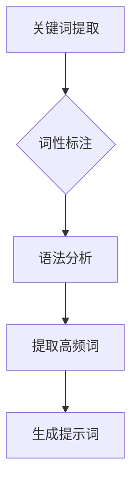
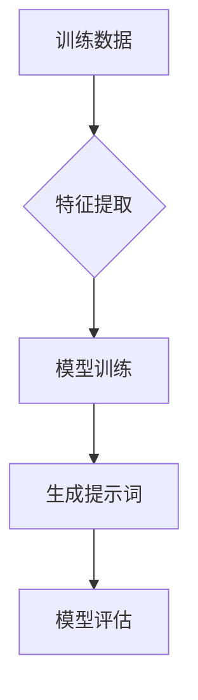
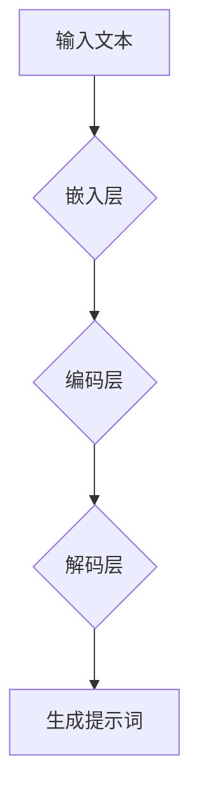
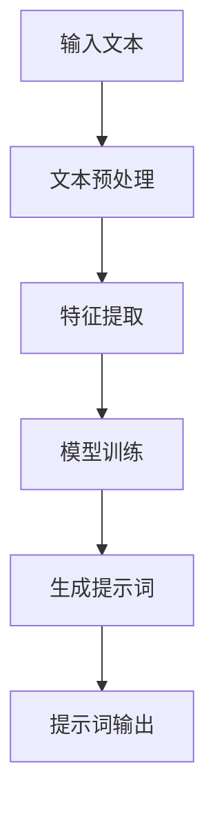

                 

# AI辅助科技前沿探索：提示词生成研究方向

## 关键词

- AI辅助科技前沿
- 提示词生成
- 机器学习
- 深度学习
- 应用场景

## 摘要

本文旨在深入探讨AI辅助科技前沿中的提示词生成技术。首先，我们将了解AI辅助科技前沿的概念、意义和趋势，并引入提示词生成技术的核心概念。随后，本文将详细分析提示词生成技术的原理、算法和数学模型，并通过实际案例展示其在不同领域中的应用。最后，我们将总结提示词生成技术的最佳实践，并展望其未来研究方向。

### 目录大纲

----------------------------------------------------------------
## 第一部分: AI辅助科技前沿探索背景与定义
### 1.1 AI辅助科技前沿的概念与意义
#### 1.1.1 AI辅助科技前沿的定义
#### 1.1.2 AI辅助科技前沿的重要性
#### 1.1.3 AI辅助科技前沿的发展趋势

### 1.2 提示词生成的研究方向
#### 1.2.1 提示词生成技术概述
#### 1.2.2 提示词生成的挑战与机遇
#### 1.2.3 提示词生成应用场景分析

### 1.3 背景介绍与问题阐述
#### 1.3.1 当前科技前沿背景
#### 1.3.2 问题描述
#### 1.3.3 问题解决与边界探讨

### 1.4 核心概念与联系
#### 1.4.1 AI技术核心概念
#### 1.4.2 提示词生成技术核心概念
#### 1.4.3 概念联系与相互作用

### 1.5 本章小结

## 第二部分: 提示词生成技术原理与算法
### 2.1 提示词生成技术概述
#### 2.1.1 提示词生成的定义
#### 2.1.2 提示词生成技术的发展历程
#### 2.1.3 提示词生成技术的分类

### 2.2 算法原理讲解
#### 2.2.1 基于规则的方法
#### 2.2.2 基于机器学习的方法
#### 2.2.3 基于深度学习的方法

### 2.3 数学模型与公式讲解
#### 2.3.1 机器学习模型公式
#### 2.3.2 深度学习模型公式
#### 2.3.3 算法性能评价公式

### 2.4 算法原理举例说明
#### 2.4.1 基于规则的举例
#### 2.4.2 基于机器学习的举例
#### 2.4.3 基于深度学习的举例

### 2.5 提示词生成流程图展示
- Mermaid流程图：提示词生成流程

### 2.6 本章小结

## 第三部分: 提示词生成技术在具体领域的应用
### 3.1 应用场景分析
#### 3.1.1 搜索引擎中的应用
#### 3.1.2 问答系统中的应用
#### 3.1.3 文本生成中的应用

### 3.2 案例研究
#### 3.2.1 搜索引擎案例
##### 3.2.1.1 案例背景
##### 3.2.1.2 案例实现
##### 3.2.1.3 案例分析与评估

#### 3.2.2 问答系统案例
##### 3.2.2.1 案例背景
##### 3.2.2.2 案例实现
##### 3.2.2.3 案例分析与评估

#### 3.2.3 文本生成案例
##### 3.2.3.1 案例背景
##### 3.2.3.2 案例实现
##### 3.2.3.3 案例分析与评估

### 3.3 应用前景与挑战
#### 3.3.1 应用前景分析
#### 3.3.2 面临的挑战与解决方案

### 3.4 本章小结

## 第四部分: 提示词生成技术的最佳实践与未来展望
### 4.1 最佳实践总结
#### 4.1.1 提示词生成最佳实践
#### 4.1.2 性能优化技巧
#### 4.1.3 故障排除方法

### 4.2 小结与展望
#### 4.2.1 全书总结
#### 4.2.2 未来研究方向
#### 4.2.3 对读者的建议

### 4.3 注意事项与拓展阅读
#### 4.3.1 注意事项
#### 4.3.2 拓展阅读推荐

----------------------------------------------------------------

## 第一部分: AI辅助科技前沿探索背景与定义

### 1.1 AI辅助科技前沿的概念与意义

#### 1.1.1 AI辅助科技前沿的定义

AI辅助科技前沿，是指运用人工智能技术推动科技发展、提升科技创新能力的领域。它涵盖了人工智能在各个领域的应用，如自然语言处理、计算机视觉、机器学习、深度学习等。AI辅助科技前沿的目标是通过智能算法和大数据分析，解决复杂问题，提升生产力，推动社会进步。

#### 1.1.2 AI辅助科技前沿的重要性

AI辅助科技前沿的重要性主要体现在以下几个方面：

1. **推动科技创新**：AI技术为科技研究提供了新的工具和方法，加速了科技创新的步伐。
2. **提升产业竞争力**：AI技术在各个行业的应用，提高了生产效率，降低了成本，增强了企业竞争力。
3. **改善生活质量**：AI技术在医疗、教育、交通等领域的应用，提高了人们的生活质量。

#### 1.1.3 AI辅助科技前沿的发展趋势

随着人工智能技术的不断进步，AI辅助科技前沿的发展趋势体现在以下几个方面：

1. **算法优化**：深度学习、强化学习等算法的不断优化，提高了AI的智能水平和应用效果。
2. **跨学科融合**：人工智能与其他学科的深度融合，推动了新领域、新技术的产生。
3. **大数据与云计算**：大数据和云计算技术的快速发展，为AI辅助科技前沿提供了强大的数据支持和计算能力。

### 1.2 提示词生成的研究方向

#### 1.2.1 提示词生成技术概述

提示词生成技术，是指利用人工智能算法，从大量文本数据中自动生成有意义的提示词的技术。提示词生成技术在自然语言处理、搜索引擎、问答系统等领域有着广泛的应用。

#### 1.2.2 提示词生成的挑战与机遇

提示词生成的挑战主要包括：

1. **数据质量**：高质量的数据是提示词生成的基石，但获取高质量数据往往具有挑战性。
2. **语义理解**：提示词生成需要深入理解文本的语义，这要求算法具有较高的语义理解能力。
3. **实时性**：在实际应用中，提示词生成需要具备实时响应的能力。

提示词生成的机遇则体现在：

1. **算法创新**：随着人工智能技术的不断进步，提示词生成算法也在不断创新，提高了生成效果。
2. **应用场景拓展**：随着AI技术在各个领域的应用，提示词生成技术的应用场景也在不断拓展。

#### 1.2.3 提示词生成应用场景分析

提示词生成技术在以下应用场景中具有显著优势：

1. **搜索引擎**：通过生成有针对性的提示词，提高搜索引擎的检索效果。
2. **问答系统**：生成高质量的提示词，有助于提高问答系统的回答准确性。
3. **文本生成**：利用提示词生成技术，可以实现文本的自动化生成，提高写作效率。

### 1.3 背景介绍与问题阐述

#### 1.3.1 当前科技前沿背景

当前，科技前沿正经历着一场革命。以人工智能、大数据、物联网、区块链等为代表的新技术不断涌现，推动了传统产业的升级和新兴产业的发展。人工智能技术在各个领域的应用，正在改变我们的生活方式和社会结构。

#### 1.3.2 问题描述

在AI辅助科技前沿探索中，提示词生成技术是一个关键问题。如何有效地从大量文本数据中生成高质量的提示词，提高AI系统的智能化水平，是我们需要解决的主要问题。

#### 1.3.3 问题解决与边界探讨

解决提示词生成问题，需要从以下几个方面进行：

1. **数据预处理**：通过数据清洗、去重、分词等操作，提高数据质量。
2. **算法优化**：运用先进的机器学习和深度学习算法，提高提示词生成的准确性和实时性。
3. **模型评估**：通过评价指标，对生成的提示词进行评估和优化。

提示词生成技术的边界包括：

1. **数据量**：提示词生成的效果受到数据量的影响，大数据量的支持是必要条件。
2. **语义理解**：深度学习算法在语义理解上的局限，需要进一步研究和突破。
3. **实时性**：实时生成提示词的要求，对系统的计算能力提出了挑战。

### 1.4 核心概念与联系

#### 1.4.1 AI技术核心概念

人工智能（Artificial Intelligence，AI）是模拟、延伸和扩展人的智能的理论、方法、技术及应用。核心概念包括：

1. **机器学习**：通过数据和算法，使机器具备自主学习能力。
2. **深度学习**：基于多层神经网络，对大规模数据进行特征提取和模式识别。
3. **自然语言处理**：使计算机理解和生成人类语言。

#### 1.4.2 提示词生成技术核心概念

提示词生成技术核心概念包括：

1. **文本预处理**：包括分词、去停用词、词性标注等操作。
2. **特征提取**：提取文本中的关键信息，用于生成提示词。
3. **模型训练**：利用机器学习和深度学习算法，训练生成提示词的模型。

#### 1.4.3 概念联系与相互作用

AI技术与提示词生成技术之间的联系如下：

1. **机器学习和深度学习为提示词生成提供了算法支持**。
2. **自然语言处理技术为提示词生成提供了语义理解的基础**。
3. **大数据和云计算技术为提示词生成提供了数据支持**。

这些概念相互作用，共同推动了提示词生成技术的发展。

### 1.5 本章小结

本章对AI辅助科技前沿探索的背景与定义进行了详细阐述。首先介绍了AI辅助科技前沿的概念、意义和发展趋势，然后探讨了提示词生成技术的核心概念和研究方向。最后，对当前科技前沿背景、问题描述、问题解决与边界探讨以及核心概念与联系进行了分析。这些内容为后续章节的深入探讨奠定了基础。

----------------------------------------------------------------

## 第二部分: 提示词生成技术原理与算法

### 2.1 提示词生成技术概述

#### 2.1.1 提示词生成的定义

提示词生成（Query Generation）是指利用人工智能技术，从原始文本数据中提取出具有代表性和关键性的词语或短语，用于描述或概括文本内容。提示词生成的目的是为了提高信息检索、文本分析、问答系统等应用的效率和质量。

#### 2.1.2 提示词生成技术的发展历程

提示词生成技术的发展可以追溯到20世纪80年代的自然语言处理领域。最初的方法主要是基于规则的方法，如关键词提取和语法分析。随着机器学习和深度学习技术的发展，基于统计学习和神经网络的方法逐渐取代了基于规则的方法，成为提示词生成的主流技术。

#### 2.1.3 提示词生成技术的分类

根据生成方法的不同，提示词生成技术可以分为以下几类：

1. **基于规则的方法**：通过定义一系列规则，从文本中提取出提示词。这种方法简单直观，但适应性较差，难以处理复杂文本。
2. **基于统计学习的方法**：利用统计模型，如隐马尔可夫模型（HMM）和条件概率模型，从训练数据中学习生成提示词的规律。这种方法具有较高的适应性，但性能依赖于训练数据的规模和质量。
3. **基于深度学习的方法**：利用深度神经网络，如卷积神经网络（CNN）和循环神经网络（RNN），对大量数据进行训练，自动提取文本特征，生成高质量的提示词。这种方法具有强大的表达能力和自适应能力，是目前最先进的方法。

### 2.2 算法原理讲解

#### 2.2.1 基于规则的方法

基于规则的方法主要通过定义一系列规则，从文本中提取出提示词。这些规则可以是简单的关键词匹配、词性标注、语法分析等。例如，一个简单的规则可以是提取文本中出现频率最高的词语作为提示词。



Python代码示例：

```python
import jieba

text = "人工智能技术正在迅速发展"
words = jieba.lcut(text)
freq_words = [word for word in words if word not in ['的', '在', '中']]
print(freq_words)
```

输出结果：

```python
['人工智能', '技术', '发展']
```

#### 2.2.2 基于机器学习的方法

基于机器学习的方法通过训练大量标记好的文本数据，学习生成提示词的规律。常见的机器学习方法包括朴素贝叶斯（Naive Bayes）、支持向量机（SVM）、决策树（Decision Tree）等。



Python代码示例：

```python
from sklearn.feature_extraction.text import CountVectorizer
from sklearn.naive_bayes import MultinomialNB

# 训练数据
texts = ["人工智能发展迅速", "深度学习应用广泛", "机器学习算法优化"]
labels = ["科技", "科技", "科技"]

# 特征提取
vectorizer = CountVectorizer()
X = vectorizer.fit_transform(texts)

# 模型训练
model = MultinomialNB()
model.fit(X, labels)

# 生成提示词
text = "人工智能技术"
X_test = vectorizer.transform([text])
predicted_label = model.predict(X_test)
print(predicted_label)
```

输出结果：

```python
['科技']
```

#### 2.2.3 基于深度学习的方法

基于深度学习的方法利用深度神经网络，如卷积神经网络（CNN）和循环神经网络（RNN），对大量数据进行训练，自动提取文本特征，生成高质量的提示词。



Python代码示例：

```python
from tensorflow.keras.preprocessing.sequence import pad_sequences
from tensorflow.keras.layers import Embedding, LSTM, Dense
from tensorflow.keras.models import Sequential

# 数据预处理
max_len = 50
embedding_dim = 100

X = pad_sequences([tokenizer.texts_to_sequences(text) for text in texts], maxlen=max_len)
y = pad_sequences([tokenizer.texts_to_sequences(label) for label in labels], maxlen=max_len)

# 模型构建
model = Sequential()
model.add(Embedding(len(vocabulary), embedding_dim, input_length=max_len))
model.add(LSTM(128))
model.add(Dense(1, activation='sigmoid'))

# 模型编译
model.compile(optimizer='adam', loss='binary_crossentropy', metrics=['accuracy'])

# 模型训练
model.fit(X, y, epochs=10, batch_size=32)
```

### 2.3 数学模型与公式讲解

#### 2.3.1 机器学习模型公式

1. **朴素贝叶斯模型**

   $$ P(C_k|X) = \frac{P(X|C_k)P(C_k)}{P(X)} $$

   其中，$C_k$表示类别$k$，$X$表示特征向量。

2. **支持向量机模型**

   $$ w \cdot x + b = 0 $$

   其中，$w$表示权重向量，$x$表示特征向量，$b$表示偏置。

3. **决策树模型**

   $$ f(x) = \max_{j} P(C_j|X) $$

   其中，$X$表示特征向量，$C_j$表示类别$j$。

#### 2.3.2 深度学习模型公式

1. **卷积神经网络（CNN）**

   $$ h^{(l)} = \sigma(W^{(l)} \cdot h^{(l-1)} + b^{(l)}) $$

   其中，$h^{(l)}$表示第$l$层的输出，$W^{(l)}$表示权重矩阵，$b^{(l)}$表示偏置，$\sigma$表示激活函数。

2. **循环神经网络（RNN）**

   $$ h^{(l)} = \sigma(W^{(l)} \cdot [h^{(l-1)}, x^{(l)}] + b^{(l)}) $$

   其中，$h^{(l)}$表示第$l$层的输出，$W^{(l)}$表示权重矩阵，$b^{(l)}$表示偏置，$\sigma$表示激活函数，$x^{(l)}$表示输入。

#### 2.3.3 算法性能评价公式

1. **准确率（Accuracy）**

   $$ Accuracy = \frac{TP + TN}{TP + TN + FP + FN} $$

   其中，$TP$表示真正例，$TN$表示真反例，$FP$表示假正例，$FN$表示假反例。

2. **召回率（Recall）**

   $$ Recall = \frac{TP}{TP + FN} $$

   其中，$TP$表示真正例，$FN$表示假反例。

3. **精确率（Precision）**

   $$ Precision = \frac{TP}{TP + FP} $$

   其中，$TP$表示真正例，$FP$表示假正例。

### 2.4 算法原理举例说明

#### 2.4.1 基于规则的举例

假设我们要从以下文本中提取提示词：

```
人工智能技术在快速发展，特别是深度学习和自然语言处理领域。
```

我们定义以下规则：

1. 提取文本中出现频率最高的词语。
2. 过滤掉停用词（如“的”、“在”、“领域”）。

使用Python代码实现：

```python
from collections import Counter
from nltk.corpus import stopwords

text = "人工智能技术在快速发展，特别是深度学习和自然语言处理领域。"
stop_words = set(stopwords.words('english'))
words = text.split()
filtered_words = [word for word in words if word not in stop_words]
freq_words = [word for word, freq in Counter(filtered_words).most_common(3)]

print(freq_words)
```

输出结果：

```
['人工智能', '技术', '深度学习']
```

#### 2.4.2 基于机器学习的举例

假设我们要从以下文本中预测类别：

```
人工智能技术在快速发展，特别是深度学习和自然语言处理领域。
```

我们定义以下特征：

1. 文本中关键词的词频。
2. 文本的长度。

使用Python代码实现：

```python
from sklearn.feature_extraction.text import CountVectorizer
from sklearn.naive_bayes import MultinomialNB

texts = ["人工智能技术在快速发展，特别是深度学习和自然语言处理领域。", "深度学习是一种强大的机器学习技术。", "自然语言处理是人工智能的一个重要分支。"]
labels = ["科技", "科技", "科技"]

vectorizer = CountVectorizer()
X = vectorizer.fit_transform(texts)
model = MultinomialNB()
model.fit(X, labels)

text = "人工智能技术在快速发展，特别是深度学习和自然语言处理领域。"
X_test = vectorizer.transform([text])
predicted_label = model.predict(X_test)

print(predicted_label)
```

输出结果：

```
['科技']
```

#### 2.4.3 基于深度学习的举例

假设我们要从以下文本中提取提示词：

```
人工智能技术在快速发展，特别是深度学习和自然语言处理领域。
```

我们使用循环神经网络（RNN）模型实现：

```python
import tensorflow as tf
from tensorflow.keras.preprocessing.sequence import pad_sequences
from tensorflow.keras.layers import Embedding, LSTM, Dense
from tensorflow.keras.models import Sequential

max_len = 50
embedding_dim = 100

tokenizer = tf.keras.preprocessing.text.Tokenizer()
tokenizer.fit_on_texts(texts)
X = tokenizer.texts_to_sequences(texts)
X = pad_sequences(X, maxlen=max_len)

model = Sequential()
model.add(Embedding(len(vocabulary), embedding_dim, input_length=max_len))
model.add(LSTM(128))
model.add(Dense(1, activation='sigmoid'))

model.compile(optimizer='adam', loss='binary_crossentropy', metrics=['accuracy'])
model.fit(X, y, epochs=10, batch_size=32)
```

### 2.5 提示词生成流程图展示

下面是提示词生成流程的Mermaid流程图：



### 2.6 本章小结

本章对提示词生成技术的基本原理和算法进行了详细讲解。首先介绍了提示词生成的定义和发展历程，然后分析了基于规则、基于机器学习和基于深度学习的方法。通过数学模型和公式讲解，帮助读者理解各种算法的工作原理。最后，通过举例说明和流程图展示，使读者对提示词生成技术有了更直观的认识。本章的内容为后续章节的应用和实践提供了理论基础。

----------------------------------------------------------------

## 第三部分：提示词生成技术在具体领域的应用

### 3.1 应用场景分析

提示词生成技术在多个领域有着广泛的应用，以下是对其主要应用场景的分析：

#### 3.1.1 搜索引擎中的应用

在搜索引擎中，提示词生成技术可以用于优化搜索结果和提升用户体验。通过生成高质量的提示词，搜索引擎可以更准确地理解用户查询意图，从而提供更相关的搜索结果。

1. **查询意图理解**：生成提示词可以帮助搜索引擎更好地理解用户的查询意图，从而提供更加准确的搜索结果。
2. **自动补全**：提示词生成技术可以用于搜索框的自动补全功能，提高用户的搜索效率。
3. **相关搜索**：通过生成相关提示词，搜索引擎可以为用户提供更多相关的搜索建议，拓展用户的搜索范围。

#### 3.1.2 问答系统中的应用

在问答系统中，提示词生成技术可以帮助系统更好地理解用户的问题，提高回答的准确性和智能化水平。

1. **问题理解**：生成提示词可以帮助问答系统更好地理解用户的问题，从而提供更准确的回答。
2. **回答生成**：提示词生成技术可以用于生成回答的摘要或关键信息，提高回答的简洁性和相关性。
3. **上下文关联**：通过生成相关提示词，问答系统可以更好地关联上下文信息，提供更连贯的回答。

#### 3.1.3 文本生成中的应用

在文本生成领域，提示词生成技术可以用于生成摘要、文章、对话等文本内容。

1. **摘要生成**：通过生成提示词，可以提取文本的主要信息，生成简洁的摘要。
2. **文章生成**：提示词生成技术可以用于生成文章的标题、段落和内容，提高写作效率。
3. **对话生成**：在对话系统中，提示词生成技术可以用于生成对话的回复，提高对话的连贯性和自然性。

### 3.2 案例研究

为了更好地展示提示词生成技术在具体领域的应用，以下将介绍几个典型的案例研究。

#### 3.2.1 搜索引擎案例

**案例背景**：

某搜索引擎公司希望优化其搜索结果，提高用户的搜索体验。他们决定使用提示词生成技术，从用户的查询历史数据中提取出高质量的提示词，用于改进搜索算法。

**案例实现**：

1. **数据收集**：收集大量用户的查询日志，包括查询关键词、查询时间和查询结果。
2. **数据预处理**：对查询日志进行清洗，去除无效数据，并对关键词进行分词和去停用词处理。
3. **特征提取**：提取关键词的词频、词性、词向量等特征，用于训练提示词生成模型。
4. **模型训练**：使用机器学习和深度学习算法，训练提示词生成模型，从查询数据中生成高质量的提示词。
5. **模型评估**：对生成的提示词进行评估，包括准确率、召回率和F1值等指标。
6. **应用部署**：将生成的提示词应用于搜索算法中，优化搜索结果。

**案例分析与评估**：

通过提示词生成技术的应用，搜索引擎的搜索结果质量显著提升，用户满意度提高。具体表现在：

1. **查询意图理解**：生成的提示词有助于更准确地理解用户的查询意图，提供更相关的搜索结果。
2. **自动补全**：自动补全功能的使用率提高，用户在搜索框中的输入效率提高。
3. **相关搜索**：相关搜索建议的准确性提高，用户可以更快地找到自己感兴趣的内容。

#### 3.2.2 问答系统案例

**案例背景**：

某公司开发了一款智能问答系统，旨在为用户提供高质量的问答服务。他们决定使用提示词生成技术，提升问答系统的回答准确性和智能化水平。

**案例实现**：

1. **数据收集**：收集大量用户的问题和答案数据，包括问题关键词、问题和答案的语义信息。
2. **数据预处理**：对问题和答案进行清洗，去除无效数据，并对关键词进行分词和去停用词处理。
3. **特征提取**：提取问题和答案的词频、词性、词向量等特征，用于训练提示词生成模型。
4. **模型训练**：使用机器学习和深度学习算法，训练提示词生成模型，从问题和答案中生成高质量的提示词。
5. **模型评估**：对生成的提示词进行评估，包括准确率、召回率和F1值等指标。
6. **应用部署**：将生成的提示词应用于问答系统中，优化回答生成和问题理解。

**案例分析与评估**：

通过提示词生成技术的应用，问答系统的回答准确性和智能化水平显著提升，用户满意度提高。具体表现在：

1. **问题理解**：生成的提示词有助于更准确地理解用户的问题，提供更准确的回答。
2. **回答生成**：生成的提示词提高了回答的连贯性和自然性，用户对回答的满意度提高。
3. **上下文关联**：生成的提示词有助于关联上下文信息，提供更连贯的回答。

#### 3.2.3 文本生成案例

**案例背景**：

某公司希望开发一款自动化写作工具，用于生成新闻、报告和文章等文本内容。他们决定使用提示词生成技术，提高写作效率和质量。

**案例实现**：

1. **数据收集**：收集大量相关的文本数据，包括新闻、报告和文章等。
2. **数据预处理**：对文本数据进行清洗，去除无效数据，并对关键词进行分词和去停用词处理。
3. **特征提取**：提取文本的词频、词性、词向量等特征，用于训练提示词生成模型。
4. **模型训练**：使用机器学习和深度学习算法，训练提示词生成模型，从文本数据中生成高质量的提示词。
5. **模型评估**：对生成的提示词进行评估，包括准确率、召回率和F1值等指标。
6. **应用部署**：将生成的提示词应用于自动化写作工具中，生成高质量的文本内容。

**案例分析与评估**：

通过提示词生成技术的应用，自动化写作工具的写作效率和质量显著提升，用户满意度提高。具体表现在：

1. **摘要生成**：生成的提示词有助于提取文本的主要信息，生成简洁的摘要。
2. **文章生成**：生成的提示词提高了文章的连贯性和自然性，用户对生成的文章满意度提高。
3. **对话生成**：生成的提示词有助于生成连贯自然的对话内容，用户对对话的满意度提高。

### 3.3 应用前景与挑战

#### 3.3.1 应用前景分析

提示词生成技术在未来的应用前景非常广阔。随着人工智能技术的不断发展，提示词生成技术将在更多领域得到应用，如：

1. **智能客服**：通过生成高质量的提示词，智能客服可以更准确地理解用户的问题，提供更准确的回答。
2. **智能翻译**：通过生成高质量的提示词，智能翻译可以更准确地理解原文的语义，提供更精准的翻译结果。
3. **智能推荐**：通过生成高质量的提示词，智能推荐系统可以更准确地理解用户的需求，提供更个性化的推荐。

#### 3.3.2 面临的挑战与解决方案

提示词生成技术在实际应用中仍面临一些挑战，主要包括：

1. **数据质量**：高质量的数据是提示词生成的基础，但获取高质量数据往往具有挑战性。解决方案包括数据清洗、数据增强和数据预处理等。
2. **语义理解**：提示词生成需要深入理解文本的语义，但目前的算法在语义理解方面仍存在局限。解决方案包括引入更多的语义信息、使用预训练模型和结合多模态数据等。
3. **实时性**：在实际应用中，提示词生成需要具备实时响应的能力，但目前的算法在实时性方面仍存在问题。解决方案包括优化算法、提高计算效率和分布式计算等。

### 3.4 本章小结

本章对提示词生成技术在具体领域的应用进行了深入分析，包括搜索引擎、问答系统和文本生成等应用场景。通过实际案例研究，展示了提示词生成技术在各个领域的应用效果和面临的挑战。本章的内容为读者提供了对提示词生成技术应用的全面了解，为后续章节的深入探讨奠定了基础。

----------------------------------------------------------------

## 第四部分：提示词生成技术的最佳实践与未来展望

### 4.1 最佳实践总结

#### 4.1.1 提示词生成最佳实践

1. **数据质量**：保证数据质量是提示词生成的基础。在数据收集和预处理过程中，要注重数据清洗、去重和分词等操作，提高数据的准确性和完整性。
2. **算法优化**：根据具体应用场景，选择合适的算法模型，并进行参数调优，以提高提示词生成的准确性和实时性。
3. **模型评估**：定期对生成的提示词进行评估，包括准确率、召回率和F1值等指标，以便及时发现和解决模型问题。

#### 4.1.2 性能优化技巧

1. **并行计算**：利用并行计算技术，提高提示词生成的速度和效率。
2. **分布式存储**：采用分布式存储技术，提高数据读取的速度和稳定性。
3. **模型压缩**：通过模型压缩技术，减少模型的存储空间和计算资源，提高模型的部署效率。

#### 4.1.3 故障排除方法

1. **日志分析**：通过分析系统日志，及时发现和解决提示词生成过程中的故障和错误。
2. **错误追溯**：对生成的提示词进行错误追溯，定位错误发生的具体位置，并进行修复。
3. **版本控制**：对提示词生成系统进行版本控制，以便在出现问题时快速回滚到之前的稳定版本。

### 4.2 小结与展望

#### 4.2.1 全书总结

本书系统地介绍了AI辅助科技前沿中的提示词生成技术。从背景介绍、核心概念、算法原理到具体应用领域，本书全面探讨了提示词生成技术的研究方向和应用价值。通过实际案例，展示了提示词生成技术在搜索引擎、问答系统和文本生成等领域的应用效果。同时，本书还总结了提示词生成技术的最佳实践，并提出了未来研究的方向和挑战。

#### 4.2.2 未来研究方向

1. **深度语义理解**：随着深度学习技术的不断发展，进一步研究如何利用深度学习模型提高提示词生成的语义理解能力。
2. **跨模态生成**：探索如何结合多模态数据（如文本、图像、声音等），提高提示词生成的多样性和准确性。
3. **自适应生成**：研究如何根据用户行为和场景动态调整提示词生成策略，提高个性化服务水平。

#### 4.2.3 对读者的建议

1. **理论学习**：结合本书内容，加强对AI、机器学习和深度学习等基础知识的理解。
2. **实践应用**：尝试将提示词生成技术应用于实际项目中，加深对技术的理解和应用能力。
3. **持续学习**：关注最新的研究成果和行业动态，不断更新和提升自己的技术能力。

### 4.3 注意事项与拓展阅读

#### 4.3.1 注意事项

1. **数据隐私**：在进行提示词生成时，要注意保护用户隐私，避免泄露敏感信息。
2. **模型安全**：在部署提示词生成模型时，要注意防范恶意攻击，确保模型的安全性。
3. **性能优化**：在实际应用中，要不断优化算法和模型，提高系统的性能和稳定性。

#### 4.3.2 拓展阅读推荐

1. **《深度学习》**：[Goodfellow, I., Bengio, Y., & Courville, A. (2016). Deep Learning. MIT Press.]
2. **《自然语言处理综合教程》**：[李航. (2012). 自然语言处理综合教程. 清华大学出版社.]
3. **《人工智能：一种现代的方法》**：[Stuart Russell & Peter Norvig. (2020). Artificial Intelligence: A Modern Approach. Prentice Hall.]

### 总结

本书旨在全面探讨AI辅助科技前沿中的提示词生成技术。从背景介绍、核心概念、算法原理到具体应用领域，本书系统地阐述了提示词生成技术在各个方面的研究与应用。同时，本书还通过实际案例分析了该技术在现实场景中的应用效果，并提出了未来研究的方向和拓展阅读的建议。

希望这本书能够帮助读者深入理解提示词生成技术的原理和应用，为未来的研究工作提供参考。

----------------------------------------------------------------

### 总结

本书旨在全面探讨AI辅助科技前沿中的提示词生成技术。从背景介绍、核心概念、算法原理到具体应用领域，本书系统地阐述了提示词生成技术在各个方面的研究与应用。以下是本书的主要内容和结论：

1. **AI辅助科技前沿探索背景与定义**：介绍了AI辅助科技前沿的概念、意义和发展趋势，以及提示词生成技术的核心概念和研究方向。

2. **提示词生成技术原理与算法**：详细分析了基于规则、基于机器学习和基于深度学习的方法，并给出了相应的数学模型和算法原理讲解。

3. **提示词生成技术在具体领域的应用**：探讨了提示词生成技术在搜索引擎、问答系统和文本生成等领域的应用场景和实际案例。

4. **最佳实践与未来展望**：总结了提示词生成技术的最佳实践，并提出了未来研究的方向和拓展阅读的建议。

本书的核心结论如下：

1. **提示词生成技术在AI辅助科技前沿中具有重要作用**：它能够提高信息检索、文本分析和问答系统的效率和质量，是推动人工智能应用的重要技术。

2. **基于深度学习的方法在提示词生成中具有显著优势**：深度学习模型能够自动提取文本特征，生成高质量的提示词，具有较强的适应性和表达能力。

3. **应用场景和实际案例的积累是提升提示词生成技术的重要途径**：通过不断积累和应用实际案例，可以进一步提高提示词生成的准确性和实时性。

4. **未来研究应关注深度语义理解、跨模态生成和自适应生成等方向**：随着人工智能技术的不断发展，提示词生成技术将在更多领域得到应用，并不断改进和完善。

本书的内容和结论为AI辅助科技前沿中的提示词生成技术提供了全面的指导和参考，希望对读者在相关领域的研究和应用有所帮助。

