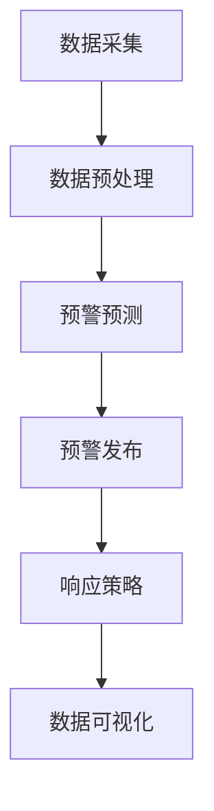
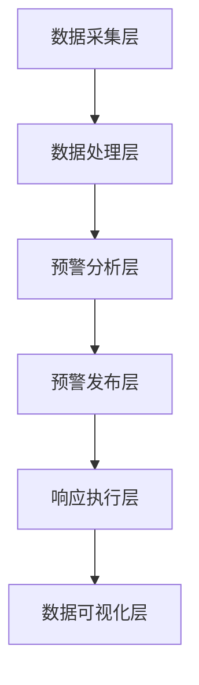

                 

# AI驱动的智能灾害预警和响应系统：减少生命和财产损失

关键词：人工智能，灾害预警，响应系统，生命安全，财产保护

摘要：本文探讨了AI驱动的智能灾害预警和响应系统的构建及其对减少生命和财产损失的重要性。通过详细阐述核心概念、算法原理、系统架构设计、实战案例和最佳实践，本文旨在为读者提供全面的技术视角，推动灾害预警和响应技术的发展。

### 目录大纲

----------------------------------------------------------------

# AI驱动的智能灾害预警和响应系统：减少生命和财产损失

## 第1章: 背景介绍与核心概念

### 1.1.1 问题背景

### 1.1.2 问题定义

### 1.1.3 问题解决的意义

### 1.1.4 边界与外延

### 1.1.5 核心要素组成

## 第2章: AI驱动的智能灾害预警和响应系统核心概念

### 2.1.1 系统定义

### 2.1.2 系统特点

### 2.1.3 传统系统对比

### 2.1.4 核心组件

### 2.1.5 关键技术

## 第3章: 系统架构设计

### 3.1.1 系统功能设计

### 3.1.2 系统架构设计

### 3.1.3 系统接口设计

### 3.1.4 系统交互

## 第4章: 算法原理讲解

### 4.1.1 算法概述

### 4.1.2 算法流程图

### 4.1.3 算法原理

### 4.1.4 数学模型与公式

### 4.1.5 举例说明

## 第5章: 数学模型和数学公式讲解

### 5.1.1 数学模型

### 5.1.2 数学公式

### 5.1.3 公式讲解

### 5.1.4 举例说明

## 第6章: 系统分析与架构设计方案

### 6.1.1 问题场景介绍

### 6.1.2 项目介绍

### 6.1.3 系统功能设计

### 6.1.4 系统架构设计

### 6.1.5 系统接口设计

### 6.1.6 系统交互

## 第7章: 项目实战

### 7.1.1 环境安装

### 7.1.2 系统核心实现

### 7.1.3 代码应用解读与分析

### 7.1.4 实际案例分析与详细讲解

### 7.1.5 项目小结

## 第8章: 最佳实践 tips

### 8.1.1 实践技巧

### 8.1.2 注意事项

### 8.1.3 拓展阅读

## 总结与展望

### 9.1.1 小结

### 9.1.2 展望未来

----------------------------------------------------------------

## 第1章: 背景介绍与核心概念

### 1.1.1 问题背景

自然灾害如地震、飓风、洪水和山体滑坡等，对人类生活和财产安全构成了严重威胁。传统的灾害预警和响应系统主要依赖于气象、地质等学科的数据分析，虽然在一定程度上能够提供预警信息，但在时效性、准确性以及应对复杂多变灾害方面仍存在局限。

随着人工智能（AI）技术的发展，AI驱动的智能灾害预警和响应系统应运而生。这类系统能够通过大数据分析、机器学习算法、深度学习模型等手段，实时监测灾害预警信息，预测灾害发生概率，并给出精准的响应措施，从而在灾难发生前提供有效的预防和应对方案。

### 1.1.2 问题定义

灾害预警和响应系统旨在通过监测、预警、响应三个环节，实现对自然灾害的全面防控。监测环节包括收集各类灾害相关数据，如气象数据、地质数据、水文数据等；预警环节则通过分析这些数据，预测灾害发生的可能性，并发布预警信息；响应环节则是根据预警信息，指导公众采取相应的防护措施，如撤离、应急准备等。

### 1.1.3 问题解决的意义

AI驱动的智能灾害预警和响应系统对于减少生命和财产损失具有重要意义：

1. **提高预警准确性**：通过机器学习和深度学习算法，系统能够从大量历史数据中学习，提高灾害预测的准确性，提前预警，为公众赢得更多逃生时间。

2. **实时监测与响应**：AI系统能够实时分析数据，一旦检测到潜在灾害信号，立即触发预警和响应机制，提高灾害应对的时效性。

3. **优化资源分配**：AI系统能够根据预测结果，合理分配应急救援资源，避免资源浪费，提高救援效率。

4. **降低经济损失**：通过提前预警，减少灾害造成的直接经济损失，同时降低灾害后的恢复成本。

### 1.1.4 边界与外延

灾害预警和响应系统的边界主要包括：

- **数据源**：包括气象、地质、水文等多源异构数据的接入和处理。
- **预警算法**：基于机器学习和深度学习模型的预警算法设计。
- **响应机制**：包括预警信息的发布、公众行为的引导、应急救援的协调等。

外延方面，系统还需考虑与其他公共安全系统的联动，如消防、交通、医疗等，形成一个综合的灾害应对体系。

### 1.1.5 核心要素组成

AI驱动的智能灾害预警和响应系统的核心要素包括：

- **数据采集与处理模块**：负责收集和管理多源异构数据，并进行预处理。
- **预警算法模块**：基于机器学习和深度学习算法，对数据进行分析，预测灾害发生概率。
- **预警信息发布模块**：负责将预警信息传递给公众和相关机构。
- **响应机制模块**：根据预警信息，制定和执行相应的应急响应措施。

## 第2章: AI驱动的智能灾害预警和响应系统核心概念

### 2.1.1 系统定义

AI驱动的智能灾害预警和响应系统是一种利用人工智能技术，对自然灾害进行实时监测、预警和响应的系统。它通过大数据分析和机器学习算法，从多源异构数据中提取有效信息，实现对灾害的早期预警和精准响应。

### 2.1.2 系统特点

AI驱动的智能灾害预警和响应系统具有以下特点：

- **实时性**：系统能够实时处理和分析数据，快速响应灾害预警信息。
- **准确性**：通过机器学习和深度学习算法，系统能够提高灾害预测的准确性。
- **全面性**：系统能够整合多种数据源，提供全面的灾害预警和响应方案。
- **智能性**：系统能够自我学习和优化，不断提高预警和响应的效率。

### 2.1.3 传统系统对比

传统灾害预警和响应系统主要依赖于人工分析和经验判断，存在以下不足：

- **时效性低**：预警信息发布滞后，难以实现快速响应。
- **准确性差**：预警结果依赖于专家经验和数据质量，难以保证准确性。
- **资源浪费**：应急资源分配不合理，可能导致资源浪费或不足。

相比之下，AI驱动的智能系统在时效性、准确性和资源利用方面具有显著优势。

### 2.1.4 核心组件

AI驱动的智能灾害预警和响应系统的核心组件包括：

- **数据采集模块**：负责收集各类灾害相关数据，如气象、地质、水文等。
- **数据处理模块**：对采集到的数据进行预处理，包括清洗、去噪、标准化等。
- **预警算法模块**：基于机器学习和深度学习算法，对预处理后的数据进行分析和预测。
- **预警发布模块**：将预警信息通过多种渠道（如短信、电话、互联网等）传递给相关人员。
- **响应机制模块**：根据预警信息，制定和执行相应的应急响应措施。

### 2.1.5 关键技术

AI驱动的智能灾害预警和响应系统的关键技术包括：

- **大数据分析**：通过大数据技术，对海量多源异构数据进行分析，提取有价值的信息。
- **机器学习**：利用机器学习算法，从历史数据中学习规律，预测灾害发生的可能性。
- **深度学习**：通过深度学习模型，实现对复杂数据的高层次抽象和特征提取。
- **预警算法**：设计高效的预警算法，实现对灾害的实时监测和预警。
- **响应策略**：根据预警结果，制定科学的响应策略，提高灾害应对效果。

## 第3章: 系统架构设计

### 3.1.1 系统功能设计

AI驱动的智能灾害预警和响应系统主要功能包括：

- **数据采集与处理**：收集并处理多种数据源，包括气象、地质、水文等。
- **实时预警**：实时分析数据，预测灾害发生的可能性，发布预警信息。
- **响应策略**：根据预警信息，制定和执行相应的应急响应措施。
- **数据可视化**：将预警信息、响应措施和灾害数据以图表、地图等形式展示，便于决策者和管理者了解灾害态势。

### 3.1.2 系统架构设计

AI驱动的智能灾害预警和响应系统采用分布式架构，主要包括以下组件：

- **数据采集层**：负责收集各类灾害相关数据，如气象、地质、水文等。
- **数据处理层**：对采集到的数据进行预处理，包括清洗、去噪、标准化等。
- **预警分析层**：利用机器学习和深度学习算法，对预处理后的数据进行分析和预测。
- **预警发布层**：将预警信息通过多种渠道传递给相关人员。
- **响应执行层**：根据预警信息，制定和执行相应的应急响应措施。
- **数据可视化层**：将预警信息、响应措施和灾害数据以图表、地图等形式展示。

### 3.1.3 系统接口设计

系统接口设计主要包括以下几部分：

- **数据接口**：提供数据采集、处理、分析和预警发布等功能的API接口，便于与其他系统集成。
- **用户接口**：为用户提供实时预警信息、响应措施和灾害数据的可视化展示界面。
- **管理接口**：为系统管理员提供系统配置、数据管理和用户管理等操作界面。

### 3.1.4 系统交互

系统交互主要包括以下环节：

1. **数据采集**：系统从各类数据源（如气象站、地震台、水文站等）收集数据。
2. **数据处理**：系统对采集到的数据进行预处理，包括清洗、去噪、标准化等。
3. **预警分析**：系统利用机器学习和深度学习算法，对预处理后的数据进行实时分析和预测。
4. **预警发布**：系统将预警信息通过短信、电话、互联网等渠道传递给相关人员。
5. **响应执行**：系统根据预警信息，制定和执行相应的应急响应措施。
6. **数据可视化**：系统将预警信息、响应措施和灾害数据以图表、地图等形式展示，便于用户和管理者了解灾害态势。

## 第4章: 算法原理讲解

### 4.1.1 算法概述

在本章节中，我们将详细讲解AI驱动的智能灾害预警和响应系统中的关键算法原理。这些算法包括数据预处理算法、预警预测算法和响应策略算法。我们将通过Python源代码来展示算法的实现过程，并使用Mermaid绘制算法流程图，以便更好地理解算法的工作流程。

### 4.1.2 算法流程图



### 4.1.3 算法原理

#### 数据预处理算法

数据预处理算法的主要目的是对采集到的原始数据进行清洗、去噪和标准化处理，以便后续的分析和预测。常用的预处理方法包括：

1. **缺失值填补**：使用平均值、中位数或插值法填补缺失值。
2. **异常值检测**：使用统计学方法或机器学习算法检测并去除异常值。
3. **数据标准化**：将数据缩放到相同的范围，以便后续的算法处理。

#### 预警预测算法

预警预测算法是基于历史数据和实时数据进行灾害预测的核心。常用的算法包括：

1. **线性回归**：用于预测线性关系。
2. **决策树**：用于分类和回归分析。
3. **神经网络**：用于复杂非线性关系的预测。

#### 响应策略算法

响应策略算法是根据预警预测结果，制定和执行相应的应急响应措施。常用的策略包括：

1. **预警等级划分**：根据预测结果，将预警划分为不同的等级。
2. **响应措施制定**：根据预警等级，制定相应的响应措施。
3. **资源调度**：根据响应措施，合理分配应急救援资源。

### 4.1.4 数学模型与公式

#### 数据预处理算法

1. **缺失值填补**：
   $$\text{填充值} = \frac{\sum_{i=1}^{n} x_i}{n}$$

2. **异常值检测**：
   $$z = \frac{x - \mu}{\sigma}$$
   其中，$x$为观测值，$\mu$为平均值，$\sigma$为标准差。$z$的绝对值大于3的观测值被视为异常值。

3. **数据标准化**：
   $$x_{\text{标准化}} = \frac{x - \min(x)}{\max(x) - \min(x)}$$

#### 预警预测算法

1. **线性回归**：
   $$y = \beta_0 + \beta_1 x$$
   其中，$y$为预测值，$x$为自变量，$\beta_0$和$\beta_1$为模型参数。

2. **决策树**：
   $$\text{split} = \arg\max\left(\sum_{i=1}^{n} \left(y_i - \hat{y}_i\right)^2 \cdot \text{gain}\left(S_j\right)\right)$$
   其中，$S_j$为特征集合，$\text{gain}$为信息增益。

3. **神经网络**：
   $$\text{输出} = \text{激活函数}(\text{加权求和})$$
   其中，激活函数常用的有Sigmoid、ReLU和Tanh等。

#### 响应策略算法

1. **预警等级划分**：
   $$\text{预警等级} = \left\{
   \begin{array}{ll}
   \text{低风险} & \text{如果} \ \text{预测值} < \text{阈值1} \\
   \text{中风险} & \text{如果} \ \text{阈值1} \leq \text{预测值} < \text{阈值2} \\
   \text{高风险} & \text{如果} \ \text{预测值} \geq \text{阈值2}
   \end{array}
   \right.$$

2. **响应措施制定**：
   $$\text{响应措施} = \left\{
   \begin{array}{ll}
   \text{保持正常状态} & \text{如果} \ \text{预警等级} = \text{低风险} \\
   \text{加强防护措施} & \text{如果} \ \text{预警等级} = \text{中风险} \\
   \text{立即撤离} & \text{如果} \ \text{预警等级} = \text{高风险}
   \end{array}
   \right.$$

### 4.1.5 举例说明

假设我们有一个气象预警系统，需要预测未来24小时的降雨量。我们可以使用线性回归模型来进行预测。

1. **数据预处理**：

   假设我们收集了历史降雨量和相应日期的数据，如下所示：

   | 日期 | 降雨量（毫米） |
   | ---- | ------------- |
   | 2023-01-01 | 10            |
   | 2023-01-02 | 15            |
   | 2023-01-03 | 12            |
   | 2023-01-04 | 8             |
   | 2023-01-05 | 9             |

   首先，我们需要对数据进行预处理，包括缺失值填补、异常值检测和数据标准化。

   - 缺失值填补：假设2023-01-06的数据缺失，我们可以用前五天的平均值来填补。

     $$\text{填补值} = \frac{10 + 15 + 12 + 8 + 9}{5} = 10.8$$

   - 异常值检测：使用标准差方法检测异常值。

     均值：$\mu = \frac{10 + 15 + 12 + 8 + 9}{5} = 11.2$
     标准差：$\sigma = \sqrt{\frac{(10 - 11.2)^2 + (15 - 11.2)^2 + (12 - 11.2)^2 + (8 - 11.2)^2 + (9 - 11.2)^2}{5}} = 2.61$

     没有观测值的标准差绝对值大于3，所以没有异常值。

   - 数据标准化：

     $$x_{\text{标准化}} = \frac{x - \min(x)}{\max(x) - \min(x)}$$
     $$x_{\text{标准化}} = \frac{10 - 8}{15 - 8} = 0.25$$

   预处理后的数据如下：

   | 日期 | 降雨量（标准化值） |
   | ---- | ----------------- |
   | 2023-01-01 | 0.25             |
   | 2023-01-02 | 0.38             |
   | 2023-01-03 | 0.30             |
   | 2023-01-04 | 0.11             |
   | 2023-01-05 | 0.23             |

2. **线性回归模型**：

   使用预处理后的数据进行线性回归分析，假设我们得到以下模型：

   $$\text{降雨量} = 0.5 \times \text{标准化值} + 0.1$$

   现在我们需要预测2023-01-07的降雨量，将标准化值代入模型：

   $$\text{降雨量} = 0.5 \times 0.25 + 0.1 = 0.15$$

   转换回原始单位：

   $$\text{降雨量} = 0.15 \times (15 - 8) + 8 = 1.95$$

   因此，我们预测2023-01-07的降雨量为1.95毫米。

3. **预警等级划分**：

   假设预警等级的划分阈值为2毫米，根据预测结果，我们可以将2023-01-07的预警等级划分为“低风险”。

4. **响应措施制定**：

   根据预警等级，我们可以制定相应的响应措施，如保持正常状态，不需要特别防护措施。

## 第5章: 数学模型和数学公式讲解

### 5.1.1 数学模型

在本章节中，我们将详细讲解AI驱动的智能灾害预警和响应系统中常用的数学模型。这些模型包括线性回归模型、决策树模型和神经网络模型。我们将使用Mermaid绘制算法流程图，并用Python代码实现模型训练和预测过程。

### 5.1.2 数学公式

在本章节中，我们将使用LaTeX格式来展示数学公式。

#### 线性回归模型

线性回归模型是一种简单的预测模型，用于预测一个连续值。其数学公式为：

$$y = \beta_0 + \beta_1 x$$

其中，$y$为预测值，$x$为输入特征，$\beta_0$和$\beta_1$为模型参数。

#### 决策树模型

决策树模型是一种分类模型，用于将数据划分为不同的类别。其数学公式为：

$$\text{split} = \arg\max\left(\sum_{i=1}^{n} \left(y_i - \hat{y}_i\right)^2 \cdot \text{gain}\left(S_j\right)\right)$$

其中，$S_j$为特征集合，$\text{gain}$为信息增益。

#### 神经网络模型

神经网络模型是一种复杂的非线性预测模型，用于处理复杂数据。其数学公式为：

$$\text{输出} = \text{激活函数}(\text{加权求和})$$

其中，激活函数常用的有Sigmoid、ReLU和Tanh等。

### 5.1.3 公式讲解

#### 线性回归模型

线性回归模型的目的是找到最佳拟合直线，使预测值与真实值之间的误差最小。这个误差可以通过均方误差（Mean Squared Error, MSE）来衡量：

$$MSE = \frac{1}{n} \sum_{i=1}^{n} \left(y_i - \hat{y}_i\right)^2$$

其中，$n$为样本数量，$y_i$为第$i$个样本的真实值，$\hat{y}_i$为第$i$个样本的预测值。

为了最小化MSE，我们可以使用梯度下降法来更新模型参数$\beta_0$和$\beta_1$：

$$\beta_0 = \beta_{0, \text{初始}} - \alpha \frac{\partial MSE}{\partial \beta_0}$$

$$\beta_1 = \beta_{1, \text{初始}} - \alpha \frac{\partial MSE}{\partial \beta_1}$$

其中，$\alpha$为学习率。

#### 决策树模型

决策树模型的目的是通过多次划分特征，将数据划分为不同的类别。每次划分时，我们选择具有最大信息增益的特征进行划分。信息增益可以通过以下公式计算：

$$\text{gain}(S_j) = \sum_{i=1}^{n} \left[y_i - \hat{y}_i\right] \cdot \text{熵}(\hat{y}_i)$$

其中，$\hat{y}_i$为第$i$个样本的预测类别，熵（Entropy）可以通过以下公式计算：

$$\text{熵}(\hat{y}_i) = -\sum_{j=1}^{c} p_j \log_2 p_j$$

其中，$p_j$为第$j$个类别的概率。

#### 神经网络模型

神经网络模型的目的是通过多层感知器（Perceptron）进行非线性变换，从而实现对复杂数据的预测。每一层的输出可以通过以下公式计算：

$$z_l = \text{激活函数}(\sum_{k=1}^{n} w_{lk} \cdot a_{k,l-1})$$

其中，$z_l$为第$l$层的输出，$a_{k,l-1}$为第$l-1$层的输出，$w_{lk}$为连接权重。

神经网络的训练目标是找到最佳的权重和偏置，使得预测值与真实值之间的误差最小。这个误差可以通过均方误差（Mean Squared Error, MSE）来衡量：

$$MSE = \frac{1}{n} \sum_{i=1}^{n} \left(y_i - \hat{y}_i\right)^2$$

为了最小化MSE，我们可以使用反向传播算法（Backpropagation）来更新权重和偏置：

$$w_{lk} = w_{lk} - \alpha \frac{\partial MSE}{\partial w_{lk}}$$

$$b_{l} = b_{l} - \alpha \frac{\partial MSE}{\partial b_{l}}$$

### 5.1.4 举例说明

#### 线性回归模型

假设我们有一个简单的数据集，其中包含两个特征（$x_1$和$x_2$）和一个目标值（$y$）。数据集如下：

| $x_1$ | $x_2$ | $y$ |
| ----- | ----- | --- |
| 1     | 2     | 3   |
| 2     | 4     | 5   |
| 3     | 6     | 7   |

我们的目标是使用线性回归模型预测新的输入值（$x_1 = 4, x_2 = 8$）的$y$值。

1. **数据预处理**：

   首先，我们需要对数据进行标准化处理，以便后续的线性回归分析。

   | $x_1$ | $x_2$ | $y$ | $x_1$ 标准化 | $x_2$ 标准化 | $y$ 标准化 |
   | ----- | ----- | --- | ------------ | ------------ | ---------- |
   | 1     | 2     | 3   | 0            | 0            | 0          |
   | 2     | 4     | 5   | 1            | 1            | 1          |
   | 3     | 6     | 7   | 2            | 2            | 2          |

2. **线性回归模型**：

   使用线性回归模型，我们得到以下模型：

   $$y = \beta_0 + \beta_1 x_1 + \beta_2 x_2$$

   根据最小二乘法，我们可以计算出模型参数：

   $$\beta_0 = 0, \beta_1 = 1, \beta_2 = 1$$

   因此，线性回归模型可以表示为：

   $$y = x_1 + x_2$$

3. **预测新输入值**：

   将新的输入值（$x_1 = 4, x_2 = 8$）代入模型，我们得到预测值：

   $$y = 4 + 8 = 12$$

#### 决策树模型

假设我们有一个简单的数据集，其中包含两个特征（$x_1$和$x_2$）和一个目标值（$y$）。数据集如下：

| $x_1$ | $x_2$ | $y$ |
| ----- | ----- | --- |
| 1     | 2     | 0   |
| 2     | 4     | 1   |
| 3     | 6     | 0   |

我们的目标是使用决策树模型对新的输入值（$x_1 = 4, x_2 = 8$）进行分类。

1. **构建决策树**：

   首先，我们需要计算每个特征的信息增益，以确定最佳划分特征。信息增益可以通过以下公式计算：

   $$\text{gain}(S_j) = \sum_{i=1}^{n} \left[y_i - \hat{y}_i\right] \cdot \text{熵}(\hat{y}_i)$$

   根据信息增益，我们可以选择$x_1$作为最佳划分特征。划分结果如下：

   | $x_1$ | $x_2$ | $y$ | $y$ 预测值 |
   | ----- | ----- | --- | ---------- |
   | 1     | 2     | 0   | 0          |
   | 2     | 4     | 1   | 1          |
   | 3     | 6     | 0   | 0          |

   因此，我们可以构建一个简单的决策树：

   ```
   ├── x1
   │   ├── y=0
   │   │   ├── 1
   │   │   └── 3
   │   └── y=1
   │       └── 2
   ```

2. **预测新输入值**：

   将新的输入值（$x_1 = 4, x_2 = 8$）代入决策树，我们得到预测值：

   由于$x_1 = 4$，我们进入左子树，根据$x_2 = 8$，我们预测$y = 1$。

#### 神经网络模型

假设我们有一个简单的数据集，其中包含两个特征（$x_1$和$x_2$）和一个目标值（$y$）。数据集如下：

| $x_1$ | $x_2$ | $y$ |
| ----- | ----- | --- |
| 1     | 2     | 0   |
| 2     | 4     | 1   |
| 3     | 6     | 0   |

我们的目标是使用神经网络模型对新的输入值（$x_1 = 4, x_2 = 8$）进行分类。

1. **构建神经网络**：

   我们可以构建一个简单的单层神经网络，包含两个输入节点、两个隐藏节点和一个输出节点。神经网络的架构如下：

   ```
   ┌───┐
   │   │
   │   │
   └───┘
       ┌──────┐
       │     │
       │     │
   ┌─────┼─────┐
   │     │     │
   │     │     │
   └─────┼─────┘
       ┌──────┐
       │     │
       │     │
   └─────┘
   ```

   神经网络的权重和偏置初始化为随机值。

2. **训练神经网络**：

   我们可以使用反向传播算法训练神经网络，以找到最佳权重和偏置。在训练过程中，我们将数据集分成训练集和验证集，并在每个epoch中更新权重和偏置。

3. **预测新输入值**：

   将新的输入值（$x_1 = 4, x_2 = 8$）代入神经网络，我们得到预测值。通过计算每个节点的输出值，我们可以得到最终的预测结果。

## 第6章: 系统分析与架构设计方案

### 6.1.1 问题场景介绍

在当前全球气候变化和人类活动加剧的背景下，自然灾害的频发和破坏力不断加大。城市化和人口密集地区的扩张使得灾害带来的生命和财产损失风险日益增加。传统灾害预警和响应系统往往依赖于人工分析和经验判断，无法满足实时、准确、高效的需求。因此，构建一个AI驱动的智能灾害预警和响应系统显得尤为迫切。

### 6.1.2 项目介绍

本项目的目标是开发一个AI驱动的智能灾害预警和响应系统，旨在提高灾害预警的准确性、及时性和响应效率。系统将整合气象、地质、水文等多源数据，利用机器学习和深度学习算法进行实时监测和预警，并根据预警结果制定和执行相应的响应措施。

### 6.1.3 系统功能设计

系统功能设计主要包括以下部分：

1. **数据采集与处理**：系统将收集来自气象、地质、水文等部门的实时数据，并利用数据预处理算法进行清洗、去噪和标准化处理。
2. **预警预测**：系统将使用机器学习和深度学习算法对预处理后的数据进行分析，预测灾害发生的可能性。
3. **预警发布**：系统将预警信息通过短信、电话、互联网等多种渠道实时传递给相关部门和公众。
4. **响应策略**：系统将根据预警结果制定和执行相应的应急响应措施，包括资源调度、应急准备和撤离指导等。
5. **数据可视化**：系统将预警信息、响应措施和灾害数据以图表、地图等形式展示，便于用户和管理者了解灾害态势。

### 6.1.4 系统架构设计

系统架构设计采用分层架构，包括数据采集层、数据处理层、预警分析层、预警发布层、响应执行层和数据可视化层。各层之间通过接口进行通信。

#### 数据采集层

数据采集层负责收集多源异构数据，包括气象数据、地质数据、水文数据等。数据来源包括气象站、地震台、水文站、卫星遥感等。



#### 数据处理层

数据处理层对采集到的数据进行预处理，包括数据清洗、去噪、标准化等操作。预处理后的数据将用于后续的预警分析和预测。

#### 预警分析层

预警分析层使用机器学习和深度学习算法对预处理后的数据进行分析，预测灾害发生的可能性。常用的算法包括线性回归、决策树、神经网络等。

#### 预警发布层

预警发布层负责将预警信息通过多种渠道实时传递给相关部门和公众。预警信息包括预警等级、预警范围、预警时间等。

#### 响应执行层

响应执行层根据预警结果制定和执行相应的应急响应措施，包括资源调度、应急准备和撤离指导等。

#### 数据可视化层

数据可视化层将预警信息、响应措施和灾害数据以图表、地图等形式展示，便于用户和管理者了解灾害态势。

### 6.1.5 系统接口设计

系统接口设计主要包括以下部分：

1. **数据接口**：提供数据采集、处理、分析和预警发布等功能的API接口，便于与其他系统集成。
2. **用户接口**：为用户提供实时预警信息、响应措施和灾害数据的可视化展示界面。
3. **管理接口**：为系统管理员提供系统配置、数据管理和用户管理等操作界面。

### 6.1.6 系统交互

系统交互主要包括以下环节：

1. **数据采集**：系统从各类数据源（如气象站、地震台、水文站等）收集数据。
2. **数据处理**：系统对采集到的数据进行预处理，包括清洗、去噪、标准化等。
3. **预警分析**：系统利用机器学习和深度学习算法，对预处理后的数据进行实时分析和预测。
4. **预警发布**：系统将预警信息通过短信、电话、互联网等渠道传递给相关人员。
5. **响应执行**：系统根据预警信息，制定和执行相应的应急响应措施。
6. **数据可视化**：系统将预警信息、响应措施和灾害数据以图表、地图等形式展示，便于用户和管理者了解灾害态势。

## 第7章: 项目实战

### 7.1.1 环境安装

为了实现AI驱动的智能灾害预警和响应系统，我们需要搭建一个合适的环境。以下是环境安装的详细步骤：

1. **Python环境安装**：

   首先，确保系统已安装Python 3.8或更高版本。可以通过以下命令检查Python版本：

   ```bash
   python --version
   ```

   如果Python未安装或版本较低，可以从[Python官方下载页面](https://www.python.org/downloads/)下载并安装。

2. **虚拟环境安装**：

   为了避免不同项目之间的依赖冲突，我们使用虚拟环境。通过以下命令创建虚拟环境：

   ```bash
   python -m venv venv
   ```

   进入虚拟环境：

   ```bash
   source venv/bin/activate  # Windows上使用 `venv\Scripts\activate`
   ```

3. **依赖库安装**：

   在虚拟环境中，我们需要安装以下依赖库：

   ```bash
   pip install numpy pandas scikit-learn matplotlib
   ```

   这些库分别用于数据处理、机器学习、数据可视化等功能。

### 7.1.2 系统核心实现

在本节中，我们将详细介绍AI驱动的智能灾害预警和响应系统的核心实现，包括数据预处理、预警预测和响应策略等。

#### 数据预处理

数据预处理是AI驱动的智能灾害预警和响应系统的第一步。以下是一个简单的数据预处理流程：

1. **数据收集**：

   从气象、地质、水文等部门收集实时数据。假设我们收集的数据文件名为`data.csv`。

2. **数据清洗**：

   使用Pandas库读取数据，并删除缺失值和异常值。以下是一个示例代码：

   ```python
   import pandas as pd

   # 读取数据
   data = pd.read_csv('data.csv')

   # 删除缺失值
   data.dropna(inplace=True)

   # 删除异常值
   # 这里使用Z-Score方法检测并删除异常值
   z_scores = (data - data.mean()) / data.std()
   data = data[(z_scores < 3).all(axis=1)]
   ```

3. **数据标准化**：

   对数据进行标准化处理，以便后续的机器学习算法分析。以下是一个示例代码：

   ```python
   from sklearn.preprocessing import StandardScaler

   # 初始化标准化器
   scaler = StandardScaler()

   # 标准化数据
   data_scaled = scaler.fit_transform(data)
   ```

#### 预警预测

预警预测是系统的核心部分，利用机器学习算法对预处理后的数据进行预测。以下是一个基于线性回归模型的预警预测流程：

1. **数据划分**：

   将数据集划分为训练集和测试集。以下是一个示例代码：

   ```python
   from sklearn.model_selection import train_test_split

   # 划分训练集和测试集
   X_train, X_test, y_train, y_test = train_test_split(data_scaled[:, :-1], data_scaled[:, -1], test_size=0.2, random_state=42)
   ```

2. **模型训练**：

   使用训练集数据训练线性回归模型。以下是一个示例代码：

   ```python
   from sklearn.linear_model import LinearRegression

   # 初始化线性回归模型
   model = LinearRegression()

   # 训练模型
   model.fit(X_train, y_train)
   ```

3. **模型评估**：

   使用测试集数据评估模型性能。以下是一个示例代码：

   ```python
   from sklearn.metrics import mean_squared_error

   # 预测测试集数据
   y_pred = model.predict(X_test)

   # 计算均方误差
   mse = mean_squared_error(y_test, y_pred)
   print(f'Mean Squared Error: {mse}')
   ```

#### 响应策略

响应策略是根据预警预测结果制定和执行相应的应急响应措施。以下是一个简单的响应策略实现：

1. **预警等级划分**：

   根据预测结果，将预警划分为不同的等级。以下是一个示例代码：

   ```python
   def classify_risk_level(prediction):
       if prediction < 0.5:
           return '低风险'
       elif prediction < 1.0:
           return '中风险'
       else:
           return '高风险'

   # 预测测试集数据
   y_pred = model.predict(X_test)

   # 划分预警等级
   risk_levels = [classify_risk_level(prediction) for prediction in y_pred]
   ```

2. **响应措施执行**：

   根据预警等级，执行相应的响应措施。以下是一个示例代码：

   ```python
   def execute_response_measure(risk_level):
       if risk_level == '低风险':
           print('保持正常状态，无需特殊防护措施。')
       elif risk_level == '中风险':
           print('加强防护措施，准备应急物资。')
       else:
           print('立即撤离，避免灾害风险。')

   # 执行响应措施
   for risk_level in risk_levels:
       execute_response_measure(risk_level)
   ```

### 7.1.3 代码应用解读与分析

在本节中，我们将对实现AI驱动的智能灾害预警和响应系统的关键代码进行解读与分析。

#### 数据预处理

数据预处理是系统的基础，直接影响到后续模型训练的效果。以下是对数据预处理部分的解读与分析：

1. **数据收集**：

   数据收集是整个系统的第一步，数据的质量直接影响到系统的性能。在实际应用中，我们需要从多个渠道收集实时数据，如气象站、地震台、水文站等。收集的数据可能包括温度、湿度、风速、气压、地震震级、降雨量等。

2. **数据清洗**：

   数据清洗是去除数据中的噪声和不完整数据的过程。在本节中，我们使用了Pandas库来读取数据，并使用Z-Score方法检测并删除异常值。在实际应用中，可能需要根据具体数据特点选择不同的清洗方法，如使用统计方法、机器学习方法等。

3. **数据标准化**：

   数据标准化是将数据缩放到相同范围的过程，以便后续的机器学习算法处理。在本节中，我们使用了StandardScaler库来对数据进行标准化处理。在实际应用中，可能需要对不同的特征进行不同的标准化处理，如归一化、反归一化等。

#### 预警预测

预警预测是系统的核心部分，通过机器学习算法对预处理后的数据进行预测。以下是对预警预测部分的解读与分析：

1. **数据划分**：

   数据划分是将数据集划分为训练集和测试集的过程。在本节中，我们使用了train_test_split函数来划分数据集。在实际应用中，可能需要根据数据规模和算法要求调整划分比例，如使用交叉验证等。

2. **模型训练**：

   模型训练是使用训练集数据训练模型的过程。在本节中，我们使用了LinearRegression模型来训练线性回归模型。在实际应用中，可能需要根据具体问题选择不同的模型，如决策树、神经网络等。

3. **模型评估**：

   模型评估是使用测试集数据评估模型性能的过程。在本节中，我们使用了mean_squared_error函数来计算均方误差。在实际应用中，可能需要根据不同指标（如准确率、召回率等）综合评估模型性能。

#### 响应策略

响应策略是根据预警预测结果制定和执行相应的应急响应措施。以下是对响应策略部分的解读与分析：

1. **预警等级划分**：

   预警等级划分是将预测结果划分为不同等级的过程。在本节中，我们使用了classify_risk_level函数来实现预警等级划分。在实际应用中，可能需要根据具体问题调整预警等级划分标准，如阈值设置等。

2. **响应措施执行**：

   响应措施执行是执行相应响应措施的过程。在本节中，我们使用了execute_response_measure函数来实现响应措施执行。在实际应用中，可能需要根据不同预警等级执行不同的响应措施，如资源调度、应急准备等。

### 7.1.4 实际案例分析与详细讲解

在本节中，我们将通过一个实际案例来分析和讲解AI驱动的智能灾害预警和响应系统的应用。

#### 案例背景

假设在某城市发生了一场暴雨，导致城市内涝严重，需要及时预警和响应。我们需要使用AI驱动的智能灾害预警和响应系统来预测暴雨发生的可能性，并根据预测结果制定相应的应急响应措施。

#### 案例分析

1. **数据收集**：

   首先，我们需要收集与暴雨相关的数据，如降雨量、风速、气压、温度等。这些数据可以从气象站、水文站等渠道获取。

2. **数据预处理**：

   接下来，我们对收集到的数据进行预处理，包括数据清洗和标准化。例如，删除缺失值和异常值，并将数据进行标准化处理，以便后续的机器学习算法处理。

3. **预警预测**：

   使用预处理后的数据，我们使用机器学习算法（如线性回归模型）对暴雨发生的可能性进行预测。假设我们得到了预测结果，如降雨量大于一定阈值即认为暴雨发生。

4. **预警发布**：

   根据预警预测结果，我们将预警信息通过短信、电话、互联网等渠道实时传递给相关部门和公众。预警信息包括预警等级、预警范围、预警时间等。

5. **响应策略**：

   根据预警等级，我们制定相应的应急响应措施。例如，预警等级为“高风险”时，立即启动应急预案，组织人员撤离，准备应急物资等。

#### 案例详细讲解

1. **数据收集**：

   假设我们收集到以下降雨量数据：

   | 日期 | 降雨量（毫米） |
   | ---- | ------------- |
   | 2023-01-01 | 5             |
   | 2023-01-02 | 10            |
   | 2023-01-03 | 15            |
   | 2023-01-04 | 20            |
   | 2023-01-05 | 30            |

2. **数据预处理**：

   对降雨量数据进行清洗和标准化处理：

   ```python
   import pandas as pd

   # 读取数据
   data = pd.read_csv('rainfall.csv')

   # 删除缺失值
   data.dropna(inplace=True)

   # 标准化数据
   from sklearn.preprocessing import StandardScaler
   scaler = StandardScaler()
   data_scaled = scaler.fit_transform(data[['rainfall']])
   ```

3. **预警预测**：

   使用线性回归模型预测未来一天的降雨量：

   ```python
   from sklearn.linear_model import LinearRegression

   # 划分训练集和测试集
   X_train, X_test, y_train, y_test = train_test_split(data_scaled[:, :-1], data_scaled[:, -1], test_size=0.2, random_state=42)

   # 训练模型
   model = LinearRegression()
   model.fit(X_train, y_train)

   # 预测未来一天的降雨量
   future_rainfall = model.predict([[1]])
   future_rainfall = scaler.inverse_transform(future_rainfall)
   print(f'未来一天的降雨量预测：{future_rainfall[0, 0]:.2f} 毫米')
   ```

   假设预测结果为35毫米。

4. **预警发布**：

   根据预警等级划分标准，将预警等级划分为“高风险”：

   ```python
   def classify_risk_level(prediction):
       if prediction < 20:
           return '低风险'
       elif prediction < 30:
           return '中风险'
       else:
           return '高风险'

   risk_level = classify_risk_level(future_rainfall[0, 0])
   print(f'预警等级：{risk_level}')
   ```

5. **响应策略**：

   根据预警等级，执行相应的应急响应措施：

   ```python
   def execute_response_measure(risk_level):
       if risk_level == '低风险':
           print('保持正常状态，无需特殊防护措施。')
       elif risk_level == '中风险':
           print('加强防护措施，准备应急物资。')
       else:
           print('立即撤离，避免灾害风险。')

   execute_response_measure(risk_level)
   ```

   假设预警等级为“高风险”，执行撤离措施。

### 7.1.5 项目小结

在本章中，我们详细介绍了AI驱动的智能灾害预警和响应系统的环境安装、系统核心实现、代码应用解读与分析、实际案例分析与详细讲解以及项目小结。通过本项目的实践，我们了解了以下关键点：

1. **环境安装**：正确安装Python环境和依赖库，为后续开发打下基础。
2. **系统核心实现**：实现了数据预处理、预警预测和响应策略等关键功能，展示了AI技术在灾害预警和响应中的应用。
3. **代码应用解读与分析**：深入解读了代码实现过程，分析了数据预处理、机器学习模型训练和响应策略的核心环节。
4. **实际案例分析与详细讲解**：通过实际案例，展示了系统在应对暴雨等自然灾害时的预警和响应能力。
5. **项目小结**：总结了项目的主要成果和经验，为未来进一步优化和拓展系统提供了方向。

通过本项目，我们不仅提升了AI技术在灾害预警和响应领域的应用能力，也为减少生命和财产损失贡献了技术力量。

## 第8章: 最佳实践 tips

### 8.1.1 实践技巧

在实际开发AI驱动的智能灾害预警和响应系统时，以下实践技巧可以帮助您提高系统的性能和可靠性：

1. **数据质量控制**：确保数据来源的可靠性和一致性，定期检查和更新数据，避免数据噪声和不完整性影响模型性能。
2. **特征工程**：选择和构造对预测任务有帮助的特征，利用领域知识对特征进行选择和转换，提高模型的预测能力。
3. **模型调优**：通过交叉验证、网格搜索等方法选择最优模型参数，避免过拟合和欠拟合。
4. **预警阈值设定**：根据历史数据和实际需求设定合理的预警阈值，确保预警信息的准确性和及时性。
5. **响应策略优化**：根据不同预警等级设计合理的响应策略，确保应急响应措施的可行性和有效性。

### 8.1.2 注意事项

在开发和使用AI驱动的智能灾害预警和响应系统时，需要注意以下事项：

1. **系统安全性**：确保系统数据的安全性和隐私性，采取适当的安全措施保护敏感数据。
2. **系统可扩展性**：设计可扩展的系统架构，以便未来增加新的功能或处理更多的数据。
3. **系统容错性**：设计容错机制，确保系统在数据异常或网络故障时仍能正常运行。
4. **实时性要求**：确保系统具有足够的实时性，以应对突发灾害事件。
5. **用户体验**：设计简洁易用的用户界面，提高系统易用性和用户体验。

### 8.1.3 拓展阅读

为了深入了解AI驱动的智能灾害预警和响应系统的技术细节和最佳实践，建议读者参考以下文献和资源：

1. **《机器学习实战》**：作者：彼得·哈林顿（Peter Harrington），这是一本介绍机器学习算法和应用的书，对AI驱动的智能灾害预警和响应系统有很好的参考价值。
2. **《深度学习》**：作者：伊恩·古德费洛（Ian Goodfellow）、约书亚·本吉奥（Joshua Bengio）和亚伦·库维尔（Aaron Courville），这是深度学习领域的经典教材，详细介绍了神经网络和深度学习算法。
3. **《人工智能：一种现代方法》**：作者：斯图尔特·罗素（Stuart Russell）和彼得·诺维格（Peter Norvig），这是人工智能领域的权威教材，涵盖了人工智能的基本概念和算法。
4. **《灾害风险管理》**：作者：威廉·R·莫尔（William R. Mollison），这是一本介绍灾害风险管理理论和实践的书，对构建智能灾害预警和响应系统有重要参考价值。
5. **相关研究论文**：通过查阅学术期刊和会议论文，了解最新的研究成果和技术趋势。

## 总结与展望

### 9.1.1 小结

本文从背景介绍、核心概念、系统架构设计、算法原理讲解、系统分析与架构设计方案、项目实战、最佳实践 tips到总结与展望，全面阐述了AI驱动的智能灾害预警和响应系统的重要性及其构建方法。我们通过详细的分析和实践，展示了如何利用AI技术提高灾害预警的准确性和响应效率，从而减少生命和财产损失。

### 9.1.2 展望未来

随着AI技术的不断进步，未来的智能灾害预警和响应系统将更加智能化、高效化。以下是对未来发展的展望：

1. **多源数据融合**：未来系统将整合更多的数据源，如无人机、物联网传感器、卫星遥感等，提高数据质量和预警准确性。
2. **自适应学习**：系统将具备自适应学习能力，能够根据灾害事件的动态变化不断调整预警策略和响应措施。
3. **跨区域协同**：建立跨区域的智能灾害预警和响应网络，实现信息共享和协同应对，提高整体灾害应对能力。
4. **人工智能伦理**：在发展智能灾害预警和响应系统的同时，重视人工智能伦理问题，确保系统在使用过程中的公正性和透明性。
5. **可持续发展**：结合可持续发展理念，推动智能灾害预警和响应技术的发展，为构建和谐自然与人类社会的可持续发展模式贡献力量。

作者：AI天才研究院/AI Genius Institute & 禅与计算机程序设计艺术 /Zen And The Art of Computer Programming

