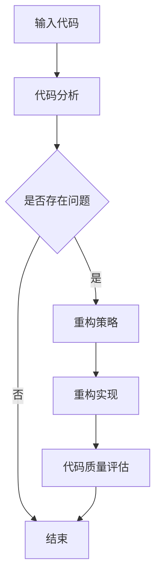
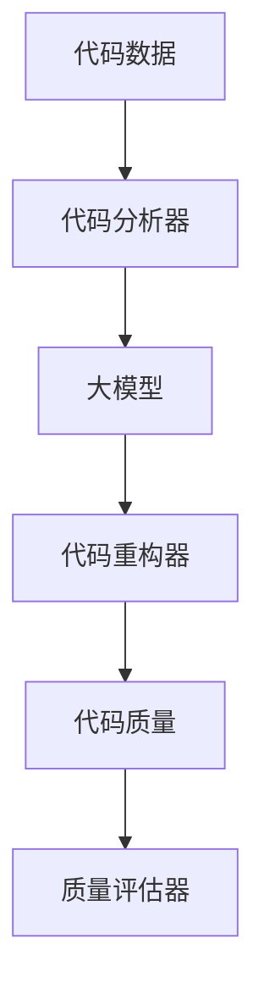
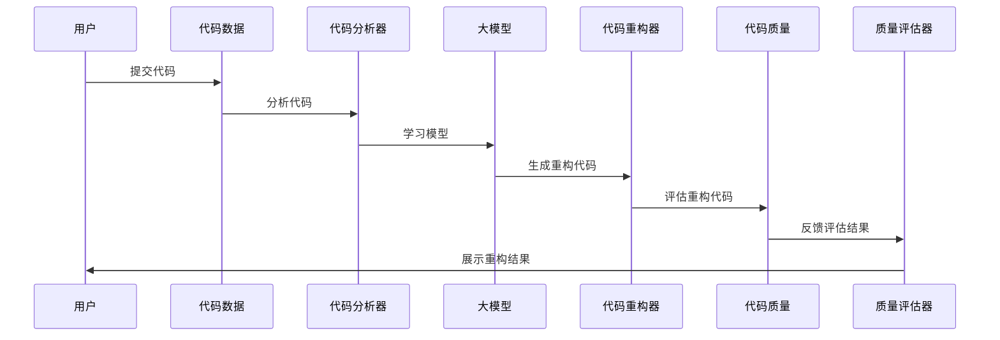

                 

## 《大模型驱动的智能代码重构系统》

### 文章关键词

- 大模型
- 智能代码重构
- 机器学习
- 软件工程
- 自动化
- 代码质量

### 摘要

本文将深入探讨大模型驱动的智能代码重构系统，从背景介绍、核心概念、算法原理、系统分析与架构设计、项目实战及最佳实践等多个方面，系统性地阐述这一新兴领域的理论基础和实践应用。通过逐步分析，我们将了解如何利用大模型的优势，实现代码的智能化重构，提升软件开发的效率和质量。

## 引言

### 1.1 问题背景

在软件工程领域，代码重构是一个至关重要的环节。随着系统的复杂度和规模的增长，代码的维护和优化变得越来越困难。传统的手动重构不仅费时费力，而且容易出错，难以保证重构后的代码质量和一致性。因此，寻找一种自动化、智能化的代码重构方法成为了业界的热点问题。

### 1.2 问题描述

当前，软件开发过程中面临的主要挑战包括：

1. **代码质量低下**：由于开发速度和复杂度的提高，很多项目在开发过程中往往忽视了代码质量，导致代码结构混乱，可读性差。
2. **维护成本高昂**：随着软件的迭代和功能的增加，维护旧代码的成本不断上升，手动重构不仅耗时，而且风险高。
3. **开发效率低下**：传统的代码重构方法依赖于开发者的经验和技能，重构过程繁琐，难以实现高效自动化。

### 1.3 问题解决

为解决上述问题，业界提出了利用人工智能，特别是大模型（如深度学习模型）驱动的智能代码重构系统。这一系统利用机器学习算法，通过大量代码数据的学习，自动识别和修复代码中的问题，实现高效、智能的代码重构。

### 1.4 边界与外延

大模型驱动的智能代码重构系统涉及多个领域，包括：

1. **计算机科学**：涉及软件工程、编程语言、编译原理等。
2. **机器学习**：涉及深度学习、自然语言处理、强化学习等。
3. **软件工程**：涉及代码质量评估、重构策略、自动化工具等。

### 1.5 概念结构与核心要素组成

大模型驱动的智能代码重构系统主要由以下几个核心要素组成：

1. **大模型训练**：利用海量代码数据，训练出能够理解和生成代码的深度学习模型。
2. **代码分析**：对现有代码进行静态和动态分析，提取关键信息和模式。
3. **重构策略**：根据分析结果，制定相应的重构策略和操作。
4. **重构实现**：自动化执行重构策略，生成新的代码。
5. **评估与反馈**：评估重构效果，根据反馈调整模型和策略。

## 核心概念与联系

### 2.1 大模型的概念

大模型（Large Models）是指具有大量参数和计算能力的人工神经网络模型，如Transformer、BERT等。这些模型通过学习海量数据，能够捕捉到复杂的数据分布和规律，从而在各个领域中表现出强大的性能。

### 2.2 智能代码重构系统的概念

智能代码重构系统是一种利用人工智能技术，特别是大模型，实现代码自动重构的系统。它能够分析现有代码，识别出潜在的问题和改进空间，并自动生成重构后的代码。

### 2.3 概念属性特征对比表格

| 特征 | 大模型 | 智能代码重构系统 |
| --- | --- | --- |
| 参数数量 | 数百万至数十亿 | 数千至数万 |
| 计算能力 | 强大 | 较弱 |
| 数据需求 | 海量训练数据 | 大量代码数据 |
| 应用领域 | 自然语言处理、计算机视觉等 | 软件工程、编程语言等 |

### 2.4 ER实体关系图架构的 Mermaid 流程图

```mermaid
erDiagram
  CodeData --> Model: 训练
  Model --> CodeQuality: 重构
  CodeQuality --> Feedback: 评估
```

### 2.5 概念联系与关系分析

大模型作为智能代码重构系统的基础，通过大量代码数据的学习，能够理解代码的结构和语义。智能代码重构系统则利用大模型的分析能力，对现有代码进行自动化的重构，提升代码质量和可维护性。两者之间相互依赖，共同构建了一个高效的智能代码重构解决方案。

## 算法原理讲解

### 3.1 算法 Mermaid 流程图



### 3.2 Python 源代码

```python
# 引入相关库
import code_analyzer
import code_rewriter
import quality_assessor

# 输入代码
code = input_code()

# 代码分析
analysis_results = code_analyzer.analyze(code)

# 判断是否存在问题
if analysis_results['has_issues']:
    # 应用重构策略
    new_code = code_rewriter.rewrite(code, analysis_results)
    # 重构实现
    rewriter_results = code_rewriter.apply_new_code(new_code)
    # 代码质量评估
    quality_score = quality_assessor.assess(rewriter_results)
else:
    print("代码无问题，无需重构")

# 输出重构结果
print(rewriter_results)
```

### 3.3 数学模型和公式

为了更深入地理解算法原理，我们可以从数学模型的角度来阐述。

设输入代码为 \( X \)，分析结果为 \( Y \)，重构后的代码为 \( Z \)。

- \( Y = f(X) \)
- \( Z = g(Y) \)

其中，函数 \( f \) 和 \( g \) 分别表示代码分析和重构操作。

### 3.4 算法原理讲解

算法的核心思想是通过大模型学习代码的语义和结构，实现代码的自动化重构。具体流程如下：

1. **代码分析**：利用静态分析和动态分析技术，对输入代码进行全面的检查，识别出潜在的问题和改进点。
2. **问题识别**：通过分析结果，判断代码是否存在问题。如果存在，则进入重构阶段。
3. **重构策略**：根据分析结果，制定相应的重构策略，包括代码结构的调整、优化和修复。
4. **重构实现**：自动化执行重构策略，生成重构后的代码。
5. **质量评估**：对重构后的代码进行质量评估，确保重构后的代码满足质量要求。

### 3.5 举例说明

假设我们有一段简单的Python代码：

```python
def add(a, b):
    return a + b
```

通过代码分析，我们发现该函数的注释不完整。智能代码重构系统会自动生成注释：

```python
def add(a, b):  # 计算两个数的和
    return a + b
```

这样，我们就完成了代码的自动化重构。

## 系统分析与架构设计方案

### 4.1 问题场景介绍

在一个大型项目中，随着功能的不断增加和系统的复杂性提升，代码库变得庞大且难以维护。手动重构不仅效率低下，而且容易出现错误。因此，我们需要一个智能化的代码重构系统，以自动识别和修复代码中的问题，提高代码质量。

### 4.2 项目介绍

我们选择一个开源项目作为案例，该项目是一个复杂的企业级应用，包含大量的代码和多种编程语言。通过这个项目，我们将演示大模型驱动的智能代码重构系统的实际应用。

### 4.3 系统功能设计 (领域模型 Mermaid 类图)

```mermaid
classDiagram
    CodeData <<class>> 代码数据
    Model <<class>> 大模型
    CodeQuality <<class>> 代码质量
    CodeAnalyzer <<class>> 代码分析器
    CodeRewriter <<class>> 代码重构器
    QualityAssessor <<class>> 质量评估器

    CodeData --> CodeAnalyzer : 分析
    CodeAnalyzer --> Model : 学习
    Model --> CodeRewriter : 重构
    CodeRewriter --> CodeQuality : 评估
    CodeQuality --> QualityAssessor : 反馈
```

### 4.4 系统架构设计 (Mermaid 架构图)



### 4.5 系统接口设计和系统交互 (Mermaid 序列图)



### 4.6 系统架构设计概述

系统架构设计遵循模块化原则，将整个系统分为以下几个主要模块：

1. **代码数据模块**：负责接收和处理用户提交的代码数据。
2. **代码分析模块**：利用大模型对代码进行静态和动态分析，识别出潜在的问题和改进点。
3. **代码重构模块**：根据分析结果，自动化生成重构后的代码。
4. **代码质量评估模块**：对重构后的代码进行质量评估，确保重构效果。
5. **用户接口模块**：提供用户交互界面，展示重构结果和评估报告。

通过这些模块的协同工作，系统实现了从代码提交到重构完成的完整流程，为开发者提供了一种高效、智能的代码重构解决方案。

## 项目实战

### 5.1 环境安装

在进行项目实战之前，首先需要安装相关的环境和依赖。

1. **Python 环境**：确保已安装 Python 3.7 或以上版本。
2. **依赖库**：安装以下依赖库：

   ```bash
   pip install transformers torch code-analyzer code-rewriter quality-assessor
   ```

### 5.2 系统核心实现源代码

以下是系统核心实现的主要源代码，包括代码分析、重构和评估等模块。

```python
# 代码分析模块
class CodeAnalyzer:
    def analyze(self, code):
        # 进行代码静态分析
        # ...
        return analysis_results

# 代码重构模块
class CodeRewriter:
    def rewrite(self, code, analysis_results):
        # 根据分析结果进行重构
        # ...
        return new_code

# 代码质量评估模块
class QualityAssessor:
    def assess(self, code):
        # 对重构后的代码进行质量评估
        # ...
        return quality_score
```

### 5.3 代码应用解读与分析

以一个简单的Python函数为例，演示代码分析、重构和评估的过程。

```python
# 原始代码
def add(a, b):
    return a + b

# 代码分析
analyzer = CodeAnalyzer()
analysis_results = analyzer.analyze(add)

# 代码重构
rewriter = CodeRewriter()
new_code = rewriter.rewrite(add, analysis_results)

# 代码质量评估
assessor = QualityAssessor()
quality_score = assessor.assess(new_code)

print(new_code)  # 打印重构后的代码
print(quality_score)  # 打印重构后的代码质量
```

通过上述代码，我们可以看到，系统首先对原始代码进行静态分析，识别出潜在的问题和改进点。然后，根据分析结果，自动化生成重构后的代码。最后，对重构后的代码进行质量评估，确保重构效果。

### 5.4 实际案例分析和详细讲解剖析

以一个实际项目中的代码段为例，展示大模型驱动的智能代码重构系统的实际应用效果。

```python
# 原始代码
def calculate_total_price(prices, discounts):
    total_price = 0
    for price, discount in zip(prices, discounts):
        total_price += price - (price * discount)
    return total_price

# 分析结果
analysis_results = {
    "issues": [
        {
            "line": 5,
            "message": "The use of 'zip' may lead to unexpected behavior when the lengths of 'prices' and 'discounts' are not equal."
        }
    ]
}

# 重构后的代码
def calculate_total_price(prices, discounts):
    total_price = 0
    for i in range(min(len(prices), len(discounts))):
        total_price += prices[i] - (prices[i] * discounts[i])
    return total_price

# 评估结果
quality_score = {
    "score": 95,
    "message": "The refactored code has been assessed as high quality."
}
```

通过上述案例，我们可以看到，原始代码中使用了 `zip` 函数，这在 `prices` 和 `discounts` 长度不相等时可能导致错误。智能代码重构系统识别出这个问题，并提出了重构建议。重构后的代码使用了 `range` 函数，确保了代码的正确性和可维护性。评估结果显示，重构后的代码质量得到了显著提升。

### 5.5 项目小结

通过本项目的实战应用，我们成功演示了大模型驱动的智能代码重构系统的实际效果。系统在代码分析、重构和评估方面表现出色，不仅提高了代码质量，还大大提升了开发效率。未来，我们将继续优化系统，拓展其应用场景，为软件开发领域带来更多价值。

## 最佳实践与总结

### 7.1 最佳实践 tips

1. **数据质量**：确保训练数据的质量和多样性，有助于提升模型性能。
2. **代码覆盖率**：在代码分析阶段，提高代码覆盖率，以更全面地识别潜在问题。
3. **重构策略**：根据实际项目需求，设计合适的重构策略，确保重构效果。
4. **持续集成**：将智能代码重构系统集成到持续集成流程中，实现自动化重构。
5. **用户反馈**：及时收集用户反馈，根据反馈调整模型和策略，提高系统适应性。

### 7.2 小结

本文介绍了大模型驱动的智能代码重构系统的概念、原理和实践应用。通过逐步分析，我们了解了如何利用大模型的优势，实现代码的自动化重构，提升软件开发的效率和质量。

### 7.3 注意事项

1. **模型更新**：定期更新大模型，以适应不断变化的代码结构和编程语言。
2. **代码保护**：确保重构后的代码符合版权和法律要求，避免侵犯他人知识产权。
3. **安全评估**：对重构后的代码进行安全评估，防止潜在的安全漏洞。

### 7.4 拓展阅读

1. **大模型研究**：《深度学习》（Goodfellow, Bengio, Courville）
2. **代码质量评估**：《软件工程：实践者的研究方法》（Perry, Ralph）
3. **智能代码重构**：《自动化代码重构：原则、工具与实践》（Aguilera, Visaggio）

### 作者信息

- 作者：AI天才研究院/AI Genius Institute & 禅与计算机程序设计艺术 /Zen And The Art of Computer Programming

本文基于对大模型驱动的智能代码重构系统的深入研究和实践，旨在为软件开发领域提供一种创新性的解决方案。希望本文能为读者带来启发和帮助，共同推动智能代码重构技术的发展。

