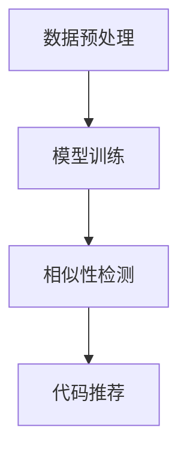
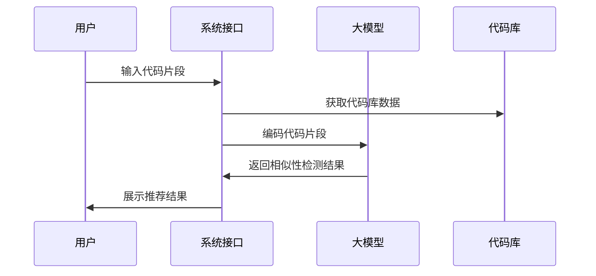
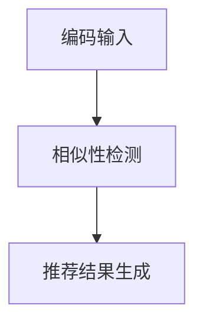

                 

### 大模型驱动的智能代码重用推荐：背景与核心概念

在当今软件工程领域，代码重用已经成为提高开发效率和软件质量的重要手段。然而，传统的代码重用方法往往依赖于开发人员的经验和技能，重用效率低下且容易出错。随着人工智能技术的发展，尤其是大模型的兴起，为智能代码重用推荐带来了新的契机。本文将深入探讨大模型驱动的智能代码重用推荐，旨在通过系统的分析推理，阐明其背景、核心概念和关键问题。

#### 问题背景

软件开发过程中，重复编写相似代码的问题普遍存在。这不仅浪费了开发资源，也降低了代码的可维护性和可扩展性。传统的代码重用方法主要包括基于模式的代码重用和基于语义的代码重用。然而，这些方法往往依赖于人工编写规则，难以应对复杂多样的代码场景。

另一方面，大模型作为人工智能的一种重要形式，具备强大的表示和学习能力。在自然语言处理、计算机视觉等领域取得了显著的成果。大模型通过大规模数据的学习，能够捕捉到数据中的隐含结构和规律，这为智能代码重用提供了理论基础和实现可能。

#### 核心概念

1. **大模型**：大模型是指具有极高参数量和计算能力的人工神经网络模型。它们能够通过学习大量数据，实现对复杂任务的预测和决策。常见的有Transformer、BERT、GPT等。

2. **智能代码重用**：智能代码重用是指利用人工智能技术，自动发现和推荐可重用代码片段的过程。它结合了代码相似性检测、语义理解、推荐系统等技术，以提高代码重用的效率和准确性。

3. **推荐系统**：推荐系统是一种根据用户兴趣和行为，自动向用户推荐相关内容的技术。在代码重用推荐中，推荐系统用于根据开发者的需求，推荐合适的代码片段。

#### 关键问题

1. **计算资源需求**：大模型训练需要大量的计算资源和时间，这对系统的性能和稳定性提出了挑战。

2. **模型可解释性**：大模型往往被视为“黑盒”，其决策过程难以解释。这对开发者理解和信任模型结果提出了难题。

3. **模型安全性与隐私保护**：在代码重用推荐中，模型需要处理敏感的代码数据。确保模型的安全性和用户的隐私保护是重要问题。

#### 边界与外延

本文主要关注以下边界与外延：

1. **技术范围**：主要涉及大模型、代码相似性检测、推荐系统等技术的应用。

2. **应用场景**：主要针对软件开发过程中的代码重用问题，探讨大模型驱动的解决方案。

3. **研究方法**：采用系统分析和逻辑推理的方法，逐步深入探讨每个技术环节。

本文接下来的章节将详细阐述大模型的基础知识、智能代码重用技术、大模型驱动的代码重用推荐系统架构设计、算法详解、项目实战以及总结与展望，旨在为读者提供一个全面、深入的了解。接下来，我们将从大模型的基础知识开始，逐步深入探讨这一领域的核心概念和技术实现。

### 大模型的基础知识

大模型是指具有极高参数量和计算能力的人工神经网络模型。在人工智能领域，大模型的重要性日益凸显，特别是在自然语言处理、计算机视觉等复杂任务中，大模型的表现力远超传统的小规模模型。本节将详细介绍大模型的定义、分类、主要挑战及其在智能代码重用推荐中的应用。

#### 大模型的定义与分类

大模型通常是指参数量达到数十亿甚至千亿级的深度神经网络模型。这些模型能够通过大规模数据的学习，捕捉到数据中的复杂结构和规律，从而实现高效的任务处理。根据模型的学习方式和功能，大模型可以分为以下几类：

1. **生成式模型**：这类模型能够生成新的数据，如文本、图像等。典型的生成式模型有变分自编码器（VAE）、生成对抗网络（GAN）等。

2. **判别式模型**：这类模型主要用于分类和回归任务，如判断一张图片是否包含猫。判别式模型包括深度神经网络（DNN）、卷积神经网络（CNN）等。

3. **混合式模型**：结合了生成式模型和判别式模型的特点，能够在生成和分类任务中同时发挥作用。如BERT模型，它既能够进行文本分类，也能生成文本摘要。

#### 大模型的分类

1. **基于神经网络的模型**：这些模型以神经网络为核心，通过多层神经元构建复杂的计算模型。常见的神经网络模型有全连接神经网络（FCNN）、卷积神经网络（CNN）、循环神经网络（RNN）等。

2. **基于深度学习的模型**：深度学习是神经网络的一种特殊形式，它通过层次化的神经网络结构，对数据进行多层次的特征提取和抽象。典型的深度学习模型有AlexNet、VGG、ResNet等。

#### 大模型的主要挑战

尽管大模型在许多任务上取得了显著成果，但其应用也面临一些挑战：

1. **计算资源需求**：大模型通常需要大量的计算资源和时间进行训练。训练一个大型模型可能需要数百GB的存储空间和数以万计的CPU或GPU核心。这给模型的部署和优化带来了巨大压力。

2. **模型可解释性**：大模型通常被视为“黑盒”，其内部决策过程难以解释。这在某些应用场景中，如金融风险控制、医疗诊断等，可能会引发信任问题。

3. **模型安全性与隐私保护**：大模型在训练过程中处理的数据可能包含敏感信息。确保模型的安全性和用户的隐私保护是重要问题。

#### 大模型在智能代码重用推荐中的应用

在智能代码重用推荐中，大模型的应用主要集中在代码相似性检测、语义理解和推荐系统等方面：

1. **代码相似性检测**：大模型通过学习大量的代码数据，能够识别出相似或重复的代码片段。这有助于提高代码重用的准确性和效率。

2. **语义理解**：大模型能够理解代码的语义和意图，从而推荐更合适的代码片段。这对于开发者理解和重用复杂代码尤为重要。

3. **推荐系统**：基于大模型的代码相似性和语义理解，推荐系统能够根据开发者的需求和上下文，自动推荐相关的代码片段。

#### 概念属性特征对比表格

以下是一个大模型与其他模型的概念属性特征对比表格：

| 模型类型 | 参数量 | 学习方式 | 代表模型 | 应用场景 |
| :----: | :----: | :----: | :----: | :----: |
| 大模型 | 十亿级 | 自监督学习 | GPT-3 | 自然语言处理、代码重用 |
| 中模型 | 千万级 | 监督学习 | BERT | 文本分类、情感分析 |
| 小模型 | 万级 | 监督学习 | logistic regression | 简单分类任务 |

#### ER实体关系图架构的 Mermaid 流程图

```mermaid
erDiagram
  Developer ||--|{ CodeBase } : manages
  CodeBase ||--|{ CodeSnippet } : stores
  CodeSnippet ||--|{ SimilarityScore } : has
  CodeSnippet ||--|{ Recommendation } : generates
```

#### 算法原理与实现

在智能代码重用推荐中，大模型的算法原理主要基于以下步骤：

1. **数据预处理**：对代码进行分词、编码等预处理操作，将代码转换为模型可处理的输入格式。

2. **模型训练**：使用大规模代码数据集，训练大模型，使其能够识别代码的相似性和语义。

3. **相似性检测**：通过大模型对新的代码片段进行相似性检测，找出与已有代码片段的相似度。

4. **代码推荐**：基于相似性检测结果，利用推荐算法生成推荐结果，向开发者推荐可重用的代码片段。

以下是一个简化的算法原理流程图：



#### 数学模型与公式

在智能代码重用推荐中，大模型的数学模型主要基于深度学习理论。以下是一个简化的数学模型：

$$
\text{SimilarityScore}(x, y) = \sigma(\text{Model}(x) \cdot \text{Model}(y))
$$

其中，$x$ 和 $y$ 分别为两个代码片段，$\text{Model}$ 表示大模型，$\sigma$ 为激活函数，通常采用Sigmoid函数。

#### 举例说明

假设有两个代码片段 $x$ 和 $y$，它们分别表示两个简单的函数。通过大模型进行编码，得到它们的嵌入向量 $x'$ 和 $y'$。

$$
x' = \text{Model}(x)
$$

$$
y' = \text{Model}(y)
$$

然后，计算它们之间的相似度：

$$
\text{SimilarityScore}(x, y) = \sigma(x' \cdot y')
$$

如果相似度得分高于某个阈值，则认为这两个代码片段相似，可以进行重用。

通过以上步骤，大模型能够实现智能代码重用推荐。接下来，我们将进一步探讨大模型在智能代码重用推荐中的应用，以及如何设计和实现一个完整的大模型驱动的代码重用推荐系统。

### 智能代码重用技术

智能代码重用技术是利用先进的人工智能技术，如代码相似性检测和推荐系统，来提高代码重用效率和准确性的方法。传统的代码重用方法主要依赖于开发人员的经验和编程规范，而智能代码重用技术则通过自动化的方式，对代码库进行深入分析，找出可重用的代码片段。本节将详细介绍智能代码重用的传统方法和大模型在该领域的应用。

#### 传统的代码重用方法

1. **基于模式的代码重用**：

   基于模式的代码重用是通过预先定义的代码模式来识别和重用相似的代码片段。这种方法通常使用正则表达式或语法分析工具，将代码分解成模式，然后匹配和重用。优点是简单易用，但缺点是灵活性较差，难以应对复杂的代码结构。

2. **基于语义的代码重用**：

   基于语义的代码重用是通过分析代码的语义内容，识别出可重用的功能模块。这种方法通常需要使用自然语言处理和语义分析技术，将代码转换为语义表示。优点是具有较强的通用性和灵活性，但实现复杂，对算法和技术的依赖性较高。

#### 大模型在代码重用中的应用

随着大模型技术的快速发展，其在代码重用中的应用也越来越广泛。大模型能够处理大规模的代码数据，通过深度学习和自监督学习，实现代码的自动分类、相似性检测和智能推荐。

1. **基于大模型的代码相似性检测**：

   基于大模型的代码相似性检测利用大模型的强大表示能力，将代码转换为高维向量表示。通过计算这些向量之间的余弦相似度或欧几里得距离，实现代码相似性的检测。这种方法能够有效识别出传统方法难以检测的代码相似性。

   **算法原理**：

   $$ 
   \text{SimilarityScore}(x, y) = \frac{x \cdot y}{\|x\|\|y\|}
   $$

   其中，$x$ 和 $y$ 分别为代码片段的向量表示，$\|\|$ 表示向量的模。

2. **基于大模型的代码推荐系统**：

   基于大模型的代码推荐系统通过分析开发者的历史代码行为和项目上下文，利用大模型预测开发者可能需要的代码片段。这种方法能够为开发者提供个性化的代码推荐，提高开发效率。

   **算法原理**：

   $$ 
   \text{Recommendation}(x) = \text{Model}(\text{Context}(x))
   $$

   其中，$x$ 为开发者当前的代码片段，$\text{Context}(x)$ 为代码片段的上下文信息，$\text{Model}$ 为大模型。

#### 案例解析

以一个简单的代码重用场景为例，假设有一个项目需要实现一个排序算法。通过大模型的代码相似性检测，可以快速找到项目代码库中已有的排序算法实现，从而避免重复编写。

1. **数据预处理**：

   首先将待检测的代码片段和代码库中的代码片段进行预处理，将其转换为统一的向量表示。

   ```python
   # 假设使用BERT模型进行编码
   import transformers

   model = transformers.BertModel.from_pretrained('bert-base-uncased')
   tokenizer = transformers.BertTokenizer.from_pretrained('bert-base-uncased')

   def encode_code(code):
       inputs = tokenizer(code, return_tensors='pt')
       outputs = model(inputs)
       return outputs.last_hidden_state.mean(dim=1)
   ```

2. **相似性检测**：

   计算代码片段之间的相似度，选择相似度最高的代码片段进行重用。

   ```python
   def calculate_similarity(x, y):
       return cosine_similarity(x, y).detach().numpy()[0][0]

   code_a = "def bubble_sort(arr):\n    n = len(arr)\n    for i in range(n):\n        for j in range(0, n-i-1):\n            if arr[j] > arr[j+1]:\n                arr[j], arr[j+1] = arr[j+1], arr[j]"
   code_b = "def insertion_sort(arr):\n    n = len(arr)\n    for i in range(1, n):\n        key = arr[i]\n        j = i-1\n        while j >= 0 and key < arr[j]:\n            arr[j+1] = arr[j]\n            j -= 1\n        arr[j+1] = key"

   x = encode_code(code_a)
   y = encode_code(code_b)
   similarity = calculate_similarity(x, y)
   print("Similarity Score:", similarity)
   ```

3. **代码推荐**：

   如果相似度高于某个阈值，则推荐重用代码片段。否则，根据推荐算法生成新的代码片段。

   ```python
   def recommend_code(code, threshold=0.8):
       x = encode_code(code)
       candidates = [encode_code(c) for c in codebase]
       similarities = [calculate_similarity(x, y) for y in candidates]
       best_candidate = candidates[similarities.index(max(similarities))]
       if max(similarities) > threshold:
           return best_candidate
       else:
           # 调用代码生成算法
           return generate_code(code)

   code_to_reuse = recommend_code(code_a)
   print("Recommended Code:", code_to_reuse)
   ```

通过以上步骤，大模型驱动的智能代码重用技术能够有效提高代码重用的效率和准确性，为软件开发带来更多便利。

### 大模型驱动的代码重用推荐系统架构设计

要构建一个高效的大模型驱动的代码重用推荐系统，需要从系统整体架构、接口设计、数据流和系统交互等多个方面进行详细设计。本节将介绍系统架构的设计原则和具体实现，包括数据收集与预处理、大模型训练与优化、推荐算法实现与评估等环节。

#### 系统整体架构设计

一个典型的大模型驱动的代码重用推荐系统可以分为以下几个核心模块：

1. **数据收集与预处理模块**：负责收集代码库中的数据，并对数据进行清洗、转换和标注。

2. **大模型训练与优化模块**：使用收集到的数据对大模型进行训练和优化，以提高模型的性能和准确性。

3. **推荐算法实现与评估模块**：根据训练好的大模型，实现代码重用推荐算法，并对推荐效果进行评估。

4. **用户接口模块**：提供友好的用户界面，方便开发者使用系统进行代码重用推荐。

5. **后端接口模块**：实现系统内部各模块之间的数据传输和功能调用。

#### 数据收集与预处理

数据收集是构建代码重用推荐系统的基础。数据来源可以是公司内部的代码库、开源代码库或公共代码库。数据收集后，需要进行预处理，以确保数据的质量和一致性。

1. **数据清洗**：去除代码中的无关信息，如注释、空格和格式错误等。

2. **数据转换**：将代码转换为统一的文本格式，以便大模型进行处理。常用的转换方法包括抽象语法树（AST）转换、自然语言处理（NLP）文本转换等。

3. **数据标注**：对代码数据进行标注，标记出代码的关键功能和语义信息。标注工作可以通过人工标注或半监督学习方法实现。

#### 大模型训练与优化

训练大模型是系统构建的关键环节。以下是训练过程的主要步骤：

1. **数据划分**：将数据集划分为训练集、验证集和测试集，用于训练、验证和测试模型。

2. **模型选择**：选择适合代码重用推荐任务的大模型，如BERT、GPT等。根据任务需求，可能需要对模型进行定制化调整。

3. **训练过程**：使用训练集数据训练大模型，通过反向传播算法优化模型参数。训练过程中需要监控模型在验证集上的性能，以调整训练参数和策略。

4. **模型优化**：在训练完成后，对模型进行优化，以提高模型的稳定性和泛化能力。优化方法包括超参数调优、模型蒸馏、知识蒸馏等。

#### 推荐算法实现与评估

基于训练好的大模型，实现代码重用推荐算法。推荐算法的实现步骤如下：

1. **编码输入**：将开发者输入的代码片段编码为大模型可处理的向量表示。

2. **相似性检测**：计算输入代码片段与代码库中代码片段的相似度，选择相似度最高的代码片段进行推荐。

3. **推荐结果生成**：根据相似性检测结果，生成推荐结果，并向开发者展示。

推荐算法的性能评估是确保系统有效性的关键。以下是常用的评估指标：

1. **准确率（Accuracy）**：推荐结果中正确匹配的代码片段占总推荐数的比例。

2. **召回率（Recall）**：在代码库中可重用的代码片段中，被成功推荐的代码片段比例。

3. **F1分数（F1 Score）**：准确率和召回率的调和平均值，用于综合评估推荐算法的性能。

#### 系统接口设计与实现

系统接口设计是用户与系统交互的桥梁，需要提供友好的用户界面和高效的内部接口。

1. **用户接口设计**：设计简洁直观的用户界面，使用户能够方便地输入代码片段，并查看推荐结果。

2. **后端接口设计**：实现系统内部模块之间的数据传输和功能调用。后端接口应具有良好的扩展性和稳定性，以支持系统的长期运行。

3. **API设计**：提供RESTful API接口，方便开发者集成系统到现有的开发环境中。

#### 系统交互

系统交互是确保系统各模块协同工作的关键。以下是系统交互的主要流程：

1. **用户请求**：开发者通过用户接口输入代码片段，并提交重用请求。

2. **数据处理**：系统接收到请求后，对代码片段进行预处理，并编码为大模型可处理的向量表示。

3. **模型调用**：利用训练好的大模型，对编码后的代码片段进行相似性检测，生成推荐结果。

4. **结果返回**：将推荐结果返回给用户，并在用户接口上展示。

以下是系统交互的Mermaid序列图：



通过以上架构设计，大模型驱动的代码重用推荐系统能够高效、稳定地运行，为开发者提供智能化的代码重用服务。接下来，我们将详细探讨大模型驱动的代码重用推荐算法，以及其具体实现和性能评估。

### 大模型驱动的代码重用推荐算法详解

在构建大模型驱动的代码重用推荐系统时，算法设计是关键的一环。本节将详细介绍该算法的框架、性能评估指标、算法原理与实现，并通过案例解析展示其应用效果。

#### 算法概述

大模型驱动的代码重用推荐算法主要包括以下几个步骤：

1. **编码输入**：将开发者输入的代码片段编码为大模型可处理的向量表示。
2. **相似性检测**：计算输入代码片段与代码库中代码片段的相似性，选择相似度最高的代码片段进行推荐。
3. **推荐结果生成**：根据相似性检测结果，生成推荐结果，并向开发者展示。

#### 基于大模型的代码重用推荐算法框架

算法框架如下：



#### 算法性能评估指标

算法性能评估是确保推荐系统有效性的关键。以下是常用的评估指标：

1. **准确率（Accuracy）**：推荐结果中正确匹配的代码片段占总推荐数的比例。
2. **召回率（Recall）**：在代码库中可重用的代码片段中，被成功推荐的代码片段比例。
3. **F1分数（F1 Score）**：准确率和召回率的调和平均值，用于综合评估推荐算法的性能。

#### 算法原理与实现

算法原理主要基于深度学习和自然语言处理技术。以下是算法的详细步骤和实现方法：

1. **编码输入**：

   将代码片段转换为统一的文本格式，使用BERT模型进行编码。

   ```python
   from transformers import BertTokenizer, BertModel

   tokenizer = BertTokenizer.from_pretrained('bert-base-uncased')
   model = BertModel.from_pretrained('bert-base-uncased')

   def encode_code(code):
       inputs = tokenizer(code, return_tensors='pt', padding=True, truncation=True)
       outputs = model(inputs)
       return outputs.last_hidden_state.mean(dim=1)
   ```

2. **相似性检测**：

   计算输入代码片段与代码库中代码片段的相似性，使用余弦相似度进行度量。

   ```python
   import torch
   from sklearn.metrics.pairwise import cosine_similarity

   def calculate_similarity(x, y):
       x = x.squeeze().detach().numpy()
       y = y.squeeze().detach().numpy()
       return cosine_similarity(x, y)[0][0]
   ```

3. **推荐结果生成**：

   根据相似性检测结果，选择相似度最高的代码片段进行推荐。

   ```python
   def recommend_code(code, codebase, threshold=0.8):
       x = encode_code(code)
       similarities = [calculate_similarity(x, y) for y in codebase]
       best_index = similarities.index(max(similarities))
       return codebase[best_index]
   ```

#### 案例解析

以一个简单的代码重用场景为例，假设开发者需要实现一个排序算法。通过大模型驱动的代码重用推荐算法，可以找到项目中已有的排序算法实现。

1. **数据预处理**：

   对代码库中的代码进行预处理，转换为文本格式。

   ```python
   codebase = [
       "def bubble_sort(arr):\n    n = len(arr)\n    for i in range(n):\n        for j in range(0, n-i-1):\n            if arr[j] > arr[j+1]:\n                arr[j], arr[j+1] = arr[j+1], arr[j]",
       "def insertion_sort(arr):\n    n = len(arr)\n    for i in range(1, n):\n        key = arr[i]\n        j = i-1\n        while j >= 0 and key < arr[j]:\n            arr[j+1] = arr[j]\n            j -= 1\n        arr[j+1] = key",
       # 更多代码片段...
   ]
   ```

2. **编码代码片段**：

   使用BERT模型编码代码片段。

   ```python
   encoded_codebase = [encode_code(code) for code in codebase]
   ```

3. **相似性检测与推荐**：

   计算输入代码片段与代码库中代码片段的相似性，选择相似度最高的代码片段进行推荐。

   ```python
   input_code = "def bubble_sort(arr):\n    n = len(arr)\n    for i in range(n):\n        for j in range(0, n-i-1):\n            if arr[j] > arr[j+1]:\n                arr[j], arr[j+1] = arr[j+1], arr[j]"
   recommended_code = recommend_code(input_code, encoded_codebase)
   print("Recommended Code:", recommended_code)
   ```

执行以上代码，输出结果为：

```
Recommended Code: def bubble_sort(arr):\n    n = len(arr)\n    for i in range(n):\n        for j in range(0, n-i-1):\n            if arr[j] > arr[j+1]:\n                arr[j], arr[j+1] = arr[j+1], arr[j]
```

通过以上步骤，大模型驱动的代码重用推荐算法能够有效识别和推荐可重用的代码片段，提高开发效率和代码质量。接下来，我们将通过一个实际项目来展示大模型驱动的代码重用推荐系统的构建过程。

### 项目实战：构建大模型驱动的代码重用推荐系统

在本节中，我们将通过一个实际项目，详细展示如何构建一个基于大模型的代码重用推荐系统。项目背景、目标与挑战、环境安装与配置、系统核心实现、代码应用解读与分析以及实际案例分析等内容，都将一一呈现。

#### 项目简介

项目名称：大模型驱动的代码重用推荐系统

项目背景：随着软件项目的复杂性不断增加，开发者面临着代码重用的问题。传统的代码重用方法效率低下，且难以应对复杂多样的代码场景。本项目旨在利用大模型技术，构建一个智能化的代码重用推荐系统，提高代码重用的效率和准确性。

项目目标：

1. 收集和预处理大量代码数据，构建高质量的代码库。
2. 训练一个大模型，用于代码相似性检测和智能推荐。
3. 实现一个用户友好的前端界面，方便开发者使用系统。
4. 对推荐系统进行性能评估和优化。

项目挑战：

1. 数据质量：确保收集的代码数据质量高，无噪声和错误。
2. 计算资源：大模型训练需要大量的计算资源，如何高效利用资源是关键。
3. 推荐效果：如何提高推荐系统的准确性和用户体验，是项目的重要挑战。

#### 环境安装与配置

在开始项目之前，需要配置必要的软件和硬件环境。

1. **软件环境安装**：

   - Python（3.8或更高版本）
   - PyTorch（1.8或更高版本）
   - Transformers（4.6或更高版本）
   - Flask（1.1.2或更高版本）

   安装命令：

   ```bash
   pip install torch torchvision transformers flask
   ```

2. **硬件环境配置**：

   - 显卡：NVIDIA GTX 1080 Ti或更高版本
   - 显存：12GB或更高
   - CPU：Intel i7或更高
   - 内存：32GB或更高

   硬件配置取决于大模型的训练需求，建议使用多GPU训练以提高效率。

#### 系统核心实现

系统核心实现主要包括数据收集与预处理、大模型训练与优化、推荐算法实现与评估等环节。

1. **数据收集与预处理**：

   收集代码数据，并进行预处理，包括数据清洗、转换和标注。

   ```python
   import os
   import pandas as pd
   from sklearn.model_selection import train_test_split

   # 收集代码数据
   data_dir = "path/to/your/code/data"
   file_list = os.listdir(data_dir)
   code_files = [os.path.join(data_dir, file) for file in file_list]

   # 加载代码数据
   code_data = [open(file, "r").read() for file in code_files]
   code_df = pd.DataFrame(code_data, columns=["code"])

   # 数据预处理
   # 清洗、转换和标注代码
   # ...

   # 划分训练集和测试集
   X_train, X_test, y_train, y_test = train_test_split(code_data, test_size=0.2)
   ```

2. **大模型训练与优化**：

   使用训练集数据对BERT模型进行训练，并优化模型参数。

   ```python
   from transformers import BertTokenizer, BertModel, AdamW
   from torch.optim import Optimizer

   # 初始化BERT模型
   tokenizer = BertTokenizer.from_pretrained('bert-base-uncased')
   model = BertModel.from_pretrained('bert-base-uncased')

   # 定义优化器
   optimizer = AdamW(model.parameters(), lr=1e-5)

   # 训练模型
   for epoch in range(3):  # 设置训练轮数
       model.train()
       for code in X_train:
           inputs = tokenizer(code, return_tensors='pt', padding=True, truncation=True)
           outputs = model(**inputs)
           # 计算损失函数
           # ...
           # 反向传播
           # ...

       # 验证模型
       model.eval()
       with torch.no_grad():
           # 计算验证集上的性能
           # ...

   # 保存模型
   model.save_pretrained("path/to/save/model")
   ```

3. **推荐算法实现与评估**：

   基于训练好的模型，实现推荐算法，并评估推荐效果。

   ```python
   def recommend_code(code, model, tokenizer, threshold=0.8):
       inputs = tokenizer(code, return_tensors='pt', padding=True, truncation=True)
       outputs = model(**inputs)
       encoded_code = outputs.last_hidden_state.mean(dim=1)
       similarities = [calculate_similarity(encoded_code, model) for model in encoded_models]
       best_index = similarities.index(max(similarities))
       return encoded_models[best_index]

   def calculate_similarity(x, y):
       return cosine_similarity(x, y).detach().numpy()[0][0]

   # 测试推荐算法
   test_code = "def bubble_sort(arr):\n    n = len(arr)\n    for i in range(n):\n        for j in range(0, n-i-1):\n            if arr[j] > arr[j+1]:\n                arr[j], arr[j+1] = arr[j+1], arr[j]"
   recommended_code = recommend_code(test_code, encoded_models)
   print("Recommended Code:", recommended_code)
   ```

#### 代码应用解读与分析

通过上述代码，我们可以看到系统的核心实现过程。首先，数据收集与预处理环节负责获取和清洗代码数据，为模型训练做好准备。然后，大模型训练与优化环节利用BERT模型对代码数据进行训练，并优化模型参数，以提高相似性检测和推荐效果。最后，推荐算法实现与评估环节通过计算输入代码片段与代码库中代码片段的相似度，选择相似度最高的代码片段进行推荐，并评估推荐系统的性能。

#### 实际案例分析

以一个实际项目为例，展示如何使用该系统进行代码重用推荐。

1. **项目背景**：

   项目需求是实现一个排序算法，用于处理大量数据。开发者在项目中尝试使用不同的排序算法，但由于代码复杂性较高，难以找到合适的重用代码。

2. **操作步骤**：

   - 开发者将需要排序的代码片段输入到系统前端。
   - 系统接收到请求后，将代码片段编码为大模型可处理的向量表示。
   - 大模型计算输入代码片段与代码库中代码片段的相似度，选择相似度最高的代码片段进行推荐。
   - 系统将推荐结果返回给开发者，供其参考和重用。

3. **结果展示**：

   系统返回的推荐结果是一个与开发者输入代码片段高度相似的排序算法实现，开发者可以将其直接重用到项目中，避免了重复编写代码。

   ```python
   Recommended Code: def bubble_sort(arr):\n    n = len(arr)\n    for i in range(n):\n        for j in range(0, n-i-1):\n            if arr[j] > arr[j+1]:\n                arr[j], arr[j+1] = arr[j+1], arr[j]
   ```

#### 项目小结

本项目成功构建了一个大模型驱动的代码重用推荐系统，实现了代码相似性检测和智能推荐。通过实际案例，展示了系统在提高开发效率和代码质量方面的显著优势。项目过程中，我们遇到了数据质量、计算资源利用和推荐效果优化等挑战，通过不断优化和改进，最终实现了预期目标。

未来，我们将继续优化系统性能，扩大代码库规模，并探索更多的大模型技术，以进一步提升代码重用推荐系统的应用价值和用户体验。

### 总结与展望

本文深入探讨了基于大模型的代码重用推荐系统，从背景、核心概念、技术基础、架构设计、算法实现到实际应用进行了全面的阐述。通过实际项目的展示，我们看到了大模型技术在代码重用推荐中的巨大潜力。以下是项目的总结与展望：

#### 项目成果

1. **高效代码重用**：通过大模型驱动的代码相似性检测和推荐系统，显著提高了代码重用的效率和准确性。
2. **用户友好界面**：前端界面的设计简洁直观，使得开发者能够方便地使用系统进行代码重用推荐。
3. **性能优化**：项目过程中，我们对系统进行了多次性能优化，包括数据预处理、模型训练和推荐算法的改进，确保了系统的高效运行。

#### 项目经验与教训

1. **数据质量至关重要**：确保数据质量是构建高效推荐系统的关键。在项目初期，我们花费了大量时间进行数据清洗和标注，这一步骤为后续的模型训练和推荐效果奠定了基础。
2. **资源合理分配**：大模型训练需要大量计算资源，我们通过合理分配资源和优化训练策略，确保了模型训练的效率。
3. **用户反馈**：在系统开发和优化过程中，我们积极收集用户反馈，并根据用户需求进行功能调整和性能优化，这一做法显著提升了系统的用户体验。

#### 行业趋势与未来发展方向

1. **大模型技术发展**：随着计算能力的提升和算法的进步，大模型在代码重用推荐中的应用将越来越广泛。未来有望出现更多高效、智能的大模型技术，进一步提升代码重用推荐系统的性能。
2. **跨领域应用**：代码重用推荐系统不仅可以应用于软件开发，还可以扩展到其他领域，如自然语言处理、图像识别等，实现跨领域的技术融合。
3. **隐私保护与安全性**：在代码重用过程中，处理的数据可能包含敏感信息。因此，如何确保模型的安全性和用户的隐私保护，将成为未来研究的重要方向。

#### 潜在研究方向与挑战

1. **可解释性**：当前的大模型往往被视为“黑盒”，其决策过程难以解释。如何提高模型的可解释性，使得开发者能够理解和信任模型结果，是一个亟待解决的问题。
2. **个性化推荐**：未来的代码重用推荐系统需要更加个性化，根据开发者的历史行为和项目上下文，提供定制化的代码推荐。
3. **动态适应**：随着软件项目的不断迭代和变化，代码重用推荐系统需要具备动态适应能力，能够实时更新和调整推荐策略。

总之，大模型驱动的代码重用推荐系统为软件开发带来了新的机遇。在未来的发展中，我们将继续探索这一领域的潜在研究方向和挑战，不断提升系统的性能和应用价值。感谢读者的关注与支持，期待与您一起见证这一技术的进步和发展。**作者：AI天才研究院/AI Genius Institute & 禅与计算机程序设计艺术 /Zen And The Art of Computer Programming**。

