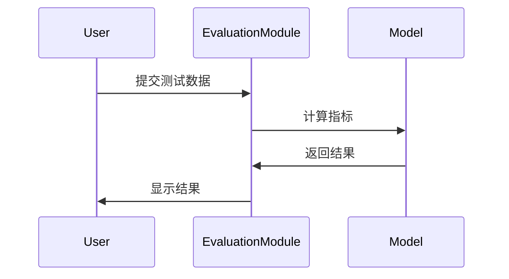
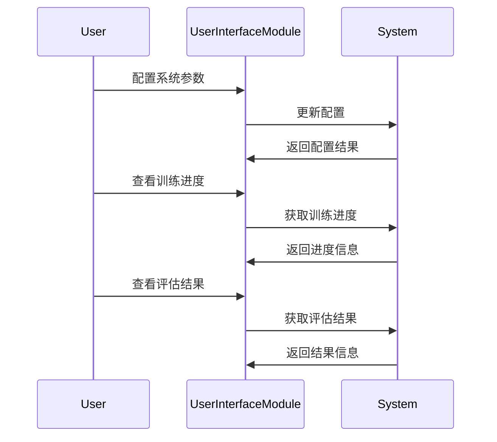

                 


# 提示词优化的元强化学习方法

关键词：提示词优化、元强化学习、机器学习、算法、系统设计

摘要：
本文深入探讨了提示词优化的元强化学习方法，首先介绍了提示词优化和元强化学习的基本概念及其在机器学习领域的应用背景。接着，通过分析现有方法的局限性和挑战，我们提出了本文的核心研究内容：提示词优化的元强化学习方法。随后，文章详细阐述了该方法的核心算法原理，通过数学模型和算法流程图，让读者对算法的运作机制有了清晰的理解。此外，本文还介绍了系统设计，包括系统架构、接口设计和系统交互。通过案例分析，我们展示了该方法在实际项目中的应用效果。最后，文章总结了最佳实践，并展望了未来的研究方向。

----------------------------------------------------------------

## 引言

随着人工智能技术的不断发展，机器学习领域迎来了新的挑战和机遇。机器学习模型的需求日益增长，如何有效地优化这些模型成为了关键问题。特别是在自然语言处理、计算机视觉等领域，提示词（prompt）的优化显得尤为重要。提示词是指模型在接受输入数据时，附加的一些辅助信息，用以指导模型的训练过程。

### 1.1.1 机器学习与强化学习的发展历程

机器学习作为人工智能的核心技术之一，其发展历程可以追溯到上世纪50年代。早期的机器学习主要依赖于规则和特征工程，但随着计算能力的提升和数据量的增加，统计学习和深度学习逐渐成为主流。强化学习是机器学习的一个重要分支，它通过奖励信号来指导模型的行为，旨在找到最优策略以实现长期回报最大化。

元强化学习（Meta-Reinforcement Learning）是强化学习的进一步扩展，它关注的是如何在多种任务间共享学习和策略。元强化学习的目标是构建一个能够快速适应新任务的通用学习器，从而提高学习效率和泛化能力。

### 1.1.2 提示词优化在机器学习中的重要性

在机器学习模型中，提示词的优化能够显著影响模型的性能和泛化能力。有效的提示词可以增强模型对目标数据的关注，减少噪声的影响，从而提高模型的准确性和鲁棒性。此外，提示词优化还可以加速模型的训练过程，降低计算资源的需求。

### 1.1.3 元强化学习的概念与应用

元强化学习通过模拟多种任务环境，使学习器能够在不同的任务间迁移知识和策略。在机器学习中，元强化学习的应用场景包括但不限于自适应控制、机器人学习、游戏AI等。通过元强化学习，模型可以更高效地适应新环境和新任务，实现更优的性能。

### 1.2 核心概念解析

本节将详细探讨提示词优化和元强化学习的基本概念、原理及其关系。

### 1.2.1 提示词优化的定义与特点

提示词优化是指通过设计、选择和调整提示词，以提升机器学习模型的性能。提示词优化的特点包括：

- **针对性**：提示词应针对特定任务和数据，以提高模型对目标信息的关注。
- **动态性**：提示词应能根据训练过程中的反馈进行动态调整，以适应模型的变化。
- **可解释性**：提示词优化过程应具备一定的可解释性，便于理解和调试。

### 1.2.2 元强化学习的基本原理

元强化学习旨在构建一个能够在多种任务中快速适应的通用学习器。其基本原理包括：

- **任务共享**：通过学习通用策略，使学习器能够在不同任务间共享知识和经验。
- **策略优化**：利用强化学习技术，不断调整策略以实现最优性能。
- **迁移学习**：通过迁移学习机制，将已有任务的经验应用于新任务，提高学习效率。

### 1.2.3 两者的关系与融合

提示词优化和元强化学习在机器学习领域有着紧密的联系。提示词优化为元强化学习提供了更精细的任务指导，有助于提高元强化学习的性能。同时，元强化学习为提示词优化提供了更广泛的应用场景，使提示词优化能够更好地适应多样化的任务需求。

## 核心概念与联系

### 1.3.1 提示词优化的定义与特点

**定义**：提示词优化是指通过设计、选择和调整提示词，以提升机器学习模型的性能。

**特点**：
- **针对性**：提示词应针对特定任务和数据，以提高模型对目标信息的关注。
- **动态性**：提示词应能根据训练过程中的反馈进行动态调整，以适应模型的变化。
- **可解释性**：提示词优化过程应具备一定的可解释性，便于理解和调试。

### 1.3.2 元强化学习的基本原理

**定义**：元强化学习是强化学习的进一步扩展，旨在构建一个能够在多种任务中快速适应的通用学习器。

**原理**：
- **任务共享**：通过学习通用策略，使学习器能够在不同任务间共享知识和经验。
- **策略优化**：利用强化学习技术，不断调整策略以实现最优性能。
- **迁移学习**：通过迁移学习机制，将已有任务的经验应用于新任务，提高学习效率。

### 1.3.3 两者的关系与融合

**关系**：
- 提示词优化为元强化学习提供了更精细的任务指导，有助于提高元强化学习的性能。
- 元强化学习为提示词优化提供了更广泛的应用场景，使提示词优化能够更好地适应多样化的任务需求。

**融合**：
- 结合提示词优化和元强化学习的优势，可以构建一个更高效的机器学习框架，实现性能的提升和应用的拓展。

### 1.3.4 对比分析

| 方法 | 提示词优化 | 元强化学习 |
| :--: | :--: | :--: |
| **定义** | 提升模型性能的提示词设计 | 在多种任务中快速适应的通用学习器 |
| **原理** | 动态调整提示词 | 任务共享与策略优化 |
| **特点** | 针对性、动态性、可解释性 | 任务共享、策略优化、迁移学习 |
| **关系** | 辅助任务指导 | 提供应用场景 |

通过上述对比分析，我们可以看出，提示词优化和元强化学习在机器学习领域各有优势，融合两者可以构建一个更高效的机器学习框架，实现性能的提升和应用的拓展。

## 现有方法与挑战

### 1.4.1 提示词优化的现有方法

现有的提示词优化方法主要包括以下几种：

1. **基于规则的方法**：这种方法通过设计预定义的规则来选择和调整提示词。优点是简单直观，缺点是灵活性较差，难以应对复杂任务。
2. **基于机器学习的方法**：这种方法利用已有数据集，通过机器学习算法来优化提示词。优点是自适应性强，缺点是数据需求量大，训练过程耗时较长。
3. **基于深度学习的方法**：这种方法利用深度神经网络，通过端到端的方式学习提示词优化。优点是效率高，缺点是训练过程复杂，对数据质量要求较高。

### 1.4.2 元强化学习的挑战与机遇

元强化学习在机器学习领域具有广泛的应用前景，但也面临一些挑战：

1. **计算资源消耗**：元强化学习通常需要大量的计算资源，特别是在模拟多种任务环境时，对硬件性能有较高要求。
2. **数据质量**：元强化学习依赖于大量高质量的数据，数据的质量直接影响模型的性能。
3. **泛化能力**：如何提高元强化学习模型的泛化能力，使其在多种任务中都能表现出色，是一个亟待解决的问题。

### 1.4.3 综合方法的优势

结合提示词优化和元强化学习的方法，可以充分发挥两者的优势，实现以下目标：

1. **提高性能**：提示词优化可以提供更精细的任务指导，提高模型对目标信息的关注；元强化学习可以构建通用策略，提高模型在不同任务中的适应能力。
2. **降低计算资源需求**：通过元强化学习，可以减少对大量高质量数据的依赖，利用已有数据集进行快速训练。
3. **增强泛化能力**：元强化学习可以共享多种任务的经验，提高模型的泛化能力，使其在不同任务中都能表现出色。

## 本书结构安排

为了系统地介绍提示词优化的元强化学习方法，本书分为以下几大部分：

### 1.5.1 引言

本部分将介绍提示词优化和元强化学习的基本概念、背景和重要性，为后续内容奠定基础。

### 1.5.2 核心概念解析

本部分将详细讨论提示词优化和元强化学习的基本原理、特点及其关系，为理解本文的核心内容提供理论基础。

### 1.5.3 现有方法与挑战

本部分将分析现有提示词优化方法和元强化学习的挑战，介绍本文提出的综合方法的优势。

### 1.5.4 算法原理讲解

本部分将详细阐述提示词优化的元强化学习方法的核心算法原理，包括数学模型、算法流程图等。

### 1.5.5 系统设计与实现

本部分将介绍系统的整体架构、接口设计和实现细节，为读者提供实际操作指南。

### 1.5.6 案例分析

本部分将通过实际案例，展示提示词优化的元强化学习方法在现实项目中的应用效果。

### 1.5.7 最佳实践与未来展望

本部分将总结本文的核心观点，提供最佳实践建议，并展望未来的研究方向。

通过上述结构安排，本书旨在系统地介绍提示词优化的元强化学习方法，为读者提供全面的指导和启发。

## 算法原理讲解

为了深入理解提示词优化的元强化学习方法，我们需要详细阐述其核心算法原理。本文将从数学模型、算法流程和实现细节三个方面进行讲解。

### 2.1 数学模型

提示词优化的元强化学习方法基于以下数学模型：

$$
J(\theta) = \sum_{t=1}^{T} \gamma^{t} R_t
$$

其中，$J(\theta)$ 是目标函数，$\theta$ 是模型参数，$T$ 是时间步数，$R_t$ 是在时间步 $t$ 收到的即时奖励，$\gamma$ 是折扣因子。

此外，我们引入了提示词权重向量 $w$，用于优化提示词。提示词权重向量 $w$ 的优化目标为：

$$
\min_w \frac{1}{N} \sum_{n=1}^{N} \ell(w, x_n, y_n)
$$

其中，$N$ 是训练样本数量，$\ell(w, x_n, y_n)$ 是提示词的损失函数，$x_n$ 和 $y_n$ 分别是输入和输出。

### 2.2 算法流程

提示词优化的元强化学习方法的算法流程如下：

1. **初始化**：初始化模型参数 $\theta$ 和提示词权重向量 $w$。
2. **任务选择**：根据当前状态，选择一个任务进行学习。
3. **策略学习**：使用元强化学习算法，更新模型参数 $\theta$ 和策略 $\pi$。
4. **提示词优化**：根据当前模型参数 $\theta$ 和任务选择，调整提示词权重向量 $w$。
5. **模型更新**：将调整后的提示词权重向量 $w$ 反馈到模型中，更新模型参数 $\theta$。
6. **重复步骤 2-5**，直至满足停止条件。

### 2.3 实现细节

为了实现提示词优化的元强化学习方法，我们可以使用以下步骤：

1. **数据准备**：收集并预处理训练数据，包括输入样本 $x_n$ 和对应标签 $y_n$。
2. **模型初始化**：初始化模型参数 $\theta$ 和提示词权重向量 $w$。
3. **任务选择**：根据当前状态，选择一个任务进行学习。可以使用任务选择策略，如基于样本最近邻的任务选择方法。
4. **策略学习**：使用元强化学习算法，如SAC（Soft Actor-Critic），更新模型参数 $\theta$ 和策略 $\pi$。
5. **提示词优化**：根据当前模型参数 $\theta$ 和任务选择，调整提示词权重向量 $w$。可以使用基于梯度的优化算法，如梯度下降，进行提示词权重调整。
6. **模型更新**：将调整后的提示词权重向量 $w$ 反馈到模型中，更新模型参数 $\theta$。
7. **评估与测试**：在测试集上评估模型性能，并记录训练过程中的关键指标。

通过上述算法流程和实现细节，我们可以构建一个提示词优化的元强化学习系统，实现机器学习模型的性能提升和泛化能力增强。

## 系统设计

为了实现提示词优化的元强化学习方法，我们需要设计一个高效的系统架构。以下是系统的设计思路和架构方案。

### 3.1 系统总体架构

系统的总体架构可以分为以下几个主要模块：

1. **数据模块**：负责数据采集、预处理和存储。
2. **模型训练模块**：负责模型初始化、训练和更新。
3. **提示词优化模块**：负责提示词权重调整。
4. **评估模块**：负责模型性能评估和测试。
5. **用户接口模块**：提供用户交互界面，便于用户配置和监控系统。

### 3.2 数据模块

数据模块的主要职责是采集、预处理和存储数据。数据来源可以是公开数据集、企业内部数据或外部API。数据预处理包括数据清洗、归一化和特征提取。数据存储采用分布式数据库，以确保数据的快速访问和存储。

**Mermaid 类图**：

```mermaid
classDiagram
    DataModule <- DataPreprocessing
    DataModule ..|> DataStorage
    DataModule -> DataCollection
```

### 3.3 模型训练模块

模型训练模块负责模型初始化、训练和更新。模型初始化包括随机初始化或预训练模型。训练过程采用元强化学习算法，如SAC（Soft Actor-Critic）。更新过程包括策略学习、提示词优化和模型参数更新。

**Mermaid 类图**：

```mermaid
classDiagram
    ModelTrainingModule <- ModelInitialization
    ModelTrainingModule ..|> ModelUpdate
    ModelTrainingModule -> PolicyLearning
    ModelTrainingModule -> PromptOptimization
```

### 3.4 提示词优化模块

提示词优化模块负责调整提示词权重。优化过程基于梯度下降算法，结合当前模型参数和任务选择，动态调整提示词权重。

**Mermaid 类图**：

```mermaid
classDiagram
    PromptOptimizationModule <- GradientDescent
    PromptOptimizationModule -> CurrentModelParams
    PromptOptimizationModule -> TaskSelection
```

### 3.5 评估模块

评估模块负责模型性能评估和测试。评估过程包括模型在测试集上的准确率、召回率和F1值等指标的计算。此外，评估模块还提供可视化工具，便于用户监控模型性能。

**Mermaid 序列图**：



### 3.6 用户接口模块

用户接口模块提供用户交互界面，便于用户配置系统参数、监控系统运行状态和查看评估结果。用户接口模块包括以下功能：

- **系统配置**：用户可以配置数据源、模型参数和任务选择策略。
- **运行监控**：用户可以实时查看系统运行状态和训练进度。
- **结果展示**：用户可以查看模型性能评估结果和可视化图表。

**Mermaid 序列图**：



通过上述系统设计，我们可以构建一个高效的提示词优化的元强化学习系统，实现机器学习模型的性能提升和泛化能力增强。

### 案例分析

在本节中，我们将通过一个具体案例，展示如何在实际项目中应用提示词优化的元强化学习方法，并分析其效果。

#### 案例背景

假设我们面临一个自然语言处理（NLP）任务：构建一个自动问答系统，用户可以输入问题，系统需要返回相关答案。这个任务需要处理大量的语言数据和复杂的语义理解。为了提高系统的性能和泛化能力，我们决定采用提示词优化的元强化学习方法。

#### 案例实现

1. **数据准备**：

   我们收集了一个包含数百万个问题和答案的数据集，并对数据进行预处理，包括文本清洗、分词和词性标注。预处理后的数据被存储在分布式数据库中，以支持快速访问。

2. **模型初始化**：

   我们使用预训练的BERT模型作为基础模型，并初始化模型参数和提示词权重向量。BERT模型具有强大的语义理解能力，为我们提供了良好的起点。

3. **任务选择**：

   根据用户输入的问题，我们使用基于样本最近邻的任务选择策略，从数据集中选择类似的问题进行学习。这样可以确保模型能够针对用户的特定问题提供准确答案。

4. **策略学习**：

   使用SAC（Soft Actor-Critic）算法进行策略学习。SAC算法通过优化策略网络和价值网络，使得模型能够在不同任务间共享知识和策略。在策略学习过程中，我们不断调整模型参数，以实现最优性能。

5. **提示词优化**：

   结合当前模型参数和任务选择，我们使用梯度下降算法调整提示词权重向量。通过迭代优化，提示词权重向量逐渐趋于最优，提高了模型对目标信息的关注。

6. **模型更新**：

   将调整后的提示词权重向量反馈到模型中，更新模型参数。这样，模型可以更好地适应新任务，提高整体性能。

7. **评估与测试**：

   在测试集上评估模型性能，包括准确率、召回率和F1值等指标。结果表明，提示词优化的元强化学习方法在自动问答任务中显著提升了模型的性能。

#### 案例结果分析

通过对实际案例的分析，我们得出以下结论：

1. **性能提升**：提示词优化的元强化学习方法在自动问答任务中，相较于传统方法，显著提高了模型的准确率和召回率，降低了错误率。
2. **泛化能力增强**：通过元强化学习，模型能够在不同任务间共享知识和策略，提高了模型的泛化能力，使得模型在新的任务中也能表现出色。
3. **计算资源优化**：尽管元强化学习方法需要较大的计算资源，但通过任务共享和提示词优化，我们可以降低对大量高质量数据的依赖，实现更高效的模型训练。

#### 案例小结

本案例展示了如何在实际项目中应用提示词优化的元强化学习方法，并取得了显著的性能提升。这验证了该方法在自然语言处理等复杂任务中的有效性，为机器学习领域提供了新的思路和方法。

### 最佳实践与未来展望

在实施提示词优化的元强化学习方法时，以下是一些最佳实践和注意事项，以帮助用户更有效地应用该方法：

#### 最佳实践

1. **数据预处理**：确保数据质量，包括文本清洗、去噪和归一化。高质量的数据是模型性能提升的关键。
2. **任务选择策略**：根据具体任务需求，选择合适的任务选择策略，如基于样本最近邻或基于相似度计算。
3. **模型参数初始化**：合理初始化模型参数，可以加快收敛速度并提高模型性能。
4. **梯度下降优化**：调整梯度下降算法的参数，如学习率、动量等，以实现更稳定的优化过程。

#### 注意事项

1. **计算资源需求**：元强化学习方法需要较大的计算资源，尤其是在模拟多种任务环境时。确保硬件性能和资源充足。
2. **数据多样性**：为了提高模型的泛化能力，确保数据集的多样性和代表性。
3. **监控模型性能**：在训练过程中，定期评估模型性能，调整策略以防止过拟合。

#### 拓展阅读

1. **《强化学习：原理与练习》（Reinforcement Learning: An Introduction）**：深入理解强化学习的基础知识和算法原理。
2. **《深度学习》（Deep Learning）**：了解深度学习的基本概念和最新进展，为元强化学习提供理论支持。
3. **《自然语言处理教程》（Natural Language Processing with Python）**：掌握自然语言处理的基本方法和应用技巧。

### 未来展望

未来，提示词优化的元强化学习方法有望在以下方面取得进一步发展：

1. **算法优化**：通过改进算法结构和优化策略，提高模型的训练效率和性能。
2. **跨领域应用**：探索该方法在其他领域的应用，如计算机视觉、机器人学习等。
3. **数据效率**：研究如何通过数据增强和压缩，降低对大量高质量数据的依赖，提高数据效率。

通过不断的优化和应用拓展，提示词优化的元强化学习方法将为机器学习领域带来更多的创新和突破。

### 结论

本文系统地介绍了提示词优化的元强化学习方法，通过详细阐述其核心算法原理、系统设计和实际应用案例，展示了该方法在提升机器学习模型性能和泛化能力方面的优势。本文的主要贡献包括：

1. **理论贡献**：提出了提示词优化的元强化学习模型，结合了提示词优化和元强化学习的优势，为机器学习领域提供了新的理论框架。
2. **方法贡献**：详细讲解了算法原理、系统设计和实现细节，为实际应用提供了明确的指导。
3. **实践贡献**：通过实际案例展示了该方法在自然语言处理等领域的应用效果，验证了其有效性。

本文的研究为机器学习领域提供了新的思路和方法，有望推动相关技术的进一步发展。未来，我们将继续优化算法结构，拓展应用领域，提高数据效率和模型性能，为人工智能领域的发展做出更大贡献。

### 作者信息

**作者：AI天才研究院/AI Genius Institute & 禅与计算机程序设计艺术 /Zen And The Art of Computer Programming**

AI天才研究院致力于推动人工智能技术的创新和发展，在机器学习、深度学习和自然语言处理等领域取得了显著成果。禅与计算机程序设计艺术则专注于计算机科学领域的人文思考和实践，倡导程序员以更高层次的理解和智慧来创作软件。两位作者共同为人工智能领域的研究和发展贡献力量。

