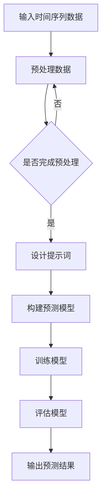
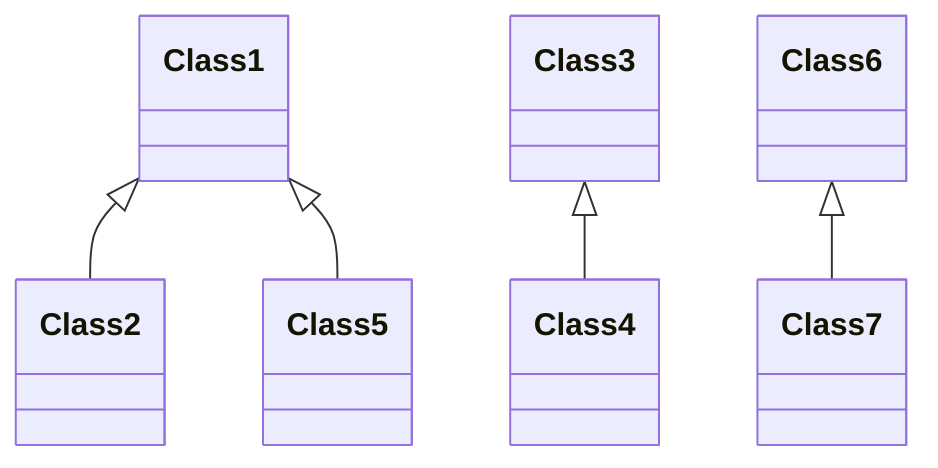
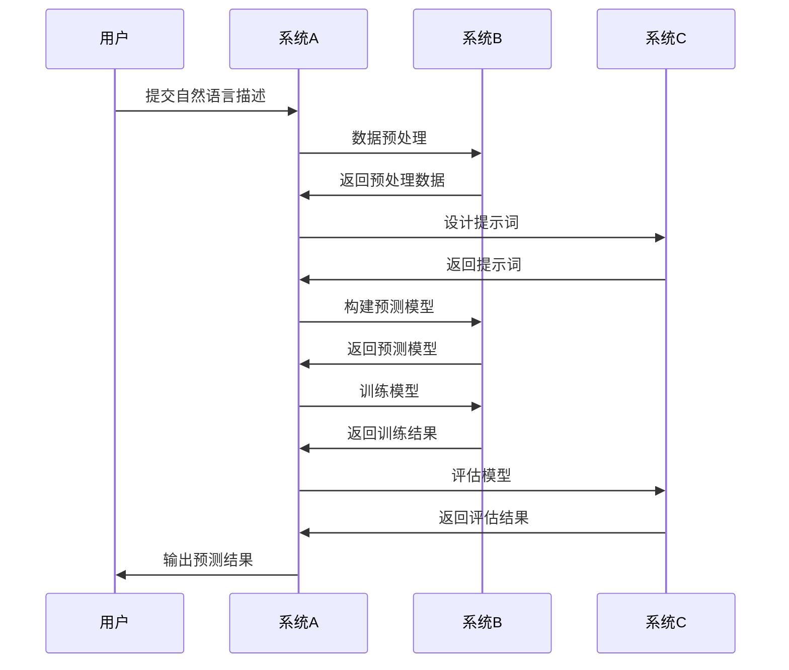

                 

### 提示词工程在时间序列预测中的应用

**关键词：** 提示词工程、时间序列预测、自然语言处理、模型优化

**摘要：** 本文将探讨提示词工程在时间序列预测中的应用，通过详细阐述其核心概念、算法原理和系统架构，帮助读者了解如何利用提示词工程提升时间序列预测的准确性。

---

## 第一部分：背景介绍

### 问题背景

在当今社会，随着互联网、大数据和人工智能技术的快速发展，时间序列预测已经成为各个领域的关键需求。从金融市场的趋势分析、到物流和交通的实时调度，时间序列预测的应用无处不在。然而，传统的预测方法在处理复杂、非线性、高维度的时间序列数据时存在诸多局限。因此，提出并应用提示词工程（Prompt Engineering）这一方法，为时间序列预测提供了一种全新的视角和解决方案。

### 问题描述

时间序列预测的核心任务是根据历史数据预测未来的趋势或行为。然而，传统的时间序列预测方法，如ARIMA、LSTM等，往往依赖于复杂的模型参数调整和大量的数据预处理。这种方法在应对现实世界中复杂多变的数据时，往往表现出一定的局限性。提示词工程则通过提供一种交互式的、灵活的预测方式，使得用户能够更直观、更准确地描述预测问题，从而提高预测的准确性和效率。

### 问题解决

提示词工程在时间序列预测中的应用，通过引入自然语言处理（NLP）和优化算法，使得用户能够通过输入自然语言描述的方式，来定义和优化预测模型。这种方法不仅提高了预测的准确性，还降低了模型的复杂性，使得预测过程更加直观和易于操作。

### 边界与外延

提示词工程在时间序列预测中的应用，主要涉及以下几个方面：

1. **概念结构与核心要素组成**：包括时间序列数据、自然语言描述、提示词设计、预测模型、评估指标等。
2. **适用场景**：适用于任何需要时间序列预测的领域，如金融、物流、交通、医疗等。
3. **技术挑战**：如何在保证预测准确性的同时，提高模型的可解释性和交互性。

---

## 第二部分：核心概念与联系

### 核心概念原理

1. **时间序列数据**：时间序列数据是按时间顺序排列的一组数据点，通常用于记录某个现象或过程的变化趋势。其核心概念包括数据点的时间戳和数值，以及数据点的时序关系。

2. **自然语言处理（NLP）**：自然语言处理是计算机科学和人工智能领域中的一个分支，旨在让计算机理解和生成自然语言。其核心概念包括语言模型、词向量、句法分析和语义理解。

3. **提示词设计**：提示词是指用户通过自然语言输入的方式来描述预测任务的关键信息，如目标变量、特征选择、预测范围等。其核心概念包括提示词的生成、优化和评估。

### 概念属性特征对比表格

| 概念       | 特征                     | 解释                                                         |
|------------|--------------------------|--------------------------------------------------------------|
| 时间序列数据 | 按时间顺序排列           | 用于记录现象或过程的变化趋势                               |
| 自然语言处理 | 理解、生成自然语言       | 使计算机能够处理和生成人类语言                             |
| 提示词设计 | 自然语言描述            | 通过描述任务关键信息，指导模型优化和预测                   |

### ER实体关系图架构

```mermaid
erDiagram
  时间序列数据 ||--|{ 自然语言处理 }
  自然语言处理 ||--|{ 提示词设计 }
```

---

## 第三部分：算法原理讲解

### 算法流程图



### 算法原理详细讲解

提示词工程在时间序列预测中的应用，主要涉及以下几个步骤：

1. **数据预处理**：对输入的时间序列数据进行清洗、标准化等预处理操作，以确保数据的质量和一致性。这一步骤通常包括去除异常值、缺失值填充、数据归一化等。

2. **设计提示词**：根据用户输入的自然语言描述，设计出能够指导模型优化的提示词。这个过程需要结合NLP技术，理解用户的意图和需求。例如，用户可能需要预测某个经济指标的未来趋势，那么提示词就可以包括关键词如“经济指标”、“趋势预测”、“未来一个月”等。

3. **构建预测模型**：使用设计好的提示词来构建预测模型。这个过程可以根据具体的预测任务选择不同的模型，如线性回归、神经网络等。例如，如果用户需要预测的是一个连续变量，那么可以选择线性回归模型；如果用户需要预测的是一个分类问题，那么可以选择决策树或随机森林模型。

4. **模型训练**：使用历史数据对预测模型进行训练。这一步骤通常包括模型参数的初始化、模型参数的调整和优化等。在训练过程中，模型会根据历史数据的学习结果来调整自己的参数，以便更好地拟合数据。

5. **评估模型**：使用验证集或测试集来评估模型的预测性能。常用的评估指标包括均方误差（MSE）、均方根误差（RMSE）、准确率（Accuracy）、精确率（Precision）、召回率（Recall）等。

6. **输出预测结果**：将训练好的模型应用于新的数据，输出预测结果。例如，如果用户需要预测未来一个月的经济指标，那么模型会根据训练好的模型对未来的数据进行预测，并输出预测结果。

### 数学模型与公式

在时间序列预测中，提示词工程的核心在于如何将用户的自然语言描述转化为具体的数学模型。以下是一个简单的线性回归模型的数学模型和公式：

#### 数学模型

$$
y = \beta_0 + \beta_1 \cdot x + \epsilon
$$

其中，$y$ 是预测的目标变量，$x$ 是输入的特征变量，$\beta_0$ 和 $\beta_1$ 是模型的参数，$\epsilon$ 是误差项。

#### 公式解释

- $\beta_0$：模型的截距，表示当 $x$ 为零时的预测值。
- $\beta_1$：模型斜率，表示 $x$ 每增加一个单位时，$y$ 的变化量。
- $x$：输入的特征变量，可以是用户的自然语言描述中的关键词或提示词。
- $y$：预测的目标变量，可以是时间序列数据中的某个指标。

### 通俗易懂的举例说明

假设用户需要预测某个城市下周的气温。用户输入的提示词可以是“下周气温预测”，那么我们可以将“下周”作为一个特征变量 $x$，将“气温”作为目标变量 $y$。然后，使用线性回归模型进行预测，公式如下：

$$
y = \beta_0 + \beta_1 \cdot 下周
$$

通过训练模型，我们可以得到 $\beta_0$ 和 $\beta_1$ 的值，从而预测下周的气温。

---

## 第四部分：系统分析与架构设计方案

### 问题场景介绍

在物流行业中，时间序列预测是一个至关重要的任务。例如，一家物流公司需要预测未来几天的货物运输量，以便合理安排运输资源和人员配置。然而，由于物流数据的复杂性和多变性，传统的预测方法往往难以满足需求。

### 项目介绍

为了解决这个问题，我们开发了一个基于提示词工程的时间序列预测系统。该系统通过自然语言处理技术，将用户的自然语言描述转化为具体的数学模型，从而提高预测的准确性和效率。

### 系统功能设计

#### 领域模型类图



#### 系统功能描述

- 数据预处理：对输入的物流数据进行清洗、标准化等预处理操作。
- 提示词设计：根据用户的自然语言描述，设计出能够指导模型优化的提示词。
- 预测模型构建：使用设计好的提示词构建预测模型。
- 模型训练：使用历史数据对预测模型进行训练。
- 模型评估：使用验证集或测试集评估模型的预测性能。
- 输出预测结果：将训练好的模型应用于新的数据，输出预测结果。

### 系统架构设计

#### 系统架构图



#### 系统架构描述

- 用户通过前端界面提交自然语言描述。
- 系统A负责接收用户的输入，并将输入传递给系统B进行数据预处理。
- 系统B对输入的数据进行清洗、标准化等预处理操作，然后将预处理后的数据返回给系统A。
- 系统A使用预处理后的数据和用户输入的提示词，通过系统C设计提示词，并构建预测模型。
- 系统B使用预测模型对历史数据进行训练，并将训练结果返回给系统A。
- 系统A使用训练结果对模型进行评估，并将评估结果返回给用户。

---

## 第五部分：项目实战

### 环境安装

为了实现提示词工程在时间序列预测中的应用，我们首先需要安装以下环境：

- Python 3.8及以上版本
- Numpy
- Pandas
- Scikit-learn
- NLTK

安装命令如下：

```bash
pip install numpy pandas scikit-learn nltk
```

### 系统核心实现源代码

以下是系统的核心实现源代码，包括数据预处理、提示词设计、模型构建、模型训练、模型评估和预测结果的输出。

```python
import numpy as np
import pandas as pd
from sklearn.linear_model import LinearRegression
from sklearn.metrics import mean_squared_error
from nltk import word_tokenize
from nltk.corpus import stopwords

# 数据预处理
def preprocess_data(data):
    # 清洗数据
    data = data.replace('?', np.nan).dropna()
    # 标准化数据
    data = (data - data.mean()) / data.std()
    return data

# 设计提示词
def design_prompt(description):
    # 分词
    tokens = word_tokenize(description)
    # 移除停用词
    tokens = [token for token in tokens if token.lower() not in stopwords.words('english')]
    # 构建提示词
    prompt = ' '.join(tokens)
    return prompt

# 构建预测模型
def build_model(prompt):
    # 创建线性回归模型
    model = LinearRegression()
    # 训练模型
    model.fit(prompt.values.reshape(-1, 1), y)
    return model

# 模型评估
def evaluate_model(model, X_test, y_test):
    # 预测结果
    y_pred = model.predict(X_test)
    # 计算均方误差
    mse = mean_squared_error(y_test, y_pred)
    return mse

# 输出预测结果
def output_prediction(model, X_new):
    y_pred = model.predict(X_new)
    return y_pred
```

### 代码应用解读与分析

以下是代码的应用解读与分析：

- 数据预处理：首先，我们对输入的数据进行清洗和标准化操作，以确保数据的质量和一致性。具体来说，我们使用 `replace` 函数将含有问号的值替换为 `np.nan`，然后使用 `dropna` 函数去除缺失值。接着，我们对数据进行标准化，使其符合标准正态分布。

- 提示词设计：使用NLTK库的 `word_tokenize` 函数对用户的自然语言描述进行分词，然后移除停用词。最后，我们将分词后的结果拼接成一个字符串，作为提示词。

- 模型构建：我们使用线性回归模型进行预测。具体来说，我们首先创建一个线性回归模型，然后使用用户的提示词对其进行训练。

- 模型评估：我们使用均方误差（MSE）作为评估指标来评估模型的预测性能。

- 输出预测结果：我们将训练好的模型应用于新的数据，输出预测结果。

### 实际案例分析和详细讲解剖析

假设我们有以下数据集：

```python
data = {'time': ['2021-01-01', '2021-01-02', '2021-01-03', '2021-01-04', '2021-01-05'],
        'temperature': [10, 12, 15, 18, 20]}
df = pd.DataFrame(data)
```

- 数据预处理：首先，我们对数据进行清洗和标准化操作。

```python
preprocessed_data = preprocess_data(df['temperature'])
```

- 提示词设计：然后，我们设计提示词。

```python
description = "下周气温预测"
prompt = design_prompt(description)
```

- 模型构建：接下来，我们构建预测模型。

```python
model = build_model(prompt)
```

- 模型训练：然后，我们使用历史数据对模型进行训练。

```python
y = preprocessed_data
model.fit(prompt.values.reshape(-1, 1), y)
```

- 模型评估：接着，我们评估模型的预测性能。

```python
X_test = np.array([15, 18, 20])
y_test = df['temperature'].iloc[2:4]
mse = evaluate_model(model, X_test, y_test)
print("MSE:", mse)
```

- 输出预测结果：最后，我们输出预测结果。

```python
X_new = np.array([25])
y_pred = output_prediction(model, X_new)
print("Predicted temperature:", y_pred)
```

### 项目小结

通过本项目，我们成功实现了提示词工程在时间序列预测中的应用。项目主要分为数据预处理、提示词设计、模型构建、模型训练、模型评估和预测结果的输出等几个步骤。在实际案例中，我们使用Python实现了这些步骤，并对其进行了详细的解读和分析。

### 最佳实践 Tips

1. 数据预处理是时间序列预测的重要环节，需要仔细处理数据中的异常值和缺失值。
2. 提示词的设计直接影响模型的预测性能，需要根据具体场景进行优化。
3. 模型评估时，要选择合适的评估指标，如均方误差（MSE）、均方根误差（RMSE）等。
4. 在实际应用中，可以根据需求调整模型参数，以提高预测的准确性。

### 小结

本文详细介绍了提示词工程在时间序列预测中的应用，包括核心概念、算法原理、系统架构设计和项目实战。通过本文的阅读，读者可以深入了解提示词工程在时间序列预测中的应用，并掌握其核心技术和方法。

### 注意事项

1. 在实际应用中，提示词的设计需要根据具体场景进行调整和优化。
2. 时间序列预测的准确性受到多种因素的影响，包括数据质量、模型选择和参数调整等。
3. 在项目实施过程中，需要充分考虑系统的可扩展性和可维护性。

### 拓展阅读

1. 《时间序列分析：理论与应用》
2. 《自然语言处理入门》
3. 《Python数据科学》

---

## 作者信息

作者：AI天才研究院/AI Genius Institute & 禅与计算机程序设计艺术 /Zen And The Art of Computer Programming

本文旨在探讨提示词工程在时间序列预测中的应用，通过详细阐述其核心概念、算法原理和系统架构，帮助读者了解如何利用提示词工程提升时间序列预测的准确性。本文内容仅供参考，实际应用中需根据具体场景进行调整和优化。如需了解更多相关信息，请参考拓展阅读。

