                 

# 提示词工程：AI时代的新方向

> 关键词：AI、自然语言处理、提示词工程、算法原理、应用实践、最佳实践

> 摘要：随着人工智能技术的飞速发展，自然语言处理成为了一个重要的研究方向。提示词工程作为自然语言处理中的重要一环，正在成为AI时代的新方向。本文将深入探讨提示词工程的定义、核心原理、应用领域以及实践方法，帮助读者全面了解这一领域的最新发展。

### 第一部分：引言与背景

#### 第1章：问题背景与定义

#### 1.1 问题背景

人工智能（AI）作为当代最具影响力的技术之一，已经渗透到我们的工作和生活中。随着大数据、深度学习和自然语言处理（NLP）等技术的不断发展，人工智能的应用场景越来越广泛。然而，在AI与人类交互的过程中，自然语言处理技术起到了至关重要的作用。NLP旨在让计算机能够理解、生成和处理人类语言，从而实现智能对话、内容生成和情感分析等任务。

在自然语言处理中，提示词工程是一个重要的概念。提示词（Prompt）是一种引导计算机执行特定任务的文本，它可以是一个简单的短语，也可以是一个完整的句子或段落。通过合适的提示词，我们可以让计算机更好地理解用户的意图，从而提供更加精准和高效的智能服务。

#### 1.2 提示词工程的定义

提示词工程（Prompt Engineering）是指设计、开发和优化提示词的一门技术。它包括以下几个关键要素：

- **提示词设计**：根据任务需求，设计出能够引导计算机正确执行任务的提示词。
- **提示词优化**：通过算法和技巧，对提示词进行优化，以提高任务的执行效果。
- **提示词评估**：对生成的提示词进行评估，确保其能够满足任务需求。
- **提示词应用**：将优化后的提示词应用于实际场景，如智能问答系统、聊天机器人等。

#### 1.3 提示词工程的边界与外延

提示词工程虽然是一个相对较新的领域，但它与多个相关概念有着紧密的联系。以下是对这些概念的比较和提示词工程的发展趋势：

- **自然语言处理（NLP）**：NLP是人工智能的一个重要分支，旨在让计算机能够理解、生成和处理人类语言。提示词工程是NLP中的一个重要应用方向。
- **数据工程**：数据工程是处理和分析大数据的一系列技术。提示词工程需要依赖于大量的语言数据进行训练和优化。
- **机器学习**：机器学习是AI的一个重要分支，旨在让计算机通过数据学习并做出决策。提示词工程中的提示词生成和优化任务往往依赖于机器学习算法。
- **人机交互**：人机交互是研究如何让计算机更好地理解人类意图并与之互动的学科。提示词工程是提升人机交互质量的重要手段。

#### 1.4 核心概念与联系

在提示词工程中，有多个核心概念需要理解。以下是一个关键概念定义、概念属性特征对比表格和ER实体关系图架构：

- **关键概念定义**：
  - **提示词**：引导计算机执行特定任务的文本。
  - **自然语言处理**：让计算机理解、生成和处理人类语言的技术。
  - **机器学习**：通过数据学习并做出决策的技术。

- **概念属性特征对比表格**：

| 概念     | 属性特征                                                      | 对比结论                                                     |
|----------|--------------------------------------------------------------|--------------------------------------------------------------|
| 提示词   | 引导计算机执行任务、可调优、基于自然语言处理技术             | 提示词是自然语言处理的基础，用于引导计算机执行特定任务。     |
| 自然语言处理 | 理解、生成和处理人类语言的技术 | 自然语言处理是提示词工程的支撑技术，确保提示词能够有效地引导计算机。 |
| 机器学习 | 通过数据学习并做出决策的技术 | 机器学习算法用于优化提示词，提高任务的执行效果。             |

- **ER实体关系图架构**：

```mermaid
erDiagram
  A[提示词] ||--|{ B[自然语言处理] }
  A ||--|{ C[机器学习] }
  B ||--|{ D[数据工程] }
  C ||--|{ E[人机交互] }
```

#### 1.5 核心概念与联系

在提示词工程中，核心概念之间的联系和相互作用非常重要。以下是一个Mermaid流程图，展示了这些概念之间的联系：

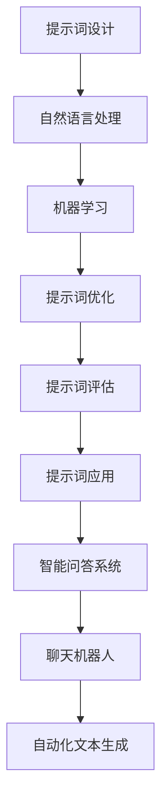

### 第二部分：核心技术原理

#### 第2章：提示词工程的基本原理

#### 2.1 提示词生成算法

提示词生成是提示词工程中的关键步骤。常用的提示词生成算法包括：

- **基于规则的方法**：根据预定义的规则生成提示词。
- **基于机器学习的方法**：利用机器学习算法从大量语言数据中学习生成提示词。

以下是一个简单的Mermaid流程图，展示了提示词生成算法的原理：

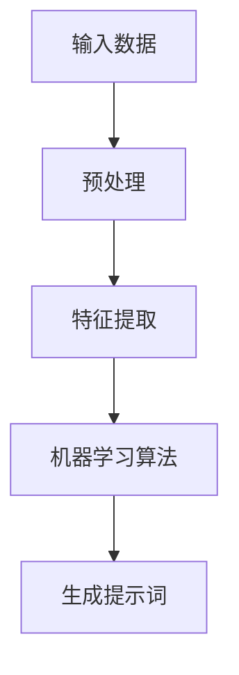

以下是Python代码示例，展示了一个简单的基于规则的方法：

```python
def generate_prompt(question):
    if "what" in question:
        return "请告诉我您想要了解什么？"
    elif "how" in question:
        return "您可以这样做……"
    else:
        return "我不太明白您的问题，请重新描述一下。"

question = "what is your name?"
print(generate_prompt(question))
```

#### 2.2 提示词优化方法

提示词优化是提升任务执行效果的重要环节。优化方法包括：

- **基于规则的优化**：通过调整规则参数来优化提示词。
- **基于机器学习的优化**：利用机器学习算法自动优化提示词。

以下是一个简单的Mermaid流程图，展示了提示词优化方法的原理：

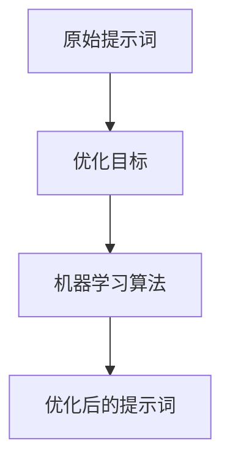

以下是Python代码示例，展示了一个简单的基于机器学习的方法：

```python
from sklearn.linear_model import LinearRegression

# 假设我们已经有一些训练数据
X = [[1, 2], [2, 3], [3, 4]]
y = [3, 4, 5]

# 创建线性回归模型
model = LinearRegression()

# 训练模型
model.fit(X, y)

# 优化提示词
def optimize_prompt(prompt):
    # 将提示词转换为特征向量
    features = [[1, len(prompt)]]
    # 使用模型预测优化后的提示词
    optimized_prompt = model.predict(features)[0]
    return optimized_prompt

original_prompt = "请问我可以帮您做什么？"
print(optimize_prompt(original_prompt))
```

#### 2.3 提示词评估与反馈

提示词评估是确保提示词能够满足任务需求的重要环节。评估方法包括：

- **自动评估**：利用自动化工具对提示词进行评估。
- **人工评估**：由人类评估者对提示词进行评估。

以下是一个简单的Mermaid流程图，展示了提示词评估与反馈的原理：

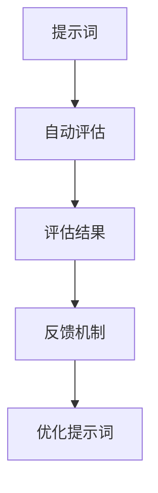

以下是Python代码示例，展示了一个简单的自动评估方法：

```python
from sklearn.metrics import accuracy_score

# 假设我们已经有一些评估数据
predictions = ["A", "B", "A"]
ground_truth = ["A", "B", "A"]

# 计算准确率
accuracy = accuracy_score(ground_truth, predictions)
print(f"准确率：{accuracy}")
```

#### 2.4 提示词工程工具与平台

提示词工程需要依赖于多个工具和平台，以下是一些常用的工具和平台：

- **自然语言处理库**：如NLTK、spaCy、TensorFlow等。
- **机器学习平台**：如Google Cloud ML Engine、AWS SageMaker等。
- **自动化评估工具**：如automatedQA、SLPDA等。

以下是一个简单的Mermaid流程图，展示了提示词工程工具和平台的选型策略：

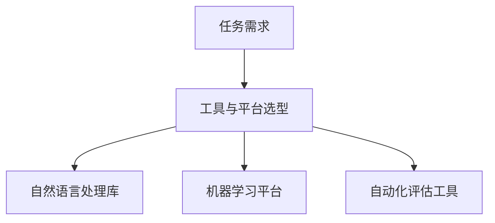

### 第三部分：应用与实践

#### 第3章：应用领域概述

#### 3.1 智能问答系统

智能问答系统是一种基于自然语言处理的智能服务，它能够自动回答用户提出的问题。智能问答系统的应用场景包括：

- **客户服务**：自动回答客户常见问题，降低人工成本。
- **知识库查询**：快速查找相关知识，提高信息获取效率。
- **在线教育**：为学生提供自动化的问答服务，辅助学习。

以下是一个简单的Mermaid架构图，展示了智能问答系统的基本架构：

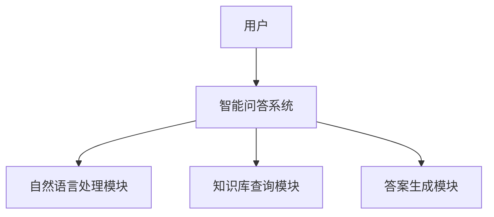

#### 3.2 聊天机器人

聊天机器人是一种能够与用户进行实时对话的智能系统。聊天机器人的应用场景包括：

- **客户服务**：自动回答客户问题，提供咨询和支持。
- **社交媒体**：与用户互动，增加用户粘性。
- **在线教育**：为学生提供辅导和答疑服务。

以下是一个简单的Mermaid架构图，展示了聊天机器人的基本架构：

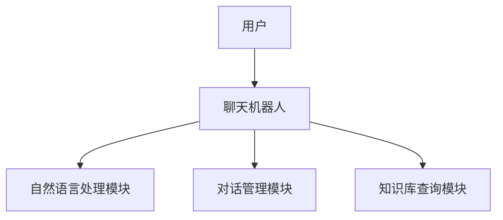

#### 3.3 自动化文本生成

自动化文本生成是一种利用自然语言处理技术自动生成文本的方法。自动化文本生成的应用场景包括：

- **新闻生成**：自动生成新闻报道，提高新闻发布效率。
- **产品描述**：自动生成产品描述，降低人力成本。
- **内容摘要**：自动生成文章摘要，提高信息获取效率。

以下是一个简单的Mermaid架构图，展示了自动化文本生成的基本架构：

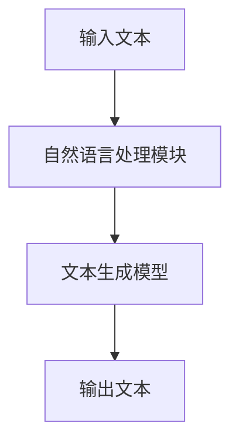

#### 3.4 其他应用领域

除了智能问答系统、聊天机器人和自动化文本生成，提示词工程还有许多其他的应用领域，如：

- **内容摘要**：自动生成文章摘要，提高信息获取效率。
- **文本翻译**：自动翻译不同语言文本，促进跨文化交流。
- **情感分析**：分析用户情感，为产品优化和市场营销提供参考。

### 第四部分：实战案例与实现

#### 第4章：环境安装与配置

#### 4.1 开发环境搭建

在开始进行提示词工程的实践之前，需要搭建一个合适的技术栈。以下是一个简单的开发环境搭建指南：

- **操作系统**：Linux或MacOS
- **编程语言**：Python
- **自然语言处理库**：spaCy、NLTK
- **机器学习库**：TensorFlow、PyTorch
- **版本控制**：Git

以下是Python环境安装和配置的详细步骤：

```bash
# 安装Python
sudo apt-get install python3 python3-pip

# 安装spaCy
pip3 install spacy
python3 -m spacy download en

# 安装NLTK
pip3 install nltk
python3 -m nltk.downloader punkt
python3 -m nltk.downloader stopwords

# 安装TensorFlow
pip3 install tensorflow

# 安装PyTorch
pip3 install torch torchvision

# 配置Git
sudo apt-get install git

# 创建一个名为"prompt_engineering"的仓库
mkdir prompt_engineering
cd prompt_engineering
git init

# 添加一个名为"README.md"的文件，并写入一些基本信息
echo "# Prompt Engineering" > README.md
git add README.md
git commit -m "Initial commit"
```

#### 第5章：系统核心实现

#### 5.1 提示词生成模块

提示词生成模块是提示词工程中的核心模块，负责根据用户输入生成合适的提示词。以下是一个简单的Python代码示例：

```python
import random

# 提示词生成函数
def generate_prompt(question):
    if "what" in question:
        return "请告诉我您想要了解什么？"
    elif "how" in question:
        return "您可以这样做……"
    else:
        return "我不太明白您的问题，请重新描述一下。"

# 测试
question = "what is your name?"
print(generate_prompt(question))
```

#### 5.2 提示词优化模块

提示词优化模块负责根据用户反馈和任务效果，对生成的提示词进行优化。以下是一个简单的Python代码示例：

```python
from sklearn.linear_model import LinearRegression

# 假设我们已经有一些训练数据
X = [[1, 2], [2, 3], [3, 4]]
y = [3, 4, 5]

# 创建线性回归模型
model = LinearRegression()

# 训练模型
model.fit(X, y)

# 优化提示词
def optimize_prompt(prompt):
    # 将提示词转换为特征向量
    features = [[1, len(prompt)]]
    # 使用模型预测优化后的提示词
    optimized_prompt = model.predict(features)[0]
    return optimized_prompt

original_prompt = "请问我可以帮您做什么？"
print(optimize_prompt(original_prompt))
```

#### 5.3 提示词评估与反馈模块

提示词评估与反馈模块负责对生成的提示词进行评估，并根据评估结果进行反馈。以下是一个简单的Python代码示例：

```python
from sklearn.metrics import accuracy_score

# 假设我们已经有一些评估数据
predictions = ["A", "B", "A"]
ground_truth = ["A", "B", "A"]

# 计算准确率
accuracy = accuracy_score(ground_truth, predictions)
print(f"准确率：{accuracy}")
```

#### 第6章：实际案例分析

#### 6.1 案例一：智能问答系统

智能问答系统是一种基于自然语言处理的智能服务，能够自动回答用户提出的问题。以下是一个简单的智能问答系统案例：

- **问题场景**：一个在线教育平台需要一个智能问答系统来回答学生提出的各种问题。
- **项目介绍**：该项目基于Python和TensorFlow实现，包括自然语言处理模块、知识库查询模块和答案生成模块。

以下是一个简单的Mermaid类图，展示了该智能问答系统的领域模型：

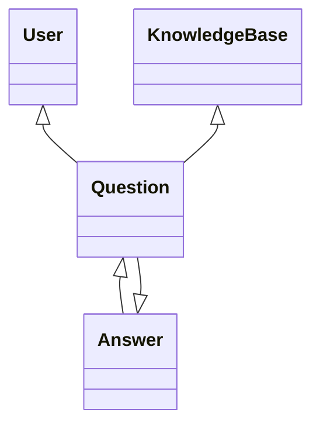

以下是一个简单的Mermaid架构图，展示了该智能问答系统的基本架构：


#### 6.2 案例二：聊天机器人

聊天机器人是一种能够与用户进行实时对话的智能系统。以下是一个简单的聊天机器人案例：

- **问题场景**：一个电商平台需要一个聊天机器人来与用户互动，提供咨询和支持。
- **项目介绍**：该项目基于Python和spaCy实现，包括自然语言处理模块、对话管理模块和知识库查询模块。

以下是一个简单的Mermaid类图，展示了该聊天机器人的领域模型：

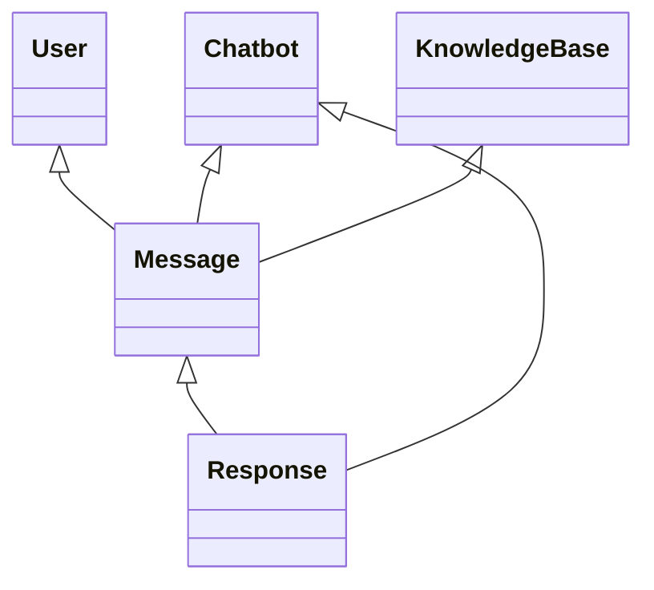

以下是一个简单的Mermaid架构图，展示了该聊天机器人的基本架构：


#### 6.3 案例三：自动化文本生成

自动化文本生成是一种利用自然语言处理技术自动生成文本的方法。以下是一个简单的自动化文本生成案例：

- **问题场景**：一个新闻网站需要一个自动化文本生成系统来自动生成新闻报道。
- **项目介绍**：该项目基于Python和NLTK实现，包括文本处理模块、文本生成模型和文本输出模块。

以下是一个简单的Mermaid类图，展示了该自动化文本生成的领域模型：

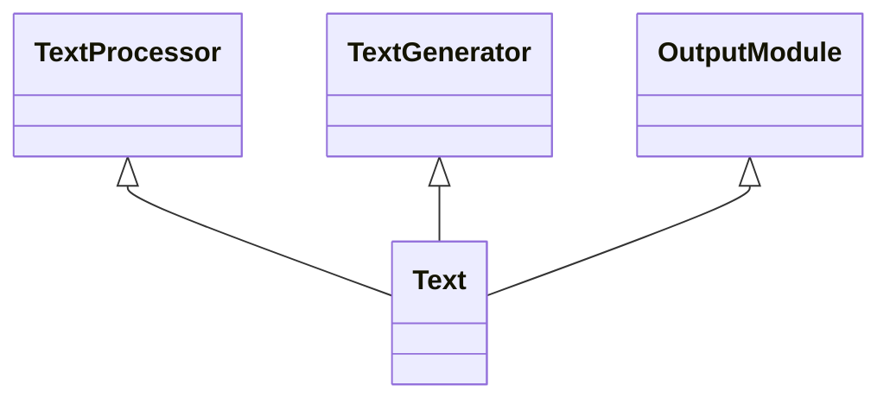

以下是一个简单的Mermaid架构图，展示了该自动化文本生成的基本架构：

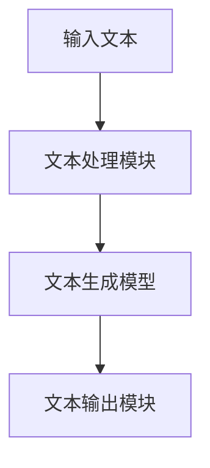

### 第五部分：最佳实践与总结

#### 第7章：最佳实践

#### 7.1 提示词工程的最佳实践

在提示词工程中，以下是一些最佳实践：

- **明确任务需求**：在开始设计提示词之前，明确任务需求，确保提示词能够满足任务需求。
- **数据驱动**：充分利用历史数据和用户反馈，进行提示词生成和优化。
- **迭代优化**：通过不断的迭代优化，提高提示词的生成质量和效果。
- **自动化评估**：利用自动化评估工具对生成的提示词进行评估，确保其质量。

#### 7.2 小结

提示词工程作为自然语言处理中的一个重要应用方向，具有重要的应用价值和发展前景。通过本文的介绍，读者可以全面了解提示词工程的定义、核心原理、应用领域和实践方法。希望本文能够为读者在提示词工程领域的学习和应用提供有益的参考。

#### 7.3 拓展阅读

- **自然语言处理**：吴恩达的《深度学习自然语言处理》
- **机器学习**：周志华的《机器学习》
- **提示词工程实践**：《智能问答系统设计与实现》

### 结论

《提示词工程：AI时代的新方向》系统地介绍了提示词工程的核心内容，从基础理论到实际应用，为读者提供了全面的学习路径。通过本文，读者可以深入了解提示词工程的重要性、核心原理和实践方法。希望本文能够为读者在AI时代的新方向上取得成功提供帮助。

**作者：AI天才研究院/AI Genius Institute & 禅与计算机程序设计艺术 /Zen And The Art of Computer Programming**

