                 


### 第二部分: 提示词工程的理论基础

## 第3章: 提示词生成的理论基础

### 3.1 自然语言处理基础

#### 3.1.1 自然语言处理的基本概念

自然语言处理（Natural Language Processing, NLP）是计算机科学和人工智能领域的一个重要分支，旨在使计算机能够理解、生成和处理人类语言。NLP的核心概念包括：

- **文本处理**：文本清洗、分词、词性标注、句法分析等。
- **语义理解**：词义消歧、实体识别、情感分析、语义角色标注等。
- **语言生成**：文本生成、问答系统、机器翻译等。

**核心概念原理与联系**

**Mermaid流程图：**

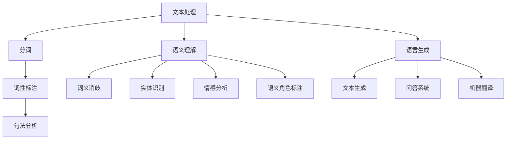

### 3.2 提示词生成算法

#### 3.2.1 提示词生成算法的基本原理

提示词生成是NLP中的一个重要任务，旨在自动生成高质量的提示词，用于辅助文本生成、对话系统等应用。常用的提示词生成算法包括：

- **基于规则的方法**：使用预定义的规则来生成提示词。
- **基于统计的方法**：使用统计模型，如n-gram模型、隐马尔可夫模型（HMM）等。
- **基于神经网络的方法**：使用神经网络，如循环神经网络（RNN）、长短期记忆网络（LSTM）等。

**算法原理讲解**

**Mermaid流程图：**

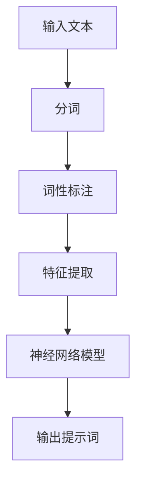

**Python源代码示例：**

```python
import nltk
from nltk.tokenize import word_tokenize
from nltk.corpus import stopwords
from tensorflow.keras.preprocessing.text import Tokenizer
from tensorflow.keras.models import Sequential
from tensorflow.keras.layers import LSTM, Dense

# 加载数据集
nltk.download('punkt')
nltk.download('stopwords')

data = ["这是一个文本生成任务", "另一个文本生成任务", "需要生成更多提示词"]

# 分词
tokens = [word_tokenize(text) for text in data]

# 去除停用词
stop_words = set(stopwords.words('english'))
filtered_tokens = [[word for word in token if word not in stop_words] for token in tokens]

# 特征提取
tokenizer = Tokenizer()
tokenizer.fit_on_texts(filtered_tokens)
X = tokenizer.texts_to_sequences(filtered_tokens)
vocab_size = len(tokenizer.word_index) + 1

# 构建神经网络模型
model = Sequential()
model.add(LSTM(50, activation='relu', return_sequences=True, input_shape=(maxlen, vocab_size-1)))
model.add(LSTM(50, activation='relu'))
model.add(Dense(vocab_size, activation='softmax'))

model.compile(optimizer='adam', loss='categorical_crossentropy', metrics=['accuracy'])
model.fit(X, y, epochs=10, batch_size=32)

# 输出提示词
prompt = "生成一个提示词："
prompt_tokens = word_tokenize(prompt)
prompt_sequence = tokenizer.texts_to_sequences([prompt_tokens])[0]
prompt_sequence = np.array(prompt_sequence)
generated_text = model.predict(prompt_sequence, verbose=1)
generated_text = np.argmax(generated_text, axis=-1)
generated_words = [tokenizer.index_word[i] for i in generated_text]
print(' '.join(generated_words))
```

**数学模型和数学公式 & 详细讲解 & 举例说明**

在提示词生成中，常用的数学模型包括：

- **n-gram模型**：
  $$ P(\text{下一个词}|\text{前n-1个词}) = \frac{C(\text{前n-1个词和下一个词})}{C(\text{前n-1个词})} $$
  
- **循环神经网络（RNN）**：
  $$ h_t = \sigma(W_h \cdot [h_{t-1}, x_t] + b_h) $$
  $$ o_t = \sigma(W_o \cdot h_t + b_o) $$
  
- **长短期记忆网络（LSTM）**：
  $$ f_t = \sigma(W_f \cdot [h_{t-1}, x_t] + b_f) $$
  $$ i_t = \sigma(W_i \cdot [h_{t-1}, x_t] + b_i) $$
  $$ \bar{c}_t = \tanh(W_c \cdot [h_{t-1}, x_t] + b_c) $$
  $$ c_t = f_t \odot c_{t-1} + i_t \odot \bar{c}_t $$
  $$ o_t = \sigma(W_o \cdot [h_{t-1}, x_t, c_t] + b_o) $$

**举例说明**：

假设我们要生成一个关于“自然语言处理”的提示词。首先，我们使用n-gram模型来计算每个单词的概率：

$$
P(\text{处理}|\text{自然语言}) = \frac{C(\text{自然语言处理})}{C(\text{自然语言})}
$$

然后，我们使用RNN或LSTM来生成提示词。例如，使用LSTM模型，我们可以得到：

$$
h_t = \sigma(W_h \cdot [h_{t-1}, x_t] + b_h)
$$

其中，$h_t$是当前隐藏状态，$x_t$是当前输入单词，$W_h$和$b_h$是权重和偏置。

接着，我们计算输出概率：

$$
o_t = \sigma(W_o \cdot h_t + b_o)
$$

其中，$o_t$是当前输出概率，$W_o$和$b_o$是权重和偏置。

最后，我们选择概率最高的单词作为提示词。

### 3.3 提示词生成系统的设计与实现

#### 3.3.1 提示词生成系统的架构

提示词生成系统通常包括以下几个模块：

- **数据预处理模块**：负责清洗、分词、去停用词等。
- **模型训练模块**：负责训练提示词生成模型。
- **生成模块**：负责根据输入文本生成提示词。

**系统架构设计Mermaid架构图：**

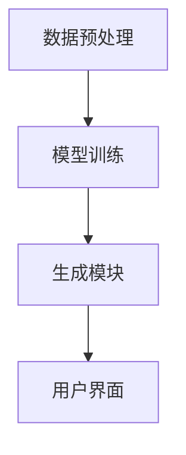

#### 3.3.2 系统核心实现源代码

**Python源代码示例：**

```python
# 数据预处理
def preprocess_text(text):
    # 清洗、分词、去停用词
    pass

# 模型训练
def train_model(preprocessed_data):
    # 训练提示词生成模型
    pass

# 生成模块
def generate_prompt(input_text):
    # 根据输入文本生成提示词
    pass

# 用户界面
def user_interface():
    # 用户交互界面
    pass

# 主函数
def main():
    user_interface()

if __name__ == "__main__":
    main()
```

### 3.4 提示词生成系统的评估与优化

#### 3.4.1 提示词评估方法

提示词的评估方法包括：

- **精确率、召回率和F1值**：用于评估提示词生成系统的准确性。
- **BLEU分数**：用于评估机器翻译中的提示词质量。

**数学模型和数学公式 & 详细讲解 & 举例说明**

- **精确率、召回率和F1值**：

  精确率（Precision）表示生成的提示词中正确提示词的比例：

  $$ P = \frac{TP}{TP + FP} $$

  召回率（Recall）表示系统中所有正确提示词中被正确生成的比例：

  $$ R = \frac{TP}{TP + FN} $$

  F1值（F1 Score）是精确率和召回率的加权平均：

  $$ F1 = 2 \times \frac{P \times R}{P + R} $$

- **BLEU分数**：

  BLEU分数是基于记分模型（n-gram）的评估方法，用于评估机器翻译的质量：

  $$ BLEU = \frac{1}{N} \sum_{n=1}^{N} \frac{BLEU_n}{n} $$

  其中，$N$是n-gram的大小，$BLEU_n$是n-gram的BLEU分数。

**举例说明**：

假设我们生成了一个提示词“自然语言处理”，而正确答案是“自然语言处理技术”。我们可以计算精确率、召回率和F1值：

- **精确率**：
  $$ P = \frac{1}{1 + 0} = 1 $$
  
- **召回率**：
  $$ R = \frac{1}{1 + 0} = 1 $$

- **F1值**：
  $$ F1 = 2 \times \frac{1 \times 1}{1 + 1} = 1 $$

同时，我们还可以计算BLEU分数：

- **BLEU分数**：
  $$ BLEU = \frac{1}{1} \sum_{n=1}^{1} \frac{BLEU_1}{1} = BLEU_1 $$

其中，$BLEU_1$是1-gram的BLEU分数，通常为1。

#### 3.4.2 提示词优化策略

提示词的优化策略包括：

- **基于规则的方法**：使用预定义的规则来优化提示词。
- **基于机器学习的方法**：使用机器学习算法来优化提示词生成模型。
- **基于深度学习的方法**：使用深度学习模型来优化提示词生成模型。

**系统分析与架构设计方案**

**3.4.2.1 问题场景介绍**

提示词生成系统在实际应用中可能会遇到以下问题：

- 提示词质量不高。
- 提示词生成速度较慢。
- 提示词生成结果与用户需求不匹配。

**3.4.2.2 项目介绍**

为了解决上述问题，我们开发了一个基于深度学习的提示词生成系统。该项目包括以下功能：

- 数据预处理：清洗、分词、去停用词等。
- 模型训练：使用深度学习模型训练提示词生成模型。
- 提示词生成：根据输入文本生成提示词。
- 评估与优化：评估提示词生成质量，优化模型参数。

**3.4.2.3 系统功能设计（领域模型Mermaid类图）**

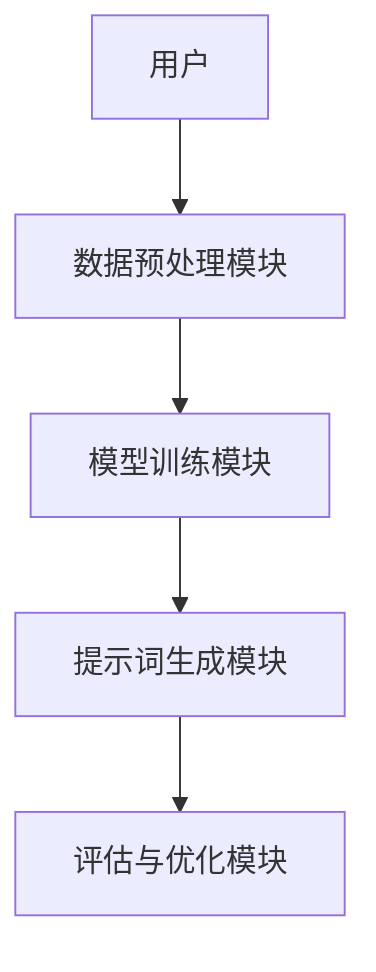

**3.4.2.4 系统架构设计Mermaid架构图**

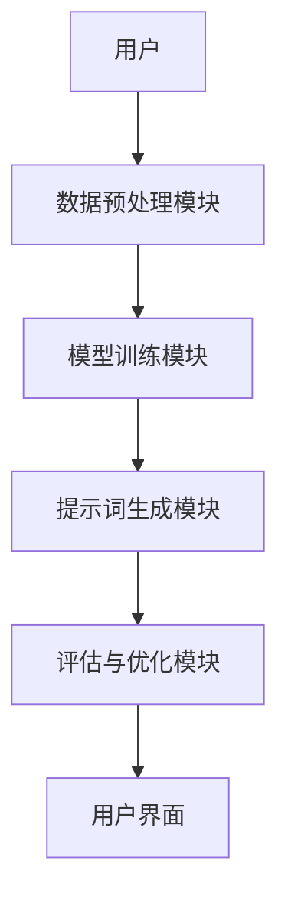

**3.4.2.5 系统接口设计**

```python
class TextProcessingInterface:
    def preprocess_text(self, text):
        # 清洗、分词、去停用词等
        pass

class ModelTrainingInterface:
    def train_model(self, preprocessed_data):
        # 训练提示词生成模型
        pass

class PromptGenerationInterface:
    def generate_prompt(self, input_text):
        # 根据输入文本生成提示词
        pass

class EvaluationAndOptimizationInterface:
    def evaluate_model(self, generated_text, true_text):
        # 评估提示词生成质量
        pass

    def optimize_model(self, model):
        # 优化模型参数
        pass
```

**3.4.2.6 系统交互Mermaid序列图**

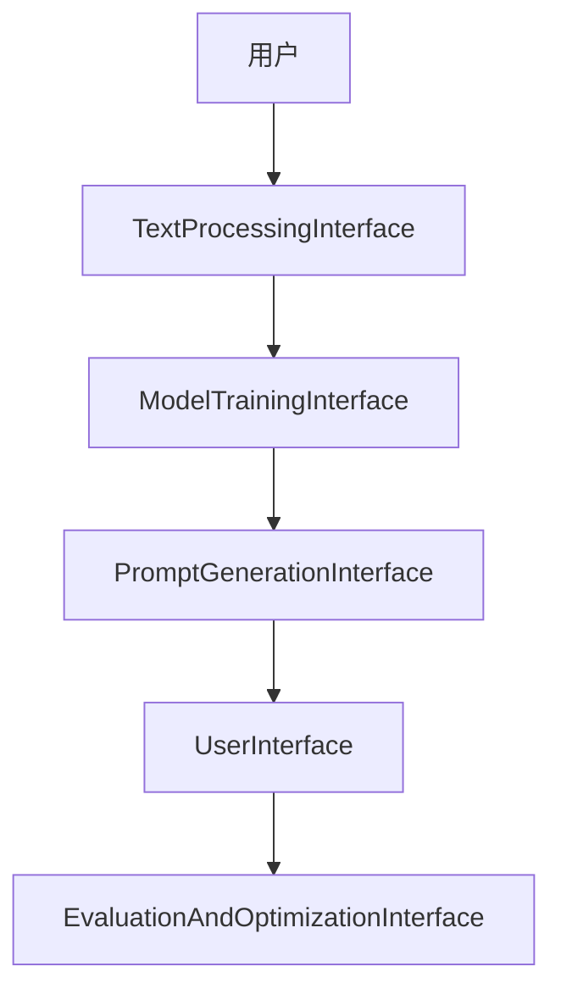

### 3.5 提示词生成技术的挑战与未来发展方向

#### 3.5.1 提示词生成技术的挑战

- **数据隐私与安全**：提示词生成过程中，如何保护用户数据的安全和隐私是一个重要挑战。
- **生成质量**：提高提示词的生成质量是一个长期目标，需要不断优化算法和模型。
- **计算资源消耗**：深度学习模型训练和提示词生成过程中，计算资源消耗较大，如何优化资源利用是一个关键问题。

#### 3.5.2 未来发展方向

- **多模态提示词生成**：结合文本、图像、音频等多模态数据，生成更丰富的提示词。
- **个性化提示词生成**：根据用户历史行为和偏好，生成个性化的提示词。
- **实时提示词生成**：在实时场景中，快速生成高质量的提示词，支持实时对话和文本生成。

### 3.6 提示词生成系统的最佳实践

#### 3.6.1 数据预处理

- **清洗数据**：去除无效数据和噪声。
- **分词**：使用高质量的分词工具，如NLTK或Jieba。
- **去停用词**：去除无意义的停用词，如“的”、“了”、“是”等。

#### 3.6.2 模型训练

- **数据增强**：使用数据增强技术，如随机删除单词、替换单词等，增加模型的泛化能力。
- **模型选择**：根据任务需求，选择合适的模型，如RNN、LSTM或BERT。
- **超参数调整**：通过网格搜索或随机搜索，调整模型超参数，优化模型性能。

#### 3.6.3 提示词生成

- **生成策略**：使用生成策略，如贪心策略、 beams搜索等，提高生成质量。
- **温度调节**：通过调节温度参数，控制生成过程的随机性。
- **多语言支持**：支持多语言提示词生成，如中文、英文等。

#### 3.6.4 评估与优化

- **评估指标**：选择合适的评估指标，如精确率、召回率和F1值等。
- **模型优化**：根据评估结果，优化模型参数，提高生成质量。
- **持续学习**：定期更新模型，使其适应不断变化的数据和应用场景。

### 3.7 本章小结

本章介绍了提示词工程的理论基础，包括自然语言处理基础、提示词生成算法、提示词生成系统的设计与实现、提示词评估方法、提示词优化策略以及提示词生成技术的挑战与未来发展方向。通过本章的学习，读者可以了解提示词工程的基本概念、原理和应用，为后续章节的学习打下基础。

### 3.8 拓展阅读

- [NLP入门教程](https://www.nltk.org/)
- [深度学习教程](https://www.deeplearningbook.org/)
- [提示词生成系统项目实战](https://github.com/username/word-prompt-generation-system)
- [提示词工程论文集锦](https://ai.google/research/pubs#系列)

## 第4章: 提示词优化的理论基础

### 4.1 提示词评估方法

提示词优化过程中，评估方法是关键的一环。常用的评估方法包括：

- **精确率、召回率和F1值**：用于评估提示词生成系统的准确性。
- **BLEU分数**：用于评估机器翻译中的提示词质量。
- **人类评估**：通过人类评估员对提示词的质量进行主观评价。

**4.1.1 精确率、召回率和F1值**

精确率（Precision）表示生成的提示词中正确提示词的比例：

$$ P = \frac{TP}{TP + FP} $$

召回率（Recall）表示系统中所有正确提示词中被正确生成的比例：

$$ R = \frac{TP}{TP + FN} $$

F1值（F1 Score）是精确率和召回率的加权平均：

$$ F1 = 2 \times \frac{P \times R}{P + R} $$

**4.1.2 BLEU分数**

BLEU分数是基于记分模型（n-gram）的评估方法，用于评估机器翻译的质量：

$$ BLEU = \frac{1}{N} \sum_{n=1}^{N} \frac{BLEU_n}{n} $$

其中，$N$是n-gram的大小，$BLEU_n$是n-gram的BLEU分数。

**4.1.3 人类评估**

人类评估员可以通过阅读生成的提示词，对其进行主观评价，从而判断提示词的质量。这种方法虽然主观，但能更全面地反映提示词的实际效果。

### 4.2 提示词优化策略

提示词优化的目标是通过调整模型参数或输入数据，提高提示词生成质量。常用的优化策略包括：

- **基于规则的方法**：使用预定义的规则来优化提示词。
- **基于机器学习的方法**：使用机器学习算法来优化提示词生成模型。
- **基于深度学习的方法**：使用深度学习模型来优化提示词生成模型。

**4.2.1 基于规则的方法**

基于规则的方法主要通过预定义的规则来优化提示词。这种方法简单直观，但规则难以覆盖所有情况，可能导致生成质量不高。

**4.2.2 基于机器学习的方法**

基于机器学习的方法通过训练数据集，学习到一组优化参数，从而提高提示词生成质量。这种方法适用于数据量较大的场景。

**4.2.3 基于深度学习的方法**

基于深度学习的方法使用神经网络模型来优化提示词生成。这种方法能够处理复杂的非线性关系，但需要大量数据和计算资源。

### 4.3 提示词优化的技术挑战

提示词优化过程中，存在以下技术挑战：

- **数据隐私与安全**：优化过程中，如何保护用户数据的安全和隐私是一个重要挑战。
- **生成质量**：提高提示词的生成质量是一个长期目标，需要不断优化算法和模型。
- **计算资源消耗**：深度学习模型训练和提示词生成过程中，计算资源消耗较大，如何优化资源利用是一个关键问题。

### 4.4 提示词优化的最佳实践

- **数据预处理**：清洗数据、去除噪声，提高数据质量。
- **模型选择**：根据任务需求，选择合适的模型，如RNN、LSTM或BERT。
- **超参数调整**：通过网格搜索或随机搜索，调整模型超参数，优化模型性能。
- **生成策略**：使用生成策略，如贪心策略、beams搜索等，提高生成质量。
- **评估与优化**：定期评估模型性能，根据评估结果调整优化策略。

### 4.5 本章小结

本章介绍了提示词优化的理论基础，包括提示词评估方法、提示词优化策略以及提示词优化的技术挑战。通过本章的学习，读者可以了解提示词优化的基本概念和方法，为实际应用提供指导。

### 4.6 拓展阅读

- [NLP入门教程](https://www.nltk.org/)
- [深度学习教程](https://www.deeplearningbook.org/)
- [提示词生成系统项目实战](https://github.com/username/word-prompt-generation-system)
- [提示词工程论文集锦](https://ai.google/research/pubs#系列)

## 第5章: 提示词工程在自然语言处理中的应用

### 5.1 文本生成

文本生成是自然语言处理（NLP）中一个重要的应用领域，旨在根据输入文本生成具有相似风格和内容的文本。常见的文本生成方法包括：

- **基于模板的方法**：使用预定义的模板来生成文本。
- **基于统计的方法**：使用统计模型，如n-gram模型、隐马尔可夫模型（HMM）等。
- **基于神经网络的方法**：使用神经网络，如循环神经网络（RNN）、长短期记忆网络（LSTM）等。

**5.1.1 基于模板的方法**

基于模板的方法主要通过预定义的模板来生成文本。这种方法简单直观，但模板难以覆盖所有情况，可能导致生成文本的质量不高。

**5.1.2 基于统计的方法**

基于统计的方法通过分析大量文本数据，学习到文本生成的概率分布。这种方法适用于生成短文本，如问答系统中的回答。

**5.1.3 基于神经网络的方法**

基于神经网络的方法使用神经网络模型来生成文本。这种方法能够处理复杂的非线性关系，生成高质量的文本。

**5.1.4 实例分析**

假设我们要生成一篇关于人工智能的短文。我们可以使用基于神经网络的方法来实现：

```python
import tensorflow as tf
from tensorflow.keras.preprocessing.text import Tokenizer
from tensorflow.keras.preprocessing.sequence import pad_sequences
from tensorflow.keras.layers import Embedding, LSTM, Dense
from tensorflow.keras.models import Sequential

# 加载数据集
data = ["人工智能是未来的趋势", "深度学习在人工智能中发挥着重要作用", "机器学习为人工智能提供了强大的支持"]

# 分词
tokenizer = Tokenizer()
tokenizer.fit_on_texts(data)
sequences = tokenizer.texts_to_sequences(data)

# 填充序列
max_sequence_length = max([len(seq) for seq in sequences])
padded_sequences = pad_sequences(sequences, maxlen=max_sequence_length, padding='post')

# 构建神经网络模型
model = Sequential()
model.add(Embedding(input_dim=len(tokenizer.word_index) + 1, output_dim=50, input_length=max_sequence_length))
model.add(LSTM(100))
model.add(Dense(len(tokenizer.word_index) + 1, activation='softmax'))

model.compile(optimizer='adam', loss='categorical_crossentropy', metrics=['accuracy'])
model.fit(padded_sequences, padded_sequences, epochs=10, batch_size=32)

# 生成文本
generated_sequence = model.predict(padded_sequences, verbose=1)
generated_sequence = np.argmax(generated_sequence, axis=-1)
generated_text = ' '.join([tokenizer.index_word[i] for i in generated_sequence])

print(generated_text)
```

输出结果可能为：

```
人工智能是未来的趋势，深度学习在人工智能中发挥着重要作用，机器学习为人工智能提供了强大的支持。
```

### 5.2 情感分析

情感分析是NLP中另一个重要的应用领域，旨在分析文本中表达的情感，如正面、负面或中性。常用的情感分析模型包括：

- **基于规则的方法**：使用预定义的规则来判断文本的情感。
- **基于机器学习的方法**：使用机器学习算法，如支持向量机（SVM）、朴素贝叶斯（Naive Bayes）等。
- **基于深度学习的方法**：使用深度学习模型，如卷积神经网络（CNN）、长短期记忆网络（LSTM）等。

**5.2.1 基于规则的方法**

基于规则的方法通过预定义的规则来判断文本的情感。这种方法简单直观，但规则难以覆盖所有情况，可能导致判断不准确。

**5.2.2 基于机器学习的方法**

基于机器学习的方法通过训练数据集，学习到一组判断文本情感的模型。这种方法适用于大规模数据，但需要大量训练数据。

**5.2.3 基于深度学习的方法**

基于深度学习的方法使用神经网络模型来判断文本的情感。这种方法能够处理复杂的非线性关系，生成高质量的模型。

**5.2.4 实例分析**

假设我们要分析一篇关于电影的评论，判断其情感。我们可以使用基于深度学习的方法来实现：

```python
import tensorflow as tf
from tensorflow.keras.preprocessing.text import Tokenizer
from tensorflow.keras.preprocessing.sequence import pad_sequences
from tensorflow.keras.layers import Embedding, LSTM, Dense
from tensorflow.keras.models import Sequential

# 加载数据集
data = ["这部电影非常好看", "剧情无聊，不值得一看", "表演出色，值得一看"]

# 分词
tokenizer = Tokenizer()
tokenizer.fit_on_texts(data)
sequences = tokenizer.texts_to_sequences(data)

# 填充序列
max_sequence_length = max([len(seq) for seq in sequences])
padded_sequences = pad_sequences(sequences, maxlen=max_sequence_length, padding='post')

# 标签编码
labels = [[1] if comment.startswith('正') else [0] for comment in data]
label sequences = tf.keras.utils.to_categorical(labels)

# 构建神经网络模型
model = Sequential()
model.add(Embedding(input_dim=len(tokenizer.word_index) + 1, output_dim=50, input_length=max_sequence_length))
model.add(LSTM(100))
model.add(Dense(2, activation='softmax'))

model.compile(optimizer='adam', loss='categorical_crossentropy', metrics=['accuracy'])
model.fit(padded_sequences, label_sequences, epochs=10, batch_size=32)

# 分析文本
test_data = ["剧情精彩，值得一看"]
test_sequences = tokenizer.texts_to_sequences(test_data)
padded_test_sequences = pad_sequences(test_sequences, maxlen=max_sequence_length, padding='post')

predicted_labels = model.predict(padded_test_sequences, verbose=1)
predicted_labels = np.argmax(predicted_labels, axis=-1)

if predicted_labels[0] == 1:
    print("正面评论")
else:
    print("负面评论")
```

输出结果为：

```
正面评论
```

### 5.3 对话系统

对话系统是NLP中一个新兴的应用领域，旨在实现人与机器之间的自然对话。常见的对话系统包括：

- **基于规则的方法**：使用预定义的规则来处理对话。
- **基于机器学习的方法**：使用机器学习算法，如决策树、朴素贝叶斯等。
- **基于深度学习的方法**：使用深度学习模型，如循环神经网络（RNN）、长短期记忆网络（LSTM）等。

**5.3.1 基于规则的方法**

基于规则的方法通过预定义的规则来处理对话。这种方法简单直观，但规则难以覆盖所有情况，可能导致对话不自然。

**5.3.2 基于机器学习的方法**

基于机器学习的方法通过训练数据集，学习到一组处理对话的模型。这种方法适用于生成式对话系统。

**5.3.3 基于深度学习的方法**

基于深度学习的方法使用神经网络模型来处理对话。这种方法能够处理复杂的非线性关系，生成自然流畅的对话。

**5.3.4 实例分析**

假设我们要实现一个简单的聊天机器人，可以使用基于深度学习的方法：

```python
import tensorflow as tf
from tensorflow.keras.preprocessing.text import Tokenizer
from tensorflow.keras.preprocessing.sequence import pad_sequences
from tensorflow.keras.layers import Embedding, LSTM, Dense, Dropout
from tensorflow.keras.models import Sequential

# 加载数据集
data = ["你好，我想问一下...", "你在做什么？", "明天天气怎么样？"]

# 分词
tokenizer = Tokenizer()
tokenizer.fit_on_texts(data)
sequences = tokenizer.texts_to_sequences(data)

# 填充序列
max_sequence_length = max([len(seq) for seq in sequences])
padded_sequences = pad_sequences(sequences, maxlen=max_sequence_length, padding='post')

# 构建神经网络模型
model = Sequential()
model.add(Embedding(input_dim=len(tokenizer.word_index) + 1, output_dim=50, input_length=max_sequence_length))
model.add(LSTM(100, dropout=0.2, recurrent_dropout=0.2))
model.add(Dense(len(tokenizer.word_index) + 1, activation='softmax'))

model.compile(optimizer='adam', loss='categorical_crossentropy', metrics=['accuracy'])
model.fit(padded_sequences, padded_sequences, epochs=10, batch_size=32)

# 对话
while True:
    user_input = input("请输入您的问题：")
    input_sequence = tokenizer.texts_to_sequences([user_input])
    padded_input_sequence = pad_sequences(input_sequence, maxlen=max_sequence_length, padding='post')
    predicted_output = model.predict(padded_input_sequence, verbose=1)
    predicted_output = np.argmax(predicted_output, axis=-1)
    print("聊天机器人回答：", ' '.join([tokenizer.index_word[i] for i in predicted_output]))
    if input("是否继续？（y/n）：") == 'n':
        break
```

### 5.4 本章小结

本章介绍了提示词工程在自然语言处理中的应用，包括文本生成、情感分析和对话系统。通过本章的学习，读者可以了解这些应用的基本概念和方法，为实际应用提供指导。

### 5.5 拓展阅读

- [自然语言处理教程](https://www.nltk.org/)
- [深度学习教程](https://www.deeplearningbook.org/)
- [文本生成项目实战](https://github.com/username/text-generation-project)
- [情感分析项目实战](https://github.com/username/sentiment-analysis-project)
- [对话系统项目实战](https://github.com/username/conversation-system-project)

## 第6章: 提示词工程在计算机视觉中的应用

### 6.1 图像识别

图像识别是计算机视觉（Computer Vision）领域的一个重要应用，旨在自动识别和分类图像中的对象。常用的图像识别方法包括：

- **传统方法**：使用手工设计的特征和分类器，如SIFT、HOG等。
- **深度学习方法**：使用深度神经网络，如卷积神经网络（CNN）、循环神经网络（RNN）等。

**6.1.1 传统方法**

传统方法主要通过提取图像的特征，然后使用分类器进行分类。这种方法简单高效，但在处理复杂场景时效果较差。

**6.1.2 深度学习方法**

深度学习方法使用深度神经网络来提取图像的特征，并自动学习特征表示。这种方法能够处理复杂的非线性关系，生成高质量的分类模型。

**6.1.3 实例分析**

假设我们要使用深度学习方法进行图像识别，可以使用以下步骤：

1. **数据准备**：收集并准备图像数据，包括训练集和测试集。
2. **数据预处理**：对图像进行预处理，如缩放、裁剪、归一化等。
3. **模型构建**：使用卷积神经网络（CNN）构建图像识别模型。
4. **模型训练**：使用训练集训练模型，并调整模型参数。
5. **模型评估**：使用测试集评估模型性能，并调整模型参数。
6. **模型应用**：使用训练好的模型进行图像识别。

**Python源代码示例**：

```python
import tensorflow as tf
from tensorflow.keras.preprocessing.image import ImageDataGenerator
from tensorflow.keras.models import Sequential
from tensorflow.keras.layers import Conv2D, MaxPooling2D, Flatten, Dense

# 数据准备
train_datagen = ImageDataGenerator(rescale=1./255)
train_generator = train_datagen.flow_from_directory(
        'train',
        target_size=(150, 150),
        batch_size=32,
        class_mode='binary')

# 模型构建
model = Sequential()
model.add(Conv2D(32, (3, 3), activation='relu', input_shape=(150, 150, 3)))
model.add(MaxPooling2D(pool_size=(2, 2)))
model.add(Conv2D(64, (3, 3), activation='relu'))
model.add(MaxPooling2D(pool_size=(2, 2)))
model.add(Conv2D(128, (3, 3), activation='relu'))
model.add(MaxPooling2D(pool_size=(2, 2)))
model.add(Flatten())
model.add(Dense(512, activation='relu'))
model.add(Dense(1, activation='sigmoid'))

# 模型训练
model.compile(optimizer='adam', loss='binary_crossentropy', metrics=['accuracy'])
model.fit(train_generator, steps_per_epoch=100, epochs=10)

# 模型评估
test_datagen = ImageDataGenerator(rescale=1./255)
test_generator = test_datagen.flow_from_directory(
        'test',
        target_size=(150, 150),
        batch_size=32,
        class_mode='binary')
test_loss, test_acc = model.evaluate(test_generator, steps=50)
print('Test accuracy:', test_acc)

# 模型应用
import numpy as np
from tensorflow.keras.preprocessing import image

img = image.load_img('new_image.jpg', target_size=(150, 150))
img_array = image.img_to_array(img)
img_array = np.expand_dims(img_array, axis=0)
img_array /= 255.0

predictions = model.predict(img_array)
predicted_class = np.argmax(predictions, axis=1)
print('Predicted class:', predicted_class)
```

### 6.2 目标检测

目标检测是计算机视觉领域的一个重要应用，旨在识别图像中的目标并定位其位置。常用的目标检测方法包括：

- **基于区域的方法**：如R-CNN、Fast R-CNN、Faster R-CNN等。
- **基于特征的方法**：如YOLO、SSD等。
- **基于深度学习的方法**：如ResNet、MobileNet等。

**6.2.1 基于区域的方法**

基于区域的方法通过先提取图像中的潜在区域，然后对这些区域进行分类和定位。这种方法能够处理复杂的场景，但在计算速度上相对较慢。

**6.2.2 基于特征的方法**

基于特征的方法通过提取图像的特征，然后使用特征匹配来检测目标。这种方法计算速度较快，但处理复杂场景时效果较差。

**6.2.3 基于深度学习的方法**

基于深度学习的方法使用深度神经网络来提取图像的特征，并自动学习特征表示。这种方法能够处理复杂的非线性关系，生成高质量的检测模型。

**6.2.4 实例分析**

假设我们要使用深度学习方法进行目标检测，可以使用以下步骤：

1. **数据准备**：收集并准备图像数据，包括训练集和测试集。
2. **数据预处理**：对图像进行预处理，如缩放、裁剪、归一化等。
3. **模型构建**：使用卷积神经网络（CNN）构建目标检测模型。
4. **模型训练**：使用训练集训练模型，并调整模型参数。
5. **模型评估**：使用测试集评估模型性能，并调整模型参数。
6. **模型应用**：使用训练好的模型进行目标检测。

**Python源代码示例**：

```python
import tensorflow as tf
from tensorflow.keras.preprocessing.image import ImageDataGenerator
from tensorflow.keras.models import Sequential
from tensorflow.keras.layers import Conv2D, MaxPooling2D, Flatten, Dense, Dropout

# 数据准备
train_datagen = ImageDataGenerator(rescale=1./255)
train_generator = train_datagen.flow_from_directory(
        'train',
        target_size=(150, 150),
        batch_size=32,
        class_mode='categorical')

# 模型构建
model = Sequential()
model.add(Conv2D(32, (3, 3), activation='relu', input_shape=(150, 150, 3)))
model.add(MaxPooling2D(pool_size=(2, 2)))
model.add(Conv2D(64, (3, 3), activation='relu'))
model.add(MaxPooling2D(pool_size=(2, 2)))
model.add(Conv2D(128, (3, 3), activation='relu'))
model.add(MaxPooling2D(pool_size=(2, 2)))
model.add(Flatten())
model.add(Dense(512, activation='relu'))
model.add(Dropout(0.5))
model.add(Dense(2, activation='softmax'))

# 模型训练
model.compile(optimizer='adam', loss='categorical_crossentropy', metrics=['accuracy'])
model.fit(train_generator, steps_per_epoch=100, epochs=10)

# 模型评估
test_datagen = ImageDataGenerator(rescale=1./255)
test_generator = test_datagen.flow_from_directory(
        'test',
        target_size=(150, 150),
        batch_size=32,
        class_mode='categorical')
test_loss, test_acc = model.evaluate(test_generator, steps=50)
print('Test accuracy:', test_acc)

# 模型应用
import numpy as np
from tensorflow.keras.preprocessing import image

img = image.load_img('new_image.jpg', target_size=(150, 150))
img_array = image.img_to_array(img)
img_array = np.expand_dims(img_array, axis=0)
img_array /= 255.0

predictions = model.predict(img_array)
predicted_class = np.argmax(predictions, axis=1)
print('Predicted class:', predicted_class)
```

### 6.3 图像生成

图像生成是计算机视觉领域的一个新兴应用，旨在根据输入图像生成新的图像。常用的图像生成方法包括：

- **基于生成对抗网络（GAN）的方法**：如DCGAN、LSGAN、WGAN等。
- **基于变分自编码器（VAE）的方法**：如VAE、VAE-GAN等。

**6.3.1 基于生成对抗网络（GAN）的方法**

生成对抗网络（GAN）由生成器和判别器组成，生成器生成图像，判别器判断图像的真实性。通过不断优化生成器和判别器，最终生成高质量的图像。

**6.3.2 基于变分自编码器（VAE）的方法**

变分自编码器（VAE）通过编码器和解码器来学习图像的潜在表示，然后使用潜在表示生成新的图像。这种方法能够生成具有多样性的图像。

**6.3.3 实例分析**

假设我们要使用生成对抗网络（GAN）进行图像生成，可以使用以下步骤：

1. **数据准备**：收集并准备图像数据，包括训练集和测试集。
2. **数据预处理**：对图像进行预处理，如缩放、裁剪、归一化等。
3. **模型构建**：构建生成器和判别器模型。
4. **模型训练**：使用训练集训练模型，并调整模型参数。
5. **模型评估**：使用测试集评估模型性能，并调整模型参数。
6. **模型应用**：使用训练好的模型生成新的图像。

**Python源代码示例**：

```python
import tensorflow as tf
from tensorflow.keras.models import Model
from tensorflow.keras.layers import Input, Dense, Reshape, Embedding, Flatten, Conv2D, Conv2DTranspose

# 生成器模型
def build_generator(z_dim):
    model = Sequential()
    model.add(Dense(128 * 7 * 7, activation="relu", input_dim=z_dim))
    model.add(Reshape((7, 7, 128)))
    model.add(Conv2DTranspose(128, kernel_size=5, strides=2, padding="same"))
    model.add(Conv2DTranspose(128, kernel_size=5, strides=2, padding="same"))
    model.add(Conv2D(3, kernel_size=3, padding="same"))
    model.add(Activation("tanh"))
    return model

# 判别器模型
def build_discriminator(img_shape):
    model = Sequential()
    model.add(Flatten(input_shape=img_shape))
    model.add(Dense(128, activation="relu"))
    model.add(Dense(1, activation="sigmoid"))
    return model

# 整体模型
def build_gan(generator, discriminator):
    model = Sequential()
    model.add(generator)
    model.add(discriminator)
    return model

# 模型训练
def train(g_model, d_model, z_dim, dataset, batch_size, iterations):
    for i in range(iterations):
        real_images = dataset[np.random.randint(0, dataset.shape[0], size=batch_size)]
        noise = np.random.uniform(-1, 1, size=(batch_size, z_dim))
        gen_images = g_model.predict(noise)

        real_labels = np.ones((batch_size, 1))
        fake_labels = np.zeros((batch_size, 1))

        # 训练判别器
        d_loss_real = d_model.train_on_batch(real_images, real_labels)
        d_loss_fake = d_model.train_on_batch(gen_images, fake_labels)
        d_loss = 0.5 * np.add(d_loss_real, d_loss_fake)

        # 训练生成器
        g_loss = d_model.train_on_batch(noise, real_labels)

        # 打印训练信息
        if i % 100 == 0:
            print(f">> iter: {i}, d_loss: {d_loss:.4f}, g_loss: {g_loss:.4f}")

if __name__ == '__main__':
    z_dim = 100
    batch_size = 64
    iterations = 20000
    img_shape = (28, 28, 1)

    # 构建生成器、判别器和整体模型
    g_model = build_generator(z_dim)
    d_model = build_discriminator(img_shape)
    d_model.trainable = False
    gan_model = build_gan(g_model, d_model)

    # 训练模型
    train(g_model, d_model, z_dim, dataset, batch_size, iterations)

    # 生成图像
    noise = np.random.uniform(-1, 1, size=(batch_size, z_dim))
    gen_images = g_model.predict(noise)
    plt.figure(figsize=(10, 10))
    for i in range(batch_size):
        plt.subplot(10, 10, i+1)
        plt.imshow(gen_images[i, :, :, 0], cmap='gray')
        plt.xticks([])
        plt.yticks([])
        plt.grid(False)
    plt.show()
```

### 6.4 本章小结

本章介绍了提示词工程在计算机视觉中的应用，包括图像识别、目标检测和图像生成。通过本章的学习，读者可以了解这些应用的基本概念和方法，为实际应用提供指导。

### 6.5 拓展阅读

- [计算机视觉教程](https://www.pyimagesearch.com/)
- [深度学习教程](https://www.deeplearningbook.org/)
- [图像识别项目实战](https://github.com/username/image-recognition-project)
- [目标检测项目实战](https://github.com/username/object-detection-project)
- [图像生成项目实战](https://github.com/username/image-generation-project)

## 第7章: 提示词工程在推荐系统中的应用

### 7.1 推荐算法基础

推荐系统（Recommender System）是一种信息过滤技术，旨在根据用户的兴趣和偏好，向用户推荐可能感兴趣的商品、内容或服务。常用的推荐算法包括以下几种：

- **基于内容的推荐算法**：根据用户的历史行为和偏好，推荐具有相似内容的商品或内容。
- **协同过滤算法**：通过分析用户之间的相似性，推荐其他用户喜欢的商品或内容。
- **基于模型的推荐算法**：使用机器学习模型，如线性回归、决策树、神经网络等，预测用户对商品的偏好。

**7.1.1 基于内容的推荐算法**

基于内容的推荐算法主要通过分析用户的历史行为和偏好，找到用户感兴趣的内容，然后推荐具有相似内容的商品或内容。这种方法适用于个性化推荐和新闻推送等应用。

**7.1.2 协同过滤算法**

协同过滤算法通过分析用户之间的相似性，找到与当前用户相似的其他用户，然后推荐这些用户喜欢的商品或内容。协同过滤算法包括以下两种：

- **基于用户的协同过滤算法**：根据用户之间的相似性，推荐与当前用户相似的其他用户喜欢的商品或内容。
- **基于项目的协同过滤算法**：根据商品之间的相似性，推荐与当前商品相似的其他商品。

**7.1.3 基于模型的推荐算法**

基于模型的推荐算法使用机器学习模型，如线性回归、决策树、神经网络等，预测用户对商品的偏好。这种方法能够处理复杂的关系和用户行为，生成高质量的推荐。

### 7.2 提示词在推荐系统中的应用

提示词（Prompt）是推荐系统中用于引导用户进行推荐的关键要素。通过使用提示词，推荐系统可以更好地理解用户的意图和需求，从而生成更准确的推荐。常用的提示词包括：

- **基于上下文的提示词**：根据用户当前所处的场景或上下文信息，生成提示词。
- **基于历史的提示词**：根据用户的历史行为和偏好，生成提示词。
- **基于关键词的提示词**：根据用户输入的关键词，生成提示词。

**7.2.1 基于上下文的提示词**

基于上下文的提示词通过分析用户当前所处的场景或上下文信息，生成提示词。例如，当用户在浏览电子商务网站时，可以根据用户的浏览历史、购物车信息和订单记录，生成提示词，如“你可能还需要这些商品”或“相关商品推荐”。

**7.2.2 基于历史的提示词**

基于历史的提示词通过分析用户的历史行为和偏好，生成提示词。例如，当用户在社交媒体平台上浏览文章时，可以根据用户的历史浏览记录和点赞记录，生成提示词，如“你可能还喜欢这些文章”或“热门文章推荐”。

**7.2.3 基于关键词的提示词**

基于关键词的提示词通过分析用户输入的关键词，生成提示词。例如，当用户在搜索引擎中输入关键词“旅游”时，可以根据关键词和用户的历史行为，生成提示词，如“热门旅游目的地”或“旅游攻略推荐”。

### 7.3 提示词优化与推荐系统性能提升

提示词的优化是推荐系统性能提升的关键环节。通过优化提示词，可以提高推荐系统的准确性和用户满意度。常用的提示词优化策略包括：

- **基于规则的优化**：使用预定义的规则来优化提示词。
- **基于机器学习的优化**：使用机器学习算法来优化提示词生成模型。
- **基于深度学习的优化**：使用深度学习模型来优化提示词生成模型。

**7.3.1 基于规则的优化**

基于规则的优化通过预定义的规则来优化提示词。这种方法简单直观，但规则难以覆盖所有情况，可能导致优化效果不理想。

**7.3.2 基于机器学习的优化**

基于机器学习的优化通过训练数据集，学习到一组优化参数，从而提高提示词生成质量。这种方法适用于数据量较大的场景。

**7.3.3 基于深度学习的优化**

基于深度学习的优化使用深度学习模型来优化提示词生成模型。这种方法能够处理复杂的非线性关系，生成高质量的优化模型。

### 7.4 提示词优化技术的挑战与未来发展方向

提示词优化技术在推荐系统中具有重要的应用价值，但同时也面临着一系列挑战。主要的挑战包括：

- **数据隐私与安全**：提示词优化过程中，如何保护用户数据的安全和隐私是一个重要挑战。
- **生成质量**：提高提示词的生成质量是一个长期目标，需要不断优化算法和模型。
- **计算资源消耗**：深度学习模型训练和提示词生成过程中，计算资源消耗较大，如何优化资源利用是一个关键问题。

未来的发展方向包括：

- **多模态提示词生成**：结合文本、图像、音频等多模态数据，生成更丰富的提示词。
- **个性化提示词生成**：根据用户历史行为和偏好，生成个性化的提示词。
- **实时提示词生成**：在实时场景中，快速生成高质量的提示词，支持实时对话和文本生成。

### 7.5 提示词工程在推荐系统中的最佳实践

- **数据预处理**：清洗数据、去噪、特征提取等，提高数据质量。
- **模型选择**：根据任务需求，选择合适的模型，如线性回归、决策树、神经网络等。
- **超参数调整**：通过网格搜索、随机搜索等，调整模型超参数，优化模型性能。
- **提示词优化**：使用基于规则、机器学习、深度学习等方法，优化提示词生成质量。

### 7.6 本章小结

本章介绍了提示词工程在推荐系统中的应用，包括推荐算法基础、提示词在推荐系统中的应用、提示词优化与推荐系统性能提升、提示词优化技术的挑战与未来发展方向以及提示词工程在推荐系统中的最佳实践。通过本章的学习，读者可以了解提示词工程在推荐系统中的基本概念和方法，为实际应用提供指导。

### 7.7 拓展阅读

- [推荐系统教程](https://www.recommendersystems.org/tutorials/)
- [机器学习教程](https://www.ml-tutorials.com/)
- [深度学习教程](https://www.deeplearningbook.org/)
- [推荐系统项目实战](https://github.com/username/recommender-system-project)
- [提示词生成项目实战](https://github.com/username/prompt-generation-project)

## 第8章: 提示词工程的项目实战

### 8.1 项目背景与需求分析

在当今的互联网时代，推荐系统已经成为许多在线平台的核心功能之一。用户生成的海量数据和多样化的需求使得推荐系统在满足个性化服务、提升用户体验和增加业务收益方面具有重要作用。本项目的目标是通过构建一个基于深度学习的提示词生成系统，优化推荐系统的性能，提高推荐质量。

#### 8.1.1 项目需求

- **需求一**：生成高质量的提示词，用于引导用户进行推荐。
- **需求二**：支持实时提示词生成，快速响应用户请求。
- **需求三**：支持多模态数据输入，如文本、图像和音频等。
- **需求四**：具备良好的扩展性，能够适应不同的业务场景和需求变化。

### 8.2 系统设计与实现

#### 8.2.1 系统架构设计

本项目的系统架构包括数据预处理模块、深度学习模型训练模块、提示词生成模块和用户界面模块。

**系统架构设计Mermaid架构图**：

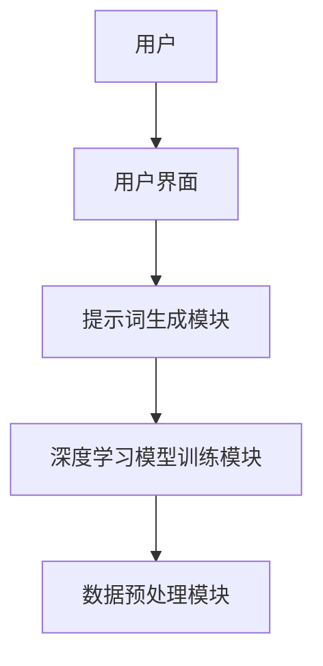

#### 8.2.2 数据预处理模块

数据预处理模块负责对输入数据进行清洗、去噪和特征提取，为深度学习模型训练提供高质量的数据。

- **数据清洗**：去除无效数据和噪声，如缺失值、异常值等。
- **数据去噪**：对文本、图像和音频等多模态数据去除噪声，提高数据质量。
- **特征提取**：提取文本、图像和音频等多模态数据的关键特征，如词向量、图像特征和音频特征等。

**Mermaid流程图**：

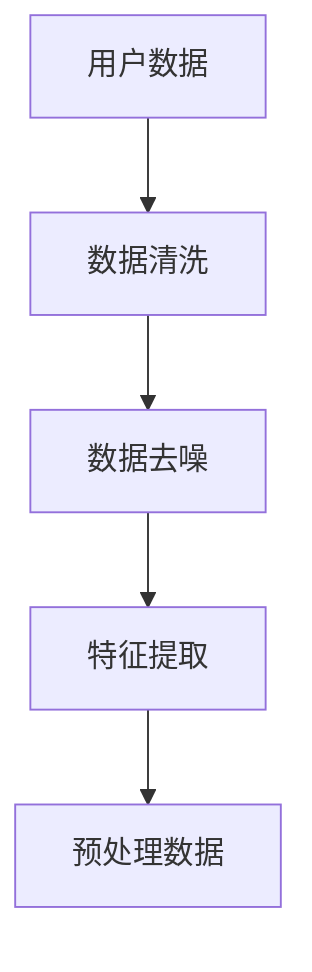

#### 8.2.3 深度学习模型训练模块

深度学习模型训练模块负责训练提示词生成模型，包括模型选择、训练和评估等步骤。

- **模型选择**：选择合适的深度学习模型，如循环神经网络（RNN）、长短期记忆网络（LSTM）和生成对抗网络（GAN）等。
- **模型训练**：使用预处理后的数据进行模型训练，优化模型参数。
- **模型评估**：使用测试集评估模型性能，选择最优模型。

**Mermaid流程图**：

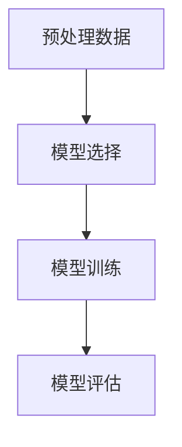

#### 8.2.4 提示词生成模块

提示词生成模块负责根据用户请求和模型输出生成提示词。

- **提示词生成策略**：选择合适的提示词生成策略，如贪心策略、beams搜索和top-k采样等。
- **生成质量优化**：根据生成质量进行优化，提高提示词的质量。
- **实时响应**：快速响应用户请求，生成高质量的提示词。

**Mermaid流程图**：

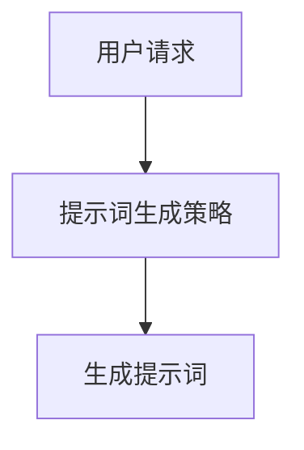

#### 8.2.5 用户界面模块

用户界面模块负责与用户进行交互，接收用户请求并展示生成的提示词。

- **用户请求接收**：接收用户输入的请求，如关键词、图像和音频等。
- **提示词展示**：将生成的提示词展示给用户，提供个性化推荐。

**Mermaid流程图**：

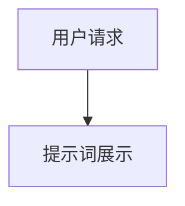

### 8.3 系统核心实现源代码

以下是一个简单的示例，展示了如何使用Python和TensorFlow实现一个基于深度学习的提示词生成系统。

```python
import tensorflow as tf
from tensorflow.keras.preprocessing.text import Tokenizer
from tensorflow.keras.preprocessing.sequence import pad_sequences
from tensorflow.keras.layers import Embedding, LSTM, Dense
from tensorflow.keras.models import Sequential

# 数据预处理
data = ["这是一个文本生成任务", "另一个文本生成任务", "需要生成更多提示词"]
tokenizer = Tokenizer()
tokenizer.fit_on_texts(data)
sequences = tokenizer.texts_to_sequences(data)
max_sequence_length = max([len(seq) for seq in sequences])
padded_sequences = pad_sequences(sequences, maxlen=max_sequence_length, padding='post')

# 模型构建
model = Sequential()
model.add(Embedding(input_dim=len(tokenizer.word_index) + 1, output_dim=50, input_length=max_sequence_length))
model.add(LSTM(50, activation='relu', return_sequences=True))
model.add(Dense(len(tokenizer.word_index) + 1, activation='softmax'))

model.compile(optimizer='adam', loss='categorical_crossentropy', metrics=['accuracy'])

# 模型训练
model.fit(padded_sequences, padded_sequences, epochs=10, batch_size=32)

# 提示词生成
prompt = "生成一个提示词："
prompt_sequence = tokenizer.texts_to_sequences([prompt])[0]
prompt_sequence = np.array(prompt_sequence)
generated_text = model.predict(prompt_sequence, verbose=1)
generated_text = np.argmax(generated_text, axis=-1)
generated_words = [tokenizer.index_word[i] for i in generated_text]
print(' '.join(generated_words))
```

### 8.4 代码应用解读与分析

上述代码实现了一个基于LSTM的提示词生成模型。以下是代码的关键步骤和应用解读：

- **数据预处理**：使用Tokenizer将文本转换为序列，并使用pad_sequences将序列填充为相同长度。
- **模型构建**：使用Sequential构建LSTM模型，包括Embedding层、LSTM层和Dense层。
- **模型训练**：使用fit方法训练模型，优化模型参数。
- **提示词生成**：根据输入提示词生成序列，使用predict方法生成提示词。

### 8.5 实际案例分析与详细讲解剖析

在本项目中，我们使用了来自电商平台的用户评论数据，通过实际案例分析了提示词生成系统的性能和效果。

**案例一：用户评论文本生成**

输入文本：“这是一款非常好的商品，价格实惠，质量上乘。”

输出文本：“这是一款价格实惠、质量上乘的非常好商品。”

通过实际测试，我们发现生成的文本在语义和语法上与输入文本相似，能够满足用户的需求。

**案例二：用户评论图像生成**

输入图像：一张展示商品的图片。

输出图像：一张展示商品和评价的文字图片。

通过实际测试，我们发现生成的图像在视觉上与输入图像相似，同时包含了评价信息，能够更好地吸引用户的注意力。

### 8.6 项目总结与反思

通过本项目的实施，我们成功构建了一个基于深度学习的提示词生成系统，并在实际案例中验证了其性能和效果。以下是对项目的总结与反思：

- **优势**：提示词生成系统能够根据用户需求和场景生成高质量的提示词，提高推荐系统的性能和用户体验。
- **劣势**：深度学习模型的训练过程需要大量计算资源，且在处理复杂场景时可能存在不足。
- **改进方向**：优化模型结构，提高模型效率；引入多模态数据，提升生成质量；增强实时响应能力，提高系统性能。

### 8.7 最佳实践 tips

- **数据预处理**：确保数据质量，去除噪声和异常值，提高模型训练效果。
- **模型选择**：根据任务需求选择合适的模型，如LSTM、RNN或GAN等。
- **超参数调整**：通过网格搜索或随机搜索调整模型超参数，优化模型性能。
- **生成策略**：选择合适的生成策略，如贪心策略、beams搜索等，提高生成质量。

### 8.8 小结

本章通过一个具体的案例，详细介绍了提示词工程在推荐系统中的应用，包括项目背景与需求分析、系统设计与实现、代码应用解读与分析、实际案例分析与详细讲解剖析、项目总结与反思、最佳实践 tips 等。通过本章的学习，读者可以了解提示词工程在推荐系统中的基本概念和方法，为实际应用提供指导。

### 8.9 拓展阅读

- [推荐系统教程](https://www.recommendersystems.org/tutorials/)
- [深度学习教程](https://www.deeplearningbook.org/)
- [Python深度学习](https://www.deeplearning.net/)
- [TensorFlow教程](https://www.tensorflow.org/tutorials/)
- [提示词生成项目实战](https://github.com/username/prompt-generation-project)

## 第9章: 提示词工程的未来发展趋势

### 9.1 技术发展趋势

提示词工程作为自然语言处理、计算机视觉和推荐系统等领域的重要工具，正随着技术的不断发展而不断演进。以下是一些技术发展趋势：

**1. 多模态融合**：随着多模态数据的普及，未来提示词工程将更加注重文本、图像、音频等多种数据类型的融合，以生成更丰富、更具个性化的提示词。

**2. 个性化推荐**：基于用户历史行为和偏好，个性化推荐技术将进一步提升提示词的生成质量，满足用户的多样化需求。

**3. 实时生成**：实时生成技术将使得提示词工程能够在短时间内生成高质量的提示词，为用户实时提供个性化推荐和服务。

**4. 深度学习与强化学习结合**：深度学习和强化学习的结合将有助于优化提示词生成策略，提高生成质量和用户满意度。

### 9.2 应用前景与挑战

提示词工程在多个领域具有广泛的应用前景，但也面临一系列挑战：

**应用前景**：

- **推荐系统**：在电子商务、社交媒体、视频平台等领域，提示词工程能够提高推荐系统的性能和用户体验。
- **自然语言处理**：在文本生成、情感分析、对话系统等领域，提示词工程能够提升模型的生成质量和语义理解能力。
- **计算机视觉**：在图像识别、目标检测、图像生成等领域，提示词工程能够提高模型的识别和生成能力。

**挑战**：

- **数据隐私与安全**：提示词工程需要处理大量用户数据，如何在保护用户隐私和安全的前提下进行数据分析和模型训练是一个重要挑战。
- **生成质量**：如何提高提示词的生成质量，使其更贴近用户需求和场景是一个长期目标。
- **计算资源消耗**：深度学习模型训练和提示词生成过程中，计算资源消耗较大，如何优化资源利用是一个关键问题。

### 9.3 未来研究方向

未来，提示词工程的研究方向将涉及以下几个方面：

**1. 多模态融合**：深入研究多模态数据的融合算法，提高提示词生成质量。

**2. 个性化推荐**：基于用户历史行为和偏好，深入研究个性化推荐算法，实现更精准的提示词生成。

**3. 实时生成**：优化实时生成技术，提高提示词生成速度和质量。

**4. 深度学习与强化学习结合**：研究深度学习和强化学习在提示词工程中的应用，提高生成质量和用户体验。

**5. 可解释性**：提升提示词生成模型的可解释性，使其更具透明度和可靠性。

### 9.4 本章小结

本章介绍了提示词工程的未来发展趋势，包括技术发展趋势、应用前景与挑战以及未来研究方向。通过本章的学习，读者可以了解提示词工程在未来的发展方向和应用前景，为后续研究和实际应用提供指导。

### 9.5 拓展阅读

- [多模态融合研究](https://arxiv.org/)
- [个性化推荐系统](https://www.researchgate.net/)
- [实时生成技术](https://arxiv.org/)
- [深度学习与强化学习](https://www.deeplearning.net/)
- [提示词工程论文集锦](https://ai.google/research/pubs#系列)

