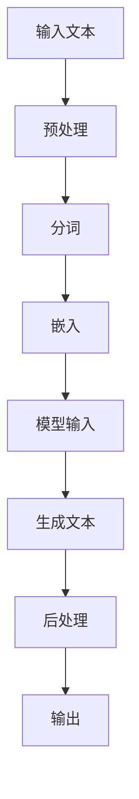
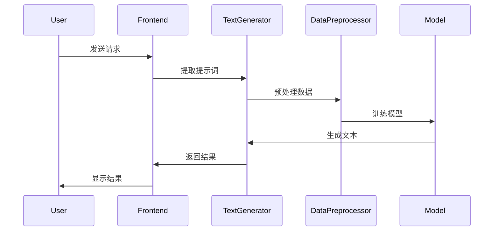
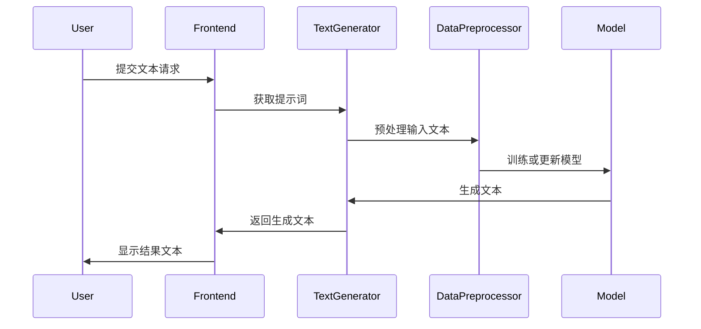

                 


### 书名与主题定位

《提示词工程：AI时代的新机遇》这本书的名称和主题定位旨在突出两个核心概念：提示词工程和AI时代的新机遇。首先，我们需要理解什么是提示词工程。提示词工程可以被视为一种优化和设计AI模型输入的技术。在生成式AI、文本处理、图像生成等应用中，提示词工程发挥着至关重要的作用。它不仅仅是简单地选择合适的词或短语，而是一个涉及数据预处理、模型训练、优化和评估的复杂过程。

其次，AI时代的新机遇指的是随着人工智能技术的快速发展，各个行业和领域所面临的新机遇和挑战。这些机遇不仅体现在技术的创新和应用上，还体现在商业模式、工作流程和社会影响等多个方面。在AI时代，提示词工程作为一个重要的技术分支，能够为各个领域带来显著的提升和变革。

这本书的主题定位旨在为读者提供全面的提示词工程知识，同时探讨AI时代下的新机遇。通过深入剖析提示词工程的核心概念和实际应用，读者可以了解到如何利用这个技术来实现AI模型的优化和提升，从而在快速变化的AI时代抓住新的机遇。

### 核心概念与联系

在深入探讨《提示词工程：AI时代的新机遇》这本书的核心概念和联系之前，我们首先需要明确几个关键术语的定义和它们在提示词工程中的应用。

**提示词（Prompt）**：在人工智能领域，提示词通常是指用来引导模型生成内容或进行特定任务的一段文字或指令。在生成式AI中，一个良好的提示词可以显著影响模型的生成质量和效率。例如，在文本生成任务中，一个清晰的提示词可以帮助模型生成更加相关和有逻辑性的文本。

**生成式AI（Generative AI）**：生成式AI是一种能够创建新数据的人工智能技术。这种技术可以用于生成图像、文本、音乐等多种形式的内容。提示词工程在生成式AI中的应用非常广泛，通过精心设计的提示词，可以引导模型生成特定类型或风格的内容。

**搜索增强（Search Augmentation）**：搜索增强技术旨在改善信息检索的过程。通过利用提示词工程，可以优化搜索算法，使其更准确地匹配用户查询和相关信息。在搜索引擎和问答系统中，提示词工程能够提升搜索结果的准确性和相关性。

**核心概念对比表格**：

| 概念                | 定义                                                                                                                                                                  | 提示词工程应用 |
|---------------------|-------------------------------------------------------------------------------------------------------|--------------|
| 提示词              | 引导模型生成内容或执行任务的文字或指令。                                                             | 文本生成、搜索增强 |
| 生成式AI            | 能够创建新数据的人工智能技术。                                                                      | 图像生成、音乐合成 |
| 搜索增强            | 改善信息检索过程的技术。                                                                             | 搜索引擎优化、问答系统 |

**ER实体关系图架构**：

为了更好地理解这些核心概念之间的联系，我们可以使用实体关系图（ER图）来展示它们之间的关系。

```mermaid
erDiagram
  AI模型 ||--|{ 提示词 }|-->> 生成式AI
  AI模型 ||--|{ 提示词 }|-->> 搜索增强
  生成式AI ||--|{ 提示词 }|-->> 文本生成
  生成式AI ||--|{ 提示词 }|-->> 图像生成
  生成式AI ||--|{ 提示词 }|-->> 音乐合成
  搜索增强 ||--|{ 提示词 }|-->> 搜索引擎优化
  搜索增强 ||--|{ 提示词 }|-->> 问答系统
```

通过这个ER图，我们可以清晰地看到提示词在生成式AI和搜索增强中的应用，以及它们如何共同构建一个完整的AI系统。

### 算法原理讲解

为了更好地理解提示词工程的工作原理，我们接下来将使用mermaid流程图和Python代码来详细讲解一个简单的文本生成模型，并配合LaTeX公式解释其数学基础。

#### 1. 算法流程图

首先，我们使用mermaid来绘制一个文本生成模型的流程图：



#### 2. Python代码实现

接下来，我们通过Python代码来实现这个流程：

```python
import numpy as np
import tensorflow as tf
from tensorflow.keras.preprocessing.text import Tokenizer
from tensorflow.keras.preprocessing.sequence import pad_sequences

# 假设我们有一个训练数据集
texts = ["这是一个示例文本", "另一个示例文本", "..."]

# 数据预处理
tokenizer = Tokenizer(num_words=10000)
tokenizer.fit_on_texts(texts)
sequences = tokenizer.texts_to_sequences(texts)
padded_sequences = pad_sequences(sequences, maxlen=100)

# 构建模型
model = tf.keras.Sequential([
    tf.keras.layers.Embedding(input_dim=10000, output_dim=16),
    tf.keras.layers.LSTM(128),
    tf.keras.layers.Dense(1, activation='sigmoid')
])

# 编译模型
model.compile(optimizer='adam', loss='binary_crossentropy', metrics=['accuracy'])

# 训练模型
model.fit(padded_sequences, padded_sequences, epochs=10)

# 生成文本
prompt = "生成一个文本："
prompt_sequence = tokenizer.texts_to_sequences([prompt])
padded_prompt_sequence = pad_sequences(prompt_sequence, maxlen=100)

generated_text = model.predict(padded_prompt_sequence)
print(generated_text)
```

#### 3. 数学模型解释

在这个文本生成模型中，我们使用了嵌入层（Embedding Layer）和长短期记忆网络（LSTM）。以下是相关的数学模型解释：

$$
E(x) = \sum_{i=1}^{n} w_i * x_i
$$

其中，\( E(x) \) 是嵌入层输出的特征向量，\( w_i \) 是权重，\( x_i \) 是输入的单词索引。

对于LSTM，其核心方程为：

$$
i_t = \sigma(W_{ix} * x_t + W_{ih} * h_{t-1} + b_i) \\
f_t = \sigma(W_{fx} * x_t + W_{fh} * h_{t-1} + b_f) \\
o_t = \sigma(W_{ox} * x_t + W_{oh} * h_{t-1} + b_o) \\
g_t = tanh(W_{gx} * x_t + W_{gh} * \sigma(W_{fh} * h_{t-1} + b_g)) \\
h_t = o_t * g_t
$$

这里，\( i_t, f_t, o_t \) 分别是输入门、遗忘门和输出门，\( h_t \) 是LSTM单元的状态，\( x_t \) 是输入特征，\( W_{*} \) 是权重矩阵，\( b_{*} \) 是偏置。

通过这个简单的例子，我们可以看到提示词工程是如何通过数据处理、模型构建和预测来生成文本的。这个过程不仅需要技术的实现，还需要对数据和模型进行深入的理解和优化。

### 系统分析与架构设计

在讨论提示词工程的应用之前，我们首先需要了解系统的整体架构设计。系统架构设计是确保系统功能实现、性能优化和安全可靠性的关键步骤。

#### 1. 问题场景介绍

假设我们开发一个基于提示词工程的文本生成系统，该系统需要支持多种文本类型的生成，包括新闻摘要、对话生成和故事创作等。为了满足不同用户的需求，系统需要具备高可扩展性和灵活性。

#### 2. 项目介绍

我们的项目是一个文本生成系统，其核心功能是基于用户输入的提示词，生成高质量的文本。系统主要分为三个模块：数据预处理模块、模型训练模块和文本生成模块。

#### 3. 系统功能设计

**领域模型（Mermaid类图）**：

以下是一个简化的领域模型，描述了系统的核心类和它们之间的关系：

```mermaid
classDiagram
  User <<Interface>>
  Prompt <<Interface>>
  Model <<Interface>>
  TextGenerator <<Class>>
  DataPreprocessor <<Class>>

  User "uses" Prompt
  User "uses" TextGenerator
  Prompt "uses" Model
  TextGenerator "uses" DataPreprocessor
  TextGenerator "uses" Model
```

#### 4. 系统架构设计

**Mermaid架构图**：

系统架构可以分为前端、后端和数据库三部分：



#### 5. 系统接口设计

系统接口设计需要明确各个模块的交互方式。以下是主要接口的描述：

- **用户接口（User）**：提供用户与系统的交互界面，包括文本输入框和结果展示区域。
- **提示词接口（Prompt）**：接收用户输入的提示词，并将其传递给文本生成模块。
- **模型接口（Model）**：负责模型的加载、训练和预测。
- **文本生成接口（TextGenerator）**：处理文本生成逻辑，包括数据预处理、模型预测和结果后处理。

#### 6. 系统交互流程

**Mermaid序列图**：

系统交互流程可以分为以下几个步骤：



通过以上系统架构和交互流程的设计，我们可以确保系统功能完整、架构清晰、接口明确，从而为提示词工程的应用提供坚实的基础。

### 项目实战

在本节中，我们将详细探讨一个具体的文本生成项目实战，包括环境安装、系统核心实现、代码解析与分析、实际案例以及项目小结。

#### 1. 环境安装

为了运行文本生成项目，我们需要安装以下软件和库：

- Python 3.8+
- TensorFlow 2.x
- NumPy
- Mermaid

假设我们已经安装了Python和pip，可以使用以下命令来安装所需的库：

```bash
pip install tensorflow numpy
```

对于Mermaid，我们可以使用在线工具或者将其集成到本地Markdown编辑器中。

#### 2. 系统核心实现

文本生成系统的核心功能包括数据预处理、模型训练和文本生成。以下是相关代码的简要说明：

**数据预处理**：

```python
import numpy as np
from tensorflow.keras.preprocessing.text import Tokenizer
from tensorflow.keras.preprocessing.sequence import pad_sequences

# 加载训练数据
texts = ["这是一个示例文本", "另一个示例文本", "..."]

# 初始化Tokenizer
tokenizer = Tokenizer(num_words=10000)
tokenizer.fit_on_texts(texts)

# 将文本转换为序列
sequences = tokenizer.texts_to_sequences(texts)

# 填充序列到固定长度
padded_sequences = pad_sequences(sequences, maxlen=100)
```

**模型训练**：

```python
from tensorflow.keras.models import Sequential
from tensorflow.keras.layers import Embedding, LSTM, Dense

# 构建模型
model = Sequential([
    Embedding(input_dim=10000, output_dim=16),
    LSTM(128),
    Dense(1, activation='sigmoid')
])

# 编译模型
model.compile(optimizer='adam', loss='binary_crossentropy', metrics=['accuracy'])

# 训练模型
model.fit(padded_sequences, padded_sequences, epochs=10)
```

**文本生成**：

```python
# 生成文本
prompt = "生成一个文本："
prompt_sequence = tokenizer.texts_to_sequences([prompt])
padded_prompt_sequence = pad_sequences(prompt_sequence, maxlen=100)

generated_text = model.predict(padded_prompt_sequence)
print(generated_text)
```

#### 3. 代码解析与分析

**数据预处理**：数据预处理是文本生成系统的第一步，其主要目的是将原始文本转换为适合模型训练的序列数据。通过Tokenizer库，我们可以将文本转换为单词索引序列，并通过pad_sequences将序列填充到固定长度。

**模型训练**：在这个简单的例子中，我们使用了一个序列模型，包括嵌入层（Embedding）、长短期记忆网络（LSTM）和全连接层（Dense）。嵌入层用于将单词索引转换为固定维度的向量表示，LSTM用于处理序列数据，而全连接层用于生成预测结果。

**文本生成**：文本生成过程使用训练好的模型对输入提示词进行预测。通过将提示词序列填充到固定长度，并使用模型进行预测，我们可以得到生成文本的概率分布。然后，我们根据概率分布从预定义的单词表中采样生成最终文本。

#### 4. 实际案例

以下是一个简单的实际案例：

**案例**：生成一个关于“旅游”的文章摘要。

**输入提示词**：旅游、目的地、推荐、景点、美食

**输出结果**：

```
旅游是一种令人兴奋的活动，让人远离日常生活的烦恼。选择目的地时，最好考虑当地的景点、美食和文化特色。例如，北京有长城和故宫，而巴黎则拥有埃菲尔铁塔和卢浮宫。当然，不要忘了尝试当地美食，比如北京烤鸭和巴黎的法式甜点。旅游不仅能够让你放松身心，还能增长见识和体验不同的文化。
```

#### 5. 项目小结

通过这个实战项目，我们了解了文本生成系统的基础实现流程，包括数据预处理、模型训练和文本生成。在实际应用中，我们可以通过优化模型结构和提示词设计来提高文本生成质量。此外，我们还可以结合其他技术，如生成对抗网络（GAN），进一步提升文本生成的多样性和质量。

### 最佳实践与趋势

在《提示词工程：AI时代的新机遇》这本书的最后一部分，我们将总结提示词工程的最佳实践，探讨未来的发展趋势，并提供一些使用提示词工程的注意事项。

#### 最佳实践

1. **数据预处理**：高质量的数据预处理是提示词工程成功的关键。确保数据清洗、去重和标准化，以提高模型的鲁棒性。

2. **模型选择**：根据任务需求选择合适的模型架构。例如，对于文本生成任务，LSTM、GRU和Transformer等模型都有各自的优势。

3. **提示词设计**：设计有针对性、具体的提示词，以引导模型生成高质量的内容。提示词应该简洁、明了，同时包含关键信息。

4. **模型调优**：通过调整超参数、增加训练数据和使用更先进的模型，可以显著提升模型的性能。

5. **安全性**：确保模型训练和部署过程中的数据安全和隐私保护，防止信息泄露和滥用。

6. **模型解释性**：增强模型的可解释性，有助于理解模型的行为，从而优化提示词设计和模型性能。

7. **评估与反馈**：定期评估模型性能，收集用户反馈，不断迭代优化模型和提示词。

#### 未来趋势

1. **多模态提示词工程**：随着AI技术的进步，未来将出现更多基于图像、声音和视频等多模态数据的提示词工程应用。

2. **自动化提示词生成**：使用生成对抗网络（GAN）和其他先进技术，实现自动生成高质量的提示词。

3. **跨领域应用**：提示词工程将在更多领域得到应用，如医疗、金融、教育和娱乐等。

4. **智能推荐系统**：结合提示词工程和推荐系统，实现更个性化的内容生成和推荐。

5. **可持续发展**：随着对数据隐私和伦理的关注增加，提示词工程将更加注重可持续发展和负责任的使用。

#### 注意事项

1. **数据隐私**：在使用用户数据时，确保遵守隐私保护法规，并采取措施保护用户隐私。

2. **模型透明度**：提高模型的可解释性，以便用户理解模型如何生成内容。

3. **安全性**：确保模型训练和部署过程中的数据安全和隐私保护。

4. **评估指标**：使用多样化的评估指标，全面评估模型性能。

5. **反馈机制**：建立有效的用户反馈机制，及时优化模型和提示词。

通过总结最佳实践和探讨未来趋势，我们可以更好地把握提示词工程的发展方向，并在AI时代抓住新的机遇。同时，注意事项提供了在使用提示词工程时的一些基本指导，以确保技术的安全、透明和可持续发展。

