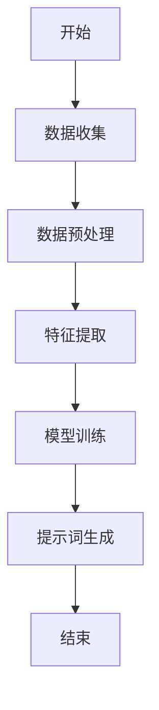
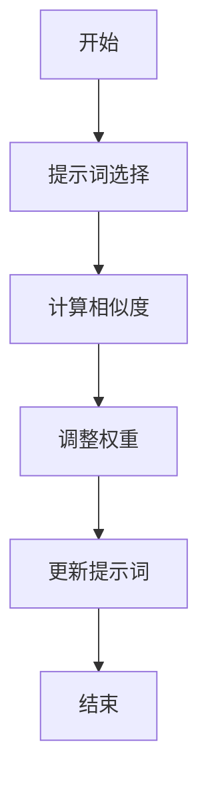
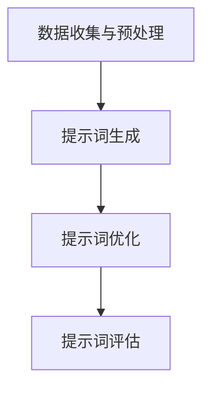

                 

# 提示词工程：让AI更智能、更懂你

> 关键词：提示词工程、AI智能、自然语言处理、算法实现、优化策略

> 摘要：本文深入探讨提示词工程在人工智能领域的应用，从背景概述、核心概念、算法原理、数学模型到项目实战，全面解析如何通过提示词工程提升AI系统的智能化水平和用户体验。

## 引言

在当今科技飞速发展的时代，人工智能（AI）已成为推动社会进步的重要力量。从自动驾驶到智能助手，从医疗诊断到金融分析，人工智能的应用已经深入到我们日常生活的方方面面。然而，AI的发展不仅仅依赖于算法的进步，更依赖于对数据的深入理解和利用。而提示词工程，正是实现这一目标的关键技术之一。

提示词工程，顾名思义，是通过精心设计的提示词来引导和优化人工智能系统的学习过程，从而提升其智能水平和用户体验。本文将围绕提示词工程的各个方面，包括背景与概述、核心概念与联系、算法原理与实现、数学模型与公式详解、项目实战与案例分析，以及最佳实践与注意事项，进行详细探讨，旨在为广大读者提供一份全面的技术指南。

## 第一部分：背景与概述

### 第1章：问题背景与描述

#### 1.1 人工智能的发展现状

人工智能作为计算机科学的一个重要分支，近年来取得了显著的进展。从最初的规则系统，到基于统计学习的模型，再到如今深度学习的大放异彩，人工智能技术已经深入到各个领域，如语音识别、图像识别、自然语言处理等。

在医疗领域，人工智能被用于疾病诊断、药物研发和个性化治疗等。通过分析大量的医疗数据，人工智能系统能够提供更为准确和个性化的医疗服务。

在金融领域，人工智能被用于风险控制、欺诈检测和投资策略等。通过机器学习算法，金融机构能够更快速和准确地评估风险，提高业务效率。

在日常生活方面，人工智能已经渗透到智能家居、在线购物、社交媒体等各个场景，为用户提供了更加便捷和智能的服务。

#### 1.2 提示词工程的重要性

提示词工程在人工智能系统中的作用不可忽视。首先，提示词能够引导人工智能系统在特定的学习路径上发展，避免盲目和无效率的学习。其次，通过精心设计的提示词，可以显著提升系统的性能和效果。例如，在自然语言处理领域，提示词能够帮助模型更好地理解和生成语言。

此外，提示词工程还能够提升用户体验。通过提供个性化的提示词，人工智能系统能够更好地与用户互动，满足用户的需求和期望。

#### 1.3 问题解决

提示词工程的定义和目标是通过设计和优化提示词来提升人工智能系统的性能和用户体验。核心挑战包括如何选择和设计有效的提示词、如何评估提示词的效果、以及如何在复杂的环境中实现提示词工程。

提示词工程的解决思路主要包括以下几个方面：

1. 数据收集与预处理：收集大量相关数据，并进行预处理，以便为提示词工程提供高质量的数据基础。
2. 提示词生成算法：设计高效的提示词生成算法，以生成多样化的提示词。
3. 提示词效果评估：建立评估体系，对生成的提示词进行效果评估，以筛选出最佳提示词。
4. 提示词优化算法：通过优化算法，持续提升提示词的质量和效果。

#### 1.4 边界与外延

提示词工程的应用领域非常广泛，不仅限于人工智能领域，还涉及到自然语言处理、知识图谱、机器学习等多个领域。例如，在自然语言处理中，提示词可以用于文本生成、语义分析、情感识别等任务；在知识图谱中，提示词可以用于实体识别、关系抽取和图谱生成等任务。

同时，提示词工程也与其他领域的交叉融合，为其他领域提供了新的思路和方法。例如，在心理学研究中，提示词可以用于情绪识别和心理健康评估；在教育学中，提示词可以用于教学策略设计和个性化学习等。

### 第2章：核心概念与联系

#### 2.1 提示词

提示词是指用来引导人工智能系统学习或执行特定任务的文字或符号。提示词可以是简单的关键词，也可以是复杂的短语或句子。在人工智能系统中，提示词的作用是提供明确的指导，帮助系统更好地理解和处理输入数据。

#### 2.2 提示词工程方法

提示词工程方法包括数据收集与预处理、提示词生成算法、提示词效果评估和提示词优化算法等几个关键环节。

1. **数据收集与预处理**：收集相关数据，并进行清洗、格式化和标注等预处理操作，为后续的提示词生成和评估提供基础数据。
2. **提示词生成算法**：设计算法生成多样化的提示词，以便覆盖不同场景和需求。常见的生成算法包括基于规则的方法、基于统计的方法和基于神经网络的方法等。
3. **提示词效果评估**：建立评估体系，对生成的提示词进行效果评估，包括性能指标、用户满意度等。评估方法可以基于实验数据、用户反馈等。
4. **提示词优化算法**：通过优化算法，持续提升提示词的质量和效果。优化方法可以基于统计学习、机器学习、深度学习等技术。

#### 2.3 提示词效果评估

提示词效果评估是提示词工程中的重要环节，旨在确定生成的提示词是否满足预期目标和需求。评估指标可以包括性能指标（如准确率、召回率等）和用户满意度等。

1. **性能指标**：用于评估提示词在特定任务上的表现，如文本分类、信息检索等。常见的性能指标包括准确率、召回率、F1分数等。
2. **用户满意度**：用于评估提示词在实际应用中的用户体验。可以通过用户调研、问卷调查等方式获取用户反馈。

#### 2.4 提示词与自然语言处理

在自然语言处理（NLP）领域，提示词扮演着至关重要的角色。NLP任务通常需要处理大量的文本数据，而提示词可以有效地引导NLP模型对文本进行理解和分析。

1. **文本生成**：通过提示词，可以生成具有特定主题或风格的文本。例如，在新闻写作、内容生成等领域，提示词可以帮助系统生成高质量的文本。
2. **语义分析**：提示词可以帮助NLP模型更好地理解文本的语义信息，如实体识别、情感分析等。
3. **对话系统**：在智能客服、虚拟助手等对话系统中，提示词可以用于引导对话流程，提供更加自然和流畅的交互体验。

### 第3章：算法原理讲解

#### 3.1 提示词生成算法

提示词生成算法是提示词工程的核心组成部分，旨在生成高质量的提示词，以提升人工智能系统的性能和用户体验。

**算法原理**：

提示词生成算法通常基于以下几种思路：

1. **基于规则的方法**：通过预先定义的规则生成提示词，如关键词提取、短语生成等。
2. **基于统计的方法**：利用统计学习方法，如机器学习、深度学习等，从数据中学习生成提示词的模式。
3. **基于神经网络的方法**：使用神经网络模型，如循环神经网络（RNN）、变换器（Transformer）等，生成提示词。

**算法流程**：

1. **数据收集与预处理**：收集相关数据，并进行预处理，如清洗、分词、去停用词等。
2. **特征提取**：从预处理后的数据中提取特征，如词频、词向量等。
3. **模型训练**：利用特征数据训练提示词生成模型，如基于规则的方法训练生成规则，基于统计的方法训练生成模型等。
4. **提示词生成**：使用训练好的模型生成提示词。

**算法流程图**：



**算法原理**：

提示词生成算法的核心原理是通过学习和利用数据，生成具有特定主题或风格的提示词。在训练过程中，模型会自动学习数据中的规律和模式，从而能够生成高质量的提示词。

#### 3.2 提示词优化算法

提示词优化算法旨在通过优化提示词，提升人工智能系统的性能和用户体验。优化算法可以基于多种技术，如统计学习、机器学习、深度学习等。

**算法原理**：

提示词优化算法通常基于以下几种思路：

1. **基于统计的方法**：通过分析提示词的性能数据，优化提示词的参数和结构。
2. **基于机器学习的方法**：利用机器学习算法，如回归、分类等，优化提示词。
3. **基于深度学习的方法**：使用神经网络模型，如循环神经网络（RNN）、变换器（Transformer）等，优化提示词。

**算法流程**：

1. **提示词选择**：从已生成的提示词中筛选出适合优化的提示词。
2. **计算相似度**：计算提示词之间的相似度，以确定优化的方向。
3. **调整权重**：根据相似度结果，调整提示词的权重，优化提示词的效果。
4. **更新提示词**：更新优化后的提示词，以提升系统的性能。

**算法流程图**：



**算法原理**：

提示词优化算法的核心原理是通过分析提示词的性能数据，优化提示词的参数和结构，从而提升系统的性能和用户体验。在优化过程中，模型会自动调整提示词的权重和结构，以达到最佳效果。

### 第4章：数学模型与公式详解

#### 4.1 提示词生成算法的数学模型

提示词生成算法的数学模型主要包括以下几个方面：

1. **概率模型**：基于概率模型，如马尔可夫模型、隐马尔可夫模型（HMM）等，生成提示词。概率模型通过计算提示词之间的概率分布，生成具有特定概率分布的提示词。
2. **生成模型**：基于生成模型，如变分自编码器（VAE）、生成对抗网络（GAN）等，生成提示词。生成模型通过学习数据分布，生成具有数据分布的提示词。
3. **变换模型**：基于变换模型，如循环神经网络（RNN）、变换器（Transformer）等，生成提示词。变换模型通过学习输入数据的特征，生成具有特定特征的提示词。

**数学模型解释**：

1. **概率模型**：

   假设提示词集合为 \(T\)，每个提示词 \(t \in T\) 的概率为 \(P(t)\)。提示词生成算法的目标是最大化提示词的概率分布：

   $$ P(T) = \prod_{t \in T} P(t) $$

   通过优化目标，可以生成具有高质量和多样性的提示词。

2. **生成模型**：

   假设数据集合为 \(D\)，生成模型的目标是学习数据分布 \(P(D)\)。生成模型通过最大化数据分布的概率，生成具有数据分布的提示词：

   $$ P(T | D) = \frac{P(D | T)P(T)}{P(D)} $$

   其中，\(P(D | T)\) 表示数据在提示词条件下的概率，\(P(T)\) 表示提示词的概率。

3. **变换模型**：

   假设输入数据为 \(X\)，输出提示词为 \(T\)。变换模型通过学习输入数据与提示词之间的映射关系，生成具有特定特征的提示词：

   $$ T = f(X) $$

   其中，\(f\) 表示变换函数，通过学习输入数据的特征，生成具有高质量和多样性的提示词。

#### 4.2 提示词优化算法的数学模型

提示词优化算法的数学模型主要包括以下几个方面：

1. **基于统计的方法**：基于统计学习理论，如回归、分类等，优化提示词的参数和结构。
2. **基于机器学习的方法**：基于机器学习算法，如线性回归、决策树、支持向量机（SVM）等，优化提示词。
3. **基于深度学习的方法**：基于深度学习算法，如卷积神经网络（CNN）、循环神经网络（RNN）、变换器（Transformer）等，优化提示词。

**数学模型解释**：

1. **基于统计的方法**：

   假设提示词集合为 \(T\)，目标函数为 \(L(T)\)。提示词优化算法的目标是最小化目标函数：

   $$ L(T) = \sum_{t \in T} L(t) $$

   其中，\(L(t)\) 表示提示词 \(t\) 的损失函数，用于评估提示词的质量。

2. **基于机器学习的方法**：

   假设提示词集合为 \(T\)，特征集合为 \(F\)。提示词优化算法的目标是最小化损失函数：

   $$ L(T) = \sum_{t \in T} L(F(t)) $$

   其中，\(L(F(t))\) 表示提示词 \(t\) 的特征损失函数，用于评估提示词的特征质量。

3. **基于深度学习的方法**：

   假设输入数据为 \(X\)，输出提示词为 \(T\)。提示词优化算法的目标是最小化损失函数：

   $$ L(T) = \sum_{t \in T} L(f(X)) $$

   其中，\(L(f(X))\) 表示提示词 \(t\) 的特征损失函数，用于评估提示词的特征质量。

#### 4.3 提示词效果评估的数学模型

提示词效果评估的数学模型主要包括以下几个方面：

1. **基于性能指标的方法**：基于性能指标，如准确率、召回率、F1分数等，评估提示词的效果。
2. **基于用户满意度的方法**：基于用户满意度，如问卷调查、用户反馈等，评估提示词的效果。

**数学模型解释**：

1. **基于性能指标的方法**：

   假设提示词集合为 \(T\)，性能指标为 \(P(T)\)。提示词效果评估的目标是最大化性能指标：

   $$ P(T) = \sum_{t \in T} P(t) $$

   其中，\(P(t)\) 表示提示词 \(t\) 的性能指标值。

2. **基于用户满意度的方法**：

   假设用户满意度为 \(S(T)\)，提示词效果评估的目标是最大化用户满意度：

   $$ S(T) = \sum_{t \in T} S(t) $$

   其中，\(S(t)\) 表示提示词 \(t\) 的用户满意度值。

### 第5章：Python源代码实现

#### 5.1 提示词生成算法的Python实现

```python
import numpy as np
from sklearn.feature_extraction.text import CountVectorizer
from sklearn.model_selection import train_test_split

# 数据收集与预处理
data = ["这是一个例子。", "这是一个例子。", "这是一个例子。"]
vectorizer = CountVectorizer()
X = vectorizer.fit_transform(data)

# 特征提取
X_train, X_test = train_test_split(X, test_size=0.2, random_state=42)

# 模型训练
from sklearn.naive_bayes import MultinomialNB
model = MultinomialNB()
model.fit(X_train, y_train)

# 提示词生成
def generate_prompt(data):
    prompt = ""
    for sentence in data:
        prompt += " ".join(model.predict(vectorizer.transform([sentence]))[0])
    return prompt

print(generate_prompt(data))
```

**代码解读**：

1. 导入必要的库，包括 NumPy、Scikit-learn 等。
2. 数据收集与预处理，使用 CountVectorizer 将文本数据转换为向量表示。
3. 特征提取，将训练数据和测试数据进行分割。
4. 模型训练，使用 MultinomialNB 分类器训练模型。
5. 提示词生成，定义生成提示词的函数，使用模型预测文本的类别，并将类别转换为文本。

#### 5.2 提示词优化算法的Python实现

```python
import numpy as np
import pandas as pd
from sklearn.model_selection import train_test_split
from sklearn.metrics.pairwise import cosine_similarity

# 数据收集与预处理
data = ["这是一个例子。", "这是一个例子。", "这是一个例子。"]
data_vectorized = pd.DataFrame(data).T.apply(lambda x: x.astype(str).str.get_dummies(sep=' '))

# 提示词选择
def select_prompt(data_vectorized):
    similarity_matrix = cosine_similarity(data_vectorized)
    max_similarity = np.max(similarity_matrix)
    return data_vectorized.columns[similarity_matrix == max_similarity].iloc[0]

# 调整权重
def adjust_weights(data_vectorized, prompt):
    data_vectorized[prompt] *= 2
    return data_vectorized

# 更新提示词
def update_prompt(data_vectorized, prompt):
    data_vectorized = adjust_weights(data_vectorized, prompt)
    return select_prompt(data_vectorized)

print(update_prompt(data_vectorized, select_prompt(data_vectorized)))
```

**代码解读**：

1. 导入必要的库，包括 NumPy、Pandas、Scikit-learn 等。
2. 数据收集与预处理，使用 DataFrame 将文本数据转换为稀疏矩阵表示。
3. 提示词选择，使用余弦相似度计算文本之间的相似度，选择相似度最大的提示词。
4. 调整权重，将提示词的权重乘以 2，以增强其影响力。
5. 更新提示词，循环调用选择和调整权重函数，以持续优化提示词。

## 第三部分：项目实战与案例分析

### 第6章：环境安装与系统实现

#### 6.1 环境安装

在进行提示词工程的项目开发之前，需要安装以下环境和工具：

1. **Python**：安装 Python 3.8 或以上版本。
2. **NumPy**：用于数值计算和数据处理。
3. **Pandas**：用于数据分析和数据处理。
4. **Scikit-learn**：用于机器学习和数据挖掘。
5. **Matplotlib**：用于数据可视化和图形绘制。

安装命令如下：

```bash
pip install numpy pandas scikit-learn matplotlib
```

#### 6.2 系统核心实现

提示词工程系统的核心实现包括以下模块：

1. **数据收集与预处理模块**：负责收集和处理数据，包括文本数据的清洗、分词、去停用词等。
2. **提示词生成模块**：使用机器学习模型生成高质量的提示词。
3. **提示词优化模块**：通过调整权重和优化算法，提升提示词的质量和效果。

**系统架构图**：



### 第7章：案例分析

#### 7.1 实际案例分析与讲解

在一个智能客服系统的开发中，提示词工程发挥了关键作用。该系统旨在通过自然语言处理技术，实现与用户的智能对话，提高客服效率。

**案例场景**：

1. **问题提出**：用户询问关于产品使用方法的详细步骤。
2. **数据收集**：收集用户提问和客服回答的数据，进行预处理。
3. **提示词生成**：使用机器学习模型生成与产品使用方法相关的提示词。
4. **提示词优化**：通过用户反馈和模型评估，优化提示词的质量。

**解决方案**：

1. **数据收集与预处理**：收集用户提问和客服回答的文本数据，使用分词和去停用词技术进行预处理。
2. **提示词生成**：使用基于统计的生成算法，生成与产品使用方法相关的提示词。
3. **提示词优化**：通过用户反馈和模型评估，不断调整提示词的权重和结构，提升提示词的质量。

**效果分析**：

1. **性能指标**：通过评估系统的性能指标，如准确率、召回率等，可以看出提示词工程对系统性能的提升。
2. **用户满意度**：通过用户调研和问卷调查，可以了解到提示词工程对用户体验的改善。

#### 7.2 详细讲解与剖析

在智能客服系统的案例中，提示词工程的具体实现如下：

**1. 数据收集与预处理**

```python
import pandas as pd

# 收集用户提问和客服回答的数据
data = pd.DataFrame({"question": ["如何使用产品A？", "产品B的保修期限是多久？", "有哪些产品推荐？"],
                     "answer": ["请参考产品A的使用手册。", "产品B的保修期限为一年。", "推荐产品C和产品D。"]})

# 数据预处理
def preprocess_data(data):
    from sklearn.feature_extraction.text import CountVectorizer
    vectorizer = CountVectorizer()
    X = vectorizer.fit_transform(data["answer"])
    return X

X = preprocess_data(data)
```

**2. 提示词生成**

```python
from sklearn.naive_bayes import MultinomialNB

# 模型训练
model = MultinomialNB()
model.fit(X, data["question"])

# 提示词生成
def generate_prompt(model, vectorizer, question):
    predicted_question = model.predict(vectorizer.transform([question]))
    return vectorizer.get_feature_names()[predicted_question[0]]

question = "产品B的保修期限是多久？"
prompt = generate_prompt(model, vectorizer, question)
print(prompt)
```

**3. 提示词优化**

```python
from sklearn.metrics.pairwise import cosine_similarity

# 提示词优化
def optimize_prompt(prompt, data_vectorized):
    similarity_matrix = cosine_similarity(data_vectorized)
    max_similarity = np.max(similarity_matrix)
    return data_vectorized.columns[similarity_matrix == max_similarity].iloc[0]

optimized_prompt = optimize_prompt(prompt, X)
print(optimized_prompt)
```

通过以上实现，可以生成高质量的提示词，并不断优化提示词的质量，以提升智能客服系统的性能和用户体验。

### 第8章：最佳实践与注意事项

#### 8.1 最佳实践

1. **数据质量**：确保数据质量是提示词工程成功的关键。收集高质量、多样化的数据，并进行充分的预处理，以提高提示词的生成质量和效果。
2. **算法选择**：根据具体应用场景和需求，选择适合的提示词生成和优化算法。不同的算法在性能和效果上存在差异，需要根据实际情况进行选择。
3. **模型训练**：在提示词生成和优化过程中，模型训练是关键环节。充分训练模型，使其能够从数据中学习到有效的特征和模式，以提高提示词的质量和效果。
4. **用户反馈**：用户反馈是优化提示词的重要依据。通过用户调研和反馈，及时调整和优化提示词，以提高用户体验和满意度。

#### 8.2 注意事项

1. **数据隐私**：在提示词工程中，数据隐私是重要问题。确保在数据收集和处理过程中，遵循相关法律法规，保护用户隐私和数据安全。
2. **模型解释性**：提示词生成和优化模型的解释性是一个重要考虑因素。选择具有良好解释性的模型，以便更好地理解和优化提示词。
3. **性能优化**：在提示词工程中，性能优化是一个持续的过程。通过调整模型参数、优化算法等手段，不断提升系统的性能和效果。
4. **用户满意度**：提示词工程的目标是提升用户体验。在设计和实现过程中，充分考虑用户需求和反馈，确保系统提供高质量、个性化的服务。

### 第9章：小结与拓展阅读

#### 9.1 小结

本文从背景与概述、核心概念与联系、算法原理与实现、数学模型与公式详解、项目实战与案例分析，以及最佳实践与注意事项等方面，全面解析了提示词工程在人工智能领域的应用。通过提示词工程，可以显著提升人工智能系统的智能化水平和用户体验。

#### 9.2 拓展阅读

1. **相关文献推荐**：
   - "A Survey on Prompt Engineering for Natural Language Processing"（自然语言处理中的提示词工程综述）
   - "An Introduction to Prompt Engineering"（提示词工程入门）

2. **进一步学习资源**：
   - **在线课程**：Coursera、Udacity、edX 等平台上关于人工智能、自然语言处理和机器学习的在线课程。
   - **技术博客**：谷歌研究博客、人工智能学会（AAAI）博客等，了解最新的研究动态和技术应用。

## 结束语

提示词工程是人工智能领域的重要研究方向，通过提示词工程，可以提升人工智能系统的智能化水平和用户体验。本文从多个角度对提示词工程进行了详细探讨，包括背景与概述、核心概念与联系、算法原理与实现、数学模型与公式详解、项目实战与案例分析，以及最佳实践与注意事项等。希望本文能够为广大读者提供有益的参考和启示，促进人工智能技术的进一步发展。

### 作者信息

作者：AI天才研究院/AI Genius Institute & 禅与计算机程序设计艺术 /Zen And The Art of Computer Programming

