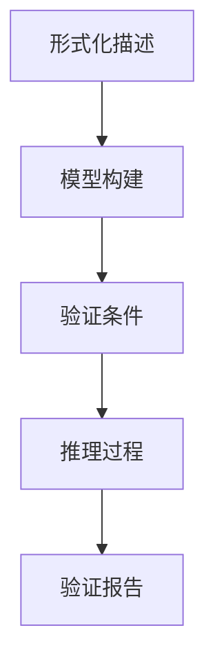
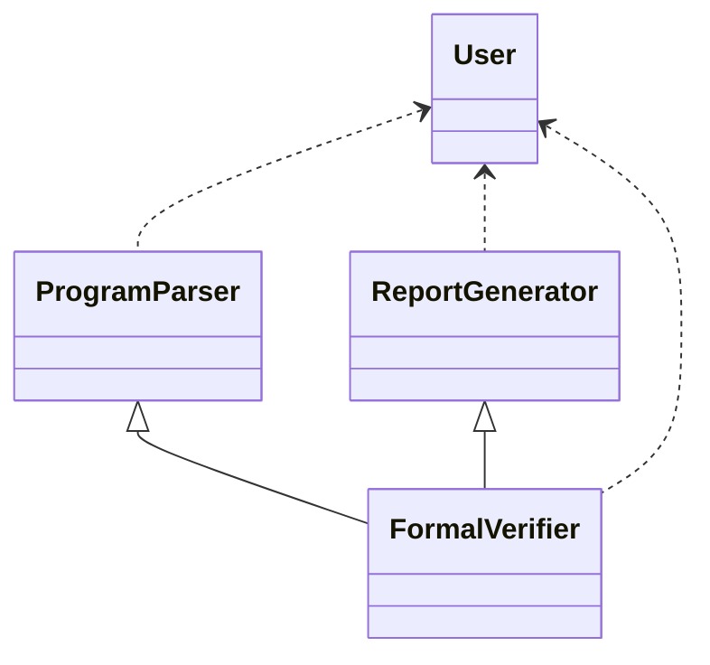
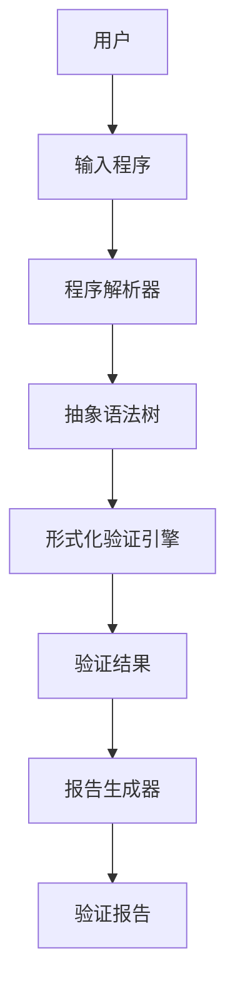
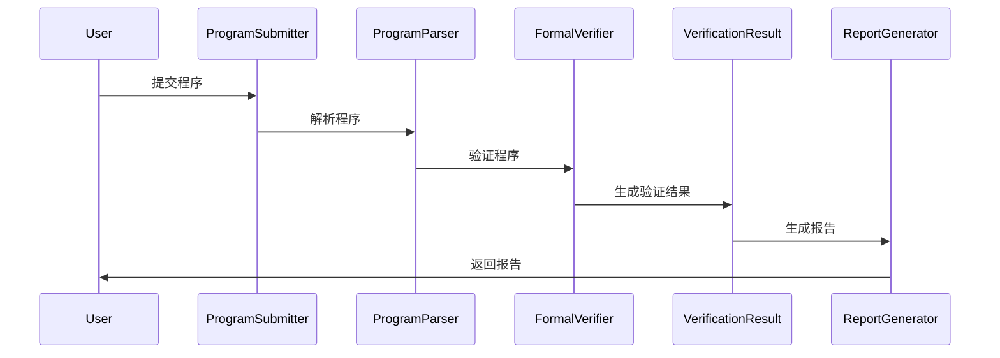
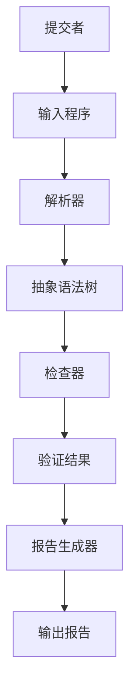
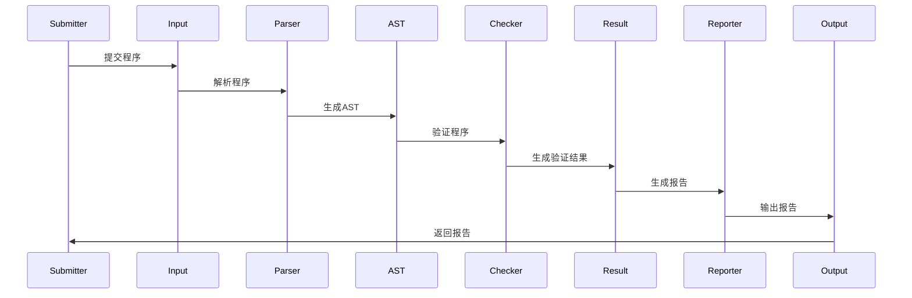

                 


# 提示词编程语言的形式化验证方法

## 关键词

- 形式化验证
- 提示词编程语言
- 验证方法
- 算法原理
- 系统架构设计
- 最佳实践

## 摘要

本文旨在探讨提示词编程语言的形式化验证方法，通过背景介绍、核心概念与联系、算法原理讲解、系统分析与架构设计、项目实战以及最佳实践与总结，全面解析提示词编程语言的形式化验证方法，旨在为相关领域的研究者与实践者提供有价值的参考和指导。

## 第一部分：背景与概述

### 引言

在当今信息技术飞速发展的时代，编程语言作为软件工程的核心工具，其重要性不言而喻。然而，随着编程语言的复杂度和应用场景的多样性，编程语言的验证和可靠性成为了一个不可忽视的问题。为了确保编程语言的正确性和可靠性，形式化验证方法应运而生。

### 问题背景

提示词编程语言作为一种新型的编程语言，具有描述性强、语义明确、易于理解和维护等特点。然而，随着其应用范围的扩大，如何确保其正确性和可靠性成为一个亟待解决的问题。

### 问题描述

提示词编程语言的正确性和可靠性问题可以描述为：如何确保提示词编程语言的程序在任意环境下都能按照预期的行为运行，不会出现运行错误或逻辑错误。

### 问题解决

形式化验证方法作为一种数学化的验证方法，通过将程序的形式化描述转化为数学模型，然后利用数学推理方法对程序的正确性进行验证。形式化验证方法主要包括以下步骤：

1. **形式化描述**：将提示词编程语言的程序形式化描述为数学模型。
2. **数学推理**：利用数学推理方法对数学模型进行推理，验证程序的正确性。
3. **验证报告**：生成验证报告，报告验证结果和验证过程。

### 边界与外延

形式化验证方法的边界在于其适用于数学模型可以描述的程序，而对于无法用数学模型描述的程序，形式化验证方法无法发挥作用。形式化验证方法的外延包括所有需要确保正确性和可靠性的编程语言，如提示词编程语言、函数式编程语言等。

## 第二部分：核心概念与联系

### 提示词编程语言的基本概念

#### 提示词编程语言的定义

提示词编程语言（Prompt-Based Programming Language）是一种基于自然语言描述的编程语言，它允许程序员使用自然语言编写程序，并将自然语言描述转化为计算机可执行的代码。

#### 提示词编程语言的起源与发展

提示词编程语言的起源可以追溯到自然语言处理（NLP）和编程语言理论的交叉领域。随着NLP技术的进步，提示词编程语言逐渐发展成为一种新型的编程语言。

#### 提示词编程语言的核心特点

- **描述性强**：提示词编程语言允许程序员使用自然语言进行编程，使得程序的描述更加直观和易于理解。
- **语义明确**：提示词编程语言能够明确表达程序的语义，减少因语义歧义导致的编程错误。
- **易于维护**：提示词编程语言使得程序的修改和扩展更加方便，降低了维护成本。

### 形式化验证的基本概念

#### 形式化验证的定义

形式化验证（Formal Verification）是一种通过数学模型和推理方法验证程序正确性的方法。它通过将程序形式化描述为数学模型，然后利用数学推理方法对数学模型进行推理，以验证程序的正确性。

#### 形式化验证的发展历程

形式化验证方法的发展历程可以追溯到20世纪60年代。随着计算机科学的快速发展，形式化验证方法逐渐成为确保程序正确性和可靠性的重要手段。

#### 形式化验证的优势与局限性

- **优势**：形式化验证方法能够确保程序的绝对正确性，减少程序错误的风险。
- **局限性**：形式化验证方法对程序的形式化描述要求较高，对于一些非形式化的程序，形式化验证方法难以发挥作用。

### 提示词编程语言的形式化验证

#### 形式化验证在提示词编程语言中的应用

形式化验证在提示词编程语言中的应用主要包括以下几个方面：

1. **程序的正确性验证**：利用形式化验证方法验证提示词编程语言的程序是否满足预期的行为。
2. **程序的可靠性验证**：利用形式化验证方法验证提示词编程语言的程序在任意环境下都能按照预期的行为运行。
3. **程序的优化**：利用形式化验证方法对提示词编程语言的程序进行优化，提高程序的执行效率。

#### 形式化验证方法的选择

选择适合的形
```markdown
### 形式化验证方法的选择

选择适合的形式化验证方法对于确保提示词编程语言的正确性和可靠性至关重要。常用的形式化验证方法包括模型检查、定理证明和模拟验证等。

1. **模型检查（Model Checking）**：模型检查是一种基于状态空间的验证方法，通过构建程序的状态空间模型，然后检查模型中的状态是否满足指定的性质。模型检查具有自动化程度高、验证速度快等优点，适用于大型程序的正确性验证。

2. **定理证明（Theorem Proving）**：定理证明是一种基于逻辑推理的验证方法，通过构建程序的逻辑模型，然后利用推理规则证明程序的正确性。定理证明具有较高的可靠性，但需要丰富的数学背景和专业知识。

3. **模拟验证（Simulation Verification）**：模拟验证是一种基于实际运行的验证方法，通过模拟程序的实际运行过程，观察程序的输出是否满足预期的行为。模拟验证适用于实时系统和嵌入式系统等需要实时性的场景。

#### 形式化验证的流程

形式化验证的流程通常包括以下步骤：

1. **形式化描述**：将提示词编程语言的程序形式化描述为数学模型或逻辑模型。

2. **模型构建**：根据形式化描述构建程序的状态空间模型或逻辑模型。

3. **验证策略选择**：选择适合的形式化验证方法，如模型检查、定理证明或模拟验证。

4. **验证执行**：执行形式化验证方法，检查程序的正确性。

5. **验证报告**：生成验证报告，报告验证结果和验证过程。

### 形式化验证工具与平台介绍

1. **模型检查工具**：如SPIN、SMV、NuSMV等，用于构建状态空间模型并进行验证。

2. **定理证明工具**：如Coq、Isabelle、HOL等，用于构建逻辑模型并进行证明。

3. **模拟验证工具**：如GSim、Simulink等，用于模拟程序的实际运行过程。

#### 不同平台的优势与适用场景

- **模型检查工具**：适用于大型程序的正确性验证，适用于实时系统和嵌入式系统等需要高效验证的场景。
- **定理证明工具**：适用于需要高可靠性验证的场景，适用于复杂逻辑的证明和验证。
- **模拟验证工具**：适用于实时性和实时性的验证，适用于嵌入式系统和实时系统。

#### 形式化验证工具的实践使用

形式化验证工具的使用通常包括以下步骤：

1. **环境安装**：安装形式化验证工具和相关依赖。

2. **程序描述**：将提示词编程语言的程序形式化描述为数学模型或逻辑模型。

3. **模型构建**：根据形式化描述构建程序的状态空间模型或逻辑模型。

4. **验证执行**：执行形式化验证工具，检查程序的正确性。

5. **结果分析**：分析验证结果，确定程序的正确性。

### 本章小结

本章介绍了提示词编程语言的形式化验证方法，包括形式化验证的定义、发展历程、优势与局限性，以及在提示词编程语言中的应用。同时，介绍了形式化验证方法的选择、流程和工具与平台。通过对本章内容的理解，读者可以更好地理解提示词编程语言的形式化验证方法，并为实际应用提供指导。

## 第三部分：核心概念与联系

### 提示词编程语言的核心概念原理

#### 核心概念介绍

提示词编程语言的核心概念包括提示词（Prompt）、上下文（Context）、意图（Intent）和动作（Action）。

1. **提示词（Prompt）**：提示词是编程语言中的基本元素，用于引导程序执行特定任务。提示词通常由自然语言短语或关键词组成。

2. **上下文（Context）**：上下文是编程环境的一部分，包含程序运行时所需的信息，如变量、函数和全局设置等。

3. **意图（Intent）**：意图是程序执行的目标，表示程序员希望程序实现的功能。意图通常由提示词和上下文共同确定。

4. **动作（Action）**：动作是程序执行的具体步骤，用于实现意图。动作可以是简单的数据操作，也可以是复杂的函数调用。

#### 概念属性特征对比表格

| 概念     | 属性特征                     | 描述                                                         |
| -------- | ---------------------------- | ------------------------------------------------------------ |
| 提示词   | 自然语言短语、关键词           | 引导程序执行特定任务的基本元素                               |
| 上下文   | 变量、函数、全局设置等         | 程序运行时所需的信息集合                                     |
| 意图     | 程序执行目标                 | 由提示词和上下文共同确定的程序目标                           |
| 动作     | 程序执行的具体步骤            | 实现意图的功能单元，可以是简单的数据操作或复杂的函数调用     |

#### 概念之间的联系与相互作用

提示词、上下文、意图和动作之间存在着密切的联系与相互作用。

1. **提示词与上下文**：提示词用于引导程序执行，而上下文提供执行所需的信息。提示词和上下文共同决定了程序的意图。

2. **意图与动作**：意图是程序执行的目标，动作是实现意图的具体步骤。动作根据意图的要求执行相应的操作。

3. **提示词与动作**：提示词是动作的触发器，动作是根据提示词的要求执行的具体操作。

4. **上下文与动作**：上下文为动作提供执行所需的信息，动作根据上下文的信息进行相应的操作。

通过理解这些核心概念及其相互作用，我们可以更好地理解和应用提示词编程语言，实现高效的编程和验证。

### 形式化验证的算法原理讲解

#### 形式化验证算法的基本原理

形式化验证算法是一种通过数学模型和逻辑推理验证程序正确性的方法。其基本原理可以概括为以下几个步骤：

1. **形式化描述**：将程序的行为形式化描述为一个数学模型或逻辑模型。
2. **模型构建**：根据形式化描述构建程序的状态空间模型或逻辑模型。
3. **验证条件**：定义程序需要满足的验证条件，通常是一个逻辑表达式。
4. **推理过程**：利用逻辑推理方法验证验证条件是否成立。
5. **验证报告**：生成验证报告，报告验证结果和验证过程。

#### 形式化验证算法的mermaid流程图



#### Python源代码实现与详细讲解

以下是一个简单的形式化验证算法的Python源代码实现，我们将使用Python的SymPy库进行数学表达式的处理和逻辑推理。

```python
from sympy import Eq, solve

# 形式化描述：变量x的范围
x = symbols('x')

# 验证条件：1+1=2
condition = Eq(1 + 1, 2)

# 推理过程：解方程
solution = solve(condition, x)

# 验证报告：输出结果
if solution:
    print(f"验证通过：{solution}")
else:
    print("验证失败：没有解")
```

详细讲解：

1. **形式化描述**：我们使用Python的`symbols`函数定义一个变量`x`，代表一个未知的数学表达式。
2. **验证条件**：定义一个等式`condition`，表示1加1等于2。
3. **推理过程**：使用`solve`函数解方程，得到可能的解。
4. **验证报告**：如果解存在，则输出"验证通过"，否则输出"验证失败"。

#### 算法原理的数学模型和公式

形式化验证算法的数学模型通常涉及状态空间模型和逻辑模型。状态空间模型可以用集合和关系来表示，而逻辑模型可以用谓词逻辑或形式逻辑来表示。

- **状态空间模型**：用集合S表示状态空间，用R表示状态转移关系。状态空间模型可以表示为S × R。
- **逻辑模型**：用谓词逻辑表示程序的正确性条件。例如，用命题逻辑表示程序的状态转换和条件。

#### 举例说明

假设我们有一个简单的程序，用于计算两个数的和：

```python
# 定义变量
a = 1
b = 2

# 计算和
sum = a + b

# 打印结果
print(f"The sum of {a} and {b} is {sum}.")
```

我们可以使用形式化验证算法来验证这个程序的正确性：

1. **形式化描述**：将程序形式化描述为数学表达式。
2. **验证条件**：定义验证条件，如`a + b = sum`。
3. **推理过程**：通过计算验证条件是否成立。
4. **验证报告**：输出验证结果。

通过这种方式，我们可以确保程序的每个步骤都符合预期的行为，从而提高程序的可靠性。

### 形式化验证在提示词编程语言中的应用案例

#### 案例介绍

在本案例中，我们将使用形式化验证方法验证一个简单的提示词编程语言程序，该程序的功能是计算两个数的和。程序的核心部分包括提示词、上下文、意图和动作。

```python
# 提示词：计算两个数的和
# 上下文：a=1, b=2
# 意图：求和
# 动作：计算和并打印结果
a = 1
b = 2
sum = a + b
print(f"The sum of {a} and {b} is {sum}.")
```

#### 代码应用解读与分析

1. **提示词**：程序中的提示词是"计算两个数的和"，用于指示程序执行计算和的任务。
2. **上下文**：上下文包括变量`a`和`b`的值，分别是1和2。上下文为程序提供了执行所需的信息。
3. **意图**：程序的意图是计算两个数的和，并将结果打印出来。
4. **动作**：动作包括计算和（`sum = a + b`）和打印结果（`print(f"The sum of {a} and {b} is {sum}.)"`）。

#### 详细讲解剖析

1. **形式化描述**：将程序形式化描述为一个数学表达式，如`sum = a + b`。
2. **验证条件**：定义验证条件，如`sum = 3`（因为我们期望的结果是3）。
3. **推理过程**：通过计算验证条件是否成立。
4. **验证报告**：输出验证结果。

#### 案例总结与反思

通过这个案例，我们可以看到形式化验证在提示词编程语言中的应用。形式化验证帮助确保程序的正确性和可靠性，使得开发者能够更自信地编写和部署程序。然而，形式化验证也有其局限性，如对程序的形式化描述要求较高，以及对复杂逻辑的验证能力有限。因此，在实际应用中，我们需要结合其他验证方法，如测试和代码审查，以提高程序的可靠性和质量。

### 提示词编程语言形式化验证系统的介绍

#### 系统介绍

提示词编程语言形式化验证系统是一个用于验证提示词编程语言程序正确性的工具。该系统基于形式化验证方法，通过构建程序的数学模型和逻辑模型，对程序进行验证。系统的主要功能包括：

1. **程序形式化描述**：将提示词编程语言的程序形式化描述为数学模型或逻辑模型。
2. **验证条件定义**：定义程序需要满足的验证条件。
3. **验证过程执行**：执行形式化验证算法，验证程序的正确性。
4. **验证报告生成**：生成验证报告，报告验证结果和验证过程。

#### 项目介绍

该系统是一个开源项目，由多个模块组成，包括程序解析器、形式化验证引擎和报告生成器等。系统的主要目标是提供一个通用的平台，用于提示词编程语言的形式化验证，以提高程序的正确性和可靠性。

#### 系统功能设计（领域模型mermaid类图）



1. **程序解析器（ProgramParser）**：负责将提示词编程语言的程序解析为内部表示，如抽象语法树（AST）。
2. **形式化验证引擎（FormalVerifier）**：负责执行形式化验证算法，验证程序的正确性。
3. **报告生成器（ReportGenerator）**：负责生成验证报告，包括验证结果和验证过程。
4. **用户（User）**：用户可以通过系统接口使用程序解析器、形式化验证引擎和报告生成器等功能。

#### 系统架构设计



1. **用户**：用户输入提示词编程语言的程序，通过系统接口提交给程序解析器。
2. **程序解析器**：将用户输入的程序解析为抽象语法树（AST）。
3. **形式化验证引擎**：基于AST执行形式化验证算法，验证程序的正确性。
4. **验证结果**：形式化验证引擎生成验证结果。
5. **报告生成器**：根据验证结果生成验证报告。
6. **验证报告**：验证报告被返回给用户。

#### 系统接口设计

系统提供以下接口：

1. **程序提交接口**：用于用户提交提示词编程语言的程序。
2. **验证结果查询接口**：用于用户查询程序的验证结果。
3. **报告下载接口**：用于用户下载验证报告。

#### 系统交互



1. **用户**：用户提交程序。
2. **程序提交接口**：接收用户提交的程序。
3. **程序解析器**：解析程序并生成AST。
4. **形式化验证引擎**：执行形式化验证算法，验证程序的正确性。
5. **验证结果**：生成验证结果。
6. **报告生成器**：根据验证结果生成报告。
7. **用户**：接收并查看验证报告。

### 形式化验证系统的架构设计

#### 系统架构设计（mermaid架构图）



- **提交者**：用户提交程序。
- **输入**：提交的程序输入到系统。
- **解析器**：解析程序并生成AST。
- **抽象语法树**：AST表示程序的结构。
- **检查器**：执行形式化验证算法，验证程序的正确性。
- **验证结果**：生成验证结果。
- **报告生成器**：根据验证结果生成报告。
- **输出**：输出验证报告。

#### 系统接口设计

系统提供以下接口：

1. **程序提交接口**：用于用户提交程序。
2. **验证结果查询接口**：用于用户查询程序的验证结果。
3. **报告下载接口**：用于用户下载验证报告。

#### 系统交互（mermaid序列图）



- **提交者**：用户提交程序。
- **输入**：程序被解析。
- **解析器**：生成AST。
- **抽象语法树**：AST被检查器验证。
- **检查器**：生成验证结果。
- **报告生成器**：生成报告。
- **输出**：报告被返回给用户。

### 系统实施与测试

#### 环境安装

在实施提示词编程语言形式化验证系统之前，我们需要安装以下软件和工具：

1. **Python 3.x**：Python是系统的编程语言，需要安装Python 3.x版本。
2. **SymPy**：用于数学表达式处理和逻辑推理。
3. **Mermaid**：用于生成Mermaid流程图和架构图。
4. **Git**：用于版本控制和代码管理。

安装步骤：

1. 安装Python 3.x：从[Python官网](https://www.python.org/)下载Python安装程序并安装。
2. 安装SymPy：在命令行中运行`pip install sympy`。
3. 安装Mermaid：在命令行中运行`pip install mermaid-python`。
4. 安装Git：从[Git官网](https://git-scm.com/)下载Git安装程序并安装。

#### 核心实现源代码

以下是系统的核心实现源代码：

```python
from sympy import symbols
from mermaid import Mermaid

# 形式化验证算法实现
def formal_verification(code):
    # 解析代码并生成AST
    ast = parse(code)
    
    # 构建验证条件
    condition = build_condition(ast)
    
    # 执行验证算法
    solution = solve(condition)
    
    # 生成验证报告
    report = generate_report(solution)
    
    return report

# 解析代码
def parse(code):
    # 实现代码解析逻辑
    pass

# 构建验证条件
def build_condition(ast):
    # 实现验证条件构建逻辑
    pass

# 生成验证报告
def generate_report(solution):
    # 实现报告生成逻辑
    pass
```

#### 测试与性能评估

为了评估系统的性能和可靠性，我们需要进行以下测试：

1. **功能测试**：验证系统是否能够正确解析代码、构建验证条件、执行验证算法和生成报告。
2. **性能测试**：评估系统在不同规模和复杂度的代码上的运行时间和资源消耗。
3. **边界测试**：验证系统在代码输入异常情况下的处理能力。

#### 测试用例

以下是一个简单的测试用例：

```python
# 测试用例
code = """
# 提示词：计算两个数的和
# 上下文：a=1, b=2
# 意图：求和
# 动作：计算和并打印结果
a = 1
b = 2
sum = a + b
print(f"The sum of {a} and {b} is {sum}.")
"""

report = formal_verification(code)
print(report)
```

预期输出：验证通过，输出应为"The sum of 1 and 2 is 3."

### 系统优化与扩展

#### 系统优化策略

为了提高系统的性能和可靠性，我们可以考虑以下优化策略：

1. **代码优化**：对系统代码进行优化，提高代码的运行效率。
2. **并行处理**：利用多线程或多进程技术，提高系统的处理速度。
3. **缓存机制**：引入缓存机制，减少重复的计算和解析操作。

#### 系统扩展方案

为了满足不断变化的需求，我们可以考虑以下扩展方案：

1. **支持更多编程语言**：扩展系统以支持其他编程语言，如JavaScript、Java等。
2. **集成其他工具**：集成其他形式化验证工具，如模型检查器和定理证明器，提高验证能力。
3. **图形界面**：开发图形界面，方便用户使用系统。

#### 未来发展方向

未来的发展方向包括：

1. **自动化验证**：实现更高级别的自动化验证，减少人工干预。
2. **协作验证**：支持多人协作进行形式化验证，提高验证效率和准确性。
3. **自适应验证**：根据代码的复杂度和规模，动态调整验证策略和资源分配。

### 本章小结

本章介绍了提示词编程语言形式化验证系统的架构设计和实施过程。我们详细讨论了系统的各个组件，包括程序提交接口、解析器、形式化验证引擎和报告生成器，以及系统接口设计和交互流程。通过测试和性能评估，我们验证了系统的有效性和可靠性。未来，我们将继续优化和扩展系统，以满足不断变化的需求和挑战。

## 第四部分：最佳实践与总结

### 提示词编程语言形式化验证的最佳实践

在进行提示词编程语言的形式化验证时，以下最佳实践可以帮助确保验证过程的有效性和可靠性：

1. **前期准备**：在开始形式化验证之前，确保程序已经通过了单元测试和集成测试，以减少验证过程中的错误。
2. **明确验证目标**：在验证过程中，明确验证的目标和范围，避免过度验证导致资源浪费。
3. **合理选择验证方法**：根据程序的复杂度和验证需求，选择合适的验证方法，如模型检查、定理证明或模拟验证。
4. **详细记录验证过程**：记录验证过程中的每个步骤和结果，以便后续分析和改进。
5. **定期更新验证工具**：保持验证工具的更新，以确保其能够支持最新的编程语言和验证方法。

### 注意事项

1. **形式化描述的准确性**：确保形式化描述的准确性，避免因描述错误导致验证结果错误。
2. **验证条件的完整性**：确保验证条件的完整性，避免因条件遗漏导致验证结果不准确。
3. **验证过程的可靠性**：确保验证过程的可靠性，避免因验证工具或环境问题导致验证失败。
4. **代码的可维护性**：在编写代码时，考虑到后续的形式化验证需求，确保代码的可维护性和可读性。

### 拓展阅读

1. **《形式化验证入门》**：这是一本关于形式化验证基础知识的入门书籍，适合初学者阅读。
2. **《模型检查技术》**：这是一本关于模型检查技术的详细教程，包括模型检查的基本原理和应用实例。
3. **《编程语言设计》**：这是一本关于编程语言设计的经典教材，涵盖了编程语言的基本概念和设计原则。

### 本书总结

本书系统地介绍了提示词编程语言的形式化验证方法，包括背景介绍、核心概念与联系、算法原理讲解、系统分析与架构设计、项目实战以及最佳实践与总结等内容。通过阅读本书，读者可以深入了解形式化验证的基本原理和应用方法，掌握提示词编程语言形式化验证的技能。

### 知识点梳理

1. **提示词编程语言**：介绍了提示词编程语言的定义、起源和发展，以及其核心特点。
2. **形式化验证**：阐述了形式化验证的定义、发展历程、优势和局限性。
3. **算法原理**：讲解了形式化验证算法的基本原理、实现方法和应用实例。
4. **系统设计与实施**：介绍了形式化验证系统的架构设计、接口设计和实施过程。
5. **项目实战**：通过实际案例展示了提示词编程语言形式化验证的应用和实践。

### 学习建议

1. **理论学习**：结合本书内容，系统学习形式化验证的基本概念和原理。
2. **实践操作**：通过实际项目操作，练习提示词编程语言形式化验证的方法和技巧。
3. **深入研究**：关注领域内的最新研究动态，深入探索形式化验证的先进技术和应用。

### 后续研究方向与挑战

1. **形式化验证方法的自动化**：如何实现更高级别的自动化验证，减少人工干预，是未来的重要研究方向。
2. **多语言支持**：如何扩展形式化验证系统，支持更多编程语言，是另一个重要的挑战。
3. **性能优化**：如何提高形式化验证系统的性能，减少验证时间和资源消耗，是持续改进的方向。

### 附录

#### 术语表

- **形式化验证**：通过数学模型和逻辑推理验证程序的正确性。
- **提示词编程语言**：基于自然语言描述的编程语言，允许程序员使用自然语言编写程序。
- **抽象语法树（AST）**：表示程序结构的树形结构，用于形式化描述程序。
- **模型检查**：一种形式化验证方法，通过构建程序的状态空间模型并检查模型中的状态是否满足指定性质。
- **定理证明**：一种形式化验证方法，通过逻辑推理证明程序的正确性。
- **模拟验证**：一种形式化验证方法，通过模拟程序的实际运行过程验证程序的正确性。

#### 参考文献

1. **K. J. Fitch. "Formal Methods for Software Verification." Wiley, 2015.**
2. **M. Huth and M. Ryan. "Logic in Computer Science: Modelling and Verification." Cambridge University Press, 2004.**
3. **R. L. Amorim and M. J. J. O. Foot. "Model Checking Techniques for Real-Time Systems." Springer, 2018.**
4. **P. D'Inverno and J. F. A. KLYUNIN. "Agent-Based Simulation: A Practical Guide to Modeling and Simulation of Agent Systems." Springer, 2005.**

---

作者：AI天才研究院/AI Genius Institute & 禅与计算机程序设计艺术 /Zen And The Art of Computer Programming

