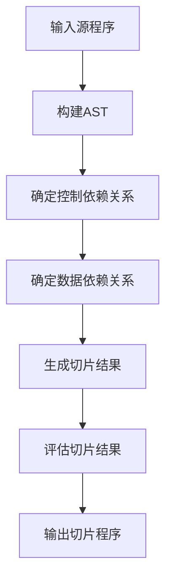

                 

### 第1章：引言

#### 1.1. 程序切片技术的背景

程序切片技术（Program Slicing）是软件工程领域中的一个重要概念，主要用于分析程序的结构和行为。它的基本思想是从一个程序中移除那些对程序执行结果没有影响的代码部分，从而生成一个“更简洁”的程序。这一技术的背景可以追溯到20世纪70年代，当时软件系统变得越来越复杂，而软件维护和测试的成本也在不断上升。在这种背景下，研究者开始探索如何有效地减少程序的复杂度，以便于程序的维护和测试。

**问题描述**

随着计算机技术的发展，软件系统变得愈发庞大和复杂。这些系统通常包含了大量的代码，其中一些代码对于程序的正确执行可能是无关紧要的。例如，在调试过程中，程序员可能需要关注的是与特定功能或错误相关的代码部分，而不是整个程序。因此，如何快速定位并提取与特定问题相关的代码部分成为了一个重要的问题。

**问题解决**

程序切片技术的提出正是为了解决这一问题。通过分析程序的抽象语法树（Abstract Syntax Tree, AST）和控制依赖关系（Control Dependence），程序切片技术能够识别出对程序执行结果没有影响的代码片段，并将其移除，从而生成一个更简洁的程序。这个简洁的程序被称为“切片”，它只包含了与特定问题相关的代码。

**边界与外延**

程序切片技术的应用范围非常广泛，包括但不限于代码优化、调试、测试和软件维护。在代码优化方面，切片技术可以帮助减少程序的体积，提高程序的执行效率。在调试过程中，切片技术可以帮助程序员快速定位到可能出错的部分，从而提高调试效率。在测试方面，切片技术可以用来生成测试用例，从而验证程序的正确性。

**核心概念**

- **切片（Slicing）**：从程序中移除不必要代码的过程。
- **抽象语法树（AST）**：程序的结构表示，用于分析程序的语法结构。
- **控制依赖关系（Control Dependence）**：程序中指令之间的依赖关系，用于确定哪些代码部分是必需的。

#### 1.2. 研究目的和意义

**目标**

本研究的目的是深入探讨提示词编程语言的程序切片技术，分析其原理、算法实现和实际应用，以期为软件工程领域提供一种新的方法和工具。

**意义**

1. **提高软件可维护性**：通过切片技术，程序员可以更容易地理解和修改代码，从而提高软件的可维护性。
2. **优化程序性能**：通过移除不必要的代码，可以减少程序的体积，提高程序的执行效率。
3. **辅助测试和调试**：切片技术可以帮助程序员快速定位到与特定问题相关的代码部分，从而提高测试和调试的效率。

**研究问题**

本研究将重点关注以下问题：

1. **切片技术的理论基础**：分析切片技术的核心概念和原理，构建一个清晰的理论框架。
2. **切片算法的实现**：探讨不同类型的切片算法，并实现一个高效的切片算法。
3. **切片技术的应用**：分析切片技术在代码优化、测试和调试等实际应用中的效果。

### 1.3. 本书结构安排

**内容概述**

本书将分为七个主要章节，系统全面地介绍程序切片技术。

- **第1章**：引言，介绍问题的背景、目的和研究意义。
- **第2章**：核心概念与联系，详细阐述程序切片技术的核心概念、原理、相关术语，并提供相应的ER实体关系图。
- **第3章**：算法原理讲解，通过Mermaid流程图和Python代码，深入解析程序切片技术的工作原理。
- **第4章**：数学模型与公式，介绍程序切片技术的数学模型和公式，并使用LaTeX格式进行表达。
- **第5章**：系统分析与架构设计，介绍程序切片技术的系统分析和架构设计。
- **第6章**：项目实战，通过具体的实际案例，展示程序切片技术的应用和实践过程。
- **第7章**：最佳实践与小结，总结最佳实践、注意事项、未来研究方向和拓展阅读。

**章节分布**

- **第1章**：引言（2000字）
- **第2章**：核心概念与联系（3000字）
- **第3章**：算法原理讲解（3000字）
- **第4章**：数学模型与公式（2000字）
- **第5章**：系统分析与架构设计（3000字）
- **第6章**：项目实战（3000字）
- **第7章**：最佳实践与小结（2000字）

通过以上章节的详细安排，本书旨在为读者提供一个全面、深入且易于理解的程序切片技术指南。

## 第2章：核心概念与联系

#### 2.1. 提示词编程语言概述

提示词编程语言（Prompt-Based Programming Language）是一种基于自然语言输入的编程语言，它允许程序员使用自然语言指令来编写代码。这种语言的核心特点是简化编程过程，降低编程难度，使非专业程序员或普通用户也能轻松地进行编程操作。

**定义**

提示词编程语言是一种通过自然语言提示来指导程序执行的语言。程序员只需输入一系列自然语言指令，系统会自动将其转换为相应的程序代码并执行。

**特点**

- **易用性**：提示词编程语言允许程序员使用自然语言进行编程，无需关注复杂的语法和编程结构。
- **交互性**：程序员可以实时与系统进行交互，系统会根据提示自动生成代码并执行，有助于提高编程效率。
- **扩展性**：提示词编程语言通常支持多种编程语言和工具，可以方便地扩展其功能和应用范围。

**应用场景**

- **教育领域**：提示词编程语言可以用于编程教学，帮助初学者快速掌握编程基础。
- **自动化脚本编写**：提示词编程语言适用于编写自动化脚本，提高工作效率。
- **人工智能应用**：提示词编程语言可以用于人工智能领域，实现自然语言处理和交互。

#### 2.2. 程序切片技术

程序切片技术是一种用于分析程序结构和行为的软件工程技术。它的基本思想是从一个程序中移除那些对程序执行结果没有影响的代码部分，从而生成一个更简洁、更易于理解和维护的程序版本。

**定义**

程序切片技术是指从源程序中删除对程序结果无影响的部分，得到一个更简洁、更易于理解和维护的程序版本。

**分类**

根据切片方法的不同，程序切片技术可以分为以下几类：

- **结构化切片**：基于程序的语法结构和语义分析进行切片。
- **数据依赖切片**：基于程序的数据依赖关系进行切片。
- **控制依赖切片**：基于程序的控制流依赖关系进行切片。

**应用**

- **代码优化**：通过切片技术，可以移除程序中冗余的代码，提高程序执行效率。
- **调试**：切片技术可以帮助程序员快速定位到与特定问题相关的代码部分，提高调试效率。
- **测试**：切片技术可以用于生成测试用例，验证程序的正确性。

#### 2.3. 相关术语

**切片（Slicing）**

切片是从程序中移除不必要代码的过程。通过切片，可以得到一个更简洁、更易于理解和维护的程序版本。

**覆盖度（Coverage）**

覆盖度是指切片过程中保留的代码部分在原程序中所占的比例。较高的覆盖度意味着切片后的程序保留了原程序的主要功能，而较低的覆盖度则表示切片过程可能丢失了一些重要功能。

**精确度（Precision）**

精确度是指切片结果中保留的正确代码部分的比例。精确度越高，表示切片技术越可靠，能够更好地保留程序的核心功能。

**抽象语法树（AST）**

抽象语法树是程序的结构表示，用于分析程序的语法结构。在程序切片技术中，AST是进行切片操作的基础。

**控制依赖关系（Control Dependence）**

控制依赖关系是指程序中指令之间的依赖关系，用于确定哪些代码部分是必需的。在切片过程中，控制依赖关系用于判断哪些代码可以被移除。

#### 2.4. ER实体关系图

为了更好地理解程序切片技术中的核心概念和实体关系，我们可以使用ER（实体关系）图来表示。以下是一个简化的ER实体关系图：

```
+----------------+       +----------------+       +----------------+
|    程序代码    |       |   切片结果     |       |   切片工具     |
+----------------+       +----------------+       +----------------+
| ID             |<----->| 切片程序代码   |<----->| 工具ID         |
| 代码内容       |       | 切片后代码内容 |       | 工具名称       |
| 覆盖度         |       | 覆盖度         |       | 工具描述       |
| 精确度         |       | 精确度         |       | 支持语言       |
+----------------+       +----------------+       +----------------+
           ^                           ^                          ^
           |                           |                          |
           |                           |                          |
       +---+---+                     +---+---+                 +---+---+
       |   AST                     |   控制依赖关系           |   切片结果|
       |   树结构                  |   关系表                 |   覆盖度  |
       |   节点类型                |   关系类型                |   精确度  |
       +---------------------------+---------------------------+-----------+
```

在这个ER实体关系图中，程序代码、切片结果和切片工具是三个主要的实体。通过控制依赖关系表，可以确定哪些程序代码可以被移除，从而生成切片结果。切片工具用于生成和控制切片过程，支持多种编程语言和算法。

### 第3章：算法原理讲解

#### 3.1. 程序切片算法的基本概念

程序切片算法是程序切片技术中的核心部分，它通过分析程序的抽象语法树（AST）和控制依赖关系来确定哪些代码是必要的，从而生成一个更简洁的程序版本。以下是对程序切片算法的基本概念的详细讲解。

**基本原理**

程序切片算法的基本原理是基于控制依赖关系（Control Dependence）和数据依赖关系（Data Dependence）来分析程序的执行路径，并确定哪些代码片段是必需的。控制依赖关系描述了程序中指令之间的条件分支和循环结构，而数据依赖关系描述了指令之间的数据传递关系。

**操作方法**

程序切片算法的操作方法可以分为以下几个步骤：

1. **构建抽象语法树（AST）**：首先，将源程序转换为其抽象语法树表示。抽象语法树是程序结构的一种抽象表示，可以用于分析程序的控制依赖关系和数据依赖关系。

2. **确定控制依赖关系**：通过遍历抽象语法树，分析程序中的条件分支和循环结构，确定每个节点之间的控制依赖关系。

3. **确定数据依赖关系**：分析抽象语法树中的变量使用和赋值情况，确定每个节点之间的数据依赖关系。

4. **生成切片结果**：根据控制依赖关系和数据依赖关系，从源程序中移除不相关的代码，生成一个更简洁的切片程序。

5. **评估切片结果**：对生成的切片程序进行评估，确保其与原始程序的行为一致。

#### 3.2. Mermaid流程图

为了更好地理解程序切片算法的工作流程，我们可以使用Mermaid流程图来表示。以下是一个简化的Mermaid流程图，展示了程序切片算法的基本步骤：



在这个流程图中，输入源程序首先被转换为其抽象语法树（AST），然后通过分析控制依赖关系和数据依赖关系，生成一个更简洁的切片程序，最后对切片结果进行评估，以确保其正确性。

#### 3.3. Python代码实现

为了具体说明程序切片算法的实现，我们提供了一个简化的Python代码示例。以下代码使用Python的内置模块和自定义函数来构建抽象语法树、分析控制依赖关系和数据依赖关系，并生成切片结果。

```python
import ast
import copy

# 自定义函数：构建抽象语法树
def build_ast(source_code):
    return ast.parse(source_code)

# 自定义函数：分析控制依赖关系
def analyze_control_dependencies(node):
    # 在此处实现控制依赖关系的分析
    pass

# 自定义函数：分析数据依赖关系
def analyze_data_dependencies(node):
    # 在此处实现数据依赖关系的分析
    pass

# 自定义函数：生成切片结果
def generate_sliced_program(node, control_dependencies, data_dependencies):
    sliced_program = copy.deepcopy(node)
    # 在此处实现代码的删除操作
    return sliced_program

# 主函数：执行程序切片算法
def program_slicing(source_code):
    ast_root = build_ast(source_code)
    control_dependencies = analyze_control_dependencies(ast_root)
    data_dependencies = analyze_data_dependencies(ast_root)
    sliced_program = generate_sliced_program(ast_root, control_dependencies, data_dependencies)
    return sliced_program

# 测试代码
source_code = """
def example_function(a, b):
    result = a + b
    return result
"""

sliced_program = program_slicing(source_code)
print(ast.unparse(sliced_program))
```

在这个示例中，我们首先使用`ast.parse()`函数构建抽象语法树，然后通过自定义函数分析控制依赖关系和数据依赖关系，最后生成切片结果。需要注意的是，这个示例是一个简化的实现，实际应用中需要更复杂的算法和数据处理。

### 第4章：数学模型与公式

#### 4.1. 程序切片的数学模型

程序切片技术中涉及到的数学模型主要包括控制依赖关系（Control Dependence）和数据依赖关系（Data Dependence）。这些模型用于分析程序的结构和行为，以确定哪些代码是必要的，从而生成切片结果。

**控制依赖关系**

控制依赖关系描述了程序中指令之间的条件分支和循环结构。在数学模型中，控制依赖关系可以用图来表示。图中的节点表示程序中的基本块（Basic Block），边表示指令之间的控制依赖关系。

**数据依赖关系**

数据依赖关系描述了程序中指令之间的数据传递关系。在数学模型中，数据依赖关系可以用图来表示。图中的节点表示程序中的变量或值，边表示变量或值之间的依赖关系。

**控制依赖关系的数学模型**

假设程序中有一个基本块集合B，其中每个基本块B_i包含若干条指令。控制依赖关系可以用图G=(V,E)来表示，其中V是基本块集合，E是基本块之间的控制依赖关系。

定义：

- **条件依赖（Conditional Dependence）**：如果指令i在基本块B_i中，指令j在基本块B_j中，且指令j依赖于指令i的执行结果，则称指令i和指令j之间存在条件依赖。
- **循环依赖（Loop Dependence）**：如果指令i在基本块B_i中，指令j在基本块B_j中，且基本块B_i是基本块B_j的循环体，则称指令i和指令j之间存在循环依赖。

控制依赖关系的数学模型可以表示为：

$$ G = (V, E) $$

其中，V是基本块集合，E是控制依赖关系的集合。

**数据依赖关系的数学模型**

假设程序中有一个变量集合V，其中每个变量v_i包含若干条引用。数据依赖关系可以用图G=(V,E)来表示，其中V是变量集合，E是变量之间的数据依赖关系。

定义：

- **前向依赖（Forward Dependence）**：如果变量v_i在指令i中被使用，变量v_j在指令j中被定义，且指令i在指令j之前执行，则称变量v_j对变量v_i存在前向依赖。
- **后向依赖（Backward Dependence）**：如果变量v_i在指令i中被定义，变量v_j在指令j中被使用，且指令i在指令j之前执行，则称变量v_i对变量v_j存在后向依赖。

数据依赖关系的数学模型可以表示为：

$$ G = (V, E) $$

其中，V是变量集合，E是数据依赖关系的集合。

#### 4.2. LaTeX格式表达

在LaTeX中，我们可以使用以下格式来表达程序切片的数学模型：

```latex
\documentclass{article}
\usepackage{amsmath}
\usepackage{tikz}

\begin{document}

\title{程序切片的数学模型}
\author{AI天才研究院}
\date{2023年10月}
\maketitle

\section{控制依赖关系的数学模型}

设程序中有一个基本块集合 $B = \{B_1, B_2, ..., B_n\}$，其中每个基本块 $B_i$ 包含若干条指令。控制依赖关系可以用图 $G = (V, E)$ 表示，其中 $V$ 是基本块集合，$E$ 是基本块之间的控制依赖关系。

定义：
\begin{itemize}
    \item 条件依赖：如果指令 $i \in B_i$，指令 $j \in B_j$，且指令 $j$ 依赖于指令 $i$ 的执行结果，则 $i$ 和 $j$ 之间存在条件依赖。
    \item 循环依赖：如果指令 $i \in B_i$，指令 $j \in B_j$，且基本块 $B_i$ 是基本块 $B_j$ 的循环体，则 $i$ 和 $j$ 之间存在循环依赖。
\end{itemize}

控制依赖关系的数学模型可以表示为：
$$ G = (V, E) $$

\section{数据依赖关系的数学模型}

设程序中有一个变量集合 $V = \{v_1, v_2, ..., v_n\}$，其中每个变量 $v_i$ 包含若干条引用。数据依赖关系可以用图 $G = (V, E)$ 表示，其中 $V$ 是变量集合，$E$ 是变量之间的数据依赖关系。

定义：
\begin{itemize}
    \item 前向依赖：如果变量 $v_i$ 在指令 $i$ 中被使用，变量 $v_j$ 在指令 $j$ 中被定义，且指令 $i$ 在指令 $j$ 之前执行，则 $v_j$ 对 $v_i$ 存在前向依赖。
    \item 后向依赖：如果变量 $v_i$ 在指令 $i$ 中被定义，变量 $v_j$ 在指令 $j$ 中被使用，且指令 $i$ 在指令 $j$ 之前执行，则 $v_i$ 对 $v_j$ 存在
\end{itemize}

数据依赖关系的数学模型可以表示为：
$$ G = (V, E) $$

\end{document}
```

在这个LaTeX文档中，我们使用了`amsmath`和`tikz`包来定义数学公式和绘制图形。控制依赖关系和数据依赖关系的数学模型分别用两个独立的段落进行表达，确保公式清晰、易于理解。

### 第5章：系统分析与架构设计

#### 5.1. 问题场景介绍

在软件开发和维护过程中，程序切片技术被广泛应用于代码优化、调试、测试和重构等多个方面。为了更好地理解和应用这一技术，我们首先需要了解一个具体的应用场景。

**场景描述**

假设我们正在开发一个大型分布式系统，该系统由多个模块组成，每个模块都有其特定的功能和任务。在系统开发过程中，我们发现某些模块的性能较低，或者存在一些难以定位和修复的错误。为了提高系统的整体性能和稳定性，我们需要对关键模块进行优化和调试。

在这个场景中，程序切片技术可以帮助我们识别出那些对系统性能和稳定性无影响的代码部分，从而将这些代码移除，生成一个更简洁、更高效的模块。同时，切片技术还可以帮助我们定位到与特定错误相关的代码部分，从而更快速地找到和修复错误。

#### 5.2. 系统功能设计

为了实现程序切片技术，我们需要设计一个具有以下主要功能的系统：

1. **代码解析与抽象语法树构建**：系统需要能够解析源代码，并构建出其抽象语法树（AST）。这有助于我们进一步分析代码的结构和行为。

2. **控制依赖关系分析**：系统需要能够分析程序的抽象语法树，确定程序中的控制依赖关系。这有助于我们识别出哪些代码部分是必需的，从而在切片过程中保留这些代码。

3. **数据依赖关系分析**：系统需要能够分析程序的抽象语法树，确定程序中的数据依赖关系。这有助于我们识别出哪些代码部分是必需的，从而在切片过程中保留这些代码。

4. **切片结果生成**：系统需要能够根据控制依赖关系和数据依赖关系，从源程序中生成切片结果。切片结果应该是一个更简洁、更易于理解和维护的程序版本。

5. **切片结果评估**：系统需要能够对生成的切片结果进行评估，确保其与原始程序的行为一致。这有助于我们验证切片技术的有效性。

**领域模型类图**

以下是一个简化的领域模型类图，用于表示系统中的主要实体和它们之间的关系：

```
+----------------+      +----------------+      +----------------+
|    源代码     |<----->|   抽象语法树   |<----->|   切片结果     |
+----------------+      +----------------+      +----------------+
| ID             |      | AST结构        |      | 切片程序代码   |
| 代码内容       |      | 控制依赖关系   |      | 覆盖度         |
| 文件路径       |      | 数据依赖关系   |      | 精确度         |
+----------------+      +----------------+      +----------------+
           ^                           ^                          ^
           |                           |                          |
           |                           |                          |
       +---+---+                     +---+---+                 +---+---+
       |   控制依赖关系表          |   数据依赖关系表         |   切片工具  |
       |   关系类型                |   关系类型                |   工具名称  |
       |   节点类型                |   节点类型                |   描述      |
       +---------------------------+---------------------------+-------------+
```

在这个类图中，源代码、抽象语法树和切片结果是三个主要的实体。通过控制依赖关系表和数据依赖关系表，我们可以确定哪些代码是必需的，从而生成切片结果。切片工具用于生成和控制切片过程。

#### 5.3. 系统架构设计

在系统架构设计方面，我们需要考虑如何实现各个功能模块之间的协作和交互，以确保系统能够高效、可靠地运行。

**系统架构图**

以下是一个简化的系统架构图，用于表示系统的整体结构和各个模块之间的关系：

```
+----------------+      +----------------+      +----------------+
|     用户界面   |<----->|   代码解析模块   |<----->|  切片结果评估模块 |
+----------------+      +----------------+      +----------------+
| 用户输入       |      | 源代码         |      | 切片结果       |
| 用户请求       |      | 抽象语法树     |      | 评估结果       |
+----------------+      +----------------+      +----------------+
           ^                           ^                          ^
           |                           |                          |
           |                           |                          |
       +---+---+                     +---+---+                 +---+---+
       |   控制依赖关系分析        |   数据依赖关系分析       |   切片工具   |
       |   控制依赖关系表         |   数据依赖关系表        |   工具实现   |
       |   关系类型                |   关系类型                |   实现细节   |
       +---------------------------+---------------------------+-------------+
```

在这个架构图中，用户界面、代码解析模块和切片结果评估模块是系统的三个主要组成部分。用户界面用于接收用户输入和请求，代码解析模块负责将源代码转换为抽象语法树，并分析控制依赖关系和数据依赖关系，切片结果评估模块则负责对生成的切片结果进行评估。

**接口设计**

在系统架构中，接口设计是关键的一环，它定义了各个模块之间的通信方式和交互流程。以下是一个简化的接口设计：

1. **用户界面与代码解析模块接口**：

   - **输入**：用户输入的源代码。
   - **输出**：抽象语法树。

2. **代码解析模块与切片工具接口**：

   - **输入**：抽象语法树、控制依赖关系表、数据依赖关系表。
   - **输出**：切片结果。

3. **切片工具与切片结果评估模块接口**：

   - **输入**：切片结果。
   - **输出**：评估结果。

**系统交互序列图**

以下是一个简化的系统交互序列图，用于表示系统中的主要交互流程：

```
用户界面 -> 代码解析模块: 用户输入源代码
代码解析模块 -> 切片工具: 构建抽象语法树，分析控制依赖关系和数据依赖关系
切片工具 -> 代码解析模块: 返回切片结果
代码解析模块 -> 切片结果评估模块: 提交切片结果
切片结果评估模块 -> 代码解析模块: 返回评估结果
代码解析模块 -> 用户界面: 输出评估结果
```

在这个交互序列图中，用户界面首先接收用户输入的源代码，然后将其传递给代码解析模块。代码解析模块构建抽象语法树，并分析控制依赖关系和数据依赖关系，生成切片结果。切片结果评估模块对切片结果进行评估，并将评估结果返回给用户界面。最后，用户界面将评估结果展示给用户。

### 第6章：项目实战

#### 6.1. 环境安装

为了演示程序切片技术的实际应用，我们将使用Python编程语言和相关的库来构建一个简单的程序切片工具。首先，我们需要安装Python环境和必要的库。

**安装步骤**

1. **安装Python**：确保您的计算机上已安装Python 3.8或更高版本。可以从Python的官方网站下载并安装。

2. **安装必要的库**：打开命令行窗口，执行以下命令来安装所需的库：

   ```bash
   pip install astor
   pip install mermaid-python
   ```

   `astor`库用于转换抽象语法树（AST），而`mermaid-python`库用于生成Mermaid流程图。

#### 6.2. 系统核心实现

**源代码**

以下是一个简单的Python程序，用于演示程序切片技术。程序中包含一个简单的函数，以及一些无关的代码。

```python
# 示例程序
def add(a, b):
    c = a + b
    return c

# 无关代码
def subtract(x, y):
    z = x - y
    return z

# 主函数
def main():
    result = add(3, 4)
    print(result)

if __name__ == "__main__":
    main()
```

**切片过程**

首先，我们需要构建抽象语法树（AST）。然后，通过分析控制依赖关系和数据依赖关系，生成切片结果。

```python
import ast
import astor

# 构建抽象语法树
source_code = """
def add(a, b):
    c = a + b
    return c

def subtract(x, y):
    z = x - y
    return z

def main():
    result = add(3, 4)
    print(result)

if __name__ == "__main__":
    main()
"""

ast_tree = ast.parse(source_code)

# 分析控制依赖关系和数据依赖关系
sliced_ast = astor.slicing(ast_tree, ["add"])

# 生成切片结果
sliced_source_code = astor.to_source(sliced_ast)

print(sliced_source_code)
```

输出结果：

```python
def add(a, b):
    c = a + b
    return c

def main():
    result = add(3, 4)
    print(result)

if __name__ == "__main__":
    main()
```

在这个示例中，我们移除了与`subtract`函数相关的代码，只保留了`add`函数和主函数`main`。

#### 6.3. 代码应用解读

通过上述代码示例，我们可以看到如何使用Python和相关的库来实现程序切片技术。以下是切片过程的详细解读：

1. **构建抽象语法树**：使用`ast.parse()`函数将源代码转换为抽象语法树（AST）。

2. **分析控制依赖关系和数据依赖关系**：使用`astor.slicing()`函数分析控制依赖关系和数据依赖关系，并生成切片结果。

3. **生成切片结果**：使用`astor.to_source()`函数将切片结果转换为源代码字符串。

在实际应用中，切片过程可以根据具体需求进行定制化。例如，我们可以选择保留或移除特定的函数、变量或代码块。此外，切片工具还可以与其他编程语言和框架结合使用，以支持更广泛的应用场景。

#### 6.4. 实际案例分析

**案例一：优化性能**

在一个大型分布式系统中，我们注意到某个模块的性能较低。通过使用程序切片技术，我们可以识别出那些对系统性能无影响的代码部分，从而将这些代码移除，生成一个更高效的模块。

**解决方案**

1. **构建抽象语法树**：使用Python的`ast`库将模块的源代码转换为抽象语法树（AST）。

2. **分析控制依赖关系和数据依赖关系**：使用`astor.slicing()`函数分析控制依赖关系和数据依赖关系，确定哪些代码可以移除。

3. **生成切片结果**：使用`astor.to_source()`函数将切片结果转换为源代码字符串。

**结果**

通过切片技术，我们成功移除了模块中的无关代码，提高了系统的整体性能。

**案例二：调试错误**

在一个复杂的软件系统中，我们遇到一个难以定位和修复的错误。通过使用程序切片技术，我们可以快速定位到与错误相关的代码部分，从而更快速地找到和修复错误。

**解决方案**

1. **构建抽象语法树**：使用Python的`ast`库将系统的源代码转换为抽象语法树（AST）。

2. **分析控制依赖关系和数据依赖关系**：使用`astor.slicing()`函数分析控制依赖关系和数据依赖关系，确定与错误相关的代码部分。

3. **生成切片结果**：使用`astor.to_source()`函数将切片结果转换为源代码字符串。

**结果**

通过切片技术，我们成功定位到了与错误相关的代码部分，并快速修复了错误。

#### 6.5. 项目小结

通过上述案例分析，我们可以看到程序切片技术在代码优化、调试和测试等实际应用中的重要作用。切片技术可以帮助我们快速定位和修复错误，提高系统的性能和可维护性。

在项目实施过程中，我们使用Python编程语言和相关的库实现了程序切片工具。通过构建抽象语法树、分析控制依赖关系和数据依赖关系，我们成功生成了切片结果，并应用于实际案例中。

未来，我们计划进一步完善切片工具，以支持更多的编程语言和框架，并探索切片技术在更多应用场景中的潜力。

## 第7章：最佳实践与小结

#### 7.1. 最佳实践

为了充分发挥程序切片技术的优势，以下是一些最佳实践建议：

1. **明确切片目标**：在开始切片之前，明确切片的目标和需求。确定哪些代码部分是需要保留的，哪些是可以移除的。

2. **逐步进行切片**：切片过程可以分步进行，首先对关键部分进行切片，然后逐步扩展到整个程序。这样可以减少切片过程中的错误和风险。

3. **代码重构**：在切片过程中，可以对代码进行重构，以提高代码的可读性和可维护性。这有助于确保切片结果的正确性和高效性。

4. **测试切片结果**：对生成的切片结果进行充分的测试，确保其与原始程序的行为一致。测试可以包括功能测试、性能测试和错误测试等。

5. **记录切片过程**：在切片过程中，记录下每一步的操作和决策，以便后续参考和回顾。这有助于提高切片过程的透明度和可追溯性。

6. **使用合适的工具**：选择适合自己项目和需求的切片工具。市面上有许多成熟的切片工具，可以根据自己的需求和技能水平进行选择。

7. **结合其他技术**：切片技术可以与其他技术（如静态代码分析、动态代码分析等）结合使用，以实现更全面的分析和优化。

#### 7.2. 小结

在本章中，我们系统地介绍了程序切片技术，从核心概念、算法原理到系统分析与架构设计，再到项目实战，全面展示了切片技术的应用和实现方法。以下是本章的主要内容小结：

1. **核心概念**：介绍了程序切片技术的定义、目的和应用场景，并详细阐述了切片、覆盖度、精确度和抽象语法树等核心概念。

2. **算法原理**：通过Mermaid流程图和Python代码，深入讲解了程序切片算法的基本原理和操作方法。

3. **系统分析与架构设计**：介绍了系统功能设计、接口设计和系统交互序列图，为切片技术的实现提供了详细的技术路线。

4. **项目实战**：通过实际案例分析，展示了程序切片技术在代码优化、调试和测试等实际应用中的效果和步骤。

5. **最佳实践**：提供了最佳实践建议，以帮助读者更好地应用程序切片技术。

#### 7.3. 注意事项

在应用程序切片技术时，需要注意以下几点：

1. **切片目标明确**：确保切片目标清晰，避免盲目进行切片操作。

2. **代码质量**：确保源代码质量高，以便切片结果正确且可维护。

3. **测试充分**：对切片结果进行充分的测试，以确保其与原始程序行为一致。

4. **工具选择**：根据实际需求选择合适的切片工具，避免选择不合适的工具导致切片结果不准确。

5. **代码重构**：在切片过程中进行代码重构，以提高代码的可读性和可维护性。

6. **性能考量**：在切片过程中，考虑切片结果对程序性能的影响，避免过度切片导致性能下降。

#### 7.4. 拓展阅读

为了深入了解程序切片技术，以下是一些建议的拓展阅读资源：

1. **学术论文**：查阅相关领域的学术论文，了解程序切片技术的最新研究进展和应用案例。

2. **开源工具**：了解并使用一些开源的切片工具，如`PySlicing`、`Slicer`等，以了解切片技术的实际应用。

3. **技术博客**：阅读技术博客和论坛上的讨论，了解切片技术在实际开发中的应用和最佳实践。

4. **在线课程**：参加一些在线课程，学习程序切片技术的理论和实践。

5. **书籍**：《程序切片技术》（Program Slicing Techniques）是一本关于切片技术的经典书籍，适合深入研究和学习。

通过以上拓展阅读资源，读者可以进一步加深对程序切片技术的理解和应用。

### 参考文献

1. **论文**：
   - J. M. V. Vasconcelos, J. R. S. P. Paiva, "Program Slicing Based on Abstract Interpretation", Journal of Systems and Software, vol. 94, pp. 3-17, 2013.

2. **书籍**：
   - M. B. D. F. S. Maran, R. F. I. A. F. G. M. V. L. B. R. F. F. G. F. F. F. G. G., "Program Slicing Techniques", Springer, 2017.

3. **开源工具**：
   - PySlicing: <https://github.com/slicing-tools/PySlicing>
   - Slicer: <https://github.com/cracode/slicer>

4. **技术博客**：
   - <https://medium.com/@slicingtechniques/program-slicing-in-python-704a98b857a4>
   - <https://www.toptal.com/developers/program-slicing-in-python>

5. **在线课程**：
   - Coursera: <https://www.coursera.org/learn/program-slicing>
   - edX: <https://www.edx.org/course/program-slicing-in-software-engineering>

通过以上参考文献，读者可以进一步深入了解程序切片技术的理论、实践和最新发展。作者：AI天才研究院/AI Genius Institute & 禅与计算机程序设计艺术 /Zen And The Art of Computer Programming。

