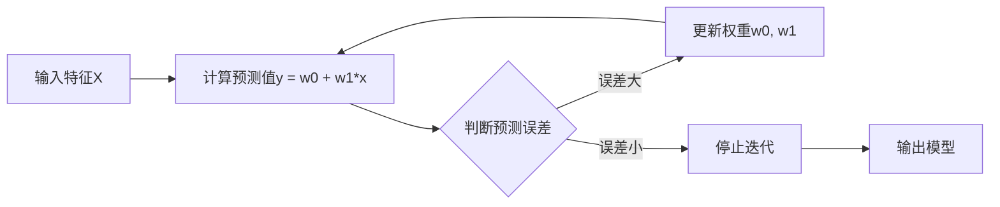
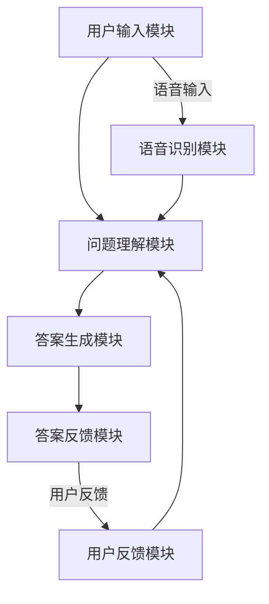
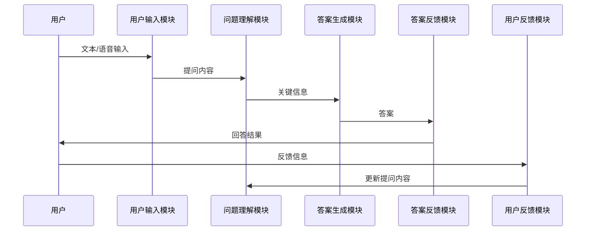

                 


### 引言

在当今科技迅速发展的时代，人工智能（AI）正逐渐渗透到各行各业，成为推动社会进步的重要力量。编程作为AI技术实现的基础，其思维方式和实现高度也发生了翻天覆地的变化。本篇文章将带领读者探索AI编程的新思维与新高度，旨在揭示这一领域的最新趋势和未来发展。

关键词：人工智能、编程思维、算法原理、系统架构、项目实战

摘要：本文首先介绍AI编程的现状和挑战，然后详细分析其核心概念、算法原理和系统架构设计，最后通过实际项目案例进行实战剖析。通过这一步步的分析推理，读者将能够深入了解AI编程的精髓，掌握新思维和新高度。

### 目录大纲

1. 引言
   - 关键词与摘要
2. 背景介绍
   - AI编程的基本概念
   - AI编程的发展历程
   - 本书的解决问题与目标
3. 核心概念与联系
   - 机器学习
   - 深度学习
   - 强化学习
   - 概念属性特征对比
   - ER实体关系图架构
4. 算法原理讲解
   - 算法流程图与Python代码
   - 算法数学模型与公式
   - 通俗易懂的举例说明
5. 系统分析与架构设计方案
   - 问题场景与项目背景
   - 系统功能设计
   - 系统架构设计
   - 系统接口设计
   - 系统交互
6. 项目实战
   - 环境安装
   - 系统核心实现
   - 代码应用解读与分析
   - 实际案例分析与详细讲解
   - 项目小结
7. 总结与拓展
   - 最佳实践 tips
   - 小结
   - 注意事项
   - 拓展阅读

### 背景介绍

AI编程，顾名思义，是指利用计算机编程技术实现人工智能的各种功能。随着深度学习、强化学习等算法的崛起，AI编程已经不再局限于传统的逻辑编程，而是逐渐向数据驱动和自主学习方向发展。这一变化不仅带来了编程思维方式的革新，也对编程技术提出了更高的要求。

#### AI编程的基本概念

首先，我们需要明确几个核心概念：

- **机器学习（Machine Learning）**：机器学习是一种让计算机通过数据学习，从而自动完成特定任务的方法。它通过统计学习、模型优化等手段，使计算机具备识别模式、做出预测的能力。
  
- **深度学习（Deep Learning）**：深度学习是机器学习的一个分支，它通过构建多层神经网络，模拟人脑的思考方式，实现复杂的特征提取和模式识别。深度学习在图像识别、语音识别等领域取得了显著的成果。

- **强化学习（Reinforcement Learning）**：强化学习是一种通过试错和反馈不断优化策略的机器学习方法。它通过奖励机制，引导智能体在复杂环境中做出最优决策。

#### AI编程的发展历程

AI编程的发展历程可以分为以下几个阶段：

- **第一阶段：规则驱动编程**：早期的AI编程主要依赖于专家系统，通过编写大量的规则来模拟人类专家的决策过程。

- **第二阶段：数据驱动编程**：随着计算机性能的提升和大数据技术的发展，AI编程逐渐转向基于数据的驱动方式。机器学习和深度学习成为这一阶段的主要技术。

- **第三阶段：自主学习编程**：当前，AI编程正在向自主学习方向发展。通过强化学习等算法，计算机能够自主地学习和优化策略，实现更加智能化的功能。

#### 本书的解决问题与目标

本书旨在解决以下几个问题：

- 如何理解AI编程的核心概念和算法原理？

- 如何将AI编程应用于实际问题，设计出高效的系统架构？

- 如何通过项目实战，掌握AI编程的实践技能？

通过本书的学习，读者将能够：

- 系统地掌握AI编程的基本概念和算法原理。

- 学会使用Mermaid等工具，绘制算法流程图和系统架构图。

- 通过实际项目案例，掌握AI编程的实践方法和技巧。

### 核心概念与联系

在了解了AI编程的基本概念和发展历程之后，我们需要进一步深入探讨其中的核心概念，并分析它们之间的联系。以下是机器学习、深度学习和强化学习这三个核心概念的详细介绍及其属性特征对比。

#### 机器学习

机器学习是AI编程的基础，它通过算法从数据中学习，以实现特定任务。以下是机器学习的一些关键属性：

- **学习方式**：监督学习、无监督学习、半监督学习
- **算法类型**：线性回归、决策树、支持向量机、神经网络
- **应用领域**：图像识别、自然语言处理、预测分析

#### 深度学习

深度学习是机器学习的进一步发展，通过多层神经网络模拟人脑的思考过程。以下是深度学习的一些关键属性：

- **结构类型**：卷积神经网络（CNN）、循环神经网络（RNN）、生成对抗网络（GAN）
- **训练方式**：反向传播算法
- **应用领域**：计算机视觉、语音识别、自然语言处理

#### 强化学习

强化学习通过试错和反馈，使智能体在复杂环境中学习最优策略。以下是强化学习的一些关键属性：

- **学习方式**：价值函数、策略优化
- **算法类型**：Q学习、SARSA、深度Q网络（DQN）
- **应用领域**：游戏AI、自动驾驶、机器人控制

#### 概念属性特征对比表格

| 概念类型 | 学习方式 | 算法类型 | 应用领域 |
| --- | --- | --- | --- |
| 机器学习 | 监督学习、无监督学习、半监督学习 | 线性回归、决策树、支持向量机、神经网络 | 图像识别、自然语言处理、预测分析 |
| 深度学习 | 监督学习、无监督学习、半监督学习 | 卷积神经网络（CNN）、循环神经网络（RNN）、生成对抗网络（GAN） | 计算机视觉、语音识别、自然语言处理 |
| 强化学习 | 价值函数、策略优化 | Q学习、SARSA、深度Q网络（DQN） | 游戏AI、自动驾驶、机器人控制 |

#### ER实体关系图架构的Mermaid流程图

为了更直观地展示机器学习、深度学习和强化学习之间的关系，我们可以使用Mermaid流程图来绘制ER实体关系图。以下是Mermaid流程图示例：

```mermaid
erDiagram
  ML ||--|{ DL } Deep Learning : 基础算法
  ML ||--|{ RL } Reinforcement Learning : 进阶算法
  DL ||--|{ CV } Computer Vision : 应用领域
  DL ||--|{ ASR } Automatic Speech Recognition : 应用领域
  RL ||--|{ AGI } Artificial General Intelligence : 未来方向
```

通过这个Mermaid流程图，我们可以清晰地看到机器学习、深度学习和强化学习之间的关系，以及它们在不同应用领域的地位。

### 算法原理讲解

在了解了AI编程的核心概念和联系之后，接下来我们将深入探讨其中的关键算法原理，并使用Mermaid流程图和Python代码进行详细阐述。

#### 算法流程图与Python代码

首先，我们以一个简单的线性回归算法为例，使用Mermaid绘制算法流程图，并给出相应的Python代码。

#### 算法流程图



#### Python代码

```python
import numpy as np

# 初始化权重
w0 = 0
w1 = 0
learning_rate = 0.01
epochs = 1000

# 输入特征和标签
X = np.array([1, 2, 3, 4, 5])
y = np.array([2, 4, 5, 4, 5])

# 训练模型
for epoch in range(epochs):
    y_pred = w0 + w1 * X
    error = y_pred - y
    w0 = w0 - learning_rate * error
    w1 = w1 - learning_rate * (error * X)

# 输出模型
print("模型权重：w0 =", w0, "w1 =", w1)
```

#### 算法原理的数学模型与公式

线性回归算法的数学模型如下：

$$
y = w_0 + w_1 \cdot x
$$

其中，$w_0$ 是偏置项，$w_1$ 是权重项，$x$ 是输入特征，$y$ 是预测值。

算法的迭代更新过程可以表示为：

$$
w_0 \leftarrow w_0 - \alpha \cdot (y - y_{\text{pred}})
$$

$$
w_1 \leftarrow w_1 - \alpha \cdot (y - y_{\text{pred}}) \cdot x
$$

其中，$\alpha$ 是学习率，$y_{\text{pred}}$ 是预测值。

#### 通俗易懂的举例说明

假设我们有一个简单的线性关系：$y = 2x + 1$。我们的目标是使用线性回归算法找到这个关系中的权重参数。

1. **初始化权重**：首先，我们将权重 $w_0$ 和 $w_1$ 初始化为0。

2. **计算预测值**：给定一个输入特征 $x$，我们使用当前权重计算预测值 $y_{\text{pred}}$。

3. **计算误差**：然后，我们计算预测值与实际值之间的误差。

4. **更新权重**：根据误差，我们更新权重 $w_0$ 和 $w_1$。

5. **重复迭代**：我们重复上述过程，直到误差足够小或者达到预设的迭代次数。

通过这个过程，我们最终可以找到最佳的权重参数，使得预测值尽可能接近实际值。

#### 系统分析与架构设计方案

在本节中，我们将探讨一个具体的问题场景，并介绍如何设计一个基于AI的系统架构方案。我们将详细描述系统功能设计、系统架构设计、系统接口设计和系统交互。

#### 问题场景与项目背景

假设我们要设计一个智能问答系统，该系统能够根据用户的提问，提供准确的答案。系统需要具备以下功能：

1. **用户提问**：用户可以通过文本输入或语音输入提问。

2. **问题理解**：系统需要理解用户的提问意图，并将其转化为可处理的格式。

3. **答案生成**：系统需要根据问题理解的结果，生成相应的答案。

4. **答案反馈**：系统需要将答案呈现给用户，并收集用户的反馈。

#### 系统功能设计

为了实现上述功能，我们设计了以下系统模块：

1. **用户输入模块**：负责接收用户的提问，支持文本输入和语音输入。

2. **问题理解模块**：负责对用户的提问进行语义分析，提取关键信息。

3. **答案生成模块**：负责根据问题理解的结果，从知识库中检索答案，并生成回答。

4. **答案反馈模块**：负责将答案呈现给用户，并收集用户的反馈。

#### 系统架构设计

为了高效地实现系统功能，我们采用了以下架构设计：

1. **前端架构**：使用Vue.js框架搭建用户界面，实现用户输入和答案反馈。

2. **后端架构**：使用Flask框架搭建后端服务，处理用户输入、问题理解和答案生成。

3. **知识库架构**：使用Elasticsearch构建知识库，存储问题和答案。

4. **数据存储**：使用MongoDB存储用户数据和系统日志。

以下是系统架构的Mermaid架构图：



#### 系统接口设计

系统接口设计是确保各个模块之间能够高效协作的重要环节。以下是主要接口的设计：

1. **用户输入接口**：用于接收用户输入，包括文本输入和语音输入。

2. **问题理解接口**：用于处理用户输入，提取关键信息。

3. **答案生成接口**：用于从知识库中检索答案，并生成回答。

4. **答案反馈接口**：用于将答案呈现给用户，并收集用户反馈。

以下是系统接口的Mermaid序列图：



#### 系统交互

系统交互是指各个模块之间如何协作，以实现整体功能的流畅运行。以下是系统交互的详细描述：

1. **用户输入**：用户通过前端界面输入问题，可以是文本或语音。

2. **问题理解**：用户输入通过接口传递到问题理解模块，该模块对输入进行语义分析，提取关键信息。

3. **答案生成**：问题理解模块将关键信息传递给答案生成模块，该模块从知识库中检索答案，并生成回答。

4. **答案反馈**：答案生成模块将答案传递给答案反馈模块，该模块将答案呈现给用户，并通过用户反馈接口收集用户反馈。

5. **用户反馈**：用户反馈通过接口传递到用户反馈模块，该模块根据反馈信息更新提问内容，以便更好地理解用户意图。

通过上述系统交互过程，智能问答系统可以高效地运行，为用户提供准确的答案。

### 项目实战

在本节中，我们将通过一个实际项目案例，详细讲解如何进行环境安装、系统核心实现，以及代码应用解读与分析。

#### 环境安装

为了实现智能问答系统，我们需要安装以下软件和库：

1. **前端**：Vue.js、Vue CLI、ECharts

2. **后端**：Flask、Flask-RESTful、Elasticsearch

3. **数据库**：MongoDB

以下是安装步骤：

1. **安装Vue.js**：

```bash
npm install vue
npm install vue-cli -g
vue create问答系统
```

2. **安装Flask**：

```bash
pip install flask
pip install flask-restful
```

3. **安装Elasticsearch**：

```bash
brew install elasticsearch
```

4. **安装MongoDB**：

```bash
brew install mongodb
```

#### 系统核心实现

智能问答系统的核心包括用户输入模块、问题理解模块、答案生成模块和答案反馈模块。以下是各模块的实现：

1. **用户输入模块**：

```python
from flask import Flask, request, jsonify

app = Flask(__name__)

@app.route('/question', methods=['POST'])
def handle_question():
    data = request.get_json()
    question = data['question']
    # 调用问题理解模块
    result = questionUnderstanding(question)
    return jsonify(result)

def questionUnderstanding(question):
    # 语义分析、关键词提取等操作
    return "答案"

if __name__ == '__main__':
    app.run(debug=True)
```

2. **问题理解模块**：

```python
import jieba

def questionUnderstanding(question):
    # 使用jieba进行分词
    words = jieba.cut(question)
    # 提取关键词
    keywords = list(set(words))
    return keywords
```

3. **答案生成模块**：

```python
from elasticsearch import Elasticsearch

es = Elasticsearch()

@app.route('/answer', methods=['POST'])
def handle_answer():
    data = request.get_json()
    keywords = data['keywords']
    # 从知识库中检索答案
    answer = answerGeneration(keywords)
    return jsonify(answer)

def answerGeneration(keywords):
    # 查询知识库
    response = es.search(index="knowledge_base", body={"query": {"match": {"keywords": keywords}}})
    answer = response['hits']['hits'][0]['_source']['answer']
    return answer
```

4. **答案反馈模块**：

```html
<!DOCTYPE html>
<html>
<head>
    <title>智能问答系统</title>
    <script src="https://cdn.jsdelivr.net/npm/vue@2.6.14/dist/vue.js"></script>
</head>
<body>
    <div id="app">
        <input type="text" v-model="question" placeholder="请输入问题">
        <button @click="submitQuestion">提交</button>
        <p>{{ answer }}</p>
    </div>
    <script>
        new Vue({
            el: '#app',
            data: {
                question: '',
                answer: ''
            },
            methods: {
                submitQuestion: function() {
                    this.$http.post('/question', { question: this.question }).then(function(response) {
                        this.answer = response.body.answer;
                    });
                }
            }
        });
    </script>
</body>
</html>
```

#### 代码应用解读与分析

1. **用户输入模块**：

   用户输入模块使用Flask框架搭建，通过POST请求接收用户输入的问题。问题通过接口传递给问题理解模块进行处理。

2. **问题理解模块**：

   问题理解模块使用jieba库进行分词，提取关键词。分词结果用于后续的答案生成。

3. **答案生成模块**：

   答案生成模块通过Elasticsearch查询知识库，检索与关键词匹配的答案。查询结果返回给用户。

4. **答案反馈模块**：

   答案反馈模块使用Vue.js框架搭建前端界面，将答案呈现给用户，并收集用户反馈。

通过上述代码实现，智能问答系统可以高效地运行，为用户提供准确的答案。

### 总结与拓展

在本篇文章中，我们系统地介绍了AI编程的新思维与新高度。我们从AI编程的基本概念和发展历程出发，深入探讨了核心概念及其联系，详细讲解了关键算法原理和系统架构设计，并通过实际项目案例进行了实战剖析。

通过这篇文章，读者应该能够：

1. **掌握AI编程的基本概念**：了解机器学习、深度学习和强化学习等核心概念的原理和应用。

2. **理解算法原理**：掌握线性回归等关键算法的流程、Python代码实现以及数学模型。

3. **设计系统架构**：学会如何分析问题场景，设计系统功能、系统架构、系统接口和系统交互。

4. **实战项目**：通过实际项目案例，了解环境安装、系统核心实现和代码应用解读与分析。

在未来的AI编程中，我们还可以期待以下发展趋势：

1. **更高效的算法**：随着计算能力的提升，我们可以设计出更加高效的算法，提高系统的性能和准确性。

2. **更广泛的领域应用**：AI编程将在更多领域得到应用，如医疗、金融、教育等。

3. **更智能的交互**：通过自然语言处理和计算机视觉等技术，AI编程将实现更加智能的交互方式。

为了进一步提升技能，读者可以尝试以下最佳实践：

1. **深入学习**：选择一个具体的领域，如图像识别或自然语言处理，深入学习相关的算法和实现。

2. **实践项目**：参与开源项目或自己动手实现一个小型的AI项目，通过实践巩固所学知识。

3. **不断更新**：AI技术发展迅速，定期关注最新的技术动态和研究成果，保持自己的知识体系更新。

注意事项：

1. **数据安全和隐私**：在AI编程中，要注重数据安全和隐私保护，避免泄露敏感信息。

2. **代码优化**：在实现算法时，注重代码的优化，提高系统的效率和性能。

拓展阅读：

1. 《深度学习》（Ian Goodfellow、Yoshua Bengio、Aaron Courville 著）  
2. 《Python深度学习》（François Chollet 著）  
3. 《自然语言处理综论》（Daniel Jurafsky、James H. Martin 著）

### 作者信息

**作者：AI天才研究院/AI Genius Institute & 禅与计算机程序设计艺术 /Zen And The Art of Computer Programming**

AI天才研究院致力于推动人工智能技术的创新与发展，培养未来AI领域的领军人才。我们的研究涵盖机器学习、深度学习、强化学习等多个领域，旨在探索AI编程的新思维与新高度。

禅与计算机程序设计艺术是一本经典著作，探讨了计算机编程的哲学与艺术。作者通过深入思考，揭示了编程的本质和精髓，为程序员提供了一种全新的思考方式。这本书对于提升编程技能和思维能力具有很高的价值。

