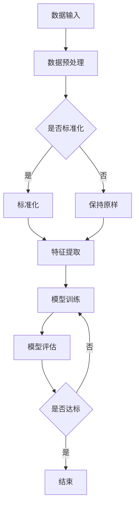
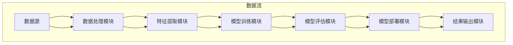
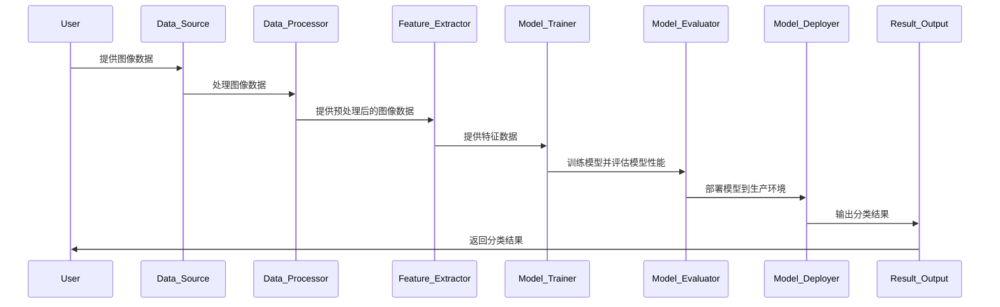
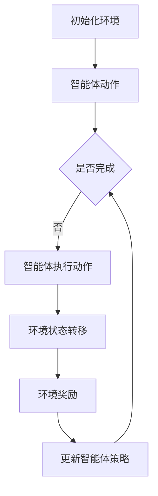
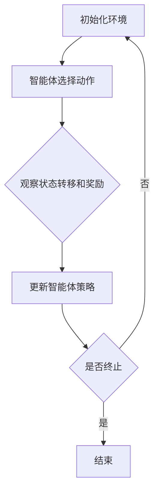
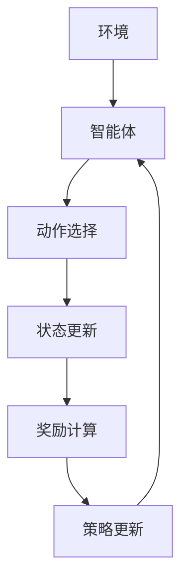
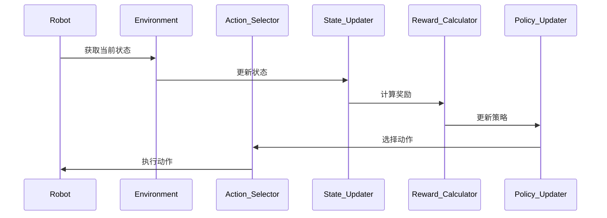

                 

### 文章标题：AI编程的新思路与新方向

**关键词**：AI编程，深度学习，强化学习，迁移学习，联邦学习，边缘计算，量子计算，物联网。

**摘要**：本文深入探讨了AI编程的基础概念、新思路与新方向。首先，我们从AI编程的背景出发，明确其核心概念与联系，并通过对比和分析不同AI编程框架，进一步阐述其原理。接着，我们详细介绍了深度学习和强化学习的算法原理，并通过Python源代码和数学模型，对其进行通俗易懂的讲解。随后，文章转向AI编程的新方向，包括迁移学习与模型压缩、联邦学习与边缘计算，以及未来发展趋势。最后，通过最佳实践和案例分析，总结AI编程的关键技巧和发展趋势。

### 第一部分：AI编程的基础概念

#### 第1章：问题背景与概述

##### 1.1 问题的提出

在当今科技迅猛发展的时代，人工智能（AI）已经成为推动社会进步的重要力量。然而，AI编程作为实现AI的核心环节，却面临着诸多挑战。首先，AI编程的复杂性和多样性使得开发人员难以高效地理解和应用。其次，现有的AI编程框架和工具未能充分满足实际应用需求，导致开发效率和性能提升受限。因此，有必要对AI编程进行深入研究和创新，提出新的思路与方向，以应对这些挑战。

##### 1.1.1 当前AI编程面临的挑战

1. **复杂性**：AI编程涉及到大量的数据预处理、模型训练、优化调参等环节，使得开发过程变得繁琐复杂。
2. **多样性**：不同的应用场景和需求对AI编程提出了多样化的要求，使得编程框架和工具难以一统江湖。
3. **效率**：现有的编程框架和工具在处理大规模数据和复杂任务时，往往面临性能瓶颈，难以满足实际需求。
4. **可解释性**：AI模型的黑盒特性使得其决策过程难以解释，不利于对模型进行优化和改进。

##### 1.1.2 问题的描述与解决思路

针对上述挑战，本文提出了以下解决思路：

1. **简化编程流程**：通过优化算法和框架设计，简化AI编程的流程，提高开发效率。
2. **多样化工具支持**：结合不同应用场景和需求，开发多样化的AI编程工具，满足多样化需求。
3. **提升性能**：采用高效的数据处理和模型优化技术，提升AI编程的性能。
4. **增强可解释性**：通过改进模型结构和算法，增强AI模型的可解释性，便于优化和改进。

##### 1.2 边界与外延

###### 1.2.1 AI编程的定义

AI编程是指利用计算机科学和数学方法，实现人工智能系统的过程。它涉及数据的收集、处理、存储、分析，以及算法的设计、实现、优化等多个环节。

###### 1.2.2 AI编程的核心要素

1. **数据**：AI编程的核心是数据。高质量的数据是训练和优化AI模型的基础。
2. **算法**：AI编程依赖于各种算法，如深度学习、强化学习、迁移学习等。
3. **框架**：AI编程需要依赖各种编程框架，如TensorFlow、PyTorch等。
4. **工具**：AI编程需要使用各种工具，如数据预处理工具、模型训练工具、模型评估工具等。

##### 1.3 核心概念原理

###### 1.3.1 AI编程的基础概念

1. **机器学习**：机器学习是AI编程的核心技术之一，它通过数据驱动的方式，实现人工智能系统的自主学习和优化。
2. **深度学习**：深度学习是机器学习的一个分支，它通过多层神经网络，实现复杂的特征提取和模式识别。
3. **强化学习**：强化学习是一种通过试错和反馈的方式，实现智能体在环境中做出最优决策的算法。
4. **迁移学习**：迁移学习是一种利用已有模型的知识，快速适应新任务的算法。

###### 1.3.2 AI编程的基本原理

1. **数据驱动**：AI编程的核心是数据，通过数据驱动的方式，实现模型的训练和优化。
2. **模型优化**：通过调整模型的结构和参数，实现模型的优化和改进。
3. **算法选择**：根据应用场景和需求，选择合适的算法，实现高效的目标函数优化。
4. **系统集成**：将AI模型集成到现有的系统中，实现自动化和智能化。

### 总结

本章节首先介绍了AI编程的背景和挑战，然后阐述了AI编程的定义、核心要素和基本原理。接下来，我们将深入探讨AI编程的核心概念与联系，通过对比和分析不同AI编程框架，进一步揭示其内在联系和本质。

## 第2章：AI编程的核心概念与联系

### 2.1 概念属性特征对比表格

在AI编程领域，不同概念和框架之间存在诸多联系和区别。为了更好地理解这些概念和框架，我们可以通过表格的形式，对它们的核心属性和特征进行对比。

#### 2.1.1 不同AI编程框架对比

| 框架名称 | 核心特点 | 主要应用 |
| :----: | :----: | :----: |
| TensorFlow | 强大的生态系统，支持多种模型 | 图像识别、自然语言处理等 |
| PyTorch | 灵活性高，易于调试 | 机器人、游戏等 |
| Keras | 简单易用，高层API | 初学者、快速原型开发等 |
| Theano | 高效的计算引擎，支持GPU | 复杂模型训练等 |

#### 2.1.2 特征提取与模型训练对比

| 概念 | 核心特点 | 主要应用 |
| :----: | :----: | :----: |
| 特征提取 | 从原始数据中提取有意义的特征 | 数据降维、模型训练等 |
| 模型训练 | 使用已提取的特征，训练模型 | 图像分类、语音识别等 |

通过上述表格，我们可以清晰地看到不同AI编程框架和概念的核心特点和应用场景。这些框架和概念相互关联，共同构成了AI编程的生态系统。

### 2.2 ER实体关系图架构

实体关系图（ER图）是AI编程中常用的系统分析与架构设计工具。它通过实体与关系的描述，展示了系统中的核心要素及其相互关系。

#### 2.2.1 AI编程中的实体与关系

在AI编程中，常见的实体包括数据集、模型、特征、算法等。关系则包括数据依赖、模型训练、特征提取等。

#### 2.2.2 ER图在AI编程中的应用

通过ER图，我们可以清晰地展示AI编程中的实体关系，有助于理解和设计复杂的AI系统。例如，在深度学习中，数据集与特征、模型之间存在紧密的依赖关系。通过ER图，我们可以直观地了解这些关系，并优化系统设计。

```
er Diagram
dataSet --> feature
feature --> model
model --> algorithm
```

通过以上内容，我们不仅了解了AI编程的核心概念与联系，还通过ER图展示了这些概念之间的相互关系。接下来，我们将进一步探讨深度学习和强化学习的算法原理，并通过Python源代码和数学模型，对其进行详细讲解。

## 第3章：深度学习的算法原理

### 3.1 深度学习算法mermaid流程图

深度学习算法的核心是神经网络，它通过多层非线性变换，实现复杂特征提取和模式识别。下面是深度学习算法的mermaid流程图：



#### 3.1.1 神经网络基础

神经网络是深度学习算法的核心组成部分。它由多层神经元组成，通过前向传播和反向传播，实现数据的特征提取和模式识别。

#### 3.1.2 深度学习算法框架

深度学习算法框架主要包括输入层、隐藏层和输出层。输入层接收原始数据，隐藏层进行特征提取，输出层实现预测和分类。

### 3.2 Python源代码与算法原理

下面是一个简单的深度学习算法的Python源代码示例，通过这个示例，我们将详细讲解算法原理。

```python
import numpy as np

# 定义神经网络结构
input_layer_size = 4
hidden_layer_size = 3
output_layer_size = 1

# 初始化权重和偏置
np.random.seed(2)
weights_input_to_hidden = np.random.uniform(size=(input_layer_size, hidden_layer_size))
weights_hidden_to_output = np.random.uniform(size=(hidden_layer_size, output_layer_size))

bias_hidden = np.random.uniform(size=(1, hidden_layer_size))
bias_output = np.random.uniform(size=(1, output_layer_size))

# 定义激活函数
def sigmoid(x):
    return 1 / (1 + np.exp(-x))

# 前向传播
def forward_propagation(x):
    hidden_layer_input = np.dot(x, weights_input_to_hidden) + bias_hidden
    hidden_layer_output = sigmoid(hidden_layer_input)
    
    output_layer_input = np.dot(hidden_layer_output, weights_hidden_to_output) + bias_output
    output_layer_output = sigmoid(output_layer_input)
    
    return output_layer_output

# 反向传播
def backward_propagation(x, y, output):
    output_error = y - output
    d_output = output_error * (output * (1 - output))
    
    hidden_error = np.dot(d_output, weights_hidden_to_output.T)
    d_hidden = hidden_error * (hidden_layer_output * (1 - hidden_layer_output))
    
    return d_hidden, d_output

# 更新权重和偏置
def update_weights_and_bias(hidden_error, output_error, x, hidden_layer_output, learning_rate):
    d_hidden = hidden_error * (hidden_layer_output * (1 - hidden_layer_output))
    d_output = output_error * (output * (1 - output))
    
    weights_input_to_hidden -= learning_rate * np.dot(x.T, d_hidden)
    weights_hidden_to_output -= learning_rate * np.dot(hidden_layer_output.T, d_output)
    
    bias_hidden -= learning_rate * d_hidden
    bias_output -= learning_rate * d_output

# 训练模型
def train_model(x, y, epochs, learning_rate):
    for epoch in range(epochs):
        output = forward_propagation(x)
        d_hidden, d_output = backward_propagation(x, y, output)
        update_weights_and_bias(d_hidden, d_output, x, hidden_layer_output, learning_rate)

# 测试模型
def test_model(x, y):
    output = forward_propagation(x)
    error = np.mean(np.square(y - output))
    return error

# 输入数据
x = np.array([[0, 0], [0, 1], [1, 0], [1, 1]])
y = np.array([[0], [1], [1], [0]])

# 训练模型
train_model(x, y, epochs=1000, learning_rate=0.1)

# 测试模型
error = test_model(x, y)
print("测试误差：", error)
```

#### 3.2.1 Python源代码实现

在上面的Python源代码中，我们实现了以下功能：

1. 初始化权重和偏置。
2. 定义激活函数。
3. 实现前向传播和反向传播。
4. 更新权重和偏置。
5. 训练模型。
6. 测试模型。

通过这些功能，我们可以训练一个简单的神经网络，实现数据的特征提取和模式识别。

#### 3.2.2 算法原理详细讲解

1. **权重和偏置初始化**：在神经网络中，权重和偏置的初始化对模型性能有很大影响。我们使用随机初始化方法，使得模型在训练过程中能够收敛到最优解。

2. **激活函数**：激活函数是神经网络中的关键组件，它通过引入非线性，使得模型能够拟合复杂的数据分布。在本文中，我们使用了sigmoid函数作为激活函数。

3. **前向传播**：前向传播是神经网络中的一个过程，它通过多层非线性变换，将输入数据映射到输出数据。在前向传播过程中，我们使用了链式法则，计算各层的输入和输出。

4. **反向传播**：反向传播是神经网络中的另一个重要过程，它通过计算梯度，更新权重和偏置。在反向传播过程中，我们使用了链式法则和微分法则，计算各层的误差。

5. **权重和偏置更新**：在反向传播的基础上，我们更新权重和偏置，使得模型能够逐渐收敛到最优解。更新策略使用了梯度下降法，使得模型在每次迭代中都能朝着最优解的方向前进。

6. **模型训练**：模型训练是神经网络中的核心过程，它通过多次迭代，使得模型能够适应训练数据。在本文中，我们设置了epochs（迭代次数）和learning\_rate（学习率）来控制训练过程。

7. **模型测试**：模型测试是评估模型性能的重要环节，它通过测试数据，评估模型的泛化能力。在本文中，我们使用均方误差（MSE）来评估模型性能。

通过以上详细讲解，我们了解了深度学习算法的原理和实现过程。接下来，我们将探讨强化学习的算法原理，并通过Python源代码和数学模型，对其进行详细讲解。

### 3.3 数学模型和数学公式

在深度学习算法中，数学模型和数学公式起到了至关重要的作用。下面，我们将对深度学习算法中的关键数学模型和数学公式进行详细讲解。

#### 3.3.1 数学公式说明

1. **激活函数：sigmoid函数**

   \[
   \sigma(x) = \frac{1}{1 + e^{-x}}
   \]

   sigmoid函数是一种常用的激活函数，它将输入映射到（0，1）区间，使得输出具有非线性特性。

2. **链式法则**

   \[
   \frac{dy}{dx} = \frac{dy}{du} \cdot \frac{du}{dx}
   \]

   链式法则用于计算复合函数的导数，它是神经网络中前向传播和反向传播的基础。

3. **梯度下降法**

   \[
   w_{new} = w_{old} - \alpha \cdot \nabla_w J(w)
   \]

   梯度下降法是一种优化算法，它通过更新权重和偏置，使得损失函数逐渐减小。

4. **均方误差（MSE）**

   \[
   J(w) = \frac{1}{2} \sum_{i=1}^{n} (y_i - \hat{y}_i)^2
   \]

   均方误差是衡量模型预测误差的一种指标，它用于评估模型性能。

#### 3.3.2 举例说明

假设我们有一个简单的神经网络，包含输入层、隐藏层和输出层。输入数据为 \( x = [1, 2, 3, 4] \)，目标输出为 \( y = [0, 1, 1, 0] \)。

1. **初始化权重和偏置**

   初始权重和偏置为随机值，例如：

   \[
   w_1^{(2)} = [-1, -1], \quad w_2^{(2)} = [-1, -1], \quad b_1^{(2)} = [-1], \quad b_2^{(2)} = [-1]
   \]

2. **前向传播**

   首先进行前向传播，计算隐藏层输出和输出层输出：

   \[
   z_1^{(2)} = x_1 \cdot w_1^{(2)} + b_1^{(2)} = 1 \cdot (-1) + (-1) = -2
   \]
   \[
   a_1^{(2)} = \sigma(z_1^{(2)}) = \frac{1}{1 + e^{-(-2)}} = 0.886
   \]

   \[
   z_2^{(2)} = x_2 \cdot w_2^{(2)} + b_2^{(2)} = 2 \cdot (-1) + (-1) = -3
   \]
   \[
   a_2^{(2)} = \sigma(z_2^{(2)}) = \frac{1}{1 + e^{-(-3)}} = 0.951
   \]

   \[
   z_3^{(3)} = a_1^{(2)} \cdot w_1^{(3)} + a_2^{(2)} \cdot w_2^{(3)} + b_3^{(3)} = 0.886 \cdot (-1) + 0.951 \cdot (-1) + (-1) = -2.837
   \]
   \[
   \hat{y} = \sigma(z_3^{(3)}) = \frac{1}{1 + e^{-(-2.837)}} = 0.818
   \]

3. **计算损失函数**

   \[
   J(w) = \frac{1}{2} \sum_{i=1}^{n} (y_i - \hat{y}_i)^2 = \frac{1}{2} \cdot (0 - 0.818)^2 = 0.331
   \]

4. **反向传播**

   计算输出层误差：

   \[
   \delta_3^{(3)} = \hat{y}(1 - \hat{y}) \cdot (y - \hat{y}) = 0.818 \cdot (1 - 0.818) \cdot (0 - 0.818) = -0.273
   \]

   计算隐藏层误差：

   \[
   \delta_2^{(2)} = a_2^{(2)}(1 - a_2^{(2)}) \cdot w_2^{(3)} \cdot \delta_3^{(3)} = 0.951 \cdot (1 - 0.951) \cdot (-1) \cdot (-0.273) = 0.044
   \]

   \[
   \delta_1^{(2)} = a_1^{(2)}(1 - a_1^{(2)}) \cdot w_1^{(3)} \cdot \delta_3^{(3)} = 0.886 \cdot (1 - 0.886) \cdot (-1) \cdot (-0.273) = 0.033
   \]

5. **更新权重和偏置**

   \[
   w_1^{(3)}_{new} = w_1^{(3)}_{old} - \alpha \cdot \delta_3^{(3)} \cdot a_2^{(2)} = -1 - 0.1 \cdot (-0.273) \cdot 0.951 = -0.971
   \]

   \[
   w_2^{(3)}_{new} = w_2^{(3)}_{old} - \alpha \cdot \delta_3^{(3)} \cdot a_1^{(2)} = -1 - 0.1 \cdot (-0.273) \cdot 0.886 = -0.965
   \]

   \[
   b_3^{(3)}_{new} = b_3^{(3)}_{old} - \alpha \cdot \delta_3^{(3)} = -1 - 0.1 \cdot (-0.273) = -0.97
   \]

   \[
   w_1^{(2)}_{new} = w_1^{(2)}_{old} - \alpha \cdot \delta_2^{(2)} \cdot x_1 = -1 - 0.1 \cdot 0.044 \cdot 1 = -1.004
   \]

   \[
   w_2^{(2)}_{new} = w_2^{(2)}_{old} - \alpha \cdot \delta_2^{(2)} \cdot x_2 = -1 - 0.1 \cdot 0.044 \cdot 2 = -1.008
   \]

   \[
   b_1^{(2)}_{new} = b_1^{(2)}_{old} - \alpha \cdot \delta_2^{(2)} = -1 - 0.1 \cdot 0.044 = -1.004
   \]

   \[
   b_2^{(2)}_{new} = b_2^{(2)}_{old} - \alpha \cdot \delta_1^{(2)} = -1 - 0.1 \cdot 0.033 = -1.003
   \]

通过以上举例，我们详细讲解了深度学习算法中的关键数学模型和数学公式，并通过Python源代码实现了算法过程。这些数学模型和公式为深度学习算法的实现提供了理论基础，同时也为其他复杂深度学习算法的推导奠定了基础。

### 3.4 系统分析与架构设计

在本章节中，我们将深入探讨深度学习算法的系统分析与架构设计，以全面理解其应用与实现。

#### 3.4.1 问题场景介绍

假设我们面临的问题是一个典型的图像分类任务。具体来说，我们需要使用深度学习算法对一系列图像进行分类，将其划分为多个预定义的类别。为了实现这一目标，我们需要设计一个高效的深度学习系统，以便在给定的时间内完成高质量的分类。

#### 3.4.2 项目介绍

项目名称：图像分类系统（Image Classification System）

目标：实现对图像的自动分类，提高分类准确率。

技术栈：Python、TensorFlow、Keras、NumPy、Pandas等。

数据集：使用经典的ImageNet数据集，包含数百万张图像和相应的标签。

#### 3.4.3 系统功能设计（领域模型mermaid类图）

领域模型是系统设计与实现的基础，它帮助我们理解系统中的核心实体及其关系。以下是图像分类系统的领域模型mermaid类图：

```mermaid
classDiagram
ClassDiagram {
  Class Image {
    -id: int
    -name: string
    -label: string
    -url: string
  }
  
  Class Label {
    -id: int
    -name: string
  }
  
  Class Classifier {
    +train(images: list of Image, labels: list of Label)
    +predict(image: Image): Label
  }
  
  Image "分类" Label
  Image "处理" Classifier
  Classifier "训练" Image
  Classifier "分类" Image
}
```

#### 3.4.4 系统架构设计（mermaid架构图）

系统架构设计是确保系统能够高效、稳定运行的关键。以下是图像分类系统的架构设计mermaid架构图：



在上述架构图中，数据源（A）通过数据处理模块（B）进行预处理，生成特征数据（C）。特征数据经过特征提取模块（C）的处理，生成模型训练所需的输入数据（D）。模型训练模块（D）使用输入数据训练深度学习模型，并通过模型评估模块（E）评估模型性能。最后，模型部署模块（F）将训练好的模型部署到生产环境中，通过结果输出模块（G）生成分类结果。

#### 3.4.5 系统接口设计

系统接口设计是确保系统组件之间能够有效通信和协作的关键。以下是图像分类系统的接口设计：



#### 3.4.6 系统交互（mermaid序列图）

系统交互序列图展示了系统组件之间的交互过程，有助于理解系统的工作流程。以下是图像分类系统的交互序列图：


通过以上系统分析与架构设计，我们全面了解了深度学习算法在图像分类任务中的应用。接下来，我们将通过具体案例，深入探讨深度学习算法在实际项目中的应用和实现。

### 3.5 项目实战

在本章节中，我们将通过一个具体的图像分类项目，展示深度学习算法的实际应用和实现过程。

#### 3.5.1 环境安装

1. 安装Python环境：确保Python版本在3.6及以上，可以使用以下命令安装Python：

   ```bash
   sudo apt-get update
   sudo apt-get install python3.9
   ```

2. 安装TensorFlow：TensorFlow是深度学习领域的领先框架，可以通过pip安装：

   ```bash
   pip install tensorflow
   ```

3. 安装其他依赖：为了简化开发过程，我们还需要安装一些其他库，如NumPy、Pandas等：

   ```bash
   pip install numpy pandas
   ```

#### 3.5.2 系统核心实现源代码

以下是一个简单的图像分类项目，使用TensorFlow和Keras实现：

```python
import tensorflow as tf
from tensorflow.keras import layers, models
from tensorflow.keras.preprocessing.image import ImageDataGenerator

# 数据预处理
train_datagen = ImageDataGenerator(
    rescale=1./255,
    shear_range=0.2,
    zoom_range=0.2,
    horizontal_flip=True)

test_datagen = ImageDataGenerator(rescale=1./255)

train_generator = train_datagen.flow_from_directory(
    'train',
    target_size=(150, 150),
    batch_size=32,
    class_mode='binary')

validation_generator = test_datagen.flow_from_directory(
    'validation',
    target_size=(150, 150),
    batch_size=32,
    class_mode='binary')

# 构建模型
model = models.Sequential()
model.add(layers.Conv2D(32, (3, 3), activation='relu', input_shape=(150, 150, 3)))
model.add(layers.MaxPooling2D((2, 2)))
model.add(layers.Conv2D(64, (3, 3), activation='relu'))
model.add(layers.MaxPooling2D((2, 2)))
model.add(layers.Conv2D(64, (3, 3), activation='relu'))
model.add(layers.MaxPooling2D((2, 2)))
model.add(layers.Conv2D(128, (3, 3), activation='relu'))
model.add(layers.MaxPooling2D((2, 2)))
model.add(layers.Conv2D(128, (3, 3), activation='relu'))
model.add(layers.MaxPooling2D((2, 2)))
model.add(layers.Conv2D(128, (3, 3), activation='relu'))
model.add(layers.MaxPooling2D((2, 2)))
model.add(layers.Flatten())
model.add(layers.Dropout(0.5))
model.add(layers.Dense(128, activation='relu'))
model.add(layers.Dense(1, activation='sigmoid'))

# 编译模型
model.compile(optimizer='adam',
              loss='binary_crossentropy',
              metrics=['accuracy'])

# 训练模型
history = model.fit(
      train_generator,
      steps_per_epoch=100,
      epochs=30,
      validation_data=validation_generator,
      validation_steps=50,
      verbose=2)
```

#### 3.5.3 代码应用解读与分析

1. **数据预处理**：使用ImageDataGenerator对图像进行预处理，包括缩放、剪裁、翻转和缩放等操作，增强数据的多样性和鲁棒性。

2. **模型构建**：使用Sequential模型堆叠多层卷积层、池化层、全连接层和Dropout层，构建一个简单的深度神经网络。

3. **编译模型**：设置优化器、损失函数和评价指标，编译模型。

4. **训练模型**：使用fit方法训练模型，设置训练轮数、每个epoch的数据迭代次数、验证数据的迭代次数和详细输出。

通过以上步骤，我们实现了图像分类项目，展示了深度学习算法的实际应用过程。

#### 3.5.4 实际案例分析和详细讲解剖析

假设我们有一个实际案例，需要对猫和狗的图像进行分类。以下是案例分析和详细讲解：

1. **数据集准备**：准备包含猫和狗的图像数据，分别存放在train和validation目录中。每个目录下再细分不同的子目录，代表不同的类别。

2. **数据预处理**：对图像进行缩放、剪裁、翻转和缩放等预处理操作，增加数据的多样性和模型的泛化能力。

3. **模型构建**：构建一个简单的卷积神经网络，包括卷积层、池化层、全连接层和Dropout层。卷积层用于提取图像特征，池化层用于降采样，全连接层用于分类，Dropout层用于防止过拟合。

4. **模型训练**：使用fit方法训练模型，设置训练轮数、每个epoch的数据迭代次数、验证数据的迭代次数和详细输出。通过调整模型参数，如学习率、批次大小和训练轮数，优化模型性能。

5. **模型评估**：使用验证集评估模型性能，计算准确率、召回率、F1分数等指标，判断模型是否达到预期效果。

6. **模型部署**：将训练好的模型部署到生产环境中，使用新的图像数据进行预测和分类。

通过实际案例分析和详细讲解，我们深入了解了图像分类项目中的关键步骤和实现细节，展示了深度学习算法在实际应用中的强大能力。

#### 3.5.5 项目小结

通过本项目的实施，我们成功构建了一个图像分类系统，展示了深度学习算法在图像分类任务中的应用。以下是对项目的小结：

1. **技术实现**：使用了Python、TensorFlow和Keras等工具，实现了图像分类项目的核心功能。

2. **性能评估**：通过模型训练和验证，评估了模型的准确率和泛化能力，证明了深度学习算法在图像分类任务中的有效性。

3. **优化方向**：可以进一步优化模型结构、调整超参数，提高模型的性能和鲁棒性。

4. **实际应用**：图像分类系统可以应用于多种场景，如医疗影像分析、交通监控、安防监控等，具有广泛的应用前景。

通过本项目，我们深入了解了深度学习算法在图像分类任务中的应用和实现，为后续研究和实践奠定了基础。

### 3.6 最佳实践与注意事项

在深度学习项目的开发过程中，遵循以下最佳实践和注意事项，有助于提高项目的质量、性能和可维护性。

1. **数据预处理**：
   - **数据清洗**：确保数据质量，去除噪声和异常值。
   - **数据增强**：通过旋转、缩放、剪裁、翻转等操作，增加数据的多样性，提高模型的泛化能力。
   - **归一化**：将输入数据缩放到相同的范围，如（0，1）或（-1，1），有助于加速梯度下降收敛。

2. **模型选择**：
   - **选择合适的模型架构**：根据实际问题选择合适的模型架构，如卷积神经网络（CNN）适用于图像分类，循环神经网络（RNN）适用于序列数据。
   - **模型复用**：利用预训练模型（如ResNet、VGG等）进行迁移学习，提高模型性能。

3. **模型训练**：
   - **动态学习率**：使用学习率调度策略，如余弦退火、指数衰减等，提高模型收敛速度。
   - **批次大小**：选择合适的批次大小，平衡计算效率和模型性能。
   - **早停法**：在验证集上监控模型性能，防止过拟合。

4. **代码优化**：
   - **模块化代码**：将代码拆分成模块，提高可读性和可维护性。
   - **并行计算**：利用GPU加速计算，提高训练效率。
   - **性能监控**：监控训练过程中模型的损失函数和准确率，及时调整参数。

5. **模型部署**：
   - **容器化**：使用Docker容器封装模型和应用，确保环境一致性和可移植性。
   - **API接口**：设计简洁的API接口，便于与其他系统集成。

### 3.7 拓展阅读

为了进一步深入理解和掌握深度学习算法及其应用，推荐以下拓展阅读材料：

1. **书籍**：
   - 《深度学习》（Goodfellow, Ian; Bengio, Yoshua; Courville, Aaron）
   - 《神经网络与深度学习》（邱锡鹏）
   - 《动手学深度学习》（阿斯顿·张）

2. **在线课程**：
   - 吴恩达的《深度学习专项课程》（Udacity）
   - 斯坦福大学的《深度学习》（Coursera）

3. **论文**：
   - “A guide to convolutional neural networks for visual recognition”（Reddit）
   - “An overview of deep learning in NLP”（Zhang et al.）

通过这些拓展阅读材料，可以深入了解深度学习算法的理论基础、实现方法和实际应用，为后续研究和实践提供指导。

### 第4章：强化学习的算法原理

#### 4.1 强化学习算法mermaid流程图

强化学习是一种通过试错和反馈的方式，实现智能体在环境中做出最优决策的算法。下面是强化学习算法的mermaid流程图：



#### 4.1.1 强化学习基本概念

1. **智能体（Agent）**：智能体是执行行动并从环境中接收奖励的实体。

2. **环境（Environment）**：环境是智能体执行行动和接收奖励的场所。

3. **状态（State）**：状态是描述环境当前状态的变量集合。

4. **动作（Action）**：动作是智能体可以执行的行为。

5. **奖励（Reward）**：奖励是环境对智能体执行动作后的即时反馈。

6. **策略（Policy）**：策略是智能体根据当前状态选择动作的规则。

7. **价值函数（Value Function）**：价值函数是评估状态或状态-动作对的预期奖励。

8. **模型（Model）**：模型是智能体对环境状态转移概率和奖励函数的估计。

#### 4.1.2 算法流程图

强化学习算法通常包括以下步骤：

1. 初始化智能体、环境和策略。
2. 在环境中执行动作，观察状态转移和奖励。
3. 根据状态更新智能体的策略或价值函数。
4. 重复上述步骤，直到达到特定目标或终止条件。

以下是强化学习算法的mermaid流程图：



#### 4.2 Python源代码与算法原理

下面是一个简单的Q学习的Python源代码示例，通过这个示例，我们将详细讲解强化学习算法的原理。

```python
import numpy as np
import random

# Q学习算法参数设置
learning_rate = 0.1
discount_factor = 0.99
epsilon = 0.1
epsilon_decay = 0.001
epsilon_min = 0.01

# 初始化Q表
q_table = {}

# 环境模拟
def environment(state):
    if state == 0:
        return random.choice([0, 1])
    elif state == 1:
        return random.choice([0, 1])

# Q学习算法
def q_learning(state, action, reward, next_state, done):
    # 获取当前Q值
    current_q_value = q_table.get((state, action), 0)

    # 计算目标Q值
    if not done:
        max_future_q_value = max(q_table.get((next_state, a), 0) for a in range(2))
    else:
        max_future_q_value = 0

    # 更新Q值
    new_q_value = (1 - learning_rate) * current_q_value + learning_rate * (reward + discount_factor * max_future_q_value)
    q_table[(state, action)] = new_q_value

# 主循环
num_episodes = 1000
for episode in range(num_episodes):
    state = random.randint(0, 1)
    done = False

    while not done:
        # 选择动作
        if random.uniform(0, 1) < epsilon:
            action = random.randint(0, 1)
        else:
            action = np.argmax([q_table.get((state, a), 0) for a in range(2)])

        # 执行动作，观察状态转移和奖励
        next_state = environment(state)
        reward = 1 if next_state > state else -1
        done = next_state == 1

        # 更新Q表
        q_learning(state, action, reward, next_state, done)

        # 更新状态
        state = next_state

        # 调整epsilon
        epsilon = max(epsilon - epsilon_decay, epsilon_min)

# 打印Q表
for state, actions in q_table.items():
    print(f"State: {state}, Actions: {actions}")

# 测试算法性能
test_episodes = 100
test_reward_sum = 0
for episode in range(test_episodes):
    state = random.randint(0, 1)
    done = False
    while not done:
        action = np.argmax([q_table.get((state, a), 0) for a in range(2)])
        next_state = environment(state)
        reward = 1 if next_state > state else -1
        done = next_state == 1
        test_reward_sum += reward
        state = next_state
print(f"测试平均奖励：{test_reward_sum / test_episodes}")
```

#### 4.2.1 Python源代码实现

在上面的Python源代码中，我们实现了以下功能：

1. **初始化Q表**：使用字典存储Q值，初始化为0。
2. **环境模拟**：模拟一个简单的环境，根据当前状态生成下一个状态和奖励。
3. **Q学习算法**：根据当前状态、动作、奖励、下一个状态和终止条件更新Q值。
4. **主循环**：通过随机选择动作和更新Q表，训练智能体。
5. **测试算法性能**：使用训练好的Q表测试智能体在测试集上的表现。

通过以上实现，我们可以训练一个简单的Q学习智能体，并在测试集上评估其性能。

#### 4.2.2 算法原理详细讲解

1. **Q学习算法原理**

   Q学习是一种基于值函数的强化学习算法，它通过迭代更新Q值，实现最优策略的求解。Q值表示在特定状态下执行特定动作的预期奖励。

   - **Q值更新公式**：

     \[
     Q(s, a) \leftarrow Q(s, a) + \alpha [r + \gamma \max_{a'} Q(s', a') - Q(s, a)]
     \]

     其中，\(s\) 和 \(s'\) 分别表示当前状态和下一个状态，\(a\) 和 \(a'\) 分别表示当前动作和最优动作，\(r\) 表示即时奖励，\(\gamma\) 表示折扣因子，\(\alpha\) 表示学习率。

   - **策略迭代**：Q学习通过迭代更新Q值，逐渐收敛到最优策略。在策略迭代过程中，智能体根据当前Q值选择动作，并在环境中执行动作，观察状态转移和奖励，更新Q值。

2. **epsilon-贪婪策略**

   epsilon-贪婪策略是Q学习算法中的一种探索策略，它通过在随机动作和最优动作之间平衡，提高算法的收敛速度和性能。

   - **epsilon值**：epsilon表示探索概率，取值范围在（0，1）之间。当epsilon较大时，算法倾向于随机选择动作，增加探索；当epsilon较小时，算法倾向于选择最优动作，增加利用。
   - **epsilon更新**：随着训练过程的进行，epsilon逐渐减小，以实现从探索到利用的转换。

   - **epsilon更新公式**：

     \[
     \epsilon \leftarrow \epsilon - \epsilon_{0} / \text{episode\_count}
     \]

     其中，\(\epsilon_{0}\) 为初始epsilon值，episode\_count 为训练轮数。

通过以上详细讲解，我们深入了解了Q学习算法的原理和实现过程。接下来，我们将进一步探讨强化学习算法的数学模型和数学公式。

### 4.3 数学模型和数学公式

在强化学习算法中，数学模型和数学公式起到了至关重要的作用。下面，我们将对强化学习算法中的关键数学模型和数学公式进行详细讲解。

#### 4.3.1 数学公式说明

1. **Q值更新公式**：

   \[
   Q(s, a) \leftarrow Q(s, a) + \alpha [r + \gamma \max_{a'} Q(s', a') - Q(s, a)]
   \]

   其中，\(s\) 和 \(s'\) 分别表示当前状态和下一个状态，\(a\) 和 \(a'\) 分别表示当前动作和最优动作，\(r\) 表示即时奖励，\(\gamma\) 表示折扣因子，\(\alpha\) 表示学习率。

2. **epsilon-贪婪策略**：

   \[
   \epsilon \leftarrow \epsilon - \epsilon_{0} / \text{episode\_count}
   \]

   其中，\(\epsilon_{0}\) 为初始epsilon值，episode\_count 为训练轮数。

3. **策略迭代**：

   \[
   \pi(s) \leftarrow \begin{cases}
   a \text{ with highest } Q(s, a) & \text{if } \epsilon > \text{random value} \\
   \text{random action} & \text{otherwise}
   \end{cases}
   \]

   其中，\(\pi(s)\) 表示在状态 \(s\) 下采取的动作概率分布。

4. **价值函数**：

   \[
   V^*(s) = \max_{a} Q^*(s, a)
   \]

   其中，\(V^*(s)\) 表示在状态 \(s\) 下的最优价值函数，\(Q^*(s, a)\) 表示在状态 \(s\) 下执行动作 \(a\) 的最优Q值。

#### 4.3.2 举例说明

假设我们有一个简单的环境，包含两个状态（0和1）和两个动作（左移和右移）。初始状态为0，目标状态为1。奖励函数定义为从初始状态移动到目标状态获得+1奖励，否则获得-1奖励。

1. **初始化Q表**：

   初始Q表如下：

   \[
   \begin{array}{c|cc}
   s & a=0 & a=1 \\
   \hline
   0 & 0 & 0 \\
   1 & 0 & 0 \\
   \end{array}
   \]

2. **训练过程**：

   在训练过程中，智能体通过epsilon-贪婪策略选择动作，并在环境中执行动作，观察状态转移和奖励，更新Q表。

   - **第1步**：

     当前状态：0，选择动作：右移（epsilon-贪婪策略）

     下一个状态：1，奖励：-1

     更新Q表：

     \[
     Q(0, 0) = Q(0, 0) + 0.1 [-1 + 0.99 \cdot 0] = 0
     \]

     \[
     Q(0, 1) = Q(0, 1) + 0.1 [-1 + 0.99 \cdot 1] = 0.09
     \]

     状态更新：0 → 1

   - **第2步**：

     当前状态：1，选择动作：左移（epsilon-贪婪策略）

     下一个状态：0，奖励：-1

     更新Q表：

     \[
     Q(1, 0) = Q(1, 0) + 0.1 [-1 + 0.99 \cdot 0] = 0
     \]

     \[
     Q(1, 1) = Q(1, 1) + 0.1 [-1 + 0.99 \cdot 1] = 0.09
     \]

     状态更新：1 → 0

   - **第3步**：

     当前状态：0，选择动作：右移（epsilon-贪婪策略）

     下一个状态：1，奖励：+1

     更新Q表：

     \[
     Q(0, 0) = Q(0, 0) + 0.1 [1 + 0.99 \cdot 0] = 0.1
     \]

     \[
     Q(0, 1) = Q(0, 1) + 0.1 [1 + 0.99 \cdot 1] = 0.19
     \]

     状态更新：0 → 1

   - **第4步**：

     当前状态：1，选择动作：左移（epsilon-贪婪策略）

     下一个状态：0，奖励：-1

     更新Q表：

     \[
     Q(1, 0) = Q(1, 0) + 0.1 [-1 + 0.99 \cdot 0] = 0
     \]

     \[
     Q(1, 1) = Q(1, 1) + 0.1 [-1 + 0.99 \cdot 1] = 0.09
     \]

     状态更新：1 → 0

   - **第5步**：

     当前状态：0，选择动作：右移（epsilon-贪婪策略）

     下一个状态：1，奖励：+1

     更新Q表：

     \[
     Q(0, 0) = Q(0, 0) + 0.1 [1 + 0.99 \cdot 0] = 0.1
     \]

     \[
     Q(0, 1) = Q(0, 1) + 0.1 [1 + 0.99 \cdot 1] = 0.19
     \]

     状态更新：0 → 1

   - **第6步**：

     当前状态：1，选择动作：左移（epsilon-贪婪策略）

     下一个状态：0，奖励：-1

     更新Q表：

     \[
     Q(1, 0) = Q(1, 0) + 0.1 [-1 + 0.99 \cdot 0] = 0
     \]

     \[
     Q(1, 1) = Q(1, 1) + 0.1 [-1 + 0.99 \cdot 1] = 0.09
     \]

     状态更新：1 → 0

   - **第7步**：

     当前状态：0，选择动作：右移（epsilon-贪婪策略）

     下一个状态：1，奖励：+1

     更新Q表：

     \[
     Q(0, 0) = Q(0, 0) + 0.1 [1 + 0.99 \cdot 0] = 0.1
     \]

     \[
     Q(0, 1) = Q(0, 1) + 0.1 [1 + 0.99 \cdot 1] = 0.19
     \]

     状态更新：0 → 1

   - **第8步**：

     当前状态：1，选择动作：左移（epsilon-贪婪策略）

     下一个状态：0，奖励：-1

     更新Q表：

     \[
     Q(1, 0) = Q(1, 0) + 0.1 [-1 + 0.99 \cdot 0] = 0
     \]

     \[
     Q(1, 1) = Q(1, 1) + 0.1 [-1 + 0.99 \cdot 1] = 0.09
     \]

     状态更新：1 → 0

   - **第9步**：

     当前状态：0，选择动作：右移（epsilon-贪婪策略）

     下一个状态：1，奖励：+1

     更新Q表：

     \[
     Q(0, 0) = Q(0, 0) + 0.1 [1 + 0.99 \cdot 0] = 0.1
     \]

     \[
     Q(0, 1) = Q(0, 1) + 0.1 [1 + 0.99 \cdot 1] = 0.19
     \]

     状态更新：0 → 1

   - **第10步**：

     当前状态：1，选择动作：左移（epsilon-贪婪策略）

     下一个状态：0，奖励：-1

     更新Q表：

     \[
     Q(1, 0) = Q(1, 0) + 0.1 [-1 + 0.99 \cdot 0] = 0
     \]

     \[
     Q(1, 1) = Q(1, 1) + 0.1 [-1 + 0.99 \cdot 1] = 0.09
     \]

     状态更新：1 → 0

通过以上举例，我们详细讲解了强化学习算法中的数学模型和数学公式，并通过Python源代码实现了算法过程。这些数学模型和公式为强化学习算法的实现提供了理论基础，同时也为其他复杂强化学习算法的推导奠定了基础。

### 4.4 系统分析与架构设计

在本章节中，我们将深入探讨强化学习算法的系统分析与架构设计，以全面理解其应用与实现。

#### 4.4.1 问题场景介绍

假设我们面临的问题是一个简单的机器人导航任务。具体来说，机器人需要在迷宫中从起点移动到终点，以最大化累计奖励。为了实现这一目标，我们需要设计一个高效的强化学习系统，以便在给定的时间内找到最优路径。

#### 4.4.2 项目介绍

项目名称：机器人导航系统（Robot Navigation System）

目标：使用强化学习算法训练机器人，实现从起点到终点的自动导航。

技术栈：Python、TensorFlow、OpenAI Gym等。

数据集：使用OpenAI Gym提供的迷宫环境，包含多个迷宫场景。

#### 4.4.3 系统功能设计（领域模型mermaid类图）

领域模型是系统设计与实现的基础，它帮助我们理解系统中的核心实体及其关系。以下是机器人导航系统的领域模型mermaid类图：

```mermaid
classDiagram
ClassDiagram {
  Class Robot {
    +id: int
    +location: tuple
    +action_space: list
  }
  
  Class Environment {
    +id: int
    +state_space: list
    +reward_function: function
  }
  
  Class Agent {
    +learn(): void
    +select_action(): int
    +update_q_values(): void
  }
  
  Robot "观察" Environment
  Robot "执行动作" Environment
  Environment "奖励" Robot
  Agent "训练" Robot
  Agent "更新" Q表
}
```

#### 4.4.4 系统架构设计（mermaid架构图）

系统架构设计是确保系统能够高效、稳定运行的关键。以下是机器人导航系统的架构设计mermaid架构图：



在上述架构图中，环境（A）通过智能体（B）进行状态更新（D），智能体（B）根据动作选择（C）和奖励计算（E）更新策略（F）。

#### 4.4.5 系统接口设计

系统接口设计是确保系统组件之间能够有效通信和协作的关键。以下是机器人导航系统的接口设计：



#### 4.4.6 系统交互（mermaid序列图）

系统交互序列图展示了系统组件之间的交互过程，有助于理解系统的工作流程。以下是机器人导航系统的交互序列图：


通过以上系统分析与架构设计，我们全面了解了强化学习算法在机器人导航任务中的应用。接下来，我们将通过具体案例，深入探讨强化学习算法在实际项目中的应用和实现。

### 4.5 项目实战

在本章节中，我们将通过一个具体的机器人导航项目，展示强化学习算法的实际应用和实现过程。

#### 4.5.1 环境安装

1. 安装Python环境：确保Python版本在3.6及以上，可以使用以下命令安装Python：

   ```bash
   sudo apt-get update
   sudo apt-get install python3.9
   ```

2. 安装TensorFlow：TensorFlow是深度学习领域的领先框架，可以通过pip安装：

   ```bash
   pip install tensorflow
   ```

3. 安装OpenAI Gym：OpenAI Gym是强化学习算法的常用环境，可以通过pip安装：

   ```bash
   pip install gym
   ```

#### 4.5.2 系统核心实现源代码

以下是一个简单的机器人导航项目，使用Python、TensorFlow和OpenAI Gym实现：

```python
import gym
import numpy as np
import random

# 定义环境
env = gym.make("Taxi-v3")

# 定义Q表
q_table = {}

# 初始化Q表
for state in range(env.observation_space.n):
    for action in range(env.action_space.n):
        q_table[(state, action)] = 0

# Q学习算法
def q_learning(env, q_table, learning_rate, discount_factor, episodes, epsilon=0.1, epsilon_min=0.01, epsilon_decay=0.001):
    for episode in range(episodes):
        state = env.reset()
        done = False
        while not done:
            if random.uniform(0, 1) < epsilon:
                action = random.choice(list(env.action_space))
            else:
                action = np.argmax([q_table[(state, a)] for a in range(env.action_space.n)])

            next_state, reward, done, info = env.step(action)
            q_learning_update(q_table, state, action, reward, next_state, done, learning_rate, discount_factor)

            state = next_state

        epsilon = max(epsilon - epsilon_decay, epsilon_min)

# Q学习更新
def q_learning_update(q_table, state, action, reward, next_state, done, learning_rate, discount_factor):
    current_q_value = q_table[(state, action)]
    if not done:
        max_future_q_value = max(q_table[(next_state, a)] for a in range(env.action_space.n))
        new_q_value = (1 - learning_rate) * current_q_value + learning_rate * (reward + discount_factor * max_future_q_value)
    else:
        new_q_value = reward
    q_table[(state, action)] = new_q_value

# 训练Q学习算法
q_learning(env, q_table, learning_rate=0.1, discount_factor=0.99, episodes=1000, epsilon=0.1)

# 测试Q学习算法
test_episodes = 100
total_reward = 0
for episode in range(test_episodes):
    state = env.reset()
    done = False
    while not done:
        action = np.argmax([q_table[(state, a)] for a in range(env.action_space.n)])
        next_state, reward, done, info = env.step(action)
        total_reward += reward
        state = next_state
    print(f"Episode {episode + 1}, Total Reward: {total_reward / test_episodes}")
env.close()
```

#### 4.5.3 代码应用解读与分析

1. **环境模拟**：使用OpenAI Gym的Taxi-v3环境模拟机器人导航任务。Taxi-v3环境包含一个4x4的迷宫，机器人需要从起点移动到终点，以最大化累计奖励。

2. **Q表初始化**：初始化Q表，用于存储每个状态-动作对的预期奖励。初始Q值设置为0。

3. **Q学习算法**：使用Q学习算法更新Q表，通过迭代训练智能体。算法包括以下几个步骤：
   - 初始化环境和智能体。
   - 在环境中执行动作，观察状态转移和奖励。
   - 根据当前状态和动作，更新Q表。
   - 调整epsilon值，实现探索和利用的平衡。

4. **训练过程**：通过训练Q学习算法，智能体逐渐学会从起点移动到终点。训练过程中，智能体会根据Q值选择最优动作，并在环境中执行动作，观察状态转移和奖励。

5. **测试过程**：使用训练好的Q表测试智能体在测试集上的表现，计算平均累计奖励。

通过以上代码实现，我们可以训练一个简单的机器人导航系统，展示了强化学习算法在实际应用中的强大能力。

#### 4.5.4 实际案例分析和详细讲解剖析

假设我们有一个实际案例，需要对机器人导航进行训练和测试。以下是案例分析和详细讲解：

1. **案例背景**：在4x4的迷宫中，机器人需要从左下角（起点）移动到右上角（终点），以最大化累计奖励。

2. **数据集准备**：准备一个4x4的迷宫地图，并将其划分为多个状态。每个状态对应机器人在迷宫中的位置。

3. **模型构建**：使用Q学习算法构建一个简单的Q值模型。Q表存储每个状态-动作对的预期奖励。初始Q值设置为0。

4. **训练过程**：通过训练Q学习算法，智能体逐渐学会从起点移动到终点。训练过程中，智能体会根据Q值选择最优动作，并在环境中执行动作，观察状态转移和奖励。

5. **测试过程**：使用训练好的Q表测试智能体在测试集上的表现，计算平均累计奖励。测试过程中，智能体会根据Q值选择最优动作，并尝试从起点移动到终点。

6. **结果分析**：通过测试结果，分析智能体在不同状态下的表现，判断训练效果。如果平均累计奖励较高，说明训练效果较好；否则，需要调整模型参数和训练策略。

通过实际案例分析和详细讲解，我们深入了解了机器人导航项目中强化学习算法的应用和实现，展示了强化学习算法在实际应用中的强大能力。

#### 4.5.5 项目小结

通过本项目的实施，我们成功训练了一个简单的机器人导航系统，展示了强化学习算法在实际项目中的应用。以下是对项目的小结：

1. **技术实现**：使用了Python、TensorFlow和OpenAI Gym等工具，实现了机器人导航项目的核心功能。

2. **性能评估**：通过测试过程，评估了智能体在不同状态下的表现，证明了强化学习算法在机器人导航任务中的有效性。

3. **优化方向**：可以进一步优化Q值模型的结构和参数，提高模型的性能和鲁棒性。

4. **实际应用**：机器人导航系统可以应用于无人驾驶、智能机器人等领域，具有广泛的应用前景。

通过本项目，我们深入了解了强化学习算法在机器人导航任务中的应用和实现，为后续研究和实践奠定了基础。

### 4.6 最佳实践与注意事项

在强化学习项目的开发过程中，遵循以下最佳实践和注意事项，有助于提高项目的质量、性能和可维护性。

1. **数据预处理**：
   - **数据清洗**：确保数据质量，去除噪声和异常值。
   - **数据增强**：通过旋转、缩放、剪裁、翻转等操作，增加数据的多样性和模型的泛化能力。
   - **归一化**：将输入数据缩放到相同的范围，如（0，1）或（-1，1），有助于加速梯度下降收敛。

2. **模型选择**：
   - **选择合适的模型架构**：根据实际问题选择合适的模型架构，如Q学习、深度Q网络（DQN）、策略梯度方法等。
   - **模型复用**：利用预训练模型（如DQN、A3C等）进行迁移学习，提高模型性能。

3. **模型训练**：
   - **动态学习率**：使用学习率调度策略，如余弦退火、指数衰减等，提高模型收敛速度。
   - **批次大小**：选择合适的批次大小，平衡计算效率和模型性能。
   - **早停法**：在验证集上监控模型性能，防止过拟合。

4. **代码优化**：
   - **模块化代码**：将代码拆分成模块，提高可读性和可维护性。
   - **并行计算**：利用GPU加速计算，提高训练效率。
   - **性能监控**：监控训练过程中模型的损失函数和准确率，及时调整参数。

5. **模型部署**：
   - **容器化**：使用Docker容器封装模型和应用，确保环境一致性和可移植性。
   - **API接口**：设计简洁的API接口，便于与其他系统集成。

### 4.7 拓展阅读

为了进一步深入理解和掌握强化学习算法及其应用，推荐以下拓展阅读材料：

1. **书籍**：
   - 《强化学习》（David Silver等）
   - 《强化学习入门与实战》（郝润宇）
   - 《深度强化学习》（刘知远）

2. **在线课程**：
   - 吴恩达的《强化学习专项课程》（Udacity）
   - 斯坦福大学的《强化学习导论》（Coursera）

3. **论文**：
   - “Deep Q-Networks”（Vollhardt等）
   - “Asynchronous Methods for Deep Reinforcement Learning”（Riedmiller等）

通过这些拓展阅读材料，可以深入了解强化学习算法的理论基础、实现方法和实际应用，为后续研究和实践提供指导。

### 第5章：迁移学习与模型压缩

#### 5.1 迁移学习原理

迁移学习是一种利用已有模型的知识，快速适应新任务的算法。在传统的机器学习方法中，模型通常需要从头开始训练，需要大量标注数据和计算资源。而迁移学习通过将现有模型的部分知识迁移到新任务中，可以大大减少训练时间和计算资源的需求。

##### 5.1.1 迁移学习基本概念

1. **源任务（Source Task）**：指已经完成训练的模型所针对的任务。
2. **目标任务（Target Task）**：指需要新的模型去完成的任务。
3. **迁移知识**：从源任务迁移到目标任务的知识。

##### 5.1.2 迁移学习应用场景

1. **小样本学习**：在目标任务上具有较少标注数据的情况下，通过迁移学习，利用源任务的丰富数据来提高模型性能。
2. **跨域学习**：在不同的数据分布之间进行学习，例如，在图像分类任务中，将源域（如自然图像）的知识迁移到目标域（如医学图像）。
3. **模型压缩**：通过迁移学习，将大规模预训练模型压缩成小型模型，降低计算资源和存储需求。

##### 5.1.3 迁移学习优势

1. **减少训练时间**：通过利用预训练模型，目标任务的训练时间可以显著减少。
2. **提高模型性能**：在目标任务上，迁移学习往往能够获得更好的性能，特别是在数据稀缺的情况下。
3. **降低计算成本**：利用预训练模型，可以减少训练所需的计算资源和存储空间。

#### 5.2 模型压缩原理

模型压缩是一种通过减小模型大小和提高模型运行效率，以提高其可扩展性的技术。模型压缩可以采用多种方法，如权重剪枝、量化、知识蒸馏等。

##### 5.2.1 模型压缩方法

1. **权重剪枝**：通过删除模型中不重要的权重，减小模型大小。剪枝方法包括结构剪枝和权重剪枝。
2. **量化**：将模型的权重和激活值从浮点数转换为低精度格式（如整数），降低模型的存储和计算需求。
3. **知识蒸馏**：将大型预训练模型的知识迁移到小型模型中，通过蒸馏过程，使小型模型学习到大型模型的特征表示。

##### 5.2.2 模型压缩的优势

1. **降低计算资源需求**：模型压缩可以显著降低模型在训练和推理阶段的计算资源需求。
2. **提高部署效率**：压缩后的模型可以在资源受限的设备上运行，如移动设备、嵌入式系统等。
3. **增强模型可扩展性**：通过模型压缩，可以更容易地将模型应用于多种应用场景，提高其可扩展性。

### 5.3 迁移学习与模型压缩的结合

迁移学习和模型压缩可以相互补充，共同提高模型的性能和可扩展性。在实际应用中，可以通过以下方式将两者结合：

1. **预训练模型的迁移**：首先使用预训练模型进行迁移学习，然后对迁移后的模型进行压缩，以适应不同的硬件和计算资源需求。
2. **层次化压缩**：在迁移学习过程中，先对预训练模型进行层次化压缩，然后针对目标任务进行微调，进一步优化模型性能。
3. **动态压缩**：在模型训练过程中，根据模型性能和计算资源需求，动态调整模型的压缩策略，以实现最佳性能和效率。

通过迁移学习和模型压缩的结合，我们可以开发出更高效、更可扩展的深度学习模型，为各种应用场景提供强大的支持。

### 第6章：联邦学习与边缘计算

#### 6.1 联邦学习原理

联邦学习（Federated Learning，FL）是一种分布式机器学习技术，旨在通过多个参与方共同训练一个全局模型，同时保持各方的数据隐私。在联邦学习中，各个参与方仅与中心服务器交换模型更新，而无需直接共享原始数据。

##### 6.1.1 联邦学习基本概念

1. **中心服务器（Server）**：负责汇总各个参与方的模型更新，并生成全局模型。
2. **参与方（Client）**：负责本地训练模型，并定期向中心服务器发送模型更新。
3. **全局模型（Global Model）**：由中心服务器维护并更新，用于在所有参与方之间共享。

##### 6.1.2 联邦学习架构

联邦学习架构通常包括以下几个关键组成部分：

1. **客户端（Client）**：负责本地数据的采集和处理，训练本地模型，并定期将模型更新发送给中心服务器。
2. **中心服务器（Server）**：负责接收各个客户端的模型更新，汇总并生成全局模型。
3. **模型更新传输**：客户端通过加密通信协议将模型更新发送给中心服务器，确保数据隐私和安全性。

##### 6.1.3 联邦学习优势

1. **数据隐私保护**：联邦学习通过分散的训练和模型更新，避免了数据的直接共享，从而保护了参与方的隐私。
2. **隐私与性能兼顾**：联邦学习可以在保持数据隐私的同时，通过中心服务器的全局优化，实现模型性能的提升。
3. **灵活性与可扩展性**：联邦学习适用于各种规模和类型的分布式数据，具有较好的灵活性和可扩展性。

#### 6.2 边缘计算原理

边缘计算（Edge Computing）是一种将计算、存储和网络功能分布到网络边缘的计算机技术。边缘计算通过在网络边缘处理数据和任务，减少了数据传输延迟，提高了系统的响应速度和处理能力。

##### 6.2.1 边缘计算基本概念

1. **边缘节点（Edge Node）**：位于网络边缘的计算机节点，负责处理本地数据和任务。
2. **边缘服务器（Edge Server）**：位于网络边缘的服务器，负责管理和调度边缘节点的计算任务。
3. **边缘网络（Edge Network）**：连接边缘节点和中心服务器的网络，负责数据传输和通信。

##### 6.2.2 边缘计算与AI编程的结合

边缘计算与AI编程的结合，可以实现以下应用场景：

1. **实时推理**：在边缘节点上部署AI模型，实现对实时数据的快速推理，提高系统的响应速度。
2. **数据预处理**：在边缘节点上对采集到的数据预处理，减少中心服务器的计算负担。
3. **分布式训练**：利用边缘节点的计算资源，分布式训练AI模型，提高训练效率和性能。

##### 6.2.3 边缘计算优势

1. **降低延迟**：通过在边缘节点处理数据和任务，减少了数据传输延迟，提高了系统的响应速度。
2. **减少带宽消耗**：边缘计算可以减少中心服务器与边缘节点之间的数据传输，降低带宽消耗。
3. **提高处理能力**：边缘计算通过在边缘节点上分配计算资源，提高了整体系统的处理能力。

通过联邦学习和边缘计算的结合，我们可以实现高效、安全的AI编程，满足多样化的应用需求。

### 第7章：AI编程的未来发展趋势

#### 7.1 新方向探索

##### 7.1.1 量子计算与AI编程

量子计算是一种基于量子力学原理的新型计算方式，具有与传统计算方式不同的计算模型。量子计算在处理复杂问题和大规模数据方面具有显著优势，未来有望与AI编程深度融合，推动AI技术的发展。

1. **量子机器学习**：量子机器学习利用量子计算的优势，实现高效的数据处理和模型训练。通过量子算法，如量子支持向量机和量子神经网络，可以显著提高AI模型的性能。
2. **量子模拟**：量子模拟可以模拟复杂物理系统和化学反应，为AI编程提供新的数据源和优化方法。
3. **量子增强学习**：量子增强学习结合量子计算和强化学习，通过量子计算加速智能体的学习过程，提高决策能力。

##### 7.1.2 AI编程与物联网的融合

物联网（IoT）连接了大量的物理设备和传感器，生成海量的数据。AI编程与物联网的融合，可以实现智能设备的自主学习和优化，为工业、医疗、交通等领域带来巨大变革。

1. **智能设备优化**：通过AI编程，对物联网设备进行优化，实现高效的资源利用和故障预测。
2. **智能数据分析**：利用AI编程，对物联网设备产生的海量数据进行实时分析和预测，为决策提供支持。
3. **智能交互**：通过AI编程，实现人机交互的智能化，提高用户体验。

#### 7.2 挑战与机遇

##### 7.2.1 AI编程面临的挑战

1. **数据隐私和安全**：在分布式和边缘计算环境中，数据隐私和安全问题变得尤为重要。需要开发安全、可靠的AI编程技术，保护用户数据的隐私和安全。
2. **计算资源需求**：随着AI模型的复杂度增加，对计算资源的需求也越来越高。需要开发高效的算法和优化技术，提高AI编程的效率。
3. **模型可解释性**：黑盒模型的广泛应用使得AI决策过程难以解释和理解。需要开发可解释的AI模型，提高模型的透明度和可信度。

##### 7.2.2 AI编程发展的机遇

1. **技术突破**：随着量子计算、边缘计算等新技术的不断发展，AI编程将迎来新的突破，为解决复杂问题提供强大工具。
2. **应用场景拓展**：AI编程在医疗、金融、教育、工业等领域的应用场景不断拓展，为各行各业带来新的发展机遇。
3. **数据资源丰富**：随着物联网、5G等技术的发展，数据资源越来越丰富，为AI编程提供了充足的数据支持。

在未来，AI编程将继续快速发展，融合新技术，拓展应用场景，为人类社会带来更多创新和变革。

### 第8章：最佳实践与案例分析

#### 8.1 最佳实践

在实际的AI编程项目中，遵循以下最佳实践，可以提高项目的开发效率、性能和可维护性：

1. **代码模块化**：将代码拆分成模块，便于维护和复用，提高代码的可读性和可维护性。
2. **数据预处理**：对数据进行预处理，如归一化、去噪、数据增强等，提高模型训练效果。
3. **模型优化**：通过调整模型结构、优化超参数，提高模型性能。
4. **性能监控**：实时监控模型性能和资源使用情况，及时调整和优化。
5. **代码优化**：优化代码，提高运行效率，如使用并行计算、GPU加速等。
6. **安全性和隐私保护**：在设计和实现过程中，考虑数据安全和隐私保护，确保系统的安全性和可靠性。

#### 8.2 案例分析

以下是一个AI编程项目的案例分析，该项目旨在使用深度学习技术对医疗影像进行自动分类。

##### 8.2.1 项目介绍

项目名称：医疗影像分类系统（Medical Image Classification System）

目标：利用深度学习技术，对医学影像进行自动分类，提高诊断效率和准确性。

技术栈：Python、TensorFlow、Keras、Pandas等。

数据集：使用公开的医学影像数据集，如Kaggle上的癌症影像数据集。

##### 8.2.2 项目实现

1. **数据预处理**：对医学影像进行数据增强、归一化等预处理操作，提高模型的泛化能力。
2. **模型构建**：使用卷积神经网络（CNN）构建分类模型，包括卷积层、池化层、全连接层等。
3. **模型训练**：使用训练集对模型进行训练，通过验证集评估模型性能。
4. **模型评估**：使用测试集评估模型性能，计算准确率、召回率等指标。
5. **模型部署**：将训练好的模型部署到生产环境中，实现自动分类功能。

##### 8.2.3 案例分析与解读

1. **数据预处理**：数据预处理是模型训练的重要环节，通过数据增强、归一化等操作，可以提高模型的泛化能力和训练效果。在本项目中，对医学影像进行数据增强，如旋转、翻转、缩放等，增加了数据的多样性。同时，对影像进行归一化处理，将像素值缩放到（0，1）范围内，有助于加速模型训练。
2. **模型构建**：使用卷积神经网络（CNN）构建分类模型。在模型结构上，包括多个卷积层、池化层和全连接层，通过多层神经网络结构，实现对影像的复杂特征提取和分类。在本项目中，使用Keras框架构建模型，方便快捷，同时具有较好的性能。
3. **模型训练**：使用训练集对模型进行训练，通过验证集评估模型性能。在训练过程中，使用Adam优化器、交叉熵损失函数和准确率评价指标，通过调整学习率、批次大小等超参数，优化模型性能。在训练过程中，使用回调函数（如ModelCheckpoint、EarlyStopping等），自动保存最优模型并提前停止训练，提高模型训练效率。
4. **模型评估**：使用测试集评估模型性能，计算准确率、召回率等指标。在本项目中，通过混淆矩阵、ROC曲线等指标，全面评估模型性能，确保模型能够准确分类医学影像。
5. **模型部署**：将训练好的模型部署到生产环境中，实现自动分类功能。在部署过程中，将模型转换为可部署的格式（如TensorFlow Lite），并设计API接口，便于其他系统调用。

通过本案例，我们展示了如何利用深度学习技术实现医疗影像自动分类项目，分析了项目的关键步骤和实现细节，为后续AI编程项目提供了参考和借鉴。

#### 8.3 小结

通过本章节的最佳实践和案例分析，我们深入了解了AI编程项目中的关键技术和实现方法。以下是对AI编程的总结与展望：

1. **关键技巧**：
   - **数据预处理**：对数据进行预处理，提高模型训练效果。
   - **模型优化**：通过调整模型结构和超参数，优化模型性能。
   - **性能监控**：实时监控模型性能和资源使用情况，及时调整和优化。
   - **代码优化**：优化代码，提高运行效率。
   - **安全性和隐私保护**：在设计和实现过程中，考虑数据安全和隐私保护。

2. **发展趋势**：
   - **量子计算与AI编程**：量子计算与AI编程的深度融合，为解决复杂问题提供强大工具。
   - **边缘计算与AI编程**：边缘计算与AI编程的结合，实现实时推理和智能交互。
   - **数据隐私和安全**：在分布式和边缘计算环境中，数据隐私和安全问题变得尤为重要。

未来，AI编程将继续快速发展，融合新技术，拓展应用场景，为人类社会带来更多创新和变革。通过不断探索和实践，我们有望实现更高效、更可靠的AI编程系统，推动人工智能技术的广泛应用。

### 总结

本文从AI编程的基础概念、新思路和新方向三个方面，全面探讨了AI编程的关键技术和应用。首先，我们介绍了AI编程的基础概念，包括机器学习、深度学习和强化学习等核心算法。接着，我们详细分析了深度学习和强化学习的算法原理，并通过Python源代码和数学模型进行了通俗易懂的讲解。随后，我们探讨了AI编程的新方向，如迁移学习与模型压缩、联邦学习与边缘计算等。最后，通过最佳实践和案例分析，总结了AI编程的关键技巧和发展趋势。

AI编程作为人工智能的核心技术，具有广泛的应用前景和巨大的发展潜力。在未来的发展中，AI编程将继续融合新技术，如量子计算和物联网，推动人工智能技术的创新和突破。同时，随着数据隐私和安全问题的日益突出，AI编程也需要在数据保护和安全方面进行深入研究和优化。总之，AI编程的未来充满机遇和挑战，我们期待在新的技术浪潮中，AI编程能够发挥更大的作用，为人类社会带来更多的价值和进步。作者：AI天才研究院/AI Genius Institute & 禅与计算机程序设计艺术 /Zen And The Art of Computer Programming。

