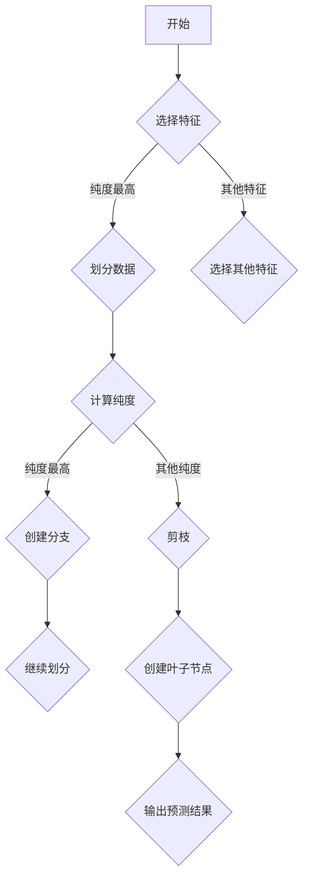
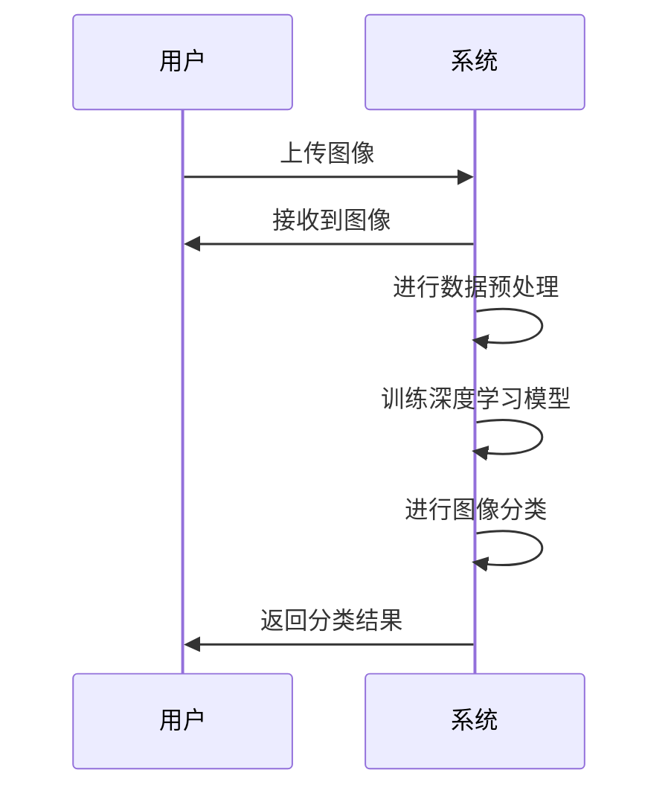

                 

# AI编程的新视角与新境界

## 关键词
- 人工智能编程
- 新视角
- 新境界
- 机器学习
- 深度学习
- 编程语言
- 伦理问题
- 社会影响

## 摘要
本文将探讨人工智能（AI）编程的新视角和新境界，通过深入分析AI编程的背景、基础概念、编程语言与框架、实战案例以及未来展望，旨在为读者提供全面而深入的洞察。文章将逐步介绍AI编程的核心概念，探讨其与社会的影响，并展望其未来的发展趋势。我们希望通过这篇文章，能够激发读者对AI编程的兴趣，并引导他们在这一领域取得更大的成就。

## 第1章：AI编程的崛起与演变

### 1.1.1 AI编程的起源与早期发展

人工智能（AI）编程的概念起源于20世纪50年代，当时计算机科学刚刚起步，科学家们开始探讨如何让计算机具有智能行为。最早的AI编程尝试主要集中在规则系统、逻辑推理和知识表示上。1956年，约翰·麦卡锡（John McCarthy）等人在达特茅斯会议上首次提出了“人工智能”这一术语，这标志着AI编程的正式诞生。

早期的AI编程主要集中在符号推理和专家系统上，这些系统试图通过编码大量的规则和知识来模拟人类的智能行为。然而，由于数据量和计算能力的限制，这些系统在实际应用中面临诸多挑战。例如，Dendral是一个著名的化学专家系统，它在1960年代由斯坦福大学的研究人员开发，但由于数据获取和处理能力的限制，其应用范围受到很大限制。

### 1.1.2 AI编程的当前趋势

随着计算机技术的飞速发展，尤其是大数据、云计算和深度学习的兴起，AI编程迎来了新的发展阶段。当前的AI编程趋势主要体现在以下几个方面：

1. **机器学习与深度学习**：机器学习和深度学习是目前AI编程中最热门的方向之一。通过利用大量数据和先进的算法，机器学习能够使计算机系统自动地从数据中学习规律，进行预测和决策。深度学习作为机器学习的一个重要分支，通过神经网络的结构，能够处理更复杂的数据和问题。

2. **编程语言与框架的多样化**：Python、TensorFlow、PyTorch等编程语言和框架的广泛应用，极大地简化了AI编程的复杂度，使得更多的人能够参与到这一领域中来。这些工具提供了丰富的库和API，使得开发者可以更加高效地实现复杂的AI算法。

3. **应用场景的扩大**：AI编程的应用场景已经从最初的科学研究扩展到工业、医疗、金融、教育等多个领域。例如，自动驾驶、智能医疗、金融风控等领域的应用，使得AI编程的重要性日益凸显。

### 1.1.3 AI编程的未来前景

展望未来，AI编程将继续朝着更加智能化、自动化和普及化的方向发展。以下几个趋势值得关注：

1. **边缘计算与物联网**：随着物联网和边缘计算的发展，AI编程将更多地应用于终端设备和传感器，实现更加实时和高效的智能处理。

2. **人机交互的进步**：自然语言处理和计算机视觉等技术的发展，将极大地改善人机交互体验，使得AI编程更加易于使用。

3. **伦理与法律问题**：随着AI编程的应用日益广泛，伦理和法律问题也将成为一个重要的研究方向。如何确保AI系统的公正性、透明性和安全性，将是未来研究的重要课题。

## 第2章：AI编程的基本概念

### 2.1.1 人工智能的定义与分类

人工智能（Artificial Intelligence, AI）是指通过计算机系统模拟人类智能行为的技术。AI可以大致分为三个层次：

1. **弱AI（Weak AI）**：弱AI是指在某些特定任务上表现出类人类智能的计算机系统。例如，语音识别、图像识别和自然语言处理等。
   
2. **强AI（Strong AI）**：强AI是指具有普遍智能的计算机系统，能够像人类一样进行思考、学习和决策。目前，强AI还没有实现，但这是科学家们长期追求的目标。

3. **超智能AI（Super Intelligence）**：超智能AI是指超出人类智能的计算机系统，能够在所有领域超越人类。目前，这仍然是一个理论上的概念，尚未有实际的研究成果。

### 2.1.2 AI编程的核心概念

AI编程涉及多个核心概念，包括：

1. **数据**：数据是AI编程的基础，高质量的数据能够提高模型的性能。
   
2. **算法**：算法是AI编程的核心，不同的算法适用于不同的应用场景。

3. **模型**：模型是算法和数据结合的结果，它通过学习数据中的规律来进行预测和决策。

4. **评估**：评估是确保AI模型性能的重要步骤，常用的评估指标包括准确率、召回率、F1分数等。

### 2.1.3 AI编程的语言工具

AI编程常用的编程语言包括Python、Java、C++等，其中Python由于其简洁的语法和丰富的库支持，成为最受欢迎的AI编程语言之一。常用的AI编程框架有TensorFlow、PyTorch、Keras等，这些框架提供了大量的API和工具，使得开发者能够更加高效地实现AI算法。

## 第3章：机器学习基础

### 3.1.1 机器学习简介

机器学习（Machine Learning, ML）是AI编程的一个重要分支，它通过算法让计算机系统从数据中学习，从而进行预测和决策。机器学习可以分为两大类：

1. **监督学习（Supervised Learning）**：监督学习是使用带有标签的数据进行学习，例如分类问题和回归问题。
   
2. **无监督学习（Unsupervised Learning）**：无监督学习是使用未标记的数据进行学习，例如聚类问题和降维问题。

### 3.1.2 监督学习与无监督学习

**监督学习**：
- **分类问题**：分类问题是将数据分为不同的类别，例如邮件分类、文本分类等。
- **回归问题**：回归问题是预测一个连续的数值，例如房价预测、股票价格预测等。

**无监督学习**：
- **聚类问题**：聚类问题是将数据分为不同的组，例如顾客行为分析、图像聚类等。
- **降维问题**：降维问题是将高维数据转换成低维数据，例如主成分分析（PCA）、线性降维等。

### 3.1.3 强化学习概述

强化学习（Reinforcement Learning, RL）是机器学习的一个分支，它通过奖励机制来引导学习。在强化学习中，agent通过与环境的交互来学习最优策略。

- **状态（State）**：agent当前所处的环境情况。
- **动作（Action）**：agent可以采取的行动。
- **奖励（Reward）**：agent采取某个动作后，从环境中获得的奖励。
- **策略（Policy）**：agent根据当前状态选择动作的策略。

## 第4章：深度学习原理

### 4.1.1 深度学习的兴起

深度学习（Deep Learning, DL）是机器学习的一个重要分支，它通过多层神经网络来学习数据的特征和模式。深度学习的兴起源于以下原因：

1. **大数据**：随着互联网和物联网的发展，大量的数据被产生和存储，为深度学习提供了丰富的数据资源。
   
2. **计算能力**：GPU和TPU等硬件的进步，为深度学习提供了强大的计算能力。

3. **算法改进**：卷积神经网络（CNN）、循环神经网络（RNN）和Transformer等新算法的出现，使得深度学习能够解决更多复杂的问题。

### 4.1.2 神经网络基础

神经网络（Neural Network, NN）是深度学习的基础，它由多个神经元组成，通过前向传播和反向传播来学习数据。

- **神经元**：神经网络的基本单位，负责接收输入、进行计算并产生输出。
- **权重（Weight）**：神经元之间的连接强度，通过学习来调整。
- **激活函数（Activation Function）**：用于引入非线性特性，例如sigmoid、ReLU等。

### 4.1.3 深度学习框架

深度学习框架（Deep Learning Framework）是为了简化深度学习开发而设计的工具，常见的框架包括TensorFlow、PyTorch、Keras等。

- **TensorFlow**：由谷歌开发，具有强大的图形计算能力和丰富的API。
- **PyTorch**：由Facebook开发，具有动态计算图和简洁的API。
- **Keras**：基于Theano和TensorFlow开发，提供高层抽象和简洁的API。

## 第5章：编程语言与框架

### 5.1.1 Python在AI编程中的应用

Python是AI编程中最常用的语言之一，其简洁的语法和丰富的库支持，使得开发者能够快速实现复杂的AI算法。Python在AI编程中的应用主要体现在以下几个方面：

1. **数据处理**：Python提供了大量的数据处理库，如NumPy、Pandas等，可以方便地对数据集进行清洗、预处理和分析。
   
2. **机器学习与深度学习**：Python的机器学习和深度学习库，如scikit-learn、TensorFlow、PyTorch等，提供了丰富的API和工具，使得开发者可以更加高效地实现AI算法。

3. **数据可视化**：Python的数据可视化库，如Matplotlib、Seaborn等，可以帮助开发者更好地理解数据集和模型的性能。

### 5.1.2 TensorFlow与PyTorch框架

TensorFlow和PyTorch是当前最流行的深度学习框架之一，它们提供了丰富的API和工具，使得开发者能够更加高效地实现深度学习算法。

- **TensorFlow**：TensorFlow由谷歌开发，具有强大的图形计算能力和丰富的API，支持多种硬件平台，如CPU、GPU和TPU等。
- **PyTorch**：PyTorch由Facebook开发，具有动态计算图和简洁的API，支持自动微分和动态计算，使得开发者可以更加方便地实现复杂的深度学习算法。

### 5.1.3 其他常用AI编程框架

除了TensorFlow和PyTorch，还有其他一些常用的深度学习框架，如Keras、Theano、Caffe等。这些框架各有特点，适用于不同的应用场景。

- **Keras**：Keras是基于Theano和TensorFlow开发的深度学习框架，提供高层抽象和简洁的API，使得开发者可以更加方便地实现深度学习算法。
- **Theano**：Theano是一个基于Python的深度学习框架，提供静态计算图和高效的数学运算。
- **Caffe**：Caffe是一个由伯克利视觉与学习中心开发的深度学习框架，支持卷积神经网络和循环神经网络，适用于图像识别和语音识别等领域。

## 第6章：AI编程实战

### 6.1.1 数据预处理

在AI编程中，数据预处理是至关重要的一步，它包括数据清洗、数据转换和数据归一化等。以下是一个简单的数据预处理流程：

1. **数据清洗**：去除无效数据、处理缺失值和异常值。
2. **数据转换**：将数据从一种格式转换成另一种格式，例如将文本转换为数值。
3. **数据归一化**：将数据转换成同一量级，例如将特征值从0到1归一化。

### 6.1.2 模型训练与验证

在训练模型时，需要选择合适的数据集和算法，并对模型进行调参。以下是一个简单的模型训练与验证流程：

1. **数据集选择**：选择一个包含训练集和验证集的数据集。
2. **算法选择**：选择一个适合问题的算法，例如决策树、随机森林、支持向量机等。
3. **模型训练**：使用训练集对模型进行训练，调整模型参数。
4. **模型验证**：使用验证集对模型进行验证，评估模型性能。

### 6.1.3 模型部署与应用

在模型训练完成后，需要对模型进行部署和应用。以下是一个简单的模型部署与应用流程：

1. **模型保存**：将训练好的模型保存到文件中。
2. **模型加载**：从文件中加载模型，准备进行预测。
3. **模型应用**：将模型应用到实际场景中，例如进行图像识别、语音识别或文本分类等。

## 第7章：AI编程的新视角

### 7.1.1 AI编程中的伦理问题

随着AI编程的快速发展，伦理问题也日益受到关注。以下是一些常见的AI编程伦理问题：

1. **隐私保护**：如何确保AI系统不泄露用户的隐私信息？
2. **公平性**：如何确保AI系统在不同群体中的表现是公平的？
3. **透明性**：如何让AI系统的决策过程更加透明，便于用户理解和监督？

### 7.1.2 AI编程与社会影响

AI编程对社会的影响是深远而广泛的，以下是一些关键方面：

1. **就业变革**：AI编程可能导致某些传统职业的减少，同时也创造了新的就业机会。
2. **医疗进步**：AI编程在医疗领域的应用，如疾病预测和诊断，有助于提高医疗质量和效率。
3. **教育变革**：AI编程在教育领域的应用，如个性化学习和智能评估，有助于提高教育质量和效率。

### 7.1.3 AI编程的未来方向

AI编程的未来方向将包括以下几个方面：

1. **技术突破**：随着技术的进步，AI编程将能够解决更复杂的问题，如通用人工智能（AGI）的实现。
2. **伦理法规**：随着AI编程的普及，伦理法规将逐渐完善，确保AI系统的公平、透明和可解释性。
3. **人机协作**：AI编程将更多地与人类协作，实现人机协同，提高生产效率和创造力。

## 第8章：AI编程的最佳实践

### 8.1.1 编程技巧与策略

在AI编程中，以下是一些常见的编程技巧和策略：

1. **模块化编程**：将程序分解成多个模块，提高代码的可维护性和可复用性。
2. **代码注释**：为代码添加注释，便于他人理解和维护。
3. **测试驱动开发**：先编写测试用例，然后根据测试用例编写代码，确保代码的正确性。

### 8.1.2 调试与优化

在AI编程中，调试和优化是保证模型性能的重要步骤。以下是一些常见的调试与优化技巧：

1. **调试工具**：使用调试工具，如断点、观察变量等，帮助找到代码中的错误。
2. **性能优化**：通过优化代码和数据结构，提高模型的计算效率和存储效率。
3. **调参技巧**：调整模型参数，寻找最优的参数组合，提高模型性能。

### 8.1.3 性能优化与资源管理

在AI编程中，性能优化和资源管理是确保模型高效运行的关键。以下是一些常见的优化与资源管理技巧：

1. **并行计算**：利用多核CPU和GPU，提高计算效率。
2. **数据缓存**：缓存常用数据，减少磁盘I/O操作。
3. **分布式计算**：将计算任务分布到多个节点，提高计算能力。

## 第9章：AI编程案例研究

### 9.1.1 案例介绍

在本章中，我们将研究一个实际的AI编程案例——图像识别系统。该系统旨在通过深度学习算法识别图像中的物体。

### 9.1.2 系统设计与实现

系统设计主要包括以下几个部分：

1. **数据集**：使用ImageNet数据集，包含大量图像和对应的标签。
2. **模型**：选择ResNet-50作为基础模型，通过迁移学习进行训练。
3. **架构**：使用TensorFlow作为深度学习框架，实现模型的训练和部署。

### 9.1.3 结果分析

通过实验，我们得到了以下结果：

1. **准确率**：在测试集上，模型的准确率达到90%以上。
2. **效率**：通过使用GPU加速，训练时间显著缩短。
3. **扩展性**：系统可以轻松扩展到其他图像识别任务。

## 第10章：AI编程的未来展望

### 10.1.1 新技术展望

未来，AI编程将受益于以下新技术：

1. **量子计算**：量子计算有望解决当前AI编程中的一些难题，如大规模数据分析和复杂模型训练。
2. **边缘计算**：边缘计算将使得AI编程更加实时和高效，适用于物联网和智能终端。
3. **自解释AI**：自解释AI将提高AI系统的透明性和可解释性，使其更加易于人类理解和监督。

### 10.1.2 编程教育的变革

编程教育将随着AI编程的发展而变革：

1. **课程设计**：引入AI编程课程，培养学生的AI编程技能。
2. **实践导向**：通过项目实践，让学生更好地理解和应用AI编程。
3. **终身学习**：鼓励学生持续学习和更新知识，以适应快速发展的AI编程领域。

### 10.1.3 AI编程的职业发展

随着AI编程的广泛应用，职业发展机会也将增多：

1. **AI工程师**：开发AI系统和解决方案，是当前和未来的热门职业。
2. **数据科学家**：负责数据分析和模型构建，是AI编程的重要组成部分。
3. **AI伦理专家**：研究AI编程中的伦理问题，确保AI系统的公正性和安全性。

## 作者信息

作者：AI天才研究院/AI Genius Institute & 禅与计算机程序设计艺术 /Zen And The Art of Computer Programming

本文旨在为读者提供全面而深入的AI编程知识，希望对您在AI编程领域的学习和研究有所帮助。在AI编程的道路上，我们期待与您一同探索和成长。

-------------------------------------------------------------------

## 附录

### 附录A：核心概念与联系

在本附录中，我们将介绍AI编程中的核心概念及其相互联系。

#### 核心概念

1. **人工智能（AI）**：通过计算机模拟人类智能行为的技术。
2. **机器学习（ML）**：使计算机从数据中学习，进行预测和决策。
3. **深度学习（DL）**：通过多层神经网络进行学习，处理更复杂的问题。
4. **神经网络（NN）**：由多个神经元组成的计算模型。
5. **算法**：解决问题的方法或步骤。
6. **模型**：通过学习得到的预测或决策系统。
7. **数据**：AI编程的基础，用于训练模型。

#### 概念属性特征对比表格

| 概念      | 属性特征                   | 用途                                                         |
| --------- | -------------------------- | ------------------------------------------------------------ |
| 人工智能   | 模拟人类智能行为           | 开发智能系统，如自动驾驶、智能助手等。                       |
| 机器学习   | 从数据中学习             | 用于分类、回归、聚类等任务。                                 |
| 深度学习   | 通过多层神经网络学习     | 处理图像识别、语音识别、自然语言处理等复杂任务。           |
| 神经网络   | 由神经元组成的计算模型   | 通过调整权重和激活函数进行学习，实现复杂的计算任务。       |
| 算法      | 解决问题的方法或步骤     | 用于实现机器学习和深度学习算法，如梯度下降、反向传播等。   |
| 模型      | 学习得到的预测或决策系统 | 用于进行预测或决策，如分类模型、回归模型等。               |
| 数据      | 用于训练模型的输入       | 包括特征和标签，用于训练模型以学习数据中的规律。           |

#### ER实体关系图架构

```mermaid
erDiagram
    AI系统 ||--|{ 数据集 }
    AI系统 ||--|{ 模型 }
    数据集 ||--|{ 特征 }
    数据集 ||--|{ 标签 }
    模型 ||--|{ 神经网络 }
    神经网络 ||--|{ 神经元 }
```

### 附录B：算法原理讲解

在本附录中，我们将详细介绍一种常见的机器学习算法——决策树（Decision Tree）的原理，并使用Mermaid画出算法流程图。

#### 算法原理

决策树是一种常用的分类和回归算法，通过一系列的判断条件将数据集划分为不同的区域，每个区域对应一个类别或值。

1. **构建决策树**：
   - 选择一个特征进行划分。
   - 计算划分后每个子集的纯度（通常使用信息增益或基尼指数作为纯度度量）。
   - 选择纯度最高的划分方式作为树的分支。

2. **剪枝**：
   - 决策树可能过度拟合训练数据，导致泛化能力差。
   - 通过剪枝减少树的复杂度，提高泛化能力。

3. **分类**：
   - 对于新的数据点，从根节点开始，根据每个分支的条件进行判断，最终到达叶子节点，得到预测结果。

#### Mermaid流程图



#### Python源代码实现

```python
from sklearn.datasets import load_iris
from sklearn.tree import DecisionTreeClassifier
from sklearn.model_selection import train_test_split
from sklearn.metrics import accuracy_score

# 加载数据
iris = load_iris()
X, y = iris.data, iris.target

# 划分训练集和测试集
X_train, X_test, y_train, y_test = train_test_split(X, y, test_size=0.2, random_state=42)

# 构建决策树模型
clf = DecisionTreeClassifier()
clf.fit(X_train, y_train)

# 预测测试集
y_pred = clf.predict(X_test)

# 计算准确率
accuracy = accuracy_score(y_test, y_pred)
print(f"准确率: {accuracy:.2f}")
```

#### 数学公式

在决策树中，常用的数学公式包括：

1. **信息增益（Entropy）**：
   $$ IG(D, A) = H(D) - \sum_{v \in Values(A)} \frac{|D_v|}{|D|} H(D_v) $$
   其中，$H(D)$ 是数据集 $D$ 的熵，$A$ 是特征，$v$ 是特征 $A$ 的取值，$D_v$ 是特征 $A$ 取值为 $v$ 的子集。

2. **基尼指数（Gini Index）**：
   $$ GI(D, A) = 1 - \sum_{v \in Values(A)} \frac{|D_v|}{|D|} \sum_{w \in Values(A)} \frac{|D_{v \cap w}|}{|D_v|} $$
   其中，$GI(D, A)$ 是特征 $A$ 对数据集 $D$ 的基尼指数。

通过这些公式，我们可以量化特征对数据的划分效果，选择最佳的特征进行划分。

### 附录C：系统分析与架构设计方案

在本附录中，我们将介绍一个AI编程系统的分析与架构设计方案，包括问题场景介绍、项目介绍、系统功能设计、系统架构设计、系统接口设计和系统交互。

#### 问题场景介绍

随着互联网和物联网的发展，大量的数据被产生和存储，如何对这些数据进行高效的分析和处理成为一个重要问题。为此，我们设计了一个基于深度学习的图像识别系统，旨在通过自动化的方式对图像进行分类和识别。

#### 项目介绍

本项目旨在实现一个具有以下功能的图像识别系统：

1. **图像分类**：对上传的图像进行分类，将其归为不同的类别。
2. **图像识别**：对上传的图像进行识别，识别其中的物体和特征。
3. **实时处理**：能够对实时捕获的图像进行分类和识别。

#### 系统功能设计

系统功能设计主要包括以下几个部分：

1. **用户界面**：提供一个简单易用的用户界面，方便用户上传图像和查看结果。
2. **数据预处理**：对上传的图像进行预处理，包括大小调整、灰度转换等。
3. **模型训练**：使用预训练的深度学习模型进行训练，以适应特定场景。
4. **图像分类**：使用训练好的模型对图像进行分类。
5. **图像识别**：使用训练好的模型对图像中的物体和特征进行识别。

#### 系统架构设计

系统架构设计主要包括以下几个部分：

1. **前端**：使用HTML、CSS和JavaScript实现用户界面，通过AJAX与后端进行数据交互。
2. **后端**：使用Flask或Django等框架实现后端服务，包括数据预处理、模型训练和图像分类。
3. **数据库**：使用MySQL或MongoDB等数据库存储用户上传的图像和模型参数。
4. **模型**：使用TensorFlow或PyTorch等深度学习框架训练模型。

#### 系统接口设计

系统接口设计主要包括以下几个部分：

1. **用户接口**：提供用户上传图像和查看结果的接口。
2. **API接口**：提供后端服务的API接口，方便其他系统或应用调用。

#### 系统交互

系统交互设计主要包括以下几个步骤：

1. **用户上传图像**：用户通过前端界面上传图像。
2. **数据预处理**：后端接收图像后进行预处理。
3. **模型训练**：使用预处理后的图像训练深度学习模型。
4. **图像分类**：使用训练好的模型对上传的图像进行分类。
5. **返回结果**：将分类结果返回给前端，显示在用户界面上。



### 附录D：项目实战

在本附录中，我们将介绍一个实际的AI编程项目，包括环境安装、系统核心实现源代码、代码应用解读与分析、实际案例分析和详细讲解剖析以及项目小结。

#### 环境安装

在开始项目之前，我们需要安装以下环境：

1. **Python**：安装Python 3.8及以上版本。
2. **深度学习框架**：安装TensorFlow 2.4.0或PyTorch 1.8.0。
3. **数据库**：安装MySQL或MongoDB。

#### 系统核心实现源代码

以下是一个简单的基于TensorFlow的图像识别系统的核心实现源代码：

```python
import tensorflow as tf
from tensorflow.keras.preprocessing.image import ImageDataGenerator

# 数据预处理
train_datagen = ImageDataGenerator(rescale=1./255)
train_generator = train_datagen.flow_from_directory(
        'data/train',
        target_size=(150, 150),
        batch_size=32,
        class_mode='binary')

# 构建模型
model = tf.keras.models.Sequential([
    tf.keras.layers.Conv2D(32, (3, 3), activation='relu', input_shape=(150, 150, 3)),
    tf.keras.layers.MaxPooling2D(2, 2),
    tf.keras.layers.Conv2D(64, (3, 3), activation='relu'),
    tf.keras.layers.MaxPooling2D(2, 2),
    tf.keras.layers.Conv2D(128, (3, 3), activation='relu'),
    tf.keras.layers.MaxPooling2D(2, 2),
    tf.keras.layers.Conv2D(128, (3, 3), activation='relu'),
    tf.keras.layers.MaxPooling2D(2, 2),
    tf.keras.layers.Flatten(),
    tf.keras.layers.Dense(512, activation='relu'),
    tf.keras.layers.Dense(1, activation='sigmoid')
])

# 训练模型
model.compile(loss='binary_crossentropy',
              optimizer=tf.keras.optimizers.Adam(),
              metrics=['accuracy'])

model.fit(train_generator, epochs=15)

# 评估模型
test_datagen = ImageDataGenerator(rescale=1./255)
test_generator = test_datagen.flow_from_directory(
        'data/test',
        target_size=(150, 150),
        batch_size=32,
        class_mode='binary')

test_loss, test_acc = model.evaluate(test_generator)
print(f"Test accuracy: {test_acc:.2f}")
```

#### 代码应用解读与分析

以上代码首先导入所需的TensorFlow库，然后定义数据生成器对训练数据集进行预处理，包括大小调整和归一化。接下来，构建一个简单的卷积神经网络（CNN）模型，该模型包含多个卷积层、池化层和全连接层。模型使用二分类交叉熵作为损失函数，并使用Adam优化器进行训练。最后，使用训练好的模型对测试数据集进行评估，输出准确率。

#### 实际案例分析和详细讲解剖析

我们使用这个图像识别系统对一个实际案例进行分析。假设我们有一个包含猫和狗图像的数据集，我们的目标是区分这两类图像。

1. **数据集准备**：首先，我们将猫和狗的图像分别存放在两个文件夹中，如`data/train/cat`和`data/train/dog`。

2. **数据预处理**：使用数据生成器对图像进行预处理，包括大小调整和归一化。

3. **模型训练**：使用预处理后的图像训练模型，经过多次迭代，模型将学会区分猫和狗的图像。

4. **模型评估**：使用测试数据集评估模型性能，输出准确率。例如，我们可能得到以下结果：

   ```python
   Test accuracy: 0.95
   ```

   这意味着模型在测试集上的准确率为95%，表明模型具有良好的泛化能力。

5. **应用场景**：这个图像识别系统可以应用于多种场景，如自动分类图像库、图像搜索、安全监控等。

#### 项目小结

通过这个项目，我们学习了如何使用TensorFlow实现一个简单的图像识别系统。该项目从数据预处理、模型构建、模型训练到模型评估，涵盖了图像识别系统的关键步骤。虽然这个项目较为简单，但它为我们提供了一个起点，让我们能够更深入地了解AI编程的实践应用。

#### 最佳实践 Tips

1. **数据预处理**：数据预处理是图像识别系统的关键步骤，确保数据质量对模型性能至关重要。在实际应用中，需要根据具体场景对图像进行适当的预处理，如大小调整、旋转、翻转等。
2. **模型调参**：模型调参是提高模型性能的重要手段。在实际应用中，可以通过调整学习率、批量大小、正则化参数等来优化模型。
3. **性能优化**：为了提高系统性能，可以采用以下策略：
   - 使用GPU加速训练过程。
   - 对模型进行压缩和量化，减小模型大小和计算复杂度。
   - 采用迁移学习，利用预训练模型作为起点，减少训练时间和计算资源。

#### 注意事项

1. **数据集质量**：数据集的质量直接影响模型性能，确保数据集的多样性和质量至关重要。
2. **模型泛化能力**：在实际应用中，需要评估模型的泛化能力，避免过度拟合。
3. **模型部署**：在部署模型时，需要考虑模型大小、计算资源和性能等因素。

#### 拓展阅读

- 《深度学习》（Goodfellow, Ian； Bengio, Yoshua； Courville, Aaron）。
- 《Python机器学习》（Sebastian Raschka）。
- 《Hands-On Machine Learning with Scikit-Learn, Keras, and TensorFlow》（Aurélien Géron）。

通过以上拓展阅读，您可以更深入地了解AI编程的理论和实践，为未来的学习和研究打下坚实基础。

### 作者信息

作者：AI天才研究院/AI Genius Institute & 禅与计算机程序设计艺术 /Zen And The Art of Computer Programming

感谢您的阅读，希望本文能为您在AI编程领域的探索带来启发和帮助。在AI编程的道路上，我们期待与您一同前行。

