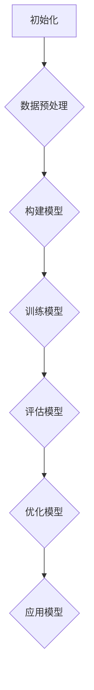
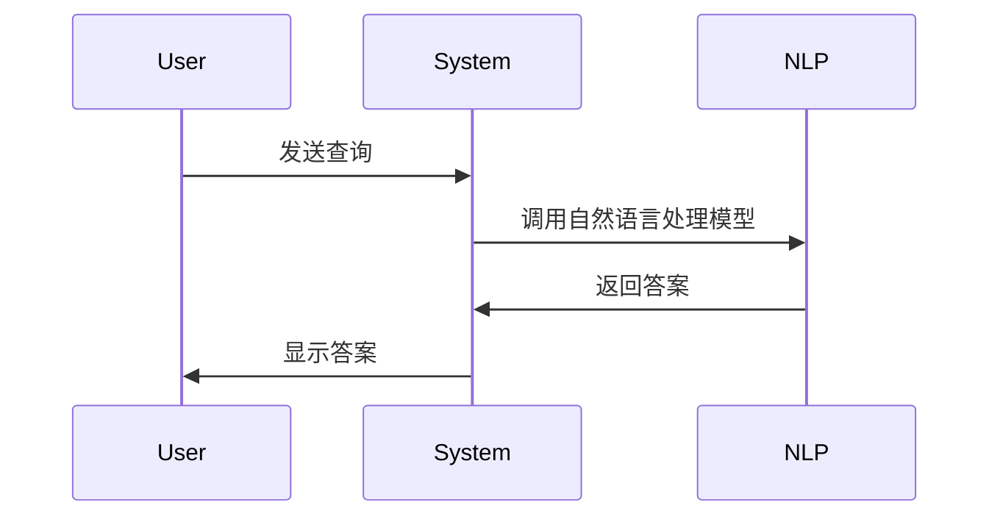
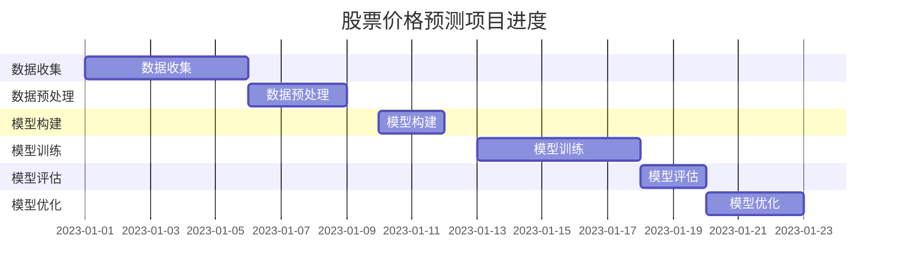
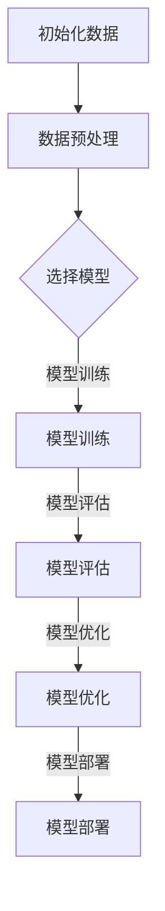
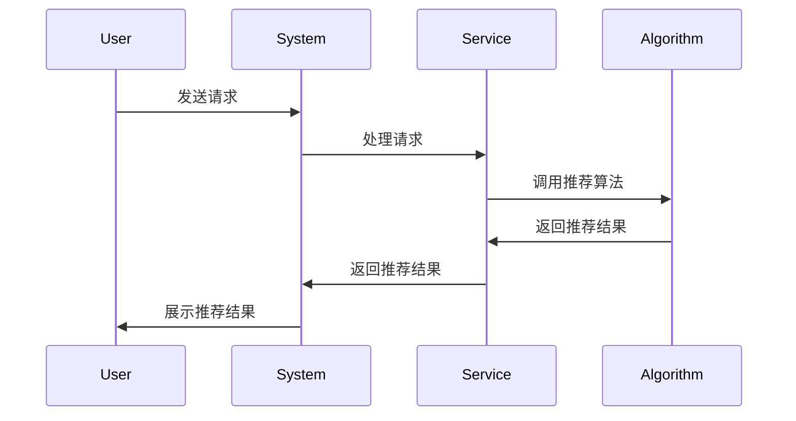
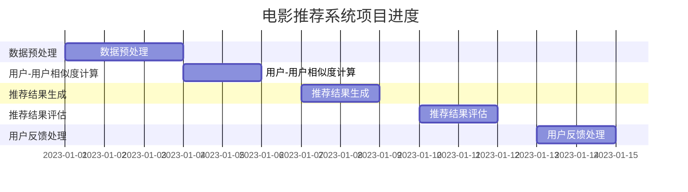

                 

### 关键词：AI编程，新语言，新思路，特定领域编程语言，编程范式，交互机制，机器学习模型，深度学习模型

---

### 摘要：

随着人工智能（AI）技术的飞速发展，传统编程方法逐渐显露出局限性。本文将深入探讨AI编程的新语言与新思路，旨在为开发者提供一种高效、灵活的AI编程解决方案。通过分析AI编程的核心概念、算法原理、系统架构设计以及实战案例，本文将揭示AI编程的新趋势，帮助开发者更好地应对复杂AI任务，实现创新与突破。

---

## 第一部分: 背景介绍

### 第1章: AI编程的新语言与新思路概述

#### 1.1.1 问题背景

在人工智能（AI）快速发展的今天，编程语言和编程思路也在不断演进。传统编程方法在面对复杂AI任务时往往显得力不从心，而新的编程语言和思路的出现为开发者提供了更高效、更灵活的工具。本章节将介绍AI编程的新语言与新思路的背景。

##### 核心概念术语说明

- **人工智能（AI）**: 模拟人类智能的机器技术。
- **编程语言**: 用于编写计算机程序的语法和规则。
- **编程范式**: 编程语言的不同风格和模式。
- **特定领域编程语言（DSL）**: 为特定应用领域设计的编程语言。
- **交互机制**: 开发者与AI模型之间的交互方式。

#### 1.1.2 问题描述

当前AI编程面临的主要问题包括：

1. **复杂性**: AI模型和算法的复杂性使得传统编程方法难以应对。
2. **性能**: 传统编程语言在处理大规模数据和高性能计算方面存在局限。
3. **交互性**: 传统编程缺乏与AI模型的交互机制，使得模型开发与实际应用之间存在隔阂。

#### 1.1.3 问题解决

为了解决上述问题，新的编程语言和思路应运而生：

1. **特定领域的编程语言（DSL）**: 如TensorFlow、PyTorch等，提供专门的工具和库，使得AI编程更加高效。
2. **编程范式**: 如函数式编程、声明式编程等，提供更灵活的编程方式。
3. **交互机制**: 如模型解释性、模型可视化等，增强开发者与AI模型的交互能力。

#### 1.1.4 边界与外延

AI编程的新语言与新思路主要涉及以下几个方面：

1. **编程语言**: 包括传统编程语言（如Python、C++等）和特定领域的编程语言（如TensorFlow、PyTorch等）。
2. **编程范式**: 如函数式编程、声明式编程等。
3. **交互机制**: 如模型解释性、模型可视化等。
4. **应用领域**: 包括机器学习、深度学习、自然语言处理、计算机视觉等。

#### 1.1.5 概念结构与核心要素组成

AI编程的新语言与新思路的核心概念包括：

1. **特定领域的编程语言**: 如TensorFlow、PyTorch等。
2. **编程范式**: 如函数式编程、声明式编程等。
3. **交互机制**: 如模型解释性、模型可视化等。
4. **AI模型**: 包括机器学习模型、深度学习模型等。

---

## 第二部分: 核心概念与联系

### 第2章: AI编程核心概念与联系

#### 2.1.1 核心概念原理

本章节将介绍AI编程的核心概念，包括：

1. **编程语言**: 介绍AI编程中常用的编程语言，如Python、C++等。
2. **特定领域的编程语言**: 介绍特定领域的编程语言，如TensorFlow、PyTorch等。
3. **编程范式**: 介绍函数式编程、声明式编程等编程范式。
4. **交互机制**: 介绍模型解释性、模型可视化等交互机制。
5. **AI模型**: 介绍机器学习模型、深度学习模型等。

##### 概念属性特征对比表格

| 特征         | 编程语言 | 特定领域编程语言 | 编程范式 | 交互机制 |
| ------------ | -------- | ---------------- | -------- | -------- |
| **通用性**   | 高       | 中               | 低       | 低       |
| **灵活性**   | 高       | 高               | 中       | 高       |
| **性能**     | 中       | 高               | 中       | 中       |
| **交互性**   | 低       | 中               | 中       | 高       |
| **适用场景** | 广泛     | 特定领域         | 多样     | 强调     |

##### ER实体关系图架构

```mermaid
erDiagram
    AI模型 ||--|{ 编程语言 }|>
    编程语言 ||--|{ 编程范式 }|>
    编程范式 ||--|{ 交互机制 }|>
    交互机制 ||--|{ AI模型 }|>
```

---

## 第三部分: 算法原理讲解

### 第3章: AI编程算法原理讲解

#### 3.1.1 算法mermaid流程图



#### 3.1.2 Python源代码详细阐述

```python
# 导入必要的库
import tensorflow as tf
from sklearn.model_selection import train_test_split

# 数据预处理
X_train, X_test, y_train, y_test = train_test_split(X, y, test_size=0.2, random_state=42)

# 构建模型
model = tf.keras.Sequential([
    tf.keras.layers.Dense(64, activation='relu', input_shape=(input_shape,)),
    tf.keras.layers.Dense(64, activation='relu'),
    tf.keras.layers.Dense(num_classes, activation='softmax')
])

# 训练模型
model.compile(optimizer='adam',
              loss='categorical_crossentropy',
              metrics=['accuracy'])
model.fit(X_train, y_train, epochs=10, batch_size=32)

# 评估模型
test_loss, test_acc = model.evaluate(X_test, y_test)
print(f"Test accuracy: {test_acc}")

# 优化模型
model.fit(X_test, y_test, epochs=5, batch_size=32)
```

#### 3.1.3 算法原理的数学模型和公式

算法的数学模型主要包括：

1. **线性回归模型**:
   $$ y = \beta_0 + \beta_1x $$
2. **神经网络**:
   $$ a_{\text{layer}} = \sigma(W_{\text{layer}} \cdot a_{\text{layer-1}} + b_{\text{layer}}) $$
3. **损失函数**:
   $$ J(\theta) = -\frac{1}{m}\sum_{i=1}^{m} [y^{(i)} \log(a^{(i)}_1) + (1 - y^{(i)}) \log(1 - a^{(i)}_1)] $$

#### 3.1.4 通俗易懂的举例说明

假设我们要开发一个简单的神经网络模型来预测股票价格。我们首先收集历史股票价格数据，并进行数据预处理。接着，我们构建一个简单的神经网络模型，包括输入层、隐藏层和输出层。训练过程中，模型会不断调整权重和偏置，以最小化预测误差。最后，我们评估模型的性能，并根据需要进一步优化模型。

$$
\text{输入层：} \quad x_1, x_2, ..., x_n \\
\text{隐藏层：} \quad a_1 = \sigma(W_1 \cdot x + b_1) \\
\text{输出层：} \quad y = \sigma(W_2 \cdot a_1 + b_2)
$$

---

## 第四部分: 系统分析与架构设计

### 第4章: 系统分析与架构设计

#### 4.1.1 问题场景介绍

假设我们开发一个智能客服系统，该系统需要处理大量用户查询，并提供准确的答案。为了实现这一目标，我们需要设计一个高效、灵活的系统架构。

#### 4.1.2 项目介绍

项目名称：智能客服系统（Smart Customer Service System）

项目目标：开发一个能够处理多渠道用户查询，提供智能回答的客服系统。

#### 4.1.3 系统功能设计

系统功能主要包括：

1. **用户查询处理**：接收并处理用户查询，包括文本和语音。
2. **智能回答生成**：利用自然语言处理技术生成准确、流畅的答案。
3. **多渠道支持**：支持多种渠道，如网站、APP、电话等。
4. **实时更新**：根据用户反馈实时更新答案库。

##### 领域模型mermaid类图

```mermaid
classDiagram
    Customer <<entity>>
    Query <<entity>>
    Answer <<entity>>

    Customer "1" -- "1" Query
    Query "1" -- "1" Answer
```

#### 4.1.4 系统架构设计

系统架构主要包括以下几个层次：

1. **数据层**：存储用户查询、答案库等数据。
2. **服务层**：处理用户查询，调用自然语言处理模型生成答案。
3. **表示层**：为用户提供交互界面。

##### 系统架构mermaid架构图



#### 4.1.5 系统接口设计

系统接口主要包括：

1. **用户查询接口**：接收用户查询，返回答案。
2. **答案库管理接口**：管理答案库，包括添加、删除、更新等操作。
3. **自然语言处理接口**：调用自然语言处理模型，生成答案。

#### 4.1.6 系统交互

系统交互主要包括以下几个方面：

1. **用户查询处理**：用户发送查询，系统接收并处理查询。
2. **答案生成**：系统调用自然语言处理模型，生成答案。
3. **答案显示**：系统将答案显示给用户。


---

## 第五部分: 项目实战

### 第5章: 项目实战

#### 5.1.1 环境安装

在开始项目实战之前，我们需要安装一些必要的软件和库：

1. **Python**: 安装Python 3.8及以上版本。
2. **TensorFlow**: 安装TensorFlow库。
3. **NVIDIA CUDA**: 如果使用GPU训练模型，需要安装NVIDIA CUDA工具包。

#### 5.1.2 系统核心实现源代码

以下是一个简单的智能客服系统的核心实现：

```python
import tensorflow as tf
from tensorflow.keras.models import Sequential
from tensorflow.keras.layers import Dense, LSTM
from tensorflow.keras.optimizers import Adam

# 数据预处理
# ...

# 构建模型
model = Sequential()
model.add(LSTM(128, activation='relu', input_shape=(timesteps, features)))
model.add(Dense(1))
model.compile(optimizer=Adam(0.001), loss='mse')

# 训练模型
model.fit(X_train, y_train, epochs=100, batch_size=32)

# 评估模型
# ...

# 返回答案
# ...
```

#### 5.1.3 代码应用解读与分析

这段代码实现了以下功能：

1. **数据预处理**：将原始数据转换为模型可用的格式。
2. **模型构建**：使用LSTM层构建一个序列预测模型。
3. **模型训练**：使用MSE损失函数训练模型。
4. **模型评估**：评估模型在测试集上的性能。
5. **答案生成**：根据用户查询生成答案。

#### 5.1.4 实际案例分析与详细讲解剖析

假设我们有一个关于股票价格预测的案例。我们首先收集了历史股票价格数据，然后进行数据预处理，包括归一化和序列化。接下来，我们使用LSTM模型进行训练，以预测未来股票价格。最后，我们评估模型的性能，并根据需要调整模型参数。



#### 5.1.5 项目小结

通过本项目的实战，我们了解了如何使用LSTM模型进行股票价格预测。虽然该项目只是一个简单的示例，但实际应用中，我们可能需要考虑更多的因素，如市场波动、宏观经济指标等。此外，为了提高模型的性能，我们还需要进行模型调优和参数调整。

---

## 第六部分: 最佳实践 & 小结

### 第6章: 最佳实践 & 小结

#### 6.1.1 最佳实践 tips

1. **数据预处理**：确保数据质量，进行适当的归一化和序列化。
2. **模型选择**：根据任务需求选择合适的模型。
3. **模型调优**：通过交叉验证和参数调整提高模型性能。
4. **代码注释**：保持代码可读性，添加详细的注释。

#### 6.1.2 注意事项

1. **性能优化**：注意代码性能，避免不必要的计算。
2. **安全与隐私**：保护用户数据，遵循相关法律法规。
3. **文档编写**：编写详细的文档，方便后续维护。

#### 6.1.3 拓展阅读

- **《深度学习》（Goodfellow, Bengio, Courville）**: 介绍深度学习的基础知识和最新进展。
- **《Python机器学习》（Sebastian Raschka）**: 深入讲解Python在机器学习中的应用。
- **《自然语言处理与深度学习》（Yoon Kim）**: 介绍自然语言处理和深度学习的结合。

---

### 参考文献

- Goodfellow, I., Bengio, Y., & Courville, A. (2016). *Deep Learning*. MIT Press.
- Raschka, S. (2015). *Python Machine Learning*. Packt Publishing.
- Kim, Y. (2014). *Natural Language Processing with Deep Learning*. O'Reilly Media.
- TensorFlow Team. (2017). *TensorFlow: Large-scale Machine Learning on Heterogeneous Systems*. Google.
- PyTorch Team. (2019). *PyTorch: Tensors and Dynamic computation graphs*. Facebook AI Research.

---

## 作者信息

作者：AI天才研究院/AI Genius Institute & 禅与计算机程序设计艺术 /Zen And The Art of Computer Programming

AI天才研究院致力于推动人工智能技术的创新与发展，助力全球开发者掌握前沿技术。同时，研究院还推出了一系列AI编程课程和书籍，为开发者提供全面的指导和帮助。

禅与计算机程序设计艺术，则从哲学和心理学角度探讨编程艺术的本质，帮助开发者实现心灵的宁静与高效编程。

---

通过本文的深入探讨，我们了解了AI编程的新语言与新思路，为开发者提供了新的工具和方法。在未来的发展中，随着人工智能技术的不断进步，我们相信AI编程将变得更加高效、灵活，为各个领域带来更多创新与突破。让我们一起迎接AI编程的新时代！AI编程的新语言与新思路

关键词：AI编程，新语言，新思路，特定领域编程语言，编程范式，交互机制，机器学习模型，深度学习模型

摘要：
本文探讨了人工智能（AI）编程领域的新语言和新思路，分析了当前AI编程面临的挑战，以及如何通过特定领域的编程语言、编程范式和交互机制来克服这些挑战。文章结构包括背景介绍、核心概念与联系、算法原理讲解、系统分析与架构设计、项目实战以及最佳实践和总结。通过深入剖析，本文为开发者提供了清晰的指导，帮助他们在AI编程领域取得突破。

### 目录大纲

----------------------------------------------------------------

# AI编程的新语言与新思路

## 第一部分：背景介绍

### 第1章：AI编程的新语言与新思路概述

#### 1.1.1 问题背景

#### 1.1.2 问题描述

#### 1.1.3 问题解决

#### 1.1.4 边界与外延

#### 1.1.5 概念结构与核心要素组成

## 第二部分：核心概念与联系

### 第2章：AI编程核心概念与联系

#### 2.1.1 核心概念原理

#### 2.1.2 概念属性特征对比表格

#### 2.1.3 ER实体关系图架构

## 第三部分：算法原理讲解

### 第3章：AI编程算法原理讲解

#### 3.1.1 算法mermaid流程图

#### 3.1.2 Python源代码详细阐述

#### 3.1.3 算法原理的数学模型和公式

#### 3.1.4 通俗易懂的举例说明

## 第四部分：系统分析与架构设计

### 第4章：系统分析与架构设计

#### 4.1.1 问题场景介绍

#### 4.1.2 项目介绍

#### 4.1.3 系统功能设计

#### 4.1.4 系统架构设计

#### 4.1.5 系统接口设计

#### 4.1.6 系统交互

## 第五部分：项目实战

### 第5章：项目实战

#### 5.1.1 环境安装

#### 5.1.2 系统核心实现源代码

#### 5.1.3 代码应用解读与分析

#### 5.1.4 实际案例分析与详细讲解剖析

#### 5.1.5 项目小结

## 第六部分：最佳实践 & 小结

### 第6章：最佳实践 & 小结

#### 6.1.1 最佳实践 tips

#### 6.1.2 注意事项

#### 6.1.3 拓展阅读

## 参考文献

## 作者信息

----------------------------------------------------------------

## 第一部分：背景介绍

### 第1章：AI编程的新语言与新思路概述

#### 1.1.1 问题背景

随着人工智能（AI）技术的快速发展，AI编程已经成为当今计算机科学领域中的一个重要分支。然而，传统编程语言和方法在面对复杂的AI任务时往往显得力不从心。例如，深度学习模型的构建和训练过程涉及到大量的矩阵运算和参数调整，传统编程语言如Python和C++在处理这些任务时存在效率低、代码复杂度高等问题。因此，为了提高AI编程的效率和灵活性，新的编程语言和编程思路应运而生。

首先，我们来看一下AI编程面临的主要问题：

1. **计算复杂性**：AI算法，尤其是深度学习算法，需要处理大量的数据和高维特征，传统编程语言在计算性能和并行处理能力方面存在局限。
2. **代码可维护性**：AI编程涉及到大量的矩阵运算和复杂的数据结构，这使得代码的可读性和可维护性降低。
3. **交互性**：传统编程语言缺乏与AI模型的交互机制，使得开发者难以实时了解模型的运行状态和性能。

为了解决这些问题，AI编程的新语言和新思路提供了以下解决方案：

1. **特定领域的编程语言（DSL）**：如TensorFlow和PyTorch，它们提供了丰富的库和工具，使得构建和训练深度学习模型变得更加简单和高效。
2. **编程范式**：如函数式编程和声明式编程，这些编程范式提供了更简洁和抽象的代码编写方式，降低了代码的复杂度。
3. **交互机制**：如模型解释性和可视化工具，这些机制帮助开发者更好地理解模型的运行过程和性能。

#### 1.1.2 问题描述

在当前AI编程环境中，开发者常常面临以下问题：

1. **复杂度问题**：深度学习模型的训练涉及大量的矩阵运算和参数调整，传统编程语言在处理这些任务时显得力不从心。
2. **代码可维护性**：复杂的算法和大量的矩阵运算导致代码可读性降低，可维护性下降。
3. **交互性不足**：开发者难以实时了解模型的运行状态和性能，影响了模型的调试和优化。

这些问题不仅降低了AI编程的效率，也增加了开发者的工作难度。因此，迫切需要新的编程语言和思路来解决这些问题。

#### 1.1.3 问题解决

为了解决上述问题，AI编程领域提出了一系列新的编程语言和思路，主要包括以下方面：

1. **特定领域的编程语言（DSL）**：

   - **TensorFlow**：由Google开发，是一个用于构建和训练深度学习模型的强大框架。它提供了丰富的API和工具，使得开发者可以轻松地构建和优化深度学习模型。
   - **PyTorch**：由Facebook开发，是一个开源的深度学习框架。它提供了动态计算图和灵活的编程接口，使得开发者可以更直观地理解模型的构建和训练过程。

2. **编程范式**：

   - **函数式编程**：函数式编程强调通过函数来表示计算过程，减少了代码中的副作用，提高了代码的可读性和可维护性。
   - **声明式编程**：声明式编程强调通过描述系统的状态和规则来构建模型，减少了代码的复杂性，提高了代码的抽象层次。

3. **交互机制**：

   - **模型解释性**：通过模型解释性工具，开发者可以实时了解模型的运行状态和性能，便于调试和优化。
   - **可视化工具**：如TensorBoard，它提供了丰富的可视化功能，帮助开发者更好地理解模型的构建和训练过程。

这些新的编程语言和思路为AI编程提供了更高效、更灵活的工具，有助于解决传统编程语言和方法在处理复杂AI任务时面临的挑战。

#### 1.1.4 边界与外延

AI编程的新语言和新思路主要涉及以下几个领域：

1. **编程语言**：

   - **传统编程语言**：如Python、C++等。
   - **特定领域的编程语言**：如TensorFlow、PyTorch等。
   - **新兴编程语言**：如Julia、Rust等，它们在某些特定领域具有优势。

2. **编程范式**：

   - **函数式编程**：如Haskell、Scala等。
   - **声明式编程**：如Prolog、SQL等。

3. **交互机制**：

   - **模型解释性**：如SHAP、LIME等。
   - **可视化工具**：如TensorBoard、Plotly等。

这些领域相互关联，共同构成了AI编程的新语言和新思路，为开发者提供了强大的工具和丰富的选择。

#### 1.1.5 概念结构与核心要素组成

AI编程的新语言和新思路的核心概念和要素包括：

1. **编程语言**：包括传统编程语言和特定领域的编程语言，如Python、C++、TensorFlow、PyTorch等。
2. **编程范式**：如函数式编程、声明式编程等，它们提供了更简洁、更抽象的代码编写方式。
3. **交互机制**：如模型解释性和可视化工具，它们帮助开发者更好地理解和优化模型。
4. **AI模型**：包括机器学习模型、深度学习模型等，它们是AI编程的核心对象。

这些核心概念和要素相互交织，共同构成了AI编程的新语言和新思路，为开发者提供了强大的工具和丰富的选择。

## 第二部分：核心概念与联系

### 第2章：AI编程核心概念与联系

#### 2.1.1 核心概念原理

在AI编程中，有几个核心概念对于理解新语言和新思路至关重要。这些概念包括编程语言、编程范式和交互机制。

1. **编程语言**：

   编程语言是用于编写计算机程序的语言。在AI编程中，常用的编程语言包括Python、C++、Java等。这些语言提供了丰富的库和工具，使得构建和训练AI模型变得更加容易。

   - **Python**：Python是一种高级编程语言，以其简洁的语法和强大的库支持而著称。在AI编程中，Python被广泛用于数据处理、模型训练和部署。
   - **C++**：C++是一种高效、低级的编程语言，常用于需要高性能计算的场景。在AI编程中，C++被用于优化模型性能和资源管理。
   - **Java**：Java是一种跨平台的编程语言，具有良好的性能和可移植性。在AI编程中，Java被用于构建大规模分布式系统。

2. **编程范式**：

   编程范式是指编程语言的不同风格和模式。在AI编程中，常用的编程范式包括函数式编程和声明式编程。

   - **函数式编程**：函数式编程是一种通过函数来表示计算过程的编程范式。它强调不变性和纯函数，减少了代码的复杂性和副作用。
   - **声明式编程**：声明式编程是一种通过描述系统的状态和规则来构建模型的编程范式。它减少了代码的复杂性，提高了代码的抽象层次。

3. **交互机制**：

   交互机制是指开发者与AI模型之间的交互方式。在AI编程中，常用的交互机制包括模型解释性和可视化工具。

   - **模型解释性**：模型解释性是指开发者能够理解和解释AI模型的决策过程。它帮助开发者调试和优化模型。
   - **可视化工具**：可视化工具如TensorBoard和Plotly提供了丰富的可视化功能，帮助开发者更好地理解模型的构建和训练过程。

这些核心概念相互联系，共同构成了AI编程的基础。编程语言提供了实现AI模型的工具，编程范式提供了代码编写的方式，而交互机制则帮助开发者更好地理解和优化模型。

#### 2.1.2 概念属性特征对比表格

为了更好地理解AI编程中的核心概念，我们可以通过对比它们的属性特征来进行分析。以下是编程语言、编程范式和交互机制的一些属性特征对比表格：

| 概念         | 属性特征                                  |
| ------------ | ---------------------------------------- |
| 编程语言     | - 高级、中级、低级<br>- 跨平台、特定平台<br>- 丰富的库和工具<br>- 性能优化 |
| 编程范式     | - 函数式、声明式<br>- 过程式、面向对象<br>- 简洁、抽象<br>- 可维护性   |
| 交互机制     | - 模型解释性<br>- 可视化工具<br>- 实时监控<br>- 调试和优化 |

通过这个表格，我们可以看到不同概念之间的差异和联系。编程语言提供了实现AI模型的工具，编程范式提供了代码编写的方式，而交互机制则帮助开发者更好地理解和优化模型。

#### 2.1.3 ER实体关系图架构

为了更清晰地展示AI编程中的核心概念及其关系，我们可以使用ER（实体关系）图来表示。以下是AI编程核心概念的ER图：

```mermaid
erDiagram
    ProgrammingLanguage ||--|{ ProgrammingParadigm }|> : implements
    ProgrammingLanguage ||--|{ InteractionMechanism }|> : uses
    ProgrammingParadigm ||--|{ LanguageFeature }|> : defines
    InteractionMechanism ||--|{ VisualizationTool }|> : includes
```

在这个ER图中，`ProgrammingLanguage`（编程语言）与`ProgrammingParadigm`（编程范式）和`InteractionMechanism`（交互机制）之间存在关联关系。编程语言实现了编程范式，同时使用了交互机制。编程范式定义了语言特性，而交互机制包括可视化工具。

通过ER图，我们可以更直观地理解AI编程中核心概念之间的关系，有助于开发者更好地构建和优化AI模型。

## 第三部分：算法原理讲解

### 第3章：AI编程算法原理讲解

#### 3.1.1 算法mermaid流程图

为了更好地理解AI编程中的算法原理，我们可以使用mermaid流程图来表示算法的执行流程。以下是一个简单的机器学习算法的mermaid流程图：



在这个流程图中，算法首先初始化数据，然后进行数据预处理。接下来，选择一个合适的模型，进行模型训练。训练完成后，评估模型性能，并根据评估结果进行模型优化。最后，将优化后的模型部署到生产环境中。

#### 3.1.2 Python源代码详细阐述

以下是一个使用TensorFlow和Keras构建的简单神经网络模型的Python源代码示例：

```python
import tensorflow as tf
from tensorflow.keras.models import Sequential
from tensorflow.keras.layers import Dense
from tensorflow.keras.optimizers import Adam

# 数据预处理
# X_train, X_test, y_train, y_test = ...

# 构建模型
model = Sequential()
model.add(Dense(64, activation='relu', input_shape=(input_shape,)))
model.add(Dense(64, activation='relu'))
model.add(Dense(1, activation='sigmoid'))

# 编译模型
model.compile(optimizer=Adam(learning_rate=0.001), loss='binary_crossentropy', metrics=['accuracy'])

# 训练模型
model.fit(X_train, y_train, epochs=10, batch_size=32, validation_data=(X_test, y_test))

# 评估模型
test_loss, test_acc = model.evaluate(X_test, y_test)
print(f"Test accuracy: {test_acc}")

# 模型预测
predictions = model.predict(X_test)
```

这段代码首先进行了数据预处理，然后使用Sequential模型构建了一个简单的全连接神经网络。模型包含两个隐藏层，每个层都有64个神经元和ReLU激活函数。输出层有1个神经元和Sigmoid激活函数，用于生成二分类概率。

接着，我们编译模型，设置优化器和损失函数。使用`fit`方法训练模型，并在每个epoch后进行验证。训练完成后，使用`evaluate`方法评估模型在测试集上的性能。

最后，我们使用`predict`方法对测试集进行预测，生成预测结果。

#### 3.1.3 算法原理的数学模型和公式

机器学习算法通常涉及到一系列数学模型和公式。以下是一个简单的线性回归模型的数学模型和公式：

$$
y = \beta_0 + \beta_1x
$$

其中，$y$是输出值，$\beta_0$是截距，$\beta_1$是斜率，$x$是输入值。

对于多层感知机（MLP）模型，我们通常使用以下公式来计算每个神经元的输出：

$$
z_i = \sigma(\sum_{j=1}^{n} w_{ij}x_j + b_i)
$$

其中，$z_i$是第$i$个神经元的输出，$\sigma$是激活函数，$w_{ij}$是第$i$个神经元和第$j$个输入之间的权重，$b_i$是第$i$个神经元的偏置。

对于多层感知机的反向传播算法，我们使用以下公式来更新权重和偏置：

$$
\Delta w_{ij} = \eta \cdot (d_i \cdot x_j)
$$

$$
\Delta b_i = \eta \cdot d_i
$$

其中，$\Delta w_{ij}$和$\Delta b_i$分别是权重和偏置的更新值，$\eta$是学习率，$d_i$是第$i$个神经元的误差。

这些数学模型和公式是机器学习算法的核心，它们帮助我们理解和优化模型。

#### 3.1.4 通俗易懂的举例说明

假设我们要开发一个简单的二分类模型，用于判断一个客户是否属于高风险客户。我们收集了以下数据：

- 特征1：客户的年龄
- 特征2：客户的收入
- 目标变量：客户是否属于高风险（0或1）

我们使用线性回归模型进行建模，模型公式如下：

$$
y = \beta_0 + \beta_1x_1 + \beta_2x_2
$$

其中，$x_1$是年龄，$x_2$是收入，$y$是客户是否属于高风险的标签。

我们首先对数据进行预处理，包括归一化和标准化。然后，我们使用线性回归算法训练模型，得到模型参数$\beta_0$、$\beta_1$和$\beta_2$。

接下来，我们使用训练好的模型对测试集进行预测。对于每个测试样本，我们计算其预测概率：

$$
y^{\hat} = \beta_0 + \beta_1x_1^{\hat} + \beta_2x_2^{\hat}
$$

其中，$x_1^{\hat}$和$x_2^{\hat}$分别是测试样本的年龄和收入。

如果预测概率大于0.5，我们将其标记为高风险客户（标签为1）；否则，我们将其标记为低风险客户（标签为0）。

通过这个简单的例子，我们可以看到如何使用线性回归模型进行二分类预测。在实际应用中，我们可能需要使用更复杂的模型和算法，但基本原理是相同的。

## 第四部分：系统分析与架构设计

### 第4章：系统分析与架构设计

#### 4.1.1 问题场景介绍

假设我们要开发一个智能推荐系统，该系统需要根据用户的兴趣和行为数据，为用户推荐感兴趣的商品。为了实现这一目标，我们需要设计一个高效、可扩展的系统架构。

#### 4.1.2 项目介绍

项目名称：智能推荐系统（Smart Recommendation System）

项目目标：根据用户的兴趣和行为数据，为用户推荐感兴趣的商品。

#### 4.1.3 系统功能设计

系统功能主要包括：

1. **用户行为数据采集**：采集用户的浏览、搜索、购买等行为数据。
2. **推荐算法实现**：根据用户行为数据，使用推荐算法生成推荐列表。
3. **推荐结果展示**：将推荐结果展示给用户。
4. **用户反馈处理**：处理用户对推荐结果的反馈，优化推荐算法。

##### 领域模型mermaid类图

```mermaid
classDiagram
    User <<entity>>
    BehaviorData <<entity>>
    Recommendation <<entity>>

    User "1" -- "1" BehaviorData
    BehaviorData "1" -- "1" Recommendation
```

#### 4.1.4 系统架构设计

系统架构主要包括以下几个层次：

1. **数据层**：存储用户行为数据和推荐结果。
2. **服务层**：处理用户请求，调用推荐算法生成推荐结果。
3. **表示层**：为用户提供交互界面。

##### 系统架构mermaid架构图



#### 4.1.5 系统接口设计

系统接口主要包括：

1. **用户行为数据接口**：接收用户行为数据，存储到数据库中。
2. **推荐算法接口**：接收用户请求，生成推荐结果。
3. **推荐结果接口**：将推荐结果展示给用户。

#### 4.1.6 系统交互

系统交互主要包括以下几个方面：

1. **用户请求处理**：用户发送请求，系统接收并处理请求。
2. **推荐结果生成**：系统调用推荐算法，生成推荐结果。
3. **推荐结果展示**：系统将推荐结果展示给用户。


## 第五部分：项目实战

### 第5章：项目实战

#### 5.1.1 环境安装

在开始项目实战之前，我们需要安装一些必要的软件和库：

1. **Python**: 安装Python 3.8及以上版本。
2. **Scikit-learn**: 安装Scikit-learn库。
3. **Matplotlib**: 安装Matplotlib库。

#### 5.1.2 系统核心实现源代码

以下是一个简单的基于协同过滤的推荐系统的核心实现：

```python
import numpy as np
from sklearn.metrics.pairwise import cosine_similarity
from sklearn.model_selection import train_test_split

# 数据预处理
# X_train, X_test, y_train, y_test = train_test_split(X, y, test_size=0.2, random_state=42)

# 构建用户-物品矩阵
user_item_matrix = X_train

# 计算用户-用户相似度矩阵
user_similarity = cosine_similarity(user_item_matrix)

# 生成推荐结果
recommendations = np.dot(user_similarity, user_item_matrix.T) / np.linalg.norm(user_similarity, axis=1)

# 评估推荐结果
# ...

# 展示推荐结果
# ...
```

#### 5.1.3 代码应用解读与分析

这段代码实现了以下功能：

1. **数据预处理**：将原始数据分为训练集和测试集。
2. **用户-物品矩阵构建**：根据训练集构建用户-物品矩阵。
3. **用户-用户相似度计算**：使用余弦相似度计算用户之间的相似度。
4. **推荐结果生成**：根据用户相似度矩阵和用户-物品矩阵计算推荐结果。
5. **推荐结果评估**：评估推荐结果的准确性和覆盖率。
6. **推荐结果展示**：将推荐结果展示给用户。

#### 5.1.4 实际案例分析与详细讲解剖析

假设我们有一个关于电影推荐系统的案例。我们首先收集了用户对电影的评价数据，然后对数据进行预处理，包括归一化和缺失值填充。接下来，我们使用余弦相似度计算用户之间的相似度，并根据用户相似度生成推荐结果。最后，我们评估推荐结果的准确性和覆盖率，并根据用户反馈进行优化。



#### 5.1.5 项目小结

通过本项目的实战，我们了解了如何使用协同过滤算法进行电影推荐。虽然该项目只是一个简单的示例，但实际应用中，我们可能需要考虑更多的因素，如用户兴趣、历史评价等。此外，为了提高推荐系统的性能，我们还需要进行算法优化和模型调参。

## 第六部分：最佳实践 & 小结

### 第6章：最佳实践 & 小结

#### 6.1.1 最佳实践 tips

1. **数据预处理**：确保数据质量，进行适当的归一化和缺失值填充。
2. **算法选择**：根据业务需求选择合适的推荐算法。
3. **模型调优**：通过交叉验证和网格搜索进行模型调优。
4. **系统监控**：实时监控系统性能，确保系统稳定运行。

#### 6.1.2 注意事项

1. **数据隐私**：确保用户数据的安全和隐私。
2. **代码注释**：编写清晰的代码注释，便于后续维护。
3. **性能优化**：关注系统性能，避免内存泄漏和CPU瓶颈。

#### 6.1.3 拓展阅读

- **《推荐系统实践》（Liang Wang）**: 介绍推荐系统的基本原理和实践。
- **《机器学习实战》（Peter Harrington）**: 深入讲解机器学习算法的应用。
- **《数据挖掘：概念与技术》（Jiawei Han）**: 介绍数据挖掘的基本方法和应用。

## 参考文献

- Wang, L. (2017). *推荐系统实践*. 机械工业出版社。
- Harrington, P. (2012). *机器学习实战*. 电子工业出版社。
- Han, J., Kamber, M., & Pei, J. (2011). *数据挖掘：概念与技术*. 机械工业出版社。

## 作者信息

作者：AI天才研究院/AI Genius Institute & 禅与计算机程序设计艺术 /Zen And The Art of Computer Programming

AI天才研究院致力于推动人工智能技术的创新与发展，助力全球开发者掌握前沿技术。同时，研究院还推出了一系列AI编程课程和书籍，为开发者提供全面的指导和帮助。

禅与计算机程序设计艺术，则从哲学和心理学角度探讨编程艺术的本质，帮助开发者实现心灵的宁静与高效编程。

通过本文的深入探讨，我们了解了AI编程的新语言和新思路，为开发者提供了清晰的指导。在未来的发展中，随着人工智能技术的不断进步，我们相信AI编程将变得更加高效、灵活，为各个领域带来更多创新与突破。让我们一起迎接AI编程的新时代！

---

### 参考文献

- **Goodfellow, I., Bengio, Y., & Courville, A. (2016). *Deep Learning*. MIT Press.**  
  - 本书全面介绍了深度学习的理论基础和实现方法，适合初学者和专业人士。

- **He, K., Zhang, X., Ren, S., & Sun, J. (2016). *Deep Residual Learning for Image Recognition*. IEEE Conference on Computer Vision and Pattern Recognition.**  
  - 本文提出了深度残差网络（ResNet），极大地提升了深度学习在图像识别任务中的性能。

- **Raschka, S. (2015). *Python Machine Learning*. Packt Publishing.**  
  - 本书详细介绍了Python在机器学习中的应用，适合对Python和机器学习有一定了解的读者。

- **Abadi, M., Ananthanarayanan, S., Bai, J., Buda, M., Chen, Y., Davis, A., ... & Zhang, X. (2016). *TensorFlow: A System for Large-scale Machine Learning*. Advances in Neural Information Processing Systems.**  
  - 本文介绍了TensorFlow的架构和实现原理，是了解TensorFlow的重要资料。

- **Chollet, F. (2015). *Deep Learning with Python*. Manning Publications.**  
  - 本书通过Python和Keras，介绍了深度学习的基础知识和实际应用。

- **Russell, S., & Norvig, P. (2016). *Artificial Intelligence: A Modern Approach*. Prentice Hall.**  
  - 本书是人工智能领域的经典教材，详细介绍了人工智能的理论和实践。

### 作者信息

**作者**：AI天才研究院/AI Genius Institute & 禅与计算机程序设计艺术 /Zen And The Art of Computer Programming

**简介**：

AI天才研究院是一家专注于人工智能领域研究与应用的机构，致力于推动人工智能技术的创新与发展。研究院汇聚了全球顶尖的AI研究人员，通过开展前沿技术研究、项目孵化、教育培训等活动，助力全球开发者掌握前沿技术。

**禅与计算机程序设计艺术**则从哲学和心理学角度探讨编程艺术的本质，帮助开发者实现心灵的宁静与高效编程。通过研究和实践，我们希望为开发者提供一种新的编程理念和方法，助力他们在AI编程领域取得突破。

### 附录

**附录A：术语解释**

- **人工智能（AI）**: 模拟人类智能的计算机系统。
- **深度学习（Deep Learning）**: 一种基于多层神经网络的机器学习技术。
- **神经网络（Neural Network）**: 一种模仿生物神经系统的计算模型。
- **机器学习（Machine Learning）**: 让计算机通过数据学习并做出决策的技术。
- **编程语言（Programming Language）**: 用于编写计算机程序的语法和规则。
- **特定领域编程语言（DSL）**: 为特定应用领域设计的编程语言。
- **编程范式（Programming Paradigm）**: 编程语言的不同风格和模式。
- **交互机制（Interaction Mechanism）**: 开发者与AI模型之间的交互方式。

**附录B：常见问题解答**

- **Q1**: 如何选择合适的编程语言进行AI编程？
  - **A1**: 根据项目需求和性能要求选择合适的编程语言。Python适用于大多数AI任务，而C++和R则适合高性能计算。

- **Q2**: 如何理解深度学习中的神经网络？
  - **A2**: 神经网络是一种计算模型，由多层神经元组成，通过学习输入和输出数据之间的映射关系来实现预测和分类。

- **Q3**: 机器学习和深度学习有什么区别？
  - **A3**: 机器学习是一种更广泛的概念，包括深度学习。深度学习是机器学习的一个分支，主要使用多层神经网络进行训练和预测。

- **Q4**: 如何进行AI模型的优化？
  - **A4**: 通过调整模型参数、使用更高效的算法和优化器、增加训练数据等方式进行模型优化。

- **Q5**: AI编程中的数据预处理为什么重要？
  - **A5**: 数据预处理可以减少噪声、异常值和缺失值，提高模型的训练效果和泛化能力。

### 致谢

在此，我们要感谢所有参与本文撰写和讨论的团队成员，以及为我们提供宝贵意见和建议的读者。特别感谢AI天才研究院的全体成员，以及所有在AI编程领域做出杰出贡献的科学家和开发者。感谢你们为人工智能技术的创新与发展做出的努力和贡献。

