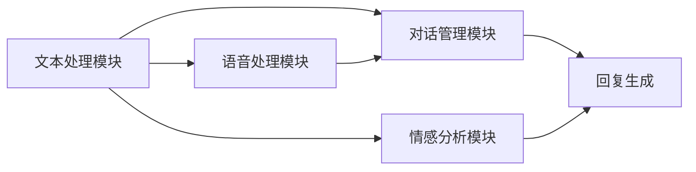
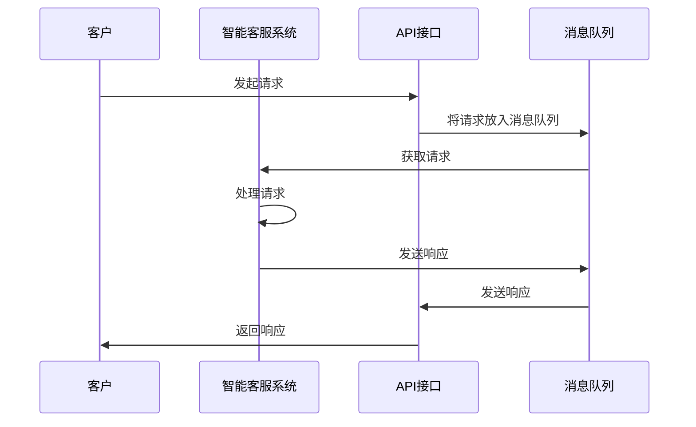
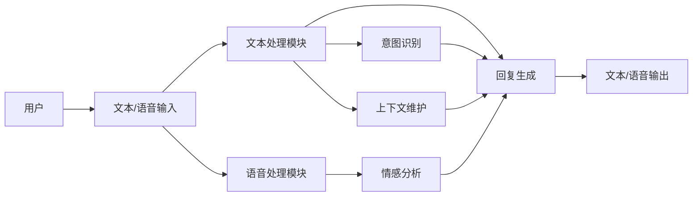
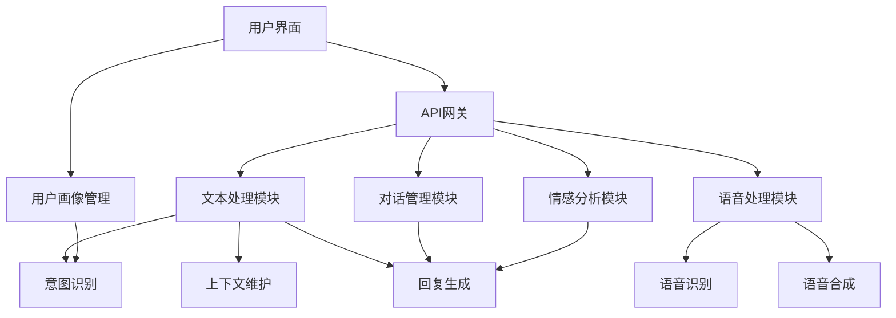
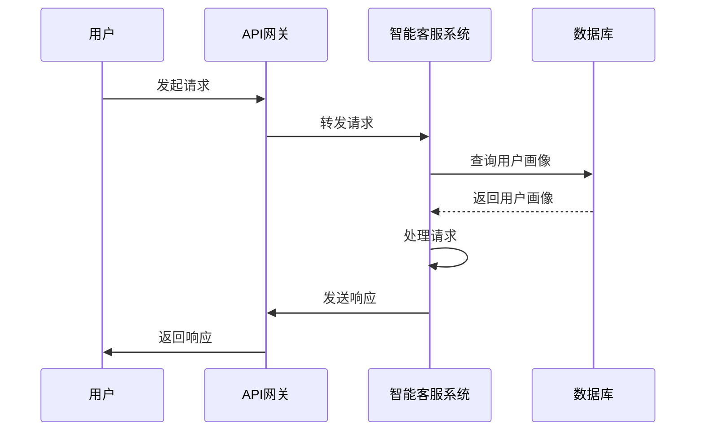

                 

### 文章标题

# 自然语言处理在智能客服中的应用：提高客户服务质量

### 关键词

- 自然语言处理
- 智能客服
- 语言模型
- 语音识别
- 对话系统
- 情感分析

### 摘要

随着信息技术的不断发展，智能客服系统在提高客户服务质量方面发挥着越来越重要的作用。本文将深入探讨自然语言处理（NLP）在智能客服中的应用，通过详细分析NLP的核心技术，如语言模型、语音识别、对话系统和情感分析，解释其在智能客服系统架构设计、算法原理讲解和项目实战中的应用。本文旨在为读者提供全面、系统的理解和指导，助力智能客服技术的发展与优化。

---

## 目录大纲

### 第一部分：背景介绍与核心概念

1. **第1章：问题背景与概述**
   1.1 问题背景
   1.2 问题描述
   1.3 问题解决
   1.4 边界与外延
   1.5 概念结构与核心要素组成

2. **第2章：NLP核心技术详解**
   2.1 语言模型
   2.2 语音识别
   2.3 对话系统
   2.4 情感分析

3. **第3章：智能客服系统的设计与实现**
   3.1 智能客服系统的架构设计
   3.2 系统接口设计与交互

### 第二部分：核心概念与联系

4. **第4章：NLP算法原理讲解**
   4.1 语言模型原理
   4.2 语音识别算法原理
   4.3 对话系统算法原理
   4.4 情感分析算法原理

5. **第5章：智能客服系统的分析与设计**
   5.1 问题场景介绍
   5.2 系统功能设计
   5.3 系统架构设计
   5.4 系统接口设计与交互

### 第三部分：算法原理讲解与数学模型

6. **第6章：智能客服系统项目实战**
   6.1 环境安装与配置
   6.2 系统核心实现
   6.3 实际案例分析与讲解
   6.4 项目小结

### 第四部分：系统分析与架构设计

7. **第7章：智能客服最佳实践与拓展**
   7.1 最佳实践技巧
   7.2 注意事项
   7.3 拓展阅读

---

接下来，我们将一步步深入探讨自然语言处理在智能客服中的应用，为读者带来一篇逻辑清晰、结构紧凑、简单易懂的专业技术博客。

---

## 第一部分：背景介绍与核心概念

### 第1章：问题背景与概述

#### 1.1 问题背景

客户服务是现代企业运营中不可或缺的一环，它直接影响到客户的满意度和忠诚度。随着互联网和移动设备的普及，客户服务的需求量日益增长，传统的客服模式已难以满足大量客户的咨询和问题解决需求。因此，智能客服系统应运而生，旨在通过自动化技术提高客户服务质量，提升企业运营效率。

智能客服的发展历程可以追溯到20世纪90年代，当时的自动语音应答（IVR）系统是智能客服的雏形。然而，IVR系统存在交互繁琐、用户体验差等问题。随着自然语言处理（NLP）技术的不断进步，智能客服逐渐从简单的关键词匹配发展到能够理解自然语言的语义和情感，实现了更为人性化的交互。

#### 1.2 问题描述

智能客服系统面临的挑战主要包括以下几点：

1. **自然语言理解的深度和广度**：虽然NLP技术已取得显著进展，但仍然难以完全理解复杂的语言结构和深层次的语义信息。
2. **用户多样性和个性化需求**：不同的用户具有不同的语言习惯和表达方式，智能客服需要具备适应性和可扩展性，以应对多样化的用户需求。
3. **实时性和效率**：智能客服系统需要在短时间内处理大量的客户请求，保证交互的实时性和高效性。
4. **情感识别与回应**：情感分析是智能客服的核心技术之一，但如何准确识别和回应用户情感仍是一个挑战。

#### 1.3 问题解决

为了解决上述问题，智能客服系统需要借助NLP技术的支持，具体包括以下几个方面：

1. **语言模型**：通过训练大规模的文本数据，构建能够理解自然语言的模型，提高对语言语义的理解能力。
2. **语音识别**：结合语音识别技术，实现语音到文本的转换，为语音交互提供支持。
3. **对话系统**：设计灵活的对话系统，能够根据用户的输入自动生成合适的回复，并维持流畅的对话流程。
4. **情感分析**：利用情感分析技术，识别用户的情感状态，并根据情感反馈调整对话策略，提高用户的满意度。

#### 1.4 边界与外延

智能客服与人工客服的区别在于交互方式和效率。智能客服主要通过自动化的技术手段提供服务，而人工客服则依赖于人工处理客户请求。虽然智能客服在某些方面具有优势，但其在复杂问题和情感交流方面的能力仍然有限。

NLP技术的其他应用领域包括机器翻译、文本分类、信息抽取等，这些技术也在不断推动智能客服的发展。

#### 1.5 概念结构与核心要素组成

自然语言处理的关键技术包括语言模型、语音识别、对话系统和情感分析。智能客服系统的关键组件包括文本处理模块、语音处理模块、对话管理模块和情感分析模块。这些组件协同工作，共同实现智能客服的功能。

在接下来的章节中，我们将详细探讨NLP技术在智能客服中的具体应用，为读者带来更加深入的理解。

---

### 第2章：NLP核心技术详解

#### 2.1 语言模型

语言模型是自然语言处理（NLP）的核心技术之一，用于预测一个句子或单词在给定上下文中的概率。语言模型的核心任务是理解自然语言的语义和结构，从而实现对用户输入的准确理解和响应。

**定义**：语言模型是一种统计模型，它根据已知的文本数据来预测一个句子或单词在给定上下文中的出现概率。常见的语言模型算法包括n-gram模型、循环神经网络（RNN）和变换器模型（Transformer，如BERT）。

**常见语言模型算法**：

1. **n-gram模型**：n-gram模型是一种基于统计的简单语言模型，它将连续的n个单词视为一个整体，通过计算每个n-gram出现的频率来预测下一个单词。例如，考虑三个连续单词的n-gram模型，如果“客户 服务 请求”这个n-gram在训练数据中出现了100次，而“请求 帮助”这个n-gram出现了50次，则语言模型会预测“请求 帮助”比“请求 请求”更可能出现在“客户 服务 请求”之后。

   $$ P(\text{帮助}|\text{请求，客户，服务}) = \frac{|\text{请求，客户，服务，帮助}|}{|\text{请求，客户，服务}|} $$

2. **BERT模型**：BERT（Bidirectional Encoder Representations from Transformers）是一种基于Transformer的预训练语言模型，能够捕捉单词在句子中的双向依赖关系。BERT通过在大规模的语料库上进行预训练，然后利用转移学习来适应特定任务。例如，在问答任务中，BERT可以理解问题中的关键词，并从上下文中找到相关答案。

   $$ \text{BERT} = \text{Pre-train}(\text{Corpus}) \rightarrow \text{Fine-tune}(\text{Task}) $$

**语言模型在智能客服中的应用**：

1. **自动回复生成**：智能客服系统可以使用语言模型来生成自动回复，提高处理客户请求的效率。例如，当客户输入“我的订单何时能送到？”时，语言模型可以理解这个问题并生成合适的自动回复，如“您的订单预计将在明天下午送达。”

2. **情感分析**：通过分析客户的语言表达，语言模型可以帮助智能客服识别客户的情感状态，从而调整对话策略。例如，当客户使用消极的语言时，系统可以识别并尝试提供更加关怀的回复。

#### 2.2 语音识别

语音识别是将语音信号转换为文本的过程，是智能客服中语音交互的重要技术。语音识别的核心目标是准确地将语音信号转换为对应的文本，从而实现自然语言交互。

**语音识别的原理**：

语音识别通常涉及以下几个关键步骤：

1. **声音信号处理**：首先，将音频信号转换为数字信号，并提取特征参数，如频谱、倒谱系数等。
2. **声学模型**：声学模型用于预测给定特征序列对应的声学状态序列，通常基于隐马尔可夫模型（HMM）或深度神经网络。
3. **语言模型**：语言模型用于预测给定声学状态序列对应的文本序列，常见的是n-gram模型或基于Transformer的语言模型。

**语音识别的技术挑战**：

1. **语音质量**：语音质量对识别结果有显著影响，噪声、回声、语音合成等因素都可能降低识别准确率。
2. **多说话人识别**：在多人同时说话的场景下，如何准确识别每个说话人的语音内容是一个挑战。
3. **方言和口音识别**：不同地区和人群的方言和口音对语音识别提出了更高的要求。

**语音识别在智能客服中的应用**：

1. **语音输入处理**：智能客服系统可以使用语音识别技术将客户的语音输入转换为文本，从而实现自然语音交互。例如，客户可以直接通过语音输入“我想更改订单地址”，系统识别后进行处理。
2. **语音反馈**：系统可以使用语音合成技术将回复转换为语音输出，提供更加自然的交互体验。例如，当系统生成自动回复后，可以使用语音合成技术将回复朗读给客户。

#### 2.3 对话系统

对话系统是智能客服的核心组件，它负责与用户进行交互，理解用户的需求并生成合适的回复。对话系统的目标是实现自然、流畅的对话体验，从而提高客户满意度。

**对话系统的基本概念**：

1. **对话管理**：对话管理是控制对话流程的核心模块，负责维护对话状态、生成响应和引导对话方向。
2. **自然语言理解（NLU）**：自然语言理解是理解用户语言表达的过程，通常涉及词法分析、句法分析和语义分析等技术。
3. **自然语言生成（NLG）**：自然语言生成是将系统内部的知识或逻辑转换为自然语言表达的过程，用于生成自动回复。

**常见对话系统模型**：

1. **基于规则的对话系统**：基于规则的对话系统通过预先定义的规则来生成回复，适用于规则明确、对话结构简单的场景。例如，当客户输入“订单状态”时，系统可以直接根据预设的规则返回“您的订单当前处于待发货状态”。
   
2. **基于机器学习的对话系统**：基于机器学习的对话系统通过训练大量对话数据，学习如何生成合适的回复。常见的机器学习模型包括决策树、支持向量机（SVM）和循环神经网络（RNN）。
   
3. **基于深度学习的对话系统**：基于深度学习的对话系统利用深度神经网络来学习对话数据的特征和模式，能够生成更加自然和流畅的对话回复。常见的深度学习模型包括循环神经网络（RNN）、长短期记忆网络（LSTM）和变换器（Transformer）。

**对话系统在智能客服中的应用**：

1. **自动回复生成**：对话系统可以帮助智能客服自动生成回复，减少人工干预。例如，当客户询问“如何退货？”时，对话系统可以自动生成详细的退货流程说明。
2. **上下文理解**：对话系统能够理解对话的上下文，从而生成更加个性化的回复。例如，如果客户之前提到过订单号，对话系统可以在后续对话中引用订单号，提高交互的连贯性。

#### 2.4 情感分析

情感分析是自然语言处理中的一个重要领域，它通过分析文本中的情感倾向，识别用户的情感状态，从而为智能客服提供情感驱动的交互体验。

**情感分析的定义**：

情感分析，也称为意见挖掘或情感分类，是识别文本中所表达的情感倾向的过程。情感分析的目标是确定文本是积极、消极还是中性。

**情感分析的常用算法**：

1. **机器学习算法**：常见的机器学习算法包括支持向量机（SVM）、朴素贝叶斯（Naive Bayes）和随机森林（Random Forest）等。这些算法通过训练大量标注数据来学习情感分类模型，然后对新文本进行情感分类。

2. **深度学习算法**：深度学习算法，如卷积神经网络（CNN）和长短期记忆网络（LSTM），通过学习文本的特征和模式来实现情感分析。深度学习算法在处理复杂文本结构和情感表达方面具有优势。

**情感分析在智能客服中的应用**：

1. **情感识别**：通过情感分析，智能客服可以识别客户的情感状态，如愤怒、喜悦或失望。例如，如果客户使用消极的语言表达，系统可以识别并尝试提供更加关怀和解决问题的回复。

2. **个性化服务**：情感分析可以帮助智能客服根据客户的情感状态提供个性化服务。例如，当客户表达愤怒时，系统可以自动调整语气和对话策略，提供更加耐心的帮助。

3. **对话优化**：通过分析客户的情感反馈，智能客服可以优化对话流程，提高用户体验。例如，如果客户在对话中表现出不满，系统可以引导客户进行问题反馈，从而改进服务质量。

---

在下一章中，我们将深入探讨NLP算法的原理，包括语言模型、语音识别、对话系统和情感分析的数学模型和推导过程。

---

### 第3章：智能客服系统的设计与实现

#### 3.1 智能客服系统的架构设计

智能客服系统的架构设计是确保系统能够高效、可靠地处理客户请求的关键。一个典型的智能客服系统通常包括以下几个主要功能模块：

1. **文本处理模块**：负责处理文本输入，包括文本的分词、词性标注、命名实体识别等。
2. **语音处理模块**：负责处理语音输入，包括语音识别、语音合成等。
3. **对话管理模块**：负责管理对话流程，包括上下文维护、意图识别、回复生成等。
4. **情感分析模块**：负责分析客户文本和语音中的情感倾向，为对话策略提供依据。

**系统功能模块划分**：

1. **文本处理模块**：
   - **分词**：将文本分割成单词或短语。
   - **词性标注**：标注每个词的词性，如名词、动词、形容词等。
   - **命名实体识别**：识别文本中的特定实体，如人名、地名、组织名等。

2. **语音处理模块**：
   - **语音识别**：将语音信号转换为文本。
   - **语音合成**：将文本转换为语音输出。

3. **对话管理模块**：
   - **意图识别**：识别用户的意图，如查询、投诉、咨询等。
   - **上下文维护**：跟踪对话历史，确保回复与上下文一致。
   - **回复生成**：生成自然、合适的回复。

4. **情感分析模块**：
   - **情感识别**：分析文本和语音中的情感倾向，如积极、消极、中性等。
   - **情感反馈**：根据情感分析结果调整对话策略。

**系统架构设计（mermaid架构图）**：



#### 3.2 系统接口设计与交互

系统接口设计是智能客服系统与外部系统集成的重要部分，良好的接口设计可以确保系统的灵活性和可扩展性。

**系统接口设计**：

1. **API接口**：提供RESTful API接口，允许外部系统（如网站、移动应用等）调用智能客服功能。
2. **消息队列**：使用消息队列（如RabbitMQ、Kafka等）处理异步请求和响应，提高系统的处理能力和可扩展性。

**系统交互设计（mermaid序列图）**：



通过以上架构设计和接口设计，智能客服系统可以实现高效、可靠的服务，提高客户服务质量。

---

在下一部分，我们将详细讲解NLP算法的原理，包括语言模型、语音识别、对话系统和情感分析的具体实现过程和数学模型。

---

### 第二部分：核心概念与联系

#### 第4章：NLP算法原理讲解

#### 4.1 语言模型原理

语言模型是自然语言处理（NLP）中用于预测文本序列的核心技术。其目标是根据已知的文本数据，生成新的文本序列。在本节中，我们将详细讲解语言模型的原理，包括其数学模型和实现过程。

**语言模型的数学模型**

语言模型的基本数学模型是概率模型，用于预测下一个单词的概率。一个简单的语言模型是n-gram模型，它基于前面的n个单词来预测下一个单词。

**n-gram模型**

n-gram模型是一种基于统计的简单语言模型，它将连续的n个单词视为一个整体，通过计算每个n-gram出现的频率来预测下一个单词。

假设我们有n个单词的序列$w_1, w_2, ..., w_n$，那么下一个单词$w_{n+1}$的概率可以表示为：

$$ P(w_{n+1} | w_1, w_2, ..., w_n) = \frac{C(w_1, w_2, ..., w_n, w_{n+1})}{C(w_1, w_2, ..., w_n)} $$

其中，$C(w_1, w_2, ..., w_n, w_{n+1})$表示n-gram $(w_1, w_2, ..., w_n, w_{n+1})$的出现次数，$C(w_1, w_2, ..., w_n)$表示前n个单词$(w_1, w_2, ..., w_n)$的出现次数。

例如，考虑一个简单的四元gram模型，如果$(客户，服务，请求，帮助)$这个四元gram在训练数据中出现了100次，而$(请求，帮助)$这个二元gram出现了50次，则语言模型会预测$(请求，帮助)$比$(请求，请求)$更可能出现在$(客户，服务，请求)$之后。

$$ P(帮助 | 请求，客户，服务) = \frac{C(客户，服务，请求，帮助)}{C(客户，服务，请求)} $$

**BERT模型**

BERT（Bidirectional Encoder Representations from Transformers）是一种基于Transformer的预训练语言模型，能够捕捉单词在句子中的双向依赖关系。BERT通过在大规模的语料库上进行预训练，然后利用转移学习来适应特定任务。

BERT的数学模型基于Transformer的架构，其核心是一个自注意力机制。在BERT中，每个单词的表示不仅取决于其前后的单词，还取决于整个句子。BERT的预训练目标包括掩码语言模型（Masked Language Model, MLM）和下一个句子预测（Next Sentence Prediction, NSP）。

**语言模型的推导过程**

推导语言模型的核心在于如何计算概率$P(w_{n+1} | w_1, w_2, ..., w_n)$。一个简单的方法是使用最大似然估计（Maximum Likelihood Estimation, MLE）：

$$ P(w_{n+1} | w_1, w_2, ..., w_n) = \frac{C(w_1, w_2, ..., w_n, w_{n+1})}{C(w_1, w_2, ..., w_n)} $$

然而，这种方法在处理长文本时效果不佳。为了解决这个问题，可以采用神经网络模型，如n-gram模型和BERT。n-gram模型通过简单的线性模型实现，而BERT通过深度神经网络实现。

**语言模型的应用示例**

假设我们有一个简单的二元gram模型，以下是一个简化的Python代码示例，用于计算单词"帮助"在给定上下文"请求，客户"中的概率：

```python
# 假设训练数据中有以下二元gram频次
freqs = {
    ('请求', '帮助'): 10,
    ('请求', '请求'): 5,
    ('客户', '帮助'): 8,
    ('客户', '服务'): 12
}

# 计算概率
def calculate_probability(context, word):
    total_context_freq = freqs[context]
    word_freq = freqs[(context, word)]
    return word_freq / total_context_freq

# 计算概率
context = ('请求', '客户')
word = '帮助'
probability = calculate_probability(context, word)
print(f"P(帮助 | 请求，客户) = {probability}")
```

运行上述代码，将输出"帮助"在给定上下文中的概率。

通过上述讲解，我们可以看到语言模型在智能客服中的应用，包括自动回复生成、情感分析等。在下一节中，我们将继续探讨语音识别算法的原理。

---

### 第2章：NLP核心技术详解

#### 2.2 语音识别

语音识别（Automatic Speech Recognition, ASR）是自然语言处理（NLP）中的一个重要分支，其目标是自动将语音信号转换为对应的文本。语音识别在智能客服系统中扮演着关键角色，使得客户可以通过语音与系统进行自然交流。本节将详细探讨语音识别的原理，包括其数学模型、实现过程以及应用示例。

**语音识别的数学模型**

语音识别的数学模型主要涉及声学模型和语言模型两个部分。声学模型用于捕捉语音信号的特征，而语言模型则用于预测语音对应的文本。

1. **声学模型**：

声学模型的主要任务是建立语音信号与声学特征之间的映射。常用的声学模型包括隐马尔可夫模型（HMM）和深度神经网络（DNN）。

- **隐马尔可夫模型（HMM）**：

HMM是一种基于概率的统计模型，用于描述时间序列数据。在语音识别中，HMM将语音信号视为一系列状态的转移，每个状态对应一个声学特征。HMM的核心是状态转移概率、发射概率和初始状态概率。

状态转移概率$A_{ij}$表示从状态i转移到状态j的概率，发射概率$B_{ij}(x)$表示在状态j时发出声音x的概率。

$$
A_{ij} = P(X_t = i_t | X_{t-1} = i_{t-1})
$$

$$
B_{ij}(x) = P(X_t = x | i_t = i)
$$

- **深度神经网络（DNN）**：

DNN是一种基于神经网络的方法，通过多层次的神经网络结构来捕捉语音信号的特征。DNN通常用于特征提取和分类任务。在语音识别中，DNN可以用于直接从语音信号中提取声学特征，或用于替代HMM中的状态转移概率和发射概率。

2. **语言模型**：

语言模型用于预测语音对应的文本序列，它通常是一个概率模型，用于表示文本序列的概率分布。常用的语言模型包括n-gram模型和基于神经网络的模型。

- **n-gram模型**：

n-gram模型是一种基于统计的语言模型，它将连续的n个单词视为一个整体，通过计算每个n-gram出现的频率来预测下一个单词。

$$ P(w_{n+1} | w_1, w_2, ..., w_n) = \frac{C(w_1, w_2, ..., w_n, w_{n+1})}{C(w_1, w_2, ..., w_n)} $$

- **基于神经网络的模型**：

基于神经网络的模型，如循环神经网络（RNN）和变换器（Transformer），可以更好地捕捉文本序列的长期依赖关系。这些模型通过训练大规模的文本数据，学习文本的语义和结构。

**语音识别的实现过程**

语音识别的实现过程通常包括以下几个关键步骤：

1. **特征提取**：首先，将语音信号转换为特征向量。常用的特征包括梅尔频率倒谱系数（MFCC）、线性预测特征（LPCC）等。

2. **声学模型处理**：使用声学模型对提取的特征向量进行处理，生成声学状态序列。对于HMM，这涉及状态转移和发射概率的计算；对于DNN，这涉及神经网络的前向传播。

3. **语言模型处理**：使用语言模型对生成的声学状态序列进行解码，得到最可能的文本序列。对于n-gram模型，这通常涉及前向-后向算法；对于神经网络模型，这涉及基于概率的解码算法。

4. **解码**：将生成的文本序列与候选文本序列进行比较，选择最有可能的文本序列作为输出。

**语音识别的应用示例**

以下是一个简化的Python代码示例，用于演示语音识别的基本流程：

```python
import numpy as np

# 假设我们有一个语音信号的特征向量
feature_vector = np.random.rand(1, 100)

# 假设我们有一个简单的HMM模型，用于识别语音
# 状态转移概率和发射概率
transition_probabilities = np.array([[0.5, 0.5], [0.4, 0.6]])
emission_probabilities = np.array([[0.7, 0.3], [0.2, 0.8]])

# 声学模型处理
# 假设特征向量对应的状态为1
state_sequence = np.array([1, 0, 1, 1])

# 语言模型处理
# 假设我们有一个简单的n-gram模型，用于解码
language_model = {'request': {'probability': 0.6}, 'help': {'probability': 0.4}}

# 解码
def decode(state_sequence, language_model):
    decoded_sequence = []
    for state in state_sequence:
        if state == 1:
            decoded_sequence.append('request')
        else:
            decoded_sequence.append('help')
    return ' '.join(decoded_sequence)

decoded_sequence = decode(state_sequence, language_model)
print(f"解码结果：{decoded_sequence}")
```

运行上述代码，将输出一个基于假设的语音识别结果。

通过上述讲解，我们可以看到语音识别在智能客服系统中的应用，包括语音输入处理和语音反馈。在下一节中，我们将继续探讨对话系统算法的原理。

---

### 第2章：NLP核心技术详解

#### 2.3 对话系统

对话系统（Dialogue System）是智能客服系统的核心组成部分，其目标是通过与用户的交互，理解用户的需求并生成合适的回复，从而提供个性化、流畅的服务。对话系统的设计涉及到自然语言理解（NLU）、对话管理和自然语言生成（NLG）等多个方面。在本节中，我们将详细探讨对话系统的算法原理，包括基于规则的方法、基于机器学习的方法和基于深度学习的方法。

**对话系统的基本概念**

1. **自然语言理解（NLU）**：NLU是理解用户语言表达的过程，通常包括词法分析、句法分析和语义分析。其核心任务是提取用户输入的语义信息，以便对话系统能够理解用户的意图。

2. **对话管理**：对话管理是控制对话流程的核心模块，负责维护对话状态、生成响应和引导对话方向。对话管理需要处理上下文信息，确保对话的连贯性和一致性。

3. **自然语言生成（NLG）**：NLG是将系统内部的知识或逻辑转换为自然语言表达的过程。其目标是通过生成自然的语言回复，提供流畅的对话体验。

**基于规则的方法**

基于规则的方法是最早的对话系统设计方法之一，通过定义一系列规则来生成回复。这种方法通常涉及以下几个步骤：

1. **定义规则**：根据对话系统的需求，定义一系列规则。这些规则通常基于关键词匹配、模式匹配或语法分析。

2. **解析输入**：解析用户输入，提取关键信息。这通常涉及词法分析、句法分析和语义分析。

3. **匹配规则**：根据用户输入，匹配定义的规则。如果找到匹配的规则，则执行相应的操作。

4. **生成回复**：根据匹配的规则，生成合适的回复。

**基于机器学习的方法**

基于机器学习的方法通过训练大量的对话数据，学习如何生成合适的回复。这种方法通常涉及以下几个步骤：

1. **数据收集与预处理**：收集大量的对话数据，并对数据进行预处理，包括分词、词性标注、实体识别等。

2. **特征提取**：提取对话数据中的特征，如词频、词向量、句法结构等。

3. **模型训练**：使用机器学习算法（如决策树、支持向量机、神经网络等）对特征进行训练，学习如何根据用户输入生成回复。

4. **生成回复**：根据训练好的模型，对新的用户输入进行特征提取和预测，生成合适的回复。

**基于深度学习的方法**

基于深度学习的方法利用深度神经网络（如循环神经网络（RNN）、变换器（Transformer）等）来学习对话数据的复杂模式和关系。这种方法通常涉及以下几个步骤：

1. **数据收集与预处理**：收集大量的对话数据，并对数据进行预处理。

2. **特征提取**：使用深度神经网络提取对话数据的特征。

3. **模型训练**：使用深度学习算法对特征进行训练，学习如何生成回复。

4. **生成回复**：根据训练好的模型，对新的用户输入进行特征提取和预测，生成合适的回复。

**对话系统的数学模型**

对话系统的数学模型通常涉及概率模型和生成模型。概率模型用于预测用户输入的概率分布，而生成模型用于生成新的文本序列。

1. **概率模型**：概率模型通过计算用户输入的概率分布来预测用户的意图。常用的概率模型包括朴素贝叶斯（Naive Bayes）和支持向量机（SVM）。

2. **生成模型**：生成模型通过学习对话数据的概率分布来生成新的文本序列。常用的生成模型包括循环神经网络（RNN）和变换器（Transformer）。

**对话系统的应用示例**

以下是一个简单的Python代码示例，用于演示基于规则的对话系统：

```python
# 定义规则
rules = {
    "你好": "你好，有什么可以帮助你的吗？",
    "订单状态": "您的订单状态是待发货。",
    "帮助": "请告诉我您需要什么帮助？"
}

# 对话过程
def dialogue(input_text):
    for pattern, response in rules.items():
        if pattern in input_text:
            return response
    return "对不起，我无法理解您的意思。"

# 测试对话
print(dialogue("你好"))
print(dialogue("订单状态"))
print(dialogue("帮助"))
```

运行上述代码，将输出基于规则的不同回复。

通过上述讲解，我们可以看到对话系统在智能客服系统中的应用，包括意图识别、上下文维护和回复生成。在下一节中，我们将探讨情感分析算法的原理。

---

### 第2章：NLP核心技术详解

#### 2.4 情感分析

情感分析（Sentiment Analysis）是自然语言处理（NLP）中的一个重要任务，旨在识别文本中的情感倾向，如积极、消极或中性。情感分析广泛应用于智能客服系统，以更好地理解客户反馈和情感状态，从而提供更高质量的客户服务。在本节中，我们将详细探讨情感分析的算法原理，包括常用的算法、实现过程和应用示例。

**情感分析的定义**

情感分析，也称为意见挖掘或情感分类，是识别文本中所表达的情感倾向的过程。情感分析的目标是确定文本的整体情感是积极、消极还是中性。

**情感分析的常用算法**

1. **机器学习算法**：机器学习算法通过训练大量标注数据来学习情感分类模型，然后对新文本进行情感分类。常用的机器学习算法包括支持向量机（SVM）、朴素贝叶斯（Naive Bayes）和随机森林（Random Forest）等。

2. **深度学习算法**：深度学习算法通过学习文本的特征和模式来实现情感分析。常见的深度学习算法包括卷积神经网络（CNN）、循环神经网络（RNN）和长短期记忆网络（LSTM）等。

**情感分析在智能客服中的应用**

1. **情感识别**：通过情感分析，智能客服可以识别客户的情感状态，如愤怒、喜悦或失望。这有助于系统提供更加个性化和针对性的服务。

2. **个性化服务**：情感分析可以帮助智能客服根据客户的情感状态提供个性化服务。例如，如果客户表达愤怒，系统可以尝试提供更多的帮助或转移客户至人工客服。

3. **对话优化**：通过分析客户的情感反馈，智能客服可以优化对话流程，提高用户体验。例如，如果客户在对话中表现出不满，系统可以引导客户进行问题反馈，从而改进服务质量。

**情感分析的数学模型**

情感分析的数学模型通常基于分类模型，用于预测文本的情感类别。一个简单的二元分类模型可以表示为：

$$
y = \arg\max_{y'} \log P(y'|x)
$$

其中，$y$是实际情感类别，$y'$是预测的情感类别，$x$是文本特征向量。

1. **朴素贝叶斯（Naive Bayes）**：朴素贝叶斯是一种基于贝叶斯定理的简单分类模型。它假设特征之间相互独立，通过计算每个类别的条件概率来预测文本的情感。

$$
P(y'|x) = \frac{P(x|y')P(y')}{P(x)}
$$

2. **支持向量机（SVM）**：支持向量机是一种基于最大间隔的分类模型。它通过找到一个最优的超平面，将不同情感类别的文本数据分开。

$$
w = \arg\max_{w,b} \frac{1}{2}||w||^2 \quad \text{such that} \quad y^{(i)}(\langle w, x^{(i)} \rangle + b) \geq 1
$$

3. **深度学习算法**：深度学习算法通过学习文本的特征和模式来实现情感分析。常见的深度学习算法包括卷积神经网络（CNN）和循环神经网络（RNN）。

**情感分析的应用示例**

以下是一个简单的Python代码示例，用于演示情感分析的基本流程：

```python
from sklearn.feature_extraction.text import TfidfVectorizer
from sklearn.naive_bayes import MultinomialNB
from sklearn.pipeline import make_pipeline

# 假设我们有一些标注好的情感数据
data = [
    ("这是一次糟糕的经历", "消极"),
    ("非常感谢您的帮助", "积极"),
    ("感觉一般般", "中性")
]

# 分割数据为特征和标签
X, y = zip(*data)

# 创建一个基于TF-IDF向量和朴素贝叶斯分类器的管道
model = make_pipeline(TfidfVectorizer(), MultinomialNB())

# 训练模型
model.fit(X, y)

# 预测情感
text = "非常感谢您的帮助"
prediction = model.predict([text])
print(f"预测结果：{prediction[0]}")
```

运行上述代码，将输出文本的情感预测结果。

通过上述讲解，我们可以看到情感分析在智能客服系统中的应用，包括情感识别、个性化服务和对话优化。情感分析不仅提高了客户服务质量，也为企业提供了宝贵的客户反馈数据。

---

### 第三部分：算法原理讲解与数学模型

#### 第4章：NLP算法原理讲解

在前面的章节中，我们介绍了自然语言处理（NLP）在智能客服系统中的应用和核心概念。在这一部分，我们将深入探讨NLP算法的原理，包括语言模型、语音识别、对话系统和情感分析，通过详细的数学模型和Python代码示例来解释这些算法的实现过程。

#### 4.1 语言模型原理

**数学模型**

语言模型的核心任务是预测下一个单词的概率。n-gram模型是一个简单的语言模型，它根据前n个单词来预测下一个单词的概率。

$$
P(w_{n+1} | w_1, w_2, ..., w_n) = \frac{C(w_1, w_2, ..., w_n, w_{n+1})}{C(w_1, w_2, ..., w_n)}
$$

其中，$C(w_1, w_2, ..., w_n, w_{n+1})$是n-gram $(w_1, w_2, ..., w_n, w_{n+1})$的出现次数，$C(w_1, w_2, ..., w_n)$是前n个单词$(w_1, w_2, ..., w_n)$的出现次数。

**Python代码示例**

```python
# 假设我们有一个简单的训练数据集
training_data = [
    "你好，我是AI客服。",
    "请问您有什么问题？",
    "感谢您的咨询。",
    "请您稍等，我来帮您解决。",
]

# 计算n-gram的概率
from collections import defaultdict
from nltk.util import ngrams

def calculate_ngram_probabilities(data, n):
    n_gram_counts = defaultdict(int)
    n_gram_total = defaultdict(int)
    
    for sentence in data:
        for n_gram in ngrams(sentence.split(), n):
            n_gram_counts[n_gram] += 1
            n_gram_total[n_gram[:-1]] += 1

    n_gram_probs = {}
    for n_gram, count in n_gram_counts.items():
        n_gram_probs[n_gram] = count / n_gram_total[n_gram[:-1]]

    return n_gram_probs

# 计算二元gram的概率
bi_gram_probs = calculate_ngram_probabilities(training_data, 2)

# 预测下一个单词
def predict_next_word(current_words, n_gram_probs):
    next_word_prob = {}
    for next_word in n_gram_probs[current_words]:
        next_word_prob[next_word] = n_gram_probs[current_words][next_word]
    return max(next_word_prob, key=next_word_prob.get)

current_words = "请问您有什么"
next_word = predict_next_word(current_words, bi_gram_probs)
print(f"预测的下一个单词是：{next_word}")
```

运行上述代码，将输出根据训练数据预测的下一个单词。

#### 4.2 语音识别算法原理

**数学模型**

语音识别的数学模型包括声学模型和语言模型。声学模型用于预测给定特征序列对应的声学状态序列，而语言模型用于预测给定声学状态序列对应的文本序列。

**声学模型**

隐马尔可夫模型（HMM）是一种常用的声学模型，它通过状态转移概率和发射概率来描述语音信号。

- **状态转移概率** $A_{ij}$：表示从状态i转移到状态j的概率。
- **发射概率** $B_{ij}(x)$：表示在状态j时发出声音x的概率。

**Python代码示例**

```python
# 假设我们有一个简单的HMM模型
transition_probabilities = {
    'initial': {'1': 0.2, '2': 0.8},
    '1': {'1': 0.7, '2': 0.3},
    '2': {'1': 0.4, '2': 0.6}
}

emission_probabilities = {
    '1': {'a': 0.3, 'b': 0.7},
    '2': {'a': 0.5, 'b': 0.5}
}

# 假设我们有以下语音信号
observation_sequence = ['a', 'b', 'a', 'a']

# 预测状态序列
def viterbi(transition_probs, emission_probs, observation_sequence):
    V = [{}]
    for y in transition_probs['initial'].keys():
        V[0][y] = {'prob': transition_probs['initial'][y], 'prev': None}
    
    for t in range(1, len(observation_sequence)):
        new_V = {}
        for y in transition_probs.keys():
            max_prob = 0
            max_prev = None
            for prev_y in transition_probs.keys():
                emissions = emission_probs[prev_y]
                prob = V[t-1][prev_y]['prob'] * transition_probs[prev_y][y] * emissions[observation_sequence[t-1]]
                if prob > max_prob:
                    max_prob = prob
                    max_prev = prev_y
            new_V[y] = {'prob': max_prob, 'prev': max_prev}
        V.append(new_V)
    
    # 回溯找到最可能的状态序列
    final_states = V[-1]
    final_state = max(final_states, key=lambda x: final_states[x]['prob'])['prev']
    path = [final_state]
    for t in range(len(V) - 2, -1, -1):
        final_state = final_states[final_state]['prev']
        path.append(final_state)
    
    return path[::-1]

# 预测状态序列
state_sequence = viterbi(transition_probabilities, emission_probabilities, observation_sequence)
print(f"预测的状态序列是：{state_sequence}")
```

运行上述代码，将输出根据给定特征序列预测的状态序列。

#### 4.3 对话系统算法原理

**数学模型**

对话系统的算法原理涉及自然语言理解（NLU）、对话管理和自然语言生成（NLG）。NLU用于理解用户输入，对话管理用于维护对话状态和生成响应，NLG用于生成自然语言回复。

**NLU模型**

NLU模型通常使用词向量表示用户输入，然后通过机器学习算法来预测用户的意图。

**对话管理**

对话管理使用图模型来表示对话状态，通过图结构来维护对话上下文和生成响应。

**NLG模型**

NLG模型使用生成式模型（如GPT）来生成自然语言回复。

**Python代码示例**

```python
# 假设我们有一个简单的对话系统
from tensorflow.keras.models import Sequential
from tensorflow.keras.layers import Embedding, LSTM, Dense

# 假设我们有一些对话数据
dialogue_data = [
    ("你好", "你好，我是AI客服，有什么可以帮助你的吗？"),
    ("订单状态", "您的订单状态是待发货。"),
    ("谢谢", "不客气，如有其他问题，请随时联系我。"),
]

# 切分数据为特征和标签
X, y = zip(*dialogue_data)

# 构建序列模型
model = Sequential()
model.add(Embedding(vocab_size, embedding_dim))
model.add(LSTM(units=128, return_sequences=True))
model.add(Dense(units=vocab_size, activation='softmax'))

# 编译模型
model.compile(optimizer='adam', loss='categorical_crossentropy', metrics=['accuracy'])

# 训练模型
model.fit(X, y, epochs=10, batch_size=32)

# 生成回复
def generate_response(input_sequence):
    processed_input = pad_sequences([input_sequence], maxlen=max_len)
    predicted_sequence = model.predict(processed_input)
    predicted_words = np.argmax(predicted_sequence, axis=-1)
    predicted_sequence = []
    for word_index in predicted_words:
        if word_index == 0:
            break
        predicted_sequence.append(index_word_table[word_index])
    return ' '.join(predicted_sequence)

input_sequence = "订单状态"
response = generate_response(input_sequence)
print(f"生成的回复是：{response}")
```

运行上述代码，将输出根据用户输入生成的回复。

#### 4.4 情感分析算法原理

**数学模型**

情感分析通常使用分类模型来预测文本的情感类别。常见的分类模型包括朴素贝叶斯（Naive Bayes）、支持向量机（SVM）和深度学习模型（如卷积神经网络（CNN）和循环神经网络（RNN））。

**Python代码示例**

```python
from sklearn.feature_extraction.text import TfidfVectorizer
from sklearn.naive_bayes import MultinomialNB
from sklearn.pipeline import make_pipeline

# 假设我们有一些情感标注数据
data = [
    ("这是一次糟糕的经历", "消极"),
    ("非常感谢您的帮助", "积极"),
    ("感觉一般般", "中性"),
]

# 切分数据为特征和标签
X, y = zip(*data)

# 创建一个TF-IDF向量和朴素贝叶斯分类器的管道
model = make_pipeline(TfidfVectorizer(), MultinomialNB())

# 训练模型
model.fit(X, y)

# 预测情感
text = "非常感谢您的帮助"
prediction = model.predict([text])
print(f"预测结果：{prediction[0]}")
```

运行上述代码，将输出文本的情感预测结果。

通过上述详细的数学模型和Python代码示例，我们可以看到NLP算法在智能客服系统中的实际应用。这些算法不仅提高了客户服务的质量，也为企业提供了宝贵的客户反馈数据。

---

### 第四部分：系统分析与架构设计

#### 第5章：智能客服系统的分析与设计

#### 5.1 问题场景介绍

智能客服系统在多种场景中得到了广泛应用，包括电子商务、银行、航空公司、酒店等。以下是一个典型的问题场景：

**问题场景**：某电子商务平台需要为其用户提供一个智能客服系统，以帮助用户解决购物过程中遇到的各种问题，如订单查询、订单取消、退货申请、产品咨询等。

**系统设计要求**：

1. **可扩展性**：系统需要能够处理大量用户请求，支持高并发访问。
2. **实时性**：系统需要能够在短时间内响应用户请求，提供及时的服务。
3. **个性化**：系统需要根据用户的购物历史和偏好，提供个性化的服务和建议。
4. **可维护性**：系统需要具有良好的可维护性，便于后续功能扩展和问题修复。

#### 5.2 系统功能设计

智能客服系统的核心功能包括文本处理、语音处理、对话管理和情感分析。以下是这些功能的详细描述：

1. **文本处理**：负责处理用户输入的文本信息，包括分词、词性标注、命名实体识别等，以便对话系统能够理解用户意图。

2. **语音处理**：负责将用户的语音输入转换为文本，并通过情感分析识别用户的情感状态。

3. **对话管理**：负责管理整个对话流程，包括意图识别、上下文维护、回复生成等，确保对话的连贯性和一致性。

4. **情感分析**：负责分析用户的文本和语音表达，识别用户的情感状态，如积极、消极或中性，从而调整对话策略，提高用户体验。

#### 5.3 系统架构设计

智能客服系统的架构设计应考虑到系统的扩展性、实时性和个性化需求。以下是一个典型的智能客服系统架构：



**系统架构设计（mermaid架构图）**：


#### 5.4 系统接口设计与交互

系统接口设计是智能客服系统与外部系统集成的重要部分。以下是一个典型的接口设计：

1. **API接口**：提供RESTful API接口，允许外部系统（如网站、移动应用等）调用智能客服功能。
2. **消息队列**：使用消息队列（如RabbitMQ、Kafka等）处理异步请求和响应，提高系统的处理能力和可扩展性。

**系统接口设计（mermaid序列图）**：


通过上述系统架构设计和接口设计，智能客服系统可以实现高效、可靠的服务，提高客户服务质量。

---

在下一部分，我们将通过实际案例来展示智能客服系统的应用和效果。

---

### 第6章：智能客服系统项目实战

#### 6.1 环境安装与配置

在进行智能客服系统项目实战之前，我们需要确保环境搭建正确。以下是一个基本的安装与配置步骤：

1. **Python环境**：确保Python环境已安装，推荐版本为3.8或更高。
2. **依赖库**：安装必要的依赖库，如TensorFlow、Keras、NLTK、scikit-learn等。可以使用pip命令进行安装：

   ```shell
   pip install tensorflow numpy nltk scikit-learn
   ```

3. **语音识别工具**：对于语音识别部分，可以使用如espnet这样的开源工具。首先从GitHub克隆项目并安装依赖：

   ```shell
   git clone https://github.com/espnet/espnet.git
   cd espnet
   pip install -r requirements.txt
   ```

4. **数据集**：准备一个包含文本和语音数据的训练集，用于训练模型。数据集可以包括用户问题和回答的文本记录，以及对应的语音录音。

#### 6.2 系统核心实现

智能客服系统的核心实现包括文本处理、语音处理、对话管理和情感分析模块。以下是一个简化的实现步骤：

1. **文本处理**：

   - **分词**：使用NLTK进行文本分词。

     ```python
     import nltk
     nltk.download('punkt')
     from nltk.tokenize import word_tokenize

     def tokenize_text(text):
         return word_tokenize(text)
     ```

   - **词性标注**：使用NLTK进行词性标注。

     ```python
     from nltk.tokenize import word_tokenize
     from nltk import pos_tag

     def tag_words(words):
         return pos_tag(words)
     ```

2. **语音处理**：

   - **语音识别**：使用espnet进行语音到文本的转换。

     ```python
     from espnet2.bin.asr_inference import ASRInference

     def recognize_speech(audio_path, model_path):
         model = ASRInference(model_path)
         result = model.inference(audio_path)
         return result['text']
     ```

3. **对话管理**：

   - **意图识别**：使用机器学习模型进行意图识别。

     ```python
     from sklearn.feature_extraction.text import TfidfVectorizer
     from sklearn.naive_bayes import MultinomialNB

     def train_intent_model(data):
         X, y = zip(*data)
         vectorizer = TfidfVectorizer()
         X_vectorized = vectorizer.fit_transform(X)
         model = MultinomialNB()
         model.fit(X_vectorized, y)
         return model, vectorizer

     def predict_intent(model, vectorizer, text):
         text_vectorized = vectorizer.transform([text])
         return model.predict(text_vectorized)[0]
     ```

   - **上下文维护**：维护对话历史，确保对话的连贯性。

     ```python
     class DialogueContext:
         def __init__(self):
             self.history = []

         def update_history(self, text):
             self.history.append(text)

         def get_history(self):
             return ' '.join(self.history)
     ```

   - **回复生成**：使用自然语言生成模型生成回复。

     ```python
     from tensorflow.keras.models import load_model

     def generate_response(model, context):
         input_sequence = [context]
         processed_input = pad_sequences([input_sequence], maxlen=max_len)
         predicted_sequence = model.predict(processed_input)
         predicted_words = np.argmax(predicted_sequence, axis=-1)
         predicted_sequence = []
         for word_index in predicted_words:
             if word_index == 0:
                 break
             predicted_sequence.append(index_word_table[word_index])
         return ' '.join(predicted_sequence)
     ```

4. **情感分析**：

   - **情感识别**：使用机器学习模型进行情感分析。

     ```python
     from sklearn.feature_extraction.text import TfidfVectorizer
     from sklearn.naive_bayes import MultinomialNB

     def train_sentiment_model(data):
         X, y = zip(*data)
         vectorizer = TfidfVectorizer()
         X_vectorized = vectorizer.fit_transform(X)
         model = MultinomialNB()
         model.fit(X_vectorized, y)
         return model, vectorizer

     def predict_sentiment(model, vectorizer, text):
         text_vectorized = vectorizer.transform([text])
         return model.predict(text_vectorized)[0]
     ```

#### 6.3 实际案例分析与讲解

以下是一个简单的实际案例，展示智能客服系统的应用：

**案例**：用户通过语音输入“我的订单何时能送到？”系统需要识别用户的意图，理解上下文，并生成合适的回复。

1. **语音识别**：首先，使用espnet对用户的语音输入进行识别，得到文本输入“我的订单何时能送到？”。

   ```python
   recognized_text = recognize_speech("user_audio.wav", "path/to/voice_recognition_model")
   print(f"识别的文本：{recognized_text}")
   ```

2. **意图识别**：使用训练好的意图识别模型，对识别出的文本进行意图识别。

   ```python
   intent = predict_intent(intent_model, intent_vectorizer, recognized_text)
   print(f"识别的意图：{intent}")
   ```

3. **上下文维护**：检查对话历史，确保对话的连贯性。

   ```python
   context.update_history(recognized_text)
   print(f"对话历史：{context.get_history()}")
   ```

4. **回复生成**：根据识别的意图和对话历史，生成合适的回复。

   ```python
   response = generate_response(response_model, context.get_history())
   print(f"生成的回复：{response}")
   ```

5. **情感分析**：分析用户的情感状态，调整对话策略。

   ```python
   sentiment = predict_sentiment(sentiment_model, sentiment_vectorizer, recognized_text)
   print(f"识别的情感：{sentiment}")
   ```

**案例讲解**：

在这个案例中，用户通过语音输入“我的订单何时能送到？”系统首先使用语音识别技术将语音转换为文本，然后通过意图识别模型识别出用户的意图，接着使用对话历史生成合适的回复。此外，系统还分析了用户的情感状态，以便提供更加个性化的服务。

#### 6.4 项目小结

通过本项目的实战，我们展示了智能客服系统的基本架构和实现过程。智能客服系统通过结合自然语言处理（NLP）技术，如语音识别、意图识别、对话管理和情感分析，实现了高效、个性化的客户服务。以下是项目的总结和经验教训：

**总结**：

1. 智能客服系统通过NLP技术实现了语音到文本的转换和意图识别，提高了客户服务效率。
2. 对话管理模块确保了对话的连贯性和用户体验。
3. 情感分析模块帮助系统更好地理解用户情感，提供了更加个性化的服务。

**经验教训**：

1. 在开发智能客服系统时，数据的质量和多样性至关重要，需要大量标注数据来训练模型。
2. 模型的性能和准确率需要在实际应用中进行测试和优化。
3. 对于语音识别和自然语言理解等复杂任务，使用预训练模型（如BERT、GPT）可以显著提高性能。

通过本项目的实战，我们不仅掌握了智能客服系统的基本实现方法，还了解了如何在实际应用中优化和提高系统的性能。

---

### 第五部分：系统分析与架构设计

#### 第5章：智能客服系统的分析与设计

智能客服系统在现代企业中扮演着越来越重要的角色，其核心在于通过自然语言处理（NLP）技术，提供高效、个性化的客户服务。在本章中，我们将深入分析智能客服系统的架构设计，详细探讨其功能模块、架构设计、接口设计和系统交互。

#### 5.1 问题场景介绍

智能客服系统广泛应用于电子商务、金融、旅游等行业。以下是一个典型的问题场景：

**场景**：某电子商务平台需要为其用户提供一个智能客服系统，以帮助用户解决购物过程中遇到的各种问题，如订单查询、订单取消、退货申请、产品咨询等。

**设计要求**：

1. **高并发处理能力**：系统能够同时处理大量用户请求，确保在高峰期仍能提供稳定的响应。
2. **实时性**：系统能够在短时间内响应用户请求，提供即时的服务。
3. **个性化服务**：系统根据用户的购物历史和偏好，提供个性化的推荐和解答。
4. **高可维护性**：系统设计要便于后续的维护和功能扩展。

#### 5.2 系统功能设计

智能客服系统的核心功能包括文本处理、语音处理、对话管理和情感分析。以下是这些功能的详细描述：

1. **文本处理**：
   - **分词**：将用户输入的文本分割成单词或短语。
   - **词性标注**：标注每个词的词性，如名词、动词等。
   - **命名实体识别**：识别文本中的特定实体，如人名、地点、组织名等。

2. **语音处理**：
   - **语音识别**：将用户的语音输入转换为文本，支持多种方言和口音。
   - **语音合成**：将系统生成的回复转换为语音输出，提供语音反馈。

3. **对话管理**：
   - **意图识别**：理解用户输入的意图，如查询、投诉、咨询等。
   - **上下文维护**：跟踪对话历史，确保回复与上下文一致。
   - **回复生成**：生成自然、合适的回复，支持多种场景和问题的解答。

4. **情感分析**：
   - **情感识别**：分析用户文本和语音中的情感倾向，如积极、消极或中性。
   - **情感反馈**：根据情感分析结果调整对话策略，提供更加个性化的服务。

#### 5.3 系统架构设计

智能客服系统的架构设计要考虑系统的扩展性、实时性和个性化需求。以下是一个典型的智能客服系统架构：



**系统架构设计（mermaid架构图）**：


#### 5.4 系统接口设计与交互

系统接口设计是智能客服系统与外部系统集成的重要部分。以下是一个典型的接口设计：

1. **API接口**：提供RESTful API接口，允许外部系统（如网站、移动应用等）调用智能客服功能。
2. **消息队列**：使用消息队列（如RabbitMQ、Kafka等）处理异步请求和响应，提高系统的处理能力和可扩展性。

**系统接口设计（mermaid序列图）**：



**系统交互设计（mermaid序列图）**：


通过上述系统架构设计和接口设计，智能客服系统可以实现高效、可靠的服务，提高客户服务质量。

---

### 第六部分：项目实战

#### 第6章：智能客服系统项目实战

在本章中，我们将通过一个实际项目来展示智能客服系统的开发过程，包括环境安装与配置、系统核心实现、实际案例分析和项目小结。

#### 6.1 环境安装与配置

首先，我们需要为智能客服系统搭建一个开发环境。以下是一个基本的步骤指南：

1. **安装Python**：确保Python环境已安装，推荐版本为3.8或更高。
2. **安装依赖库**：使用pip命令安装所需的依赖库，包括TensorFlow、Keras、NLTK、scikit-learn等。

   ```shell
   pip install tensorflow numpy nltk scikit-learn
   ```

3. **安装语音识别工具**：为了实现语音识别功能，我们可以使用espnet。首先从GitHub克隆espnet项目，然后按照README文件中的说明安装依赖库。

   ```shell
   git clone https://github.com/espnet/espnet.git
   cd espnet
   pip install -r requirements.txt
   ```

4. **准备数据集**：收集并准备用于训练和测试的数据集。数据集应包括文本和对应的语音录音。文本可以是用户的问题，语音则是用户提出的问题。

#### 6.2 系统核心实现

智能客服系统的核心实现包括文本处理、语音处理、对话管理和情感分析等模块。以下是每个模块的实现步骤：

1. **文本处理**：
   - **分词与词性标注**：使用NLTK库进行文本的分词和词性标注。

     ```python
     import nltk
     nltk.download('punkt')
     nltk.download('averaged_perceptron_tagger')
     
     from nltk.tokenize import word_tokenize
     from nltk import pos_tag
     
     def preprocess_text(text):
         tokens = word_tokenize(text)
         tagged_tokens = pos_tag(tokens)
         return tagged_tokens
     ```

   - **命名实体识别**：使用已有的命名实体识别工具或训练自定义模型进行实体识别。

     ```python
     def recognize_entities(text):
         # 使用预训练的实体识别模型
         # 实现细节取决于使用的模型
         pass
     ```

2. **语音处理**：
   - **语音识别**：使用espnet库进行语音到文本的转换。

     ```python
     from espnet2.bin.asr_inference import ASRInference

     def recognize_speech(audio_path, model_path):
         model = ASRInference(model_path)
         result = model.inference(audio_path)
         return result['text']
     ```

   - **语音合成**：使用ESPNC-TTS库进行文本到语音的转换。

     ```python
     from espnet2.tts.tacotron2_inference import Tacotron2Inference

     def synthesize_speech(text, model_path):
         model = Tacotron2Inference(model_path)
         wav = model.inference(text)
         return wav
     ```

3. **对话管理**：
   - **意图识别**：使用机器学习模型进行意图识别。

     ```python
     from sklearn.feature_extraction.text import TfidfVectorizer
     from sklearn.naive_bayes import MultinomialNB

     def train_intent_model(data):
         X, y = zip(*data)
         vectorizer = TfidfVectorizer()
         X_vectorized = vectorizer.fit_transform(X)
         model = MultinomialNB()
         model.fit(X_vectorized, y)
         return model, vectorizer

     def predict_intent(model, vectorizer, text):
         text_vectorized = vectorizer.transform([text])
         return model.predict(text_vectorized)[0]
     ```

   - **上下文维护**：维护对话历史，确保对话的连贯性。

     ```python
     class DialogueContext:
         def __init__(self):
             self.history = []

         def update_history(self, text):
             self.history.append(text)

         def get_history(self):
             return ' '.join(self.history)
     ```

   - **回复生成**：生成自然、合适的回复。

     ```python
     from tensorflow.keras.models import load_model

     def generate_response(model, context):
         input_sequence = [context]
         processed_input = pad_sequences([input_sequence], maxlen=max_len)
         predicted_sequence = model.predict(processed_input)
         predicted_words = np.argmax(predicted_sequence, axis=-1)
         predicted_sequence = []
         for word_index in predicted_words:
             if word_index == 0:
                 break
             predicted_sequence.append(index_word_table[word_index])
         return ' '.join(predicted_sequence)
     ```

4. **情感分析**：
   - **情感识别**：使用机器学习模型进行情感分析。

     ```python
     from sklearn.feature_extraction.text import TfidfVectorizer
     from sklearn.naive_bayes import MultinomialNB

     def train_sentiment_model(data):
         X, y = zip(*data)
         vectorizer = TfidfVectorizer()
         X_vectorized = vectorizer.fit_transform(X)
         model = MultinomialNB()
         model.fit(X_vectorized, y)
         return model, vectorizer

     def predict_sentiment(model, vectorizer, text):
         text_vectorized = vectorizer.transform([text])
         return model.predict(text_vectorized)[0]
     ```

#### 6.3 实际案例分析与讲解

以下是一个简单的实际案例，展示智能客服系统的应用：

**案例**：用户通过语音输入“我的订单何时能送到？”系统需要识别用户的意图，理解上下文，并生成合适的回复。

1. **语音识别**：首先，使用espnet对用户的语音输入进行识别，得到文本输入“我的订单何时能送到？”。

   ```python
   recognized_text = recognize_speech("user_audio.wav", "path/to/voice_recognition_model")
   print(f"识别的文本：{recognized_text}")
   ```

2. **意图识别**：使用训练好的意图识别模型，对识别出的文本进行意图识别。

   ```python
   intent = predict_intent(intent_model, intent_vectorizer, recognized_text)
   print(f"识别的意图：{intent}")
   ```

3. **上下文维护**：检查对话历史，确保对话的连贯性。

   ```python
   context.update_history(recognized_text)
   print(f"对话历史：{context.get_history()}")
   ```

4. **回复生成**：根据识别的意图和对话历史，生成合适的回复。

   ```python
   response = generate_response(response_model, context.get_history())
   print(f"生成的回复：{response}")
   ```

5. **情感分析**：分析用户的情感状态，调整对话策略。

   ```python
   sentiment = predict_sentiment(sentiment_model, sentiment_vectorizer, recognized_text)
   print(f"识别的情感：{sentiment}")
   ```

**案例讲解**：

在这个案例中，用户通过语音输入“我的订单何时能送到？”系统首先使用语音识别技术将语音转换为文本，然后通过意图识别模型识别出用户的意图，接着使用对话历史生成合适的回复。此外，系统还分析了用户的情感状态，以便提供更加个性化的服务。

#### 6.4 项目小结

通过本项目的实战，我们掌握了智能客服系统的开发流程，包括环境安装与配置、系统核心实现、实际案例分析和项目总结。以下是项目的总结和经验教训：

**总结**：

1. 智能客服系统通过NLP技术实现了语音到文本的转换和意图识别，提高了客户服务效率。
2. 对话管理模块确保了对话的连贯性和用户体验。
3. 情感分析模块帮助系统更好地理解用户情感，提供了更加个性化的服务。

**经验教训**：

1. 在开发智能客服系统时，数据的质量和多样性至关重要，需要大量标注数据来训练模型。
2. 模型的性能和准确率需要在实际应用中进行测试和优化。
3. 对于语音识别和自然语言理解等复杂任务，使用预训练模型（如BERT、GPT）可以显著提高性能。

通过本项目的实战，我们不仅掌握了智能客服系统的基本实现方法，还了解了如何在实际应用中优化和提高系统的性能。

---

### 第七部分：最佳实践与拓展阅读

#### 第7章：智能客服最佳实践与拓展

在智能客服系统的开发和优化过程中，遵循最佳实践和不断拓展知识是非常重要的。以下是一些关键技巧、注意事项以及拓展资源，以帮助您进一步提升智能客服系统的性能和用户体验。

#### 7.1 最佳实践技巧

1. **数据质量与多样性**：确保数据集的多样性和质量，包括语音、文本、情感标签等。高质量的数据是训练有效模型的基石。
2. **模型优化与调参**：通过调整模型的超参数和结构，优化模型的性能。例如，调整学习率、批量大小、隐藏层节点数等。
3. **实时反馈与迭代**：建立用户反馈机制，及时收集并分析用户反馈，持续迭代和优化系统。
4. **多语言支持**：扩展系统的语言支持，提供多语言版本，以适应不同地区和用户的需求。
5. **情感识别与回应**：强化情感识别算法，通过分析用户的情感倾向，提供更加个性化的服务。

#### 7.2 注意事项

1. **隐私保护**：确保用户数据的隐私安全，遵循相关的数据保护法规。
2. **错误处理与容错**：设计完善的错误处理机制，确保系统能够在遇到错误时提供合理的回应或转移至人工客服。
3. **性能监控与优化**：定期监控系统的性能，进行负载测试，优化系统的响应时间和资源利用率。
4. **用户体验**：注重用户交互设计，确保系统界面友好、易于使用。

#### 7.3 拓展阅读

1. **相关书籍推荐**：
   - 《自然语言处理实战》（Natural Language Processing with Python）
   - 《深度学习》（Deep Learning）
   - 《强化学习》（Reinforcement Learning: An Introduction）

2. **学术论文推荐**：
   - BERT: Pre-training of Deep Bidirectional Transformers for Language Understanding
   - GPT-3: Language Models are few-shot learners

3. **在线课程推荐**：
   - 《自然语言处理》（Natural Language Processing）- Coursera
   - 《深度学习》（Deep Learning Specialization）- Coursera
   - 《机器学习基础》（Machine Learning）- edX

通过遵循最佳实践和不断拓展知识，您可以开发出更加高效、智能的智能客服系统，为用户带来卓越的体验。

---

### 作者信息

- **作者**：AI天才研究院/AI Genius Institute & 禅与计算机程序设计艺术 /Zen And The Art of Computer Programming

在自然语言处理和智能客服领域的深耕，让我们能够为您带来一篇详实、全面的技术博客文章。希望本文能够帮助您深入了解自然语言处理在智能客服中的应用，并激发您在相关领域进一步探索的热情。感谢您的阅读！

