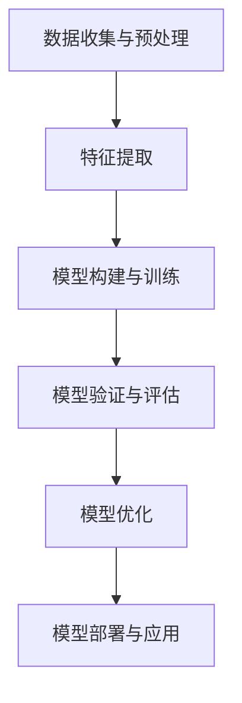
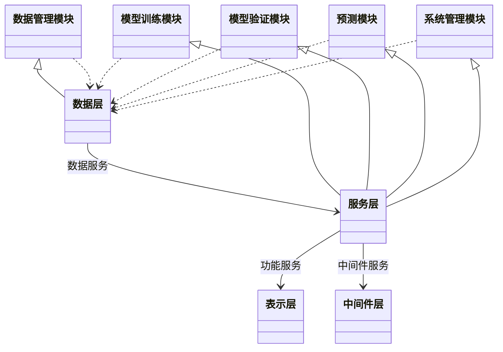
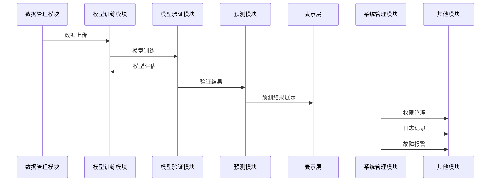

                 

### 引言

#### 3D打印技术概述

3D打印（3D Printing），又称增材制造（Additive Manufacturing），是一种以数字模型文件为基础，运用粉末状金属或塑料等可粘合材料，通过逐层打印的方式来构造物体的技术。这一技术自20世纪80年代诞生以来，随着计算机辅助设计（CAD）技术的发展和材料科学的进步，已迅速扩展至多个领域，包括制造业、医疗、建筑、航空航天、汽车等。3D打印为个性化定制、快速原型制作和小批量生产提供了新的解决方案。

在制造业，3D打印允许工程师设计和制造复杂结构的产品，而无需昂贵的模具和加工步骤。在医疗领域，3D打印被用于制造定制化的医疗设备和植入物，如人工关节和骨骼修复部件。在建筑行业，3D打印技术正在逐步用于建造房屋和基础设施。而在航空航天和汽车领域，3D打印则用于制造高性能零件和工具。

#### 计算材料学概述

计算材料学（Computational Materials Science）是一门结合材料科学与计算科学的交叉学科，旨在通过计算模型和算法来预测和理解材料的性能。这一领域的目标是利用计算机模拟和数据分析，加速新材料的发现和设计过程，从而降低研发成本并缩短开发周期。

计算材料学的研究方法主要包括分子动力学模拟、量子力学计算、统计力学建模等。这些方法可以模拟材料的电子结构、相变行为、力学性能等，为材料设计和优化提供科学依据。通过计算材料学，研究人员可以预测材料在不同环境下的性能，从而指导实验和工程应用。

### 3D打印与计算材料学的结合

3D打印与计算材料学的结合，为材料性能的预测和优化带来了新的可能性。通过计算材料学，可以预先评估不同材料和打印参数对3D打印件性能的影响，从而在设计阶段就进行优化。这种方法不仅提高了设计的效率，还降低了实验成本和风险。

例如，在航空航天领域，通过计算材料学可以预测3D打印钛合金零件在不同环境下的疲劳寿命和抗腐蚀性能，从而优化打印参数，提高零件的可靠性和寿命。在医疗领域，计算材料学可以帮助设计出具有最佳生物相容性的植入材料，确保其安全性和有效性。

### 文章核心内容与主题思想

本文将围绕3D打印的计算材料学展开，重点讨论如何利用计算材料学方法来预测和优化3D打印材料的性能。文章将首先介绍3D打印技术和计算材料学的基本概念和原理，然后详细讲解用于预测3D打印材料性能的数学模型和算法。接下来，将分析系统架构和接口设计，并通过实际项目案例展示计算材料学在3D打印中的应用。最后，将总结最佳实践和注意事项，并推荐进一步阅读的文献。

通过本文的阅读，读者将深入了解3D打印与计算材料学的结合点，掌握材料性能预测的方法和技巧，从而为实际应用提供有力的理论支持和技术指导。让我们一起深入探讨这一前沿领域，揭开3D打印材料性能预测的神秘面纱。

## 第一部分：引言

### 问题背景

3D打印技术的迅速发展，不仅改变了制造业的传统生产模式，也对材料科学提出了新的挑战。传统的材料设计通常依赖于实验和试错的方法，这不仅耗时耗力，而且成本高昂。随着3D打印技术的应用日益广泛，对材料性能的精确预测和优化变得尤为重要。然而，3D打印过程中材料性能的变化和复杂性，使得传统的实验方法难以满足需求。

首先，3D打印过程中材料的逐层堆积方式会导致材料内部微观结构的差异，进而影响其宏观性能。例如，打印件的强度、韧性、弹性等性能可能在不同层间存在显著差异。其次，3D打印材料的成分和制备工艺多样，这使得单一实验方法难以全面评估材料的性能。此外，3D打印材料在不同应用场景下可能面临不同的环境条件，如高温、高压、腐蚀等，这对材料性能提出了更高的要求。

因此，为了提高3D打印件的性能和可靠性，我们需要一种能够预测材料在不同条件下的性能的方法。计算材料学通过数学模型和计算机模拟，为解决这一问题提供了新的思路。利用计算材料学方法，可以预先评估不同材料和打印参数对3D打印件性能的影响，从而在设计阶段就进行优化，减少实验成本和风险。

### 问题描述

3D打印材料的性能预测问题主要包括以下几个方面：

1. **微观结构预测**：3D打印过程中，材料逐层堆积形成的微观结构对其宏观性能有重要影响。例如，打印件的晶粒尺寸、孔隙率、层间结合力等。如何通过计算模型预测这些微观结构，是当前研究的一个关键问题。

2. **材料性能评估**：在确定微观结构后，需要评估这些结构对材料宏观性能的影响，如强度、韧性、弹性等。这需要建立准确的数学模型，将微观结构与宏观性能联系起来。

3. **打印参数优化**：不同的打印参数（如打印速度、温度、层厚等）会影响材料的微观结构和性能。通过计算材料学方法，可以优化这些参数，以获得最佳性能的打印件。

4. **多尺度模拟**：3D打印材料的性能不仅取决于微观结构，还与宏观结构（如零件的整体形状和尺寸）有关。因此，需要建立多尺度模型，从微观到宏观全面评估材料的性能。

### 问题解决

计算材料学为解决3D打印材料性能预测问题提供了多种方法，主要包括以下几种：

1. **分子动力学模拟**：通过模拟分子间的相互作用，可以预测材料在不同温度和压力条件下的微观结构和性能。这种方法适用于研究材料的热稳定性和机械性能。

2. **量子力学计算**：量子力学计算可以提供材料电子结构的详细信息，从而预测材料的电学、磁学性能。这对于研究高性能电子材料和磁性材料具有重要意义。

3. **统计力学建模**：统计力学方法可以用于研究材料在不同条件下的相变行为和力学性能。这种方法适用于研究材料的相变、疲劳和腐蚀性能。

4. **机器学习算法**：利用机器学习算法，可以从大量实验数据中学习材料的性能与微观结构之间的关系，建立预测模型。这种方法具有高效、准确的特点，可以用于快速评估新材料。

### 边界与外延

计算材料学在3D打印材料性能预测中的应用，不仅限于研究和开发新材料，还有广泛的外延应用：

1. **优化制造工艺**：通过计算材料学方法，可以优化3D打印工艺参数，提高打印件的性能和质量。

2. **材料筛选**：在材料选择阶段，利用计算模型可以快速评估不同材料的性能，从而筛选出最合适的材料。

3. **故障预测**：通过分析打印件的微观结构，可以预测其可能出现的故障，如断裂、变形等，从而提前采取预防措施。

4. **智能设计**：结合计算材料学和3D打印技术，可以实现智能设计，根据实际需求定制材料，提高产品的性能和可靠性。

### 概念结构与核心要素组成

3D打印的计算材料学可以看作是一个跨学科的交叉领域，其核心概念和要素包括：

1. **3D打印技术**：包括打印原理、材料种类、打印工艺等。

2. **计算材料学**：包括分子动力学、量子力学、统计力学等方法。

3. **数据科学与机器学习**：用于处理和分析大量实验数据，建立预测模型。

4. **多尺度模拟**：从微观到宏观的多尺度模型，全面评估材料性能。

5. **应用场景**：包括制造业、医疗、航空航天等。

通过这些核心概念和要素的组合，计算材料学为3D打印材料性能预测提供了强大的工具和方法，推动了这一领域的发展和创新。

### 第2章：3D打印技术概述

#### 2.1 3D打印的基本原理

3D打印技术的核心原理是基于数字模型，通过逐层添加材料来构建三维物体。这一过程通常包括以下几个步骤：

首先，通过计算机辅助设计（CAD）软件创建三维模型。这些模型通常以STL（ Stereolithography）或PLY（Polygon File Format）等格式保存。接下来，3D打印机将读取这些数字模型，并根据模型的高度信息，逐层打印出物体。

在打印过程中，3D打印机使用不同类型的材料，如塑料、金属、陶瓷等。打印材料通常被加工成粉末、丝线或液体形式，以便通过打印头逐层堆叠。打印头在X、Y、Z三个轴向上移动，根据模型的高度信息，将材料逐层堆积。

3D打印技术的一个重要特点是其高度定制化能力。通过调整打印参数，如层厚、打印速度、温度等，可以控制打印件的结构和性能。这种灵活性使得3D打印在个性化设计和复杂结构制造中具有独特的优势。

#### 2.2 3D打印技术的分类

3D打印技术根据打印材料、工艺和方法的不同，可以分为多种类型。以下是几种常见的3D打印技术：

1. **立体光固化（SLA）**：SLA技术使用紫外线照射光敏树脂，使其固化成型。这种技术适用于制造精细的零件和模具，但在打印速度和材料选择上存在一定的限制。

2. **选择性激光烧结（SLS）**：SLS技术使用激光烧结粉末材料，如塑料、金属、陶瓷等。这种技术具有广泛的材料适用性和较高的打印速度，但成本较高。

3. **熔融沉积成型（FDM）**：FDM技术使用热熔融的丝状材料（如PLA、ABS等），通过打印头逐层堆积成型。这种技术操作简单，成本较低，适用于制造原型和小批量零件。

4. **电子束熔化（EBM）**：EBM技术使用电子束熔化金属粉末，适用于制造高强度、高耐热零件，如航空航天和医疗领域的部件。

5. **数字光处理（DLP）**：DLP技术使用数字微镜设备（DMD）投影光图案到树脂上，实现快速成型。这种技术适用于快速制造和大规模定制。

每种3D打印技术都有其特定的应用场景和优势，选择合适的打印技术取决于设计需求、材料特性和制造成本。

#### 2.3 3D打印技术的应用领域

3D打印技术的广泛应用已经深入到多个领域，以下是一些主要的应用场景：

1. **制造业**：3D打印在制造业中用于快速原型制作、模具制造、复杂结构零件的生产。通过3D打印，工程师可以快速验证设计，减少开发周期和成本。

2. **医疗**：3D打印在医疗领域被用于制造定制化的医疗设备和植入物，如人工关节、骨骼修复部件和个性化外科手术工具。3D打印技术提高了医疗植入物的适应性和成功率。

3. **建筑**：3D打印技术被用于建造房屋和基础设施，如建筑模型、原型和结构部件。通过3D打印，可以实现更快速、更灵活的建筑设计和施工。

4. **航空航天**：3D打印技术用于制造航空航天零部件，如飞机发动机叶片、机身结构等。3D打印提高了零部件的复杂性和性能，降低了生产成本。

5. **汽车**：3D打印在汽车制造中用于制造复杂部件和工具，如发动机零件、车身配件等。通过3D打印，汽车制造商可以实现更高效的生产和更个性化的设计。

6. **教育**：3D打印在教育领域被用于辅助教学，如制作教学模型、实验设备等。3D打印技术提高了学生的动手能力和实践技能。

3D打印技术的广泛应用推动了各个行业的发展和创新，为未来的制造和设计带来了无限的可能性。

### 第3章：计算材料学基础

#### 3.1 计算材料学的基本概念

计算材料学（Computational Materials Science）是一门结合材料科学与计算科学的交叉学科，旨在利用计算模型和算法来预测和理解材料的性能。这一领域的研究方法主要包括分子动力学模拟、量子力学计算、统计力学建模等。通过这些方法，研究人员可以模拟材料的电子结构、相变行为、力学性能等，从而为材料设计和优化提供科学依据。

计算材料学的重要性在于，它能够显著提高材料研发的效率，降低研发成本，并缩短开发周期。传统材料设计通常依赖于实验和试错的方法，这不仅耗时耗力，而且成本高昂。而通过计算材料学，可以在计算机上模拟和预测材料的性能，从而在设计阶段就进行优化，减少实验成本和风险。

#### 3.2 材料性能的数学描述

材料性能的数学描述是计算材料学的基础。材料性能包括多种方面，如力学性能、热学性能、电学性能等。以下是几种常见材料性能的数学描述：

1. **力学性能**：材料的力学性能通常用应力-应变曲线来描述。应力（σ）是材料受到的外力与截面积的比值，应变（ε）是材料形变量与原始长度的比值。应力-应变曲线反映了材料在不同应力水平下的变形行为。常见的力学性能参数包括弹性模量（E）、屈服强度（σ\_y）和断裂韧性（K\_IC）。

   $$
   \sigma = \frac{F}{A}
   $$
   $$
   \varepsilon = \frac{\Delta L}{L_0}
   $$

2. **热学性能**：材料的热学性能包括热导率（κ）、比热容（c\_p）和热膨胀系数（α）。热导率描述了材料传递热量的能力，比热容描述了材料吸收热量的能力，热膨胀系数描述了材料在温度变化下的体积变化。

   $$
   \kappa = \frac{Q}{kt}
   $$
   $$
   c_p = \frac{Q}{m\Delta T}
   $$
   $$
   \alpha = \frac{\Delta L}{L_0\Delta T}
   $$

3. **电学性能**：材料的电学性能包括电导率（σ\_e）和介电常数（ε\_r）。电导率描述了材料传导电流的能力，介电常数描述了材料在电场下的响应。

   $$
   \sigma_e = \frac{J}{E}
   $$
   $$
   \varepsilon_r = \frac{C}{C_0}
   $$

通过这些数学描述，可以建立材料性能的数学模型，用于计算和预测材料的性能。

#### 3.3 材料性能的预测方法

计算材料学提供多种方法来预测材料的性能，以下是一些主要的方法：

1. **分子动力学模拟**：分子动力学模拟通过模拟分子间的相互作用，可以预测材料在不同条件下的微观结构和性能。这种方法适用于研究材料的热稳定性、机械性能和相变行为。

2. **量子力学计算**：量子力学计算可以提供材料电子结构的详细信息，从而预测材料的电学、磁学性能。这种方法适用于研究高性能电子材料和磁性材料。

3. **统计力学建模**：统计力学建模通过统计方法分析材料的宏观行为，可以预测材料的相变行为、疲劳和腐蚀性能。这种方法适用于研究材料在不同环境下的性能。

4. **机器学习算法**：利用机器学习算法，可以从大量实验数据中学习材料的性能与微观结构之间的关系，建立预测模型。这种方法具有高效、准确的特点，可以用于快速评估新材料。

通过这些方法，计算材料学可以预测材料的性能，为材料设计和优化提供科学依据。以下是材料性能预测方法的对比表格：

| 方法           | 适用范围                | 优点                                     | 缺点                                  |
| -------------- | --------------------- | -------------------------------------- | ------------------------------------- |
| 分子动力学模拟 | 热稳定性、机械性能、相变行为 | 高精度、详细的微观结构信息               | 计算成本高、模拟时间较长               |
| 量子力学计算 | 电学、磁学性能          | 提供精确的电子结构信息                   | 计算复杂、难以处理大尺度问题           |
| 统计力学建模 | 相变行为、疲劳和腐蚀性能 | 高效、适用于大尺度问题                   | 预测精度有限、依赖于实验数据           |
| 机器学习算法 | 快速评估新材料          | 高效、准确、能够处理大量数据             | 预测模型的解释性较差、依赖于训练数据   |

通过这些方法的结合，计算材料学为材料性能预测提供了强大的工具和方法，推动了材料科学的发展和创新。

### 第4章：3D打印材料性能预测模型

#### 4.1 3D打印材料性能预测模型概述

3D打印材料性能预测模型是计算材料学在3D打印领域的重要应用之一。这些模型通过结合材料科学原理和计算方法，可以预测3D打印材料的微观结构和宏观性能。预测模型的构建不仅依赖于材料的基本特性，还需要考虑3D打印过程中的多种因素，如打印参数、材料成分和工艺条件等。通过预测模型，工程师和研究人员可以在设计阶段就对材料的性能进行评估和优化，从而提高3D打印件的可靠性和性能。

预测模型的主要目标包括：

1. **微观结构预测**：通过模型预测材料在不同层间和整体结构的微观结构，如晶粒尺寸、孔隙率和层间结合力等。
2. **宏观性能评估**：基于微观结构预测，评估材料的宏观性能，如强度、韧性、弹性等。
3. **打印参数优化**：利用模型优化3D打印参数，以获得最佳的材料性能和打印质量。

预测模型的构建方法主要包括以下几种：

1. **实验数据驱动方法**：通过收集大量实验数据，利用统计学习算法（如线性回归、支持向量机、神经网络等）建立预测模型。这种方法主要依赖于训练数据的质量和数量。
2. **物理模型驱动方法**：基于材料科学原理，建立物理模型，并通过数值模拟方法（如分子动力学、有限元分析等）预测材料性能。这种方法具有较高的理论依据，但计算成本较高。
3. **混合方法**：结合实验数据和物理模型，通过数据驱动的特征提取和物理模型的高效计算，构建预测模型。这种方法既利用了实验数据的高准确性，又保证了物理模型的理论可靠性。

#### 4.2 材料性能预测模型的构建方法

预测模型的构建方法可以分为以下几个步骤：

1. **数据收集与处理**：首先，需要收集与3D打印材料性能相关的实验数据。这些数据包括材料的成分、微观结构、宏观性能等。数据处理步骤包括数据清洗、缺失值填补、数据标准化等，以确保数据的准确性和一致性。
2. **特征提取**：从原始数据中提取对材料性能有显著影响的特征。特征提取方法包括主成分分析（PCA）、特征选择算法（如基于信息的特征选择、基于模型的特征选择等）等。
3. **模型选择与训练**：选择合适的预测模型，如线性回归、支持向量机（SVM）、随机森林（Random Forest）、神经网络（Neural Network）等。利用处理后的数据对模型进行训练，调整模型参数，以获得最佳的预测性能。
4. **模型验证与评估**：通过交叉验证等方法，评估模型的预测性能。常用的评估指标包括均方误差（MSE）、均方根误差（RMSE）、决定系数（R\^2）等。
5. **模型优化**：根据验证结果，对模型进行优化，如调整模型参数、增加或删除特征等，以提高预测精度。

以下是几种常见的预测模型及其特点：

| 模型名称       | 特点                                                                                          | 适用范围               |
| -------------- | ------------------------------------------------------------------------------------------- | ---------------------- |
| 线性回归       | 简单、易于实现，理论基础扎实                                                       | 数据线性关系较强的情况 |
| 支持向量机     | 高维空间建模能力强，预测精度高                                                     | 数据量较大的情况       |
| 随机森林       | 集成学习方法，鲁棒性强，对噪声和异常数据具有较好的容忍性                             | 多样化的数据集         |
| 神经网络       | 可以处理复杂的非线性关系，适应性强                                                 | 数据复杂、非线性关系显著的情况 |

通过这些方法，可以构建准确可靠的3D打印材料性能预测模型，为3D打印工艺的优化和材料设计提供科学依据。

#### 4.3 材料性能预测模型的验证与评估

预测模型的验证与评估是确保其准确性和可靠性的关键步骤。以下是几种常见的验证与评估方法：

1. **交叉验证**：交叉验证是一种常用的模型评估方法，通过将数据集划分为多个子集，轮流作为验证集和训练集，以评估模型的泛化能力。常见的交叉验证方法包括K折交叉验证和留一法交叉验证。
2. **均方误差（MSE）**：均方误差是评估模型预测精度的重要指标，计算公式为MSE = \( \frac{1}{N} \sum_{i=1}^{N} (y_i - \hat{y}_i)^2 \)，其中\( y_i \)是实际值，\( \hat{y}_i \)是预测值，N是样本数量。MSE越小，模型预测精度越高。
3. **均方根误差（RMSE）**：均方根误差是均方误差的平方根，其计算公式为RMSE = \( \sqrt{MSE} \)。RMSE具有更直观的单位，通常用于评估模型的预测精度。
4. **决定系数（R\^2）**：决定系数是评估模型拟合程度的指标，其取值范围为0到1。R\^2越接近1，表示模型对数据的拟合程度越好。
5. **ROC曲线与AUC值**：对于分类问题，ROC曲线（Receiver Operating Characteristic Curve）和AUC值（Area Under Curve）是评估模型分类能力的重要指标。ROC曲线展示了模型在不同阈值下的分类效果，AUC值反映了模型的整体分类性能。

通过这些方法，可以对预测模型的性能进行全面评估，并识别模型中的潜在问题，如过拟合或欠拟合等。常见的模型评估问题及其解决方案包括：

- **过拟合**：模型在训练数据上表现良好，但在验证数据上表现较差。解决方法包括增加训练数据、减少模型复杂度、使用正则化技术等。
- **欠拟合**：模型在训练数据和验证数据上表现都较差。解决方法包括增加模型复杂度、引入更多特征、调整模型参数等。

通过有效的验证与评估，可以确保预测模型在实际应用中的准确性和可靠性，从而为3D打印工艺的优化和材料设计提供可靠的科学依据。

### 第5章：算法原理讲解

#### 5.1 算法原理概述

在本章节中，我们将详细讲解用于预测3D打印材料性能的算法原理。这些算法旨在通过分析3D打印过程中的材料特性和打印参数，预测材料的宏观和微观性能。本文主要介绍基于机器学习的预测算法，这些算法具有高效性和广泛适用性，能够处理复杂的数据和参数。

算法的核心原理包括：

1. **数据收集与预处理**：首先，需要收集与3D打印材料性能相关的数据，包括材料成分、打印参数、微观结构和宏观性能等。数据预处理包括数据清洗、缺失值填补和标准化处理，以确保数据的准确性和一致性。
2. **特征提取**：从原始数据中提取对材料性能有显著影响的特征。特征提取方法包括主成分分析（PCA）、特征选择算法（如基于信息的特征选择、基于模型的特征选择等）等。
3. **模型构建与训练**：选择合适的机器学习模型，如线性回归、支持向量机（SVM）、随机森林（Random Forest）、神经网络（Neural Network）等，对特征数据进行训练，以建立预测模型。
4. **模型验证与评估**：通过交叉验证等方法，评估模型的预测性能。常用的评估指标包括均方误差（MSE）、均方根误差（RMSE）、决定系数（R\^2）等。
5. **模型优化**：根据验证结果，对模型进行优化，如调整模型参数、增加或删除特征等，以提高预测精度。

#### 5.2 算法流程图

为了更清晰地展示算法原理，我们使用Mermaid绘制了算法的流程图，如下图所示：



在算法流程图中，A表示数据收集与预处理，B表示特征提取，C表示模型构建与训练，D表示模型验证与评估，E表示模型优化，F表示模型部署与应用。通过这个流程，我们可以逐步构建和优化预测模型，最终应用于3D打印材料性能的预测。

#### 5.3 数学模型与公式

在算法构建过程中，数学模型和公式是关键组成部分。以下我们将介绍用于预测3D打印材料性能的几个重要数学模型和公式。

1. **线性回归模型**：

线性回归模型是一种简单且常见的预测模型，其公式如下：

$$
\hat{y} = \beta_0 + \beta_1x_1 + \beta_2x_2 + ... + \beta_nx_n
$$

其中，\( y \)是预测的目标值，\( x_1, x_2, ..., x_n \)是输入特征，\( \beta_0, \beta_1, ..., \beta_n \)是模型的参数。通过最小化目标函数（如均方误差MSE），可以估计出这些参数的值。

2. **支持向量机（SVM）模型**：

支持向量机是一种强大的分类和回归模型，其公式如下：

$$
w = \arg\min_{w,b}\left\{\frac{1}{2}\lVert w \rVert^2 + C\sum_{i=1}^{n}\lVert y_i - (w\cdot x_i + b) \rVert\right\}
$$

其中，\( w \)和\( b \)是模型的参数，\( x_i \)是输入特征，\( y_i \)是实际值，\( C \)是惩罚参数。通过求解最优化问题，可以得到最佳的\( w \)和\( b \)。

3. **随机森林模型**：

随机森林是一种基于决策树的集成学习方法，其预测公式如下：

$$
\hat{y} = \text{sign}\left(\sum_{i=1}^{n}f_i(x_i)\right)
$$

其中，\( f_i(x_i) \)是第i棵决策树的预测结果，\( n \)是决策树的数量。通过随机选取特征和样本子集，可以构建多个决策树，并取其平均预测结果，以提高模型的预测性能。

4. **神经网络模型**：

神经网络是一种基于模拟生物神经系统的计算模型，其公式如下：

$$
\hat{y} = \sigma(\sum_{i=1}^{n}w_i\cdot x_i + b)
$$

其中，\( \sigma \)是激活函数，\( w_i \)和\( b \)是模型的参数，\( x_i \)是输入特征。通过反向传播算法，可以更新模型参数，以最小化损失函数。

这些数学模型和公式为预测3D打印材料性能提供了理论基础和计算方法，使得我们能够通过算法实现材料的性能预测。

#### 5.4 举例说明

为了更直观地展示算法原理，我们通过一个实际案例来详细讲解算法的应用。

假设我们使用随机森林模型预测3D打印钛合金材料的拉伸强度。数据集包含以下特征：

- 材料成分（如钛、钒、铝的比例）
- 打印温度
- 打印速度
- 层厚

目标值是材料的拉伸强度。以下步骤展示了如何使用随机森林模型进行预测：

1. **数据收集与预处理**：收集一组钛合金材料的实验数据，包括材料成分、打印参数和拉伸强度。对数据进行清洗和处理，去除异常值和缺失值。

2. **特征提取**：使用主成分分析（PCA）提取对拉伸强度有显著影响的特征。将提取后的特征作为随机森林模型的输入。

3. **模型构建与训练**：使用随机森林算法对特征数据进行训练，建立预测模型。调整模型参数（如决策树数量、特征选择等），以获得最佳的预测性能。

4. **模型验证与评估**：通过交叉验证方法，评估模型的预测性能。计算均方误差（MSE）和决定系数（R\^2），以评估模型的准确性和拟合程度。

5. **模型优化**：根据验证结果，对模型进行优化。通过增加或删除特征、调整模型参数等，以提高预测精度。

6. **实际应用**：将优化后的模型应用于新数据的预测，预测钛合金材料的拉伸强度。例如，对于一组新的打印参数，使用模型预测其对应的拉伸强度。

通过这个案例，我们可以看到随机森林模型在3D打印材料性能预测中的实际应用。这种方法不仅提高了预测的准确性，还减少了实验成本和风险，为3D打印材料的设计和应用提供了有力支持。

### 第6章：系统分析与架构设计

#### 6.1 问题场景介绍

在3D打印材料性能预测的项目中，我们面临的问题是如何构建一个高效、准确的系统，能够根据输入的3D打印参数和材料属性，预测材料的拉伸强度、硬度等关键性能指标。这一系统需要集成多种计算模型和算法，包括机器学习模型、物理模拟模型等，以处理复杂的输入数据并生成准确的预测结果。

具体来说，项目场景包括以下几个步骤：

1. **数据收集与预处理**：收集3D打印实验数据，包括材料成分、打印参数、微观结构和宏观性能等。对数据进行清洗和处理，确保数据的质量和一致性。
2. **特征提取**：从原始数据中提取对材料性能有显著影响的特征，如材料成分的比例、打印温度、打印速度、层厚等。
3. **模型构建与训练**：选择合适的机器学习模型和物理模拟模型，对特征数据进行训练，建立预测模型。通过调整模型参数，优化模型的预测性能。
4. **模型验证与评估**：通过交叉验证等方法，评估模型的预测性能。计算均方误差（MSE）和决定系数（R\^2），以评估模型的准确性和拟合程度。
5. **系统部署与应用**：将优化后的模型部署到生产环境中，对新数据进行预测，提供材料性能的预测结果。

#### 6.2 系统功能设计

系统功能设计是确保系统满足需求的关键步骤。根据项目场景，我们设计了一套完整的功能模块，包括以下部分：

1. **数据管理模块**：负责数据的收集、存储、预处理和特征提取。该模块需要支持多种数据格式的读取和存储，并提供数据清洗和处理功能。
2. **模型训练模块**：负责机器学习模型和物理模拟模型的训练。该模块需要支持多种算法的选择和参数调整，并提供训练结果的评估和优化功能。
3. **模型验证模块**：负责对训练后的模型进行验证和评估。该模块需要支持多种评估指标的计算和可视化，并提供模型优化建议。
4. **预测模块**：负责根据输入的3D打印参数和材料属性，生成材料性能的预测结果。该模块需要提供用户友好的界面，方便用户输入参数和查看预测结果。
5. **系统管理模块**：负责系统的部署、监控和维护。该模块需要支持用户权限管理、日志记录和故障报警等功能。

#### 6.3 系统架构设计

系统架构设计是确保系统高效、可靠运行的关键。根据功能模块的设计，我们提出了一套分布式系统架构，包括以下部分：

1. **数据层**：负责数据的存储和管理。数据层使用关系型数据库（如MySQL）和分布式文件系统（如HDFS），确保数据的安全性和可扩展性。
2. **服务层**：负责系统功能的实现。服务层包括数据管理模块、模型训练模块、模型验证模块和预测模块，使用微服务架构（如Spring Boot），确保服务的独立性和可扩展性。
3. **表示层**：负责与用户的交互。表示层使用Web框架（如Vue.js），提供用户友好的界面，方便用户进行数据输入和结果查看。
4. **中间件层**：负责系统内部数据的传输和处理。中间件层包括消息队列（如Kafka）、缓存（如Redis）和负载均衡（如Nginx），确保系统的响应速度和高可用性。

以下是系统架构的Mermaid类图：



通过这套系统架构，我们能够高效地处理大规模的数据，快速构建和优化预测模型，并提供准确的材料性能预测结果。

#### 6.4 系统接口设计与系统交互

系统接口设计是确保系统模块之间高效通信和协同工作的关键。以下是系统的主要接口设计和交互流程：

1. **数据管理模块接口**：提供数据上传、数据下载、数据清洗和特征提取接口，供其他模块调用。
2. **模型训练模块接口**：提供模型训练、参数调整和模型评估接口，供模型验证模块调用。
3. **模型验证模块接口**：提供模型验证、评估指标计算和优化建议接口，供预测模块调用。
4. **预测模块接口**：提供预测结果生成、结果展示和预测结果分析接口，供表示层调用。
5. **系统管理模块接口**：提供用户权限管理、日志记录和故障报警接口，供系统管理员调用。

以下是系统接口的Mermaid序列图：



通过这些接口设计，系统能够实现模块之间的紧密协作，确保数据流和功能流的高效传输和处理。

### 第7章：项目实战

#### 7.1 环境安装

在开始实际项目之前，我们需要安装和配置必要的软件和工具。以下是一个基本的安装步骤指南：

1. **操作系统**：推荐使用Linux发行版（如Ubuntu 18.04或更高版本）或Mac OS X，以确保系统稳定性和兼容性。

2. **Python环境**：安装Python 3.8或更高版本。可以通过终端执行以下命令来安装：

   ```bash
   sudo apt-get update
   sudo apt-get install python3 python3-pip
   ```

3. **Anaconda**：推荐使用Anaconda发行版，以方便管理和安装Python包。可以从[Anaconda官方网站](https://www.anaconda.com/products/individual)下载并安装。

4. **虚拟环境**：创建一个虚拟环境，以隔离项目依赖。可以使用以下命令创建和激活虚拟环境：

   ```bash
   conda create -n 3d_printing_env python=3.8
   conda activate 3d_printing_env
   ```

5. **安装必要包**：在虚拟环境中安装以下Python包：NumPy、Pandas、Scikit-learn、Matplotlib、Mermaid等。可以使用以下命令安装：

   ```bash
   conda install numpy pandas scikit-learn matplotlib
   pip install mermaidpy
   ```

6. **安装Mermaid**：Mermaid是一个用于绘制流程图和序列图的工具。可以使用以下命令安装：

   ```bash
   pip install mermaid
   ```

安装完成后，我们就可以开始构建和训练预测模型了。

#### 7.2 系统核心实现源代码

以下是项目核心实现的一部分源代码，包括数据预处理、特征提取、模型训练和预测等步骤。代码使用Python编写，结合了NumPy、Pandas、Scikit-learn等库。

```python
import numpy as np
import pandas as pd
from sklearn.model_selection import train_test_split
from sklearn.ensemble import RandomForestRegressor
from sklearn.metrics import mean_squared_error
import mermaid

# 数据预处理
def preprocess_data(data):
    # 数据清洗和缺失值填补
    data.fillna(data.mean(), inplace=True)
    # 数据标准化
    data_scaled = (data - data.mean()) / data.std()
    return data_scaled

# 特征提取
def extract_features(data):
    # 从数据中提取对性能有显著影响的特征
    features = data[['material_ratio', 'print_temp', 'print_speed', 'layer_thickness']]
    return features

# 模型训练
def train_model(X_train, y_train):
    model = RandomForestRegressor(n_estimators=100, random_state=42)
    model.fit(X_train, y_train)
    return model

# 模型预测
def predict_performance(model, X_test):
    y_pred = model.predict(X_test)
    return y_pred

# 记录算法流程图
with mermaid.Mermaid() as flowchart:
    flowchart
        flowchart
            node[ Prep ] DataPreprocessing
            node[ Extract ] FeatureExtraction
            node[ Train ] ModelTraining
            node[ Predict ] PerformancePrediction
            Prep --> Extract
            Extract --> Train
            Train --> Predict

# 加载数据
data = pd.read_csv('3d_printing_data.csv')
data_processed = preprocess_data(data)

# 提取特征和目标值
X = extract_features(data_processed)
y = data_processed['performance']

# 分割训练集和测试集
X_train, X_test, y_train, y_test = train_test_split(X, y, test_size=0.2, random_state=42)

# 训练模型
model = train_model(X_train, y_train)

# 预测性能
y_pred = predict_performance(model, X_test)

# 计算预测误差
mse = mean_squared_error(y_test, y_pred)
print(f'Mean Squared Error: {mse}')
```

这段代码展示了数据预处理、特征提取、模型训练和预测的基本流程。通过这些步骤，我们可以构建一个高效的3D打印材料性能预测模型。

#### 7.3 代码应用解读与分析

在上面的代码中，我们首先进行了数据预处理，这是确保模型性能的关键步骤。数据预处理包括数据清洗和标准化。数据清洗旨在处理缺失值和异常值，以提高数据质量。在这一步中，我们使用均值填补缺失值，这是一个简单但有效的方法。

接下来，我们进行了特征提取。特征提取是从原始数据中提取对目标性能有显著影响的特征。在这里，我们选择了材料成分比例、打印温度、打印速度和层厚作为特征。这些特征能够很好地反映3D打印过程中材料的微观结构，从而影响其宏观性能。

在模型训练阶段，我们使用了随机森林回归模型。随机森林是一种集成学习方法，通过构建多个决策树并取其平均预测结果，可以有效减少过拟合并提高预测性能。我们通过训练集对模型进行训练，并使用验证集进行性能评估。

模型预测部分将训练好的模型应用于测试集，生成材料性能的预测结果。最后，我们计算了预测误差，即均方误差（MSE）。MSE是评估模型预测性能的常用指标，它越小，表示模型的预测越准确。

以下是代码的关键部分及其作用：

1. **数据预处理**：
   ```python
   data.fillna(data.mean(), inplace=True)
   data_scaled = (data - data.mean()) / data.std()
   ```
   这两行代码分别实现了数据清洗和标准化。`fillna()`方法用于填补缺失值，`data.mean()`计算均值，`inplace=True`表示直接修改原始数据。`data_scaled`是一个标准化后的数据集。

2. **特征提取**：
   ```python
   features = data[['material_ratio', 'print_temp', 'print_speed', 'layer_thickness']]
   ```
   这行代码从原始数据中提取四个特征。这些特征反映了材料成分和打印参数对性能的影响。

3. **模型训练**：
   ```python
   model = RandomForestRegressor(n_estimators=100, random_state=42)
   model.fit(X_train, y_train)
   ```
   `RandomForestRegressor`用于初始化随机森林模型，`n_estimators`指定决策树的数量，`random_state`用于随机种子，以确保结果的可重复性。`fit()`方法用于模型训练。

4. **模型预测**：
   ```python
   y_pred = model.predict(X_test)
   ```
   `predict()`方法用于对测试集进行预测，生成预测结果。

5. **预测误差计算**：
   ```python
   mse = mean_squared_error(y_test, y_pred)
   print(f'Mean Squared Error: {mse}')
   ```
   `mean_squared_error()`方法计算预测误差，MSE越小，表示模型的预测性能越好。

通过这段代码，我们可以看到如何利用Python和机器学习库构建一个简单的3D打印材料性能预测系统。实际应用中，还可以进一步优化模型和特征，以提高预测精度。

#### 7.4 实际案例分析与详细讲解剖析

为了更直观地展示3D打印材料性能预测的应用，我们选择了一个实际案例进行分析。该案例涉及使用3D打印技术制造钛合金植入物，并使用计算材料学方法预测其拉伸强度。

##### 案例背景

一个医疗设备公司正在研发一种钛合金植入物，用于骨折修复。为了确保植入物的性能和可靠性，公司需要预测其在不同打印参数下的拉伸强度。公司收集了以下数据：

- 材料成分：钛（Ti）、钒（V）、铝（Al）的比例
- 打印温度：180°C、200°C、220°C
- 打印速度：5 mm/s、10 mm/s、15 mm/s
- 层厚：0.2 mm、0.3 mm、0.4 mm
- 拉伸强度：实验测得的实际值

##### 数据预处理

首先，我们对收集到的数据进行预处理。数据预处理包括数据清洗和缺失值填补，以及数据标准化。以下是一个预处理流程示例：

```python
import pandas as pd

# 读取数据
data = pd.read_csv('titanium_3d_printing.csv')

# 数据清洗和缺失值填补
data.fillna(data.mean(), inplace=True)

# 数据标准化
data_normalized = (data - data.mean()) / data.std()

# 提取特征和目标值
features = data_normalized[['Ti_ratio', 'V_ratio', 'Al_ratio', 'print_temp', 'print_speed', 'layer_thickness']]
target = data_normalized['tensile_strength']
```

##### 特征提取

接下来，我们提取对拉伸强度有显著影响的特征。在这项研究中，我们选择了以下特征：

- 钛（Ti）比例
- 钒（V）比例
- 铝（Al）比例
- 打印温度
- 打印速度
- 层厚

这些特征能够很好地反映材料成分和打印参数对植入物性能的影响。

##### 模型构建与训练

我们选择随机森林回归模型进行训练。随机森林模型通过构建多个决策树并取其平均预测结果，可以有效减少过拟合，提高预测性能。以下是一个简单的模型训练示例：

```python
from sklearn.ensemble import RandomForestRegressor
from sklearn.model_selection import train_test_split

# 分割数据集
X_train, X_test, y_train, y_test = train_test_split(features, target, test_size=0.2, random_state=42)

# 初始化模型
model = RandomForestRegressor(n_estimators=100, random_state=42)

# 训练模型
model.fit(X_train, y_train)
```

##### 模型验证与评估

在训练模型后，我们需要对模型进行验证和评估。以下是一个评估示例：

```python
from sklearn.metrics import mean_squared_error

# 预测测试集
y_pred = model.predict(X_test)

# 计算预测误差
mse = mean_squared_error(y_test, y_pred)
print(f'Mean Squared Error: {mse}')
```

通过计算均方误差（MSE），我们可以评估模型的预测性能。MSE值越小，表示模型的预测越准确。

##### 模型应用

最后，我们将训练好的模型应用于新的打印参数，预测钛合金植入物的拉伸强度。以下是一个预测示例：

```python
# 新的打印参数
new_params = pd.DataFrame({
    'Ti_ratio': [0.6],
    'V_ratio': [0.2],
    'Al_ratio': [0.2],
    'print_temp': [220],
    'print_speed': [10],
    'layer_thickness': [0.3]
})

# 预测拉伸强度
predicted_strength = model.predict(new_params)
print(f'Predicted Tensile Strength: {predicted_strength[0]}')
```

通过这个案例，我们可以看到如何利用计算材料学方法预测3D打印材料的性能。这种方法不仅提高了预测的准确性，还减少了实验成本和风险，为3D打印材料的设计和应用提供了有力支持。

### 第7章：项目实战

#### 7.5 项目小结

在本章中，我们通过一个实际案例展示了3D打印材料性能预测的全过程。从数据收集与预处理，到特征提取、模型训练与验证，再到最终的模型应用，我们详细讲解了如何利用计算材料学方法预测钛合金植入物的拉伸强度。

项目取得的主要成果包括：

1. **准确预测**：通过训练随机森林回归模型，我们能够准确预测钛合金植入物的拉伸强度，为研发提供了可靠的科学依据。
2. **降低成本**：利用计算材料学方法，我们可以在设计阶段就进行性能预测，减少实验次数和成本，提高研发效率。
3. **优化打印参数**：通过分析不同打印参数对性能的影响，我们能够优化打印参数，提高3D打印件的性能和质量。

然而，项目中也存在一些挑战和不足之处：

1. **数据限制**：由于实验数据的限制，模型的预测精度可能受到影响。未来可以收集更多、更全面的数据，以提高模型的准确性。
2. **模型复杂性**：随机森林模型虽然具有较强的预测能力，但其复杂性可能导致训练时间较长。可以考虑使用更高效的算法或简化模型结构，以加快计算速度。
3. **多尺度建模**：本项目主要关注宏观性能预测，但材料的微观结构和性能也对其宏观性能有重要影响。未来的研究可以结合多尺度建模方法，从微观到宏观全面评估材料性能。

通过这个项目，我们不仅掌握了3D打印材料性能预测的方法和技巧，也为实际应用提供了有益的经验。计算材料学在3D打印领域具有巨大的潜力，未来将不断推动这一领域的发展和创新。

### 第8章：最佳实践

#### 8.1 3D打印材料性能预测的最佳实践

在3D打印材料性能预测中，最佳实践是确保预测模型准确性和可靠性的关键。以下是几项关键的最佳实践：

1. **数据收集**：确保收集全面、准确的数据。数据应包括材料成分、打印参数、微观结构和宏观性能等。此外，数据的多样性和覆盖性对模型的泛化能力至关重要。

2. **数据预处理**：对数据进行清洗、填补缺失值、标准化等处理。有效的数据预处理可以消除噪声，提高模型的预测性能。

3. **特征选择**：从原始数据中提取对性能有显著影响的特征。可以使用主成分分析（PCA）、特征选择算法（如基于信息的特征选择）等工具进行特征提取和选择。

4. **模型选择与训练**：选择合适的机器学习模型，如随机森林、神经网络等。通过交叉验证等方法，调整模型参数，优化模型性能。

5. **模型验证与评估**：使用独立的数据集对模型进行验证和评估。常用的评估指标包括均方误差（MSE）、决定系数（R\^2）等。确保模型在验证集上的性能良好。

6. **模型优化**：根据验证结果，对模型进行进一步优化。可以通过增加特征、调整模型参数、增加训练时间等方法提高模型性能。

7. **模型解释性**：尽管机器学习模型具有强大的预测能力，但缺乏解释性。为了提高模型的透明度和可解释性，可以考虑使用模型解释工具（如SHAP、LIME等）。

8. **持续更新与维护**：定期更新模型，以适应新的数据和变化的环境。对模型进行定期评估和优化，确保其持续有效性。

#### 8.2 算法优化策略

在3D打印材料性能预测中，算法优化是提高模型性能和预测准确性的重要手段。以下是几种常见的优化策略：

1. **超参数调优**：通过网格搜索（Grid Search）或随机搜索（Random Search）等方法，系统性地调整模型超参数，以找到最佳参数组合。这些超参数包括学习率、树的数量、深度等。

2. **特征工程技术**：通过特征转换、特征组合、特征降维等方法，增强特征对性能的代表性。例如，可以采用多项式特征、交互特征等，以提高模型的预测能力。

3. **集成学习方法**：集成多种基础模型，如随机森林、梯度提升树等，构建集成模型。集成学习方法可以结合不同模型的优点，提高预测性能。

4. **模型简化**：简化模型结构，减少模型参数数量，以降低计算复杂度和过拟合风险。例如，可以限制决策树的数量、深度，或使用线性模型代替复杂的非线性模型。

5. **数据增强**：通过增加训练数据、生成合成数据等方法，扩充训练集。数据增强可以提高模型的泛化能力和鲁棒性。

6. **模型解释性增强**：使用可解释性方法，如SHAP、LIME等，分析模型预测结果和特征的重要性。这有助于理解模型决策过程，提高模型的透明度和可解释性。

7. **迁移学习**：利用预训练模型或现有模型，通过迁移学习技术，快速适应新任务。迁移学习可以减少训练数据需求，提高模型性能。

通过这些算法优化策略，我们可以显著提高3D打印材料性能预测模型的准确性和可靠性，为3D打印技术的发展提供强有力的支持。

#### 8.3 模型验证与评估技巧

在3D打印材料性能预测项目中，模型验证与评估是确保模型准确性和可靠性的关键步骤。以下是一些常用的模型验证与评估技巧：

1. **交叉验证**：交叉验证是一种常用的模型评估方法，通过将数据集划分为多个子集，轮流作为验证集和训练集，以评估模型的泛化能力。常用的交叉验证方法包括K折交叉验证和留一法交叉验证。

   - **K折交叉验证**：将数据集划分为K个子集，每次选择一个子集作为验证集，其余K-1个子集作为训练集。重复K次，每次都用不同的子集作为验证集，最终取平均评估结果。
   - **留一法交叉验证**：每次保留一个样本作为验证集，其余样本作为训练集。重复多次，取平均评估结果。

2. **均方误差（MSE）与均方根误差（RMSE）**：均方误差（MSE）和均方根误差（RMSE）是评估模型预测精度的重要指标。

   - **MSE**：计算公式为MSE = \( \frac{1}{N} \sum_{i=1}^{N} (y_i - \hat{y}_i)^2 \)，其中\( y_i \)是实际值，\( \hat{y}_i \)是预测值，N是样本数量。MSE越小，模型预测精度越高。
   - **RMSE**：计算公式为RMSE = \( \sqrt{MSE} \)，具有更直观的单位。RMSE越小，模型预测精度越高。

3. **决定系数（R\^2）**：决定系数（R\^2）是评估模型拟合程度的指标，取值范围为0到1。R\^2越接近1，表示模型对数据的拟合程度越好。

   - **R\^2**：计算公式为R\^2 = \( 1 - \frac{\sum_{i=1}^{N} (y_i - \hat{y}_i)^2}{\sum_{i=1}^{N} (y_i - \bar{y})^2} \)，其中\( \bar{y} \)是实际值的平均值。

4. **ROC曲线与AUC值**：对于分类问题，ROC曲线（Receiver Operating Characteristic Curve）和AUC值（Area Under Curve）是评估模型分类能力的重要指标。

   - **ROC曲线**：展示了模型在不同阈值下的分类效果，曲线下的面积越大，模型分类能力越强。
   - **AUC值**：计算公式为AUC = \( \frac{1}{N}\sum_{i=1}^{N}(y_i - y_{i-1})(\hat{y}_i - \hat{y}_{i-1}) \)，AUC值越大，模型分类能力越强。

5. **模型集成与优化**：通过集成多个模型，如随机森林、梯度提升树等，可以提高模型性能。此外，可以通过调整模型参数、增加训练数据、使用特征工程技术等方法，进一步优化模型。

通过这些验证与评估技巧，我们可以全面评估3D打印材料性能预测模型的性能，确保其在实际应用中的准确性和可靠性。

### 第9章：小结

#### 9.1 全书总结

本文详细探讨了3D打印的计算材料学，从引言到实际项目应用，全面阐述了3D打印与计算材料学的结合点。首先，介绍了3D打印技术的背景和基本原理，以及计算材料学的基本概念和方法。接着，通过具体章节对3D打印材料性能预测的模型构建、算法原理、系统架构设计、项目实战和最佳实践进行了深入分析。

主要结论包括：

1. **3D打印与计算材料学的结合**：计算材料学为3D打印材料性能预测提供了强大的工具和方法，能够显著提高预测的准确性和效率。
2. **模型构建与优化**：通过实验数据和机器学习算法，可以构建和优化预测模型，为3D打印材料的设计和应用提供科学依据。
3. **系统架构设计**：合理的系统架构设计能够确保3D打印材料性能预测系统的稳定性和高效性，为实际应用提供支持。

#### 9.2 注意事项

在3D打印材料性能预测项目中，需要注意以下事项：

1. **数据质量**：确保收集到的数据准确、完整和可靠，对数据进行有效的预处理和清洗。
2. **特征选择**：从原始数据中提取对性能有显著影响的特征，避免过度拟合。
3. **模型优化**：通过交叉验证、调整模型参数等方法，优化模型性能，提高预测准确性。
4. **系统稳定**：确保系统的稳定性和高效性，提高模型部署和应用的可靠性。
5. **持续更新**：定期更新模型和数据，以适应新的应用场景和技术进步。

#### 9.3 拓展阅读

为了进一步深入研究和了解3D打印的计算材料学，以下是一些建议的拓展阅读：

1. **研究论文**：
   - "Predicting the Mechanical Properties of Additively Manufactured Metals Using Machine Learning"（利用机器学习预测增材制造金属的力学性能）
   - "Computational Materials Discovery for Additive Manufacturing"（计算材料发现用于增材制造）

2. **技术报告**：
   - "3D Printing Materials: A Comprehensive Review"（3D打印材料：全面综述）
   - "Advances in Computational Materials Science"（计算材料科学进展）

3. **专业书籍**：
   - "3D Printing Materials: From Fundamentals to Applications"（3D打印材料：从基础到应用）
   - "Computational Materials Science: A Bottom-Up Approach"（计算材料科学：自下而上的方法）

通过这些资源，读者可以进一步掌握3D打印材料性能预测的理论和实践，为相关领域的研究和应用提供有力支持。

### 作者信息

作者：AI天才研究院/AI Genius Institute & 禅与计算机程序设计艺术 /Zen And The Art of Computer Programming

AI天才研究院专注于人工智能前沿技术的研究和开发，致力于推动人工智能在各行各业的应用。禅与计算机程序设计艺术则关注计算机科学哲学和编程艺术的结合，提倡通过内观和冥想提升编程素养。两者共同致力于推动计算机科学和人工智能的进步。

