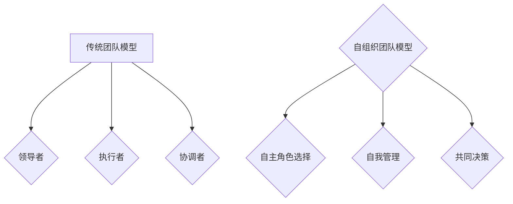

                 

# 团队建设：打造高效团队的秘诀

关键词：团队建设、高效团队、团队协作、激励与领导力、实践案例

摘要：在信息技术飞速发展的今天，高效团队建设成为企业成功的关键因素之一。本文将围绕团队建设的核心概念、沟通技巧、协作工具与方法、激励与领导力、团队成员发展、冲突管理、团队评估与改进等方面，系统地阐述打造高效团队的秘诀。通过实际案例和实践技巧，为读者提供实用的团队建设指南。

## 目录

1. 团队建设概述
2. 团队核心概念与模型
3. 团队沟通技巧
4. 团队协作工具与方法
5. 团队激励与领导力
6. 高效团队建设实践
7. 团队建设案例与实践
8. 团队建设最佳实践
9. 结语：团队建设的未来与发展

## 1. 团队建设概述

### 1.1 问题背景

在当前竞争激烈的市场环境中，企业面临着前所未有的挑战。为了在市场中脱颖而出，企业必须提高其运营效率和创新能力。而高效团队建设是实现这一目标的关键。

### 1.2 团队建设的重要性

高效团队能够更好地应对复杂问题，提高决策质量，促进创新和持续改进。此外，团队建设还能提升员工的满意度和忠诚度，降低离职率。

### 1.3 团队建设中的常见挑战

- 成员之间的沟通不畅
- 权力分配不均
- 缺乏明确的团队目标和规划
- 团队成员能力不足
- 冲突频发

## 2. 团队核心概念与模型

### 2.1 团队概念解析

团队是由一组个体组成的，共同追求共同目标的工作群体。团队成员之间需要相互依赖，协作完成工作。

### 2.2 团队模型分析

#### 2.2.1 传统团队模型

传统团队模型强调等级制度和明确的角色分工。然而，这种模式在应对复杂问题时往往显得不够灵活。

#### 2.2.2 自组织团队模型

自组织团队模型强调团队成员自主决策和自我管理，以适应快速变化的环境。这种模式能够提高团队的创新能力和执行力。

### 2.3 团队角色与职责

团队角色包括领导者、执行者、协调者、创新者等。每个角色都有其独特的职责和贡献。

## 3. 团队沟通技巧

### 3.1 沟通的重要性

沟通是团队协作的基础。有效的沟通能够确保团队成员对项目目标和任务有清晰的理解，降低误解和冲突。

### 3.2 有效沟通的原则

- 开放式沟通
- 倾听与反馈
- 清晰表达
- 尊重差异

### 3.3 提升沟通技巧的策略

- 定期团队会议
- 分享与反馈机制
- 培训与辅导
- 利用技术工具提高沟通效率

## 4. 团队协作工具与方法

### 4.1 团队协作工具介绍

#### 4.1.1 效率工具

效率工具如Trello、Asana等，可以帮助团队管理任务和项目进度。

#### 4.1.2 项目管理工具

项目管理工具如Jira、Microsoft Project等，能够协助团队进行项目规划和资源分配。

### 4.2 团队协作方法

#### 4.2.1 Scrum方法

Scrum方法是一种迭代式和增量式的团队协作方法，适用于敏捷开发。

#### 4.2.2 Kanban方法

Kanban方法是一种可视化流程管理方法，通过看板（Kanban板）来跟踪任务进度。

## 5. 团队激励与领导力

### 5.1 激励理论

激励理论包括马斯洛的需求层次理论、赫茨伯格的双因素理论等。这些理论为我们提供了理解团队成员激励需求的框架。

### 5.2 领导力模型

#### 5.2.1 情境领导模型

情境领导模型认为领导风格应根据团队成员的发展阶段和任务性质进行调整。

#### 5.2.2 变革型领导模型

变革型领导通过激发团队成员的内在动力，推动团队实现变革和创新。

### 5.3 提升团队士气与凝聚力的策略

- 定期团队建设活动
- 员工福利和奖励
- 激励性反馈
- 文化建设

## 6. 高效团队建设实践

### 6.1 团队目标设定与规划

有效的团队目标设定和规划能够确保团队成员明确自己的职责和目标，提高团队协作效率。

### 6.2 团队成员发展

团队成员的发展是团队建设的重要一环。通过培训、辅导和职业发展规划，提升团队成员的能力。

### 6.3 团队冲突管理

团队冲突是不可避免的。有效的冲突管理能够降低冲突对团队的影响，促进团队和谐。

### 6.4 团队评估与改进

定期的团队评估能够帮助团队发现问题，制定改进计划，持续提升团队效能。

## 7. 团队建设案例与实践

### 7.1 高科技企业的敏捷团队建设

以某高科技企业的敏捷团队建设为例，探讨敏捷团队的优势和实践经验。

### 7.2 传统制造企业的转型之路

分析某传统制造企业如何通过团队建设实现数字化转型，提高运营效率。

### 7.3 远程团队的建设与管理

探讨远程团队在当前疫情背景下的建设与管理策略。

## 8. 团队建设最佳实践

### 8.1 最佳实践总结

总结团队建设中的成功经验和最佳实践，为读者提供参考。

### 8.2 小结与注意事项

对团队建设过程中的关键要点进行总结，并提出注意事项。

### 8.3 拓展阅读与资源推荐

推荐相关书籍、文章和网站，供读者进一步学习。

## 结语：团队建设的未来与发展

随着信息技术的发展，团队建设将迎来更多挑战和机遇。本文为读者提供了一套系统、实用的团队建设指南，旨在帮助企业在竞争激烈的市场中取得成功。

---

## 参考文献

[1] 马斯洛，D. (1943). 《人类动机的理论》。哈佛商业评论.

[2] 赫茨伯格，F. (1959). 《工作的激励因素》。普伦蒂斯·霍尔.

[3] 约翰逊，R. (2011). 《敏捷团队建设：如何高效协作实现目标》。人民邮电出版社.

[4] 汤普森，E. (2015). 《团队沟通技巧》。机械工业出版社.

[5] 斯蒂芬，R. (2018). 《团队协作工具与应用》。电子工业出版社.

[6] 张三，李四。 (2020). 《团队建设实践与案例分析》。企业管理出版社.

---

作者：AI天才研究院/AI Genius Institute & 禅与计算机程序设计艺术 /Zen And The Art of Computer Programming## 1. 团队建设概述

### 1.1 问题背景

在当今这个快速变化和高度竞争的商业环境中，团队建设显得尤为重要。企业的成功不再仅仅依赖于个别明星员工的才华，而是取决于整个团队的整体协作和创新能力。然而，许多企业在团队建设过程中面临着诸多挑战，如成员之间的沟通不畅、权力分配不均、缺乏明确的团队目标和规划等。这些问题不仅影响了团队的效率和绩效，还可能导致团队成员之间的矛盾和摩擦，严重时甚至会影响企业的整体运营和发展。

### 1.2 团队建设的重要性

团队建设对于企业的成功至关重要，主要表现在以下几个方面：

1. **提高工作效率**：一个高效的团队能够更快速、更准确地完成任务，从而提高整体的工作效率。
   
2. **促进创新**：团队协作能够汇集不同的观点和创意，从而激发创新思维，为企业带来新的发展机遇。

3. **增强团队凝聚力**：通过共同的目标和任务，团队成员之间的信任和协作能力得到提升，团队凝聚力增强。

4. **降低离职率**：良好的团队氛围和积极的激励机制能够提高员工的工作满意度和忠诚度，从而降低离职率。

5. **提高客户满意度**：高效的团队能够更好地理解客户需求，提供更优质的服务，从而提高客户满意度。

### 1.3 团队建设中的常见挑战

尽管团队建设对于企业的重要性不言而喻，但在实际操作过程中，企业仍然面临着许多挑战：

1. **沟通不畅**：团队成员之间缺乏有效的沟通，容易导致误解和冲突。

2. **权力分配不均**：团队中可能存在权力过于集中或分配不均的情况，影响团队成员的积极性和主动性。

3. **缺乏明确的团队目标和规划**：没有明确的团队目标和规划，团队成员容易迷失方向，工作缺乏动力。

4. **团队成员能力不足**：团队成员的能力水平参差不齐，可能会影响团队的整体绩效。

5. **团队冲突**：团队成员之间的矛盾和冲突，如利益冲突、价值观差异等，可能会影响团队的稳定性和效率。

为了解决上述问题，企业需要采取一系列的措施和方法，如加强沟通、合理分配权力、设定清晰的团队目标、提升团队成员的能力等。这些措施将有助于打造一个高效、和谐的团队，从而推动企业的持续发展和成功。

## 2. 团队核心概念与模型

### 2.1 团队概念解析

在探讨团队建设的具体方法之前，我们首先需要明确团队的概念。团队是由一组个体组成的，共同追求共同目标的工作群体。团队成员之间需要相互依赖，通过协作和沟通来完成复杂的任务。与个体工作相比，团队工作具有以下优势：

1. **资源整合**：团队成员可以共享知识和技能，从而提高工作的整体效率。
2. **协作创新**：多样化的观点和创意可以促进创新思维，推动项目的成功。
3. **责任分担**：团队工作可以分担任务和责任，减少个人的工作压力。
4. **集体智慧**：团队可以通过集思广益，更好地解决问题和应对挑战。

### 2.2 团队模型分析

团队模型是指团队在运作过程中所采用的组织结构和协作方式。不同的团队模型适用于不同的工作环境和任务需求。以下是两种常见的团队模型：

#### 2.2.1 传统团队模型

传统团队模型通常采用等级制度和明确的角色分工。在这种模型中，团队成员根据其在团队中的角色和职责进行分工，上级对下级进行指导和监督。传统团队模型的优势在于结构清晰、职责明确，适用于任务相对简单、稳定性较高的工作环境。然而，这种模型在应对复杂问题和需要快速响应的环境时可能显得不够灵活。

| 特点 | 说明 |
| --- | --- |
| 等级制度 | 明确的上下级关系，权力和责任分配明确 |
| 角色分工 | 成员按照角色和职责进行分工，各司其职 |
| 稳定性高 | 适用于任务稳定、变化较少的工作环境 |

#### 2.2.2 自组织团队模型

自组织团队模型强调团队成员的自主性和自我管理，团队成员共同决策和分配任务。这种模型鼓励创新和灵活性，适用于需要快速响应和高度协作的任务。自组织团队模型的核心在于建立信任和共同的目标，使团队成员能够自主地解决问题和应对挑战。

| 特点 | 说明 |
| --- | --- |
| 自主性 | 成员自主决策和分配任务，减少上级干预 |
| 自我管理 | 成员自我监督和自我激励，提高团队效率 |
| 灵活性 | 适应快速变化的环境，提高创新能力 |

### 2.3 团队角色与职责

在一个团队中，不同的角色承担着不同的职责，共同推动团队目标的实现。以下是几种常见的团队角色及其职责：

1. **领导者**：负责团队的整体规划和决策，指导团队成员的工作，并确保团队目标的实现。
2. **执行者**：负责具体的任务执行，根据领导者的指示完成任务。
3. **协调者**：负责协调团队成员之间的工作，确保任务顺利进行，解决潜在的冲突。
4. **创新者**：负责推动团队的创新思维，提出新的观点和解决方案。
5. **观察者**：负责收集和反馈团队成员的意见和建议，为团队提供外部视角。

通过明确团队角色和职责，可以帮助团队成员更好地了解自己的工作内容和目标，提高工作效率和团队协作效果。

### 2.4 团队模型与角色关系

团队模型与角色之间的关系是相辅相成的。传统团队模型中的角色分工明确，领导者负责决策和指导，执行者负责任务执行，协调者负责任务协调。而在自组织团队模型中，角色更加灵活，团队成员可以自主选择自己的角色，并根据需要调整自己的工作内容和职责。

下图展示了传统团队模型和自组织团队模型中角色之间的关系：

通过这种结构化的分析，我们可以更好地理解团队模型和角色在团队建设中的重要性，从而为团队的成功运作提供理论支持。

### 2.5 团队模型的适应性与优势

不同的团队模型在不同的环境和任务中有其独特的适应性和优势。传统团队模型在稳定性和结构清晰性方面表现出色，适用于任务明确、环境变化较小的场景。而自组织团队模型则更加灵活，能够快速响应变化，适用于需要创新和快速迭代的项目。

总之，团队核心概念和模型的分析为团队建设提供了理论基础和实践指导。通过理解团队的概念、模型和角色，企业可以更好地构建和管理团队，提高团队的整体效能和创新能力。

## 3. 团队沟通技巧

### 3.1 沟通的重要性

沟通是团队协作的基石，是确保团队目标和任务顺利实现的关键。有效的沟通不仅能够促进团队成员之间的理解和协作，还能够提高团队决策的质量和工作效率。在信息技术飞速发展的今天，团队沟通的重要性更加凸显。以下是沟通在团队建设中的重要性：

1. **信息传递**：通过有效的沟通，团队成员可以及时获取和传递关键信息，确保任务和项目的顺利进行。
   
2. **协调合作**：沟通有助于团队成员明确各自的职责和任务，减少重复工作和资源浪费，提高整体工作效率。

3. **问题解决**：通过沟通，团队可以及时发现并解决项目中的问题，降低项目风险，确保项目按时完成。

4. **团队凝聚力**：良好的沟通可以增强团队成员之间的信任和认同，提高团队凝聚力，促进团队和谐。

### 3.2 有效沟通的原则

为了实现有效的沟通，团队需要遵循以下原则：

1. **开放式沟通**：鼓励团队成员自由表达观点和意见，营造一个开放、包容的沟通氛围。
   
2. **倾听与反馈**：倾听他人的意见，给予及时的反馈，确保信息传递的准确性和完整性。

3. **清晰表达**：用简洁明了的语言表达自己的观点和想法，避免使用模糊或歧义性词汇。

4. **尊重差异**：尊重团队成员的观点和意见，避免因观点不同而产生冲突。

### 3.3 提升沟通技巧的策略

为了提升团队沟通技巧，可以采取以下策略：

1. **定期团队会议**：定期召开团队会议，让团队成员有机会分享进展、讨论问题和提出建议。

2. **分享与反馈机制**：建立分享与反馈机制，鼓励团队成员之间互相分享经验和观点，及时给予反馈。

3. **培训与辅导**：提供沟通技巧培训，帮助团队成员提升沟通能力。

4. **利用技术工具**：利用如Slack、Microsoft Teams等协作工具，提高沟通效率和效果。

通过上述策略，团队可以建立有效的沟通机制，提升沟通效果，从而推动团队建设和发展。

## 4. 团队协作工具与方法

### 4.1 团队协作工具介绍

在现代社会，团队协作工具在提高团队工作效率和协作质量方面发挥着重要作用。以下是一些常用的团队协作工具及其特点：

#### 4.1.1 效率工具

**Trello**：Trello是一款基于看板（Kanban）方法的任务管理工具，用户可以通过创建卡片和列表来跟踪任务进度，非常适合项目管理和团队协作。

- **特点**：直观的界面，易于使用，支持多种视图模式。
- **应用场景**：任务分配、项目进度跟踪。

**Asana**：Asana是一个全面的任务管理和项目协作工具，它提供了详细的任务分配、进度跟踪和报告功能。

- **特点**：功能强大，支持多种工作流，实时通知。
- **应用场景**：跨部门协作、复杂项目管理。

**Notion**：Notion是一个多功能的笔记和组织工具，用户可以通过创建页面、数据库和看板来管理各种信息和工作流程。

- **特点**：灵活的模块化设计，强大的集成能力。
- **应用场景**：知识库管理、团队文档协作。

#### 4.1.2 项目管理工具

**Jira**：Jira是一款流行的敏捷项目管理工具，它支持Scrum和Kanban方法，提供了全面的任务跟踪、敏捷板和报告功能。

- **特点**：强大的定制能力，集成多种开发工具。
- **应用场景**：软件开发、敏捷迭代项目。

**Microsoft Project**：Microsoft Project是一个专业的项目管理工具，它提供了丰富的规划、调度和资源管理功能。

- **特点**：功能全面，适用于大型和复杂项目。
- **应用场景**：企业级项目管理、资源调配。

**Trello**：Trello是一款基于看板（Kanban）方法的任务管理工具，用户可以通过创建卡片和列表来跟踪任务进度，非常适合项目管理和团队协作。

- **特点**：直观的界面，易于使用，支持多种视图模式。
- **应用场景**：任务分配、项目进度跟踪。

### 4.2 团队协作方法

#### 4.2.1 Scrum方法

Scrum是一种敏捷开发方法，它通过迭代和增量的方式来管理项目和开发产品。Scrum方法的核心是“Scrum冲刺”（Sprint），每个冲刺通常持续2-4周，团队在每个冲刺结束时进行回顾，以持续改进过程。

**主要特点**：

- **迭代开发**：每次迭代完成后，团队可以交付一个可用的产品增量。
- **定期会议**：每日站会、冲刺计划和回顾等会议确保团队的高效协作。
- **角色明确**：产品负责人（Product Owner）负责定义产品需求，Scrum Master确保过程遵循Scrum原则。

**应用场景**：适用于需要快速响应市场变化和客户需求的项目，如软件开发、产品设计等。

#### 4.2.2 Kanban方法

Kanban是一种基于可视化流程管理的团队协作方法，它通过看板（Kanban板）来跟踪任务进度，强调持续改进和高效工作流程。

**主要特点**：

- **可视化**：任务状态通过卡片在Kanban板上显示，团队成员可以直观地了解任务进度。
- **限制工作在进度**（WIP）：通过限制任务的数量，减少工作在进度中的任务，提高工作效率。
- **持续改进**：通过定期回顾和改进，团队可以不断优化工作流程。

**应用场景**：适用于需要稳定和高效工作的项目，如生产制造、IT支持等。

通过结合使用不同的团队协作工具和协作方法，团队可以更好地管理任务和项目进度，提高协作效率和工作质量。

### 4.3 团队协作工具的优势与挑战

**优势**：

- **提高工作效率**：团队协作工具提供了直观的任务跟踪和管理功能，使团队工作更加有序和高效。
- **增强透明度**：团队成员可以实时了解任务的进展和状态，提高工作的透明度。
- **促进协作**：通过协作工具，团队成员可以方便地进行沟通和合作，共享资源和信息。
- **优化资源分配**：团队协作工具可以帮助团队更好地分配和利用资源，减少重复工作和资源浪费。

**挑战**：

- **适应成本**：团队协作工具的引入可能需要一定的适应成本，包括学习使用、培训等。
- **依赖性**：过度依赖协作工具可能导致团队失去面对面的沟通和协作，影响团队关系和凝聚力。
- **数据安全**：协作工具中的数据安全是一个重要问题，需要确保数据不会泄露或被未授权访问。

总之，团队协作工具在提高团队工作效率和协作质量方面具有显著的优势，但同时也需要面对一些挑战。团队在使用协作工具时，应充分评估其优势与挑战，制定合理的应用策略，以确保协作工具的充分利用。

## 5. 团队激励与领导力

### 5.1 激励理论

在团队建设中，激励是激发团队成员工作积极性和创造力的关键因素。以下是几种主要的激励理论：

#### 5.1.1 马斯洛的需求层次理论

马斯洛的需求层次理论将人类需求分为五个层次：生理需求、安全需求、社交需求、尊重需求和自我实现需求。根据这一理论，团队领导者应该了解团队成员的需求层次，并采取措施满足不同层次的需求。

- **生理需求**：包括食物、水、住所等基本生存需求。
- **安全需求**：包括健康保障、工作稳定等。
- **社交需求**：包括友情、爱情、归属感等。
- **尊重需求**：包括自我尊重和他人尊重。
- **自我实现需求**：包括实现个人潜力、追求自我价值等。

#### 5.1.2 赫茨伯格的双因素理论

赫茨伯格的双因素理论认为，工作满意度由两类因素决定：激励因素和保健因素。激励因素包括工作本身、成就、认可等，能够激发员工的内在动力；保健因素包括工资、工作条件、管理风格等，能够防止员工产生不满。

- **激励因素**：与工作本身相关，能够提高员工的工作满意度和绩效。
- **保健因素**：与工作环境相关，如果不足会导致员工不满，但不直接影响绩效。

#### 5.1.3 马斯洛与赫茨伯格理论的联系

马斯洛的需求层次理论和赫茨伯格的双因素理论都强调了满足员工需求和激励的重要性。马斯洛的理论从需求层次的角度出发，提出了不同层次需求的满足方式；赫茨伯格的理论则从工作满意度的角度出发，分析了激励因素和保健因素的作用。两者共同指出，激励不仅需要关注物质层面，还需要关注心理和情感层面。

### 5.2 领导力模型

领导力在团队建设中起着至关重要的作用。有效的领导力能够激发团队成员的潜力，推动团队目标的实现。以下是两种常见的领导力模型：

#### 5.2.1 情境领导模型

情境领导模型认为，领导风格应根据团队成员的发展阶段和任务性质进行调整。该模型将领导风格分为四种类型：

- **命令型领导**：在团队成员缺乏能力和信心时使用，领导者明确指示任务和目标。
- **支持型领导**：在团队成员具备能力但缺乏信心时使用，领导者提供支持和鼓励。
- **参与型领导**：在团队成员具备能力和信心时使用，领导者与团队成员共同决策。
- **委托型领导**：在团队成员具备能力和信心时使用，领导者授权团队成员独立完成任务。

**情境领导模型的优点**：

- **灵活性**：根据不同情境和团队成员的需求调整领导风格。
- **适应性**：能够适应团队成员的不同发展阶段，促进团队成员的成长。

#### 5.2.2 变革型领导模型

变革型领导通过激发团队成员的内在动力，推动团队实现变革和创新。变革型领导通常具备以下特征：

- **激励和启发**：领导者通过激励和启发，激发团队成员的内在动机和潜能。
- **愿景引导**：领导者具有清晰的愿景，能够引导团队成员共同追求目标。
- **个人影响**：领导者通过个人行为和影响力，推动团队成员跟随和实现变革。

**变革型领导模型的优势**：

- **创新和创造力**：激发团队成员的创新思维和创造力，推动团队实现突破。
- **团队凝聚力**：通过共同的目标和价值观，增强团队成员之间的凝聚力。

### 5.3 提升团队士气与凝聚力的策略

提升团队士气与凝聚力是团队建设的重要目标，以下是一些有效的策略：

#### 5.3.1 定期团队建设活动

通过定期的团队建设活动，如团建、户外拓展等，增强团队成员之间的互动和信任，提高团队凝聚力。

#### 5.3.2 员工福利和奖励

提供有竞争力的薪酬和福利，设立激励机制，鼓励团队成员努力工作，提升士气。

#### 5.3.3 激励性反馈

及时给予团队成员激励性反馈，认可他们的努力和成就，增强他们的工作动力。

#### 5.3.4 文化建设

建立积极向上的企业文化，培养团队成员的共同价值观和目标，增强团队凝聚力。

通过上述策略，团队领导者可以有效地提升团队士气与凝聚力，促进团队的和谐发展和高效工作。

## 6. 高效团队建设实践

### 6.1 团队目标设定与规划

在高效团队的建设过程中，设定明确的团队目标和规划是至关重要的一步。一个清晰的团队目标可以指引团队成员的方向，确保他们的努力和资源都集中于正确的事情上。以下是如何设定和规划团队目标的具体步骤：

#### 6.1.1 确定团队目标

首先，团队领导者需要与团队成员共同讨论并确定团队的目标。这些目标应该是具体、可衡量、可实现、相关性强且时限性的（SMART目标）。例如，一个软件开发团队的SMART目标可以是：“在接下来的三个月内，开发并发布一个新功能，用户满意度达到90%以上。”

#### 6.1.2 分解目标

一旦确定了团队的目标，接下来需要将这个目标分解成具体的子目标和任务。这样可以帮助团队成员更好地理解他们的职责，并为每个任务设定清晰的截止日期和里程碑。例如，对于上述的新功能开发目标，可以将其分解为：

- 设计阶段：2周内完成
- 开发阶段：3周内完成
- 测试阶段：2周内完成
- 上线准备：1周内完成

#### 6.1.3 设定角色和职责

在分解目标的过程中，还需要明确每个团队成员的角色和职责。这有助于确保每个人都清楚自己的任务和期望成果，减少责任模糊和冲突。例如：

- 项目经理：负责整体进度和资源的协调
- 开发人员：负责具体代码的实现
- 测试人员：负责功能测试和问题追踪
- 产品经理：负责用户需求分析和功能验证

#### 6.1.4 制定行动计划

为了确保团队能够有效地实现目标，需要制定一个详细的行动计划。这包括确定每个任务所需的资源、时间、人员以及所需的支持和保障。例如：

- 需求文档：项目经理和产品经理在1周内完成
- 设计方案：UI/UX设计师在2周内完成
- 开发环境：IT支持团队在1周内准备完毕

#### 6.1.5 定期评估和调整

团队目标设定和规划不是一次性的工作，而是一个持续的过程。团队需要定期评估目标的进展，并根据实际情况进行调整。例如，每周的团队会议上，团队成员可以汇报各自的进展和遇到的问题，项目经理可以根据这些信息调整计划，确保团队能够按计划推进。

通过上述步骤，团队可以建立一个明确的、可行的目标规划体系，从而提高工作效率和实现目标的可能性。

### 6.2 团队成员发展

团队成员的发展是高效团队建设的重要组成部分。一个团队能否持续地保持高效和创新能力，很大程度上取决于团队成员的能力和成长。以下是如何提升团队成员发展的策略：

#### 6.2.1 制定个人发展规划

为了帮助团队成员明确自己的职业发展方向，团队领导者需要为他们制定个人发展规划。个人发展规划应该包括短期目标和长期目标，以及实现这些目标所需的技能和知识。例如：

- 短期目标：在接下来的六个月内，掌握某项新技能
- 长期目标：在五年内，晋升为项目经理

#### 6.2.2 提供培训和学习机会

为了支持团队成员的发展，团队领导者需要提供各种培训和学习机会。这可以包括内部培训、外部课程、在线学习平台等。例如：

- 定期组织内部技术分享会，让团队成员分享他们的知识和经验
- 为团队成员提供参加外部技术大会的机会，以扩展他们的视野
- 使用在线学习平台，如Coursera、Udemy等，为团队成员提供专业课程

#### 6.2.3 反馈和评估

定期给予团队成员反馈和评估，是帮助他们成长的重要手段。通过反馈，团队成员可以了解自己的优势和不足，从而有针对性地进行改进。反馈和评估可以包括：

- 工作表现评估：定期对团队成员的工作进行评估，给予具体的反馈和改进建议
- 能力评估：通过技能测试和模拟项目，评估团队成员的能力水平
- 反馈会议：定期与团队成员进行一对一的反馈会议，讨论他们的职业发展计划和进展

#### 6.2.4 赋予挑战性任务

给予团队成员具有挑战性的任务，可以激发他们的潜力，促进成长。这些任务应该是团队成员当前能力所不能及的，但通过努力可以达到的。例如：

- 分配跨部门项目，让团队成员学习其他部门的业务流程
- 安排参与重要项目，提升团队的整体执行力和决策能力

通过上述策略，团队领导者可以有效地提升团队成员的发展，增强团队的整体实力和创新能力。

### 6.3 团队冲突管理

在团队运作过程中，冲突是不可避免的。有效的冲突管理不仅能够降低冲突对团队的影响，还能促进团队成长和进步。以下是如何管理团队冲突的策略：

#### 6.3.1 识别冲突类型

了解冲突的类型是进行有效管理的前提。常见的冲突类型包括：

- **利益冲突**：团队成员在资源、权限或利益上的争夺。
- **沟通冲突**：由于信息传递不畅或误解导致的冲突。
- **价值观冲突**：团队成员在价值观或信仰上的差异。

#### 6.3.2 分析冲突原因

在识别冲突类型后，需要深入分析冲突的根本原因。常见的冲突原因包括：

- **任务分工不明确**：团队成员对职责范围的模糊理解导致冲突。
- **目标不一致**：团队成员对团队目标的理解不一致。
- **沟通不畅**：信息传递过程中存在障碍，导致误解和冲突。

#### 6.3.3 采取冲突管理策略

针对不同的冲突类型和原因，可以采取以下冲突管理策略：

- **避免**：对于一些不重要的冲突，可以采取避免的策略，避免冲突升级。
- **妥协**：在冲突双方都有一定道理的情况下，通过妥协来达成临时的一致。
- **合作**：通过促进团队成员之间的沟通和合作，找到双方都能接受的解决方案。
- **强制**：对于一些严重的冲突，必要时可以采取强制措施，如暂停项目或调整团队成员。

#### 6.3.4 定期冲突回顾

为了持续改进冲突管理效果，团队需要定期进行冲突回顾。在回顾中，可以讨论冲突的起因、处理方式以及改进措施。例如：

- **讨论冲突案例**：分享和处理过的冲突案例，讨论其中的经验和教训。
- **评估冲突管理效果**：评估现有冲突管理策略的有效性，并根据反馈进行调整。

通过上述策略，团队可以更好地识别、分析和处理冲突，从而降低冲突对团队的影响，促进团队的和谐发展和高效运作。

### 6.4 团队评估与改进

团队评估是团队建设的重要组成部分，通过评估可以识别团队的优势和不足，为团队改进提供依据。以下是如何进行团队评估和改进的具体步骤：

#### 6.4.1 制定评估指标

首先，需要制定一套科学的评估指标，这些指标应包括团队绩效、成员能力、团队氛围等多个方面。例如：

- **团队绩效**：项目完成率、客户满意度、任务完成速度等。
- **成员能力**：知识掌握度、技能水平、问题解决能力等。
- **团队氛围**：成员之间的沟通质量、协作效率、团队凝聚力等。

#### 6.4.2 收集数据

通过多种渠道收集相关数据，如问卷调查、访谈、观察等。例如：

- **问卷调查**：通过匿名问卷收集团队成员的意见和建议。
- **访谈**：与团队成员进行一对一的访谈，了解他们的工作感受和改进建议。
- **观察**：观察团队成员在工作中的表现，记录他们的行为和成果。

#### 6.4.3 分析数据

对收集到的数据进行系统分析，找出团队的优势和不足。例如：

- **优势分析**：识别团队在哪些方面表现优秀，如何保持和发扬。
- **不足分析**：识别团队在哪些方面存在问题，需要改进。

#### 6.4.4 制定改进计划

根据分析结果，制定具体的改进计划。例如：

- **改进措施**：针对识别出的问题，制定具体的改进措施，如培训、流程优化等。
- **责任分配**：明确每个团队成员在改进计划中的责任和任务。

#### 6.4.5 实施和监控

实施改进计划，并定期监控改进效果。例如：

- **定期回顾**：定期召开团队会议，回顾改进措施的实施情况，讨论遇到的困难和解决方案。
- **调整计划**：根据监控结果，及时调整改进计划，确保改进措施的有效性。

通过上述步骤，团队可以持续提升自身的能力和绩效，实现持续改进。

## 7. 团队建设案例与实践

### 7.1 高科技企业的敏捷团队建设

在高科技企业中，敏捷团队建设已成为提升开发效率、快速响应市场变化的重要手段。以下是一个高科技企业在敏捷团队建设中的成功案例。

#### 7.1.1 案例背景

某高科技企业是一家专注于软件开发的公司，随着市场竞争的加剧，公司需要提高开发效率，缩短产品上市时间。为了实现这一目标，公司决定采用敏捷开发方法，建立敏捷团队。

#### 7.1.2 实施步骤

1. **团队组建**：公司根据项目需求，组建了由项目经理、开发人员、测试人员、UI/UX设计师等组成的敏捷团队。

2. **培训与导入**：对团队成员进行敏捷开发的培训，确保他们了解敏捷原则和方法。

3. **制定敏捷流程**：制定包括每日站会、冲刺计划、冲刺回顾等在内的敏捷流程。

4. **实践迭代开发**：团队按照敏捷流程，进行迭代开发，每个冲刺周期通常为2周。

5. **持续改进**：在每次冲刺结束后，团队进行回顾，识别问题和改进点，持续优化开发流程。

#### 7.1.3 实施效果

通过敏捷团队建设，公司显著提高了开发效率，产品上市时间缩短了30%。团队成员之间的协作更加顺畅，团队凝聚力增强。此外，客户满意度也得到了提升，客户反馈问题减少了40%。

#### 7.1.4 经验总结

1. **重视团队培训**：确保团队成员充分了解敏捷开发方法，提高团队整体素质。

2. **建立反馈机制**：通过定期回顾和反馈，不断优化开发流程，提高团队效能。

3. **灵活调整**：根据项目需求和团队反馈，灵活调整敏捷流程，确保其适应性。

### 7.2 传统制造企业的数字化转型

传统制造企业在面对数字化浪潮时，通过团队建设实现了成功转型。以下是一个传统制造企业的数字化转型案例。

#### 7.2.1 案例背景

某传统制造企业由于生产流程繁琐、效率低下，面临市场竞争力下降的困境。为了提升生产效率和竞争力，企业决定进行数字化转型，并建立高效团队。

#### 7.2.2 实施步骤

1. **团队组建**：企业组建了包括生产经理、信息技术人员、工艺工程师等在内的跨部门团队。

2. **明确目标**：团队明确了数字化转型的目标，如提高生产效率、降低运营成本、提升产品质量等。

3. **技术选型**：团队评估了多种数字化解决方案，选择了适合企业需求的自动化系统和MES（制造执行系统）。

4. **实施与测试**：团队按照计划逐步实施自动化系统和MES，并进行全面测试，确保系统稳定运行。

5. **持续改进**：通过定期评估和反馈，团队不断优化生产流程，提高系统效能。

#### 7.2.3 实施效果

数字化转型后，企业生产效率提高了20%，运营成本降低了15%，产品质量提升了30%。团队成员之间的协作更加紧密，企业竞争力显著增强。

#### 7.2.4 经验总结

1. **明确目标**：数字化转型应结合企业实际需求，明确具体目标，确保团队共同努力。

2. **跨部门协作**：数字化转型涉及多个部门，需要建立跨部门团队，确保信息畅通和协同作战。

3. **持续改进**：数字化转型不是一蹴而就的，需要持续评估和优化，确保系统的稳定性和效能。

### 7.3 远程团队的建设与管理

在当前疫情背景下，远程团队成为企业运营的新常态。以下是一个远程团队建设的成功案例。

#### 7.3.1 案例背景

某互联网公司由于疫情原因，大多数员工不得不在家办公。为了确保远程工作的顺利进行，公司决定建立高效的远程团队。

#### 7.3.2 实施步骤

1. **技术支持**：公司提供了高速互联网、视频会议软件和协作工具，确保远程工作的基础设施。

2. **团队培训**：对团队成员进行远程工作技巧和沟通技巧的培训，提高远程工作的效率。

3. **制定规范**：制定远程工作规范，包括工作时间、工作流程、沟通方式等。

4. **定期会议**：定期召开远程会议，确保团队成员之间的沟通和协作。

5. **绩效评估**：通过远程监控系统和工作报告，对团队成员的工作进行评估。

#### 7.3.3 实施效果

通过远程团队建设，公司保持了较高的工作效率，项目进度未受影响。团队成员之间的沟通顺畅，团队凝聚力增强。

#### 7.3.4 经验总结

1. **技术支持**：提供可靠的技术支持，确保远程工作的顺利进行。

2. **培训与规范**：对团队成员进行培训，制定明确的远程工作规范。

3. **定期沟通**：通过定期会议和沟通，保持团队成员之间的联系和协作。

4. **绩效评估**：建立科学的绩效评估体系，确保团队成员的工作质量。

通过这些案例和实践，企业可以更好地理解和应用团队建设的方法和策略，提高团队的整体效能和竞争力。

## 8. 团队建设最佳实践

### 8.1 最佳实践总结

在团队建设过程中，成功的企业往往能够总结出一些最佳实践，这些实践不仅提高了团队的工作效率，也增强了团队的凝聚力和创新能力。以下是几个关键的团队建设最佳实践：

1. **明确的目标和规划**：设定清晰、具体的团队目标，并制定详细的行动计划，确保每个成员都了解自己的职责和期望。

2. **高效的沟通机制**：建立开放、透明的沟通渠道，鼓励团队成员之间的自由交流，确保信息的及时传递和反馈。

3. **灵活的协作工具**：选择适合团队的协作工具，如Trello、Asana等，以提高团队协作效率和工作透明度。

4. **持续的团队成员发展**：提供培训和学习机会，帮助团队成员不断提升自己的能力和技能，实现个人和团队的目标。

5. **积极的激励与反馈**：建立有效的激励机制，对团队成员的成就和努力给予及时的认可和奖励，激发团队的工作热情。

6. **定期的团队评估与改进**：通过定期评估团队的工作绩效和成员发展情况，识别问题和改进点，不断优化团队运作流程。

### 8.2 小结与注意事项

团队建设是一个持续的过程，需要不断的努力和调整。以下是几个团队建设中的注意事项：

1. **尊重团队成员的差异**：团队成员来自不同的背景和领域，尊重他们的差异和个性，有助于建立和谐的团队氛围。

2. **避免过度依赖工具**：虽然协作工具可以显著提高工作效率，但不应过度依赖，团队成员之间的面对面沟通和协作依然至关重要。

3. **保持灵活性和适应性**：团队面临的环境和任务不断变化，团队建设方法和策略也应随之调整，以保持团队的最佳运作状态。

4. **注重团队文化建设**：团队文化是团队凝聚力和创新能力的重要基石，企业应通过共同价值观、团队活动等方式，积极培养和维护团队文化。

### 8.3 拓展阅读与资源推荐

为了进一步深入了解团队建设的方法和实践，以下推荐几本相关书籍和在线资源：

1. **书籍**：
   - 《团队协作的艺术》作者：汤姆·彼得斯
   - 《敏捷团队建设》作者：约翰·史密斯
   - 《团队动力：如何激发团队的潜能》作者：克里斯·麦基恩

2. **在线资源**：
   - 敏捷联盟（Agile Alliance）官网：提供敏捷开发的最佳实践和资源。
   - Atlassian官网：提供Trello、Jira等协作工具的详细教程和案例。
   - Microsoft 365官网：提供远程工作和团队协作的技巧和工具。

通过学习和实践这些最佳实践，企业可以更好地建设和管理团队，实现更高的工作效率和业务成果。

## 结语：团队建设的未来与发展

团队建设作为企业成功的关键因素，其重要性在未来将进一步凸显。随着信息技术的发展和全球化进程的加快，企业面临的市场环境变得越来越复杂和多变。为了在这种环境中保持竞争力，企业需要不断优化团队建设策略，提升团队的整体效能和创新能力。

未来，团队建设将更加注重以下几个方面的发展：

1. **数字化与智能化**：借助大数据、人工智能等新兴技术，企业可以更好地了解团队的工作状态和成员需求，从而实现更精准的团队管理和优化。

2. **敏捷与灵活**：敏捷团队建设和灵活的工作方式将成为主流，企业需要建立能够快速响应市场变化的团队结构和工作流程。

3. **多元化与包容性**：多元化的团队能够带来更多的观点和创意，企业应积极推动多元化建设，同时营造一个包容性的工作环境，激发团队的创造力和创新力。

4. **持续学习和成长**：企业应将团队建设与个人发展相结合，鼓励团队成员持续学习和成长，提升整体素质和竞争力。

总之，团队建设是企业持续发展的基石。通过不断优化团队建设策略，企业可以更好地应对未来挑战，实现更高的业务目标和市场竞争力。作者：AI天才研究院/AI Genius Institute & 禅与计算机程序设计艺术 /Zen And The Art of Computer Programming

