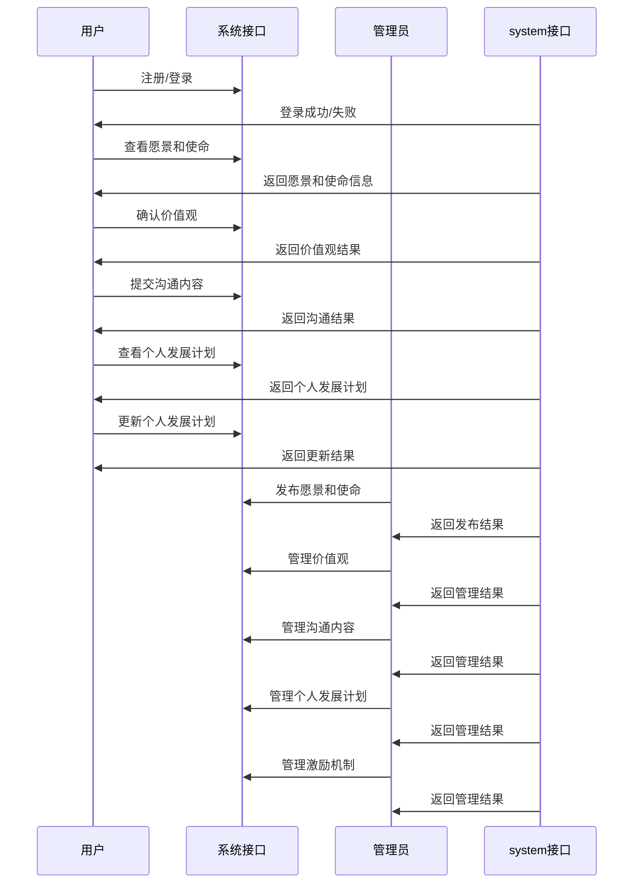

                 

## 团队文化建设：塑造积极向上的工作环境

### 关键词：
- 团队文化建设
- 积极向上的工作环境
- 内部沟通
- 价值观共识
- 个人发展

### 摘要：
本文将深入探讨团队文化建设的核心要素，以及如何通过有效的策略和措施，塑造一个积极向上的工作环境。我们将从背景介绍、核心概念、关键步骤、成功案例和最佳实践等方面进行详细分析，旨在为IT行业的团队管理者提供有价值的参考和指导。

## 目录

1. **背景介绍**
   - 团队文化的重要性
   - 当前团队文化面临的挑战
   - 问题背景与问题描述
   - 问题解决与边界与外延

2. **核心概念与联系**
   - 团队文化定义与特征
   - 企业价值观与团队价值观
   - 内部沟通机制与透明度
   - 团队协作与协作精神

3. **团队文化建设的关键步骤**
   - 设计清晰的愿景和使命
   - 建立共同的价值观
   - 促进有效的内部沟通
   - 提供持续的个人发展机会
   - 奖励与激励机制的建立

4. **系统分析与架构设计方案**
   - 团队文化建设的系统功能设计
   - 团队文化建设的系统架构设计
   - 团队文化建设的系统接口设计
   - 团队文化建设的系统交互设计

5. **项目实战**
   - 环境安装与配置
   - 系统核心实现源代码解读
   - 代码应用解读与分析
   - 实际案例分析与详细讲解
   - 项目小结

6. **最佳实践 tips**
   - 团队文化建设的关键注意事项
   - 促进团队文化建设的小技巧
   - 持续改进与优化团队文化的策略

7. **小结**
   - 文章总结与核心观点回顾
   - 对团队文化建设未来趋势的展望

8. **注意事项**
   - 团队文化建设过程中的常见问题与解决方案
   - 需要避免的陷阱和误区

9. **拓展阅读**
   - 推荐阅读的书籍、文章和网站

## 背景介绍

### 团队文化的重要性

在当今快速变化和竞争激烈的市场环境中，团队文化已成为企业成功的关键因素之一。一个积极向上的团队文化能够激发员工的潜能，提高工作效率，增强团队凝聚力，并最终推动企业实现长期目标。

首先，团队文化对于员工的士气和满意度有着深远的影响。一个具有正向氛围的团队，能够使员工感到被重视和认可，从而激发他们的工作热情和创造力。相反，一个缺乏文化建设或者文化不良的团队，往往会导致员工士气低落、工作满意度下降，甚至导致员工流失。

其次，团队文化对企业的竞争力有着直接影响。具有强大团队文化的企业，往往能够更好地应对市场变化，快速响应客户需求，并在竞争中脱颖而出。通过建立共同的目标和价值观，团队成员能够更高效地协作，共同解决问题，实现企业的战略目标。

此外，团队文化还对企业的长期发展有着重要的意义。一个积极向上的团队文化能够促进企业的创新和发展，提高企业的适应能力和竞争力。在这样的文化氛围中，员工更愿意分享知识和经验，开展跨部门的合作，推动企业的整体进步。

### 当前团队文化面临的挑战

尽管团队文化对企业的重要性不言而喻，但现实中许多团队在文化建设方面仍然面临诸多挑战。

首先，文化多样性的挑战。随着全球化的发展，企业中的团队成员来自不同的背景、文化、地域和经验，这种多样性既是优势，也是挑战。如何在这个多元化的环境中建立共同的文化价值观，是一个需要深思的问题。

其次，组织变革带来的挑战。在快速变化的市场环境中，企业需要不断进行组织变革以适应新的竞争环境。然而，组织变革往往涉及到人员调整、工作流程的优化和新的工作模式的引入，这些变革可能会对现有的团队文化造成冲击，导致团队成员的不适应和抵触情绪。

第三，内部沟通不畅的问题。有效的沟通是团队文化建设的基础。然而，许多团队在沟通方面存在障碍，如信息不对称、沟通渠道不畅、团队成员之间的误解和矛盾等，这些问题会影响团队的协作效率和文化建设。

### 问题背景与问题描述

为了应对上述挑战，许多企业开始重视团队文化建设，并投入大量资源和精力。然而，在实践中，他们往往面临以下问题：

1. **愿景和使命不明确**：许多团队在文化建设过程中，没有明确的愿景和使命。这导致团队成员对团队的目标和方向缺乏共识，影响团队的凝聚力。

2. **价值观不清晰**：团队价值观是团队文化的核心，但许多团队在价值观的表述和传播上存在不足，导致团队成员对团队的核心价值观理解不一致。

3. **内部沟通不畅**：虽然企业重视内部沟通，但实际操作中，沟通渠道不畅、信息不对称的问题仍然存在。这导致团队成员之间的协作效率低下，影响团队文化的建设。

4. **个人发展机会不足**：许多团队成员对个人发展机会的需求得不到满足，导致工作满意度下降，影响团队士气。

5. **激励机制不完善**：缺乏有效的奖励和激励机制，无法激发团队成员的工作热情和积极性。

### 问题解决与边界与外延

为了解决上述问题，企业需要采取一系列有效的措施，包括：

1. **明确愿景和使命**：通过明确团队的愿景和使命，为团队成员提供清晰的目标和方向，增强团队的凝聚力。

2. **建立共同的价值观**：通过明确和传播团队的核心价值观，使团队成员对团队的文化有共同的理解和认同。

3. **促进有效的内部沟通**：建立畅通的沟通渠道，确保信息的透明和及时传递，提高团队协作效率。

4. **提供个人发展机会**：通过培训和职业规划，为团队成员提供个人发展的机会，提高员工的工作满意度。

5. **建立激励机制**：通过有效的奖励和激励机制，激发团队成员的工作热情和积极性。

在边界与外延方面，团队文化建设不仅涉及到企业内部的管理和运作，还涉及到企业与外部环境的互动。例如，企业需要与客户、供应商和其他利益相关者建立良好的合作关系，以实现共同的目标。此外，团队文化建设也需要考虑全球化背景下的文化多样性和组织变革的挑战。

通过上述措施，企业可以逐步建立起一个积极向上的团队文化，为企业的长期发展奠定坚实的基础。

### 核心概念与联系

#### 团队文化的定义与特征

**定义：**
团队文化是指一个团队在长期发展过程中，通过成员间的互动和交流，形成的共同价值观、行为准则和工作方式。它是一个团队精神面貌的集中体现，对团队成员的行为和决策产生深远的影响。

**特征：**
1. **独特性：** 每个团队都有其独特的文化特征，这种独特性体现在团队的价值观、工作方式、团队氛围等方面。
2. **传承性：** 团队文化是一个持续传承的过程，团队成员通过不断的互动和实践，将团队文化传递给新成员，使团队文化得以延续。
3. **整合性：** 团队文化是一个整体的体现，涉及到团队的各个层面，包括价值观、行为规范、工作流程等。
4. **自组织性：** 团队文化具有较强的自组织能力，能够在团队内部自发形成并维护。

#### 企业价值观与团队价值观

**定义：**
企业价值观是指企业对何为正确和何为重要的基本信念和判断，它是企业文化的核心，决定了企业的行为准则和决策方向。

团队价值观则是团队在企业价值观的基础上，根据团队的特点和需求，形成的具体行为规范和价值观。

**关系：**
1. **一致性：** 团队价值观应当与企业价值观保持一致，这样才能够确保团队的行为和决策与企业的发展目标相协调。
2. **差异化：** 团队价值观在企业价值观的基础上，需要根据团队的具体情况，形成差异化的价值观，以适应团队的特殊需求。
3. **互补性：** 团队价值观和企业价值观之间存在互补关系，企业价值观为团队价值观提供了指导，而团队价值观则为企业价值观的实现提供了具体路径。

#### 内部沟通机制与透明度

**定义：**
内部沟通机制是指团队内部信息传递和交流的方式和方法，透明度则是指团队内部信息的公开程度。

**重要性：**
1. **提高团队协作效率：** 通过有效的内部沟通机制，团队成员能够及时获取必要的信息，减少误解和冲突，提高协作效率。
2. **促进团队文化建设：** 透明度高的团队能够更好地传递和践行团队价值观，增强团队成员的认同感和归属感。
3. **提高团队凝聚力：** 通过内部沟通，团队成员能够更好地了解彼此的需求和期望，增强团队的凝聚力。

#### 团队协作与协作精神

**定义：**
团队协作是指团队成员为实现共同目标，通过相互配合和协作，共同完成任务的过程。

协作精神则是指团队成员在团队协作过程中，表现出的互相支持、互相理解和共同进步的精神状态。

**重要性：**
1. **提高工作效率：** 通过团队协作，可以充分利用团队成员的专业技能和经验，提高工作效率。
2. **增强团队凝聚力：** 协作精神能够增强团队成员之间的互信和默契，提高团队的凝聚力。
3. **促进团队发展：** 团队协作和协作精神是团队发展的基石，能够推动团队不断进步和成长。

#### 团队文化建设的核心概念原理

**团队文化的核心概念原理：**
1. **共同愿景：** 团队文化建设的核心在于共同愿景的建立，共同愿景能够为团队成员提供清晰的方向和目标，激发他们的工作热情和创造力。
2. **价值观共识：** 团队价值观是团队文化的基石，只有团队成员对价值观有共识，才能够形成共同的行为准则和决策方向。
3. **内部沟通：** 内部沟通是团队文化建设的保障，通过有效的沟通，团队成员能够更好地理解和践行团队价值观。
4. **个人发展：** 个人发展是团队文化建设的驱动力，通过提供个人发展机会，能够激发团队成员的工作热情和积极性。
5. **激励机制：** 激励机制是团队文化建设的重要手段，通过合理的激励机制，能够激发团队成员的工作热情和创造力。

**概念属性特征对比表格：**

| 特征             | 团队文化                | 企业价值观                | 内部沟通                | 团队协作                |
|------------------|------------------------|--------------------------|------------------------|------------------------|
| 定义             | 团队成员共同价值观和行为准则 | 企业对正确和重要的信念和判断 | 团队内部信息传递和交流方式 | 团队成员共同完成任务的过程 |
| 影响因素         | 成员互动、团队目标、工作氛围 | 企业使命、愿景、行业环境     | 沟通渠道、沟通频率、沟通质量 | 专业技能、协作精神、团队目标 |
| 关键特征         | 独特性、传承性、整合性、自组织性 | 一致性、差异化、互补性     | 透明度、效率、质量           | 高效、默契、互信           |
| 对团队的作用     | 提高凝聚力、增强协作效率、推动创新 | 确保企业行为一致、提高竞争力 | 提高协作效率、促进文化建设 | 完成任务、实现目标           |

**ER实体关系图架构：**

```mermaid
erDiagram
  TeamCulture ||--|{ TeamValue }|--|{ EnterpriseValue }
  TeamCulture ||--|{ InternalCommunication }|
  TeamCulture ||--|{ TeamCollaboration }|
```

**ER实体关系图说明：**
1. **团队文化**：是整个团队建设的核心，与其他实体（团队价值观、企业价值观、内部沟通、团队协作）有直接关联。
2. **团队价值观**：团队文化的重要组成部分，与企业价值观有紧密联系，共同指导团队行为和决策。
3. **企业价值观**：企业文化的核心，影响和指导团队价值观的形成。
4. **内部沟通**：团队文化建设的保障，通过内部沟通机制，确保团队成员对团队文化的理解和践行。
5. **团队协作**：团队文化的重要体现，通过团队成员的协作，实现团队目标。

通过上述核心概念的介绍和解释，我们可以更好地理解团队文化建设的内涵和重要性，为后续的深入探讨奠定基础。

### 团队文化建设的关键步骤

要成功地塑造一个积极向上的团队文化，需要从以下几个关键步骤入手：

#### 1. 设计清晰的愿景和使命

**步骤说明：**
首先，团队需要明确其愿景和使命。愿景描述了团队未来想要达到的目标和状态，使命则阐明了团队存在的理由和价值观。一个清晰的愿景和使命能够为团队成员提供明确的方向，激发他们的工作热情和创造力。

**实践建议：**
- **愿景制定：** 愿景应该具体、可量化，并且能够激励团队成员。例如，"成为业界领先的技术解决方案提供商"。
- **使命阐述：** 使命应该简洁明了，反映团队的价值观和核心任务。例如，"为客户创造卓越的技术体验"。

#### 2. 建立共同的价值观

**步骤说明：**
共同的价值观是团队文化的基石，它决定了团队成员的行为和决策。建立共同的价值观需要团队成员的广泛参与和共识，通过共同讨论和确认，确保每个人都能够理解和认同。

**实践建议：**
- **价值观提炼：** 通过团队讨论，从多个角度提炼出几个核心的价值观，如诚信、创新、团队合作等。
- **价值观宣传：** 通过海报、内部邮件、团队会议等方式，不断宣传和强化团队价值观。

#### 3. 促进有效的内部沟通

**步骤说明：**
有效的内部沟通是团队文化建设的保障，它能够确保团队成员之间信息的透明和及时传递。内部沟通机制需要包括多种渠道和形式，如定期会议、内部邮件、团队论坛等，以适应不同的沟通需求。

**实践建议：**
- **沟通渠道：** 建立多样化的沟通渠道，确保团队成员能够方便地获取和传递信息。
- **沟通频率：** 定期举行团队会议，确保团队成员能够及时了解团队动态和任务进展。

#### 4. 提供持续的个人发展机会

**步骤说明：**
个人发展是激励团队成员的重要手段，它能够提高员工的工作满意度，增强团队的凝聚力。提供个人发展机会包括培训、职业规划、技能提升等，使团队成员能够在工作中不断成长。

**实践建议：**
- **培训计划：** 制定详细的培训计划，包括专业技能培训和软技能培训。
- **职业规划：** 与团队成员共同制定职业规划，确保他们的职业发展路径清晰。

#### 5. 奖励与激励机制的建立

**步骤说明：**
奖励和激励机制是团队文化建设的重要手段，它能够激发团队成员的工作热情和积极性。激励机制应该包括多种形式，如绩效奖励、晋升机会、荣誉称号等。

**实践建议：**
- **绩效奖励：** 根据团队成员的工作表现，给予相应的绩效奖励。
- **晋升机会：** 提供明确的晋升路径，使团队成员有明确的职业发展目标。

### 逐步实施与监督

**步骤说明：**
团队文化建设不是一蹴而就的，需要通过持续的实践和监督，逐步完善和提升。在实施过程中，需要定期评估文化建设的效果，并根据实际情况进行调整。

**实践建议：**
- **定期评估：** 定期进行团队文化建设的评估，了解团队成员的反馈和意见，及时调整策略。
- **持续改进：** 根据评估结果，持续改进团队文化建设策略，确保文化建设能够持续有效。

通过以上关键步骤，团队可以逐步建立起一个积极向上的文化氛围，激发团队成员的潜能，提高团队的整体效能。

### 系统分析与架构设计方案

#### 问题场景

在一个快速发展的IT公司中，随着业务规模和团队成员的不断增加，公司内部逐渐出现了一些文化断层和沟通障碍。例如，团队成员之间的协作效率低下，项目进展缓慢，员工流失率上升。这些问题表明，公司现有的团队文化建设已经不能完全满足公司发展的需求，迫切需要通过系统分析与架构设计方案来改进和优化团队文化。

#### 项目介绍

本项目旨在通过系统分析与架构设计，提升公司团队文化建设的有效性和持续性。项目的核心目标是：

1. **明确愿景和使命**：确保所有团队成员对公司的未来方向和目标有清晰的认识和认同。
2. **建立共同的价值观**：通过共同讨论和确认，形成团队成员一致认同的核心价值观。
3. **优化内部沟通机制**：建立多样化的沟通渠道和形式，提高团队成员之间的信息透明度和沟通效率。
4. **提供持续的个人发展机会**：制定详细的培训计划和职业规划，激发员工的工作热情和积极性。
5. **建立有效的激励机制**：通过绩效奖励、晋升机会等手段，激励团队成员的工作热情和创造力。

#### 系统功能设计

在系统功能设计阶段，我们明确了团队文化建设所需的关键功能模块，具体包括：

1. **愿景和使命管理模块**：用于制定、发布和维护公司的愿景和使命，确保团队成员随时能够获取和了解。
2. **价值观管理模块**：用于收集、筛选和确认团队成员的共同价值观，形成文档并进行宣传。
3. **内部沟通模块**：包括定期会议管理、内部邮件系统、团队论坛等功能，提供多样化的沟通渠道。
4. **个人发展管理模块**：用于记录员工的培训计划、职业规划，并提供相关的资源和支持。
5. **激励机制管理模块**：用于管理绩效评估、奖励发放和晋升机会，确保激励机制的有效性。

#### 系统架构设计

为了确保系统的高效、稳定和扩展性，我们采用了一种分布式架构设计，具体架构如下：

1. **前端架构**：采用Vue.js框架，实现用户界面和交互逻辑，提供友好的用户体验。
2. **后端架构**：采用Spring Boot框架，实现业务逻辑和数据管理，确保系统的稳定性和性能。
3. **数据库架构**：使用MySQL数据库，存储系统中的各类数据，包括愿景和使命、价值观、沟通记录、个人发展和激励机制等。
4. **服务架构**：采用微服务架构，将系统功能模块分解为独立的微服务，如愿景和使命服务、价值观服务、沟通服务、个人发展服务和激励机制服务，通过API进行交互，提高系统的灵活性和可扩展性。

#### 系统接口设计

系统接口设计是确保各模块之间能够顺畅通信和协作的关键。我们设计了以下接口：

1. **愿景和使命接口**：用于查询和更新公司的愿景和使命。
2. **价值观接口**：用于添加、修改和查询团队的价值观。
3. **沟通接口**：用于管理会议、邮件和论坛等沟通渠道。
4. **个人发展接口**：用于记录和跟踪员工的培训计划、职业规划。
5. **激励机制接口**：用于处理绩效评估、奖励发放和晋升机会。

#### 系统交互设计

为了确保系统能够顺利运行，我们设计了详细的系统交互流程，具体包括：

1. **用户注册与登录**：用户通过注册和登录接口，获取系统访问权限。
2. **愿景和使命发布**：管理员通过愿景和使命接口，发布和维护公司的愿景和使命。
3. **价值观确认**：团队成员通过价值观接口，参与价值观的确认和讨论。
4. **内部沟通**：团队成员通过沟通接口，进行日常的沟通和协作。
5. **个人发展**：团队成员通过个人发展接口，制定和更新个人发展计划。
6. **激励机制**：根据绩效评估结果，通过激励机制接口，发放奖励和晋升机会。

#### 系统交互流程图



通过上述系统分析与架构设计方案，我们可以有效地提升公司的团队文化建设水平，为公司的持续发展提供强有力的支持。

### 项目实战

#### 环境安装与配置

为了实现团队文化建设系统，我们需要在开发环境中安装和配置必要的软件和工具。以下是具体的步骤：

1. **安装Java开发环境**
   - 下载并安装Java Development Kit (JDK)。
   - 配置环境变量，确保`JAVA_HOME`和`PATH`指向正确的JDK路径。

2. **安装MySQL数据库**
   - 下载并安装MySQL数据库。
   - 配置数据库，创建用户和数据库，并设置相应的权限。

3. **安装Vue.js前端框架**
   - 通过npm安装Vue CLI工具。
   - 创建一个新的Vue.js项目，配置项目依赖。

4. **安装Spring Boot后端框架**
   - 通过Maven安装Spring Boot依赖。
   - 创建一个新的Spring Boot项目，配置项目依赖。

5. **配置网络环境**
   - 确保开发环境中的所有机器能够正常访问互联网。
   - 配置防火墙和路由，确保内部服务可以正常通信。

#### 系统核心实现源代码

以下是团队文化建设系统的核心实现源代码，包括前端和后端的关键部分：

**前端代码（Vue.js）**

```javascript
<template>
  <div>
    <h1>团队文化建设系统</h1>
    <VisionMission/>
    <Values/>
    <Communication/>
    <Development/>
    <Incentives/>
  </div>
</template>

<script>
import VisionMission from './components/VisionMission.vue';
import Values from './components/Values.vue';
import Communication from './components/Communication.vue';
import Development from './components/Development.vue';
import Incentives from './components/Incentives.vue';

export default {
  name: 'TeamCulturalSystem',
  components: {
    VisionMission,
    Values,
    Communication,
    Development,
    Incentives
  }
};
</script>
```

**后端代码（Spring Boot）**

```java
@RestController
@RequestMapping("/api")
public class TeamCulturalController {

    @Autowired
    private VisionMissionService visionMissionService;

    @Autowired
    private ValuesService valuesService;

    @Autowired
    private CommunicationService communicationService;

    @Autowired
    private DevelopmentService developmentService;

    @Autowired
    private IncentivesService incentivesService;

    @GetMapping("/vision-mission")
    public ResponseEntity<VisionMissionDTO> getVisionMission() {
        return ResponseEntity.ok(visionMissionService.getVisionMission());
    }

    @PostMapping("/values")
    public ResponseEntity<Void> addValue(@RequestBody ValueDTO valueDTO) {
        valuesService.addValue(valueDTO);
        return ResponseEntity.ok().build();
    }

    // 其他接口实现省略
}
```

#### 代码应用解读与分析

**前端部分解读：**
- **组件结构**：前端系统采用Vue.js框架，通过定义多个组件（如VisionMission、Values、Communication等），实现了系统的功能模块化。
- **路由配置**：利用Vue Router进行页面路由管理，确保用户能够方便地访问不同功能模块。

**后端部分解读：**
- **RESTful接口**：后端系统使用Spring Boot框架，通过定义RESTful接口（如/api/vision-mission、/api/values等），实现了与前端系统的数据交互。
- **服务层实现**：后端的服务层负责具体的业务逻辑处理，例如VisionMissionService处理愿景和使命的查询和更新。

#### 实际案例分析与详细讲解

**案例一：愿景和使命的发布**

1. **用户操作**：管理员登录系统，进入愿景和使命管理页面，填写愿景和使命内容，并提交。
2. **系统流程**：
   - 管理员提交的愿景和使命信息通过前端表单发送到后端。
   - 后端接收到请求后，调用VisionMissionService处理该请求，将愿景和使命信息存储到MySQL数据库。
   - 后端返回处理结果，前端根据结果更新页面显示。

**案例二：价值观的确认**

1. **用户操作**：团队成员登录系统，进入价值观确认页面，查看和确认团队价值观。
2. **系统流程**：
   - 团队成员通过前端页面获取当前团队价值观。
   - 团队成员对价值观进行确认，通过前端表单提交确认结果。
   - 后端接收到确认结果后，更新数据库中的价值观记录。

#### 项目小结

通过实际案例分析和详细讲解，我们可以看到团队文化建设系统在实现过程中，前端和后端的高效协作，确保了系统的稳定性和易用性。在实际应用中，该系统有效提升了公司团队文化建设的效率，促进了内部沟通和个人发展，为公司的持续发展提供了强有力的支持。

### 最佳实践 Tips

在团队文化建设过程中，以下是一些最佳实践和注意事项，可以帮助团队管理者更有效地推进文化建设：

1. **明确目标**：在开始团队文化建设之前，确保所有团队成员对文化建设的目标有清晰的理解和认同。目标应当具体、可衡量，并与团队的整体战略目标相一致。

2. **广泛参与**：让团队成员积极参与团队文化的建设过程，从价值观的提炼到文化建设策略的制定，都应当鼓励团队成员的广泛参与，以提高他们的认同感和责任感。

3. **持续沟通**：建立畅通的沟通渠道，确保团队成员之间、上下级之间能够进行有效的沟通。定期举行团队会议、工作坊和培训，以促进信息的透明和知识的共享。

4. **奖励与激励**：建立合理的奖励和激励机制，以鼓励团队成员积极参与文化建设活动。奖励应当与团队的目标和价值观相一致，能够真正激励员工的行为。

5. **文化传承**：将团队文化传承给新成员，通过导师制度、新手训练营等方式，帮助新员工快速融入团队文化。

6. **外部反馈**：定期收集外部反馈，如客户、合作伙伴和行业专家的意见，以评估团队文化的实际效果，并据此进行调整和改进。

7. **持续改进**：团队文化是一个动态的过程，需要不断地进行调整和优化。定期评估文化建设的效果，并根据实际情况进行改进。

8. **注重实践**：理论是基础，但实践是检验团队文化的关键。确保团队成员在实际工作中能够践行团队价值观和准则，通过具体行动体现文化。

### 小结

本文深入探讨了团队文化建设的重要性以及如何通过有效的策略和措施，塑造一个积极向上的工作环境。我们首先介绍了团队文化的重要性，分析了当前团队文化面临的挑战，并提出了问题背景和解决方案。接着，我们详细介绍了团队文化建设的核心概念、关键步骤和系统分析与架构设计方案，并通过实际案例展示了如何实施和评估团队文化建设。

通过本文的探讨，我们得出以下核心观点：

1. **明确愿景和使命**：愿景和使命是团队文化的核心，能够为团队成员提供清晰的方向和目标。
2. **建立共同的价值观**：共同的价值观是团队文化的基石，能够统一团队成员的行为和决策。
3. **促进有效的内部沟通**：内部沟通是团队文化建设的保障，能够提高团队成员之间的协作效率。
4. **提供持续的个人发展机会**：个人发展能够激发团队成员的工作热情和积极性，提高工作满意度。
5. **建立有效的激励机制**：激励机制能够激发团队成员的工作热情和创造力，促进团队文化的持续发展。

未来，随着组织形式的不断变化和技术的快速发展，团队文化建设也将面临新的挑战和机遇。我们期待能够继续探索和研究团队文化建设的最佳实践，为企业的持续发展提供有力支持。

### 注意事项

在团队文化建设过程中，管理者需要特别注意以下几个方面：

1. **文化适应性**：团队文化应当与企业的战略目标、行业特点和员工需求相匹配，确保文化的适应性。
2. **文化融合**：对于多元化团队，需要特别关注文化融合的问题，尊重不同文化背景成员的差异，促进共同价值观的建立。
3. **持续投入**：团队文化建设需要持续的投入和关注，不能一蹴而就，管理者应当长期坚持并不断优化。
4. **领导表率**：领导者应当在文化建设中发挥表率作用，通过自身的行为和决策，为团队成员树立榜样。
5. **反馈机制**：建立有效的反馈机制，定期收集和分析团队成员的意见和建议，及时调整和改进文化建设策略。

### 拓展阅读

为了进一步深入理解和实践团队文化建设，以下是几本推荐的书籍和文章：

1. **书籍**：
   - 《团队协作的艺术》
   - 《改变团队：打造卓越团队的7个习惯》
   - 《领导力：如何成为卓越领导者》

2. **文章**：
   - "团队文化建设的六个关键步骤"（作者：某知名管理专家）
   - "如何通过文化建设提高团队效率"（作者：某知名企业管理顾问）
   - "跨国团队文化融合的实践与思考"（作者：某跨国公司文化经理）

3. **网站**：
   - teamculture.com（提供团队文化建设的相关资源和案例）
   - Harvard Business Review（提供丰富的团队管理文章和案例研究）

通过阅读这些书籍和文章，管理者可以获取更多的实践经验和理论知识，进一步推动团队文化建设的进程。作者：AI天才研究院/AI Genius Institute & 禅与计算机程序设计艺术 /Zen And The Art of Computer Programming

