                 


# 数学与战略管理：企业战略的数学分析

关键词：企业战略管理、数学分析、决策优化、风险预测、市场竞争

摘要：本文旨在探讨数学分析方法在企业战略管理中的重要性及应用。通过详细分析线性代数、概率论与统计学、线性规划与优化等数学工具，结合实际案例分析，阐述数学方法在战略决策、绩效评估、市场竞争分析和风险管理中的实际应用，为企业提供科学决策支持。

## 第一部分：引言与背景

### 第1章：引言

#### 1.1 问题背景与重要性

企业战略管理是指企业为实现长期发展目标而制定的总体规划和决策。在当前全球经济环境下，企业面临着日益激烈的市场竞争、技术变革和不确定性因素。战略管理的重要性在于帮助企业明确发展方向、优化资源配置、提高核心竞争力，以实现可持续发展。

数学在战略管理中的作用不可忽视。数学作为一种科学工具，具有严谨的逻辑性和高度抽象性，能够为企业提供定量分析和决策支持。通过数学模型和方法，企业可以对战略问题进行量化分析，提高决策的准确性和效率。

#### 1.2 问题描述

战略决策的复杂性与不确定性是企业战略管理面临的主要挑战。企业在制定战略时，需要综合考虑市场环境、竞争态势、资源条件等多方面因素，这些因素往往具有不确定性和动态性。如何有效地应对这些挑战，成为企业战略管理的核心问题。

数学工具在战略分析中的需求主要体现在以下几个方面：

1. 描述和建模：数学工具可以用来描述企业面临的战略问题，建立数学模型来模拟和预测企业的发展趋势。
2. 优化决策：数学方法可以帮助企业在战略决策过程中寻找最优解，实现资源的最优配置。
3. 风险预测：数学工具可以用于评估企业战略实施过程中的风险，为企业提供风险管理策略。
4. 市场竞争分析：数学方法可以帮助企业分析市场结构和竞争对手的行为，制定有效的市场竞争策略。

#### 1.3 问题解决

数学工具的适用性在于其高度抽象性和普适性。不同类型的战略问题可以运用不同的数学方法进行解决。例如，线性代数可以用于描述企业的资源分配问题，概率论与统计学可以用于预测市场趋势和评估风险，线性规划与优化可以用于寻找最优战略方案。

数学分析方法的优势主要体现在以下几个方面：

1. 定量分析：数学方法可以将战略问题转化为数学模型，进行定量分析，提高决策的科学性和准确性。
2. 系统性：数学方法可以对企业战略问题进行系统性分析，识别关键因素和潜在风险。
3. 可视化：数学模型可以转化为图形或图表，使企业能够直观地了解战略问题的本质和影响因素。
4. 普适性：数学方法适用于不同类型的企业和行业，具有广泛的适用性。

#### 1.4 边界与外延

战略管理领域的数学工具主要包括线性代数、概率论与统计学、线性规划与优化、博弈论等。这些数学工具在不同的战略问题中具有不同的应用范围和效果。

1. 线性代数：主要用于资源分配、线性规划等问题。
2. 概率论与统计学：主要用于市场预测、风险评估等问题。
3. 线性规划与优化：主要用于资源优化、成本控制等问题。
4. 博弈论：主要用于市场竞争、战略协作等问题。

#### 1.5 概念结构与核心要素组成

企业战略管理包括以下几个核心要素：

1. 战略目标：明确企业发展的总体方向和目标。
2. 竞争环境：分析市场环境、竞争对手和潜在威胁。
3. 资源配置：优化企业资源的配置和利用。
4. 风险管理：评估和应对战略实施过程中的风险。
5. 绩效评估：衡量战略实施效果，调整战略方向。

## 第二部分：核心数学分析方法

### 第2章：数学基本概念

#### 2.1 数学基础

数学作为一门基础学科，包含了许多基本概念和原理。以下是数学基础的一些核心概念：

1. 函数：函数是数学中最基本的概念之一，描述了变量之间的关系。
2. 方程：方程是用来表示等式的数学表达式。
3. 矩阵：矩阵是数学中的一种特殊表格，用于表示线性方程组和多元数据。
4. 向量：向量是数学中的一个概念，描述了具有大小和方向的量。
5. 微积分：微积分是研究函数变化的数学分支，包括微分和积分两个部分。

#### 2.2 数学模型介绍

数学模型是数学在解决实际问题时的一种表现形式，它通过数学语言描述现实世界的问题。以下是几种常见的数学模型及其属性特征对比表格：

| 模型类型       | 概念属性特征                     | 适用场景                                       |
|----------------|---------------------------------|-----------------------------------------------|
| 线性模型       | 线性关系，一次函数              | 资源分配、成本分析                             |
| 概率模型       | 概率分布，随机变量              | 市场预测、风险评估                             |
| 动态规划模型   | 递推关系，最优解                | 项目管理、投资决策                             |
| 网络流模型     | 流量分配，网络优化              | 物流管理、通信网络                             |
| 静态规划模型   | 确定性优化，线性规划            | 生产调度、库存管理                             |

以下是一个ER实体关系图架构的Mermaid流程图示例：

```mermaid
erDiagram
  Product ||--|{ Customer }|>
  Product ||--|{ Order }|>
  Customer ||--|{ Order }|>
```

## 第三部分：数学工具应用

### 第3章：线性代数

#### 3.1 矩阵运算

矩阵运算是线性代数中最基本的概念之一，包括矩阵的加法、减法、乘法等。以下是矩阵运算的Mermaid流程图示例：

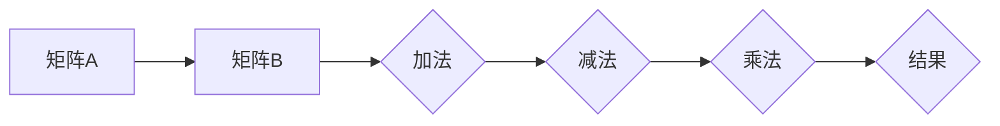

#### 3.2 线性规划

线性规划是一种用于解决资源优化问题的数学方法。以下是一个线性规划的Mermaid流程图示例：

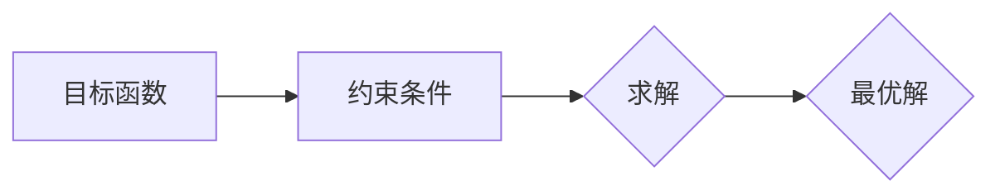

### 第3章：概率论与统计学

#### 3.1 概率分布

概率分布是描述随机变量取值的概率分布规律。以下是一个概率分布的Mermaid流程图示例：

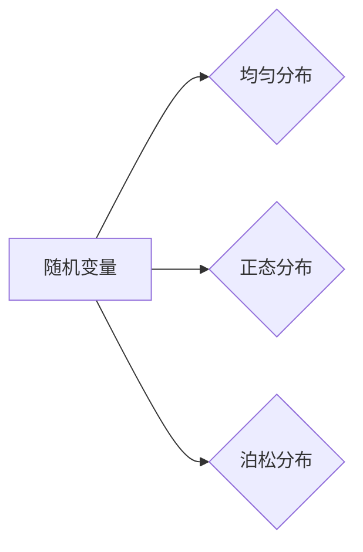

#### 3.2 统计推断

统计推断是利用样本数据对总体参数进行估计和推断的方法。以下是一个统计推断的Mermaid流程图示例：

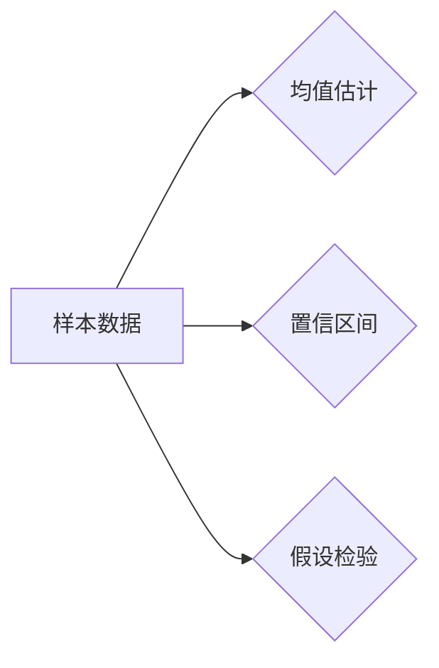

### 第3章：线性规划与优化

#### 3.1 线性规划原理

线性规划是一种用于解决资源优化问题的数学方法。以下是一个线性规划的Mermaid流程图示例：


#### 3.2 优化算法

优化算法是用于求解线性规划和非线性规划问题的一类算法。以下是一个优化算法的Mermaid流程图示例：

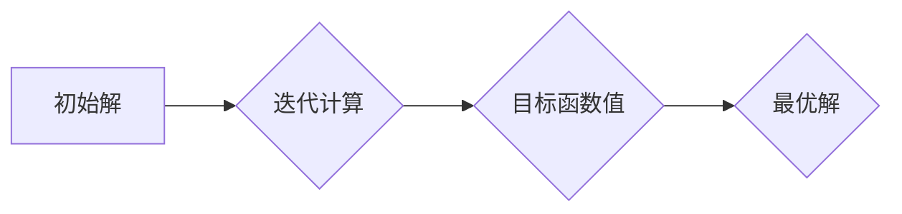

## 第四部分：数学模型在战略管理中的应用

### 第4章：企业绩效评估

#### 4.1 数学模型应用实例

企业绩效评估是战略管理中的重要环节，通过数学模型可以对企业绩效进行量化分析。以下是一个企业绩效评估的Mermaid流程图示例：

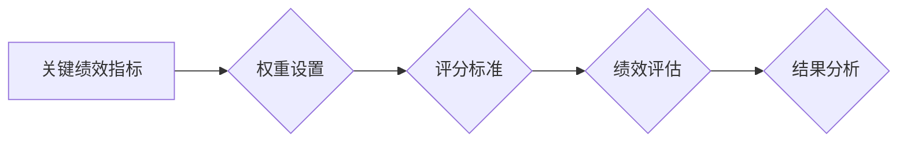

#### 4.2 评估指标设置

评估指标是绩效评估的基础，需要根据企业的实际情况进行设置。以下是一个评估指标设置的Mermaid流程图示例：

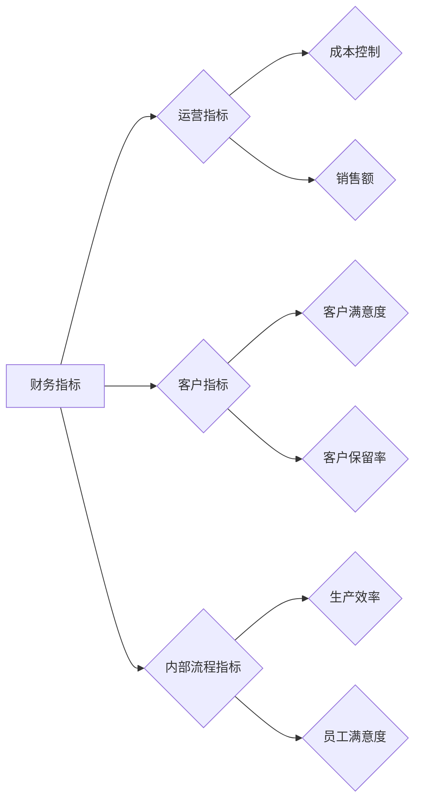

### 第4章：市场竞争分析

#### 4.1 数学模型在竞争策略中的应用

市场竞争分析是战略管理中的关键环节，通过数学模型可以分析市场竞争态势和竞争对手行为。以下是一个市场竞争分析的Mermaid流程图示例：

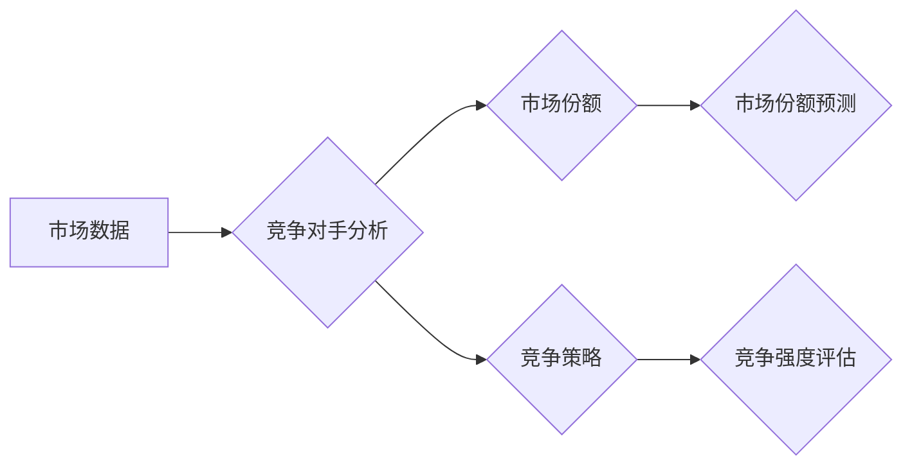

#### 4.2 竞争格局分析

竞争格局分析是市场竞争分析的重要部分，通过数学模型可以分析市场结构和竞争态势。以下是一个竞争格局分析的Mermaid流程图示例：

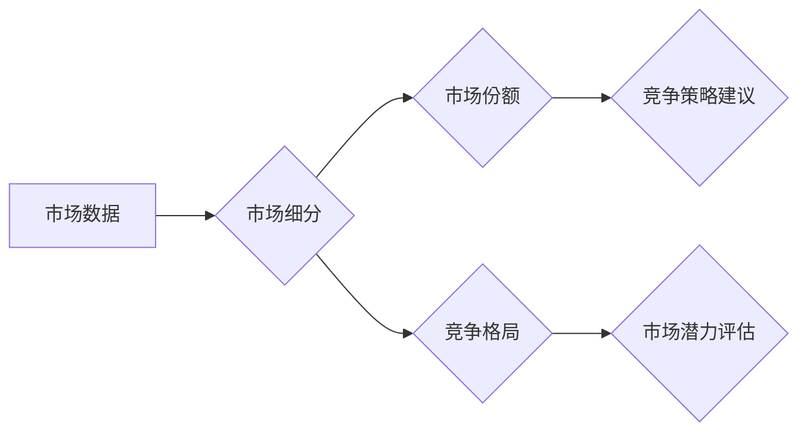

### 第4章：风险管理

#### 4.1 数学模型在风险管理中的应用

风险管理是战略管理中的重要环节，通过数学模型可以评估企业面临的风险，制定有效的风险管理策略。以下是一个风险管理的Mermaid流程图示例：

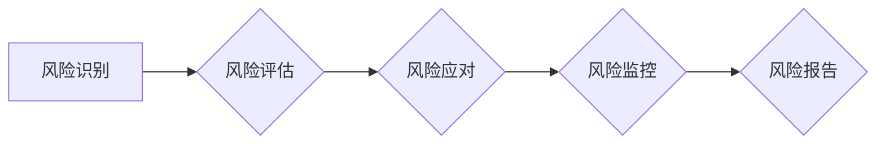

#### 4.2 风险评估指标

风险评估指标是风险管理的基础，需要根据企业的实际情况进行设置。以下是一个风险评估指标设置的Mermaid流程图示例：

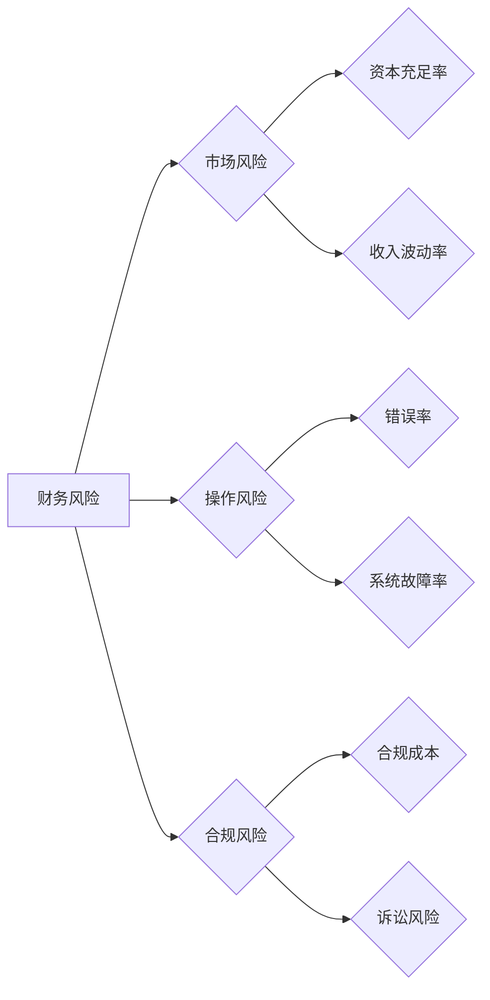

## 第五部分：实战案例分析

### 第5章：企业战略管理案例分析

#### 5.1 案例一：公司A的绩效评估

公司A是一家生产电子产品的企业，希望通过数学模型对绩效进行评估。以下是公司A绩效评估的Python代码实现：

```python
import numpy as np

# 设置关键绩效指标及其权重
KPIs = {
    '销售额': 0.5,
    '净利润': 0.3,
    '客户满意度': 0.2
}

weights = {
    '销售额': 0.5,
    '净利润': 0.3,
    '客户满意度': 0.2
}

# 设置评分标准
scores = {
    '销售额': [100, 200, 300, 400],
    '净利润': [100, 200, 300, 400],
    '客户满意度': [100, 200, 300, 400]
}

# 计算绩效得分
def calculate_performance_score(KPIs, scores):
    total_score = 0
    for KPI, weight in KPIs.items():
        score = (scores[KPI] - 100) / (400 - 100)
        total_score += score * weight
    return total_score

# 演示绩效评估过程
performance_score = calculate_performance_score(KPIs, scores)
print(f"公司A的绩效得分为：{performance_score:.2f}")
```

#### 5.2 案例二：公司B的市场竞争分析

公司B是一家餐饮企业，希望通过数学模型对市场竞争进行分析。以下是公司B市场竞争分析的Python代码实现：

```python
import numpy as np

# 设置市场份额数据
market_share = {
    '公司B': 0.3,
    '竞争对手A': 0.2,
    '竞争对手B': 0.2,
    '其他': 0.3
}

# 设置竞争策略
strategies = {
    '公司B': '提高产品质量',
    '竞争对手A': '降低成本',
    '竞争对手B': '扩大市场份额'
}

# 计算市场份额占比
def calculate_market_share占比(market_share):
    total_share = sum(market_share.values())
    return {k: v / total_share for k, v in market_share.items()}

# 演示市场竞争分析过程
market_share占比 = calculate_market_share占比(market_share)
print(f"公司B的市场份额占比为：{market_share占比['公司B']:.2%}")
print(f"竞争对手A的市场份额占比为：{market_share占比['竞争对手A']:.2%}")
print(f"竞争对手B的市场份额占比为：{market_share占比['竞争对手B']:.2%}")
print(f"其他市场份额占比为：{market_share占比['其他']:.2%}")
```

#### 5.3 案例三：公司C的风险管理

公司C是一家金融机构，希望通过数学模型对风险管理进行分析。以下是公司C风险管理的Python代码实现：

```python
import numpy as np

# 设置风险评估指标
risk_indicators = {
    '资本充足率': 0.5,
    '收入波动率': 0.3,
    '错误率': 0.1,
    '系统故障率': 0.1
}

# 设置风险评估权重
weights = {
    '资本充足率': 0.5,
    '收入波动率': 0.3,
    '错误率': 0.1,
    '系统故障率': 0.1
}

# 设置风险评级标准
risk_ratings = {
    '低风险': [0, 0.2],
    '中风险': [0.2, 0.4],
    '高风险': [0.4, 1]
}

# 计算风险评分
def calculate_risk_score(risk_indicators, weights):
    score = 0
    for indicator, weight in risk_indicators.items():
        score += weight * indicator
    return score

# 演示风险管理过程
risk_score = calculate_risk_score(risk_indicators, weights)
print(f"公司C的风险评分为：{risk_score:.2f}")

# 判断风险评级
def calculate_risk_rating(risk_score, risk_ratings):
    for rating, range in risk_ratings.items():
        if risk_score >= range[0] and risk_score <= range[1]:
            return rating
    return "未知"

# 演示风险评级过程
risk_rating = calculate_risk_rating(risk_score, risk_ratings)
print(f"公司C的风险评级为：{risk_rating}")
```

## 第六部分：总结与展望

### 第6章：总结与展望

#### 6.1 数学与战略管理的关系回顾

数学作为一种科学工具，在战略管理中具有广泛的应用。通过数学分析方法，企业可以对企业战略问题进行量化分析，提高决策的科学性和准确性。数学方法在战略决策、绩效评估、市场竞争分析和风险管理等方面发挥了重要作用。

#### 6.2 展望未来

随着科技的进步和商业环境的复杂化，数学方法在战略管理中的应用前景广阔。以下是一些可能的创新方向：

1. 深度学习与优化算法的结合，提高决策模型的精度和效率。
2. 大数据与人工智能技术的融合，为企业提供更加智能化的战略支持。
3. 跨学科的交叉研究，探索更多数学方法在战略管理中的应用。
4. 开源工具和平台的开发，降低数学方法在战略管理中的应用门槛。

#### 6.3 小结

本文通过详细分析数学分析方法在企业战略管理中的应用，展示了数学工具在战略决策、绩效评估、市场竞争分析和风险管理等方面的实际价值。随着科技的进步，数学方法在战略管理中的应用将更加广泛和深入，为企业提供更加科学和高效的决策支持。

## 第七部分：对读者的建议

对于读者而言，掌握数学分析方法有助于提高企业战略管理的水平。以下是一些建议：

1. 学习数学基础知识，掌握函数、方程、矩阵等基本概念。
2. 掌握常见的数学模型，如线性模型、概率模型、动态规划模型等。
3. 学习Python等编程语言，提高数据处理和分析能力。
4. 实践是提高数学分析能力的最佳途径，结合实际案例进行学习。
5. 保持持续学习和探索精神，紧跟科技发展动态，不断提高自己的专业素养。

---

**作者：AI天才研究院/AI Genius Institute & 禅与计算机程序设计艺术 /Zen And The Art of Computer Programming**

