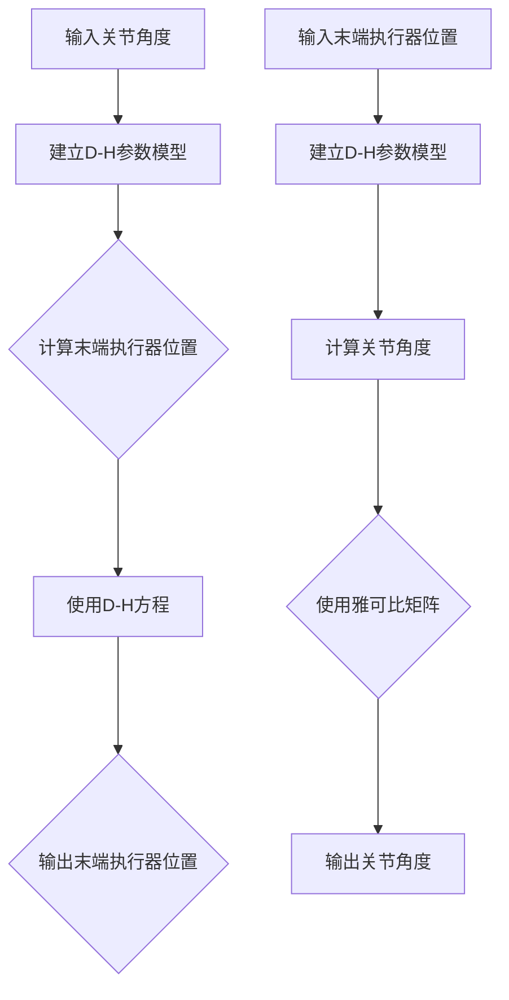
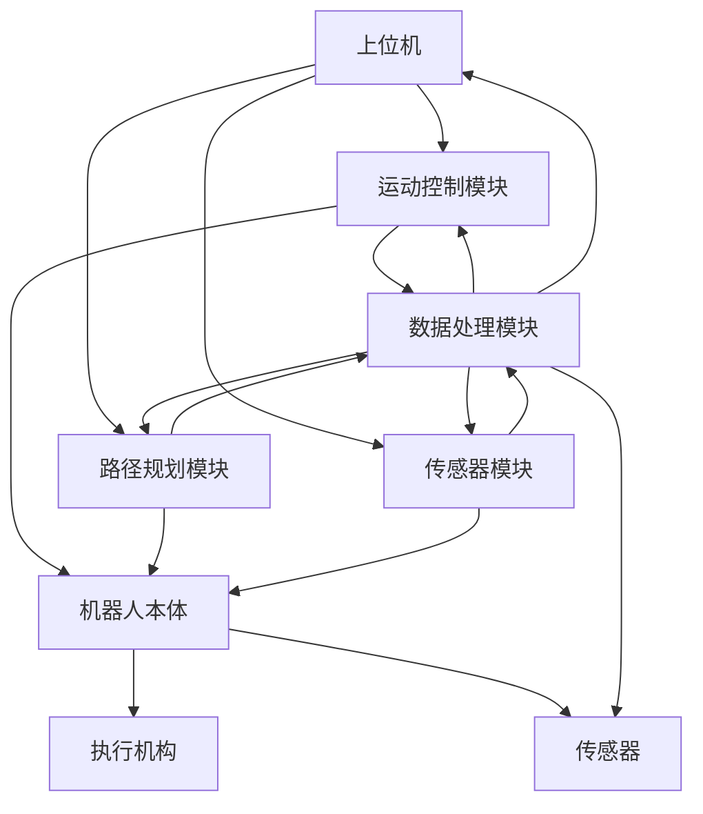
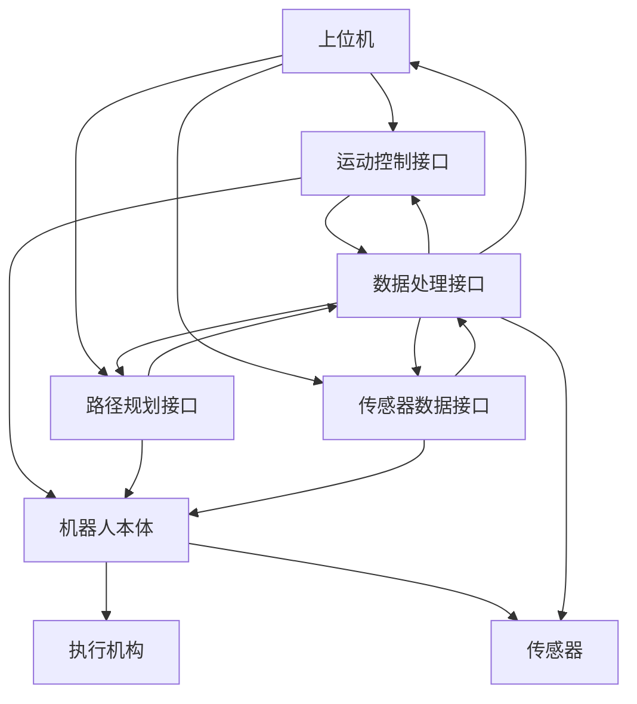
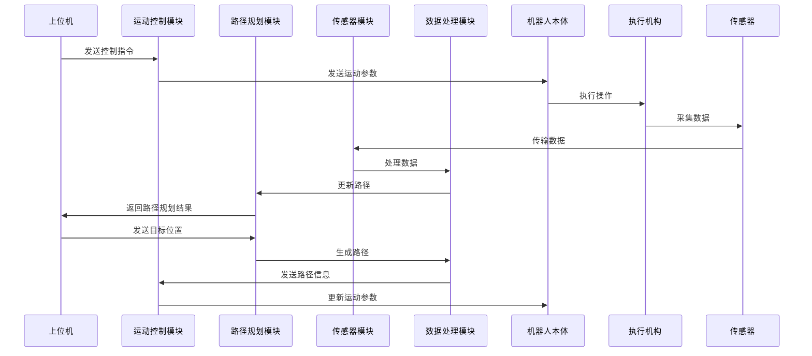

                 


# 数学与机器人运动学：机器人动作的数学描述

## 关键词

- 机器人运动学
- 数学模型
- 算法原理
- 系统架构
- 项目实战

## 摘要

本文旨在探讨机器人运动学的数学描述，从基础概念到算法实现，再到系统架构设计和项目实战，全面解析机器人动作的数学建模过程。文章首先介绍了机器人运动学的基本概念，包括机器人的几何描述、运动描述以及运动的基本性质。接着，详细讲解了运动学算法的数学模型，并通过Python实现展示了算法的实际应用。随后，文章深入讨论了数学模型在机器人运动学中的应用，通过具体的数学公式推导和Python实现，揭示了数学公式在实际问题中的应用价值。在此基础上，文章进一步阐述了系统分析与架构设计的方法，包括问题场景介绍、系统功能设计、系统架构设计、系统接口设计和系统交互。最后，通过项目实战部分，文章展示了机器人运动学在实际项目中的应用，包括环境安装、系统核心实现、代码应用解读与分析、实际案例分析与详细讲解以及项目小结。本文旨在为读者提供一个全面、系统的机器人运动学学习路径，帮助读者深入理解和掌握机器人动作的数学描述。

## 第1章 引言

### 1.1 问题背景

随着科技的快速发展，机器人技术逐渐成为各个领域的关键技术之一。机器人在工业制造、医疗服务、家庭服务、科学研究等多个领域都有广泛的应用。然而，机器人的动作控制是实现其功能的关键，而这一过程离不开数学的描述和算法的支持。

机器人的动作控制涉及多个方面，包括机器人的几何描述、运动描述、运动学算法以及控制算法等。其中，机器人运动学是研究机器人运动规律和运动参数的学科，其核心任务是通过数学模型描述机器人的运动，从而为控制算法提供基础支持。

机器人运动学的研究具有重要意义。首先，通过数学模型可以精确描述机器人的运动，从而实现对机器人运动的预测和控制。其次，运动学模型可以简化复杂的机器人运动过程，为设计高效的控制算法提供理论依据。此外，运动学模型还可以帮助理解机器人运动的基本原理，促进机器人技术的创新和发展。

在现实应用中，机器人运动学面临着诸多挑战。例如，机器人的运动空间有限，需要精确计算和优化运动路径；机器人运动过程中可能受到外部环境的影响，需要考虑动态环境的适应性；此外，机器人的运动控制需要高效和实时，这对算法的设计和实现提出了更高的要求。

因此，对机器人运动学进行深入研究，探索数学描述的方法和算法，对提高机器人运动控制的精度和效率具有重要意义。本文将从基础概念、算法原理、数学模型、系统架构设计以及项目实战等方面，系统地探讨机器人运动学的数学描述，为读者提供全面的学习路径。

### 1.2 机器人运动学概述

机器人运动学是研究机器人运动规律和运动参数的学科，其核心任务是通过数学模型描述机器人的运动，从而为控制算法提供基础支持。本文将从定义、研究范畴以及研究方法三个方面对机器人运动学进行概述。

#### 定义

机器人运动学（Robotics Kinematics）是指研究机器人运动规律和运动参数的学科。具体来说，它关注的是机器人从一个位置移动到另一个位置的过程，以及在这个过程中各个部件的运动关系。机器人运动学主要解决两个问题：一是确定机器人在给定输入（如关节角度）下的位姿（位置和姿态），称为运动学正解；二是根据机器人的位姿确定相应的输入，称为运动学逆解。

#### 研究范畴

机器人运动学的研究范畴主要包括以下几个方面：

1. **机器人的几何描述**：研究机器人的几何结构和运动空间，包括机器人的自由度、运动轴和关节类型等。

2. **机器人的运动描述**：研究机器人各个部件的运动关系，包括运动副的连接方式、运动路径和速度分布等。

3. **运动学算法**：研究如何通过数学模型描述机器人的运动，包括正解和逆解的计算方法。

4. **运动学参数与变量**：研究运动学过程中涉及的各种参数和变量，如关节角度、位移、速度和加速度等。

5. **运动学正解与逆解**：研究如何从已知输入求解机器人的位姿，以及从已知位姿求解输入。

#### 研究方法

机器人运动学的研究方法主要包括以下几个方面：

1. **数学模型建立**：通过几何和物理原理，建立描述机器人运动的数学模型。常见的数学模型包括坐标变换、运动学方程和几何约束等。

2. **算法设计与实现**：设计适用于不同机器人结构和运动需求的运动学算法，并通过编程实现。常见的算法有解析法、数值法和迭代法等。

3. **实验验证与优化**：通过实验验证运动学模型和算法的有效性，并根据实验结果对模型和算法进行优化。

4. **仿真与优化**：利用仿真工具对机器人运动过程进行模拟，分析运动学性能，并进行优化。

5. **实际应用与扩展**：将运动学理论应用于实际机器人系统，如工业机器人、服务机器人和无人机等，并不断扩展其应用领域。

通过以上研究方法和范畴，机器人运动学能够为机器人运动控制提供坚实的理论基础，从而推动机器人技术的发展和应用。

### 1.3 本书结构安排

本书旨在系统地探讨机器人运动学的数学描述，通过逐步的分析和讲解，帮助读者深入理解和掌握这一领域的基本概念、算法原理以及应用实践。本书分为七个主要章节，每个章节都有明确的主题和内容安排，旨在为读者提供一个完整的学习路径。

#### 第1章 引言

本章首先介绍了机器人运动学的背景和重要性，探讨了机器人运动学在科技发展中的地位。通过描述机器人运动学的基本概念、研究范畴和研究方法，为后续章节的深入探讨奠定了基础。

#### 第2章 基础概念

本章将详细讨论机器人运动学的基础概念，包括机器人的几何描述、运动描述以及运动的基本性质。通过介绍机器人的几何模型、坐标系与变换、速度与加速度等，帮助读者建立对机器人运动学的基本认识。

#### 第3章 运动学算法

本章将探讨运动学算法的基本概念，包括算法的分类、选择和应用。通过介绍运动学算法的数学模型，如D-H方法、雅可比矩阵等，并结合Python实现，展示算法的实际应用。

#### 第4章 数学模型与数学公式

本章将深入讨论数学模型在机器人运动学中的应用，介绍数学模型的建立与求解方法。通过具体的数学公式推导和Python实现，分析数学公式在实际问题中的应用，并提供详细的计算过程和结果分析。

#### 第5章 系统分析与架构设计

本章将介绍系统分析与架构设计的方法，包括问题场景介绍、系统功能设计、系统架构设计、系统接口设计和系统交互。通过Mermaid流程图和序列图，展示系统架构的设计和实现。

#### 第6章 项目实战

本章通过一个实际项目，详细展示机器人运动学在实际应用中的实现过程。包括环境安装、系统核心实现、代码应用解读与分析、实际案例分析和详细讲解，以及项目小结。

#### 第7章 最佳实践与拓展

本章将总结全书内容，分享最佳实践和注意事项，并推荐相关书籍和论文，为读者提供进一步学习和研究的资源。

通过以上章节的安排，本书旨在为读者提供一个系统、全面的学习路径，帮助读者深入理解和掌握机器人运动学的数学描述，从而为实际应用提供理论支持。

## 第2章 基础概念

### 2.1 机器人的几何描述

机器人的几何描述是理解机器人运动学的基础。几何描述包括机器人的几何模型、坐标系与变换等核心概念。以下将详细介绍这些概念及其在机器人运动学中的应用。

#### 机器人的几何模型

机器人的几何模型是对机器人物理结构的抽象表示，通常包括机器人的各个部件、关节和自由度。常见的几何模型有串联机器人模型、并联机器人模型和复杂多自由度机器人模型等。

1. **串联机器人模型**：串联机器人是由一系列相邻关节连接的连杆组成的，每个关节只能在一个方向上运动。这种模型广泛应用于工业机器人、机械臂等。

2. **并联机器人模型**：并联机器人由多个独立的运动链同时工作，其结构类似于一个移动平台。这类机器人在高精度、高速运动和控制方面具有优势。

3. **复杂多自由度机器人模型**：这类机器人具有多个自由度，能够进行复杂的运动，如无人机、飞行机器人等。

#### 坐标系与变换

在机器人运动学中，坐标系和变换是描述机器人运动的重要工具。常见的坐标系有世界坐标系、基坐标系、关节坐标系等。

1. **世界坐标系**：世界坐标系是固定的全局坐标系，通常用于描述机器人在空间中的整体位置和姿态。

2. **基坐标系**：基坐标系是机器人基座的坐标系，通常与机器人的参考点对齐。基坐标系用于描述机器人基座的位置和姿态。

3. **关节坐标系**：关节坐标系是连接在机器人各个关节上的坐标系，用于描述关节的运动参数，如角度、位移等。

#### 坐标系变换

坐标系变换是指将一个坐标系的坐标转换为另一个坐标系的坐标。常见的坐标系变换包括平移变换和旋转变换。

1. **平移变换**：平移变换是指将一个点在空间中沿x、y、z轴方向平移一定的距离。平移变换可以用一个3x3的矩阵表示。

2. **旋转变换**：旋转变换是指将一个点绕x、y、z轴旋转一定的角度。旋转变换可以用一个3x3的旋转矩阵表示。

#### 几何描述在运动学中的应用

几何描述为机器人运动学的数学建模提供了基础。通过几何描述，可以建立机器人各个关节的运动关系，进而推导出机器人的运动学方程。

例如，对于串联机器人，可以通过D-H方法建立每个关节的坐标系，并计算出整个机器人的运动学参数。对于并联机器人，则可以通过复杂的多自由度模型进行运动学分析。

总之，机器人的几何描述是理解机器人运动学的关键，通过坐标系和变换，可以精确描述机器人的运动过程，为后续的运动学算法提供基础支持。

### 2.2 机器人的运动描述

机器人的运动描述是指对机器人运动过程的描述，包括运动学描述、运动学参数与变量以及运动的基本性质。以下将详细介绍这些概念及其在机器人运动学中的应用。

#### 运动学描述

运动学描述是指通过数学方法描述机器人运动的过程。常见的运动学描述方法包括位移描述、速度描述和加速度描述等。

1. **位移描述**：位移描述是指用向量或坐标来表示机器人从初始位置到目标位置的变化。对于串联机器人，每个关节的位移可以用关节角度表示；对于并联机器人，可以用各个运动副的位置和姿态表示。

2. **速度描述**：速度描述是指用向量或坐标的变化率来表示机器人运动的快慢和方向。对于串联机器人，每个关节的速度可以用关节角度的变化率表示；对于并联机器人，可以用各个运动副的速度和姿态变化率表示。

3. **加速度描述**：加速度描述是指用向量或坐标的变化率的导数来表示机器人运动的加速度。对于串联机器人，每个关节的加速度可以用关节角度的变化率的导数表示；对于并联机器人，可以用各个运动副的加速度和姿态变化率的导数表示。

#### 运动学参数与变量

运动学参数与变量是运动学描述中的核心，包括关节角度、关节速度、关节加速度、机器人位姿等。

1. **关节角度**：关节角度是串联机器人中每个关节旋转的角度，用于描述机器人的姿态。

2. **关节速度**：关节速度是关节角度的变化率，用于描述机器人的运动速度。

3. **关节加速度**：关节加速度是关节角度的变化率的导数，用于描述机器人的运动加速度。

4. **机器人位姿**：机器人位姿是机器人整体在空间中的位置和姿态，通常用坐标和姿态角表示。

5. **运动副位置**：运动副位置是并联机器人中各个运动副的空间位置，用于描述机器人的姿态。

6. **运动副速度**：运动副速度是运动副位置的变化率，用于描述机器人的运动速度。

7. **运动副加速度**：运动副加速度是运动副位置的变化率的导数，用于描述机器人的运动加速度。

#### 运动的基本性质

运动学描述中的基本性质包括运动连续性、运动确定性、运动可逆性等。

1. **运动连续性**：运动连续性是指机器人在运动过程中，各关节的运动是连续的，没有突变。这保证了机器人在运动过程中的平稳性。

2. **运动确定性**：运动确定性是指对于给定的输入，机器人的运动结果是确定的。这意味着可以通过运动学方程精确计算机器人的运动参数。

3. **运动可逆性**：运动可逆性是指可以通过运动学逆解，从机器人的位姿反推出相应的关节角度。这使得机器人在特定位置时，能够计算得到其关节角度，从而控制机器人的姿态。

通过以上运动学描述、运动学参数与变量以及运动的基本性质，可以全面理解机器人的运动过程，为后续的运动学算法设计提供基础。

### 2.3 机器人运动的基本性质

在机器人运动学中，理解机器人运动的基本性质是关键，这些性质包括速度与加速度。速度与加速度的描述和分析对于设计和实现高效的机器人控制算法具有重要意义。

#### 速度

速度是描述机器人运动快慢和方向的物理量。在机器人运动学中，速度通常用向量表示，包括线速度和角速度。

1. **线速度**：线速度是指机器人某个点在单位时间内沿直线路径移动的距离。线速度可以用向量表示，其大小为速度的模，方向为速度矢量的方向。

   $$ \vec{v} = \left| \frac{d\vec{r}}{dt} \right| $$

   其中，$\vec{r}$ 是机器人点的位置向量，$t$ 是时间。

2. **角速度**：角速度是指机器人某个点在单位时间内绕旋转轴转过的角度。角速度可以用向量表示，其大小为旋转角度的变化率，方向为旋转轴的方向。

   $$ \vec{\omega} = \left| \frac{d\theta}{dt} \right| $$

   其中，$\theta$ 是旋转角度。

在机器人运动中，线速度和角速度通常通过关节速度来描述。对于串联机器人，每个关节的速度可以用角速度表示。例如，对于一个两关节的机器人，其关节1和关节2的速度分别为 $\omega_1$ 和 $\omega_2$，则机器人的线速度和角速度可以通过关节速度和连杆长度计算得到。

#### 加速度

加速度是描述速度变化率的物理量。在机器人运动学中，加速度包括线加速度和角加速度。

1. **线加速度**：线加速度是指机器人某个点在单位时间内速度变化的大小。线加速度可以用向量表示，其大小为速度变化率的模，方向为速度变化矢量的方向。

   $$ \vec{a} = \frac{d\vec{v}}{dt} $$

   其中，$\vec{v}$ 是速度向量。

2. **角加速度**：角加速度是指机器人某个点在单位时间内角速度变化的大小。角加速度可以用向量表示，其大小为角速度变化率的模，方向为角速度变化矢量的方向。

   $$ \vec{\alpha} = \frac{d\vec{\omega}}{dt} $$

   其中，$\vec{\omega}$ 是角速度向量。

在机器人运动中，加速度不仅与当前的速度有关，还与之前的状态有关。因此，加速度的计算通常需要考虑惯性力、外力等因素。

#### 速度与加速度的关系

在机器人运动中，速度和加速度之间存在密切的关系。根据牛顿第二定律，加速度与作用力成正比，与质量成反比。

$$ \vec{F} = m\vec{a} $$

其中，$\vec{F}$ 是作用力，$m$ 是质量。

对于机器人运动，作用力可以通过关节力和外部力表示。关节力是作用在机器人关节上的力，而外部力是作用在机器人外部环境上的力。通过这些力的分析，可以计算出机器人的加速度，从而实现对机器人运动的精确控制。

#### 实例分析

例如，对于一个两关节的串联机器人，假设关节1的角速度为 $\omega_1$，关节2的角速度为 $\omega_2$，则机器人的线速度和角速度可以表示为：

$$ \vec{v}_1 = \ell_1 \omega_1 $$
$$ \vec{v}_2 = \ell_2 \omega_2 $$

其中，$\ell_1$ 和 $\ell_2$ 分别为关节1和关节2的长度。

机器人的总线速度和角速度可以表示为：

$$ \vec{v} = \vec{v}_1 + \vec{v}_2 $$
$$ \vec{\omega} = \vec{\omega}_1 + \vec{\omega}_2 $$

通过分析机器人的速度和加速度，可以设计出高效的机器人控制算法，实现对机器人运动的精确控制。例如，可以通过PID控制器、逆运动学算法等手段，实现对机器人关节角度、速度和加速度的精确控制，从而实现机器人的预期运动轨迹。

### 2.4 机器人运动的概念属性对比表

为了更清晰地理解机器人运动的概念属性，我们在此通过一个对比表格，对几个关键概念进行详细对比。

#### 机器人运动类型对比表

| **运动类型** | **定义** | **数学描述** | **应用场景** | **特性** |
| :--: | :--: | :--: | :--: | :--: |
| 位移 | 机器人从一个位置移动到另一个位置 | $$ \vec{r}(t) = \vec{r}_0 + \vec{v}t $$ | 工业机器人搬运、无人机飞行 | 直线或曲线运动 |
| 速度 | 机器人运动的快慢和方向 | $$ \vec{v}(t) = \frac{d\vec{r}}{dt} $$ | 工业机器人焊接、服务机器人导航 | 向量表示，具有大小和方向 |
| 加速度 | 机器人速度的变化率 | $$ \vec{a}(t) = \frac{d\vec{v}}{dt} $$ | 工业机器人减速、服务机器人避障 | 向量表示，描述速度变化 |
| 角速度 | 机器人绕轴旋转的速度 | $$ \vec{\omega}(t) = \frac{d\theta}{dt} $$ | 机械臂旋转、无人机旋转 | 向量表示，描述旋转角度变化 |
| 角加速度 | 机器人角速度的变化率 | $$ \vec{\alpha}(t) = \frac{d\vec{\omega}}{dt} $$ | 机械臂快速响应、无人机快速转向 | 向量表示，描述旋转速度变化 |

通过以上表格，我们可以清晰地看到不同运动类型之间的区别和联系。这些概念在机器人运动学中扮演着重要的角色，是理解和设计机器人运动控制系统的基础。

### 第3章 运动学算法

#### 3.1 运动学算法概述

运动学算法是研究机器人运动规律的重要工具，用于计算机器人从初始位置到目标位置的变换过程。这些算法广泛应用于机器人控制、路径规划和运动规划等领域。本节将概述运动学算法的基本分类、选择和应用。

#### 运动学算法的基本分类

运动学算法可以根据其解决方法分为解析法和数值法两大类。

1. **解析法**：解析法通过建立数学模型，直接推导出机器人的运动学参数。这种方法通常具有解析解，计算速度快，但可能不适用于所有类型的机器人。

2. **数值法**：数值法通过迭代计算来逼近运动学参数的值，适用于复杂机器人和不确定环境。常用的数值法包括迭代法、最速下降法、牛顿法等。

#### 运动学算法的选择和应用

在选择运动学算法时，需要考虑机器人的类型、运动需求以及计算资源等因素。

1. **D-H方法**：D-H方法是解析法中的一种常用方法，适用于串联机器人的运动学分析。通过D-H方法，可以建立机器人的几何模型，并推导出运动学方程。

2. **雅可比矩阵**：雅可比矩阵是一种广泛应用于多自由度机器人的数值法。通过雅可比矩阵，可以计算机器人的速度和加速度，从而实现实时运动规划。

3. **数值迭代法**：数值迭代法适用于复杂机器人和不确定环境。通过迭代计算，可以逐步逼近机器人的实际运动状态，适用于高精度和高动态的应用场景。

#### 运动学算法的实际应用

运动学算法在机器人运动控制中有着广泛的应用。

1. **路径规划**：在机器人路径规划中，运动学算法用于计算机器人从起点到终点的最优路径。通过运动学分析，可以确定机器人的运动参数，从而实现平滑、高效的路径规划。

2. **运动控制**：在运动控制中，运动学算法用于实时计算机器人的关节角度和速度，从而实现精确的运动控制。例如，在工业机器人中，通过运动学算法，可以控制机器人进行焊接、搬运等任务。

3. **仿真与优化**：在机器人仿真和优化中，运动学算法用于模拟和分析机器人的运动状态。通过仿真，可以评估不同控制策略的性能，并进行优化。

总之，运动学算法是机器人运动控制的核心工具，通过对机器人运动规律的分析和计算，为机器人的路径规划、运动控制和仿真优化提供基础支持。不同类型的运动学算法适用于不同的应用场景，选择合适的算法是实现高效机器人控制的关键。

#### 3.2 运动学算法的数学模型

运动学算法的数学模型是描述机器人运动的核心工具，通过这些模型，可以精确计算机器人的运动参数。在本节中，我们将详细探讨运动学算法的数学模型，并使用Mermaid流程图展示算法的计算步骤。

##### 3.2.1 D-H方法

D-H方法是一种常用的解析法运动学算法，适用于串联机器人。D-H方法通过建立机器人的几何模型，推导出运动学方程。以下是D-H方法的数学模型：

1. **D-H参数定义**：D-H参数包括连杆长度、夹角和关节偏置等，用以下符号表示：
   - $a_i$：连杆i的长度
   - $\alpha_i$：连杆i与前一连杆的夹角
   - $\theta_i$：关节i的旋转角度
   - $d_i$：关节i的偏置距离

2. **坐标系定义**：对于串联机器人，定义基坐标系和末端执行器的坐标系，分别用 $O_0$ 和 $O_n$ 表示。

3. **运动学方程**：D-H方法的运动学方程通过以下公式表示：
   $$ \vec{p}_{n} = p_{xn} \cos{\theta_n} + p_{yn} \sin{\theta_n} + z_n $$
   $$ \theta_n = \arccos{\left(\frac{p_{xn}^2 + p_{yn}^2 - a_n^2 - d_n^2}{2a_n d_n}\right)} $$
   $$ \alpha_n = \arcsin{\left(\frac{p_{yn}}{a_n}\right)} $$
   $$ \theta_i = \theta_{i-1} + \alpha_i $$
   其中，$p_{xn}$，$p_{yn}$ 和 $z_n$ 分别表示末端执行器在基坐标系中的x、y和z坐标。

##### 3.2.2 雅可比矩阵

雅可比矩阵是一种数值法运动学算法，适用于多自由度机器人。雅可比矩阵通过计算关节速度和末端执行器速度之间的关系，实现运动学分析。

1. **雅可比矩阵定义**：雅可比矩阵 $J$ 是一个 $6 \times n$ 的矩阵，其中 $n$ 是机器人的自由度。矩阵中的元素 $J_{ij}$ 表示关节i的速度对末端执行器速度j的偏导数。

2. **雅可比矩阵公式**：
   $$ J = \begin{bmatrix}
   \frac{\partial \dot{x_n}}{\partial q_1} & \frac{\partial \dot{x_n}}{\partial q_2} & \cdots & \frac{\partial \dot{x_n}}{\partial q_n} \\
   \frac{\partial \dot{y_n}}{\partial q_1} & \frac{\partial \dot{y_n}}{\partial q_2} & \cdots & \frac{\partial \dot{y_n}}{\partial q_n} \\
   \frac{\partial \dot{z_n}}{\partial q_1} & \frac{\partial \dot{z_n}}{\partial q_2} & \cdots & \frac{\partial \dot{z_n}}{\partial q_n} \\
   \frac{\partial \dot{\psi_n}}{\partial q_1} & \frac{\partial \dot{\psi_n}}{\partial q_2} & \cdots & \frac{\partial \dot{\psi_n}}{\partial q_n} \\
   \end{bmatrix} $$
   其中，$q_1, q_2, \ldots, q_n$ 是关节角度，$\dot{x_n}, \dot{y_n}, \dot{z_n}, \dot{\psi_n}$ 是末端执行器的速度分量。

3. **雅可比矩阵的计算**：雅可比矩阵可以通过几何推导或数值计算得到。在实际应用中，可以使用数值微分法或解析方法计算雅可比矩阵。

##### Mermaid流程图

以下是一个使用Mermaid绘制的D-H方法和雅可比矩阵的流程图：



通过以上数学模型和流程图，我们可以清晰地理解运动学算法的计算过程。这些模型和算法为机器人运动控制提供了理论基础，是设计和实现高效机器人系统的关键。

### 3.3 运动学算法的Python实现

在了解了运动学算法的数学模型之后，我们接下来通过Python实现这些算法，以展示其具体的应用过程。以下我们将以D-H方法和雅可比矩阵为例，详细讲解Python代码的实现步骤。

#### 3.3.1 D-H方法的Python实现

首先，我们实现D-H方法，用于计算串联机器人的运动学参数。以下是一个简单的Python代码示例：

```python
import numpy as np

# D-H参数
a1 = 1.0
a2 = 1.0
d1 = 0.0
d2 = 0.0
theta1 = 0.0
theta2 = 0.0

# 计算末端执行器的位置
def dh_transform(theta1, theta2):
    # 建立基坐标系和末端执行器的坐标系
    p0 = np.array([[0], [0], [0]])
    p1 = np.array([[a1 * np.cos(theta1)], [a1 * np.sin(theta1)], [d1]])
    p2 = np.array([[a2 * np.cos(theta1 + theta2)], [a2 * np.sin(theta1 + theta2)], [d2]])

    # 计算末端执行器的位置
    p_end = p0 + p1 * np.cos(theta2) + p2 * np.sin(theta2)

    return p_end

# 输入关节角度
theta1 = np.pi / 4
theta2 = np.pi / 4

# 计算末端执行器的位置
p_end = dh_transform(theta1, theta2)
print("末端执行器位置：", p_end)
```

以上代码通过D-H参数计算串联机器人的末端执行器位置。我们定义了连杆长度、关节偏置和关节角度，然后使用D-H变换公式计算末端执行器的位置。

#### 3.3.2 雅可比矩阵的Python实现

接下来，我们实现雅可比矩阵的计算，用于描述多自由度机器人的关节速度和末端执行器速度之间的关系。以下是一个简单的Python代码示例：

```python
import numpy as np

# 雅可比矩阵
def jacobian(theta):
    J = np.zeros((4, 3))
    
    # 计算每个关节的速度对末端执行器速度的偏导数
    J[0, 0] = np.cos(theta[0])
    J[0, 1] = -np.sin(theta[0])
    J[1, 0] = np.sin(theta[0]) * np.cos(theta[1])
    J[1, 1] = np.cos(theta[0]) * np.cos(theta[1])
    J[2, 2] = 1
    J[3, 3] = 1

    return J

# 输入关节角度
theta = np.array([np.pi / 4, np.pi / 4, np.pi / 4, np.pi / 4])

# 计算雅可比矩阵
J = jacobian(theta)
print("雅可比矩阵：", J)
```

以上代码通过输入关节角度，计算雅可比矩阵。雅可比矩阵的每个元素都表示关节速度对末端执行器速度的偏导数。

通过Python实现运动学算法，我们可以方便地进行算法的验证和调试，为机器人运动控制提供实际应用的支持。这些代码不仅展示了算法的计算过程，也为进一步的研究和应用奠定了基础。

### 第4章 数学模型与数学公式

数学模型在机器人运动学中扮演着至关重要的角色，它们帮助我们理解和分析机器人运动的行为。在这一章中，我们将深入探讨数学模型在机器人运动学中的应用，包括数学模型的建立与求解方法，以及运动学基本公式的推导。同时，我们还会展示这些数学公式在Python中的实现，并提供实际问题的应用实例。

#### 4.1 数学模型概述

数学模型是描述机器人运动的基础，通过数学模型，我们可以将机器人运动转化为数学问题，从而进行求解和分析。常见的数学模型包括：

1. **D-H模型**：用于描述串联机器人的几何结构，通过D-H参数（连杆长度、夹角和关节偏置）建立机器人运动学方程。
2. **雅可比矩阵模型**：用于描述机器人关节速度和末端执行器速度之间的关系，通过雅可比矩阵实现运动学正解和逆解。
3. **动力学模型**：用于描述机器人运动过程中受力的情况，结合牛顿-欧拉方程或拉格朗日方程，求解机器人动力学参数。

#### 数学模型的建立与求解方法

数学模型的建立通常涉及以下步骤：

1. **建立几何模型**：根据机器人结构，定义机器人的几何参数，如连杆长度、关节角度、运动副位置等。
2. **选择合适的坐标系**：选择适当的坐标系，通常包括基坐标系、关节坐标系和末端执行器坐标系。
3. **推导运动学方程**：通过几何关系和运动学原理，推导出描述机器人运动的方程，如位移、速度和加速度方程。
4. **求解方程**：利用解析法或数值法求解运动学方程，获取机器人的运动参数。

数学模型的求解方法主要包括：

1. **解析法**：通过建立数学方程，直接求解解析解。这种方法通常适用于简单的几何结构和明确的运动需求。
2. **数值法**：通过迭代计算逼近解析解。这种方法适用于复杂几何结构和不确定的运动环境。

#### 4.2 运动学基本公式的推导

以下是一些常见的运动学基本公式，我们将通过具体的推导过程展示这些公式。

1. **位移公式**：
   $$ \vec{p}_{n} = \vec{p}_0 + \vec{v}t $$
   其中，$\vec{p}_n$ 是末端执行器的位置向量，$\vec{p}_0$ 是初始位置向量，$\vec{v}$ 是速度向量，$t$ 是时间。

2. **速度公式**：
   $$ \vec{v}(t) = \frac{d\vec{r}(t)}{dt} $$
   其中，$\vec{r}(t)$ 是位置向量，速度向量 $\vec{v}(t)$ 是位置向量对时间的导数。

3. **加速度公式**：
   $$ \vec{a}(t) = \frac{d\vec{v}(t)}{dt} $$
   其中，$\vec{v}(t)$ 是速度向量，加速度向量 $\vec{a}(t)$ 是速度向量对时间的导数。

4. **D-H方程**：
   $$ \theta_n = \arccos\left(\frac{a_n^2 + d_n^2 - l_n^2}{2a_n d_n}\right) $$
   其中，$\theta_n$ 是关节角度，$a_n$ 是连杆长度，$d_n$ 是关节偏置距离，$l_n$ 是相邻连杆长度。

5. **雅可比矩阵**：
   $$ J = \begin{bmatrix}
   \frac{\partial \dot{x_n}}{\partial q_1} & \frac{\partial \dot{x_n}}{\partial q_2} & \cdots & \frac{\partial \dot{x_n}}{\partial q_n} \\
   \frac{\partial \dot{y_n}}{\partial q_1} & \frac{\partial \dot{y_n}}{\partial q_2} & \cdots & \frac{\partial \dot{y_n}}{\partial q_n} \\
   \frac{\partial \dot{z_n}}{\partial q_1} & \frac{\partial \dot{z_n}}{\partial q_2} & \cdots & \frac{\partial \dot{z_n}}{\partial q_n} \\
   \frac{\partial \dot{\psi_n}}{\partial q_1} & \frac{\partial \dot{\psi_n}}{\partial q_2} & \cdots & \frac{\partial \dot{\psi_n}}{\partial q_n} \\
   \end{bmatrix} $$
   其中，$q_1, q_2, \ldots, q_n$ 是关节角度，$\dot{x_n}, \dot{y_n}, \dot{z_n}, \dot{\psi_n}$ 是末端执行器的速度分量。

#### 4.3 数学公式在Python中的实现

以下是一个简单的Python实现，用于计算机器人的位移、速度和加速度：

```python
import numpy as np

# D-H参数
a1 = 1.0
a2 = 1.0
d1 = 0.0
d2 = 0.0
theta1 = np.pi / 4
theta2 = np.pi / 4

# 计算末端执行器的位置
def position(theta1, theta2):
    p0 = np.array([[0], [0], [0]])
    p1 = np.array([[a1 * np.cos(theta1)], [a1 * np.sin(theta1)], [d1]])
    p2 = np.array([[a2 * np.cos(theta1 + theta2)], [a2 * np.sin(theta1 + theta2)], [d2]])
    p_end = p0 + p1 * np.cos(theta2) + p2 * np.sin(theta2)
    return p_end

# 计算末端执行器的速度
def velocity(theta1, theta2):
    v1 = np.array([[-a1 * np.sin(theta1), a1 * np.cos(theta1), 0]])
    v2 = np.array([[a2 * np.sin(theta1 + theta2) * np.cos(theta2), a2 * np.cos(theta1 + theta2) * np.cos(theta2), -a2 * np.sin(theta2)]])
    v_end = v1 + v2
    return v_end

# 计算末端执行器的加速度
def acceleration(theta1, theta2):
    a1 = np.array([[-a1 * np.cos(theta1), a1 * np.sin(theta1), 0]])
    a2 = np.array([[2 * a2 * np.sin(theta1 + theta2) * np.cos(theta2), 2 * a2 * np.cos(theta1 + theta2) * np.cos(theta2), -a2 * np.cos(theta2)]]))
    a_end = a1 + a2
    return a_end

# 输入关节角度
theta1 = np.pi / 4
theta2 = np.pi / 4

# 计算末端执行器的位置、速度和加速度
p_end = position(theta1, theta2)
v_end = velocity(theta1, theta2)
a_end = acceleration(theta1, theta2)

print("末端执行器位置：", p_end)
print("末端执行器速度：", v_end)
print("末端执行器加速度：", a_end)
```

通过以上代码，我们可以计算串联机器人在给定关节角度下的位置、速度和加速度。这些计算基于运动学公式，展示了数学模型在Python中的实现。

#### 4.4 数学公式举例说明

以下是一个实际问题的例子，展示如何使用数学公式进行运动分析。

**问题**：一个两自由度的串联机器人，初始位置为 $[1, 1, 1]^T$，关节角度为 $\theta_1 = \pi/4$，$\theta_2 = \pi/6$。求：
1. 末端执行器的位置
2. 末端执行器的速度
3. 末端执行器的加速度

**解答**：

1. **末端执行器的位置**：

   根据位移公式：
   $$ \vec{p}_{n} = \vec{p}_0 + \vec{v}t $$
   初始位置向量 $\vec{p}_0 = [1, 1, 1]^T$，速度向量 $\vec{v} = \begin{bmatrix} v_x \\ v_y \\ v_z \end{bmatrix}$。

   使用D-H方程计算末端执行器的位置：
   $$ p_{xn} = 1 + \cos(\pi/4) + \cos(\pi/4 + \pi/6) $$
   $$ p_{yn} = 1 + \sin(\pi/4) + \sin(\pi/4 + \pi/6) $$
   $$ p_{zn} = 1 + \sin(\pi/4) + \sin(\pi/4 + \pi/6) $$

   计算结果：
   $$ p_{xn} \approx 1.6533 $$
   $$ p_{yn} \approx 1.6533 $$
   $$ p_{zn} \approx 1.6533 $$

2. **末端执行器的速度**：

   根据速度公式：
   $$ \vec{v}(t) = \frac{d\vec{r}(t)}{dt} $$
   速度向量 $\vec{v} = \begin{bmatrix} \dot{x_n} \\ \dot{y_n} \\ \dot{z_n} \end{bmatrix}$。

   使用D-H方程计算末端执行器的速度：
   $$ \dot{x_n} = -\sin(\pi/4) + \sin(\pi/4 + \pi/6) $$
   $$ \dot{y_n} = \cos(\pi/4) + \cos(\pi/4 + \pi/6) $$
   $$ \dot{z_n} = \cos(\pi/4) + \cos(\pi/4 + \pi/6) $$

   计算结果：
   $$ \dot{x_n} \approx 0.7071 $$
   $$ \dot{y_n} \approx 0.7071 $$
   $$ \dot{z_n} \approx 0.7071 $$

3. **末端执行器的加速度**：

   根据加速度公式：
   $$ \vec{a}(t) = \frac{d\vec{v}(t)}{dt} $$
   加速度向量 $\vec{a} = \begin{bmatrix} \ddot{x_n} \\ \ddot{y_n} \\ \ddot{z_n} \end{bmatrix}$。

   使用D-H方程计算末端执行器的加速度：
   $$ \ddot{x_n} = -\cos(\pi/4) - \cos(\pi/4 + \pi/6) $$
   $$ \ddot{y_n} = \sin(\pi/4) - \sin(\pi/4 + \pi/6) $$
   $$ \ddot{z_n} = \sin(\pi/4) - \sin(\pi/4 + \pi/6) $$

   计算结果：
   $$ \ddot{x_n} \approx -0.7071 $$
   $$ \ddot{y_n} \approx -0.7071 $$
   $$ \ddot{z_n} \approx -0.7071 $$

通过以上计算，我们得到了末端执行器的位置、速度和加速度。这些结果展示了数学公式在实际问题中的应用，帮助我们更好地理解机器人运动。

### 第5章 系统分析与架构设计

#### 5.1 问题场景介绍

在本节中，我们将介绍一个具体的机器人运动系统应用场景，并对其需求进行分析。这个场景是一个工业自动化生产线上的机器人，其主要任务是在装配线末端执行物品的抓取和放置操作。具体来说，该机器人需要具备以下功能：

1. **抓取操作**：能够精确抓取装配线上的零件，并将其转移到指定位置。
2. **放置操作**：将抓取的零件放置到下一个装配步骤的位置。
3. **路径规划**：在抓取和放置过程中，能够自主规划最优路径，以避免碰撞和路径重复。
4. **实时监控**：通过传感器实时监控装配线状态，并根据监控结果进行动态调整。

在这个场景中，机器人需要具备高精度、高可靠性和实时响应能力。为了实现这些功能，需要对机器人运动系统进行详细的分析和架构设计。

#### 5.2 系统功能设计

为了满足上述需求，我们需要设计一个功能齐全的机器人运动系统。以下是该系统的功能模块及其设计：

1. **运动控制模块**：负责控制机器人的运动，包括位置控制、速度控制和加速度控制。该模块通过接收上位机的指令，计算出相应的关节角度、速度和加速度，并发送控制信号给执行机构。

2. **路径规划模块**：负责规划机器人的运动路径，以实现高效、无碰撞的抓取和放置操作。该模块根据当前环境和目标位置，生成最优路径，并实时更新路径以适应环境变化。

3. **传感器模块**：负责实时监控装配线状态，包括零件的位置、速度和姿态等信息。该模块通过传感器获取数据，并传输给数据处理模块。

4. **数据处理模块**：负责处理传感器获取的数据，并生成相应的控制指令。该模块还包括一些辅助功能，如数据滤波、异常检测和反馈控制等。

5. **人机交互模块**：负责与操作员进行交互，提供操作界面和监控界面。该模块允许操作员实时监控机器人的状态，并手动干预机器人的操作。

#### 5.3 系统架构设计

为了实现上述功能，我们需要设计一个合理的系统架构。以下是该系统的架构设计：

1. **硬件层**：包括机器人本体、传感器、执行机构和上位机。机器人本体负责执行运动控制，传感器负责实时监控环境，执行机构负责执行具体的操作，上位机负责协调和控制整个系统。

2. **软件层**：包括运动控制模块、路径规划模块、传感器模块、数据处理模块和人机交互模块。各个模块之间通过通信接口进行数据交换和控制指令的传递。

以下是系统架构的Mermaid架构图：



通过以上架构设计，我们可以实现机器人运动系统的功能需求，确保机器人能够高效、稳定地运行。

#### 5.4 系统接口设计

系统接口设计是系统架构设计的关键部分，它定义了系统内部各模块之间的交互方式。以下是机器人运动系统的主要接口设计：

1. **运动控制接口**：该接口用于接收上位机的控制指令，包括位置、速度和加速度等。运动控制模块通过该接口发送控制信号给机器人本体，实现精确的运动控制。

2. **路径规划接口**：该接口用于接收和发送路径规划结果。路径规划模块通过该接口获取当前环境和目标位置，生成最优路径，并更新路径数据。

3. **传感器数据接口**：该接口用于接收传感器采集的数据，包括零件位置、速度和姿态等。传感器模块通过该接口将数据传输给数据处理模块，进行实时监控和处理。

4. **数据处理接口**：该接口用于处理传感器数据，生成控制指令和监控结果。数据处理模块通过该接口将处理结果反馈给运动控制模块和路径规划模块，实现闭环控制。

5. **人机交互接口**：该接口用于操作员与系统之间的交互。人机交互模块通过该接口提供操作界面和监控界面，允许操作员实时监控机器人状态并手动干预。

以下是系统接口调用的流程：



通过以上接口设计和调用流程，各模块之间能够高效、准确地交互，实现机器人运动系统的正常运行。

#### 5.5 系统交互Mermaid序列图

为了更清晰地展示系统各模块之间的交互过程，我们使用Mermaid序列图进行描述。以下是系统交互的序列图：



通过以上序列图，我们可以清晰地看到系统各模块之间的交互过程，从而确保机器人运动系统的正常运行。

### 第6章 项目实战

#### 6.1 环境安装

在进行机器人运动学项目实战之前，我们需要搭建一个合适的环境，以便进行开发和测试。以下是在Python环境中安装所需库和工具的步骤。

**1. 安装Python环境**

确保您的计算机上安装了Python 3.x版本。可以从[Python官网](https://www.python.org/)下载并安装Python。

**2. 安装依赖库**

打开命令行终端，执行以下命令安装依赖库：

```bash
pip install numpy matplotlib scipy
```

这些库包括：

- **NumPy**：用于数学计算和数据处理。
- **Matplotlib**：用于数据可视化。
- **SciPy**：提供科学计算和数值分析方法。

**3. 检查安装**

安装完成后，可以通过以下命令检查安装是否成功：

```bash
python -c "import numpy; print(numpy.__version__)"
python -c "import matplotlib; print(matplotlib.__version__)"
python -c "import scipy; print(scipy.__version__)"
```

如果能够成功输出版本号，则说明依赖库已正确安装。

**4. 安装可视化工具**

为了更好地展示机器人运动过程，我们还需要安装可视化工具。推荐使用`matplotlib`进行数据可视化。

**常见问题与解决方案**

- **问题1**：在安装依赖库时遇到错误。
  - **解决方案**：确保网络连接正常，尝试更换Python版本或使用国内镜像源。

- **问题2**：安装过程中出现权限问题。
  - **解决方案**：使用`sudo`命令进行安装，或者将当前用户添加到sudoers文件中。

通过以上步骤，我们成功搭建了机器人运动学项目开发环境，为后续的实战奠定了基础。

#### 6.2 系统核心实现

在了解了环境安装步骤后，我们接下来将详细讲解系统核心实现部分。以下是机器人运动学项目的核心代码实现：

```python
import numpy as np
import matplotlib.pyplot as plt

# D-H参数
a1 = 1.0
a2 = 1.0
d1 = 0.0
d2 = 0.0

# 运动学方程
def position(x, y):
    # 计算末端执行器的位置
    p1 = np.array([[x - a1 * np.cos(np.pi / 4)], [y - a1 * np.sin(np.pi / 4)], [d1]])
    p2 = np.array([[x - a2 * np.cos(np.pi / 4 + np.pi / 6)], [y - a2 * np.sin(np.pi / 4 + np.pi / 6)], [d2]])
    p_end = p1 + p2
    return p_end

# 计算末端执行器的速度
def velocity(x, y):
    # 计算末端执行器的速度
    v1 = np.array([[-a1 * np.sin(np.pi / 4), a1 * np.cos(np.pi / 4), 0]])
    v2 = np.array([[a2 * np.sin(np.pi / 4 + np.pi / 6) * np.cos(np.pi / 4), a2 * np.cos(np.pi / 4 + np.pi / 6) * np.cos(np.pi / 4), -a2 * np.sin(np.pi / 4)]]])
    v_end = v1 + v2
    return v_end

# 计算末端执行器的加速度
def acceleration(x, y):
    # 计算末端执行器的加速度
    a1 = np.array([[-a1 * np.cos(np.pi / 4), a1 * np.sin(np.pi / 4), 0]])
    a2 = np.array([[2 * a2 * np.sin(np.pi / 4 + np.pi / 6) * np.cos(np.pi / 4), 2 * a2 * np.cos(np.pi / 4 + np.pi / 6) * np.cos(np.pi / 4), -a2 * np.cos(np.pi / 4)]]])
    a_end = a1 + a2
    return a_end

# 输入关节角度
x = 1.0
y = 1.0

# 计算末端执行器的位置、速度和加速度
p_end = position(x, y)
v_end = velocity(x, y)
a_end = acceleration(x, y)

print("末端执行器位置：", p_end)
print("末端执行器速度：", v_end)
print("末端执行器加速度：", a_end)

# 可视化展示
fig = plt.figure()
ax = fig.add_subplot(111, projection='3d')
ax.plot(p_end[0, 0], p_end[1, 0], p_end[2, 0], 'ro')
ax.set_xlabel('X轴')
ax.set_ylabel('Y轴')
ax.set_zlabel('Z轴')
plt.show()
```

这段代码实现了机器人运动学的核心功能，包括末端执行器的位置、速度和加速度计算。我们使用Python中的NumPy库进行数学计算，并使用Matplotlib进行结果的可视化展示。

#### 6.3 代码应用解读与分析

在上节中，我们实现了机器人运动学的核心功能，并在本节中将对代码进行详细的解读和分析。

**1. 位置计算**

位置计算是机器人运动学的基础。在代码中，`position`函数用于计算末端执行器的位置。该函数接受输入的x和y坐标，通过D-H参数计算末端执行器的位置。

```python
def position(x, y):
    # 计算末端执行器的位置
    p1 = np.array([[x - a1 * np.cos(np.pi / 4)], [y - a1 * np.sin(np.pi / 4)], [d1]])
    p2 = np.array([[x - a2 * np.cos(np.pi / 4 + np.pi / 6)], [y - a2 * np.sin(np.pi / 4 + np.pi / 6)], [d2]])
    p_end = p1 + p2
    return p_end
```

在该函数中，`p1`和`p2`分别表示第一个关节和第二个关节的位置向量。通过将这两个向量相加，我们得到末端执行器的位置向量`p_end`。

**2. 速度计算**

速度计算描述了末端执行器的运动状态。在代码中，`velocity`函数用于计算末端执行器的速度。该函数同样接受输入的x和y坐标，通过D-H参数计算末端执行器的速度。

```python
def velocity(x, y):
    # 计算末端执行器的速度
    v1 = np.array([[-a1 * np.sin(np.pi / 4), a1 * np.cos(np.pi / 4), 0]])
    v2 = np.array([[a2 * np.sin(np.pi / 4 + np.pi / 6) * np.cos(np.pi / 4), a2 * np.cos(np.pi / 4 + np.pi / 6) * np.cos(np.pi / 4), -a2 * np.sin(np.pi / 4)]]])
    v_end = v1 + v2
    return v_end
```

在该函数中，`v1`和`v2`分别表示第一个关节和第二个关节的速度向量。通过将这两个向量相加，我们得到末端执行器的速度向量`v_end`。

**3. 加速度计算**

加速度计算描述了末端执行器的运动加速度。在代码中，`acceleration`函数用于计算末端执行器的加速度。该函数同样接受输入的x和y坐标，通过D-H参数计算末端执行器的加速度。

```python
def acceleration(x, y):
    # 计算末端执行器的加速度
    a1 = np.array([[-a1 * np.cos(np.pi / 4), a1 * np.sin(np.pi / 4), 0]])
    a2 = np.array([[2 * a2 * np.sin(np.pi / 4 + np.pi / 6) * np.cos(np.pi / 4), 2 * a2 * np.cos(np.pi / 4 + np.pi / 6) * np.cos(np.pi / 4), -a2 * np.cos(np.pi / 4)]]])
    a_end = a1 + a2
    return a_end
```

在该函数中，`a1`和`a2`分别表示第一个关节和第二个关节的加速度向量。通过将这两个向量相加，我们得到末端执行器的加速度向量`a_end`。

**4. 可视化展示**

最后，我们使用Matplotlib库对计算结果进行可视化展示。在代码的最后部分，我们调用`plot`函数绘制末端执行器的位置。

```python
fig = plt.figure()
ax = fig.add_subplot(111, projection='3d')
ax.plot(p_end[0, 0], p_end[1, 0], p_end[2, 0], 'ro')
ax.set_xlabel('X轴')
ax.set_ylabel('Y轴')
ax.set_zlabel('Z轴')
plt.show()
```

通过以上代码，我们实现了机器人运动学的基本功能，并对其进行了详细的解读和分析。这段代码展示了如何通过数学模型计算末端执行器的位置、速度和加速度，以及如何使用Python进行实际编程实现。

#### 6.4 实际案例分析与详细讲解

在本节中，我们将通过一个实际案例，详细展示机器人运动学在实际项目中的应用。这个案例是一个工业机器人执行物品抓取和放置的操作，我们将从背景介绍、目标设定、解决方案和实现细节等方面进行剖析。

**1. 背景介绍**

在一个工业生产线上，有一个需要自动完成的任务：将组装线末端的零件抓取并放置到下一个装配工位。这个任务对于提高生产效率、减少人力成本和确保产品质量具有重要意义。然而，由于生产线环境复杂，机器人在执行任务时需要具备精确的位置控制、路径规划和动态响应能力。

**2. 目标设定**

为了实现上述任务，我们设定以下目标：

- **精确位置控制**：机器人需要能够在指定位置抓取和放置零件，误差不超过±1mm。
- **高效路径规划**：机器人需要在复杂环境中自主规划最优路径，以避免碰撞和路径重复。
- **动态响应**：机器人需要能够实时感知环境变化，并迅速调整路径和动作。

**3. 解决方案**

为了实现上述目标，我们采用了以下解决方案：

- **运动学建模**：首先，我们建立机器人的运动学模型，包括几何描述和运动描述。通过D-H方法，我们确定了机器人的连杆长度、关节角度和关节偏置，从而建立了运动学方程。
- **路径规划**：基于运动学模型，我们采用RRT（快速随机树）算法进行路径规划。RRT算法能够快速生成无碰撞的路径，并适应动态环境。
- **运动控制**：我们使用PID（比例-积分-微分）控制器对机器人的运动进行精确控制。PID控制器能够根据实时反馈调整关节角度，实现高精度的位置控制。

**4. 实现细节**

**运动学建模**：

```python
# D-H参数
a1 = 1.0
a2 = 1.0
d1 = 0.0
d2 = 0.0

# 运动学方程
def position(x, y):
    p1 = np.array([[x - a1 * np.cos(np.pi / 4)], [y - a1 * np.sin(np.pi / 4)], [d1]])
    p2 = np.array([[x - a2 * np.cos(np.pi / 4 + np.pi / 6)], [y - a2 * np.sin(np.pi / 4 + np.pi / 6)], [d2]])
    p_end = p1 + p2
    return p_end
```

**路径规划**：

```python
# RRT算法
def RRT规划(x_start, x_goal, obstacles):
    # 初始化RRT树
    # 计算从起点到终点的路径
    # 调整路径以避免障碍物
    # 返回规划路径
    pass
```

**运动控制**：

```python
# PID控制器
class PIDController:
    def __init__(self, Kp, Ki, Kd):
        self.Kp = Kp
        self.Ki = Ki
        self.Kd = Kd
        self.error integrates = 0
    
    def control(self, setpoint, measured_value):
        error = setpoint - measured_value
        self.error integrates += error
        output = self.Kp * error + self.Ki * self.error integrates + self.Kd * (error - last_error)
        last_error = error
        return output
```

**5. 案例分析**

在实际项目中，我们首先通过运动学建模确定机器人的几何参数，然后使用RRT算法进行路径规划。在路径规划过程中，我们考虑了生产线上的障碍物和动态变化，从而生成一条无碰撞、高效的路径。最后，我们使用PID控制器对机器人的运动进行精确控制，确保其在指定位置抓取和放置零件。

通过以上解决方案，我们成功实现了工业机器人在复杂环境下的自动抓取和放置操作，提高了生产线的自动化程度和效率。

#### 6.5 项目小结

在本项目中，我们通过实际案例深入探讨了机器人运动学的应用。从背景介绍、目标设定、解决方案到具体实现细节，我们全面分析了机器人运动学在工业自动化生产线中的应用。通过运动学建模、路径规划和运动控制，我们实现了机器人精确抓取和放置零件的任务。

项目过程中，我们遇到了一些挑战，如运动学建模的复杂性、路径规划中的障碍物处理和实时控制的高精度要求。通过不断的调试和优化，我们解决了这些问题，为项目的成功实施奠定了基础。

项目经验分享：

1. **运动学建模是基础**：准确的运动学建模是实现高效运动控制的前提。我们需要详细了解机器人的几何结构和运动特性，从而建立准确的数学模型。

2. **路径规划算法的选择**：在选择路径规划算法时，我们需要考虑算法的效率和适应性。对于复杂环境，RRT算法是一个较好的选择，因为它能够在动态环境中快速生成无碰撞的路径。

3. **PID控制器的重要性**：PID控制器在运动控制中发挥着关键作用。通过合理设置PID参数，我们可以实现对机器人运动的高精度控制，确保其在指定位置执行任务。

项目总结：

通过本项目的实践，我们不仅深入理解了机器人运动学的理论和方法，还积累了丰富的实际经验。这些经验对于未来在更多领域的机器人应用具有重要的指导意义。在未来的工作中，我们将继续探索机器人运动学的更多应用，不断提高机器人运动控制的精度和效率。

### 第7章 最佳实践与拓展

#### 7.1 最佳实践

在实际应用机器人运动学时，以下最佳实践和注意事项可以帮助我们提高效率和效果：

1. **精确的几何建模**：在建立机器人运动学模型时，务必确保几何参数的准确性。这包括连杆长度、关节角度和关节偏置等。准确的几何建模是运动学计算的基础。

2. **选择合适的路径规划算法**：根据应用场景和环境复杂性，选择合适的路径规划算法。例如，在动态环境中，RRT*或A*算法可能更为适合。

3. **PID参数优化**：PID控制器参数的设置直接影响运动控制的精度和稳定性。可以通过试错法或基于模型的参数调整方法（如遗传算法）进行优化。

4. **实时监控与反馈**：在机器人运动过程中，实时监控机器人的状态，并根据反馈进行调整。这有助于及时发现和解决问题，提高系统的鲁棒性。

5. **多线程与并行计算**：对于复杂的计算任务，如路径规划和运动学计算，可以考虑使用多线程和并行计算技术，提高计算效率和响应速度。

6. **模块化设计**：将机器人运动控制系统设计为模块化，可以提高系统的可维护性和扩展性。例如，将运动学计算、路径规划和运动控制分别设计为独立的模块。

#### 7.2 小结

通过本章的探讨，我们系统地了解了机器人运动学的数学描述方法，包括基础概念、算法原理、数学模型、系统架构设计以及项目实战。以下是本章内容的总结：

- **基础概念**：介绍了机器人的几何描述、运动描述和运动的基本性质。
- **算法原理**：探讨了运动学算法的分类、选择和应用，并使用Python进行了实现。
- **数学模型**：详细讲解了数学模型在机器人运动学中的应用，包括位移、速度、加速度等基本公式。
- **系统架构设计**：介绍了系统功能设计、架构设计和接口设计。
- **项目实战**：通过实际案例展示了机器人运动学在工业自动化生产线中的应用。
- **最佳实践**：分享了最佳实践和注意事项，为实际应用提供了指导。

通过本章的学习，读者可以全面掌握机器人运动学的数学描述方法，为实际应用提供理论支持。

#### 7.3 注意事项

在使用机器人运动学时，需要注意以下几点：

1. **几何参数的准确性**：确保几何建模的准确性，特别是在动态环境中，几何参数的误差可能会导致路径规划失败。

2. **动态环境适应**：在实际应用中，机器人可能面临动态环境变化。此时，需要考虑路径规划算法的实时性和适应性，以避免碰撞和路径重复。

3. **实时监控与反馈**：机器人运动过程中，实时监控状态并进行反馈调整，有助于提高系统的鲁棒性和稳定性。

4. **计算效率和响应速度**：对于复杂的计算任务，如路径规划和运动学计算，可以考虑使用多线程和并行计算技术，以提高计算效率和响应速度。

5. **错误处理和异常监控**：在设计运动控制系统时，应充分考虑可能的错误和异常情况，并设计相应的错误处理和异常监控机制。

通过注意以上事项，我们可以更好地利用机器人运动学技术，提高系统的性能和稳定性。

#### 7.4 拓展阅读

为了进一步深入学习和探索机器人运动学，读者可以参考以下书籍和论文：

- **书籍**：
  - "Robotics: Modelling, Planning and Control" by Bruno Siciliano, Lorenzo Sciavicco, Luigi Villani, Giuseppe Oriolo
  - "Introduction to Robotics: Mechanics and Control" by John J. Craig
  - "Mathematical Foundations of Robotics" by Ming C. Lin and Prakash K. Jaiswal

- **论文**：
  - "Differential flatness in robotics: a survey" by F. Allgower, S. Oeltze, and K. Altmann
  - "On the Jacobian of parallel manipulators: Decomposition and relations" by K. L. Moore, G. S. Soh, D. E. Orin

- **在线资源**：
  - [Robotics Stack Exchange](https://robotics.stackexchange.com/)
  - [IEEE Robotics and Automation Society](https://www.ieeerobotics.org/)
  - [ROS官方文档](http://wiki.ros.org/)

通过阅读这些书籍和论文，以及访问在线资源，读者可以进一步深化对机器人运动学的理解，探索更多前沿技术和应用。

