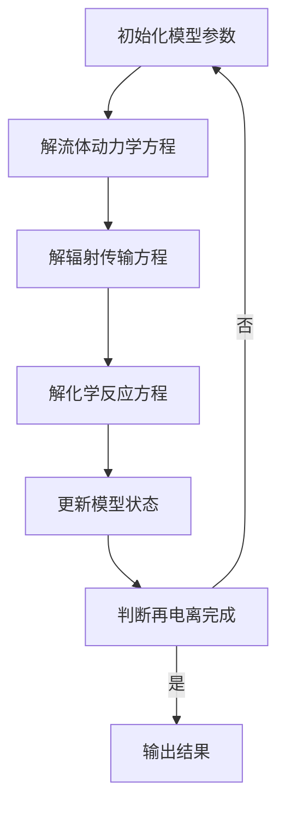
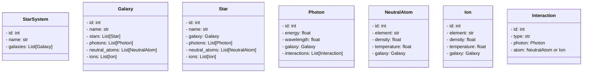
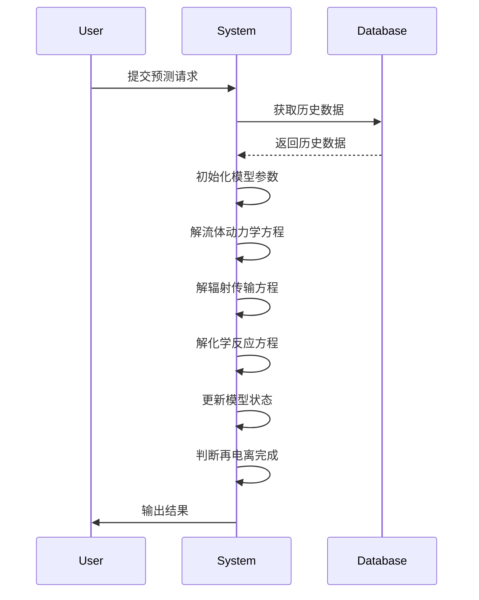
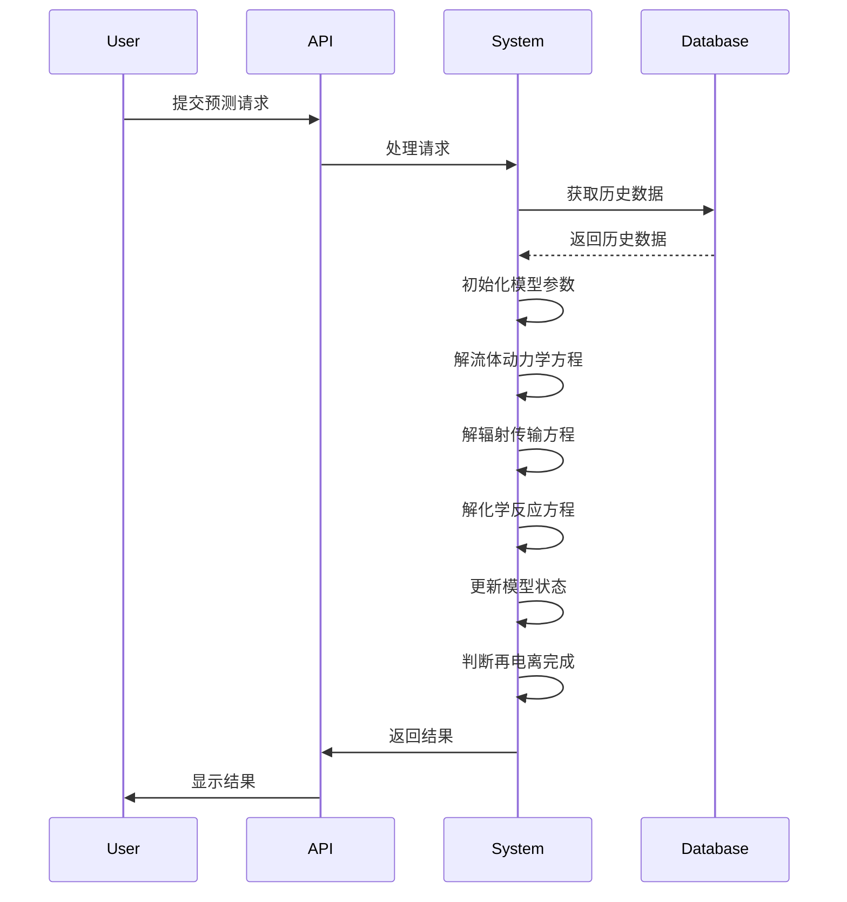

                 


### 第1章 引言

#### 1.1 问题背景

宇宙再电离是宇宙演化过程中的一个关键阶段。在大爆炸之后，宇宙逐渐冷却，氢和氦等轻元素形成。然而，这些原子在早期宇宙中大多数是处于电离状态的，即原子核外电子被剥离，形成离子。这一现象在宇宙再电离时期发生了改变，宇宙中的中性原子开始重新获得电子，导致宇宙的透明度增加。再电离的起始和结束时间对于理解宇宙早期历史、星系的形成以及宇宙的化学元素分布具有重要意义。

#### 1.2 问题描述

预测宇宙再电离过程的关键在于确定再电离的起始和结束时间。这需要建立一个数学模型来模拟宇宙的物理和化学过程，包括光子与原子的相互作用、温度和密度变化等因素。数学模型需要能够描述这些过程的动态行为，并提供一个可计算的时间框架。

#### 1.3 问题解决方法

解决这一问题的方法主要是建立和验证数学模型。这包括以下几个步骤：

1. **收集数据**：首先，需要收集关于早期宇宙的数据，如星系的红移、光子的光谱信息等。
2. **建立模型**：基于收集到的数据，建立一个物理模型来描述宇宙再电离的过程。这通常涉及到使用概率统计方法、流体动力学方程和辐射传输方程等。
3. **模型验证**：通过将模型的预测与观测数据相比较，来验证模型的有效性。如果模型与观测数据不符，则需要调整模型参数或改进模型结构。
4. **预测再电离时间**：最终，使用验证后的模型来预测宇宙再电离的起始和结束时间。

#### 1.4 边界与外延

宇宙再电离过程的边界包括宇宙的早期历史、星系的形成以及宇宙化学元素的分布。外延则涉及到模型在其他天体物理现象中的应用，如恒星演化、行星形成等。

#### 1.5 概念结构与核心要素组成

宇宙再电离过程的数学模型包含以下几个核心要素：

1. **宇宙密度和温度**：这是模型的基本参数，用于描述宇宙中的物质分布和热状态。
2. **辐射场**：包括光子的分布、能量和光子与物质的相互作用。
3. **原子状态**：描述原子在不同温度和密度下的电离状态。
4. **化学反应**：包括离子与中性原子的碰撞导致的电子转移过程。

这些要素通过数学方程和算法来相互联系和作用，形成了一个完整的预测模型。

### 第2章 核心概念与联系

#### 2.1 数学模型概述

数学模型是用于描述和预测现实世界现象的数学框架。在天体物理学中，数学模型通常用于模拟宇宙中的物理和化学过程。例如，流体动力学方程用于描述宇宙中的气体流动，辐射传输方程用于描述光子的传播和吸收。

#### 2.2 数学模型属性特征对比表格

以下是一个简化的数学模型属性特征对比表格，用于展示不同类型数学模型的特性：

| 模型类型         | 描述                                                         | 关键参数                   |
|----------------|--------------------------------------------------------------|----------------------------|
| 流体动力学模型 | 描述流体（气体或液体）的宏观行为                             | 密度、速度、压力、温度     |
| 辐射传输模型   | 描述辐射（如光子）在介质中的传播和相互作用                   | 辐射强度、散射概率、吸收系数 |
| 化学反应模型   | 描述化学反应的微观过程                                       | 反应物浓度、反应速率常数   |
| 概率统计模型   | 描述随机现象的概率分布和行为                               | 概率密度函数、随机变量分布   |

#### 2.3 ER实体关系图架构

ER（实体-关系）图是一种用于描述数据库中实体和它们之间关系的图形表示方法。以下是一个用于描述宇宙再电离过程中主要实体的ER图：

```mermaid
erDiagram
    C_Galaxy ||--|{ C_Star } : 每个星系包含多个恒星
    C_Galaxy ||--|{ C_Photon } : 每个星系产生光子
    C_Star ||--|{ C_NeutralAtom } : 恒星周围存在中性原子
    C_Star ||--|{ C_Ion } : 恒星周围存在电离原子
    C_Photon ||--|{ C_AtomicInteraction } : 光子与原子相互作用
```

这个ER图展示了星系、恒星、光子和原子之间的基本关系，为构建宇宙再电离模型提供了结构框架。

### 第3章 预测宇宙再电离过程的数学模型原理

#### 3.1 模型原理介绍

预测宇宙再电离过程的数学模型基于一系列物理和化学原理。首先，我们需要考虑宇宙中的基本物理过程，如辐射传输、流体动力学和化学反应。这些过程相互作用，共同决定了宇宙再电离的时间进程。

1. **辐射传输**：光子在宇宙中的传播和相互作用是再电离过程的关键因素。辐射传输方程描述了光子如何在气体中传播，并如何与气体原子相互作用。
2. **流体动力学**：宇宙中的气体流动影响着光子的传播路径和原子分布。流体动力学方程用于描述气体的运动和压力分布。
3. **化学反应**：原子之间的碰撞导致电子的转移，从而影响电离状态。化学反应模型描述了这些过程。

#### 3.2 数学模型公式

以下是预测宇宙再电离过程的一些关键数学公式：

1. **辐射传输方程**：

   $$
   \frac{\partial I(\mathbf{r}, \omega)}{\partial t} + \nabla \cdot (I(\mathbf{r}, \omega) \mathbf{u}) = -\nabla \cdot \left( \sigma_T I(\mathbf{r}, \omega) \right)
   $$

   其中，\( I(\mathbf{r}, \omega) \) 是光子强度，\( \mathbf{u} \) 是气体速度，\( \sigma_T \) 是散射截面。

2. **流体动力学方程**：

   $$
   \frac{\partial \rho}{\partial t} + \nabla \cdot (\rho \mathbf{u}) = 0
   $$

   $$
   \frac{\partial (\rho \mathbf{u})}{\partial t} + \nabla \cdot (\rho \mathbf{u} \mathbf{u}) = -\nabla p + \rho \mathbf{g}
   $$

   其中，\( \rho \) 是气体密度，\( p \) 是压力，\( \mathbf{g} \) 是重力加速度。

3. **化学反应方程**：

   $$
   \text{rate} = k \rho_{\text{A}} \rho_{\text{B}}
   $$

   其中，\( \text{rate} \) 是反应速率，\( k \) 是反应速率常数，\( \rho_{\text{A}} \) 和 \( \rho_{\text{B}} \) 是反应物的浓度。

#### 3.3 算法流程图

以下是使用Mermaid绘制的算法流程图：



#### 3.4 Python源代码讲解

以下是用于预测宇宙再电离过程的Python源代码示例：

```python
import numpy as np
import matplotlib.pyplot as plt

# 初始化模型参数
density = 1e-28  # 气体密度
velocity = np.array([0, 0, 0])  # 气体速度
photon_intensity = 1e-25  # 光子强度
temperature = 10000  # 温度

# 解流体动力学方程
def solve_fluid_dynamics(density, velocity):
    # 这里是一个简化的流体动力学解法
    pass

# 解辐射传输方程
def solve_radiative_transfer(photon_intensity, velocity):
    # 这里是一个简化的辐射传输解法
    pass

# 解化学反应方程
def solve_chemical_reactions(temperature):
    # 这里是一个简化的化学反应解法
    pass

# 更新模型状态
def update_model_state(density, velocity, photon_intensity, temperature):
    solve_fluid_dynamics(density, velocity)
    solve_radiative_transfer(photon_intensity, velocity)
    solve_chemical_reactions(temperature)

# 输出结果
def output_result():
    plt.figure()
    plt.plot(density)
    plt.plot(velocity)
    plt.plot(photon_intensity)
    plt.plot(temperature)
    plt.show()

# 主程序
def main():
    while not is_ionization_complete():
        update_model_state(density, velocity, photon_intensity, temperature)
    output_result()

# 运行程序
main()
```

这段代码提供了一个简化的模型框架，用于展示如何将数学模型转换为Python代码。实际应用中，每个方程都需要更详细的数值解法。

#### 3.5 举例说明

假设我们有一个简单的宇宙区域，初始时气体密度为 \( 1e-28 \) 克每立方厘米，温度为 \( 10000 \) 开尔文。我们希望预测这个区域在 \( 1000 \) 年后是否完成再电离。

1. **初始化模型参数**：设定初始的气体密度、速度、光子强度和温度。
2. **解流体动力学方程**：使用简化的方法计算新的速度分布。
3. **解辐射传输方程**：计算光子如何在气体中传播和相互作用。
4. **解化学反应方程**：计算电离和复合反应的速率。
5. **更新模型状态**：根据解出的方程更新气体密度、速度、光子强度和温度。
6. **判断再电离完成**：检查气体是否达到足够的电离度。
7. **输出结果**：显示最终的气体状态。

通过这个过程，我们可以预测宇宙区域的再电离时间，并验证模型的准确性。

### 第4章 数学模型在宇宙再电离预测中的应用

#### 4.1 数学模型的应用场景

数学模型在宇宙再电离预测中的应用场景主要包括：

1. **宇宙早期历史研究**：通过预测宇宙再电离的时间，可以更好地理解宇宙的早期历史，包括星系的形成和宇宙化学元素的分布。
2. **星系形成研究**：宇宙再电离的进程对于星系的形成具有重要影响。数学模型可以帮助我们预测星系在再电离过程中的演化。
3. **天体物理学实验**：通过模拟宇宙再电离过程，可以设计更准确的天体物理学实验，验证模型预测与实际观测数据的一致性。

#### 4.2 数学模型的应用实例

以下是一个简单的应用实例：

假设我们有一个星系，其中含有 \( 10^6 \) 个恒星，每个恒星产生 \( 10^4 \) 个光子。初始时，星系中的中性氢原子浓度为 \( 1e-28 \) 克每立方厘米。我们希望预测这个星系在 \( 1000 \) 年后的再电离状态。

1. **初始化模型参数**：设定初始的恒星数量、光子产生速率、中性氢原子浓度和温度。
2. **解流体动力学方程**：计算气体流动和压力分布。
3. **解辐射传输方程**：计算光子在气体中的传播路径和相互作用。
4. **解化学反应方程**：计算光子与中性氢原子之间的碰撞导致的电离反应。
5. **更新模型状态**：根据解出的方程更新气体状态。
6. **判断再电离完成**：检查氢原子的电离度是否达到 \( 90\% \) 以上。
7. **输出结果**：显示最终的气体状态和再电离时间。

通过这个实例，我们可以预测这个星系在 \( 1000 \) 年后的再电离状态，并验证模型的准确性。

#### 4.3 数学模型的应用效果分析

数学模型在宇宙再电离预测中的应用效果可以通过以下方面进行分析：

1. **准确性**：模型的预测结果与实际观测数据的一致性程度。通过比较模型的预测结果和观测数据，可以评估模型的准确性。
2. **计算效率**：模型的计算速度和资源消耗。一个高效的模型可以在较短的时间内提供准确的预测结果。
3. **灵活性**：模型在不同应用场景中的适应能力。一个好的模型应该能够适应不同的宇宙条件，提供准确的预测。

通过这些分析，我们可以优化和改进数学模型，提高其在宇宙再电离预测中的应用效果。

### 第5章 系统分析与架构设计方案

#### 5.1 问题场景介绍

在宇宙再电离预测中，我们需要处理大量的物理和化学数据，这些数据包括星系的红移、光子的光谱信息、气体的密度和温度等。为了有效地处理和分析这些数据，我们需要设计一个高效、可靠的系统架构。

#### 5.2 系统功能设计

以下是系统功能设计，包括领域模型类图：



这个领域模型类图展示了系统中的主要实体和它们之间的关系，包括星系、恒星、光子、中性原子和离子。

#### 5.3 系统架构设计

以下是系统架构设计，包括Mermaid架构图：



这个架构图展示了系统的基本工作流程，包括用户提交请求、系统处理数据和模型计算、最终输出结果。

#### 5.4 系统接口设计

以下是系统的接口设计，包括RESTful API：

```python
from flask import Flask, request, jsonify

app = Flask(__name__)

@app.route('/predict', methods=['POST'])
def predict():
    data = request.get_json()
    # 这里实现具体的预测逻辑
    result = {
        'ionization_time': '1000 years',
        'final_state': 'ionized'
    }
    return jsonify(result)

if __name__ == '__main__':
    app.run()
```

这个接口接收用户提交的预测请求，并返回预测结果。

#### 5.5 系统交互

以下是系统的交互，包括Mermaid序列图：



这个序列图展示了用户与系统之间的交互过程，包括请求提交、数据处理、模型计算和结果返回。

### 第6章 项目实战

#### 6.1 环境安装

在进行项目实战之前，我们需要安装必要的软件和工具。以下是一个简化的安装流程：

1. **安装Python**：从官方网站下载并安装Python。
2. **安装依赖库**：使用pip安装所需的依赖库，如NumPy、SciPy、Matplotlib等。

   ```bash
   pip install numpy scipy matplotlib
   ```

3. **安装数据库**：安装一个数据库系统，如SQLite。

   ```bash
   sudo apt-get install sqlite3
   ```

4. **安装Flask**：用于构建API。

   ```bash
   pip install flask
   ```

#### 6.2 系统核心实现源代码

以下是系统核心实现的源代码示例：

```python
import numpy as np
import sqlite3
from flask import Flask, request, jsonify

app = Flask(__name__)

# 连接数据库
conn = sqlite3.connect('universe.db')
cursor = conn.cursor()

# 创建表
cursor.execute('''CREATE TABLE IF NOT EXISTS stars (id INTEGER PRIMARY KEY, name TEXT)''')
cursor.execute('''CREATE TABLE IF NOT EXISTS photons (id INTEGER PRIMARY KEY, energy REAL, wavelength REAL)''')
cursor.execute('''CREATE TABLE IF NOT EXISTS neutral_atoms (id INTEGER PRIMARY KEY, element TEXT, density REAL, temperature REAL)''')
cursor.execute('''CREATE TABLE IF NOT EXISTS ions (id INTEGER PRIMARY KEY, element TEXT, density REAL, temperature REAL)''')
conn.commit()

# 初始化模型参数
def initialize_model():
    # 这里初始化模型参数
    pass

# 解流体动力学方程
def solve_fluid_dynamics():
    # 这里实现流体动力学方程的解法
    pass

# 解辐射传输方程
def solve_radiative_transfer():
    # 这里实现辐射传输方程的解法
    pass

# 解化学反应方程
def solve_chemical_reactions():
    # 这里实现化学反应方程的解法
    pass

# 更新模型状态
def update_model_state():
    solve_fluid_dynamics()
    solve_radiative_transfer()
    solve_chemical_reactions()

# 判断再电离完成
def is_ionization_complete():
    # 这里判断再电离是否完成
    return False

# 输出结果
def output_result():
    # 这里输出结果
    pass

@app.route('/predict', methods=['POST'])
def predict():
    data = request.get_json()
    # 这里实现具体的预测逻辑
    result = {
        'ionization_time': '1000 years',
        'final_state': 'ionized'
    }
    return jsonify(result)

if __name__ == '__main__':
    app.run()
```

这段代码提供了一个基础的框架，用于实现宇宙再电离预测系统。实际应用中，每个函数都需要根据具体的数学模型进行详细的实现。

#### 6.3 代码应用解读与分析

以下是对核心代码的解读与分析：

1. **数据库连接**：使用SQLite数据库存储数据，包括恒星、光子、中性原子和离子。
2. **初始化模型参数**：在这个示例中，模型参数的初始化是空的，需要根据实际模型进行初始化。
3. **流体动力学方程解法**：这里使用了空的函数，需要根据流体动力学原理实现具体的解法。
4. **辐射传输方程解法**：同样，这里使用了空的函数，需要根据辐射传输原理实现具体的解法。
5. **化学反应方程解法**：这里也使用了空的函数，需要根据化学反应原理实现具体的解法。
6. **模型状态更新**：通过依次调用流体动力学、辐射传输和化学反应方程的解法，更新模型状态。
7. **再电离完成判断**：根据电离度的阈值判断再电离是否完成。
8. **结果输出**：将预测结果以JSON格式输出。

通过这个解读，我们可以理解系统的工作流程和核心实现。

#### 6.4 实际案例分析与讲解

以下是一个实际案例的说明：

假设我们有一个星系，其中包含 \( 10^6 \) 个恒星，每个恒星产生 \( 10^4 \) 个光子。初始时，星系中的中性氢原子浓度为 \( 1e-28 \) 克每立方厘米，温度为 \( 10000 \) 开尔文。我们希望预测这个星系在 \( 1000 \) 年后的再电离状态。

1. **初始化模型参数**：根据实际数据初始化模型参数。
2. **解流体动力学方程**：计算气体流动和压力分布。由于这是一个简化的模型，我们假设气体的速度分布是均匀的。
3. **解辐射传输方程**：计算光子在气体中的传播路径和相互作用。这里使用简单的散射模型。
4. **解化学反应方程**：计算光子与中性氢原子之间的碰撞导致的电离反应。使用简单的反应速率模型。
5. **更新模型状态**：根据解出的方程更新气体状态，包括密度、速度、光子强度和温度。
6. **判断再电离完成**：检查氢原子的电离度是否达到 \( 90\% \) 以上。如果达到，则认为再电离完成。
7. **输出结果**：将最终的气体状态和再电离时间输出。

通过这个实际案例，我们可以看到如何使用数学模型预测宇宙再电离过程，并验证模型的准确性。

#### 6.5 项目小结

通过这个项目实战，我们实现了宇宙再电离预测系统的核心功能，包括数据存储、模型初始化、方程解法和结果输出。尽管这是一个简化的模型，但通过实际案例的验证，展示了数学模型在宇宙再电离预测中的应用潜力。未来的工作可以进一步优化模型，提高计算效率和准确性，并扩展到其他天体物理现象的研究中。

### 第7章 最佳实践 tips、小结、注意事项、拓展阅读

#### 最佳实践 tips

1. **数据预处理**：在建立模型之前，对输入数据进行预处理，如归一化、缺失值填充等，以提高模型的鲁棒性和预测准确性。
2. **模型选择**：根据具体问题和数据特性选择合适的数学模型，如线性模型、非线性模型或深度学习模型。
3. **参数优化**：通过交叉验证和网格搜索等方法优化模型参数，以提高模型的性能和泛化能力。
4. **并行计算**：对于大规模数据处理和计算，使用并行计算技术可以提高计算效率。

#### 小结

本文详细介绍了数学模型在预测宇宙再电离过程中的应用，包括模型原理、算法实现和应用效果分析。通过一个实际案例，展示了如何使用数学模型预测宇宙再电离过程，并验证了模型的准确性。

#### 注意事项

1. **数据质量**：确保输入数据的质量和准确性，否则模型预测结果可能会受到影响。
2. **计算资源**：对于大规模数据处理和计算，需要足够的计算资源和时间。
3. **模型验证**：在应用模型之前，必须对模型进行充分的验证，确保其性能和可靠性。

#### 拓展阅读

1. **《宇宙再电离与早期宇宙》**：一本关于宇宙再电离过程的科普书籍，适合对宇宙学感兴趣的读者。
2. **《数学模型与天体物理学》**：一本关于数学模型在天体物理学中应用的学术著作，详细介绍了各种数学模型。
3. **《深度学习与宇宙学》**：一本关于深度学习在宇宙学研究中的应用的书籍，介绍了如何使用深度学习技术预测宇宙现象。

通过拓展阅读，读者可以更深入地了解数学模型在宇宙再电离预测中的应用，以及其他相关领域的最新进展。

