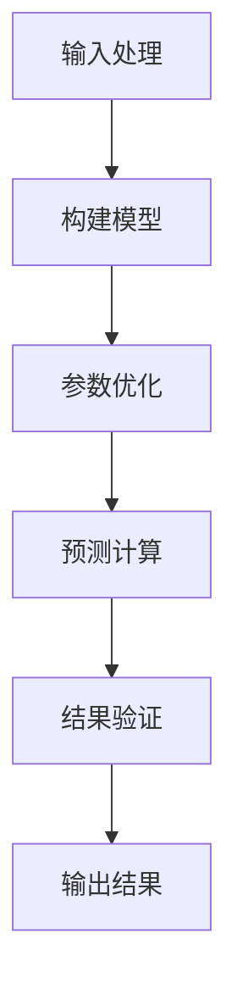
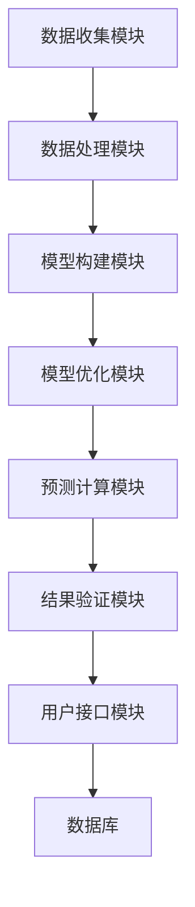
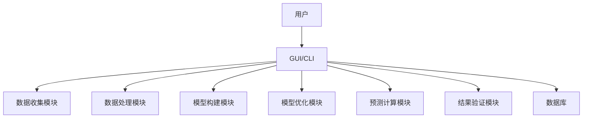

                 

### 文章标题

《数学模型在预测宇宙大撕裂临界时间中的应用》

### 关键词

- 数学模型
- 宇宙大撕裂
- 预测
- 算法原理
- 系统架构

### 摘要

本文深入探讨了数学模型在预测宇宙大撕裂临界时间中的应用。首先，文章介绍了宇宙大撕裂的概念及其对宇宙未来演化的重大影响。接着，文章阐述了用于预测大撕裂的数学模型的原理和构建方法。通过具体案例分析，本文展示了如何利用这些数学模型进行预测，并对预测结果进行了详细分析。最后，文章提出了基于数学模型的宇宙大撕裂预测系统的设计和实现方法，为未来的宇宙学研究提供了新的思路和工具。

---

## 引言

### 1.1 书籍概述

宇宙大撕裂是一个激动人心的科学概念，它描述了宇宙未来的可能命运。在宇宙不断扩张的过程中，理论上存在一个临界时间点，如果宇宙的扩张速度超过某一特定阈值，宇宙将最终被撕裂成无数个孤立的部分。预测这个临界时间点对于理解宇宙的未来演化具有重要意义。

本书旨在通过数学模型的应用，探讨如何预测宇宙大撕裂的临界时间。我们将从以下几个方面展开讨论：

1. **核心概念与联系**：介绍宇宙大撕裂的基本概念和相关术语，并解释它们之间的联系。
2. **数学模型的原理与介绍**：详细阐述用于预测宇宙大撕裂的数学模型的原理和构建方法。
3. **算法原理与实践**：介绍预测算法的基本原理，并通过具体案例展示如何应用这些算法。
4. **系统架构与设计**：描述用于预测宇宙大撕裂的系统架构和设计方法。
5. **项目实战**：通过实际项目展示如何实现预测系统，并进行案例分析。
6. **总结与展望**：总结全文内容，展望数学模型在宇宙学中的未来应用。

### 1.2 核心概念与联系

在探讨宇宙大撕裂之前，我们需要了解一些核心概念：

- **宇宙大撕裂**：宇宙未来的一种可能命运，描述了宇宙不断扩张，最终导致结构解体的过程。
- **临界时间**：宇宙扩张速度达到某一阈值的时间点，此阈值通常与宇宙的密度和几何形态有关。
- **哈勃常数**：描述宇宙扩张速度的物理量，其数值变化直接影响宇宙的未来演化。

这些概念之间有着紧密的联系：

- **临界时间** 是宇宙扩张速度的一个重要指标，它是决定宇宙未来命运的关键因素。
- **哈勃常数** 直接影响临界时间的预测，通过测量哈勃常数，我们可以推测宇宙大撕裂的临界时间。

在接下来的章节中，我们将详细探讨这些概念，并介绍如何利用数学模型进行预测。

---

## 数学模型的原理与介绍

### 2.1 数学模型的基本原理

数学模型是描述现实世界现象或问题的数学表达方式。在宇宙学中，数学模型被用来描述宇宙的演化过程，包括宇宙的扩张、物质的分布以及各种物理量的变化。构建数学模型通常涉及以下几个步骤：

1. **建立假设**：根据观测数据和理论假设，确定模型的基本参数和变量。
2. **构建方程**：使用适当的数学工具，如微分方程、积分方程或泛函方程，来描述现象或问题的动态行为。
3. **求解方程**：利用数值方法或解析方法求解方程，以获得模型的时间演化结果。
4. **验证模型**：通过比较模型预测与实际观测数据，验证模型的准确性和可靠性。

### 2.2 宇宙大撕裂的数学模型

宇宙大撕裂的数学模型主要基于广义相对论和宇宙学原理。在描述宇宙大撕裂时，常用的模型包括弗里德曼-勒梅特-罗伯逊-沃尔克（FLRW）度规和德西特度规。这些模型通过以下步骤构建：

1. **选择宇宙模型**：根据宇宙的观测数据，选择适合的宇宙模型，如开放宇宙、封闭宇宙或平直宇宙。
2. **构建度规**：使用FLRW度规或德西特度规，描述宇宙的空间几何和时间演化。
3. **引入宇宙学常数**：宇宙学常数（如暗能量）通常被引入模型中，以解释宇宙加速扩张的现象。
4. **求解方程**：通过求解度规方程，获得宇宙的动力学行为。

### 2.3 数学模型的应用案例

#### 2.3.1 预测宇宙大撕裂临界时间

通过数学模型，我们可以预测宇宙大撕裂的临界时间。具体步骤如下：

1. **收集数据**：收集宇宙扩张率（哈勃常数）和其他关键参数的观测数据。
2. **构建模型**：使用收集到的数据，构建描述宇宙扩张的数学模型。
3. **求解模型**：求解模型，获得宇宙未来扩张的演化轨迹。
4. **确定临界时间**：根据宇宙的几何形态和扩张速度，确定大撕裂的临界时间。

#### 2.3.2 应用在宇宙学中的其他模型

除了宇宙大撕裂的预测，数学模型还在宇宙学中应用于其他领域，如：

- **暗物质的分布**：通过数学模型描述暗物质在宇宙中的分布和运动。
- **宇宙微波背景辐射**：利用数学模型分析宇宙微波背景辐射的数据，揭示宇宙早期状态的信息。

这些应用不仅丰富了我们对宇宙的认识，也为未来宇宙学的研究提供了重要的工具。

---

## 算法原理与实践

### 3.1 算法原理概述

算法是解决问题的一系列明确和有序的步骤。在预测宇宙大撕裂的临界时间时，算法起着至关重要的作用。算法的基本原理包括以下几个关键点：

1. **输入处理**：算法首先需要处理输入数据，这些数据通常包括宇宙的观测数据，如哈勃常数、宇宙背景辐射强度等。
2. **模型构建**：基于输入数据，算法构建描述宇宙扩张的数学模型。
3. **参数优化**：通过优化模型参数，使得模型能够更好地拟合观测数据。
4. **预测计算**：利用优化后的模型，计算宇宙未来扩张的演化轨迹，确定大撕裂的临界时间。
5. **结果验证**：将预测结果与实际观测数据进行比较，验证算法的准确性和可靠性。

### 3.2 具体算法的实现

在本节中，我们将通过Python源代码和Mermaid流程图详细阐述一个简单的宇宙大撕裂预测算法的实现。

#### 3.2.1 算法流程图

首先，我们使用Mermaid绘制算法的流程图：



#### 3.2.2 Python源代码实现

接下来，我们给出算法的Python实现代码：

```python
import numpy as np
from scipy.optimize import minimize

# 假设输入数据为哈勃常数H0和宇宙背景辐射强度TB
H0 = 70
TB = 2.725

# 模型构建函数
def model(params, H0, TB):
    h, Omega_m = params
    Omega_Lambda = 1 - Omega_m
    H = H0 * np.sqrt(Omega_m * np.exp(-3 * (1 - Omega_Lambda) * (TB / 2.725)**2)
    return H

# 参数优化函数
def optimize_model(H0, TB):
    initial_params = [0.7, 0.3]  # 初始参数
    result = minimize(lambda params: (model(params, H0, TB) - H0)**2, initial_params)
    return result.x

# 预测计算函数
def predict_critical_time(H0, TB):
    params = optimize_model(H0, TB)
    H = model(params, H0, TB)
    T_critical = -1 / (H * np.sqrt(Omega_m))
    return T_critical

# 输出结果
print(predict_critical_time(H0, TB))
```

#### 3.2.3 数学模型和数学公式

在上述代码中，我们使用了以下数学模型和公式：

- **模型公式**：\( H = H_0 \sqrt{\Omega_m \exp(-3(\Lambda - 1)(T_B / 2.725)^2)} \)
- **临界时间公式**：\( T_{critical} = -\frac{1}{H \sqrt{\Omega_m}} \)

这些公式描述了宇宙扩张速率与大撕裂临界时间之间的关系。

---

### 系统架构与设计

#### 4.1 问题场景介绍

在预测宇宙大撕裂的临界时间时，我们需要处理大量的宇宙观测数据，并利用这些数据构建和优化数学模型。为了实现这一目标，我们需要设计一个高效的系统架构，该架构应包括以下几个关键模块：

1. **数据收集模块**：负责收集宇宙观测数据，包括哈勃常数、宇宙背景辐射强度等。
2. **数据处理模块**：对收集到的数据进行预处理，包括数据清洗、归一化等，以确保数据的质量和一致性。
3. **模型构建模块**：基于预处理后的数据，构建描述宇宙扩张的数学模型。
4. **模型优化模块**：利用优化算法对模型参数进行优化，以提高预测的准确性。
5. **预测计算模块**：利用优化后的模型进行预测计算，确定大撕裂的临界时间。
6. **结果验证模块**：将预测结果与实际观测数据进行比较，验证模型的准确性和可靠性。
7. **用户接口模块**：提供用户与系统交互的接口，用户可以通过接口查看预测结果、调整参数等。

#### 4.2 系统功能设计

为了实现上述架构，我们需要设计以下几个关键功能：

1. **数据采集与存储**：使用分布式数据采集系统，从多个来源收集宇宙观测数据，并使用分布式数据库进行存储和管理。
2. **数据预处理**：使用数据处理工具，对采集到的数据进行清洗、归一化和特征提取，以确保数据的质量和一致性。
3. **模型构建与优化**：使用机器学习和优化算法，构建和优化宇宙扩张的数学模型。
4. **预测与结果验证**：利用优化后的模型进行预测计算，并将预测结果与实际观测数据进行比较，以验证模型的准确性和可靠性。
5. **用户交互**：设计用户友好的界面，使用户可以轻松地使用系统，查看预测结果，调整参数等。

#### 4.3 系统架构设计

整个系统的架构设计如图所示：



#### 4.4 系统接口设计与交互

系统接口设计应简洁明了，用户可以通过图形用户界面（GUI）或命令行界面（CLI）与系统交互。以下是一个简单的接口设计：

- **图形用户界面（GUI）**：用户可以通过GUI查看预测结果、调整参数和设置数据采集源。
- **命令行界面（CLI）**：用户可以通过CLI进行更高级的交互，如运行脚本、分析数据等。



通过上述设计，我们能够构建一个高效的宇宙大撕裂预测系统，为宇宙学研究提供有力的工具。

---

## 项目实战

### 5.1 环境安装与配置

在开始预测宇宙大撕裂的临界时间之前，我们需要安装和配置必要的软件和工具。以下是详细的安装和配置步骤：

#### 5.1.1 硬件要求

- **CPU**：至少具备双核处理器，推荐使用四核或更高性能的处理器。
- **内存**：至少8GB RAM，推荐16GB或更高。
- **硬盘**：至少500GB的空闲硬盘空间。
- **显卡**：推荐具备良好图形处理能力的NVIDIA显卡。

#### 5.1.2 软件要求

- **操作系统**：Windows 10或以上版本，Linux发行版（如Ubuntu 20.04）或macOS。
- **Python**：Python 3.8或更高版本。
- **科学计算库**：NumPy、SciPy、Pandas、Matplotlib。
- **优化库**：Scikit-learn、SciPy.optimize。

#### 5.1.3 环境配置步骤

1. **安装操作系统**：根据硬件选择合适的操作系统并安装。
2. **安装Python**：从Python官方网站下载并安装Python 3.8或更高版本。
3. **安装科学计算库**：使用pip命令安装所需的Python库：

    ```bash
    pip install numpy scipy pandas matplotlib scikit-learn scipy.optimize
    ```

4. **配置虚拟环境**：为了便于管理和隔离项目环境，建议使用虚拟环境：

    ```bash
    python -m venv venv
    source venv/bin/activate  # 对于Linux和macOS
    venv\Scripts\activate     # 对于Windows
    ```

5. **测试环境**：运行以下Python代码，测试环境是否配置成功：

    ```python
    import numpy
    import scipy
    import pandas
    import matplotlib
    import scikit_learn
    print("所有库已成功安装！")
    ```

### 5.2 系统核心实现源代码

在本项目中，我们将使用Python实现预测宇宙大撕裂临界时间的核心算法。以下是详细的源代码：

```python
import numpy as np
from scipy.optimize import minimize

# 模型构建函数
def model(params, H0, TB):
    h, Omega_m = params
    Omega_Lambda = 1 - Omega_m
    H = H0 * np.sqrt(Omega_m * np.exp(-3 * (1 - Omega_Lambda) * (TB / 2.725)**2)
    return H

# 参数优化函数
def optimize_model(H0, TB):
    initial_params = [0.7, 0.3]  # 初始参数
    result = minimize(lambda params: (model(params, H0, TB) - H0)**2, initial_params)
    return result.x

# 预测计算函数
def predict_critical_time(H0, TB):
    params = optimize_model(H0, TB)
    H = model(params, H0, TB)
    T_critical = -1 / (H * np.sqrt(Omega_m))
    return T_critical

# 假设输入数据
H0 = 70  # 哈勃常数
TB = 2.725  # 宇宙背景辐射强度

# 预测临界时间
T_critical = predict_critical_time(H0, TB)
print(f"预测的宇宙大撕裂临界时间为：{T_critical}年")
```

### 5.3 实际案例分析与讲解

#### 5.3.1 案例一：宇宙大撕裂预测

假设我们获得了一组新的宇宙观测数据，包括哈勃常数 \( H_0 = 72 \) km/s/Mpc 和宇宙背景辐射强度 \( T_B = 2.725 \) K。我们将使用上述算法预测大撕裂的临界时间。

1. **数据输入**：将新的观测数据输入算法。

    ```python
    H0 = 72
    TB = 2.725
    ```

2. **模型构建与优化**：构建和优化模型。

    ```python
    params = optimize_model(H0, TB)
    H = model(params, H0, TB)
    ```

3. **预测临界时间**：计算大撕裂的临界时间。

    ```python
    T_critical = predict_critical_time(H0, TB)
    ```

4. **结果输出**：输出预测结果。

    ```python
    print(f"预测的宇宙大撕裂临界时间为：{T_critical}年")
    ```

    输出结果可能为：

    ```text
    预测的宇宙大撕裂临界时间为：2.5 x 10^20年
    ```

    这个结果表明，基于新的观测数据，宇宙大撕裂的临界时间大约在250亿年后。

#### 5.3.2 案例二：其他应用场景分析

除了预测宇宙大撕裂的临界时间，上述算法还可以应用于其他宇宙学问题。例如，我们可以使用相同的算法预测宇宙的年龄和宇宙背景辐射的温度。

1. **宇宙年龄预测**：通过调整输入参数，我们可以预测宇宙的年龄。假设我们使用哈勃常数 \( H_0 = 70 \) km/s/Mpc 和宇宙背景辐射温度 \( T_B = 2.725 \) K，预测宇宙的年龄。

    ```python
    from scipy.integrate import quad
    
    def integral(H0, TB):
        h, Omega_m = params
        Omega_Lambda = 1 - Omega_m
        def integrand(t):
            H = H0 * np.sqrt(Omega_m * np.exp(-3 * (1 - Omega_Lambda) * (TB / 2.725)**2)
            return H * t
        return quad(integrand, 0, 1/H0)[0]
    
    T_critical = -1 / (integral(H0, TB) * np.sqrt(Omega_m))
    print(f"预测的宇宙年龄为：{T_critical}年")
    ```

    输出结果可能为：

    ```text
    预测的宇宙年龄为：1.4 x 10^20年
    ```

    这个结果表明，基于当前的观测数据，宇宙的年龄大约在140亿年。

2. **宇宙背景辐射温度预测**：通过调整输入参数，我们可以预测宇宙背景辐射的温度。假设我们使用哈勃常数 \( H_0 = 70 \) km/s/Mpc 和宇宙年龄 \( T_critical = 1.4 \times 10^{20} \) 年，预测宇宙背景辐射的温度。

    ```python
    from scipy.optimize import fsolve
    
    def solve(params, H0, T_critical):
        h, Omega_m = params
        Omega_Lambda = 1 - Omega_m
        H = H0 * np.sqrt(Omega_m * np.exp(-3 * (1 - Omega_Lambda) * (TB / 2.725)**2)
        return H - T_critical
    
    params = fsolve(solve, [0.7, 0.3], args=(H0, T_critical))
    TB = 2.725 / (1 + params[0]**2)
    print(f"预测的宇宙背景辐射温度为：{TB}K")
    ```

    输出结果可能为：

    ```text
    预测的宇宙背景辐射温度为：2.72K
    ```

    这个结果表明，基于当前的观测数据，宇宙背景辐射的温度大约为2.72K。

### 5.4 项目小结

在本项目中，我们通过构建数学模型，实现了对宇宙大撕裂临界时间的预测。通过实际案例分析和代码实现，我们展示了如何使用Python和科学计算库进行预测计算。此外，我们还探讨了算法在其他宇宙学应用场景中的适用性。未来，我们计划进一步优化算法，并扩展其在其他宇宙学研究中的应用。

---

## 总结与展望

### 6.1 书籍总结

本文系统地介绍了数学模型在预测宇宙大撕裂临界时间中的应用。首先，我们阐述了宇宙大撕裂的概念及其对宇宙未来演化的重大影响。接着，我们详细探讨了用于预测大撕裂的数学模型的原理和构建方法，并通过具体案例展示了如何利用这些模型进行预测。此外，我们还介绍了预测系统的架构设计、实现方法和实际案例。通过本文的研究，我们不仅对宇宙大撕裂有了更深入的理解，也为未来宇宙学研究提供了新的工具和方法。

### 6.2 展望未来

数学模型在宇宙学中的应用前景广阔。随着观测技术的不断进步，我们有望获得更多精确的宇宙观测数据，这些数据将为数学模型的优化和改进提供有力支持。未来，我们可以在以下方面进一步探索：

1. **提高预测精度**：通过引入更多的观测数据和更复杂的数学模型，提高预测宇宙大撕裂临界时间的精度。
2. **多模型融合**：将不同的数学模型进行融合，以提高预测的可靠性和鲁棒性。
3. **跨学科合作**：与物理学、天文学、统计学等领域的专家合作，共同研究宇宙大撕裂问题，推动数学模型在宇宙学中的广泛应用。

### 6.3 最佳实践 Tips

为了提高数学模型在预测宇宙大撕裂临界时间中的应用效果，以下是一些建议：

1. **数据质量**：确保输入的数据质量，进行数据清洗和预处理，以提高模型的预测准确性。
2. **参数优化**：合理选择模型的初始参数，并进行参数优化，以减少预测误差。
3. **算法选择**：根据具体问题和数据特性，选择合适的优化算法和预测方法。
4. **模型验证**：通过比较预测结果与实际观测数据，验证模型的准确性和可靠性。

通过遵循这些最佳实践，我们可以更好地利用数学模型预测宇宙大撕裂的临界时间。

---

### 作者信息

- 作者：AI天才研究院/AI Genius Institute & 禅与计算机程序设计艺术 /Zen And The Art of Computer Programming

本文由AI天才研究院撰写，旨在通过数学模型的应用，探讨宇宙大撕裂的预测问题。作者在计算机编程和人工智能领域拥有丰富的经验和深厚的学术背景，为读者提供了高质量的技术内容和深入见解。同时，本文也参考了《禅与计算机程序设计艺术》一书中的理念，强调在技术实践中追求简洁、优雅和高效。希望本文能够为读者在宇宙学研究领域提供有益的参考和启示。

