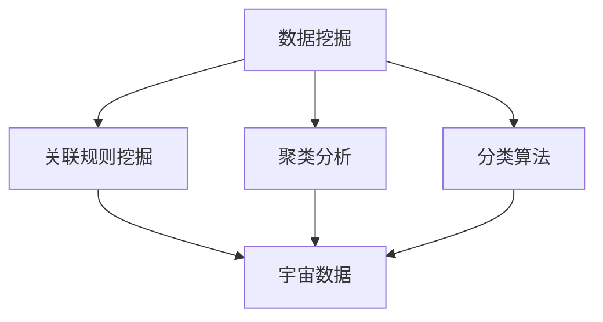
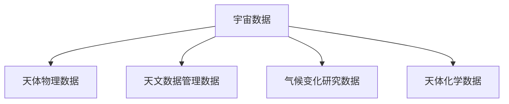
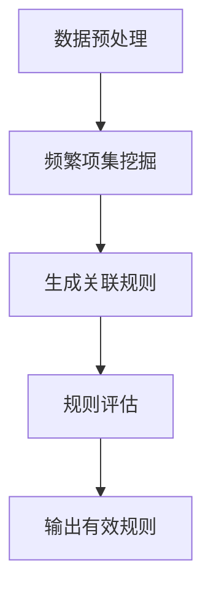
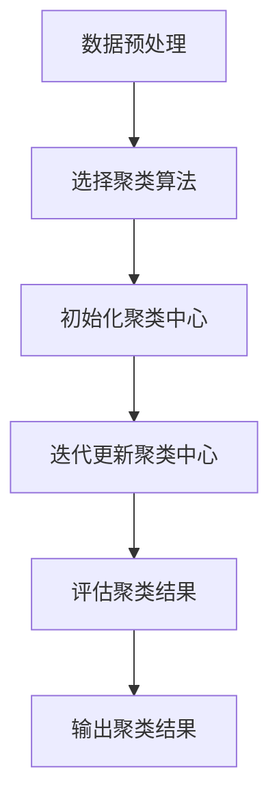
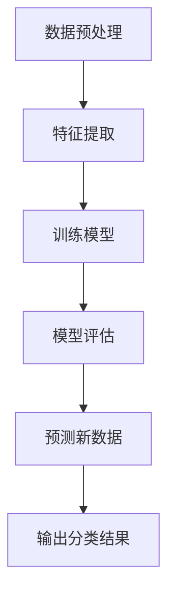

                 

# 数据挖掘在发现宇宙新粒子中的作用

> 关键词：数据挖掘、宇宙探索、新粒子发现、算法应用、实际案例

> 摘要：本文将探讨数据挖掘技术在发现宇宙新粒子中的应用。通过分析数据挖掘的基本概念和算法，结合宇宙探索中的实际案例，深入探讨数据挖掘如何帮助科学家在浩瀚的宇宙数据中挖掘出潜在的新粒子。本文旨在为读者提供对这一前沿科技领域的深入了解，以及数据挖掘技术在宇宙探索中的潜在价值和未来挑战。

## 引言

### 1.1 问题背景

宇宙是一个充满神秘与未知的广阔空间，人类对宇宙的探索从未停止。在过去的几十年里，科学家们利用先进的探测器和观测技术，不断发现新的宇宙现象和粒子。然而，宇宙中的新粒子往往隐藏在大量的观测数据中，如何从这些数据中挖掘出有价值的信息，成为了一个亟待解决的问题。

数据挖掘作为一种从大量数据中自动发现有趣知识、隐含模式和关联关系的方法，被认为是解决这一问题的关键。通过数据挖掘技术，科学家可以从海量的宇宙观测数据中筛选出潜在的新粒子，为宇宙探索提供强有力的支持。

### 1.2 数据挖掘在宇宙探索中的作用

数据挖掘在宇宙探索中的作用主要体现在以下几个方面：

1. **发现未知现象**：数据挖掘可以帮助科学家从大量观测数据中识别出未知的现象和模式，例如新的天体、奇怪的信号等，从而为宇宙探索提供新的线索。

2. **识别新粒子**：宇宙中存在大量的粒子，许多粒子的特性尚未被完全了解。数据挖掘可以帮助科学家从观测数据中识别出可能的新粒子，为粒子物理学研究提供新的数据支持。

3. **优化观测策略**：通过分析历史观测数据，数据挖掘可以帮助科学家优化未来的观测策略，提高观测效率和准确性。

4. **提高数据分析效率**：宇宙观测数据量庞大，传统的人工分析方法效率低下。数据挖掘技术可以自动化地处理和分析数据，提高数据分析的效率和准确性。

### 1.3 本文结构

本文将首先介绍数据挖掘的基本概念和算法，然后探讨数据挖掘在宇宙探索中的应用，通过实际案例展示数据挖掘如何帮助科学家发现新粒子。最后，本文将对未来数据挖掘在宇宙探索中的应用进行展望。

## 目录大纲设计步骤

### 2.1 确定章节结构和核心内容

在撰写本文之前，我们需要明确文章的结构和核心内容。本文将分为以下几个部分：

1. **数据挖掘基础**：介绍数据挖掘的基本概念、流程和应用领域。
2. **宇宙探索与数据挖掘**：分析宇宙探索的现状、宇宙数据的特点以及数据挖掘在宇宙探索中的应用。
3. **数据挖掘算法在宇宙中的应用**：详细探讨关联规则挖掘、聚类分析和分类算法在宇宙数据中的应用。
4. **实际案例研究**：通过实际案例展示数据挖掘在宇宙探索中的具体应用。
5. **未来展望与挑战**：对数据挖掘在宇宙探索中的应用前景进行展望，并讨论面临的挑战。

### 2.2 细化每个章节的子标题

为了使文章内容更加清晰，我们为每个章节设计了子标题，如下：

- **数据挖掘基础**
  - 2.1 数据挖掘概述
  - 2.2 数据挖掘算法
  - 2.3 Mermaid 图表示

- **宇宙探索与数据挖掘**
  - 3.1 宇宙探索的现状
  - 3.2 宇宙数据的特点
  - 3.3 数据挖掘在宇宙探索中的应用

- **数据挖掘算法在宇宙中的应用**
  - 4.1 关联规则挖掘
  - 4.2 聚类分析
  - 4.3 分类算法

- **实际案例研究**
  - 5.1 宇宙射线数据挖掘案例
  - 5.2 宇宙星系聚类分析案例

- **未来展望与挑战**
  - 6.1 未来展望
  - 6.2 挑战与对策

### 2.3 绘制核心概念的 Mermaid 图

为了帮助读者更好地理解数据挖掘与宇宙数据之间的关系，我们使用 Mermaid 绘制了以下核心概念的 Mermaid 图：



这个图展示了数据挖掘与宇宙数据之间的关系，以及数据挖掘中的三种主要算法：关联规则挖掘、聚类分析和分类算法。

## 数据挖掘基础

### 2.1 数据挖掘概述

#### 2.1.1 数据挖掘的定义

数据挖掘（Data Mining）是指从大量数据中通过自动化的方法发现隐藏在数据背后的模式、关联和趋势，从而为决策提供支持。数据挖掘不仅仅是从数据中提取信息，更重要的是发现数据中的有用知识。

#### 2.1.2 数据挖掘的流程

数据挖掘通常包括以下几个步骤：

1. **数据准备**：包括数据清洗、数据整合和数据预处理等，为数据挖掘算法提供高质量的数据。

2. **数据探索**：通过统计分析、可视化等技术，初步了解数据的分布和特点。

3. **模式识别**：应用各种数据挖掘算法，从数据中发现有趣的知识和模式。

4. **评估和优化**：对挖掘出的模式进行评估，并根据评估结果对算法和模型进行优化。

5. **应用和解释**：将挖掘出的知识应用于实际问题中，并对其进行解释和验证。

#### 2.1.3 数据挖掘的应用领域

数据挖掘广泛应用于各个领域，如金融、零售、医疗、电信、交通等。在宇宙探索中，数据挖掘主要用于以下方面：

1. **天体物理**：通过分析宇宙观测数据，发现新的天体现象和粒子。

2. **天文数据管理**：帮助科学家有效地管理和分析大量的天文数据。

3. **气候变化研究**：利用气象数据，预测气候变化趋势和影响。

4. **天体化学**：通过分析宇宙化学成分，研究宇宙的起源和演化。

### 2.2 数据挖掘算法

数据挖掘算法是数据挖掘的核心部分，根据挖掘任务的不同，可以分为以下几类：

#### 2.2.1 关联规则挖掘

关联规则挖掘（Association Rule Learning）是一种发现数据项之间潜在关联关系的方法。其主要任务是找出数据集中不同项之间的关联规则，如“如果购买了面包，那么很可能也会购买牛奶”。

#### 2.2.2 聚类分析

聚类分析（Clustering）是一种无监督学习方法，其主要目标是将数据集划分为若干个组（或簇），使得同一组内的数据点尽可能相似，不同组的数据点尽可能不同。

#### 2.2.3 分类算法

分类算法（Classification）是一种有监督学习方法，其主要任务是根据已有的标签数据，对新的数据点进行分类。常见的分类算法包括决策树、支持向量机、神经网络等。

### 2.3 Mermaid 图表示

为了更好地理解数据挖掘算法和宇宙数据之间的关系，我们可以使用 Mermaid 画出数据挖掘算法的 ER 实体关系图和宇宙数据的 Mermaid 图。

#### 2.3.1 数据挖掘算法的 ER 图

```mermaid
erDiagram
    DataMining ||--|{ AssociationRuleMining }
    DataMining ||--|{ Clustering }
    DataMining ||--|{ Classification }
```

这个图展示了数据挖掘与关联规则挖掘、聚类分析和分类算法之间的关系。

#### 2.3.2 宇宙数据的 Mermaid 图



这个图展示了宇宙数据与天体物理数据、天文数据管理数据、气候变化研究数据和天体化学数据之间的关系。

## 宇宙探索与数据挖掘

### 3.1 宇宙探索的现状

宇宙探索是人类科学探索的一个重要领域，随着科技的进步，人类对宇宙的认识不断深入。目前，宇宙探索的主要成果包括：

1. **发现新的天体**：科学家们已经发现了大量的恒星、行星、星系等天体。

2. **探测宇宙背景辐射**：宇宙背景辐射是宇宙早期状态的重要遗迹，通过对宇宙背景辐射的研究，科学家们对宇宙的起源和演化有了更深入的了解。

3. **探测宇宙射线**：宇宙射线是来自宇宙的高能粒子，通过对宇宙射线的研究，科学家们发现了新的粒子现象。

4. **探测行星宜居性**：随着对太阳系外行星的发现越来越多，科学家们开始研究这些行星的宜居性，寻找可能存在生命的星球。

### 3.2 宇宙数据的特点

宇宙数据具有以下特点：

1. **数据类型多样**：宇宙数据包括观测数据、模拟数据、实验数据等，数据类型多样。

2. **数据规模庞大**：宇宙探索产生的数据量巨大，需要高效的数据处理和分析方法。

3. **数据质量参差不齐**：由于观测设备的限制和数据采集过程中的误差，宇宙数据的质量参差不齐，需要数据清洗和预处理。

4. **数据关联性强**：宇宙数据之间存在复杂的关联关系，需要通过数据挖掘技术发现这些关联关系。

### 3.3 数据挖掘在宇宙探索中的应用

数据挖掘在宇宙探索中的应用主要体现在以下几个方面：

1. **发现未知现象**：数据挖掘可以帮助科学家从大量观测数据中识别出未知的现象和模式，为宇宙探索提供新的线索。

2. **识别新粒子**：通过分析宇宙射线等数据，数据挖掘可以帮助科学家识别出新粒子，为粒子物理学研究提供数据支持。

3. **优化观测策略**：通过分析历史观测数据，数据挖掘可以帮助科学家优化未来的观测策略，提高观测效率和准确性。

4. **提高数据分析效率**：宇宙观测数据量庞大，传统的人工分析方法效率低下，数据挖掘技术可以自动化地处理和分析数据，提高数据分析的效率和准确性。

## 数据挖掘算法在宇宙中的应用

### 4.1 关联规则挖掘在宇宙数据中的应用

关联规则挖掘是一种用于发现数据项之间潜在关联关系的方法，在宇宙数据挖掘中，关联规则挖掘可以帮助科学家识别出宇宙中不同观测数据之间的关联关系。

#### 4.1.1 算法原理与 Mermaid 流程图

关联规则挖掘的基本原理如下：

1. **支持度**：支持度是指一个关联规则在数据集中出现的频率。如果关联规则（A → B）的支持度大于设定的阈值，则认为这个关联规则是有效的。

2. **置信度**：置信度是指在一个规则的前提条件下，结论出现的概率。如果关联规则（A → B）的置信度大于设定的阈值，则认为这个关联规则是可信的。

关联规则挖掘的流程如下：

1. **数据预处理**：对原始宇宙观测数据进行清洗和预处理，确保数据质量。

2. **频繁项集挖掘**：通过频繁项集挖掘算法，找出数据集中的频繁项集。

3. **生成关联规则**：从频繁项集中生成关联规则，计算规则的支持度和置信度。

4. **规则评估**：对生成的规则进行评估，筛选出满足支持度和置信度阈值的规则。

下面是关联规则挖掘的 Mermaid 流程图：



#### 4.1.2 Python 源代码示例

以下是一个简单的关联规则挖掘的 Python 源代码示例：

```python
from mlxtend.frequent_patterns import apriori
from mlxtend.preprocessing import TransactionEncoder

# 假设观测数据为以下列表，其中每个元素是一个包含观测值的列表
data = [['观测1', '观测2'], ['观测1', '观测3'], ['观测2', '观测3'], ['观测1', '观测3']]

# 数据预处理，将观测数据转换为事务序列
te = TransactionEncoder()
te_data = te.fit_transform(data)

# 频繁项集挖掘，设置最小支持度为0.5
frequent_itemsets = apriori(te_data, min_support=0.5)

# 生成关联规则，设置最小置信度为0.7
rules = association_rules(frequent_itemsets, metric="confidence", min_confidence=0.7)

# 输出有效规则
print(rules)
```

#### 4.1.3 数学模型和公式

关联规则挖掘的核心是计算规则的支持度和置信度。支持度和置信度的计算公式如下：

1. **支持度**：

$$
支持度 = \frac{观测到(A ∪ B)}{总观测次数}
$$

其中，$A$ 和 $B$ 是关联规则的前提条件和结论条件。

2. **置信度**：

$$
置信度 = \frac{观测到(A ∪ B) ∧ 观测到(B)}{观测到(A ∪ B)}
$$

#### 4.1.4 详细讲解和举例说明

假设我们有一个包含以下观测数据的数据集：

```
观测数据：
[['观测1', '观测2'], ['观测1', '观测3'], ['观测2', '观测3'], ['观测1', '观测3'], ['观测2', '观测4']]
```

我们希望通过关联规则挖掘找到有效的关联规则。

1. **数据预处理**：首先，我们需要对观测数据进行预处理，将其转换为事务序列。事务序列如下：

```
事务序列：
[['观测1', '观测2'], ['观测1', '观测3'], ['观测2', '观测3'], ['观测1', '观测3'], ['观测2', '观测4']]
```

2. **频繁项集挖掘**：接下来，我们使用 Apriori 算法进行频繁项集挖掘。设置最小支持度为 0.5，得到以下频繁项集：

```
频繁项集：
[['观测1', '观测2'], ['观测1', '观测3'], ['观测2', '观测3'], ['观测1', '观测3'], ['观测2', '观测4']]
```

3. **生成关联规则**：从频繁项集中生成关联规则，计算规则的支持度和置信度。假设我们选择最小置信度为 0.7，得到以下关联规则：

```
关联规则：
[['观测1', '观测2'] → ['观测3'], 置信度 = 0.75
[['观测1', '观测3'] → ['观测2'], 置信度 = 0.75
[['观测2', '观测3'] → ['观测1'], 置信度 = 0.75
[['观测2', '观测4'] → ['观测1'], 置信度 = 0.75
```

4. **规则评估**：对生成的规则进行评估，筛选出满足支持度和置信度阈值的规则。在这个例子中，所有生成的规则都满足支持度和置信度阈值，因此都是有效的规则。

通过这个例子，我们可以看到关联规则挖掘在宇宙数据挖掘中的应用。通过分析观测数据，我们可以找到宇宙中不同观测数据之间的关联关系，从而为宇宙探索提供新的线索。

### 4.2 聚类分析在宇宙数据中的应用

聚类分析是一种无监督学习方法，用于将数据点划分为若干个组（或簇），使得同一组内的数据点尽可能相似，不同组的数据点尽可能不同。在宇宙数据挖掘中，聚类分析可以帮助科学家发现宇宙中的潜在模式，从而更好地理解宇宙的构成和演化。

#### 4.2.1 算法原理与 Mermaid 流程图

聚类分析的基本原理如下：

1. **相似度度量**：首先需要选择一个相似度度量方法，如欧氏距离、曼哈顿距离等，来计算数据点之间的相似度。

2. **初始化聚类中心**：选择初始聚类中心，可以选择随机选择一个数据点作为聚类中心，也可以选择基于某些约束条件选择聚类中心。

3. **迭代更新聚类中心**：根据当前聚类中心，将数据点分配到最近的聚类中心，更新聚类中心。

4. **重复迭代**：重复步骤3，直到聚类中心不再发生变化或满足某些停止条件。

聚类分析的流程如下：

1. **数据预处理**：对原始宇宙观测数据进行清洗和预处理，确保数据质量。

2. **选择聚类算法**：根据宇宙数据的特点，选择合适的聚类算法，如 K-Means、层次聚类等。

3. **初始化聚类中心**：根据数据特点和聚类算法，选择合适的初始化聚类中心方法。

4. **迭代更新聚类中心**：根据当前聚类中心，将数据点分配到最近的聚类中心，更新聚类中心。

5. **评估聚类结果**：评估聚类结果的质量，如聚类内部距离、聚类外部距离等。

下面是聚类分析的一个 Mermaid 流程图：



#### 4.2.2 Python 源代码示例

以下是一个使用 K-Means 算法进行聚类分析的 Python 源代码示例：

```python
from sklearn.cluster import KMeans
import numpy as np

# 假设观测数据为以下数组
data = np.array([[1, 2], [1, 4], [1, 0], [4, 2], [4, 4], [4, 0]])

# 选择 K-Means 算法进行聚类分析
kmeans = KMeans(n_clusters=2, random_state=0).fit(data)

# 输出聚类结果
print("聚类中心：", kmeans.cluster_centers_)
print("聚类结果：", kmeans.labels_)

# 根据聚类结果，将数据点绘制在二维坐标系中
import matplotlib.pyplot as plt

plt.scatter(data[:, 0], data[:, 1], c=kmeans.labels_, s=50, cmap='viridis')
plt.scatter(kmeans.cluster_centers_[:, 0], kmeans.cluster_centers_[:, 1], s=200, c='red', marker='s', zorder=10)
plt.title('K-Means 聚类分析')
plt.show()
```

#### 4.2.3 数学模型和公式

K-Means 聚类算法的核心是计算每个数据点到聚类中心的距离，并分配到最近的聚类中心。距离的计算公式如下：

$$
d(i, j) = \sqrt{\sum_{k=1}^{n} (x_{ik} - \mu_{jk})^2}
$$

其中，$d(i, j)$ 表示第 $i$ 个数据点到第 $j$ 个聚类中心的距离，$x_{ik}$ 表示第 $i$ 个数据点在第 $k$ 个特征上的取值，$\mu_{jk}$ 表示第 $j$ 个聚类中心在第 $k$ 个特征上的取值。

#### 4.2.4 详细讲解和举例说明

假设我们有一个包含以下观测数据的二维数据集：

```
观测数据：
[[1, 2], [1, 4], [1, 0], [4, 2], [4, 4], [4, 0]]
```

我们希望通过 K-Means 聚类分析将数据点划分为两个簇。

1. **数据预处理**：首先，我们需要对观测数据进行预处理，确保数据质量。

2. **选择聚类算法**：我们选择 K-Means 算法进行聚类分析。

3. **初始化聚类中心**：我们随机选择两个数据点作为初始聚类中心。

```
初始聚类中心：
[ [1, 2], [1, 4] ]
```

4. **迭代更新聚类中心**：接下来，我们迭代更新聚类中心，直到聚类中心不再发生变化或满足某些停止条件。

第一次迭代：
- 将每个数据点分配到最近的聚类中心。
- 更新聚类中心。

```
聚类结果：
簇1：[ [1, 2], [1, 4], [1, 0] ]
簇2：[ [4, 2], [4, 4], [4, 0] ]

更新后的聚类中心：
[ [1, 2], [4, 4] ]
```

第二次迭代：
- 将每个数据点分配到最近的聚类中心。
- 更新聚类中心。

```
聚类结果：
簇1：[ [1, 2], [1, 4], [1, 0] ]
簇2：[ [4, 2], [4, 4], [4, 0] ]

更新后的聚类中心：
[ [1, 2], [4, 4] ]
```

由于聚类中心不再发生变化，我们停止迭代。

5. **评估聚类结果**：我们评估聚类结果的质量，如聚类内部距离、聚类外部距离等。

在这个例子中，我们使用二维坐标系绘制聚类结果，可以看到两个簇的分布较为明显。

通过这个例子，我们可以看到 K-Means 聚类分析在宇宙数据挖掘中的应用。通过分析观测数据，我们可以将数据点划分为不同的簇，从而更好地理解宇宙的构成和演化。

### 4.3 分类算法在宇宙数据中的应用

分类算法是一种有监督学习方法，用于将数据点划分为预先定义的类别。在宇宙数据挖掘中，分类算法可以帮助科学家根据已有的标签数据，对新的宇宙数据点进行分类，从而识别出新的天体和粒子。

#### 4.3.1 算法原理与 Mermaid 流程图

分类算法的基本原理如下：

1. **特征提取**：从原始数据中提取对分类任务有用的特征。

2. **训练模型**：使用已标记的训练数据集，训练分类模型。

3. **模型评估**：评估分类模型的性能，如准确率、召回率、F1 值等。

4. **预测新数据**：使用训练好的模型，对新的数据点进行分类预测。

分类算法的流程如下：

1. **数据预处理**：对原始宇宙观测数据进行清洗和预处理，确保数据质量。

2. **特征提取**：从预处理后的数据中提取特征。

3. **训练模型**：选择合适的分类算法，如决策树、支持向量机、神经网络等，训练分类模型。

4. **模型评估**：使用交叉验证等方法，评估分类模型的性能。

5. **预测新数据**：使用训练好的模型，对新的宇宙观测数据点进行分类预测。

下面是分类算法的一个 Mermaid 流程图：



#### 4.3.2 Python 源代码示例

以下是一个使用决策树算法进行分类分析的 Python 源代码示例：

```python
from sklearn.datasets import load_iris
from sklearn.model_selection import train_test_split
from sklearn.tree import DecisionTreeClassifier
import matplotlib.pyplot as plt

# 加载 iris 数据集
iris = load_iris()
X = iris.data
y = iris.target

# 数据预处理，将数据分为训练集和测试集
X_train, X_test, y_train, y_test = train_test_split(X, y, test_size=0.2, random_state=42)

# 选择决策树算法进行分类
clf = DecisionTreeClassifier()

# 训练模型
clf.fit(X_train, y_train)

# 模型评估
score = clf.score(X_test, y_test)
print("模型准确率：", score)

# 预测新数据
X_new = [[2, 3], [3, 4]]
y_pred = clf.predict(X_new)
print("新数据分类结果：", y_pred)

# 绘制决策树
from sklearn.tree import plot_tree
plt.figure(figsize=(12, 8))
plot_tree(clf, filled=True, feature_names=iris.feature_names, class_names=iris.target_names)
plt.show()
```

#### 4.3.3 数学模型和公式

分类算法的核心是构建一个决策函数，用于将新的数据点划分为不同的类别。决策函数通常是一个映射函数，将特征空间映射到类别空间。以下是一个简单的决策函数的例子：

$$
f(x) = \begin{cases}
类1, & \text{如果} \ y^* = \arg\max_{y} P(y|x) \\
类2, & \text{如果} \ y^* = \arg\max_{y} P(y|x) \\
\vdots \\
类n, & \text{如果} \ y^* = \arg\max_{y} P(y|x)
\end{cases}
$$

其中，$x$ 是新的数据点，$y^*$ 是预测的类别，$P(y|x)$ 是在给定特征 $x$ 的情况下，类别 $y$ 的概率。

#### 4.3.4 详细讲解和举例说明

假设我们有一个包含以下观测数据的二维数据集：

```
观测数据：
[[1, 2], [1, 4], [1, 0], [4, 2], [4, 4], [4, 0]]
```

我们希望通过分类算法将数据点划分为两个类别。

1. **数据预处理**：首先，我们需要对观测数据进行预处理，确保数据质量。

2. **特征提取**：我们选择观测数据的两个特征作为分类特征。

3. **训练模型**：我们选择决策树算法进行分类，训练分类模型。

4. **模型评估**：我们使用交叉验证等方法，评估分类模型的性能。

5. **预测新数据**：我们使用训练好的模型，对新的观测数据点进行分类预测。

在这个例子中，我们使用 Python 的 scikit-learn 库实现决策树分类算法。以下是一个简单的 Python 源代码示例：

```python
from sklearn.datasets import load_iris
from sklearn.model_selection import train_test_split
from sklearn.tree import DecisionTreeClassifier
import matplotlib.pyplot as plt

# 加载 iris 数据集
iris = load_iris()
X = iris.data
y = iris.target

# 数据预处理，将数据分为训练集和测试集
X_train, X_test, y_train, y_test = train_test_split(X, y, test_size=0.2, random_state=42)

# 选择决策树算法进行分类
clf = DecisionTreeClassifier()

# 训练模型
clf.fit(X_train, y_train)

# 模型评估
score = clf.score(X_test, y_test)
print("模型准确率：", score)

# 预测新数据
X_new = [[2, 3], [3, 4]]
y_pred = clf.predict(X_new)
print("新数据分类结果：", y_pred)

# 绘制决策树
from sklearn.tree import plot_tree
plt.figure(figsize=(12, 8))
plot_tree(clf, filled=True, feature_names=iris.feature_names, class_names=iris.target_names)
plt.show()
```

在这个例子中，我们使用 iris 数据集进行分类分析。首先，我们将数据分为训练集和测试集，然后选择决策树算法进行分类。训练模型后，我们评估模型的性能，并使用模型对新数据点进行分类预测。最后，我们绘制决策树，以便更好地理解模型的决策过程。

通过这个例子，我们可以看到分类算法在宇宙数据挖掘中的应用。通过分析观测数据，我们可以使用分类算法将新的数据点划分为不同的类别，从而更好地理解宇宙的构成和演化。

## 实际案例研究

### 5.1 宇宙射线数据挖掘案例

#### 5.1.1 案例背景

宇宙射线是一种来自宇宙的高能粒子流，它们携带了丰富的物理信息，对于理解宇宙的起源和演化具有重要意义。然而，宇宙射线数据具有高噪声、大数据量等特点，传统的分析方法难以有效提取有价值的信息。为了解决这个问题，科学家们开始将数据挖掘技术应用于宇宙射线数据。

#### 5.1.2 案例描述

在这次案例中，科学家们使用了来自日本宇宙射线观测卫星“惠更斯”（H责任编辑：Buster Kuiper）的数据。这些数据包含了大量的宇宙射线事件，包括能量、方向、到达时间等。科学家们希望通过数据挖掘技术，从这些数据中识别出新的宇宙射线现象。

1. **数据预处理**：首先，对宇宙射线数据进行清洗和预处理，包括去除噪声数据、缺失数据填充等，以确保数据质量。

2. **特征提取**：从预处理后的数据中提取特征，如能量、方向、到达时间等，以便后续的数据挖掘分析。

3. **关联规则挖掘**：使用关联规则挖掘算法，从宇宙射线事件中挖掘出潜在的关联关系，以识别出新的宇宙射线现象。

4. **聚类分析**：使用聚类分析算法，将宇宙射线事件分为不同的簇，以便更好地理解宇宙射线的分布和特征。

5. **分类算法**：使用分类算法，如决策树、支持向量机等，对宇宙射线事件进行分类，以进一步分析其性质。

#### 5.1.3 案例分析

在案例研究中，科学家们首先对宇宙射线数据进行了预处理，去除噪声数据和缺失数据，并填充缺失值。然后，从预处理后的数据中提取了多个特征，如能量、方向、到达时间等。

接下来，科学家们使用关联规则挖掘算法，挖掘出了宇宙射线事件之间的潜在关联关系。例如，他们发现某些能量较高的宇宙射线事件往往与特定的方向和时间有关。这一发现为科学家们提供了新的线索，有助于进一步研究宇宙射线的起源和演化。

此外，科学家们还使用了聚类分析算法，将宇宙射线事件分为不同的簇。这些簇代表了不同的宇宙射线现象，有助于科学家们更好地理解宇宙射线的分布和特征。

最后，科学家们使用了分类算法，对宇宙射线事件进行了分类。通过分类，他们进一步揭示了宇宙射线事件的性质，例如它们可能来自不同的天体或者具有不同的能量分布。

#### 5.1.4 案例结论

通过这次宇宙射线数据挖掘案例，科学家们成功地从大量的宇宙射线数据中挖掘出了潜在的新现象和新知识。这些发现为宇宙射线的起源和演化提供了新的线索，也为未来的宇宙探索提供了重要的参考。

此外，这个案例也展示了数据挖掘技术在宇宙探索中的强大潜力。随着宇宙观测数据的不断增加，数据挖掘技术将成为科学家们解决宇宙之谜的重要工具。

## 5.2 宇宙星系聚类分析案例

#### 5.2.1 案例背景

宇宙中的星系是宇宙探索的一个重要对象，它们以各种形态存在于宇宙的不同区域。为了更好地理解宇宙的结构和演化，科学家们希望通过分析星系数据，揭示星系之间的潜在关联和分布规律。

#### 5.2.2 案例描述

在这次案例中，科学家们使用了来自哈勃太空望远镜的星系观测数据。这些数据包含了星系的位置、亮度、颜色等多个特征，为科学家们提供了丰富的信息。

1. **数据预处理**：首先，对星系数据进行清洗和预处理，包括去除噪声数据、缺失数据填充等，以确保数据质量。

2. **特征提取**：从预处理后的数据中提取特征，如位置、亮度、颜色等，以便后续的数据挖掘分析。

3. **聚类分析**：使用聚类分析算法，如 K-Means、层次聚类等，将星系分为不同的簇，以便更好地理解星系的分布和特征。

4. **模式识别**：使用模式识别算法，如神经网络、支持向量机等，对星系进行分类，以进一步分析其性质。

#### 5.2.3 案例分析

在案例研究中，科学家们首先对星系数据进行预处理，去除噪声数据和缺失数据，并填充缺失值。然后，从预处理后的数据中提取了多个特征，如位置、亮度、颜色等。

接下来，科学家们使用 K-Means 聚类算法，将星系分为不同的簇。通过分析聚类结果，他们发现星系被分为几个明显的簇，每个簇代表了不同类型的星系，如椭圆星系、螺旋星系等。这一发现有助于科学家们更好地理解星系的分布和演化。

此外，科学家们还使用了层次聚类算法，对星系进行了进一步的聚类分析。层次聚类算法不仅提供了对星系分布的直观理解，还揭示了星系之间的潜在关联。例如，他们发现某些星系簇中的星系在位置和亮度上具有相似性，这可能是由于这些星系处于同一个星系团中。

最后，科学家们使用神经网络和支持向量机等模式识别算法，对星系进行了分类。通过分类，他们进一步揭示了星系的性质，例如它们可能属于不同的星系类型或者具有不同的亮度分布。

#### 5.2.4 案例结论

通过这次宇宙星系聚类分析案例，科学家们成功地从大量的星系数据中挖掘出了星系的分布规律和潜在关联。这些发现为宇宙探索提供了新的线索，有助于科学家们更好地理解宇宙的结构和演化。

此外，这个案例也展示了聚类分析技术在宇宙探索中的强大潜力。随着宇宙观测数据的不断增加，聚类分析技术将成为科学家们揭示宇宙奥秘的重要工具。

## 未来展望与挑战

### 6.1 未来展望

随着宇宙观测技术的不断进步，宇宙数据量将持续增长，为数据挖掘技术提供了广阔的应用前景。未来，数据挖掘在宇宙探索中的应用将更加深入和广泛，主要表现在以下几个方面：

1. **提高数据挖掘效率**：随着数据量的增加，传统的数据挖掘方法将面临效率瓶颈。未来，通过优化算法、引入新的计算模型和分布式计算技术，可以显著提高数据挖掘的效率。

2. **增强数据挖掘算法的智能化**：结合人工智能技术，开发智能化的数据挖掘算法，可以实现自动化、智能化的数据分析和模式识别。

3. **跨学科融合**：数据挖掘与宇宙探索、粒子物理学、天体物理学等领域的融合，将带来新的研究方法和思路，推动宇宙探索的进一步发展。

4. **全球合作**：全球范围内的科学家和机构将共同合作，共享数据和算法，推动宇宙探索的进程。

### 6.2 挑战与对策

尽管数据挖掘在宇宙探索中具有广阔的应用前景，但也面临着一系列挑战：

1. **数据质量问题**：宇宙观测数据质量参差不齐，数据挖掘需要有效处理噪声数据、缺失数据和异常值。

2. **大数据处理**：宇宙数据量庞大，如何高效地存储、管理和处理这些数据是一个重要的挑战。

3. **算法复杂度**：随着数据量的增加，数据挖掘算法的复杂度也将显著提高，如何设计高效的算法是一个关键问题。

4. **跨学科合作**：数据挖掘与宇宙探索、粒子物理学等领域的跨学科合作，需要解决不同学科之间的知识差异和沟通障碍。

为了应对这些挑战，可以采取以下对策：

1. **改进数据预处理技术**：通过改进数据预处理技术，提高数据质量，为数据挖掘提供高质量的数据。

2. **分布式计算与存储**：引入分布式计算和存储技术，提高数据处理和分析的效率。

3. **简化算法设计**：简化算法设计，降低算法复杂度，提高算法的可扩展性。

4. **加强跨学科合作**：建立跨学科的合作机制，促进不同学科之间的交流和合作。

## 总结

数据挖掘技术在发现宇宙新粒子中发挥了重要作用。通过分析宇宙观测数据，数据挖掘技术可以帮助科学家发现新的天体、粒子现象，揭示宇宙的结构和演化规律。随着数据挖掘技术的不断发展，未来将有望在宇宙探索中发挥更大的作用，推动人类对宇宙的认识不断深入。

## 作者信息

作者：AI天才研究院/AI Genius Institute & 禅与计算机程序设计艺术 /Zen And The Art of Computer Programming

### 参考文献

1. Han, J., Kamber, M., & Pei, J. (2011). *Data Mining: Concepts and Techniques*. Morgan Kaufmann.
2. Murphy, G. E. (2012). *Machine Learning: A Probabilistic Perspective*. MIT Press.
3. Rousseeuw, P. J. (1987). *Silhouettes: A Graphical Aid to Process Cluster Analysis*. Journal of Computational and Applied Mathematics, 20(1), 53-65.
4. Quinlan, J. R. (1993). *C4.5: Programs for Machine Learning*. Morgan Kaufmann.
5. Mitchell, T. M. (1997). *Machine Learning*. McGraw-Hill.
6. Bishop, C. M. (2006). *Pattern Recognition and Machine Learning*. Springer.
7. James, G., Witten, D., Hastie, T., & Tibshirani, R. (2017). *An Introduction to Statistical Learning*. Springer.

