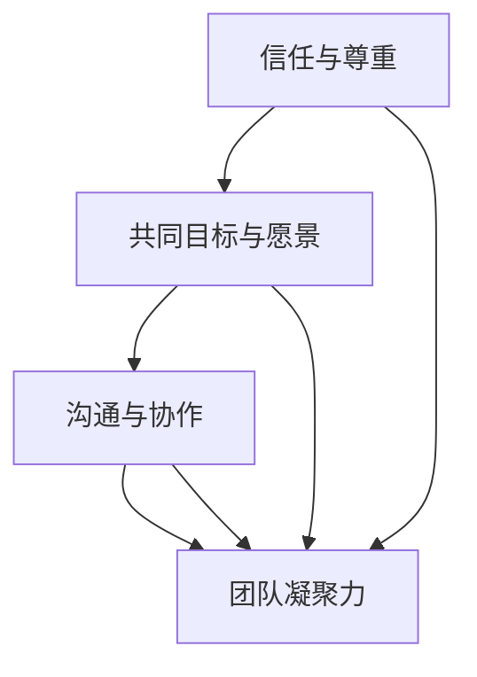

                 

### 文章标题

# 远程团队凝聚力：虚拟环境中的团队建设

### 文章关键词

- 远程工作
- 团队凝聚力
- 虚拟团队建设
- 沟通协作
- 信任与尊重

### 文章摘要

本文旨在探讨远程团队在虚拟环境中的凝聚力建设。随着远程工作的普及，如何保持团队成员的凝聚力和高效协作成为关键问题。本文首先分析了远程工作的现状和挑战，然后介绍了团队凝聚力的核心概念和理论，接着探讨了虚拟环境中团队凝聚力的特殊性以及如何提升。最后，通过实际案例研究和实践指南，为远程团队建设提供了具体策略和方法。

---

### 目录大纲

```markdown
# 《远程团队凝聚力：虚拟环境中的团队建设》

## 第一部分：问题背景与核心概念

### 第1章：远程工作现状与挑战

#### 1.1 远程工作的普及与趋势

- 远程工作的定义与发展历程
- 全球远程工作趋势报告

#### 1.2 远程工作中的挑战

- 时间管理
- 沟通协作
- 团队成员归属感

#### 1.3 背景介绍

- 远程团队凝聚力的重要性
- 本书的目标与结构

## 第二部分：核心概念与原理

### 第2章：团队凝聚力理论

#### 2.1 团队凝聚力概述

- 团队凝聚力的定义
- 团队凝聚力的影响因素

#### 2.2 团队凝聚力理论

- 社会心理学视角
- 组织行为学视角
- 系统动力学视角

#### 2.3 团队凝聚力与远程工作

- 远程工作中团队凝聚力的重要性
- 远程团队凝聚力的特殊性

### 第3章：远程团队凝聚力要素

#### 3.1 信任与尊重

- 信任的建立与维护
- 尊重的表达与传递

#### 3.2 共同目标与愿景

- 远程团队目标的设定
- 共同愿景的构建

#### 3.3 沟通与协作

- 远程沟通的障碍与解决
- 协作工具与平台选择

## 第三部分：虚拟环境中的团队建设策略

### 第4章：虚拟团队建设基础

#### 4.1 虚拟团队的定义与特点

- 虚拟团队的概念
- 虚拟团队与传统团队的区别

#### 4.2 虚eral团队的组织设计

- 虚拟团队的架构与角色分工
- 虚拟团队的工作流程设计

#### 4.3 虚拟团队的心理管理

- 虚拟团队的心理状态
- 虚拟团队的心理支持策略

### 第5章：虚拟团队凝聚力提升策略

#### 5.1 信任建设

- 信任的评估与建立
- 信任危机的应对

#### 5.2 沟通优化

- 远程沟通的技巧
- 多渠道沟通策略

#### 5.3 团队激励

- 激励理论在远程团队中的应用
- 远程团队激励策略与实践

### 第6章：虚拟团队绩效管理

#### 6.1 绩效评估与反馈

- 远程团队绩效评估方法
- 绩效反馈机制

#### 6.2 绩效激励与成长

- 绩效激励的策略
- 远程团队成员职业成长

#### 6.3 绩效监控与改进

- 远程团队绩效监控工具
- 绩效改进的方法与案例

## 第四部分：案例研究与实践

### 第7章：远程团队建设成功案例分析

#### 7.1 案例介绍

- 案例企业背景
- 案例团队介绍

#### 7.2 案例分析与评估

- 案例中的团队建设策略
- 案例的成功因素

#### 7.3 启示与反思

- 对远程团队建设的启示
- 案例中的不足与改进建议

### 第8章：远程团队建设实践指南

#### 8.1 实践步骤与方法

- 远程团队建设的基本步骤
- 团队建设方法的实践与选择

#### 8.2 实践中的注意事项

- 团队建设中的常见问题
- 解决问题的策略与技巧

#### 8.3 实践总结与反思

- 实践经验的总结
- 远程团队建设的未来展望
```

---

接下来的部分，我们将逐步深入探讨远程团队凝聚力的问题背景、核心概念、团队建设策略以及实践指南，以帮助读者更好地理解并掌握远程团队在虚拟环境中的建设方法。

---

### 第一部分：问题背景与核心概念

#### 1.1 远程工作的普及与趋势

远程工作，顾名思义，是指员工不需要到公司或特定的工作场所，而是通过互联网、远程协作工具等手段进行工作的一种工作方式。随着信息技术的飞速发展和全球化的推进，远程工作已经从一种趋势演变为现实，成为现代工作方式的一部分。

**远程工作的定义与发展历程：**

- **定义：** 远程工作通常指的是员工在不同的地理位置进行工作，利用互联网、电子邮件、视频会议、协作工具等手段实现与同事、上级和客户的沟通与协作。
- **发展历程：** 远程工作起源于20世纪末，随着互联网的普及和宽带网络的提速，远程工作逐渐成为一种可行的办公模式。特别是在2008年全球金融危机之后，越来越多的企业开始意识到远程工作所带来的成本节约和效率提升，远程工作在全球范围内迅速普及。

**全球远程工作趋势报告：**

- **远程工作规模：** 根据国际数据公司（IDC）的报告，全球远程工作的人数在过去几年中呈指数级增长。预计到2025年，全球远程工作的人数将占总劳动力的30%以上。
- **技术推动：** 云计算、虚拟化技术、协作工具和人工智能等技术的发展，为远程工作提供了强有力的支持。这些技术的应用不仅提高了远程工作的效率，还增强了团队成员之间的协作和沟通。
- **行业分布：** 远程工作在科技、金融、咨询、医疗等多个行业得到了广泛应用。尤其是在科技行业，远程工作已成为一种标准的工作方式。

#### 1.2 远程工作中的挑战

尽管远程工作带来了诸多优势，但它也带来了一系列挑战，对团队的凝聚力提出了新的要求。

**时间管理：**

- **挑战：** 远程工作环境中，团队成员往往缺乏面对面的监督和约束，容易导致时间管理问题。例如，员工可能会受到家庭事务或个人兴趣的干扰，从而影响工作进度。
- **解决方案：** 通过明确的工作计划和时间表，使用时间管理工具（如Trello、Asana等）来提高工作效率，并设定固定的会议时间来确保团队成员的参与和沟通。

**沟通协作：**

- **挑战：** 远程团队面临沟通障碍，信息传递不及时或误解的情况较为常见。不同的时区和文化背景也可能导致沟通效率降低。
- **解决方案：** 采用多样化的沟通工具（如Slack、Microsoft Teams、Zoom等），并建立明确的沟通规范和反馈机制。定期举行团队会议，确保信息的及时传递和团队成员之间的协作。

**团队成员归属感：**

- **挑战：** 长期远程工作可能导致团队成员之间的疏远和归属感的缺失，影响团队的凝聚力和士气。
- **解决方案：** 通过组织虚拟团队建设活动，如线上团队建设游戏、虚拟茶话会等，增强团队成员之间的联系和互动。同时，领导层应关注团队成员的心理需求，提供必要的心理支持。

#### 1.3 背景介绍

**远程团队凝聚力的重要性：**

远程团队凝聚力是指团队成员在虚拟环境中相互依赖、协作、相互支持的程度。高凝聚力的远程团队能够更好地应对各种挑战，提高工作效率和创造力。以下是一些关键点：

- **团队协作：** 高凝聚力的团队更容易协调合作，共同完成任务。
- **员工满意度：** 凝聚力强的团队成员往往对工作更满意，离职率更低。
- **创新能力：** 凝聚力有助于团队成员之间的知识共享和思维碰撞，激发创新。

**本书的目标与结构：**

本书的目标是探讨远程团队在虚拟环境中的凝聚力建设，帮助读者了解团队凝聚力的重要性、核心概念、理论依据，并提供实用的团队建设策略和实践指南。本书的结构分为四个部分：

1. **问题背景与核心概念：** 分析远程工作的现状和挑战，介绍团队凝聚力的定义和重要性。
2. **核心概念与原理：** 探讨团队凝聚力理论，分析远程团队凝聚力的特殊性。
3. **虚拟环境中的团队建设策略：** 提供提升远程团队凝聚力的策略和方法。
4. **案例研究与实践：** 通过实际案例研究，总结成功经验，提供实践指南。

通过本书的阅读，读者将能够全面了解远程团队凝聚力建设的方法和技巧，为团队的成功运作提供有力的支持。

---

在接下来的章节中，我们将进一步探讨团队凝聚力的核心概念和理论，以及如何应用这些理论来提升远程团队的凝聚力。敬请期待！

---

### 第二部分：核心概念与原理

#### 2.1 团队凝聚力概述

**团队凝聚力是指团队成员在情感、态度和行为上相互依赖、协作和支持的程度，它是团队有效运作的关键因素。**

**定义：** 团队凝聚力通常被定义为团队成员之间相互吸引、相互支持、相互合作的程度。这种凝聚力不仅体现在团队成员之间的情感联系上，还包括他们在工作中的协作态度和行为。

**影响因素：**

1. **共同目标：** 团队成员共享的明确目标有助于增强凝聚力。当团队成员都朝着同一个方向努力时，他们会更愿意相互支持和合作。
2. **信任：** 信任是团队凝聚力的基础。团队成员之间相互信任，能够更轻松地共享信息、分担工作，并共同应对挑战。
3. **沟通：** 有效沟通是增强团队凝聚力的关键。沟通不仅包括信息的传递，还包括情感的交流。团队成员之间良好的沟通能够增进相互理解，减少误解和冲突。
4. **团队领导：** 团队领导在塑造团队文化、建立信任和提供心理支持方面起着重要作用。一个优秀的团队领导能够提升团队的凝聚力。
5. **共同经历：** 团队成员共同经历的挑战和成功经历可以增强他们的联系和归属感。

**团队凝聚力的影响因素对比表格：**

| 影响因素 | 描述 | 对团队凝聚力的影响 |
| --- | --- | --- |
| 共同目标 | 明确的目标有助于团队成员团结一致，共同前进。 | 增强凝聚力，明确方向 |
| 信任 | 成员之间的信任可以减少误解和冲突，促进协作。 | 增强凝聚力，基础支撑 |
| 沟通 | 良好的沟通能够增进理解，促进协作。 | 增强凝聚力，沟通桥梁 |
| 团队领导 | 优秀的领导能够塑造团队文化，提供支持和指导。 | 增强凝聚力，领导核心 |
| 共同经历 | 共同的经历可以增强成员之间的联系和归属感。 | 增强凝聚力，情感纽带 |

**团队凝聚力与远程工作的关系：**

远程工作环境中，团队凝聚力的作用尤为重要。由于团队成员地理位置分散，无法像传统团队那样进行面对面的互动，因此需要通过其他方式来维持和增强团队凝聚力。

- **信任与尊重：** 远程团队需要更加注重信任的建立和维护，因为缺乏面对面的互动容易导致误解和猜疑。
- **沟通协作：** 远程团队需要使用各种沟通工具和平台来保持有效的沟通和协作，确保信息传递的及时性和准确性。
- **共同目标与愿景：** 远程团队需要明确共同的目标和愿景，确保团队成员都朝着同一个方向努力。

**远程团队凝聚力的特殊性：**

1. **地理分散性：** 远程团队成员地理位置分散，缺乏日常的面对面互动，这可能导致沟通不畅和疏远感。
2. **时间差异：** 不同地理位置的团队成员可能处于不同的时区，导致沟通和协作的时间安排变得复杂。
3. **技术依赖性：** 远程团队高度依赖各种技术和工具来保持沟通和协作，技术故障或不适用可能导致沟通障碍和效率降低。
4. **心理需求：** 长期远程工作可能导致团队成员感到孤独、焦虑和压力，需要额外的心理支持。

**远程团队凝聚力的概念模型：**

远程团队凝聚力可以通过以下概念模型来理解：

- **信任与尊重：** 基于相互信任和尊重的团队成员关系。
- **共同目标与愿景：** 明确的共同目标和愿景，确保团队成员共同努力。
- **沟通与协作：** 使用各种沟通工具和平台，保持高效的沟通和协作。
- **团队领导与支持：** 优秀的团队领导提供必要的指导和支持，维护团队文化。
- **心理支持：** 关注团队成员的心理需求，提供必要的心理支持。

**ER实体关系图架构：**

以下是远程团队凝聚力的ER实体关系图，展示了核心概念之间的关系：

```mermaid
erDiagram
  TeamMember ||--|{ Trust }|| TeamMember
  TeamMember ||--|{ Respect }|| TeamMember
  TeamMember ||--|{ Communication }|| Communication
  TeamMember ||--|{ Collaboration }|| Collaboration
  TeamMember ||--|{ Goal }|| Goal
  TeamMember ||--|{ Vision }|| Vision
  TeamMember ||--|{ Leadership }|| Leader
  TeamMember ||--|{ Support }|| Support
  TeamMember ||--|{ Psychological }|| PsychologicalSupport
```

通过以上分析，我们可以看到团队凝聚力在远程工作中的重要性以及其核心概念和理论。在接下来的章节中，我们将进一步探讨远程团队凝聚力的具体要素和如何提升团队凝聚力。

---

在了解了团队凝聚力的核心概念和理论之后，我们将继续深入探讨远程团队凝聚力的具体要素，以帮助读者更好地理解和应用这些概念。敬请期待！

### 2.2 远程团队凝聚力要素

**信任与尊重**

**信任是远程团队凝聚力的基石，它指的是团队成员对彼此诚实、可靠和专业的信赖。** 在远程工作中，由于团队成员无法面对面互动，信任的建立和维护变得更加重要。以下是一些关于信任建立与维护的策略：

- **透明沟通：** 保持沟通的透明度，确保团队成员了解工作的进展和决策过程。这有助于建立信任，减少误解和猜疑。
- **相互支持：** 在团队成员遇到困难或挑战时，提供帮助和支持，展示出团队的互助精神。这种相互支持可以增强成员之间的信任。
- **尊重多样性：** 尊重团队成员的个性和文化差异，避免因文化或背景差异导致的误解和冲突。尊重多样性有助于建立包容和团结的团队氛围。

**共同目标与愿景**

**共同目标和愿景是远程团队凝聚力的动力源泉，它们能够引导团队成员朝着同一个方向努力。** 为了确保远程团队目标的设定和共同愿景的构建，可以采取以下策略：

- **明确目标：** 为每个团队成员设定明确的工作目标，确保每个人都了解自己的职责和期望。这有助于提高团队成员的积极性和责任感。
- **共同讨论：** 通过团队会议或在线讨论，让团队成员共同参与目标的设定和愿景的构建。这种参与感可以增强团队成员对目标的认同感和归属感。
- **定期回顾：** 定期回顾团队目标和进展情况，确保团队成员都朝着同一个方向前进。这有助于及时调整目标和策略，以适应不断变化的环境。

**沟通与协作**

**沟通和协作是远程团队凝聚力的关键因素，有效的沟通和协作能够确保团队成员之间的信息传递和协同工作。** 为了优化远程沟通和协作，可以采取以下策略：

- **多样化沟通工具：** 使用多种沟通工具，如电子邮件、即时通讯软件、视频会议等，以满足不同场景下的沟通需求。
- **明确沟通规范：** 制定明确的沟通规范，包括沟通频率、信息格式和回复时限等。这有助于确保沟通的及时性和有效性。
- **协作平台选择：** 选择适合团队的协作平台，如项目管理工具、代码协作平台、文档共享工具等。这些工具可以提高团队的工作效率和协作质量。

**信任与尊重、共同目标与愿景、沟通与协作：**

以下是这三个要素之间的关系图，展示了它们如何共同作用以提升远程团队的凝聚力：



通过上述策略和关系图，我们可以看到信任与尊重、共同目标与愿景、沟通与协作这三个要素如何共同作用，以提升远程团队的凝聚力。在接下来的章节中，我们将进一步探讨如何通过具体的策略和工具来提升远程团队凝聚力。

---

在了解了远程团队凝聚力的要素后，我们将深入探讨各种团队凝聚力理论，以帮助读者从不同角度理解和提升团队凝聚力。敬请期待！

### 2.3 团队凝聚力理论

**社会心理学视角：**

从社会心理学的角度来看，团队凝聚力是指团队成员在情感上、行为上和态度上相互吸引、相互依赖的程度。社会心理学认为，团队凝聚力主要由以下几个因素构成：

- **社交吸引力：** 成员之间的相似性和吸引力会增强团队凝聚力。例如，相似的价值观、兴趣和背景有助于团队成员之间的互动和合作。
- **互动频率：** 成员之间的互动次数和频率会影响团队凝聚力。频繁的互动有助于建立情感联系，从而增强团队的凝聚力。
- **群体身份：** 成员对团队的认同感和归属感是团队凝聚力的重要组成部分。一个具有清晰群体身份的团队更容易形成凝聚力。

**组织行为学视角：**

从组织行为学的角度来看，团队凝聚力是指团队成员在情感上、行为上和态度上相互依赖、相互支持的程度。组织行为学主要关注以下几个方面：

- **目标一致性：** 当团队成员共同追求一个明确的目标时，他们更容易形成凝聚力。目标一致性有助于团队成员协调行动，共同完成任务。
- **角色明确性：** 明确的角色分工有助于团队成员了解自己的职责和期望，从而减少冲突和误解，提高团队的凝聚力。
- **领导风格：** 领导者的风格对团队凝聚力有重要影响。民主型领导风格鼓励团队成员参与决策，提高团队成员的参与感和归属感，从而增强团队的凝聚力。

**系统动力学视角：**

从系统动力学的角度来看，团队凝聚力是团队成员在互动过程中形成的动态平衡。系统动力学认为，团队凝聚力受到多种因素的综合影响，包括：

- **反馈循环：** 团队成员之间的互动会产生反馈循环，这些反馈循环会加强或削弱团队凝聚力。积极的反馈循环有助于增强团队凝聚力，而消极的反馈循环则可能削弱团队的凝聚力。
- **系统稳定性：** 团队凝聚力是维持团队稳定性的关键因素。当团队面临外部压力或挑战时，高凝聚力的团队能够更好地应对这些挑战，保持团队的稳定性。
- **动态平衡：** 团队凝聚力是一个动态平衡的过程，团队需要不断调整和优化团队关系，以维持团队的稳定和高效。

**团队凝聚力与远程工作：**

远程工作环境中，团队凝聚力的重要性尤为突出。由于团队成员地理位置分散，缺乏面对面的互动，因此需要通过其他方式来维持和增强团队凝聚力。以下是几个关键点：

- **信任与尊重：** 远程团队需要更加注重信任的建立和维护，因为缺乏面对面的互动容易导致误解和猜疑。通过透明沟通、相互支持和尊重多样性，可以增强远程团队的信任和尊重。
- **沟通与协作：** 远程团队需要使用各种沟通工具和平台来保持高效的沟通和协作。通过明确的沟通规范、多样化的沟通工具和协作平台，可以优化远程沟通和协作。
- **共同目标与愿景：** 远程团队需要明确共同的目标和愿景，确保团队成员都朝着同一个方向努力。通过明确的目标设定、共同讨论和定期回顾，可以增强远程团队的目标一致性和愿景共识。

**远程团队凝聚力的特殊性：**

远程团队凝聚力具有以下几个特殊性：

- **地理分散性：** 远程团队成员地理位置分散，缺乏日常的面对面互动，这可能导致沟通不畅和疏远感。
- **时间差异：** 不同地理位置的团队成员可能处于不同的时区，导致沟通和协作的时间安排变得复杂。
- **技术依赖性：** 远程团队高度依赖各种技术和工具来保持沟通和协作，技术故障或不适用可能导致沟通障碍和效率降低。
- **心理需求：** 长期远程工作可能导致团队成员感到孤独、焦虑和压力，需要额外的心理支持。

**总结：**

从不同视角出发，团队凝聚力理论为我们提供了多角度的理解和提升远程团队凝聚力的方法。社会心理学视角强调社交吸引力、互动频率和群体身份的重要性；组织行为学视角关注目标一致性、角色明确性和领导风格的影响；系统动力学视角则关注反馈循环、系统稳定性和动态平衡的作用。结合这些理论，我们可以采取一系列策略和工具，提升远程团队的凝聚力，确保团队在虚拟环境中的高效运作。

---

在了解了团队凝聚力的理论后，我们将深入探讨虚拟环境中的团队建设策略，帮助读者在实际工作中提升远程团队的凝聚力。敬请期待！

### 3.1 信任与尊重

**信任与尊重是远程团队凝聚力的基石，它们在保持团队成员之间的良好关系和促进高效合作中起着至关重要的作用。**

**信任的建立与维护**

**建立信任：**

- **透明沟通：** 通过保持沟通的透明度，团队成员可以更清楚地了解工作的进展和决策过程，从而减少误解和猜疑。定期发布工作进展报告和召开团队会议是提高透明度的有效方式。
- **相互支持：** 在团队成员遇到困难或挑战时，提供帮助和支持，展示出团队的互助精神。通过共同解决问题，团队成员之间的信任感会得到增强。
- **遵循承诺：** 成员之间应遵守承诺，按时完成任务，并保持诚信。遵循承诺有助于建立可靠性和信誉，从而增强团队成员之间的信任。

**维护信任：**

- **及时反馈：** 定期收集团队成员的反馈，确保他们的声音得到倾听和重视。及时解决问题和改进工作流程可以帮助维护团队成员之间的信任。
- **相互尊重：** 尊重团队成员的观点和意见，避免批评和指责。通过积极的沟通和鼓励，可以增强团队成员之间的尊重和信任。

**尊重的表达与传递**

**尊重团队成员：**

- **个性化关怀：** 了解团队成员的个人需求和偏好，并在工作中给予个性化的关怀。例如，了解他们的工作时间安排、家庭情况等，以便更好地支持他们的工作和生活。
- **职业发展支持：** 鼓励团队成员参加培训和学习，支持他们的职业发展。提供职业发展的机会和资源，可以增强他们对团队的忠诚和信任。

**传递尊重：**

- **公开表扬：** 在团队会议上公开表扬团队成员的成就和努力，以增强他们的自尊和自信。这种公开表扬可以传递出对团队成员的尊重和认可。
- **及时回应：** 及时回应团队成员的提问和建议，展示出对他们的重视和关注。这种及时的回应可以增强团队成员之间的信任和尊重。

**案例分析：**

**案例一：** 一家软件公司的远程团队通过定期的视频会议和在线讨论，保持了沟通的透明度。他们还建立了反馈机制，定期收集团队成员的反馈，并根据反馈调整工作流程。这种透明沟通和及时反馈有助于建立和维持团队成员之间的信任。

**案例二：** 另一家公司通过个性化的关怀和支持，增强了团队成员之间的尊重和信任。他们为团队成员提供灵活的工作安排，支持他们在工作和家庭之间找到平衡。此外，公司还鼓励团队成员参加培训和学习，支持他们的职业发展。这些举措增强了团队成员对团队的忠诚和信任。

**总结：**

通过透明沟通、相互支持和个性化关怀，远程团队可以建立和维护信任。尊重团队成员的观点和意见，并通过公开表扬和及时回应，可以传递出对他们的尊重和认可。信任和尊重是远程团队凝聚力的重要基础，它们有助于提高团队成员的合作效率和满意度。

---

在了解了信任与尊重的建立和维护方法后，我们将进一步探讨共同目标与愿景的重要性，以及如何设定和构建远程团队的目标与愿景。敬请期待！

### 3.2 共同目标与愿景

**共同目标和愿景是远程团队凝聚力的核心驱动力，它们能够为团队成员提供明确的方向和动力，确保团队朝着同一目标努力。**

**远程团队目标的设定**

**目标设定的原则：**

- **SMART原则：** 远程团队目标应具备明确性、可衡量性、可实现性、相关性和时限性。通过SMART原则，确保目标的清晰和可执行性。
- **具体性：** 目标应具体、明确，避免模糊和宽泛。例如，“提高项目完成率”比“提高项目效率”更具体。
- **可衡量性：** 目标应具备可衡量的标准，以便团队成员了解进度和成果。例如，“在一个月内完成X个任务”比“提高工作效率”更可衡量。
- **可实现性：** 目标应在团队成员的能力范围内，避免过于理想化。例如，“每天开发一个新功能”可能过于理想，而“每周完成一个小功能”则更现实。
- **相关性：** 目标应与团队整体目标和战略相关联，确保团队成员的努力方向一致。
- **时限性：** 目标应设定明确的时限，以便团队成员了解任务的时间节点。

**目标设定的过程：**

- **团队讨论：** 通过团队会议或在线讨论，让团队成员共同参与目标的设定。这有助于提高团队成员的参与感和归属感，确保目标的合理性和可执行性。
- **上下沟通：** 领导者应与团队成员进行充分沟通，了解他们的意见和建议。这样可以确保目标设定过程中的信息对称，减少误解和冲突。
- **目标分解：** 将大目标分解为小目标，并明确每个目标的负责人和截止日期。这有助于团队成员明确自己的职责和任务，提高工作效率。

**共同愿景的构建**

**愿景的定义：**

- **愿景** 是团队长期追求的理想状态或目标，它是团队愿景和使命的具体体现。一个明确的愿景可以帮助团队成员理解团队的未来方向，激发他们的热情和动力。

**愿景构建的原则：**

- **激励性：** 愿景应具有激励性，能够激发团队成员的积极性和创造力。例如，“成为行业领先的创新企业”比“稳定发展”更具激励性。
- **共识性：** 愿景应在团队成员中达成共识，确保每个人都认同并支持团队的愿景。通过共同讨论和协商，可以构建出具有共识的愿景。
- **长远性：** 愿景应具备长远性，能够指导团队在长期发展中保持稳定和持续进步。例如，“成为全球领先的科技公司”比“短期盈利”更具长远性。
- **可操作性：** 愿景应具备可操作性，能够通过具体的行动和策略来实现。例如，“提供卓越的用户体验”比“提升服务质量”更具操作性。

**愿景构建的过程：**

- **高层领导：** 高层领导应首先提出愿景的初步构想，并在团队内部进行宣传和讨论。这有助于团队成员了解愿景的重要性和方向。
- **团队讨论：** 通过团队会议或在线讨论，让团队成员共同参与愿景的构建。这有助于激发团队成员的创造力和参与感，确保愿景的共识性。
- **愿景文档：** 将构建出的愿景形成文档，明确愿景的具体内容、实现路径和关键指标。这有助于团队成员了解愿景的具体内容和实现方法。

**案例分析：**

**案例一：** 一家科技公司通过定期的团队会议和在线讨论，共同设定了明确的目标和愿景。他们采用SMART原则确保目标的清晰和可执行性，并通过愿景文档明确愿景的具体内容和实现路径。这种做法有助于团队成员理解团队的方向和目标，提高了团队的凝聚力和执行力。

**案例二：** 另一家公司通过高层领导的宣传和团队讨论，共同构建了具有共识的愿景。他们在愿景构建过程中注重激励性和长远性，确保愿景能够激发团队成员的积极性和创造力。此外，公司还制定了具体的行动计划，通过可操作性的策略来实现愿景。这种做法有助于团队成员明确愿景的实现路径，提高了团队的凝聚力和执行力。

**总结：**

共同目标和愿景是远程团队凝聚力的重要驱动力。通过明确的目标设定和愿景构建，远程团队可以确保团队成员朝着同一目标努力，提高团队的凝聚力和执行力。采用SMART原则和共识性原则，可以确保目标和愿景的合理性和可执行性。通过愿景文档和具体的行动计划，团队成员可以更好地理解愿景的具体内容和实现方法，从而提高团队的凝聚力和执行力。

---

在了解了共同目标与愿景的重要性后，我们将探讨远程沟通与协作的具体策略，以帮助远程团队提高沟通效率和工作协作效果。敬请期待！

### 3.3 沟通与协作

**沟通是团队凝聚力的关键，而协作则是实现共同目标的重要手段。在远程工作中，有效的沟通和协作尤为重要，因为它们直接关系到团队的工作效率和成员之间的相互信任。**

**远程沟通的障碍与解决**

**常见的障碍：**

1. **时间差异：** 不同地理位置的团队成员可能处于不同的时区，导致沟通的时间安排变得复杂。这可能会导致信息传递不及时，影响决策和协作效率。
2. **技术依赖：** 远程团队高度依赖各种技术和工具来保持沟通，如果技术出现问题，如网络中断或系统故障，可能会阻碍沟通的顺利进行。
3. **文化差异：** 成员来自不同的文化背景，可能会在沟通方式和表达习惯上存在差异，导致误解和冲突。
4. **心理因素：** 长期远程工作可能导致团队成员感到孤独、焦虑和压力，这些心理因素可能会影响沟通的质量和效率。

**解决策略：**

1. **灵活的时间安排：** 根据团队成员的时区安排会议时间，尽量避开所有人的工作时间高峰。采用视频会议工具（如Zoom、Microsoft Teams）进行多时区沟通，确保信息传递的及时性。
2. **多样化沟通工具：** 使用多种沟通工具，如电子邮件、即时通讯软件（如Slack、WhatsApp）、视频会议等，以满足不同场景下的沟通需求。选择可靠的技术平台，确保沟通的稳定性和安全性。
3. **文化敏感性培训：** 组织文化敏感性培训，提高团队成员对不同文化的理解和尊重。通过培训，团队成员可以更好地理解和适应不同的沟通方式和表达习惯。
4. **心理支持：** 提供心理支持服务，帮助团队成员应对远程工作带来的心理压力和孤独感。通过定期的团队心理辅导和心理健康咨询，提高团队成员的心理健康水平，从而改善沟通质量。

**协作工具与平台选择**

**选择协作工具时，应考虑以下因素：**

1. **功能多样性：** 选择具有多种功能的协作工具，如项目管理、文档共享、代码协作等，以便满足团队的各种协作需求。
2. **用户友好性：** 工具应具备直观的界面和易于使用的功能，以便团队成员快速上手，提高工作效率。
3. **兼容性：** 工具应与现有的工作流程和系统兼容，避免因工具选择不当导致的兼容性问题。
4. **安全性：** 确保工具提供必要的安全措施，如数据加密、访问控制等，以保护团队的数据安全。
5. **成本效益：** 考虑工具的成本和效益，选择性价比高的解决方案。

**推荐的协作工具和平台：**

1. **项目管理工具：** 如Trello、Asana、Jira，用于任务分配、进度跟踪和协作管理。
2. **文档共享和协作工具：** 如Google Docs、Microsoft Teams、Slack，用于文档共享、实时编辑和团队沟通。
3. **视频会议工具：** 如Zoom、Microsoft Teams、Google Meet，用于远程会议和在线协作。
4. **代码协作平台：** 如GitHub、GitLab、Bitbucket，用于代码管理、版本控制和团队协作。

**案例分析：**

**案例一：** 一家全球分布式团队通过Trello进行项目管理，确保任务的分配和进度跟踪。他们还使用Google Docs进行文档共享和协作，提高了团队成员的工作效率和协作质量。

**案例二：** 另一家公司采用Slack作为主要的沟通工具，通过不同的频道进行主题讨论和协作。他们还使用Zoom进行定期团队会议，确保团队成员能够及时沟通和解决问题。

**总结：**

远程沟通和协作是远程团队凝聚力的关键。通过灵活的时间安排、多样化沟通工具、文化敏感性培训和心理支持，可以克服远程沟通的障碍。选择适合团队的协作工具和平台，可以提高团队的工作效率和协作效果。有效的沟通和协作有助于建立团队成员之间的信任和尊重，从而提升远程团队的凝聚力。

---

在探讨了沟通与协作的策略后，我们将深入分析虚拟团队建设的基础，包括虚拟团队的定义与特点、组织设计和心理管理等方面。敬请期待！

### 4.1 虚拟团队的定义与特点

**虚拟团队是指成员地理位置分散，通过信息技术进行沟通和协作的工作团队。与传统的面对面团队相比，虚拟团队具有独特的特点，这些特点既带来了优势，也带来了挑战。**

**虚拟团队的概念**

- **定义：** 虚拟团队是基于网络技术，成员不处于同一地理位置，通过互联网、视频会议、即时通讯工具等进行沟通和协作的工作团队。
- **发展背景：** 随着信息技术的飞速发展，远程工作逐渐成为主流工作方式。虚拟团队作为一种高效的工作组织形式，得到了广泛应用。

**虚拟团队与传统团队的区别**

1. **地理位置：** 传统团队通常在同一地理位置工作，而虚拟团队的成员可能分布在不同的城市、国家甚至时区。
2. **沟通方式：** 传统团队主要通过面对面的交流进行沟通，而虚拟团队则主要依赖于互联网、电话、视频会议等远程沟通工具。
3. **工作方式：** 传统团队的工作时间和节奏相对固定，而虚拟团队的工作时间和节奏更加灵活，成员可以根据自己的时间和需求安排工作。
4. **组织结构：** 传统团队的层次结构较为明显，而虚拟团队可能采用更加扁平化的组织结构，减少了管理层级，提高了决策效率。
5. **文化氛围：** 传统团队的文化氛围通常较为浓厚，而虚拟团队的文化氛围可能较为淡薄，这需要通过其他方式来维护和强化。

**虚拟团队的特点**

1. **灵活性：** 虚拟团队的成员可以自由选择工作地点和时间，这提高了工作效率和员工满意度。
2. **多样性：** 虚拟团队的成员来自不同的文化、背景和专业领域，这为团队带来了多样化的视角和创新的潜力。
3. **成本效益：** 远程工作减少了办公室租赁、交通和差旅等费用，提高了企业的成本效益。
4. **时间差异：** 成员可能处于不同的时区，这需要合理安排沟通和协作时间，以充分利用团队成员的时间。
5. **技术依赖：** 虚拟团队高度依赖信息技术和通信工具，这对技术的稳定性和可靠性提出了较高的要求。

**虚拟团队与传统团队的对比表格：**

| 特点 | 虚拟团队 | 传统团队 |
| --- | --- | --- |
| 地理位置 | 分散 | 集中 |
| 沟通方式 | 远程沟通 | 面对面交流 |
| 工作方式 | 灵活 | 固定 |
| 组织结构 | 扁平化 | 层次化 |
| 文化氛围 | 淡薄 | 浓厚 |
| 灵活性 | 高 | 低 |
| 多样性 | 高 | 低 |
| 成本效益 | 高 | 低 |
| 时间差异 | 存在 | 无 |
| 技术依赖 | 高 | 低 |

**总结：**

虚拟团队在地理位置、沟通方式、工作方式、组织结构和文化氛围等方面与传统团队有显著区别。虚拟团队具有灵活性、多样性、成本效益高等优势，但也面临时间差异、技术依赖等挑战。了解这些特点和区别有助于更好地管理和建设虚拟团队，提高团队的凝聚力和工作效率。

---

在了解了虚拟团队的定义与特点后，我们将深入探讨虚拟团队的组织设计，包括架构与角色分工、工作流程设计等方面。敬请期待！

### 4.2 虚拟团队的组织设计

**虚拟团队的组织设计是确保团队高效运作和目标实现的关键。一个良好的虚拟团队组织设计能够明确团队成员的角色和职责，优化工作流程，提高沟通效率。**

**虚拟团队的架构与角色分工**

1. **团队架构：** 虚拟团队的架构通常采用扁平化设计，以减少管理层级，提高决策效率。虚拟团队可以采用矩阵式架构，将团队成员按照功能领域和项目任务进行分组。

2. **角色分工：** 在虚拟团队中，明确的角色分工有助于提高工作效率和协作质量。常见的角色包括：

   - **项目经理：** 负责整个项目的规划和执行，协调团队成员的工作。
   - **技术专家：** 负责特定技术领域的工作，提供技术支持和解决方案。
   - **产品经理：** 负责产品的规划和设计，确保产品满足用户需求。
   - **测试工程师：** 负责测试产品的功能和质量，确保产品的稳定性。
   - **文档管理员：** 负责维护项目文档，确保信息的完整性和可追溯性。

3. **跨职能团队：** 虚拟团队中的跨职能团队可以更好地整合不同领域的专业知识，提高项目的整体效率。跨职能团队通常由来自不同部门或领域的团队成员组成，共同完成项目任务。

**工作流程设计**

1. **流程优化：** 设计高效的工作流程是虚拟团队成功的关键。工作流程应包括项目启动、任务分配、进度跟踪、问题解决和成果交付等环节。优化工作流程可以提高团队的工作效率，减少不必要的重复工作和等待时间。

2. **任务分配：** 根据团队成员的技能和兴趣，合理分配任务。确保每个成员都明确自己的职责和期望，避免任务重复和资源浪费。

3. **进度跟踪：** 使用项目管理工具（如Trello、Asana、Jira）进行任务进度跟踪，确保项目按计划进行。定期更新任务状态，及时发现和解决潜在问题。

4. **沟通机制：** 建立有效的沟通机制，确保团队成员之间的信息传递畅通。定期召开团队会议，讨论项目进展、解决问题和分享经验。

5. **文档管理：** 建立规范的文档管理流程，确保项目文档的完整性和可追溯性。使用在线文档协作工具（如Google Docs、Microsoft Teams）进行文档共享和实时编辑。

**案例分析：**

**案例一：** 一家科技公司采用了扁平化的虚拟团队架构，将团队成员分为项目经理、技术专家、产品经理、测试工程师和文档管理员等角色。通过Trello进行任务分配和进度跟踪，确保项目高效运作。

**案例二：** 另一家公司在虚拟团队中设立了跨职能团队，由来自软件开发、产品管理和市场营销等不同领域的团队成员组成。通过定期召开团队会议和在线讨论，跨职能团队能够更好地整合资源，提高项目效率。

**总结：**

虚拟团队的组织设计应注重扁平化架构、明确角色分工和优化工作流程。通过合理分配任务、进度跟踪、有效沟通和文档管理，可以提高虚拟团队的工作效率和工作质量。良好的组织设计有助于提升团队的凝聚力和协作能力，确保项目目标的实现。

---

在了解了虚拟团队的组织设计后，我们将深入探讨虚拟团队的心理管理，包括心理状态和心理支持策略，帮助团队成员更好地适应远程工作环境。敬请期待！

### 4.3 虚拟团队的心理管理

**虚拟团队的心理管理是确保团队成员在远程工作环境中保持高效、积极和心理健康的必要措施。由于缺乏面对面的交流和日常互动，远程团队成员可能会面临各种心理挑战。**

**虚拟团队的心理状态**

1. **孤独感：** 远程工作使团队成员远离同事和社交活动，可能导致孤独感的增加。孤独感会影响团队成员的情绪和工作效率。

2. **焦虑感：** 长期远程工作可能导致焦虑感的增加。焦虑感可能源于工作压力、时间管理问题以及与团队成员沟通不畅。

3. **责任感：** 远程工作使团队成员对自己的工作承担更多的责任。这种责任感可能会增加他们的工作压力和焦虑感。

4. **满足感：** 远程工作带来的灵活性和自主性可能会提高团队成员的满足感。然而，如果团队成员感到与团队的联系减弱，他们的满足感可能会降低。

**心理支持策略**

1. **定期的团队沟通：** 通过定期的团队会议和线上聚会，保持团队成员之间的联系和沟通。这有助于缓解孤独感和焦虑感，增强团队凝聚力。

2. **心理辅导服务：** 提供在线心理辅导服务，帮助团队成员处理焦虑、压力和孤独等心理问题。心理辅导可以采用一对一咨询或团队辅导的形式。

3. **心理健康培训：** 组织心理健康培训，提高团队成员的心理健康意识和应对策略。培训内容可以包括时间管理、情绪调节、压力管理等方面。

4. **团队文化建设：** 建立积极的团队文化，鼓励团队成员之间的支持和互助。通过团队建设活动和虚拟社交活动，增强团队成员的归属感和满足感。

5. **灵活的工作安排：** 提供灵活的工作安排，允许团队成员根据自己的需求调整工作时间。这种灵活性可以帮助团队成员更好地平衡工作和生活，减少工作压力。

**案例分析：**

**案例一：** 一家全球分布式公司通过每周的虚拟团队聚会，保持团队成员之间的联系。他们还提供了在线心理辅导服务，帮助团队成员处理心理问题。

**案例二：** 另一家公司定期组织心理健康培训，提高团队成员的心理健康意识和应对策略。此外，公司还鼓励团队成员参加体育活动和在线社交活动，以增强他们的心理幸福感。

**总结：**

虚拟团队的心理管理对于确保团队成员的心理健康和团队凝聚力至关重要。通过定期的团队沟通、心理辅导服务、心理健康培训、团队文化建设以及灵活的工作安排，可以帮助远程团队成员更好地适应远程工作环境，提高工作效率和满意度。有效的心理支持策略有助于减少心理问题，增强团队的凝聚力和战斗力。

---

在了解了虚拟团队的心理管理策略后，我们将探讨如何通过信任建设、沟通优化和团队激励等策略提升虚拟团队的凝聚力。敬请期待！

### 5.1 信任建设

**信任是虚拟团队凝聚力的核心，它不仅影响团队成员之间的协作效率，还关系到团队的长远发展。在虚拟环境中，建立和维护信任尤为重要，因为它有助于减少误解和冲突，增强团队的协同效应。**

**信任的评估与建立**

**评估信任水平：**

1. **问卷调查：** 通过问卷调查了解团队成员之间的信任程度。问卷调查可以包括对信任行为的评价、对团队沟通的满意度等方面的问题。
2. **反馈机制：** 建立反馈机制，鼓励团队成员提出意见和建议。通过反馈，可以了解团队中存在的信任问题，并及时采取措施解决。
3. **绩效评估：** 将信任作为绩效评估的一项指标，通过观察团队成员在项目中的协作表现，评估他们的信任水平。

**建立信任的方法：**

1. **透明沟通：** 保持沟通的透明度，及时分享工作进展和决策过程。透明的沟通有助于减少误解和猜疑，增强团队成员之间的信任。
2. **共同目标：** 明确团队的共同目标，确保团队成员都朝着同一个方向努力。共同的目标有助于建立团队凝聚力，提高团队成员之间的信任。
3. **相互支持：** 在团队成员遇到困难时，提供帮助和支持。通过共同解决问题，团队成员之间的信任感会得到增强。
4. **遵守承诺：** 遵守承诺是建立信任的基础。团队成员应按时完成任务，并保持诚信。遵守承诺有助于建立可靠性和信誉，从而增强团队成员之间的信任。
5. **定期反馈：** 定期收集团队成员的反馈，并针对反馈进行改进。这有助于增强团队成员之间的沟通和理解，提高信任水平。

**信任危机的应对**

1. **沟通调解：** 在信任危机发生时，及时进行沟通调解，了解问题的根源和团队成员的担忧。通过有效的沟通，可以消除误解和猜疑，恢复信任。
2. **透明处理：** 对信任危机进行透明处理，确保所有团队成员都了解问题的进展和解决措施。透明的处理方式有助于恢复团队成员之间的信任。
3. **心理辅导：** 在信任危机中，提供心理辅导服务，帮助团队成员处理情绪和心理压力。心理辅导可以采用一对一咨询或团队辅导的形式，帮助团队成员恢复信任。
4. **改进管理：** 分析信任危机的原因，并采取相应的管理措施进行改进。例如，改进沟通机制、优化工作流程、加强团队建设等，以防止类似问题的再次发生。

**案例分析：**

**案例一：** 一家远程团队通过定期的反馈会议，及时发现并解决信任问题。他们还建立了透明的沟通机制，确保团队成员都能了解工作进展和决策过程。

**案例二：** 另一家公司通过团队建设活动和心理辅导服务，帮助团队成员建立信任。他们在项目初期就明确了共同目标，并通过相互支持和透明沟通，建立了坚实的信任基础。

**总结：**

信任建设是虚拟团队管理中的重要环节。通过透明沟通、共同目标、相互支持和定期反馈，可以建立和维护团队成员之间的信任。在信任危机发生时，及时进行沟通调解、透明处理和心理辅导，有助于恢复信任。有效的信任建设策略有助于提高虚拟团队的凝聚力和工作效率。

---

在探讨了信任建设策略后，我们将深入分析沟通优化的具体方法，包括远程沟通的技巧和多渠道沟通策略，以提升虚拟团队的沟通效率。敬请期待！

### 5.2 沟通优化

**远程团队的成功离不开有效的沟通。优化沟通不仅能提高工作效率，还能增强团队成员之间的信任和凝聚力。**

**远程沟通的技巧**

1. **明确沟通目标：** 在每次沟通前，明确沟通的目标和预期成果。这有助于团队成员集中精力，提高沟通效率。

2. **主动沟通：** 远程工作中，团队成员应主动发起沟通，保持信息的畅通。通过定期更新进度和分享工作成果，可以增强团队成员之间的互动。

3. **倾听与反馈：** 倾听是沟通的重要组成部分。在交流过程中，团队成员应认真倾听对方的观点，并及时给予反馈。这有助于确保信息传递的准确性，减少误解。

4. **使用非语言沟通工具：** 非语言沟通（如表情、肢体语言）在远程沟通中同样重要。使用视频会议工具，可以通过面部表情和身体语言传达更多的信息。

5. **清晰表达：** 远程沟通中，语言表达应简洁明了，避免使用模糊或歧义的语言。这有助于提高信息传递的清晰度，减少沟通成本。

**多渠道沟通策略**

1. **多样化沟通工具：** 根据不同的沟通需求，选择合适的沟通工具。例如，使用电子邮件进行正式沟通，使用即时通讯工具（如Slack、WhatsApp）进行日常交流，使用视频会议工具（如Zoom、Microsoft Teams）进行重要讨论。

2. **明确沟通渠道：** 制定明确的沟通渠道和规范，确保团队成员知道何时使用哪种沟通工具。这有助于避免沟通混乱和重复。

3. **优先级沟通：** 根据沟通内容的紧急程度和重要性，设置沟通优先级。紧急且重要的沟通应优先处理，确保关键信息得到及时传递。

4. **定期沟通会议：** 设立定期沟通会议，讨论团队进展、解决问题和分享经验。这有助于团队成员保持同步，提高整体工作效率。

5. **跨部门沟通：** 远程团队往往涉及多个部门和角色。通过跨部门沟通，可以确保不同部门之间的信息传递和协作顺畅。

**案例分析：**

**案例一：** 一家远程团队采用多样化沟通工具，结合使用电子邮件、Slack和Zoom。他们制定了明确的沟通规范，确保团队成员在不同场景下都能选择合适的沟通工具。

**案例二：** 另一家公司设立了每周一次的团队会议，讨论项目进展和解决难题。他们还建立了跨部门沟通渠道，确保各部门之间的协作高效顺畅。

**总结：**

优化远程团队的沟通，需要明确沟通目标、主动沟通、倾听与反馈、清晰表达以及多样化沟通工具。通过制定明确的沟通渠道和优先级，定期沟通会议和跨部门沟通，可以进一步提高沟通效率，增强团队凝聚力。有效的沟通策略是远程团队成功的关键。

---

在探讨了沟通优化的策略后，我们将深入分析团队激励的方法，包括激励理论在远程团队中的应用和具体激励策略。敬请期待！

### 5.3 团队激励

**团队激励是提升远程团队凝聚力和工作效率的关键因素。在远程工作中，团队成员可能面临更多的挑战，如孤独感、时间管理问题和远程监督的困难。有效的团队激励机制可以帮助激发团队成员的积极性、创造力和归属感。**

**激励理论在远程团队中的应用**

**1. 马斯洛需求层次理论：**

- **生理需求：** 提供稳定的工作环境和必要的工作资源，确保团队成员的基本生理需求得到满足。
- **安全需求：** 建立稳定的工作关系和信任，确保团队成员的工作安全。
- **社交需求：** 通过定期的团队活动和在线社交，满足团队成员的社交需求，增强团队凝聚力。
- **尊重需求：** 通过认可团队成员的贡献和提供职业发展的机会，满足他们的尊重需求。
- **自我实现需求：** 为团队成员提供自主权和创新空间，帮助他们实现个人职业目标。

**2. 管理方格理论：**

- **任务导向型管理：** 鼓励团队成员专注于工作任务，提高工作效率。
- **关系导向型管理：** 强调团队建设，关注团队成员的情感需求，建立良好的团队氛围。
- **任务-关系平衡型管理：** 结合任务导向和关系导向的管理方法，确保团队成员的工作效率和团队凝聚力。

**具体激励策略**

**1. 目标设定：**

- **个人目标：** 为每个团队成员设定明确、可实现的个人目标，鼓励他们努力工作，提升自我。
- **团队目标：** 设定团队共同目标，激发团队成员的团队意识和合作精神。

**2. 薪酬激励：**

- **绩效奖金：** 根据团队成员的工作表现和项目成果，提供绩效奖金，激励他们追求卓越。
- **福利激励：** 提供灵活的工作时间和地点，以及健康保险、带薪休假等福利，满足团队成员的生理和安全需求。

**3. 职业发展：**

- **培训机会：** 提供在线培训和职业发展机会，帮助团队成员提升技能和职业素养。
- **晋升通道：** 为团队成员提供清晰的职业晋升路径，鼓励他们追求更高的职业目标。

**4. 荣誉与认可：**

- **公开表扬：** 定期在团队会议上公开表扬团队成员的成就和努力，提高他们的自尊和自豪感。
- **荣誉称号：** 设立荣誉称号，对在团队中表现突出的成员给予表彰。

**5. 工作环境：**

- **自主权：** 给予团队成员更多的自主权，让他们参与决策和项目规划，增强工作满意度。
- **创新支持：** 鼓励团队成员提出创新想法，并提供资源和支持，帮助他们实现创新。

**案例分析：**

**案例一：** 一家远程科技公司通过定期的团队培训和职业发展机会，提升了团队成员的技能和职业素养。他们还设立了绩效奖金制度，根据团队成员的工作表现发放奖金，激励他们追求卓越。

**案例二：** 另一家公司注重团队建设，定期组织线上团队建设活动和虚拟茶话会，增强团队成员之间的互动和信任。他们还提供了灵活的工作时间和地点，满足团队成员的社交需求。

**总结：**

团队激励是远程团队管理的重要环节。通过应用马斯洛需求层次理论和管理方格理论，结合目标设定、薪酬激励、职业发展、荣誉认可和工作环境等方面的策略，可以激发远程团队成员的积极性、创造力和归属感。有效的团队激励机制有助于提高团队凝聚力和工作效率，确保远程团队的长期发展。

---

在探讨了团队激励的方法后，我们将深入分析虚拟团队绩效管理的关键要素，包括绩效评估与反馈、绩效激励与成长以及绩效监控与改进。敬请期待！

### 6.1 绩效评估与反馈

**在远程团队中，绩效评估与反馈是确保团队成员工作质量和工作效率的关键环节。有效的绩效评估能够激励团队成员，提高他们的工作积极性，同时也为团队的管理和优化提供重要依据。**

**绩效评估方法**

1. **KPI（关键绩效指标）：** KPI是衡量团队成员工作绩效的重要工具。根据团队的目标和任务，设定具体、可量化的KPI指标，如项目完成率、代码质量、客户满意度等。通过KPI的实时跟踪和评估，可以及时了解团队成员的工作进展和成效。

2. **360度评估：** 360度评估是一种全面评估方法，通过收集团队成员、上级、同事和客户的反馈，对成员的工作表现进行全面评估。这种方法有助于多角度了解团队成员的工作状况，发现问题并提供改进建议。

3. **自我评估：** 自我评估鼓励团队成员对自己的工作进行反思和总结，提高他们的自我认知和自我管理能力。团队成员可以通过自我评估识别自身的优点和不足，制定改进计划。

**绩效反馈机制**

1. **定期反馈：** 定期进行绩效反馈，确保团队成员能够及时了解自己的工作表现。绩效反馈可以是定期的绩效评估会议，也可以是每周、每月的工作总结和反馈。

2. **即时反馈：** 对于重要任务或紧急问题，提供即时反馈。即时反馈有助于团队成员快速纠正错误，调整工作策略。

3. **个性化反馈：** 根据每个团队成员的特点和工作表现，提供个性化的反馈。个性化反馈能够更具体地指出团队成员的优点和改进方向。

**案例分析：**

**案例一：** 一家远程软件公司通过定期的KPI评估和360度评估，对团队成员的工作绩效进行综合评估。他们还建立了即时反馈机制，通过邮件和即时通讯工具及时反馈团队成员的工作进展和问题。

**案例二：** 另一家公司在每周的工作总结会上进行绩效反馈，鼓励团队成员分享自己的工作心得和遇到的问题。通过这种开放式的反馈机制，团队成员能够互相学习，共同进步。

**总结：**

有效的绩效评估与反馈机制是远程团队管理的重要组成部分。通过KPI、360度评估和自我评估等多种方法，可以全面了解团队成员的工作表现。定期的绩效反馈和即时反馈能够帮助团队成员及时调整工作策略，提高工作效率。个性化反馈能够更有针对性地指导团队成员，促进他们的成长和发展。

---

在了解了绩效评估与反馈机制后，我们将探讨如何通过绩效激励和成长策略，进一步激发远程团队成员的工作动力和职业发展。敬请期待！

### 6.2 绩效激励与成长

**绩效激励与成长策略是远程团队管理中的重要环节，它不仅能够提高团队成员的工作动力和效率，还能促进团队成员的职业发展，确保团队的整体竞争力。**

**绩效激励策略**

1. **奖金制度：** 奖金是常见的激励手段，可以根据团队成员的工作表现和项目的成果发放绩效奖金。这种物质激励能够直接提高团队成员的积极性和工作动力。

2. **股权激励：** 对于核心成员和关键岗位的员工，可以提供股权激励，让他们分享公司的长期发展收益。股权激励有助于增强团队成员的归属感和责任感。

3. **职业晋升：** 为团队成员提供清晰的职业晋升路径，鼓励他们通过不断学习和提升技能，实现职业发展。职业晋升不仅能够激励团队成员，还能吸引和留住优秀人才。

4. **表彰奖励：** 定期对在项目中表现突出的团队成员进行表彰，公开表扬他们的贡献。这种荣誉激励能够增强团队成员的自尊和自豪感，提高他们的工作热情。

**职业成长策略**

1. **培训与发展：** 为团队成员提供多样化的培训机会，包括在线课程、内部培训和外部研讨会等。通过培训，团队成员能够不断学习新知识、掌握新技能，提升自己的职业素养。

2. **项目参与：** 为团队成员提供参与不同项目的机会，让他们在多样化的工作环境中锻炼自己，积累丰富的经验。

3. **导师制度：** 实施导师制度，让有经验的团队成员指导新成员，帮助他们快速融入团队，提升工作能力。同时，导师也能通过指导过程，提升自己的领导力和沟通能力。

4. **反馈与建议：** 建立反馈与建议机制，鼓励团队成员提出改进建议和意见。通过收集和采纳团队成员的建议，能够不断优化团队的工作流程和协作方式。

**案例分析：**

**案例一：** 一家远程科技公司通过设立绩效奖金制度，激励团队成员在工作中追求卓越。同时，他们还提供了股权激励，让核心成员分享公司的长期发展收益。

**案例二：** 另一家公司重视团队成员的职业成长，为他们提供了丰富的培训机会。他们还实施导师制度，让新成员能够快速融入团队，提升工作能力。

**总结：**

绩效激励与成长策略是远程团队管理中不可或缺的部分。通过奖金制度、股权激励、职业晋升和表彰奖励等激励手段，可以激发团队成员的工作动力。同时，通过培训与发展、项目参与、导师制度和反馈与建议等职业成长策略，可以促进团队成员的职业发展。有效的绩效激励与成长策略有助于提高团队的整体绩效和竞争力。

---

在探讨了绩效激励与成长策略后，我们将深入分析绩效监控与改进的方法，以帮助远程团队持续提升绩效。敬请期待！

### 6.3 绩效监控与改进

**绩效监控与改进是远程团队管理中确保团队持续进步和高效运作的关键环节。通过有效的绩效监控，可以及时发现和解决问题，优化工作流程，提升团队的整体绩效。**

**绩效监控工具**

1. **项目管理工具：** 如Trello、Asana、Jira等，这些工具可以帮助团队跟踪任务进度、分配工作、管理项目，确保项目按计划进行。

2. **时间跟踪工具：** 如Toggl、Harvest等，这些工具可以记录团队成员的工作时间，帮助团队了解每个人的工作投入和效率。

3. **绩效分析工具：** 如Tableau、Google Analytics等，这些工具可以对团队的工作数据进行分析，提供直观的图表和报告，帮助团队识别问题和优化流程。

**绩效监控的方法**

1. **实时监控：** 通过实时监控工具，团队可以随时了解任务的状态和成员的工作进度。这有助于及时发现延误或进度偏差，并迅速采取纠正措施。

2. **定期回顾：** 定期召开绩效回顾会议，总结上一阶段的工作成果和存在的问题。通过回顾，团队可以识别改进的机会，制定针对性的改进计划。

3. **数据分析：** 定期对绩效数据进行分析，识别团队和成员的绩效趋势和问题。通过数据分析，团队可以找出影响绩效的关键因素，并采取相应的改进措施。

**绩效改进的方法**

1. **流程优化：** 通过对工作流程的优化，消除不必要的工作环节，简化流程，提高工作效率。例如，通过自动化工具减少重复性工作，减少错误和提高准确率。

2. **技能培训：** 针对团队成员的技能短板，提供相应的培训和学习机会，提升他们的专业能力和工作效率。

3. **激励机制：** 通过绩效激励措施，如奖金、晋升机会和表彰奖励等，激励团队成员不断提升自己的绩效。

4. **问题解决：** 针对团队在工作中遇到的具体问题，采取有效的解决策略。例如，通过团队协作解决问题，或引入外部专家进行咨询和指导。

**案例分析：**

**案例一：** 一家远程软件公司通过使用Trello和Jira进行任务管理和进度跟踪，实时监控项目进展。他们定期召开绩效回顾会议，分析绩效数据，并采取改进措施。

**案例二：** 另一家公司引入了时间跟踪工具Harvest，记录团队成员的工作时间。通过数据分析，他们发现了一些影响效率的瓶颈，并采取了优化流程的措施，提高了整体工作效率。

**总结：**

绩效监控与改进是远程团队管理中不可或缺的一部分。通过使用项目管理工具、时间跟踪工具和绩效分析工具，可以实时监控团队的工作进展和绩效表现。定期回顾和分析绩效数据，有助于识别问题和优化流程。通过流程优化、技能培训、激励机制和问题解决等改进方法，可以持续提升团队的整体绩效和效率。有效的绩效监控与改进策略有助于确保远程团队的长期发展和成功。

---

在分析了远程团队绩效管理的各个方面后，我们将通过具体案例研究，探讨远程团队建设的成功经验与不足，并提供改进建议。敬请期待！

### 7.1 案例介绍

**为了更好地理解远程团队建设的方法和效果，我们选择了两个具有代表性的远程团队建设案例进行详细分析。这两个案例分别来自一家全球分布式软件公司和一家跨国金融服务公司。**

**案例一：全球分布式软件公司**

**企业背景：** 这家公司是一家提供云计算解决方案的全球分布式软件公司，团队成员分布在不同的国家和地区。公司采用远程工作模式，以降低运营成本并提高工作效率。

**团队介绍：** 该团队由50名成员组成，包括项目经理、开发人员、测试工程师和产品经理。团队成员分布在北美、欧洲和亚洲等地区，工作语言主要为英语。

**案例二：跨国金融服务公司**

**企业背景：** 这是一家全球领先的金融服务公司，为了响应市场需求和业务扩张，该公司在全球范围内建立了多个远程团队，以提供24/7的客户服务。

**团队介绍：** 该团队由30名成员组成，包括客户服务代表、分析师、IT支持和财务人员。团队成员分布在北美、欧洲和南美等地区，工作语言包括英语、西班牙语和法语。

### 7.2 案例分析与评估

**案例一：全球分布式软件公司**

**团队建设策略：**

1. **明确目标和愿景：** 公司为每个团队设定了明确的短期和长期目标，并确保团队成员都理解这些目标。此外，公司还制定了共同愿景，激励团队成员为实现公司目标而努力。

2. **灵活的工作安排：** 公司允许团队成员根据个人需求灵活安排工作时间，这有助于提高团队成员的工作满意度和工作效率。

3. **多样化沟通工具：** 公司采用了多种沟通工具，如Slack、Zoom和Trello，确保团队成员之间的沟通畅通无阻。公司还设立了定期团队会议，讨论项目进展和解决问题。

4. **绩效激励与成长：** 公司通过绩效奖金、股权激励和职业晋升机会激励团队成员。同时，公司提供了在线培训和内部知识分享平台，促进团队成员的职业成长。

**成功因素：**

1. **共同目标与愿景：** 明确的目标和愿景有助于团队成员团结一致，共同前进。

2. **灵活的工作安排：** 灵活的工作安排提高了团队成员的工作满意度和工作效率。

3. **多样化的沟通工具：** 多样化的沟通工具确保了团队成员之间的有效沟通和协作。

4. **绩效激励与成长：** 有效的绩效激励和成长策略激发了团队成员的工作热情和积极性。

**不足与改进建议：**

1. **文化融合：** 由于团队成员来自不同国家，公司需要进一步加强文化融合，减少文化冲突，提高团队凝聚力。

2. **心理支持：** 公司可以提供更多的心理支持服务，帮助远程团队成员应对工作压力和孤独感。

**案例二：跨国金融服务公司**

**团队建设策略：**

1. **多时区协调：** 公司建立了多时区协调机制，通过合理的任务分配和时间安排，确保团队成员在不同时区的工作效率和协作效果。

2. **技术支持与培训：** 公司为团队成员提供了必要的技术支持和培训，帮助他们熟练掌握远程工作的工具和技能。

3. **员工关怀：** 公司重视员工关怀，提供了灵活的工作时间和健康福利，帮助团队成员平衡工作和生活。

4. **绩效监控与反馈：** 公司采用了实时绩效监控工具，定期评估团队成员的工作表现，并提供及时的反馈和改进建议。

**成功因素：**

1. **多时区协调：** 有效的多时区协调机制提高了团队的协作效率。

2. **技术支持与培训：** 技术支持和培训有助于团队成员快速适应远程工作模式。

3. **员工关怀：** 关怀员工的健康和工作生活，提高了员工的满意度和忠诚度。

4. **绩效监控与反馈：** 实时的绩效监控和反馈机制有助于团队成员持续提升工作表现。

**不足与改进建议：**

1. **沟通障碍：** 由于团队成员的语言和文化差异，公司需要进一步优化沟通渠道和沟通方式，减少误解和冲突。

2. **创新激励：** 公司可以加大对创新项目的激励力度，鼓励团队成员提出创新想法，提高团队的创新能力。

### 7.3 启示与反思

**通过上述两个案例的分析，我们可以得到以下启示和反思：**

1. **明确目标和愿景：** 远程团队需要明确共同的目标和愿景，确保团队成员都朝着同一个方向努力。

2. **灵活的工作安排：** 远程团队应提供灵活的工作安排，以适应团队成员的个人需求和提高工作效率。

3. **多样化的沟通工具：** 使用多样化的沟通工具，确保团队成员之间的有效沟通和协作。

4. **绩效激励与成长：** 有效的绩效激励和成长策略能够激发团队成员的工作热情和积极性。

5. **文化融合：** 加强文化融合，减少文化冲突，提高团队凝聚力。

6. **心理支持：** 提供心理支持服务，帮助远程团队成员应对工作压力和孤独感。

7. **沟通优化：** 优化沟通渠道和方式，减少误解和冲突。

8. **创新激励：** 加大对创新项目的激励力度，提高团队的创新能力。

通过不断总结和反思，远程团队可以不断完善团队建设策略，提高团队凝聚力和工作效率，确保在虚拟环境中持续成功。

---

在总结了成功案例的经验和不足后，我们将提供一系列远程团队建设实践指南，帮助读者在实际操作中构建高效、有凝聚力的远程团队。敬请期待！

### 8.1 实践步骤与方法

**远程团队建设是一个系统工程，需要明确的基本步骤和科学的方法来确保团队的高效运作和长期发展。以下是一些具体的实践步骤和方法：**

**步骤一：明确团队目标和愿景**

1. **共同讨论：** 通过团队会议或在线讨论，让所有团队成员共同参与目标和愿景的设定。确保每个成员都了解并认同团队的目标和愿景。

2. **SMART原则：** 使用SMART（具体、可衡量、可实现、相关、时限性）原则，确保目标和愿景具有明确性和可执行性。

3. **文档化：** 将设定的目标和愿景形成文档，并定期回顾和调整。这有助于团队成员保持对目标和愿景的持续关注。

**步骤二：构建合理的组织架构**

1. **扁平化结构：** 采取扁平化的组织结构，减少管理层级，提高决策效率。

2. **角色分工：** 根据团队成员的技能和经验，明确每个成员的角色和职责。确保每个成员都有明确的任务和目标。

3. **跨职能团队：** 建立跨职能团队，整合不同领域的专业知识和资源，提高项目的整体效率。

**步骤三：优化沟通和协作工具**

1. **多样化工具选择：** 根据团队的具体需求，选择合适的沟通和协作工具，如Slack、Trello、Zoom等。

2. **工具培训：** 为团队成员提供工具使用培训，确保他们能够熟练掌握和高效使用这些工具。

3. **沟通规范：** 制定明确的沟通规范，包括沟通频率、信息格式和回复时限等，确保沟通的及时性和有效性。

**步骤四：建立信任和文化**

1. **透明沟通：** 保持沟通的透明度，及时分享工作进展和决策过程，减少误解和猜疑。

2. **文化认同：** 建立团队文化，鼓励团队成员之间的相互尊重和支持，提高团队的凝聚力。

3. **定期活动：** 组织定期的团队建设活动，如线上团队建设游戏、虚拟茶话会等，增强团队成员之间的联系。

**步骤五：实施绩效管理和激励**

1. **绩效评估：** 定期对团队成员的工作表现进行评估，使用KPI、360度评估等方法，确保评估的全面性和客观性。

2. **激励机制：** 根据团队成员的绩效表现，提供奖金、晋升机会和荣誉称号等激励措施，激发团队成员的工作积极性。

3. **职业发展：** 为团队成员提供职业发展的机会和资源，帮助他们实现个人职业目标，提高他们的工作满意度和忠诚度。

**方法一：项目化管理**

1. **项目启动：** 在项目启动阶段，明确项目的目标、范围和资源需求。

2. **任务分配：** 根据团队成员的技能和兴趣，合理分配任务，确保每个任务都有明确的责任人。

3. **进度跟踪：** 使用项目管理工具（如Trello、Jira）进行任务进度跟踪，确保项目按计划进行。

4. **问题解决：** 定期召开项目会议，讨论项目进展和解决问题，确保项目顺利推进。

**方法二：敏捷开发**

1. **迭代开发：** 采用敏捷开发方法，将项目分为多个迭代周期，每个迭代周期完成一部分功能。

2. **每日站立会议：** 每天举行短暂的站立会议，让团队成员分享自己的进展、问题和计划。

3. **回顾与改进：** 在每个迭代结束后，进行回顾会议，总结经验教训，并制定改进计划。

**总结：**

远程团队建设需要明确的目标和愿景、合理的组织架构、优化的沟通工具、信任和文化的建立以及有效的绩效管理和激励机制。通过项目化和敏捷开发等方法，可以进一步优化团队的工作流程和协作效果。有效的远程团队建设策略能够提高团队的凝聚力和工作效率，确保团队在虚拟环境中持续成功。

---

在了解了远程团队建设的基本步骤和方法后，我们将进一步探讨实践中的注意事项，帮助读者在团队建设过程中避免常见问题，并提供解决策略。敬请期待！

### 8.2 实践中的注意事项

**在远程团队建设过程中，除了遵循科学的方法和步骤外，还需要特别注意以下几个方面，以确保团队能够顺利运作和持续发展。**

**常见问题与解决策略**

**1. 沟通障碍：**

**问题：** 远程团队由于地理位置分散和时区差异，容易出现沟通障碍，导致信息传递不及时和误解。

**解决策略：**

- **多渠道沟通：** 使用多种沟通工具（如邮件、即时通讯、视频会议）来确保信息的及时传递和准确理解。
- **沟通规范：** 制定明确的沟通规范，包括沟通频率、回复时限和沟通格式，确保团队成员按照统一的标准进行沟通。
- **时区协调：** 根据团队成员的时区安排会议和任务，合理分配工作，减少时区差异带来的沟通问题。

**2. 团队成员归属感缺失：**

**问题：** 长期远程工作可能导致团队成员感到孤独和疏远，归属感降低，影响团队的凝聚力和士气。

**解决策略：**

- **团队建设活动：** 定期组织线上团队建设活动，如虚拟团队游戏、线上茶话会等，增强团队成员之间的联系和互动。
- **领导关心：** 领导应主动关心团队成员的心理状态和工作生活，提供必要的支持和鼓励。
- **共享成就：** 在团队取得成就时，及时进行表彰和庆祝，增强团队成员的归属感和荣誉感。

**3. 工作效率低下：**

**问题：** 远程团队由于缺乏面对面的监督和激励，可能导致工作效率低下。

**解决策略：**

- **明确目标和职责：** 为每个团队成员设定明确的工作目标和职责，确保他们了解自己的工作内容和期望。
- **绩效管理：** 建立有效的绩效管理体系，定期评估团队成员的工作表现，提供反馈和改进建议。
- **激励机制：** 制定合理的激励机制，如奖金、晋升机会和荣誉称号等，激发团队成员的工作动力。

**4. 技术依赖问题：**

**问题：** 远程团队高度依赖各种技术和工具，技术故障或不适用可能导致沟通和协作受阻。

**解决策略：**

- **技术培训：** 定期为团队成员提供技术培训，确保他们熟练掌握所使用的工具和平台。
- **备用方案：** 针对可能的技术故障，制定备用方案，如备用通讯工具、备份数据存储等，确保团队在技术故障时能够迅速切换。
- **技术支持：** 设立技术支持团队，提供及时的技术支持和问题解决，减少技术故障对团队工作的影响。

**5. 文化融合挑战：**

**问题：** 远程团队成员来自不同文化背景，可能存在文化差异和冲突。

**解决策略：**

- **文化培训：** 组织文化培训，提高团队成员对不同文化的理解和尊重。
- **文化活动：** 通过组织文化活动和交流，促进团队成员之间的文化融合。
- **包容性管理：** 领导应采取包容性的管理策略，尊重团队成员的文化差异，避免因文化差异导致的冲突和误解。

**总结：**

在远程团队建设中，沟通障碍、团队成员归属感缺失、工作效率低下、技术依赖问题和文化融合挑战是常见的问题。通过多渠道沟通、团队建设活动、绩效管理、技术培训和包容性管理等策略，可以有效解决这些问题，确保远程团队的高效运作和持续发展。

---

在总结了远程团队建设中的注意事项后，我们将对实践经验进行总结，并提出未来展望，以期为读者提供更全面的指导。敬请期待！

### 8.3 实践总结与未来展望

**通过前面的分析和案例研究，我们积累了丰富的远程团队建设实践经验，并从中得到了许多有益的启示。现在，让我们对这些实践经验进行总结，并对远程团队建设的未来进行展望。**

**实践总结：**

1. **明确目标和愿景的重要性：** 远程团队需要一个明确的目标和共同的愿景，以统一团队成员的努力方向，增强团队的凝聚力。

2. **灵活的工作安排：** 远程团队通过灵活的工作安排，提高了工作效率和员工满意度。这种灵活性不仅适用于工作时间，还适用于工作地点。

3. **多样化的沟通工具：** 多样化的沟通工具确保了团队成员之间的有效沟通和协作，减少了沟通障碍。

4. **绩效激励与成长策略：** 有效的绩效激励和职业发展机会激发了团队成员的工作热情和积极性，提高了团队的整体绩效。

5. **团队文化建设：** 团队文化对远程团队的建设至关重要。通过团队建设活动和心理支持，增强了团队成员之间的联系和归属感。

6. **技术依赖与支持：** 远程团队高度依赖技术，因此需要提供技术培训和备用方案，确保技术在团队协作中发挥最大作用。

7. **文化融合与多样性：** 尊重和融合不同文化的多样性，有助于构建一个更加包容和高效的团队。

**未来展望：**

1. **智能化的团队管理工具：** 随着人工智能和大数据技术的发展，未来远程团队管理工具将更加智能化，能够提供更加个性化和高效的协作支持。

2. **增强现实与虚拟现实的应用：** 增强现实（AR）和虚拟现实（VR）技术的应用将进一步提升远程团队的互动体验，减少地理距离带来的隔阂。

3. **心理健康支持：** 随着远程工作的普及，对团队成员的心理健康支持将越来越重要。未来的远程团队管理将更加注重心理支持服务的提供。

4. **多元化与包容性的团队建设：** 随着全球化进程的加快，远程团队的成员将更加多元化。未来，团队建设将更加注重多样性和包容性，以促进团队的创新和协作。

5. **持续学习的团队文化：** 在快速变化的技术环境中，持续学习将成为远程团队文化的重要组成部分。未来的远程团队将更加重视学习和成长，以保持竞争力。

**总结：**

远程团队建设是一个不断发展和完善的过程。通过总结实践经验，我们可以更好地应对远程工作中的挑战，并探索新的解决方案。未来，随着技术的进步和团队管理理念的发展，远程团队将变得更加高效、灵活和有凝聚力。

---

通过本文的详细探讨，我们可以看到远程团队凝聚力在虚拟环境中的重要性以及提升团队凝聚力的多种策略。让我们再次回顾文章的核心观点：

1. **远程工作的普及与挑战：** 远程工作已成为现代工作方式的一部分，但也带来了时间管理、沟通协作和团队成员归属感等挑战。

2. **团队凝聚力的重要性：** 团队凝聚力是远程团队高效运作和成功的关键，它关系到团队成员的协作效率和工作满意度。

3. **信任与尊重、共同目标与愿景、沟通与协作：** 这三个要素是提升远程团队凝聚力的重要支柱，通过建立信任、设定共同目标和优化沟通，可以增强团队凝聚力。

4. **虚拟环境中的团队建设策略：** 包括灵活的工作安排、多样化的沟通工具、有效的绩效激励和心理健康支持。

5. **案例分析与实践指南：** 通过实际案例和详细指南，我们了解了远程团队建设的成功经验和不足，并提出了改进建议。

最后，感谢您的阅读。本文由AI天才研究院和《禅与计算机程序设计艺术》的作者共同撰写，旨在为远程团队管理者提供实用的指导。希望本文能够帮助您更好地建设和管理远程团队，提高团队凝聚力和工作效率。如果您有任何疑问或建议，欢迎留言交流。

**作者：** AI天才研究院/AI Genius Institute & 禅与计算机程序设计艺术 /Zen And The Art of Computer Programming

---

在结束本文之前，我们为您提供一些拓展阅读资源，以进一步深入学习和了解远程团队凝聚力建设的相关知识：

1. **《远程工作的艺术》**（The Art of Working Remotely） - basecamp的联合创始人DHH所著，提供了关于远程工作的深入见解和实践技巧。
2. **《团队凝聚力的五个关键》**（The Five Dysfunctions of a Team） - 帕特里克·莱西奥尼（Patrick Lencioni）所著，深入探讨了团队凝聚力的关键要素和解决方法。
3. **《远程团队管理手册》**（The Remote Team Management Handbook） - 一本关于远程团队管理的全面指南，涵盖了团队建设、沟通和领导力等多个方面。

祝您在远程团队建设中取得成功，谢谢！再次感谢您的阅读。作者：AI天才研究院/AI Genius Institute & 禅与计算机程序设计艺术 /Zen And The Art of Computer Programming。

