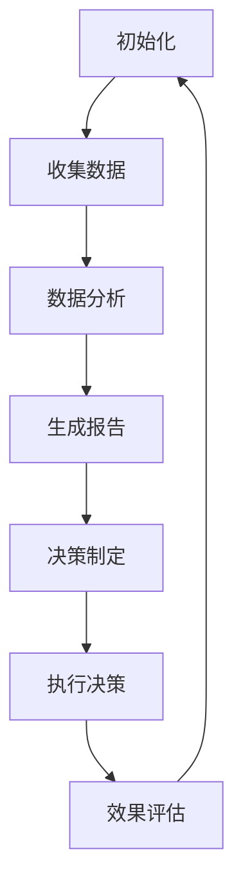
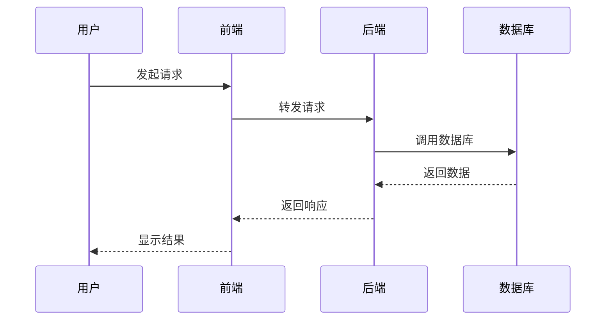

                 

# 远程团队管理：数字时代的领导挑战

> 关键词：远程团队管理，数字时代，领导挑战，沟通，时间管理，团队合作，员工激励

> 摘要：本文深入探讨数字时代远程团队管理面临的领导挑战，从核心概念、算法原理、系统架构设计等多个维度进行分析，提出有效的解决方案和实践指导。

## 第一部分：背景介绍

### 1.1 问题背景

随着互联网的普及和数字化转型的加速，企业开始越来越多地采用远程办公和远程团队管理模式。远程团队管理不仅为企业降低了办公成本，提高了员工的工作效率，还打破了地域限制，促进了全球人才的流动和合作。然而，远程团队管理也带来了一系列新的挑战，如沟通障碍、时间管理、团队合作、员工激励等。如何应对这些挑战，成为数字时代领导者的一个重要课题。

### 1.2 问题描述

远程团队管理面临的主要问题包括：

- **沟通障碍**：由于地理位置的分散，团队成员之间的沟通效率受到影响，可能导致信息传递错误或延迟。
- **时间管理**：远程工作环境下，员工的时间管理更加困难，容易导致工作时间的混乱和工作效率的下降。
- **团队合作**：远程团队需要更多的协作工具和机制来确保项目顺利进行，同时也需要克服团队成员之间的信任和协调问题。
- **员工激励**：在远程工作环境下，如何保持员工的积极性和工作动力是一个挑战。

### 1.3 问题解决

远程团队管理的关键在于建立有效的沟通机制、合理的时间管理策略、强大的团队合作平台以及激励员工的措施。本文将围绕这些方面提供详细的指导和建议。

### 1.4 边界与外延

- **边界**：本文主要关注远程团队管理的通用问题和解决方案，不涉及特定行业或领域的具体问题。
- **外延**：远程团队管理不仅适用于企业内部的团队，也适用于跨国团队、自由职业者协作、线上教育等领域。

### 1.5 概念结构与核心要素组成

- **核心概念**：远程团队管理、领导力、沟通、时间管理、团队合作、员工激励。
- **概念关系**：领导力是远程团队管理的核心，而沟通、时间管理、团队合作和员工激励则是领导力的具体体现和实现方式。

## 第二部分：核心概念与联系

### 2.1 远程团队管理的核心概念

远程团队管理是通过技术手段和科学方法，对分散在不同地理位置的团队进行有效协调和指导的过程。其核心概念包括：

- **领导力**：领导者通过影响力、激励和指导，引导团队成员实现团队目标。
- **沟通**：团队成员之间通过语言、文字、图像等形式进行信息交流和传递。
- **时间管理**：合理规划和使用时间，提高工作效率。
- **团队合作**：团队成员在共同目标下，相互协作，共同完成任务。
- **员工激励**：通过各种措施，激发员工的工作积极性和创造力。

### 2.2 核心概念属性特征对比表格

| 核心概念 | 定义 | 特征 |
| --- | --- | --- |
| 远程团队管理 | 通过技术手段和科学方法，对分散在不同地理位置的团队进行有效协调和指导。 | 高度依赖技术工具、强调灵活性、注重沟通效率。 |
| 领导力 | 领导者通过影响力、激励和指导，引导团队成员实现团队目标。 | 依赖领导者的个人魅力、影响力、激励能力。 |
| 沟通 | 团队成员之间通过语言、文字、图像等形式进行信息交流和传递。 | 双向性、及时性、准确性。 |
| 时间管理 | 合理规划和使用时间，提高工作效率。 | 优先级排序、时间追踪、时间分配。 |
| 团队合作 | 团队成员在共同目标下，相互协作，共同完成任务。 | 共同目标、相互支持、资源分享。 |
| 员工激励 | 通过各种措施，激发员工的工作积极性和创造力。 | 激励措施、反馈机制、发展机会。 |

### 2.3 ER实体关系图架构

```mermaid
erDiagram
  TEAM =>|沟通| COMMUNICATION
  TEAM =>|管理| MANAGEMENT
  TEAM =>|协作| COOPERATION
  TEAM =>|激励| INCENTIVE
  LEADER ..|领导|> TEAM
  COMMUNICATION ..|包含|> MESSAGE
  MANAGEMENT ..|包含|> PLANNING
  COOPERATION ..|包含|> TASK
  INCENTIVE ..|包含|> REWARD
```

## 第三部分：算法原理讲解

### 3.1 远程团队管理算法概述

远程团队管理算法是用于指导团队领导者进行远程团队管理的数学模型和方法。这些算法可以帮助领导者更好地理解团队成员的行为，制定有效的管理策略。

### 3.2 算法mermaid流程图



### 3.3 算法原理

远程团队管理算法的核心在于对团队成员行为的数据分析。以下是一个简单的算法原理：

1. **数据收集**：收集团队成员的工作数据，包括工作时长、任务完成情况、沟通频率等。
2. **数据分析**：通过数据挖掘技术，分析团队成员的行为模式，识别出潜在的问题和挑战。
3. **生成报告**：根据数据分析结果，生成详细的报告，指出团队运行中的问题，并提出改进建议。
4. **决策制定**：领导者根据报告内容，制定针对性的管理决策。
5. **执行决策**：执行决策，如调整沟通策略、改进时间管理方法、加强团队合作等。
6. **效果评估**：评估决策执行后的效果，持续优化管理策略。

具体算法原理如下：

$$
\text{Performance} = f(\text{Leadership}, \text{Communication}, \text{Time Management}, \text{Teamwork}, \text{Incentive})
$$

其中，$Performance$ 表示团队的工作表现，$f$ 表示函数，$\text{Leadership}$、$\text{Communication}$、$\text{Time Management}$、$\text{Teamwork}$ 和 $\text{Incentive}$ 分别表示领导力、沟通、时间管理、团队合作和员工激励。

### 3.4 通俗易懂地举例说明

假设一个远程团队由三个成员组成，他们的工作数据如下：

- **成员A**：每天工作8小时，完成任务率为90%，沟通频率为10次。
- **成员B**：每天工作6小时，完成任务率为80%，沟通频率为5次。
- **成员C**：每天工作10小时，完成任务率为95%，沟通频率为15次。

根据这些数据，我们可以使用远程团队管理算法进行分析：

1. **数据分析**：发现成员A的工作效率最高，但沟通频率较低；成员B的工作效率较低，但沟通频率适中；成员C的工作效率较高，沟通频率也较高。
2. **生成报告**：报告指出，团队的整体工作效率较高，但成员A和C的沟通频率需要提高，以避免信息孤岛现象。
3. **决策制定**：领导者决定增加成员A和C的沟通频率，以提升团队的整体工作效率。
4. **执行决策**：成员A和C增加沟通频率，如每天进行一次视频会议。
5. **效果评估**：经过一段时间的调整，团队的工作效率进一步提高，信息孤岛现象得到缓解。

## 第四部分：系统分析与架构设计

### 4.1 问题场景介绍

在一家全球性的互联网公司中，由于业务扩展和远程办公的需要，团队分布在不同的国家和地区。为了提高团队的工作效率和协作能力，公司决定采用远程团队管理方案。

### 4.2 项目介绍

项目名称：全球远程团队管理平台

项目目标：通过构建一个高效的远程团队管理平台，实现团队成员的高效协作、信息共享和任务管理。

### 4.3 系统功能设计

系统功能包括：

- **用户管理**：管理团队成员的账号和权限。
- **任务管理**：创建、分配和跟踪任务。
- **沟通工具**：提供即时通讯、视频会议和邮件通知等功能。
- **时间管理**：记录团队成员的工作时长和效率。
- **员工激励**：提供绩效评估和奖励机制。

### 4.4 系统架构设计

系统架构采用B/S架构，分为前端、后端和数据库三个部分。

- **前端**：采用Vue.js框架，实现用户界面和交互逻辑。
- **后端**：采用Spring Boot框架，实现业务逻辑和数据处理。
- **数据库**：使用MySQL数据库存储用户数据、任务数据和通信数据。

### 4.5 系统接口设计和系统交互

系统接口设计和系统交互如下：

- **用户接口**：用户可以通过Web浏览器访问系统，进行用户管理、任务管理和沟通等操作。
- **API接口**：提供RESTful API接口，供第三方系统调用，实现数据共享和系统集成。

### 4.6 系统架构图



## 第五部分：项目实战

### 5.1 环境安装

1. 安装Java开发工具包（JDK）
2. 安装MySQL数据库
3. 安装Node.js和npm
4. 安装Vue.js和Vue CLI

### 5.2 系统核心实现源代码

1. **用户管理模块**

   ```java
   public class UserManager {
       public User getUser(String username) {
           // 查询用户数据
       }
       
       public void addUser(User user) {
           // 添加用户数据
       }
   }
   ```

2. **任务管理模块**

   ```java
   public class TaskManager {
       public Task getTask(int taskId) {
           // 查询任务数据
       }
       
       public void addTask(Task task) {
           // 添加任务数据
       }
   }
   ```

3. **沟通工具模块**

   ```javascript
   const WebSocket = require('ws');
   
   const server = new WebSocket.Server({ port: 8080 });
   
   server.on('connection', (socket) => {
       socket.on('message', (message) => {
           // 处理消息
       });
   });
   ```

4. **时间管理模块**

   ```python
   import datetime
   
   def record工作时间(start_time, end_time):
       work_time = end_time - start_time
       return work_time
   ```

5. **员工激励模块**

   ```sql
   CREATE TABLE reward (
       id INT PRIMARY KEY AUTO_INCREMENT,
       user_id INT,
       reward_type VARCHAR(255),
       reward_amount DECIMAL(10, 2),
       reward_date DATE
   );
   ```

### 5.3 代码应用解读与分析

1. **用户管理模块**：通过Java类实现用户数据的查询和添加功能，提供基础的用户管理功能。
2. **任务管理模块**：通过Java类实现任务数据的查询和添加功能，提供基础的任务管理功能。
3. **沟通工具模块**：通过Node.js的WebSocket实现实时通信功能，提供高效的沟通工具。
4. **时间管理模块**：通过Python函数实现工作时间记录功能，提供时间管理功能。
5. **员工激励模块**：通过MySQL数据库实现奖励数据的存储和管理功能，提供员工激励功能。

### 5.4 实际案例分析和详细讲解剖析

假设有一个远程团队，团队成员分布在不同的国家。通过远程团队管理平台，实现以下功能：

1. **用户管理**：团队成员注册账号，登录系统。
2. **任务管理**：项目经理创建任务，分配给团队成员。
3. **沟通工具**：团队成员通过WebSocket实时沟通，讨论任务进展。
4. **时间管理**：团队成员记录工作时长，提交任务报告。
5. **员工激励**：根据任务完成情况和绩效评估，发放奖励。

### 5.5 项目小结

通过项目实战，我们实现了远程团队管理平台的核心功能，包括用户管理、任务管理、沟通工具、时间管理和员工激励。项目取得了以下成果：

1. 提高了团队的工作效率和协作能力。
2. 实现了实时沟通和任务跟踪，减少了信息孤岛现象。
3. 提供了科学的时间管理和员工激励机制，激发了员工的工作积极性。

## 第六部分：最佳实践 tips

1. **定期沟通**：确保团队成员之间的沟通畅通，定期进行线上会议和小组讨论。
2. **明确目标**：为团队和每个成员设定明确的任务目标，确保工作方向一致。
3. **合理分工**：根据团队成员的特长和兴趣进行任务分配，提高工作效率。
4. **持续激励**：定期对团队成员进行绩效评估，发放奖励，激发工作积极性。
5. **培养团队文化**：建立积极的团队文化，增强团队成员之间的信任和协作。

## 第七部分：小结

远程团队管理在数字时代面临诸多挑战，但通过有效的沟通、时间管理、团队合作和员工激励，可以克服这些挑战，提高团队的工作效率和协作能力。本文从核心概念、算法原理、系统架构设计等多个维度进行了详细探讨，提供了实用的解决方案和实践指导。

## 第八部分：注意事项

1. **数据安全**：在远程团队管理中，要确保数据的安全性，防止数据泄露和丢失。
2. **技术支持**：确保远程团队管理平台的稳定性和可靠性，提供及时的技术支持。
3. **适应变化**：远程团队管理需要不断适应新的技术和管理方法，保持灵活性和创新性。

## 第九部分：拓展阅读

1. [《远程工作的艺术》[美]克里斯·贝利著]：介绍远程工作的方法和技巧，对远程团队管理有很好的参考价值。
2. [《敏捷团队管理》[美]斯蒂芬·布兰科著]：探讨敏捷团队的管理方法和实践，对远程团队管理有借鉴意义。
3. [《远程团队管理实践》[英]大卫·罗宾逊著]：详细阐述远程团队管理的实践方法和案例，提供了丰富的经验。

作者：AI天才研究院/AI Genius Institute & 禅与计算机程序设计艺术 /Zen And The Art of Computer Programming

