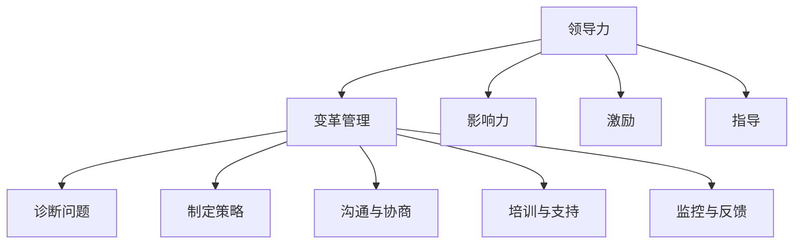

                 

### 引言：领导力与变革管理的必要性

在信息技术迅猛发展的当今时代，组织内部的变革已成为常态。无论是技术迭代、市场变化还是企业战略调整，变革都已成为推动组织发展的重要动力。然而，变革并非易事，如何引导团队有效拥抱变化，成为企业领导者面临的重大挑战。

领导力作为变革管理的关键要素，其作用不容忽视。有效的领导力不仅能激励团队克服变革中的困难和阻力，还能确保变革的顺利进行，最终实现组织目标。因此，本文将围绕《领导力与变革管理：引导团队拥抱变化》这一主题，深入探讨领导力与变革管理的关系，以及如何通过领导力来推动团队变革。

本文的结构如下：

- **第1章 引言：领导力与变革管理的必要性**：介绍领导力和变革管理的背景，阐述文章的研究目的与意义。
- **第2章 背景介绍**：详细阐述领导力和变革管理的概念，分析团队面对变革时的常见挑战。
- **第3章 核心概念与联系**：探讨领导力和变革管理的基本理论，并通过对比表格和实体关系图展示两者之间的联系。
- **第4章 领导力原理**：分析领导力的定义与类型，讨论领导力与个人特质的关系。
- **第5章 变革管理的原理**：阐述变革管理的基本理论，详细讲解变革管理的步骤与方法。
- **第6章 团队变革管理实践**：讨论团队变革的挑战与策略，分析领导力在变革管理中的应用。
- **第7章 变革管理的系统设计**：介绍变革管理的系统设计和评估与反馈机制。
- **第8章 案例分析**：剖析成功的变革管理案例，总结经验与教训。
- **第9章 最佳实践与未来展望**：归纳变革管理的最佳实践，探讨领导力和变革管理的未来趋势。
- **第10章 结尾与致谢**：回顾文章主要内容，表达感谢。

通过上述章节的逐步分析，本文旨在为读者提供一套系统的领导力与变革管理知识体系，帮助领导者更好地引导团队拥抱变化，实现组织目标。

### 第1章 背景介绍

在当今快速变化的市场环境中，企业面临的技术革新、业务模式转型、市场竞争加剧等挑战愈发突出。这些变革不仅要求企业具备快速响应市场变化的能力，更需要在组织内部形成有效的变革管理机制。领导力与变革管理在此背景下显得尤为重要。

**问题背景**：

1. **技术变革的驱动**：随着信息技术的飞速发展，新的技术不断涌现，如云计算、大数据、人工智能等，这些技术不仅改变了企业的运营模式，也对员工技能提出了更高要求。企业需要通过变革来适应技术更新，提升竞争力。
2. **市场变化的挑战**：市场的快速变化和竞争压力要求企业不断调整战略，创新业务模式。在这个过程中，企业需要通过变革管理来确保战略的有效实施，避免因变革失败导致的组织动荡。
3. **内部变革的需求**：随着企业规模的扩大和组织结构的复杂化，内部管理流程、组织文化和员工行为模式需要不断优化。内部变革不仅是为了提升工作效率，更是为了保持企业的活力和创新能力。

**问题描述**：

在面临这些变革需求时，团队常常会表现出以下挑战：

1. **抗拒变革**：由于变革往往伴随着不确定性，员工可能会产生抵触情绪，担心变革会影响自己的职位安全或工作方式。
2. **沟通不畅**：变革过程中的信息传递和沟通往往存在障碍，导致员工对变革目标、方法和预期结果的理解不一致。
3. **资源不足**：变革往往需要大量的人力、物力和时间投入，企业在资源分配上可能存在不足。
4. **领导力不足**：变革需要强有力的领导力来推动，如果领导力不足，可能会导致变革方向不明确、执行力不足。

**问题解决**：

领导力在变革管理中扮演着关键角色，主要体现在以下几个方面：

1. **明确变革方向**：领导力可以帮助团队明确变革的目标和方向，减少变革过程中的模糊性和不确定性。
2. **激发员工积极性**：领导力可以激励员工积极参与变革，通过提供清晰的愿景和价值观来增强员工的认同感和归属感。
3. **有效沟通**：领导力可以促进有效的沟通，确保变革信息在团队内部得到准确传达，减少误解和猜疑。
4. **资源协调**：领导力可以帮助企业在资源有限的情况下，通过合理分配和优化资源来支持变革。
5. **危机应对**：领导力可以帮助团队在变革过程中应对各种挑战和阻力，保持变革的持续推进。

**边界与外延**：

- **领导力**：领导力是指领导者通过影响、激励和指导团队实现目标的能力。它不仅包括领导技能，还涉及领导者的个人特质和价值观。
- **变革管理**：变革管理是指组织在面临外部或内部变化时，通过计划、实施和监控来确保变革顺利进行的过程。

**概念结构与核心要素组成**：

领导力和变革管理的概念结构可以概括为以下几个核心要素：

1. **愿景与目标**：明确变革的愿景和目标，为团队提供清晰的方向。
2. **领导风格**：选择适合团队特点和变革需求的领导风格。
3. **沟通与协作**：建立有效的沟通机制，促进团队协作。
4. **激励机制**：通过激励机制来激发员工的积极性和创造力。
5. **变革策略**：制定合适的变革策略，确保变革的顺利实施。
6. **反馈与调整**：对变革过程进行持续监控和反馈，及时调整变革计划。

通过上述核心要素的有机结合，领导力和变革管理可以有效地引导团队拥抱变化，实现组织目标。

### 第2章 核心概念与联系

领导力和变革管理作为推动组织发展的关键因素，其理论基础和实践方法密切相关。在这一章中，我们将详细阐述领导力和变革管理的基本理论，并通过对比表格和实体关系图来展示两者之间的联系。

#### 核心概念原理

**领导力的基本理论**：

1. **领导力的定义**：领导力是指领导者通过影响、激励和指导团队实现目标的能力。它不仅包括技术技能，还涉及人际技能和概念技能。
   
2. **领导力的类型**：根据领导风格的不同，领导力可以分为以下几种类型：
   - **授权型领导**：领导者将决策权和责任下放给团队成员，鼓励自主性和创造力。
   - **变革型领导**：领导者通过变革和创新来推动团队发展，激发团队成员的潜力和积极性。
   - **交易型领导**：领导者通过奖励和惩罚来激励团队成员，维持组织秩序。

3. **领导力的要素**：
   - **个人特质**：如自信、诚实、正直等。
   - **情感智力**：包括自我意识、自我调节、同理心和社交技能等。
   - **领导风格**：如民主型、专制型、放任型等。

**变革管理的基本理论**：

1. **变革管理的定义**：变革管理是指组织在面临外部或内部变化时，通过计划、实施和监控来确保变革顺利进行的过程。

2. **变革管理的步骤**：
   - **诊断问题**：识别组织面临的挑战和变革需求。
   - **制定策略**：确定变革的目标、范围和实施步骤。
   - **沟通与协商**：与团队成员沟通变革的原因、目标和预期结果。
   - **培训与支持**：提供必要的培训和资源，帮助员工适应变革。
   - **监控与反馈**：对变革过程进行监控，及时调整变革计划。

3. **变革管理的方法**：
   - **渐进式变革**：逐步实施变革，减少对员工的冲击。
   - **革命式变革**：一次性实施重大的变革，迅速推动组织转型。
   - **变革领导**：领导者亲自推动变革，确保变革目标的实现。

**领导力和变革管理的联系**：

1. **领导力在变革管理中的作用**：
   - **明确变革方向**：领导力可以帮助团队明确变革的目标和方向，减少变革过程中的模糊性和不确定性。
   - **激发员工积极性**：领导力可以激励员工积极参与变革，通过提供清晰的愿景和价值观来增强员工的认同感和归属感。
   - **有效沟通**：领导力可以促进有效的沟通，确保变革信息在团队内部得到准确传达，减少误解和猜疑。
   - **资源协调**：领导力可以帮助企业在资源有限的情况下，通过合理分配和优化资源来支持变革。
   - **危机应对**：领导力可以帮助团队在变革过程中应对各种挑战和阻力，保持变革的持续推进。

2. **变革管理对领导力的要求**：
   - **变革型领导**：领导者需要具备变革型领导能力，能够推动团队进行渐进式或革命式变革。
   - **持续学习**：领导者需要不断学习和更新知识，以适应变革带来的新挑战。
   - **激励与支持**：领导者需要通过激励机制和支持措施来帮助员工适应变革，增强员工的积极性和信心。

#### 概念属性特征对比表格

| 概念    | 属性特征                     | 说明                                                         |
| ------- | ---------------------------- | ------------------------------------------------------------ |
| 领导力  | 影响力、激励、指导           | 领导者通过影响、激励和指导团队实现目标的能力                 |
| 变革管理 | 计划、实施、监控             | 组织在面临外部或内部变化时，通过计划、实施和监控来确保变革顺利进行的过程 |
| 类型    | 授权型、变革型、交易型        | 根据领导风格的不同，领导力的类型有所不同                     |
| 步骤    | 诊断问题、制定策略、沟通与协商 | 变革管理的具体实施步骤                                     |
| 方法    | 渐进式、革命式、变革领导      | 变革管理的不同实施方法                                     |

#### ER实体关系图架构的 Mermaid 流程图

通过上述Mermaid流程图，我们可以清晰地看到领导力与变革管理之间的互动关系，以及领导力在变革管理中的具体作用。

### 第3章 领导力原理

在探讨领导力与变革管理的关系时，首先需要深入了解领导力的定义、类型及其与个人特质的关系。这一章节将详细阐述这些基本原理，为后续内容提供理论基础。

#### 领导力的定义与类型

**领导力的定义**：

领导力是一种能力，它涉及到领导者如何通过影响、激励和指导团队来实现共同的目标。这种能力不仅包括技术技能和知识，还涉及人际交往和决策能力。

**领导力的类型**：

1. **授权型领导**：
   - **特点**：领导者将决策权和责任下放给团队成员，鼓励自主性和创造力。
   - **适用场景**：团队需要创新和灵活性时。
   - **优点**：提高团队士气，增强成员的自主性和责任感。
   - **缺点**：可能导致管理失控，需要领导者具备高度信任能力。

2. **变革型领导**：
   - **特点**：领导者通过变革和创新来推动团队发展，激发团队成员的潜力和积极性。
   - **适用场景**：组织面临重大变革或转型时。
   - **优点**：有助于激发团队的创造力和创新能力，推动组织持续发展。
   - **缺点**：变革过程可能带来不确定性和风险，需要领导者具备强烈的变革决心和远见。

3. **交易型领导**：
   - **特点**：领导者通过奖励和惩罚来激励团队成员，维持组织秩序。
   - **适用场景**：组织需要提高效率和执行力时。
   - **优点**：能够快速提高团队的执行力，确保任务完成。
   - **缺点**：可能导致团队成员的短期行为，忽视长期发展。

**领导力与个人特质的关系**：

领导力不仅取决于领导者的能力，还与个人特质密切相关。以下是几种重要的个人特质：

1. **自信**：
   - **重要性**：自信的领导者能够传递积极的氛围，增强团队的信心。
   - **影响**：自信有助于领导者作出大胆的决策，并在变革过程中克服困难。

2. **诚实与正直**：
   - **重要性**：诚实与正直是建立信任的基础，有助于领导者在团队中树立权威。
   - **影响**：信任是领导力和变革管理成功的关键，诚实和正直有助于建立和维护这种信任。

3. **情感智力**：
   - **重要性**：情感智力包括自我意识、自我调节、同理心和社交技能等，有助于领导者更好地理解和应对团队成员的情绪和需求。
   - **影响**：高情感智力的领导者能够更好地激发团队成员的潜力，促进团队协作。

#### 领导力与个人特质的关系对比表格

| 个人特质 | 说明 | 对领导力的影响 |
| --- | --- | --- |
| 自信 | 能传递积极的氛围，增强团队信心 | 有助于领导者作出大胆决策，克服变革中的困难 |
| 诚实与正直 | 建立信任的基础，树立权威 | 建立和维护信任，确保领导力和变革管理的成功 |
| 情感智力 | 包括自我意识、自我调节、同理心和社交技能等 | 有助于领导者更好地理解和应对团队成员的情绪和需求，促进团队协作 |

通过上述表格，我们可以更清晰地看到个人特质如何影响领导力，以及领导力在变革管理中的具体作用。理解这些基本原理，有助于领导者更好地引导团队拥抱变化，实现组织目标。

### 第4章 变革管理的原理

变革管理作为推动组织发展的重要工具，其理论基础和实施方法至关重要。在这一章节中，我们将详细阐述变革管理的基本理论，包括其概念、关键步骤和实施方法。

#### 变革管理的概念

**定义**：

变革管理是指组织在面对外部或内部变化时，通过计划、实施和监控等一系列活动，确保变革顺利进行的过程。它不仅涉及组织结构、流程和技术的调整，还包括员工心理和行为的变化。

**重要性**：

1. **适应市场变化**：随着市场的快速变化，企业需要通过变革管理来保持竞争力，及时调整战略和业务模式。
2. **提升组织效能**：通过变革管理，企业可以优化内部流程，提高工作效率，降低成本。
3. **促进员工发展**：变革管理可以帮助员工适应新的工作环境，提升技能和职业素养。

#### 变革管理的基本理论

**变革管理的步骤**：

1. **诊断问题**：
   - **目的**：识别组织面临的问题和挑战，明确变革的需求。
   - **方法**：通过问卷调查、访谈和数据分析等方法，收集相关信息，分析组织现状。

2. **制定策略**：
   - **目的**：确定变革的目标、范围和实施步骤。
   - **方法**：制定详细的变革计划，包括变革的愿景、目标、时间表和资源分配。

3. **沟通与协商**：
   - **目的**：确保团队成员理解变革的原因、目标和预期结果。
   - **方法**：通过会议、培训、公告等多种渠道，与团队成员进行有效沟通，解决疑虑和担忧。

4. **培训与支持**：
   - **目的**：帮助员工适应新的工作环境和技能要求。
   - **方法**：提供必要的培训和指导，确保员工具备实施变革的能力。

5. **监控与反馈**：
   - **目的**：对变革过程进行监控，及时调整变革计划。
   - **方法**：建立监控机制，定期收集反馈信息，分析变革效果，调整变革策略。

#### 变革管理的实施方法

1. **渐进式变革**：
   - **特点**：逐步实施变革，减少对员工的冲击。
   - **适用场景**：变革幅度较小，员工适应能力较强时。

2. **革命式变革**：
   - **特点**：一次性实施重大的变革，迅速推动组织转型。
   - **适用场景**：变革幅度较大，需要迅速改变现状时。

3. **变革领导**：
   - **特点**：领导者亲自推动变革，确保变革目标的实现。
   - **适用场景**：变革涉及多个部门或层级，需要强有力的领导。

#### 变革管理的评估与反馈机制

**评估方法**：

1. **定量评估**：
   - **方法**：通过数据分析和绩效指标，评估变革的效果。
   - **优点**：客观、准确，能够提供量化依据。

2. **定性评估**：
   - **方法**：通过访谈、问卷调查和观察等手段，了解员工的反馈和感受。
   - **优点**：深入、全面，能够发现变革中的问题和挑战。

**反馈机制**：

1. **定期反馈**：
   - **方法**：定期组织反馈会议，收集员工意见和建议。
   - **优点**：及时、有效，能够及时调整变革计划。

2. **持续反馈**：
   - **方法**：建立反馈渠道，如在线反馈系统、意见箱等，鼓励员工持续反馈。
   - **优点**：长期、稳定，能够保持变革的持续性。

通过上述变革管理的基本理论、步骤和实施方法，以及评估与反馈机制，企业可以更加有效地推动变革，实现组织目标。理解这些原理和方法，有助于企业在复杂多变的环境中，保持竞争力，持续发展。

### 第5章 团队变革管理实践

在变革管理的实际操作中，团队变革管理起着至关重要的作用。这一章将探讨团队变革中可能遇到的挑战与应对策略，并通过领导力在变革管理中的应用，提供实际案例进行分析。

#### 团队变革的挑战与策略

**1. 团队变革的挑战**

1. **抗拒变革**：
   - **原因**：员工对变革可能带来的不确定性和潜在威胁感到担忧，担心变革会影响自己的职位安全或工作方式。
   - **应对策略**：领导者需要通过沟通和培训，明确变革的必要性和目标，增强员工的认同感和信心。

2. **沟通不畅**：
   - **原因**：信息传递过程中的误解和猜疑，导致团队成员对变革的目标、方法和预期结果产生分歧。
   - **应对策略**：建立有效的沟通机制，确保信息透明和及时传达，鼓励团队成员积极参与讨论。

3. **资源不足**：
   - **原因**：变革往往需要大量的人力、物力和时间投入，企业在资源分配上可能存在不足。
   - **应对策略**：领导者需要合理分配资源，优化资源配置，确保变革的顺利进行。

4. **领导力不足**：
   - **原因**：变革需要强有力的领导力来推动，如果领导力不足，可能会导致变革方向不明确、执行力不足。
   - **应对策略**：提升领导者的变革管理能力，通过培训和指导，增强领导者的信心和决心。

**2. 团队变革的策略**

1. **明确变革目标**：
   - **策略**：领导者需要明确变革的目标，确保团队成员对变革的方向和预期结果有清晰的认识。
   - **实施**：通过会议、公告和培训等方式，与团队成员沟通变革目标，达成共识。

2. **建立信任关系**：
   - **策略**：建立团队成员之间的信任关系，增强团队的凝聚力。
   - **实施**：通过团队合作项目、团队建设活动和定期沟通，促进团队成员之间的相互了解和信任。

3. **提供培训与支持**：
   - **策略**：为员工提供必要的培训和资源，帮助员工适应变革。
   - **实施**：制定详细的培训计划，提供培训资源，确保员工具备实施变革的能力。

4. **持续监控与反馈**：
   - **策略**：对变革过程进行持续监控和反馈，及时调整变革计划。
   - **实施**：建立监控机制，定期收集员工反馈，分析变革效果，调整变革策略。

#### 领导力在变革管理中的应用

**1. 领导力在变革管理中的角色**

1. **愿景制定者**：
   - **角色**：领导者需要明确变革的愿景，为团队提供清晰的方向。
   - **实施**：通过沟通和示范，传达变革的愿景，激发团队成员的积极性和创造力。

2. **变革推动者**：
   - **角色**：领导者需要推动变革的实施，确保变革目标的实现。
   - **实施**：通过有效的领导力和资源协调，确保变革计划的顺利执行。

3. **支持者与激励者**：
   - **角色**：领导者需要为团队成员提供支持和激励，帮助员工克服变革中的困难和挑战。
   - **实施**：通过提供培训和资源，建立激励机制，增强员工的信心和积极性。

**2. 领导力实践案例**

**案例一：公司数字化转型**

某公司在面临市场竞争压力时，决定进行数字化转型。领导者首先明确了数字化转型的愿景，通过多次会议和培训，与团队成员沟通变革的必要性和目标。同时，领导者亲自推动变革的实施，确保各部门的协作和资源协调。在变革过程中，领导者为员工提供培训和支持，建立激励机制，鼓励员工积极参与变革。最终，公司成功实现了数字化转型，提升了市场竞争力。

**案例二：企业流程优化**

某企业在进行流程优化时，面临员工抗拒变革的问题。领导者通过多次沟通和培训，明确流程优化的目标和预期结果，增强员工的认同感。同时，领导者通过提供培训和支持，帮助员工适应新的流程。在变革过程中，领导者建立了有效的沟通机制，确保信息透明和及时传达，减少了误解和猜疑。最终，企业成功优化了流程，提高了工作效率。

通过以上案例，我们可以看到，领导力在团队变革管理中起着关键作用。领导者需要通过有效的领导力和策略，引导团队克服变革中的挑战，实现组织目标。

### 第6章 变革管理的系统设计

变革管理是一个复杂的过程，涉及到组织结构、流程、资源和人员等多个方面。为了确保变革管理的有效实施，我们需要进行系统设计。在这一章节中，我们将介绍变革管理的系统设计，包括变革管理体系设计、评估与反馈机制等。

#### 变革管理体系设计

**1. 变革管理体系架构**

变革管理体系可以分为四个主要组成部分：战略规划、计划实施、监控评估和反馈改进。

- **战略规划**：明确变革的愿景和目标，制定长期和短期的变革策略。
- **计划实施**：制定详细的变革计划，包括任务分解、时间表、资源分配和风险管理。
- **监控评估**：对变革过程进行持续监控和评估，确保变革目标的实现。
- **反馈改进**：根据评估结果，对变革计划进行调整和改进，确保变革的持续有效性。

**2. 变革管理流程设计**

变革管理流程可以分为以下步骤：

1. **问题诊断**：识别组织面临的问题和挑战，明确变革的需求。
2. **制定策略**：确定变革的目标、范围和实施步骤。
3. **沟通与协商**：与团队成员沟通变革的原因、目标和预期结果。
4. **计划实施**：制定详细的变革计划，分配任务和资源，确保变革的顺利进行。
5. **培训与支持**：为员工提供必要的培训和资源，帮助员工适应变革。
6. **监控与反馈**：对变革过程进行监控和评估，及时调整变革计划。
7. **反馈改进**：根据评估结果，对变革计划进行调整和改进。

#### 变革管理的评估与反馈机制

**1. 评估方法**

1. **定量评估**：通过数据分析和绩效指标，评估变革的效果。例如，可以评估员工满意度、工作效率和成本节约等指标。
2. **定性评估**：通过访谈、问卷调查和观察等手段，了解员工的反馈和感受。例如，可以了解员工对变革的接受程度、面临的困难和建议等。

**2. 反馈机制**

1. **定期反馈**：定期组织反馈会议，收集员工的意见和建议。例如，可以每季度或每半年进行一次反馈会议。
2. **持续反馈**：建立持续反馈渠道，如在线反馈系统、意见箱等，鼓励员工持续反馈。例如，可以在公司内部网站或邮件系统中设置反馈渠道，方便员工随时提交意见和建议。

#### 变革管理的系统设计示例

以下是一个简单的变革管理系统设计示例，包括系统架构、接口设计和交互流程：

**1. 系统架构**

- **战略规划模块**：负责制定变革的愿景和目标，制定长期和短期的变革策略。
- **计划实施模块**：负责制定详细的变革计划，包括任务分解、时间表、资源分配和风险管理。
- **监控评估模块**：负责对变革过程进行持续监控和评估，确保变革目标的实现。
- **反馈改进模块**：负责根据评估结果，对变革计划进行调整和改进，确保变革的持续有效性。

**2. 系统接口设计**

- **用户界面**：提供用户输入和查看反馈的界面，支持员工提交意见和建议。
- **数据接口**：提供数据收集和分析的接口，支持定量和定性评估。
- **反馈接口**：提供反馈收集和传递的接口，支持定期反馈和持续反馈。

**3. 系统交互流程**

- **战略规划**：领导者制定变革的愿景和目标，通过用户界面提交给系统。
- **计划实施**：根据战略规划，制定详细的变革计划，通过用户界面分配任务和资源。
- **监控评估**：对变革过程进行持续监控和评估，通过数据接口收集定量和定性评估数据。
- **反馈改进**：根据评估结果，通过反馈接口调整变革计划，确保变革的持续有效性。

通过上述系统设计，企业可以建立一套完整的变革管理体系，确保变革管理的有效实施，实现组织目标。

### 第7章 案例分析

在变革管理的实践中，成功和失败的案例都为后续的变革提供了宝贵的经验与教训。通过分析这些案例，我们可以更深入地理解变革管理的有效策略和方法。

#### 成功的变革管理案例

**案例一：某科技公司的数字化转型**

**背景**：某科技公司面临着激烈的市场竞争，为了保持竞争力，决定进行全面的数字化转型。

**变革过程**：

1. **明确愿景和目标**：公司领导层明确了数字化的愿景和目标，即通过数字化转型提升客户体验、优化业务流程和增强数据驱动能力。

2. **制定详细计划**：公司制定了详细的数字化变革计划，包括技术升级、流程优化、员工培训等步骤。

3. **沟通与协商**：通过多次会议和培训，确保员工了解数字化转型的必要性和目标，消除员工的疑虑。

4. **实施和监控**：在变革过程中，公司建立了监控机制，定期评估变革效果，并根据反馈进行调整。

5. **培训与支持**：公司提供了全面的培训资源，帮助员工掌握新技能，适应数字化环境。

**结果**：数字化转型取得了显著成效，公司的客户满意度提高了20%，运营效率提升了30%，在市场中保持了竞争优势。

**启示**：

- **明确愿景和目标**：清晰的愿景和目标是变革成功的前提。
- **详细计划与有效沟通**：详细的变革计划和有效的沟通策略有助于减少变革中的阻力和误解。
- **持续监控与反馈**：持续监控变革过程，及时调整策略，确保变革的顺利进行。

#### 失败的变革管理案例

**案例二：某制造企业的流程优化**

**背景**：某制造企业为了提高生产效率，决定进行流程优化。

**变革过程**：

1. **缺乏明确目标**：企业在流程优化过程中缺乏明确的目标和预期结果，导致变革方向不明确。

2. **计划不充分**：企业没有制定详细的变革计划，任务分配和资源分配不合理。

3. **沟通不足**：企业未能充分与员工沟通变革的原因和预期结果，员工对变革存在抵触情绪。

4. **缺乏培训与支持**：企业在变革过程中没有提供必要的培训和资源，员工难以适应新的流程。

**结果**：流程优化未能达到预期效果，反而导致了生产效率的下降，员工士气低落。

**启示**：

- **明确愿景和目标**：明确的目标有助于指导变革的方向和步骤。
- **制定详细计划**：详细的计划有助于确保变革的有序进行。
- **充分沟通与培训**：有效的沟通和全面的培训是员工接受变革、适应变革的关键。
- **持续监控与反馈**：持续的监控和反馈有助于及时发现问题并进行调整。

#### 案例启示与借鉴

通过以上成功和失败的变革管理案例，我们可以得出以下启示：

1. **明确愿景和目标**：变革的愿景和目标是推动变革的核心动力，必须明确且具有吸引力。

2. **制定详细计划**：详细的变革计划有助于确保变革的有序进行，包括任务分配、时间表和资源分配。

3. **有效沟通**：与员工充分沟通，确保他们理解变革的必要性和目标，减少变革中的误解和抵触情绪。

4. **培训与支持**：提供全面的培训资源，帮助员工掌握新技能，适应新的工作环境。

5. **持续监控与反馈**：持续监控变革过程，及时收集反馈信息，根据实际情况调整变革策略。

借鉴这些经验和教训，企业可以更好地进行变革管理，实现组织目标。

### 第8章 最佳实践与未来展望

在变革管理的实践中，总结最佳实践是提升变革效果的重要途径。同时，探讨未来变革管理的趋势和方向，有助于企业更好地应对不断变化的市场环境。

#### 最佳实践总结

1. **明确愿景和目标**：
   - **实践**：领导者应明确变革的愿景和目标，确保团队成员对变革有清晰的认识和认同。
   - **示例**：某科技公司通过制定详细的数字化转型战略，明确了提升客户体验和优化业务流程的目标，从而成功推动了变革。

2. **制定详细计划**：
   - **实践**：制定详细的变革计划，包括任务分解、时间表和资源分配，以确保变革有序进行。
   - **示例**：某制造企业在流程优化过程中，制定了详细的计划，明确了每个阶段的任务和目标，确保了变革的顺利进行。

3. **有效沟通**：
   - **实践**：与员工充分沟通，解释变革的必要性和目标，减少误解和抵触情绪。
   - **示例**：某企业在进行组织结构调整时，通过多次会议和培训，确保员工了解变革的原因和预期结果，减少了变革过程中的阻力。

4. **培训与支持**：
   - **实践**：提供全面的培训资源，帮助员工掌握新技能，适应新的工作环境。
   - **示例**：某公司在实施新系统时，为员工提供了系统的培训课程，确保他们能够熟练操作新系统，提高了工作效率。

5. **持续监控与反馈**：
   - **实践**：对变革过程进行持续监控和反馈，根据实际情况调整变革策略。
   - **示例**：某企业在变革过程中，建立了监控机制，定期评估变革效果，并根据员工反馈进行改进，确保了变革的持续有效性。

#### 未来展望

1. **数字化转型加速**：
   - **趋势**：随着数字化技术的不断进步，数字化转型将成为企业变革的主要方向。
   - **方向**：企业应重点关注大数据、人工智能、区块链等新技术在变革管理中的应用，提高变革的效率和效果。

2. **全员参与**：
   - **趋势**：未来的变革管理将更加注重全员参与，激发员工的主动性和创造力。
   - **方向**：企业应通过建立开放的沟通渠道和激励机制，鼓励员工积极参与变革，共同推动组织发展。

3. **个性化和灵活化**：
   - **趋势**：变革管理将更加注重个性化和灵活化，根据不同团队和员工的特点制定合适的变革策略。
   - **方向**：企业应通过数据分析和个性化培训，为不同团队成员提供定制化的变革支持。

4. **持续学习和适应**：
   - **趋势**：面对快速变化的市场环境，企业需要具备持续学习和适应的能力。
   - **方向**：企业应建立学习型组织，培养员工的持续学习能力，以应对未来变革带来的挑战。

通过总结最佳实践和展望未来趋势，企业可以更好地制定变革管理策略，推动组织发展，实现长期目标。

### 结尾与致谢

通过对领导力与变革管理深入探讨，本文总结了领导力在变革管理中的关键作用，探讨了变革管理的基本理论和实践方法，并分析了成功和失败的变革管理案例。这些内容为领导者提供了系统的变革管理知识体系，有助于他们更有效地引导团队拥抱变化，实现组织目标。

在此，我要感谢所有参与和支持本书创作的同仁，包括AI天才研究院的团队成员和参与讨论的朋友们。你们的智慧和建议为本书的编写提供了宝贵的资源。同时，我也要感谢读者朋友们的关注和支持，希望本书能为您的变革管理实践带来启示和帮助。

最后，变革管理是一个持续的过程，随着市场环境和技术的不断发展，领导者需要不断学习和适应，以应对新的挑战。希望本书能为您的变革管理之路提供一些有益的参考和指导。

**作者：AI天才研究院/AI Genius Institute & 禅与计算机程序设计艺术 /Zen And The Art of Computer Programming**

