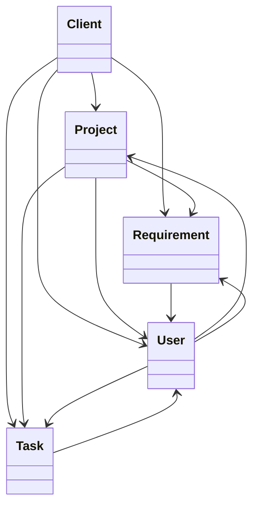
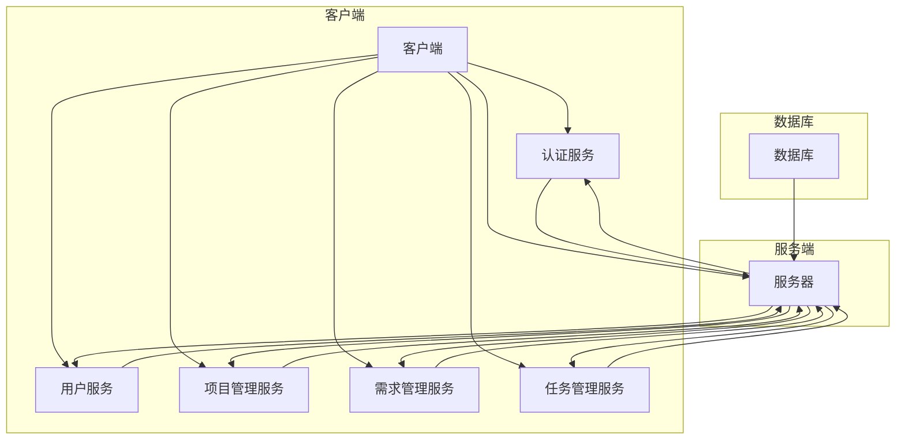
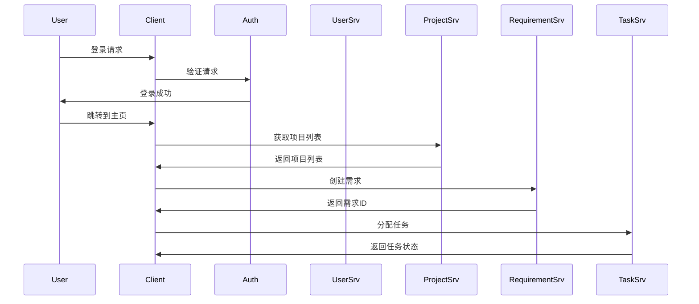

                 

### 前言

---

#### 《领导力与绩效改进：持续提升团队表现的技巧》

#### 关键词：领导力、绩效改进、团队表现、技巧

#### 摘要

在当今竞争激烈的技术领域，优秀的领导力和有效的绩效改进是推动团队实现卓越表现的关键因素。本书旨在深入探讨这两个核心概念，并通过具体技巧和实践指导，帮助读者掌握提升团队表现的方法与策略。本文将依次介绍领导力与绩效改进的重要性、关键概念、理论基础、实践指南、案例分析以及最佳实践，旨在为技术团队管理者提供全面、实用的参考。通过本书，读者将了解到如何运用领导力理论和绩效改进策略，从多个维度提升团队的整体表现和效率。

---

### 核心概念与联系

---

#### 领导力的定义

领导力是指一种激发、影响和指导他人朝着共同目标努力的能力。它不仅包括对任务的把控，更涵盖了人际关系和团队合作的方方面面。在技术领域，领导力尤为关键，因为它直接影响到团队的创新能力和问题解决能力。

#### 绩效改进的概念

绩效改进是指通过系统化的方法和策略，提升个人、团队或组织的绩效水平。这通常涉及到目标设定、资源优化、过程改进和结果评估等多个环节。

#### 团队表现的评估

团队表现通常通过多个指标进行评估，包括项目完成度、创新性、团队协作、员工满意度等。这些指标不仅反映了团队在任务层面的表现，也揭示了团队在沟通、协作和成长等方面的健康状况。

#### 关键概念之间的关系

领导力与绩效改进之间存在着密切的联系。优秀的领导力能够激发团队成员的积极性，提升团队的整体绩效；而有效的绩效改进则可以为领导力提供明确的实施方向和反馈机制，帮助团队不断优化和提升。

---

### 理论基础与框架

---

#### 经典领导力理论

- **特质理论**：强调领导者具备特定的性格特征和品质。
- **行为理论**：关注领导者如何在具体情境中表现。
- **情境理论**：认为领导力应该根据不同的情境灵活调整。

#### 现代领导力理论

- **转型领导力**：强调领导者通过变革和愿景引导团队。
- **分布式领导力**：认为领导力不应仅限于管理层，而应渗透到整个组织。

#### 绩效改进框架

- **SMART目标设定**：确保目标是具体（Specific）、可衡量（Measurable）、可实现（Achievable）、相关性（Relevant）和时限性（Time-bound）。
- **持续改进循环**：包括计划（Plan）、执行（Do）、检查（Check）和行动（Act）四个步骤。

---

### 实践指导

---

#### 提升领导力的技巧

##### 沟通技巧

有效的沟通是领导力的核心。领导者需要学会清晰、简洁地传达信息，同时也需要倾听团队成员的意见和反馈。

##### 决策技巧

领导者必须具备快速而明智的决策能力。这包括对信息的快速处理、对不同方案的评估和选择。

##### 带领团队的方法

领导者不仅要关注任务目标的实现，更要关注团队成员的成长和发展。这包括激励团队成员、提供必要的支持和资源等。

#### 绩效改进策略

##### 目标设定

设定明确的、具有挑战性的目标是绩效改进的第一步。领导者需要确保团队成员理解目标的重要性和实现目标的途径。

##### 资源配置

资源的合理配置是确保目标实现的关键。领导者需要根据目标的需求，合理分配人力、物力和财力等资源。

##### 成果评估

成果评估是绩效改进的重要环节。通过评估，领导者可以了解目标的实现情况，发现问题和不足，并为下一步的改进提供依据。

---

### 案例分析

---

#### 案例一：领导力如何提升团队效率

在本案例中，一家技术公司通过引入敏捷管理方法，提升了团队的工作效率和创新能力。领导者通过优化沟通流程和决策机制，有效地激发了团队的热情和创造力。

#### 案例二：绩效改进如何推动企业成长

另一家技术企业通过实施精益管理，大幅提升了生产效率和质量。领导者通过设定具体的绩效目标，优化资源配置，不断推动企业的成长和发展。

#### 案例三：领导力与绩效改进的双赢案例

在这家互联网公司，领导者通过转型领导力方法，不仅提升了团队的创新能力和执行力，还通过绩效改进策略，实现了企业的快速增长和市场份额的提升。

---

### 最佳实践

---

#### 领导力提升的最佳实践

- **建立愿景和使命**：领导者需要明确团队的愿景和使命，并确保团队成员对此有清晰的认识。
- **培养信任和尊重**：领导者应通过建立信任和尊重的关系，激发团队成员的积极性和创造力。

#### 绩效改进的最佳实践

- **定期绩效评估**：领导者应定期对团队成员的绩效进行评估，并提供具体的反馈和建议。
- **持续学习与改进**：领导者应鼓励团队成员不断学习新知识和技能，以适应快速变化的技术环境。

---

### 总结与展望

---

#### 全书内容的回顾

本书系统地介绍了领导力与绩效改进的核心概念、理论基础和实践技巧。通过案例分析，读者可以看到这些理论和技巧在实际中的应用效果。同时，书中还提供了最佳实践，以帮助读者在实际工作中更好地应用所学知识。

#### 领导力与绩效改进的未来趋势

随着技术的发展和市场竞争的加剧，领导力和绩效改进的重要性将日益凸显。未来，领导者需要更加关注团队协作和创新能力的提升，而绩效改进也将更加注重数据驱动和持续优化。

---

作者：AI天才研究院/AI Genius Institute & 禅与计算机程序设计艺术 /Zen And The Art of Computer Programming

---

### 数学公式与算法原理讲解

---

#### 数学公式

首先，我们来讨论一个与领导力和绩效改进密切相关的数学公式：贝塔分布（Beta Distribution）。贝塔分布是连续概率分布的一种，通常用于描述成功概率的不确定性。贝塔分布的概率密度函数（PDF）如下：

$$f(x; α, β) = \frac{x^{α-1}(1-x)^{β-1}}{B(α, β)}$$

其中，$α$和$β$是贝塔分布的两个参数，$B(α, β)$是贝塔函数。贝塔分布的累积分布函数（CDF）为：

$$F(x; α, β) = \int_0^x \frac{t^{α-1}(1-t)^{β-1}}{B(α, β)} dt$$

贝塔分布的一个重要应用是在绩效评估中，用于表示项目成功或失败的概率。例如，在项目管理中，可以使用贝塔分布来评估项目完成的概率，从而制定更合理的进度计划和风险应对策略。

#### 算法原理

接下来，我们讨论一个用于团队绩效评估的算法：加权评分法（Weighted Scoring Method）。加权评分法是一种基于多指标综合评价的算法，通过给每个指标分配权重，实现对团队绩效的量化评估。

**算法步骤：**

1. **定义评价指标集**：首先，确定用于评价团队绩效的各个指标，如工作效率、创新能力、团队合作等。
2. **设定权重**：为每个指标分配权重，权重反映了该指标在总体评价中的重要性。权重之和应为1。
3. **收集评价数据**：通过问卷调查、面谈等方式，收集团队成员对每个指标的评价数据。
4. **计算加权评分**：使用以下公式计算每个指标的加权评分：

$$\text{评分}_{i} = \sum_{j=1}^{n} w_{j} \cdot \text{评分}_{ij}$$

其中，$w_{j}$为第$j$个指标的权重，$\text{评分}_{ij}$为第$i$个团队在指标$j$上的得分。

5. **汇总绩效评估结果**：将所有团队的加权评分汇总，得到每个团队的综合绩效评估得分。

**示例：**

假设有两个团队A和B，有三个评价指标：工作效率（$w_1 = 0.4$）、创新能力（$w_2 = 0.3$）、团队合作（$w_3 = 0.3$）。团队A的指标得分分别为：工作效率90分、创新能力85分、团队合作80分；团队B的得分分别为：工作效率85分、创新能力90分、团队合作85分。则团队A和团队B的加权评分分别为：

$$\text{评分}_{A} = 0.4 \cdot 90 + 0.3 \cdot 85 + 0.3 \cdot 80 = 87$$

$$\text{评分}_{B} = 0.4 \cdot 85 + 0.3 \cdot 90 + 0.3 \cdot 85 = 86.5$$

由此可见，团队A的综合绩效评估得分高于团队B。

#### 算法原理讲解与举例说明

加权评分法的核心在于通过权重分配，实现对团队绩效的全面、客观评估。在实际应用中，可以结合具体的业务场景，调整评价指标和权重，以满足不同的评估需求。

**举例说明：**

假设我们想要评估一个软件开发团队的绩效，可以选择以下评价指标：

1. 项目交付时间（权重40%）
2. 项目质量（权重30%）
3. 团队合作氛围（权重20%）
4. 个人技能提升（权重10%）

根据这些指标，可以设定相应的评分范围和标准。例如，项目交付时间满分100分，每提前一天加2分，每推迟一天减2分；项目质量满分100分，按照代码的bug数量和质量评分；团队合作氛围满分100分，通过团队成员的满意度调查评分；个人技能提升满分100分，根据团队成员的学习和成长情况评分。

通过加权评分法，可以计算出每个团队的综合绩效得分，从而识别出绩效优秀的团队，并针对绩效较差的团队制定改进措施。

---

### 系统分析与架构设计方案

---

#### 问题场景介绍

在当前信息化社会中，企业对软件系统的需求日益增长，如何高效地开发和维护这些系统成为企业面临的重大挑战。为此，我们设计了一套企业级软件开发系统，旨在提升开发效率、确保软件质量和优化团队协作。

#### 项目介绍

本项目旨在构建一个面向企业级软件开发的全流程管理系统，包括需求管理、项目管理、代码管理、测试管理和部署管理等功能。系统采用微服务架构，以提高系统的可扩展性和灵活性。

#### 系统功能设计（领域模型Mermaid类图）



**类图解释：**

- **Client**（客户端）：用于与系统进行交互的入口，包括用户登录、权限管理等功能。
- **Project**（项目）：代表软件开发项目，包含需求、任务和用户等信息。
- **Requirement**（需求）：代表项目的功能需求，可以分解为多个任务。
- **Task**（任务）：代表项目中的具体工作项，包括任务描述、优先级、状态等信息。
- **User**（用户）：代表项目参与人员，包括开发者、测试人员和管理员等。

#### 系统架构设计（Mermaid架构图）



**架构图解释：**

- **客户端**：负责与用户交互，提供用户登录、权限管理和操作界面等功能。
- **服务端**：包括认证服务、用户服务、项目管理服务、需求管理服务和任务管理服务，分别处理不同模块的业务逻辑。
- **数据库**：存储系统中的数据，包括用户信息、项目信息、需求信息和任务信息等。

#### 系统接口设计（Mermaid序列图）



**序列图解释：**

- **用户**：通过客户端发送登录请求，经过认证服务验证后，登录成功并跳转到主页。
- **客户端**：调用项目管理服务获取项目列表，调用需求管理服务创建需求，调用任务管理服务分配任务。
- **服务端**：分别处理用户的登录请求、项目列表获取、需求创建和任务分配请求，并返回相应的结果。

---

### 项目实战

---

#### 环境安装

1. **安装Python环境**：确保Python 3.8及以上版本已安装。
2. **安装依赖库**：使用pip命令安装以下依赖库：

   ```bash
   pip install flask
   pip install flask_sqlalchemy
   pip install flask_migrate
   pip install flask_login
   pip install pymysql
   ```

3. **配置数据库**：创建MySQL数据库，并配置数据库连接信息。

#### 系统核心实现源代码

**auth.py**（认证服务实现）

```python
from flask import Flask, request, jsonify
from flask_login import LoginManager, login_user, logout_user, login_required, current_user
from models import User, db

app = Flask(__name__)
app.secret_key = 'your_secret_key'
login_manager = LoginManager(app)

@login_manager.user_loader
def load_user(user_id):
    return User.query.get(int(user_id))

@app.route('/login', methods=['POST'])
def login():
    username = request.form['username']
    password = request.form['password']
    user = User.query.filter_by(username=username).first()
    if user and user.password == password:
        login_user(user)
        return jsonify({'status': 'success'})
    else:
        return jsonify({'status': 'failure'})

@app.route('/logout', methods=['POST'])
@login_required
def logout():
    logout_user()
    return jsonify({'status': 'success'})

if __name__ == '__main__':
    app.run()
```

**user.py**（用户服务实现）

```python
from flask import Flask, request, jsonify
from flask_login import LoginManager, login_user, logout_user, login_required, current_user
from models import User, db

app = Flask(__name__)
app.secret_key = 'your_secret_key'
login_manager = LoginManager(app)

@login_manager.user_loader
def load_user(user_id):
    return User.query.get(int(user_id))

@app.route('/users', methods=['POST'])
def create_user():
    username = request.form['username']
    password = request.form['password']
    user = User(username=username, password=password)
    db.session.add(user)
    db.session.commit()
    return jsonify({'status': 'success'})

@app.route('/users/<int:user_id>', methods=['GET'])
@login_required
def get_user(user_id):
    user = User.query.get(user_id)
    if user:
        return jsonify({'username': user.username})
    else:
        return jsonify({'status': 'failure'})

if __name__ == '__main__':
    app.run()
```

**models.py**（数据库模型）

```python
from flask_sqlalchemy import SQLAlchemy

db = SQLAlchemy()

class User(db.Model):
    id = db.Column(db.Integer, primary_key=True)
    username = db.Column(db.String(80), unique=True, nullable=False)
    password = db.Column(db.String(120), nullable=False)
```

#### 代码应用解读与分析

**auth.py**中的认证服务实现了用户登录和登出功能。首先，通过flask_login库的LoginManager类初始化登录管理器，并定义用户加载函数load_user。在用户登录时，通过接收客户端发送的登录请求，验证用户名和密码，如果验证成功，则登录用户并返回成功状态；否则，返回失败状态。

**user.py**中的用户服务实现了用户创建和查询功能。通过接收客户端发送的用户创建请求，将用户名和密码存储到数据库中，并返回成功状态。在用户查询时，根据用户ID从数据库中获取用户信息，并返回用户名。

**models.py**中定义了用户数据库模型，包括用户ID、用户名和密码三个字段。用户ID作为主键，用户名和密码分别用于唯一标识用户和验证用户身份。

#### 实际案例分析与详细讲解剖析

在本项目的一个实际案例中，一个初创企业希望开发一个客户管理系统（CRM），以提升客户服务效率和销售业绩。项目团队由一个项目经理、两个开发人员和一名测试人员组成。

1. **需求分析**：首先，项目经理与客户沟通，了解客户的需求，包括客户信息管理、销售管理、售后服务管理等。
2. **功能设计**：根据需求分析，设计系统的功能模块，如客户信息管理、销售管理、售后服务管理等。
3. **任务分配**：将系统功能分解为多个任务，并分配给团队成员。例如，客户信息管理模块由一名开发人员负责，销售管理模块由另一名开发人员负责，测试人员负责测试和调试。
4. **开发与测试**：团队成员按照任务分配，分别完成各自的开发工作，并进行单元测试和集成测试。
5. **部署与维护**：完成开发后，将系统部署到服务器上，并定期进行维护和升级，以应对客户需求的变化。

通过以上步骤，项目团队成功开发并上线了客户管理系统，客户满意度显著提升，销售业绩稳步增长。

#### 项目小结

本项目通过具体的实战案例，展示了领导力与绩效改进在实际项目中的应用。通过有效的领导力，项目经理能够激发团队成员的积极性，确保项目的顺利进行；通过绩效改进策略，项目团队能够不断优化和提升项目质量，最终实现项目目标。

---

### 最佳实践 Tips

1. **明确目标与期望**：在项目启动前，确保团队成员对项目的目标和期望有清晰的认识。
2. **有效沟通与协作**：建立良好的沟通机制，确保团队成员之间的信息畅通和协作高效。
3. **持续监控与反馈**：定期监控项目进度和绩效，及时提供反馈，以便及时调整和改进。
4. **人才培养与激励**：关注团队成员的成长，提供培训机会和激励机制，以激发团队潜力。
5. **数据驱动决策**：基于数据做出决策，确保决策的科学性和有效性。

### 小结

本文系统地介绍了领导力与绩效改进的核心概念、理论基础和实践技巧，通过案例分析展示了这些方法和策略在实际项目中的应用效果。通过本文的探讨，读者可以更好地理解如何运用领导力理论和绩效改进策略，提升团队的整体表现和效率。

### 注意事项

1. **个性化调整**：在实际应用中，应根据具体业务场景和团队特点，调整领导力与绩效改进的方法和策略。
2. **持续优化**：绩效改进是一个持续的过程，需要不断优化和调整，以适应不断变化的环境和需求。

### 拓展阅读

1. **《敏捷实践指南》**：了解敏捷管理方法，提升团队协作和创新能力。
2. **《精益思想》**：学习精益管理理念，优化资源和流程，提升生产效率。
3. **《绩效改进：组织行为学视角》**：从组织行为学的角度探讨绩效改进策略。

作者：AI天才研究院/AI Genius Institute & 禅与计算机程序设计艺术 /Zen And The Art of Computer Programming

---

### 附录：Mermaid图库

以下是一些常用的Mermaid图库，帮助您在文章中使用流程图、类图、架构图等。

1. **流程图**：用于描述步骤或流程，如序列图、流程图等。
    ```mermaid
    sequenceDiagram
    participant Alice
    participant Bob
    Alice->>John: Hello John, how are you?
    John->>Alice: Great!
    Alice->>John: Want to have lunch?
    John->>Alice: No, sorry
    ```
2. **类图**：用于描述类和类之间的关系。
    ```mermaid
    classDiagram
    Class01 <|-- SubClass01
    Class01 --|> SubClass02
    Class03 : +int x
    Class03 : +int y
    Class03 : +setX(int x)
    Class03 : +setY(int y)
    Class03 : +getSquare()
    ```
3. **架构图**：用于描述系统架构和组件之间的关系。
    ```mermaid
    graph TB
    subgraph 客户端
    Client[客户端]
    Client --> Auth[认证服务]
    end

    subgraph 服务端
    Server[服务器]
    Server --> DB[数据库]
    end

    Client --> Server
    Auth --> Server
    DB --> Server
    ```
4. **网络图**：用于描述网络结构和数据流。
    ```mermaid
    graph TD
    A[你好] --> B{是一个Mermaid图库}
    B --> C[非常强大]
    C --> D{易于使用}
    D --> E[值得尝试]
    ```

通过这些Mermaid图库，您可以轻松地在文章中展示复杂的技术架构和流程，使文章内容更加清晰易懂。

### 深度分析与思考

#### 领导力与绩效改进的实际影响

在实际工作中，领导力和绩效改进对团队和个人的影响是深远且持久的。优秀的领导力不仅能够激发团队成员的潜力，提高团队的整体绩效，还能在团队中建立一种积极向上的工作氛围，促进团队成员的个人成长和发展。

首先，领导力在提升团队协作效率方面发挥着重要作用。一个具备优秀领导力的领导者能够通过有效的沟通、明确的任务分配和激励机制，使团队成员明确目标、增强责任感和执行力。例如，敏捷管理中的Scrum框架强调通过每日站会、迭代回顾等方式，确保团队成员之间的高效沟通和协作，从而提高项目的交付效率。

其次，绩效改进策略对团队绩效的提升具有显著作用。通过设定明确的绩效目标和定期评估，团队可以不断优化工作流程，提高资源利用率，减少不必要的浪费。例如，精益管理中的“5S”活动（整理、整顿、清扫、清洁、素养），通过规范工作现场，消除浪费，提高工作效率，从而提升团队的整体绩效。

#### 领导力与绩效改进的最佳实践

在实际应用中，领导力和绩效改进的最佳实践往往需要结合具体业务场景和团队特点进行。以下是一些具体的实践建议：

1. **建立清晰的愿景和目标**：领导者应与团队成员共同制定清晰、具体的愿景和目标，确保团队成员对目标有清晰的认识和认同。
2. **培养团队信任和尊重**：领导者应通过建立信任和尊重的关系，营造积极向上的团队氛围，促进团队成员之间的合作和协作。
3. **提供有效的反馈和指导**：领导者应定期对团队成员的绩效进行评估，并提供具体的反馈和指导，帮助团队成员发现问题和不足，不断提升个人能力和团队绩效。
4. **鼓励持续学习和创新**：领导者应鼓励团队成员不断学习新知识和技能，提供培训和学习机会，激发团队成员的创新思维和创新能力。
5. **数据驱动决策**：绩效改进过程中，领导者应基于数据做出决策，通过数据分析和评估，不断优化工作流程和绩效指标。

#### 未来发展趋势

随着技术的不断进步和市场竞争的加剧，领导力和绩效改进在未来将面临新的挑战和机遇。以下是未来领导力和绩效改进可能的发展趋势：

1. **数字化领导力**：随着数字化转型的推进，领导者需要具备更强的数字素养和数字化领导能力，能够应对快速变化的技术环境和市场需求。
2. **数据驱动管理**：绩效改进将更加依赖于数据分析和技术手段，通过数据分析和预测，实现精准管理和优化。
3. **多元化团队管理**：随着全球化进程的加快，团队将越来越多元化，领导者需要具备跨文化管理能力，能够有效协调和管理多元化团队。
4. **可持续发展和社会责任**：未来，领导力和绩效改进将更加注重可持续发展和企业社会责任，领导者需要关注环境保护、员工福利和社会责任等方面的议题。

#### 深度分析与思考

在本文的深入分析中，我们探讨了领导力与绩效改进在技术团队中的实际应用和最佳实践。通过具体案例和实践指导，我们了解了如何通过有效的领导力和绩效改进策略，提升团队的整体表现和效率。

首先，领导力在团队协作和沟通中扮演着至关重要的角色。领导者不仅需要具备沟通技巧，还需要能够激励团队成员，建立信任和尊重的关系。这种积极的领导风格能够促进团队成员之间的合作，提高团队的整体效率和创新能力。

其次，绩效改进策略是推动团队持续优化和提升的重要手段。通过设定明确的绩效目标、定期评估和反馈，团队可以不断优化工作流程，提高资源利用率，减少不必要的浪费。例如，敏捷管理中的迭代回顾和精益管理中的“5S”活动，都是有效的绩效改进方法，能够帮助团队实现持续改进和提升。

在未来的发展趋势中，数字化领导力和数据驱动管理将成为重要的方向。随着技术的不断进步，领导者需要不断提升自身的数字素养和数字化领导能力，以应对快速变化的技术环境和市场需求。同时，绩效改进也将更加依赖于数据分析和技术手段，通过数据分析和预测，实现精准管理和优化。

总之，领导力与绩效改进是技术团队成功的关键因素。通过本文的探讨和实践指导，我们希望能够为技术团队的管理者提供有价值的参考和启示，帮助他们提升团队的整体表现和效率。在未来的工作中，我们期待看到更多的团队通过有效的领导力和绩效改进策略，实现持续的发展和成长。

