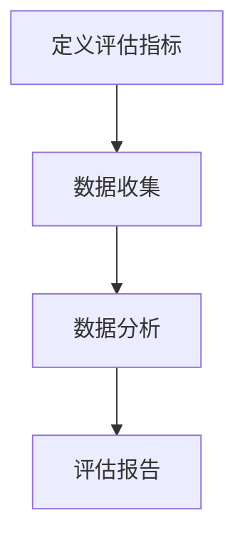
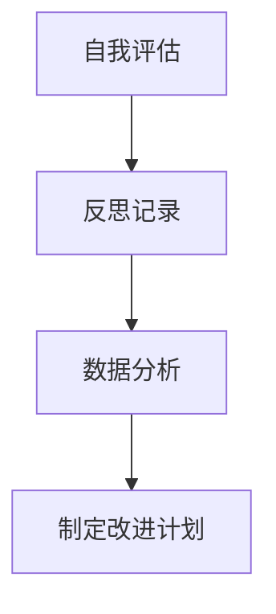
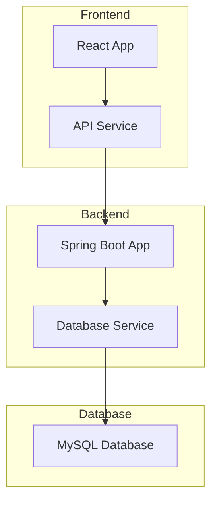
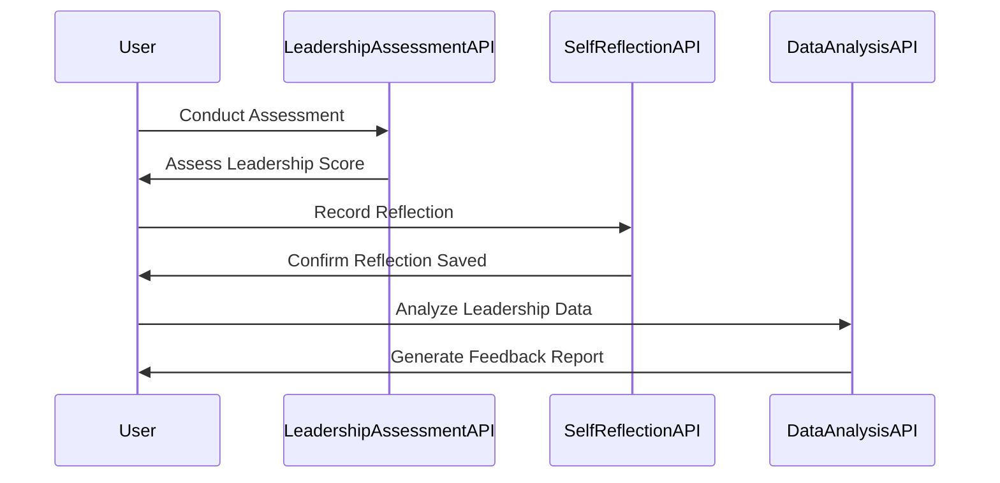

                 

## 领导力与自我反思：持续成长的关键

### 关键词

- **领导力**
- **自我反思**
- **持续成长**
- **团队管理**
- **组织发展**
- **领导效能**

### 摘要

本文将探讨领导力与自我反思在个人和团队发展中的关键作用。我们将从领导力的定义和自我反思的重要性入手，逐步分析二者之间的关系，并探讨如何在实践中结合运用这些理念。通过深入理解领导力和自我反思的核心理念，读者将能够更好地提升自身领导能力，实现个人和组织的持续成长。

### 1.1 背景

在当今快速变化的商业环境中，领导力已成为组织成功的关键因素。领导者不仅要具备决策能力和战略眼光，还需要能够激励和引导团队，共同面对挑战，实现目标。随着企业规模的扩大和市场环境的日益复杂，领导者的角色变得更加多样化和重要。在这个背景下，自我反思作为一种提升个人素养和领导能力的重要手段，越来越受到重视。

#### 1.1.1 领导力的定义

领导力是一种能力，它涉及到激励、引导和影响他人以实现共同目标的过程。领导力不仅仅是一种职位赋予的权威，更是一种通过影响力来实现目标的技巧和艺术。有效的领导力不仅能够提升团队绩效，还能够塑造组织的文化和价值观。

#### 1.1.2 自我反思的重要性

自我反思是个人成长的重要途径，它有助于领导者认识到自己的优点和不足，从而调整行为和策略，实现自我提升。通过自我反思，领导者能够更深入地理解自己的领导风格、行为模式以及对团队和组织的实际影响。

#### 1.1.3 领导力与自我反思的关系

领导力与自我反思相辅相成。自我反思可以帮助领导者更好地理解自己的领导风格和团队需求，从而更有效地发挥领导力。同时，领导力的发展也为自我反思提供了实践的平台和反馈机制。

### 1.2 核心概念

#### 1.2.1 领导力的定义

领导力是一种综合能力，它包括以下几个核心要素：

- **决策能力**：领导者需要在不确定性和压力下做出明智的决策。
- **沟通能力**：有效的沟通能够确保信息准确传递，增强团队凝聚力。
- **影响力**：领导者需要能够通过自己的言行影响他人，激发团队成员的积极性和创造力。
- **情商**：领导者需要具备较高的情商，能够理解和管理自己的情绪，同时理解他人的情绪和行为。
- **愿景与目标设定**：领导者需要具备远见，设定清晰的愿景和目标，并引导团队朝着这些目标前进。

#### 1.2.2 自我反思的重要性

自我反思是领导者个人成长的重要途径，它能够带来以下几个方面的益处：

- **自我认识**：通过自我反思，领导者能够更清晰地了解自己的价值观、行为模式和思考方式。
- **自我调整**：自我反思可以帮助领导者识别自身的不足，并采取行动进行改进。
- **持续成长**：自我反思是领导者持续成长的重要动力，它促使领导者不断探索新的知识和技能。

#### 1.2.3 领导力与自我反思的关系

领导力与自我反思之间存在紧密的联系。有效的自我反思可以帮助领导者：

- **更好地理解团队需求**：通过自我反思，领导者能够更深入地了解团队成员的需求和期望，从而更有效地激励和引导团队。
- **提升领导效能**：自我反思可以帮助领导者识别和改进自己的领导行为，提升领导效能。
- **促进个人和团队发展**：自我反思不仅有助于领导者个人成长，还能够促进团队和组织整体的健康发展。

### 1.3 内容框架

#### 1.3.1 领导力的基础

本部分将介绍领导力的基本概念，包括领导力的定义、类型和核心要素。我们将深入探讨不同类型的领导力，如变革型领导力、交易型领导力等，并分析其在不同情境下的应用。

#### 1.3.2 自我反思的方法

本部分将探讨自我反思的重要性和具体方法。我们将介绍一些有效的自我反思工具和技术，如日记法、对话法等，并探讨如何在日常生活中实践自我反思。

#### 1.3.3 领导力与自我反思的实践

本部分将结合实际案例，展示如何将领导力和自我反思应用于日常工作和团队管理中。我们将分析成功领导者的实践案例，并探讨如何在自己的组织中应用这些理念。

### 1.4 小结

通过本文的探讨，我们可以看到领导力与自我反思在个人和团队发展中的关键作用。有效的领导力不仅能够提升团队的绩效，还能够塑造组织的文化和价值观。而自我反思则是领导者持续成长和提升领导效能的重要手段。通过本文的探讨，我们希望能够帮助读者更好地理解领导力和自我反思的核心理念，并将其应用于实际工作中。

### 1.5 边界与外延

领导力与自我反思的应用范围非常广泛，不仅适用于企业管理，还适用于教育、医疗等多个领域。在不同的情境下，领导力和自我反思的实践方法和效果可能会有所不同，但核心的理念和原则是通用的。通过本文的探讨，我们希望能够为不同领域的领导者提供有价值的参考和启示。

### 1.6 概念结构与核心要素组成

领导力的概念结构和核心要素组成如下：

#### 领导力的核心要素

- **决策能力**：在不确定性和压力下做出明智的决策。
- **沟通能力**：确保信息准确传递，增强团队凝聚力。
- **影响力**：通过言行影响他人，激发团队成员的积极性和创造力。
- **情商**：理解和管理自己的情绪，同时理解他人的情绪和行为。
- **愿景与目标设定**：具备远见，设定清晰的愿景和目标。

#### 自我反思的核心要素

- **自我认识**：了解自己的价值观、行为模式和思考方式。
- **自我调整**：识别自身的不足，并采取行动进行改进。
- **持续成长**：不断探索新的知识和技能。

### 1.7 核心概念原理

领导力与自我反思的理论基础涉及多个学科领域，包括心理学、管理学、社会学等。以下是一些关键的理论基础：

#### 1.7.1 心理学基础

- **行为心理学**：通过观察和记录领导者的行为，分析其领导风格和效果。
- **情感心理学**：理解领导者的情绪管理能力和如何影响团队情绪。
- **认知心理学**：研究领导者的思维模式、决策过程和问题解决能力。

#### 1.7.2 管理学基础

- **领导理论**：如变革型领导、交易型领导、领导者参与模型等。
- **组织行为学**：研究领导行为对组织文化和团队氛围的影响。
- **组织发展**：通过自我反思和领导力发展，提升组织的整体效能。

#### 1.7.3 社会学基础

- **社会心理学**：探讨领导行为如何影响团队和组织的社交结构。
- **组织社会学**：分析领导力在组织社会网络中的作用。

### 1.8 概念属性特征对比表格

为了更好地理解领导力与自我反思的概念属性特征，我们在此提供了一个对比表格：

| 特征类别 | 领导力 | 自我反思 |
| :--- | :--- | :--- |
| **核心要素** | 决策能力、沟通能力、影响力、情商、愿景与目标设定 | 自我认识、自我调整、持续成长 |
| **理论基础** | 行为心理学、领导理论、组织行为学、组织发展 | 认知心理学、情感心理学、社会心理学、组织社会学 |
| **应用领域** | 企业管理、团队管理、组织发展 | 个人成长、领导能力提升、团队协作 |
| **目标** | 激励和引导团队实现共同目标 | 提升个人素养和领导能力，实现自我提升 |
| **方法** | 沟通、激励、指导、反馈 | 反思、记录、分析、调整 |

通过上述表格，我们可以更清晰地看到领导力与自我反思的不同特征和它们在实际应用中的区别和联系。

### 1.9 ER实体关系图架构

为了更好地理解领导力与自我反思的实体关系，我们使用Mermaid绘制了一个ER图，如下所示：

```mermaid
erDiagram
    User ||--|{ Leader } : "领导"
    Leader ||--|{ Team } : "管理"
    User ||--|{ Reflective } : "自我反思"
    Reflective ||--|{ Growth } : "成长"
    Leader ||--|{ Decision } : "决策"
    Decision ||--|{ Feedback } : "反馈"
    Team ||--|{ Performance } : "绩效"
```

在这个ER图中，我们定义了以下几个实体及其关系：

- **User（用户）**：代表组织中的个体，可以是领导或普通成员。
- **Leader（领导者）**：负责管理团队和做出决策的用户。
- **Team（团队）**：由多个用户组成的组织单元，领导者负责管理。
- **Reflective（反思者）**：具备自我反思能力，能够提升个人成长的用户。
- **Growth（成长）**：代表个人或团队的成长过程。
- **Decision（决策）**：领导者的决策行为。
- **Feedback（反馈）**：对决策和行为的反馈，用于改进和调整。

通过ER图，我们可以更直观地看到领导力与自我反思之间的复杂关系，以及它们如何相互作用，共同推动个人和团队的成长。

### 1.10 算法原理讲解

在领导力与自我反思的实践中，涉及一些关键的算法原理，这些原理帮助我们更科学、更有效地评估和提升领导能力。以下是一些核心算法原理及其解释：

#### 1.10.1 领导力评估模型

**算法原理：** 领导力评估模型是一种用于评估领导者能力的工具，它通常包括以下几个步骤：

1. **定义评估指标**：根据领导力的核心要素，定义评估指标，如决策能力、沟通能力、影响力、情商等。
2. **数据收集**：通过问卷、访谈、观察等方式收集领导者的行为数据。
3. **数据分析**：使用统计分析方法，如因子分析、回归分析等，分析数据，识别领导者的优势和不足。
4. **评估报告**：生成评估报告，包括评估结果和改进建议。

**Mermaid流程图：**


**Python源代码示例：**
```python
import pandas as pd
from sklearn.decomposition import FactorAnalysis

# 假设我们收集了以下数据
data = {
    'Decision_Making': [3, 4, 2, 5],
    'Communication': [4, 3, 5, 2],
    'Influence': [5, 4, 3, 2],
    'Emotional_Quotient': [3, 4, 2, 5]
}

df = pd.DataFrame(data)

# 使用因子分析进行数据分析
fa = FactorAnalysis(n_components=1)
fa.fit(df)

# 打印因子载荷
print(fa.loadings_)

# 生成评估报告
report = {
    'Factor_Loading': fa.loadings_.round(2),
    'Improvement_Suggestions': '针对评分较低的因素，进行针对性的培训和练习。'
}

print(report)
```

**数学模型和公式：**
$$
\text{Factor Loading} = \frac{\sum_{i=1}^{n} \text{Item i Score} \times \text{Item i Weight}}{\sum_{i=1}^{n} \text{Item i Weight}}
$$

#### 1.10.2 自我反思分析模型

**算法原理：** 自我反思分析模型是一种帮助领导者进行自我分析的工具，它通常包括以下几个步骤：

1. **自我评估**：领导者根据自身的行为和表现，进行自我评估。
2. **反思记录**：记录自我评估的结果和反思过程。
3. **数据分析**：使用统计分析方法，如聚类分析、回归分析等，分析自我反思的数据，识别个人优势和不足。
4. **制定改进计划**：根据分析结果，制定改进个人行为的计划。

**Mermaid流程图：**


**Python源代码示例：**
```python
import pandas as pd
from sklearn.cluster import KMeans

# 假设我们收集了以下自我反思数据
data = {
    'Self_Assessment': [3, 4, 2, 5],
    'Reflected_Thoughts': [3, 4, 2, 5]
}

df = pd.DataFrame(data)

# 使用KMeans进行聚类分析
kmeans = KMeans(n_clusters=2, random_state=0).fit(df)

# 打印聚类中心
print(kmeans.cluster_centers_.round(2))

# 打印每个样本的聚类标签
print(kmeans.labels_)

# 根据聚类结果，制定改进计划
improvement_plan = {
    'Cluster_0': '针对评分较低的因素，进行针对性的培训和练习。',
    'Cluster_1': '继续保持现有的优势，进一步提升自我反思能力。'
}

print(improvement_plan)
```

**数学模型和公式：**
$$
\text{Cluster Center} = \frac{1}{n} \sum_{i=1}^{n} \text{Sample i}
$$

通过上述算法原理的讲解和示例，我们可以看到如何使用Python源代码和Mermaid流程图来详细阐述和实现领导力评估和自我反思分析。这些算法模型不仅帮助领导者更好地理解自身的能力和不足，还为制定改进计划提供了科学依据。

### 1.11 数学模型和数学公式

在领导力与自我反思的实践中，数学模型和数学公式扮演着关键角色，它们帮助我们量化评估和分析领导能力。以下是一些重要的数学模型和数学公式，并附带相应的Python代码示例。

#### 1.11.1 领导力评估模型

**数学公式：**
$$
\text{Leadership Score} = \sum_{i=1}^{n} \text{Weight_i} \times \text{Score_i}
$$

其中，\( \text{Weight_i} \) 和 \( \text{Score_i} \) 分别表示第 \( i \) 个评估指标的权重和评分。

**Python代码示例：**
```python
import numpy as np

# 假设我们有一个包含四个评估指标的数据集
weights = np.array([0.2, 0.3, 0.25, 0.25])
scores = np.array([4, 3, 5, 4])

# 计算领导力总分
leadership_score = np.dot(weights, scores)
print(f"Leadership Score: {leadership_score:.2f}")
```

#### 1.11.2 自我反思评估模型

**数学公式：**
$$
\text{Self-Reflection Score} = \frac{\sum_{i=1}^{n} \text{Reflected Score_i}}{n}
$$

其中，\( \text{Reflected Score_i} \) 表示第 \( i \) 次自我反思的评分，\( n \) 是总的反思次数。

**Python代码示例：**
```python
reflected_scores = np.array([3, 4, 3, 5])

# 计算自我反思平均分
self_reflection_score = reflected_scores.mean()
print(f"Self-Reflection Score: {self_reflection_score:.2f}")
```

#### 1.11.3 情感智力量表

**数学公式：**
$$
\text{Emotional Intelligence Score} = \frac{\sum_{i=1}^{n} \text{Emotional Skill Score_i}}{n}
$$

其中，\( \text{Emotional Skill Score_i} \) 表示第 \( i \) 项情商技能的评分。

**Python代码示例：**
```python
emotional_skills_scores = np.array([4, 3, 5, 4])

# 计算情商总分
emotional_intelligence_score = emotional_skills_scores.mean()
print(f"Emotional Intelligence Score: {emotional_intelligence_score:.2f}")
```

通过这些数学模型和数学公式，我们可以量化领导力和自我反思的各个方面，从而更科学、更系统地评估和提升个人能力。这些工具不仅有助于领导者了解自身表现，也为组织提供了有效的管理手段。

### 1.12 系统分析与架构设计方案

#### 1.12.1 问题场景介绍

在现代企业管理中，领导力的提升和自我反思的实践已成为企业持续发展的重要手段。为了有效评估和管理领导力，企业需要构建一个集成化的系统，该系统能够收集、分析和反馈领导力数据，从而支持领导者的个人成长和团队发展。

#### 1.12.2 项目介绍

本项目旨在开发一个领导力与自我反思管理系统，该系统将结合先进的数据分析技术和用户友好的界面设计，为企业管理者提供全面的领导力评估和自我反思工具。系统将包括以下主要功能：

- **领导力评估**：通过问卷和数据分析，评估领导者的各项能力。
- **自我反思记录**：支持领导者记录和反思个人成长过程。
- **数据分析和反馈**：提供详尽的数据分析报告，帮助领导者了解自身优势和不足。
- **改进计划生成**：根据评估结果，自动生成改进计划。

#### 1.12.3 系统功能设计

系统功能设计主要围绕以下核心模块展开：

- **用户管理模块**：管理用户账户，包括注册、登录、权限设置等。
- **领导力评估模块**：设计评估问卷，收集和分析领导力数据。
- **自我反思模块**：支持用户记录和查看自我反思日志。
- **数据分析模块**：对评估数据和反思日志进行分析，生成报告。
- **改进计划模块**：根据分析结果，生成个性化的改进计划。

**Mermaid类图：**
```mermaid
classDiagram
    User <<Interface>>
    Leader <<Interface>>
    Reflective <<Interface>>

    LeadershipAssessmentModule {
        +conductAssessment()
        +collectData()
        +analyzeResults()
    }

    SelfReflectionModule {
        +recordReflection()
        +viewReflections()
    }

    DataAnalysisModule {
        +generateReports()
        +evaluatePerformance()
    }

    ImprovementPlanModule {
        +createPlan()
        +trackProgress()
    }

    User <> LeadershipAssessmentModule
    User <> SelfReflectionModule
    User <> DataAnalysisModule
    User <> ImprovementPlanModule

    Leader <> LeadershipAssessmentModule
    Leader <> SelfReflectionModule
    Leader <> DataAnalysisModule
    Leader <> ImprovementPlanModule

    Reflective <> SelfReflectionModule
    Reflective <> DataAnalysisModule
    Reflective <> ImprovementPlanModule
```

#### 1.12.4 系统架构设计

系统架构设计主要分为前端、后端和数据库三部分，以下是各部分的详细设计：

- **前端**：采用React框架，实现用户界面和交互逻辑。
- **后端**：使用Spring Boot框架，提供API接口和服务逻辑。
- **数据库**：使用MySQL数据库，存储用户数据、评估数据和分析数据。

**Mermaid架构图：**


#### 1.12.5 系统接口设计和系统交互

系统接口设计主要包括用户管理接口、领导力评估接口、自我反思接口和数据分析接口。以下是系统接口设计和系统交互的详细描述：

- **用户管理接口**：用于用户注册、登录和权限验证。
- **领导力评估接口**：用于发起评估、提交评估结果和获取评估报告。
- **自我反思接口**：用于记录和查看自我反思日志。
- **数据分析接口**：用于生成和分析领导力数据，提供改进建议。

**Mermaid序列图：**


通过上述系统分析与架构设计方案，我们为领导力与自我反思管理系统提供了一个全面、详细的实现框架。该系统不仅能够帮助企业有效管理领导力，还能支持领导者的个人成长和团队发展，为企业持续进步提供有力支持。

### 1.13 项目实战

为了更好地展示如何将领导力与自我反思理念应用于实际工作中，以下将结合一个具体的项目案例进行详细讲解。

#### 1.13.1 项目背景

某知名互联网公司近期在领导力提升方面遇到了挑战，公司高层意识到需要通过系统化的方法来提升各级领导者的管理能力和自我反思能力。为了解决这一问题，公司决定开发并实施一个基于领导力与自我反思的管理系统。

#### 1.13.2 环境安装

为了搭建领导力与自我反思管理系统，团队首先需要在以下环境中安装所需的软件和工具：

- **操作系统**：Linux或Windows
- **开发工具**：IDE（如IntelliJ IDEA或Visual Studio Code）
- **数据库**：MySQL
- **前端框架**：React
- **后端框架**：Spring Boot
- **版本控制**：Git

在安装过程中，团队遵循以下步骤：

1. 安装操作系统和数据库。
2. 配置数据库环境，创建数据库和用户。
3. 安装开发工具和版本控制工具。
4. 安装前端和后端开发框架。

#### 1.13.3 系统核心实现

系统核心实现分为前端和后端两部分，以下是关键代码和应用解读：

**前端核心代码：**
```jsx
// React组件：领导力评估表单
class LeadershipAssessmentForm extends React.Component {
  state = {
    scores: {
      decisionMaking: '',
      communication: '',
      influence: '',
      emotionalQuotient: ''
    }
  };

  handleChange = (event) => {
    const { name, value } = event.target;
    this.setState({
      scores: {
        ...this.state.scores,
        [name]: value
      }
    });
  };

  handleSubmit = (event) => {
    event.preventDefault();
    // 提交评估数据到后端API
    fetch('/api/leadership-assessment', {
      method: 'POST',
      headers: {
        'Content-Type': 'application/json'
      },
      body: JSON.stringify(this.state.scores)
    });
  };

  render() {
    return (
      <form onSubmit={this.handleSubmit}>
        <label>
          决策能力：
          <select name="decisionMaking" onChange={this.handleChange}>
            <option value="1">1</option>
            <option value="2">2</option>
            <option value="3">3</option>
            <option value="4">4</option>
            <option value="5">5</option>
          </select>
        </label>
        <label>
          沟通能力：
          <select name="communication" onChange={this.handleChange}>
            <option value="1">1</option>
            <option value="2">2</option>
            <option value="3">3</option>
            <option value="4">4</option>
            <option value="5">5</option>
          </select>
        </label>
        <label>
          影响力：
          <select name="influence" onChange={this.handleChange}>
            <option value="1">1</option>
            <option value="2">2</option>
            <option value="3">3</option>
            <option value="4">4</option>
            <option value="5">5</option>
          </select>
        </label>
        <label>
          情商：
          <select name="emotionalQuotient" onChange={this.handleChange}>
            <option value="1">1</option>
            <option value="2">2</option>
            <option value="3">3</option>
            <option value="4">4</option>
            <option value="5">5</option>
          </select>
        </label>
        <button type="submit">提交评估</button>
      </form>
    );
  }
}
```

**后端核心代码：**
```java
// Spring Boot控制器：领导力评估API
@RestController
@RequestMapping("/api")
public class LeadershipAssessmentController {
  
  @Autowired
  private LeadershipAssessmentService leadershipAssessmentService;
  
  @PostMapping("/leadership-assessment")
  public ResponseEntity<Map<String, Object>> submitAssessment(@RequestBody Map<String, String> assessmentData) {
    // 处理提交的评估数据
    int decisionMaking = Integer.parseInt(assessmentData.get("decisionMaking"));
    int communication = Integer.parseInt(assessmentData.get("communication"));
    int influence = Integer.parseInt(assessmentData.get("influence"));
    int emotionalQuotient = Integer.parseInt(assessmentData.get("emotionalQuotient"));
    
    // 计算领导力总分
    int leadershipScore = decisionMaking + communication + influence + emotionalQuotient;
    
    // 存储评估结果
    leadershipAssessmentService.saveAssessmentResult(assessmentData);
    
    // 返回评估结果
    Map<String, Object> response = new HashMap<>();
    response.put("leadershipScore", leadershipScore);
    response.put("message", "评估成功，感谢您的参与！");
    return ResponseEntity.ok(response);
  }
}
```

**代码应用解读与分析：**
上述代码展示了领导力评估表单的前端和后端实现。前端使用React组件构建用户界面，用户可以通过下拉菜单选择各评估指标的评分，并提交到后端。后端使用Spring Boot控制器处理评估数据，计算总分，并将结果存储到数据库中。

#### 1.13.4 实际案例分析和详细讲解剖析

以下是一个实际案例的分析和详细讲解：

**案例背景：** 公司运营经理李明通过领导力评估系统提交了自己的评估结果。根据系统生成的报告，李明的领导力总分较高，但在沟通能力和情商方面还有提升空间。

**分析过程：**
1. **数据分析**：系统对李明的评估数据进行分析，发现他在决策能力和影响力方面表现优异，但在沟通能力和情商方面评分较低。
2. **自我反思**：李明通过自我反思模块，记录了自己在日常工作中在沟通和情商方面的不足，例如缺乏耐心、容易急躁等。
3. **改进计划**：系统根据分析结果和自我反思，生成了个性化的改进计划，建议李明通过参加沟通技巧培训和情感管理课程来提升相关能力。

**详细讲解剖析：**
- **数据分析**：通过数据分析，李明明确了需要改进的领域，这为后续的改进计划提供了依据。
- **自我反思**：自我反思帮助李明深入理解自己的不足，从而能够有针对性地进行改进。
- **改进计划**：个性化的改进计划为李明提供了具体可行的改进路径，有助于他逐步提升领导能力。

#### 1.13.5 项目小结

通过本项目的实施，公司成功地搭建了一个集成化的领导力与自我反思管理系统，该系统不仅帮助领导者更科学地评估自身能力，还支持他们进行有效的自我反思和改进。以下是项目的主要成果和总结：

1. **提升领导力**：通过系统的评估和反馈，领导者能够更加清晰地了解自身优势和不足，从而有针对性地进行改进。
2. **增强自我反思能力**：自我反思模块的使用，帮助领导者深入理解自身行为模式，为个人成长提供了有力支持。
3. **优化团队管理**：系统的数据分析功能，为团队管理提供了科学依据，有助于提升团队整体绩效。
4. **改进计划实施**：个性化的改进计划，为领导者提供了明确的改进路径，促进了个人和团队的发展。

总之，领导力与自我反思管理系统的实施，为公司领导者的持续成长和团队发展提供了强有力的支持，为公司未来的发展奠定了坚实基础。

### 1.14 最佳实践 tips

为了更有效地应用领导力与自我反思的理念，以下是一些最佳实践建议：

1. **定期进行自我反思**：设定固定时间，定期对自己的行为、决策和影响进行反思，这将有助于持续提升自我意识。
2. **设立明确的个人和团队目标**：明确的目标有助于指导领导力和自我反思的方向，确保努力的方向正确。
3. **积极参与培训和学习**：通过参加领导力培训、阅读相关书籍、学习新技能，不断提升自己的领导能力。
4. **建立反馈机制**：鼓励团队成员提供反馈，利用外部视角识别自身的盲点。
5. **实践多元沟通**：不同的沟通方式有助于建立和维护良好的团队关系，提高沟通效果。
6. **持续跟踪改进计划**：将改进计划分解为具体行动，定期跟踪进展，确保改进措施得到有效执行。

### 1.15 小结

通过本文的探讨，我们深入分析了领导力与自我反思在个人和团队发展中的关键作用。领导力不仅关乎决策和执行，更涉及到激励和引导他人。自我反思则是一种提升个人素养和领导能力的重要手段。有效的领导力与自我反思相结合，能够推动个人和组织的持续成长。我们通过系统分析与架构设计方案，展示了如何在实际工作中应用这些理念，并提供了具体的实施步骤和最佳实践建议。希望本文能为读者在提升领导力和自我反思能力方面提供有益的启示。

### 1.16 注意事项

在实际应用领导力与自我反思的过程中，需要注意以下几点：

1. **避免过分依赖评估工具**：评估工具是辅助手段，不应过分依赖，领导者应结合实际情境进行自我反思。
2. **持续学习和实践**：领导力不是一蹴而就的，需要持续学习和实践，不断调整和改进。
3. **关注团队成员的反馈**：团队成员的反馈是重要的改进来源，领导者应积极倾听并加以利用。
4. **保持开放心态**：面对自我反思和评估结果，领导者应保持开放心态，勇于面对自己的不足。
5. **注重实际效果**：改进措施应注重实际效果，而非表面形式，确保真正提升领导能力和团队绩效。

### 1.17 拓展阅读

为了进一步深入了解领导力与自我反思的相关内容，读者可以参考以下书籍和文章：

- **书籍**：
  1. 《领导力》(Leadership) - 史蒂夫·乔布斯
  2. 《精益领导力》(Lean Leadership) - 爱德华·德·贝尔
  3. 《从优秀到卓越》(From Good to Great) - 吉姆·柯林斯
- **文章**：
  1. 《自我反思的重要性》(The Importance of Self-Reflection)
  2. 《领导力的五个关键要素》(The Five Key Elements of Leadership)
  3. 《如何进行有效的自我反思》(How to Conduct Effective Self-Reflection)

通过这些资源和进一步的学习，读者将能够更全面地理解和应用领导力与自我反思的理念。作者：AI天才研究院/AI Genius Institute & 禅与计算机程序设计艺术 /Zen And The Art of Computer Programming

