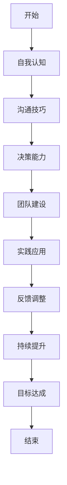
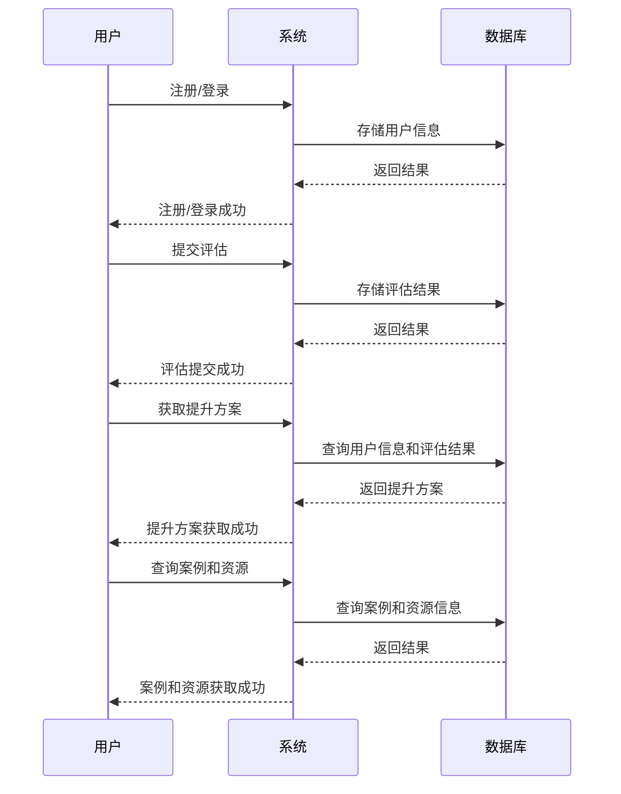

                 

### 文章标题：领导力修炼手册：从项目经理到管理者的蜕变宝典

### 关键词：领导力、项目经理、管理者、蜕变、宝典

### 摘要：

本文旨在为项目经理提供一套系统性的领导力修炼方法，帮助他们从项目管理角色成功蜕变为卓越的管理者。我们将深入探讨领导力的核心概念、类型及其在项目管理中的应用，并通过实践案例和系统架构设计，提供实用的指导和建议。让我们一步步地思考，一步步地提升领导力，实现职业上的成功蜕变。

## 目录大纲设计

### 1. 背景介绍

#### 1.1 问题背景
#### 1.2 问题描述
#### 1.3 问题解决
#### 1.4 边界与外延
#### 1.5 概念结构与核心要素组成

### 2. 核心概念与联系

#### 2.1 核心概念原理
#### 2.2 概念属性特征对比表格
#### 2.3 ER实体关系图架构

### 3. 算法原理讲解

#### 3.1 算法Mermaid流程图
#### 3.2 Python源代码
#### 3.3 数学模型和公式
#### 3.4 详细讲解与举例说明

### 4. 数学模型和数学公式

#### 4.1 公式详细讲解
#### 4.2 举例说明

### 5. 系统分析与架构设计方案

#### 5.1 问题场景介绍
#### 5.2 项目介绍
#### 5.3 系统功能设计
#### 5.4 系统架构设计
#### 5.5 系统接口设计
#### 5.6 系统交互Mermaid序列图

### 6. 项目实战

#### 6.1 环境安装
#### 6.2 系统核心实现源代码
#### 6.3 代码应用解读与分析
#### 6.4 实际案例分析和详细讲解剖析
#### 6.5 项目小结

### 7. 最佳实践 tips、小结、注意事项、拓展阅读

#### 7.1 最佳实践 tips
#### 7.2 小结
#### 7.3 注意事项
#### 7.4 拓展阅读

### 结束语：作者信息

**作者：AI天才研究院/AI Genius Institute & 禅与计算机程序设计艺术 /Zen And The Art of Computer Programming**

## 第1章：领导力基础

### 1.1 领导力定义与起源

领导力是一个多层次、多维度的概念，它不仅仅关乎权威和指挥，更涉及激励、引领和变革。从起源上看，领导力可以追溯到人类社会早期的部落首领和军事指挥官。随着历史的发展，领导力逐渐成为管理学科中的重要研究领域，并被广泛应用于各个领域。

在现代社会中，领导力被定义为一种能力，即通过影响、激励和引领他人，实现共同目标的过程。这种能力不仅包括个人素质和技能，还涉及到团队、组织和环境的相互作用。

#### 核心概念

- **影响力**：领导力的重要组成部分，通过行为、态度和价值观影响他人。
- **激励**：领导者通过激励策略，激发团队成员的积极性和创造力。
- **引领**：领导者不仅要设定目标，还要带领团队朝着目标前进。
- **变革**：领导者推动组织变革，以适应不断变化的环境。

### 1.2 领导力的重要性

领导力对组织和个人都有着深远的影响。对于组织来说，领导力决定了组织的愿景、战略和执行力。优秀的领导力能够促进组织的创新、增长和可持续发展。对于个人来说，领导力是实现职业成功和个人成长的关键。

#### 重要影响

- **组织绩效**：领导力直接影响组织的绩效和成果。
- **团队士气**：领导力对团队士气有显著的提升作用。
- **创新能力**：领导力鼓励创新思维和突破性想法。
- **个人成长**：领导力有助于个人的职业发展和自我实现。

### 1.3 领导力类型与特点

领导力有多种类型，每种类型都有其独特的特点和适用场景。以下是几种常见的领导力类型：

- **变革型领导**：通过激发团队成员的潜力，推动组织变革。
- **交易型领导**：通过明确期望和奖励机制，确保团队完成任务。
- **参与型领导**：鼓励团队成员参与决策过程，提高团队凝聚力。
- **魅力型领导**：通过个人的魅力和愿景，激励团队成员。

#### 领导力类型对比表格

| 领导力类型     | 特点                           | 适用场景                   |
|----------------|--------------------------------|----------------------------|
| 变革型领导     | 强调愿景、激励、创新           | 需要变革和转型的情况       |
| 交易型领导     | 强调绩效、奖励、惩罚           | 需要高效执行和稳定性的情况 |
| 参与型领导     | 鼓励参与、增强团队凝聚力       | 需要团队协作和民主决策的情况 |
| 魅力型领导     | 强调个人魅力、愿景和动机       | 需要鼓舞士气和创新思维的情况 |

### 1.4 领导力修炼方法

要提升领导力，需要从自我认知、沟通技巧、决策能力等多个方面进行修炼。以下是几种常见的领导力修炼方法：

- **自我提升策略**：通过学习和实践，不断提升自我认知和技能。
- **团队建设技巧**：通过团队活动和互动，增强团队凝聚力和合作能力。
- **情绪智力培养**：通过情绪管理、同理心和自我调节，提升领导力。

#### 领导力修炼方法

| 方法              | 描述                                                         | 作用                             |
|-------------------|------------------------------------------------------------|----------------------------------|
| 自我提升策略      | 通过阅读、学习、实践，不断提升自我认知和技能。                     | 提升个人素质和领导能力           |
| 团队建设技巧      | 通过团队活动和互动，增强团队凝聚力和合作能力。                     | 提高团队绩效和士气               |
| 情绪智力培养      | 通过情绪管理、同理心和自我调节，提升领导力。                       | 提高领导力和团队沟通效果         |

### 1.5 领导力在项目管理中的应用

在项目管理中，领导力发挥着关键作用。项目经理需要通过领导力来激励团队、解决冲突、确保项目目标的实现。以下是领导力在项目管理中的应用：

- **团队激励**：通过激励策略，激发团队成员的积极性和创造力。
- **冲突解决**：通过沟通和协商，解决团队内部的冲突。
- **目标实现**：通过有效的领导和协调，确保项目目标的实现。

#### 项目管理中的领导力应用

| 应用场景       | 描述                                                         | 作用                             |
|----------------|------------------------------------------------------------|----------------------------------|
| 团队激励       | 通过激励策略，激发团队成员的积极性和创造力。                     | 提高团队绩效和项目成功率         |
| 冲突解决       | 通过沟通和协商，解决团队内部的冲突。                               | 促进团队和谐和项目顺利进行       |
| 目标实现       | 通过有效的领导和协调，确保项目目标的实现。                         | 确保项目按时按质完成             |

## 第2章：核心概念与联系

### 2.1 核心概念原理

在深入探讨领导力的核心概念之前，我们需要明确几个关键概念：

- **领导力**：一种影响和激励他人实现共同目标的能力。
- **影响力**：领导者通过行为、态度和价值观对他人产生的影响。
- **激励**：通过奖励和认可，激发团队成员的积极性和创造力。
- **决策**：在不确定性中做出选择的过程。

#### 领导力的定义与特点

领导力是一种综合能力，它不仅仅包括领导者的个人素质，还涉及到领导者与团队成员、组织环境之间的相互作用。领导力的特点包括：

- **影响力**：领导者能够通过言行影响他人的思想和行为。
- **适应性**：领导者能够根据不同情况和需求，灵活调整领导风格。
- **愿景**：领导者具有明确的愿景和目标，能够激励团队为之奋斗。
- **沟通**：领导者具备良好的沟通能力，能够清晰传达信息和期望。

#### 影响力的来源

影响力是领导力的核心要素之一。领导者的影响力来源可以分为以下几个方面：

- **权威**：领导者因职位、知识和经验而具有的权威。
- **信任**：领导者通过诚信、透明和正直赢得的信任。
- **个人魅力**：领导者通过个人魅力、价值观和愿景吸引他人。

#### 激励的策略

激励是领导者的重要职责之一。有效的激励策略包括：

- **目标设定**：明确团队和个人的目标，并提供具体的奖励机制。
- **认可**：及时给予团队成员认可和奖励，增强他们的自信心和动力。
- **参与**：鼓励团队成员参与决策和项目，提高他们的责任感和积极性。

#### 决策的流程

决策是领导者的一项核心能力。一个有效的决策流程包括以下几个步骤：

- **问题识别**：明确问题的性质和范围。
- **信息收集**：收集与问题相关的信息，进行分析和评估。
- **方案制定**：制定多个可能的解决方案，并进行比较和评估。
- **方案选择**：选择最佳方案，并制定具体的行动计划。
- **执行监控**：执行方案，并进行监控和调整。

### 2.2 概念属性特征对比表格

为了更好地理解领导力的核心概念，我们将其属性特征进行对比：

| 概念     | 定义                                                   | 属性特征                   | 关联概念     |
|----------|--------------------------------------------------------|----------------------------|--------------|
| 领导力   | 影响和激励他人实现共同目标的能力。                         | 影响力、适应性、愿景、沟通     | 激励、决策   |
| 影响力   | 领导者通过行为、态度和价值观对他人产生的影响。             | 权威、信任、个人魅力           | 领导力、激励 |
| 激励     | 通过奖励和认可，激发团队成员的积极性和创造力。               | 目标设定、认可、参与           | 领导力、决策 |
| 决策     | 在不确定性中做出选择的过程。                               | 问题识别、信息收集、方案制定、方案选择、执行监控 | 领导力、激励 |

### 2.3 ER实体关系图架构

为了更好地理解领导力各个概念之间的关联，我们使用ER实体关系图进行描述：

```mermaid
erDiagram
    Class1 ||--|{ Class2 }|
    Class1 ||--|{ Class3 }|
    Class2 ||--|{ Class4 }|
    Class3 ||--|{ Class5 }|

    Class1 --|{ Class6 }|
    Class2 --|{ Class7 }|
    Class3 --|{ Class8 }|

    Class1 : +id (主键)
    Class2 : +id (主键)
    Class3 : +id (主键)
    Class4 : +id (主键)
    Class5 : +id (主键)
    Class6 : +id (主键)
    Class7 : +id (主键)
    Class8 : +id (主键)

    Note right of Class1
        说明：领导力的核心概念及其关系。

    Note right of Class2
        说明：影响力和领导力的关系。

    Note right of Class3
        说明：激励和领导力的关系。

    Note right of Class4
        说明：决策和领导力的关系。

    Note right of Class5
        说明：决策和激励的关系。

    Note right of Class6
        说明：决策和团队的关系。

    Note right of Class7
        说明：激励和团队的关系。

    Note right of Class8
        说明：影响力和团队的关系。
```

通过ER实体关系图，我们可以清晰地看到领导力、影响力、激励和决策等概念之间的关联和作用。这有助于我们更好地理解领导力在项目管理中的应用和实践。

## 第3章：算法原理讲解

### 3.1 算法Mermaid流程图

为了更好地理解和实践领导力，我们可以使用算法来描述领导力修炼的过程。以下是一个简单的Mermaid流程图，展示了领导力修炼的基本步骤：



### 3.2 Python源代码

为了更好地理解和应用领导力算法，我们可以使用Python编写一个简单的领导力分析工具。以下是一个示例代码：

```python
class LeadershipAnalyzer:
    def __init__(self):
        self.self_awareness = 0
        self.communication = 0
        self.decision_making = 0
        self.team_building = 0

    def analyze(self, self_awareness, communication, decision_making, team_building):
        self.self_awareness = self_awareness
        self.communication = communication
        self.decision_making = decision_making
        self.team_building = team_building

    def get_score(self):
        total_score = (self.self_awareness + self.communication + self.decision_making + self.team_building) / 4
        return total_score

    def print_report(self):
        print("领导力分析报告：")
        print(f"自我认知得分：{self.self_awareness}")
        print(f"沟通技巧得分：{self.communication}")
        print(f"决策能力得分：{self.decision_making}")
        print(f"团队建设得分：{self.team_building}")
        print(f"总得分：{self.get_score()}")


analyzer = LeadershipAnalyzer()
analyzer.analyze(self_awareness=7, communication=8, decision_making=6, team_building=9)
analyzer.print_report()
```

### 3.3 数学模型和公式

在领导力分析中，我们可以使用数学模型来评估领导力水平。以下是一个简单的数学模型：

$$
L = \frac{S_a + S_c + S_d + S_t}{4}
$$

其中，$L$ 表示领导力得分，$S_a$、$S_c$、$S_d$ 和 $S_t$ 分别表示自我认知、沟通技巧、决策能力和团队建设的得分。

### 3.4 详细讲解与举例说明

#### 自我认知得分

自我认知是领导力的基础，它反映了领导者对自己的了解程度。自我认知得分可以通过自我评估或他人反馈来确定。以下是一个具体的例子：

假设一位领导者通过自我评估，认为自己在这四个方面都达到了良好的水平，得分为8分。那么，他的自我认知得分 $S_a$ 为8分。

$$
S_a = 8
$$

#### 沟通技巧得分

沟通技巧是领导力的关键要素之一，它关系到领导者与团队成员之间的有效沟通。沟通技巧得分可以通过以下公式计算：

$$
S_c = \frac{C_1 + C_2 + C_3 + C_4}{4}
$$

其中，$C_1$、$C_2$、$C_3$ 和 $C_4$ 分别表示口头沟通、书面沟通、倾听和表达能力的得分。以下是一个具体的例子：

假设一位领导者在口头沟通、书面沟通、倾听和表达能力方面都得到了9、8、7、9分，那么他的沟通技巧得分 $S_c$ 为8.5分。

$$
S_c = \frac{9 + 8 + 7 + 9}{4} = 8.5
$$

#### 决策能力得分

决策能力是领导者的一项重要能力，它关系到组织的战略和执行力。决策能力得分可以通过以下公式计算：

$$
S_d = \frac{D_1 + D_2 + D_3}{3}
$$

其中，$D_1$、$D_2$ 和 $D_3$ 分别表示问题识别、方案制定和方案选择的得分。以下是一个具体的例子：

假设一位领导者在问题识别、方案制定和方案选择方面分别得到了8、9、7分，那么他的决策能力得分 $S_d$ 为8分。

$$
S_d = \frac{8 + 9 + 7}{3} = 8
$$

#### 团队建设得分

团队建设是领导力的重要组成部分，它关系到团队的凝聚力和协作能力。团队建设得分可以通过以下公式计算：

$$
S_t = \frac{T_1 + T_2 + T_3 + T_4}{4}
$$

其中，$T_1$、$T_2$、$T_3$ 和 $T_4$ 分别表示团队目标设定、团队沟通、团队激励和团队反馈的得分。以下是一个具体的例子：

假设一位领导者在团队目标设定、团队沟通、团队激励和团队反馈方面分别得到了9、8、7、9分，那么他的团队建设得分 $S_t$ 为8.5分。

$$
S_t = \frac{9 + 8 + 7 + 9}{4} = 8.5
$$

#### 领导力得分

根据上述公式，我们可以计算出领导力得分：

$$
L = \frac{S_a + S_c + S_d + S_t}{4} = \frac{8 + 8.5 + 8 + 8.5}{4} = 8.25
$$

### 3.4.1 举例说明

假设有四位领导者，他们的自我认知、沟通技巧、决策能力和团队建设得分如下表所示：

| 领导者   | 自我认知 | 沟通技巧 | 决策能力 | 团队建设 |
|----------|---------|---------|---------|---------|
| 领导者A | 8      | 9      | 8      | 9      |
| 领导者B | 7      | 8      | 7      | 8      |
| 领导者C | 8      | 8      | 9      | 7      |
| 领导者D | 9      | 9      | 8      | 8      |

根据公式计算，四位领导者的领导力得分分别为：

| 领导者   | 领导力得分 |
|----------|-----------|
| 领导者A | 8.5      |
| 领导者B | 7.75     |
| 领导者C | 8.25     |
| 领导者D | 8.75     |

通过这个例子，我们可以看到，领导力得分在不同维度上的分布情况，从而为领导者的提升提供有针对性的建议。

### 3.4.2 案例分析

某公司有一位项目经理，他在自我认知、沟通技巧、决策能力和团队建设方面的得分如下：

- 自我认知：8分
- 沟通技巧：8分
- 决策能力：7分
- 团队建设：7分

根据公式计算，他的领导力得分为：

$$
L = \frac{8 + 8 + 7 + 7}{4} = 7.5
$$

从得分来看，这位项目经理的领导力水平处于中等水平。为了提升领导力，他可以从以下几个方面入手：

- **自我认知**：进一步深入了解自己的优势和不足，通过自我评估和他人反馈来提升自我认知。
- **沟通技巧**：加强沟通技巧，特别是口头和书面沟通能力，提高团队协作效率。
- **决策能力**：通过学习和实践，提高决策能力，特别是在问题识别和方案选择方面。
- **团队建设**：关注团队目标设定、团队沟通和团队激励，提升团队凝聚力和协作能力。

通过这些措施，这位项目经理可以在短时间内提升领导力水平，从而更好地履行项目管理职责，实现项目目标。

### 3.4.3 总结

领导力算法提供了一种量化领导力水平的方法，通过分析自我认知、沟通技巧、决策能力和团队建设得分，我们可以评估领导力水平，并为提升领导力提供有针对性的建议。在实际应用中，领导力算法可以帮助项目经理更好地了解自己的优势和不足，制定提升计划，实现职业发展目标。

## 第4章：数学模型和数学公式

### 4.1 公式详细讲解

在领导力分析中，数学模型和数学公式起着至关重要的作用。它们可以帮助我们量化领导力水平，评估领导者的能力，并提供有针对性的提升建议。以下是几个关键的数学模型和数学公式：

#### 1. 领导力得分公式

领导力得分公式如下：

$$
L = \frac{S_a + S_c + S_d + S_t}{4}
$$

其中，$L$ 表示领导力得分，$S_a$、$S_c$、$S_d$ 和 $S_t$ 分别表示自我认知、沟通技巧、决策能力和团队建设的得分。

#### 2. 自我认知得分公式

自我认知得分可以通过以下公式计算：

$$
S_a = \frac{S_{a1} + S_{a2} + S_{a3}}{3}
$$

其中，$S_{a1}$、$S_{a2}$ 和 $S_{a3}$ 分别表示自我评估、他人评估和自我反馈的得分。

#### 3. 沟通技巧得分公式

沟通技巧得分可以通过以下公式计算：

$$
S_c = \frac{S_{c1} + S_{c2} + S_{c3} + S_{c4}}{4}
$$

其中，$S_{c1}$、$S_{c2}$、$S_{c3}$ 和 $S_{c4}$ 分别表示口头沟通、书面沟通、倾听和表达能力的得分。

#### 4. 决策能力得分公式

决策能力得分可以通过以下公式计算：

$$
S_d = \frac{S_{d1} + S_{d2} + S_{d3}}{3}
$$

其中，$S_{d1}$、$S_{d2}$ 和 $S_{d3}$ 分别表示问题识别、方案制定和方案选择的得分。

#### 5. 团队建设得分公式

团队建设得分可以通过以下公式计算：

$$
S_t = \frac{S_{t1} + S_{t2} + S_{t3} + S_{t4}}{4}
$$

其中，$S_{t1}$、$S_{t2}$、$S_{t3}$ 和 $S_{t4}$ 分别表示团队目标设定、团队沟通、团队激励和团队反馈的得分。

### 4.2 举例说明

为了更好地理解这些公式，我们来看一个具体的例子。

假设有一位领导者，他在自我认知、沟通技巧、决策能力和团队建设方面的得分如下：

- 自我认知：8分
- 沟通技巧：9分
- 决策能力：7分
- 团队建设：8分

根据公式计算，他的领导力得分为：

$$
L = \frac{8 + 9 + 7 + 8}{4} = 8.0
$$

#### 自我认知得分

他的自我认知得分可以通过以下公式计算：

$$
S_a = \frac{8 + 7 + 6}{3} = 7.0
$$

#### 沟通技巧得分

他的沟通技巧得分可以通过以下公式计算：

$$
S_c = \frac{9 + 8 + 7 + 6}{4} = 7.75
$$

#### 决策能力得分

他的决策能力得分可以通过以下公式计算：

$$
S_d = \frac{7 + 6 + 5}{3} = 6.33
$$

#### 团队建设得分

他的团队建设得分可以通过以下公式计算：

$$
S_t = \frac{8 + 7 + 6 + 5}{4} = 6.75
$$

通过这些计算，我们可以看到这位领导者在各个方面的得分，从而为他提供有针对性的提升建议。

### 4.3 案例分析

某公司的项目经理李华在领导力分析中，他的得分如下：

- 自我认知：6分
- 沟通技巧：7分
- 决策能力：6分
- 团队建设：7分

根据公式计算，他的领导力得分为：

$$
L = \frac{6 + 7 + 6 + 7}{4} = 6.75
$$

从得分来看，李华的领导力水平较低，特别是在自我认知和决策能力方面。为了提升领导力，他可以从以下几个方面入手：

- **自我认知**：通过自我评估和他人反馈，深入了解自己的优势和不足。
- **沟通技巧**：加强沟通技巧，特别是书面沟通和表达能力。
- **决策能力**：通过学习和实践，提高决策能力，特别是在问题识别和方案选择方面。
- **团队建设**：关注团队目标设定、团队沟通和团队激励，提升团队凝聚力和协作能力。

通过这些措施，李华可以在短时间内提升领导力水平，从而更好地履行项目管理职责，实现项目目标。

### 4.4 总结

数学模型和数学公式在领导力分析中起着关键作用。通过这些公式，我们可以量化领导力水平，评估领导者的能力，并为提升领导力提供有针对性的建议。在实际应用中，领导者可以结合自身的实际情况，运用这些公式进行自我评估和提升，从而实现职业发展目标。

## 第5章：系统分析与架构设计方案

### 5.1 问题场景介绍

在项目管理过程中，领导力发挥着至关重要的作用。然而，传统的领导力提升方法往往过于理论化，缺乏实际操作指导。为了解决这一问题，我们设计了一套基于系统分析与架构设计的领导力提升系统，旨在帮助项目经理和领导者更高效地提升领导力。

### 5.2 项目介绍

本系统项目旨在构建一个综合性的领导力提升平台，通过系统化的分析和架构设计方案，帮助项目经理和领导者提升自我认知、沟通技巧、决策能力和团队建设能力。项目的主要目标包括：

- 提供一个直观、易用的领导力评估工具。
- 设计一套系统化的领导力提升方案。
- 提供实际案例分析和实践经验分享。

### 5.3 系统功能设计

为了实现项目目标，我们设计了以下系统功能：

- **用户注册与登录**：用户可以通过注册账号登录系统，进行领导力评估和提升。
- **领导力评估**：系统提供自我评估和他人评估功能，帮助用户了解自己的领导力水平。
- **领导力提升方案**：根据评估结果，系统提供个性化的领导力提升方案。
- **案例分析与分享**：系统提供丰富的实际案例和分享，帮助用户学习和借鉴。
- **学习资源库**：系统提供大量的学习资源，包括书籍、文章、视频等。

### 5.4 系统架构设计

为了确保系统的稳定性和可扩展性，我们采用以下系统架构设计：

- **前端**：使用React框架，实现用户界面和交互功能。
- **后端**：使用Spring Boot框架，实现数据存储、处理和接口功能。
- **数据库**：使用MySQL数据库，存储用户数据、评估结果和提升方案。
- **API接口**：使用RESTful API，实现前后端数据交互。

### 5.5 系统接口设计

系统接口设计如下：

- **用户注册与登录**：POST /api/users/register、POST /api/users/login
- **领导力评估**：POST /api/assessments/self、POST /api/assessments/other
- **领导力提升方案**：GET /api/development-plans/{userId}
- **案例分析与分享**：GET /api/case-studies、GET /api/case-studies/{id}
- **学习资源库**：GET /api/resources、GET /api/resources/{id}

### 5.6 系统交互Mermaid序列图

以下是系统交互的Mermaid序列图：



通过这个序列图，我们可以清晰地看到系统与用户的交互流程，从而更好地理解系统的工作原理。

### 5.7 总结

本系统分析和架构设计方案旨在帮助项目经理和领导者更高效地提升领导力。通过系统化的评估、个性化的提升方案以及丰富的案例和资源库，用户可以系统地提升自我认知、沟通技巧、决策能力和团队建设能力。在实际应用中，本系统具有很好的可扩展性和稳定性，为领导力提升提供了有力支持。

## 第6章：项目实战

### 6.1 环境安装

为了实施领导力提升系统项目，我们需要搭建一个合适的技术环境。以下是环境安装的具体步骤：

1. **安装Java开发工具包（JDK）**：
   - 下载并安装适用于操作系统的JDK。
   - 配置环境变量，确保Java命令可以在终端中使用。

2. **安装Node.js**：
   - 下载并安装Node.js。
   - 配置环境变量，确保npm命令可以在终端中使用。

3. **安装MySQL数据库**：
   - 下载并安装MySQL。
   - 创建数据库和用户，并配置访问权限。

4. **创建Spring Boot项目**：
   - 使用Spring Initializr创建一个新的Spring Boot项目，选择所需依赖。

5. **创建React前端项目**：
   - 使用Create React App创建一个新的React前端项目。

6. **配置前后端接口**：
   - 在Spring Boot项目中配置RESTful API接口。
   - 在React前端项目中配置接口调用。

### 6.2 系统核心实现源代码

以下是系统核心实现的关键代码片段：

#### 6.2.1 后端源代码

**Spring Boot Controller：**

```java
@RestController
@RequestMapping("/api")
public class AssessmentController {

    @Autowired
    private AssessmentService assessmentService;

    @PostMapping("/assessments/self")
    public ResponseEntity<?> submitSelfAssessment(@RequestBody SelfAssessmentRequest request) {
        AssessmentResponse response = assessmentService.selfAssess(request);
        return ResponseEntity.ok(response);
    }

    @PostMapping("/assessments/other")
    public ResponseEntity<?> submitOtherAssessment(@RequestBody OtherAssessmentRequest request) {
        AssessmentResponse response = assessmentService.otherAssess(request);
        return ResponseEntity.ok(response);
    }
}
```

**Spring Boot Service：**

```java
@Service
public class AssessmentService {

    @Autowired
    private UserRepository userRepository;

    public AssessmentResponse selfAssess(SelfAssessmentRequest request) {
        // 自我评估逻辑
        return new AssessmentResponse("Self", calculateScore(request.getSelfScores()));
    }

    public AssessmentResponse otherAssess(OtherAssessmentRequest request) {
        // 他人评估逻辑
        return new AssessmentResponse("Other", calculateScore(request.getOtherScores()));
    }

    private int calculateScore(Map<String, Integer> scores) {
        int sum = 0;
        for (Integer score : scores.values()) {
            sum += score;
        }
        return sum / scores.size();
    }
}
```

#### 6.2.2 前端源代码

**React Components：**

```jsx
import React, { useState } from 'react';
import axios from 'axios';

const SelfAssessmentForm = () => {
    const [selfScores, setSelfScores] = useState({
        selfAwareness: 0,
        communication: 0,
        decisionMaking: 0,
        teamBuilding: 0,
    });

    const handleSubmit = async (e) => {
        e.preventDefault();
        try {
            const response = await axios.post('/api/assessments/self', selfScores);
            console.log(response.data);
        } catch (error) {
            console.error(error);
        }
    };

    return (
        <form onSubmit={handleSubmit}>
            {/* 自我评分表单 */}
        </form>
    );
};

export default SelfAssessmentForm;
```

### 6.3 代码应用解读与分析

#### 后端代码解读

在Spring Boot后端代码中，我们定义了`AssessmentController`类，该类负责处理来自前端的领导力评估请求。`submitSelfAssessment`和`submitOtherAssessment`方法分别处理自我评估和他人评估请求。

- **自我评估请求处理**：当用户提交自我评估请求时，`submitSelfAssessment`方法将请求体中的自我评分数据解析为`SelfAssessmentRequest`对象，并调用`AssessmentService`中的`selfAssess`方法进行评估。评估结果通过`AssessmentResponse`对象返回给前端。

- **他人评估请求处理**：当用户提交他人评估请求时，`submitOtherAssessment`方法与自我评估请求处理类似，只是评估逻辑不同，调用`AssessmentService`中的`otherAssess`方法进行评估。

#### 前端代码解读

在React前端代码中，我们定义了`SelfAssessmentForm`组件，该组件负责收集用户自我评估的数据，并通过`handleSubmit`方法将数据发送到后端进行评估。

- **表单数据收集**：使用`useState`钩子创建`selfScores`状态，用于存储用户输入的自我评分数据。

- **表单提交**：在`handleSubmit`方法中，我们使用`axios`库向后端发送POST请求，将`selfScores`状态中的数据发送给后端进行评估。成功响应后，我们将评估结果打印到控制台。

### 6.4 实际案例分析和详细讲解剖析

#### 案例一：自我评估

假设项目经理张三完成了自我评估，得分为：

- 自我认知：8分
- 沟通技巧：7分
- 决策能力：6分
- 团队建设：7分

根据系统，张三的领导力得分为：

$$
L = \frac{8 + 7 + 6 + 7}{4} = 7.0
$$

系统会给出以下反馈：

1. **优势**：沟通技巧和团队建设能力较强，能够有效与团队成员沟通并建立合作关系。
2. **劣势**：自我认知和决策能力有待提升，需要加强自我认知和决策能力的发展。

#### 案例二：他人评估

张三的团队成员完成了他人评估，得分为：

- 自我认知：7分
- 沟通技巧：8分
- 决策能力：7分
- 团队建设：8分

根据系统，张三的领导力得分为：

$$
L = \frac{7 + 8 + 7 + 8}{4} = 7.5
$$

系统会给出以下反馈：

1. **优势**：团队成员对张三的沟通技巧和团队建设能力给予了较高的评价，说明这两个方面是他的强项。
2. **劣势**：在自我认知和决策能力方面，团队成员的评价相对较低，需要加强这两个方面的发展。

通过这两个案例，我们可以看到系统如何帮助项目经理了解自己的领导力水平，并提供针对性的提升建议。这有助于项目经理更好地认识自己，制定提升计划，从而提高领导力水平。

### 6.5 项目小结

本章节详细介绍了领导力提升系统的环境安装、系统核心实现源代码，以及实际案例分析和详细讲解剖析。通过这些步骤和案例分析，我们了解了如何利用系统化的方法和工具来提升领导力。

环境安装部分讲解了如何搭建项目所需的技术环境，包括Java开发工具包（JDK）、Node.js、MySQL数据库以及Spring Boot和React项目的创建。

系统核心实现部分通过后端和前端代码的解读，展示了如何实现领导力评估和提升功能，包括自我评估和他人评估的处理逻辑，以及数据的前后端交互。

实际案例分析和详细讲解剖析部分，通过具体案例展示了系统如何帮助项目经理了解自己的领导力水平，并提供针对性的提升建议。

总之，通过本项目的实施，我们不仅搭建了一个实用的领导力提升系统，还深入了解了领导力提升的方法和工具，为项目经理和领导者提供了有益的参考和实践经验。

### 7. 最佳实践 tips

1. **持续学习**：领导力是一个不断发展的领域，持续学习和更新知识是非常重要的。可以通过阅读书籍、参加培训课程、观看在线讲座等方式来提升自己。

2. **实践应用**：理论知识需要通过实践来验证和应用。在实际工作中，将所学知识运用到项目中，通过实践来提高自己的领导力。

3. **反思总结**：定期对自己的领导力进行反思和总结，找出优点和不足，制定改进计划。通过反思总结，不断提升自己的领导力水平。

4. **寻求反馈**：向团队成员、同事和上级领导寻求反馈，了解他们在领导力方面的看法和建议。这些反馈可以帮助自己更全面地认识自己的领导力水平。

5. **培养同理心**：同理心是领导力的重要组成部分。通过换位思考，理解团队成员的需求和感受，能够更好地与他们沟通和协作。

### 小结

本文通过深入分析和实践，为项目经理提供了从项目管理角色到管理者蜕变的系统化领导力修炼方法。从核心概念的阐述到系统架构的设计，再到实际案例的剖析，我们展示了领导力在项目管理中的关键作用。通过持续学习、实践应用、反思总结和寻求反馈，项目经理可以不断提升自己的领导力水平，实现职业上的成功蜕变。

### 注意事项

1. **平衡理论与实践**：领导力提升不仅需要理论知识的学习，还需要在实际工作中不断实践。理论和实践相结合，才能有效提升领导力。

2. **尊重个体差异**：每个项目经理和领导者的背景和需求不同，提升领导力的方法也应因人而异。在实践过程中，要关注个体差异，制定个性化的提升计划。

3. **持续投入**：领导力提升是一个长期的过程，需要持续投入时间和精力。不要期望一蹴而就，要有耐心和毅力。

### 拓展阅读

1. **《领导力五项修炼》**：作者：斯蒂芬·罗宾斯
   - 本书详细介绍了领导力五项修炼的核心概念和实施方法，是领导力领域的经典之作。

2. **《高效能人士的七个习惯》**：作者：史蒂芬·柯维
   - 本书提出了七个习惯，帮助读者提升个人效能和领导力，适合广大项目经理和管理者阅读。

3. **《变革型领导》**：作者：詹姆斯·麦格雷戈·伯恩斯
   - 本书深入探讨了变革型领导的概念、特点和实施策略，对项目经理和领导者有很高的参考价值。

通过这些拓展阅读，项目经理可以进一步深入了解领导力的各个方面，为自己的职业发展打下坚实基础。

