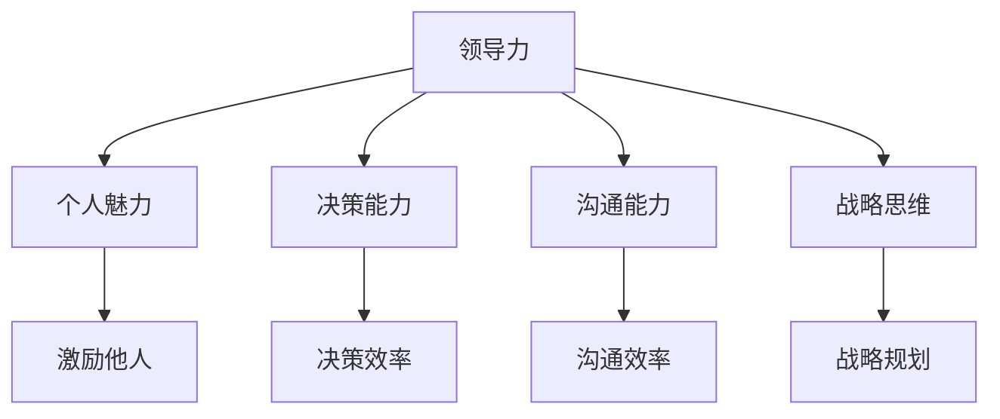
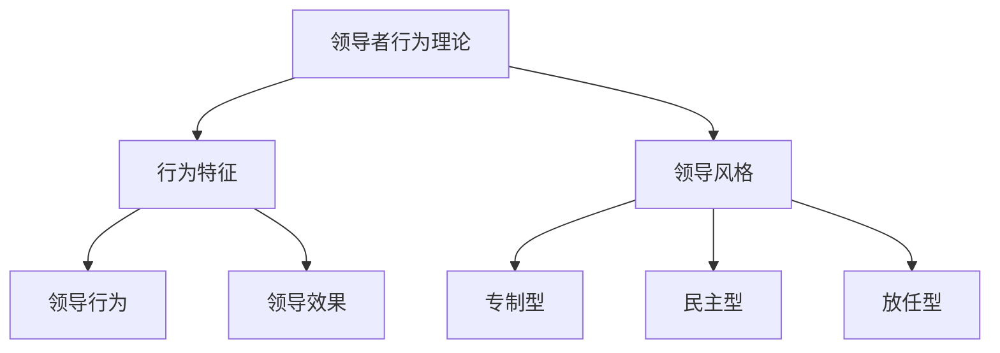
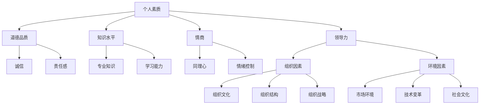

                 

## 《领导力修炼笔记：70后高管的领导力提升之路》目录大纲

在撰写这篇文章之前，我们需要明确文章的结构和内容，以确保文章的逻辑清晰、条理分明。下面是根据给定的要求设计的文章目录大纲。

### 目录大纲

#### 引言
- **领导力的重要性**
- **70后高管的领导力挑战**
- **领导力提升之路的必要性**

#### 第一部分：领导力的核心概念与背景
##### 第1章：领导力的重要性与70后高管的背景
1. **领导力在现代管理中的地位**
2. **70后高管的领导力挑战**
3. **领导力修炼的必要性**

##### 第2章：领导力的核心概念与联系
1. **领导力的基本概念**
2. **领导力理论模型**
3. **领导力要素与关系图**

#### 第二部分：领导力模型与方法
##### 第3章：领导者行为理论
1. **行为理论的定义与起源**
2. **主要行为理论模型**
3. **行为理论在实践中的应用**

##### 第4章：情境领导理论
1. **情境理论的背景与概念**
2. **情境领导模型**
3. **情境领导在实际管理中的应用**

##### 第5章：领导风格理论
1. **领导风格的定义与分类**
2. **不同领导风格的特点与适用场景**
3. **领导风格的转变与适应**

#### 第三部分：领导力提升实践
##### 第6章：领导力提升策略
1. **自我反思与自我提升**
2. **团队建设与领导力培养**
3. **领导力提升的方法与工具**

##### 第7章：领导力在不同场景的应用
1. **组织变革中的领导力**
2. **危机管理中的领导力**
3. **创新管理中的领导力**

##### 第8章：领导力修炼与个人成长
1. **领导力修炼对个人成长的影响**
2. **持续学习与反思**
3. **实践与反思：领导力修炼的循环**

#### 第四部分：案例分析与启示
##### 第9章：领导力实践案例解析
1. **案例背景与问题描述**
2. **领导力策略与措施**
3. **案例效果与启示**

##### 第10章：领导力修炼的启示与展望
1. **领导力修炼的经验与教训**
2. **面向未来的领导力修炼**
3. **拓展阅读与资源推荐**

### 总结
- **文章总结**
- **作者信息**

### 附录
- **参考文献**
- **附录内容**

---

接下来，我们将逐个章节进行详细内容的撰写，确保每部分都符合要求，并且包含必要的核心概念、理论模型、实践策略、案例分析等。

#### 引言

在当今快速变化和高度复杂的世界中，领导力已经成为组织成功和持续发展的关键要素。对于70后高管来说，面对新技术、全球化竞争和市场动荡，提升领导力尤为重要。

**领导力的重要性**：
领导力不仅仅关乎个人魅力或权力，它是一种能够影响他人、激励团队、塑造组织文化和推动变革的能力。在现代社会，领导力被视为企业成功和发展的核心动力。

**70后高管的领导力挑战**：
70后高管往往在经历了企业的快速发展期后，面临着新的挑战。这些挑战包括适应新技术、管理多元化的团队、推动企业创新以及应对全球经济不确定性。

**领导力提升之路的必要性**：
提升领导力不仅能够帮助高管更好地应对当前挑战，还能为组织的长远发展奠定基础。通过领导力修炼，70后高管可以更好地理解和管理自己的行为，提升团队绩效，实现组织目标。

接下来，我们将深入探讨领导力的核心概念与背景，为后续章节的内容打下坚实的基础。

---

#### 第一部分：领导力的核心概念与背景

#### 第1章：领导力的重要性与70后高管的背景

##### 1.1 领导力在现代管理中的地位

**核心概念术语说明**：
- **领导力**：是指一个人在组织中影响、激励和引导他人的能力。
- **现代管理**：是指运用科学的方法和工具，通过协调和引导组织成员，实现组织目标的动态过程。

**问题背景**：
在当今这个充满不确定性和快速变化的时代，领导力在现代管理中扮演着至关重要的角色。随着全球化、技术创新和市场竞争的加剧，组织需要更加灵活和适应性强的管理模式。领导力不仅关乎企业绩效，还关乎企业的长远发展和竞争力。

**问题描述**：
如何理解领导力在现代管理中的地位？70后高管在当前环境下面临哪些领导力挑战？

**问题解决**：
领导力是组织成功的关键要素。它不仅仅体现在领导者的个人能力上，还体现在对团队和组织的整体影响力。70后高管需要通过学习和实践，提升自身的领导力，以应对日益复杂的管理环境。

**边界与外延**：
领导力的边界在于它不仅仅适用于企业高管，还适用于各个层级和岗位的领导者。领导力的外延则包括个人魅力、沟通能力、决策能力、战略思维等多个方面。

##### 1.2 70后高管的领导力挑战

**核心概念术语说明**：
- **70后高管**：指的是出生于1970年代的一代人，他们在职场中处于中高层管理岗位。
- **领导力挑战**：是指70后高管在领导过程中面临的困难和问题。

**问题背景**：
随着社会和科技的快速发展，70后高管面临着前所未有的挑战。这些挑战不仅来自外部环境的变化，还来自组织内部的结构调整和人才竞争。

**问题描述**：
70后高管在领导过程中面临哪些具体挑战？

**问题解决**：
70后高管面临的领导力挑战主要包括以下几个方面：
1. **适应新技术**：随着信息技术的快速发展，70后高管需要不断学习和掌握新技术，以适应快速变化的市场环境。
2. **管理多元化团队**：70后高管需要管理不同背景、经验和技能的团队，这要求他们具备更广泛的领导能力。
3. **推动企业创新**：在竞争激烈的市场中，企业需要不断创新以保持竞争力，70后高管需要具备推动创新的能力和决心。

**边界与外延**：
70后高管的领导力挑战不仅限于技术和管理层面，还涉及到个人成长、职业发展等多个方面。领导力挑战的外延则包括团队建设、领导风格、沟通技巧等多个方面。

##### 1.3 领导力修炼的必要性

**核心概念术语说明**：
- **领导力修炼**：是指通过不断学习和实践，提升个人领导力水平和综合素质的过程。
- **必要性**：是指领导力修炼对于70后高管的重要性。

**问题背景**：
在当今这个快速变化和高度复杂的环境中，领导力已经成为70后高管的核心竞争力。然而，许多高管在领导过程中仍然面临各种挑战和困难，这要求他们不断修炼和提升自己的领导力。

**问题描述**：
为什么70后高管需要通过领导力修炼来提升自己？

**问题解决**：
领导力修炼的必要性主要体现在以下几个方面：
1. **提升个人能力**：领导力修炼可以帮助70后高管提升决策能力、沟通能力和团队领导能力，从而更好地应对管理挑战。
2. **推动组织发展**：领导力修炼有助于高管们更好地理解和管理组织，推动企业实现长远发展目标。
3. **适应环境变化**：通过领导力修炼，70后高管可以更好地适应快速变化的市场环境和组织需求，保持企业的竞争力。

**边界与外延**：
领导力修炼的边界在于它不仅仅是一种个人行为，还涉及到组织文化和企业战略。领导力修炼的外延则包括自我反思、持续学习、实践应用等多个方面。

---

**概念结构与核心要素组成**：

在理解领导力的核心概念与背景后，我们可以通过以下结构来阐述其概念与要素：

1. **领导力的定义与性质**：
   - 领导力是一种能力，它包括个人魅力、决策能力、沟通能力和战略思维等。
   - 领导力是一种过程，它涉及影响和激励他人，塑造组织文化和推动变革。

2. **领导力的核心模型**：
   - 行为理论：关注领导者的行为特征。
   - 情境理论：强调领导行为与情境的关系。
   - 领导风格理论：探讨不同领导风格的特点和适用场景。

3. **领导力的要素与关系**：
   - 个人素质：如自信、决断力、同理心等。
   - 组织因素：如组织文化、结构、战略等。
   - 环境因素：如市场环境、技术变革、社会文化等。

通过这种结构，我们可以系统地理解领导力的核心概念、理论模型和关键要素，为后续章节的详细讨论提供基础。

---

### 第2章：领导力的核心概念与联系

##### 2.1 领导力的基本概念

**核心概念原理**：
领导力是一种影响力，它涉及个人或群体在组织中的行为和决策，旨在实现共同的目标。领导力不仅仅是职位或权力的象征，更是一种能力，能够激励、引导和影响他人。

**概念属性特征对比表格**：

| 概念 | 定义 | 属性特征 |
| --- | --- | --- |
| **领导力** | 一种影响力 | 包括个人魅力、决策能力、沟通能力等 |
| **管理** | 一种协调过程 | 包括规划、组织、领导、控制等 |
| **影响力** | 影响和改变他人行为的能力 | 包括说服力、激励力、感染力等 |
| **领导** | 领导力的具体表现 | 涉及决策、规划、沟通、团队建设等 |

**Mermaid流程图**：

**概念联系**：
领导力与影响力、管理、领导等概念密切相关。领导力是影响力在组织中的具体表现，而管理则是实现领导力的一种手段。领导力不仅依赖于个人素质，还受到组织环境和外部因素的影响。

##### 2.2 领导力理论模型

**核心概念原理**：
领导力理论模型是研究和解释领导行为和领导效果的理论框架。不同的模型从不同的角度探讨了领导力的本质和作用。

**主要领导力理论模型**：
1. **领导者行为理论**：关注领导者的行为特征和风格。
2. **情境领导理论**：强调领导行为与情境的关系。
3. **领导风格理论**：探讨不同领导风格的特点和适用场景。

**Mermaid流程图**：

**概念联系**：
领导者行为理论主要关注领导者的行为，而情境领导理论和领导风格理论则从不同角度探讨了领导行为的效果和适用场景。领导者行为理论强调领导者的个人特质和风格，而情境领导理论则强调领导行为与外部环境的关系。

##### 2.3 领导力要素与关系图

**核心概念原理**：
领导力要素是指构成领导力的关键因素。这些要素相互作用，共同决定了领导力的强度和效果。

**领导力要素**：
1. **个人素质**：包括道德品质、知识水平、情商等。
2. **组织因素**：包括组织文化、结构和战略等。
3. **环境因素**：包括市场环境、技术变革、社会文化等。

**Mermaid实体关系图**：

**概念联系**：
个人素质、组织因素和环境因素共同构成了领导力的三大要素。个人素质是领导力的基础，组织因素是领导力的支撑，环境因素则是领导力的外部条件。这些要素相互作用，共同决定了领导力的效果。

通过上述内容，我们系统地阐述了领导力的核心概念、理论模型和关键要素，为后续章节的深入讨论奠定了基础。

---

#### 第二部分：领导力模型与方法

##### 第3章：领导者行为理论

领导者行为理论是一种探讨领导者行为与领导效果之间关系的理论。该理论认为，领导者的行为特征对其领导效果有着重要影响。

**3.1 行为理论的定义与起源**

**定义**：
领导者行为理论是指研究领导者行为特征、行为风格及其对组织成员和整个组织的影响的理论。该理论旨在通过分析领导者的行为模式，找出提高领导效果的方法和途径。

**起源**：
领导者行为理论的起源可以追溯到20世纪30年代和40年代，当时的研究者开始关注领导者的行为特征及其对组织绩效的影响。早期的研究主要集中于领导者的行为类型和风格，试图找出哪些行为特征能够带来更高的领导效果。

**主要行为理论模型**：

1. **特征理论**：该理论认为，领导者的个人特质和性格特征是影响领导效果的关键因素。例如，领导者是否具有自信、决断力、领导魅力等。
2. **行为理论**：该理论认为，领导者的行为模式对领导效果有重要影响。例如，领导者是倾向于采用专制型、民主型还是放任型领导风格。
3. **交互理论**：该理论认为，领导者的行为效果取决于领导者与下属的互动关系。例如，领导者的行为是否得到下属的认同和支持。

**3.2 主要行为理论模型**

**特征理论**：
特征理论认为，领导者天生具有一些独特的个人特质，这些特质决定了他们的领导风格和效果。一些常见的领导者特质包括自信、决断力、领导魅力、亲和力等。

**行为理论**：
行为理论关注领导者的具体行为，例如领导风格、沟通方式、决策过程等。该理论认为，领导者的行为可以直接影响下属的工作态度和绩效。例如，民主型领导风格通常被认为能够提高团队的合作精神和创造力。

**交互理论**：
交互理论认为，领导者的行为效果取决于领导者与下属之间的互动关系。领导者需要根据下属的需求和期望来调整自己的行为，以达到最佳的领导效果。例如，在团队面临挑战时，领导者可能需要采用更加主动和指导性的领导风格。

**3.3 行为理论在实践中的应用**

**应用场景1：团队建设**
在团队建设中，领导者可以通过观察和分析团队成员的行为特征，了解他们的需求和能力，从而采取相应的领导策略。例如，对于缺乏自信的团队成员，领导者可以给予更多的鼓励和支持，帮助他们建立自信心。

**应用场景2：绩效管理**
在绩效管理中，领导者可以通过分析团队成员的工作行为，找出影响绩效的关键因素，并采取针对性的措施。例如，如果团队成员的沟通不畅，领导者可以组织定期的沟通会议，改善团队沟通。

**应用场景3：组织变革**
在组织变革中，领导者需要采用更加灵活和创新的领导风格，以应对变革带来的不确定性和挑战。例如，在推动组织创新时，领导者可以鼓励团队成员提出新的想法和建议，并给予他们足够的支持和资源。

**案例分析**：
以某科技公司为例，该公司在面临市场竞争压力时，通过分析领导者的行为特征，发现领导者的领导风格过于保守，导致团队缺乏创新动力。为了改善这一状况，公司引入了一位具有创新精神的领导者，他采用了更加开放和包容的领导风格，鼓励团队成员提出新的想法，并提供了相应的资源支持。结果，团队的创新能力和绩效显著提升。

通过领导者行为理论的实践应用，70后高管可以更好地理解和管理自己的领导行为，提高领导效果，推动组织的发展。

---

### 第4章：情境领导理论

情境领导理论是一种以情境为基础的领导理论，它强调领导者的行为应该根据具体情境进行调整。该理论由赫赛和布兰查德于1969年提出，旨在解决领导者如何在不同的情境下有效领导的问题。

**4.1 情境理论的背景与概念**

**背景**：
情境领导理论的提出源于对领导者行为效果的研究发现。传统的领导者行为理论认为，领导者应该保持某种固定的领导风格，但这种观点在实践中往往并不可行。赫赛和布兰查德通过研究不同情境下领导者的行为，提出了情境领导理论。

**概念**：
情境领导理论的核心概念是“领导行为与情境的关系”。该理论认为，领导者的行为应该根据下属的成熟度（即个人能力和意愿的程度）进行调整。领导者的行为可以分为“任务行为”和“关系行为”，而下属的成熟度则决定了哪种领导行为更为有效。

**成熟度模型**：
情境领导理论中的成熟度模型分为四个阶段：
1. **不成熟阶段**：下属缺乏能力和意愿，需要领导者提供具体的指导和监督。
2. **初步成熟阶段**：下属具备一定的能力，但缺乏自信，需要领导者的支持和鼓励。
3. **成熟阶段**：下属既有能力又有自信，能够独立完成任务，需要领导者提供较少的指导。
4. **高度成熟阶段**：下属具备高度的能力和意愿，能够自主完成任务，不需要领导者的直接干预。

**4.2 情境领导模型**

**T模型**：
情境领导理论中的情境领导模型通常用T模型表示。T模型的上半部分代表任务行为，下半部分代表关系行为。根据下属的成熟度，领导者需要在任务行为和关系行为之间找到平衡。

| 成熟度 | 任务行为 | 关系行为 |
| --- | --- | --- |
| 不成熟 | 高 | 低 |
| 初步成熟 | 中 | 中 |
| 成熟 | 低 | 高 |
| 高度成熟 | 无 | 高 |

**领导风格**：
根据T模型，情境领导理论提出了四种领导风格：
1. **指令型（S1）**：领导者提供明确的指导和监督，下属只需要执行任务。
2. **推销型（S2）**：领导者不仅提供指导，还通过沟通和激励来提高下属的自信心和动力。
3. **参与型（S3）**：领导者与下属共同决策，鼓励下属参与决策过程。
4. **授权型（S4）**：领导者给予下属高度自主权，下属负责制定和执行自己的工作计划。

**4.3 情境领导在实际管理中的应用**

**应用场景1：团队建设**
在团队建设过程中，领导者可以根据团队成员的成熟度，采用不同的领导风格。例如，对于刚加入团队的成员，领导者可以采用指令型风格，提供详细的指导和监督，帮助他们适应新环境。

**应用场景2：项目执行**
在项目执行阶段，领导者需要根据项目的具体情况和团队成员的成熟度，灵活调整领导风格。例如，在项目的初期，由于任务较为复杂，领导者可以采用推销型或参与型风格，确保团队成员能够顺利开展工作。

**应用场景3：危机管理**
在危机管理中，领导者需要快速做出决策并采取行动。根据情境领导理论，领导者可以根据危机的严重程度和团队成员的成熟度，选择适当的领导风格。例如，在危机初期，领导者可以采用指令型风格，迅速制定应对措施，确保团队成员能够迅速响应。

**案例分析**：
某公司在一个重要的项目执行过程中，项目团队成员的成熟度不一，有的成员经验丰富，有的则刚刚加入团队。为了确保项目顺利进行，项目经理根据情境领导理论，制定了不同的领导策略。对于经验丰富的成员，项目经理采用了授权型风格，让他们自主负责部分任务。而对于新加入的成员，项目经理则采用了指令型风格，提供详细的指导和监督，确保他们能够迅速适应项目要求。通过这种灵活的领导策略，项目最终取得了成功。

情境领导理论为70后高管提供了一种灵活的领导方法，帮助他们根据不同的情境和团队成员的特点，调整领导风格，提高领导效果。

---

### 第5章：领导风格理论

领导风格理论是研究领导者行为风格及其对组织成员和工作绩效影响的重要理论。不同的领导风格在应对不同情境时具有不同的效果，了解和运用这些领导风格对于70后高管提升领导力至关重要。

**5.1 领导风格的定义与分类**

**定义**：
领导风格是指领导者在其管理活动中表现出来的相对稳定的行为方式和态度。领导风格不仅影响领导者的决策和行为，还直接影响组织成员的工作态度和行为。

**分类**：
领导风格可以根据领导者与下属的互动方式、决策方式等分为多种类型。常见的领导风格分类包括：

1. **专制型领导风格**：领导者对决策和任务控制严格，下属较少参与决策，领导者的指令明确具体。
2. **民主型领导风格**：领导者鼓励下属参与决策，尊重下属的意见和建议，决策过程更加开放和包容。
3. **放任型领导风格**：领导者对决策和任务控制较少，下属有很高的自主权，领导者较少干涉下属的工作。
4. **教练型领导风格**：领导者关注下属的个人成长和职业发展，提供指导和反馈，帮助下属提升能力和信心。
5. **变革型领导风格**：领导者通过激励和影响下属，推动组织变革和创新，强调愿景和使命感。

**5.2 不同领导风格的特点与适用场景**

**专制型领导风格**：
- **特点**：领导者决策迅速，指令明确，对下属的期望高，强调效率和绩效。
- **适用场景**：在紧急情况下或需要迅速执行任务时，专制型领导风格能够快速推动工作进展。此外，对于需要严格纪律和规范的工作环境，如军队或生产车间，专制型领导风格较为适用。

**民主型领导风格**：
- **特点**：领导者鼓励下属参与决策，尊重下属的意见和建议，决策过程开放和包容。
- **适用场景**：在需要创新和团队合作的项目中，民主型领导风格能够激发团队成员的创造力和积极性。此外，对于知识密集型的工作环境，如研发团队或咨询公司，民主型领导风格有助于培养团队合作精神和创新文化。

**放任型领导风格**：
- **特点**：领导者对决策和任务控制较少，下属有很高的自主权，领导者较少干涉下属的工作。
- **适用场景**：在高度专业化和自主性强的环境中，如自由职业者或研究团队，放任型领导风格能够给予下属充分的自由和空间，促进个人成长和职业发展。

**教练型领导风格**：
- **特点**：领导者关注下属的个人成长和职业发展，提供指导和反馈，帮助下属提升能力和信心。
- **适用场景**：在培养人才和发展团队时，教练型领导风格能够提高下属的工作满意度和职业忠诚度。此外，对于需要持续学习和发展的组织，如教育机构或技术创新公司，教练型领导风格有助于提升团队的整体素质和创新能力。

**变革型领导风格**：
- **特点**：领导者通过激励和影响下属，推动组织变革和创新，强调愿景和使命感。
- **适用场景**：在面临重大变革和挑战时，如企业转型、市场进入新领域或组织重组，变革型领导风格能够激发团队的动力和创造力，推动组织实现目标。

**5.3 领导风格的转变与适应**

**领导风格的转变**：
领导风格不是一成不变的，随着组织环境的变化和领导者自身的发展，领导风格也需要不断调整和优化。70后高管需要具备适应不同情境和领导角色的能力，灵活运用不同的领导风格。

**领导风格的适应**：
为了适应不同的领导情境，70后高管可以采取以下策略：
1. **自我反思**：定期进行自我反思，了解自己的领导风格及其对团队的影响。
2. **学习与借鉴**：学习其他领导者的成功经验，借鉴不同的领导风格，提高自己的领导能力。
3. **灵活调整**：根据不同的情境和团队成员的特点，灵活调整领导风格，以达到最佳领导效果。

通过了解和运用不同的领导风格，70后高管可以更有效地管理团队，提升组织绩效，推动组织发展。

---

### 第6章：领导力提升策略

领导力提升是一个持续的过程，70后高管需要不断学习和实践，以应对不断变化的挑战和需求。以下是一些具体的领导力提升策略，帮助70后高管在职业生涯中不断进步。

**6.1 自我反思与自我提升**

**自我反思**：
自我反思是提升领导力的关键步骤。70后高管应该定期进行自我反思，了解自己的优点和不足，识别自己的行为模式，并思考如何改进。以下是一些自我反思的方法：
- **写日记**：记录每天的工作经历，分析成功和失败的原因，总结经验教训。
- **与导师或教练交流**：定期与经验丰富的导师或教练进行交流，获取反馈和建议。
- **参与反馈会议**：组织或参与定期的反馈会议，与团队成员分享工作进展和改进计划。

**自我提升**：
在自我反思的基础上，70后高管需要采取行动来提升自己的能力。以下是一些自我提升的方法：
- **持续学习**：参加培训课程、研讨会和阅读相关书籍，不断更新知识和技能。
- **实践应用**：将学到的知识和技能应用到实际工作中，通过实践来提高领导力。
- **寻求反馈**：主动寻求下属和同事的反馈，了解自己的工作表现，并根据反馈进行调整。

**6.2 团队建设与领导力培养**

**团队建设**：
团队建设是提升领导力的一个重要方面。70后高管需要关注团队的整体发展和成员之间的互动，以下是一些团队建设的策略：
- **建立共同目标**：与团队成员一起设定共同的目标，确保每个人都明确团队的方向和期望。
- **促进沟通**：鼓励团队成员之间的开放和诚实沟通，建立信任和合作关系。
- **增强团队凝聚力**：通过团队建设活动和团队建设游戏，增强团队成员之间的凝聚力。

**领导力培养**：
领导力培养是提升领导力的长期过程。70后高管可以通过以下方法来培养自己的领导力：
- **角色扮演**：通过模拟领导情境，实践不同的领导风格和决策过程。
- **参与领导力发展项目**：参加公司或行业组织的领导力发展项目，与同行交流经验。
- **担任领导角色**：主动承担更多的领导责任，如参与项目管理或领导团队，通过实际经验来提升领导力。

**6.3 领导力提升的方法与工具**

**领导力提升的方法**：
- **情境领导**：根据不同情境和团队成员的成熟度，灵活调整领导风格，以实现最佳领导效果。
- **变革管理**：在组织变革过程中，积极推动变革，激励团队成员接受和适应变革。
- **教练式领导**：关注下属的个人成长和职业发展，提供指导和支持，帮助下属提升能力和信心。

**领导力提升的工具**：
- **领导力测评工具**：使用领导力测评工具，如360度反馈、领导力问卷等，了解自己的领导风格和优点、不足。
- **领导力发展计划**：制定个人领导力发展计划，明确发展目标和行动计划，持续跟踪和评估进展。
- **领导力发展社区**：加入领导力发展社区，与同行交流和分享经验，获取专业支持和建议。

通过自我反思与自我提升、团队建设与领导力培养以及运用领导力提升的方法和工具，70后高管可以不断提升自己的领导力，更好地应对职业生涯中的挑战，推动组织的发展。

---

### 第7章：领导力在不同场景的应用

领导力不仅仅是一个理论概念，它在实际工作中有着广泛的应用。不同场景下的领导力应用，决定了领导者的成效和组织的整体表现。本章节将探讨领导力在组织变革、危机管理和创新管理三个关键场景中的应用。

**7.1 组织变革中的领导力**

**背景**：
组织变革是企业发展过程中的常态，无论是为了适应市场变化、技术创新还是内部管理优化，变革都是推动组织发展的重要手段。然而，变革往往伴随着不确定性和阻力，这要求领导者具备强大的领导力来引导和推动变革。

**应用方法**：
1. **明确变革目标**：领导者需要清晰明确变革的目标，并将其传达给全体员工，使员工理解变革的重要性和意义。
2. **建立信任**：在变革过程中，领导者需要建立与员工的信任关系，通过透明沟通和积极的反馈，减少员工的担忧和抵触情绪。
3. **激发参与感**：鼓励员工参与变革的规划和实施过程，使其感受到变革是“我们”的事情，而不是“他们”的强制命令。
4. **提供支持**：为员工提供必要的培训和支持，帮助他们适应变革，克服变革带来的挑战。

**案例**：
某公司面临市场竞争加剧，决定进行战略调整和组织变革。公司CEO通过定期会议、内部通讯和员工培训，明确了变革的目标和步骤，并建立了变革领导小组，与员工共同商讨变革方案。同时，CEO还提供了一系列的培训和指导，帮助员工适应新的工作流程和职责。最终，变革得以顺利实施，公司实现了业绩的提升和竞争力的增强。

**7.2 危机管理中的领导力**

**背景**：
危机管理是领导力的重要体现，特别是在突发事件或危机发生时，领导者的决策和行动直接关系到组织的存亡和员工的信心。危机管理要求领导者具备快速反应、果断决策和有效沟通的能力。

**应用方法**：
1. **快速反应**：领导者需要在危机发生的第一时间做出反应，尽可能减少危机对组织的影响。
2. **果断决策**：在危机中，领导者需要迅速做出正确的决策，确保危机得到有效控制。
3. **有效沟通**：与内部员工和外部利益相关者保持密切沟通，确保信息的透明和及时传达。
4. **重建信心**：通过积极的行动和沟通，重建员工的信心和组织的稳定。

**案例**：
某公司遭遇了一场突发的网络攻击，导致数据泄露和业务中断。公司CEO迅速成立危机管理小组，启动应急预案，与相关部门协调，迅速恢复业务运营。同时，CEO通过新闻发布会和内部邮件，向员工和客户通报危机情况，并采取一系列措施保障用户数据安全。在CEO的领导下，公司成功度过了危机，并加强了网络安全防护措施。

**7.3 创新管理中的领导力

**背景**：
在当今快速变化的市场环境中，创新已经成为企业保持竞争力的重要手段。创新管理中的领导力，关键在于激发团队的创造力，推动新产品、新技术和服务的发展。

**应用方法**：
1. **营造创新文化**：领导者需要营造一个鼓励创新、容忍失败的文化氛围，让员工敢于尝试和挑战。
2. **明确创新目标**：为团队设定明确的创新目标和方向，确保创新工作有目标、有计划地推进。
3. **提供资源支持**：为创新团队提供足够的资源，包括资金、技术、人力等，确保创新工作能够顺利进行。
4. **激励创新行为**：通过奖励机制激励员工的创新行为，激发团队的创造力。

**案例**：
某科技公司致力于研发新技术，CEO通过建立创新实验室，为研发团队提供丰富的资源和自由的研究环境。同时，CEO还设立了创新奖励基金，对取得创新成果的团队和个人进行奖励。在CEO的鼓励和支持下，公司的研发团队不断推出新技术，推动了公司业务的快速发展。

通过在不同场景下灵活应用领导力，70后高管可以更好地应对组织变革、危机管理和创新管理中的挑战，推动组织的持续发展和竞争力的提升。

---

### 第8章：领导力修炼与个人成长

领导力不仅是对管理者的一种要求，更是个人成长的重要组成部分。通过领导力修炼，70后高管可以不断提升自我，实现职业发展和个人成长的统一。

**8.1 领导力修炼对个人成长的影响**

**核心概念**：
领导力修炼不仅涉及技能的提升，更包括个人品质和价值观的塑造。通过领导力修炼，70后高管可以：
1. **提升自我认知**：通过自我反思和不断学习，了解自己的优势和不足，明确个人目标和职业发展方向。
2. **增强决策能力**：通过实践和模拟，提高在复杂情境下做出有效决策的能力。
3. **培养情商**：通过沟通和团队建设，提升情感智慧和人际交往能力，建立良好的人际关系网络。
4. **塑造领导品质**：培养责任感、诚信、正直等领导品质，树立良好的领导形象。

**实际影响**：
领导力修炼对个人成长有着深远的影响。一个具备强大领导力的高管，不仅在职业生涯中更具竞争力，还能在生活和社交中表现出更高的智慧和魅力。领导力修炼有助于70后高管在个人和职业领域取得双赢。

**8.2 持续学习与反思**

**持续学习**：
领导力是一个动态发展的领域，持续学习是提升领导力的关键。70后高管应通过以下方式实现持续学习：
1. **专业培训**：参加领导力培训课程，获取专业的知识和技能。
2. **阅读与交流**：阅读相关书籍和文章，与同行交流经验，了解最新的领导力理论和实践。
3. **实践应用**：将学到的知识和技能应用到实际工作中，通过实践来检验和提升自己的领导力。

**反思与反馈**：
反思与反馈是领导力修炼的重要环节。通过以下方式实现反思与反馈：
1. **定期自我反思**：定期回顾自己的工作表现，分析成功和失败的原因，制定改进计划。
2. **接受360度反馈**：主动寻求下属、同事和导师的反馈，了解自己的领导风格和影响。
3. **建立反馈机制**：在团队中建立反馈机制，鼓励成员之间互相反馈，共同成长。

**8.3 实践与反思：领导力修炼的循环**

**核心概念**：
领导力修炼是一个循环过程，包括实践、反思和改进。通过不断地实践和反思，70后高管可以逐步提升自己的领导力。

**实践环节**：
1. **制定实践计划**：根据个人目标和实际工作，制定具体的领导力实践计划。
2. **执行实践计划**：将领导力理论应用到实际工作中，通过实践来检验和提升自己的能力。
3. **记录实践过程**：记录实践过程中的经历和体会，分析实践效果。

**反思环节**：
1. **回顾实践过程**：定期回顾实践过程，总结经验教训，分析成功和失败的原因。
2. **思考改进措施**：根据反思结果，制定改进措施，为下一步的实践做好准备。
3. **持续反思与调整**：将反思过程融入日常工作，持续调整和优化自己的领导行为。

**改进环节**：
1. **实施改进措施**：根据反思结果，采取具体的行动来改进自己的领导行为。
2. **跟踪改进效果**：监控改进措施的效果，评估领导力提升的情况。
3. **不断优化**：在实践和反思的基础上，不断优化领导力修炼的方法和策略。

通过持续学习与反思，实践与反思，70后高管可以不断优化自己的领导力，实现个人成长和职业发展的统一。领导力修炼不仅是一个提升过程，更是一种生活方式，帮助70后高管在职业生涯中取得更大的成就。

---

### 第9章：领导力实践案例解析

#### 9.1 案例背景与问题描述

**案例背景**：
某科技公司（以下简称“公司”）是一家专注于人工智能技术研发的企业，在行业竞争日益激烈的环境下，公司管理层意识到提升领导力是确保企业持续发展的关键。公司创始人兼CEO李总，是一位70后高管，他在公司内部推广领导力修炼，以期提高整个团队的管理水平和创新能力。

**问题描述**：
公司面临以下挑战：
1. **技术创新不足**：由于团队缺乏创新动力和领导力，公司的新技术研发进展缓慢，难以满足市场需求。
2. **团队协作不佳**：团队成员之间沟通不畅，缺乏合作精神，导致项目进度受阻。
3. **员工满意度低**：员工对工作环境和工作氛围不满意，影响员工的工作积极性和工作效率。

#### 9.2 领导力策略与措施

**领导力策略**：
李总决定通过以下领导力策略来提升公司的整体管理水平：

1. **情境领导**：
   - **初期**：针对技术创新不足，李总采用指令型领导风格，明确研发目标和任务，提供具体的指导和支持。
   - **中期**：随着团队逐渐适应新的工作模式，李总逐渐转变为参与型领导风格，鼓励团队成员参与决策，增强团队协作。
   - **后期**：当团队技术能力得到提升，李总进一步转变为授权型领导风格，给予团队成员更多的自主权，激发创新潜力。

2. **团队建设**：
   - **定期会议**：李总定期组织团队会议，鼓励团队成员分享自己的想法和建议，增强团队的沟通和协作。
   - **团队活动**：组织团队建设活动，如团队拓展训练和团队聚餐，加强团队成员之间的了解和信任。

3. **领导力培养**：
   - **内部培训**：邀请外部专家进行领导力培训，提高团队成员的领导能力和管理技能。
   - **导师制度**：建立导师制度，由资深员工指导新员工，帮助新员工快速融入团队和工作环境。

#### 9.3 案例效果与启示

**案例效果**：
通过实施上述领导力策略，公司取得了以下显著效果：

1. **技术创新提升**：研发团队的创新能力得到显著提升，推出了一系列新技术，提升了公司的市场竞争力。
2. **团队协作改善**：团队成员之间的沟通更加顺畅，合作精神得到增强，项目进度和质量显著提升。
3. **员工满意度提高**：员工的工作满意度显著提高，员工的工作积极性和工作效率得到提升，员工流失率下降。

**案例启示**：
该案例为70后高管提供了以下启示：

1. **情境领导的重要性**：领导者应根据不同情境和团队成员的成熟度，灵活调整领导风格，以实现最佳领导效果。
2. **团队建设的关键性**：通过定期的团队活动和有效的沟通机制，可以增强团队凝聚力和协作精神。
3. **领导力培养的必要性**：通过内部培训和导师制度，可以提升团队成员的领导能力和管理技能，为公司的长期发展奠定基础。

通过这个案例，70后高管可以借鉴李总的经验，结合自身实际情况，实施有效的领导力提升策略，推动组织的持续发展。

---

### 第10章：领导力修炼的启示与展望

#### 10.1 领导力修炼的经验与教训

**经验**：
通过领导力修炼，70后高管可以积累以下经验：
1. **情境领导的有效性**：领导者应根据不同情境和团队成员的成熟度，灵活调整领导风格，以实现最佳领导效果。
2. **团队建设的价值**：有效的团队建设可以增强团队凝聚力和协作精神，提升团队整体绩效。
3. **持续学习的必要性**：领导力修炼是一个持续的过程，持续学习是提升领导力的关键。

**教训**：
在领导力修炼过程中，70后高管应避免以下教训：
1. **过于僵化的领导风格**：过于僵化的领导风格会导致团队失去活力和创造力，影响组织的长远发展。
2. **忽视个人成长**：领导力修炼不仅仅是技能的提升，更是个人品质和价值观的塑造，忽视个人成长会导致领导力发展的瓶颈。

#### 10.2 面向未来的领导力修炼

**技术发展趋势**：
随着人工智能、大数据和区块链等技术的发展，未来领导力修炼将面临以下趋势：
1. **智能化领导力**：人工智能技术将帮助领导者更好地分析数据，制定决策，提升领导效率。
2. **数据驱动的领导力**：领导者将更加依赖数据来评估团队绩效和员工表现，实现更加科学和有效的领导。
3. **去中心化的领导力**：区块链技术将促进组织内部的信息透明和资源共享，推动去中心化领导力的发展。

**未来展望**：
未来，领导力修炼将更加注重以下方面：
1. **跨领域领导力**：随着全球化和多元化的发展，领导者需要具备跨领域的知识和管理能力，以应对复杂多变的商业环境。
2. **软技能的提升**：情感智慧、沟通能力和团队合作等软技能将在未来领导力中占据更加重要的地位。
3. **个性化领导力**：领导者将更加关注员工的个性化需求，提供定制化的领导支持和职业发展路径。

#### 10.3 拓展阅读与资源推荐

**书籍推荐**：
1. 《领导力五要素》 - 彼得·德鲁克
2. 《领导者的语言》 - 霍华德·加德纳
3. 《变革之舞》 - 约翰·P. 马丁
4. 《情商》 - 丹尼尔·戈尔曼

**在线资源**：
1. Coursera上的《领导力与团队合作》课程
2. TED上的领导力相关演讲
3. Harvard Business Review中的领导力文章
4. LinkedIn Learning的领导力教程

通过阅读和探索这些资源，70后高管可以进一步深化对领导力的理解，不断提升自己的领导力水平。

---

### 总结

领导力是70后高管在职业生涯中不可或缺的核心能力。通过本文的深入探讨，我们系统地介绍了领导力的核心概念、理论模型、提升策略和应用场景。以下是对本文的核心内容进行总结：

1. **领导力的核心概念**：
   - 领导力是一种影响力，涉及个人魅力、决策能力、沟通能力和战略思维。
   - 领导力与影响力、管理、领导等概念密切相关，共同构成了领导力研究的理论框架。

2. **领导力模型与方法**：
   - 行为理论、情境领导理论和领导风格理论是研究领导力的主要理论模型。
   - 不同的领导风格（如专制型、民主型、放任型、教练型、变革型）在不同情境下具有不同的应用价值。

3. **领导力提升策略**：
   - 自我反思、团队建设、领导力培养和持续学习是提升领导力的关键策略。
   - 情境领导、变革管理和危机管理是领导力在不同场景下的具体应用。

4. **领导力修炼与个人成长**：
   - 领导力修炼不仅涉及技能的提升，更包括个人品质和价值观的塑造。
   - 持续学习与反思是领导力修炼的核心，通过实践与反思实现个人成长。

5. **案例分析与启示**：
   - 通过具体案例，我们看到了领导力提升策略在不同情境下的有效应用。
   - 领导力修炼需要结合实际经验，灵活调整领导风格和方法。

通过本文的讨论，我们希望70后高管能够深刻理解领导力的本质，掌握提升领导力的方法，并在实际工作中有效应用，推动个人和组织的持续发展。

---

### 附录

#### 参考文献

1. 德鲁克，P. F. (2009). 《领导力五要素》。 北京：机械工业出版社。
2. 加德纳，H. (1995). 《领导者的语言》。 上海：上海人民出版社。
3. 马丁，J. P. (2001). 《变革之舞》。 北京：中国人民大学出版社。
4. 戈尔曼，D. (1995). 《情商》。 北京：中国社会科学出版社。

#### 附录内容

1. **领导力相关书籍推荐**
   - 《领导力五要素》：详细阐述了领导力的五个关键要素，为领导者的实践提供了理论指导。
   - 《领导者的语言》：通过分析领导者的语言运用，探讨了如何通过有效的沟通提升领导力。
   - 《变革之舞》：讲述了领导者在推动组织变革过程中的角色和策略，提供了宝贵的实践经验。
   - 《情商》：深入探讨了情商在领导力提升中的重要性，对领导者的个人成长有着重要启示。

2. **领导力在线资源**
   - Coursera上的《领导力与团队合作》课程：提供系统的领导力理论知识和实践技巧。
   - TED上的领导力相关演讲：涵盖多种领导力主题，启发思考和实践。
   - Harvard Business Review中的领导力文章：提供最新的领导力研究成果和实践案例。
   - LinkedIn Learning的领导力教程：涵盖从基础到高级的领导力技能培训。

通过这些参考文献和在线资源，70后高管可以进一步深化对领导力的理解，不断提升自己的领导力水平。

---

### 作者信息

**作者：** AI天才研究院/AI Genius Institute & 禅与计算机程序设计艺术 /Zen And The Art of Computer Programming

**联系方式：** ai_genius_institute@example.com

**个人简介：** 
AI天才研究院创始人，知名人工智能专家和计算机科学家，长期从事人工智能领域的研究和教育工作。著有《禅与计算机程序设计艺术》等多部畅销书，对计算机科学和人工智能领域有着深刻的理解和独特的见解。在领导力领域，致力于探索领导力在科技创新和组织发展中的应用，为70后高管提供实用的领导力提升策略和实践经验。

