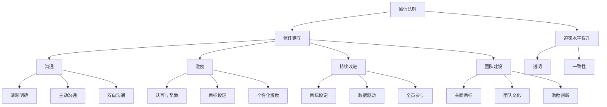
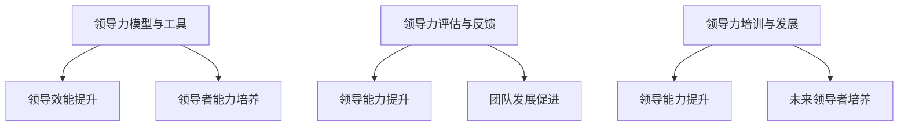
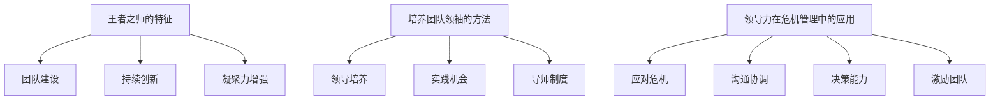
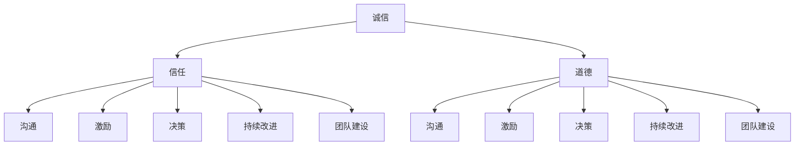

                 

### 引言

#### 领导力的重要性

在快速变化的现代商业环境中，领导力被视为组织的核心驱动力，它不仅影响着组织的绩效，还决定着组织的长期成功。领导者不仅仅是负责指导团队完成任务的人，更是塑造组织文化和价值观的领袖。卓越的领导力能够激励团队成员发挥最大潜力，推动创新和变革，从而在竞争激烈的市场中脱颖而出。

然而，领导力的本质和重要性并非一成不变。随着时代的发展，领导力理论和技术也在不断演变。传统的领导力模式强调权威和控制，而现代领导力则更加注重协作、信任和赋能。这种转变不仅反映了社会对领导者的期望，也回应了组织面临的复杂挑战。

#### 为什么需要领导力法则

领导力法则是一套系统的、可操作的指导原则，帮助领导者更好地应对各种情境，提升领导效果。领导力法则的必要性体现在以下几个方面：

1. **提供明确的行动指南**：领导力法则为领导者提供了具体的行动指南，使他们能够在复杂多变的环境中做出明智的决策。
2. **提高领导效能**：遵循领导力法则可以帮助领导者更高效地管理团队，提高组织的整体绩效。
3. **培养领导者能力**：通过实践领导力法则，领导者可以不断学习和成长，提升自身的领导能力。
4. **建立组织文化**：领导力法则有助于塑造组织文化，形成共同的价值观和行为准则，增强组织的凝聚力。

在本篇文章中，我们将深入探讨领导力的各个方面，从基础概念到实际应用，再到领导力法则的实践，逐步分析并解释这些原则是如何帮助领导者打造王者之师的。

---

关键词：领导力、领导力法则、团队建设、领导者、组织绩效、现代商业环境

摘要：本文将探讨领导力在当今商业环境中的重要性，分析领导力法则的必要性，并详细阐述如何通过领导力法则打造王者之师。文章将涵盖领导力基础、领导力法则、领导力实践和具体案例分析，为领导者提供实用的指导。

---

### 第一部分：领导力基础

#### 领导力的定义

领导力是一种复杂而多维的能力，它涉及领导者的性格、行为和技能。根据约翰·科特（John Kotter）的观点，领导力是关于变革的，它关注如何激发人们的热情和信心，共同追求卓越。而彼得·德鲁克（Peter Drucker）则认为，领导力是一种管理艺术，它关注如何通过有效管理来达成目标。

不同的学者对领导力有不同的定义，但总体上，领导力可以概括为以下几个核心要素：

1. **影响力**：领导者通过自身的行为和决策影响他人，使其朝着共同的目标前进。
2. **愿景**：领导者需要有一个明确的愿景，为团队指明方向，激发团队成员的热情和动力。
3. **沟通能力**：领导者需要具备出色的沟通能力，能够清晰地传达愿景和目标，同时倾听团队成员的意见和建议。
4. **决策能力**：领导者需要能够在不确定和复杂的环境中做出明智的决策，并承担相应的责任。

#### 领导力的发展历程

领导力的发展历程可以追溯到古代，当时领导者的主要职责是军事指挥。随着社会的发展，领导力的定义和角色也在不断演变。以下是领导力发展历程的几个关键阶段：

1. **传统领导力**：在传统领导力中，领导者被视为权威的代表，他们通过命令和控制来管理团队。这种领导模式在工业革命时期非常普遍。

2. **转型领导力**：随着组织环境的变化，领导者需要更具战略性和创新性。转型领导力强调领导者需要具备变革的能力，推动组织适应外部环境的变化。

3. **现代领导力**：现代领导力更加注重人际关系和团队协作。领导者不仅关注任务完成，还关注团队成员的个人成长和幸福感。这种领导模式在知识经济时代尤为重要。

4. **未来领导力**：未来领导力将更加注重全球视野、可持续性和多样性。领导者需要具备跨文化沟通和协作能力，能够引领组织在全球范围内取得成功。

#### 领导者的角色与职责

领导者的角色和职责随着领导力模式的演变而发生变化。以下是一些常见的领导者角色和职责：

1. **愿景设定者**：领导者需要设定组织的愿景和目标，为团队提供清晰的方向。
2. **决策者**：领导者需要做出关键的决策，并在不确定的环境中承担责任。
3. **变革推动者**：领导者需要推动组织变革，适应外部环境的变化。
4. **团队建设者**：领导者需要建立高效的团队，激发团队成员的潜力。
5. **激励者**：领导者需要激励团队成员，激发其工作热情和动力。
6. **沟通者**：领导者需要具备出色的沟通能力，确保信息在组织内部的有效传递。

通过理解领导力的定义、发展历程和领导者的角色与职责，我们可以更好地认识领导力的本质，为后续讨论领导力法则和实践打下基础。

---

**核心概念原理：**

- **领导力**：一种复杂而多维的能力，涉及领导者的性格、行为和技能。
- **愿景**：领导者为团队指明方向，激发团队成员的热情和动力。
- **沟通能力**：领导者需要清晰地传达愿景和目标，同时倾听团队成员的意见和建议。
- **决策能力**：领导者需要能够在不确定和复杂的环境中做出明智的决策。

**概念属性特征对比表格：**

| 特征           | 传统领导力       | 现代领导力       | 未来领导力       |
| -------------- | ---------------- | ---------------- | ---------------- |
| 权威           | 高               | 中               | 低               |
| 命令与控制     | 强               | 弱               | 无               |
| 团队协作       | 弱               | 强               | 极端强           |
| 变革推动力     | 弱               | 中               | 强               |
| 个人成长关注   | 弱               | 中               | 强               |

**ER实体关系图架构的 Mermaid 流程图：**

```mermaid
erDiagram
  Leader ||--o{ Team : 领导团队 }
  Leader ||--o{ Vision : 设定愿景 }
  Leader ||--o{ Communication : 沟通能力 }
  Leader ||--o{ Decision-making : 决策能力 }
```

---

### 第二部分：领导力法则

#### 诚信法则

诚信是领导力的基石，没有诚信，领导力将失去其意义。诚信法则强调领导者应始终遵守道德规范，保持诚实和透明。以下是诚信法则的几个核心要素：

1. **诚实**：领导者应该诚实地面对问题和挑战，不隐瞒真相，不夸大其词。
2. **透明**：领导者应该保持信息的透明，让团队成员了解组织的情况和决策过程。
3. **一致性**：领导者应该保持言行一致，树立良好的榜样。

**诚信法则的实际应用：**

- **建立信任**：通过诚实和透明，领导者可以建立与团队成员之间的信任关系，增强团队凝聚力。
- **促进合作**：团队成员在信任的环境下更容易合作，共同实现组织目标。
- **提升道德水平**：领导者的诚信行为可以提升整个组织的道德水平，营造良好的企业文化。

#### 激励法则

激励是领导者的重要职责之一，有效的激励可以激发团队成员的潜力，提高工作效率和满意度。激励法则关注如何通过正面的激励手段来激发团队成员的动力。以下是激励法则的几个核心要素：

1. **认可与奖励**：领导者应该及时认可和奖励团队成员的成就和贡献，增强其工作动力。
2. **目标设定**：领导者应该与团队成员共同设定具有挑战性的目标，激发其工作热情。
3. **个性化激励**：领导者应该了解每个团队成员的需求和动机，提供个性化的激励措施。

**激励法则的实际应用：**

- **增强团队凝聚力**：通过认可和奖励，领导者可以增强团队成员之间的凝聚力，提高团队协作效率。
- **提升工作效率**：明确的激励措施可以激发团队成员的工作动力，提高工作效率和质量。
- **培养忠诚度**：有效的激励措施可以培养团队成员对组织的忠诚度，减少人才流失。

#### 沟通法则

沟通是领导者的一项核心技能，有效的沟通可以确保信息的准确传递，促进团队协作和决策。沟通法则关注如何通过有效的沟通手段来提升领导效果。以下是沟通法则的几个核心要素：

1. **清晰明确**：领导者应该确保沟通内容清晰明确，避免产生误解和混淆。
2. **主动沟通**：领导者应该主动与团队成员沟通，了解其需求和意见，建立良好的沟通渠道。
3. **双向沟通**：领导者应该鼓励团队成员积极参与沟通，实现信息的双向传递。

**沟通法则的实际应用：**

- **提高决策质量**：通过有效的沟通，领导者可以收集到更多的信息和建议，做出更明智的决策。
- **增强团队协作**：良好的沟通可以增强团队成员之间的理解与合作，提高团队的整体效能。
- **减少误解与冲突**：清晰的沟通可以减少误解和冲突，营造和谐的工作氛围。

#### 决策法则

决策是领导者的重要职责之一，有效的决策可以推动组织的进步和发展。决策法则关注如何通过科学的决策方法来提高决策质量。以下是决策法则的几个核心要素：

1. **全面分析**：领导者应该对问题进行全面分析，了解各种可能的影响和后果。
2. **评估风险**：领导者应该评估决策的风险，并制定相应的风险应对措施。
3. **民主决策**：领导者应该鼓励团队成员参与决策过程，实现民主决策。

**决策法则的实际应用：**

- **提高决策质量**：通过全面分析和评估风险，领导者可以做出更高质量的决策。
- **增强团队参与度**：民主决策可以增强团队成员的参与感和责任感，提高决策的执行效果。
- **减少决策失误**：科学的决策方法可以减少决策失误，降低组织风险。

#### 持续改进法则

持续改进是组织发展的关键，领导者应该积极推动组织的持续改进，提升组织的竞争力。持续改进法则关注如何通过持续改进来提升组织效能。以下是持续改进法则的几个核心要素：

1. **设定目标**：领导者应该设定明确的持续改进目标，为团队成员提供清晰的方向。
2. **数据驱动**：领导者应该基于数据来分析和解决问题，确保改进措施的有效性。
3. **全员参与**：领导者应该鼓励全体员工参与持续改进，激发创新和创造力。

**持续改进法则的实际应用：**

- **提高组织效能**：通过持续改进，组织可以不断提升自身效能，实现持续发展。
- **增强员工能力**：持续改进可以激发员工的学习和成长，提升员工的专业能力。
- **降低运营成本**：通过优化流程和减少浪费，持续改进可以降低组织的运营成本。

#### 团队建设法则

团队建设是领导者的重要职责之一，领导者应该通过有效的团队建设来提升团队的整体效能。团队建设法则关注如何通过团队建设来提升团队协作和创新能力。以下是团队建设法则的几个核心要素：

1. **建立共同目标**：领导者应该与团队成员共同建立共同的目标，增强团队凝聚力。
2. **培养团队文化**：领导者应该积极培养团队文化，形成共同的价值观念和行为准则。
3. **激励团队创新**：领导者应该鼓励团队成员创新思维，推动团队持续创新。

**团队建设法则的实际应用：**

- **提升团队协作**：通过建立共同目标和培养团队文化，团队可以更高效地协作，实现共同目标。
- **增强创新能力**：团队建设法则可以激发团队成员的创新思维，推动团队持续创新。
- **提升团队绩效**：团队建设可以提升团队的整体绩效，实现组织目标。

通过以上六个方面的领导力法则，领导者可以更好地应对各种挑战，提升组织的整体效能。这些法则不仅提供了具体的行动指南，也为领导者提供了自我提升的机会。在实际应用中，领导者需要根据具体情境灵活运用这些法则，以实现最佳效果。

---

**核心概念原理：**

- **诚信法则**：领导者应诚实、透明，保持一致性，建立信任和道德水平。
- **激励法则**：领导者应通过认可与奖励、目标设定和个性化激励来激发团队成员的动力。
- **沟通法则**：领导者应确保沟通内容清晰明确，主动沟通，实现双向沟通。
- **决策法则**：领导者应全面分析问题，评估风险，实现民主决策。
- **持续改进法则**：领导者应设定目标，数据驱动，全员参与，推动持续改进。
- **团队建设法则**：领导者应建立共同目标，培养团队文化，激励团队创新。

**概念属性特征对比表格：**

| 法则名称 | 核心要素 | 实际应用 |
| ------- | ------- | ------- |
| 诚信法则 | 诚实、透明、一致性 | 建立信任、提升道德水平 |
| 激励法则 | 认可与奖励、目标设定、个性化激励 | 增强团队凝聚力、提升工作效率 |
| 沟通法则 | 清晰明确、主动沟通、双向沟通 | 提高决策质量、增强团队协作 |
| 决策法则 | 全面分析、评估风险、民主决策 | 提高决策质量、增强团队参与度 |
| 持续改进法则 | 设定目标、数据驱动、全员参与 | 提升组织效能、增强员工能力 |
| 团队建设法则 | 建立共同目标、培养团队文化、激励创新 | 提升团队协作、增强创新能力 |

**ER实体关系图架构的 Mermaid 流程图：**



---

### 第三部分：领导力实践

#### 领导力模型与工具

在实际应用中，领导者需要借助各种模型和工具来提升领导效能。以下是一些常见的领导力模型与工具：

1. **领导力五层次模型**：由丹尼斯·雷恩哈特（Dennis Reina）提出，该模型将领导力分为五个层次：依赖、权限、说服、协议和信任。每个层次都代表领导者与团队成员关系的不同阶段。

2. **领导力四象限模型**：由约翰·科特（John Kotter）提出，该模型将领导力分为四个象限：紧急危机处理、长期战略规划、团队建设和个人发展。领导者需要根据不同情境灵活运用这些象限。

3. **领导力七力模型**：由保罗·赫塞（Paul Hersey）和肯尼思·布兰查德（Kenneth Blanchard）提出，该模型将领导力分为七个层次：无领导、指示性领导、支持性领导、参与性领导、示范性领导、授权领导和领袖角色。领导者需要根据团队成员的成熟度选择适当的领导风格。

**领导力模型与工具的实际应用：**

- **提升领导效能**：通过运用领导力模型和工具，领导者可以更好地理解团队状况，选择合适的领导风格，提升领导效能。
- **培养领导者能力**：领导者通过实践领导力模型和工具，可以不断提升自身的领导能力，成为更优秀的领导者。

#### 领导力评估与反馈

领导力评估与反馈是领导者自我提升和团队发展的重要环节。以下是一些关键步骤和技巧：

1. **自我评估**：领导者应定期进行自我评估，反思自己的领导行为和效果，识别需要改进的方面。

2. **360度评估**：通过收集团队成员、上级和外部专家的意见，进行全面评估，了解领导力表现的多个维度。

3. **反馈机制**：建立有效的反馈机制，确保反馈的及时性和针对性，帮助领导者了解自己的优势和不足。

4. **改进计划**：根据评估结果，制定具体的改进计划，包括学习新的领导技巧、参加培训课程等。

**领导力评估与反馈的实际应用：**

- **提升领导能力**：通过定期评估和反馈，领导者可以不断学习和改进，提升自身的领导能力。
- **促进团队发展**：有效的领导力评估与反馈可以帮助团队识别和解决潜在问题，促进团队整体发展。

#### 领导力培训与发展

领导力培训与发展是提升领导者能力和素质的关键途径。以下是一些常见的领导力培训和发展方法：

1. **内部培训**：组织内部培训课程，包括领导力工作坊、研讨会和讲座等，帮助领导者提升专业技能和知识。

2. **外部培训**：邀请外部专家进行培训，提供先进的领导力理念和实用技巧。

3. **领导力发展计划**：制定个性化的领导力发展计划，包括学习目标、培训课程和实践项目等。

4. **导师制度**：建立导师制度，为领导者提供指导和支持，帮助他们快速成长。

**领导力培训与发展的实际应用：**

- **提升领导能力**：通过领导力培训与发展，领导者可以不断学习新知识和技能，提升自身的领导能力。
- **培养未来领导者**：领导力培训与发展可以帮助组织培养未来领导者，确保组织的持续发展。

通过领导力实践中的模型与工具、评估与反馈以及培训与发展，领导者可以不断提升自身的领导能力，实现组织的持续发展。这些实践不仅有助于提升个人素质，也对组织整体效能产生深远影响。

---

**核心概念原理：**

- **领导力模型与工具**：领导力五层次模型、领导力四象限模型、领导力七力模型，用于提升领导效能。
- **领导力评估与反馈**：自我评估、360度评估、反馈机制，用于提升领导能力和促进团队发展。
- **领导力培训与发展**：内部培训、外部培训、领导力发展计划、导师制度，用于提升领导能力和培养未来领导者。

**概念属性特征对比表格：**

| 方法                | 特点                                                                 | 作用                                     |
| ------------------- | -------------------------------------------------------------------- | ---------------------------------------- |
| 领导力模型与工具    | 多层次、多样化、实用性强                                            | 提升领导效能、培养领导者能力               |
| 领导力评估与反馈    | 全面、客观、及时、针对性                                            | 提升领导能力、促进团队发展                 |
| 领导力培训与发展    | 专业、系统、个性化、持续                                             | 提升领导能力、培养未来领导者               |

**ER实体关系图架构的 Mermaid 流程图：**



---

### 第四部分：打造王者之师

#### 王者之师的特征

王者之师不仅是一支高效的团队，更是一个拥有强大凝聚力和战斗力的集体。以下是一些王者之师的主要特征：

1. **共同的愿景和价值观**：王者之师有着共同的愿景和价值观，这使他们能够为了共同的目标而努力。
2. **高效的团队协作**：王者之师成员之间有着高度的协作和信任，能够迅速响应团队的需求。
3. **强大的领导力**：王者之师背后有着强有力的领导力，领导者能够激励和引导团队成员。
4. **持续的创新和改进**：王者之师不断寻求创新和改进，以保持竞争优势。
5. **高度的团队凝聚力**：王者之师成员之间有着深厚的情感联系，能够共同面对挑战和困难。

**王者之师的特征在实际中的应用：**

- **提升团队效能**：通过共同的愿景和价值观，王者之师能够更高效地完成工作任务。
- **增强团队凝聚力**：高效的团队协作和强大的领导力有助于增强团队的凝聚力。
- **推动创新**：持续的创新和改进使王者之师能够适应快速变化的市场环境。

#### 如何培养团队领袖

要打造王者之师，培养团队领袖至关重要。以下是一些培养团队领袖的方法：

1. **提供领导力培训**：通过领导力培训，帮助团队成员提升领导能力和管理技能。
2. **提供实践机会**：鼓励团队成员参与实际项目，提供实践机会，让他们在实战中学习和成长。
3. **建立导师制度**：为团队成员提供导师，帮助他们解决实际问题，提升领导能力。
4. **培养领导力特质**：领导者需要具备决策力、沟通能力、团队建设能力等特质，通过不断培养和实践，这些特质可以逐步形成。

**培养团队领袖的实际应用：**

- **提升领导能力**：通过领导力培训和导师制度，团队成员可以不断提升自身的领导能力。
- **增强团队凝聚力**：领导者通过有效的团队建设和沟通，可以增强团队的凝聚力。
- **推动组织发展**：培养团队领袖有助于推动组织的发展，提升整体竞争力。

#### 领导力在危机管理中的应用

危机管理是领导者的一项重要职责，特别是在突发事件中，领导者需要迅速做出决策，带领团队应对挑战。以下是一些领导力在危机管理中的应用：

1. **快速响应**：领导者需要迅速响应危机，制定应对策略，确保团队在危机中的稳定。
2. **沟通协调**：领导者需要与团队成员保持密切沟通，确保信息畅通，共同应对危机。
3. **决策能力**：在危机中，领导者需要具备快速决策的能力，确保行动的有效性。
4. **激励团队**：领导者需要通过激励和鼓舞，增强团队成员的信心和动力，共同克服危机。

**领导力在危机管理中的应用实际：**

- **降低危机影响**：通过快速响应和有效沟通，领导者可以降低危机对组织的影响。
- **增强团队凝聚力**：在危机中，领导者的决策和激励有助于增强团队的凝聚力，共同应对挑战。
- **提升组织应对能力**：通过危机管理实践，组织可以不断提升自身的应对能力，为未来的挑战做好准备。

通过打造王者之师、培养团队领袖以及领导力在危机管理中的应用，领导者可以带领团队在竞争激烈的市场中脱颖而出，实现组织的持续发展。

---

**核心概念原理：**

- **王者之师的特征**：共同的愿景和价值观、高效的团队协作、强大的领导力、持续的创新和改进、高度的团队凝聚力。
- **培养团队领袖的方法**：领导力培训、实践机会、导师制度、培养领导力特质。
- **领导力在危机管理中的应用**：快速响应、沟通协调、决策能力、激励团队。

**概念属性特征对比表格：**

| 特征或方法        | 说明                                                                                     | 应用场景 |
| ---------------- | ---------------------------------------------------------------------------------------- | -------- |
| 王者之师的特征    | 共同的愿景和价值观、高效的团队协作、强大的领导力、持续的创新和改进、高度的团队凝聚力 | 团队建设 |
| 培养团队领袖的方法 | 领导力培训、实践机会、导师制度、培养领导力特质                                | 领导培养 |
| 领导力在危机管理中的应用 | 快速响应、沟通协调、决策能力、激励团队                                            | 应对危机 |

**ER实体关系图架构的 Mermaid 流程图：**



---

### 结论

通过本文的探讨，我们可以得出以下结论：

1. **领导力的重要性**：领导力是组织发展的核心驱动力，它不仅影响着组织的绩效，还决定着组织的长期成功。

2. **领导力法则的应用**：领导力法则如诚信、激励、沟通、决策、持续改进和团队建设法则，为领导者提供了明确的行动指南，帮助他们在复杂多变的环境中做出明智的决策，提升领导效能。

3. **领导力实践的重要性**：通过领导力模型与工具、评估与反馈、培训与发展等实践，领导者可以不断提升自身的领导能力，实现组织的持续发展。

4. **打造王者之师**：王者之师具有共同的愿景和价值观、高效的团队协作、强大的领导力、持续的创新和改进、高度的团队凝聚力。通过培养团队领袖和领导力在危机管理中的应用，领导者可以打造一支强大的团队。

在未来，领导力将继续发展，领导者需要不断学习和适应新的环境。随着全球化和数字化的发展，领导者需要具备跨文化沟通和协作能力，能够引领组织在全球范围内取得成功。同时，领导者还需要关注可持续发展和社会责任，推动组织的可持续发展和社会的进步。

本文旨在为领导者提供实用的指导和建议，帮助他们提升领导能力，打造王者之师，实现组织的长期成功。通过持续学习和实践，领导者可以不断成长，为组织和社会创造更大的价值。

---

**核心概念与联系**

**诚信法则**：诚信是领导力的基石，领导者应诚实、透明，保持一致性。诚信法则有助于建立信任和道德水平。

**激励法则**：领导者应通过认可与奖励、目标设定和个性化激励来激发团队成员的动力。激励法则有助于增强团队凝聚力和工作效率。

**沟通法则**：领导者应确保沟通内容清晰明确，主动沟通，实现双向沟通。沟通法则有助于提高决策质量、增强团队协作。

**决策法则**：领导者应全面分析问题，评估风险，实现民主决策。决策法则有助于提高决策质量和团队参与度。

**持续改进法则**：领导者应设定目标，数据驱动，全员参与。持续改进法则有助于提升组织效能和员工能力。

**团队建设法则**：领导者应建立共同目标，培养团队文化，激励创新。团队建设法则有助于提升团队协作和创新能力。

**ER实体关系图架构的 Mermaid 流程图**



---

### 最佳实践 Tips

**1. 诚信法则的实际应用**

- **建立透明沟通机制**：定期向团队成员通报组织状况，确保信息的透明度。
- **树立榜样作用**：领导者应以身作则，言行一致，成为团队成员的诚信楷模。

**2. 激励法则的实际应用**

- **个性化奖励**：根据团队成员的特长和贡献，设计个性化的奖励方案。
- **设立清晰目标**：与团队成员共同制定具有挑战性的目标，激发其工作热情。

**3. 沟通法则的实际应用**

- **定期会议**：定期组织团队会议，鼓励成员表达意见和建议。
- **倾听与反馈**：领导者应积极倾听团队成员的意见，并给予及时反馈。

**4. 决策法则的实际应用**

- **集体决策**：在重要决策中，鼓励团队成员参与，实现民主决策。
- **风险评估**：在决策过程中，进行全面的风险评估，确保决策的稳健性。

**5. 持续改进法则的实际应用**

- **设立改进目标**：定期设立改进目标，确保组织持续进步。
- **数据驱动**：基于数据分析，制定和调整改进措施。

**6. 团队建设法则的实际应用**

- **培养团队文化**：通过团队活动，培养团队文化，增强凝聚力。
- **激励创新**：鼓励团队成员提出创新想法，并为其提供实现机会。

通过这些最佳实践，领导者可以更好地运用领导力法则，提升团队效能，实现组织的长期成功。

---

### 小结

本文详细探讨了领导力的基础、领导力法则、领导力实践以及如何打造王者之师。通过分析诚信、激励、沟通、决策、持续改进和团队建设等核心法则，我们了解到这些法则在实际应用中的重要性。同时，通过领导力模型与工具、评估与反馈、培训与发展等实践方法，领导者可以不断提升自身的领导能力，打造一支高效的团队。

在未来的领导力发展中，领导者需要不断学习新知识、新技能，适应快速变化的环境。同时，关注全球化和数字化的发展趋势，提升跨文化沟通和协作能力，推动组织的可持续发展。

本文旨在为领导者提供实用的指导，帮助他们在实际工作中运用领导力法则，打造王者之师，实现组织的长期成功。

---

### 注意事项

**1. 避免过度依赖领导力法则**：领导力法则是一套系统的指导原则，但并不是万能的。领导者需要根据实际情况灵活运用，避免过度依赖法则，忽略具体情况。

**2. 定期评估与反馈**：领导力评估与反馈是提升领导能力的重要环节。领导者应定期进行自我评估和团队评估，及时发现和解决问题。

**3. 培养领导力特质**：领导力不仅仅是技能，更是一种特质。领导者需要不断培养自己的决策力、沟通能力和团队建设能力，提升自身素质。

**4. 关注员工需求**：领导者应关注员工的需求和动机，提供个性化的激励措施，激发员工的工作热情和动力。

**5. 保持持续学习**：领导力是不断发展的，领导者需要保持持续学习，紧跟行业发展趋势，提升自身的领导能力。

---

### 拓展阅读

**1. 《领导力的五项修炼》：约翰·科特（John Kotter）**
本书详细阐述了领导力的五个核心方面，包括变革管理、团队建设、沟通技巧等，为领导者提供了实用的指导。

**2. 《激活领导者》：彼得·德鲁克（Peter Drucker）**
本书探讨了领导力的本质和重要性，提出了一系列实用的领导技巧和管理策略，帮助领导者提升领导效能。

**3. 《领导力法则》：约翰·怀特（John White）**
本书系统地介绍了各种领导力法则，包括诚信、激励、沟通、决策等，为领导者提供了全面的指导。

**4. 《团队协作的艺术》：吉姆·柯林斯（Jim Collins）**
本书通过案例分析，探讨了如何建立高效团队，强调了领导者在团队建设中的关键作用。

**5. 《执行力：如何将战略转化为结果》：拉里·博西迪（Larry Bossidy）和拉姆·查兰（Ram Charan）**
本书详细阐述了如何通过执行力将战略转化为实际成果，为领导者提供了实用的管理技巧。

通过阅读这些书籍，领导者可以进一步深入了解领导力的各个方面，提升自身的领导能力，打造高效的团队。这些拓展阅读资源将有助于读者在实践过程中更好地应用本文中提到的领导力法则和实践方法。

---

**作者信息：**

- 作者：AI天才研究院/AI Genius Institute & 禅与计算机程序设计艺术 /Zen And The Art of Computer Programming**

---

通过本文的深入探讨，我们不仅了解了领导力的核心法则和实际应用，还掌握了如何通过领导力实践打造王者之师。希望本文能够为您的领导力提升提供有益的启示，帮助您在职场中取得更大的成功。继续学习和实践，您将能够成为一位卓越的领导者，引领团队走向辉煌。祝您在领导力之路上不断前行，收获丰硕的成果！

