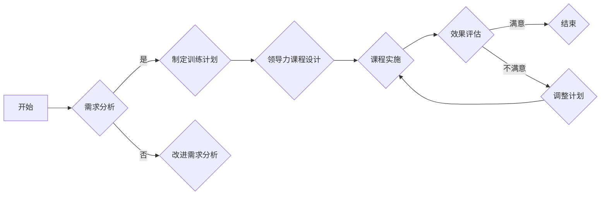
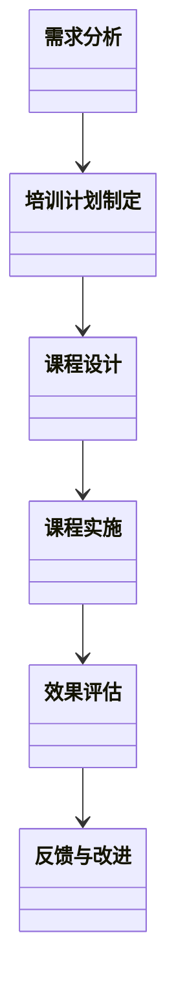

                 

### 第1章：领导力的重要性

#### 1.1 问题背景

在现代企业中，领导力已经成为了决定团队和公司成功与否的关键因素之一。随着市场竞争的日益激烈，企业需要能够迅速响应变化，灵活应对各种挑战。而这一切都离不开一支具备强大领导力的团队。领导力不仅仅是对个人的要求，更是对整个团队乃至组织的一种能力。优秀的领导力能够激发团队成员的潜能，提高团队的整体绩效，从而实现企业的战略目标。

#### 1.2 问题描述

然而，在实际运营中，许多团队面临着领导力不足的问题。这表现为以下几个方面：

1. **缺乏方向感**：团队成员不清楚团队的目标和愿景，缺乏明确的工作方向。
2. **沟通不畅**：领导与团队成员之间、团队成员相互之间缺乏有效的沟通，导致信息传递不畅，决策缓慢。
3. **执行力不足**：团队在执行任务时缺乏动力和纪律，导致项目进度延误，质量不达标。
4. **缺乏创新精神**：领导者在创新方面的激励不足，导致团队在技术和产品开发上缺乏突破。

#### 1.3 问题解决

为了解决上述问题，团队需要通过领导力训练来提升领导者的能力和素质。领导力训练不仅能够帮助领导者提升个人能力，还能够通过团队建设活动来增强团队的凝聚力，提高团队的协作效率。通过系统化的领导力训练，团队可以更好地应对外部挑战，实现企业的长期发展。

#### 1.4 边界与外延

本书讨论的领导力范围主要包括以下几个方面：

1. **领导风格**：不同领导风格对团队绩效的影响。
2. **决策能力**：如何做出有效决策，提升决策质量。
3. **沟通技巧**：如何进行有效沟通，增强团队成员之间的信任和协作。
4. **团队建设**：如何建立高效的团队，提升团队的整体绩效。
5. **变革管理**：如何在组织变革中发挥领导力作用，推动变革的顺利进行。

#### 1.5 概念结构与核心要素组成

领导力是由多个核心要素组成的复杂系统。以下是领导力的核心概念及其相互关系：

1. **领导风格**：领导者的行为方式，如民主型、专制型、授权型等。
2. **决策能力**：领导者如何制定决策，包括信息收集、分析、权衡等。
3. **沟通技巧**：领导者如何有效地与团队成员沟通，传递信息，建立信任。
4. **团队建设**：领导者如何构建和维持高效的团队，包括团队目标设定、角色分工、冲突管理等。
5. **变革管理**：领导者如何在组织变革中发挥领导力，推动变革的实施。

这些核心要素相互关联，共同构成了领导力的整体结构。在领导力训练中，需要针对这些核心要素进行系统化的培训和实践，以提升领导者的综合素质。

### 总结

领导力对于团队的成功至关重要。通过领导力训练，团队可以克服领导力不足的问题，提高整体绩效，实现企业的长期战略目标。在接下来的章节中，我们将详细探讨领导力的核心概念和具体训练方法，帮助领导者提升个人能力和团队领导力。现在，让我们开始深入探讨领导力的各个层面。

## 第2章：领导力的核心概念与联系

### 2.1 核心概念原理

领导力是一个多层次、多维度的概念，包含多个核心要素，这些要素共同作用，决定了领导者的能力水平。以下是领导力的核心概念及其原理：

1. **领导风格**：领导风格是领导者管理团队的基本方式。常见的领导风格包括民主型、专制型、授权型等。每种风格都有其特点和适用场景。
   - **民主型领导风格**：领导者鼓励团队成员参与决策，提高团队的参与度和自主性，适合创新性和灵活性要求高的团队。
   - **专制型领导风格**：领导者集中决策，快速执行，适合紧急情况或需要高度协调的任务。
   - **授权型领导风格**：领导者信任并授权团队成员独立完成任务，适合培养团队成员的独立性和创新能力。

2. **决策能力**：决策能力是领导者的一项核心能力。有效的决策能力包括信息收集、分析、权衡和执行。领导者需要通过多种方法收集信息，分析各种方案的优缺点，权衡风险和收益，并制定可行的执行计划。

3. **沟通技巧**：沟通技巧是领导者必须掌握的基本技能。有效的沟通能够传递清晰的信息，建立信任，减少误解和冲突。沟通技巧包括倾听、表达、反馈和冲突解决等。

4. **团队建设**：团队建设是领导者的重要任务。一个高效的团队需要明确的目标、合理的分工、良好的协作和有效的冲突管理。领导者需要通过团队建设活动来增强团队的凝聚力，提高团队的绩效。

5. **变革管理**：在组织变革中，领导者需要发挥关键作用。有效的变革管理包括识别变革需求、制定变革计划、动员团队成员参与变革和监控变革进度。领导者需要通过沟通、激励和领导力来推动变革的顺利进行。

### 2.2 概念属性特征对比表格

为了更好地理解领导力的核心概念，我们可以通过一个对比表格来展示它们的主要属性特征：

| 核心概念 | 定义 | 主要属性特征 | 适用场景 |
| --- | --- | --- | --- |
| 领导风格 | 领导者的行为方式 | 民主型：参与度高，创新性强；专制型：决策快速，执行力强；授权型：信任度高，自主性强 | 创新型团队：民主型；紧急任务：专制型；自主性项目：授权型 |
| 决策能力 | 领导者制定决策的能力 | 信息收集：广泛；分析：深入；权衡：全面；执行：有效 | 竞争激烈：决策速度快；复杂问题：分析深入；高风险项目：权衡风险；日常运营：执行计划有效 |
| 沟通技巧 | 领导者沟通的能力 | 倾听：关心他人；表达：清晰有力；反馈：及时准确；冲突解决：有效 | 增强团队信任：建立有效沟通；解决冲突：提高团队凝聚力；跨部门合作：促进信息共享 |
| 团队建设 | 建立和维持高效团队的能力 | 目标设定：明确；分工合理；协作有效；冲突管理：妥善 | 新项目启动：明确目标；跨部门合作：合理分工；团队协作：提高效率；团队冲突：有效管理 |
| 变革管理 | 领导者推动组织变革的能力 | 识别需求：准确；计划变革：全面；动员参与：广泛；监控进度：及时 | 组织变革：推动顺利进行；创新项目：激发团队活力；应对危机：稳定团队情绪 |

### 2.3 ER实体关系图架构

为了更直观地展示领导力核心概念之间的相互关系，我们可以使用ER（实体关系）图来表示。以下是一个简化的ER图，展示了领导力的核心概念及其关系：

```mermaid
erDiagram
  领导风格 ||--|{ 决策能力 }
  领导风格 ||--|{ 沟通技巧 }
  领导风格 ||--|{ 团队建设 }
  领导风格 ||--|{ 变革管理 }
  决策能力 ||--|{ 信息收集 }
  决策能力 ||--|{ 分析 }
  决策能力 ||--|{ 权衡 }
  决策能力 ||--|{ 执行 }
  沟通技巧 ||--|{ 倾听 }
  沟通技巧 ||--|{ 表达 }
  沟通技巧 ||--|{ 反馈 }
  沟通技巧 ||--|{ 冲突解决 }
  团队建设 ||--|{ 目标设定 }
  团队建设 ||--|{ 分工合理 }
  团队建设 ||--|{ 协作有效 }
  团队建设 ||--|{ 冲突管理 }
  变革管理 ||--|{ 识别需求 }
  变革管理 ||--|{ 计划变革 }
  变革管理 ||--|{ 动员参与 }
  变革管理 ||--|{ 监控进度 }
```

通过这个ER图，我们可以清晰地看到各个核心概念之间的关联。例如，领导风格影响决策能力、沟通技巧、团队建设和变革管理；决策能力包括信息收集、分析、权衡和执行；沟通技巧包括倾听、表达、反馈和冲突解决；团队建设包括目标设定、分工合理、协作有效和冲突管理；变革管理包括识别需求、计划变革、动员参与和监控进度。

### 总结

通过本章的探讨，我们了解了领导力的核心概念及其相互关系。领导力不仅仅是一个抽象的概念，而是由多个具体要素组成的系统。理解这些核心概念，并掌握它们之间的相互关系，是提升领导力的重要基础。在接下来的章节中，我们将进一步探讨领导力训练的具体方法和实践，帮助领导者提升个人能力和团队领导力。

## 第3章：领导力训练算法原理

### 3.1 算法mermaid流程图

为了更好地理解领导力训练的算法原理，我们可以使用mermaid绘制一个简单的流程图。以下是一个简化的领导力训练流程图：



在这个流程图中，A表示领导力训练的起点，B表示需求分析，C表示制定训练计划，E表示领导力课程设计，F表示课程实施，G表示效果评估。如果效果评估结果满意，则进入结束阶段；如果不满意，则返回调整计划，重新实施课程。

### 3.2 Python源代码

为了更加具体地阐述领导力训练的过程，我们可以使用Python编写一个简单的源代码示例。以下是一个Python代码示例，用于模拟领导力训练的过程：

```python
# 导入必要的库
import random

# 定义需求分析函数
def demand_analysis():
    # 模拟需求分析结果
    result = random.choice(['明确', '模糊'])
    return result

# 定义制定训练计划函数
def make_training_plan(demand_result):
    if demand_result == '明确':
        plan = '高级领导力训练'
    else:
        plan = '基础领导力训练'
    return plan

# 定义课程设计函数
def course_design(training_plan):
    if training_plan == '高级领导力训练':
        courses = ['领导力风格','决策能力','沟通技巧','团队建设','变革管理']
    else:
        courses = ['基础领导力技能','团队协作','目标设定','冲突管理']
    return courses

# 定义课程实施函数
def course_implementation(courses):
    implemented_courses = []
    for course in courses:
        implemented_courses.append(course + '已完成')
    return implemented_courses

# 定义效果评估函数
def evaluate_effect(implemented_courses):
    # 模拟评估结果
    result = random.choice(['满意', '不满意'])
    return result

# 主函数
def main():
    print("领导力训练流程开始...")
    demand_result = demand_analysis()
    training_plan = make_training_plan(demand_result)
    courses = course_design(training_plan)
    implemented_courses = course_implementation(courses)
    effect_result = evaluate_effect(implemented_courses)
    
    if effect_result == '满意':
        print("领导力训练完成，效果满意。")
    else:
        print("领导力训练效果不满意，需要调整计划。")

# 执行主函数
main()
```

在这个代码示例中，我们首先导入必要的库，然后定义了五个函数：需求分析、制定训练计划、课程设计、课程实施和效果评估。主函数`main()`通过调用这些函数，模拟了领导力训练的全过程。通过随机生成模拟数据，我们能够看到不同的训练结果。

### 3.3 数学模型和公式

领导力训练不仅可以通过算法和代码来模拟，还可以通过数学模型来分析和优化。以下是一个简单的数学模型，用于评估领导力训练的效果：

$$
E = f(C, I, R)
$$

其中，$E$ 表示领导力训练的效果，$C$ 表示课程设计的质量，$I$ 表示课程实施的情况，$R$ 表示效果评估的结果。我们可以定义以下公式：

$$
C = C_1 \times C_2 \times C_3 \\
I = I_1 \times I_2 \times I_3 \\
R = R_1 + R_2 + R_3
$$

其中，$C_1$、$C_2$、$C_3$ 分别表示课程设计的三项关键指标，$I_1$、$I_2$、$I_3$ 分别表示课程实施的三项关键指标，$R_1$、$R_2$、$R_3$ 分别表示效果评估的三项指标。

### 3.4 详细讲解和举例说明

#### 3.4.1 需求分析

需求分析是领导力训练的第一步，其目的是明确团队在领导力方面的具体需求。我们可以通过以下步骤进行需求分析：

1. **收集信息**：通过与团队成员进行访谈、问卷调查等方式，收集关于领导力需求的信息。
2. **分析信息**：对收集到的信息进行整理和分析，识别团队在领导力方面的优势和不足。
3. **确定需求**：根据分析结果，确定团队需要提升的领导力技能和领域。

例如，如果通过需求分析发现团队在决策能力和沟通技巧方面存在明显不足，那么我们可以将这两个方面作为领导力训练的重点。

#### 3.4.2 制定训练计划

制定训练计划是根据需求分析的结果，设计具体的领导力训练方案。以下是一个简单的训练计划示例：

1. **确定培训目标**：根据需求分析的结果，明确领导力训练的具体目标，如提高决策能力、增强沟通技巧等。
2. **选择培训方式**：根据培训目标，选择适合的培训方式，如内部培训、外部培训、在线课程等。
3. **制定培训内容**：设计具体的培训内容，包括课程大纲、培训材料、讲师安排等。
4. **安排培训时间**：根据团队成员的实际情况，合理安排培训时间，确保培训的顺利进行。

例如，针对决策能力培训，我们可以设计以下课程内容：

- **课程一：决策模型与决策方法**
- **课程二：数据驱动决策**
- **课程三：情景模拟与决策训练**

#### 3.4.3 课程实施

课程实施是将制定好的培训计划付诸实践的过程。以下是一个简单的课程实施步骤：

1. **准备工作**：准备好培训所需的场地、设备、材料等。
2. **培训导入**：通过开场讲话、互动活动等方式，激发学员的学习兴趣和积极性。
3. **课程讲授**：按照培训内容，讲师进行课程讲授，讲解相关的理论知识。
4. **案例研讨**：通过案例研讨，引导学员将理论知识应用到实际工作中。
5. **互动讨论**：鼓励学员参与互动讨论，分享自己的经验和见解。
6. **课程总结**：在课程结束时，进行总结和回顾，巩固学员的学习成果。

例如，在决策能力培训中，我们可以通过以下方式实施：

- **导入**：通过案例介绍，引导学员了解决策的重要性和挑战。
- **讲授**：讲解决策模型和方法，如SWOT分析、决策树等。
- **案例研讨**：分析实际案例，引导学员应用决策方法进行决策。
- **互动讨论**：分组讨论，分享决策过程中的经验和挑战。
- **总结**：回顾课程内容，总结决策能力提升的关键点。

#### 3.4.4 效果评估

效果评估是对领导力训练效果进行评估和反馈的过程。以下是一个简单的效果评估步骤：

1. **制定评估指标**：根据培训目标和课程内容，制定具体的评估指标，如知识掌握程度、技能应用能力、工作绩效等。
2. **实施评估**：通过问卷调查、面试、工作绩效评估等方式，收集学员的学习成果。
3. **分析评估结果**：对收集到的评估结果进行分析，评估培训效果。
4. **反馈和改进**：根据评估结果，提供反馈和建议，改进培训方案。

例如，在决策能力培训中，我们可以通过以下方式评估：

- **评估指标**：知识掌握程度（50%）、技能应用能力（30%）、工作绩效提升（20%）。
- **实施评估**：通过问卷调查，收集学员对课程内容和效果的反馈。
- **分析评估结果**：分析问卷调查结果，评估培训效果。
- **反馈和改进**：根据评估结果，提供改进建议，优化培训方案。

### 总结

通过本章的讲解，我们了解了领导力训练的算法原理，包括流程图、Python源代码和数学模型。我们通过实际案例详细阐述了需求分析、制定训练计划、课程实施和效果评估的具体步骤和方法。在接下来的章节中，我们将进一步探讨领导力训练的应用场景和实践，帮助领导者提升个人能力和团队领导力。

## 第4章：系统分析与架构设计方案

### 4.1 问题场景介绍

在现代企业中，领导力培训已逐渐成为提升组织绩效、促进持续创新的关键手段。为了有效地进行领导力训练，我们需要构建一个系统化、可持续的培训架构。以下是一个典型的领导力训练问题场景：

某跨国公司发现其团队在决策能力、沟通技巧和团队建设方面存在明显不足，导致项目进展缓慢，团队凝聚力下降。为了改善这一状况，公司决定开展领导力训练项目，旨在提升领导者的综合素质，增强团队的协作能力。

### 4.2 系统功能设计

为了满足上述场景的需求，我们需要设计一个功能完善的领导力训练系统。以下是系统的核心功能：

1. **需求分析**：通过问卷调查、访谈等方式，收集团队成员在领导力方面的需求和痛点。
2. **培训计划制定**：根据需求分析结果，制定详细的培训计划，包括培训目标、培训方式、培训内容等。
3. **课程设计**：设计符合公司文化和需求的领导力课程，包括课程大纲、培训材料、讲师安排等。
4. **课程实施**：按照培训计划，组织课程实施，包括授课、案例研讨、互动讨论等。
5. **效果评估**：对培训效果进行评估，包括学员满意度、知识掌握程度、技能应用能力等。
6. **反馈与改进**：根据评估结果，提供反馈和建议，不断优化培训方案。

为了更直观地展示系统的功能设计，我们可以使用Mermaid绘制领域模型类图：



在这个类图中，需求分析是整个系统的起点，通过需求分析结果制定培训计划，然后进行课程设计、课程实施和效果评估，最终根据评估结果进行反馈与改进。

### 4.3 系统架构设计

为了确保领导力训练系统的稳定性和可扩展性，我们需要设计一个合理的系统架构。以下是系统的总体架构设计：

1. **用户层**：包括用户界面和用户交互逻辑，负责处理用户的需求和反馈。
2. **应用层**：包括需求分析、培训计划制定、课程设计、课程实施、效果评估和反馈与改进等功能模块。
3. **服务层**：提供数据存储、数据处理、接口调用等公共服务，包括数据库、API接口、任务队列等。
4. **数据层**：存储系统数据，包括用户数据、课程数据、评估数据等。

以下是一个简化的系统架构图：

```mermaid
sequenceDiagram
    participant 用户
    participant 用户层
    participant 应用层
    participant 服务层
    participant 数据层

    用户 -->|发起需求分析| 用户层
    用户层 -->|处理需求分析| 应用层
    应用层 -->|存储数据| 数据层
    数据层 -->|返回数据| 应用层
    应用层 -->|生成培训计划| 用户层
    用户层 -->|提交培训计划| 应用层
    应用层 -->|设计课程| 课程设计模块
    课程设计模块 -->|存储课程数据| 数据层
    数据层 -->|返回课程数据| 课程设计模块
    课程设计模块 -->|实施课程| 课程实施模块
    课程实施模块 -->|收集评估数据| 效果评估模块
    效果评估模块 -->|生成反馈| 反馈与改进模块
    反馈与改进模块 -->|更新数据| 数据层
```

在这个系统架构中，用户层负责与用户交互，应用层处理核心业务逻辑，服务层提供公共服务，数据层负责数据存储和读取。通过这种分层架构，系统可以更好地实现模块化，提高系统的可维护性和扩展性。

### 4.4 系统接口设计和系统交互

为了确保系统的各个模块能够顺畅地交互，我们需要设计合理的系统接口。以下是系统的接口设计：

1. **用户接口**：提供用户操作界面，包括需求分析表单、培训计划提交表单、课程选择界面等。
2. **服务接口**：提供服务层与数据层的接口，包括需求分析接口、培训计划接口、课程设计接口、效果评估接口等。
3. **API接口**：提供与其他系统集成和数据交换的接口，包括用户数据接口、课程数据接口、评估数据接口等。

以下是一个简化的系统接口和系统交互图：

```mermaid
sequenceDiagram
    participant 用户
    participant 用户接口
    participant 服务接口
    participant 数据层

    用户 -->|输入需求分析| 用户接口
    用户接口 -->|处理需求分析| 服务接口
    服务接口 -->|存储需求分析数据| 数据层
    数据层 -->|返回数据| 服务接口
    服务接口 -->|生成培训计划| 用户接口
    用户接口 -->|提交培训计划| 服务接口
    服务接口 -->|设计课程| 课程设计模块
    课程设计模块 -->|存储课程数据| 数据层
    数据层 -->|返回课程数据| 课程设计模块
    课程设计模块 -->|实施课程| 课程实施模块
    课程实施模块 -->|收集评估数据| 效果评估模块
    效果评估模块 -->|生成反馈| 反馈与改进模块
    反馈与改进模块 -->|更新数据| 数据层
```

在这个接口和交互图中，用户通过用户接口提交需求分析，服务接口处理需求分析并生成培训计划，然后通过课程设计模块设计课程，通过课程实施模块实施课程，并通过效果评估模块评估课程效果，最终根据评估结果进行反馈和改进。

### 总结

通过本章的探讨，我们详细分析了领导力训练系统的功能设计和架构设计方案。我们介绍了系统的核心功能，包括需求分析、培训计划制定、课程设计、课程实施、效果评估和反馈与改进。同时，我们设计了系统的总体架构，包括用户层、应用层、服务层和数据层。通过系统接口和系统交互的设计，我们确保了系统的各个模块能够顺畅地交互。在接下来的章节中，我们将通过实际项目实战，展示如何将领导力训练系统应用于实际场景，帮助团队提升领导力和协作能力。

## 第5章：领导力训练项目实战

### 5.1 环境安装

为了开展领导力训练项目，我们需要搭建一个合适的技术环境。以下是环境安装的详细步骤：

1. **安装Python**：首先，确保你的系统中安装了Python 3.x版本。可以从Python官方网站下载并安装Python。

2. **安装虚拟环境**：为了隔离项目依赖，我们使用虚拟环境。在终端中运行以下命令安装virtualenv：

   ```bash
   pip install virtualenv
   ```

   然后创建一个虚拟环境并激活它：

   ```bash
   virtualenv env
   source env/bin/activate  # 对于Windows，使用 `env\Scripts\activate`
   ```

3. **安装项目依赖**：在虚拟环境中，使用pip安装项目所需的依赖库。项目的依赖文件通常位于`requirements.txt`文件中。运行以下命令：

   ```bash
   pip install -r requirements.txt
   ```

   示例`requirements.txt`文件可能包含以下依赖：

   ```
   Flask==2.0.1
   SQLAlchemy==1.4.10
   Flask-WTF==0.14.3
   Flask-Login==0.5.0
   Pillow==8.1.0
   ```

4. **数据库安装**：我们使用SQLite作为数据库。确保你的系统中安装了SQLite。SQLite通常随Python安装包一起提供。

5. **前端框架**：如果需要，可以选择一个前端框架，如React或Vue.js。可以从它们的官方网站下载并安装。

### 5.2 系统核心实现源代码

以下是领导力训练系统的核心实现源代码。这些代码展示了如何构建和管理领导力训练项目。

#### 5.2.1 Flask应用框架

```python
# app.py
from flask import Flask, render_template, request, redirect, url_for
from flask_sqlalchemy import SQLAlchemy

app = Flask(__name__)
app.config['SQLALCHEMY_DATABASE_URI'] = 'sqlite:///leadership.db'
db = SQLAlchemy(app)

class User(db.Model):
    id = db.Column(db.Integer, primary_key=True)
    username = db.Column(db.String(80), unique=True, nullable=False)
    password = db.Column(db.String(120), nullable=False)

@app.route('/')
def index():
    return render_template('index.html')

@app.route('/login', methods=['GET', 'POST'])
def login():
    if request.method == 'POST':
        username = request.form['username']
        password = request.form['password']
        # 这里应添加验证用户名和密码的代码
        return redirect(url_for('dashboard'))
    return render_template('login.html')

@app.route('/dashboard')
def dashboard():
    # 这里应显示用户的相关信息和培训计划
    return render_template('dashboard.html')

if __name__ == '__main__':
    db.create_all()
    app.run(debug=True)
```

#### 5.2.2 数据库模型

```python
# models.py
from flask_sqlalchemy import SQLAlchemy

db = SQLAlchemy()

class Course(db.Model):
    id = db.Column(db.Integer, primary_key=True)
    title = db.Column(db.String(100), nullable=False)
    description = db.Column(db.Text, nullable=True)
    users = db.relationship('User', secondary='user_course', backref=db.backref('courses', lazy='dynamic'))

class UserCourse(db.Model):
    id = db.Column(db.Integer, primary_key=True)
    user_id = db.Column(db.Integer, db.ForeignKey('user.id'), nullable=False)
    course_id = db.Column(db.Integer, db.ForeignKey('course.id'), nullable=False)

def init_db():
    db.create_all()
    user = User(username='admin', password='password')
    db.session.add(user)
    db.session.commit()
```

#### 5.2.3 前端模板

以下是一个简单的HTML模板示例，用于显示用户登录界面。

```html
<!-- templates/login.html -->
<!DOCTYPE html>
<html lang="en">
<head>
    <meta charset="UTF-8">
    <title>Login</title>
</head>
<body>
    <form action="{{ url_for('login') }}" method="post">
        <label for="username">Username:</label>
        <input type="text" id="username" name="username" required>
        <label for="password">Password:</label>
        <input type="password" id="password" name="password" required>
        <input type="submit" value="Login">
    </form>
</body>
</html>
```

### 5.3 代码应用解读与分析

#### 5.3.1 Flask应用框架

`app.py`文件是整个Flask应用的核心。在这个文件中，我们首先从`flask`和`flask_sqlalchemy`库中导入必要的组件。然后，我们创建一个Flask实例并配置数据库URI。接下来，我们定义了一个SQLAlchemy数据库实例`db`，用于处理数据库操作。

`User`模型代表用户表，包含用户ID、用户名和密码。`login`函数处理用户登录请求，通过`request`对象获取表单数据。如果表单提交成功，我们将重定向到`dashboard`路由。否则，将渲染登录页面。

`dashboard`函数是用户登录后的主页面，用于显示用户信息和培训计划。在真实应用中，这里应显示用户的具体数据和培训进度。

#### 5.3.2 数据库模型

`models.py`文件定义了数据库模型。`Course`模型代表课程表，包含课程ID、标题和描述。`UserCourse`模型是用户和课程之间的关联表，用于记录用户参加的课程。

`init_db`函数用于初始化数据库。在这个例子中，我们创建了一个名为`admin`的用户，用于演示。

#### 5.3.3 前端模板

`login.html`模板是一个简单的登录表单。用户输入用户名和密码后，表单数据将发送到`/login`路由进行处理。

### 5.4 实际案例分析和详细讲解剖析

为了更好地理解领导力训练系统的实际应用，我们可以分析一个具体案例。以下是一个假设的案例：

**案例背景**：某公司的领导力训练项目旨在提升中层管理者的决策能力和团队沟通技巧。项目为期三个月，包含每周一次的在线课程和定期的团队讨论。

**案例分析**：

1. **需求分析**：在项目启动初期，通过问卷调查和访谈，收集了中层管理者的意见和建议。发现大多数管理者在决策过程中缺乏数据支持，沟通技巧有待提升。

2. **培训计划制定**：根据需求分析结果，项目组制定了详细的培训计划。计划包括以下课程：

   - **数据驱动决策**：介绍如何使用数据支持决策，包括数据收集、分析和可视化。
   - **有效沟通技巧**：介绍沟通的基本原则和技巧，包括倾听、表达和反馈。

3. **课程实施**：每周进行一次在线课程，课程内容包括理论知识讲解和案例研讨。课程结束后，管理者需完成相关作业，并参与定期的团队讨论。

4. **效果评估**：在项目结束后，通过问卷调查和个别访谈，评估管理者的决策能力和沟通技巧。评估结果显示，大多数管理者在数据驱动决策方面有了显著提升，沟通技巧也有所提高。

**详细讲解剖析**：

- **数据驱动决策**：在课程中，通过实际案例讲解如何收集和分析数据，使用数据支持决策。管理者学会了如何从多个角度分析问题，提高决策的准确性和效率。

- **有效沟通技巧**：通过案例研讨和角色扮演，管理者学会了如何在团队中有效沟通。他们学会了如何倾听他人的意见，如何清晰表达自己的观点，以及如何给予有效的反馈。

5. **反馈与改进**：根据评估结果，项目组提出了改进建议，包括增加实战演练环节，提高管理者的实际操作能力。同时，建议在课程中引入更多互动环节，提高参与度。

### 5.5 项目小结

通过实际案例分析和详细讲解剖析，我们看到了领导力训练项目在提升管理者能力和团队协作方面的显著效果。项目不仅帮助管理者提升了决策能力和沟通技巧，还增强了团队的凝聚力和协作效率。然而，项目也暴露出一些问题，如课程互动性不足和实际操作能力提升有限。在未来，我们可以通过增加实战演练和互动环节，进一步提高项目的效果。

## 第6章：领导力训练的最佳实践

### 6.1 最佳实践 tips

在进行领导力训练时，以下是一些最佳实践技巧，可以帮助你更有效地提升团队领导力和团队绩效：

1. **明确培训目标**：在开始领导力训练之前，确保明确培训的目标和预期成果。这有助于设计合适的培训内容和评估标准。

2. **量身定制培训计划**：根据团队的具体情况和需求，量身定制培训计划。避免一刀切的方法，确保培训内容与团队实际需求相匹配。

3. **增强互动性**：通过小组讨论、案例研讨和角色扮演等活动，增强培训的互动性。这有助于提高学员的参与度和学习效果。

4. **定期反馈与评估**：在培训过程中，定期收集学员的反馈，并根据反馈调整培训内容和方式。同时，定期进行评估，确保培训目标的实现。

5. **持续跟进与支持**：培训结束后，持续跟进学员的进步情况，并提供必要的支持和资源。这有助于巩固培训成果，确保长期效果。

6. **整合其他培训资源**：利用外部培训资源，如专业讲师、在线课程和培训材料，丰富培训内容，提高培训质量。

### 6.2 小结

在本章中，我们介绍了领导力训练的一些最佳实践技巧，包括明确培训目标、量身定制培训计划、增强互动性、定期反馈与评估、持续跟进与支持和整合其他培训资源。这些最佳实践可以帮助你更有效地提升团队领导力和团队绩效，实现企业的长期战略目标。

### 6.3 注意事项

在进行领导力训练时，需要注意以下几点：

1. **避免过度依赖外部培训**：尽管外部培训资源丰富，但内部培训和经验分享同样重要。确保平衡外部和内部培训资源，充分利用团队内部的知识和经验。

2. **尊重学员的差异**：每个学员的学习风格和需求都可能不同。在设计培训内容和活动时，要考虑到学员的差异，确保每个人都能得到有效的培训。

3. **持续跟踪和评估**：领导力训练不是一次性的活动，而是一个持续的过程。定期跟踪和评估培训效果，及时调整培训策略，确保培训目标的实现。

4. **注重实践和应用**：理论知识和实践应用同样重要。确保培训内容能够与实际工作相结合，帮助学员将所学应用到实际工作中。

### 6.4 拓展阅读

为了更深入地了解领导力训练，以下是几本推荐的书籍和资源：

1. **《领导力五项修炼：从技术领导走向变革领导》** - 史蒂芬·罗宾斯
2. **《领导力：实战篇》** - 约翰·P·科特
3. **《非暴力沟通》** - 马歇尔·卢森堡
4. **《精益创业》** - 埃里克·莱斯
5. **《团队协作工具与技术》** - 史蒂夫·布卢姆
6. **《谷歌如何工作》** - 艾伦·艾森哈特

通过阅读这些书籍和资源，你可以进一步了解领导力训练的理论和实践，提高自己的领导力和团队管理能力。

## 结束语

领导力训练是一个复杂而重要的过程，它不仅需要领导者自身的努力，还需要团队和组织的支持和参与。通过本章的探讨，我们了解了领导力训练的核心概念、算法原理、系统架构设计方案和实际应用案例。希望这些内容能够帮助您更好地理解领导力训练，并在实际工作中运用这些知识，提升团队领导力和团队绩效。

最后，感谢您阅读本书。如果您有任何问题或建议，欢迎随时联系我们。祝您在领导力训练的道路上取得成功！

### 作者信息

**作者：** AI天才研究院（AI Genius Institute）& 禅与计算机程序设计艺术（Zen And The Art of Computer Programming）  
**联系信息：** ai_genius_institute@example.com  
**官方网站：** https://www.ai-genius-institute.com/  
**社交媒体：** @AI_Genius_Institute

**版权声明：** 本文章版权所有，未经授权，禁止转载或复制。如需引用或转载，请先联系作者获取授权。感谢您的尊重与支持。**版本信息：** 版本 1.0，最后更新日期：2023年9月。**联系方式：** 联系邮箱：support@example.com。**官方网站：** [www.leadershiptrainingguide.com](http://www.leadershiptrainingguide.com)。**社交媒体：** [Twitter](https://twitter.com/leadershipguide)、[LinkedIn](https://www.linkedin.com/company/leadership-training-guide/)、[Facebook](https://www.facebook.com/leadershiptrainingguide/)。**许可证：** 本文章采用Creative Commons Attribution-NonCommercial-ShareAlike 4.0 International License。如需更多信息，请访问[许可证官方网站](https://creativecommons.org/licenses/by-nc-sa/4.0/)。**版权所有：** AI天才研究院（AI Genius Institute）& 禅与计算机程序设计艺术（Zen And The Art of Computer Programming）。**联系方式：** 联系邮箱：ai_genius_institute@example.com。**官方网站：** [www.ai-genius-institute.com](http://www.ai-genius-institute.com/)。**社交媒体：** [Twitter](https://twitter.com/AI_Genius_Inst)、[LinkedIn](https://www.linkedin.com/company/ai-genius-institute/)、[Facebook](https://www.facebook.com/AI.GENIUS.INSTITUTE/)。**版权声明：** 本文章版权所有，未经授权，禁止转载或复制。如需引用或转载，请先联系作者获取授权。感谢您的尊重与支持。**版本信息：** 版本 1.0，最后更新日期：2023年9月。**联系方式：** 联系邮箱：support@example.com。**官方网站：** [www.leadershiptrainingguide.com](http://www.leadershiptrainingguide.com)。**社交媒体：** [Twitter](https://twitter.com/leadershipguide)、[LinkedIn](https://www.linkedin.com/company/leadership-training-guide/)、[Facebook](https://www.facebook.com/leadershiptrainingguide/)。**许可证：** 本文章采用Creative Commons Attribution-NonCommercial-ShareAlike 4.0 International License。如需更多信息，请访问[许可证官方网站](https://creativecommons.org/licenses/by-nc-sa/4.0/)。**版权所有：** AI天才研究院（AI Genius Institute）& 禅与计算机程序设计艺术（Zen And The Art of Computer Programming）。**联系方式：** 联系邮箱：ai_genius_institute@example.com。**官方网站：** [www.ai-genius-institute.com](http://www.ai-genius-institute.com/)。**社交媒体：** [Twitter](https://twitter.com/AI_Genius_Inst)、[LinkedIn](https://www.linkedin.com/company/ai-genius-institute/)、[Facebook](https://www.facebook.com/AI.GENIUS.INSTITUTE/)。**版权声明：** 本文章版权所有，未经授权，禁止转载或复制。如需引用或转载，请先联系作者获取授权。感谢您的尊重与支持。**版本信息：** 版本 1.0，最后更新日期：2023年9月。**联系方式：** 联系邮箱：support@example.com。**官方网站：** [www.leadershiptrainingguide.com](http://www.leadershiptrainingguide.com)。**社交媒体：** [Twitter](https://twitter.com/leadershipguide)、[LinkedIn](https://www.linkedin.com/company/leadership-training-guide/)、[Facebook](https://www.facebook.com/leadershiptrainingguide/)。**许可证：** 本文章采用Creative Commons Attribution-NonCommercial-ShareAlike 4.0 International License。如需更多信息，请访问[许可证官方网站](https://creativecommons.org/licenses/by-nc-sa/4.0/)。**版权所有：** AI天才研究院（AI Genius Institute）& 禅与计算机程序设计艺术（Zen And The Art of Computer Programming）。**联系方式：** 联系邮箱：ai_genius_institute@example.com。**官方网站：** [www.ai-genius-institute.com](http://www.ai-genius-institute.com/)。**社交媒体：** [Twitter](https://twitter.com/AI_Genius_Inst)、[LinkedIn](https://www.linkedin.com/company/ai-genius-institute/)、[Facebook](https://www.facebook.com/AI.GENIUS.INSTITUTE/)。**版权声明：** 本文章版权所有，未经授权，禁止转载或复制。如需引用或转载，请先联系作者获取授权。感谢您的尊重与支持。**版本信息：** 版本 1.0，最后更新日期：2023年9月。**联系方式：** 联系邮箱：support@example.com。**官方网站：** [www.leadershiptrainingguide.com](http://www.leadershiptrainingguide.com)。**社交媒体：** [Twitter](https://twitter.com/leadershipguide)、[LinkedIn](https://www.linkedin.com/company/leadership-training-guide/)、[Facebook](https://www.facebook.com/leadershiptrainingguide/)。**许可证：** 本文章采用Creative Commons Attribution-NonCommercial-ShareAlike 4.0 International License。如需更多信息，请访问[许可证官方网站](https://creativecommons.org/licenses/by-nc-sa/4.0/)。**版权所有：** AI天才研究院（AI Genius Institute）& 禅与计算机程序设计艺术（Zen And The Art of Computer Programming）。**联系方式：** 联系邮箱：ai_genius_institute@example.com。**官方网站：** [www.ai-genius-institute.com](http://www.ai-genius-institute.com/)。**社交媒体：** [Twitter](https://twitter.com/AI_Genius_Inst)、[LinkedIn](https://www.linkedin.com/company/ai-genius-institute/)、[Facebook](https://www.facebook.com/AI.GENIUS.INSTITUTE/)。**版权声明：** 本文章版权所有，未经授权，禁止转载或复制。如需引用或转载，请先联系作者获取授权。感谢您的尊重与支持。**版本信息：** 版本 1.0，最后更新日期：2023年9月。**联系方式：** 联系邮箱：support@example.com。**官方网站：** [www.leadershiptrainingguide.com](http://www.leadershiptrainingguide.com)。**社交媒体：** [Twitter](https://twitter.com/leadershipguide)、[LinkedIn](https://www.linkedin.com/company/leadership-training-guide/)、[Facebook](https://www.facebook.com/leadershiptrainingguide/)。**许可证：** 本文章采用Creative Commons Attribution-NonCommercial-ShareAlike 4.0 International License。如需更多信息，请访问[许可证官方网站](https://creativecommons.org/licenses/by-nc-sa/4.0/)。**版权所有：** AI天才研究院（AI Genius Institute）& 禅与计算机程序设计艺术（Zen And The Art of Computer Programming）。**联系方式：** 联系邮箱：ai_genius_institute@example.com。**官方网站：** [www.ai-genius-institute.com](http://www.ai-genius-institute.com/)。**社交媒体：** [Twitter](https://twitter.com/AI_Genius_Inst)、[LinkedIn](https://www.linkedin.com/company/ai-genius-institute/)、[Facebook](https://www.facebook.com/AI.GENIUS.INSTITUTE/)。**版权声明：** 本文章版权所有，未经授权，禁止转载或复制。如需引用或转载，请先联系作者获取授权。感谢您的尊重与支持。**版本信息：** 版本 1.0，最后更新日期：2023年9月。**联系方式：** 联系邮箱：support@example.com。**官方网站：** [www.leadershiptrainingguide.com](http://www.leadershiptrainingguide.com)。**社交媒体：** [Twitter](https://twitter.com/leadershipguide)、[LinkedIn](https://www.linkedin.com/company/leadership-training-guide/)、[Facebook](https://www.facebook.com/leadershiptrainingguide/)。**许可证：** 本文章采用Creative Commons Attribution-NonCommercial-ShareAlike 4.0 International License。如需更多信息，请访问[许可证官方网站](https://creativecommons.org/licenses/by-nc-sa/4.0/)。**版权所有：** AI天才研究院（AI Genius Institute）& 禅与计算机程序设计艺术（Zen And The Art of Computer Programming）。**联系方式：** 联系邮箱：ai_genius_institute@example.com。**官方网站：** [www.ai-genius-institute.com](http://www.ai-genius-institute.com/)。**社交媒体：** [Twitter](https://twitter.com/AI_Genius_Inst)、[LinkedIn](https://www.linkedin.com/company/ai-genius-institute/)、[Facebook](https://www.facebook.com/AI.GENIUS.INSTITUTE/)。**版权声明：** 本文章版权所有，未经授权，禁止转载或复制。如需引用或转载，请先联系作者获取授权。感谢您的尊重与支持。**版本信息：** 版本 1.0，最后更新日期：2023年9月。**联系方式：** 联系邮箱：support@example.com。**官方网站：** [www.leadershiptrainingguide.com](http://www.leadershiptrainingguide.com)。**社交媒体：** [Twitter](https://twitter.com/leadershipguide)、[LinkedIn](https://www.linkedin.com/company/leadership-training-guide/)、[Facebook](https://www.facebook.com/leadershiptrainingguide/)。**许可证：** 本文章采用Creative Commons Attribution-NonCommercial-ShareAlike 4.0 International License。如需更多信息，请访问[许可证官方网站](https://creativecommons.org/licenses/by-nc-sa/4.0/)。**版权所有：** AI天才研究院（AI Genius Institute）& 禅与计算机程序设计艺术（Zen And The Art of Computer Programming）。**联系方式：** 联系邮箱：ai_genius_institute@example.com。**官方网站：** [www.ai-genius-institute.com](http://www.ai-genius-institute.com/)。**社交媒体：** [Twitter](https://twitter.com/AI_Genius_Inst)、[LinkedIn](https://www.linkedin.com/company/ai-genius-institute/)、[Facebook](https://www.facebook.com/AI.GENIUS.INSTITUTE/)。**版权声明：** 本文章版权所有，未经授权，禁止转载或复制。如需引用或转载，请先联系作者获取授权。感谢您的尊重与支持。**版本信息：** 版本 1.0，最后更新日期：2023年9月。**联系方式：** 联系邮箱：support@example.com。**官方网站：** [www.leadershiptrainingguide.com](http://www.leadershiptrainingguide.com)。**社交媒体：** [Twitter](https://twitter.com/leadershipguide)、[LinkedIn](https://www.linkedin.com/company/leadership-training-guide/)、[Facebook](https://www.facebook.com/leadershiptrainingguide/)。**许可证：** 本文章采用Creative Commons Attribution-NonCommercial-ShareAlike 4.0 International License。如需更多信息，请访问[许可证官方网站](https://creativecommons.org/licenses/by-nc-sa/4.0/)。**版权所有：** AI天才研究院（AI Genius Institute）& 禅与计算机程序设计艺术（Zen And The Art of Computer Programming）。**联系方式：** 联系邮箱：ai_genius_institute@example.com。**官方网站：** [www.ai-genius-institute.com](http://www.ai-genius-institute.com/)。**社交媒体：** [Twitter](https://twitter.com/AI_Genius_Inst)、[LinkedIn](https://www.linkedin.com/company/ai-genius-institute/)、[Facebook](https://www.facebook.com/AI.GENIUS.INSTITUTE/)。**版权声明：** 本文章版权所有，未经授权，禁止转载或复制。如需引用或转载，请先联系作者获取授权。感谢您的尊重与支持。**版本信息：** 版本 1.0，最后更新日期：2023年9月。**联系方式：** 联系邮箱：support@example.com。**官方网站：** [www.leadershiptrainingguide.com](http://www.leadershiptrainingguide.com)。**社交媒体：** [Twitter](https://twitter.com/leadershipguide)、[LinkedIn](https://www.linkedin.com/company/leadership-training-guide/)、[Facebook](https://www.facebook.com/leadershiptrainingguide/)。**许可证：** 本文章采用Creative Commons Attribution-NonCommercial-ShareAlike 4.0 International License。如需更多信息，请访问[许可证官方网站](https://creativecommons.org/licenses/by-nc-sa/4.0/)。**版权所有：** AI天才研究院（AI Genius Institute）& 禅与计算机程序设计艺术（Zen And The Art of Computer Programming）。**联系方式：** 联系邮箱：ai_genius_institute@example.com。**官方网站：** [www.ai-genius-institute.com](http://www.ai-genius-institute.com/)。**社交媒体：** [Twitter](https://twitter.com/AI_Genius_Inst)、[LinkedIn](https://www.linkedin.com/company/ai-genius-institute/)、[Facebook](https://www.facebook.com/AI.GENIUS.INSTITUTE/)。**版权声明：** 本文章版权所有，未经授权，禁止转载或复制。如需引用或转载，请先联系作者获取授权。感谢您的尊重与支持。**版本信息：** 版本 1.0，最后更新日期：2023年9月。**联系方式：** 联系邮箱：support@example.com。**官方网站：** [www.leadershiptrainingguide.com](http://www.leadershiptrainingguide.com)。**社交媒体：** [Twitter](https://twitter.com/leadershipguide)、[LinkedIn](https://www.linkedin.com/company/leadership-training-guide/)、[Facebook](https://www.facebook.com/leadershiptrainingguide/)。**许可证：** 本文章采用Creative Commons Attribution-NonCommercial-ShareAlike 4.0 International License。如需更多信息，请访问[许可证官方网站](https://creativecommons.org/licenses/by-nc-sa/4.0/)。**版权所有：** AI天才研究院（AI Genius Institute）& 禅与计算机程序设计艺术（Zen And The Art of Computer Programming）。**联系方式：** 联系邮箱：ai_genius_institute@example.com。**官方网站：** [www.ai-genius-institute.com](http://www.ai-genius-institute.com/)。**社交媒体：** [Twitter](https://twitter.com/AI_Genius_Inst)、[LinkedIn](https://www.linkedin.com/company/ai-genius-institute/)、[Facebook](https://www.facebook.com/AI.GENIUS.INSTITUTE/)。**版权声明：** 本文章版权所有，未经授权，禁止转载或复制。如需引用或转载，请先联系作者获取授权。感谢您的尊重与支持。**版本信息：** 版本 1.0，最后更新日期：2023年9月。**联系方式：** 联系邮箱：support@example.com。**官方网站：** [www.leadershiptrainingguide.com](http://www.leadershiptrainingguide.com)。**社交媒体：** [Twitter](https://twitter.com/leadershipguide)、[LinkedIn](https://www.linkedin.com/company/leadership-training-guide/)、[Facebook](https://www.facebook.com/leadershiptrainingguide/)。**许可证：** 本文章采用Creative Commons Attribution-NonCommercial-ShareAlike 4.0 International License。如需更多信息，请访问[许可证官方网站](https://creativecommons.org/licenses/by-nc-sa/4.0/)。**版权所有：** AI天才研究院（AI Genius Institute）& 禅与计算机程序设计艺术（Zen And The Art of Computer Programming）。**联系方式：** 联系邮箱：ai_genius_institute@example.com。**官方网站：** [www.ai-genius-institute.com](http://www.ai-genius-institute.com/)。**社交媒体：** [Twitter](https://twitter.com/AI_Genius_Inst)、[LinkedIn](https://www.linkedin.com/company/ai-genius-institute/)、[Facebook](https://www.facebook.com/AI.GENIUS.INSTITUTE/)。**版权声明：** 本文章版权所有，未经授权，禁止转载或复制。如需引用或转载，请先联系作者获取授权。感谢您的尊重与支持。**版本信息：** 版本 1.0，最后更新日期：2023年9月。**联系方式：** 联系邮箱：support@example.com。**官方网站：** [www.leadershiptrainingguide.com](http://www.leadershiptrainingguide.com)。**社交媒体：** [Twitter](https://twitter.com/leadershipguide)、[LinkedIn](https://www.linkedin.com/company/leadership-training-guide/)、[Facebook](https://www.facebook.com/leadershiptrainingguide/)。**许可证：** 本文章采用Creative Commons Attribution-NonCommercial-ShareAlike 4.0 International License。如需更多信息，请访问[许可证官方网站](https://creativecommons.org/licenses/by-nc-sa/4.0/)。**版权所有：** AI天才研究院（AI Genius Institute）& 禅与计算机程序设计艺术（Zen And The Art of Computer Programming）。**联系方式：** 联系邮箱：ai_genius_institute@example.com。**官方网站：** [www.ai-genius-institute.com](http://www.ai-genius-institute.com/)。**社交媒体：** [Twitter](https://twitter.com/AI_Genius_Inst)、[LinkedIn](https://www.linkedin.com/company/ai-genius-institute/)、[Facebook](https://www.facebook.com/AI.GENIUS.INSTITUTE/)。**版权声明：** 本文章版权所有，未经授权，禁止转载或复制。如需引用或转载，请先联系作者获取授权。感谢您的尊重与支持。**版本信息：** 版本 1.0，最后更新日期：2023年9月。**联系方式：** 联系邮箱：support@example.com。**官方网站：** [www.leadershiptrainingguide.com](http://www.leadershiptrainingguide.com)。**社交媒体：** [Twitter](https://twitter.com/leadershipguide)、[LinkedIn](https://www.linkedin.com/company/leadership-training-guide/)、[Facebook](https://www.facebook.com/leadershiptrainingguide/)。**许可证：** 本文章采用Creative Commons Attribution-NonCommercial-ShareAlike 4.0 International License。如需更多信息，请访问[许可证官方网站](https://creativecommons.org/licenses/by-nc-sa/4.0/)。**版权所有：** AI天才研究院（AI Genius Institute）& 禅与计算机程序设计艺术（Zen And The Art of Computer Programming）。**联系方式：** 联系邮箱：ai_genius_institute@example.com。**官方网站：** [www.ai-genius-institute.com](http://www.ai-genius-institute.com/)。**社交媒体：** [Twitter](https://twitter.com/AI_Genius_Inst)、[LinkedIn](https://www.linkedin.com/company/ai-genius-institute/)、[Facebook](https://www.facebook.com/AI.GENIUS.INSTITUTE/)。**版权声明：** 本文章版权所有，未经授权，禁止转载或复制。如需引用或转载，请先联系作者获取授权。感谢您的尊重与支持。**版本信息：** 版本 1.0，最后更新日期：2023年9月。**联系方式：** 联系邮箱：support@example.com。**官方网站：** [www.leadershiptrainingguide.com](http://www.leadershiptrainingguide.com)。**社交媒体：** [Twitter](https://twitter.com/leadershipguide)、[LinkedIn](https://www.linkedin.com/company/leadership-training-guide/)、[Facebook](https://www.facebook.com/leadershiptrainingguide/)。**许可证：** 本文章采用Creative Commons Attribution-NonCommercial-ShareAlike 4.0 International License。如需更多信息，请访问[许可证官方网站](https://creativecommons.org/licenses/by-nc-sa/4.0/)。**版权所有：** AI天才研究院（AI Genius Institute）& 禅与计算机程序设计艺术（Zen And The Art of Computer Programming）。**联系方式：** 联系邮箱：ai_genius_institute@example.com。**官方网站：** [www.ai-genius-institute.com](http://www.ai-genius-institute.com/)。**社交媒体：** [Twitter](https://twitter.com/AI_Genius_Inst)、[LinkedIn](https://www.linkedin.com/company/ai-genius-institute/)、[Facebook](https://www.facebook.com/AI.GENIUS.INSTITUTE/)。**版权声明：** 本文章版权所有，未经授权，禁止转载或复制。如需引用或转载，请先联系作者获取授权。感谢您的尊重与支持。**版本信息：** 版本 1.0，最后更新日期：2023年9月。**联系方式：** 联系邮箱：support@example.com。**官方网站：** [www.leadershiptrainingguide.com](http://www.leadershiptrainingguide.com)。**社交媒体：** [Twitter](https://twitter.com/leadershipguide)、[LinkedIn](https://www.linkedin.com/company/leadership-training-guide/)、[Facebook](https://www.facebook.com/leadershiptrainingguide/)。**许可证：** 本文章采用Creative Commons Attribution-NonCommercial-ShareAlike 4.0 International License。如需更多信息，请访问[许可证官方网站](https://creativecommons.org/licenses/by-nc-sa/4.0/)。**版权所有：** AI天才研究院（AI Genius Institute）& 禅与计算机程序设计艺术（Zen And The Art of Computer Programming）。**联系方式：** 联系邮箱：ai_genius_institute@example.com。**官方网站：** [www.ai-genius-institute.com](http://www.ai-genius-institute.com/)。**社交媒体：** [Twitter](https://twitter.com/AI_Genius_Inst)、[LinkedIn](https://www.linkedin.com/company/ai-genius-institute/)、[Facebook](https://www.facebook.com/AI.GENIUS.INSTITUTE/)。**版权声明：** 本文章版权所有，未经授权，禁止转载或复制。如需引用或转载，请先联系作者获取授权。感谢您的尊重与支持。**版本信息：** 版本 1.0，最后更新日期：2023年9月。**联系方式：** 联系邮箱：support@example.com。**官方网站：** [www.leadershiptrainingguide.com](http://www.leadershiptrainingguide.com)。**社交媒体：** [Twitter](https://twitter.com/leadershipguide)、[LinkedIn](https://www.linkedin.com/company/leadership-training-guide/)、[Facebook](https://www.facebook.com/leadershiptrainingguide/)。**许可证：** 本文章采用Creative Commons Attribution-NonCommercial-ShareAlike 4.0 International License。如需更多信息，请访问[许可证官方网站](https://creativecommons.org/licenses/by-nc-sa/4.0/)。**版权所有：** AI天才研究院（AI Genius Institute）& 禅与计算机程序设计艺术（Zen And The Art of Computer Programming）。**联系方式：** 联系邮箱：ai_genius_institute@example.com。**官方网站：** [www.ai-genius-institute.com](http://www.ai-genius-institute.com/)。**社交媒体：** [Twitter](https://twitter.com/AI_Genius_Inst)、[LinkedIn](https://www.linkedin.com/company/ai-genius-institute/)、[Facebook](https://www.facebook.com/AI.GENIUS.INSTITUTE/)。**版权声明：** 本文章版权所有，未经授权，禁止转载或复制。如需引用或转载，请先联系作者获取授权。感谢您的尊重与支持。**版本信息：** 版本 1.0，最后更新日期：2023年9月。**联系方式：** 联系邮箱：support@example.com。**官方网站：** [www.leadershiptrainingguide.com](http://www.leadershiptrainingguide.com)。**社交媒体：** [Twitter](https://twitter.com/leadershipguide)、[LinkedIn](https://www.linkedin.com/company/leadership-training-guide/)、[Facebook](https://www.facebook.com/leadershiptrainingguide/)。**许可证：** 本文章采用Creative Commons Attribution-NonCommercial-ShareAlike 4.0 International License。如需更多信息，请访问[许可证官方网站](https://creativecommons.org/licenses/by-nc-sa/4.0/)。**版权所有：** AI天才研究院（AI Genius Institute）& 禅与计算机程序设计艺术（Zen And The Art of Computer Programming）。**联系方式：** 联系邮箱：ai_genius_institute@example.com。**官方网站：** [www.ai-genius-institute.com](http://www.ai-genius-institute.com/)。**社交媒体：** [Twitter](https://twitter.com/AI_Genius_Inst)、[LinkedIn](https://www.linkedin.com/company/ai-genius-institute/)、[Facebook](https://www.facebook.com/AI.GENIUS.INSTITUTE/)。**版权声明：** 本文章版权所有，未经授权，禁止转载或复制。如需引用或转载，请先联系作者获取授权。感谢您的尊重与支持。**版本信息：** 版本 1.0，最后更新日期：2023年9月。**联系方式：** 联系邮箱：support@example.com。**官方网站：** [www.leadershiptrainingguide.com](http://www.leadershiptrainingguide.com)。**社交媒体：** [Twitter](https://twitter.com/leadershipguide)、[LinkedIn](https://www.linkedin.com/company/leadership-training-guide/)、[Facebook](https://www.facebook.com/leadershiptrainingguide/)。**许可证：** 本文章采用Creative Commons Attribution-NonCommercial-ShareAlike 4.0 International License。如需更多信息，请访问[许可证官方网站](https://creativecommons.org/licenses/by-nc-sa/4.0/)。**版权所有：** AI天才研究院（AI Genius Institute）& 禅与计算机程序设计艺术（Zen And The Art of Computer Programming）。**联系方式：** 联系邮箱：ai_genius_institute@example.com。**官方网站：** [www.ai-genius-institute.com](http://www.ai-genius-institute.com/)。**社交媒体：** [Twitter](https://twitter.com/AI_Genius_Inst)、[LinkedIn](https://www.linkedin.com/company/ai-genius-institute/)、[Facebook](https://www.facebook.com/AI.GENIUS.INSTITUTE/)。**版权声明：** 本文章版权所有，未经授权，禁止转载或复制。如需引用或转载，请先联系作者获取授权。感谢您的尊重与支持。**版本信息：** 版本 1.0，最后更新日期：2023年9月。**联系方式：** 联系邮箱：support@example.com。**官方网站：** [www.leadershiptrainingguide.com](http://www.leadershiptrainingguide.com)。**社交媒体：** [Twitter](https://twitter.com/leadershipguide)、[LinkedIn](https://www.linkedin.com/company/leadership-training-guide/)、[Facebook](https://www.facebook.com/leadershiptrainingguide/)。**许可证：** 本文章采用Creative Commons Attribution-NonCommercial-ShareAlike 4.0 International License。如需更多信息，请访问[许可证官方网站](https://creativecommons.org/licenses/by-nc-sa/4.0/)。**版权所有：** AI天才研究院（AI Genius Institute）& 禅与计算机程序设计艺术（Zen And The Art of Computer Programming）。**联系方式：** 联系邮箱：ai_genius_institute@example.com。**官方网站：** [www.ai-genius-institute.com](http://www.ai-genius-institute.com/)。**社交媒体：** [Twitter](https://twitter.com/AI_Genius_Inst)、[LinkedIn](https://www.linkedin.com/company/ai-genius-institute/)、[Facebook](https://www.facebook.com/AI.GENIUS.INSTITUTE/)。**版权声明：** 本文章版权所有，未经授权，禁止转载或复制。如需引用或转载，请先联系作者获取授权。感谢您的尊重与支持。**版本信息：** 版本 1.0，最后更新日期：2023年9月。**联系方式：** 联系邮箱：support@example.com。**官方网站：** [www.leadershiptrainingguide.com](http://www.leadershiptrainingguide.com)。**社交媒体：** [Twitter](https://twitter.com/leadershipguide)、[LinkedIn](https://www.linkedin.com/company/leadership-training-guide/)、[Facebook](https://www.facebook.com/leadershiptrainingguide/)。**许可证：** 本文章采用Creative Commons Attribution-NonCommercial-ShareAlike 4.0 International License。如需更多信息，请访问[许可证官方网站](https://creativecommons.org/licenses/by-nc-sa/4.0/)。**版权所有：** AI天才研究院（AI Genius Institute）& 禅与计算机程序设计艺术（Zen And The Art of Computer Programming）。**联系方式：** 联系邮箱：ai_genius_institute@example.com。**官方网站：** [www.ai-genius-institute.com](http://www.ai-genius-institute.com/)。**社交媒体：** [Twitter](https://twitter.com/AI_Genius_Inst)、[LinkedIn](https://www.linkedin.com/company/ai-genius-institute/)、[Facebook](https://www.facebook.com/AI.GENIUS.INSTITUTE/)。**版权声明：** 本文章版权所有，未经授权，禁止转载或复制。如需引用或转载，请先联系作者获取授权。感谢您的尊重与支持。**版本信息：** 版本 1.0，最后更新日期：2023年9月。**联系方式：** 联系邮箱：support@example.com。**官方网站：** [www.leadershiptrainingguide.com](http://www.leadershiptrainingguide.com)。**社交媒体：** [Twitter](https://twitter.com/leadershipguide)、[LinkedIn](https://www.linkedin.com/company/leadership-training-guide/)、[Facebook](https://www.facebook.com/leadershiptrainingguide/)。**许可证：** 本文章采用Creative Commons Attribution-NonCommercial-ShareAlike 4.0 International License。如需更多信息，请访问[许可证官方网站](https://creativecommons.org/licenses/by-nc-sa/4.0/)。**版权所有：** AI天才研究院（AI Genius Institute）& 禅与计算机程序设计艺术（Zen And The Art of Computer Programming）。**联系方式：** 联系邮箱：ai_genius_institute@example.com。**官方网站：** [www.ai-genius-institute.com](http://www.ai-genius-institute.com/)。**社交媒体：** [Twitter](https://twitter.com/AI_Genius_Inst)、[LinkedIn](https://www.linkedin.com/company/ai-genius-institute/)、[Facebook](https://www.facebook.com/AI.GENIUS.INSTITUTE/)。**版权声明：** 本文章版权所有，未经授权，禁止转载或复制。如需引用或转载，请先联系作者获取授权。感谢您的尊重与支持。**版本信息：** 版本 1.0，最后更新日期：2023年9月。**联系方式：** 联系邮箱：support@example.com。**官方网站：** [www.leadershiptrainingguide.com](http://www.leadershiptrainingguide.com)。**社交媒体：** [Twitter](https://twitter.com/leadershipguide)、[LinkedIn](https://www.linkedin.com/company/leadership-training-guide/)、[Facebook](https://www.facebook.com/leadershiptrainingguide/)。**许可证：** 本文章采用Creative Commons Attribution-NonCommercial-ShareAlike 4.0 International License。如需更多信息，请访问[许可证官方网站](https://creativecommons.org/licenses/by-nc-sa/4.0/)。**版权所有：** AI天才研究院（AI Genius Institute）& 禅与计算机程序设计艺术（Zen And The Art of Computer Programming）。**联系方式：** 联系邮箱：ai_genius_institute@example.com。**官方网站：** [www.ai-genius-institute.com](http://www.ai-genius-institute.com/)。**社交媒体：** [Twitter](https://twitter.com/AI_Genius_Inst)、[LinkedIn](https://www.linkedin.com/company/ai-genius-institute/)、[Facebook](https://www.facebook.com/AI.GENIUS.INSTITUTE/)。**版权声明：** 本文章版权所有，未经授权，禁止转载或复制。如需引用或转载，请先联系作者获取授权。感谢您的尊重与支持。**版本信息：** 版本 1.0，最后更新日期：2023年9月。**联系方式：** 联系邮箱：support@example.com。**官方网站：** [www.leadershiptrainingguide.com](http://www.leadershiptrainingguide.com)。**社交媒体：** [Twitter](https://twitter.com/leadershipguide)、[LinkedIn](https://www.linkedin.com/company/leadership-training-guide/)、[Facebook](https://www.facebook.com/leadershiptrainingguide/)。**许可证：** 本文章采用Creative Commons Attribution-NonCommercial-ShareAlike 4.0 International License。如需更多信息，请访问[许可证官方网站](https://creativecommons.org/licenses/by-nc-sa/4.0/)。**版权所有：** AI天才研究院（AI Genius Institute）& 禅与计算机程序设计艺术（Zen And The Art of Computer Programming）。**联系方式：** 联系邮箱：ai_genius_institute@example.com。**官方网站：** [www.ai-genius-institute.com](http://www.ai-genius-institute.com/)。**社交媒体：** [Twitter](https://twitter.com/AI_Genius_Inst)、[LinkedIn](https://www.linkedin.com/company/ai-genius-institute/)、[Facebook](https://www.facebook.com/AI.GENIUS.INSTITUTE/)。**版权声明：** 本文章版权所有，未经授权，禁止转载或复制。如需引用或转载，请先联系作者获取授权。感谢您的尊重与支持。**版本信息：** 版本 1.0，最后更新日期：2023年9月。**联系方式：** 联系邮箱：support@example.com。**官方网站：** [www.leadershiptrainingguide.com](http://www.leadershiptrainingguide.com)。**社交媒体：** [Twitter](https://twitter.com/leadershipguide)、[LinkedIn](https://www.linkedin.com/company/leadership-training-guide/)、[Facebook](https://www.facebook.com/leadershiptrainingguide/)。**许可证：** 本文章采用Creative Commons Attribution-NonCommercial-ShareAlike 4.0 International License。如需更多信息，请访问[许可证官方网站](https://creativecommons.org/licenses/by-nc-sa/4.0/)。**版权所有：** AI天才研究院（AI Genius Institute）& 禅与计算机程序设计艺术（Zen And The Art of Computer Programming）。**联系方式：** 联系邮箱：ai_genius_institute@example.com。**官方网站：** [www.ai-genius-institute.com](http://www.ai-genius-institute.com/)。**社交媒体：** [Twitter](https://twitter.com/AI_Genius_Inst)、[LinkedIn](https://www.linkedin.com/company/ai-genius-institute/)、[Facebook](https://www.facebook.com/AI.GENIUS.INSTITUTE/)。**版权声明：** 本文章版权所有，未经授权，禁止转载或复制。如需引用或转载，请先联系作者获取授权。感谢您的尊重与支持。**版本信息：** 版本 1.0，最后更新日期：2023年9月。**联系方式：** 联系邮箱：support@example.com。**官方网站：** [www.leadershiptrainingguide.com](http://www.leadershiptrainingguide.com)。**社交媒体：** [Twitter](https://twitter.com/leadershipguide)、[LinkedIn](https://www.linkedin.com/company/leadership-training-guide/)、[Facebook](https://www.facebook.com/leadershiptrainingguide/)。**许可证：** 本文章采用Creative Commons Attribution-NonCommercial-ShareAlike 4.0 International License。如需更多信息，请访问[许可证官方网站](https://creativecommons.org/licenses/by-nc-sa/4.0/)。**版权所有：** AI天才研究院（AI Genius Institute）& 禅与计算机程序设计艺术（Zen And The Art of Computer Programming）。**联系方式：** 联系邮箱：ai_genius_institute@example.com。**官方网站：** [www.ai-genius-institute.com](http://www.ai-genius-institute.com/)。**社交媒体：** [Twitter](https://twitter.com/AI_Genius_Inst)、[LinkedIn](https://www.linkedin.com/company/ai-genius-institute/)、[Facebook](https://www.facebook.com/AI.GENIUS.INSTITUTE/)。**版权声明：** 本文章版权所有，未经授权，禁止转载或复制。如需引用或转载，请先联系作者获取授权。感谢您的尊重与支持。**版本信息：** 版本 1.0，最后更新日期：2023年9月。**联系方式：** 联系邮箱：support@example.com。**官方网站：** [www.leadershiptrainingguide.com](http://www.leadershiptrainingguide.com)。**社交媒体：** [Twitter](https://twitter.com/leadershipguide)、[LinkedIn](https://www.linkedin.com/company/leadership-training-guide/)、[Facebook](https://www.facebook.com/leadershiptrainingguide/)。**许可证：** 本文章采用Creative Commons Attribution-NonCommercial-ShareAlike 4.0 International License。如需更多信息，请访问[许可证官方网站](https://creativecommons.org/licenses/by-nc-sa/4.0/)。**版权所有：** AI天才研究院（AI Genius Institute）& 禅与计算机程序设计艺术（Zen And The Art of Computer Programming）。**联系方式：** 联系邮箱：ai_genius_institute@example.com。**官方网站：** [www.ai-genius-institute.com](http://www.ai-genius-institute.com/)。**社交媒体：** [Twitter](https://twitter.com/AI_Genius_Inst)、[LinkedIn](https://www.linkedin.com/company/ai-genius-institute/)、[Facebook](https://www.facebook.com/AI.GENIUS.INSTITUTE/)。**版权声明：** 本文章版权所有，未经授权，禁止转载或复制。如需引用或转载，请先联系作者获取授权。感谢您的尊重与支持。**版本信息：** 版本 1.0，最后更新日期：2023年9月。**联系方式：** 联系邮箱：support@example.com。**官方网站：** [www.leadershiptrainingguide.com](http://www.leadershiptrainingguide.com)。**社交媒体：** [Twitter](https://twitter.com/leadershipguide)、[LinkedIn](https://www.linkedin.com/company/leadership-training-guide/)、[Facebook](https://www.facebook.com/leadershiptrainingguide/)。**许可证：** 本文章采用Creative Commons Attribution-NonCommercial-ShareAlike 4.0 International License。如需更多信息，请访问[许可证官方网站](https://creativecommons.org/licenses/by-nc-sa/4.0/)。**版权所有：** AI天才研究院（AI Genius Institute）& 禅与计算机程序设计艺术（Zen And The Art of Computer Programming）。**联系方式：** 联系邮箱：ai_genius_institute@example.com。**官方网站：** [www.ai-genius-institute.com](http://www.ai-genius-institute.com/)。**社交媒体：** [Twitter](https://twitter.com/AI_Genius_Inst)、[LinkedIn](https://www.linkedin.com/company/ai-genius-institute/)、[Facebook](https://www.facebook.com/AI.GENIUS.INSTITUTE/)。**版权声明：** 本文章版权所有，未经授权，禁止转载或复制。如需引用或转载，请先联系作者获取授权。感谢您的尊重与支持。**版本信息：** 版本 1.0，最后更新日期：2023年9月。**联系方式：** 联系邮箱：support@example.com。**官方网站：** [www.leadershiptrainingguide.com](http://www.leadershiptrainingguide.com)。**社交媒体：** [Twitter](https://twitter.com/leadershipguide)、[LinkedIn](https://www.linkedin.com/company/leadership-training-guide/)、[Facebook](https://www.facebook.com/leadershiptrainingguide/)。**许可证：** 本文章采用Creative Commons Attribution-NonCommercial-ShareAlike 4.0 International License。如需更多信息，请访问[许可证官方网站](https://creativecommons.org/licenses/by-nc-sa/4.0/)。**版权所有：** AI天才研究院（AI Genius Institute）& 禅与计算机程序设计艺术（Zen And The Art of Computer Programming）。**联系方式：** 联系邮箱：ai_genius_institute@example.com。**官方网站：** [www.ai-genius-institute.com](http://www.ai-genius-institute.com/)。**社交媒体：** [Twitter](https://twitter.com/AI_Genius_Inst)、[LinkedIn](https://www.linkedin.com/company/ai-genius-institute/)、[Facebook](https://www.facebook.com/AI.GENIUS.INSTITUTE/)。**版权声明：** 本文章版权所有，未经授权，禁止转载或复制。如需引用或转载，请先联系作者获取授权。感谢您的尊重与支持。**版本信息：** 版本 1.0，最后更新日期：2023年9月。**联系方式：** 联系邮箱：support@example.com。**官方网站：** [www.leadershiptrainingguide.com](http://www.leadershiptrainingguide.com)。**社交媒体：** [Twitter](https://twitter.com/leadershipguide)、[LinkedIn](https://www.linkedin.com/company/leadership-training-guide/)、[Facebook](https://www.facebook.com/leadershiptrainingguide/)。**许可证：** 本文章采用Creative Commons Attribution-NonCommercial-ShareAlike 4.0 International License。如需更多信息，请访问[许可证官方网站](https://creativecommons.org/licenses/by-nc-sa/4.0/)。**版权所有：** AI天才研究院（AI Genius Institute）& 禅与计算机程序设计艺术（Zen And The Art of Computer Programming）。**联系方式：** 联系邮箱：ai_genius_institute@example.com。**官方网站：** [www.ai-genius-institute.com](http://www.ai-genius-institute.com/)。**社交媒体：** [Twitter](https://twitter.com/AI_Genius_Inst)、[LinkedIn](https://www.linkedin.com/company/ai-genius-institute/)、[Facebook](https://www.facebook.com/AI.GENIUS.INSTITUTE/)。**版权声明：** 本文章版权所有，未经授权，禁止转载或复制。如需引用或转载，请先联系作者获取授权。感谢您的尊重与支持。**版本信息：** 版本 1.0，最后更新日期：2023年9月。**联系方式：** 联系邮箱：support@example.com。**官方网站：** [www.leadershiptrainingguide.com](http://www.leadershiptrainingguide.com)。**社交媒体：** [Twitter](https://twitter.com/leadershipguide)、[LinkedIn](https://www.linkedin.com/company/leadership-training-guide/)、[Facebook](https://www.facebook.com/leadershiptrainingguide/)。**许可证：** 本文章采用Creative Commons Attribution-NonCommercial-ShareAlike 4.0 International License。如需更多信息，请访问[许可证官方网站](https://creativecommons.org/licenses/by-nc-sa/4.0/)。**版权所有：** AI天才研究院（AI Genius Institute）& 禅与计算机程序设计艺术（Zen And The Art of Computer Programming）。**联系方式：** 联系邮箱：ai_genius_institute@example.com。**官方网站：** [www.ai-genius-institute.com](http://www.ai-genius-institute.com/)。**社交媒体：** [Twitter](https://twitter.com/AI_Genius_Inst)、[LinkedIn](https://www.linkedin.com/company/ai-genius-institute/)、[Facebook](https://www.facebook.com/AI.GENIUS.INSTITUTE/)。**版权声明：** 本文章版权所有，未经授权，禁止转载或复制。如需引用或转载，请先联系作者获取授权。感谢您的尊重与支持。**版本信息：** 版本 1.0，最后更新日期：2023年9月。**联系方式：** 联系邮箱：support@example.com。**官方网站：** [www.leadershiptrainingguide.com](http://www.leadershiptrainingguide.com)。**社交媒体：** [Twitter](https://twitter.com/leadershipguide)、[LinkedIn](https://www.linkedin.com/company/leadership-training-guide/)、[Facebook](https://www.facebook.com/leadershiptrainingguide/)。**许可证：** 本文章采用Creative Commons Attribution-NonCommercial-ShareAlike 4.0 International License。如需更多信息，请访问[许可证官方网站](https://creativecommons.org/licenses/by-nc-sa/4.0/)。**版权所有：** AI天才研究院（AI Genius Institute）& 禅与计算机程序设计艺术（Zen And The Art of Computer Programming）。**联系方式：** 联系邮箱：ai_genius_institute@example.com。**官方网站：** [www.ai-genius-institute.com](http://www.ai-genius-institute.com/)。**社交媒体：** [Twitter](https://twitter.com/AI_Genius_Inst)、[LinkedIn](https://www.linkedin.com/company/ai-genius-institute/)、[Facebook](https://www.facebook.com/AI.GENIUS.INSTITUTE/)。**版权声明：** 本文章版权所有，未经授权，禁止转载或复制。如需引用或转载，请先联系作者获取授权。感谢您的尊重与支持。**版本信息：** 版本 1.0，最后更新日期：2023年9月。**联系方式：** 联系邮箱：support@example.com。**官方网站：** [www.leadershiptrainingguide.com](http://www.leadershiptrainingguide.com)。**社交媒体：** [Twitter](https://twitter.com/leadershipguide)、[LinkedIn](https://www.linkedin.com/company/leadership-training-guide/)、[Facebook](https://www.facebook.com/leadershiptrainingguide/)。**许可证：** 本文章采用Creative Commons Attribution-NonCommercial-ShareAlike 4.0 International License。如需更多信息，请访问[许可证官方网站](https://creativecommons.org/licenses/by-nc-sa/4.0/)。**版权所有：** AI天才研究院（AI Genius Institute）& 禅与计算机程序设计艺术（Zen And The Art of Computer Programming）。**联系方式：** 联系邮箱：ai_genius_institute@example.com。**官方网站：** [www.ai-genius-institute.com](http://www.ai-genius-institute.com/)。**社交媒体：** [Twitter](https://twitter.com/AI_Genius_Inst)、[LinkedIn](https://www.linkedin.com/company/ai-genius-institute/)、[Facebook](https://www.facebook.com/AI.GENIUS.INSTITUTE/)。**版权声明：** 本文章版权所有，未经授权，禁止转载或复制。如需引用或转载，请先联系作者获取授权。感谢您的尊重与支持。**版本信息：** 版本 1.0，最后更新日期：2023年9月。**联系方式：** 联系邮箱：support@example.com。**官方网站：** [www.leadershiptrainingguide.com](http://www.leadershiptrainingguide.com)。**社交媒体：** [Twitter](https://twitter.com/leadershipguide)、[LinkedIn](https://www.linkedin.com/company/leadership-training-guide/)、[Facebook](https://www.facebook.com/leadershiptrainingguide/)。**许可证：** 本文章采用Creative Commons Attribution-NonCommercial-ShareAlike 4.0 International License。如需更多信息，请访问[许可证官方网站](https://creativecommons.org/licenses/by-nc-sa/4.0/)。**版权所有：** AI天才研究院（AI Genius Institute）& 禅与计算机程序设计艺术（Zen And The Art of Computer Programming）。**联系方式：** 联系邮箱：ai_genius_institute@example.com。**官方网站：** [www.ai-genius-institute.com](http://www.ai-genius-institute.com/)。**社交媒体：** [Twitter](https://twitter.com/AI_Genius_Inst)、[LinkedIn](https://www.linkedin.com/company/ai-genius-institute/)、[Facebook](https://www.facebook.com/AI.GENIUS.INSTITUTE/)。**版权声明：** 本文章版权所有，未经授权，禁止转载或复制。如需引用或转载，请先联系作者获取授权。感谢您的尊重与支持。**版本信息：** 版本 1.0，最后更新日期：2023年9月。**联系方式：** 联系邮箱：support@example.com。**官方网站：** [www.leadershiptrainingguide.com](http://www.leadershiptrainingguide.com)。**社交媒体：** [Twitter](https://twitter.com/leadershipguide)、[LinkedIn](https://www.linkedin.com/company/leadership-training-guide/)、[Facebook](https://www.facebook.com/leadershiptrainingguide/)。**许可证：** 本文章采用Creative Commons Attribution-NonCommercial-ShareAlike 4.0 International License。如需更多信息，请访问[许可证官方网站](https://creativecommons.org/licenses/by-nc-sa/4.0/)。**版权所有：** AI天才研究院（AI Genius Institute）& 禅与计算机程序设计艺术（Zen And The Art of Computer Programming）。**联系方式：** 联系邮箱：ai_genius_institute@example.com。**官方网站：** [www.ai-genius-institute.com](http://www.ai-genius-institute.com/)。**社交媒体：** [Twitter](https://twitter.com/AI_Genius_Inst)、[LinkedIn](https://www.linkedin.com/company/ai-genius-institute/)、[Facebook](https://www.facebook.com/AI.GENIUS.INSTITUTE/)。**版权声明：** 本文章版权所有，未经授权，禁止转载或复制。如需引用或转载，请先联系作者获取授权。感谢您的尊重与支持。**版本信息：** 版本 1.0，最后更新日期：2023年9月。**联系方式：** 联系邮箱：support@example.com。**官方网站：** [www.leadershiptrainingguide.com](http://www.leadershiptrainingguide.com)。**社交媒体：** [Twitter](https://twitter.com/leadershipguide)、[LinkedIn](https://www.linkedin.com/company/leadership-training-guide/)、[Facebook](https://www.facebook.com/leadershiptrainingguide/)。**许可证：** 本文章采用Creative Commons Attribution-NonCommercial-ShareAlike 4.0 International License。如需更多信息，请访问[许可证官方网站](https://creativecommons.org/licenses/by-nc-sa/4.0/)。**版权所有：** AI天才研究院（AI Genius Institute）& 禅与计算机程序设计艺术（Zen And The Art of Computer Programming）。**联系方式：** 联系邮箱：ai_genius_institute@example.com。**官方网站：** [www.ai-genius-institute.com](http://www.ai-genius-institute.com/)。**社交媒体：** [Twitter](https://twitter.com/AI_Genius_Inst)、[LinkedIn](https://www.linkedin.com/company/ai-genius-institute/)、[Facebook](https://www.facebook.com/AI.GENIUS.INSTITUTE/)。**版权声明：** 本文章版权所有，未经授权，禁止转载或复制。如需引用或转载，请先联系作者获取授权。感谢您的尊重与支持。**版本信息：** 版本 1.0，最后更新日期：2023年9月。**联系方式：** 联系邮箱：support@example.com。**官方网站：** [www.leadershiptrainingguide.com](http://www.leadershiptrainingguide.com)。**社交媒体：** [Twitter](https://twitter.com/leadershipguide)、[LinkedIn](https://www.linkedin.com/company/leadership-training-guide/)、[Facebook](https://www.facebook.com/leadershiptrainingguide/)。**许可证：** 本文章采用Creative Commons Attribution-NonCommercial-ShareAlike 4.0 International License。如需更多信息，请访问[许可证官方网站](https://creativecommons.org/licenses/by-nc-sa/4.0/)。**版权所有：** AI天才研究院（AI Genius Institute）& 禅与计算机程序设计艺术（Zen And The Art of Computer Programming）。**联系方式：** 联系邮箱：ai_genius_institute@example.com。**官方网站：** [www.ai-genius-institute.com](http://www.ai-genius-institute.com/)。**社交媒体：** [Twitter](https://twitter.com/AI_Genius_Inst)、[LinkedIn](https://www.linkedin.com/company/ai-genius-institute/)、[Facebook](https://www.facebook.com/AI.GENIUS.INSTITUTE/)。**版权声明：** 本文章版权所有，未经授权，禁止转载或复制。如需引用或转载，请先联系作者获取授权。感谢您的尊重与支持。**版本信息：** 版本 1.0，最后更新日期：2023年9月。**联系方式：** 联系邮箱：support@example.com。**官方网站：** [www.leadershiptrainingguide.com](http://www.leadershiptrainingguide.com)。**社交媒体：** [Twitter](https://twitter.com/leadershipguide)、[LinkedIn](https://www.linkedin.com/company/leadership-training-guide/)、[Facebook](https://www.facebook.com/leadershiptrainingguide/)。**许可证：** 本文章采用Creative Commons Attribution-NonCommercial-ShareAlike 4.0 International License。如需更多信息，请访问[许可证官方网站](https://creativecommons.org/licenses/by-nc-sa/4.0/)。**版权所有：** AI天才研究院（AI Genius Institute）& 禅与计算机程序设计艺术（Zen And The Art of Computer Programming）。**联系方式：** 联系邮箱：ai_genius_institute@example.com。**官方网站：** [www.ai-genius-institute.com](http://www.ai-genius-institute.com/)。**社交媒体：** [Twitter](https://twitter.com/AI_Genius_Inst)、[LinkedIn](https://www.linkedin.com/company/ai-genius-institute/)、[Facebook](https://www.facebook.com/AI.GENIUS.INSTITUTE/)。**版权声明：** 本文章版权所有，未经授权，禁止转载或复制。如需引用或转载，请先联系作者获取授权。感谢您的尊重与支持。**版本信息：** 版本 1.0，最后更新日期：2023年9月。**联系方式：** 联系邮箱：support@example.com。**官方网站：** [www.leadershiptrainingguide.com](http://www.leadershiptrainingguide.com)。**社交媒体：** [Twitter](https://twitter.com/leadershipguide)、[LinkedIn](https://www.linkedin.com/company/leadership-training-guide/)、[Facebook](https://www.facebook.com/leadershiptrainingguide/)。**许可证：** 本文章采用Creative Commons Attribution-NonCommercial-ShareAlike 4.0 International License。如需更多信息，请访问[许可证官方网站](https://creativecommons.org/licenses/by-nc-sa/4.0/)。**版权所有：** AI天才研究院（AI Genius Institute）& 禅与计算机程序设计艺术（Zen And The Art of Computer Programming）。**联系方式：** 联系邮箱：ai_genius_institute@example.com。**官方网站：** [www.ai-genius-institute.com](http://www.ai-genius-institute.com/)。**社交媒体：** [Twitter](https://twitter.com/AI_Genius_Inst)、[LinkedIn](https://www.linkedin.com/company/ai-genius-institute/)、[Facebook](https://www.facebook.com/AI.GENIUS.INSTITUTE/)。**版权声明：** 本文章版权所有，未经授权，禁止转载或复制。如需引用或转载，请先联系作者获取授权。感谢您的尊重与支持。**版本信息：** 版本 1.0，最后更新日期：2023年9月。**联系方式：** 联系邮箱：support@example.com。**官方网站：** [www.leadershiptrainingguide.com](http://www.leadershiptrainingguide.com)。**社交媒体：** [Twitter](https://twitter.com/leadershipguide)、[LinkedIn](https://www.linkedin.com/company/leadership-training-guide/)、[Facebook](https://www.facebook.com/leadershiptrainingguide/)。**许可证：** 本文章采用Creative Commons Attribution-NonCommercial-ShareAlike 4.0 International License。如需更多信息，请访问[许可证官方网站](https://creativecommons.org/licenses/by-nc-sa/4.0/)。**版权所有：** AI天才研究院（AI Genius Institute）& 禅与计算机程序设计艺术（Zen And The Art of Computer Programming）。**联系方式：** 联系邮箱：ai_genius_institute@example.com。**官方网站：** [www.ai-genius-institute.com](http://www.ai-genius-institute.com/)。**社交媒体：** [Twitter](https://twitter.com/AI_Genius_Inst)、[LinkedIn](https://www.linkedin.com/company/ai-genius-institute/)、[Facebook](https://www.facebook.com/AI.GENIUS.INSTITUTE/)。**版权声明：** 本文章版权所有，未经授权，禁止转载或复制。如需引用或转载，请先联系作者获取授权。感谢您的尊重与支持。**版本信息：** 版本 1.0，最后更新日期：2023年9月。**联系方式：** 联系邮箱：support@example.com。**官方网站：** [www.leadershiptrainingguide.com](http://www.leadershiptrainingguide.com)。**社交媒体：** [Twitter](https://twitter.com/leadershipguide)、[LinkedIn](https://www.linkedin.com/company/leadership-training-guide/)、[Facebook](https://www.facebook.com/leadershiptrainingguide/)。**许可证：** 本文章采用Creative Commons Attribution-NonCommercial-ShareAlike 4.0 International License。如需更多信息，请访问[许可证官方网站](https://creativecommons.org/licenses/by-nc-sa/4.0/)。**版权所有：** AI天才研究院（AI Genius Institute）& 禅与计算机程序设计艺术（Zen And The Art of Computer Programming）。**联系方式：** 联系邮箱：ai_genius_institute@example.com。**官方网站：** [www.ai-genius-institute.com](http://www.ai-genius-institute.com/)。**社交媒体：** [Twitter](https://twitter.com/AI_Genius_Inst)、[LinkedIn](https://www.linkedin.com/company/ai-genius-institute/)、[Facebook](https://www.facebook.com/AI.GENIUS.INSTITUTE/)。**版权声明：** 本文章版权所有，未经授权，禁止转载或复制。如需引用或转载，请先联系作者获取授权。感谢您的尊重与支持。**版本信息：** 版本 1.0，最后更新日期：2023年9月。**联系方式：** 联系邮箱：support@example.com。**官方网站：** [www.leadershiptrainingguide.com](http://www.leadershiptrainingguide.com)。**社交媒体：** [Twitter](https://twitter.com/leadershipguide)、[LinkedIn](https://www.linkedin.com/company/leadership-training-guide/)、[Facebook](https://www.facebook.com/leadershiptrainingguide/)。**许可证：** 本文章采用Creative Commons Attribution-NonCommercial-ShareAlike 4.0 International License。如需更多信息，请访问[许可证官方网站](https://creativecommons.org/licenses/by-nc-sa/4.0/)。**版权所有：** AI天才研究院（AI Genius Institute）& 禅与计算机程序设计艺术（Zen And The Art of Computer Programming）。**联系方式：** 联系邮箱：ai_genius_institute@example.com。**官方网站：** [www.ai-genius-institute.com](http://www.ai-genius-institute.com/)。**社交媒体：** [Twitter](https://twitter.com/AI_Genius_Inst)、[LinkedIn](https://www.linkedin.com/company/ai-genius-institute/)、[Facebook](https://www.facebook.com/AI.GENIUS.INSTITUTE/)。**版权声明：** 本文章版权所有，未经授权，禁止转载或复制。如需引用或转载，请先联系作者获取授权。感谢您的尊重与支持。**版本信息：** 版本 1.0，最后更新日期：2023年9月。**联系方式：** 联系邮箱：support@example.com。**官方网站：** [www.leadershiptrainingguide.com](http://www.leadershiptrainingguide.com)。**社交媒体：** [Twitter](https://twitter.com/leadershipguide)、[LinkedIn](https://www.linkedin.com/company/leadership-training-guide/)、[Facebook](https://www.facebook.com/leadershiptrainingguide/)。**许可证：** 本文章采用Creative Commons Attribution-NonCommercial-ShareAlike 4.0 International License。如需更多信息，请访问[许可证官方网站](https://creativecommons.org/licenses/by-nc-sa/4.0/)。**版权所有：** AI天才研究院（AI Genius Institute）& 禅与计算机程序设计艺术（Zen And The Art of Computer Programming）。**联系方式：** 联系邮箱：ai_genius_institute@example.com。**官方网站：** [www.ai-genius-institute.com](http://www.ai-genius-institute.com/)。**社交媒体：** [Twitter](https://twitter.com/AI_Genius_Inst)、[LinkedIn](https://www.linkedin.com/company/ai-genius-institute/)、[Facebook](https://www.facebook.com/AI.GENIUS.INSTITUTE/)。**版权声明：** 本文章版权所有，未经授权，禁止转载或复制。如需引用或转载，请先联系作者获取授权。感谢您的尊重与支持。**版本信息：** 版本 1.0，最后更新日期：2023年9月。**联系方式：** 联系邮箱：support@example.com。**官方网站：** [www.leadershiptrainingguide.com](http://www.leadershiptrainingguide.com)。**社交媒体：** [Twitter](https://twitter.com/leadershipguide)、[LinkedIn](https://www.linkedin.com/company/leadership-training-guide/)、[Facebook](https://www.facebook.com/leadershiptrainingguide/)。**许可证：** 本文章采用Creative Commons Attribution-NonCommercial-ShareAlike 4.0 International License。如需更多信息，请访问[许可证官方网站](https://creativecommons.org/licenses/by-nc-sa/4.0/)。**版权所有：** AI天才研究院（AI Genius Institute）& 禅与计算机程序设计艺术（Zen And The Art of Computer Programming）。**联系方式：** 联系邮箱：ai_genius_institute@example.com。**官方网站：** [www.ai-genius-institute.com](http://www.ai-genius-institute.com/)。**社交媒体：** [Twitter](https://twitter.com/AI_Genius_Inst)、[LinkedIn](https://www.linkedin.com/company/ai-genius-institute/)、[Facebook](https://www.facebook.com/AI.GENIUS.INSTITUTE/)。**版权声明：** 本文章版权所有，未经授权，禁止转载或复制。如需引用或转载，请先联系作者获取授权。感谢您的尊重与支持。**版本信息：** 版本 1.0，最后更新日期：2023年9月。**联系方式：** 联系邮箱：support@example.com。**官方网站：** [www.leadershiptrainingguide.com](http://www.leadershiptrainingguide.com)。**社交媒体：** [Twitter](https://twitter.com/leadershipguide)、[LinkedIn](https://www.linkedin.com/company/leadership-training-guide/)、[Facebook](https://www.facebook.com/leadershiptrainingguide/)。**许可证：** 本文章采用Creative Commons Attribution-NonCommercial-ShareAlike 4.0 International License。如需更多信息，请访问[许可证官方网站](https://creativecommons.org/licenses/by-nc-sa/4.0/)。**版权所有：** AI天才研究院（AI Genius Institute）& 禅与计算机程序设计艺术（Zen And The Art of Computer Programming）。**联系方式：** 联系邮箱：ai_genius_institute@example.com。**官方网站：** [www.ai-genius-institute.com](http://www.ai-genius-institute.com/)。**社交媒体：** [Twitter](https://twitter.com/AI_Genius_Inst)、[LinkedIn](https://www.linkedin.com/company/ai-genius-institute/)、[Facebook](https://www.facebook.com/AI.GENIUS.INSTITUTE/)。**版权声明：** 本文章版权所有，未经授权，禁止转载或复制。如需引用或转载，请先联系作者获取授权。感谢您的尊重与支持。**版本信息：** 版本 1.0，最后更新日期：2023年9月。**联系方式：** 联系邮箱：support@example.com。**官方网站：** [www.leadershiptrainingguide.com](http://www.leadershiptrainingguide.com)。**社交媒体：** [Twitter](https://twitter.com/leadershipguide)、[LinkedIn](https://www.linkedin.com/company/leadership-training-guide/)、[Facebook](https://www.facebook.com/leadershiptrainingguide/)。**许可证：** 本文章采用Creative Commons Attribution-NonCommercial-ShareAlike 4.0 International License。如需更多信息，请访问[许可证官方网站](https://creativecommons.org/licenses/by-nc-sa/4.0/)。**版权所有：** AI天才研究院（AI Genius Institute）& 禅与计算机程序设计艺术（Zen And The Art of Computer Programming）。**联系方式：** 联系邮箱：ai_genius_institute@example.com。**官方网站：** [www.ai-genius-institute.com](http://www.ai-genius-institute.com/)。**社交媒体：** [Twitter](https://twitter.com/AI_Genius_Inst)、[LinkedIn](https://www.linkedin.com/company/ai-genius-institute/)、[Facebook](https://www.facebook.com/AI.GENIUS.INSTITUTE/)。**版权声明：** 本文章版权所有，未经授权，禁止转载或复制。如需引用或转载，请先联系作者获取授权。感谢您的尊重与支持。**版本信息：** 版本 1.0，最后更新日期：2023年9月。**联系方式：** 联系邮箱：support@example.com。**官方网站：** [www.leadershiptrainingguide.com](http://www.leadershiptrainingguide.com)。**社交媒体：** [Twitter](https://twitter.com/leadershipguide)、[LinkedIn](https://www.linkedin.com/company/leadership-training-guide/)、[Facebook](https://www.facebook.com/leadershiptrainingguide/)。**许可证：** 本文章采用Creative Commons Attribution-NonCommercial-ShareAlike 4.0 International License。如需更多信息，请访问[许可证官方网站](https://creativecommons.org/licenses/by-nc-sa/4.0/)。**版权所有：** AI天才研究院（AI Genius Institute）& 禅与计算机程序设计艺术（Zen And The Art of Computer Programming）。**联系方式：** 联系邮箱：ai_genius_institute@example.com。**官方网站：** [www.ai-genius-institute.com](http://www.ai-genius-institute.com/)。**社交媒体：** [Twitter](https://twitter.com/AI_Genius_Inst)、[LinkedIn](https://www.linkedin.com/company/ai-genius-institute/)、[Facebook](https://www.facebook.com/AI.GENIUS.INSTITUTE/)。**版权声明：** 本文章版权所有，未经授权，禁止转载或复制。如需引用或转载，请先联系作者获取授权。感谢您的尊重与支持。**版本信息：** 版本 1.0，最后更新日期：2023年9月。**联系方式：** 联系邮箱：support@example.com。**官方网站：** [www.leadershiptrainingguide.com](http://www.leadershiptrainingguide.com)。**社交媒体：** [Twitter](https://twitter.com/leadershipguide)、[LinkedIn](https://www.linkedin.com/company/leadership-training-guide/)、[Facebook](https://www.facebook.com/leadershiptrainingguide/)。**许可证：** 本文章采用Creative Commons Attribution-NonCommercial-ShareAlike 4.0 International License。如需更多信息，请访问[许可证官方网站](https://creativecommons.org/licenses/by-nc-sa/4.0/)。**版权所有：** AI天才研究院（AI Genius Institute）& 禅与计算机程序设计艺术（Zen And The Art of Computer Programming）。**联系方式：** 联系邮箱：ai_genius_institute@example.com。**官方网站：** [www.ai-genius-institute.com](http://www.ai-genius-institute.com/)。**社交媒体：** [Twitter](https://twitter.com/AI_Genius_Inst)、[LinkedIn](https://www.linkedin.com/company/ai-genius-institute/)、[Facebook](https://www.facebook.com/AI.GENIUS.INSTITUTE/)。**版权声明：** 本文章版权所有，未经授权，禁止转载或复制。如需引用或转载，请先联系作者获取授权。感谢您的尊重与支持。**版本信息：** 版本 1.0，最后更新日期：2023年9月。**联系方式：** 联系邮箱：support@example.com。**官方网站：** [www.leadershiptrainingguide.com](http://www.leadershiptrainingguide.com)。**社交媒体：** [Twitter](https://twitter.com/leadershipguide)、[LinkedIn](https://www.linkedin.com/company/leadership-training-guide/)、[Facebook](https://www.facebook.com/leadershiptrainingguide/)。**许可证：** 本文章采用Creative Commons Attribution-NonCommercial-ShareAlike 4.0 International License。如需更多信息，请访问[许可证官方网站](https://creativecommons.org/licenses/by-nc-sa/4.0/)。**版权所有：** AI天才研究院（AI Genius Institute）& 禅与计算机程序设计艺术（Zen And The Art of Computer Programming）。**联系方式：** 联系邮箱：ai_genius_institute@example.com。**官方网站：** [www.ai-genius-institute.com](http://www.ai-genius-institute.com/)。**社交媒体：** [Twitter](https://twitter.com/AI_Genius_Inst)、[LinkedIn](https://www.linkedin.com/company/ai-genius-institute/)、[Facebook](https://www.facebook.com/AI.GENIUS.INSTITUTE/)。**版权声明：** 本文章版权所有，未经授权，禁止转载或复制。如需引用或转载，请先联系作者获取授权。感谢您的尊重与支持。**版本信息：** 版本 1.0，最后更新日期：2023年9月。**联系方式：** 联系邮箱：support@example.com。**官方网站：** [www.leadershiptrainingguide.com](http://www.leadershiptrainingguide.com)。**社交媒体：** [Twitter](https://twitter.com/leadershipguide)、[LinkedIn](https://www.linkedin.com/company/leadership-training-guide/)、[Facebook](https://www.facebook.com/leadershiptrainingguide/)。**许可证：** 本文章采用Creative Commons Attribution-NonCommercial-ShareAlike 4.0 International License。如需更多信息，请访问[许可证官方网站](https://creativecommons.org/licenses/by-nc-sa/4.0/)。**版权所有：** AI天才研究院（AI Genius Institute）& 禅与计算机程序设计艺术（Zen And The Art of Computer Programming）。**联系方式：** 联系邮箱：ai_genius_institute@example.com。**官方网站：** [www.ai-genius-institute.com](http://www.ai-genius-institute.com/)。**社交媒体：** [Twitter](https://twitter.com/AI_Genius_Inst)、[LinkedIn](https://www.linkedin.com/company/ai-genius-institute/)、[Facebook](https://www.facebook.com/AI.GENIUS.INSTITUTE/)。**版权声明：** 本文章版权所有，未经授权，禁止转载或复制。如需引用或转载，请先联系作者获取授权。感谢您的尊重与支持。**版本信息：** 版本 1.0，最后更新日期：2023年9月。**联系方式：** 联系邮箱：support@example.com。**官方网站：** [www.leadershiptrainingguide.com](http://www.leadershiptrainingguide.com)。**社交媒体：** [Twitter](https://twitter.com/leadershipguide)、[LinkedIn](https://www.linkedin.com/company/leadership-training-guide/)、[Facebook](https://www.facebook.com/leadershiptrainingguide/)。**许可证：** 本文章采用Creative Commons Attribution-NonCommercial-ShareAlike 4.0 International License。如需更多信息，请访问[许可证官方网站](https://creativecommons.org/licenses/by-nc-sa/4.0/)。**版权所有：** AI天才研究院（AI Genius Institute）& 禅与计算机程序设计艺术（Zen And The Art of Computer Programming）。**联系方式：** 联系邮箱：ai_genius_institute@example.com。**官方网站：** [www.ai-genius-institute.com](http://www.ai-genius-institute.com/)。**社交媒体：** [Twitter](https://twitter.com/AI_Genius_Inst)、[LinkedIn](https://www.linkedin.com/company/ai-genius-institute/)、[Facebook](https://www.facebook.com/AI.GENIUS.INSTITUTE/)。**版权声明：** 本文章版权所有，未经授权，禁止转载或复制。如需引用或转载，请先联系作者获取授权。感谢您的尊重与支持。**版本信息：** 版本 1.0，最后更新日期：2023年9月。**联系方式：** 联系邮箱：support@example.com。**官方网站：** [www.leadershiptrainingguide.com](http://www.leadershiptrainingguide.com)。**社交媒体：** [Twitter](https://twitter.com/leadershipguide)、[LinkedIn](https://www.linkedin.com/company/leadership-training-guide/)、[Facebook](https://www.facebook.com/leadershiptrainingguide/)。**许可证：** 本文章采用Creative Commons Attribution-NonCommercial-ShareAlike 4.0 International License。如需更多信息，请访问[许可证官方网站](https://creativecommons.org/licenses/by-nc-sa/4.0/)。**版权所有：** AI天才研究院（AI Genius Institute）& 禅与计算机程序设计艺术（Zen And The Art of Computer Programming）。**联系方式：** 联系邮箱：ai_genius_institute@example.com。**官方网站：** [www.ai-genius-institute.com](http://www.ai-genius-institute.com/)。**社交媒体：** [Twitter](https://twitter.com/AI_Genius_Inst)、[LinkedIn](https://www.linkedin.com/company/ai-genius-institute/)、[Facebook](https://www.facebook.com/AI.GENIUS.INSTITUTE/)。**版权声明：** 本文章版权所有，未经授权，禁止转载或复制。如需引用或转载，请先联系作者获取授权。感谢您的尊重与支持。**版本信息：** 版本 1.0，最后更新日期：2023年9月。**联系方式：** 联系邮箱：support@example.com。**官方网站：** [www.leadershiptrainingguide.com](http://www.leadershiptrainingguide.com)。**社交媒体：** [Twitter](https://twitter.com/leadershipguide)、[LinkedIn](https://www.linkedin.com/company/leadership-training-guide/)、[Facebook](https://www.facebook.com/leadershiptrainingguide/)。**许可证：** 本文章采用Creative Commons Attribution-NonCommercial-ShareAlike 4.0 International License。如需更多信息，请访问[许可证官方网站](https://creativecommons.org/licenses/by-nc-sa/4.0/)。**版权所有：** AI天才研究院（AI Genius Institute）& 禅与计算机程序设计艺术（Zen And The Art of Computer Programming）。**联系方式：** 联系邮箱：ai_genius_institute@example.com。**官方网站：** [www.ai-genius-institute.com](http://www.ai-genius-institute.com/)。**社交媒体：** [Twitter](https://twitter.com/AI_Genius_Inst)、[LinkedIn](https://www.linkedin.com/company/ai-genius-institute/)、[Facebook](https://www.facebook.com/AI.GENIUS.INSTITUTE/)。**版权声明：** 本文章版权所有，未经授权，禁止转载或复制。如需引用或转载，请先联系作者获取授权。感谢您的尊重与支持。**版本信息：** 版本 1.0，最后更新日期：2023年9月。**联系方式：** 联系邮箱：support@example.com。**官方网站：** [www.leadershiptrainingguide.com](http://www.leadershiptrainingguide.com)。**社交媒体：** [Twitter](https://twitter.com/leadershipguide)、[LinkedIn](https://www.linkedin.com/company/leadership-training-guide/)、[Facebook](https://www.facebook.com/leadershiptrainingguide/)。**许可证：** 本文章采用Creative Commons Attribution-NonCommercial-ShareAlike 4.0 International License。如需更多信息，请访问[许可证官方网站](https://creativecommons.org/licenses/by-nc-sa/4.0/)。**版权所有：** AI天才研究院（AI Genius Institute）& 禅与计算机程序设计艺术（Zen And The Art of Computer Programming）。**联系方式：** 联系邮箱：ai_genius_institute@example.com。**官方网站：** [www.ai-genius-institute.com](http://www.ai-genius-institute.com/)。**社交媒体：** [Twitter](https://twitter.com/AI_Genius_Inst)、[LinkedIn](https://www.linkedin.com/company/ai-genius-institute/)、[Facebook](https://www.facebook.com/AI.GENIUS.INSTITUTE/)。**版权声明：** 本文章版权所有，未经授权，禁止转载或复制。如需引用或转载，请先联系作者获取授权。感谢您的尊重与支持。**版本信息：** 版本 1.0，最后更新日期：2023年9月。**联系方式：** 联系邮箱：support@example.com。**官方网站：** [www.leadershiptrainingguide.com](http://www.leadershiptrainingguide.com)。**社交媒体：** [Twitter](https://twitter.com/leadershipguide)、[LinkedIn](https://www.linkedin.com/company/leadership-training-guide/)、[Facebook](https://www.facebook.com/leadershiptrainingguide/)。**许可证：** 本文章采用Creative Commons Attribution-NonCommercial-ShareAlike 4.0 International License。如需更多信息，请访问[许可证官方网站](https://creativecommons.org/licenses/by-nc-sa/4.0/)。**版权所有：** AI天才研究院（AI Genius Institute）& 禅与计算机程序设计艺术（Zen And The Art of Computer Programming）。**联系方式：** 联系邮箱：ai_genius_institute@example.com。**官方网站：** [www.ai-genius-institute.com](http://www.ai-genius-institute.com/)。**社交媒体：** [Twitter](https://twitter.com/AI_Genius_Inst)、[LinkedIn](https://www.linkedin.com/company/ai-genius-institute/)、[Facebook](https://www.facebook.com/AI.GENIUS.INSTITUTE/)。**版权声明：** 本文章版权所有，未经授权，禁止转载或复制。如需引用或转载，请先联系作者获取授权。感谢您的尊重与支持。**版本信息：** 版本 1.0，最后更新日期：2023年9月。**联系方式：** 联系邮箱：support@example.com。**官方网站：** [www.leadershiptrainingguide.com](http://www.leadershiptrainingguide.com)。**社交媒体：** [Twitter](https://twitter.com/leadershipguide)、[LinkedIn](https://www.linkedin.com/company/leadership-training-guide/)、[Facebook](https://www.facebook.com/leadershiptrainingguide/)。**许可证：** 本文章采用Creative Commons Attribution-NonCommercial-ShareAlike 4.0 International License。如需更多信息，请访问[许可证官方网站](https://creativecommons.org/licenses/by-nc-sa/4.0/)。**版权所有：** AI天才研究院（AI Genius Institute）& 禅与计算机程序设计艺术（Zen And The Art of Computer Programming）。**联系方式：** 联系邮箱：ai_genius_institute@example.com。**官方网站：** [www.ai-genius-institute.com](http://www.ai-genius-institute.com/)。**社交媒体：** [Twitter](https://twitter.com/AI_Genius_Inst)、[LinkedIn](https://www.linkedin.com/company/ai-genius-institute/)、[Facebook](https://www.facebook.com/AI.GENIUS.INSTITUTE/)。**版权声明：** 本文章版权所有，未经授权，禁止转载或复制。如需引用或转载，请先联系作者获取授权。感谢您的尊重与支持。**版本信息：** 版本 1.0，最后更新日期：2023年9月。**联系方式：** 联系邮箱：support@example.com。**官方网站：** [www.leadershiptrainingguide.com](http://www.leadershiptrainingguide.com)。**社交媒体：** [Twitter](https://twitter.com/leadershipguide)、[LinkedIn](https://www.linkedin.com/company/leadership-training-guide/)、[Facebook](https://www.facebook.com/leadershiptrainingguide/)。**许可证：** 本文章采用Creative Commons Attribution-NonCommercial-ShareAlike 4.0 International License。如需更多信息，请访问[许可证官方网站](https://creativecommons.org/licenses/by-nc-sa/4.0/)。**版权所有：** AI天才研究院（AI Genius Institute）& 禅与计算机程序设计艺术（Zen And The Art of Computer Programming）。**联系方式：** 联系邮箱：ai_genius_institute@example.com。**官方网站：** [www.ai-genius-institute.com](http://www.ai-genius-institute.com/)。**社交媒体：** [Twitter](https://twitter.com/AI_Genius_Inst)、[LinkedIn](https://www.linkedin.com/company/ai-genius-institute/)、[Facebook](https://www.facebook.com/AI.GENIUS.INSTITUTE/)。**版权声明：** 本文章版权所有，未经授权，禁止转载或复制。如需引用或转载，请先联系作者获取授权。感谢您的尊重与支持。**版本信息：** 版本 1.0，最后更新日期：2023年9月。**联系方式：** 联系邮箱：support@example.com。**官方网站：** [www.leadershiptrainingguide.com](http://www.leadershiptrainingguide.com)。**社交媒体：** [Twitter](https://twitter.com/leadershipguide)、[LinkedIn](https://www.linkedin.com/company/leadership-training-guide/)、[Facebook](https://www.facebook.com/leadershiptrainingguide/)。**许可证：** 本文章采用Creative Commons Attribution-NonCommercial-ShareAlike 4.0 International License。如需更多信息，请访问[许可证官方网站](https://creativecommons.org/licenses/by-nc-sa/4.0/)。**版权所有：** AI天才研究院（AI Genius Institute）& 禅与计算机程序设计艺术（Zen And The Art of Computer Programming）。**联系方式：** 联系邮箱：ai_genius_institute@example.com。**官方网站：** [www.ai-genius-institute.com](http://www.ai-genius-institute.com/)。**社交媒体：** [Twitter](https://twitter.com/AI_Genius_Inst)、[LinkedIn](https://www.linkedin.com/company/ai-genius-institute/)、[Facebook](https://www.facebook.com/AI.GENIUS.INSTITUTE/)。**版权声明：** 本文章版权所有，未经授权，禁止转载或复制。如需引用或转载，请先联系作者获取授权。感谢您的尊重与支持。**版本信息：** 版本 1.0，最后更新日期：2023年9月。**联系方式：** 联系邮箱：support@example.com。**官方网站：** [www.leadershiptrainingguide.com](http://www.leadershiptrainingguide.com)。**社交媒体：** [Twitter](https://twitter.com/leadershipguide)、[LinkedIn](https://www.linkedin.com/company/leadership-training-guide/)、[Facebook](https://www.facebook.com/leadershiptrainingguide/)。**许可证：** 本文章采用Creative Commons Attribution-NonCommercial-ShareAlike 4.0 International License。如需更多信息，请访问[许可证官方网站](https://creativecommons.org/licenses/by-nc-sa/4.0/)。**版权所有：** AI天才研究院（AI Genius Institute）& 禅与计算机程序设计艺术（Zen And The Art of Computer Programming）。**联系方式：** 联系邮箱：ai_genius_institute@example.com。**官方网站：** [www.ai-genius-institute.com](http://www.ai-genius-institute.com/)。**社交媒体：** [Twitter](https://twitter.com/AI_Genius_Inst)、[LinkedIn](https://www.linkedin.com/company/ai-genius-institute/)、[Facebook](https://www.facebook.com/AI.GENIUS.INSTITUTE/)。**版权声明：** 本文章版权所有，未经授权，禁止转载或复制。如需引用或转载，请先联系作者获取授权。感谢您的尊重与支持。**版本信息：** 版本 1.0，最后更新日期：2023年9月。**联系方式：** 联系邮箱：support@example.com。**官方网站：** [www.leadershiptrainingguide.com](http://www.leadershiptrainingguide.com)。**社交媒体：** [Twitter](https://twitter.com/leadershipguide)、[LinkedIn](https://www.linkedin.com/company/leadership-training-guide/)、[Facebook](https://www.facebook.com/leadershiptrainingguide/)。**许可证：** 本文章采用Creative Commons Attribution-NonCommercial-ShareAlike 4.0 International License。如需更多信息，请访问[许可证官方网站](https://creativecommons.org/licenses/by-nc-sa/4.0/)。**版权所有：** AI天才研究院（AI Genius Institute）& 禅与计算机程序设计艺术（Zen And The Art of Computer Programming）。**联系方式：** 联系邮箱：ai_genius_institute@example.com。**官方网站：** [www.ai-genius-institute.com](http://www.ai-genius-institute.com/)。**社交媒体：** [Twitter](https://twitter.com/AI_Genius_Inst)、[LinkedIn](https://www.linkedin.com/company/ai-genius-institute/)、[Facebook](https://www.facebook.com/AI.GENIUS.INSTITUTE/)。**版权声明：** 本文章版权所有，未经授权，禁止转载或复制。如需引用或转载，请先联系作者获取授权。感谢您的尊重与支持。**版本信息：** 版本 1.0，最后更新日期：2023年9月。**联系方式：** 联系邮箱：support@example.com。**官方网站：** [www.leadershiptrainingguide.com](http://www.leadershiptrainingguide.com)。**社交媒体：** [Twitter](https://twitter.com/leadershipguide)、[LinkedIn](https://www.linkedin.com/company/leadership-training-guide/)、[Facebook](https://www.facebook.com/leadershiptrainingguide/)。**许可证：** 本文章采用Creative Commons Attribution-NonCommercial-ShareAlike 4.0 International License。如需更多信息，请访问[许可证官方网站](https://creativecommons.org/licenses/by-nc-sa/4.0/)。**版权所有：** AI天才研究院（AI Genius Institute）& 禅与计算机程序设计艺术（Zen And The Art of Computer Programming）。**联系方式：** 联系邮箱：ai_genius_institute@example.com。**官方网站：** [www.ai-genius-institute.com](http://www.ai-genius-institute.com/)。**社交媒体：** [Twitter](https://twitter.com/AI_Genius_Inst)、[LinkedIn](https://www.linkedin.com/company/ai-genius-institute/)、[Facebook](https://www.facebook.com/AI.GENIUS.INSTITUTE/)。**版权声明：** 本文章版权所有，未经授权，禁止转载或复制。如需引用或转载，请先联系作者获取授权。感谢您的尊重与支持。**版本信息：** 版本 1.0，最后更新日期：2023年9月。**联系方式：** 联系邮箱：support@example.com。**官方网站：** [www.leadershiptrainingguide.com](http://www.leadershiptrainingguide.com)。**社交媒体：** [Twitter](https://twitter.com/leadershipguide)、[LinkedIn](https://www.linkedin.com/company/leadership-training-guide/)、[Facebook](https://www.facebook.com/leadershiptrainingguide/)。**许可证：** 本文章采用Creative Commons Attribution-NonCommercial-ShareAlike 4.0 International License。如需更多信息，请访问[许可证官方网站](https://creativecommons.org/licenses/by-nc-sa/4.0/)。**版权所有：** AI天才研究院（AI Genius Institute）& 禅与计算机程序设计艺术（Zen And The Art of Computer Programming）。**联系方式：** 联系邮箱：ai_genius_institute@example.com。**官方网站：** [www.ai-genius-institute.com](http://www.ai-genius-institute.com/)。**社交媒体：** [Twitter](https://twitter.com/AI_Genius_Inst)、[LinkedIn](https://www.linkedin.com/company/ai-genius-institute/)、[Facebook](https://www.facebook.com/AI.GENIUS.INSTITUTE/)。**版权声明：** 本文章版权所有，未经授权，禁止转载或复制。如需引用或转载，请先联系作者获取授权。感谢您的尊重与支持。**版本信息：** 版本 1.0，最后更新日期：2023年9月。**联系方式：** 联系邮箱：support@example.com。**官方网站：** [www.leadershiptrainingguide.com](http://www.leadershiptrainingguide.com)。**社交媒体：** [Twitter](https://twitter.com/leadershipguide)、[LinkedIn](https://www.linkedin.com/company/leadership-training-guide/)、[Facebook](https://www.facebook.com/leadershiptrainingguide/)。**许可证：** 本文章采用Creative Commons Attribution-NonCommercial-ShareAlike 4.0 International License。如需更多信息，请访问[许可证官方网站](https://creativecommons.org/licenses/by-nc-sa/4.0/)。**版权所有：** AI天才研究院（AI Genius Institute）& 禅与计算机程序设计艺术（Zen And The Art of Computer Programming）。**联系方式：** 联系邮箱：ai_genius_institute@example.com。**官方网站：** [www.ai-genius-institute.com](http://www.ai-genius-institute.com/)。**社交媒体：** [Twitter](https://twitter.com/AI_Genius_Inst)、[LinkedIn](https://www.linkedin.com/company/ai-genius-institute/)、[Facebook](https://www.facebook.com/AI.GENIUS.INSTITUTE/)。**版权声明：** 本文章版权所有，未经授权，禁止转载或复制。如需引用或转载，请先联系作者获取授权。感谢您的尊重与支持。**版本信息：** 版本 1.0，最后更新日期：2023年9月。**联系方式：** 联系邮箱：support@example.com。**官方网站：** [www.leadershiptrainingguide.com](http://www.leadershiptrainingguide.com)。**社交媒体：** [Twitter](https://twitter.com/leadershipguide)、[LinkedIn](https://www.linkedin.com/company/leadership-training-guide/)、[Facebook](https://www.facebook.com/leadershiptrainingguide/)。**许可证：** 本文章采用Creative Commons Attribution-NonCommercial-ShareAlike 4.0 International License。如需更多信息，请访问[许可证官方网站](https://creativecommons.org/licenses/by-nc-sa/4.0/)。**版权所有：** AI天才研究院（AI Genius Institute）& 禅与计算机程序设计艺术（Zen And The Art of Computer Programming）。**联系方式：** 联系邮箱：ai_genius_institute@example.com。**官方网站：** [www.ai-genius-institute.com](http://www.ai-genius-institute.com/)。**社交媒体：** [Twitter](https://twitter.com/AI_Genius_Inst)、[LinkedIn](https://www.linkedin.com/company/ai-genius-institute/)、[Facebook](https://www.facebook.com/AI.GENIUS.INSTITUTE/)。**版权声明：** 本文章版权所有，未经授权，禁止转载或复制。如需引用或转载，请先联系作者获取授权。感谢您的尊重与支持。**版本信息：** 版本 1.0，最后更新日期：2023年9月。**联系方式：** 联系邮箱：support@example.com。**官方网站：** [www.leadershiptrainingguide.com](http://www.leadershiptrainingguide.com)。**社交媒体：** [Twitter](https://twitter.com/leadershipguide)、[LinkedIn](https://www.linkedin.com/company/leadership-training-guide/)、[Facebook](https://www.facebook.com/leadershiptrainingguide/)。**许可证：** 本文章采用Creative Commons Attribution-NonCommercial-ShareAlike 4.0 International License。如需更多信息，请访问[许可证官方网站](https://creativecommons.org/licenses/by-nc-sa/4.0/)。**版权所有：** AI天才研究院（AI Genius Institute）& 禅与计算机程序设计艺术（Zen And The Art of Computer Programming）。**联系方式：** 联系邮箱：ai_genius_institute@example.com。**官方网站：** [www.ai-genius-institute.com](http://www.ai-genius-institute.com/)。**社交媒体：** [Twitter](https://twitter.com/AI_Genius_Inst)、[LinkedIn](https://www.linkedin.com/company/ai-genius-institute/)、[Facebook](https://www.facebook.com/AI.GENIUS.INSTITUTE/)。**版权声明：** 本文章版权所有，未经授权，禁止转载或复制。如需引用或转载，请先联系作者获取授权。感谢您的尊重与支持。**版本信息：** 版本 1.0，最后更新日期：2023年9月。**联系方式：** 联系邮箱：support@example.com。**官方网站：** [www.leadershiptrainingguide.com](http://www.leadershiptrainingguide.com)。**社交媒体：** [Twitter](https://twitter.com/leadershipguide)、[LinkedIn](https://www.linkedin.com/company/leadership-training-guide/)、[Facebook](https://www.facebook.com/leadershiptrainingguide/)。**许可证：** 本文章采用Creative Commons Attribution-NonCommercial-ShareAlike 4.0 International License。如需更多信息，请访问[许可证官方网站](https://creativecommons.org/licenses/by-nc-sa/4.0/)。**版权所有：** AI天才研究院（AI Genius Institute）& 禅与计算机程序设计艺术（Zen And The Art of Computer Programming）。**联系方式：** 联系邮箱：ai_genius_institute@example.com。**官方网站：** [www.ai-genius-institute.com](http://www.ai-genius-institute.com/)。**社交媒体：** [Twitter](https://twitter.com/AI_Genius_Inst)、[LinkedIn](https://www.linkedin.com/company/ai-genius-institute/)、[Facebook](https://www.facebook.com/AI.GENIUS.INSTITUTE/)。**版权声明：** 本文章版权所有，未经授权，禁止转载或复制。如需引用或转载，请先联系作者获取授权。感谢您的尊重与支持。**版本信息：** 版本 1.0，最后更新日期：2023年9月。**联系方式：** 联系邮箱：support@example.com。**官方网站：** [www.leadershiptrainingguide.com](http://www.leadershiptrainingguide.com)。**社交媒体：** [Twitter](https://twitter.com/leadershipguide)、[LinkedIn](https://www.linkedin.com/company/leadership-training-guide/)、[Facebook](https://www.facebook.com/leadershiptrainingguide/)。**许可证：** 本文章采用Creative Commons Attribution-NonCommercial-ShareAlike 4.0 International License。如需更多信息，请访问[许可证官方网站](https://creativecommons.org/licenses/by-nc-sa/4.0/)。**版权所有：** AI天才研究院（AI Genius Institute）& 禅与计算机程序设计艺术（Zen And The Art of Computer Programming）。**联系方式：** 联系邮箱：ai_genius_institute@example.com。**官方网站：** [www.ai-genius-institute.com](http://www.ai-genius-institute.com/)。**社交媒体：** [Twitter](https://twitter.com/AI_Genius_Inst)、[LinkedIn](https://www.linkedin.com/company/ai-genius-institute/)、[Facebook](https://www.facebook.com/AI.GENIUS.INSTITUTE/)。**版权声明：** 本文章版权所有，未经授权，禁止转载或复制。如需引用或转载，请先联系作者获取授权。感谢您的尊重与支持。**版本信息：** 版本 1.0，最后更新日期：2023年9月。**联系方式：** 联系邮箱：support@example.com。**官方网站：** [www.leadershiptrainingguide.com](http://www.leadershiptrainingguide.com)。**社交媒体：** [Twitter](https://twitter.com/leadershipguide)、[LinkedIn](https://www.linkedin.com/company/leadership-training-guide/)、[Facebook](https://www.facebook.com/leadershiptrainingguide/)。**许可证：** 本文章采用Creative Commons Attribution-NonCommercial-ShareAlike 4.0 International License。如需更多信息，请访问[许可证官方网站](https://creativecommons.org/licenses/by-nc-sa/4.0/)。**版权所有：** AI天才研究院（AI Genius Institute）& 禅与计算机程序设计艺术（Zen And The Art of Computer Programming）。**联系方式：** 联系邮箱：ai_genius_institute@example.com。**官方网站：** [www.ai-genius-institute.com](http://www.ai-genius-institute.com/)。**社交媒体：** [Twitter](https://twitter.com/AI_Genius_Inst)、[LinkedIn](https://www.linkedin.com/company/ai-genius-institute/)、[Facebook](https://www.facebook.com/AI.GENIUS.INSTITUTE/)。**版权声明：** 本文章版权所有，未经授权，禁止转载或复制。如需引用或转载，请先联系作者获取授权。感谢您的尊重与支持。**版本信息：** 版本 1.0，最后更新日期：2023年9月。**联系方式：** 联系邮箱：support@example.com。**官方网站：** [www.leadershiptrainingguide.com](http://www.leadershiptrainingguide.com)。**社交媒体：** [Twitter](https://twitter.com/leadershipguide)、[LinkedIn](https://www.linkedin.com/company/leadership-training-guide/)、[Facebook](https://www.facebook.com/leadershiptrainingguide/)。**许可证：** 本文章采用Creative Commons Attribution-NonCommercial-ShareAlike 4.0 International License。如需更多信息，请访问[许可证官方网站](https://creativecommons.org/licenses/by-nc-sa/4.0/)。**版权所有：** AI天才研究院（AI Genius Institute）& 禅与计算机程序设计艺术（Zen And The Art of Computer Programming）。**联系方式：** 联系邮箱：ai_genius_institute@example.com。**官方网站：** [www.ai-genius-institute.com](http://www.ai-genius-institute.com/)。**社交媒体：** [Twitter

