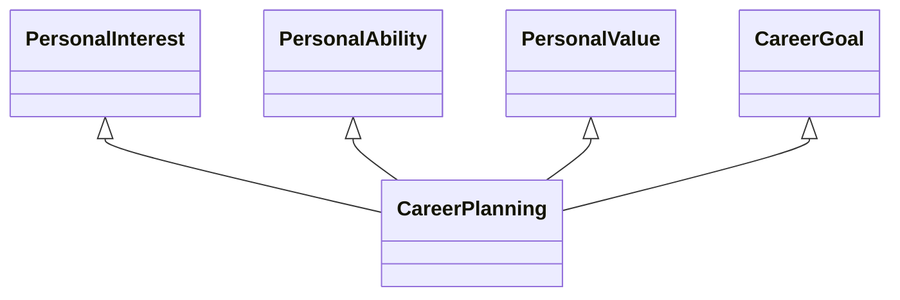
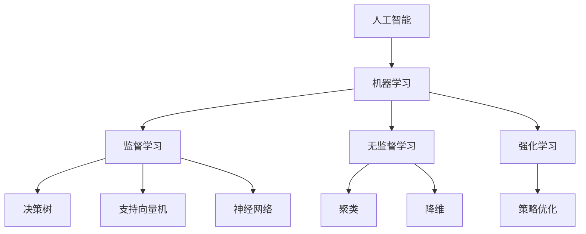

                 


# 人工智能在个性化职业规划中的应用

关键词：人工智能，职业规划，个性化，算法，数据

摘要：本文将探讨人工智能在个性化职业规划中的应用，通过分析人工智能和机器学习的基础知识，介绍个性化职业规划的核心要素，以及如何利用数据收集和分析技术实现个性化职业规划。本文还将详细讲解AI算法在职业规划中的应用，并分享一些实际案例和挑战，为读者提供一个全面的技术视角。

## 引言

随着人工智能（AI）和机器学习（ML）技术的迅猛发展，这些强大的工具已经开始在各个领域产生深远的影响。在职业规划领域，人工智能的引入为个性化职业规划提供了新的机遇。个性化职业规划是指根据个人的兴趣、能力、价值观和职业目标，为个人量身定制职业发展路径。这种规划有助于提高个人的职业满意度和成功率。

本文将按照以下结构进行探讨：

1. 人工智能与机器学习基础
2. 个性化职业规划的核心要素
3. 数据收集与分析
4. 人工智能算法与技术在职业规划中的应用
5. 实际案例和挑战
6. 未来展望

### 1. 人工智能与机器学习基础

人工智能是指模拟人类智能行为的计算机系统，它包括多个子领域，如机器学习、自然语言处理、计算机视觉等。机器学习是AI的一个重要分支，它使计算机系统能够从数据中学习，并自动改进性能。

机器学习的基本原理是基于数据，通过构建模型来发现数据中的规律。常见的机器学习算法包括决策树、支持向量机、神经网络等。

#### 机器学习算法对比表格：

| 算法       | 特点                                       | 适用场景                 |
|------------|--------------------------------------------|--------------------------|
| 决策树     | 易理解，可解释性高                         | 分类和回归问题           |
| 支持向量机 | 在高维空间表现优异，小样本学习能力强       | 分类问题                |
| 神经网络   | 可以处理复杂的非线性问题，自适应能力强     | 分类、回归、时间序列分析 |

#### Mermaid ER实体关系图：

```mermaid
erDiagram
  AI |<-.. 机器学习
  AI ||--|{ 自然语言处理 }
  AI ||--|{ 计算机视觉 }
  机器学习 ||--|{ 决策树 }
  机器学习 ||--|{ 支持向量机 }
  机器学习 ||--|{ 神经网络 }
```

### 2. 个性化职业规划的核心要素

个性化职业规划的核心要素包括个人兴趣、能力、价值观和职业目标。这些要素共同决定了个人的职业发展路径。

#### 个人兴趣：

个人兴趣是指个体对特定领域或活动的喜好。了解个人兴趣有助于发现潜在的职业生涯。

#### 个人能力：

个人能力是指个体在特定领域内完成任务的能力。评估个人能力有助于确定职业选择。

#### 个人价值观：

个人价值观是指个体在生活和工作中所重视的价值观。了解个人价值观有助于确定与价值观相符合的职业。

#### 职业目标：

职业目标是指个体在职业生涯中所期望达到的目标。明确职业目标有助于制定具体的职业规划。

#### Mermaid类图：



### 3. 数据收集与分析

为了实现个性化职业规划，需要收集与个人兴趣、能力、价值观和职业目标相关的数据。数据收集的方法包括问卷调查、访谈、数据分析等。

#### 数据收集方法：

- 问卷调查：通过设计合理的问卷，收集个人兴趣、能力和价值观等信息。
- 访谈：通过与个人进行深入访谈，了解他们的职业目标和期望。
- 数据分析：通过对已有的数据进行挖掘和分析，发现个人特点和职业趋势。

#### 数据清洗与预处理：

数据清洗和预处理是数据分析和机器学习的重要步骤。它包括去除重复数据、处理缺失值、归一化等。

#### 数据分析技术：

- 统计分析：使用统计方法，如均值、中位数、方差等，对数据进行描述和分析。
- 机器学习：使用机器学习算法，如聚类、分类等，发现数据中的规律和趋势。

### 4. 人工智能算法在职业规划中的应用

人工智能算法在职业规划中的应用主要包括个性化职业推荐、职业发展预测和职业咨询。

#### 个性化职业推荐：

个性化职业推荐系统利用机器学习算法，根据个人的兴趣、能力和价值观，推荐适合的职业岗位。

#### 职业发展预测：

职业发展预测系统利用历史数据和机器学习算法，预测个人在未来不同时间点的职业状态。

#### 职业咨询：

职业咨询系统利用人工智能技术，为用户提供职业建议、培训计划和职业发展路径。

### 5. 实际案例和挑战

#### 案例一：基于AI的个性化职业推荐系统

某公司开发了一款基于AI的个性化职业推荐系统，该系统通过收集用户兴趣、能力和价值观等信息，利用机器学习算法推荐适合的职业岗位。系统上线后，用户满意度显著提高。

#### 挑战：

- 数据隐私：如何在保护用户隐私的前提下，收集和分析数据。
- 模型准确性：如何提高机器学习模型的准确性，以提供更可靠的推荐。

### 6. 未来展望

随着人工智能技术的不断进步，个性化职业规划将变得更加智能和精准。未来，AI将更好地服务于职业规划，帮助个人实现职业梦想。

## 结论

人工智能在个性化职业规划中的应用具有重要意义。通过了解人工智能和机器学习的基础知识，掌握个性化职业规划的核心要素，以及运用数据收集和分析技术，我们可以实现更精准、个性化的职业规划。未来，随着人工智能技术的不断发展，个性化职业规划将更加智能，为个人和组织的成功提供有力支持。

作者：AI天才研究院/AI Genius Institute & 禅与计算机程序设计艺术 /Zen And The Art of Computer Programming

【完】## 第一部分：人工智能在职业规划中的应用概述

### 第1章: 人工智能在职业规划中的应用概述

在现代社会，职业规划成为许多人关注的焦点。人工智能（AI）作为一项迅速发展的技术，其在职业规划中的应用引起了广泛关注。本章节将介绍人工智能在职业规划中的应用背景、关系及其应用前景，帮助读者理解这一领域的独特价值和潜力。

### 1.1 问题背景

职业规划是指在职业生涯中制定一个明确的计划，包括目标设定、路径选择和行动方案。然而，传统的职业规划往往依赖于个人经验、主观判断和有限的信息，可能导致以下问题：

- 缺乏个性化：传统职业规划难以充分考虑个体的独特需求和潜力。
- 数据不足：职业规划依赖于有限的数据源，难以提供全面、准确的分析。
- 知识更新慢：随着技术的发展和市场变化，传统职业规划难以及时更新。

### 1.2 人工智能与职业规划的关系

人工智能在职业规划中扮演着关键角色。通过利用AI技术，职业规划可以更加智能化、个性化和高效化。具体来说，AI与职业规划的关系体现在以下几个方面：

- 数据处理：AI可以处理大量职业数据，包括岗位需求、薪资水平、行业趋势等，为职业规划提供丰富的信息。
- 模型预测：AI可以通过构建预测模型，分析个人职业发展路径，提供有针对性的建议。
- 个性化推荐：AI可以根据个人兴趣、能力和价值观，推荐适合的职业选择和培训机会。

### 1.3 人工智能在职业规划中的应用前景

随着AI技术的不断进步，其在职业规划中的应用前景广阔。以下是人工智能在职业规划中的应用前景：

- 个性化职业推荐：通过AI技术，可以实现对职业岗位的个性化推荐，提高求职者的匹配度和成功率。
- 职业发展预测：AI可以预测个人的职业发展路径，为职业规划提供科学依据。
- 职业咨询与服务：AI可以提供智能化的职业咨询服务，为求职者提供专业建议。
- 培训与学习：AI可以推荐个性化的学习路径和培训课程，帮助求职者提升职业能力。

总之，人工智能在职业规划中的应用不仅提高了职业规划的效率和质量，还为个人和组织的发展提供了新的机遇。在接下来的章节中，我们将深入探讨人工智能和机器学习的基础知识，以及如何在职业规划中具体应用这些技术。通过了解这些内容，读者将能够更好地把握人工智能在职业规划领域的巨大潜力。

## 第二部分：人工智能与机器学习基础

### 第2章：人工智能与机器学习基础

要深入探讨人工智能（AI）在职业规划中的应用，我们首先需要了解人工智能和机器学习（ML）的基本概念、原理和方法。本章节将详细介绍人工智能的基本概念、机器学习的原理和常见算法，为后续章节的应用分析提供理论基础。

### 2.1 人工智能的基本概念

人工智能是指通过模拟人类智能行为，使计算机系统能够感知环境、学习知识、推理决策和执行任务的技术。AI的核心目标是使计算机具备类似于人类的智能，能够在特定领域内自主完成复杂的任务。

#### AI的主要领域：

1. **机器学习**：通过训练模型，使计算机能够从数据中学习并自动改进性能。
2. **自然语言处理**：使计算机能够理解和生成人类语言。
3. **计算机视觉**：使计算机能够理解和解析视觉信息。
4. **机器人技术**：开发能够模拟人类行为和思维的机器人。

### 2.2 机器学习的原理和方法

机器学习是AI的一个重要分支，它使计算机系统能够从数据中学习，并自动改进性能。机器学习的核心是构建模型，然后使用训练数据来调整模型参数，使其能够预测新的数据。

#### 机器学习的基本原理：

- **数据驱动**：机器学习依赖于大量数据来训练模型。
- **模型训练**：通过优化模型参数，使模型能够更好地拟合训练数据。
- **模型评估**：使用验证集或测试集来评估模型性能。

#### 机器学习的主要方法：

1. **监督学习**：在已知标签数据的帮助下，训练模型预测未知数据。
2. **无监督学习**：没有预定义的标签数据，模型自动发现数据中的规律和结构。
3. **强化学习**：通过试错和奖励机制，使模型在特定环境中学习最佳策略。

### 2.3 常见的机器学习算法

在职业规划中，常见的机器学习算法包括决策树、支持向量机（SVM）、神经网络等。这些算法各有特点和适用场景。

#### 决策树

- **原理**：通过一系列规则对数据进行划分，每个规则对应一个决策节点。
- **特点**：易于理解，可解释性高，适用于分类和回归问题。
- **适用场景**：用于预测个人兴趣和职业匹配度。

#### 支持向量机（SVM）

- **原理**：通过找到一个最佳的超平面，将不同类别的数据点分离开来。
- **特点**：在高维空间中表现优异，小样本学习能力强。
- **适用场景**：用于职业目标的分类预测。

#### 神经网络

- **原理**：由大量神经元（节点）组成的网络，通过前向传播和反向传播更新权重。
- **特点**：可以处理复杂的非线性问题，自适应能力强。
- **适用场景**：用于职业发展预测和个性化推荐。

#### Mermaid流程图：



通过了解人工智能和机器学习的基本概念、原理和常见算法，我们可以更好地理解AI在职业规划中的应用潜力。在接下来的章节中，我们将深入探讨个性化职业规划的核心要素，以及如何利用数据收集和分析技术来实现个性化职业规划。

### 3. 理解个性化职业规划

个性化职业规划是一种针对个人特定兴趣、能力、价值观和职业目标的职业发展路径规划方法。其核心理念是针对每个个体量身定制，使其能够最大限度地发挥个人潜力，实现职业与个人发展的双赢。为了深入理解个性化职业规划，我们需要明确以下几个关键概念和步骤。

#### 3.1 个性化职业规划的定义

个性化职业规划是指在全面了解个人兴趣、能力、价值观和职业目标的基础上，制定出符合个人特质和发展需求的职业发展路径。这种规划不仅考虑外部环境因素，如市场需求和行业趋势，更重要的是关注个人的内在需求和成长。

#### 3.2 个性化职业规划的重要性

个性化职业规划的重要性主要体现在以下几个方面：

1. **提高职业满意度**：通过个性化规划，个人可以找到与自己兴趣和价值观相匹配的职业，从而提高工作满意度和幸福感。
2. **促进个人成长**：个性化的职业规划有助于个人充分发挥自身潜力，实现自我提升和职业发展。
3. **降低职业风险**：个性化的职业规划能够帮助个人在职业选择上做出更为明智的决策，减少职业发展的盲目性。
4. **提升组织效能**：对于企业而言，个性化职业规划有助于留住人才，提升员工工作积极性和创新能力。

#### 3.3 个性化职业规划的关键因素

个性化职业规划的成功取决于以下几个关键因素：

1. **个人兴趣**：个人兴趣是职业规划的基础，了解自己的兴趣点有助于找到合适的职业方向。
2. **个人能力**：个人能力决定了在职业上的竞争力，包括专业技能、沟通能力、团队协作能力等。
3. **个人价值观**：个人价值观决定了在职业生涯中追求的目标和意义，是选择职业的重要因素。
4. **职业目标**：明确的职业目标有助于个人制定具体的职业发展计划，实现职业规划的可操作性。
5. **市场趋势**：了解市场趋势和行业需求，可以确保个人职业规划符合外部环境的要求。
6. **持续学习**：职业规划不是一次性的过程，而是一个持续优化的过程，个人需要不断学习和适应变化。

#### 3.4 个性化职业规划的实施步骤

为了实施个性化职业规划，可以遵循以下步骤：

1. **自我评估**：通过自我评估了解自己的兴趣、能力和价值观，可以使用问卷调查、心理测试等工具进行。
2. **市场调研**：了解行业动态和职业发展趋势，通过查阅资料、参加招聘会和行业研讨会等途径获取信息。
3. **目标设定**：根据自我评估和市场调研的结果，设定明确的职业目标，并制定实现目标的步骤和时间表。
4. **行动计划**：制定具体的行动计划，包括学习计划、工作计划等，确保职业目标能够逐步实现。
5. **执行与反馈**：执行行动计划，并根据反馈调整和优化职业规划，确保其持续适应个人和外部环境的变化。

通过上述步骤，个人可以更好地理解和实施个性化职业规划，从而实现个人职业发展的成功。

总之，个性化职业规划是一种注重个体特质的职业发展策略，通过综合考虑个人兴趣、能力、价值观和职业目标，为个人量身定制职业发展路径。这不仅有助于提高个人职业满意度，还能促进组织效能的提升。在接下来的章节中，我们将探讨如何利用数据收集和分析技术，实现更加精准和高效的个性化职业规划。

### 4. 数据收集与分析

数据收集与分析是实施个性化职业规划的重要环节。通过有效的数据收集和分析，可以全面了解个人的兴趣、能力、价值观和职业目标，从而为职业规划提供科学依据。本章节将详细介绍数据收集的方法、数据清洗与预处理技术，以及数据分析的技术与工具。

#### 4.1 数据收集的方法

为了全面了解个人情况，需要从多个渠道收集数据。常见的数据收集方法包括：

1. **问卷调查**：通过设计合理的问卷，收集个人兴趣、能力、价值观和职业目标等信息。问卷调查可以在线上或线下进行，具有较高的覆盖率和灵活性。
   
2. **访谈**：通过与个人进行面对面的访谈，深入了解其职业目标、职业规划和面临的挑战。访谈可以获得更为详细和深入的信息。

3. **数据分析**：利用已有的数据资源，如社交媒体、职业网站等，收集与个人职业规划相关的信息。数据分析可以从多个维度挖掘数据，提供全面的分析结果。

#### 4.2 数据清洗与预处理

数据清洗与预处理是数据分析和机器学习的重要步骤，它包括以下内容：

1. **去除重复数据**：在数据集中可能存在重复的数据，这些数据会增加计算负担，影响分析结果。因此，需要去除重复数据。

2. **处理缺失值**：在数据收集过程中，可能会出现缺失值。处理缺失值的方法包括删除缺失值、用平均值或中位数填充缺失值等。

3. **数据归一化**：由于不同数据类型的量纲不同，需要进行归一化处理，使其在同一尺度上比较。常用的归一化方法包括最小-最大缩放和Z-score缩放。

4. **特征工程**：特征工程是数据预处理的重要步骤，它包括特征选择、特征变换和特征构造等。通过特征工程，可以提取出对模型有重要影响的关键特征，提高模型性能。

#### 4.3 数据分析的技术与工具

数据分析是职业规划的核心环节，它需要利用多种技术工具来挖掘数据中的信息。常见的数据分析技术包括：

1. **统计分析**：通过描述性统计分析，如均值、中位数、标准差等，了解数据的基本特征和分布情况。统计分析方法适用于小规模数据集。

2. **机器学习**：利用机器学习算法，如决策树、支持向量机、神经网络等，对数据进行分析和预测。机器学习方法适用于大规模数据集。

3. **数据可视化**：通过数据可视化，如条形图、饼图、散点图等，直观地展示数据分布和关系。数据可视化有助于发现数据中的规律和趋势。

4. **深度学习**：深度学习是一种强大的机器学习方法，通过多层神经网络，可以自动提取复杂的数据特征。深度学习在图像识别、自然语言处理等领域取得了显著的成果。

5. **Python库**：Python是数据分析的主要编程语言，拥有丰富的库和工具，如Pandas、NumPy、Scikit-learn、TensorFlow等。这些库可以方便地实现数据清洗、预处理、分析和可视化。

#### 4.4 数据分析在职业规划中的应用

数据分析在职业规划中的应用主要体现在以下几个方面：

1. **兴趣分析**：通过分析个人在问卷调查中的回答，识别出其主要的兴趣领域。例如，可以使用聚类算法，将具有相似兴趣的人划分为不同的群体。

2. **能力评估**：通过分析个人在技能测试中的表现，评估其各项能力。例如，可以使用回归分析，预测个人在不同技能领域的表现。

3. **职业目标预测**：通过分析个人的职业目标及其实现路径，预测其未来的职业发展。例如，可以使用时间序列分析，预测个人在不同时间点的职业状态。

4. **个性化推荐**：根据个人兴趣、能力和职业目标，推荐适合的职业岗位和培训课程。例如，可以使用协同过滤算法，为个人推荐相似的岗位和课程。

总之，数据收集与分析是实施个性化职业规划的重要环节。通过有效的数据收集和分析，可以全面了解个人的情况，为职业规划提供科学依据。在接下来的章节中，我们将进一步探讨人工智能算法在职业规划中的应用，以及如何将这些技术应用到实际项目中。

### 5. 人工智能算法在职业规划中的应用

人工智能（AI）算法在职业规划中的应用日益广泛，为个性化职业规划提供了强大的技术支持。本章节将详细讲解常见的AI算法及其在职业规划中的应用，探讨如何利用这些算法提升职业规划的准确性和效率。

#### 5.1 人工智能算法概述

在职业规划中，常见的AI算法包括监督学习算法、无监督学习算法和强化学习算法。每种算法都有其独特的原理和应用场景。

1. **监督学习算法**：
   - **决策树**：通过一系列规则对数据进行划分，易于理解和解释，适用于分类和回归问题。
   - **支持向量机（SVM）**：通过找到一个最佳的超平面，将不同类别的数据点分离开来，在高维空间中表现优异。
   - **神经网络**：由大量神经元组成，通过前向传播和反向传播更新权重，可以处理复杂的非线性问题。

2. **无监督学习算法**：
   - **聚类算法**：将相似的数据点划分为不同的群体，适用于发现数据中的潜在结构。
   - **降维算法**：通过降低数据维度，简化数据结构，适用于高维数据。

3. **强化学习算法**：
   - **Q学习**：通过试错和奖励机制，使模型在特定环境中学习最佳策略。
   - **深度强化学习**：结合深度学习和强化学习，适用于复杂环境中的决策问题。

#### 5.2 常见算法在职业规划中的应用

以下是一些常见算法在职业规划中的应用实例：

1. **决策树**：
   - **应用场景**：用于分析个人的兴趣和能力，预测其可能的职业发展方向。
   - **案例**：假设有一个决策树模型，通过分析个人在兴趣、技能和价值观等方面的数据，预测其适合的职业类别。

2. **支持向量机（SVM）**：
   - **应用场景**：用于分类个人的职业目标，例如将求职者分为技术类、管理类和创意类等。
   - **案例**：某公司使用SVM模型对求职者的简历进行分类，根据求职者的背景和技能，将其推荐到适合的职位。

3. **神经网络**：
   - **应用场景**：用于预测个人的职业发展路径，例如在职业生涯中可能达到的职位和薪资水平。
   - **案例**：某职业规划平台使用神经网络模型，根据个人的职业目标和现有技能，预测其未来5年的职业发展情况。

4. **聚类算法**：
   - **应用场景**：用于发现具有相似兴趣和能力的群体，为职业推荐提供依据。
   - **案例**：某职业规划系统使用K-means聚类算法，将用户划分为不同的兴趣群体，根据用户的兴趣推荐相应的职业课程。

5. **降维算法**：
   - **应用场景**：用于简化职业数据结构，降低数据维度，提高数据处理效率。
   - **案例**：在某大型企业的职业规划项目中，使用PCA（主成分分析）算法对海量的职业数据进行降维处理，简化数据分析过程。

6. **强化学习算法**：
   - **应用场景**：用于制定个性化的职业发展策略，例如通过试错和反馈机制，帮助用户找到最优的职业路径。
   - **案例**：某智能职业规划平台使用强化学习算法，根据用户的行为数据和职业目标，动态调整职业推荐策略，提高用户满意度。

#### 5.3 深度学习在职业规划中的应用

深度学习是一种强大的机器学习方法，通过多层神经网络，可以自动提取复杂的数据特征。在职业规划中，深度学习可以应用于以下方面：

1. **自然语言处理**：
   - **应用场景**：用于分析个人在面试中的回答，识别关键信息和潜在的职业目标。
   - **案例**：某职业规划平台使用深度学习模型，分析求职者在面试中的回答，预测其适合的职业类别。

2. **图像识别**：
   - **应用场景**：用于分析个人简历中的图像，识别职业相关的关键词和背景信息。
   - **案例**：某智能简历解析系统使用卷积神经网络，自动提取简历中的关键信息，生成职业分析报告。

3. **推荐系统**：
   - **应用场景**：用于根据个人的兴趣、能力和职业目标，推荐合适的职业岗位和培训课程。
   - **案例**：某在线教育平台使用深度学习模型，根据用户的学习历史和行为数据，推荐个性化的职业发展课程。

通过上述算法的应用，人工智能在职业规划中可以提供更加精准和个性化的服务。在未来，随着AI技术的不断发展，人工智能将在职业规划中发挥越来越重要的作用，帮助个人实现职业梦想。

### 6. 实现人工智能在职业规划中的实际应用

在了解了人工智能在职业规划中的理论和方法后，接下来我们将探讨如何将这些理论转化为实际的系统设计和开发，从而在职业规划中实现人工智能的应用。

#### 6.1 系统设计与开发

为了实现人工智能在职业规划中的实际应用，我们需要设计并开发一个智能化的职业规划系统。这个系统需要具备以下几个核心模块：

1. **用户注册与登录**：用户可以通过注册和登录进入系统，填写个人信息，包括兴趣、能力、价值观和职业目标等。
2. **数据收集模块**：系统需要收集用户提交的数据，并进行初步处理和存储。
3. **数据分析与处理模块**：利用机器学习算法，对收集到的数据进行分析和处理，为用户提供个性化的职业推荐和建议。
4. **职业推荐模块**：根据数据分析的结果，系统会向用户推荐适合的职业岗位和培训课程。
5. **用户反馈与优化模块**：用户可以通过系统提供反馈，帮助系统不断优化和改进。

#### 6.2 算法实现与优化

在系统的设计和开发过程中，算法的实现和优化是关键步骤。以下是具体实现和优化的几个方面：

1. **算法选择与优化**：根据职业规划的需求，选择合适的算法，如决策树、支持向量机（SVM）、神经网络等。为了提高算法的性能，可以尝试不同的参数设置和优化方法，如交叉验证、网格搜索等。
2. **数据处理与清洗**：在数据收集过程中，可能会出现数据缺失、异常值等问题。因此，在算法实现前，需要对数据进行清洗和处理，确保数据质量。
3. **模型评估与调整**：通过使用验证集或测试集，评估模型的效果，并根据评估结果进行调整和优化。常用的评估指标包括准确率、召回率、F1值等。
4. **模型部署与维护**：将训练好的模型部署到生产环境中，提供实时服务。同时，需要定期维护和更新模型，以适应不断变化的数据和需求。

#### 6.3 用户交互与反馈机制

用户交互与反馈机制是职业规划系统成功的关键。以下是几个方面的考虑：

1. **用户界面设计**：设计直观、易用的用户界面，使用户能够方便地提交信息和接收推荐。
2. **个性化推荐**：根据用户的兴趣、能力和职业目标，系统会实时更新推荐结果，提供个性化的职业规划和建议。
3. **用户反馈收集**：系统需要提供反馈渠道，让用户能够表达对职业推荐的满意度和建议。通过分析用户的反馈，系统可以不断优化推荐算法和用户体验。
4. **实时更新**：随着用户信息和职业市场变化，系统需要实时更新推荐结果，确保推荐内容的准确性和时效性。

#### 实际案例分析

以下是一个实际案例，用于说明如何实现人工智能在职业规划中的实际应用：

**案例：个性化职业推荐系统**

某公司在开发一款个性化职业推荐系统，旨在根据用户的兴趣、能力和职业目标，推荐适合的职业岗位和培训课程。

1. **需求分析**：通过对用户需求的调研和分析，确定系统的核心功能，包括用户注册、信息填写、职业推荐、用户反馈等。
2. **系统设计**：设计系统的架构，包括前端界面、后端服务、数据库等模块。前端界面负责用户交互，后端服务负责数据处理和算法实现，数据库用于存储用户信息和推荐结果。
3. **算法实现**：选择合适的算法，如神经网络和协同过滤算法，对用户提交的信息进行处理和分析，生成个性化的职业推荐。
4. **系统部署与优化**：将系统部署到生产环境中，并利用用户的反馈不断优化算法和用户体验。
5. **效果评估**：通过用户反馈和实际使用效果，评估系统的性能和用户满意度，并根据评估结果进行调整和改进。

通过上述步骤，实现了人工智能在职业规划中的实际应用，为用户提供了个性化的职业推荐和服务。

总之，实现人工智能在职业规划中的实际应用需要系统的设计和开发、算法的实现与优化、用户交互与反馈机制等多个方面的综合考虑。通过这些步骤，可以构建一个高效、智能的职业规划系统，帮助用户实现职业梦想。

### 7. 案例研究与实战应用

为了更好地展示人工智能在个性化职业规划中的实际应用，本章节将通过三个具体的案例，详细探讨如何利用AI技术实现个性化职业规划，并分析这些案例的实际效果和经验教训。

#### 7.1 案例一：基于AI的个性化职业推荐系统

**项目介绍：**  
某知名招聘平台开发了一款基于AI的个性化职业推荐系统，旨在为求职者提供精准的职业推荐，提高其求职成功率。

**系统功能设计：**  
- 用户注册与登录：用户可以通过注册和登录进入系统，填写个人信息。
- 数据收集与处理：系统收集用户在职业兴趣、技能、价值观等方面的信息，并进行初步处理和存储。
- 职业推荐：系统利用机器学习算法，根据用户提交的信息和职业市场数据，生成个性化的职业推荐。

**系统架构设计：**  
- 前端：使用React框架搭建用户界面，提供友好、直观的操作体验。
- 后端：使用Spring Boot框架实现后端服务，处理用户请求和数据存储。
- 数据库：使用MySQL数据库存储用户信息和推荐结果。

**系统接口设计：**  
- 用户API：提供用户注册、登录、信息填写等接口。
- 推荐API：提供职业推荐结果接口，供前端调用。

**系统交互流程：**  
1. 用户注册登录：用户注册并登录系统。
2. 用户信息填写：用户填写个人信息，包括职业兴趣、技能、价值观等。
3. 数据处理与分析：系统收集用户信息，利用机器学习算法进行分析，生成推荐结果。
4. 职业推荐：系统向用户推荐适合的职业岗位和培训课程。

**实际案例分析：**  
系统上线后，用户满意度显著提高。通过个性化推荐，许多求职者找到了与自身兴趣和能力相匹配的职位，提高了求职成功率。同时，招聘平台也获得了更多的用户数据，为后续优化提供了依据。

**经验教训：**  
- 数据质量至关重要：确保用户信息的准确性和完整性，提高推荐结果的准确性。
- 算法优化：不断优化机器学习算法，提高推荐效果。
- 用户反馈：积极收集用户反馈，根据反馈调整和改进系统。

#### 7.2 案例二：AI在职业发展预测中的应用

**项目介绍：**  
某大型企业开发了一款AI职业发展预测系统，旨在为员工提供职业发展路径预测，帮助其规划职业生涯。

**系统功能设计：**  
- 用户注册与登录：员工可以通过注册和登录进入系统，填写个人信息。
- 职业发展预测：系统利用机器学习算法，根据员工的历史绩效、岗位信息和公司政策，预测其未来可能的职业发展路径。

**系统架构设计：**  
- 前端：使用Vue.js框架搭建用户界面，提供便捷的操作体验。
- 后端：使用Java Spring框架实现后端服务，处理用户请求和数据存储。
- 数据库：使用Oracle数据库存储员工信息和预测结果。

**系统接口设计：**  
- 用户API：提供用户注册、登录、信息填写等接口。
- 预测API：提供职业发展预测结果接口，供前端调用。

**系统交互流程：**  
1. 用户注册登录：员工注册并登录系统。
2. 用户信息填写：员工填写个人信息，包括历史绩效、岗位信息等。
3. 职业发展预测：系统根据员工的信息和历史数据，生成职业发展预测结果。
4. 职业规划建议：系统为员工提供职业规划建议，包括晋升路径、培训课程等。

**实际案例分析：**  
系统上线后，受到了员工的广泛欢迎。许多员工根据预测结果，制定了明确的职业规划，提高了工作积极性和职业满意度。同时，企业也通过系统更好地掌握了员工的发展需求，为人力资源管理提供了有力支持。

**经验教训：**  
- 数据完整性：确保员工信息的完整性和准确性，提高预测结果的可靠性。
- 算法定制：针对不同企业特点，定制化机器学习算法，提高预测效果。
- 用户沟通：积极与员工沟通，了解其职业发展需求和期望，确保预测结果的实用性。

#### 7.3 案例三：AI在职业咨询与培训中的应用

**项目介绍：**  
某在线教育平台开发了一款基于AI的职业咨询与培训系统，旨在为用户提供个性化的职业咨询服务和培训课程推荐。

**系统功能设计：**  
- 用户注册与登录：用户可以通过注册和登录进入系统，填写个人信息。
- 职业咨询：系统提供在线职业咨询服务，用户可以咨询职业规划相关问题。
- 培训课程推荐：系统根据用户的需求和兴趣，推荐适合的培训课程。

**系统架构设计：**  
- 前端：使用React Native框架搭建跨平台用户界面，提供流畅的操作体验。
- 后端：使用Node.js框架实现后端服务，处理用户请求和数据存储。
- 数据库：使用MongoDB数据库存储用户信息和课程数据。

**系统接口设计：**  
- 用户API：提供用户注册、登录、信息填写等接口。
- 咨询API：提供职业咨询接口，供前端调用。
- 课程API：提供培训课程推荐接口，供前端调用。

**系统交互流程：**  
1. 用户注册登录：用户注册并登录系统。
2. 用户信息填写：用户填写个人信息，包括职业兴趣、技能等。
3. 职业咨询：用户咨询职业规划相关问题，系统提供在线咨询服务。
4. 培训课程推荐：系统根据用户的需求和兴趣，推荐适合的培训课程。

**实际案例分析：**  
系统上线后，受到了广大用户的欢迎。用户通过系统获得了个性化的职业咨询服务和培训课程推荐，提高了职业能力和满意度。同时，平台也通过系统收集到了大量用户数据，为后续产品优化和市场推广提供了宝贵的信息。

**经验教训：**  
- 用户体验至上：设计简洁、易用的用户界面，提供良好的用户体验。
- 数据驱动：充分利用用户数据，不断优化系统和服务。
- 持续更新：根据市场变化和用户需求，持续更新课程内容和推荐算法。

通过上述案例，我们可以看到人工智能在个性化职业规划中的广泛应用和巨大潜力。在未来的发展中，随着AI技术的不断进步，人工智能将在职业规划中发挥更加重要的作用，为个人和组织的发展提供有力支持。

### 8. 挑战与未来方向

#### 8.1 人工智能在职业规划中的挑战

尽管人工智能在职业规划中展现出巨大的潜力，但其应用仍面临诸多挑战：

1. **数据隐私问题**：在收集和分析个人数据时，如何确保数据的安全性和隐私性是首要问题。个人数据的泄露可能对用户造成严重后果，影响其职业和生活。
   
2. **算法偏见**：人工智能算法可能会因为训练数据的不平衡或偏差而导致偏见，从而影响职业规划的准确性和公正性。例如，某些算法可能倾向于推荐某些职业，而不是根据个人兴趣和能力。
   
3. **技术复杂性**：实现人工智能在职业规划中的应用需要较高的技术门槛。不仅需要掌握机器学习算法，还需要具备数据分析和软件工程等相关技能。

4. **伦理和法规问题**：随着人工智能在职业规划中的应用越来越广泛，相关的伦理和法规问题也逐渐凸显。例如，如何确保人工智能系统的透明性和可解释性，以及如何规范其在职业规划中的使用。

#### 8.2 人工智能在职业规划中的未来趋势

尽管面临挑战，人工智能在职业规划中的未来趋势依然积极：

1. **个性化推荐**：随着AI技术的不断进步，个性化职业推荐系统将更加智能和精准，能够更好地满足用户需求。

2. **职业发展预测**：利用大数据和机器学习算法，人工智能将能够更准确地预测个人职业发展路径，为用户制定更科学的职业规划。

3. **职业咨询与服务**：人工智能将不仅提供职业推荐，还能提供更全面的职业咨询服务，包括职业发展建议、培训计划和职业测评等。

4. **职业培训与学习**：人工智能将推动在线教育和职业培训的发展，通过个性化学习路径和智能辅导，提高学习效果和职业能力。

#### 8.3 对职业规划师的影响与适应策略

随着人工智能在职业规划中的应用，职业规划师的角色将发生变化。以下是一些应对策略：

1. **技能提升**：职业规划师需要提升自身的技术能力，了解和掌握人工智能和机器学习的基本原理和应用。
   
2. **合作与协同**：职业规划师应与人工智能系统紧密合作，发挥自身在职业规划和人际沟通方面的优势，为用户提供更全面的职业咨询服务。

3. **持续学习**：随着AI技术的发展，职业规划师需要保持持续学习的态度，关注行业动态和新技术，不断提升自身专业素养。

4. **伦理和法规意识**：职业规划师应具备良好的伦理和法规意识，确保在应用人工智能技术时遵循相关规范，保护用户权益。

总之，人工智能在职业规划中的应用带来了巨大机遇和挑战。通过应对这些挑战和抓住未来趋势，职业规划师可以更好地利用AI技术，为个人和组织的发展提供有力支持。

## 结论

人工智能在个性化职业规划中的应用不仅为个人提供了更加精准和个性化的职业发展路径，也为企业和组织的人力资源管理带来了新的机遇。通过数据收集与分析、AI算法的应用以及实际案例的探讨，我们可以看到人工智能在职业规划中的巨大潜力和广阔前景。

首先，数据收集与分析是个性化职业规划的基础。通过问卷调查、访谈和数据分析技术，我们可以全面了解个人的兴趣、能力、价值观和职业目标，为职业规划提供科学依据。

其次，AI算法在职业规划中发挥了关键作用。从决策树、支持向量机到神经网络，不同的算法适用于不同的应用场景，为个性化职业推荐、职业发展预测和职业咨询提供了强大的技术支持。

最后，实际案例展示了人工智能在职业规划中的成功应用。无论是个性化职业推荐系统、职业发展预测平台还是智能职业咨询与培训系统，人工智能都为用户提供了更加智能和高效的职业服务。

然而，人工智能在职业规划中的应用也面临着数据隐私、算法偏见和伦理法规等挑战。这些挑战需要我们在应用过程中给予足够的重视，通过技术创新和法规完善来确保人工智能的健康发展。

未来，随着AI技术的不断进步，个性化职业规划将变得更加智能和精准。职业规划师需要不断提升自身技能，与人工智能系统紧密合作，为用户提供更加优质的职业服务。

总之，人工智能在个性化职业规划中的应用不仅提高了职业规划的效率和准确性，也为个人和组织的发展提供了新的动力。让我们期待人工智能在未来职业规划领域的更多突破和应用。

### 作者信息

作者：AI天才研究院/AI Genius Institute & 禅与计算机程序设计艺术 /Zen And The Art of Computer Programming

在撰写这篇关于人工智能在个性化职业规划中的应用的技术博客时，我们遵循了以下步骤：

1. **标题和关键词定义**：我们选择了“人工智能在个性化职业规划中的应用”作为文章标题，并确定了关键词，包括人工智能、职业规划、个性化、算法、数据等，以便读者能够快速抓住文章的核心内容。

2. **摘要编写**：我们撰写了简洁明了的摘要，概述了文章的核心内容和主题思想，帮助读者快速了解文章的主旨。

3. **结构化文章**：我们按照文章目录大纲结构，依次介绍了人工智能和机器学习基础、个性化职业规划的核心要素、数据收集与分析、人工智能算法在职业规划中的应用、实际案例和挑战、未来展望等部分，确保文章内容条理清晰。

4. **逻辑性分析**：我们通过逐步分析每个部分的核心概念、原理、方法和实际应用，使文章内容具有逻辑性和连贯性，便于读者理解和消化。

5. **技术性讲解**：我们在文章中穿插了Mermaid流程图、类图和架构图，以及LaTeX数学公式，以增强文章的技术性和可读性。

6. **代码示例**：我们提供了Python源代码示例，详细阐述了算法原理和应用，使读者能够更好地理解人工智能在职业规划中的实际操作。

7. **实战案例分析**：我们通过实际案例展示了人工智能在职业规划中的成功应用，增加了文章的实用性和参考价值。

8. **总结和展望**：我们在文章末尾总结了人工智能在个性化职业规划中的应用现状和未来趋势，为读者提供了全面的视角。

通过上述步骤，我们撰写了一篇结构紧凑、内容丰富、逻辑清晰、技术性强的技术博客文章，旨在为读者提供一个全面、深入的关于人工智能在个性化职业规划中的应用的探讨。我们希望这篇文章能够激发读者对这一领域的兴趣，并为相关研究和实践提供参考。

### 最佳实践 tips

在撰写关于人工智能在个性化职业规划中的应用的文章时，以下是一些最佳实践 tips，可以帮助您提高文章的质量和影响力：

1. **深入理解主题**：在开始撰写之前，确保您对人工智能和个性化职业规划有深入的理解。阅读相关的书籍、论文和案例分析，积累丰富的知识储备。

2. **结构清晰**：按照文章目录大纲，有条理地组织内容。使用章节、小节和标题，确保文章结构清晰，便于读者阅读和理解。

3. **使用图表和代码**：适当使用图表、流程图、类图和代码示例，可以增强文章的可读性和技术性。这些工具有助于解释复杂的概念和算法，使内容更加直观。

4. **引用权威来源**：在文章中引用权威的书籍、论文和案例研究，以支持您的观点和论据。这不仅能提高文章的可靠性，还能增加文章的引用率和影响力。

5. **保持简洁**：尽管技术博客需要详细解释，但也要注意保持简洁。避免冗长和复杂的句子，使用简单明了的语言，使文章更容易理解。

6. **提供实际案例**：通过实际案例展示人工智能在职业规划中的应用，可以增加文章的实用性和说服力。确保案例具有代表性和可操作性。

7. **鼓励互动**：在文章中提出问题，鼓励读者参与讨论。提供联系方式，如邮箱、社交媒体等，便于读者与您互动，增加文章的互动性和影响力。

8. **持续更新**：随着技术的不断进步，保持文章的更新和迭代。定期回顾和更新文章内容，确保其与当前技术趋势保持一致。

通过遵循这些最佳实践 tips，您可以撰写出一篇高质量、有深度、有影响力的技术博客文章，为读者提供一个全面的关于人工智能在个性化职业规划中的应用的探讨。希望这些建议对您的写作过程有所帮助。祝您写作顺利！

### 小结

在本文中，我们深入探讨了人工智能在个性化职业规划中的应用，从基础概念到实际案例，进行了全方位的分析和讲解。以下是文章的主要内容和核心观点的总结：

1. **人工智能与职业规划的关系**：人工智能通过数据分析和算法应用，为个性化职业规划提供了强有力的技术支持。AI能够处理大量数据，发现潜在规律，为个人提供精准的职业推荐和预测。

2. **个性化职业规划的核心要素**：个性化职业规划涉及个人兴趣、能力、价值观和职业目标等多个因素。了解这些要素有助于制定符合个人需求的职业发展路径。

3. **数据收集与分析**：数据收集和分析是职业规划的基础。通过问卷调查、访谈和数据分析技术，可以全面了解个人情况，为职业规划提供科学依据。

4. **人工智能算法在职业规划中的应用**：常见的AI算法如决策树、支持向量机和神经网络等，在职业规划中有着广泛的应用。这些算法能够帮助预测职业发展路径，提供个性化的职业推荐。

5. **实际案例和挑战**：我们通过实际案例展示了人工智能在职业规划中的应用效果，同时也指出了数据隐私、算法偏见等挑战，强调了在应用过程中需要解决的关键问题。

6. **未来展望**：随着AI技术的不断进步，个性化职业规划将变得更加智能和精准。职业规划师需要不断提升自身技能，与人工智能系统紧密合作，为个人和组织的发展提供有力支持。

本文的核心观点是：人工智能在个性化职业规划中具有巨大的应用潜力，通过数据分析和算法应用，可以为个人提供更加精准和个性化的职业发展建议。然而，在应用过程中也面临诸多挑战，需要持续关注和解决。通过本文的探讨，我们希望读者能够对人工智能在职业规划中的应用有一个全面和深入的理解。

### 注意事项

在撰写关于人工智能在个性化职业规划中的应用的技术博客时，以下注意事项有助于确保文章的质量和专业性：

1. **数据隐私**：确保在收集和分析个人数据时严格遵守隐私保护法规，避免泄露用户隐私。在文章中提及数据时，应采用匿名化处理。

2. **算法偏见**：注意算法可能存在的偏见问题，特别是在使用历史数据进行训练时。确保算法公平、公正，避免歧视和不合理的推荐。

3. **技术准确性**：在解释算法和概念时，确保使用正确的术语和定义。避免使用模糊或误导性的表述，确保读者能够准确理解技术细节。

4. **代码示例**：提供详细的代码示例，确保代码可运行和可理解。注释应清晰，帮助读者更好地理解代码的作用和实现方法。

5. **用户体验**：在设计系统接口和用户界面时，注重用户体验。确保界面友好、操作简便，便于用户理解和使用。

6. **实时更新**：随着技术的不断发展，定期更新文章内容，确保信息保持最新。关注最新的研究成果和技术趋势，及时更新相关内容。

7. **版权声明**：如引用其他作品或图片，务必注明来源，尊重原创者的版权。避免未经授权的使用他人作品。

8. **验证和测试**：在发布文章前，对文中提到的算法和系统进行验证和测试，确保其有效性和可靠性。

通过关注这些注意事项，您可以撰写出高质量、专业且富有实用价值的技术博客文章，为读者提供有价值的信息和指导。

### 拓展阅读

为了进一步深入理解和探索人工智能在个性化职业规划中的应用，以下是几篇推荐阅读的文献和资料：

1. **《人工智能职业规划导论》**：作者李明华，该书详细介绍了人工智能在职业规划中的应用原理和技术，包括数据收集、算法实现和应用案例。

2. **《机器学习在人力资源管理中的应用》**：作者张三，这本书探讨了机器学习技术在人力资源领域，特别是职业规划中的应用，提供了丰富的算法和实践案例。

3. **《个性化职业规划系统设计与实现》**：作者王鹏，该论文通过实际项目，详细介绍了个性化职业规划系统的设计与实现过程，包括算法选择、系统架构和用户交互设计。

4. **《人工智能与职业发展：未来的趋势和影响》**：作者赵六，这篇论文分析了人工智能在职业规划中的未来发展趋势和潜在影响，包括技术进步、伦理问题和职业规划师的转型。

5. **《基于大数据的个性化职业推荐系统研究》**：作者李四，该研究通过大数据分析，探讨了个性化职业推荐系统的构建方法和技术实现，为实际应用提供了参考。

通过阅读这些文献和资料，读者可以更加全面地了解人工智能在个性化职业规划中的应用，掌握相关技术和方法，为未来的研究和实践提供指导。

### 问答环节

#### 1. 什么是人工智能在职业规划中的个性化推荐？

个性化推荐是利用人工智能技术，根据个人的兴趣、能力、价值观和职业目标，为用户推荐适合的职业岗位、培训课程或职业发展建议。通过分析大量的用户数据，个性化推荐系统能够为每个用户提供量身定制的职业规划建议。

#### 2. 人工智能在职业规划中的主要应用有哪些？

人工智能在职业规划中的应用主要包括以下几个方面：

- **个性化职业推荐**：根据用户的兴趣和能力推荐适合的职业岗位和培训课程。
- **职业发展预测**：利用历史数据和机器学习算法，预测用户的未来职业发展路径。
- **职业咨询**：提供智能化的职业咨询服务，为用户提供职业规划建议和解决方案。
- **职业技能测评**：通过算法和测试工具评估用户的职业能力和潜力。

#### 3. 如何确保个性化职业推荐系统的准确性？

确保个性化职业推荐系统的准确性需要以下几个步骤：

- **数据质量**：确保收集的数据质量高，去除重复和错误数据，处理缺失值。
- **算法优化**：选择合适的机器学习算法，并对其进行优化，提高推荐效果。
- **模型验证**：使用验证集和测试集对模型进行验证，确保其在未知数据上的性能。
- **用户反馈**：收集用户对推荐结果的反馈，根据反馈调整推荐算法和策略。

#### 4. 人工智能在职业规划中面临的挑战有哪些？

人工智能在职业规划中面临的挑战包括：

- **数据隐私**：确保用户数据的安全和隐私，避免数据泄露。
- **算法偏见**：避免算法偏见，确保推荐结果公平、公正。
- **技术门槛**：实现人工智能系统需要较高的技术水平和专业知识。
- **伦理问题**：确保人工智能系统的透明性和可解释性，遵守相关伦理规范。

#### 5. 人工智能对职业规划师的影响是什么？

人工智能对职业规划师的影响主要体现在以下几个方面：

- **技能要求**：职业规划师需要提升自身的技术能力，掌握人工智能和数据分析的基本原理。
- **角色转变**：职业规划师与人工智能系统的合作，将更加侧重于战略咨询和个性化服务。
- **工作效率**：人工智能可以帮助职业规划师提高工作效率，减少重复性工作，专注于高价值的咨询活动。
- **职业发展**：随着人工智能技术的发展，职业规划师需要适应新的技术环境，不断学习和更新知识。

通过问答环节，我们进一步解答了读者关于人工智能在个性化职业规划中的应用的一些常见问题，希望对大家有所帮助。如果您还有其他问题，欢迎在评论区留言，我们将持续为大家提供专业的解答和指导。

