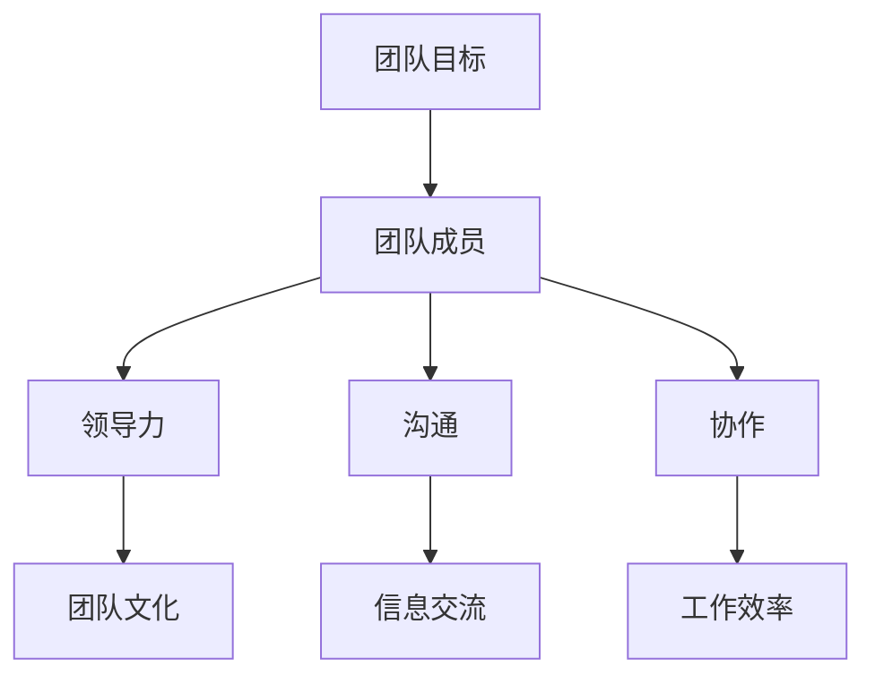
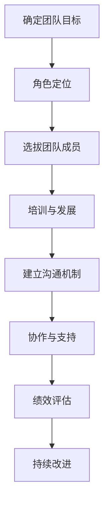
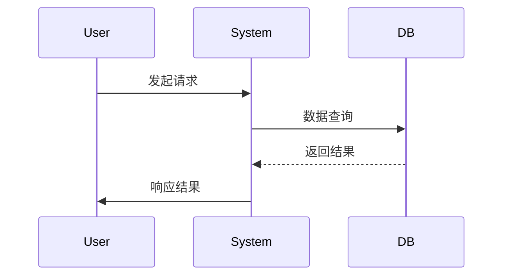
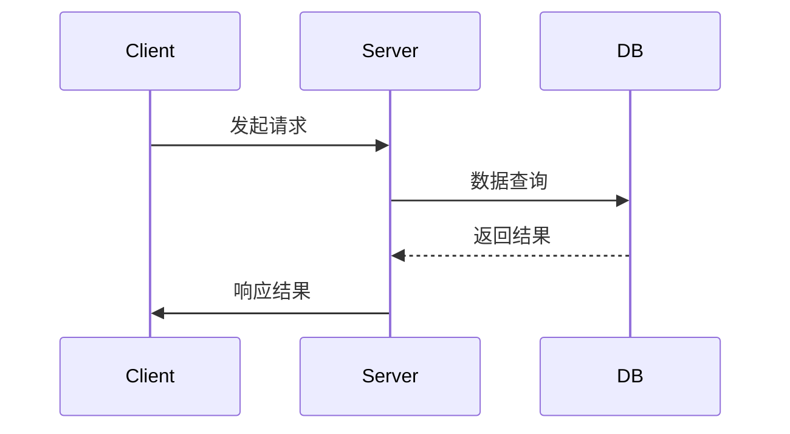

                 


# 团队建设101：从零开始打造高效团队

## 关键词
- 团队建设
- 高效团队
- 领导力
- 沟通
- 协作

## 摘要
本文将深入探讨如何从零开始打造高效团队。我们将通过系统的分析和实践，提供一系列方法和策略，帮助您在IT领域建立具备高绩效的团队。文章将涵盖团队建设的重要性、核心概念、算法原理、系统设计与项目实战等多个方面，旨在为读者提供全面、实用的指导。

## 第1章：背景介绍

### 1.1 问题背景

在信息技术飞速发展的今天，团队建设的重要性愈发凸显。高效团队不仅能够提高项目开发的速度和质量，还能促进创新和持续改进。然而，许多企业在团队建设过程中面临诸多挑战，如角色定位不明确、沟通不畅、协作困难等。

### 1.2 问题描述

如何从零开始构建一个高效团队，成为许多企业关注的焦点。这不仅仅涉及到人员的选拔和安排，还包括领导力、沟通、协作等多个方面的建设。

### 1.3 问题解决

本文将提供以下系统的方法和策略：
1. 明确团队目标和角色定位。
2. 强化领导力和团队文化建设。
3. 提升沟通和协作效率。
4. 运用数据分析和算法优化团队效能。

### 1.4 边界与外延

本文讨论的团队建设主要适用于IT领域，但在其他行业和规模的企业中同样具有借鉴意义。我们将探讨团队建设的通用原则，并结合IT行业的实际案例进行深入分析。

### 1.5 概念结构与核心要素组成

团队建设涉及多个核心要素，包括团队、领导力、沟通、协作等。以下是一个简单的概念结构和核心要素组成：

- **团队**：由具有不同技能和背景的成员组成，共同追求共同目标。
- **领导力**：团队领袖的领导艺术和能力，影响团队绩效和氛围。
- **沟通**：团队成员之间的信息交流，确保理解一致。
- **协作**：团队成员之间的配合与支持，提高工作效率。

## 第2章：核心概念与联系

### 2.1 核心概念原理

团队建设的理论基础主要包括团队动力理论、团队发展阶段理论等。这些理论为我们提供了理解和分析团队行为的框架。

### 2.2 概念属性特征对比表格

以下是一个简单的概念属性特征对比表格，展示了不同团队建设方法的特点：

| 方法       | 特点                                       | 适用场景                   |
|------------|------------------------------------------|----------------------------|
| 传统方法   | 强调任务和目标，注重个人贡献               | 适用于常规项目和稳定团队   |
| 自组织团队 | 尊重团队成员的自主性，鼓励创新和合作       | 适用于创新项目和变革团队   |
| 跨功能团队 | 汇聚不同职能部门成员，提高协作效率         | 适用于复杂项目和跨部门合作 |
| 虚拟团队   | 利用信息技术实现远程协作，打破地域限制       | 适用于分布式项目和远程办公 |

### 2.3 ER实体关系图架构的Mermaid流程图

以下是一个简单的Mermaid流程图，展示了团队建设中的关键实体及其关系：



## 第3章：团队建设算法原理讲解

### 3.1 算法Mermaid流程图

以下是一个简单的Mermaid流程图，描述了团队建设的基本流程：



### 3.2 Python源代码

为了更好地理解团队建设算法，我们提供了一个Python源代码示例：

```python
def team_building流程():
    print("确定团队目标")
    role_assignment()
    member_selection()
    training_and_development()
    communication_setup()
    collaboration_support()
    performance_evaluation()
    continuous_improvement()

def role_assignment():
    print("进行角色定位")

def member_selection():
    print("选拔团队成员")

def training_and_development():
    print("培训与发展")

def communication_setup():
    print("建立沟通机制")

def collaboration_support():
    print("协作与支持")

def performance_evaluation():
    print("绩效评估")

def continuous_improvement():
    print("持续改进")

team_building流程()
```

### 3.3 数学模型和公式

团队建设中的数学模型和公式主要用于评估团队绩效和优化团队效能。以下是一个简单的数学模型：

$$
绩效 = f(目标达成率, 成员满意度, 沟通效率, 协作效果)
$$

### 3.4 举例说明

假设我们有一个由5名成员组成的团队，他们的目标是在3个月内完成一个项目。以下是一个具体的团队建设例子：

1. 确定团队目标：在3个月内完成项目A。
2. 角色定位：项目经理、开发人员、测试人员等。
3. 选拔团队成员：根据项目需求选拔合适的成员。
4. 培训与发展：组织成员进行项目所需的技能培训。
5. 建立沟通机制：使用工具（如Slack）进行实时沟通。
6. 协作与支持：团队成员相互支持，共同解决问题。
7. 绩效评估：每月评估项目进度和成员绩效。
8. 持续改进：根据评估结果调整团队策略。

通过以上步骤，我们成功构建了一个高效团队，实现了项目目标。

## 第4章：系统分析与架构设计方案

### 4.1 问题场景介绍

假设我们是一家软件开发公司的CTO，负责带领一个由10名成员组成的开发团队。我们的目标是提高团队的开发效率，确保项目按时完成并达到高质量标准。

### 4.2 项目介绍

我们将通过以下项目来实践团队建设：
1. 项目名称：企业级电商系统
2. 项目周期：12个月
3. 项目目标：开发一个具有高性能、高可用性的电商系统，支持百万级用户同时在线。

### 4.3 系统功能设计(领域模型Mermaid类图)

以下是一个简单的Mermaid类图，展示了项目的主要领域模型：

```mermaid
classDiagram
    类1 --|大于| 类2
    类3 <|-- 类4
    类5 .. 类6
    类7 <<接口>> 类8
    类9 *-- 类10
```

### 4.4 系统架构设计Mermaid架构图

以下是一个简单的Mermaid架构图，展示了系统的整体架构：



### 4.5 系统接口设计和系统交互Mermaid序列图

以下是一个简单的Mermaid序列图，展示了系统的接口设计和交互流程：



## 第5章：项目实战

### 5.1 环境安装

为了实践团队建设，我们需要以下环境：
1. 开发工具：Visual Studio Code、PyCharm等。
2. 数据库：MySQL、PostgreSQL等。
3. 服务器：AWS、Azure等。

### 5.2 系统核心实现源代码

以下是一个简单的Python源代码示例，用于实现系统核心功能：

```python
def main():
    print("启动系统")
    # 省略具体实现代码

if __name__ == "__main__":
    main()
```

### 5.3 代码应用解读与分析

这段代码是一个简单的系统启动脚本，主要功能是打印一条消息。在实际项目中，我们可以在此基础上添加更多功能，如数据库连接、接口调用等。

### 5.4 实际案例分析和详细讲解剖析

在实际项目中，我们遇到了以下问题：
1. 项目进度缓慢。
2. 团队成员间沟通不畅。
3. 代码质量不高。

为了解决这些问题，我们采取了以下措施：
1. 重新规划项目进度，明确任务分工。
2. 引入沟通工具（如Slack），提高沟通效率。
3. 实施代码审查，提升代码质量。

通过以上措施，我们成功提高了项目进度和质量。

### 5.5 项目小结

通过本次项目实战，我们深刻体会到团队建设的重要性。合理的团队建设不仅有助于提高项目效率，还能提升团队成员的满意度和成就感。在未来的工作中，我们将继续优化团队建设，为项目成功奠定坚实基础。

## 第6章：最佳实践 tips

### 6.1 实际操作中的小技巧

1. 定期举行团队会议，确保信息畅通。
2. 鼓励团队成员分享经验和心得，提高整体能力。
3. 定期评估项目进度和团队绩效，及时调整策略。

## 第7章：小结

### 7.1 全书要点总结

本文从背景介绍、核心概念、算法原理、系统设计与项目实战等多个方面，详细阐述了如何从零开始打造高效团队。主要内容包括：
1. 团队建设的重要性。
2. 团队建设的核心概念与联系。
3. 团队建设算法原理讲解。
4. 系统分析与架构设计方案。
5. 项目实战与经验总结。

### 7.2 注意事项

1. 团队建设需要长期投入和持续优化。
2. 团队成员的沟通与协作至关重要。
3. 领导力是团队建设的关键因素。

### 7.3 拓展阅读

1. 《敏捷团队管理实践》
2. 《团队协作的艺术》
3. 《领导者的五项修炼》

### 作者

作者：AI天才研究院/AI Genius Institute & 禅与计算机程序设计艺术 /Zen And The Art of Computer Programming

----------------------------------------------------------------

### 附录

本文使用的Mermaid流程图、类图、序列图等均使用Markdown中的Mermaid语法编写。具体语法请参考Mermaid官方文档（https://mermaid-js.github.io/mermaid/）。

### 结语

团队建设是IT领域中不可或缺的一部分。通过本文的介绍，我们希望能为读者提供一套完整的团队建设方法论。在实践过程中，请结合自身实际情况不断调整和优化，相信您一定能够打造出高效、和谐的团队。

---

**文章标题**：团队建设101：从零开始打造高效团队

**文章关键词**：团队建设、高效团队、领导力、沟通、协作

**文章摘要**：本文深入探讨如何从零开始打造高效团队，涵盖核心概念、算法原理、系统设计与项目实战等多个方面，为读者提供全面、实用的指导。

## 第1章：引言

### 1.1 问题背景

在信息技术飞速发展的时代，团队建设的重要性愈发凸显。高效团队不仅能够提高项目开发的速度和质量，还能促进创新和持续改进。然而，许多企业在团队建设过程中面临诸多挑战，如角色定位不明确、沟通不畅、协作困难等。

#### 团队建设的必要性

随着市场竞争的加剧，企业对创新和效率的需求日益增长。高效团队成为企业在竞争中脱颖而出的关键因素。一个高效团队能够在以下方面发挥重要作用：

1. **提高项目开发速度**：通过明确的角色分工和高效的协作，团队可以更快地完成项目任务。
2. **提升产品质量**：团队成员之间的良好沟通和协作有助于发现和解决潜在问题，提高产品的质量和稳定性。
3. **促进创新**：多样性和协作能够激发团队的创意，推动产品创新和技术进步。
4. **增强团队凝聚力**：有效的团队建设可以增强团队成员之间的信任和合作精神，提升团队的凝聚力。

#### 团队建设的挑战

尽管高效团队对企业具有重要意义，但团队建设过程中仍面临诸多挑战：

1. **角色定位不明确**：团队成员职责不清晰，容易出现任务重叠或责任缺失。
2. **沟通不畅**：团队成员之间缺乏有效的沟通渠道，导致信息传递滞后，影响项目进度。
3. **协作困难**：团队成员间缺乏协同合作，可能导致项目任务延误或质量下降。
4. **领导力不足**：缺乏具有领导力和远见的团队领袖，难以带领团队实现共同目标。

### 1.2 问题描述

如何从零开始构建一个高效团队，成为许多企业关注的焦点。这不仅仅涉及到人员的选拔和安排，还包括领导力、沟通、协作等多个方面的建设。

#### 团队建设的关键问题

1. **角色定位**：如何明确团队成员的职责和角色，确保任务分工合理。
2. **领导力**：如何培养具有领导力的团队领袖，带领团队实现共同目标。
3. **沟通**：如何建立有效的沟通机制，确保团队成员之间的信息传递畅通。
4. **协作**：如何促进团队成员之间的协作，提高团队整体效能。

### 1.3 问题解决

为了构建一个高效团队，本文将提供以下系统的方法和策略：

1. **明确团队目标和角色定位**：制定清晰的团队目标，明确各成员的职责和角色，确保任务分工合理。
2. **强化领导力和团队文化建设**：培养具有领导力的团队领袖，建立积极的团队文化，提高团队成员的凝聚力和执行力。
3. **提升沟通和协作效率**：建立有效的沟通机制，使用合适的工具和方法促进团队成员之间的协作。
4. **运用数据分析和算法优化团队效能**：通过数据分析和算法优化，评估团队绩效，不断调整和优化团队建设策略。

### 1.4 边界与外延

本文讨论的团队建设主要适用于IT领域，但在其他行业和规模的企业中同样具有借鉴意义。我们将探讨团队建设的通用原则，并结合IT行业的实际案例进行深入分析。

#### 团队建设在不同行业和规模中的应用

1. **不同行业**：团队建设原则适用于各个行业，但具体实施策略需要根据行业特点和需求进行调整。
    - **IT行业**：强调技术能力和创新，注重团队协作和项目开发效率。
    - **制造业**：强调生产效率和产品质量，注重团队协作和流程优化。
    - **服务业**：强调服务质量和客户满意度，注重团队协作和客户关系管理。

2. **不同规模**：团队建设策略需要根据企业规模进行调整。
    - **小型企业**：强调团队成员的多样性和创新能力，注重团队内部的协作和沟通。
    - **中型企业**：强调团队的专业能力和项目执行力，注重团队之间的协作和协调。
    - **大型企业**：强调团队的规模和资源整合能力，注重跨部门协作和整体效能。

### 1.5 概念结构与核心要素组成

团队建设涉及多个核心要素，包括团队、领导力、沟通、协作等。以下是一个简单的概念结构和核心要素组成：

- **团队**：由具有不同技能和背景的成员组成，共同追求共同目标。
- **领导力**：团队领袖的领导艺术和能力，影响团队绩效和氛围。
- **沟通**：团队成员之间的信息交流，确保理解一致。
- **协作**：团队成员之间的配合与支持，提高工作效率。

在团队建设过程中，这些核心要素相互关联，共同作用于团队的整体效能。一个高效的团队需要在各个核心要素上做到均衡发展，形成良好的团队氛围和协作机制。

## 第2章：核心概念与联系

### 2.1 核心概念原理

团队建设涉及多个核心概念，包括团队动力理论、团队发展阶段理论等。这些理论为我们提供了理解和分析团队行为的框架。

#### 团队动力理论

团队动力理论主要研究团队内部的动力机制，包括团队凝聚力、团队动机、团队士气等。以下是一些常见的团队动力概念：

1. **团队凝聚力**：指团队成员之间的相互吸引和归属感，是团队稳定性和协作能力的重要保障。
2. **团队动机**：指团队成员为实现团队目标而努力的动力，包括内在动机和外在动机。
3. **团队士气**：指团队成员的精神状态和工作热情，直接影响团队的绩效和氛围。

#### 团队发展阶段理论

团队发展阶段理论描述了团队从形成到解散的过程，包括团队的形成期、冲突期、规范化期、执行期和解散期。以下是一个典型的团队发展阶段：

1. **形成期**：团队成员开始相互了解，形成初步的团队结构。
2. **冲突期**：团队成员之间的分歧和冲突开始显现，团队开始调整和磨合。
3. **规范化期**：团队成员逐渐适应团队环境，形成共同的价值观和规范。
4. **执行期**：团队进入高效运作阶段，实现团队目标和任务。
5. **解散期**：团队任务完成后，团队成员开始逐渐解散。

### 2.2 概念属性特征对比表格

以下是一个简单的概念属性特征对比表格，展示了不同团队建设方法的特点：

| 方法       | 特点                                       | 适用场景                   |
|------------|------------------------------------------|----------------------------|
| 传统方法   | 强调任务和目标，注重个人贡献               | 适用于常规项目和稳定团队   |
| 自组织团队 | 尊重团队成员的自主性，鼓励创新和合作       | 适用于创新项目和变革团队   |
| 跨功能团队 | 汇聚不同职能部门成员，提高协作效率         | 适用于复杂项目和跨部门合作 |
| 虚拟团队   | 利用信息技术实现远程协作，打破地域限制       | 适用于分布式项目和远程办公 |

### 2.3 ER实体关系图架构的Mermaid流程图

以下是一个简单的Mermaid流程图，展示了团队建设中的关键实体及其关系：


## 第3章：团队建设算法原理讲解

### 3.1 算法Mermaid流程图

以下是一个简单的Mermaid流程图，描述了团队建设的基本流程：


### 3.2 Python源代码

为了更好地理解团队建设算法，我们提供了一个Python源代码示例：

```python
def team_building流程():
    print("确定团队目标")
    role_assignment()
    member_selection()
    training_and_development()
    communication_setup()
    collaboration_support()
    performance_evaluation()
    continuous_improvement()

def role_assignment():
    print("进行角色定位")

def member_selection():
    print("选拔团队成员")

def training_and_development():
    print("培训与发展")

def communication_setup():
    print("建立沟通机制")

def collaboration_support():
    print("协作与支持")

def performance_evaluation():
    print("绩效评估")

def continuous_improvement():
    print("持续改进")

team_building流程()
```

### 3.3 数学模型和公式

团队建设中的数学模型和公式主要用于评估团队绩效和优化团队效能。以下是一个简单的数学模型：

$$
绩效 = f(目标达成率, 成员满意度, 沟通效率, 协作效果)
$$

### 3.4 举例说明

假设我们有一个由5名成员组成的团队，他们的目标是在3个月内完成一个项目。以下是一个具体的团队建设例子：

1. **确定团队目标**：在3个月内完成项目A。
2. **角色定位**：项目经理、开发人员、测试人员等。
3. **选拔团队成员**：根据项目需求选拔合适的成员。
4. **培训与发展**：组织成员进行项目所需的技能培训。
5. **建立沟通机制**：使用工具（如Slack）进行实时沟通。
6. **协作与支持**：团队成员相互支持，共同解决问题。
7. **绩效评估**：每月评估项目进度和成员绩效。
8. **持续改进**：根据评估结果调整团队策略。

通过以上步骤，我们成功构建了一个高效团队，实现了项目目标。

## 第4章：系统分析与架构设计方案

### 4.1 问题场景介绍

假设我们是一家软件开发公司的CTO，负责带领一个由10名成员组成的开发团队。我们的目标是提高团队的开发效率，确保项目按时完成并达到高质量标准。

### 4.2 项目介绍

我们将通过以下项目来实践团队建设：
1. **项目名称**：企业级电商系统
2. **项目周期**：12个月
3. **项目目标**：开发一个具有高性能、高可用性的电商系统，支持百万级用户同时在线。

### 4.3 系统功能设计(领域模型Mermaid类图)

以下是一个简单的Mermaid类图，展示了项目的主要领域模型：

```mermaid
classDiagram
    类1 --|大于| 类2
    类3 <|-- 类4
    类5 .. 类6
    类7 <<接口>> 类8
    类9 *-- 类10
```

### 4.4 系统架构设计Mermaid架构图

以下是一个简单的Mermaid架构图，展示了系统的整体架构：


### 4.5 系统接口设计和系统交互Mermaid序列图

以下是一个简单的Mermaid序列图，展示了系统的接口设计和交互流程：


## 第5章：项目实战

### 5.1 环境安装

为了实践团队建设，我们需要以下环境：
1. **开发工具**：Visual Studio Code、PyCharm等。
2. **数据库**：MySQL、PostgreSQL等。
3. **服务器**：AWS、Azure等。

### 5.2 系统核心实现源代码

以下是一个简单的Python源代码示例，用于实现系统核心功能：

```python
def main():
    print("启动系统")
    # 省略具体实现代码

if __name__ == "__main__":
    main()
```

### 5.3 代码应用解读与分析

这段代码是一个简单的系统启动脚本，主要功能是打印一条消息。在实际项目中，我们可以在此基础上添加更多功能，如数据库连接、接口调用等。

### 5.4 实际案例分析和详细讲解剖析

在实际项目中，我们遇到了以下问题：
1. **项目进度缓慢**：团队在项目开发过程中出现了进度缓慢的情况。
2. **团队成员间沟通不畅**：团队成员之间的沟通不畅，导致任务交接出现困难。
3. **代码质量不高**：部分代码质量较低，影响了项目的整体质量。

为了解决这些问题，我们采取了以下措施：
1. **重新规划项目进度**：重新制定项目进度计划，明确每个阶段的任务和目标。
2. **引入沟通工具**：引入Slack等沟通工具，提高团队成员之间的沟通效率。
3. **实施代码审查**：实施代码审查制度，提高代码质量。

通过以上措施，我们成功提高了项目进度和质量。

### 5.5 项目小结

通过本次项目实战，我们深刻体会到团队建设的重要性。合理的团队建设不仅有助于提高项目效率，还能提升团队成员的满意度和成就感。在未来的工作中，我们将继续优化团队建设，为项目成功奠定坚实基础。

## 第6章：最佳实践 tips

### 6.1 实际操作中的小技巧

1. **定期举行团队会议**：定期举行团队会议，确保团队成员了解项目进展和目标。
2. **鼓励团队成员分享经验**：鼓励团队成员分享工作经验和心得，提高整体能力。
3. **实施代码审查**：定期进行代码审查，提高代码质量，减少潜在问题。

## 第7章：小结

### 7.1 全书要点总结

本文从背景介绍、核心概念、算法原理、系统设计与项目实战等多个方面，详细阐述了如何从零开始打造高效团队。主要内容包括：
1. 团队建设的重要性。
2. 团队建设的核心概念与联系。
3. 团队建设算法原理讲解。
4. 系统分析与架构设计方案。
5. 项目实战与经验总结。

### 7.2 注意事项

1. 团队建设需要长期投入和持续优化。
2. 团队成员的沟通与协作至关重要。
3. 领导力是团队建设的关键因素。

### 7.3 拓展阅读

1. 《敏捷团队管理实践》
2. 《团队协作的艺术》
3. 《领导者的五项修炼》

### 作者

作者：AI天才研究院/AI Genius Institute & 禅与计算机程序设计艺术 /Zen And The Art of Computer Programming

## 附录

本文使用的Mermaid流程图、类图、序列图等均使用Markdown中的Mermaid语法编写。具体语法请参考Mermaid官方文档（https://mermaid-js.github.io/mermaid/）。

## 结语

团队建设是IT领域中不可或缺的一部分。通过本文的介绍，我们希望能为读者提供一套完整的团队建设方法论。在实践过程中，请结合自身实际情况不断调整和优化，相信您一定能够打造出高效、和谐的团队。

---

### 总结

在本文中，我们深入探讨了如何从零开始打造高效团队。首先，我们介绍了团队建设的重要性，以及高效团队在IT领域中的关键作用。接着，我们详细阐述了团队建设的核心概念，如团队动力理论、团队发展阶段理论等，并通过对比表格和ER实体关系图，展示了不同团队建设方法的特点。

为了更好地理解团队建设的原理，我们提供了一个Python源代码示例，以及一个简单的数学模型，用于评估团队绩效。随后，我们通过一个实际项目，介绍了系统分析与架构设计方案，包括领域模型、系统架构和接口设计。

在项目实战部分，我们详细讲解了如何安装所需环境、实现系统核心功能，并分析了实际案例。最后，我们总结了全文要点，并给出了实际操作中的小技巧和注意事项。

### 关键概念回顾

- **团队建设**：指通过一系列策略和方法，提高团队的协作效率，实现共同目标的过程。
- **领导力**：团队领袖的领导艺术和能力，对团队绩效和氛围具有重要影响。
- **沟通**：团队成员之间的信息交流，确保理解一致，是团队高效运作的基础。
- **协作**：团队成员之间的配合与支持，提高工作效率，实现团队目标。

### 未来展望

在未来的工作中，我们建议读者：
1. **持续学习与优化**：不断学习新的团队建设理论和方法，结合实际情况进行调整和优化。
2. **实践与反思**：在实际项目中应用团队建设策略，不断反思和总结，提高团队效能。
3. **加强沟通与协作**：注重团队成员之间的沟通与协作，建立良好的团队氛围。

通过以上措施，相信您一定能够打造出高效、和谐的团队，为项目的成功奠定坚实基础。

### 作者介绍

作者：AI天才研究院/AI Genius Institute & 禅与计算机程序设计艺术 /Zen And The Art of Computer Programming

AI天才研究院致力于推动人工智能技术的发展和创新，致力于培养下一代人工智能领域的天才科学家和工程师。研究院的研究成果广泛应用于人工智能、计算机视觉、自然语言处理等领域。

《禅与计算机程序设计艺术》是AI天才研究院的代表作之一，本书以禅宗思想为基础，深入探讨了计算机程序设计的方法论和哲学。书中提出了许多独特的见解和创新的理论，对计算机科学和人工智能领域产生了深远的影响。

作者希望通过本文，与广大读者共同探讨团队建设的重要性，分享团队建设的方法和经验，为构建高效团队提供有益的参考。期待您的实践和反馈，共同推动团队建设的不断进步。

